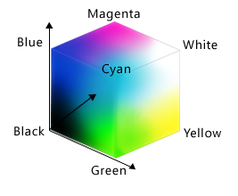

> ## Learning Objectives {.objectives}
>
> *   Create a simple "image" made out of colored blocks.
> *   Explain how the RGB model represents colors.
> *   Explain the similarities and differences between tuples and lists.
> *   Write conditional statements including `if`, `elif`, and `else` branches.
> *   Correctly evaluate expressions containing `and` and `or`.
> *   Correctly write and interpret code containing nested loops and conditionals.
> *   Explain the advantages of putting frequently-modified code in a function.

Our previous lessons have shown us how to manipulate data,
define our own functions,
and repeat things.
However,
the programs we have written so far always do the same things,
regardless of what data they're given.
We want programs to make choices based on the values they are manipulating.
To help us see what decisions they're making,
we'll start by looking at how computers manipulate images.

## Image Grids

Let's start by creating some simple heat maps of our own
using a library called `ipythonblocks`.
The first step is to create our own "image":

~~~ {.python}
from ipythonblocks import ImageGrid
~~~

Unlike the `import` statements we have seen earlier,
this one doesn't load the entire `ipythonblocks` library.
Instead,
it just loads `ImageGrid` from that library,
since that's the only thing we need (for now).

Once we have `ImageGrid` loaded,
we can use it to create a very simple grid of colored cells:

~~~ {.python}
grid = ImageGrid(5, 3)
grid.show()
~~~

Just like a NumPy array,
an `ImageGrid` has some properties that hold information about it:

~~~ {.python}
print 'grid width:', grid.width
print 'grid height:', grid.height
print 'grid lines on:', grid.lines_on
~~~
~~~ {.output}
grid width: 5
grid height: 3
grid lines on: True
~~~

The obvious thing to do with a grid like this is color in its cells,
but in order to do that,
we need to know how computers represent color.
The most common schemes are **RGB**,
which is short for "red, green, blue".
RGB is an **additive color model**:
every shade is some combination of red, green, and blue intensities.
We can think of these three values as being the axes in a cube:

\ 

An RGB color is an example of a multi-part value:
like a Cartesian coordinate,
it is one thing with several parts.
We can represent such a value in Python using a **tuple**,
which we write using parentheses instead of the square brackets used for a list:

~~~ {.python}
position = (12.3, 45.6)
print 'position is:', position
color = (10, 20, 30)
print 'color is:', color
~~~

~~~ {.output}
position is: (12.3, 45.6)
color is: (10, 20, 30)
~~~

We can select elements from tuples using indexing,
just as we do with lists and arrays:

~~~ {.python}
print 'first element of color is:', color[0]
~~~

~~~ {.output}
first element of color is: 10
~~~

Unlike lists and arrays,
though,
tuples cannot be changed after they are created --- in technical terms,
they are **immutable**:

~~~ {.python}
color[0] = 40
print 'first element of color after change:', color[0]
~~~
~~~ {.error}
---------------------------------------------------------------------------
TypeError                                 Traceback (most recent call last)
<ipython-input-11-9c3dd30a4e52> in <module>()
----> 1 color[0] = 40
      2 print 'first element of color after change:', color[0]

TypeError: 'tuple' object does not support item assignment
~~~

If a tuple represents an RGB color,
its red, green, and blue components can take on values between 0 and 255.
The upper bound may seem odd,
but it's the largest number that can be represented in an 8-bit byte
(i.e., 28-1).
This makes it easy for computers to manipulate colors,
while providing fine enough gradations to fool most human eyes,
most of the time.

Let's see what a few RGB colors actually look like:

~~~ {.python}
row = ImageGrid(8, 1)
row[0, 0] = (0, 0, 0)   # no color => black
row[1, 0] = (255, 255, 255) # all colors => white
row[2, 0] = (255, 0, 0) # all red
row[3, 0] = (0, 255, 0) # all green
row[4, 0] = (0, 0, 255) # all blue
row[5, 0] = (255, 255, 0) # red and green
row[6, 0] = (255, 0, 255) # red and blue
row[7, 0] = (0, 255, 255) # green and blue
row.show()
~~~

Simple color values like `(0,255,0)` are easy enough to decipher with a bit of practice,
but what color is `(214,90,127)`?
To help us,
`ipythonblocks` provides a function called `show_color`:

~~~ {.python}
from ipythonblocks import show_color
show_color(214, 90, 127)
~~~

FIXME: color image

It also provides a table of standard colors:

~~~ {.python}
from ipythonblocks import colors
c = ImageGrid(3, 2)
c[0, 0] = colors['Fuchsia']
c[0, 1] = colors['Salmon']
c[1, 0] = colors['Orchid']
c[1, 1] = colors['Lavender']
c[2, 0] = colors['LimeGreen']
c[2, 1] = colors['HotPink']
c.show()
~~~

## Conditionals

The other thing we need in order to create a heat map of our own
is a way to pick a color based on a data value.
The tool Python gives us for doing this is called a **conditional statement**,
and looks like this:

~~~ {.python}
num = 37
if num > 100:
    print 'greater'
else:
    print 'not greater'
print 'done'
~~~
~~~ {.output}
not greater
done

~~~

The second line of this code uses the keyword `if` to tell Python that we want to make a choice.
If the test that follows it is true,
the body of the `if`
(i.e., the lines indented underneath it) are executed.
If the test is false,
the body of the `else` is executed instead.
Only one or the other is ever executed:

\ 

Conditional statements don't have to include an `else`.
If there isn't one,
Python simply does nothing if the test is false:

~~~ {.python}
num = 53
print 'before conditional...'
if num > 100:
    print '53 is greater than 100'
print '...after conditional'
~~~
~~~ {.output}
before conditional...
...after conditional
~~~

We can also chain several tests together using `elif`,
which is short for "else if".
This makes it simple to write a function that returns the sign of a number:

~~~ {.python}
def sign(num):
    if num > 0:
        return 1
    elif num == 0:
        return 0
    else:
        return -1

print 'sign of -3:', sign(-3)
~~~
~~~ {.output}
sign of -3: -1
~~~

One important thing to notice in the code above is that we use a double equals sign `==` to test for equality
rather than a single equals sign
because the latter is used to mean assignment.
This convention was inherited from C,
and while many other programming languages work the same way,
it does take a bit of getting used to...

We can also combine tests using `and` and `or`.
`and` is only true if both parts are true:

~~~ {.python}
if (1 > 0) and (-1 > 0):
    print 'both parts are true'
else:
    print 'one part is not true'
~~~
~~~ {.output}
one part is not true
~~~

while `or` is true if either part is true:

~~~ {.python}
if (1 < 0) or ('left' < 'right'):
    print 'at least one test is true'
~~~
~~~ {.output}
at least one test is true
~~~

In this case,
"either" means "either or both", not "either one or the other but not both".

## Nesting

Another thing to realize is that `if` statements can be combined with loops
just as easily as they can be combined with functions.
For example,
if we want to sum the positive numbers in a list,
we can write this:

~~~ {.python}
numbers = [-5, 3, 2, -1, 9, 6]
total = 0
for n in numbers:
    if n >= 0:
        total = total + n
print 'sum of positive values:', total
~~~
~~~ {.output}
sum of positive values: 20

~~~

We could equally well calculate the positive and negative sums in a single loop:

~~~ {.python}
pos_total = 0
neg_total = 0
for n in numbers:
    if n >= 0:
        pos_total = pos_total + n
    else:
        neg_total = neg_total + n
print 'negative and positive sums are:', neg_total, pos_total
~~~
~~~ {.output}
negative and positive sums are: -6 20
~~~

We can even put one loop inside another:

~~~ {.python}
for consonant in 'bcd':
    for vowel in 'ae':
        print consonant + vowel
~~~
~~~ {.output}
ba
be
ca
ce
da
de
~~~

As the diagram below shows,
the **inner loop** runs from start to finish
each time the **outer loop** runs once:

\ 

We can combine nesting and conditionals to create patterns in an image:

~~~ {.python}
square = ImageGrid(5, 5)
for x in range(square.width):
    for y in range(square.height):
        if x < y:
            square[x, y] = colors['Fuchsia']
        elif x == y:
            square[x, y] = colors['Olive']
        else:
            square[x, y] = colors['SlateGray']
square.show()
~~~

This is our first hand-made data visualization:
the colors show where `x` is less than, equal to, or greater than `y`.

## Creating a Heat Map

The last step is to turn our data into something we can see.
As in previous lessons,
the first step is to get the data into memory:

~~~ {.python}
import numpy as np
data = np.loadtxt(fname='inflammation-01.csv', delimiter=',')
print 'data shape:', data.shape
~~~
~~~ {.output}
data shape: (60, 40)
~~~

The second is to create an image grid that is the same size as the data:

~~~ {.python}
width, height = data.shape
heatmap = ImageGrid(width, height)
~~~

(The first line of the code above takes advantage of a neat trick:
we can unpack the values in a tuple by assigning it to
as many variables as it has entries.)

The third step is to decide *how* we are going to color the cells in the heat map.
To keep things simple,
we will use red, green, and blue as our colors,
and compare data values to the data set's mean.
Here's the code:

~~~ {.python}
for x in range(width):
    for y in range(height):
        if data[x, y] < data.mean():
            heatmap[x, y] = colors['Red']
        elif data[x, y] == data.mean():
            heatmap[x, y] = colors['Green']
        else:
            heatmap[x, y] = colors['Blue']
heatmap.show()
~~~

This may be what we asked for,
but both the image and the code are hideous:

1.  It's too large for us to view the whole thing at once on a small laptop screen.
2.  Our first heatmap had time along the X axis; this seems to have time along the Y axis.
3.  Red against blue is pretty hard on the eyes.
4.  The heatmap only shows two colors because none of the (integer) measurements has exactly the same value as the (fractional) mean.
5.  We are calculating the mean of `data` either once or twice each time we go through the loop.
    That means that on a 40&times;60 data set, we are performing the same calculation 2400 times.

Here's how we can improve it:

1.   We can give `ImageGrid` an optional parameter `block_size` to set the size of each block.
2.   We can transpose our data before creating the grid.
3.   We can pick better colors (I'm personally fond of orchid, fuchsia, and hot pink).
4.   Instead of checking if values are exactly equal to the mean, we can see if they are close to it.
5.   We can calculate the mean once, before we start our loops, and use that value over and over.

Our modified code looks like this:

~~~ {.python}
flipped = data.transpose()
width, height = flipped.shape
heatmap = ImageGrid(width, height, block_size=5)
center = flipped.mean()
for x in range(width):
    for y in range(height):
        if flipped[x, y] < (0.8 * center):
            heatmap[x, y] = colors['Orchid']
        elif flipped[x, y] > (1.2 * center):
            heatmap[x, y] = colors['HotPink']
        else:
            heatmap[x, y] = colors['Fuchsia']
heatmap.show()
~~~

That's a bit better --- but now the contrast between the colors isn't great enough.
And there still aren't very many fuchsia cells:
we may want to widen the band around the mean that gets that color.

We could rewrite our loop a third time,
but the right thing to do is to put our code in a function
so that we can experiment with bands and colors more easily.

~~~ {.python}
def make_heatmap(values, low_color, mid_color, high_color, low_band, high_band, block_size):
    '''Make a 3-colored heatmap from a 2D array of data.'''
    width, height = values.shape
    result = ImageGrid(width, height, block_size=block_size)
    center = values.mean()
    for x in range(width):
        for y in range(height):
            if values[x, y] < low_band * center:
                result[x, y] = low_color
            elif values[x, y] > high_band * center:
                result[x, y] = high_color
            else:
                result[x, y] = mid_color
    return result
~~~

To test this function,
we'll run it with the settings we just used:

~~~ {.python}
h = make_heatmap(flipped, colors['Orchid'], colors['Fuchsia'], colors['HotPink'], 0.8, 1.2, 5)
h.show()
~~~

That seems right,
so let's widen the band and use more dramatic colors:

~~~ {.python}
h = make_heatmap(flipped, colors['Gray'], colors['YellowGreen'], colors['SpringGreen'], 0.5, 1.5, 5)
h.show()
~~~

We'll probably want to experiment a bit more before publishing,
but writing a function has made experimenting easy.
We can make it even easier by re-defining our function one more time
to give the parameters default values.
While we're at it,
let's put the low and high bands at the front,
since they're more likely to change than our color choices:

~~~ {.python}
def make_heatmap(values,
                 low_band=0.5, high_band=1.5,
                 low_color=colors['Gray'], mid_color=colors['YellowGreen'], high_color=colors['SpringGreen'],
                 block_size=5):
    '''Make a 3-colored heatmap from a 2D array of data.
    Default color scheme is gray to green.'''
    width, height = values.shape
    result = ImageGrid(width, height, block_size=block_size)
    center = values.mean()
    for x in range(width):
        for y in range(height):
            if values[x, y] < low_band * center:
                result[x, y] = low_color
            elif values[x, y] > high_band * center:
                result[x, y] = high_color
            else:
                result[x, y] = mid_color
    return result
~~~

Once default values are added,
the function's first line is too long to fit comfortably on our screen.
Rather than breaking it wherever it hits the right edge of the screen,
we have divided the parameters into logical groups to make it more readable.

Again,
our first test is to re-run it with the same values as before
(which we give it in a different order,
since we've changed the order of parameters):

~~~ {.python}
h = make_heatmap(flipped, 0.5, 1.5, colors['Gray'], colors['YellowGreen'], colors['SpringGreen'], 5)
h.show()
~~~

We can now leave out everything except the data being visualized,
or provide the data and the bands
and re-use the default colors and block size:

~~~ {.python}
h = make_heatmap(flipped, 0.4, 1.6)
h.show()
~~~

We can now explore our data with just a few keystrokes,
which means we can concentrate on our science
and not on our programming.

> ## Making a colorbar {.challenge}
> 
> Fill in the `____` in the code below to create a bar that changes color from dark blue to black.
> 
> ~~~ {.python}
> bar = ImageGrid(10, 1)
> for x in range(10):
>     bar[x, 0] = (0, 0, ____)
> bar.show()
> ~~~

> ## Why RGB? {.challenge}
> 
> Why do computers use red, green, and blue as their primary colors?

> ## What is truth? {.challenge}
> 
> `True` and `False` aren't the only values in Python that are true and false.
> In fact, *any* value can be used in an `if` or `elif`.
> After reading and running the code below,
> explain what the rule is for which values are considered true and which are considered false.
> (Note that if the body of a conditional is a single statement, we can write it on the same line as the `if`.)
>     
> ~~~ {.python}
> if '': print 'empty string is true'
> if 'word': print 'word is true'
> if []: print 'empty list is true'
> if [1, 2, 3]: print 'non-empty list is true'
> if 0: print 'zero is true'
> if 1: print 'one is true'
> ~~~

> ## Close enough {.challenge}
> 
> Write a function called `near` that returns `True` if its first parameter is within 10% of its second
> and `False` otherwise.
> Compare your implementation with your partner's:
> do you return the same answer for all possible pairs of numbers?

> ## Nested loops {.challenge}
>
> Will changing the nesting of the loops in the code above --- i.e.,
> wrapping the Y-axis loop around the X-axis loop --- change the final image?
> Why or why not?

> ## In-place operators {.challenge}
>
> Python (and most other languages in the C family) provides **in-place operators**
> that work like this:
>     
> ~~~ {.python}
> x = 1  # original value
> x += 1 # add one to x, assigning result back to x
> x *= 3 # multiply x by 3
> print x
> ~~~
> ~~~ {.output}
> 6
> ~~~
>     
> Rewrite the code that sums the positive and negative numbers in a list
> using in-place operators.
> Do you think the result is more or less readable than the original?

> ## Where to change data {.challenge}
>
> Why did we transpose our data outside our heat map function?
> Why not have the function perform the transpose?

> ## Design choice: return versus display {.challenge}
>
> Why does the heat map function return the grid rather than displaying it immediately?
> Do you think this is a good or bad design choice?

> ## Tuples and exchanges {.challenge}
>
> Explain what the overall effect of this code is:
> 
> ~~~ {.python}
> temp = left
> left = right
> right = temp
> ~~~
>     
> Compare it to:
>     
> ~~~ {.python}
> left, right = right, left
> ~~~
>     
> Do they always do the same thing?
> Which do you find easier to read?
