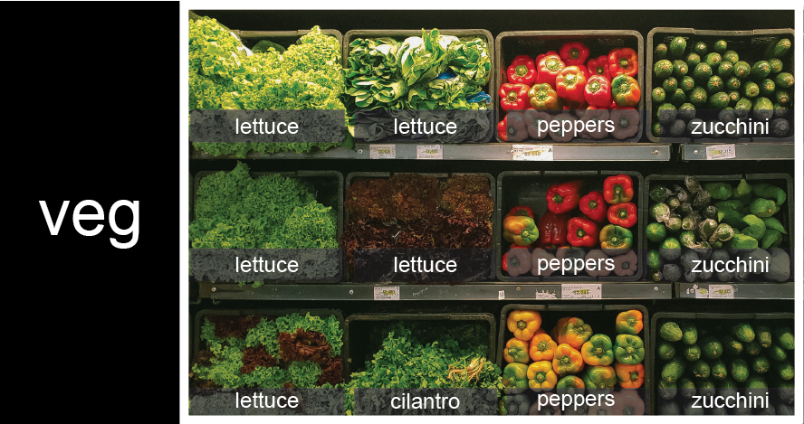

::::::::::::::::::::::::::::::::::::::: objectives

- Explain what a list is.
- Create and index lists of simple values.
- Change the values of individual elements
- Append values to an existing list
- Reorder and slice list elements
- Create and manipulate nested lists

::::::::::::::::::::::::::::::::::::::::::::::::::

:::::::::::::::::::::::::::::::::::::::: questions

- How can I store many values together?

::::::::::::::::::::::::::::::::::::::::::::::::::

In the previous episode, we analyzed a single file of clinical trial inflammation data. However,
after finding some peculiar and potentially suspicious trends in the trial data we ask
Dr. Maverick if they have performed any other clinical trials. Surprisingly, they say that they
have and provide us with 11 more CSV files for a further 11 clinical trials they have undertaken
since the initial trial.

Our goal now is to process all the inflammation data we have, which means that we still have
eleven more files to go!

The natural first step is to collect the names of all the files that we have to process. In Python,
a list is a way to store multiple values together. In this episode, we will learn how to store
multiple values in a list as well as how to work with lists.

## Python lists

Unlike NumPy arrays, lists are built into the language so we do not have to load a library
to use them.
We create a list by putting values inside square brackets and separating the values with commas:

```python
odds = [1, 3, 5, 7]
print('odds are:', odds)
```

```output
odds are: [1, 3, 5, 7]
```

We can access elements of a list using indices -- numbered positions of elements in the list.
These positions are numbered starting at 0, so the first element has an index of 0.

```python
print('first element:', odds[0])
print('last element:', odds[3])
print('"-1" element:', odds[-1])
```

```output
first element: 1
last element: 7
"-1" element: 7
```

Yes, we can use negative numbers as indices in Python. When we do so, the index `-1` gives us the
last element in the list, `-2` the second to last, and so on.
Because of this, `odds[3]` and `odds[-1]` point to the same element here.

There is one important difference between lists and strings:
we can change the values in a list,
but we cannot change individual characters in a string.
For example:

```python
names = ['Curie', 'Darwing', 'Turing']  # typo in Darwin's name
print('names is originally:', names)
names[1] = 'Darwin'  # correct the name
print('final value of names:', names)
```

```output
names is originally: ['Curie', 'Darwing', 'Turing']
final value of names: ['Curie', 'Darwin', 'Turing']
```

works, but:

```python
name = 'Darwin'
name[0] = 'd'
```

```error
---------------------------------------------------------------------------
TypeError                                 Traceback (most recent call last)
<ipython-input-8-220df48aeb2e> in <module>()
      1 name = 'Darwin'
----> 2 name[0] = 'd'

TypeError: 'str' object does not support item assignment
```

does not.

:::::::::::::::::::::::::::::::::::::::::  callout

## Ch-Ch-Ch-Ch-Changes

Data which can be modified in place is called [mutable](../learners/reference.md#mutable),
while data which cannot be modified is called
[immutable](../learners/reference.md#immutable).
Strings and numbers are immutable. This does not mean that variables with string or number values
are constants, but when we want to change the value of a string or number variable, we can only
replace the old value with a completely new value.

Lists and arrays, on the other hand, are mutable: we can modify them after they have been
created. We can change individual elements, append new elements, or reorder the whole list. For
some operations, like sorting, we can choose whether to use a function that modifies the data
in-place or a function that returns a modified copy and leaves the original unchanged.

Be careful when modifying data in-place. If two variables refer to the same list, and you modify
the list value, it will change for both variables!

```python
mild_salsa = ['peppers', 'onions', 'cilantro', 'tomatoes']
hot_salsa = mild_salsa        # <-- mild_salsa and hot_salsa point to the *same* list data in memory
hot_salsa[0] = 'hot peppers'
print('Ingredients in mild salsa:', mild_salsa)
print('Ingredients in hot salsa:', hot_salsa)
```

```output
Ingredients in mild salsa: ['hot peppers', 'onions', 'cilantro', 'tomatoes']
Ingredients in hot salsa: ['hot peppers', 'onions', 'cilantro', 'tomatoes']
```

If you want variables with mutable values to be independent, you
must make a copy of the value when you assign it.

```python
mild_salsa = ['peppers', 'onions', 'cilantro', 'tomatoes']
hot_salsa = list(mild_salsa)        # <-- makes a *copy* of the list
hot_salsa[0] = 'hot peppers'
print('Ingredients in mild salsa:', mild_salsa)
print('Ingredients in hot salsa:', hot_salsa)
```

```output
Ingredients in mild salsa: ['peppers', 'onions', 'cilantro', 'tomatoes']
Ingredients in hot salsa: ['hot peppers', 'onions', 'cilantro', 'tomatoes']
```

Because of pitfalls like this, code which modifies data in place can be more difficult to
understand. However, it is often far more efficient to modify a large data structure in place
than to create a modified copy for every small change. You should consider both of these aspects
when writing your code.


::::::::::::::::::::::::::::::::::::::::::::::::::

:::::::::::::::::::::::::::::::::::::::::  callout

## Nested Lists

Since a list can contain any Python variables, it can even contain other lists.

For example, you could represent the products on the shelves of a small grocery shop
as a nested list called `veg`:

{alt='veg is represented as a shelf full of produce. There are three rows of vegetableson the shelf, and each row contains three baskets of vegetables. We can labeleach basket according to the type of vegetable it contains, so the top rowcontains (from left to right) lettuce, lettuce, and peppers.'}

To store the contents of the shelf in a nested list, you write it this way:

```python
veg = [['lettuce', 'lettuce', 'peppers', 'zucchini'],
     ['lettuce', 'lettuce', 'peppers', 'zucchini'],
     ['lettuce', 'cilantro', 'peppers', 'zucchini']]
```

Here are some visual examples of how indexing a list of lists `veg` works. First,
you can reference each row on the shelf as a separate list. For example, `veg[2]`
represents the bottom row, which is a list of the baskets in that row.

{alt='veg is now shown as a list of three rows, with veg\[0\] representing the top row ofthree baskets, veg\[1\] representing the second row, and veg\[2\] representing the bottom row.'}

Index operations using the image would work like this:

```python
print(veg[2])
```

```output
['lettuce', 'cilantro', 'peppers', 'zucchini']
```

```python
print(veg[0])
```

```output
['lettuce', 'lettuce', 'peppers', 'zucchini']
```

To reference a specific basket on a specific shelf, you use two indexes. The first
index represents the row (from top to bottom) and the second index represents
the specific basket (from left to right).
{alt='veg is now shown as a two-dimensional grid, with each basket labeled according toits index in the nested list. The first index is the row number and the secondindex is the basket number, so veg\[1\]\[3\] represents the basket on the far rightside of the second row (basket 4 on row 2): zucchini'}

```python
print(veg[0][0])
```

```output
'lettuce'
```

```python
print(veg[1][2])
```

```output
'peppers'
```

::::::::::::::::::::::::::::::::::::::::::::::::::

:::::::::::::::::::::::::::::::::::::::::  callout

## Heterogeneous Lists

Lists in Python can contain elements of different types. Example:

```python
sample_ages = [10, 12.5, 'Unknown']
```

::::::::::::::::::::::::::::::::::::::::::::::::::

There are many ways to change the contents of lists besides assigning new values to
individual elements:

```python
odds.append(11)
print('odds after adding a value:', odds)
```

```output
odds after adding a value: [1, 3, 5, 7, 11]
```

```python
removed_element = odds.pop(0)
print('odds after removing the first element:', odds)
print('removed_element:', removed_element)
```

```output
odds after removing the first element: [3, 5, 7, 11]
removed_element: 1
```

```python
odds.reverse()
print('odds after reversing:', odds)
```

```output
odds after reversing: [11, 7, 5, 3]
```

While modifying in place, it is useful to remember that Python treats lists in a slightly
counter-intuitive way.

As we saw earlier, when we modified the `mild_salsa` list item in-place, if we make a list, (attempt to)
copy it and then modify this list, we can cause all sorts of trouble. This also applies to modifying
the list using the above functions:

```python
odds = [3, 5, 7]
primes = odds
primes.append(2)
print('primes:', primes)
print('odds:', odds)
```

```output
primes: [3, 5, 7, 2]
odds: [3, 5, 7, 2]
```

This is because Python stores a list in memory, and then can use multiple names to refer to the
same list. If all we want to do is copy a (simple) list, we can again use the `list` function, so we
do not modify a list we did not mean to:

```python
odds = [3, 5, 7]
primes = list(odds)
primes.append(2)
print('primes:', primes)
print('odds:', odds)
```

```output
primes: [3, 5, 7, 2]
odds: [3, 5, 7]
```

Subsets of lists and strings can be accessed by specifying ranges of values in brackets,
similar to how we accessed ranges of positions in a NumPy array.
This is commonly referred to as "slicing" the list/string.

```python
binomial_name = 'Drosophila melanogaster'
group = binomial_name[0:10]
print('group:', group)

species = binomial_name[11:23]
print('species:', species)

chromosomes = ['X', 'Y', '2', '3', '4']
autosomes = chromosomes[2:5]
print('autosomes:', autosomes)

last = chromosomes[-1]
print('last:', last)
```

```output
group: Drosophila
species: melanogaster
autosomes: ['2', '3', '4']
last: 4
```

:::::::::::::::::::::::::::::::::::::::  challenge

## Slicing From the End

Use slicing to access only the last four characters of a string or entries of a list.

```python
string_for_slicing = 'Observation date: 02-Feb-2013'
list_for_slicing = [['fluorine', 'F'],
                    ['chlorine', 'Cl'],
                    ['bromine', 'Br'],
                    ['iodine', 'I'],
                    ['astatine', 'At']]
```

```output
'2013'
[['chlorine', 'Cl'], ['bromine', 'Br'], ['iodine', 'I'], ['astatine', 'At']]
```

Would your solution work regardless of whether you knew beforehand
the length of the string or list
(e.g. if you wanted to apply the solution to a set of lists of different lengths)?
If not, try to change your approach to make it more robust.

Hint: Remember that indices can be negative as well as positive

:::::::::::::::  solution

## Solution

Use negative indices to count elements from the end of a container (such as list or string):

```python
string_for_slicing[-4:]
list_for_slicing[-4:]
```

:::::::::::::::::::::::::

::::::::::::::::::::::::::::::::::::::::::::::::::

:::::::::::::::::::::::::::::::::::::::  challenge

## Non-Continuous Slices

So far we've seen how to use slicing to take single blocks
of successive entries from a sequence.
But what if we want to take a subset of entries
that aren't next to each other in the sequence?

You can achieve this by providing a third argument
to the range within the brackets, called the *step size*.
The example below shows how you can take every third entry in a list:

```python
primes = [2, 3, 5, 7, 11, 13, 17, 19, 23, 29, 31, 37]
subset = primes[0:12:3]
print('subset', subset)
```

```output
subset [2, 7, 17, 29]
```

Notice that the slice taken begins with the first entry in the range,
followed by entries taken at equally-spaced intervals (the steps) thereafter.
If you wanted to begin the subset with the third entry,
you would need to specify that as the starting point of the sliced range:

```python
primes = [2, 3, 5, 7, 11, 13, 17, 19, 23, 29, 31, 37]
subset = primes[2:12:3]
print('subset', subset)
```

```output
subset [5, 13, 23, 37]
```

Use the step size argument to create a new string
that contains only every other character in the string
"In an octopus's garden in the shade". Start with
creating a variable to hold the string:

```python
beatles = "In an octopus's garden in the shade"
```

What slice of `beatles` will produce the
following output (i.e., the first character, third
character, and every other character through the end
of the string)?

```output
I notpssgre ntesae
```

:::::::::::::::  solution

## Solution

To obtain every other character you need to provide a slice with the step
size of 2:

```python
beatles[0:35:2]
```

You can also leave out the beginning and end of the slice to take the whole string
and provide only the step argument to go every second
element:

```python
beatles[::2]
```

:::::::::::::::::::::::::

::::::::::::::::::::::::::::::::::::::::::::::::::

If you want to take a slice from the beginning of a sequence, you can omit the first index in the
range:

```python
date = 'Monday 4 January 2016'
day = date[0:6]
print('Using 0 to begin range:', day)
day = date[:6]
print('Omitting beginning index:', day)
```

```output
Using 0 to begin range: Monday
Omitting beginning index: Monday
```

And similarly, you can omit the ending index in the range to take a slice to the very end of the
sequence:

```python
months = ['jan', 'feb', 'mar', 'apr', 'may', 'jun', 'jul', 'aug', 'sep', 'oct', 'nov', 'dec']
sond = months[8:12]
print('With known last position:', sond)
sond = months[8:len(months)]
print('Using len() to get last entry:', sond)
sond = months[8:]
print('Omitting ending index:', sond)
```

```output
With known last position: ['sep', 'oct', 'nov', 'dec']
Using len() to get last entry: ['sep', 'oct', 'nov', 'dec']
Omitting ending index: ['sep', 'oct', 'nov', 'dec']
```

:::::::::::::::::::::::::::::::::::::::  challenge

## Overloading

`+` usually means addition, but when used on strings or lists, it means "concatenate".
Given that, what do you think the multiplication operator `*` does on lists?
In particular, what will be the output of the following code?

```python
counts = [2, 4, 6, 8, 10]
repeats = counts * 2
print(repeats)
```

1. `[2, 4, 6, 8, 10, 2, 4, 6, 8, 10]`
2. `[4, 8, 12, 16, 20]`
3. `[[2, 4, 6, 8, 10], [2, 4, 6, 8, 10]]`
4. `[2, 4, 6, 8, 10, 4, 8, 12, 16, 20]`

The technical term for this is *operator overloading*:
a single operator, like `+` or `*`,
can do different things depending on what it's applied to.

:::::::::::::::  solution

## Solution

The multiplication operator `*` used on a list replicates elements of the list and concatenates
them together:

```output
[2, 4, 6, 8, 10, 2, 4, 6, 8, 10]
```

It's equivalent to:

```python
counts + counts
```

:::::::::::::::::::::::::

::::::::::::::::::::::::::::::::::::::::::::::::::


:::::::::::::::::::::::::::::::::::::::: keypoints

- `[value1, value2, value3, ...]` creates a list.
- Lists can contain any Python object, including lists (i.e., list of lists).
- Lists are indexed and sliced with square brackets (e.g., `list[0]` and `list[2:9]`), in the same way as strings and arrays.
- Lists are mutable (i.e., their values can be changed in place).
- Strings are immutable (i.e., the characters in them cannot be changed).

::::::::::::::::::::::::::::::::::::::::::::::::::


