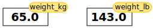

::::::::::::::::::::::::::::::::::::::: objectives

- Assign values to variables.

::::::::::::::::::::::::::::::::::::::::::::::::::

:::::::::::::::::::::::::::::::::::::::: questions

- What basic data types can I work with in Python?
- How can I create a new variable in Python?
- How do I use a function?
- Can I change the value associated with a variable after I create it?
- How can I get help while learning to program?

::::::::::::::::::::::::::::::::::::::::::::::::::

## Variables

Any Python interpreter can be used as a calculator:

```python
3 + 5 * 4
```

```output
23
```

This is great but not very interesting.
To do anything useful with data, we need to assign its value to a *variable*.
In Python, we can [assign](../learners/reference.md#assign) a value to a
[variable](../learners/reference.md#variable), using the equals sign `=`.
For example, we can track the weight of a patient who weighs 60 kilograms by
assigning the value `60` to a variable `weight_kg`:

```python
weight_kg = 60
```

From now on, whenever we use `weight_kg`, Python will substitute the value we assigned to
it. In layperson's terms, **a variable is a name for a value**.

In Python, variable names:

- can include letters, digits, and underscores
- cannot start with a digit
- are [case sensitive](../learners/reference.md#case-sensitive).

This means that, for example:

- `weight0` is a valid variable name, whereas `0weight` is not
- `weight` and `Weight` are different variables

## Types of data

Python knows various types of data. Three common ones are:

- integer numbers
- floating point numbers, and
- strings.

In the example above, variable `weight_kg` has an integer value of `60`.
If we want to more precisely track the weight of our patient,
we can use a floating point value by executing:

```python
weight_kg = 60.3
```

To create a string, we add single or double quotes around some text.
To identify and track a patient throughout our study,
we can assign each person a unique identifier by storing it in a string:

```python
patient_id = '001'
```

## Using Variables in Python

Once we have data stored with variable names, we can make use of it in calculations.
We may want to store our patient's weight in pounds as well as kilograms:

```python
weight_lb = 2.2 * weight_kg
```

We might decide to add a prefix to our patient identifier:

```python
patient_id = 'inflam_' + patient_id
```

## Built-in Python functions

To carry out common tasks with data and variables in Python,
the language provides us with several built-in [functions](../learners/reference.md#function).
To display information to the screen, we use the `print` function:

```python
print(weight_lb)
print(patient_id)
```

```output
132.66
inflam_001
```

When we want to make use of a function, referred to as calling the function,
we follow its name by parentheses. The parentheses are important:
if you leave them off, the function doesn't actually run!
Sometimes you will include values or variables inside the parentheses for the function to use.
In the case of `print`,
we use the parentheses to tell the function what value we want to display.
We will learn more about how functions work and how to create our own in later episodes.

We can display multiple things at once using only one `print` call:

```python
print(patient_id, 'weight in kilograms:', weight_kg)
```

```output
inflam_001 weight in kilograms: 60.3
```

We can also call a function inside of another
[function call](../learners/reference.md#function-call).
For example, Python has a built-in function called `type` that tells you a value's data type:

```python
print(type(60.3))
print(type(patient_id))
```

```output
<class 'float'>
<class 'str'>
```

Moreover, we can do arithmetic with variables right inside the `print` function:

```python
print('weight in pounds:', 2.2 * weight_kg)
```

```output
weight in pounds: 132.66
```

The above command, however, did not change the value of `weight_kg`:

```python
print(weight_kg)
```

```output
60.3
```

To change the value of the `weight_kg` variable, we have to
**assign** `weight_kg` a new value using the equals `=` sign:

```python
weight_kg = 65.0
print('weight in kilograms is now:', weight_kg)
```

```output
weight in kilograms is now: 65.0
```

## Getting Help
Use the built-in function `help` to get help for a function.
Every built-in function has extensive [documentation that can also be found online](https://docs.python.org/3/library/index.html).

```python
help(print)
```

```output
Help on built-in function print in module builtins:

print(*args, sep=' ', end='\n', file=None, flush=False)
    Prints the values to a stream, or to sys.stdout by default.

    sep
      string inserted between values, default a space.
    end
      string appended after the last value, default a newline.
    file
      a file-like object (stream); defaults to the current sys.stdout.
    flush
      whether to forcibly flush the stream.
```

This help message (the function's "docstring") includes a usage statement, a list of parameters accepted by the function, and their default values if they have them.

It is normal to encounter error messages while programming, whether you are learning for the first time or have been programming for many years.
[We will discuss error messages in more detail later](./09-errors.md). 
For now, let's explore how people use them to get more help when they are stuck with their Python code.

* Search the internet: 
  paste the last line of your error message or the word "python" and a short description of what you want to do into your favourite search engine 
  and you will usually find several examples where other people have encountered the same problem and came looking for help.
    * [StackOverflow](https://stackoverflow.com/questions) can be particularly helpful for this: answers to questions are presented as a ranked thread ordered according to how useful other users found them to be.
    * **Take care:** copying and pasting code written by somebody else is risky unless you understand exactly what it is doing!
* Ask somebody "in the real world". 
  If you have a colleague or friend with more expertise in Python than you have, show them the problem you are having and ask them for help.

[We will discuss more debugging strategies in greater depth later in the lesson](./11-debugging.md).

### Generative AI

::::::::::::::::::::::::::::: instructor

### Choose how to teach this section
The section on generative AI is intended to be concise but Instructors may choose to devote more time to the topic in a workshop.
Depending on your own level of experience and comfort with talking about and using these tools, you could choose to do any of the following:

* Explain how large language models work and are trained, and/or the difference between generative AI, other forms of AI that currently exist, and the limits of what LLMs can do (e.g., they can't "reason").
* Demonstrate how you recommend that learners use generative AI.
* Discuss the ethical concerns listed below, as well as others that you are aware of, to help learners make an informed choice about whether or not to use generative AI tools.

This is a fast-moving technology. 
If you are preparing to teach this section and you feel it has become outdated, please open an issue on the lesson repository to let the Maintainers know and/or a pull request to suggest updates and improvements.

::::::::::::::::::::::::::::::::::::::::

It is increasingly common for people to use _generative AI_ chatbots such as ChatGPT to get help while coding. 
You will probably receive some useful guidance by presenting your error message to the chatbot and asking it what went wrong. 
However, the way this help is provided by the chatbot is different. 
Answers on StackOverflow have (probably) been given by a human as a direct response to the question asked. 
But generative AI chatbots, which are based on an advanced statistical model, respond by generating the _most likely_ sequence of text that would follow the prompt they are given.

While responses from generative AI tools can often be helpful, they are not always reliable. 
These tools sometimes generate plausible but incorrect or misleading information, so (just as with an answer found on the internet) it is essential to verify their accuracy.
You need the knowledge and skills to be able to understand these responses, to judge whether or not they are accurate, and to fix any errors in the code it offers you.

In addition to asking for help, programmers can use generative AI tools to generate code from scratch; extend, improve and reorganise existing code; translate code between programming languages; figure out what terms to use in a search of the internet; and more.
However, there are drawbacks that you should be aware of.

The models used by these tools have been "trained" on very large volumes of data, much of it taken from the internet, and the responses they produce reflect that training data, and may recapitulate its inaccuracies or biases.
The environmental costs (energy and water use) of LLMs are a lot higher than other technologies, both during development (known as training) and when an individual user uses one (also called inference). For more information see the [AI Environmental Impact Primer](https://huggingface.co/blog/sasha/ai-environment-primer) developed by researchers at HuggingFace, an AI hosting platform. 
Concerns also exist about the way the data for this training was obtained, with questions raised about whether the people developing the LLMs had permission to use it.
Other ethical concerns have also been raised, such as reports that workers were exploited during the training process.

**We recommend that you avoid getting help from generative AI during the workshop** for several reasons:

1. For most problems you will encounter at this stage, help and answers can be found among the first results returned by searching the internet.
2. The foundational knowledge and skills you will learn in this lesson by writing and fixing your own programs  are essential to be able to evaluate the correctness and safety of any code you receive from online help or a generative AI chatbot. 
   If you choose to use these tools in the future, the expertise you gain from learning and practising these fundamentals on your own will help you use them more effectively.
3. As you start out with programming, the mistakes you make will be the kinds that have also been made -- and overcome! -- by everybody else who learned to program before you. 
  Since these mistakes and the questions you are likely to have at this stage are common, they are also better represented than other, more specialised problems and tasks in the data that was used to train generative AI tools.
  This means that a generative AI chatbot is _more likely to produce accurate responses_ to questions that novices ask, which could give you a false impression of how reliable they will be when you are ready to do things that are more advanced.


:::::::::::::::::::::::::::::::::::::::::  callout

## Variables as Sticky Notes

A variable in Python is analogous to a sticky note with a name written on it:
assigning a value to a variable is like putting that sticky note on a particular value.

{alt='Value of 65.0 with weight\_kg label stuck on it'}

Using this analogy, we can investigate how assigning a value to one variable
does **not** change values of other, seemingly related, variables.  For
example, let's store the subject's weight in pounds in its own variable:

```python
# There are 2.2 pounds per kilogram
weight_lb = 2.2 * weight_kg
print('weight in kilograms:', weight_kg, 'and in pounds:', weight_lb)
```

```output
weight in kilograms: 65.0 and in pounds: 143.0
```

Everything in a line of code following the '#' symbol is a
[comment](../learners/reference.md#comment) that is ignored by Python.
Comments allow programmers to leave explanatory notes for other
programmers or their future selves.

{alt='Value of 65.0 with weight\_kg label stuck on it, and value of 143.0 with weight\_lb label stuck on it'}

Similar to above, the expression `2.2 * weight_kg` is evaluated to `143.0`,
and then this value is assigned to the variable `weight_lb` (i.e. the sticky
note `weight_lb` is placed on `143.0`). At this point, each variable is
"stuck" to completely distinct and unrelated values.

Let's now change `weight_kg`:

```python
weight_kg = 100.0
print('weight in kilograms is now:', weight_kg, 'and weight in pounds is still:', weight_lb)
```

```output
weight in kilograms is now: 100.0 and weight in pounds is still: 143.0
```

{alt='Value of 100.0 with label weight\_kg stuck on it, and value of 143.0 with label weight\_lbstuck on it'}

Since `weight_lb` doesn't "remember" where its value comes from,
it is not updated when we change `weight_kg`.


::::::::::::::::::::::::::::::::::::::::::::::::::

:::::::::::::::::::::::::::::::::::::::  challenge

## Check Your Understanding

What values do the variables `mass` and `age` have after each of the following statements?
Test your answer by executing the lines.

```python
mass = 47.5
age = 122
mass = mass * 2.0
age = age - 20
```

:::::::::::::::  solution

## Solution

```output
`mass` holds a value of 47.5, `age` does not exist
`mass` still holds a value of 47.5, `age` holds a value of 122
`mass` now has a value of 95.0, `age`'s value is still 122
`mass` still has a value of 95.0, `age` now holds 102
```

:::::::::::::::::::::::::

::::::::::::::::::::::::::::::::::::::::::::::::::

:::::::::::::::::::::::::::::::::::::::  challenge

## Sorting Out References

Python allows you to assign multiple values to multiple variables in one line by separating
the variables and values with commas. What does the following program print out?

```python
first, second = 'Grace', 'Hopper'
third, fourth = second, first
print(third, fourth)
```

:::::::::::::::  solution

## Solution

```output
Hopper Grace
```

:::::::::::::::::::::::::

::::::::::::::::::::::::::::::::::::::::::::::::::

:::::::::::::::::::::::::::::::::::::::  challenge

## Seeing Data Types

What are the data types of the following variables?

```python
planet = 'Earth'
apples = 5
distance = 10.5
```

:::::::::::::::  solution

## Solution

```python
print(type(planet))
print(type(apples))
print(type(distance))
```

```output
<class 'str'>
<class 'int'>
<class 'float'>
```

:::::::::::::::::::::::::

::::::::::::::::::::::::::::::::::::::::::::::::::


:::::::::::::::::::::::::::::::::::::::: keypoints

- Basic data types in Python include integers, strings, and floating-point numbers.
- Use `variable = value` to assign a value to a variable in order to record it in memory.
- Variables are created on demand whenever a value is assigned to them.
- Use `print(something)` to display the value of `something`.
- Use `# some kind of explanation` to add comments to programs.
- Built-in functions are always available to use.
- Use `help(thing)` to view help for something.
- Error messages provide information about what has gone wrong with your program and where.

::::::::::::::::::::::::::::::::::::::::::::::::::


