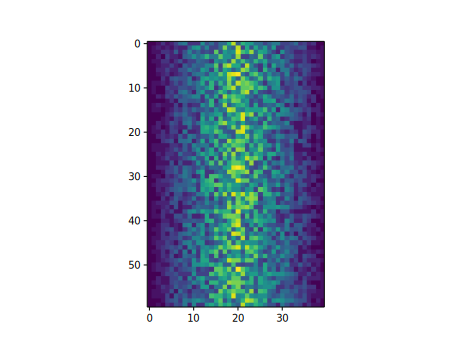
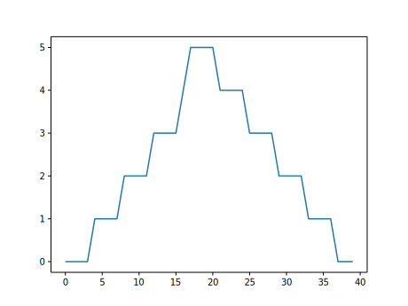

::::::::::::::::::::::::::::::::::::::: objectives

- Plot simple graphs from data.
- Plot multiple graphs in a single figure.

::::::::::::::::::::::::::::::::::::::::::::::::::

:::::::::::::::::::::::::::::::::::::::: questions

- How can I visualize tabular data in Python?
- How can I group several plots together?

::::::::::::::::::::::::::::::::::::::::::::::::::

## Visualizing data

The mathematician Richard Hamming once said, "The purpose of computing is insight, not numbers,"
and the best way to develop insight is often to visualize data.  Visualization deserves an entire
lecture of its own, but we can explore a few features of Python's `matplotlib` library here.  While
there is no official plotting library, `matplotlib` is the *de facto* standard.  First, we will
import the `pyplot` module from `matplotlib` and use two of its functions to create and display a
[heat map](../learners/reference.md#heat-map) of our data:

::::::::::::::::::::::::::::::::::::::::::  prereq

## Episode Prerequisites

If you are continuing in the same notebook from the previous episode, you already
have a `data` variable and have imported `numpy`.  If you are starting a new
notebook at this point, you need the following two lines:

```python
import numpy
data = numpy.loadtxt(fname='inflammation-01.csv', delimiter=',')
```

::::::::::::::::::::::::::::::::::::::::::::::::::

```python
import matplotlib.pyplot
image = matplotlib.pyplot.imshow(data)
matplotlib.pyplot.show()
```

{alt='Heat map representing the data variable. Each cell is colored by value along a color gradientfrom blue to yellow.'}

Each row in the heat map corresponds to a patient in the clinical trial dataset, and each column
corresponds to a day in the dataset.  Blue pixels in this heat map represent low values, while
yellow pixels represent high values.  As we can see, the general number of inflammation flare-ups
for the patients rises and falls over a 40-day period.

So far so good as this is in line with our knowledge of the clinical trial and Dr. Maverick's
claims:

- the patients take their medication once their inflammation flare-ups begin
- it takes around 3 weeks for the medication to take effect and begin reducing flare-ups
- and flare-ups appear to drop to zero by the end of the clinical trial.

Now let's take a look at the average inflammation over time:

```python
ave_inflammation = numpy.mean(data, axis=0)
ave_plot = matplotlib.pyplot.plot(ave_inflammation)
matplotlib.pyplot.show()
```

{alt='A line graph showing the average inflammation across all patients over a 40-day period.'}

Here, we have put the average inflammation per day across all patients in the variable
`ave_inflammation`, then asked `matplotlib.pyplot` to create and display a line graph of those
values.  The result is a reasonably linear rise and fall, in line with Dr. Maverick's claim that
the medication takes 3 weeks to take effect.  But a good data scientist doesn't just consider the
average of a dataset, so let's have a look at two other statistics:

```python
max_plot = matplotlib.pyplot.plot(numpy.amax(data, axis=0))
matplotlib.pyplot.show()
```

{alt='A line graph showing the maximum inflammation across all patients over a 40-day period.'}

```python
min_plot = matplotlib.pyplot.plot(numpy.amin(data, axis=0))
matplotlib.pyplot.show()
```

{alt='A line graph showing the minimum inflammation across all patients over a 40-day period.'}

The maximum value rises and falls linearly, while the minimum seems to be a step function.
Neither trend seems particularly likely, so either there's a mistake in our calculations or
something is wrong with our data. This insight would have been difficult to reach by examining
the numbers themselves without visualization tools.

### Grouping plots

You can group similar plots in a single figure using subplots.
This script below uses a number of new commands. The function `matplotlib.pyplot.figure()`
creates a space into which we will place all of our plots. The parameter `figsize`
tells Python how big to make this space. Each subplot is placed into the figure using
its `add_subplot` [method](../learners/reference.md#method). The `add_subplot` method takes
3 parameters. The first denotes how many total rows of subplots there are, the second parameter
refers to the total number of subplot columns, and the final parameter denotes which subplot
your variable is referencing (left-to-right, top-to-bottom). Each subplot is stored in a
different variable (`axes1`, `axes2`, `axes3`). Once a subplot is created, the axes can
be titled using the `set_xlabel()` command (or `set_ylabel()`).
Here are our three plots side by side:

```python
import numpy
import matplotlib.pyplot

data = numpy.loadtxt(fname='inflammation-01.csv', delimiter=',')

fig = matplotlib.pyplot.figure(figsize=(10.0, 3.0))

axes1 = fig.add_subplot(1, 3, 1)
axes2 = fig.add_subplot(1, 3, 2)
axes3 = fig.add_subplot(1, 3, 3)

axes1.set_ylabel('average')
axes1.plot(numpy.mean(data, axis=0))

axes2.set_ylabel('max')
axes2.plot(numpy.amax(data, axis=0))

axes3.set_ylabel('min')
axes3.plot(numpy.amin(data, axis=0))

fig.tight_layout()

matplotlib.pyplot.savefig('inflammation.png')
matplotlib.pyplot.show()
```

{alt='Three line graphs showing the daily average, maximum and minimum inflammation over a 40-day period.'}

The [call](../learners/reference.md#function-call) to `loadtxt` reads our data,
and the rest of the program tells the plotting library
how large we want the figure to be,
that we're creating three subplots,
what to draw for each one,
and that we want a tight layout.
(If we leave out that call to `fig.tight_layout()`,
the graphs will actually be squeezed together more closely.)

The call to `savefig` stores the plot as a graphics file. This can be
a convenient way to store your plots for use in other documents, web
pages etc. The graphics format is automatically determined by
Matplotlib from the file name ending we specify; here PNG from
'inflammation.png'. Matplotlib supports many different graphics
formats, including SVG, PDF, and JPEG.

:::::::::::::::::::::::::::::::::::::::::  callout

## Importing libraries with shortcuts

In this lesson we use the `import matplotlib.pyplot`
[syntax](../learners/reference.md#syntax)
to import the `pyplot` module of `matplotlib`. However, shortcuts such as
`import matplotlib.pyplot as plt` are frequently used.
Importing `pyplot` this way means that after the initial import, rather than writing
`matplotlib.pyplot.plot(...)`, you can now write `plt.plot(...)`.
Another common convention is to use the shortcut `import numpy as np` when importing the
NumPy library. We then can write `np.loadtxt(...)` instead of `numpy.loadtxt(...)`,
for example.

Some people prefer these shortcuts as it is quicker to type and results in shorter
lines of code - especially for libraries with long names! You will frequently see
Python code online using a `pyplot` function with `plt`, or a NumPy function with
`np`, and it's because they've used this shortcut. It makes no difference which
approach you choose to take, but you must be consistent as if you use
`import matplotlib.pyplot as plt` then `matplotlib.pyplot.plot(...)` will not work, and
you must use `plt.plot(...)` instead. Because of this, when working with other people it
is important you agree on how libraries are imported.


::::::::::::::::::::::::::::::::::::::::::::::::::

:::::::::::::::::::::::::::::::::::::::  challenge

## Plot Scaling

Why do all of our plots stop just short of the upper end of our graph?

:::::::::::::::  solution

## Solution

Because matplotlib normally sets x and y axes limits to the min and max of our data
(depending on data range)


:::::::::::::::::::::::::

If we want to change this, we can use the `set_ylim(min, max)` method of each 'axes',
for example:

```python
axes3.set_ylim(0, 6)
```

Update your plotting code to automatically set a more appropriate scale.
(Hint: you can make use of the `max` and `min` methods to help.)

:::::::::::::::  solution

## Solution

```python
# One method
axes3.set_ylabel('min')
axes3.plot(numpy.amin(data, axis=0))
axes3.set_ylim(0, 6)
```

:::::::::::::::::::::::::

:::::::::::::::  solution

## Solution

```python
# A more automated approach
min_data = numpy.amin(data, axis=0)
axes3.set_ylabel('min')
axes3.plot(min_data)
axes3.set_ylim(numpy.amin(min_data), numpy.amax(min_data) * 1.1)
```

:::::::::::::::::::::::::

::::::::::::::::::::::::::::::::::::::::::::::::::

:::::::::::::::::::::::::::::::::::::::  challenge

## Drawing Straight Lines

In the center and right subplots above, we expect all lines to look like step functions because
non-integer value are not realistic for the minimum and maximum values. However, you can see
that the lines are not always vertical or horizontal, and in particular the step function
in the subplot on the right looks slanted. Why is this?

:::::::::::::::  solution

## Solution

Because matplotlib interpolates (draws a straight line) between the points.
One way to do avoid this is to use the Matplotlib `drawstyle` option:

```python
import numpy
import matplotlib.pyplot

data = numpy.loadtxt(fname='inflammation-01.csv', delimiter=',')

fig = matplotlib.pyplot.figure(figsize=(10.0, 3.0))

axes1 = fig.add_subplot(1, 3, 1)
axes2 = fig.add_subplot(1, 3, 2)
axes3 = fig.add_subplot(1, 3, 3)

axes1.set_ylabel('average')
axes1.plot(numpy.mean(data, axis=0), drawstyle='steps-mid')

axes2.set_ylabel('max')
axes2.plot(numpy.amax(data, axis=0), drawstyle='steps-mid')

axes3.set_ylabel('min')
axes3.plot(numpy.amin(data, axis=0), drawstyle='steps-mid')

fig.tight_layout()

matplotlib.pyplot.show()
```

{alt='Three line graphs, with step lines connecting the points, showing the daily average, maximumand minimum inflammation over a 40-day period.'}


:::::::::::::::::::::::::

::::::::::::::::::::::::::::::::::::::::::::::::::

:::::::::::::::::::::::::::::::::::::::  challenge

## Make Your Own Plot

Create a plot showing the standard deviation (`numpy.std`)
of the inflammation data for each day across all patients.

:::::::::::::::  solution

## Solution

```python
std_plot = matplotlib.pyplot.plot(numpy.std(data, axis=0))
matplotlib.pyplot.show()
```

:::::::::::::::::::::::::

::::::::::::::::::::::::::::::::::::::::::::::::::

:::::::::::::::::::::::::::::::::::::::  challenge

## Moving Plots Around

Modify the program to display the three plots on top of one another
instead of side by side.

:::::::::::::::  solution

## Solution

```python
import numpy
import matplotlib.pyplot

data = numpy.loadtxt(fname='inflammation-01.csv', delimiter=',')

# change figsize (swap width and height)
fig = matplotlib.pyplot.figure(figsize=(3.0, 10.0))

# change add_subplot (swap first two parameters)
axes1 = fig.add_subplot(3, 1, 1)
axes2 = fig.add_subplot(3, 1, 2)
axes3 = fig.add_subplot(3, 1, 3)

axes1.set_ylabel('average')
axes1.plot(numpy.mean(data, axis=0))

axes2.set_ylabel('max')
axes2.plot(numpy.amax(data, axis=0))

axes3.set_ylabel('min')
axes3.plot(numpy.amin(data, axis=0))

fig.tight_layout()

matplotlib.pyplot.show()
```

:::::::::::::::::::::::::

::::::::::::::::::::::::::::::::::::::::::::::::::


:::::::::::::::::::::::::::::::::::::::: keypoints

- Use the `pyplot` module from the `matplotlib` library for creating simple visualizations.

::::::::::::::::::::::::::::::::::::::::::::::::::


