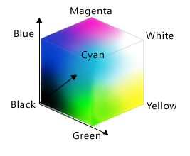

## Making Choices

Our previous lessons have shown us how to manipulate data, define our own functions, and repeat things. However, the programs we have written so far always do the same things, regardless of what data they're given. We want programs to make choices based on the values they are manipulating. To help us see what decisions they're making, we'll start by looking at how computers manipulate images.

<h4 id="objectives">Objectives</h4>
<ul>
<li>Create a simple &quot;image&quot; made out of colored blocks.</li>
<li>Explain how the RGB model represents colors.</li>
<li>Explain the similarities and differences between tuples and lists.</li>
<li>Write conditional statements including <code>if</code>, <code>elif</code>, and <code>else</code> branches.</li>
<li>Correctly evaluate expressions containing <code>and</code> and <code>or</code>.</li>
<li>Correctly write and interpret code containing nested loops and conditionals.</li>
<li>Explain the advantages of putting frequently-modified code in a function.</li>
</ul>

### Image Grids

Let's start by creating some simple heat maps of our own using a library called <code>ipythonblocks</code>. The first step is to create our own &quot;image&quot;:

<pre>from ipythonblocks import ImageGrid</pre>

Unlike the <code>import</code> statements we have seen earlier, this one doesn't load the entire <code>ipythonblocks</code> library. Instead, it just loads <code>ImageGrid</code> from that library, since that's the only thing we need (for now).

Once we have <code>ImageGrid</code> loaded, we can use it to create a very simple grid of colored cells:

<pre>grid = ImageGrid(5, 3)
grid.show()</pre>

<pre><table id="blocks84e827e4-60f2-4e82-b41a-c95955a972aa" class="blockgrid"><tbody><tr><td title="Index: [0, 2]&#10;Color: (0, 0, 0)" style="width: 20px; height: 20px;background-color: rgb(0, 0, 0);"></td><td title="Index: [1, 2]&#10;Color: (0, 0, 0)" style="width: 20px; height: 20px;background-color: rgb(0, 0, 0);"></td><td title="Index: [2, 2]&#10;Color: (0, 0, 0)" style="width: 20px; height: 20px;background-color: rgb(0, 0, 0);"></td><td title="Index: [3, 2]&#10;Color: (0, 0, 0)" style="width: 20px; height: 20px;background-color: rgb(0, 0, 0);"></td><td title="Index: [4, 2]&#10;Color: (0, 0, 0)" style="width: 20px; height: 20px;background-color: rgb(0, 0, 0);"></td></tr><tr><td title="Index: [0, 1]&#10;Color: (0, 0, 0)" style="width: 20px; height: 20px;background-color: rgb(0, 0, 0);"></td><td title="Index: [1, 1]&#10;Color: (0, 0, 0)" style="width: 20px; height: 20px;background-color: rgb(0, 0, 0);"></td><td title="Index: [2, 1]&#10;Color: (0, 0, 0)" style="width: 20px; height: 20px;background-color: rgb(0, 0, 0);"></td><td title="Index: [3, 1]&#10;Color: (0, 0, 0)" style="width: 20px; height: 20px;background-color: rgb(0, 0, 0);"></td><td title="Index: [4, 1]&#10;Color: (0, 0, 0)" style="width: 20px; height: 20px;background-color: rgb(0, 0, 0);"></td></tr><tr><td title="Index: [0, 0]&#10;Color: (0, 0, 0)" style="width: 20px; height: 20px;background-color: rgb(0, 0, 0);"></td><td title="Index: [1, 0]&#10;Color: (0, 0, 0)" style="width: 20px; height: 20px;background-color: rgb(0, 0, 0);"></td><td title="Index: [2, 0]&#10;Color: (0, 0, 0)" style="width: 20px; height: 20px;background-color: rgb(0, 0, 0);"></td><td title="Index: [3, 0]&#10;Color: (0, 0, 0)" style="width: 20px; height: 20px;background-color: rgb(0, 0, 0);"></td><td title="Index: [4, 0]&#10;Color: (0, 0, 0)" style="width: 20px; height: 20px;background-color: rgb(0, 0, 0);"></td></tr></tbody></table></pre>

Just like a NumPy array, an <code>ImageGrid</code> has some properties that hold information about it:

<pre>print &#39;grid width:&#39;, grid.width
print &#39;grid height:&#39;, grid.height
print &#39;grid lines on:&#39;, grid.lines_on</pre>

<pre>grid width: 5
grid height: 3
grid lines on: True
</pre>

The obvious thing to do with a grid like this is color in its cells, but in order to do that, we need to know how computers represent color. The most common schemes are <a href="../../gloss.html#rgb">RGB</a>, which is short for &quot;red, green, blue&quot;. RGB is an <a href="../../gloss.html#additive-color-model">additive color model</a>: every shade is some combination of red, green, and blue intensities. We can think of these three values as being the axes in a cube:

An RGB color is an example of a multi-part value: like a Cartesian coordinate, it is one thing with several parts. We can represent such a value in Python using a <a href="../../gloss.html#tuple">tuple</a>, which we write using parentheses instead of the square brackets used for a list:

<pre>position = (12.3, 45.6)
print &#39;position is:&#39;, position
color = (10, 20, 30)
print &#39;color is:&#39;, color</pre>

<pre>position is: (12.3, 45.6)
color is: (10, 20, 30)
</pre>

We can select elements from tuples using indexing, just as we do with lists and arrays:

<pre>print &#39;first element of color is:&#39;, color[0]</pre>

<pre>first element of color is: 10
</pre>

Unlike lists and arrays, though, tuples cannot be changed after they are created—in technical terms, they are <a href="../../gloss.html#immutable">immutable</a>:

<pre>color[0] = 40
print &#39;first element of color after change:&#39;, color[0]</pre>

<pre>---------------------------------------------------------------------------
TypeError                                 Traceback (most recent call last)
&lt;ipython-input-11-9c3dd30a4e52&gt; in &lt;module&gt;()
----&gt; 1 color[0] = 40
      2 print &#39;first element of color after change:&#39;, color[0]

TypeError: &#39;tuple&#39; object does not support item assignment</pre>

If a tuple represents an RGB color, its red, green, and blue components can take on values between 0 and 255. The upper bound may seem odd, but it's the largest number that can be represented in an 8-bit byte (i.e., 28-1). This makes it easy for computers to manipulate colors, while providing fine enough gradations to fool most human eyes, most of the time.

Let's see what a few RGB colors actually look like:

<pre>row = ImageGrid(8, 1)
row[0, 0] = (0, 0, 0)   # no color =&gt; black
row[1, 0] = (255, 255, 255) # all colors =&gt; white
row[2, 0] = (255, 0, 0) # all red
row[3, 0] = (0, 255, 0) # all green
row[4, 0] = (0, 0, 255) # all blue
row[5, 0] = (255, 255, 0) # red and green
row[6, 0] = (255, 0, 255) # red and blue
row[7, 0] = (0, 255, 255) # green and blue
row.show()</pre>

<pre><table id="blocks9d1f4bb1-553c-4074-aec0-dc48fde66e06" class="blockgrid"><tbody><tr><td title="Index: [0, 0]&#10;Color: (0, 0, 0)" style="width: 20px; height: 20px;background-color: rgb(0, 0, 0);"></td><td title="Index: [1, 0]&#10;Color: (255, 255, 255)" style="width: 20px; height: 20px;background-color: rgb(255, 255, 255);"></td><td title="Index: [2, 0]&#10;Color: (255, 0, 0)" style="width: 20px; height: 20px;background-color: rgb(255, 0, 0);"></td><td title="Index: [3, 0]&#10;Color: (0, 255, 0)" style="width: 20px; height: 20px;background-color: rgb(0, 255, 0);"></td><td title="Index: [4, 0]&#10;Color: (0, 0, 255)" style="width: 20px; height: 20px;background-color: rgb(0, 0, 255);"></td><td title="Index: [5, 0]&#10;Color: (255, 255, 0)" style="width: 20px; height: 20px;background-color: rgb(255, 255, 0);"></td><td title="Index: [6, 0]&#10;Color: (255, 0, 255)" style="width: 20px; height: 20px;background-color: rgb(255, 0, 255);"></td><td title="Index: [7, 0]&#10;Color: (0, 255, 255)" style="width: 20px; height: 20px;background-color: rgb(0, 255, 255);"></td></tr></tbody></table></pre>

Simple color values like <code>(0,255,0)</code> are easy enough to decipher with a bit of practice, but what color is <code>(214,90,127)</code>? To help us, <code>ipythonblocks</code> provides a function called <code>show_color</code>:

<pre>from ipythonblocks import show_color
show_color(214, 90, 127)</pre>

<pre>

</pre>

It also provides a table of standard colors:

<pre>from ipythonblocks import colors
c = ImageGrid(3, 2)
c[0, 0] = colors[&#39;Fuchsia&#39;]
c[0, 1] = colors[&#39;Salmon&#39;]
c[1, 0] = colors[&#39;Orchid&#39;]
c[1, 1] = colors[&#39;Lavender&#39;]
c[2, 0] = colors[&#39;LimeGreen&#39;]
c[2, 1] = colors[&#39;HotPink&#39;]
c.show()</pre>

<pre><table id="blocksb8c954b3-f908-4ab1-8013-65bf49ec1b2f" class="blockgrid"><tbody><tr><td title="Index: [0, 1]&#10;Color: (250, 128, 114)" style="width: 20px; height: 20px;background-color: rgb(250, 128, 114);"></td><td title="Index: [1, 1]&#10;Color: (230, 230, 250)" style="width: 20px; height: 20px;background-color: rgb(230, 230, 250);"></td><td title="Index: [2, 1]&#10;Color: (255, 105, 180)" style="width: 20px; height: 20px;background-color: rgb(255, 105, 180);"></td></tr><tr><td title="Index: [0, 0]&#10;Color: (255, 0, 255)" style="width: 20px; height: 20px;background-color: rgb(255, 0, 255);"></td><td title="Index: [1, 0]&#10;Color: (218, 112, 214)" style="width: 20px; height: 20px;background-color: rgb(218, 112, 214);"></td><td title="Index: [2, 0]&#10;Color: (50, 205, 50)" style="width: 20px; height: 20px;background-color: rgb(50, 205, 50);"></td></tr></tbody></table></pre>

<h4 id="challenges">Challenges</h4>
<ol style="list-style-type: decimal">
<li>
Fill in the <code>____</code> in the code below to create a bar that changes color from dark blue to black.

<pre class="sourceCode python"><code class="sourceCode python">bar = ImageGrid(10, 1)
for x in range(10):
    bar[x, 0] = (0, 0, ____)
bar.show()</code></pre></li>
<li>
Why do computers use red, green, and blue as their primary colors?
</li>
</ol>

### Conditionals

The other thing we need in order to create a heat map of our own is a way to pick a color based on a data value. The tool Python gives us for doing this is called a <a href="../../gloss.html#conditional-statement">conditional statement</a>, and looks like this:

<pre>num = 37
if num &gt; 100:
    print &#39;greater&#39;
else:
    print &#39;not greater&#39;
print &#39;done&#39;</pre>

<pre>not greater
done
</pre>

The second line of this code uses the keyword <code>if</code> to tell Python that we want to make a choice. If the test that follows it is true, the body of the <code>if</code> (i.e., the lines indented underneath it) are executed. If the test is false, the body of the <code>else</code> is executed instead. Only one or the other is ever executed:

Conditional statements don't have to include an <code>else</code>. If there isn't one, Python simply does nothing if the test is false:

<pre>num = 53
print &#39;before conditional...&#39;
if num &gt; 100:
    print &#39;53 is greater than 100&#39;
print &#39;...after conditional&#39;</pre>

<pre>before conditional...
...after conditional
</pre>

We can also chain several tests together using <code>elif</code>, which is short for &quot;else if&quot;. This makes it simple to write a function that returns the sign of a number:

<pre>def sign(num):
    if num &gt; 0:
        return 1
    elif num == 0:
        return 0
    else:
        return -1

print &#39;sign of -3:&#39;, sign(-3)</pre>

<pre>sign of -3: -1
</pre>

One important thing to notice the code above is that we use a double equals sign <code>==</code> to test for equality rather than a single equals sign because the latter is used to mean assignment. This convention was inherited from C, and while many other programming languages work the same way, it does take a bit of getting used to...

We can also combine tests using <code>and</code> and <code>or</code>. <code>and</code> is only true if both parts are true:

<pre>if (1 &gt; 0) and (-1 &gt; 0):
    print &#39;both parts are true&#39;
else:
    print &#39;one part is not true&#39;</pre>

<pre>one part is not true
</pre>

while <code>or</code> is true if either part is true:

<pre>if (1 &lt; 0) or (&#39;left&#39; &lt; &#39;right&#39;):
    print &#39;at least one test is true&#39;</pre>

<pre>at least one test is true
</pre>

In this case, &quot;either&quot; means &quot;either or both&quot;, not &quot;either one or the other but not both&quot;.

<h4 id="challenges">Challenges</h4>
<ol style="list-style-type: decimal">
<li>
<code>True</code> and <code>False</code> aren't the only values in Python that are true and false. In fact, <em>any</em> value can be used in an <code>if</code> or <code>elif</code>. After reading and running the code below, explain what the rule is for which values are considered true and which are considered false. (Note that if the body of a conditional is a single statement, we can write it on the same line as the <code>if</code>.)

<pre class="sourceCode python"><code class="sourceCode python">if &#39;&#39;: print &#39;empty string is true&#39;
if &#39;word&#39;: print &#39;word is true&#39;
if []: print &#39;empty list is true&#39;
if [1, 2, 3]: print &#39;non-empty list is true&#39;
if 0: print &#39;zero is true&#39;
if 1: print &#39;one is true&#39;</code></pre></li>
<li>
Write a function called <code>near</code> that returns <code>True</code> if its first parameter is within 10% of its second and <code>False</code> otherwise. Compare your implementation with your partner's: do you return the same answer for all possible pairs of numbers?
</li>
</ol>

### Nesting

Another thing to realize is that <code>if</code> statements can be combined with loops just as easily as they can be combined with functions. For example, if we want to sum the positive numbers in a list, we can write this:

<pre>numbers = [-5, 3, 2, -1, 9, 6]
total = 0
for n in numbers:
    if n &gt;= 0:
        total = total + n
print &#39;sum of positive values:&#39;, total</pre>

<pre>sum of positive values: 20
</pre>

We could equally well calculate the positive and negative sums in a single loop:

<pre>pos_total = 0
neg_total = 0
for n in numbers:
    if n &gt;= 0:
        pos_total = pos_total + n
    else:
        neg_total = neg_total + n
print &#39;negative and positive sums are:&#39;, neg_total, pos_total</pre>

<pre>negative and positive sums are: -6 20
</pre>

We can even put one loop inside another:

<pre>for consonant in &#39;bcd&#39;:
    for vowel in &#39;ae&#39;:
        print consonant + vowel</pre>

<pre>ba
be
ca
ce
da
de
</pre>

As the diagram below shows, the <a href="../../gloss.html#inner-loop">inner loop</a> runs from start to finish each time the <a href="../../gloss.html#outer-loop">outer loop</a> runs once:

We can combine nesting and conditionals to create patterns in an image:

<pre>square = ImageGrid(5, 5)
for x in range(square.width):
    for y in range(square.height):
        if x &lt; y:
            square[x, y] = colors[&#39;Fuchsia&#39;]
        elif x == y:
            square[x, y] = colors[&#39;Olive&#39;]
        else:
            square[x, y] = colors[&#39;SlateGray&#39;]
square.show()</pre>

<pre><table id="blocksa391625e-64d4-47e1-a54a-2953c1aea09c" class="blockgrid"><tbody><tr><td title="Index: [0, 4]&#10;Color: (255, 0, 255)" style="width: 20px; height: 20px;background-color: rgb(255, 0, 255);"></td><td title="Index: [1, 4]&#10;Color: (255, 0, 255)" style="width: 20px; height: 20px;background-color: rgb(255, 0, 255);"></td><td title="Index: [2, 4]&#10;Color: (255, 0, 255)" style="width: 20px; height: 20px;background-color: rgb(255, 0, 255);"></td><td title="Index: [3, 4]&#10;Color: (255, 0, 255)" style="width: 20px; height: 20px;background-color: rgb(255, 0, 255);"></td><td title="Index: [4, 4]&#10;Color: (128, 128, 0)" style="width: 20px; height: 20px;background-color: rgb(128, 128, 0);"></td></tr><tr><td title="Index: [0, 3]&#10;Color: (255, 0, 255)" style="width: 20px; height: 20px;background-color: rgb(255, 0, 255);"></td><td title="Index: [1, 3]&#10;Color: (255, 0, 255)" style="width: 20px; height: 20px;background-color: rgb(255, 0, 255);"></td><td title="Index: [2, 3]&#10;Color: (255, 0, 255)" style="width: 20px; height: 20px;background-color: rgb(255, 0, 255);"></td><td title="Index: [3, 3]&#10;Color: (128, 128, 0)" style="width: 20px; height: 20px;background-color: rgb(128, 128, 0);"></td><td title="Index: [4, 3]&#10;Color: (112, 128, 144)" style="width: 20px; height: 20px;background-color: rgb(112, 128, 144);"></td></tr><tr><td title="Index: [0, 2]&#10;Color: (255, 0, 255)" style="width: 20px; height: 20px;background-color: rgb(255, 0, 255);"></td><td title="Index: [1, 2]&#10;Color: (255, 0, 255)" style="width: 20px; height: 20px;background-color: rgb(255, 0, 255);"></td><td title="Index: [2, 2]&#10;Color: (128, 128, 0)" style="width: 20px; height: 20px;background-color: rgb(128, 128, 0);"></td><td title="Index: [3, 2]&#10;Color: (112, 128, 144)" style="width: 20px; height: 20px;background-color: rgb(112, 128, 144);"></td><td title="Index: [4, 2]&#10;Color: (112, 128, 144)" style="width: 20px; height: 20px;background-color: rgb(112, 128, 144);"></td></tr><tr><td title="Index: [0, 1]&#10;Color: (255, 0, 255)" style="width: 20px; height: 20px;background-color: rgb(255, 0, 255);"></td><td title="Index: [1, 1]&#10;Color: (128, 128, 0)" style="width: 20px; height: 20px;background-color: rgb(128, 128, 0);"></td><td title="Index: [2, 1]&#10;Color: (112, 128, 144)" style="width: 20px; height: 20px;background-color: rgb(112, 128, 144);"></td><td title="Index: [3, 1]&#10;Color: (112, 128, 144)" style="width: 20px; height: 20px;background-color: rgb(112, 128, 144);"></td><td title="Index: [4, 1]&#10;Color: (112, 128, 144)" style="width: 20px; height: 20px;background-color: rgb(112, 128, 144);"></td></tr><tr><td title="Index: [0, 0]&#10;Color: (128, 128, 0)" style="width: 20px; height: 20px;background-color: rgb(128, 128, 0);"></td><td title="Index: [1, 0]&#10;Color: (112, 128, 144)" style="width: 20px; height: 20px;background-color: rgb(112, 128, 144);"></td><td title="Index: [2, 0]&#10;Color: (112, 128, 144)" style="width: 20px; height: 20px;background-color: rgb(112, 128, 144);"></td><td title="Index: [3, 0]&#10;Color: (112, 128, 144)" style="width: 20px; height: 20px;background-color: rgb(112, 128, 144);"></td><td title="Index: [4, 0]&#10;Color: (112, 128, 144)" style="width: 20px; height: 20px;background-color: rgb(112, 128, 144);"></td></tr></tbody></table></pre>

This is our first hand-made data visualization: the colors show where <code>x</code> is less than, equal to, or greater than <code>y</code>.

<h4 id="challenges">Challenges</h4>
<ol style="list-style-type: decimal">
<li>
Will changing the nesting of the loops in the code above—i.e., wrapping the Y-axis loop around the X-axis loop—change the final image? Why or why not?
</li>
<li>
Python (and most other languages in the C family) provides <a href="../../gloss.html#in-place-operator">in-place operators</a> that work like this:

<pre class="sourceCode python"><code class="sourceCode python">x = 1  # original value
x += 1 # add one to x, assigning result back to x
x *= 3 # multiply x by 3
print x
6</code></pre>

Rewrite the code that sums the positive and negative numbers in a list using in-place operators. Do you think the result is more or less readable than the original?
</li>
</ol>

### Creating a Heat Map

The last step is to turn our data into something we can see. As in previous lessons, the first step is to get the data into memory:

<pre>import numpy as np
data = np.loadtxt(fname=&#39;inflammation-01.csv&#39;, delimiter=&#39;,&#39;)
print &#39;data shape:&#39;, data.shape</pre>

<pre>data shape: (60, 40)
</pre>

The second is to create an image grid that is the same size as the data:

<pre>width, height = data.shape
heatmap = ImageGrid(width, height)</pre>

(The first line of the code above takes advantage of a neat trick: we can unpack the values in a tuple by assigning it to as many variables as it has entries.)

The third step is to decide <em>how</em> we are going to color the cells in the heat map. To keep things simple, we will use red, green, and blue as our colors, and compare data values to the data set's mean. Here's the code:

<pre>for x in range(width):
    for y in range(height):
        if data[x, y] &lt; data.mean():
            heatmap[x, y] = colors[&#39;Red&#39;]
        elif data[x, y] == data.mean():
            heatmap[x, y] = colors[&#39;Green&#39;]
        else:
            heatmap[x, y] = colors[&#39;Blue&#39;]
heatmap.show()</pre>

<pre><table id="blocks1cdd8344-bb95-4b16-bc13-b4fb6f13235a" class="blockgrid"><tbody><tr><td title="Index: [0, 39]&#10;Color: (255, 0, 0)" style="width: 20px; height: 20px;background-color: rgb(255, 0, 0);"></td><td title="Index: [1, 39]&#10;Color: (255, 0, 0)" style="width: 20px; height: 20px;background-color: rgb(255, 0, 0);"></td><td title="Index: [2, 39]&#10;Color: (255, 0, 0)" style="width: 20px; height: 20px;background-color: rgb(255, 0, 0);"></td><td title="Index: [3, 39]&#10;Color: (255, 0, 0)" style="width: 20px; height: 20px;background-color: rgb(255, 0, 0);"></td><td title="Index: [4, 39]&#10;Color: (255, 0, 0)" style="width: 20px; height: 20px;background-color: rgb(255, 0, 0);"></td><td title="Index: [5, 39]&#10;Color: (255, 0, 0)" style="width: 20px; height: 20px;background-color: rgb(255, 0, 0);"></td><td title="Index: [6, 39]&#10;Color: (255, 0, 0)" style="width: 20px; height: 20px;background-color: rgb(255, 0, 0);"></td><td title="Index: [7, 39]&#10;Color: (255, 0, 0)" style="width: 20px; height: 20px;background-color: rgb(255, 0, 0);"></td><td title="Index: [8, 39]&#10;Color: (255, 0, 0)" style="width: 20px; height: 20px;background-color: rgb(255, 0, 0);"></td><td title="Index: [9, 39]&#10;Color: (255, 0, 0)" style="width: 20px; height: 20px;background-color: rgb(255, 0, 0);"></td><td title="Index: [10, 39]&#10;Color: (255, 0, 0)" style="width: 20px; height: 20px;background-color: rgb(255, 0, 0);"></td><td title="Index: [11, 39]&#10;Color: (255, 0, 0)" style="width: 20px; height: 20px;background-color: rgb(255, 0, 0);"></td><td title="Index: [12, 39]&#10;Color: (255, 0, 0)" style="width: 20px; height: 20px;background-color: rgb(255, 0, 0);"></td><td title="Index: [13, 39]&#10;Color: (255, 0, 0)" style="width: 20px; height: 20px;background-color: rgb(255, 0, 0);"></td><td title="Index: [14, 39]&#10;Color: (255, 0, 0)" style="width: 20px; height: 20px;background-color: rgb(255, 0, 0);"></td><td title="Index: [15, 39]&#10;Color: (255, 0, 0)" style="width: 20px; height: 20px;background-color: rgb(255, 0, 0);"></td><td title="Index: [16, 39]&#10;Color: (255, 0, 0)" style="width: 20px; height: 20px;background-color: rgb(255, 0, 0);"></td><td title="Index: [17, 39]&#10;Color: (255, 0, 0)" style="width: 20px; height: 20px;background-color: rgb(255, 0, 0);"></td><td title="Index: [18, 39]&#10;Color: (255, 0, 0)" style="width: 20px; height: 20px;background-color: rgb(255, 0, 0);"></td><td title="Index: [19, 39]&#10;Color: (255, 0, 0)" style="width: 20px; height: 20px;background-color: rgb(255, 0, 0);"></td><td title="Index: [20, 39]&#10;Color: (255, 0, 0)" style="width: 20px; height: 20px;background-color: rgb(255, 0, 0);"></td><td title="Index: [21, 39]&#10;Color: (255, 0, 0)" style="width: 20px; height: 20px;background-color: rgb(255, 0, 0);"></td><td title="Index: [22, 39]&#10;Color: (255, 0, 0)" style="width: 20px; height: 20px;background-color: rgb(255, 0, 0);"></td><td title="Index: [23, 39]&#10;Color: (255, 0, 0)" style="width: 20px; height: 20px;background-color: rgb(255, 0, 0);"></td><td title="Index: [24, 39]&#10;Color: (255, 0, 0)" style="width: 20px; height: 20px;background-color: rgb(255, 0, 0);"></td><td title="Index: [25, 39]&#10;Color: (255, 0, 0)" style="width: 20px; height: 20px;background-color: rgb(255, 0, 0);"></td><td title="Index: [26, 39]&#10;Color: (255, 0, 0)" style="width: 20px; height: 20px;background-color: rgb(255, 0, 0);"></td><td title="Index: [27, 39]&#10;Color: (255, 0, 0)" style="width: 20px; height: 20px;background-color: rgb(255, 0, 0);"></td><td title="Index: [28, 39]&#10;Color: (255, 0, 0)" style="width: 20px; height: 20px;background-color: rgb(255, 0, 0);"></td><td title="Index: [29, 39]&#10;Color: (255, 0, 0)" style="width: 20px; height: 20px;background-color: rgb(255, 0, 0);"></td><td title="Index: [30, 39]&#10;Color: (255, 0, 0)" style="width: 20px; height: 20px;background-color: rgb(255, 0, 0);"></td><td title="Index: [31, 39]&#10;Color: (255, 0, 0)" style="width: 20px; height: 20px;background-color: rgb(255, 0, 0);"></td><td title="Index: [32, 39]&#10;Color: (255, 0, 0)" style="width: 20px; height: 20px;background-color: rgb(255, 0, 0);"></td><td title="Index: [33, 39]&#10;Color: (255, 0, 0)" style="width: 20px; height: 20px;background-color: rgb(255, 0, 0);"></td><td title="Index: [34, 39]&#10;Color: (255, 0, 0)" style="width: 20px; height: 20px;background-color: rgb(255, 0, 0);"></td><td title="Index: [35, 39]&#10;Color: (255, 0, 0)" style="width: 20px; height: 20px;background-color: rgb(255, 0, 0);"></td><td title="Index: [36, 39]&#10;Color: (255, 0, 0)" style="width: 20px; height: 20px;background-color: rgb(255, 0, 0);"></td><td title="Index: [37, 39]&#10;Color: (255, 0, 0)" style="width: 20px; height: 20px;background-color: rgb(255, 0, 0);"></td><td title="Index: [38, 39]&#10;Color: (255, 0, 0)" style="width: 20px; height: 20px;background-color: rgb(255, 0, 0);"></td><td title="Index: [39, 39]&#10;Color: (255, 0, 0)" style="width: 20px; height: 20px;background-color: rgb(255, 0, 0);"></td><td title="Index: [40, 39]&#10;Color: (255, 0, 0)" style="width: 20px; height: 20px;background-color: rgb(255, 0, 0);"></td><td title="Index: [41, 39]&#10;Color: (255, 0, 0)" style="width: 20px; height: 20px;background-color: rgb(255, 0, 0);"></td><td title="Index: [42, 39]&#10;Color: (255, 0, 0)" style="width: 20px; height: 20px;background-color: rgb(255, 0, 0);"></td><td title="Index: [43, 39]&#10;Color: (255, 0, 0)" style="width: 20px; height: 20px;background-color: rgb(255, 0, 0);"></td><td title="Index: [44, 39]&#10;Color: (255, 0, 0)" style="width: 20px; height: 20px;background-color: rgb(255, 0, 0);"></td><td title="Index: [45, 39]&#10;Color: (255, 0, 0)" style="width: 20px; height: 20px;background-color: rgb(255, 0, 0);"></td><td title="Index: [46, 39]&#10;Color: (255, 0, 0)" style="width: 20px; height: 20px;background-color: rgb(255, 0, 0);"></td><td title="Index: [47, 39]&#10;Color: (255, 0, 0)" style="width: 20px; height: 20px;background-color: rgb(255, 0, 0);"></td><td title="Index: [48, 39]&#10;Color: (255, 0, 0)" style="width: 20px; height: 20px;background-color: rgb(255, 0, 0);"></td><td title="Index: [49, 39]&#10;Color: (255, 0, 0)" style="width: 20px; height: 20px;background-color: rgb(255, 0, 0);"></td><td title="Index: [50, 39]&#10;Color: (255, 0, 0)" style="width: 20px; height: 20px;background-color: rgb(255, 0, 0);"></td><td title="Index: [51, 39]&#10;Color: (255, 0, 0)" style="width: 20px; height: 20px;background-color: rgb(255, 0, 0);"></td><td title="Index: [52, 39]&#10;Color: (255, 0, 0)" style="width: 20px; height: 20px;background-color: rgb(255, 0, 0);"></td><td title="Index: [53, 39]&#10;Color: (255, 0, 0)" style="width: 20px; height: 20px;background-color: rgb(255, 0, 0);"></td><td title="Index: [54, 39]&#10;Color: (255, 0, 0)" style="width: 20px; height: 20px;background-color: rgb(255, 0, 0);"></td><td title="Index: [55, 39]&#10;Color: (255, 0, 0)" style="width: 20px; height: 20px;background-color: rgb(255, 0, 0);"></td><td title="Index: [56, 39]&#10;Color: (255, 0, 0)" style="width: 20px; height: 20px;background-color: rgb(255, 0, 0);"></td><td title="Index: [57, 39]&#10;Color: (255, 0, 0)" style="width: 20px; height: 20px;background-color: rgb(255, 0, 0);"></td><td title="Index: [58, 39]&#10;Color: (255, 0, 0)" style="width: 20px; height: 20px;background-color: rgb(255, 0, 0);"></td><td title="Index: [59, 39]&#10;Color: (255, 0, 0)" style="width: 20px; height: 20px;background-color: rgb(255, 0, 0);"></td></tr><tr><td title="Index: [0, 38]&#10;Color: (255, 0, 0)" style="width: 20px; height: 20px;background-color: rgb(255, 0, 0);"></td><td title="Index: [1, 38]&#10;Color: (255, 0, 0)" style="width: 20px; height: 20px;background-color: rgb(255, 0, 0);"></td><td title="Index: [2, 38]&#10;Color: (255, 0, 0)" style="width: 20px; height: 20px;background-color: rgb(255, 0, 0);"></td><td title="Index: [3, 38]&#10;Color: (255, 0, 0)" style="width: 20px; height: 20px;background-color: rgb(255, 0, 0);"></td><td title="Index: [4, 38]&#10;Color: (255, 0, 0)" style="width: 20px; height: 20px;background-color: rgb(255, 0, 0);"></td><td title="Index: [5, 38]&#10;Color: (255, 0, 0)" style="width: 20px; height: 20px;background-color: rgb(255, 0, 0);"></td><td title="Index: [6, 38]&#10;Color: (255, 0, 0)" style="width: 20px; height: 20px;background-color: rgb(255, 0, 0);"></td><td title="Index: [7, 38]&#10;Color: (255, 0, 0)" style="width: 20px; height: 20px;background-color: rgb(255, 0, 0);"></td><td title="Index: [8, 38]&#10;Color: (255, 0, 0)" style="width: 20px; height: 20px;background-color: rgb(255, 0, 0);"></td><td title="Index: [9, 38]&#10;Color: (255, 0, 0)" style="width: 20px; height: 20px;background-color: rgb(255, 0, 0);"></td><td title="Index: [10, 38]&#10;Color: (255, 0, 0)" style="width: 20px; height: 20px;background-color: rgb(255, 0, 0);"></td><td title="Index: [11, 38]&#10;Color: (255, 0, 0)" style="width: 20px; height: 20px;background-color: rgb(255, 0, 0);"></td><td title="Index: [12, 38]&#10;Color: (255, 0, 0)" style="width: 20px; height: 20px;background-color: rgb(255, 0, 0);"></td><td title="Index: [13, 38]&#10;Color: (255, 0, 0)" style="width: 20px; height: 20px;background-color: rgb(255, 0, 0);"></td><td title="Index: [14, 38]&#10;Color: (255, 0, 0)" style="width: 20px; height: 20px;background-color: rgb(255, 0, 0);"></td><td title="Index: [15, 38]&#10;Color: (255, 0, 0)" style="width: 20px; height: 20px;background-color: rgb(255, 0, 0);"></td><td title="Index: [16, 38]&#10;Color: (255, 0, 0)" style="width: 20px; height: 20px;background-color: rgb(255, 0, 0);"></td><td title="Index: [17, 38]&#10;Color: (255, 0, 0)" style="width: 20px; height: 20px;background-color: rgb(255, 0, 0);"></td><td title="Index: [18, 38]&#10;Color: (255, 0, 0)" style="width: 20px; height: 20px;background-color: rgb(255, 0, 0);"></td><td title="Index: [19, 38]&#10;Color: (255, 0, 0)" style="width: 20px; height: 20px;background-color: rgb(255, 0, 0);"></td><td title="Index: [20, 38]&#10;Color: (255, 0, 0)" style="width: 20px; height: 20px;background-color: rgb(255, 0, 0);"></td><td title="Index: [21, 38]&#10;Color: (255, 0, 0)" style="width: 20px; height: 20px;background-color: rgb(255, 0, 0);"></td><td title="Index: [22, 38]&#10;Color: (255, 0, 0)" style="width: 20px; height: 20px;background-color: rgb(255, 0, 0);"></td><td title="Index: [23, 38]&#10;Color: (255, 0, 0)" style="width: 20px; height: 20px;background-color: rgb(255, 0, 0);"></td><td title="Index: [24, 38]&#10;Color: (255, 0, 0)" style="width: 20px; height: 20px;background-color: rgb(255, 0, 0);"></td><td title="Index: [25, 38]&#10;Color: (255, 0, 0)" style="width: 20px; height: 20px;background-color: rgb(255, 0, 0);"></td><td title="Index: [26, 38]&#10;Color: (255, 0, 0)" style="width: 20px; height: 20px;background-color: rgb(255, 0, 0);"></td><td title="Index: [27, 38]&#10;Color: (255, 0, 0)" style="width: 20px; height: 20px;background-color: rgb(255, 0, 0);"></td><td title="Index: [28, 38]&#10;Color: (255, 0, 0)" style="width: 20px; height: 20px;background-color: rgb(255, 0, 0);"></td><td title="Index: [29, 38]&#10;Color: (255, 0, 0)" style="width: 20px; height: 20px;background-color: rgb(255, 0, 0);"></td><td title="Index: [30, 38]&#10;Color: (255, 0, 0)" style="width: 20px; height: 20px;background-color: rgb(255, 0, 0);"></td><td title="Index: [31, 38]&#10;Color: (255, 0, 0)" style="width: 20px; height: 20px;background-color: rgb(255, 0, 0);"></td><td title="Index: [32, 38]&#10;Color: (255, 0, 0)" style="width: 20px; height: 20px;background-color: rgb(255, 0, 0);"></td><td title="Index: [33, 38]&#10;Color: (255, 0, 0)" style="width: 20px; height: 20px;background-color: rgb(255, 0, 0);"></td><td title="Index: [34, 38]&#10;Color: (255, 0, 0)" style="width: 20px; height: 20px;background-color: rgb(255, 0, 0);"></td><td title="Index: [35, 38]&#10;Color: (255, 0, 0)" style="width: 20px; height: 20px;background-color: rgb(255, 0, 0);"></td><td title="Index: [36, 38]&#10;Color: (255, 0, 0)" style="width: 20px; height: 20px;background-color: rgb(255, 0, 0);"></td><td title="Index: [37, 38]&#10;Color: (255, 0, 0)" style="width: 20px; height: 20px;background-color: rgb(255, 0, 0);"></td><td title="Index: [38, 38]&#10;Color: (255, 0, 0)" style="width: 20px; height: 20px;background-color: rgb(255, 0, 0);"></td><td title="Index: [39, 38]&#10;Color: (255, 0, 0)" style="width: 20px; height: 20px;background-color: rgb(255, 0, 0);"></td><td title="Index: [40, 38]&#10;Color: (255, 0, 0)" style="width: 20px; height: 20px;background-color: rgb(255, 0, 0);"></td><td title="Index: [41, 38]&#10;Color: (255, 0, 0)" style="width: 20px; height: 20px;background-color: rgb(255, 0, 0);"></td><td title="Index: [42, 38]&#10;Color: (255, 0, 0)" style="width: 20px; height: 20px;background-color: rgb(255, 0, 0);"></td><td title="Index: [43, 38]&#10;Color: (255, 0, 0)" style="width: 20px; height: 20px;background-color: rgb(255, 0, 0);"></td><td title="Index: [44, 38]&#10;Color: (255, 0, 0)" style="width: 20px; height: 20px;background-color: rgb(255, 0, 0);"></td><td title="Index: [45, 38]&#10;Color: (255, 0, 0)" style="width: 20px; height: 20px;background-color: rgb(255, 0, 0);"></td><td title="Index: [46, 38]&#10;Color: (255, 0, 0)" style="width: 20px; height: 20px;background-color: rgb(255, 0, 0);"></td><td title="Index: [47, 38]&#10;Color: (255, 0, 0)" style="width: 20px; height: 20px;background-color: rgb(255, 0, 0);"></td><td title="Index: [48, 38]&#10;Color: (255, 0, 0)" style="width: 20px; height: 20px;background-color: rgb(255, 0, 0);"></td><td title="Index: [49, 38]&#10;Color: (255, 0, 0)" style="width: 20px; height: 20px;background-color: rgb(255, 0, 0);"></td><td title="Index: [50, 38]&#10;Color: (255, 0, 0)" style="width: 20px; height: 20px;background-color: rgb(255, 0, 0);"></td><td title="Index: [51, 38]&#10;Color: (255, 0, 0)" style="width: 20px; height: 20px;background-color: rgb(255, 0, 0);"></td><td title="Index: [52, 38]&#10;Color: (255, 0, 0)" style="width: 20px; height: 20px;background-color: rgb(255, 0, 0);"></td><td title="Index: [53, 38]&#10;Color: (255, 0, 0)" style="width: 20px; height: 20px;background-color: rgb(255, 0, 0);"></td><td title="Index: [54, 38]&#10;Color: (255, 0, 0)" style="width: 20px; height: 20px;background-color: rgb(255, 0, 0);"></td><td title="Index: [55, 38]&#10;Color: (255, 0, 0)" style="width: 20px; height: 20px;background-color: rgb(255, 0, 0);"></td><td title="Index: [56, 38]&#10;Color: (255, 0, 0)" style="width: 20px; height: 20px;background-color: rgb(255, 0, 0);"></td><td title="Index: [57, 38]&#10;Color: (255, 0, 0)" style="width: 20px; height: 20px;background-color: rgb(255, 0, 0);"></td><td title="Index: [58, 38]&#10;Color: (255, 0, 0)" style="width: 20px; height: 20px;background-color: rgb(255, 0, 0);"></td><td title="Index: [59, 38]&#10;Color: (255, 0, 0)" style="width: 20px; height: 20px;background-color: rgb(255, 0, 0);"></td></tr><tr><td title="Index: [0, 37]&#10;Color: (255, 0, 0)" style="width: 20px; height: 20px;background-color: rgb(255, 0, 0);"></td><td title="Index: [1, 37]&#10;Color: (255, 0, 0)" style="width: 20px; height: 20px;background-color: rgb(255, 0, 0);"></td><td title="Index: [2, 37]&#10;Color: (255, 0, 0)" style="width: 20px; height: 20px;background-color: rgb(255, 0, 0);"></td><td title="Index: [3, 37]&#10;Color: (255, 0, 0)" style="width: 20px; height: 20px;background-color: rgb(255, 0, 0);"></td><td title="Index: [4, 37]&#10;Color: (255, 0, 0)" style="width: 20px; height: 20px;background-color: rgb(255, 0, 0);"></td><td title="Index: [5, 37]&#10;Color: (255, 0, 0)" style="width: 20px; height: 20px;background-color: rgb(255, 0, 0);"></td><td title="Index: [6, 37]&#10;Color: (255, 0, 0)" style="width: 20px; height: 20px;background-color: rgb(255, 0, 0);"></td><td title="Index: [7, 37]&#10;Color: (255, 0, 0)" style="width: 20px; height: 20px;background-color: rgb(255, 0, 0);"></td><td title="Index: [8, 37]&#10;Color: (255, 0, 0)" style="width: 20px; height: 20px;background-color: rgb(255, 0, 0);"></td><td title="Index: [9, 37]&#10;Color: (255, 0, 0)" style="width: 20px; height: 20px;background-color: rgb(255, 0, 0);"></td><td title="Index: [10, 37]&#10;Color: (255, 0, 0)" style="width: 20px; height: 20px;background-color: rgb(255, 0, 0);"></td><td title="Index: [11, 37]&#10;Color: (255, 0, 0)" style="width: 20px; height: 20px;background-color: rgb(255, 0, 0);"></td><td title="Index: [12, 37]&#10;Color: (255, 0, 0)" style="width: 20px; height: 20px;background-color: rgb(255, 0, 0);"></td><td title="Index: [13, 37]&#10;Color: (255, 0, 0)" style="width: 20px; height: 20px;background-color: rgb(255, 0, 0);"></td><td title="Index: [14, 37]&#10;Color: (255, 0, 0)" style="width: 20px; height: 20px;background-color: rgb(255, 0, 0);"></td><td title="Index: [15, 37]&#10;Color: (255, 0, 0)" style="width: 20px; height: 20px;background-color: rgb(255, 0, 0);"></td><td title="Index: [16, 37]&#10;Color: (255, 0, 0)" style="width: 20px; height: 20px;background-color: rgb(255, 0, 0);"></td><td title="Index: [17, 37]&#10;Color: (255, 0, 0)" style="width: 20px; height: 20px;background-color: rgb(255, 0, 0);"></td><td title="Index: [18, 37]&#10;Color: (255, 0, 0)" style="width: 20px; height: 20px;background-color: rgb(255, 0, 0);"></td><td title="Index: [19, 37]&#10;Color: (255, 0, 0)" style="width: 20px; height: 20px;background-color: rgb(255, 0, 0);"></td><td title="Index: [20, 37]&#10;Color: (255, 0, 0)" style="width: 20px; height: 20px;background-color: rgb(255, 0, 0);"></td><td title="Index: [21, 37]&#10;Color: (255, 0, 0)" style="width: 20px; height: 20px;background-color: rgb(255, 0, 0);"></td><td title="Index: [22, 37]&#10;Color: (255, 0, 0)" style="width: 20px; height: 20px;background-color: rgb(255, 0, 0);"></td><td title="Index: [23, 37]&#10;Color: (255, 0, 0)" style="width: 20px; height: 20px;background-color: rgb(255, 0, 0);"></td><td title="Index: [24, 37]&#10;Color: (255, 0, 0)" style="width: 20px; height: 20px;background-color: rgb(255, 0, 0);"></td><td title="Index: [25, 37]&#10;Color: (255, 0, 0)" style="width: 20px; height: 20px;background-color: rgb(255, 0, 0);"></td><td title="Index: [26, 37]&#10;Color: (255, 0, 0)" style="width: 20px; height: 20px;background-color: rgb(255, 0, 0);"></td><td title="Index: [27, 37]&#10;Color: (255, 0, 0)" style="width: 20px; height: 20px;background-color: rgb(255, 0, 0);"></td><td title="Index: [28, 37]&#10;Color: (255, 0, 0)" style="width: 20px; height: 20px;background-color: rgb(255, 0, 0);"></td><td title="Index: [29, 37]&#10;Color: (255, 0, 0)" style="width: 20px; height: 20px;background-color: rgb(255, 0, 0);"></td><td title="Index: [30, 37]&#10;Color: (255, 0, 0)" style="width: 20px; height: 20px;background-color: rgb(255, 0, 0);"></td><td title="Index: [31, 37]&#10;Color: (255, 0, 0)" style="width: 20px; height: 20px;background-color: rgb(255, 0, 0);"></td><td title="Index: [32, 37]&#10;Color: (255, 0, 0)" style="width: 20px; height: 20px;background-color: rgb(255, 0, 0);"></td><td title="Index: [33, 37]&#10;Color: (255, 0, 0)" style="width: 20px; height: 20px;background-color: rgb(255, 0, 0);"></td><td title="Index: [34, 37]&#10;Color: (255, 0, 0)" style="width: 20px; height: 20px;background-color: rgb(255, 0, 0);"></td><td title="Index: [35, 37]&#10;Color: (255, 0, 0)" style="width: 20px; height: 20px;background-color: rgb(255, 0, 0);"></td><td title="Index: [36, 37]&#10;Color: (255, 0, 0)" style="width: 20px; height: 20px;background-color: rgb(255, 0, 0);"></td><td title="Index: [37, 37]&#10;Color: (255, 0, 0)" style="width: 20px; height: 20px;background-color: rgb(255, 0, 0);"></td><td title="Index: [38, 37]&#10;Color: (255, 0, 0)" style="width: 20px; height: 20px;background-color: rgb(255, 0, 0);"></td><td title="Index: [39, 37]&#10;Color: (255, 0, 0)" style="width: 20px; height: 20px;background-color: rgb(255, 0, 0);"></td><td title="Index: [40, 37]&#10;Color: (255, 0, 0)" style="width: 20px; height: 20px;background-color: rgb(255, 0, 0);"></td><td title="Index: [41, 37]&#10;Color: (255, 0, 0)" style="width: 20px; height: 20px;background-color: rgb(255, 0, 0);"></td><td title="Index: [42, 37]&#10;Color: (255, 0, 0)" style="width: 20px; height: 20px;background-color: rgb(255, 0, 0);"></td><td title="Index: [43, 37]&#10;Color: (255, 0, 0)" style="width: 20px; height: 20px;background-color: rgb(255, 0, 0);"></td><td title="Index: [44, 37]&#10;Color: (255, 0, 0)" style="width: 20px; height: 20px;background-color: rgb(255, 0, 0);"></td><td title="Index: [45, 37]&#10;Color: (255, 0, 0)" style="width: 20px; height: 20px;background-color: rgb(255, 0, 0);"></td><td title="Index: [46, 37]&#10;Color: (255, 0, 0)" style="width: 20px; height: 20px;background-color: rgb(255, 0, 0);"></td><td title="Index: [47, 37]&#10;Color: (255, 0, 0)" style="width: 20px; height: 20px;background-color: rgb(255, 0, 0);"></td><td title="Index: [48, 37]&#10;Color: (255, 0, 0)" style="width: 20px; height: 20px;background-color: rgb(255, 0, 0);"></td><td title="Index: [49, 37]&#10;Color: (255, 0, 0)" style="width: 20px; height: 20px;background-color: rgb(255, 0, 0);"></td><td title="Index: [50, 37]&#10;Color: (255, 0, 0)" style="width: 20px; height: 20px;background-color: rgb(255, 0, 0);"></td><td title="Index: [51, 37]&#10;Color: (255, 0, 0)" style="width: 20px; height: 20px;background-color: rgb(255, 0, 0);"></td><td title="Index: [52, 37]&#10;Color: (255, 0, 0)" style="width: 20px; height: 20px;background-color: rgb(255, 0, 0);"></td><td title="Index: [53, 37]&#10;Color: (255, 0, 0)" style="width: 20px; height: 20px;background-color: rgb(255, 0, 0);"></td><td title="Index: [54, 37]&#10;Color: (255, 0, 0)" style="width: 20px; height: 20px;background-color: rgb(255, 0, 0);"></td><td title="Index: [55, 37]&#10;Color: (255, 0, 0)" style="width: 20px; height: 20px;background-color: rgb(255, 0, 0);"></td><td title="Index: [56, 37]&#10;Color: (255, 0, 0)" style="width: 20px; height: 20px;background-color: rgb(255, 0, 0);"></td><td title="Index: [57, 37]&#10;Color: (255, 0, 0)" style="width: 20px; height: 20px;background-color: rgb(255, 0, 0);"></td><td title="Index: [58, 37]&#10;Color: (255, 0, 0)" style="width: 20px; height: 20px;background-color: rgb(255, 0, 0);"></td><td title="Index: [59, 37]&#10;Color: (255, 0, 0)" style="width: 20px; height: 20px;background-color: rgb(255, 0, 0);"></td></tr><tr><td title="Index: [0, 36]&#10;Color: (255, 0, 0)" style="width: 20px; height: 20px;background-color: rgb(255, 0, 0);"></td><td title="Index: [1, 36]&#10;Color: (255, 0, 0)" style="width: 20px; height: 20px;background-color: rgb(255, 0, 0);"></td><td title="Index: [2, 36]&#10;Color: (255, 0, 0)" style="width: 20px; height: 20px;background-color: rgb(255, 0, 0);"></td><td title="Index: [3, 36]&#10;Color: (255, 0, 0)" style="width: 20px; height: 20px;background-color: rgb(255, 0, 0);"></td><td title="Index: [4, 36]&#10;Color: (255, 0, 0)" style="width: 20px; height: 20px;background-color: rgb(255, 0, 0);"></td><td title="Index: [5, 36]&#10;Color: (255, 0, 0)" style="width: 20px; height: 20px;background-color: rgb(255, 0, 0);"></td><td title="Index: [6, 36]&#10;Color: (255, 0, 0)" style="width: 20px; height: 20px;background-color: rgb(255, 0, 0);"></td><td title="Index: [7, 36]&#10;Color: (255, 0, 0)" style="width: 20px; height: 20px;background-color: rgb(255, 0, 0);"></td><td title="Index: [8, 36]&#10;Color: (255, 0, 0)" style="width: 20px; height: 20px;background-color: rgb(255, 0, 0);"></td><td title="Index: [9, 36]&#10;Color: (255, 0, 0)" style="width: 20px; height: 20px;background-color: rgb(255, 0, 0);"></td><td title="Index: [10, 36]&#10;Color: (255, 0, 0)" style="width: 20px; height: 20px;background-color: rgb(255, 0, 0);"></td><td title="Index: [11, 36]&#10;Color: (255, 0, 0)" style="width: 20px; height: 20px;background-color: rgb(255, 0, 0);"></td><td title="Index: [12, 36]&#10;Color: (255, 0, 0)" style="width: 20px; height: 20px;background-color: rgb(255, 0, 0);"></td><td title="Index: [13, 36]&#10;Color: (255, 0, 0)" style="width: 20px; height: 20px;background-color: rgb(255, 0, 0);"></td><td title="Index: [14, 36]&#10;Color: (255, 0, 0)" style="width: 20px; height: 20px;background-color: rgb(255, 0, 0);"></td><td title="Index: [15, 36]&#10;Color: (255, 0, 0)" style="width: 20px; height: 20px;background-color: rgb(255, 0, 0);"></td><td title="Index: [16, 36]&#10;Color: (255, 0, 0)" style="width: 20px; height: 20px;background-color: rgb(255, 0, 0);"></td><td title="Index: [17, 36]&#10;Color: (255, 0, 0)" style="width: 20px; height: 20px;background-color: rgb(255, 0, 0);"></td><td title="Index: [18, 36]&#10;Color: (255, 0, 0)" style="width: 20px; height: 20px;background-color: rgb(255, 0, 0);"></td><td title="Index: [19, 36]&#10;Color: (255, 0, 0)" style="width: 20px; height: 20px;background-color: rgb(255, 0, 0);"></td><td title="Index: [20, 36]&#10;Color: (255, 0, 0)" style="width: 20px; height: 20px;background-color: rgb(255, 0, 0);"></td><td title="Index: [21, 36]&#10;Color: (255, 0, 0)" style="width: 20px; height: 20px;background-color: rgb(255, 0, 0);"></td><td title="Index: [22, 36]&#10;Color: (255, 0, 0)" style="width: 20px; height: 20px;background-color: rgb(255, 0, 0);"></td><td title="Index: [23, 36]&#10;Color: (255, 0, 0)" style="width: 20px; height: 20px;background-color: rgb(255, 0, 0);"></td><td title="Index: [24, 36]&#10;Color: (255, 0, 0)" style="width: 20px; height: 20px;background-color: rgb(255, 0, 0);"></td><td title="Index: [25, 36]&#10;Color: (255, 0, 0)" style="width: 20px; height: 20px;background-color: rgb(255, 0, 0);"></td><td title="Index: [26, 36]&#10;Color: (255, 0, 0)" style="width: 20px; height: 20px;background-color: rgb(255, 0, 0);"></td><td title="Index: [27, 36]&#10;Color: (255, 0, 0)" style="width: 20px; height: 20px;background-color: rgb(255, 0, 0);"></td><td title="Index: [28, 36]&#10;Color: (255, 0, 0)" style="width: 20px; height: 20px;background-color: rgb(255, 0, 0);"></td><td title="Index: [29, 36]&#10;Color: (255, 0, 0)" style="width: 20px; height: 20px;background-color: rgb(255, 0, 0);"></td><td title="Index: [30, 36]&#10;Color: (255, 0, 0)" style="width: 20px; height: 20px;background-color: rgb(255, 0, 0);"></td><td title="Index: [31, 36]&#10;Color: (255, 0, 0)" style="width: 20px; height: 20px;background-color: rgb(255, 0, 0);"></td><td title="Index: [32, 36]&#10;Color: (255, 0, 0)" style="width: 20px; height: 20px;background-color: rgb(255, 0, 0);"></td><td title="Index: [33, 36]&#10;Color: (255, 0, 0)" style="width: 20px; height: 20px;background-color: rgb(255, 0, 0);"></td><td title="Index: [34, 36]&#10;Color: (255, 0, 0)" style="width: 20px; height: 20px;background-color: rgb(255, 0, 0);"></td><td title="Index: [35, 36]&#10;Color: (255, 0, 0)" style="width: 20px; height: 20px;background-color: rgb(255, 0, 0);"></td><td title="Index: [36, 36]&#10;Color: (255, 0, 0)" style="width: 20px; height: 20px;background-color: rgb(255, 0, 0);"></td><td title="Index: [37, 36]&#10;Color: (255, 0, 0)" style="width: 20px; height: 20px;background-color: rgb(255, 0, 0);"></td><td title="Index: [38, 36]&#10;Color: (255, 0, 0)" style="width: 20px; height: 20px;background-color: rgb(255, 0, 0);"></td><td title="Index: [39, 36]&#10;Color: (255, 0, 0)" style="width: 20px; height: 20px;background-color: rgb(255, 0, 0);"></td><td title="Index: [40, 36]&#10;Color: (255, 0, 0)" style="width: 20px; height: 20px;background-color: rgb(255, 0, 0);"></td><td title="Index: [41, 36]&#10;Color: (255, 0, 0)" style="width: 20px; height: 20px;background-color: rgb(255, 0, 0);"></td><td title="Index: [42, 36]&#10;Color: (255, 0, 0)" style="width: 20px; height: 20px;background-color: rgb(255, 0, 0);"></td><td title="Index: [43, 36]&#10;Color: (255, 0, 0)" style="width: 20px; height: 20px;background-color: rgb(255, 0, 0);"></td><td title="Index: [44, 36]&#10;Color: (255, 0, 0)" style="width: 20px; height: 20px;background-color: rgb(255, 0, 0);"></td><td title="Index: [45, 36]&#10;Color: (255, 0, 0)" style="width: 20px; height: 20px;background-color: rgb(255, 0, 0);"></td><td title="Index: [46, 36]&#10;Color: (255, 0, 0)" style="width: 20px; height: 20px;background-color: rgb(255, 0, 0);"></td><td title="Index: [47, 36]&#10;Color: (255, 0, 0)" style="width: 20px; height: 20px;background-color: rgb(255, 0, 0);"></td><td title="Index: [48, 36]&#10;Color: (255, 0, 0)" style="width: 20px; height: 20px;background-color: rgb(255, 0, 0);"></td><td title="Index: [49, 36]&#10;Color: (255, 0, 0)" style="width: 20px; height: 20px;background-color: rgb(255, 0, 0);"></td><td title="Index: [50, 36]&#10;Color: (255, 0, 0)" style="width: 20px; height: 20px;background-color: rgb(255, 0, 0);"></td><td title="Index: [51, 36]&#10;Color: (255, 0, 0)" style="width: 20px; height: 20px;background-color: rgb(255, 0, 0);"></td><td title="Index: [52, 36]&#10;Color: (255, 0, 0)" style="width: 20px; height: 20px;background-color: rgb(255, 0, 0);"></td><td title="Index: [53, 36]&#10;Color: (255, 0, 0)" style="width: 20px; height: 20px;background-color: rgb(255, 0, 0);"></td><td title="Index: [54, 36]&#10;Color: (255, 0, 0)" style="width: 20px; height: 20px;background-color: rgb(255, 0, 0);"></td><td title="Index: [55, 36]&#10;Color: (255, 0, 0)" style="width: 20px; height: 20px;background-color: rgb(255, 0, 0);"></td><td title="Index: [56, 36]&#10;Color: (255, 0, 0)" style="width: 20px; height: 20px;background-color: rgb(255, 0, 0);"></td><td title="Index: [57, 36]&#10;Color: (255, 0, 0)" style="width: 20px; height: 20px;background-color: rgb(255, 0, 0);"></td><td title="Index: [58, 36]&#10;Color: (255, 0, 0)" style="width: 20px; height: 20px;background-color: rgb(255, 0, 0);"></td><td title="Index: [59, 36]&#10;Color: (255, 0, 0)" style="width: 20px; height: 20px;background-color: rgb(255, 0, 0);"></td></tr><tr><td title="Index: [0, 35]&#10;Color: (255, 0, 0)" style="width: 20px; height: 20px;background-color: rgb(255, 0, 0);"></td><td title="Index: [1, 35]&#10;Color: (255, 0, 0)" style="width: 20px; height: 20px;background-color: rgb(255, 0, 0);"></td><td title="Index: [2, 35]&#10;Color: (255, 0, 0)" style="width: 20px; height: 20px;background-color: rgb(255, 0, 0);"></td><td title="Index: [3, 35]&#10;Color: (255, 0, 0)" style="width: 20px; height: 20px;background-color: rgb(255, 0, 0);"></td><td title="Index: [4, 35]&#10;Color: (255, 0, 0)" style="width: 20px; height: 20px;background-color: rgb(255, 0, 0);"></td><td title="Index: [5, 35]&#10;Color: (255, 0, 0)" style="width: 20px; height: 20px;background-color: rgb(255, 0, 0);"></td><td title="Index: [6, 35]&#10;Color: (255, 0, 0)" style="width: 20px; height: 20px;background-color: rgb(255, 0, 0);"></td><td title="Index: [7, 35]&#10;Color: (255, 0, 0)" style="width: 20px; height: 20px;background-color: rgb(255, 0, 0);"></td><td title="Index: [8, 35]&#10;Color: (255, 0, 0)" style="width: 20px; height: 20px;background-color: rgb(255, 0, 0);"></td><td title="Index: [9, 35]&#10;Color: (255, 0, 0)" style="width: 20px; height: 20px;background-color: rgb(255, 0, 0);"></td><td title="Index: [10, 35]&#10;Color: (255, 0, 0)" style="width: 20px; height: 20px;background-color: rgb(255, 0, 0);"></td><td title="Index: [11, 35]&#10;Color: (255, 0, 0)" style="width: 20px; height: 20px;background-color: rgb(255, 0, 0);"></td><td title="Index: [12, 35]&#10;Color: (255, 0, 0)" style="width: 20px; height: 20px;background-color: rgb(255, 0, 0);"></td><td title="Index: [13, 35]&#10;Color: (255, 0, 0)" style="width: 20px; height: 20px;background-color: rgb(255, 0, 0);"></td><td title="Index: [14, 35]&#10;Color: (255, 0, 0)" style="width: 20px; height: 20px;background-color: rgb(255, 0, 0);"></td><td title="Index: [15, 35]&#10;Color: (255, 0, 0)" style="width: 20px; height: 20px;background-color: rgb(255, 0, 0);"></td><td title="Index: [16, 35]&#10;Color: (255, 0, 0)" style="width: 20px; height: 20px;background-color: rgb(255, 0, 0);"></td><td title="Index: [17, 35]&#10;Color: (255, 0, 0)" style="width: 20px; height: 20px;background-color: rgb(255, 0, 0);"></td><td title="Index: [18, 35]&#10;Color: (255, 0, 0)" style="width: 20px; height: 20px;background-color: rgb(255, 0, 0);"></td><td title="Index: [19, 35]&#10;Color: (255, 0, 0)" style="width: 20px; height: 20px;background-color: rgb(255, 0, 0);"></td><td title="Index: [20, 35]&#10;Color: (255, 0, 0)" style="width: 20px; height: 20px;background-color: rgb(255, 0, 0);"></td><td title="Index: [21, 35]&#10;Color: (255, 0, 0)" style="width: 20px; height: 20px;background-color: rgb(255, 0, 0);"></td><td title="Index: [22, 35]&#10;Color: (255, 0, 0)" style="width: 20px; height: 20px;background-color: rgb(255, 0, 0);"></td><td title="Index: [23, 35]&#10;Color: (255, 0, 0)" style="width: 20px; height: 20px;background-color: rgb(255, 0, 0);"></td><td title="Index: [24, 35]&#10;Color: (255, 0, 0)" style="width: 20px; height: 20px;background-color: rgb(255, 0, 0);"></td><td title="Index: [25, 35]&#10;Color: (255, 0, 0)" style="width: 20px; height: 20px;background-color: rgb(255, 0, 0);"></td><td title="Index: [26, 35]&#10;Color: (255, 0, 0)" style="width: 20px; height: 20px;background-color: rgb(255, 0, 0);"></td><td title="Index: [27, 35]&#10;Color: (255, 0, 0)" style="width: 20px; height: 20px;background-color: rgb(255, 0, 0);"></td><td title="Index: [28, 35]&#10;Color: (255, 0, 0)" style="width: 20px; height: 20px;background-color: rgb(255, 0, 0);"></td><td title="Index: [29, 35]&#10;Color: (255, 0, 0)" style="width: 20px; height: 20px;background-color: rgb(255, 0, 0);"></td><td title="Index: [30, 35]&#10;Color: (255, 0, 0)" style="width: 20px; height: 20px;background-color: rgb(255, 0, 0);"></td><td title="Index: [31, 35]&#10;Color: (255, 0, 0)" style="width: 20px; height: 20px;background-color: rgb(255, 0, 0);"></td><td title="Index: [32, 35]&#10;Color: (255, 0, 0)" style="width: 20px; height: 20px;background-color: rgb(255, 0, 0);"></td><td title="Index: [33, 35]&#10;Color: (255, 0, 0)" style="width: 20px; height: 20px;background-color: rgb(255, 0, 0);"></td><td title="Index: [34, 35]&#10;Color: (255, 0, 0)" style="width: 20px; height: 20px;background-color: rgb(255, 0, 0);"></td><td title="Index: [35, 35]&#10;Color: (255, 0, 0)" style="width: 20px; height: 20px;background-color: rgb(255, 0, 0);"></td><td title="Index: [36, 35]&#10;Color: (255, 0, 0)" style="width: 20px; height: 20px;background-color: rgb(255, 0, 0);"></td><td title="Index: [37, 35]&#10;Color: (255, 0, 0)" style="width: 20px; height: 20px;background-color: rgb(255, 0, 0);"></td><td title="Index: [38, 35]&#10;Color: (255, 0, 0)" style="width: 20px; height: 20px;background-color: rgb(255, 0, 0);"></td><td title="Index: [39, 35]&#10;Color: (255, 0, 0)" style="width: 20px; height: 20px;background-color: rgb(255, 0, 0);"></td><td title="Index: [40, 35]&#10;Color: (255, 0, 0)" style="width: 20px; height: 20px;background-color: rgb(255, 0, 0);"></td><td title="Index: [41, 35]&#10;Color: (255, 0, 0)" style="width: 20px; height: 20px;background-color: rgb(255, 0, 0);"></td><td title="Index: [42, 35]&#10;Color: (255, 0, 0)" style="width: 20px; height: 20px;background-color: rgb(255, 0, 0);"></td><td title="Index: [43, 35]&#10;Color: (255, 0, 0)" style="width: 20px; height: 20px;background-color: rgb(255, 0, 0);"></td><td title="Index: [44, 35]&#10;Color: (255, 0, 0)" style="width: 20px; height: 20px;background-color: rgb(255, 0, 0);"></td><td title="Index: [45, 35]&#10;Color: (255, 0, 0)" style="width: 20px; height: 20px;background-color: rgb(255, 0, 0);"></td><td title="Index: [46, 35]&#10;Color: (255, 0, 0)" style="width: 20px; height: 20px;background-color: rgb(255, 0, 0);"></td><td title="Index: [47, 35]&#10;Color: (255, 0, 0)" style="width: 20px; height: 20px;background-color: rgb(255, 0, 0);"></td><td title="Index: [48, 35]&#10;Color: (255, 0, 0)" style="width: 20px; height: 20px;background-color: rgb(255, 0, 0);"></td><td title="Index: [49, 35]&#10;Color: (255, 0, 0)" style="width: 20px; height: 20px;background-color: rgb(255, 0, 0);"></td><td title="Index: [50, 35]&#10;Color: (255, 0, 0)" style="width: 20px; height: 20px;background-color: rgb(255, 0, 0);"></td><td title="Index: [51, 35]&#10;Color: (255, 0, 0)" style="width: 20px; height: 20px;background-color: rgb(255, 0, 0);"></td><td title="Index: [52, 35]&#10;Color: (255, 0, 0)" style="width: 20px; height: 20px;background-color: rgb(255, 0, 0);"></td><td title="Index: [53, 35]&#10;Color: (255, 0, 0)" style="width: 20px; height: 20px;background-color: rgb(255, 0, 0);"></td><td title="Index: [54, 35]&#10;Color: (255, 0, 0)" style="width: 20px; height: 20px;background-color: rgb(255, 0, 0);"></td><td title="Index: [55, 35]&#10;Color: (255, 0, 0)" style="width: 20px; height: 20px;background-color: rgb(255, 0, 0);"></td><td title="Index: [56, 35]&#10;Color: (255, 0, 0)" style="width: 20px; height: 20px;background-color: rgb(255, 0, 0);"></td><td title="Index: [57, 35]&#10;Color: (255, 0, 0)" style="width: 20px; height: 20px;background-color: rgb(255, 0, 0);"></td><td title="Index: [58, 35]&#10;Color: (255, 0, 0)" style="width: 20px; height: 20px;background-color: rgb(255, 0, 0);"></td><td title="Index: [59, 35]&#10;Color: (255, 0, 0)" style="width: 20px; height: 20px;background-color: rgb(255, 0, 0);"></td></tr><tr><td title="Index: [0, 34]&#10;Color: (255, 0, 0)" style="width: 20px; height: 20px;background-color: rgb(255, 0, 0);"></td><td title="Index: [1, 34]&#10;Color: (255, 0, 0)" style="width: 20px; height: 20px;background-color: rgb(255, 0, 0);"></td><td title="Index: [2, 34]&#10;Color: (255, 0, 0)" style="width: 20px; height: 20px;background-color: rgb(255, 0, 0);"></td><td title="Index: [3, 34]&#10;Color: (255, 0, 0)" style="width: 20px; height: 20px;background-color: rgb(255, 0, 0);"></td><td title="Index: [4, 34]&#10;Color: (255, 0, 0)" style="width: 20px; height: 20px;background-color: rgb(255, 0, 0);"></td><td title="Index: [5, 34]&#10;Color: (255, 0, 0)" style="width: 20px; height: 20px;background-color: rgb(255, 0, 0);"></td><td title="Index: [6, 34]&#10;Color: (255, 0, 0)" style="width: 20px; height: 20px;background-color: rgb(255, 0, 0);"></td><td title="Index: [7, 34]&#10;Color: (255, 0, 0)" style="width: 20px; height: 20px;background-color: rgb(255, 0, 0);"></td><td title="Index: [8, 34]&#10;Color: (255, 0, 0)" style="width: 20px; height: 20px;background-color: rgb(255, 0, 0);"></td><td title="Index: [9, 34]&#10;Color: (255, 0, 0)" style="width: 20px; height: 20px;background-color: rgb(255, 0, 0);"></td><td title="Index: [10, 34]&#10;Color: (255, 0, 0)" style="width: 20px; height: 20px;background-color: rgb(255, 0, 0);"></td><td title="Index: [11, 34]&#10;Color: (255, 0, 0)" style="width: 20px; height: 20px;background-color: rgb(255, 0, 0);"></td><td title="Index: [12, 34]&#10;Color: (255, 0, 0)" style="width: 20px; height: 20px;background-color: rgb(255, 0, 0);"></td><td title="Index: [13, 34]&#10;Color: (255, 0, 0)" style="width: 20px; height: 20px;background-color: rgb(255, 0, 0);"></td><td title="Index: [14, 34]&#10;Color: (255, 0, 0)" style="width: 20px; height: 20px;background-color: rgb(255, 0, 0);"></td><td title="Index: [15, 34]&#10;Color: (255, 0, 0)" style="width: 20px; height: 20px;background-color: rgb(255, 0, 0);"></td><td title="Index: [16, 34]&#10;Color: (255, 0, 0)" style="width: 20px; height: 20px;background-color: rgb(255, 0, 0);"></td><td title="Index: [17, 34]&#10;Color: (255, 0, 0)" style="width: 20px; height: 20px;background-color: rgb(255, 0, 0);"></td><td title="Index: [18, 34]&#10;Color: (255, 0, 0)" style="width: 20px; height: 20px;background-color: rgb(255, 0, 0);"></td><td title="Index: [19, 34]&#10;Color: (255, 0, 0)" style="width: 20px; height: 20px;background-color: rgb(255, 0, 0);"></td><td title="Index: [20, 34]&#10;Color: (255, 0, 0)" style="width: 20px; height: 20px;background-color: rgb(255, 0, 0);"></td><td title="Index: [21, 34]&#10;Color: (255, 0, 0)" style="width: 20px; height: 20px;background-color: rgb(255, 0, 0);"></td><td title="Index: [22, 34]&#10;Color: (255, 0, 0)" style="width: 20px; height: 20px;background-color: rgb(255, 0, 0);"></td><td title="Index: [23, 34]&#10;Color: (255, 0, 0)" style="width: 20px; height: 20px;background-color: rgb(255, 0, 0);"></td><td title="Index: [24, 34]&#10;Color: (255, 0, 0)" style="width: 20px; height: 20px;background-color: rgb(255, 0, 0);"></td><td title="Index: [25, 34]&#10;Color: (255, 0, 0)" style="width: 20px; height: 20px;background-color: rgb(255, 0, 0);"></td><td title="Index: [26, 34]&#10;Color: (255, 0, 0)" style="width: 20px; height: 20px;background-color: rgb(255, 0, 0);"></td><td title="Index: [27, 34]&#10;Color: (255, 0, 0)" style="width: 20px; height: 20px;background-color: rgb(255, 0, 0);"></td><td title="Index: [28, 34]&#10;Color: (255, 0, 0)" style="width: 20px; height: 20px;background-color: rgb(255, 0, 0);"></td><td title="Index: [29, 34]&#10;Color: (255, 0, 0)" style="width: 20px; height: 20px;background-color: rgb(255, 0, 0);"></td><td title="Index: [30, 34]&#10;Color: (255, 0, 0)" style="width: 20px; height: 20px;background-color: rgb(255, 0, 0);"></td><td title="Index: [31, 34]&#10;Color: (255, 0, 0)" style="width: 20px; height: 20px;background-color: rgb(255, 0, 0);"></td><td title="Index: [32, 34]&#10;Color: (255, 0, 0)" style="width: 20px; height: 20px;background-color: rgb(255, 0, 0);"></td><td title="Index: [33, 34]&#10;Color: (255, 0, 0)" style="width: 20px; height: 20px;background-color: rgb(255, 0, 0);"></td><td title="Index: [34, 34]&#10;Color: (255, 0, 0)" style="width: 20px; height: 20px;background-color: rgb(255, 0, 0);"></td><td title="Index: [35, 34]&#10;Color: (255, 0, 0)" style="width: 20px; height: 20px;background-color: rgb(255, 0, 0);"></td><td title="Index: [36, 34]&#10;Color: (255, 0, 0)" style="width: 20px; height: 20px;background-color: rgb(255, 0, 0);"></td><td title="Index: [37, 34]&#10;Color: (255, 0, 0)" style="width: 20px; height: 20px;background-color: rgb(255, 0, 0);"></td><td title="Index: [38, 34]&#10;Color: (255, 0, 0)" style="width: 20px; height: 20px;background-color: rgb(255, 0, 0);"></td><td title="Index: [39, 34]&#10;Color: (255, 0, 0)" style="width: 20px; height: 20px;background-color: rgb(255, 0, 0);"></td><td title="Index: [40, 34]&#10;Color: (255, 0, 0)" style="width: 20px; height: 20px;background-color: rgb(255, 0, 0);"></td><td title="Index: [41, 34]&#10;Color: (255, 0, 0)" style="width: 20px; height: 20px;background-color: rgb(255, 0, 0);"></td><td title="Index: [42, 34]&#10;Color: (255, 0, 0)" style="width: 20px; height: 20px;background-color: rgb(255, 0, 0);"></td><td title="Index: [43, 34]&#10;Color: (255, 0, 0)" style="width: 20px; height: 20px;background-color: rgb(255, 0, 0);"></td><td title="Index: [44, 34]&#10;Color: (255, 0, 0)" style="width: 20px; height: 20px;background-color: rgb(255, 0, 0);"></td><td title="Index: [45, 34]&#10;Color: (255, 0, 0)" style="width: 20px; height: 20px;background-color: rgb(255, 0, 0);"></td><td title="Index: [46, 34]&#10;Color: (255, 0, 0)" style="width: 20px; height: 20px;background-color: rgb(255, 0, 0);"></td><td title="Index: [47, 34]&#10;Color: (255, 0, 0)" style="width: 20px; height: 20px;background-color: rgb(255, 0, 0);"></td><td title="Index: [48, 34]&#10;Color: (255, 0, 0)" style="width: 20px; height: 20px;background-color: rgb(255, 0, 0);"></td><td title="Index: [49, 34]&#10;Color: (255, 0, 0)" style="width: 20px; height: 20px;background-color: rgb(255, 0, 0);"></td><td title="Index: [50, 34]&#10;Color: (255, 0, 0)" style="width: 20px; height: 20px;background-color: rgb(255, 0, 0);"></td><td title="Index: [51, 34]&#10;Color: (255, 0, 0)" style="width: 20px; height: 20px;background-color: rgb(255, 0, 0);"></td><td title="Index: [52, 34]&#10;Color: (255, 0, 0)" style="width: 20px; height: 20px;background-color: rgb(255, 0, 0);"></td><td title="Index: [53, 34]&#10;Color: (255, 0, 0)" style="width: 20px; height: 20px;background-color: rgb(255, 0, 0);"></td><td title="Index: [54, 34]&#10;Color: (255, 0, 0)" style="width: 20px; height: 20px;background-color: rgb(255, 0, 0);"></td><td title="Index: [55, 34]&#10;Color: (255, 0, 0)" style="width: 20px; height: 20px;background-color: rgb(255, 0, 0);"></td><td title="Index: [56, 34]&#10;Color: (255, 0, 0)" style="width: 20px; height: 20px;background-color: rgb(255, 0, 0);"></td><td title="Index: [57, 34]&#10;Color: (255, 0, 0)" style="width: 20px; height: 20px;background-color: rgb(255, 0, 0);"></td><td title="Index: [58, 34]&#10;Color: (255, 0, 0)" style="width: 20px; height: 20px;background-color: rgb(255, 0, 0);"></td><td title="Index: [59, 34]&#10;Color: (255, 0, 0)" style="width: 20px; height: 20px;background-color: rgb(255, 0, 0);"></td></tr><tr><td title="Index: [0, 33]&#10;Color: (0, 0, 255)" style="width: 20px; height: 20px;background-color: rgb(0, 0, 255);"></td><td title="Index: [1, 33]&#10;Color: (255, 0, 0)" style="width: 20px; height: 20px;background-color: rgb(255, 0, 0);"></td><td title="Index: [2, 33]&#10;Color: (255, 0, 0)" style="width: 20px; height: 20px;background-color: rgb(255, 0, 0);"></td><td title="Index: [3, 33]&#10;Color: (255, 0, 0)" style="width: 20px; height: 20px;background-color: rgb(255, 0, 0);"></td><td title="Index: [4, 33]&#10;Color: (255, 0, 0)" style="width: 20px; height: 20px;background-color: rgb(255, 0, 0);"></td><td title="Index: [5, 33]&#10;Color: (255, 0, 0)" style="width: 20px; height: 20px;background-color: rgb(255, 0, 0);"></td><td title="Index: [6, 33]&#10;Color: (255, 0, 0)" style="width: 20px; height: 20px;background-color: rgb(255, 0, 0);"></td><td title="Index: [7, 33]&#10;Color: (255, 0, 0)" style="width: 20px; height: 20px;background-color: rgb(255, 0, 0);"></td><td title="Index: [8, 33]&#10;Color: (0, 0, 255)" style="width: 20px; height: 20px;background-color: rgb(0, 0, 255);"></td><td title="Index: [9, 33]&#10;Color: (255, 0, 0)" style="width: 20px; height: 20px;background-color: rgb(255, 0, 0);"></td><td title="Index: [10, 33]&#10;Color: (255, 0, 0)" style="width: 20px; height: 20px;background-color: rgb(255, 0, 0);"></td><td title="Index: [11, 33]&#10;Color: (255, 0, 0)" style="width: 20px; height: 20px;background-color: rgb(255, 0, 0);"></td><td title="Index: [12, 33]&#10;Color: (255, 0, 0)" style="width: 20px; height: 20px;background-color: rgb(255, 0, 0);"></td><td title="Index: [13, 33]&#10;Color: (255, 0, 0)" style="width: 20px; height: 20px;background-color: rgb(255, 0, 0);"></td><td title="Index: [14, 33]&#10;Color: (255, 0, 0)" style="width: 20px; height: 20px;background-color: rgb(255, 0, 0);"></td><td title="Index: [15, 33]&#10;Color: (255, 0, 0)" style="width: 20px; height: 20px;background-color: rgb(255, 0, 0);"></td><td title="Index: [16, 33]&#10;Color: (255, 0, 0)" style="width: 20px; height: 20px;background-color: rgb(255, 0, 0);"></td><td title="Index: [17, 33]&#10;Color: (255, 0, 0)" style="width: 20px; height: 20px;background-color: rgb(255, 0, 0);"></td><td title="Index: [18, 33]&#10;Color: (255, 0, 0)" style="width: 20px; height: 20px;background-color: rgb(255, 0, 0);"></td><td title="Index: [19, 33]&#10;Color: (255, 0, 0)" style="width: 20px; height: 20px;background-color: rgb(255, 0, 0);"></td><td title="Index: [20, 33]&#10;Color: (255, 0, 0)" style="width: 20px; height: 20px;background-color: rgb(255, 0, 0);"></td><td title="Index: [21, 33]&#10;Color: (255, 0, 0)" style="width: 20px; height: 20px;background-color: rgb(255, 0, 0);"></td><td title="Index: [22, 33]&#10;Color: (255, 0, 0)" style="width: 20px; height: 20px;background-color: rgb(255, 0, 0);"></td><td title="Index: [23, 33]&#10;Color: (255, 0, 0)" style="width: 20px; height: 20px;background-color: rgb(255, 0, 0);"></td><td title="Index: [24, 33]&#10;Color: (255, 0, 0)" style="width: 20px; height: 20px;background-color: rgb(255, 0, 0);"></td><td title="Index: [25, 33]&#10;Color: (255, 0, 0)" style="width: 20px; height: 20px;background-color: rgb(255, 0, 0);"></td><td title="Index: [26, 33]&#10;Color: (255, 0, 0)" style="width: 20px; height: 20px;background-color: rgb(255, 0, 0);"></td><td title="Index: [27, 33]&#10;Color: (255, 0, 0)" style="width: 20px; height: 20px;background-color: rgb(255, 0, 0);"></td><td title="Index: [28, 33]&#10;Color: (255, 0, 0)" style="width: 20px; height: 20px;background-color: rgb(255, 0, 0);"></td><td title="Index: [29, 33]&#10;Color: (255, 0, 0)" style="width: 20px; height: 20px;background-color: rgb(255, 0, 0);"></td><td title="Index: [30, 33]&#10;Color: (255, 0, 0)" style="width: 20px; height: 20px;background-color: rgb(255, 0, 0);"></td><td title="Index: [31, 33]&#10;Color: (255, 0, 0)" style="width: 20px; height: 20px;background-color: rgb(255, 0, 0);"></td><td title="Index: [32, 33]&#10;Color: (255, 0, 0)" style="width: 20px; height: 20px;background-color: rgb(255, 0, 0);"></td><td title="Index: [33, 33]&#10;Color: (255, 0, 0)" style="width: 20px; height: 20px;background-color: rgb(255, 0, 0);"></td><td title="Index: [34, 33]&#10;Color: (255, 0, 0)" style="width: 20px; height: 20px;background-color: rgb(255, 0, 0);"></td><td title="Index: [35, 33]&#10;Color: (255, 0, 0)" style="width: 20px; height: 20px;background-color: rgb(255, 0, 0);"></td><td title="Index: [36, 33]&#10;Color: (255, 0, 0)" style="width: 20px; height: 20px;background-color: rgb(255, 0, 0);"></td><td title="Index: [37, 33]&#10;Color: (255, 0, 0)" style="width: 20px; height: 20px;background-color: rgb(255, 0, 0);"></td><td title="Index: [38, 33]&#10;Color: (255, 0, 0)" style="width: 20px; height: 20px;background-color: rgb(255, 0, 0);"></td><td title="Index: [39, 33]&#10;Color: (255, 0, 0)" style="width: 20px; height: 20px;background-color: rgb(255, 0, 0);"></td><td title="Index: [40, 33]&#10;Color: (255, 0, 0)" style="width: 20px; height: 20px;background-color: rgb(255, 0, 0);"></td><td title="Index: [41, 33]&#10;Color: (255, 0, 0)" style="width: 20px; height: 20px;background-color: rgb(255, 0, 0);"></td><td title="Index: [42, 33]&#10;Color: (255, 0, 0)" style="width: 20px; height: 20px;background-color: rgb(255, 0, 0);"></td><td title="Index: [43, 33]&#10;Color: (255, 0, 0)" style="width: 20px; height: 20px;background-color: rgb(255, 0, 0);"></td><td title="Index: [44, 33]&#10;Color: (0, 0, 255)" style="width: 20px; height: 20px;background-color: rgb(0, 0, 255);"></td><td title="Index: [45, 33]&#10;Color: (255, 0, 0)" style="width: 20px; height: 20px;background-color: rgb(255, 0, 0);"></td><td title="Index: [46, 33]&#10;Color: (255, 0, 0)" style="width: 20px; height: 20px;background-color: rgb(255, 0, 0);"></td><td title="Index: [47, 33]&#10;Color: (255, 0, 0)" style="width: 20px; height: 20px;background-color: rgb(255, 0, 0);"></td><td title="Index: [48, 33]&#10;Color: (255, 0, 0)" style="width: 20px; height: 20px;background-color: rgb(255, 0, 0);"></td><td title="Index: [49, 33]&#10;Color: (255, 0, 0)" style="width: 20px; height: 20px;background-color: rgb(255, 0, 0);"></td><td title="Index: [50, 33]&#10;Color: (255, 0, 0)" style="width: 20px; height: 20px;background-color: rgb(255, 0, 0);"></td><td title="Index: [51, 33]&#10;Color: (255, 0, 0)" style="width: 20px; height: 20px;background-color: rgb(255, 0, 0);"></td><td title="Index: [52, 33]&#10;Color: (255, 0, 0)" style="width: 20px; height: 20px;background-color: rgb(255, 0, 0);"></td><td title="Index: [53, 33]&#10;Color: (255, 0, 0)" style="width: 20px; height: 20px;background-color: rgb(255, 0, 0);"></td><td title="Index: [54, 33]&#10;Color: (255, 0, 0)" style="width: 20px; height: 20px;background-color: rgb(255, 0, 0);"></td><td title="Index: [55, 33]&#10;Color: (255, 0, 0)" style="width: 20px; height: 20px;background-color: rgb(255, 0, 0);"></td><td title="Index: [56, 33]&#10;Color: (255, 0, 0)" style="width: 20px; height: 20px;background-color: rgb(255, 0, 0);"></td><td title="Index: [57, 33]&#10;Color: (255, 0, 0)" style="width: 20px; height: 20px;background-color: rgb(255, 0, 0);"></td><td title="Index: [58, 33]&#10;Color: (255, 0, 0)" style="width: 20px; height: 20px;background-color: rgb(255, 0, 0);"></td><td title="Index: [59, 33]&#10;Color: (255, 0, 0)" style="width: 20px; height: 20px;background-color: rgb(255, 0, 0);"></td></tr><tr><td title="Index: [0, 32]&#10;Color: (255, 0, 0)" style="width: 20px; height: 20px;background-color: rgb(255, 0, 0);"></td><td title="Index: [1, 32]&#10;Color: (255, 0, 0)" style="width: 20px; height: 20px;background-color: rgb(255, 0, 0);"></td><td title="Index: [2, 32]&#10;Color: (255, 0, 0)" style="width: 20px; height: 20px;background-color: rgb(255, 0, 0);"></td><td title="Index: [3, 32]&#10;Color: (255, 0, 0)" style="width: 20px; height: 20px;background-color: rgb(255, 0, 0);"></td><td title="Index: [4, 32]&#10;Color: (255, 0, 0)" style="width: 20px; height: 20px;background-color: rgb(255, 0, 0);"></td><td title="Index: [5, 32]&#10;Color: (0, 0, 255)" style="width: 20px; height: 20px;background-color: rgb(0, 0, 255);"></td><td title="Index: [6, 32]&#10;Color: (255, 0, 0)" style="width: 20px; height: 20px;background-color: rgb(255, 0, 0);"></td><td title="Index: [7, 32]&#10;Color: (255, 0, 0)" style="width: 20px; height: 20px;background-color: rgb(255, 0, 0);"></td><td title="Index: [8, 32]&#10;Color: (255, 0, 0)" style="width: 20px; height: 20px;background-color: rgb(255, 0, 0);"></td><td title="Index: [9, 32]&#10;Color: (255, 0, 0)" style="width: 20px; height: 20px;background-color: rgb(255, 0, 0);"></td><td title="Index: [10, 32]&#10;Color: (255, 0, 0)" style="width: 20px; height: 20px;background-color: rgb(255, 0, 0);"></td><td title="Index: [11, 32]&#10;Color: (255, 0, 0)" style="width: 20px; height: 20px;background-color: rgb(255, 0, 0);"></td><td title="Index: [12, 32]&#10;Color: (0, 0, 255)" style="width: 20px; height: 20px;background-color: rgb(0, 0, 255);"></td><td title="Index: [13, 32]&#10;Color: (0, 0, 255)" style="width: 20px; height: 20px;background-color: rgb(0, 0, 255);"></td><td title="Index: [14, 32]&#10;Color: (255, 0, 0)" style="width: 20px; height: 20px;background-color: rgb(255, 0, 0);"></td><td title="Index: [15, 32]&#10;Color: (255, 0, 0)" style="width: 20px; height: 20px;background-color: rgb(255, 0, 0);"></td><td title="Index: [16, 32]&#10;Color: (0, 0, 255)" style="width: 20px; height: 20px;background-color: rgb(0, 0, 255);"></td><td title="Index: [17, 32]&#10;Color: (255, 0, 0)" style="width: 20px; height: 20px;background-color: rgb(255, 0, 0);"></td><td title="Index: [18, 32]&#10;Color: (255, 0, 0)" style="width: 20px; height: 20px;background-color: rgb(255, 0, 0);"></td><td title="Index: [19, 32]&#10;Color: (255, 0, 0)" style="width: 20px; height: 20px;background-color: rgb(255, 0, 0);"></td><td title="Index: [20, 32]&#10;Color: (255, 0, 0)" style="width: 20px; height: 20px;background-color: rgb(255, 0, 0);"></td><td title="Index: [21, 32]&#10;Color: (255, 0, 0)" style="width: 20px; height: 20px;background-color: rgb(255, 0, 0);"></td><td title="Index: [22, 32]&#10;Color: (0, 0, 255)" style="width: 20px; height: 20px;background-color: rgb(0, 0, 255);"></td><td title="Index: [23, 32]&#10;Color: (255, 0, 0)" style="width: 20px; height: 20px;background-color: rgb(255, 0, 0);"></td><td title="Index: [24, 32]&#10;Color: (255, 0, 0)" style="width: 20px; height: 20px;background-color: rgb(255, 0, 0);"></td><td title="Index: [25, 32]&#10;Color: (0, 0, 255)" style="width: 20px; height: 20px;background-color: rgb(0, 0, 255);"></td><td title="Index: [26, 32]&#10;Color: (0, 0, 255)" style="width: 20px; height: 20px;background-color: rgb(0, 0, 255);"></td><td title="Index: [27, 32]&#10;Color: (255, 0, 0)" style="width: 20px; height: 20px;background-color: rgb(255, 0, 0);"></td><td title="Index: [28, 32]&#10;Color: (0, 0, 255)" style="width: 20px; height: 20px;background-color: rgb(0, 0, 255);"></td><td title="Index: [29, 32]&#10;Color: (255, 0, 0)" style="width: 20px; height: 20px;background-color: rgb(255, 0, 0);"></td><td title="Index: [30, 32]&#10;Color: (255, 0, 0)" style="width: 20px; height: 20px;background-color: rgb(255, 0, 0);"></td><td title="Index: [31, 32]&#10;Color: (255, 0, 0)" style="width: 20px; height: 20px;background-color: rgb(255, 0, 0);"></td><td title="Index: [32, 32]&#10;Color: (255, 0, 0)" style="width: 20px; height: 20px;background-color: rgb(255, 0, 0);"></td><td title="Index: [33, 32]&#10;Color: (0, 0, 255)" style="width: 20px; height: 20px;background-color: rgb(0, 0, 255);"></td><td title="Index: [34, 32]&#10;Color: (255, 0, 0)" style="width: 20px; height: 20px;background-color: rgb(255, 0, 0);"></td><td title="Index: [35, 32]&#10;Color: (255, 0, 0)" style="width: 20px; height: 20px;background-color: rgb(255, 0, 0);"></td><td title="Index: [36, 32]&#10;Color: (255, 0, 0)" style="width: 20px; height: 20px;background-color: rgb(255, 0, 0);"></td><td title="Index: [37, 32]&#10;Color: (255, 0, 0)" style="width: 20px; height: 20px;background-color: rgb(255, 0, 0);"></td><td title="Index: [38, 32]&#10;Color: (255, 0, 0)" style="width: 20px; height: 20px;background-color: rgb(255, 0, 0);"></td><td title="Index: [39, 32]&#10;Color: (255, 0, 0)" style="width: 20px; height: 20px;background-color: rgb(255, 0, 0);"></td><td title="Index: [40, 32]&#10;Color: (255, 0, 0)" style="width: 20px; height: 20px;background-color: rgb(255, 0, 0);"></td><td title="Index: [41, 32]&#10;Color: (255, 0, 0)" style="width: 20px; height: 20px;background-color: rgb(255, 0, 0);"></td><td title="Index: [42, 32]&#10;Color: (255, 0, 0)" style="width: 20px; height: 20px;background-color: rgb(255, 0, 0);"></td><td title="Index: [43, 32]&#10;Color: (255, 0, 0)" style="width: 20px; height: 20px;background-color: rgb(255, 0, 0);"></td><td title="Index: [44, 32]&#10;Color: (0, 0, 255)" style="width: 20px; height: 20px;background-color: rgb(0, 0, 255);"></td><td title="Index: [45, 32]&#10;Color: (255, 0, 0)" style="width: 20px; height: 20px;background-color: rgb(255, 0, 0);"></td><td title="Index: [46, 32]&#10;Color: (255, 0, 0)" style="width: 20px; height: 20px;background-color: rgb(255, 0, 0);"></td><td title="Index: [47, 32]&#10;Color: (255, 0, 0)" style="width: 20px; height: 20px;background-color: rgb(255, 0, 0);"></td><td title="Index: [48, 32]&#10;Color: (255, 0, 0)" style="width: 20px; height: 20px;background-color: rgb(255, 0, 0);"></td><td title="Index: [49, 32]&#10;Color: (255, 0, 0)" style="width: 20px; height: 20px;background-color: rgb(255, 0, 0);"></td><td title="Index: [50, 32]&#10;Color: (255, 0, 0)" style="width: 20px; height: 20px;background-color: rgb(255, 0, 0);"></td><td title="Index: [51, 32]&#10;Color: (255, 0, 0)" style="width: 20px; height: 20px;background-color: rgb(255, 0, 0);"></td><td title="Index: [52, 32]&#10;Color: (0, 0, 255)" style="width: 20px; height: 20px;background-color: rgb(0, 0, 255);"></td><td title="Index: [53, 32]&#10;Color: (255, 0, 0)" style="width: 20px; height: 20px;background-color: rgb(255, 0, 0);"></td><td title="Index: [54, 32]&#10;Color: (255, 0, 0)" style="width: 20px; height: 20px;background-color: rgb(255, 0, 0);"></td><td title="Index: [55, 32]&#10;Color: (255, 0, 0)" style="width: 20px; height: 20px;background-color: rgb(255, 0, 0);"></td><td title="Index: [56, 32]&#10;Color: (255, 0, 0)" style="width: 20px; height: 20px;background-color: rgb(255, 0, 0);"></td><td title="Index: [57, 32]&#10;Color: (255, 0, 0)" style="width: 20px; height: 20px;background-color: rgb(255, 0, 0);"></td><td title="Index: [58, 32]&#10;Color: (0, 0, 255)" style="width: 20px; height: 20px;background-color: rgb(0, 0, 255);"></td><td title="Index: [59, 32]&#10;Color: (255, 0, 0)" style="width: 20px; height: 20px;background-color: rgb(255, 0, 0);"></td></tr><tr><td title="Index: [0, 31]&#10;Color: (255, 0, 0)" style="width: 20px; height: 20px;background-color: rgb(255, 0, 0);"></td><td title="Index: [1, 31]&#10;Color: (255, 0, 0)" style="width: 20px; height: 20px;background-color: rgb(255, 0, 0);"></td><td title="Index: [2, 31]&#10;Color: (255, 0, 0)" style="width: 20px; height: 20px;background-color: rgb(255, 0, 0);"></td><td title="Index: [3, 31]&#10;Color: (255, 0, 0)" style="width: 20px; height: 20px;background-color: rgb(255, 0, 0);"></td><td title="Index: [4, 31]&#10;Color: (255, 0, 0)" style="width: 20px; height: 20px;background-color: rgb(255, 0, 0);"></td><td title="Index: [5, 31]&#10;Color: (255, 0, 0)" style="width: 20px; height: 20px;background-color: rgb(255, 0, 0);"></td><td title="Index: [6, 31]&#10;Color: (0, 0, 255)" style="width: 20px; height: 20px;background-color: rgb(0, 0, 255);"></td><td title="Index: [7, 31]&#10;Color: (0, 0, 255)" style="width: 20px; height: 20px;background-color: rgb(0, 0, 255);"></td><td title="Index: [8, 31]&#10;Color: (255, 0, 0)" style="width: 20px; height: 20px;background-color: rgb(255, 0, 0);"></td><td title="Index: [9, 31]&#10;Color: (255, 0, 0)" style="width: 20px; height: 20px;background-color: rgb(255, 0, 0);"></td><td title="Index: [10, 31]&#10;Color: (255, 0, 0)" style="width: 20px; height: 20px;background-color: rgb(255, 0, 0);"></td><td title="Index: [11, 31]&#10;Color: (255, 0, 0)" style="width: 20px; height: 20px;background-color: rgb(255, 0, 0);"></td><td title="Index: [12, 31]&#10;Color: (255, 0, 0)" style="width: 20px; height: 20px;background-color: rgb(255, 0, 0);"></td><td title="Index: [13, 31]&#10;Color: (0, 0, 255)" style="width: 20px; height: 20px;background-color: rgb(0, 0, 255);"></td><td title="Index: [14, 31]&#10;Color: (255, 0, 0)" style="width: 20px; height: 20px;background-color: rgb(255, 0, 0);"></td><td title="Index: [15, 31]&#10;Color: (0, 0, 255)" style="width: 20px; height: 20px;background-color: rgb(0, 0, 255);"></td><td title="Index: [16, 31]&#10;Color: (0, 0, 255)" style="width: 20px; height: 20px;background-color: rgb(0, 0, 255);"></td><td title="Index: [17, 31]&#10;Color: (255, 0, 0)" style="width: 20px; height: 20px;background-color: rgb(255, 0, 0);"></td><td title="Index: [18, 31]&#10;Color: (0, 0, 255)" style="width: 20px; height: 20px;background-color: rgb(0, 0, 255);"></td><td title="Index: [19, 31]&#10;Color: (255, 0, 0)" style="width: 20px; height: 20px;background-color: rgb(255, 0, 0);"></td><td title="Index: [20, 31]&#10;Color: (255, 0, 0)" style="width: 20px; height: 20px;background-color: rgb(255, 0, 0);"></td><td title="Index: [21, 31]&#10;Color: (255, 0, 0)" style="width: 20px; height: 20px;background-color: rgb(255, 0, 0);"></td><td title="Index: [22, 31]&#10;Color: (255, 0, 0)" style="width: 20px; height: 20px;background-color: rgb(255, 0, 0);"></td><td title="Index: [23, 31]&#10;Color: (255, 0, 0)" style="width: 20px; height: 20px;background-color: rgb(255, 0, 0);"></td><td title="Index: [24, 31]&#10;Color: (255, 0, 0)" style="width: 20px; height: 20px;background-color: rgb(255, 0, 0);"></td><td title="Index: [25, 31]&#10;Color: (255, 0, 0)" style="width: 20px; height: 20px;background-color: rgb(255, 0, 0);"></td><td title="Index: [26, 31]&#10;Color: (255, 0, 0)" style="width: 20px; height: 20px;background-color: rgb(255, 0, 0);"></td><td title="Index: [27, 31]&#10;Color: (255, 0, 0)" style="width: 20px; height: 20px;background-color: rgb(255, 0, 0);"></td><td title="Index: [28, 31]&#10;Color: (0, 0, 255)" style="width: 20px; height: 20px;background-color: rgb(0, 0, 255);"></td><td title="Index: [29, 31]&#10;Color: (0, 0, 255)" style="width: 20px; height: 20px;background-color: rgb(0, 0, 255);"></td><td title="Index: [30, 31]&#10;Color: (255, 0, 0)" style="width: 20px; height: 20px;background-color: rgb(255, 0, 0);"></td><td title="Index: [31, 31]&#10;Color: (255, 0, 0)" style="width: 20px; height: 20px;background-color: rgb(255, 0, 0);"></td><td title="Index: [32, 31]&#10;Color: (0, 0, 255)" style="width: 20px; height: 20px;background-color: rgb(0, 0, 255);"></td><td title="Index: [33, 31]&#10;Color: (0, 0, 255)" style="width: 20px; height: 20px;background-color: rgb(0, 0, 255);"></td><td title="Index: [34, 31]&#10;Color: (255, 0, 0)" style="width: 20px; height: 20px;background-color: rgb(255, 0, 0);"></td><td title="Index: [35, 31]&#10;Color: (0, 0, 255)" style="width: 20px; height: 20px;background-color: rgb(0, 0, 255);"></td><td title="Index: [36, 31]&#10;Color: (255, 0, 0)" style="width: 20px; height: 20px;background-color: rgb(255, 0, 0);"></td><td title="Index: [37, 31]&#10;Color: (0, 0, 255)" style="width: 20px; height: 20px;background-color: rgb(0, 0, 255);"></td><td title="Index: [38, 31]&#10;Color: (255, 0, 0)" style="width: 20px; height: 20px;background-color: rgb(255, 0, 0);"></td><td title="Index: [39, 31]&#10;Color: (255, 0, 0)" style="width: 20px; height: 20px;background-color: rgb(255, 0, 0);"></td><td title="Index: [40, 31]&#10;Color: (0, 0, 255)" style="width: 20px; height: 20px;background-color: rgb(0, 0, 255);"></td><td title="Index: [41, 31]&#10;Color: (0, 0, 255)" style="width: 20px; height: 20px;background-color: rgb(0, 0, 255);"></td><td title="Index: [42, 31]&#10;Color: (0, 0, 255)" style="width: 20px; height: 20px;background-color: rgb(0, 0, 255);"></td><td title="Index: [43, 31]&#10;Color: (255, 0, 0)" style="width: 20px; height: 20px;background-color: rgb(255, 0, 0);"></td><td title="Index: [44, 31]&#10;Color: (255, 0, 0)" style="width: 20px; height: 20px;background-color: rgb(255, 0, 0);"></td><td title="Index: [45, 31]&#10;Color: (0, 0, 255)" style="width: 20px; height: 20px;background-color: rgb(0, 0, 255);"></td><td title="Index: [46, 31]&#10;Color: (0, 0, 255)" style="width: 20px; height: 20px;background-color: rgb(0, 0, 255);"></td><td title="Index: [47, 31]&#10;Color: (0, 0, 255)" style="width: 20px; height: 20px;background-color: rgb(0, 0, 255);"></td><td title="Index: [48, 31]&#10;Color: (0, 0, 255)" style="width: 20px; height: 20px;background-color: rgb(0, 0, 255);"></td><td title="Index: [49, 31]&#10;Color: (255, 0, 0)" style="width: 20px; height: 20px;background-color: rgb(255, 0, 0);"></td><td title="Index: [50, 31]&#10;Color: (0, 0, 255)" style="width: 20px; height: 20px;background-color: rgb(0, 0, 255);"></td><td title="Index: [51, 31]&#10;Color: (255, 0, 0)" style="width: 20px; height: 20px;background-color: rgb(255, 0, 0);"></td><td title="Index: [52, 31]&#10;Color: (0, 0, 255)" style="width: 20px; height: 20px;background-color: rgb(0, 0, 255);"></td><td title="Index: [53, 31]&#10;Color: (255, 0, 0)" style="width: 20px; height: 20px;background-color: rgb(255, 0, 0);"></td><td title="Index: [54, 31]&#10;Color: (255, 0, 0)" style="width: 20px; height: 20px;background-color: rgb(255, 0, 0);"></td><td title="Index: [55, 31]&#10;Color: (255, 0, 0)" style="width: 20px; height: 20px;background-color: rgb(255, 0, 0);"></td><td title="Index: [56, 31]&#10;Color: (0, 0, 255)" style="width: 20px; height: 20px;background-color: rgb(0, 0, 255);"></td><td title="Index: [57, 31]&#10;Color: (255, 0, 0)" style="width: 20px; height: 20px;background-color: rgb(255, 0, 0);"></td><td title="Index: [58, 31]&#10;Color: (0, 0, 255)" style="width: 20px; height: 20px;background-color: rgb(0, 0, 255);"></td><td title="Index: [59, 31]&#10;Color: (255, 0, 0)" style="width: 20px; height: 20px;background-color: rgb(255, 0, 0);"></td></tr><tr><td title="Index: [0, 30]&#10;Color: (255, 0, 0)" style="width: 20px; height: 20px;background-color: rgb(255, 0, 0);"></td><td title="Index: [1, 30]&#10;Color: (255, 0, 0)" style="width: 20px; height: 20px;background-color: rgb(255, 0, 0);"></td><td title="Index: [2, 30]&#10;Color: (0, 0, 255)" style="width: 20px; height: 20px;background-color: rgb(0, 0, 255);"></td><td title="Index: [3, 30]&#10;Color: (255, 0, 0)" style="width: 20px; height: 20px;background-color: rgb(255, 0, 0);"></td><td title="Index: [4, 30]&#10;Color: (0, 0, 255)" style="width: 20px; height: 20px;background-color: rgb(0, 0, 255);"></td><td title="Index: [5, 30]&#10;Color: (0, 0, 255)" style="width: 20px; height: 20px;background-color: rgb(0, 0, 255);"></td><td title="Index: [6, 30]&#10;Color: (0, 0, 255)" style="width: 20px; height: 20px;background-color: rgb(0, 0, 255);"></td><td title="Index: [7, 30]&#10;Color: (255, 0, 0)" style="width: 20px; height: 20px;background-color: rgb(255, 0, 0);"></td><td title="Index: [8, 30]&#10;Color: (255, 0, 0)" style="width: 20px; height: 20px;background-color: rgb(255, 0, 0);"></td><td title="Index: [9, 30]&#10;Color: (255, 0, 0)" style="width: 20px; height: 20px;background-color: rgb(255, 0, 0);"></td><td title="Index: [10, 30]&#10;Color: (255, 0, 0)" style="width: 20px; height: 20px;background-color: rgb(255, 0, 0);"></td><td title="Index: [11, 30]&#10;Color: (0, 0, 255)" style="width: 20px; height: 20px;background-color: rgb(0, 0, 255);"></td><td title="Index: [12, 30]&#10;Color: (255, 0, 0)" style="width: 20px; height: 20px;background-color: rgb(255, 0, 0);"></td><td title="Index: [13, 30]&#10;Color: (255, 0, 0)" style="width: 20px; height: 20px;background-color: rgb(255, 0, 0);"></td><td title="Index: [14, 30]&#10;Color: (0, 0, 255)" style="width: 20px; height: 20px;background-color: rgb(0, 0, 255);"></td><td title="Index: [15, 30]&#10;Color: (0, 0, 255)" style="width: 20px; height: 20px;background-color: rgb(0, 0, 255);"></td><td title="Index: [16, 30]&#10;Color: (0, 0, 255)" style="width: 20px; height: 20px;background-color: rgb(0, 0, 255);"></td><td title="Index: [17, 30]&#10;Color: (255, 0, 0)" style="width: 20px; height: 20px;background-color: rgb(255, 0, 0);"></td><td title="Index: [18, 30]&#10;Color: (255, 0, 0)" style="width: 20px; height: 20px;background-color: rgb(255, 0, 0);"></td><td title="Index: [19, 30]&#10;Color: (255, 0, 0)" style="width: 20px; height: 20px;background-color: rgb(255, 0, 0);"></td><td title="Index: [20, 30]&#10;Color: (255, 0, 0)" style="width: 20px; height: 20px;background-color: rgb(255, 0, 0);"></td><td title="Index: [21, 30]&#10;Color: (0, 0, 255)" style="width: 20px; height: 20px;background-color: rgb(0, 0, 255);"></td><td title="Index: [22, 30]&#10;Color: (255, 0, 0)" style="width: 20px; height: 20px;background-color: rgb(255, 0, 0);"></td><td title="Index: [23, 30]&#10;Color: (255, 0, 0)" style="width: 20px; height: 20px;background-color: rgb(255, 0, 0);"></td><td title="Index: [24, 30]&#10;Color: (255, 0, 0)" style="width: 20px; height: 20px;background-color: rgb(255, 0, 0);"></td><td title="Index: [25, 30]&#10;Color: (0, 0, 255)" style="width: 20px; height: 20px;background-color: rgb(0, 0, 255);"></td><td title="Index: [26, 30]&#10;Color: (0, 0, 255)" style="width: 20px; height: 20px;background-color: rgb(0, 0, 255);"></td><td title="Index: [27, 30]&#10;Color: (0, 0, 255)" style="width: 20px; height: 20px;background-color: rgb(0, 0, 255);"></td><td title="Index: [28, 30]&#10;Color: (0, 0, 255)" style="width: 20px; height: 20px;background-color: rgb(0, 0, 255);"></td><td title="Index: [29, 30]&#10;Color: (255, 0, 0)" style="width: 20px; height: 20px;background-color: rgb(255, 0, 0);"></td><td title="Index: [30, 30]&#10;Color: (0, 0, 255)" style="width: 20px; height: 20px;background-color: rgb(0, 0, 255);"></td><td title="Index: [31, 30]&#10;Color: (255, 0, 0)" style="width: 20px; height: 20px;background-color: rgb(255, 0, 0);"></td><td title="Index: [32, 30]&#10;Color: (255, 0, 0)" style="width: 20px; height: 20px;background-color: rgb(255, 0, 0);"></td><td title="Index: [33, 30]&#10;Color: (255, 0, 0)" style="width: 20px; height: 20px;background-color: rgb(255, 0, 0);"></td><td title="Index: [34, 30]&#10;Color: (255, 0, 0)" style="width: 20px; height: 20px;background-color: rgb(255, 0, 0);"></td><td title="Index: [35, 30]&#10;Color: (255, 0, 0)" style="width: 20px; height: 20px;background-color: rgb(255, 0, 0);"></td><td title="Index: [36, 30]&#10;Color: (255, 0, 0)" style="width: 20px; height: 20px;background-color: rgb(255, 0, 0);"></td><td title="Index: [37, 30]&#10;Color: (0, 0, 255)" style="width: 20px; height: 20px;background-color: rgb(0, 0, 255);"></td><td title="Index: [38, 30]&#10;Color: (255, 0, 0)" style="width: 20px; height: 20px;background-color: rgb(255, 0, 0);"></td><td title="Index: [39, 30]&#10;Color: (255, 0, 0)" style="width: 20px; height: 20px;background-color: rgb(255, 0, 0);"></td><td title="Index: [40, 30]&#10;Color: (255, 0, 0)" style="width: 20px; height: 20px;background-color: rgb(255, 0, 0);"></td><td title="Index: [41, 30]&#10;Color: (255, 0, 0)" style="width: 20px; height: 20px;background-color: rgb(255, 0, 0);"></td><td title="Index: [42, 30]&#10;Color: (255, 0, 0)" style="width: 20px; height: 20px;background-color: rgb(255, 0, 0);"></td><td title="Index: [43, 30]&#10;Color: (0, 0, 255)" style="width: 20px; height: 20px;background-color: rgb(0, 0, 255);"></td><td title="Index: [44, 30]&#10;Color: (0, 0, 255)" style="width: 20px; height: 20px;background-color: rgb(0, 0, 255);"></td><td title="Index: [45, 30]&#10;Color: (255, 0, 0)" style="width: 20px; height: 20px;background-color: rgb(255, 0, 0);"></td><td title="Index: [46, 30]&#10;Color: (255, 0, 0)" style="width: 20px; height: 20px;background-color: rgb(255, 0, 0);"></td><td title="Index: [47, 30]&#10;Color: (255, 0, 0)" style="width: 20px; height: 20px;background-color: rgb(255, 0, 0);"></td><td title="Index: [48, 30]&#10;Color: (0, 0, 255)" style="width: 20px; height: 20px;background-color: rgb(0, 0, 255);"></td><td title="Index: [49, 30]&#10;Color: (255, 0, 0)" style="width: 20px; height: 20px;background-color: rgb(255, 0, 0);"></td><td title="Index: [50, 30]&#10;Color: (0, 0, 255)" style="width: 20px; height: 20px;background-color: rgb(0, 0, 255);"></td><td title="Index: [51, 30]&#10;Color: (0, 0, 255)" style="width: 20px; height: 20px;background-color: rgb(0, 0, 255);"></td><td title="Index: [52, 30]&#10;Color: (0, 0, 255)" style="width: 20px; height: 20px;background-color: rgb(0, 0, 255);"></td><td title="Index: [53, 30]&#10;Color: (0, 0, 255)" style="width: 20px; height: 20px;background-color: rgb(0, 0, 255);"></td><td title="Index: [54, 30]&#10;Color: (255, 0, 0)" style="width: 20px; height: 20px;background-color: rgb(255, 0, 0);"></td><td title="Index: [55, 30]&#10;Color: (255, 0, 0)" style="width: 20px; height: 20px;background-color: rgb(255, 0, 0);"></td><td title="Index: [56, 30]&#10;Color: (0, 0, 255)" style="width: 20px; height: 20px;background-color: rgb(0, 0, 255);"></td><td title="Index: [57, 30]&#10;Color: (0, 0, 255)" style="width: 20px; height: 20px;background-color: rgb(0, 0, 255);"></td><td title="Index: [58, 30]&#10;Color: (0, 0, 255)" style="width: 20px; height: 20px;background-color: rgb(0, 0, 255);"></td><td title="Index: [59, 30]&#10;Color: (0, 0, 255)" style="width: 20px; height: 20px;background-color: rgb(0, 0, 255);"></td></tr><tr><td title="Index: [0, 29]&#10;Color: (0, 0, 255)" style="width: 20px; height: 20px;background-color: rgb(0, 0, 255);"></td><td title="Index: [1, 29]&#10;Color: (255, 0, 0)" style="width: 20px; height: 20px;background-color: rgb(255, 0, 0);"></td><td title="Index: [2, 29]&#10;Color: (255, 0, 0)" style="width: 20px; height: 20px;background-color: rgb(255, 0, 0);"></td><td title="Index: [3, 29]&#10;Color: (0, 0, 255)" style="width: 20px; height: 20px;background-color: rgb(0, 0, 255);"></td><td title="Index: [4, 29]&#10;Color: (0, 0, 255)" style="width: 20px; height: 20px;background-color: rgb(0, 0, 255);"></td><td title="Index: [5, 29]&#10;Color: (0, 0, 255)" style="width: 20px; height: 20px;background-color: rgb(0, 0, 255);"></td><td title="Index: [6, 29]&#10;Color: (255, 0, 0)" style="width: 20px; height: 20px;background-color: rgb(255, 0, 0);"></td><td title="Index: [7, 29]&#10;Color: (0, 0, 255)" style="width: 20px; height: 20px;background-color: rgb(0, 0, 255);"></td><td title="Index: [8, 29]&#10;Color: (0, 0, 255)" style="width: 20px; height: 20px;background-color: rgb(0, 0, 255);"></td><td title="Index: [9, 29]&#10;Color: (0, 0, 255)" style="width: 20px; height: 20px;background-color: rgb(0, 0, 255);"></td><td title="Index: [10, 29]&#10;Color: (0, 0, 255)" style="width: 20px; height: 20px;background-color: rgb(0, 0, 255);"></td><td title="Index: [11, 29]&#10;Color: (0, 0, 255)" style="width: 20px; height: 20px;background-color: rgb(0, 0, 255);"></td><td title="Index: [12, 29]&#10;Color: (255, 0, 0)" style="width: 20px; height: 20px;background-color: rgb(255, 0, 0);"></td><td title="Index: [13, 29]&#10;Color: (255, 0, 0)" style="width: 20px; height: 20px;background-color: rgb(255, 0, 0);"></td><td title="Index: [14, 29]&#10;Color: (0, 0, 255)" style="width: 20px; height: 20px;background-color: rgb(0, 0, 255);"></td><td title="Index: [15, 29]&#10;Color: (255, 0, 0)" style="width: 20px; height: 20px;background-color: rgb(255, 0, 0);"></td><td title="Index: [16, 29]&#10;Color: (0, 0, 255)" style="width: 20px; height: 20px;background-color: rgb(0, 0, 255);"></td><td title="Index: [17, 29]&#10;Color: (0, 0, 255)" style="width: 20px; height: 20px;background-color: rgb(0, 0, 255);"></td><td title="Index: [18, 29]&#10;Color: (255, 0, 0)" style="width: 20px; height: 20px;background-color: rgb(255, 0, 0);"></td><td title="Index: [19, 29]&#10;Color: (0, 0, 255)" style="width: 20px; height: 20px;background-color: rgb(0, 0, 255);"></td><td title="Index: [20, 29]&#10;Color: (255, 0, 0)" style="width: 20px; height: 20px;background-color: rgb(255, 0, 0);"></td><td title="Index: [21, 29]&#10;Color: (0, 0, 255)" style="width: 20px; height: 20px;background-color: rgb(0, 0, 255);"></td><td title="Index: [22, 29]&#10;Color: (0, 0, 255)" style="width: 20px; height: 20px;background-color: rgb(0, 0, 255);"></td><td title="Index: [23, 29]&#10;Color: (0, 0, 255)" style="width: 20px; height: 20px;background-color: rgb(0, 0, 255);"></td><td title="Index: [24, 29]&#10;Color: (0, 0, 255)" style="width: 20px; height: 20px;background-color: rgb(0, 0, 255);"></td><td title="Index: [25, 29]&#10;Color: (0, 0, 255)" style="width: 20px; height: 20px;background-color: rgb(0, 0, 255);"></td><td title="Index: [26, 29]&#10;Color: (255, 0, 0)" style="width: 20px; height: 20px;background-color: rgb(255, 0, 0);"></td><td title="Index: [27, 29]&#10;Color: (0, 0, 255)" style="width: 20px; height: 20px;background-color: rgb(0, 0, 255);"></td><td title="Index: [28, 29]&#10;Color: (255, 0, 0)" style="width: 20px; height: 20px;background-color: rgb(255, 0, 0);"></td><td title="Index: [29, 29]&#10;Color: (0, 0, 255)" style="width: 20px; height: 20px;background-color: rgb(0, 0, 255);"></td><td title="Index: [30, 29]&#10;Color: (0, 0, 255)" style="width: 20px; height: 20px;background-color: rgb(0, 0, 255);"></td><td title="Index: [31, 29]&#10;Color: (0, 0, 255)" style="width: 20px; height: 20px;background-color: rgb(0, 0, 255);"></td><td title="Index: [32, 29]&#10;Color: (0, 0, 255)" style="width: 20px; height: 20px;background-color: rgb(0, 0, 255);"></td><td title="Index: [33, 29]&#10;Color: (255, 0, 0)" style="width: 20px; height: 20px;background-color: rgb(255, 0, 0);"></td><td title="Index: [34, 29]&#10;Color: (0, 0, 255)" style="width: 20px; height: 20px;background-color: rgb(0, 0, 255);"></td><td title="Index: [35, 29]&#10;Color: (255, 0, 0)" style="width: 20px; height: 20px;background-color: rgb(255, 0, 0);"></td><td title="Index: [36, 29]&#10;Color: (255, 0, 0)" style="width: 20px; height: 20px;background-color: rgb(255, 0, 0);"></td><td title="Index: [37, 29]&#10;Color: (0, 0, 255)" style="width: 20px; height: 20px;background-color: rgb(0, 0, 255);"></td><td title="Index: [38, 29]&#10;Color: (255, 0, 0)" style="width: 20px; height: 20px;background-color: rgb(255, 0, 0);"></td><td title="Index: [39, 29]&#10;Color: (255, 0, 0)" style="width: 20px; height: 20px;background-color: rgb(255, 0, 0);"></td><td title="Index: [40, 29]&#10;Color: (255, 0, 0)" style="width: 20px; height: 20px;background-color: rgb(255, 0, 0);"></td><td title="Index: [41, 29]&#10;Color: (255, 0, 0)" style="width: 20px; height: 20px;background-color: rgb(255, 0, 0);"></td><td title="Index: [42, 29]&#10;Color: (0, 0, 255)" style="width: 20px; height: 20px;background-color: rgb(0, 0, 255);"></td><td title="Index: [43, 29]&#10;Color: (255, 0, 0)" style="width: 20px; height: 20px;background-color: rgb(255, 0, 0);"></td><td title="Index: [44, 29]&#10;Color: (255, 0, 0)" style="width: 20px; height: 20px;background-color: rgb(255, 0, 0);"></td><td title="Index: [45, 29]&#10;Color: (255, 0, 0)" style="width: 20px; height: 20px;background-color: rgb(255, 0, 0);"></td><td title="Index: [46, 29]&#10;Color: (0, 0, 255)" style="width: 20px; height: 20px;background-color: rgb(0, 0, 255);"></td><td title="Index: [47, 29]&#10;Color: (255, 0, 0)" style="width: 20px; height: 20px;background-color: rgb(255, 0, 0);"></td><td title="Index: [48, 29]&#10;Color: (255, 0, 0)" style="width: 20px; height: 20px;background-color: rgb(255, 0, 0);"></td><td title="Index: [49, 29]&#10;Color: (0, 0, 255)" style="width: 20px; height: 20px;background-color: rgb(0, 0, 255);"></td><td title="Index: [50, 29]&#10;Color: (255, 0, 0)" style="width: 20px; height: 20px;background-color: rgb(255, 0, 0);"></td><td title="Index: [51, 29]&#10;Color: (255, 0, 0)" style="width: 20px; height: 20px;background-color: rgb(255, 0, 0);"></td><td title="Index: [52, 29]&#10;Color: (0, 0, 255)" style="width: 20px; height: 20px;background-color: rgb(0, 0, 255);"></td><td title="Index: [53, 29]&#10;Color: (0, 0, 255)" style="width: 20px; height: 20px;background-color: rgb(0, 0, 255);"></td><td title="Index: [54, 29]&#10;Color: (0, 0, 255)" style="width: 20px; height: 20px;background-color: rgb(0, 0, 255);"></td><td title="Index: [55, 29]&#10;Color: (255, 0, 0)" style="width: 20px; height: 20px;background-color: rgb(255, 0, 0);"></td><td title="Index: [56, 29]&#10;Color: (255, 0, 0)" style="width: 20px; height: 20px;background-color: rgb(255, 0, 0);"></td><td title="Index: [57, 29]&#10;Color: (255, 0, 0)" style="width: 20px; height: 20px;background-color: rgb(255, 0, 0);"></td><td title="Index: [58, 29]&#10;Color: (0, 0, 255)" style="width: 20px; height: 20px;background-color: rgb(0, 0, 255);"></td><td title="Index: [59, 29]&#10;Color: (255, 0, 0)" style="width: 20px; height: 20px;background-color: rgb(255, 0, 0);"></td></tr><tr><td title="Index: [0, 28]&#10;Color: (0, 0, 255)" style="width: 20px; height: 20px;background-color: rgb(0, 0, 255);"></td><td title="Index: [1, 28]&#10;Color: (0, 0, 255)" style="width: 20px; height: 20px;background-color: rgb(0, 0, 255);"></td><td title="Index: [2, 28]&#10;Color: (255, 0, 0)" style="width: 20px; height: 20px;background-color: rgb(255, 0, 0);"></td><td title="Index: [3, 28]&#10;Color: (0, 0, 255)" style="width: 20px; height: 20px;background-color: rgb(0, 0, 255);"></td><td title="Index: [4, 28]&#10;Color: (0, 0, 255)" style="width: 20px; height: 20px;background-color: rgb(0, 0, 255);"></td><td title="Index: [5, 28]&#10;Color: (0, 0, 255)" style="width: 20px; height: 20px;background-color: rgb(0, 0, 255);"></td><td title="Index: [6, 28]&#10;Color: (0, 0, 255)" style="width: 20px; height: 20px;background-color: rgb(0, 0, 255);"></td><td title="Index: [7, 28]&#10;Color: (255, 0, 0)" style="width: 20px; height: 20px;background-color: rgb(255, 0, 0);"></td><td title="Index: [8, 28]&#10;Color: (0, 0, 255)" style="width: 20px; height: 20px;background-color: rgb(0, 0, 255);"></td><td title="Index: [9, 28]&#10;Color: (0, 0, 255)" style="width: 20px; height: 20px;background-color: rgb(0, 0, 255);"></td><td title="Index: [10, 28]&#10;Color: (0, 0, 255)" style="width: 20px; height: 20px;background-color: rgb(0, 0, 255);"></td><td title="Index: [11, 28]&#10;Color: (255, 0, 0)" style="width: 20px; height: 20px;background-color: rgb(255, 0, 0);"></td><td title="Index: [12, 28]&#10;Color: (255, 0, 0)" style="width: 20px; height: 20px;background-color: rgb(255, 0, 0);"></td><td title="Index: [13, 28]&#10;Color: (0, 0, 255)" style="width: 20px; height: 20px;background-color: rgb(0, 0, 255);"></td><td title="Index: [14, 28]&#10;Color: (255, 0, 0)" style="width: 20px; height: 20px;background-color: rgb(255, 0, 0);"></td><td title="Index: [15, 28]&#10;Color: (0, 0, 255)" style="width: 20px; height: 20px;background-color: rgb(0, 0, 255);"></td><td title="Index: [16, 28]&#10;Color: (255, 0, 0)" style="width: 20px; height: 20px;background-color: rgb(255, 0, 0);"></td><td title="Index: [17, 28]&#10;Color: (255, 0, 0)" style="width: 20px; height: 20px;background-color: rgb(255, 0, 0);"></td><td title="Index: [18, 28]&#10;Color: (0, 0, 255)" style="width: 20px; height: 20px;background-color: rgb(0, 0, 255);"></td><td title="Index: [19, 28]&#10;Color: (0, 0, 255)" style="width: 20px; height: 20px;background-color: rgb(0, 0, 255);"></td><td title="Index: [20, 28]&#10;Color: (255, 0, 0)" style="width: 20px; height: 20px;background-color: rgb(255, 0, 0);"></td><td title="Index: [21, 28]&#10;Color: (255, 0, 0)" style="width: 20px; height: 20px;background-color: rgb(255, 0, 0);"></td><td title="Index: [22, 28]&#10;Color: (255, 0, 0)" style="width: 20px; height: 20px;background-color: rgb(255, 0, 0);"></td><td title="Index: [23, 28]&#10;Color: (255, 0, 0)" style="width: 20px; height: 20px;background-color: rgb(255, 0, 0);"></td><td title="Index: [24, 28]&#10;Color: (255, 0, 0)" style="width: 20px; height: 20px;background-color: rgb(255, 0, 0);"></td><td title="Index: [25, 28]&#10;Color: (0, 0, 255)" style="width: 20px; height: 20px;background-color: rgb(0, 0, 255);"></td><td title="Index: [26, 28]&#10;Color: (255, 0, 0)" style="width: 20px; height: 20px;background-color: rgb(255, 0, 0);"></td><td title="Index: [27, 28]&#10;Color: (0, 0, 255)" style="width: 20px; height: 20px;background-color: rgb(0, 0, 255);"></td><td title="Index: [28, 28]&#10;Color: (255, 0, 0)" style="width: 20px; height: 20px;background-color: rgb(255, 0, 0);"></td><td title="Index: [29, 28]&#10;Color: (0, 0, 255)" style="width: 20px; height: 20px;background-color: rgb(0, 0, 255);"></td><td title="Index: [30, 28]&#10;Color: (0, 0, 255)" style="width: 20px; height: 20px;background-color: rgb(0, 0, 255);"></td><td title="Index: [31, 28]&#10;Color: (255, 0, 0)" style="width: 20px; height: 20px;background-color: rgb(255, 0, 0);"></td><td title="Index: [32, 28]&#10;Color: (0, 0, 255)" style="width: 20px; height: 20px;background-color: rgb(0, 0, 255);"></td><td title="Index: [33, 28]&#10;Color: (255, 0, 0)" style="width: 20px; height: 20px;background-color: rgb(255, 0, 0);"></td><td title="Index: [34, 28]&#10;Color: (0, 0, 255)" style="width: 20px; height: 20px;background-color: rgb(0, 0, 255);"></td><td title="Index: [35, 28]&#10;Color: (0, 0, 255)" style="width: 20px; height: 20px;background-color: rgb(0, 0, 255);"></td><td title="Index: [36, 28]&#10;Color: (0, 0, 255)" style="width: 20px; height: 20px;background-color: rgb(0, 0, 255);"></td><td title="Index: [37, 28]&#10;Color: (0, 0, 255)" style="width: 20px; height: 20px;background-color: rgb(0, 0, 255);"></td><td title="Index: [38, 28]&#10;Color: (0, 0, 255)" style="width: 20px; height: 20px;background-color: rgb(0, 0, 255);"></td><td title="Index: [39, 28]&#10;Color: (255, 0, 0)" style="width: 20px; height: 20px;background-color: rgb(255, 0, 0);"></td><td title="Index: [40, 28]&#10;Color: (0, 0, 255)" style="width: 20px; height: 20px;background-color: rgb(0, 0, 255);"></td><td title="Index: [41, 28]&#10;Color: (255, 0, 0)" style="width: 20px; height: 20px;background-color: rgb(255, 0, 0);"></td><td title="Index: [42, 28]&#10;Color: (255, 0, 0)" style="width: 20px; height: 20px;background-color: rgb(255, 0, 0);"></td><td title="Index: [43, 28]&#10;Color: (0, 0, 255)" style="width: 20px; height: 20px;background-color: rgb(0, 0, 255);"></td><td title="Index: [44, 28]&#10;Color: (255, 0, 0)" style="width: 20px; height: 20px;background-color: rgb(255, 0, 0);"></td><td title="Index: [45, 28]&#10;Color: (0, 0, 255)" style="width: 20px; height: 20px;background-color: rgb(0, 0, 255);"></td><td title="Index: [46, 28]&#10;Color: (0, 0, 255)" style="width: 20px; height: 20px;background-color: rgb(0, 0, 255);"></td><td title="Index: [47, 28]&#10;Color: (0, 0, 255)" style="width: 20px; height: 20px;background-color: rgb(0, 0, 255);"></td><td title="Index: [48, 28]&#10;Color: (0, 0, 255)" style="width: 20px; height: 20px;background-color: rgb(0, 0, 255);"></td><td title="Index: [49, 28]&#10;Color: (255, 0, 0)" style="width: 20px; height: 20px;background-color: rgb(255, 0, 0);"></td><td title="Index: [50, 28]&#10;Color: (0, 0, 255)" style="width: 20px; height: 20px;background-color: rgb(0, 0, 255);"></td><td title="Index: [51, 28]&#10;Color: (0, 0, 255)" style="width: 20px; height: 20px;background-color: rgb(0, 0, 255);"></td><td title="Index: [52, 28]&#10;Color: (0, 0, 255)" style="width: 20px; height: 20px;background-color: rgb(0, 0, 255);"></td><td title="Index: [53, 28]&#10;Color: (255, 0, 0)" style="width: 20px; height: 20px;background-color: rgb(255, 0, 0);"></td><td title="Index: [54, 28]&#10;Color: (0, 0, 255)" style="width: 20px; height: 20px;background-color: rgb(0, 0, 255);"></td><td title="Index: [55, 28]&#10;Color: (0, 0, 255)" style="width: 20px; height: 20px;background-color: rgb(0, 0, 255);"></td><td title="Index: [56, 28]&#10;Color: (255, 0, 0)" style="width: 20px; height: 20px;background-color: rgb(255, 0, 0);"></td><td title="Index: [57, 28]&#10;Color: (255, 0, 0)" style="width: 20px; height: 20px;background-color: rgb(255, 0, 0);"></td><td title="Index: [58, 28]&#10;Color: (0, 0, 255)" style="width: 20px; height: 20px;background-color: rgb(0, 0, 255);"></td><td title="Index: [59, 28]&#10;Color: (255, 0, 0)" style="width: 20px; height: 20px;background-color: rgb(255, 0, 0);"></td></tr><tr><td title="Index: [0, 27]&#10;Color: (255, 0, 0)" style="width: 20px; height: 20px;background-color: rgb(255, 0, 0);"></td><td title="Index: [1, 27]&#10;Color: (255, 0, 0)" style="width: 20px; height: 20px;background-color: rgb(255, 0, 0);"></td><td title="Index: [2, 27]&#10;Color: (0, 0, 255)" style="width: 20px; height: 20px;background-color: rgb(0, 0, 255);"></td><td title="Index: [3, 27]&#10;Color: (255, 0, 0)" style="width: 20px; height: 20px;background-color: rgb(255, 0, 0);"></td><td title="Index: [4, 27]&#10;Color: (255, 0, 0)" style="width: 20px; height: 20px;background-color: rgb(255, 0, 0);"></td><td title="Index: [5, 27]&#10;Color: (255, 0, 0)" style="width: 20px; height: 20px;background-color: rgb(255, 0, 0);"></td><td title="Index: [6, 27]&#10;Color: (0, 0, 255)" style="width: 20px; height: 20px;background-color: rgb(0, 0, 255);"></td><td title="Index: [7, 27]&#10;Color: (0, 0, 255)" style="width: 20px; height: 20px;background-color: rgb(0, 0, 255);"></td><td title="Index: [8, 27]&#10;Color: (0, 0, 255)" style="width: 20px; height: 20px;background-color: rgb(0, 0, 255);"></td><td title="Index: [9, 27]&#10;Color: (0, 0, 255)" style="width: 20px; height: 20px;background-color: rgb(0, 0, 255);"></td><td title="Index: [10, 27]&#10;Color: (255, 0, 0)" style="width: 20px; height: 20px;background-color: rgb(255, 0, 0);"></td><td title="Index: [11, 27]&#10;Color: (255, 0, 0)" style="width: 20px; height: 20px;background-color: rgb(255, 0, 0);"></td><td title="Index: [12, 27]&#10;Color: (0, 0, 255)" style="width: 20px; height: 20px;background-color: rgb(0, 0, 255);"></td><td title="Index: [13, 27]&#10;Color: (0, 0, 255)" style="width: 20px; height: 20px;background-color: rgb(0, 0, 255);"></td><td title="Index: [14, 27]&#10;Color: (0, 0, 255)" style="width: 20px; height: 20px;background-color: rgb(0, 0, 255);"></td><td title="Index: [15, 27]&#10;Color: (255, 0, 0)" style="width: 20px; height: 20px;background-color: rgb(255, 0, 0);"></td><td title="Index: [16, 27]&#10;Color: (0, 0, 255)" style="width: 20px; height: 20px;background-color: rgb(0, 0, 255);"></td><td title="Index: [17, 27]&#10;Color: (0, 0, 255)" style="width: 20px; height: 20px;background-color: rgb(0, 0, 255);"></td><td title="Index: [18, 27]&#10;Color: (255, 0, 0)" style="width: 20px; height: 20px;background-color: rgb(255, 0, 0);"></td><td title="Index: [19, 27]&#10;Color: (0, 0, 255)" style="width: 20px; height: 20px;background-color: rgb(0, 0, 255);"></td><td title="Index: [20, 27]&#10;Color: (255, 0, 0)" style="width: 20px; height: 20px;background-color: rgb(255, 0, 0);"></td><td title="Index: [21, 27]&#10;Color: (255, 0, 0)" style="width: 20px; height: 20px;background-color: rgb(255, 0, 0);"></td><td title="Index: [22, 27]&#10;Color: (255, 0, 0)" style="width: 20px; height: 20px;background-color: rgb(255, 0, 0);"></td><td title="Index: [23, 27]&#10;Color: (0, 0, 255)" style="width: 20px; height: 20px;background-color: rgb(0, 0, 255);"></td><td title="Index: [24, 27]&#10;Color: (255, 0, 0)" style="width: 20px; height: 20px;background-color: rgb(255, 0, 0);"></td><td title="Index: [25, 27]&#10;Color: (0, 0, 255)" style="width: 20px; height: 20px;background-color: rgb(0, 0, 255);"></td><td title="Index: [26, 27]&#10;Color: (0, 0, 255)" style="width: 20px; height: 20px;background-color: rgb(0, 0, 255);"></td><td title="Index: [27, 27]&#10;Color: (255, 0, 0)" style="width: 20px; height: 20px;background-color: rgb(255, 0, 0);"></td><td title="Index: [28, 27]&#10;Color: (0, 0, 255)" style="width: 20px; height: 20px;background-color: rgb(0, 0, 255);"></td><td title="Index: [29, 27]&#10;Color: (255, 0, 0)" style="width: 20px; height: 20px;background-color: rgb(255, 0, 0);"></td><td title="Index: [30, 27]&#10;Color: (255, 0, 0)" style="width: 20px; height: 20px;background-color: rgb(255, 0, 0);"></td><td title="Index: [31, 27]&#10;Color: (255, 0, 0)" style="width: 20px; height: 20px;background-color: rgb(255, 0, 0);"></td><td title="Index: [32, 27]&#10;Color: (0, 0, 255)" style="width: 20px; height: 20px;background-color: rgb(0, 0, 255);"></td><td title="Index: [33, 27]&#10;Color: (0, 0, 255)" style="width: 20px; height: 20px;background-color: rgb(0, 0, 255);"></td><td title="Index: [34, 27]&#10;Color: (0, 0, 255)" style="width: 20px; height: 20px;background-color: rgb(0, 0, 255);"></td><td title="Index: [35, 27]&#10;Color: (0, 0, 255)" style="width: 20px; height: 20px;background-color: rgb(0, 0, 255);"></td><td title="Index: [36, 27]&#10;Color: (0, 0, 255)" style="width: 20px; height: 20px;background-color: rgb(0, 0, 255);"></td><td title="Index: [37, 27]&#10;Color: (0, 0, 255)" style="width: 20px; height: 20px;background-color: rgb(0, 0, 255);"></td><td title="Index: [38, 27]&#10;Color: (255, 0, 0)" style="width: 20px; height: 20px;background-color: rgb(255, 0, 0);"></td><td title="Index: [39, 27]&#10;Color: (0, 0, 255)" style="width: 20px; height: 20px;background-color: rgb(0, 0, 255);"></td><td title="Index: [40, 27]&#10;Color: (0, 0, 255)" style="width: 20px; height: 20px;background-color: rgb(0, 0, 255);"></td><td title="Index: [41, 27]&#10;Color: (255, 0, 0)" style="width: 20px; height: 20px;background-color: rgb(255, 0, 0);"></td><td title="Index: [42, 27]&#10;Color: (0, 0, 255)" style="width: 20px; height: 20px;background-color: rgb(0, 0, 255);"></td><td title="Index: [43, 27]&#10;Color: (255, 0, 0)" style="width: 20px; height: 20px;background-color: rgb(255, 0, 0);"></td><td title="Index: [44, 27]&#10;Color: (0, 0, 255)" style="width: 20px; height: 20px;background-color: rgb(0, 0, 255);"></td><td title="Index: [45, 27]&#10;Color: (0, 0, 255)" style="width: 20px; height: 20px;background-color: rgb(0, 0, 255);"></td><td title="Index: [46, 27]&#10;Color: (255, 0, 0)" style="width: 20px; height: 20px;background-color: rgb(255, 0, 0);"></td><td title="Index: [47, 27]&#10;Color: (255, 0, 0)" style="width: 20px; height: 20px;background-color: rgb(255, 0, 0);"></td><td title="Index: [48, 27]&#10;Color: (255, 0, 0)" style="width: 20px; height: 20px;background-color: rgb(255, 0, 0);"></td><td title="Index: [49, 27]&#10;Color: (0, 0, 255)" style="width: 20px; height: 20px;background-color: rgb(0, 0, 255);"></td><td title="Index: [50, 27]&#10;Color: (0, 0, 255)" style="width: 20px; height: 20px;background-color: rgb(0, 0, 255);"></td><td title="Index: [51, 27]&#10;Color: (255, 0, 0)" style="width: 20px; height: 20px;background-color: rgb(255, 0, 0);"></td><td title="Index: [52, 27]&#10;Color: (0, 0, 255)" style="width: 20px; height: 20px;background-color: rgb(0, 0, 255);"></td><td title="Index: [53, 27]&#10;Color: (255, 0, 0)" style="width: 20px; height: 20px;background-color: rgb(255, 0, 0);"></td><td title="Index: [54, 27]&#10;Color: (0, 0, 255)" style="width: 20px; height: 20px;background-color: rgb(0, 0, 255);"></td><td title="Index: [55, 27]&#10;Color: (0, 0, 255)" style="width: 20px; height: 20px;background-color: rgb(0, 0, 255);"></td><td title="Index: [56, 27]&#10;Color: (0, 0, 255)" style="width: 20px; height: 20px;background-color: rgb(0, 0, 255);"></td><td title="Index: [57, 27]&#10;Color: (0, 0, 255)" style="width: 20px; height: 20px;background-color: rgb(0, 0, 255);"></td><td title="Index: [58, 27]&#10;Color: (255, 0, 0)" style="width: 20px; height: 20px;background-color: rgb(255, 0, 0);"></td><td title="Index: [59, 27]&#10;Color: (255, 0, 0)" style="width: 20px; height: 20px;background-color: rgb(255, 0, 0);"></td></tr><tr><td title="Index: [0, 26]&#10;Color: (255, 0, 0)" style="width: 20px; height: 20px;background-color: rgb(255, 0, 0);"></td><td title="Index: [1, 26]&#10;Color: (0, 0, 255)" style="width: 20px; height: 20px;background-color: rgb(0, 0, 255);"></td><td title="Index: [2, 26]&#10;Color: (0, 0, 255)" style="width: 20px; height: 20px;background-color: rgb(0, 0, 255);"></td><td title="Index: [3, 26]&#10;Color: (255, 0, 0)" style="width: 20px; height: 20px;background-color: rgb(255, 0, 0);"></td><td title="Index: [4, 26]&#10;Color: (0, 0, 255)" style="width: 20px; height: 20px;background-color: rgb(0, 0, 255);"></td><td title="Index: [5, 26]&#10;Color: (0, 0, 255)" style="width: 20px; height: 20px;background-color: rgb(0, 0, 255);"></td><td title="Index: [6, 26]&#10;Color: (0, 0, 255)" style="width: 20px; height: 20px;background-color: rgb(0, 0, 255);"></td><td title="Index: [7, 26]&#10;Color: (255, 0, 0)" style="width: 20px; height: 20px;background-color: rgb(255, 0, 0);"></td><td title="Index: [8, 26]&#10;Color: (255, 0, 0)" style="width: 20px; height: 20px;background-color: rgb(255, 0, 0);"></td><td title="Index: [9, 26]&#10;Color: (255, 0, 0)" style="width: 20px; height: 20px;background-color: rgb(255, 0, 0);"></td><td title="Index: [10, 26]&#10;Color: (0, 0, 255)" style="width: 20px; height: 20px;background-color: rgb(0, 0, 255);"></td><td title="Index: [11, 26]&#10;Color: (255, 0, 0)" style="width: 20px; height: 20px;background-color: rgb(255, 0, 0);"></td><td title="Index: [12, 26]&#10;Color: (0, 0, 255)" style="width: 20px; height: 20px;background-color: rgb(0, 0, 255);"></td><td title="Index: [13, 26]&#10;Color: (0, 0, 255)" style="width: 20px; height: 20px;background-color: rgb(0, 0, 255);"></td><td title="Index: [14, 26]&#10;Color: (255, 0, 0)" style="width: 20px; height: 20px;background-color: rgb(255, 0, 0);"></td><td title="Index: [15, 26]&#10;Color: (0, 0, 255)" style="width: 20px; height: 20px;background-color: rgb(0, 0, 255);"></td><td title="Index: [16, 26]&#10;Color: (0, 0, 255)" style="width: 20px; height: 20px;background-color: rgb(0, 0, 255);"></td><td title="Index: [17, 26]&#10;Color: (255, 0, 0)" style="width: 20px; height: 20px;background-color: rgb(255, 0, 0);"></td><td title="Index: [18, 26]&#10;Color: (0, 0, 255)" style="width: 20px; height: 20px;background-color: rgb(0, 0, 255);"></td><td title="Index: [19, 26]&#10;Color: (0, 0, 255)" style="width: 20px; height: 20px;background-color: rgb(0, 0, 255);"></td><td title="Index: [20, 26]&#10;Color: (0, 0, 255)" style="width: 20px; height: 20px;background-color: rgb(0, 0, 255);"></td><td title="Index: [21, 26]&#10;Color: (255, 0, 0)" style="width: 20px; height: 20px;background-color: rgb(255, 0, 0);"></td><td title="Index: [22, 26]&#10;Color: (0, 0, 255)" style="width: 20px; height: 20px;background-color: rgb(0, 0, 255);"></td><td title="Index: [23, 26]&#10;Color: (0, 0, 255)" style="width: 20px; height: 20px;background-color: rgb(0, 0, 255);"></td><td title="Index: [24, 26]&#10;Color: (0, 0, 255)" style="width: 20px; height: 20px;background-color: rgb(0, 0, 255);"></td><td title="Index: [25, 26]&#10;Color: (0, 0, 255)" style="width: 20px; height: 20px;background-color: rgb(0, 0, 255);"></td><td title="Index: [26, 26]&#10;Color: (255, 0, 0)" style="width: 20px; height: 20px;background-color: rgb(255, 0, 0);"></td><td title="Index: [27, 26]&#10;Color: (0, 0, 255)" style="width: 20px; height: 20px;background-color: rgb(0, 0, 255);"></td><td title="Index: [28, 26]&#10;Color: (0, 0, 255)" style="width: 20px; height: 20px;background-color: rgb(0, 0, 255);"></td><td title="Index: [29, 26]&#10;Color: (255, 0, 0)" style="width: 20px; height: 20px;background-color: rgb(255, 0, 0);"></td><td title="Index: [30, 26]&#10;Color: (255, 0, 0)" style="width: 20px; height: 20px;background-color: rgb(255, 0, 0);"></td><td title="Index: [31, 26]&#10;Color: (0, 0, 255)" style="width: 20px; height: 20px;background-color: rgb(0, 0, 255);"></td><td title="Index: [32, 26]&#10;Color: (0, 0, 255)" style="width: 20px; height: 20px;background-color: rgb(0, 0, 255);"></td><td title="Index: [33, 26]&#10;Color: (0, 0, 255)" style="width: 20px; height: 20px;background-color: rgb(0, 0, 255);"></td><td title="Index: [34, 26]&#10;Color: (0, 0, 255)" style="width: 20px; height: 20px;background-color: rgb(0, 0, 255);"></td><td title="Index: [35, 26]&#10;Color: (0, 0, 255)" style="width: 20px; height: 20px;background-color: rgb(0, 0, 255);"></td><td title="Index: [36, 26]&#10;Color: (0, 0, 255)" style="width: 20px; height: 20px;background-color: rgb(0, 0, 255);"></td><td title="Index: [37, 26]&#10;Color: (0, 0, 255)" style="width: 20px; height: 20px;background-color: rgb(0, 0, 255);"></td><td title="Index: [38, 26]&#10;Color: (0, 0, 255)" style="width: 20px; height: 20px;background-color: rgb(0, 0, 255);"></td><td title="Index: [39, 26]&#10;Color: (0, 0, 255)" style="width: 20px; height: 20px;background-color: rgb(0, 0, 255);"></td><td title="Index: [40, 26]&#10;Color: (0, 0, 255)" style="width: 20px; height: 20px;background-color: rgb(0, 0, 255);"></td><td title="Index: [41, 26]&#10;Color: (0, 0, 255)" style="width: 20px; height: 20px;background-color: rgb(0, 0, 255);"></td><td title="Index: [42, 26]&#10;Color: (0, 0, 255)" style="width: 20px; height: 20px;background-color: rgb(0, 0, 255);"></td><td title="Index: [43, 26]&#10;Color: (0, 0, 255)" style="width: 20px; height: 20px;background-color: rgb(0, 0, 255);"></td><td title="Index: [44, 26]&#10;Color: (0, 0, 255)" style="width: 20px; height: 20px;background-color: rgb(0, 0, 255);"></td><td title="Index: [45, 26]&#10;Color: (0, 0, 255)" style="width: 20px; height: 20px;background-color: rgb(0, 0, 255);"></td><td title="Index: [46, 26]&#10;Color: (0, 0, 255)" style="width: 20px; height: 20px;background-color: rgb(0, 0, 255);"></td><td title="Index: [47, 26]&#10;Color: (255, 0, 0)" style="width: 20px; height: 20px;background-color: rgb(255, 0, 0);"></td><td title="Index: [48, 26]&#10;Color: (0, 0, 255)" style="width: 20px; height: 20px;background-color: rgb(0, 0, 255);"></td><td title="Index: [49, 26]&#10;Color: (255, 0, 0)" style="width: 20px; height: 20px;background-color: rgb(255, 0, 0);"></td><td title="Index: [50, 26]&#10;Color: (0, 0, 255)" style="width: 20px; height: 20px;background-color: rgb(0, 0, 255);"></td><td title="Index: [51, 26]&#10;Color: (0, 0, 255)" style="width: 20px; height: 20px;background-color: rgb(0, 0, 255);"></td><td title="Index: [52, 26]&#10;Color: (0, 0, 255)" style="width: 20px; height: 20px;background-color: rgb(0, 0, 255);"></td><td title="Index: [53, 26]&#10;Color: (0, 0, 255)" style="width: 20px; height: 20px;background-color: rgb(0, 0, 255);"></td><td title="Index: [54, 26]&#10;Color: (0, 0, 255)" style="width: 20px; height: 20px;background-color: rgb(0, 0, 255);"></td><td title="Index: [55, 26]&#10;Color: (0, 0, 255)" style="width: 20px; height: 20px;background-color: rgb(0, 0, 255);"></td><td title="Index: [56, 26]&#10;Color: (0, 0, 255)" style="width: 20px; height: 20px;background-color: rgb(0, 0, 255);"></td><td title="Index: [57, 26]&#10;Color: (0, 0, 255)" style="width: 20px; height: 20px;background-color: rgb(0, 0, 255);"></td><td title="Index: [58, 26]&#10;Color: (0, 0, 255)" style="width: 20px; height: 20px;background-color: rgb(0, 0, 255);"></td><td title="Index: [59, 26]&#10;Color: (0, 0, 255)" style="width: 20px; height: 20px;background-color: rgb(0, 0, 255);"></td></tr><tr><td title="Index: [0, 25]&#10;Color: (0, 0, 255)" style="width: 20px; height: 20px;background-color: rgb(0, 0, 255);"></td><td title="Index: [1, 25]&#10;Color: (0, 0, 255)" style="width: 20px; height: 20px;background-color: rgb(0, 0, 255);"></td><td title="Index: [2, 25]&#10;Color: (0, 0, 255)" style="width: 20px; height: 20px;background-color: rgb(0, 0, 255);"></td><td title="Index: [3, 25]&#10;Color: (0, 0, 255)" style="width: 20px; height: 20px;background-color: rgb(0, 0, 255);"></td><td title="Index: [4, 25]&#10;Color: (0, 0, 255)" style="width: 20px; height: 20px;background-color: rgb(0, 0, 255);"></td><td title="Index: [5, 25]&#10;Color: (255, 0, 0)" style="width: 20px; height: 20px;background-color: rgb(255, 0, 0);"></td><td title="Index: [6, 25]&#10;Color: (255, 0, 0)" style="width: 20px; height: 20px;background-color: rgb(255, 0, 0);"></td><td title="Index: [7, 25]&#10;Color: (0, 0, 255)" style="width: 20px; height: 20px;background-color: rgb(0, 0, 255);"></td><td title="Index: [8, 25]&#10;Color: (0, 0, 255)" style="width: 20px; height: 20px;background-color: rgb(0, 0, 255);"></td><td title="Index: [9, 25]&#10;Color: (0, 0, 255)" style="width: 20px; height: 20px;background-color: rgb(0, 0, 255);"></td><td title="Index: [10, 25]&#10;Color: (0, 0, 255)" style="width: 20px; height: 20px;background-color: rgb(0, 0, 255);"></td><td title="Index: [11, 25]&#10;Color: (255, 0, 0)" style="width: 20px; height: 20px;background-color: rgb(255, 0, 0);"></td><td title="Index: [12, 25]&#10;Color: (0, 0, 255)" style="width: 20px; height: 20px;background-color: rgb(0, 0, 255);"></td><td title="Index: [13, 25]&#10;Color: (255, 0, 0)" style="width: 20px; height: 20px;background-color: rgb(255, 0, 0);"></td><td title="Index: [14, 25]&#10;Color: (255, 0, 0)" style="width: 20px; height: 20px;background-color: rgb(255, 0, 0);"></td><td title="Index: [15, 25]&#10;Color: (0, 0, 255)" style="width: 20px; height: 20px;background-color: rgb(0, 0, 255);"></td><td title="Index: [16, 25]&#10;Color: (0, 0, 255)" style="width: 20px; height: 20px;background-color: rgb(0, 0, 255);"></td><td title="Index: [17, 25]&#10;Color: (255, 0, 0)" style="width: 20px; height: 20px;background-color: rgb(255, 0, 0);"></td><td title="Index: [18, 25]&#10;Color: (255, 0, 0)" style="width: 20px; height: 20px;background-color: rgb(255, 0, 0);"></td><td title="Index: [19, 25]&#10;Color: (0, 0, 255)" style="width: 20px; height: 20px;background-color: rgb(0, 0, 255);"></td><td title="Index: [20, 25]&#10;Color: (0, 0, 255)" style="width: 20px; height: 20px;background-color: rgb(0, 0, 255);"></td><td title="Index: [21, 25]&#10;Color: (0, 0, 255)" style="width: 20px; height: 20px;background-color: rgb(0, 0, 255);"></td><td title="Index: [22, 25]&#10;Color: (0, 0, 255)" style="width: 20px; height: 20px;background-color: rgb(0, 0, 255);"></td><td title="Index: [23, 25]&#10;Color: (0, 0, 255)" style="width: 20px; height: 20px;background-color: rgb(0, 0, 255);"></td><td title="Index: [24, 25]&#10;Color: (0, 0, 255)" style="width: 20px; height: 20px;background-color: rgb(0, 0, 255);"></td><td title="Index: [25, 25]&#10;Color: (0, 0, 255)" style="width: 20px; height: 20px;background-color: rgb(0, 0, 255);"></td><td title="Index: [26, 25]&#10;Color: (0, 0, 255)" style="width: 20px; height: 20px;background-color: rgb(0, 0, 255);"></td><td title="Index: [27, 25]&#10;Color: (255, 0, 0)" style="width: 20px; height: 20px;background-color: rgb(255, 0, 0);"></td><td title="Index: [28, 25]&#10;Color: (0, 0, 255)" style="width: 20px; height: 20px;background-color: rgb(0, 0, 255);"></td><td title="Index: [29, 25]&#10;Color: (0, 0, 255)" style="width: 20px; height: 20px;background-color: rgb(0, 0, 255);"></td><td title="Index: [30, 25]&#10;Color: (0, 0, 255)" style="width: 20px; height: 20px;background-color: rgb(0, 0, 255);"></td><td title="Index: [31, 25]&#10;Color: (0, 0, 255)" style="width: 20px; height: 20px;background-color: rgb(0, 0, 255);"></td><td title="Index: [32, 25]&#10;Color: (255, 0, 0)" style="width: 20px; height: 20px;background-color: rgb(255, 0, 0);"></td><td title="Index: [33, 25]&#10;Color: (0, 0, 255)" style="width: 20px; height: 20px;background-color: rgb(0, 0, 255);"></td><td title="Index: [34, 25]&#10;Color: (255, 0, 0)" style="width: 20px; height: 20px;background-color: rgb(255, 0, 0);"></td><td title="Index: [35, 25]&#10;Color: (255, 0, 0)" style="width: 20px; height: 20px;background-color: rgb(255, 0, 0);"></td><td title="Index: [36, 25]&#10;Color: (255, 0, 0)" style="width: 20px; height: 20px;background-color: rgb(255, 0, 0);"></td><td title="Index: [37, 25]&#10;Color: (255, 0, 0)" style="width: 20px; height: 20px;background-color: rgb(255, 0, 0);"></td><td title="Index: [38, 25]&#10;Color: (255, 0, 0)" style="width: 20px; height: 20px;background-color: rgb(255, 0, 0);"></td><td title="Index: [39, 25]&#10;Color: (0, 0, 255)" style="width: 20px; height: 20px;background-color: rgb(0, 0, 255);"></td><td title="Index: [40, 25]&#10;Color: (0, 0, 255)" style="width: 20px; height: 20px;background-color: rgb(0, 0, 255);"></td><td title="Index: [41, 25]&#10;Color: (0, 0, 255)" style="width: 20px; height: 20px;background-color: rgb(0, 0, 255);"></td><td title="Index: [42, 25]&#10;Color: (255, 0, 0)" style="width: 20px; height: 20px;background-color: rgb(255, 0, 0);"></td><td title="Index: [43, 25]&#10;Color: (0, 0, 255)" style="width: 20px; height: 20px;background-color: rgb(0, 0, 255);"></td><td title="Index: [44, 25]&#10;Color: (0, 0, 255)" style="width: 20px; height: 20px;background-color: rgb(0, 0, 255);"></td><td title="Index: [45, 25]&#10;Color: (0, 0, 255)" style="width: 20px; height: 20px;background-color: rgb(0, 0, 255);"></td><td title="Index: [46, 25]&#10;Color: (0, 0, 255)" style="width: 20px; height: 20px;background-color: rgb(0, 0, 255);"></td><td title="Index: [47, 25]&#10;Color: (0, 0, 255)" style="width: 20px; height: 20px;background-color: rgb(0, 0, 255);"></td><td title="Index: [48, 25]&#10;Color: (0, 0, 255)" style="width: 20px; height: 20px;background-color: rgb(0, 0, 255);"></td><td title="Index: [49, 25]&#10;Color: (255, 0, 0)" style="width: 20px; height: 20px;background-color: rgb(255, 0, 0);"></td><td title="Index: [50, 25]&#10;Color: (255, 0, 0)" style="width: 20px; height: 20px;background-color: rgb(255, 0, 0);"></td><td title="Index: [51, 25]&#10;Color: (255, 0, 0)" style="width: 20px; height: 20px;background-color: rgb(255, 0, 0);"></td><td title="Index: [52, 25]&#10;Color: (0, 0, 255)" style="width: 20px; height: 20px;background-color: rgb(0, 0, 255);"></td><td title="Index: [53, 25]&#10;Color: (0, 0, 255)" style="width: 20px; height: 20px;background-color: rgb(0, 0, 255);"></td><td title="Index: [54, 25]&#10;Color: (0, 0, 255)" style="width: 20px; height: 20px;background-color: rgb(0, 0, 255);"></td><td title="Index: [55, 25]&#10;Color: (0, 0, 255)" style="width: 20px; height: 20px;background-color: rgb(0, 0, 255);"></td><td title="Index: [56, 25]&#10;Color: (0, 0, 255)" style="width: 20px; height: 20px;background-color: rgb(0, 0, 255);"></td><td title="Index: [57, 25]&#10;Color: (0, 0, 255)" style="width: 20px; height: 20px;background-color: rgb(0, 0, 255);"></td><td title="Index: [58, 25]&#10;Color: (0, 0, 255)" style="width: 20px; height: 20px;background-color: rgb(0, 0, 255);"></td><td title="Index: [59, 25]&#10;Color: (0, 0, 255)" style="width: 20px; height: 20px;background-color: rgb(0, 0, 255);"></td></tr><tr><td title="Index: [0, 24]&#10;Color: (0, 0, 255)" style="width: 20px; height: 20px;background-color: rgb(0, 0, 255);"></td><td title="Index: [1, 24]&#10;Color: (0, 0, 255)" style="width: 20px; height: 20px;background-color: rgb(0, 0, 255);"></td><td title="Index: [2, 24]&#10;Color: (0, 0, 255)" style="width: 20px; height: 20px;background-color: rgb(0, 0, 255);"></td><td title="Index: [3, 24]&#10;Color: (255, 0, 0)" style="width: 20px; height: 20px;background-color: rgb(255, 0, 0);"></td><td title="Index: [4, 24]&#10;Color: (0, 0, 255)" style="width: 20px; height: 20px;background-color: rgb(0, 0, 255);"></td><td title="Index: [5, 24]&#10;Color: (255, 0, 0)" style="width: 20px; height: 20px;background-color: rgb(255, 0, 0);"></td><td title="Index: [6, 24]&#10;Color: (0, 0, 255)" style="width: 20px; height: 20px;background-color: rgb(0, 0, 255);"></td><td title="Index: [7, 24]&#10;Color: (0, 0, 255)" style="width: 20px; height: 20px;background-color: rgb(0, 0, 255);"></td><td title="Index: [8, 24]&#10;Color: (0, 0, 255)" style="width: 20px; height: 20px;background-color: rgb(0, 0, 255);"></td><td title="Index: [9, 24]&#10;Color: (0, 0, 255)" style="width: 20px; height: 20px;background-color: rgb(0, 0, 255);"></td><td title="Index: [10, 24]&#10;Color: (0, 0, 255)" style="width: 20px; height: 20px;background-color: rgb(0, 0, 255);"></td><td title="Index: [11, 24]&#10;Color: (0, 0, 255)" style="width: 20px; height: 20px;background-color: rgb(0, 0, 255);"></td><td title="Index: [12, 24]&#10;Color: (255, 0, 0)" style="width: 20px; height: 20px;background-color: rgb(255, 0, 0);"></td><td title="Index: [13, 24]&#10;Color: (255, 0, 0)" style="width: 20px; height: 20px;background-color: rgb(255, 0, 0);"></td><td title="Index: [14, 24]&#10;Color: (0, 0, 255)" style="width: 20px; height: 20px;background-color: rgb(0, 0, 255);"></td><td title="Index: [15, 24]&#10;Color: (0, 0, 255)" style="width: 20px; height: 20px;background-color: rgb(0, 0, 255);"></td><td title="Index: [16, 24]&#10;Color: (255, 0, 0)" style="width: 20px; height: 20px;background-color: rgb(255, 0, 0);"></td><td title="Index: [17, 24]&#10;Color: (0, 0, 255)" style="width: 20px; height: 20px;background-color: rgb(0, 0, 255);"></td><td title="Index: [18, 24]&#10;Color: (0, 0, 255)" style="width: 20px; height: 20px;background-color: rgb(0, 0, 255);"></td><td title="Index: [19, 24]&#10;Color: (0, 0, 255)" style="width: 20px; height: 20px;background-color: rgb(0, 0, 255);"></td><td title="Index: [20, 24]&#10;Color: (0, 0, 255)" style="width: 20px; height: 20px;background-color: rgb(0, 0, 255);"></td><td title="Index: [21, 24]&#10;Color: (0, 0, 255)" style="width: 20px; height: 20px;background-color: rgb(0, 0, 255);"></td><td title="Index: [22, 24]&#10;Color: (0, 0, 255)" style="width: 20px; height: 20px;background-color: rgb(0, 0, 255);"></td><td title="Index: [23, 24]&#10;Color: (0, 0, 255)" style="width: 20px; height: 20px;background-color: rgb(0, 0, 255);"></td><td title="Index: [24, 24]&#10;Color: (0, 0, 255)" style="width: 20px; height: 20px;background-color: rgb(0, 0, 255);"></td><td title="Index: [25, 24]&#10;Color: (0, 0, 255)" style="width: 20px; height: 20px;background-color: rgb(0, 0, 255);"></td><td title="Index: [26, 24]&#10;Color: (0, 0, 255)" style="width: 20px; height: 20px;background-color: rgb(0, 0, 255);"></td><td title="Index: [27, 24]&#10;Color: (255, 0, 0)" style="width: 20px; height: 20px;background-color: rgb(255, 0, 0);"></td><td title="Index: [28, 24]&#10;Color: (255, 0, 0)" style="width: 20px; height: 20px;background-color: rgb(255, 0, 0);"></td><td title="Index: [29, 24]&#10;Color: (0, 0, 255)" style="width: 20px; height: 20px;background-color: rgb(0, 0, 255);"></td><td title="Index: [30, 24]&#10;Color: (0, 0, 255)" style="width: 20px; height: 20px;background-color: rgb(0, 0, 255);"></td><td title="Index: [31, 24]&#10;Color: (0, 0, 255)" style="width: 20px; height: 20px;background-color: rgb(0, 0, 255);"></td><td title="Index: [32, 24]&#10;Color: (0, 0, 255)" style="width: 20px; height: 20px;background-color: rgb(0, 0, 255);"></td><td title="Index: [33, 24]&#10;Color: (255, 0, 0)" style="width: 20px; height: 20px;background-color: rgb(255, 0, 0);"></td><td title="Index: [34, 24]&#10;Color: (0, 0, 255)" style="width: 20px; height: 20px;background-color: rgb(0, 0, 255);"></td><td title="Index: [35, 24]&#10;Color: (0, 0, 255)" style="width: 20px; height: 20px;background-color: rgb(0, 0, 255);"></td><td title="Index: [36, 24]&#10;Color: (0, 0, 255)" style="width: 20px; height: 20px;background-color: rgb(0, 0, 255);"></td><td title="Index: [37, 24]&#10;Color: (255, 0, 0)" style="width: 20px; height: 20px;background-color: rgb(255, 0, 0);"></td><td title="Index: [38, 24]&#10;Color: (0, 0, 255)" style="width: 20px; height: 20px;background-color: rgb(0, 0, 255);"></td><td title="Index: [39, 24]&#10;Color: (0, 0, 255)" style="width: 20px; height: 20px;background-color: rgb(0, 0, 255);"></td><td title="Index: [40, 24]&#10;Color: (0, 0, 255)" style="width: 20px; height: 20px;background-color: rgb(0, 0, 255);"></td><td title="Index: [41, 24]&#10;Color: (255, 0, 0)" style="width: 20px; height: 20px;background-color: rgb(255, 0, 0);"></td><td title="Index: [42, 24]&#10;Color: (0, 0, 255)" style="width: 20px; height: 20px;background-color: rgb(0, 0, 255);"></td><td title="Index: [43, 24]&#10;Color: (0, 0, 255)" style="width: 20px; height: 20px;background-color: rgb(0, 0, 255);"></td><td title="Index: [44, 24]&#10;Color: (0, 0, 255)" style="width: 20px; height: 20px;background-color: rgb(0, 0, 255);"></td><td title="Index: [45, 24]&#10;Color: (0, 0, 255)" style="width: 20px; height: 20px;background-color: rgb(0, 0, 255);"></td><td title="Index: [46, 24]&#10;Color: (0, 0, 255)" style="width: 20px; height: 20px;background-color: rgb(0, 0, 255);"></td><td title="Index: [47, 24]&#10;Color: (0, 0, 255)" style="width: 20px; height: 20px;background-color: rgb(0, 0, 255);"></td><td title="Index: [48, 24]&#10;Color: (0, 0, 255)" style="width: 20px; height: 20px;background-color: rgb(0, 0, 255);"></td><td title="Index: [49, 24]&#10;Color: (0, 0, 255)" style="width: 20px; height: 20px;background-color: rgb(0, 0, 255);"></td><td title="Index: [50, 24]&#10;Color: (0, 0, 255)" style="width: 20px; height: 20px;background-color: rgb(0, 0, 255);"></td><td title="Index: [51, 24]&#10;Color: (0, 0, 255)" style="width: 20px; height: 20px;background-color: rgb(0, 0, 255);"></td><td title="Index: [52, 24]&#10;Color: (0, 0, 255)" style="width: 20px; height: 20px;background-color: rgb(0, 0, 255);"></td><td title="Index: [53, 24]&#10;Color: (255, 0, 0)" style="width: 20px; height: 20px;background-color: rgb(255, 0, 0);"></td><td title="Index: [54, 24]&#10;Color: (255, 0, 0)" style="width: 20px; height: 20px;background-color: rgb(255, 0, 0);"></td><td title="Index: [55, 24]&#10;Color: (255, 0, 0)" style="width: 20px; height: 20px;background-color: rgb(255, 0, 0);"></td><td title="Index: [56, 24]&#10;Color: (255, 0, 0)" style="width: 20px; height: 20px;background-color: rgb(255, 0, 0);"></td><td title="Index: [57, 24]&#10;Color: (0, 0, 255)" style="width: 20px; height: 20px;background-color: rgb(0, 0, 255);"></td><td title="Index: [58, 24]&#10;Color: (0, 0, 255)" style="width: 20px; height: 20px;background-color: rgb(0, 0, 255);"></td><td title="Index: [59, 24]&#10;Color: (0, 0, 255)" style="width: 20px; height: 20px;background-color: rgb(0, 0, 255);"></td></tr><tr><td title="Index: [0, 23]&#10;Color: (0, 0, 255)" style="width: 20px; height: 20px;background-color: rgb(0, 0, 255);"></td><td title="Index: [1, 23]&#10;Color: (255, 0, 0)" style="width: 20px; height: 20px;background-color: rgb(255, 0, 0);"></td><td title="Index: [2, 23]&#10;Color: (0, 0, 255)" style="width: 20px; height: 20px;background-color: rgb(0, 0, 255);"></td><td title="Index: [3, 23]&#10;Color: (0, 0, 255)" style="width: 20px; height: 20px;background-color: rgb(0, 0, 255);"></td><td title="Index: [4, 23]&#10;Color: (0, 0, 255)" style="width: 20px; height: 20px;background-color: rgb(0, 0, 255);"></td><td title="Index: [5, 23]&#10;Color: (0, 0, 255)" style="width: 20px; height: 20px;background-color: rgb(0, 0, 255);"></td><td title="Index: [6, 23]&#10;Color: (0, 0, 255)" style="width: 20px; height: 20px;background-color: rgb(0, 0, 255);"></td><td title="Index: [7, 23]&#10;Color: (0, 0, 255)" style="width: 20px; height: 20px;background-color: rgb(0, 0, 255);"></td><td title="Index: [8, 23]&#10;Color: (255, 0, 0)" style="width: 20px; height: 20px;background-color: rgb(255, 0, 0);"></td><td title="Index: [9, 23]&#10;Color: (0, 0, 255)" style="width: 20px; height: 20px;background-color: rgb(0, 0, 255);"></td><td title="Index: [10, 23]&#10;Color: (0, 0, 255)" style="width: 20px; height: 20px;background-color: rgb(0, 0, 255);"></td><td title="Index: [11, 23]&#10;Color: (255, 0, 0)" style="width: 20px; height: 20px;background-color: rgb(255, 0, 0);"></td><td title="Index: [12, 23]&#10;Color: (0, 0, 255)" style="width: 20px; height: 20px;background-color: rgb(0, 0, 255);"></td><td title="Index: [13, 23]&#10;Color: (255, 0, 0)" style="width: 20px; height: 20px;background-color: rgb(255, 0, 0);"></td><td title="Index: [14, 23]&#10;Color: (255, 0, 0)" style="width: 20px; height: 20px;background-color: rgb(255, 0, 0);"></td><td title="Index: [15, 23]&#10;Color: (0, 0, 255)" style="width: 20px; height: 20px;background-color: rgb(0, 0, 255);"></td><td title="Index: [16, 23]&#10;Color: (0, 0, 255)" style="width: 20px; height: 20px;background-color: rgb(0, 0, 255);"></td><td title="Index: [17, 23]&#10;Color: (0, 0, 255)" style="width: 20px; height: 20px;background-color: rgb(0, 0, 255);"></td><td title="Index: [18, 23]&#10;Color: (255, 0, 0)" style="width: 20px; height: 20px;background-color: rgb(255, 0, 0);"></td><td title="Index: [19, 23]&#10;Color: (0, 0, 255)" style="width: 20px; height: 20px;background-color: rgb(0, 0, 255);"></td><td title="Index: [20, 23]&#10;Color: (255, 0, 0)" style="width: 20px; height: 20px;background-color: rgb(255, 0, 0);"></td><td title="Index: [21, 23]&#10;Color: (0, 0, 255)" style="width: 20px; height: 20px;background-color: rgb(0, 0, 255);"></td><td title="Index: [22, 23]&#10;Color: (255, 0, 0)" style="width: 20px; height: 20px;background-color: rgb(255, 0, 0);"></td><td title="Index: [23, 23]&#10;Color: (0, 0, 255)" style="width: 20px; height: 20px;background-color: rgb(0, 0, 255);"></td><td title="Index: [24, 23]&#10;Color: (0, 0, 255)" style="width: 20px; height: 20px;background-color: rgb(0, 0, 255);"></td><td title="Index: [25, 23]&#10;Color: (0, 0, 255)" style="width: 20px; height: 20px;background-color: rgb(0, 0, 255);"></td><td title="Index: [26, 23]&#10;Color: (0, 0, 255)" style="width: 20px; height: 20px;background-color: rgb(0, 0, 255);"></td><td title="Index: [27, 23]&#10;Color: (0, 0, 255)" style="width: 20px; height: 20px;background-color: rgb(0, 0, 255);"></td><td title="Index: [28, 23]&#10;Color: (255, 0, 0)" style="width: 20px; height: 20px;background-color: rgb(255, 0, 0);"></td><td title="Index: [29, 23]&#10;Color: (255, 0, 0)" style="width: 20px; height: 20px;background-color: rgb(255, 0, 0);"></td><td title="Index: [30, 23]&#10;Color: (0, 0, 255)" style="width: 20px; height: 20px;background-color: rgb(0, 0, 255);"></td><td title="Index: [31, 23]&#10;Color: (255, 0, 0)" style="width: 20px; height: 20px;background-color: rgb(255, 0, 0);"></td><td title="Index: [32, 23]&#10;Color: (0, 0, 255)" style="width: 20px; height: 20px;background-color: rgb(0, 0, 255);"></td><td title="Index: [33, 23]&#10;Color: (0, 0, 255)" style="width: 20px; height: 20px;background-color: rgb(0, 0, 255);"></td><td title="Index: [34, 23]&#10;Color: (0, 0, 255)" style="width: 20px; height: 20px;background-color: rgb(0, 0, 255);"></td><td title="Index: [35, 23]&#10;Color: (0, 0, 255)" style="width: 20px; height: 20px;background-color: rgb(0, 0, 255);"></td><td title="Index: [36, 23]&#10;Color: (0, 0, 255)" style="width: 20px; height: 20px;background-color: rgb(0, 0, 255);"></td><td title="Index: [37, 23]&#10;Color: (0, 0, 255)" style="width: 20px; height: 20px;background-color: rgb(0, 0, 255);"></td><td title="Index: [38, 23]&#10;Color: (255, 0, 0)" style="width: 20px; height: 20px;background-color: rgb(255, 0, 0);"></td><td title="Index: [39, 23]&#10;Color: (255, 0, 0)" style="width: 20px; height: 20px;background-color: rgb(255, 0, 0);"></td><td title="Index: [40, 23]&#10;Color: (0, 0, 255)" style="width: 20px; height: 20px;background-color: rgb(0, 0, 255);"></td><td title="Index: [41, 23]&#10;Color: (0, 0, 255)" style="width: 20px; height: 20px;background-color: rgb(0, 0, 255);"></td><td title="Index: [42, 23]&#10;Color: (255, 0, 0)" style="width: 20px; height: 20px;background-color: rgb(255, 0, 0);"></td><td title="Index: [43, 23]&#10;Color: (0, 0, 255)" style="width: 20px; height: 20px;background-color: rgb(0, 0, 255);"></td><td title="Index: [44, 23]&#10;Color: (0, 0, 255)" style="width: 20px; height: 20px;background-color: rgb(0, 0, 255);"></td><td title="Index: [45, 23]&#10;Color: (0, 0, 255)" style="width: 20px; height: 20px;background-color: rgb(0, 0, 255);"></td><td title="Index: [46, 23]&#10;Color: (0, 0, 255)" style="width: 20px; height: 20px;background-color: rgb(0, 0, 255);"></td><td title="Index: [47, 23]&#10;Color: (0, 0, 255)" style="width: 20px; height: 20px;background-color: rgb(0, 0, 255);"></td><td title="Index: [48, 23]&#10;Color: (0, 0, 255)" style="width: 20px; height: 20px;background-color: rgb(0, 0, 255);"></td><td title="Index: [49, 23]&#10;Color: (0, 0, 255)" style="width: 20px; height: 20px;background-color: rgb(0, 0, 255);"></td><td title="Index: [50, 23]&#10;Color: (255, 0, 0)" style="width: 20px; height: 20px;background-color: rgb(255, 0, 0);"></td><td title="Index: [51, 23]&#10;Color: (0, 0, 255)" style="width: 20px; height: 20px;background-color: rgb(0, 0, 255);"></td><td title="Index: [52, 23]&#10;Color: (0, 0, 255)" style="width: 20px; height: 20px;background-color: rgb(0, 0, 255);"></td><td title="Index: [53, 23]&#10;Color: (0, 0, 255)" style="width: 20px; height: 20px;background-color: rgb(0, 0, 255);"></td><td title="Index: [54, 23]&#10;Color: (0, 0, 255)" style="width: 20px; height: 20px;background-color: rgb(0, 0, 255);"></td><td title="Index: [55, 23]&#10;Color: (0, 0, 255)" style="width: 20px; height: 20px;background-color: rgb(0, 0, 255);"></td><td title="Index: [56, 23]&#10;Color: (0, 0, 255)" style="width: 20px; height: 20px;background-color: rgb(0, 0, 255);"></td><td title="Index: [57, 23]&#10;Color: (0, 0, 255)" style="width: 20px; height: 20px;background-color: rgb(0, 0, 255);"></td><td title="Index: [58, 23]&#10;Color: (0, 0, 255)" style="width: 20px; height: 20px;background-color: rgb(0, 0, 255);"></td><td title="Index: [59, 23]&#10;Color: (0, 0, 255)" style="width: 20px; height: 20px;background-color: rgb(0, 0, 255);"></td></tr><tr><td title="Index: [0, 22]&#10;Color: (0, 0, 255)" style="width: 20px; height: 20px;background-color: rgb(0, 0, 255);"></td><td title="Index: [1, 22]&#10;Color: (0, 0, 255)" style="width: 20px; height: 20px;background-color: rgb(0, 0, 255);"></td><td title="Index: [2, 22]&#10;Color: (0, 0, 255)" style="width: 20px; height: 20px;background-color: rgb(0, 0, 255);"></td><td title="Index: [3, 22]&#10;Color: (255, 0, 0)" style="width: 20px; height: 20px;background-color: rgb(255, 0, 0);"></td><td title="Index: [4, 22]&#10;Color: (0, 0, 255)" style="width: 20px; height: 20px;background-color: rgb(0, 0, 255);"></td><td title="Index: [5, 22]&#10;Color: (0, 0, 255)" style="width: 20px; height: 20px;background-color: rgb(0, 0, 255);"></td><td title="Index: [6, 22]&#10;Color: (0, 0, 255)" style="width: 20px; height: 20px;background-color: rgb(0, 0, 255);"></td><td title="Index: [7, 22]&#10;Color: (255, 0, 0)" style="width: 20px; height: 20px;background-color: rgb(255, 0, 0);"></td><td title="Index: [8, 22]&#10;Color: (0, 0, 255)" style="width: 20px; height: 20px;background-color: rgb(0, 0, 255);"></td><td title="Index: [9, 22]&#10;Color: (0, 0, 255)" style="width: 20px; height: 20px;background-color: rgb(0, 0, 255);"></td><td title="Index: [10, 22]&#10;Color: (0, 0, 255)" style="width: 20px; height: 20px;background-color: rgb(0, 0, 255);"></td><td title="Index: [11, 22]&#10;Color: (0, 0, 255)" style="width: 20px; height: 20px;background-color: rgb(0, 0, 255);"></td><td title="Index: [12, 22]&#10;Color: (0, 0, 255)" style="width: 20px; height: 20px;background-color: rgb(0, 0, 255);"></td><td title="Index: [13, 22]&#10;Color: (0, 0, 255)" style="width: 20px; height: 20px;background-color: rgb(0, 0, 255);"></td><td title="Index: [14, 22]&#10;Color: (0, 0, 255)" style="width: 20px; height: 20px;background-color: rgb(0, 0, 255);"></td><td title="Index: [15, 22]&#10;Color: (0, 0, 255)" style="width: 20px; height: 20px;background-color: rgb(0, 0, 255);"></td><td title="Index: [16, 22]&#10;Color: (0, 0, 255)" style="width: 20px; height: 20px;background-color: rgb(0, 0, 255);"></td><td title="Index: [17, 22]&#10;Color: (255, 0, 0)" style="width: 20px; height: 20px;background-color: rgb(255, 0, 0);"></td><td title="Index: [18, 22]&#10;Color: (0, 0, 255)" style="width: 20px; height: 20px;background-color: rgb(0, 0, 255);"></td><td title="Index: [19, 22]&#10;Color: (0, 0, 255)" style="width: 20px; height: 20px;background-color: rgb(0, 0, 255);"></td><td title="Index: [20, 22]&#10;Color: (0, 0, 255)" style="width: 20px; height: 20px;background-color: rgb(0, 0, 255);"></td><td title="Index: [21, 22]&#10;Color: (0, 0, 255)" style="width: 20px; height: 20px;background-color: rgb(0, 0, 255);"></td><td title="Index: [22, 22]&#10;Color: (0, 0, 255)" style="width: 20px; height: 20px;background-color: rgb(0, 0, 255);"></td><td title="Index: [23, 22]&#10;Color: (255, 0, 0)" style="width: 20px; height: 20px;background-color: rgb(255, 0, 0);"></td><td title="Index: [24, 22]&#10;Color: (255, 0, 0)" style="width: 20px; height: 20px;background-color: rgb(255, 0, 0);"></td><td title="Index: [25, 22]&#10;Color: (0, 0, 255)" style="width: 20px; height: 20px;background-color: rgb(0, 0, 255);"></td><td title="Index: [26, 22]&#10;Color: (0, 0, 255)" style="width: 20px; height: 20px;background-color: rgb(0, 0, 255);"></td><td title="Index: [27, 22]&#10;Color: (0, 0, 255)" style="width: 20px; height: 20px;background-color: rgb(0, 0, 255);"></td><td title="Index: [28, 22]&#10;Color: (0, 0, 255)" style="width: 20px; height: 20px;background-color: rgb(0, 0, 255);"></td><td title="Index: [29, 22]&#10;Color: (0, 0, 255)" style="width: 20px; height: 20px;background-color: rgb(0, 0, 255);"></td><td title="Index: [30, 22]&#10;Color: (255, 0, 0)" style="width: 20px; height: 20px;background-color: rgb(255, 0, 0);"></td><td title="Index: [31, 22]&#10;Color: (0, 0, 255)" style="width: 20px; height: 20px;background-color: rgb(0, 0, 255);"></td><td title="Index: [32, 22]&#10;Color: (255, 0, 0)" style="width: 20px; height: 20px;background-color: rgb(255, 0, 0);"></td><td title="Index: [33, 22]&#10;Color: (0, 0, 255)" style="width: 20px; height: 20px;background-color: rgb(0, 0, 255);"></td><td title="Index: [34, 22]&#10;Color: (0, 0, 255)" style="width: 20px; height: 20px;background-color: rgb(0, 0, 255);"></td><td title="Index: [35, 22]&#10;Color: (0, 0, 255)" style="width: 20px; height: 20px;background-color: rgb(0, 0, 255);"></td><td title="Index: [36, 22]&#10;Color: (0, 0, 255)" style="width: 20px; height: 20px;background-color: rgb(0, 0, 255);"></td><td title="Index: [37, 22]&#10;Color: (0, 0, 255)" style="width: 20px; height: 20px;background-color: rgb(0, 0, 255);"></td><td title="Index: [38, 22]&#10;Color: (0, 0, 255)" style="width: 20px; height: 20px;background-color: rgb(0, 0, 255);"></td><td title="Index: [39, 22]&#10;Color: (0, 0, 255)" style="width: 20px; height: 20px;background-color: rgb(0, 0, 255);"></td><td title="Index: [40, 22]&#10;Color: (0, 0, 255)" style="width: 20px; height: 20px;background-color: rgb(0, 0, 255);"></td><td title="Index: [41, 22]&#10;Color: (255, 0, 0)" style="width: 20px; height: 20px;background-color: rgb(255, 0, 0);"></td><td title="Index: [42, 22]&#10;Color: (255, 0, 0)" style="width: 20px; height: 20px;background-color: rgb(255, 0, 0);"></td><td title="Index: [43, 22]&#10;Color: (255, 0, 0)" style="width: 20px; height: 20px;background-color: rgb(255, 0, 0);"></td><td title="Index: [44, 22]&#10;Color: (255, 0, 0)" style="width: 20px; height: 20px;background-color: rgb(255, 0, 0);"></td><td title="Index: [45, 22]&#10;Color: (0, 0, 255)" style="width: 20px; height: 20px;background-color: rgb(0, 0, 255);"></td><td title="Index: [46, 22]&#10;Color: (0, 0, 255)" style="width: 20px; height: 20px;background-color: rgb(0, 0, 255);"></td><td title="Index: [47, 22]&#10;Color: (0, 0, 255)" style="width: 20px; height: 20px;background-color: rgb(0, 0, 255);"></td><td title="Index: [48, 22]&#10;Color: (0, 0, 255)" style="width: 20px; height: 20px;background-color: rgb(0, 0, 255);"></td><td title="Index: [49, 22]&#10;Color: (0, 0, 255)" style="width: 20px; height: 20px;background-color: rgb(0, 0, 255);"></td><td title="Index: [50, 22]&#10;Color: (255, 0, 0)" style="width: 20px; height: 20px;background-color: rgb(255, 0, 0);"></td><td title="Index: [51, 22]&#10;Color: (0, 0, 255)" style="width: 20px; height: 20px;background-color: rgb(0, 0, 255);"></td><td title="Index: [52, 22]&#10;Color: (0, 0, 255)" style="width: 20px; height: 20px;background-color: rgb(0, 0, 255);"></td><td title="Index: [53, 22]&#10;Color: (255, 0, 0)" style="width: 20px; height: 20px;background-color: rgb(255, 0, 0);"></td><td title="Index: [54, 22]&#10;Color: (0, 0, 255)" style="width: 20px; height: 20px;background-color: rgb(0, 0, 255);"></td><td title="Index: [55, 22]&#10;Color: (0, 0, 255)" style="width: 20px; height: 20px;background-color: rgb(0, 0, 255);"></td><td title="Index: [56, 22]&#10;Color: (0, 0, 255)" style="width: 20px; height: 20px;background-color: rgb(0, 0, 255);"></td><td title="Index: [57, 22]&#10;Color: (0, 0, 255)" style="width: 20px; height: 20px;background-color: rgb(0, 0, 255);"></td><td title="Index: [58, 22]&#10;Color: (0, 0, 255)" style="width: 20px; height: 20px;background-color: rgb(0, 0, 255);"></td><td title="Index: [59, 22]&#10;Color: (0, 0, 255)" style="width: 20px; height: 20px;background-color: rgb(0, 0, 255);"></td></tr><tr><td title="Index: [0, 21]&#10;Color: (0, 0, 255)" style="width: 20px; height: 20px;background-color: rgb(0, 0, 255);"></td><td title="Index: [1, 21]&#10;Color: (255, 0, 0)" style="width: 20px; height: 20px;background-color: rgb(255, 0, 0);"></td><td title="Index: [2, 21]&#10;Color: (0, 0, 255)" style="width: 20px; height: 20px;background-color: rgb(0, 0, 255);"></td><td title="Index: [3, 21]&#10;Color: (255, 0, 0)" style="width: 20px; height: 20px;background-color: rgb(255, 0, 0);"></td><td title="Index: [4, 21]&#10;Color: (0, 0, 255)" style="width: 20px; height: 20px;background-color: rgb(0, 0, 255);"></td><td title="Index: [5, 21]&#10;Color: (255, 0, 0)" style="width: 20px; height: 20px;background-color: rgb(255, 0, 0);"></td><td title="Index: [6, 21]&#10;Color: (0, 0, 255)" style="width: 20px; height: 20px;background-color: rgb(0, 0, 255);"></td><td title="Index: [7, 21]&#10;Color: (0, 0, 255)" style="width: 20px; height: 20px;background-color: rgb(0, 0, 255);"></td><td title="Index: [8, 21]&#10;Color: (0, 0, 255)" style="width: 20px; height: 20px;background-color: rgb(0, 0, 255);"></td><td title="Index: [9, 21]&#10;Color: (0, 0, 255)" style="width: 20px; height: 20px;background-color: rgb(0, 0, 255);"></td><td title="Index: [10, 21]&#10;Color: (0, 0, 255)" style="width: 20px; height: 20px;background-color: rgb(0, 0, 255);"></td><td title="Index: [11, 21]&#10;Color: (0, 0, 255)" style="width: 20px; height: 20px;background-color: rgb(0, 0, 255);"></td><td title="Index: [12, 21]&#10;Color: (0, 0, 255)" style="width: 20px; height: 20px;background-color: rgb(0, 0, 255);"></td><td title="Index: [13, 21]&#10;Color: (0, 0, 255)" style="width: 20px; height: 20px;background-color: rgb(0, 0, 255);"></td><td title="Index: [14, 21]&#10;Color: (0, 0, 255)" style="width: 20px; height: 20px;background-color: rgb(0, 0, 255);"></td><td title="Index: [15, 21]&#10;Color: (0, 0, 255)" style="width: 20px; height: 20px;background-color: rgb(0, 0, 255);"></td><td title="Index: [16, 21]&#10;Color: (0, 0, 255)" style="width: 20px; height: 20px;background-color: rgb(0, 0, 255);"></td><td title="Index: [17, 21]&#10;Color: (0, 0, 255)" style="width: 20px; height: 20px;background-color: rgb(0, 0, 255);"></td><td title="Index: [18, 21]&#10;Color: (0, 0, 255)" style="width: 20px; height: 20px;background-color: rgb(0, 0, 255);"></td><td title="Index: [19, 21]&#10;Color: (0, 0, 255)" style="width: 20px; height: 20px;background-color: rgb(0, 0, 255);"></td><td title="Index: [20, 21]&#10;Color: (0, 0, 255)" style="width: 20px; height: 20px;background-color: rgb(0, 0, 255);"></td><td title="Index: [21, 21]&#10;Color: (0, 0, 255)" style="width: 20px; height: 20px;background-color: rgb(0, 0, 255);"></td><td title="Index: [22, 21]&#10;Color: (0, 0, 255)" style="width: 20px; height: 20px;background-color: rgb(0, 0, 255);"></td><td title="Index: [23, 21]&#10;Color: (0, 0, 255)" style="width: 20px; height: 20px;background-color: rgb(0, 0, 255);"></td><td title="Index: [24, 21]&#10;Color: (0, 0, 255)" style="width: 20px; height: 20px;background-color: rgb(0, 0, 255);"></td><td title="Index: [25, 21]&#10;Color: (0, 0, 255)" style="width: 20px; height: 20px;background-color: rgb(0, 0, 255);"></td><td title="Index: [26, 21]&#10;Color: (0, 0, 255)" style="width: 20px; height: 20px;background-color: rgb(0, 0, 255);"></td><td title="Index: [27, 21]&#10;Color: (0, 0, 255)" style="width: 20px; height: 20px;background-color: rgb(0, 0, 255);"></td><td title="Index: [28, 21]&#10;Color: (0, 0, 255)" style="width: 20px; height: 20px;background-color: rgb(0, 0, 255);"></td><td title="Index: [29, 21]&#10;Color: (0, 0, 255)" style="width: 20px; height: 20px;background-color: rgb(0, 0, 255);"></td><td title="Index: [30, 21]&#10;Color: (0, 0, 255)" style="width: 20px; height: 20px;background-color: rgb(0, 0, 255);"></td><td title="Index: [31, 21]&#10;Color: (0, 0, 255)" style="width: 20px; height: 20px;background-color: rgb(0, 0, 255);"></td><td title="Index: [32, 21]&#10;Color: (0, 0, 255)" style="width: 20px; height: 20px;background-color: rgb(0, 0, 255);"></td><td title="Index: [33, 21]&#10;Color: (255, 0, 0)" style="width: 20px; height: 20px;background-color: rgb(255, 0, 0);"></td><td title="Index: [34, 21]&#10;Color: (0, 0, 255)" style="width: 20px; height: 20px;background-color: rgb(0, 0, 255);"></td><td title="Index: [35, 21]&#10;Color: (0, 0, 255)" style="width: 20px; height: 20px;background-color: rgb(0, 0, 255);"></td><td title="Index: [36, 21]&#10;Color: (0, 0, 255)" style="width: 20px; height: 20px;background-color: rgb(0, 0, 255);"></td><td title="Index: [37, 21]&#10;Color: (0, 0, 255)" style="width: 20px; height: 20px;background-color: rgb(0, 0, 255);"></td><td title="Index: [38, 21]&#10;Color: (0, 0, 255)" style="width: 20px; height: 20px;background-color: rgb(0, 0, 255);"></td><td title="Index: [39, 21]&#10;Color: (255, 0, 0)" style="width: 20px; height: 20px;background-color: rgb(255, 0, 0);"></td><td title="Index: [40, 21]&#10;Color: (0, 0, 255)" style="width: 20px; height: 20px;background-color: rgb(0, 0, 255);"></td><td title="Index: [41, 21]&#10;Color: (255, 0, 0)" style="width: 20px; height: 20px;background-color: rgb(255, 0, 0);"></td><td title="Index: [42, 21]&#10;Color: (0, 0, 255)" style="width: 20px; height: 20px;background-color: rgb(0, 0, 255);"></td><td title="Index: [43, 21]&#10;Color: (0, 0, 255)" style="width: 20px; height: 20px;background-color: rgb(0, 0, 255);"></td><td title="Index: [44, 21]&#10;Color: (0, 0, 255)" style="width: 20px; height: 20px;background-color: rgb(0, 0, 255);"></td><td title="Index: [45, 21]&#10;Color: (0, 0, 255)" style="width: 20px; height: 20px;background-color: rgb(0, 0, 255);"></td><td title="Index: [46, 21]&#10;Color: (0, 0, 255)" style="width: 20px; height: 20px;background-color: rgb(0, 0, 255);"></td><td title="Index: [47, 21]&#10;Color: (255, 0, 0)" style="width: 20px; height: 20px;background-color: rgb(255, 0, 0);"></td><td title="Index: [48, 21]&#10;Color: (0, 0, 255)" style="width: 20px; height: 20px;background-color: rgb(0, 0, 255);"></td><td title="Index: [49, 21]&#10;Color: (0, 0, 255)" style="width: 20px; height: 20px;background-color: rgb(0, 0, 255);"></td><td title="Index: [50, 21]&#10;Color: (255, 0, 0)" style="width: 20px; height: 20px;background-color: rgb(255, 0, 0);"></td><td title="Index: [51, 21]&#10;Color: (0, 0, 255)" style="width: 20px; height: 20px;background-color: rgb(0, 0, 255);"></td><td title="Index: [52, 21]&#10;Color: (0, 0, 255)" style="width: 20px; height: 20px;background-color: rgb(0, 0, 255);"></td><td title="Index: [53, 21]&#10;Color: (255, 0, 0)" style="width: 20px; height: 20px;background-color: rgb(255, 0, 0);"></td><td title="Index: [54, 21]&#10;Color: (0, 0, 255)" style="width: 20px; height: 20px;background-color: rgb(0, 0, 255);"></td><td title="Index: [55, 21]&#10;Color: (255, 0, 0)" style="width: 20px; height: 20px;background-color: rgb(255, 0, 0);"></td><td title="Index: [56, 21]&#10;Color: (0, 0, 255)" style="width: 20px; height: 20px;background-color: rgb(0, 0, 255);"></td><td title="Index: [57, 21]&#10;Color: (0, 0, 255)" style="width: 20px; height: 20px;background-color: rgb(0, 0, 255);"></td><td title="Index: [58, 21]&#10;Color: (0, 0, 255)" style="width: 20px; height: 20px;background-color: rgb(0, 0, 255);"></td><td title="Index: [59, 21]&#10;Color: (0, 0, 255)" style="width: 20px; height: 20px;background-color: rgb(0, 0, 255);"></td></tr><tr><td title="Index: [0, 20]&#10;Color: (255, 0, 0)" style="width: 20px; height: 20px;background-color: rgb(255, 0, 0);"></td><td title="Index: [1, 20]&#10;Color: (0, 0, 255)" style="width: 20px; height: 20px;background-color: rgb(0, 0, 255);"></td><td title="Index: [2, 20]&#10;Color: (0, 0, 255)" style="width: 20px; height: 20px;background-color: rgb(0, 0, 255);"></td><td title="Index: [3, 20]&#10;Color: (0, 0, 255)" style="width: 20px; height: 20px;background-color: rgb(0, 0, 255);"></td><td title="Index: [4, 20]&#10;Color: (0, 0, 255)" style="width: 20px; height: 20px;background-color: rgb(0, 0, 255);"></td><td title="Index: [5, 20]&#10;Color: (0, 0, 255)" style="width: 20px; height: 20px;background-color: rgb(0, 0, 255);"></td><td title="Index: [6, 20]&#10;Color: (0, 0, 255)" style="width: 20px; height: 20px;background-color: rgb(0, 0, 255);"></td><td title="Index: [7, 20]&#10;Color: (0, 0, 255)" style="width: 20px; height: 20px;background-color: rgb(0, 0, 255);"></td><td title="Index: [8, 20]&#10;Color: (255, 0, 0)" style="width: 20px; height: 20px;background-color: rgb(255, 0, 0);"></td><td title="Index: [9, 20]&#10;Color: (0, 0, 255)" style="width: 20px; height: 20px;background-color: rgb(0, 0, 255);"></td><td title="Index: [10, 20]&#10;Color: (0, 0, 255)" style="width: 20px; height: 20px;background-color: rgb(0, 0, 255);"></td><td title="Index: [11, 20]&#10;Color: (0, 0, 255)" style="width: 20px; height: 20px;background-color: rgb(0, 0, 255);"></td><td title="Index: [12, 20]&#10;Color: (0, 0, 255)" style="width: 20px; height: 20px;background-color: rgb(0, 0, 255);"></td><td title="Index: [13, 20]&#10;Color: (0, 0, 255)" style="width: 20px; height: 20px;background-color: rgb(0, 0, 255);"></td><td title="Index: [14, 20]&#10;Color: (0, 0, 255)" style="width: 20px; height: 20px;background-color: rgb(0, 0, 255);"></td><td title="Index: [15, 20]&#10;Color: (0, 0, 255)" style="width: 20px; height: 20px;background-color: rgb(0, 0, 255);"></td><td title="Index: [16, 20]&#10;Color: (0, 0, 255)" style="width: 20px; height: 20px;background-color: rgb(0, 0, 255);"></td><td title="Index: [17, 20]&#10;Color: (0, 0, 255)" style="width: 20px; height: 20px;background-color: rgb(0, 0, 255);"></td><td title="Index: [18, 20]&#10;Color: (0, 0, 255)" style="width: 20px; height: 20px;background-color: rgb(0, 0, 255);"></td><td title="Index: [19, 20]&#10;Color: (0, 0, 255)" style="width: 20px; height: 20px;background-color: rgb(0, 0, 255);"></td><td title="Index: [20, 20]&#10;Color: (0, 0, 255)" style="width: 20px; height: 20px;background-color: rgb(0, 0, 255);"></td><td title="Index: [21, 20]&#10;Color: (0, 0, 255)" style="width: 20px; height: 20px;background-color: rgb(0, 0, 255);"></td><td title="Index: [22, 20]&#10;Color: (0, 0, 255)" style="width: 20px; height: 20px;background-color: rgb(0, 0, 255);"></td><td title="Index: [23, 20]&#10;Color: (0, 0, 255)" style="width: 20px; height: 20px;background-color: rgb(0, 0, 255);"></td><td title="Index: [24, 20]&#10;Color: (0, 0, 255)" style="width: 20px; height: 20px;background-color: rgb(0, 0, 255);"></td><td title="Index: [25, 20]&#10;Color: (0, 0, 255)" style="width: 20px; height: 20px;background-color: rgb(0, 0, 255);"></td><td title="Index: [26, 20]&#10;Color: (0, 0, 255)" style="width: 20px; height: 20px;background-color: rgb(0, 0, 255);"></td><td title="Index: [27, 20]&#10;Color: (0, 0, 255)" style="width: 20px; height: 20px;background-color: rgb(0, 0, 255);"></td><td title="Index: [28, 20]&#10;Color: (0, 0, 255)" style="width: 20px; height: 20px;background-color: rgb(0, 0, 255);"></td><td title="Index: [29, 20]&#10;Color: (0, 0, 255)" style="width: 20px; height: 20px;background-color: rgb(0, 0, 255);"></td><td title="Index: [30, 20]&#10;Color: (0, 0, 255)" style="width: 20px; height: 20px;background-color: rgb(0, 0, 255);"></td><td title="Index: [31, 20]&#10;Color: (0, 0, 255)" style="width: 20px; height: 20px;background-color: rgb(0, 0, 255);"></td><td title="Index: [32, 20]&#10;Color: (0, 0, 255)" style="width: 20px; height: 20px;background-color: rgb(0, 0, 255);"></td><td title="Index: [33, 20]&#10;Color: (0, 0, 255)" style="width: 20px; height: 20px;background-color: rgb(0, 0, 255);"></td><td title="Index: [34, 20]&#10;Color: (0, 0, 255)" style="width: 20px; height: 20px;background-color: rgb(0, 0, 255);"></td><td title="Index: [35, 20]&#10;Color: (0, 0, 255)" style="width: 20px; height: 20px;background-color: rgb(0, 0, 255);"></td><td title="Index: [36, 20]&#10;Color: (0, 0, 255)" style="width: 20px; height: 20px;background-color: rgb(0, 0, 255);"></td><td title="Index: [37, 20]&#10;Color: (0, 0, 255)" style="width: 20px; height: 20px;background-color: rgb(0, 0, 255);"></td><td title="Index: [38, 20]&#10;Color: (0, 0, 255)" style="width: 20px; height: 20px;background-color: rgb(0, 0, 255);"></td><td title="Index: [39, 20]&#10;Color: (0, 0, 255)" style="width: 20px; height: 20px;background-color: rgb(0, 0, 255);"></td><td title="Index: [40, 20]&#10;Color: (0, 0, 255)" style="width: 20px; height: 20px;background-color: rgb(0, 0, 255);"></td><td title="Index: [41, 20]&#10;Color: (0, 0, 255)" style="width: 20px; height: 20px;background-color: rgb(0, 0, 255);"></td><td title="Index: [42, 20]&#10;Color: (0, 0, 255)" style="width: 20px; height: 20px;background-color: rgb(0, 0, 255);"></td><td title="Index: [43, 20]&#10;Color: (0, 0, 255)" style="width: 20px; height: 20px;background-color: rgb(0, 0, 255);"></td><td title="Index: [44, 20]&#10;Color: (255, 0, 0)" style="width: 20px; height: 20px;background-color: rgb(255, 0, 0);"></td><td title="Index: [45, 20]&#10;Color: (0, 0, 255)" style="width: 20px; height: 20px;background-color: rgb(0, 0, 255);"></td><td title="Index: [46, 20]&#10;Color: (0, 0, 255)" style="width: 20px; height: 20px;background-color: rgb(0, 0, 255);"></td><td title="Index: [47, 20]&#10;Color: (0, 0, 255)" style="width: 20px; height: 20px;background-color: rgb(0, 0, 255);"></td><td title="Index: [48, 20]&#10;Color: (0, 0, 255)" style="width: 20px; height: 20px;background-color: rgb(0, 0, 255);"></td><td title="Index: [49, 20]&#10;Color: (0, 0, 255)" style="width: 20px; height: 20px;background-color: rgb(0, 0, 255);"></td><td title="Index: [50, 20]&#10;Color: (255, 0, 0)" style="width: 20px; height: 20px;background-color: rgb(255, 0, 0);"></td><td title="Index: [51, 20]&#10;Color: (0, 0, 255)" style="width: 20px; height: 20px;background-color: rgb(0, 0, 255);"></td><td title="Index: [52, 20]&#10;Color: (0, 0, 255)" style="width: 20px; height: 20px;background-color: rgb(0, 0, 255);"></td><td title="Index: [53, 20]&#10;Color: (0, 0, 255)" style="width: 20px; height: 20px;background-color: rgb(0, 0, 255);"></td><td title="Index: [54, 20]&#10;Color: (0, 0, 255)" style="width: 20px; height: 20px;background-color: rgb(0, 0, 255);"></td><td title="Index: [55, 20]&#10;Color: (0, 0, 255)" style="width: 20px; height: 20px;background-color: rgb(0, 0, 255);"></td><td title="Index: [56, 20]&#10;Color: (0, 0, 255)" style="width: 20px; height: 20px;background-color: rgb(0, 0, 255);"></td><td title="Index: [57, 20]&#10;Color: (0, 0, 255)" style="width: 20px; height: 20px;background-color: rgb(0, 0, 255);"></td><td title="Index: [58, 20]&#10;Color: (0, 0, 255)" style="width: 20px; height: 20px;background-color: rgb(0, 0, 255);"></td><td title="Index: [59, 20]&#10;Color: (255, 0, 0)" style="width: 20px; height: 20px;background-color: rgb(255, 0, 0);"></td></tr><tr><td title="Index: [0, 19]&#10;Color: (0, 0, 255)" style="width: 20px; height: 20px;background-color: rgb(0, 0, 255);"></td><td title="Index: [1, 19]&#10;Color: (255, 0, 0)" style="width: 20px; height: 20px;background-color: rgb(255, 0, 0);"></td><td title="Index: [2, 19]&#10;Color: (0, 0, 255)" style="width: 20px; height: 20px;background-color: rgb(0, 0, 255);"></td><td title="Index: [3, 19]&#10;Color: (0, 0, 255)" style="width: 20px; height: 20px;background-color: rgb(0, 0, 255);"></td><td title="Index: [4, 19]&#10;Color: (0, 0, 255)" style="width: 20px; height: 20px;background-color: rgb(0, 0, 255);"></td><td title="Index: [5, 19]&#10;Color: (0, 0, 255)" style="width: 20px; height: 20px;background-color: rgb(0, 0, 255);"></td><td title="Index: [6, 19]&#10;Color: (255, 0, 0)" style="width: 20px; height: 20px;background-color: rgb(255, 0, 0);"></td><td title="Index: [7, 19]&#10;Color: (0, 0, 255)" style="width: 20px; height: 20px;background-color: rgb(0, 0, 255);"></td><td title="Index: [8, 19]&#10;Color: (0, 0, 255)" style="width: 20px; height: 20px;background-color: rgb(0, 0, 255);"></td><td title="Index: [9, 19]&#10;Color: (0, 0, 255)" style="width: 20px; height: 20px;background-color: rgb(0, 0, 255);"></td><td title="Index: [10, 19]&#10;Color: (0, 0, 255)" style="width: 20px; height: 20px;background-color: rgb(0, 0, 255);"></td><td title="Index: [11, 19]&#10;Color: (0, 0, 255)" style="width: 20px; height: 20px;background-color: rgb(0, 0, 255);"></td><td title="Index: [12, 19]&#10;Color: (0, 0, 255)" style="width: 20px; height: 20px;background-color: rgb(0, 0, 255);"></td><td title="Index: [13, 19]&#10;Color: (0, 0, 255)" style="width: 20px; height: 20px;background-color: rgb(0, 0, 255);"></td><td title="Index: [14, 19]&#10;Color: (0, 0, 255)" style="width: 20px; height: 20px;background-color: rgb(0, 0, 255);"></td><td title="Index: [15, 19]&#10;Color: (0, 0, 255)" style="width: 20px; height: 20px;background-color: rgb(0, 0, 255);"></td><td title="Index: [16, 19]&#10;Color: (0, 0, 255)" style="width: 20px; height: 20px;background-color: rgb(0, 0, 255);"></td><td title="Index: [17, 19]&#10;Color: (0, 0, 255)" style="width: 20px; height: 20px;background-color: rgb(0, 0, 255);"></td><td title="Index: [18, 19]&#10;Color: (0, 0, 255)" style="width: 20px; height: 20px;background-color: rgb(0, 0, 255);"></td><td title="Index: [19, 19]&#10;Color: (0, 0, 255)" style="width: 20px; height: 20px;background-color: rgb(0, 0, 255);"></td><td title="Index: [20, 19]&#10;Color: (255, 0, 0)" style="width: 20px; height: 20px;background-color: rgb(255, 0, 0);"></td><td title="Index: [21, 19]&#10;Color: (255, 0, 0)" style="width: 20px; height: 20px;background-color: rgb(255, 0, 0);"></td><td title="Index: [22, 19]&#10;Color: (0, 0, 255)" style="width: 20px; height: 20px;background-color: rgb(0, 0, 255);"></td><td title="Index: [23, 19]&#10;Color: (0, 0, 255)" style="width: 20px; height: 20px;background-color: rgb(0, 0, 255);"></td><td title="Index: [24, 19]&#10;Color: (255, 0, 0)" style="width: 20px; height: 20px;background-color: rgb(255, 0, 0);"></td><td title="Index: [25, 19]&#10;Color: (0, 0, 255)" style="width: 20px; height: 20px;background-color: rgb(0, 0, 255);"></td><td title="Index: [26, 19]&#10;Color: (0, 0, 255)" style="width: 20px; height: 20px;background-color: rgb(0, 0, 255);"></td><td title="Index: [27, 19]&#10;Color: (0, 0, 255)" style="width: 20px; height: 20px;background-color: rgb(0, 0, 255);"></td><td title="Index: [28, 19]&#10;Color: (0, 0, 255)" style="width: 20px; height: 20px;background-color: rgb(0, 0, 255);"></td><td title="Index: [29, 19]&#10;Color: (0, 0, 255)" style="width: 20px; height: 20px;background-color: rgb(0, 0, 255);"></td><td title="Index: [30, 19]&#10;Color: (0, 0, 255)" style="width: 20px; height: 20px;background-color: rgb(0, 0, 255);"></td><td title="Index: [31, 19]&#10;Color: (0, 0, 255)" style="width: 20px; height: 20px;background-color: rgb(0, 0, 255);"></td><td title="Index: [32, 19]&#10;Color: (0, 0, 255)" style="width: 20px; height: 20px;background-color: rgb(0, 0, 255);"></td><td title="Index: [33, 19]&#10;Color: (0, 0, 255)" style="width: 20px; height: 20px;background-color: rgb(0, 0, 255);"></td><td title="Index: [34, 19]&#10;Color: (0, 0, 255)" style="width: 20px; height: 20px;background-color: rgb(0, 0, 255);"></td><td title="Index: [35, 19]&#10;Color: (255, 0, 0)" style="width: 20px; height: 20px;background-color: rgb(255, 0, 0);"></td><td title="Index: [36, 19]&#10;Color: (0, 0, 255)" style="width: 20px; height: 20px;background-color: rgb(0, 0, 255);"></td><td title="Index: [37, 19]&#10;Color: (0, 0, 255)" style="width: 20px; height: 20px;background-color: rgb(0, 0, 255);"></td><td title="Index: [38, 19]&#10;Color: (255, 0, 0)" style="width: 20px; height: 20px;background-color: rgb(255, 0, 0);"></td><td title="Index: [39, 19]&#10;Color: (0, 0, 255)" style="width: 20px; height: 20px;background-color: rgb(0, 0, 255);"></td><td title="Index: [40, 19]&#10;Color: (0, 0, 255)" style="width: 20px; height: 20px;background-color: rgb(0, 0, 255);"></td><td title="Index: [41, 19]&#10;Color: (0, 0, 255)" style="width: 20px; height: 20px;background-color: rgb(0, 0, 255);"></td><td title="Index: [42, 19]&#10;Color: (255, 0, 0)" style="width: 20px; height: 20px;background-color: rgb(255, 0, 0);"></td><td title="Index: [43, 19]&#10;Color: (0, 0, 255)" style="width: 20px; height: 20px;background-color: rgb(0, 0, 255);"></td><td title="Index: [44, 19]&#10;Color: (0, 0, 255)" style="width: 20px; height: 20px;background-color: rgb(0, 0, 255);"></td><td title="Index: [45, 19]&#10;Color: (255, 0, 0)" style="width: 20px; height: 20px;background-color: rgb(255, 0, 0);"></td><td title="Index: [46, 19]&#10;Color: (0, 0, 255)" style="width: 20px; height: 20px;background-color: rgb(0, 0, 255);"></td><td title="Index: [47, 19]&#10;Color: (0, 0, 255)" style="width: 20px; height: 20px;background-color: rgb(0, 0, 255);"></td><td title="Index: [48, 19]&#10;Color: (0, 0, 255)" style="width: 20px; height: 20px;background-color: rgb(0, 0, 255);"></td><td title="Index: [49, 19]&#10;Color: (0, 0, 255)" style="width: 20px; height: 20px;background-color: rgb(0, 0, 255);"></td><td title="Index: [50, 19]&#10;Color: (0, 0, 255)" style="width: 20px; height: 20px;background-color: rgb(0, 0, 255);"></td><td title="Index: [51, 19]&#10;Color: (0, 0, 255)" style="width: 20px; height: 20px;background-color: rgb(0, 0, 255);"></td><td title="Index: [52, 19]&#10;Color: (0, 0, 255)" style="width: 20px; height: 20px;background-color: rgb(0, 0, 255);"></td><td title="Index: [53, 19]&#10;Color: (0, 0, 255)" style="width: 20px; height: 20px;background-color: rgb(0, 0, 255);"></td><td title="Index: [54, 19]&#10;Color: (0, 0, 255)" style="width: 20px; height: 20px;background-color: rgb(0, 0, 255);"></td><td title="Index: [55, 19]&#10;Color: (0, 0, 255)" style="width: 20px; height: 20px;background-color: rgb(0, 0, 255);"></td><td title="Index: [56, 19]&#10;Color: (0, 0, 255)" style="width: 20px; height: 20px;background-color: rgb(0, 0, 255);"></td><td title="Index: [57, 19]&#10;Color: (0, 0, 255)" style="width: 20px; height: 20px;background-color: rgb(0, 0, 255);"></td><td title="Index: [58, 19]&#10;Color: (255, 0, 0)" style="width: 20px; height: 20px;background-color: rgb(255, 0, 0);"></td><td title="Index: [59, 19]&#10;Color: (0, 0, 255)" style="width: 20px; height: 20px;background-color: rgb(0, 0, 255);"></td></tr><tr><td title="Index: [0, 18]&#10;Color: (0, 0, 255)" style="width: 20px; height: 20px;background-color: rgb(0, 0, 255);"></td><td title="Index: [1, 18]&#10;Color: (0, 0, 255)" style="width: 20px; height: 20px;background-color: rgb(0, 0, 255);"></td><td title="Index: [2, 18]&#10;Color: (0, 0, 255)" style="width: 20px; height: 20px;background-color: rgb(0, 0, 255);"></td><td title="Index: [3, 18]&#10;Color: (0, 0, 255)" style="width: 20px; height: 20px;background-color: rgb(0, 0, 255);"></td><td title="Index: [4, 18]&#10;Color: (255, 0, 0)" style="width: 20px; height: 20px;background-color: rgb(255, 0, 0);"></td><td title="Index: [5, 18]&#10;Color: (0, 0, 255)" style="width: 20px; height: 20px;background-color: rgb(0, 0, 255);"></td><td title="Index: [6, 18]&#10;Color: (0, 0, 255)" style="width: 20px; height: 20px;background-color: rgb(0, 0, 255);"></td><td title="Index: [7, 18]&#10;Color: (0, 0, 255)" style="width: 20px; height: 20px;background-color: rgb(0, 0, 255);"></td><td title="Index: [8, 18]&#10;Color: (0, 0, 255)" style="width: 20px; height: 20px;background-color: rgb(0, 0, 255);"></td><td title="Index: [9, 18]&#10;Color: (0, 0, 255)" style="width: 20px; height: 20px;background-color: rgb(0, 0, 255);"></td><td title="Index: [10, 18]&#10;Color: (0, 0, 255)" style="width: 20px; height: 20px;background-color: rgb(0, 0, 255);"></td><td title="Index: [11, 18]&#10;Color: (255, 0, 0)" style="width: 20px; height: 20px;background-color: rgb(255, 0, 0);"></td><td title="Index: [12, 18]&#10;Color: (0, 0, 255)" style="width: 20px; height: 20px;background-color: rgb(0, 0, 255);"></td><td title="Index: [13, 18]&#10;Color: (0, 0, 255)" style="width: 20px; height: 20px;background-color: rgb(0, 0, 255);"></td><td title="Index: [14, 18]&#10;Color: (255, 0, 0)" style="width: 20px; height: 20px;background-color: rgb(255, 0, 0);"></td><td title="Index: [15, 18]&#10;Color: (0, 0, 255)" style="width: 20px; height: 20px;background-color: rgb(0, 0, 255);"></td><td title="Index: [16, 18]&#10;Color: (0, 0, 255)" style="width: 20px; height: 20px;background-color: rgb(0, 0, 255);"></td><td title="Index: [17, 18]&#10;Color: (0, 0, 255)" style="width: 20px; height: 20px;background-color: rgb(0, 0, 255);"></td><td title="Index: [18, 18]&#10;Color: (0, 0, 255)" style="width: 20px; height: 20px;background-color: rgb(0, 0, 255);"></td><td title="Index: [19, 18]&#10;Color: (0, 0, 255)" style="width: 20px; height: 20px;background-color: rgb(0, 0, 255);"></td><td title="Index: [20, 18]&#10;Color: (255, 0, 0)" style="width: 20px; height: 20px;background-color: rgb(255, 0, 0);"></td><td title="Index: [21, 18]&#10;Color: (0, 0, 255)" style="width: 20px; height: 20px;background-color: rgb(0, 0, 255);"></td><td title="Index: [22, 18]&#10;Color: (0, 0, 255)" style="width: 20px; height: 20px;background-color: rgb(0, 0, 255);"></td><td title="Index: [23, 18]&#10;Color: (0, 0, 255)" style="width: 20px; height: 20px;background-color: rgb(0, 0, 255);"></td><td title="Index: [24, 18]&#10;Color: (0, 0, 255)" style="width: 20px; height: 20px;background-color: rgb(0, 0, 255);"></td><td title="Index: [25, 18]&#10;Color: (0, 0, 255)" style="width: 20px; height: 20px;background-color: rgb(0, 0, 255);"></td><td title="Index: [26, 18]&#10;Color: (0, 0, 255)" style="width: 20px; height: 20px;background-color: rgb(0, 0, 255);"></td><td title="Index: [27, 18]&#10;Color: (0, 0, 255)" style="width: 20px; height: 20px;background-color: rgb(0, 0, 255);"></td><td title="Index: [28, 18]&#10;Color: (0, 0, 255)" style="width: 20px; height: 20px;background-color: rgb(0, 0, 255);"></td><td title="Index: [29, 18]&#10;Color: (0, 0, 255)" style="width: 20px; height: 20px;background-color: rgb(0, 0, 255);"></td><td title="Index: [30, 18]&#10;Color: (0, 0, 255)" style="width: 20px; height: 20px;background-color: rgb(0, 0, 255);"></td><td title="Index: [31, 18]&#10;Color: (0, 0, 255)" style="width: 20px; height: 20px;background-color: rgb(0, 0, 255);"></td><td title="Index: [32, 18]&#10;Color: (0, 0, 255)" style="width: 20px; height: 20px;background-color: rgb(0, 0, 255);"></td><td title="Index: [33, 18]&#10;Color: (0, 0, 255)" style="width: 20px; height: 20px;background-color: rgb(0, 0, 255);"></td><td title="Index: [34, 18]&#10;Color: (0, 0, 255)" style="width: 20px; height: 20px;background-color: rgb(0, 0, 255);"></td><td title="Index: [35, 18]&#10;Color: (0, 0, 255)" style="width: 20px; height: 20px;background-color: rgb(0, 0, 255);"></td><td title="Index: [36, 18]&#10;Color: (0, 0, 255)" style="width: 20px; height: 20px;background-color: rgb(0, 0, 255);"></td><td title="Index: [37, 18]&#10;Color: (0, 0, 255)" style="width: 20px; height: 20px;background-color: rgb(0, 0, 255);"></td><td title="Index: [38, 18]&#10;Color: (0, 0, 255)" style="width: 20px; height: 20px;background-color: rgb(0, 0, 255);"></td><td title="Index: [39, 18]&#10;Color: (0, 0, 255)" style="width: 20px; height: 20px;background-color: rgb(0, 0, 255);"></td><td title="Index: [40, 18]&#10;Color: (0, 0, 255)" style="width: 20px; height: 20px;background-color: rgb(0, 0, 255);"></td><td title="Index: [41, 18]&#10;Color: (0, 0, 255)" style="width: 20px; height: 20px;background-color: rgb(0, 0, 255);"></td><td title="Index: [42, 18]&#10;Color: (0, 0, 255)" style="width: 20px; height: 20px;background-color: rgb(0, 0, 255);"></td><td title="Index: [43, 18]&#10;Color: (255, 0, 0)" style="width: 20px; height: 20px;background-color: rgb(255, 0, 0);"></td><td title="Index: [44, 18]&#10;Color: (255, 0, 0)" style="width: 20px; height: 20px;background-color: rgb(255, 0, 0);"></td><td title="Index: [45, 18]&#10;Color: (0, 0, 255)" style="width: 20px; height: 20px;background-color: rgb(0, 0, 255);"></td><td title="Index: [46, 18]&#10;Color: (0, 0, 255)" style="width: 20px; height: 20px;background-color: rgb(0, 0, 255);"></td><td title="Index: [47, 18]&#10;Color: (255, 0, 0)" style="width: 20px; height: 20px;background-color: rgb(255, 0, 0);"></td><td title="Index: [48, 18]&#10;Color: (0, 0, 255)" style="width: 20px; height: 20px;background-color: rgb(0, 0, 255);"></td><td title="Index: [49, 18]&#10;Color: (0, 0, 255)" style="width: 20px; height: 20px;background-color: rgb(0, 0, 255);"></td><td title="Index: [50, 18]&#10;Color: (255, 0, 0)" style="width: 20px; height: 20px;background-color: rgb(255, 0, 0);"></td><td title="Index: [51, 18]&#10;Color: (0, 0, 255)" style="width: 20px; height: 20px;background-color: rgb(0, 0, 255);"></td><td title="Index: [52, 18]&#10;Color: (0, 0, 255)" style="width: 20px; height: 20px;background-color: rgb(0, 0, 255);"></td><td title="Index: [53, 18]&#10;Color: (0, 0, 255)" style="width: 20px; height: 20px;background-color: rgb(0, 0, 255);"></td><td title="Index: [54, 18]&#10;Color: (0, 0, 255)" style="width: 20px; height: 20px;background-color: rgb(0, 0, 255);"></td><td title="Index: [55, 18]&#10;Color: (255, 0, 0)" style="width: 20px; height: 20px;background-color: rgb(255, 0, 0);"></td><td title="Index: [56, 18]&#10;Color: (0, 0, 255)" style="width: 20px; height: 20px;background-color: rgb(0, 0, 255);"></td><td title="Index: [57, 18]&#10;Color: (0, 0, 255)" style="width: 20px; height: 20px;background-color: rgb(0, 0, 255);"></td><td title="Index: [58, 18]&#10;Color: (0, 0, 255)" style="width: 20px; height: 20px;background-color: rgb(0, 0, 255);"></td><td title="Index: [59, 18]&#10;Color: (0, 0, 255)" style="width: 20px; height: 20px;background-color: rgb(0, 0, 255);"></td></tr><tr><td title="Index: [0, 17]&#10;Color: (0, 0, 255)" style="width: 20px; height: 20px;background-color: rgb(0, 0, 255);"></td><td title="Index: [1, 17]&#10;Color: (0, 0, 255)" style="width: 20px; height: 20px;background-color: rgb(0, 0, 255);"></td><td title="Index: [2, 17]&#10;Color: (0, 0, 255)" style="width: 20px; height: 20px;background-color: rgb(0, 0, 255);"></td><td title="Index: [3, 17]&#10;Color: (0, 0, 255)" style="width: 20px; height: 20px;background-color: rgb(0, 0, 255);"></td><td title="Index: [4, 17]&#10;Color: (0, 0, 255)" style="width: 20px; height: 20px;background-color: rgb(0, 0, 255);"></td><td title="Index: [5, 17]&#10;Color: (0, 0, 255)" style="width: 20px; height: 20px;background-color: rgb(0, 0, 255);"></td><td title="Index: [6, 17]&#10;Color: (0, 0, 255)" style="width: 20px; height: 20px;background-color: rgb(0, 0, 255);"></td><td title="Index: [7, 17]&#10;Color: (0, 0, 255)" style="width: 20px; height: 20px;background-color: rgb(0, 0, 255);"></td><td title="Index: [8, 17]&#10;Color: (0, 0, 255)" style="width: 20px; height: 20px;background-color: rgb(0, 0, 255);"></td><td title="Index: [9, 17]&#10;Color: (0, 0, 255)" style="width: 20px; height: 20px;background-color: rgb(0, 0, 255);"></td><td title="Index: [10, 17]&#10;Color: (0, 0, 255)" style="width: 20px; height: 20px;background-color: rgb(0, 0, 255);"></td><td title="Index: [11, 17]&#10;Color: (0, 0, 255)" style="width: 20px; height: 20px;background-color: rgb(0, 0, 255);"></td><td title="Index: [12, 17]&#10;Color: (0, 0, 255)" style="width: 20px; height: 20px;background-color: rgb(0, 0, 255);"></td><td title="Index: [13, 17]&#10;Color: (0, 0, 255)" style="width: 20px; height: 20px;background-color: rgb(0, 0, 255);"></td><td title="Index: [14, 17]&#10;Color: (0, 0, 255)" style="width: 20px; height: 20px;background-color: rgb(0, 0, 255);"></td><td title="Index: [15, 17]&#10;Color: (0, 0, 255)" style="width: 20px; height: 20px;background-color: rgb(0, 0, 255);"></td><td title="Index: [16, 17]&#10;Color: (255, 0, 0)" style="width: 20px; height: 20px;background-color: rgb(255, 0, 0);"></td><td title="Index: [17, 17]&#10;Color: (0, 0, 255)" style="width: 20px; height: 20px;background-color: rgb(0, 0, 255);"></td><td title="Index: [18, 17]&#10;Color: (0, 0, 255)" style="width: 20px; height: 20px;background-color: rgb(0, 0, 255);"></td><td title="Index: [19, 17]&#10;Color: (255, 0, 0)" style="width: 20px; height: 20px;background-color: rgb(255, 0, 0);"></td><td title="Index: [20, 17]&#10;Color: (255, 0, 0)" style="width: 20px; height: 20px;background-color: rgb(255, 0, 0);"></td><td title="Index: [21, 17]&#10;Color: (0, 0, 255)" style="width: 20px; height: 20px;background-color: rgb(0, 0, 255);"></td><td title="Index: [22, 17]&#10;Color: (255, 0, 0)" style="width: 20px; height: 20px;background-color: rgb(255, 0, 0);"></td><td title="Index: [23, 17]&#10;Color: (0, 0, 255)" style="width: 20px; height: 20px;background-color: rgb(0, 0, 255);"></td><td title="Index: [24, 17]&#10;Color: (0, 0, 255)" style="width: 20px; height: 20px;background-color: rgb(0, 0, 255);"></td><td title="Index: [25, 17]&#10;Color: (0, 0, 255)" style="width: 20px; height: 20px;background-color: rgb(0, 0, 255);"></td><td title="Index: [26, 17]&#10;Color: (0, 0, 255)" style="width: 20px; height: 20px;background-color: rgb(0, 0, 255);"></td><td title="Index: [27, 17]&#10;Color: (255, 0, 0)" style="width: 20px; height: 20px;background-color: rgb(255, 0, 0);"></td><td title="Index: [28, 17]&#10;Color: (0, 0, 255)" style="width: 20px; height: 20px;background-color: rgb(0, 0, 255);"></td><td title="Index: [29, 17]&#10;Color: (0, 0, 255)" style="width: 20px; height: 20px;background-color: rgb(0, 0, 255);"></td><td title="Index: [30, 17]&#10;Color: (0, 0, 255)" style="width: 20px; height: 20px;background-color: rgb(0, 0, 255);"></td><td title="Index: [31, 17]&#10;Color: (0, 0, 255)" style="width: 20px; height: 20px;background-color: rgb(0, 0, 255);"></td><td title="Index: [32, 17]&#10;Color: (0, 0, 255)" style="width: 20px; height: 20px;background-color: rgb(0, 0, 255);"></td><td title="Index: [33, 17]&#10;Color: (0, 0, 255)" style="width: 20px; height: 20px;background-color: rgb(0, 0, 255);"></td><td title="Index: [34, 17]&#10;Color: (0, 0, 255)" style="width: 20px; height: 20px;background-color: rgb(0, 0, 255);"></td><td title="Index: [35, 17]&#10;Color: (0, 0, 255)" style="width: 20px; height: 20px;background-color: rgb(0, 0, 255);"></td><td title="Index: [36, 17]&#10;Color: (0, 0, 255)" style="width: 20px; height: 20px;background-color: rgb(0, 0, 255);"></td><td title="Index: [37, 17]&#10;Color: (0, 0, 255)" style="width: 20px; height: 20px;background-color: rgb(0, 0, 255);"></td><td title="Index: [38, 17]&#10;Color: (0, 0, 255)" style="width: 20px; height: 20px;background-color: rgb(0, 0, 255);"></td><td title="Index: [39, 17]&#10;Color: (0, 0, 255)" style="width: 20px; height: 20px;background-color: rgb(0, 0, 255);"></td><td title="Index: [40, 17]&#10;Color: (255, 0, 0)" style="width: 20px; height: 20px;background-color: rgb(255, 0, 0);"></td><td title="Index: [41, 17]&#10;Color: (0, 0, 255)" style="width: 20px; height: 20px;background-color: rgb(0, 0, 255);"></td><td title="Index: [42, 17]&#10;Color: (0, 0, 255)" style="width: 20px; height: 20px;background-color: rgb(0, 0, 255);"></td><td title="Index: [43, 17]&#10;Color: (0, 0, 255)" style="width: 20px; height: 20px;background-color: rgb(0, 0, 255);"></td><td title="Index: [44, 17]&#10;Color: (0, 0, 255)" style="width: 20px; height: 20px;background-color: rgb(0, 0, 255);"></td><td title="Index: [45, 17]&#10;Color: (0, 0, 255)" style="width: 20px; height: 20px;background-color: rgb(0, 0, 255);"></td><td title="Index: [46, 17]&#10;Color: (0, 0, 255)" style="width: 20px; height: 20px;background-color: rgb(0, 0, 255);"></td><td title="Index: [47, 17]&#10;Color: (0, 0, 255)" style="width: 20px; height: 20px;background-color: rgb(0, 0, 255);"></td><td title="Index: [48, 17]&#10;Color: (255, 0, 0)" style="width: 20px; height: 20px;background-color: rgb(255, 0, 0);"></td><td title="Index: [49, 17]&#10;Color: (0, 0, 255)" style="width: 20px; height: 20px;background-color: rgb(0, 0, 255);"></td><td title="Index: [50, 17]&#10;Color: (255, 0, 0)" style="width: 20px; height: 20px;background-color: rgb(255, 0, 0);"></td><td title="Index: [51, 17]&#10;Color: (0, 0, 255)" style="width: 20px; height: 20px;background-color: rgb(0, 0, 255);"></td><td title="Index: [52, 17]&#10;Color: (0, 0, 255)" style="width: 20px; height: 20px;background-color: rgb(0, 0, 255);"></td><td title="Index: [53, 17]&#10;Color: (0, 0, 255)" style="width: 20px; height: 20px;background-color: rgb(0, 0, 255);"></td><td title="Index: [54, 17]&#10;Color: (0, 0, 255)" style="width: 20px; height: 20px;background-color: rgb(0, 0, 255);"></td><td title="Index: [55, 17]&#10;Color: (0, 0, 255)" style="width: 20px; height: 20px;background-color: rgb(0, 0, 255);"></td><td title="Index: [56, 17]&#10;Color: (0, 0, 255)" style="width: 20px; height: 20px;background-color: rgb(0, 0, 255);"></td><td title="Index: [57, 17]&#10;Color: (0, 0, 255)" style="width: 20px; height: 20px;background-color: rgb(0, 0, 255);"></td><td title="Index: [58, 17]&#10;Color: (255, 0, 0)" style="width: 20px; height: 20px;background-color: rgb(255, 0, 0);"></td><td title="Index: [59, 17]&#10;Color: (0, 0, 255)" style="width: 20px; height: 20px;background-color: rgb(0, 0, 255);"></td></tr><tr><td title="Index: [0, 16]&#10;Color: (0, 0, 255)" style="width: 20px; height: 20px;background-color: rgb(0, 0, 255);"></td><td title="Index: [1, 16]&#10;Color: (0, 0, 255)" style="width: 20px; height: 20px;background-color: rgb(0, 0, 255);"></td><td title="Index: [2, 16]&#10;Color: (255, 0, 0)" style="width: 20px; height: 20px;background-color: rgb(255, 0, 0);"></td><td title="Index: [3, 16]&#10;Color: (0, 0, 255)" style="width: 20px; height: 20px;background-color: rgb(0, 0, 255);"></td><td title="Index: [4, 16]&#10;Color: (0, 0, 255)" style="width: 20px; height: 20px;background-color: rgb(0, 0, 255);"></td><td title="Index: [5, 16]&#10;Color: (255, 0, 0)" style="width: 20px; height: 20px;background-color: rgb(255, 0, 0);"></td><td title="Index: [6, 16]&#10;Color: (255, 0, 0)" style="width: 20px; height: 20px;background-color: rgb(255, 0, 0);"></td><td title="Index: [7, 16]&#10;Color: (0, 0, 255)" style="width: 20px; height: 20px;background-color: rgb(0, 0, 255);"></td><td title="Index: [8, 16]&#10;Color: (0, 0, 255)" style="width: 20px; height: 20px;background-color: rgb(0, 0, 255);"></td><td title="Index: [9, 16]&#10;Color: (0, 0, 255)" style="width: 20px; height: 20px;background-color: rgb(0, 0, 255);"></td><td title="Index: [10, 16]&#10;Color: (0, 0, 255)" style="width: 20px; height: 20px;background-color: rgb(0, 0, 255);"></td><td title="Index: [11, 16]&#10;Color: (0, 0, 255)" style="width: 20px; height: 20px;background-color: rgb(0, 0, 255);"></td><td title="Index: [12, 16]&#10;Color: (255, 0, 0)" style="width: 20px; height: 20px;background-color: rgb(255, 0, 0);"></td><td title="Index: [13, 16]&#10;Color: (0, 0, 255)" style="width: 20px; height: 20px;background-color: rgb(0, 0, 255);"></td><td title="Index: [14, 16]&#10;Color: (0, 0, 255)" style="width: 20px; height: 20px;background-color: rgb(0, 0, 255);"></td><td title="Index: [15, 16]&#10;Color: (0, 0, 255)" style="width: 20px; height: 20px;background-color: rgb(0, 0, 255);"></td><td title="Index: [16, 16]&#10;Color: (0, 0, 255)" style="width: 20px; height: 20px;background-color: rgb(0, 0, 255);"></td><td title="Index: [17, 16]&#10;Color: (0, 0, 255)" style="width: 20px; height: 20px;background-color: rgb(0, 0, 255);"></td><td title="Index: [18, 16]&#10;Color: (0, 0, 255)" style="width: 20px; height: 20px;background-color: rgb(0, 0, 255);"></td><td title="Index: [19, 16]&#10;Color: (255, 0, 0)" style="width: 20px; height: 20px;background-color: rgb(255, 0, 0);"></td><td title="Index: [20, 16]&#10;Color: (0, 0, 255)" style="width: 20px; height: 20px;background-color: rgb(0, 0, 255);"></td><td title="Index: [21, 16]&#10;Color: (0, 0, 255)" style="width: 20px; height: 20px;background-color: rgb(0, 0, 255);"></td><td title="Index: [22, 16]&#10;Color: (255, 0, 0)" style="width: 20px; height: 20px;background-color: rgb(255, 0, 0);"></td><td title="Index: [23, 16]&#10;Color: (0, 0, 255)" style="width: 20px; height: 20px;background-color: rgb(0, 0, 255);"></td><td title="Index: [24, 16]&#10;Color: (0, 0, 255)" style="width: 20px; height: 20px;background-color: rgb(0, 0, 255);"></td><td title="Index: [25, 16]&#10;Color: (255, 0, 0)" style="width: 20px; height: 20px;background-color: rgb(255, 0, 0);"></td><td title="Index: [26, 16]&#10;Color: (255, 0, 0)" style="width: 20px; height: 20px;background-color: rgb(255, 0, 0);"></td><td title="Index: [27, 16]&#10;Color: (0, 0, 255)" style="width: 20px; height: 20px;background-color: rgb(0, 0, 255);"></td><td title="Index: [28, 16]&#10;Color: (255, 0, 0)" style="width: 20px; height: 20px;background-color: rgb(255, 0, 0);"></td><td title="Index: [29, 16]&#10;Color: (0, 0, 255)" style="width: 20px; height: 20px;background-color: rgb(0, 0, 255);"></td><td title="Index: [30, 16]&#10;Color: (0, 0, 255)" style="width: 20px; height: 20px;background-color: rgb(0, 0, 255);"></td><td title="Index: [31, 16]&#10;Color: (0, 0, 255)" style="width: 20px; height: 20px;background-color: rgb(0, 0, 255);"></td><td title="Index: [32, 16]&#10;Color: (0, 0, 255)" style="width: 20px; height: 20px;background-color: rgb(0, 0, 255);"></td><td title="Index: [33, 16]&#10;Color: (0, 0, 255)" style="width: 20px; height: 20px;background-color: rgb(0, 0, 255);"></td><td title="Index: [34, 16]&#10;Color: (0, 0, 255)" style="width: 20px; height: 20px;background-color: rgb(0, 0, 255);"></td><td title="Index: [35, 16]&#10;Color: (255, 0, 0)" style="width: 20px; height: 20px;background-color: rgb(255, 0, 0);"></td><td title="Index: [36, 16]&#10;Color: (255, 0, 0)" style="width: 20px; height: 20px;background-color: rgb(255, 0, 0);"></td><td title="Index: [37, 16]&#10;Color: (255, 0, 0)" style="width: 20px; height: 20px;background-color: rgb(255, 0, 0);"></td><td title="Index: [38, 16]&#10;Color: (0, 0, 255)" style="width: 20px; height: 20px;background-color: rgb(0, 0, 255);"></td><td title="Index: [39, 16]&#10;Color: (0, 0, 255)" style="width: 20px; height: 20px;background-color: rgb(0, 0, 255);"></td><td title="Index: [40, 16]&#10;Color: (0, 0, 255)" style="width: 20px; height: 20px;background-color: rgb(0, 0, 255);"></td><td title="Index: [41, 16]&#10;Color: (0, 0, 255)" style="width: 20px; height: 20px;background-color: rgb(0, 0, 255);"></td><td title="Index: [42, 16]&#10;Color: (0, 0, 255)" style="width: 20px; height: 20px;background-color: rgb(0, 0, 255);"></td><td title="Index: [43, 16]&#10;Color: (255, 0, 0)" style="width: 20px; height: 20px;background-color: rgb(255, 0, 0);"></td><td title="Index: [44, 16]&#10;Color: (0, 0, 255)" style="width: 20px; height: 20px;background-color: rgb(0, 0, 255);"></td><td title="Index: [45, 16]&#10;Color: (0, 0, 255)" style="width: 20px; height: 20px;background-color: rgb(0, 0, 255);"></td><td title="Index: [46, 16]&#10;Color: (0, 0, 255)" style="width: 20px; height: 20px;background-color: rgb(0, 0, 255);"></td><td title="Index: [47, 16]&#10;Color: (255, 0, 0)" style="width: 20px; height: 20px;background-color: rgb(255, 0, 0);"></td><td title="Index: [48, 16]&#10;Color: (255, 0, 0)" style="width: 20px; height: 20px;background-color: rgb(255, 0, 0);"></td><td title="Index: [49, 16]&#10;Color: (0, 0, 255)" style="width: 20px; height: 20px;background-color: rgb(0, 0, 255);"></td><td title="Index: [50, 16]&#10;Color: (0, 0, 255)" style="width: 20px; height: 20px;background-color: rgb(0, 0, 255);"></td><td title="Index: [51, 16]&#10;Color: (0, 0, 255)" style="width: 20px; height: 20px;background-color: rgb(0, 0, 255);"></td><td title="Index: [52, 16]&#10;Color: (0, 0, 255)" style="width: 20px; height: 20px;background-color: rgb(0, 0, 255);"></td><td title="Index: [53, 16]&#10;Color: (0, 0, 255)" style="width: 20px; height: 20px;background-color: rgb(0, 0, 255);"></td><td title="Index: [54, 16]&#10;Color: (0, 0, 255)" style="width: 20px; height: 20px;background-color: rgb(0, 0, 255);"></td><td title="Index: [55, 16]&#10;Color: (0, 0, 255)" style="width: 20px; height: 20px;background-color: rgb(0, 0, 255);"></td><td title="Index: [56, 16]&#10;Color: (0, 0, 255)" style="width: 20px; height: 20px;background-color: rgb(0, 0, 255);"></td><td title="Index: [57, 16]&#10;Color: (0, 0, 255)" style="width: 20px; height: 20px;background-color: rgb(0, 0, 255);"></td><td title="Index: [58, 16]&#10;Color: (0, 0, 255)" style="width: 20px; height: 20px;background-color: rgb(0, 0, 255);"></td><td title="Index: [59, 16]&#10;Color: (0, 0, 255)" style="width: 20px; height: 20px;background-color: rgb(0, 0, 255);"></td></tr><tr><td title="Index: [0, 15]&#10;Color: (255, 0, 0)" style="width: 20px; height: 20px;background-color: rgb(255, 0, 0);"></td><td title="Index: [1, 15]&#10;Color: (255, 0, 0)" style="width: 20px; height: 20px;background-color: rgb(255, 0, 0);"></td><td title="Index: [2, 15]&#10;Color: (0, 0, 255)" style="width: 20px; height: 20px;background-color: rgb(0, 0, 255);"></td><td title="Index: [3, 15]&#10;Color: (0, 0, 255)" style="width: 20px; height: 20px;background-color: rgb(0, 0, 255);"></td><td title="Index: [4, 15]&#10;Color: (0, 0, 255)" style="width: 20px; height: 20px;background-color: rgb(0, 0, 255);"></td><td title="Index: [5, 15]&#10;Color: (0, 0, 255)" style="width: 20px; height: 20px;background-color: rgb(0, 0, 255);"></td><td title="Index: [6, 15]&#10;Color: (0, 0, 255)" style="width: 20px; height: 20px;background-color: rgb(0, 0, 255);"></td><td title="Index: [7, 15]&#10;Color: (0, 0, 255)" style="width: 20px; height: 20px;background-color: rgb(0, 0, 255);"></td><td title="Index: [8, 15]&#10;Color: (0, 0, 255)" style="width: 20px; height: 20px;background-color: rgb(0, 0, 255);"></td><td title="Index: [9, 15]&#10;Color: (255, 0, 0)" style="width: 20px; height: 20px;background-color: rgb(255, 0, 0);"></td><td title="Index: [10, 15]&#10;Color: (255, 0, 0)" style="width: 20px; height: 20px;background-color: rgb(255, 0, 0);"></td><td title="Index: [11, 15]&#10;Color: (0, 0, 255)" style="width: 20px; height: 20px;background-color: rgb(0, 0, 255);"></td><td title="Index: [12, 15]&#10;Color: (0, 0, 255)" style="width: 20px; height: 20px;background-color: rgb(0, 0, 255);"></td><td title="Index: [13, 15]&#10;Color: (255, 0, 0)" style="width: 20px; height: 20px;background-color: rgb(255, 0, 0);"></td><td title="Index: [14, 15]&#10;Color: (255, 0, 0)" style="width: 20px; height: 20px;background-color: rgb(255, 0, 0);"></td><td title="Index: [15, 15]&#10;Color: (0, 0, 255)" style="width: 20px; height: 20px;background-color: rgb(0, 0, 255);"></td><td title="Index: [16, 15]&#10;Color: (0, 0, 255)" style="width: 20px; height: 20px;background-color: rgb(0, 0, 255);"></td><td title="Index: [17, 15]&#10;Color: (255, 0, 0)" style="width: 20px; height: 20px;background-color: rgb(255, 0, 0);"></td><td title="Index: [18, 15]&#10;Color: (0, 0, 255)" style="width: 20px; height: 20px;background-color: rgb(0, 0, 255);"></td><td title="Index: [19, 15]&#10;Color: (0, 0, 255)" style="width: 20px; height: 20px;background-color: rgb(0, 0, 255);"></td><td title="Index: [20, 15]&#10;Color: (0, 0, 255)" style="width: 20px; height: 20px;background-color: rgb(0, 0, 255);"></td><td title="Index: [21, 15]&#10;Color: (255, 0, 0)" style="width: 20px; height: 20px;background-color: rgb(255, 0, 0);"></td><td title="Index: [22, 15]&#10;Color: (0, 0, 255)" style="width: 20px; height: 20px;background-color: rgb(0, 0, 255);"></td><td title="Index: [23, 15]&#10;Color: (0, 0, 255)" style="width: 20px; height: 20px;background-color: rgb(0, 0, 255);"></td><td title="Index: [24, 15]&#10;Color: (255, 0, 0)" style="width: 20px; height: 20px;background-color: rgb(255, 0, 0);"></td><td title="Index: [25, 15]&#10;Color: (0, 0, 255)" style="width: 20px; height: 20px;background-color: rgb(0, 0, 255);"></td><td title="Index: [26, 15]&#10;Color: (0, 0, 255)" style="width: 20px; height: 20px;background-color: rgb(0, 0, 255);"></td><td title="Index: [27, 15]&#10;Color: (255, 0, 0)" style="width: 20px; height: 20px;background-color: rgb(255, 0, 0);"></td><td title="Index: [28, 15]&#10;Color: (0, 0, 255)" style="width: 20px; height: 20px;background-color: rgb(0, 0, 255);"></td><td title="Index: [29, 15]&#10;Color: (255, 0, 0)" style="width: 20px; height: 20px;background-color: rgb(255, 0, 0);"></td><td title="Index: [30, 15]&#10;Color: (0, 0, 255)" style="width: 20px; height: 20px;background-color: rgb(0, 0, 255);"></td><td title="Index: [31, 15]&#10;Color: (255, 0, 0)" style="width: 20px; height: 20px;background-color: rgb(255, 0, 0);"></td><td title="Index: [32, 15]&#10;Color: (0, 0, 255)" style="width: 20px; height: 20px;background-color: rgb(0, 0, 255);"></td><td title="Index: [33, 15]&#10;Color: (255, 0, 0)" style="width: 20px; height: 20px;background-color: rgb(255, 0, 0);"></td><td title="Index: [34, 15]&#10;Color: (0, 0, 255)" style="width: 20px; height: 20px;background-color: rgb(0, 0, 255);"></td><td title="Index: [35, 15]&#10;Color: (0, 0, 255)" style="width: 20px; height: 20px;background-color: rgb(0, 0, 255);"></td><td title="Index: [36, 15]&#10;Color: (0, 0, 255)" style="width: 20px; height: 20px;background-color: rgb(0, 0, 255);"></td><td title="Index: [37, 15]&#10;Color: (0, 0, 255)" style="width: 20px; height: 20px;background-color: rgb(0, 0, 255);"></td><td title="Index: [38, 15]&#10;Color: (0, 0, 255)" style="width: 20px; height: 20px;background-color: rgb(0, 0, 255);"></td><td title="Index: [39, 15]&#10;Color: (255, 0, 0)" style="width: 20px; height: 20px;background-color: rgb(255, 0, 0);"></td><td title="Index: [40, 15]&#10;Color: (255, 0, 0)" style="width: 20px; height: 20px;background-color: rgb(255, 0, 0);"></td><td title="Index: [41, 15]&#10;Color: (255, 0, 0)" style="width: 20px; height: 20px;background-color: rgb(255, 0, 0);"></td><td title="Index: [42, 15]&#10;Color: (0, 0, 255)" style="width: 20px; height: 20px;background-color: rgb(0, 0, 255);"></td><td title="Index: [43, 15]&#10;Color: (0, 0, 255)" style="width: 20px; height: 20px;background-color: rgb(0, 0, 255);"></td><td title="Index: [44, 15]&#10;Color: (0, 0, 255)" style="width: 20px; height: 20px;background-color: rgb(0, 0, 255);"></td><td title="Index: [45, 15]&#10;Color: (255, 0, 0)" style="width: 20px; height: 20px;background-color: rgb(255, 0, 0);"></td><td title="Index: [46, 15]&#10;Color: (0, 0, 255)" style="width: 20px; height: 20px;background-color: rgb(0, 0, 255);"></td><td title="Index: [47, 15]&#10;Color: (0, 0, 255)" style="width: 20px; height: 20px;background-color: rgb(0, 0, 255);"></td><td title="Index: [48, 15]&#10;Color: (0, 0, 255)" style="width: 20px; height: 20px;background-color: rgb(0, 0, 255);"></td><td title="Index: [49, 15]&#10;Color: (255, 0, 0)" style="width: 20px; height: 20px;background-color: rgb(255, 0, 0);"></td><td title="Index: [50, 15]&#10;Color: (0, 0, 255)" style="width: 20px; height: 20px;background-color: rgb(0, 0, 255);"></td><td title="Index: [51, 15]&#10;Color: (0, 0, 255)" style="width: 20px; height: 20px;background-color: rgb(0, 0, 255);"></td><td title="Index: [52, 15]&#10;Color: (0, 0, 255)" style="width: 20px; height: 20px;background-color: rgb(0, 0, 255);"></td><td title="Index: [53, 15]&#10;Color: (255, 0, 0)" style="width: 20px; height: 20px;background-color: rgb(255, 0, 0);"></td><td title="Index: [54, 15]&#10;Color: (0, 0, 255)" style="width: 20px; height: 20px;background-color: rgb(0, 0, 255);"></td><td title="Index: [55, 15]&#10;Color: (0, 0, 255)" style="width: 20px; height: 20px;background-color: rgb(0, 0, 255);"></td><td title="Index: [56, 15]&#10;Color: (255, 0, 0)" style="width: 20px; height: 20px;background-color: rgb(255, 0, 0);"></td><td title="Index: [57, 15]&#10;Color: (0, 0, 255)" style="width: 20px; height: 20px;background-color: rgb(0, 0, 255);"></td><td title="Index: [58, 15]&#10;Color: (0, 0, 255)" style="width: 20px; height: 20px;background-color: rgb(0, 0, 255);"></td><td title="Index: [59, 15]&#10;Color: (0, 0, 255)" style="width: 20px; height: 20px;background-color: rgb(0, 0, 255);"></td></tr><tr><td title="Index: [0, 14]&#10;Color: (0, 0, 255)" style="width: 20px; height: 20px;background-color: rgb(0, 0, 255);"></td><td title="Index: [1, 14]&#10;Color: (255, 0, 0)" style="width: 20px; height: 20px;background-color: rgb(255, 0, 0);"></td><td title="Index: [2, 14]&#10;Color: (255, 0, 0)" style="width: 20px; height: 20px;background-color: rgb(255, 0, 0);"></td><td title="Index: [3, 14]&#10;Color: (0, 0, 255)" style="width: 20px; height: 20px;background-color: rgb(0, 0, 255);"></td><td title="Index: [4, 14]&#10;Color: (255, 0, 0)" style="width: 20px; height: 20px;background-color: rgb(255, 0, 0);"></td><td title="Index: [5, 14]&#10;Color: (0, 0, 255)" style="width: 20px; height: 20px;background-color: rgb(0, 0, 255);"></td><td title="Index: [6, 14]&#10;Color: (255, 0, 0)" style="width: 20px; height: 20px;background-color: rgb(255, 0, 0);"></td><td title="Index: [7, 14]&#10;Color: (0, 0, 255)" style="width: 20px; height: 20px;background-color: rgb(0, 0, 255);"></td><td title="Index: [8, 14]&#10;Color: (0, 0, 255)" style="width: 20px; height: 20px;background-color: rgb(0, 0, 255);"></td><td title="Index: [9, 14]&#10;Color: (0, 0, 255)" style="width: 20px; height: 20px;background-color: rgb(0, 0, 255);"></td><td title="Index: [10, 14]&#10;Color: (0, 0, 255)" style="width: 20px; height: 20px;background-color: rgb(0, 0, 255);"></td><td title="Index: [11, 14]&#10;Color: (255, 0, 0)" style="width: 20px; height: 20px;background-color: rgb(255, 0, 0);"></td><td title="Index: [12, 14]&#10;Color: (255, 0, 0)" style="width: 20px; height: 20px;background-color: rgb(255, 0, 0);"></td><td title="Index: [13, 14]&#10;Color: (0, 0, 255)" style="width: 20px; height: 20px;background-color: rgb(0, 0, 255);"></td><td title="Index: [14, 14]&#10;Color: (0, 0, 255)" style="width: 20px; height: 20px;background-color: rgb(0, 0, 255);"></td><td title="Index: [15, 14]&#10;Color: (255, 0, 0)" style="width: 20px; height: 20px;background-color: rgb(255, 0, 0);"></td><td title="Index: [16, 14]&#10;Color: (0, 0, 255)" style="width: 20px; height: 20px;background-color: rgb(0, 0, 255);"></td><td title="Index: [17, 14]&#10;Color: (0, 0, 255)" style="width: 20px; height: 20px;background-color: rgb(0, 0, 255);"></td><td title="Index: [18, 14]&#10;Color: (0, 0, 255)" style="width: 20px; height: 20px;background-color: rgb(0, 0, 255);"></td><td title="Index: [19, 14]&#10;Color: (0, 0, 255)" style="width: 20px; height: 20px;background-color: rgb(0, 0, 255);"></td><td title="Index: [20, 14]&#10;Color: (0, 0, 255)" style="width: 20px; height: 20px;background-color: rgb(0, 0, 255);"></td><td title="Index: [21, 14]&#10;Color: (0, 0, 255)" style="width: 20px; height: 20px;background-color: rgb(0, 0, 255);"></td><td title="Index: [22, 14]&#10;Color: (0, 0, 255)" style="width: 20px; height: 20px;background-color: rgb(0, 0, 255);"></td><td title="Index: [23, 14]&#10;Color: (255, 0, 0)" style="width: 20px; height: 20px;background-color: rgb(255, 0, 0);"></td><td title="Index: [24, 14]&#10;Color: (0, 0, 255)" style="width: 20px; height: 20px;background-color: rgb(0, 0, 255);"></td><td title="Index: [25, 14]&#10;Color: (0, 0, 255)" style="width: 20px; height: 20px;background-color: rgb(0, 0, 255);"></td><td title="Index: [26, 14]&#10;Color: (255, 0, 0)" style="width: 20px; height: 20px;background-color: rgb(255, 0, 0);"></td><td title="Index: [27, 14]&#10;Color: (0, 0, 255)" style="width: 20px; height: 20px;background-color: rgb(0, 0, 255);"></td><td title="Index: [28, 14]&#10;Color: (0, 0, 255)" style="width: 20px; height: 20px;background-color: rgb(0, 0, 255);"></td><td title="Index: [29, 14]&#10;Color: (255, 0, 0)" style="width: 20px; height: 20px;background-color: rgb(255, 0, 0);"></td><td title="Index: [30, 14]&#10;Color: (0, 0, 255)" style="width: 20px; height: 20px;background-color: rgb(0, 0, 255);"></td><td title="Index: [31, 14]&#10;Color: (0, 0, 255)" style="width: 20px; height: 20px;background-color: rgb(0, 0, 255);"></td><td title="Index: [32, 14]&#10;Color: (0, 0, 255)" style="width: 20px; height: 20px;background-color: rgb(0, 0, 255);"></td><td title="Index: [33, 14]&#10;Color: (0, 0, 255)" style="width: 20px; height: 20px;background-color: rgb(0, 0, 255);"></td><td title="Index: [34, 14]&#10;Color: (255, 0, 0)" style="width: 20px; height: 20px;background-color: rgb(255, 0, 0);"></td><td title="Index: [35, 14]&#10;Color: (255, 0, 0)" style="width: 20px; height: 20px;background-color: rgb(255, 0, 0);"></td><td title="Index: [36, 14]&#10;Color: (255, 0, 0)" style="width: 20px; height: 20px;background-color: rgb(255, 0, 0);"></td><td title="Index: [37, 14]&#10;Color: (255, 0, 0)" style="width: 20px; height: 20px;background-color: rgb(255, 0, 0);"></td><td title="Index: [38, 14]&#10;Color: (0, 0, 255)" style="width: 20px; height: 20px;background-color: rgb(0, 0, 255);"></td><td title="Index: [39, 14]&#10;Color: (255, 0, 0)" style="width: 20px; height: 20px;background-color: rgb(255, 0, 0);"></td><td title="Index: [40, 14]&#10;Color: (0, 0, 255)" style="width: 20px; height: 20px;background-color: rgb(0, 0, 255);"></td><td title="Index: [41, 14]&#10;Color: (0, 0, 255)" style="width: 20px; height: 20px;background-color: rgb(0, 0, 255);"></td><td title="Index: [42, 14]&#10;Color: (0, 0, 255)" style="width: 20px; height: 20px;background-color: rgb(0, 0, 255);"></td><td title="Index: [43, 14]&#10;Color: (255, 0, 0)" style="width: 20px; height: 20px;background-color: rgb(255, 0, 0);"></td><td title="Index: [44, 14]&#10;Color: (0, 0, 255)" style="width: 20px; height: 20px;background-color: rgb(0, 0, 255);"></td><td title="Index: [45, 14]&#10;Color: (255, 0, 0)" style="width: 20px; height: 20px;background-color: rgb(255, 0, 0);"></td><td title="Index: [46, 14]&#10;Color: (0, 0, 255)" style="width: 20px; height: 20px;background-color: rgb(0, 0, 255);"></td><td title="Index: [47, 14]&#10;Color: (0, 0, 255)" style="width: 20px; height: 20px;background-color: rgb(0, 0, 255);"></td><td title="Index: [48, 14]&#10;Color: (255, 0, 0)" style="width: 20px; height: 20px;background-color: rgb(255, 0, 0);"></td><td title="Index: [49, 14]&#10;Color: (255, 0, 0)" style="width: 20px; height: 20px;background-color: rgb(255, 0, 0);"></td><td title="Index: [50, 14]&#10;Color: (0, 0, 255)" style="width: 20px; height: 20px;background-color: rgb(0, 0, 255);"></td><td title="Index: [51, 14]&#10;Color: (255, 0, 0)" style="width: 20px; height: 20px;background-color: rgb(255, 0, 0);"></td><td title="Index: [52, 14]&#10;Color: (0, 0, 255)" style="width: 20px; height: 20px;background-color: rgb(0, 0, 255);"></td><td title="Index: [53, 14]&#10;Color: (255, 0, 0)" style="width: 20px; height: 20px;background-color: rgb(255, 0, 0);"></td><td title="Index: [54, 14]&#10;Color: (0, 0, 255)" style="width: 20px; height: 20px;background-color: rgb(0, 0, 255);"></td><td title="Index: [55, 14]&#10;Color: (255, 0, 0)" style="width: 20px; height: 20px;background-color: rgb(255, 0, 0);"></td><td title="Index: [56, 14]&#10;Color: (255, 0, 0)" style="width: 20px; height: 20px;background-color: rgb(255, 0, 0);"></td><td title="Index: [57, 14]&#10;Color: (0, 0, 255)" style="width: 20px; height: 20px;background-color: rgb(0, 0, 255);"></td><td title="Index: [58, 14]&#10;Color: (255, 0, 0)" style="width: 20px; height: 20px;background-color: rgb(255, 0, 0);"></td><td title="Index: [59, 14]&#10;Color: (0, 0, 255)" style="width: 20px; height: 20px;background-color: rgb(0, 0, 255);"></td></tr><tr><td title="Index: [0, 13]&#10;Color: (255, 0, 0)" style="width: 20px; height: 20px;background-color: rgb(255, 0, 0);"></td><td title="Index: [1, 13]&#10;Color: (0, 0, 255)" style="width: 20px; height: 20px;background-color: rgb(0, 0, 255);"></td><td title="Index: [2, 13]&#10;Color: (255, 0, 0)" style="width: 20px; height: 20px;background-color: rgb(255, 0, 0);"></td><td title="Index: [3, 13]&#10;Color: (0, 0, 255)" style="width: 20px; height: 20px;background-color: rgb(0, 0, 255);"></td><td title="Index: [4, 13]&#10;Color: (255, 0, 0)" style="width: 20px; height: 20px;background-color: rgb(255, 0, 0);"></td><td title="Index: [5, 13]&#10;Color: (0, 0, 255)" style="width: 20px; height: 20px;background-color: rgb(0, 0, 255);"></td><td title="Index: [6, 13]&#10;Color: (0, 0, 255)" style="width: 20px; height: 20px;background-color: rgb(0, 0, 255);"></td><td title="Index: [7, 13]&#10;Color: (255, 0, 0)" style="width: 20px; height: 20px;background-color: rgb(255, 0, 0);"></td><td title="Index: [8, 13]&#10;Color: (0, 0, 255)" style="width: 20px; height: 20px;background-color: rgb(0, 0, 255);"></td><td title="Index: [9, 13]&#10;Color: (255, 0, 0)" style="width: 20px; height: 20px;background-color: rgb(255, 0, 0);"></td><td title="Index: [10, 13]&#10;Color: (0, 0, 255)" style="width: 20px; height: 20px;background-color: rgb(0, 0, 255);"></td><td title="Index: [11, 13]&#10;Color: (255, 0, 0)" style="width: 20px; height: 20px;background-color: rgb(255, 0, 0);"></td><td title="Index: [12, 13]&#10;Color: (0, 0, 255)" style="width: 20px; height: 20px;background-color: rgb(0, 0, 255);"></td><td title="Index: [13, 13]&#10;Color: (255, 0, 0)" style="width: 20px; height: 20px;background-color: rgb(255, 0, 0);"></td><td title="Index: [14, 13]&#10;Color: (0, 0, 255)" style="width: 20px; height: 20px;background-color: rgb(0, 0, 255);"></td><td title="Index: [15, 13]&#10;Color: (0, 0, 255)" style="width: 20px; height: 20px;background-color: rgb(0, 0, 255);"></td><td title="Index: [16, 13]&#10;Color: (0, 0, 255)" style="width: 20px; height: 20px;background-color: rgb(0, 0, 255);"></td><td title="Index: [17, 13]&#10;Color: (255, 0, 0)" style="width: 20px; height: 20px;background-color: rgb(255, 0, 0);"></td><td title="Index: [18, 13]&#10;Color: (0, 0, 255)" style="width: 20px; height: 20px;background-color: rgb(0, 0, 255);"></td><td title="Index: [19, 13]&#10;Color: (0, 0, 255)" style="width: 20px; height: 20px;background-color: rgb(0, 0, 255);"></td><td title="Index: [20, 13]&#10;Color: (0, 0, 255)" style="width: 20px; height: 20px;background-color: rgb(0, 0, 255);"></td><td title="Index: [21, 13]&#10;Color: (255, 0, 0)" style="width: 20px; height: 20px;background-color: rgb(255, 0, 0);"></td><td title="Index: [22, 13]&#10;Color: (255, 0, 0)" style="width: 20px; height: 20px;background-color: rgb(255, 0, 0);"></td><td title="Index: [23, 13]&#10;Color: (0, 0, 255)" style="width: 20px; height: 20px;background-color: rgb(0, 0, 255);"></td><td title="Index: [24, 13]&#10;Color: (0, 0, 255)" style="width: 20px; height: 20px;background-color: rgb(0, 0, 255);"></td><td title="Index: [25, 13]&#10;Color: (0, 0, 255)" style="width: 20px; height: 20px;background-color: rgb(0, 0, 255);"></td><td title="Index: [26, 13]&#10;Color: (0, 0, 255)" style="width: 20px; height: 20px;background-color: rgb(0, 0, 255);"></td><td title="Index: [27, 13]&#10;Color: (0, 0, 255)" style="width: 20px; height: 20px;background-color: rgb(0, 0, 255);"></td><td title="Index: [28, 13]&#10;Color: (255, 0, 0)" style="width: 20px; height: 20px;background-color: rgb(255, 0, 0);"></td><td title="Index: [29, 13]&#10;Color: (255, 0, 0)" style="width: 20px; height: 20px;background-color: rgb(255, 0, 0);"></td><td title="Index: [30, 13]&#10;Color: (255, 0, 0)" style="width: 20px; height: 20px;background-color: rgb(255, 0, 0);"></td><td title="Index: [31, 13]&#10;Color: (0, 0, 255)" style="width: 20px; height: 20px;background-color: rgb(0, 0, 255);"></td><td title="Index: [32, 13]&#10;Color: (0, 0, 255)" style="width: 20px; height: 20px;background-color: rgb(0, 0, 255);"></td><td title="Index: [33, 13]&#10;Color: (0, 0, 255)" style="width: 20px; height: 20px;background-color: rgb(0, 0, 255);"></td><td title="Index: [34, 13]&#10;Color: (0, 0, 255)" style="width: 20px; height: 20px;background-color: rgb(0, 0, 255);"></td><td title="Index: [35, 13]&#10;Color: (0, 0, 255)" style="width: 20px; height: 20px;background-color: rgb(0, 0, 255);"></td><td title="Index: [36, 13]&#10;Color: (0, 0, 255)" style="width: 20px; height: 20px;background-color: rgb(0, 0, 255);"></td><td title="Index: [37, 13]&#10;Color: (255, 0, 0)" style="width: 20px; height: 20px;background-color: rgb(255, 0, 0);"></td><td title="Index: [38, 13]&#10;Color: (0, 0, 255)" style="width: 20px; height: 20px;background-color: rgb(0, 0, 255);"></td><td title="Index: [39, 13]&#10;Color: (0, 0, 255)" style="width: 20px; height: 20px;background-color: rgb(0, 0, 255);"></td><td title="Index: [40, 13]&#10;Color: (0, 0, 255)" style="width: 20px; height: 20px;background-color: rgb(0, 0, 255);"></td><td title="Index: [41, 13]&#10;Color: (255, 0, 0)" style="width: 20px; height: 20px;background-color: rgb(255, 0, 0);"></td><td title="Index: [42, 13]&#10;Color: (255, 0, 0)" style="width: 20px; height: 20px;background-color: rgb(255, 0, 0);"></td><td title="Index: [43, 13]&#10;Color: (255, 0, 0)" style="width: 20px; height: 20px;background-color: rgb(255, 0, 0);"></td><td title="Index: [44, 13]&#10;Color: (255, 0, 0)" style="width: 20px; height: 20px;background-color: rgb(255, 0, 0);"></td><td title="Index: [45, 13]&#10;Color: (255, 0, 0)" style="width: 20px; height: 20px;background-color: rgb(255, 0, 0);"></td><td title="Index: [46, 13]&#10;Color: (0, 0, 255)" style="width: 20px; height: 20px;background-color: rgb(0, 0, 255);"></td><td title="Index: [47, 13]&#10;Color: (0, 0, 255)" style="width: 20px; height: 20px;background-color: rgb(0, 0, 255);"></td><td title="Index: [48, 13]&#10;Color: (0, 0, 255)" style="width: 20px; height: 20px;background-color: rgb(0, 0, 255);"></td><td title="Index: [49, 13]&#10;Color: (0, 0, 255)" style="width: 20px; height: 20px;background-color: rgb(0, 0, 255);"></td><td title="Index: [50, 13]&#10;Color: (0, 0, 255)" style="width: 20px; height: 20px;background-color: rgb(0, 0, 255);"></td><td title="Index: [51, 13]&#10;Color: (255, 0, 0)" style="width: 20px; height: 20px;background-color: rgb(255, 0, 0);"></td><td title="Index: [52, 13]&#10;Color: (255, 0, 0)" style="width: 20px; height: 20px;background-color: rgb(255, 0, 0);"></td><td title="Index: [53, 13]&#10;Color: (0, 0, 255)" style="width: 20px; height: 20px;background-color: rgb(0, 0, 255);"></td><td title="Index: [54, 13]&#10;Color: (255, 0, 0)" style="width: 20px; height: 20px;background-color: rgb(255, 0, 0);"></td><td title="Index: [55, 13]&#10;Color: (0, 0, 255)" style="width: 20px; height: 20px;background-color: rgb(0, 0, 255);"></td><td title="Index: [56, 13]&#10;Color: (255, 0, 0)" style="width: 20px; height: 20px;background-color: rgb(255, 0, 0);"></td><td title="Index: [57, 13]&#10;Color: (255, 0, 0)" style="width: 20px; height: 20px;background-color: rgb(255, 0, 0);"></td><td title="Index: [58, 13]&#10;Color: (255, 0, 0)" style="width: 20px; height: 20px;background-color: rgb(255, 0, 0);"></td><td title="Index: [59, 13]&#10;Color: (0, 0, 255)" style="width: 20px; height: 20px;background-color: rgb(0, 0, 255);"></td></tr><tr><td title="Index: [0, 12]&#10;Color: (0, 0, 255)" style="width: 20px; height: 20px;background-color: rgb(0, 0, 255);"></td><td title="Index: [1, 12]&#10;Color: (255, 0, 0)" style="width: 20px; height: 20px;background-color: rgb(255, 0, 0);"></td><td title="Index: [2, 12]&#10;Color: (255, 0, 0)" style="width: 20px; height: 20px;background-color: rgb(255, 0, 0);"></td><td title="Index: [3, 12]&#10;Color: (0, 0, 255)" style="width: 20px; height: 20px;background-color: rgb(0, 0, 255);"></td><td title="Index: [4, 12]&#10;Color: (255, 0, 0)" style="width: 20px; height: 20px;background-color: rgb(255, 0, 0);"></td><td title="Index: [5, 12]&#10;Color: (255, 0, 0)" style="width: 20px; height: 20px;background-color: rgb(255, 0, 0);"></td><td title="Index: [6, 12]&#10;Color: (0, 0, 255)" style="width: 20px; height: 20px;background-color: rgb(0, 0, 255);"></td><td title="Index: [7, 12]&#10;Color: (0, 0, 255)" style="width: 20px; height: 20px;background-color: rgb(0, 0, 255);"></td><td title="Index: [8, 12]&#10;Color: (0, 0, 255)" style="width: 20px; height: 20px;background-color: rgb(0, 0, 255);"></td><td title="Index: [9, 12]&#10;Color: (0, 0, 255)" style="width: 20px; height: 20px;background-color: rgb(0, 0, 255);"></td><td title="Index: [10, 12]&#10;Color: (0, 0, 255)" style="width: 20px; height: 20px;background-color: rgb(0, 0, 255);"></td><td title="Index: [11, 12]&#10;Color: (0, 0, 255)" style="width: 20px; height: 20px;background-color: rgb(0, 0, 255);"></td><td title="Index: [12, 12]&#10;Color: (255, 0, 0)" style="width: 20px; height: 20px;background-color: rgb(255, 0, 0);"></td><td title="Index: [13, 12]&#10;Color: (255, 0, 0)" style="width: 20px; height: 20px;background-color: rgb(255, 0, 0);"></td><td title="Index: [14, 12]&#10;Color: (0, 0, 255)" style="width: 20px; height: 20px;background-color: rgb(0, 0, 255);"></td><td title="Index: [15, 12]&#10;Color: (255, 0, 0)" style="width: 20px; height: 20px;background-color: rgb(255, 0, 0);"></td><td title="Index: [16, 12]&#10;Color: (0, 0, 255)" style="width: 20px; height: 20px;background-color: rgb(0, 0, 255);"></td><td title="Index: [17, 12]&#10;Color: (0, 0, 255)" style="width: 20px; height: 20px;background-color: rgb(0, 0, 255);"></td><td title="Index: [18, 12]&#10;Color: (0, 0, 255)" style="width: 20px; height: 20px;background-color: rgb(0, 0, 255);"></td><td title="Index: [19, 12]&#10;Color: (0, 0, 255)" style="width: 20px; height: 20px;background-color: rgb(0, 0, 255);"></td><td title="Index: [20, 12]&#10;Color: (0, 0, 255)" style="width: 20px; height: 20px;background-color: rgb(0, 0, 255);"></td><td title="Index: [21, 12]&#10;Color: (255, 0, 0)" style="width: 20px; height: 20px;background-color: rgb(255, 0, 0);"></td><td title="Index: [22, 12]&#10;Color: (0, 0, 255)" style="width: 20px; height: 20px;background-color: rgb(0, 0, 255);"></td><td title="Index: [23, 12]&#10;Color: (0, 0, 255)" style="width: 20px; height: 20px;background-color: rgb(0, 0, 255);"></td><td title="Index: [24, 12]&#10;Color: (255, 0, 0)" style="width: 20px; height: 20px;background-color: rgb(255, 0, 0);"></td><td title="Index: [25, 12]&#10;Color: (0, 0, 255)" style="width: 20px; height: 20px;background-color: rgb(0, 0, 255);"></td><td title="Index: [26, 12]&#10;Color: (255, 0, 0)" style="width: 20px; height: 20px;background-color: rgb(255, 0, 0);"></td><td title="Index: [27, 12]&#10;Color: (255, 0, 0)" style="width: 20px; height: 20px;background-color: rgb(255, 0, 0);"></td><td title="Index: [28, 12]&#10;Color: (0, 0, 255)" style="width: 20px; height: 20px;background-color: rgb(0, 0, 255);"></td><td title="Index: [29, 12]&#10;Color: (0, 0, 255)" style="width: 20px; height: 20px;background-color: rgb(0, 0, 255);"></td><td title="Index: [30, 12]&#10;Color: (0, 0, 255)" style="width: 20px; height: 20px;background-color: rgb(0, 0, 255);"></td><td title="Index: [31, 12]&#10;Color: (0, 0, 255)" style="width: 20px; height: 20px;background-color: rgb(0, 0, 255);"></td><td title="Index: [32, 12]&#10;Color: (0, 0, 255)" style="width: 20px; height: 20px;background-color: rgb(0, 0, 255);"></td><td title="Index: [33, 12]&#10;Color: (0, 0, 255)" style="width: 20px; height: 20px;background-color: rgb(0, 0, 255);"></td><td title="Index: [34, 12]&#10;Color: (0, 0, 255)" style="width: 20px; height: 20px;background-color: rgb(0, 0, 255);"></td><td title="Index: [35, 12]&#10;Color: (255, 0, 0)" style="width: 20px; height: 20px;background-color: rgb(255, 0, 0);"></td><td title="Index: [36, 12]&#10;Color: (255, 0, 0)" style="width: 20px; height: 20px;background-color: rgb(255, 0, 0);"></td><td title="Index: [37, 12]&#10;Color: (255, 0, 0)" style="width: 20px; height: 20px;background-color: rgb(255, 0, 0);"></td><td title="Index: [38, 12]&#10;Color: (0, 0, 255)" style="width: 20px; height: 20px;background-color: rgb(0, 0, 255);"></td><td title="Index: [39, 12]&#10;Color: (255, 0, 0)" style="width: 20px; height: 20px;background-color: rgb(255, 0, 0);"></td><td title="Index: [40, 12]&#10;Color: (255, 0, 0)" style="width: 20px; height: 20px;background-color: rgb(255, 0, 0);"></td><td title="Index: [41, 12]&#10;Color: (0, 0, 255)" style="width: 20px; height: 20px;background-color: rgb(0, 0, 255);"></td><td title="Index: [42, 12]&#10;Color: (0, 0, 255)" style="width: 20px; height: 20px;background-color: rgb(0, 0, 255);"></td><td title="Index: [43, 12]&#10;Color: (0, 0, 255)" style="width: 20px; height: 20px;background-color: rgb(0, 0, 255);"></td><td title="Index: [44, 12]&#10;Color: (0, 0, 255)" style="width: 20px; height: 20px;background-color: rgb(0, 0, 255);"></td><td title="Index: [45, 12]&#10;Color: (0, 0, 255)" style="width: 20px; height: 20px;background-color: rgb(0, 0, 255);"></td><td title="Index: [46, 12]&#10;Color: (0, 0, 255)" style="width: 20px; height: 20px;background-color: rgb(0, 0, 255);"></td><td title="Index: [47, 12]&#10;Color: (0, 0, 255)" style="width: 20px; height: 20px;background-color: rgb(0, 0, 255);"></td><td title="Index: [48, 12]&#10;Color: (0, 0, 255)" style="width: 20px; height: 20px;background-color: rgb(0, 0, 255);"></td><td title="Index: [49, 12]&#10;Color: (0, 0, 255)" style="width: 20px; height: 20px;background-color: rgb(0, 0, 255);"></td><td title="Index: [50, 12]&#10;Color: (0, 0, 255)" style="width: 20px; height: 20px;background-color: rgb(0, 0, 255);"></td><td title="Index: [51, 12]&#10;Color: (255, 0, 0)" style="width: 20px; height: 20px;background-color: rgb(255, 0, 0);"></td><td title="Index: [52, 12]&#10;Color: (255, 0, 0)" style="width: 20px; height: 20px;background-color: rgb(255, 0, 0);"></td><td title="Index: [53, 12]&#10;Color: (0, 0, 255)" style="width: 20px; height: 20px;background-color: rgb(0, 0, 255);"></td><td title="Index: [54, 12]&#10;Color: (0, 0, 255)" style="width: 20px; height: 20px;background-color: rgb(0, 0, 255);"></td><td title="Index: [55, 12]&#10;Color: (0, 0, 255)" style="width: 20px; height: 20px;background-color: rgb(0, 0, 255);"></td><td title="Index: [56, 12]&#10;Color: (255, 0, 0)" style="width: 20px; height: 20px;background-color: rgb(255, 0, 0);"></td><td title="Index: [57, 12]&#10;Color: (255, 0, 0)" style="width: 20px; height: 20px;background-color: rgb(255, 0, 0);"></td><td title="Index: [58, 12]&#10;Color: (0, 0, 255)" style="width: 20px; height: 20px;background-color: rgb(0, 0, 255);"></td><td title="Index: [59, 12]&#10;Color: (255, 0, 0)" style="width: 20px; height: 20px;background-color: rgb(255, 0, 0);"></td></tr><tr><td title="Index: [0, 11]&#10;Color: (255, 0, 0)" style="width: 20px; height: 20px;background-color: rgb(255, 0, 0);"></td><td title="Index: [1, 11]&#10;Color: (0, 0, 255)" style="width: 20px; height: 20px;background-color: rgb(0, 0, 255);"></td><td title="Index: [2, 11]&#10;Color: (0, 0, 255)" style="width: 20px; height: 20px;background-color: rgb(0, 0, 255);"></td><td title="Index: [3, 11]&#10;Color: (0, 0, 255)" style="width: 20px; height: 20px;background-color: rgb(0, 0, 255);"></td><td title="Index: [4, 11]&#10;Color: (0, 0, 255)" style="width: 20px; height: 20px;background-color: rgb(0, 0, 255);"></td><td title="Index: [5, 11]&#10;Color: (255, 0, 0)" style="width: 20px; height: 20px;background-color: rgb(255, 0, 0);"></td><td title="Index: [6, 11]&#10;Color: (255, 0, 0)" style="width: 20px; height: 20px;background-color: rgb(255, 0, 0);"></td><td title="Index: [7, 11]&#10;Color: (0, 0, 255)" style="width: 20px; height: 20px;background-color: rgb(0, 0, 255);"></td><td title="Index: [8, 11]&#10;Color: (255, 0, 0)" style="width: 20px; height: 20px;background-color: rgb(255, 0, 0);"></td><td title="Index: [9, 11]&#10;Color: (0, 0, 255)" style="width: 20px; height: 20px;background-color: rgb(0, 0, 255);"></td><td title="Index: [10, 11]&#10;Color: (0, 0, 255)" style="width: 20px; height: 20px;background-color: rgb(0, 0, 255);"></td><td title="Index: [11, 11]&#10;Color: (0, 0, 255)" style="width: 20px; height: 20px;background-color: rgb(0, 0, 255);"></td><td title="Index: [12, 11]&#10;Color: (0, 0, 255)" style="width: 20px; height: 20px;background-color: rgb(0, 0, 255);"></td><td title="Index: [13, 11]&#10;Color: (255, 0, 0)" style="width: 20px; height: 20px;background-color: rgb(255, 0, 0);"></td><td title="Index: [14, 11]&#10;Color: (255, 0, 0)" style="width: 20px; height: 20px;background-color: rgb(255, 0, 0);"></td><td title="Index: [15, 11]&#10;Color: (255, 0, 0)" style="width: 20px; height: 20px;background-color: rgb(255, 0, 0);"></td><td title="Index: [16, 11]&#10;Color: (255, 0, 0)" style="width: 20px; height: 20px;background-color: rgb(255, 0, 0);"></td><td title="Index: [17, 11]&#10;Color: (255, 0, 0)" style="width: 20px; height: 20px;background-color: rgb(255, 0, 0);"></td><td title="Index: [18, 11]&#10;Color: (0, 0, 255)" style="width: 20px; height: 20px;background-color: rgb(0, 0, 255);"></td><td title="Index: [19, 11]&#10;Color: (255, 0, 0)" style="width: 20px; height: 20px;background-color: rgb(255, 0, 0);"></td><td title="Index: [20, 11]&#10;Color: (255, 0, 0)" style="width: 20px; height: 20px;background-color: rgb(255, 0, 0);"></td><td title="Index: [21, 11]&#10;Color: (255, 0, 0)" style="width: 20px; height: 20px;background-color: rgb(255, 0, 0);"></td><td title="Index: [22, 11]&#10;Color: (255, 0, 0)" style="width: 20px; height: 20px;background-color: rgb(255, 0, 0);"></td><td title="Index: [23, 11]&#10;Color: (0, 0, 255)" style="width: 20px; height: 20px;background-color: rgb(0, 0, 255);"></td><td title="Index: [24, 11]&#10;Color: (0, 0, 255)" style="width: 20px; height: 20px;background-color: rgb(0, 0, 255);"></td><td title="Index: [25, 11]&#10;Color: (0, 0, 255)" style="width: 20px; height: 20px;background-color: rgb(0, 0, 255);"></td><td title="Index: [26, 11]&#10;Color: (255, 0, 0)" style="width: 20px; height: 20px;background-color: rgb(255, 0, 0);"></td><td title="Index: [27, 11]&#10;Color: (0, 0, 255)" style="width: 20px; height: 20px;background-color: rgb(0, 0, 255);"></td><td title="Index: [28, 11]&#10;Color: (255, 0, 0)" style="width: 20px; height: 20px;background-color: rgb(255, 0, 0);"></td><td title="Index: [29, 11]&#10;Color: (0, 0, 255)" style="width: 20px; height: 20px;background-color: rgb(0, 0, 255);"></td><td title="Index: [30, 11]&#10;Color: (255, 0, 0)" style="width: 20px; height: 20px;background-color: rgb(255, 0, 0);"></td><td title="Index: [31, 11]&#10;Color: (255, 0, 0)" style="width: 20px; height: 20px;background-color: rgb(255, 0, 0);"></td><td title="Index: [32, 11]&#10;Color: (255, 0, 0)" style="width: 20px; height: 20px;background-color: rgb(255, 0, 0);"></td><td title="Index: [33, 11]&#10;Color: (255, 0, 0)" style="width: 20px; height: 20px;background-color: rgb(255, 0, 0);"></td><td title="Index: [34, 11]&#10;Color: (0, 0, 255)" style="width: 20px; height: 20px;background-color: rgb(0, 0, 255);"></td><td title="Index: [35, 11]&#10;Color: (255, 0, 0)" style="width: 20px; height: 20px;background-color: rgb(255, 0, 0);"></td><td title="Index: [36, 11]&#10;Color: (255, 0, 0)" style="width: 20px; height: 20px;background-color: rgb(255, 0, 0);"></td><td title="Index: [37, 11]&#10;Color: (0, 0, 255)" style="width: 20px; height: 20px;background-color: rgb(0, 0, 255);"></td><td title="Index: [38, 11]&#10;Color: (0, 0, 255)" style="width: 20px; height: 20px;background-color: rgb(0, 0, 255);"></td><td title="Index: [39, 11]&#10;Color: (255, 0, 0)" style="width: 20px; height: 20px;background-color: rgb(255, 0, 0);"></td><td title="Index: [40, 11]&#10;Color: (255, 0, 0)" style="width: 20px; height: 20px;background-color: rgb(255, 0, 0);"></td><td title="Index: [41, 11]&#10;Color: (0, 0, 255)" style="width: 20px; height: 20px;background-color: rgb(0, 0, 255);"></td><td title="Index: [42, 11]&#10;Color: (255, 0, 0)" style="width: 20px; height: 20px;background-color: rgb(255, 0, 0);"></td><td title="Index: [43, 11]&#10;Color: (0, 0, 255)" style="width: 20px; height: 20px;background-color: rgb(0, 0, 255);"></td><td title="Index: [44, 11]&#10;Color: (0, 0, 255)" style="width: 20px; height: 20px;background-color: rgb(0, 0, 255);"></td><td title="Index: [45, 11]&#10;Color: (0, 0, 255)" style="width: 20px; height: 20px;background-color: rgb(0, 0, 255);"></td><td title="Index: [46, 11]&#10;Color: (255, 0, 0)" style="width: 20px; height: 20px;background-color: rgb(255, 0, 0);"></td><td title="Index: [47, 11]&#10;Color: (255, 0, 0)" style="width: 20px; height: 20px;background-color: rgb(255, 0, 0);"></td><td title="Index: [48, 11]&#10;Color: (255, 0, 0)" style="width: 20px; height: 20px;background-color: rgb(255, 0, 0);"></td><td title="Index: [49, 11]&#10;Color: (255, 0, 0)" style="width: 20px; height: 20px;background-color: rgb(255, 0, 0);"></td><td title="Index: [50, 11]&#10;Color: (0, 0, 255)" style="width: 20px; height: 20px;background-color: rgb(0, 0, 255);"></td><td title="Index: [51, 11]&#10;Color: (255, 0, 0)" style="width: 20px; height: 20px;background-color: rgb(255, 0, 0);"></td><td title="Index: [52, 11]&#10;Color: (255, 0, 0)" style="width: 20px; height: 20px;background-color: rgb(255, 0, 0);"></td><td title="Index: [53, 11]&#10;Color: (0, 0, 255)" style="width: 20px; height: 20px;background-color: rgb(0, 0, 255);"></td><td title="Index: [54, 11]&#10;Color: (0, 0, 255)" style="width: 20px; height: 20px;background-color: rgb(0, 0, 255);"></td><td title="Index: [55, 11]&#10;Color: (255, 0, 0)" style="width: 20px; height: 20px;background-color: rgb(255, 0, 0);"></td><td title="Index: [56, 11]&#10;Color: (255, 0, 0)" style="width: 20px; height: 20px;background-color: rgb(255, 0, 0);"></td><td title="Index: [57, 11]&#10;Color: (255, 0, 0)" style="width: 20px; height: 20px;background-color: rgb(255, 0, 0);"></td><td title="Index: [58, 11]&#10;Color: (0, 0, 255)" style="width: 20px; height: 20px;background-color: rgb(0, 0, 255);"></td><td title="Index: [59, 11]&#10;Color: (255, 0, 0)" style="width: 20px; height: 20px;background-color: rgb(255, 0, 0);"></td></tr><tr><td title="Index: [0, 10]&#10;Color: (255, 0, 0)" style="width: 20px; height: 20px;background-color: rgb(255, 0, 0);"></td><td title="Index: [1, 10]&#10;Color: (0, 0, 255)" style="width: 20px; height: 20px;background-color: rgb(0, 0, 255);"></td><td title="Index: [2, 10]&#10;Color: (255, 0, 0)" style="width: 20px; height: 20px;background-color: rgb(255, 0, 0);"></td><td title="Index: [3, 10]&#10;Color: (0, 0, 255)" style="width: 20px; height: 20px;background-color: rgb(0, 0, 255);"></td><td title="Index: [4, 10]&#10;Color: (255, 0, 0)" style="width: 20px; height: 20px;background-color: rgb(255, 0, 0);"></td><td title="Index: [5, 10]&#10;Color: (0, 0, 255)" style="width: 20px; height: 20px;background-color: rgb(0, 0, 255);"></td><td title="Index: [6, 10]&#10;Color: (255, 0, 0)" style="width: 20px; height: 20px;background-color: rgb(255, 0, 0);"></td><td title="Index: [7, 10]&#10;Color: (0, 0, 255)" style="width: 20px; height: 20px;background-color: rgb(0, 0, 255);"></td><td title="Index: [8, 10]&#10;Color: (255, 0, 0)" style="width: 20px; height: 20px;background-color: rgb(255, 0, 0);"></td><td title="Index: [9, 10]&#10;Color: (255, 0, 0)" style="width: 20px; height: 20px;background-color: rgb(255, 0, 0);"></td><td title="Index: [10, 10]&#10;Color: (255, 0, 0)" style="width: 20px; height: 20px;background-color: rgb(255, 0, 0);"></td><td title="Index: [11, 10]&#10;Color: (255, 0, 0)" style="width: 20px; height: 20px;background-color: rgb(255, 0, 0);"></td><td title="Index: [12, 10]&#10;Color: (0, 0, 255)" style="width: 20px; height: 20px;background-color: rgb(0, 0, 255);"></td><td title="Index: [13, 10]&#10;Color: (255, 0, 0)" style="width: 20px; height: 20px;background-color: rgb(255, 0, 0);"></td><td title="Index: [14, 10]&#10;Color: (255, 0, 0)" style="width: 20px; height: 20px;background-color: rgb(255, 0, 0);"></td><td title="Index: [15, 10]&#10;Color: (0, 0, 255)" style="width: 20px; height: 20px;background-color: rgb(0, 0, 255);"></td><td title="Index: [16, 10]&#10;Color: (255, 0, 0)" style="width: 20px; height: 20px;background-color: rgb(255, 0, 0);"></td><td title="Index: [17, 10]&#10;Color: (255, 0, 0)" style="width: 20px; height: 20px;background-color: rgb(255, 0, 0);"></td><td title="Index: [18, 10]&#10;Color: (255, 0, 0)" style="width: 20px; height: 20px;background-color: rgb(255, 0, 0);"></td><td title="Index: [19, 10]&#10;Color: (255, 0, 0)" style="width: 20px; height: 20px;background-color: rgb(255, 0, 0);"></td><td title="Index: [20, 10]&#10;Color: (255, 0, 0)" style="width: 20px; height: 20px;background-color: rgb(255, 0, 0);"></td><td title="Index: [21, 10]&#10;Color: (0, 0, 255)" style="width: 20px; height: 20px;background-color: rgb(0, 0, 255);"></td><td title="Index: [22, 10]&#10;Color: (255, 0, 0)" style="width: 20px; height: 20px;background-color: rgb(255, 0, 0);"></td><td title="Index: [23, 10]&#10;Color: (0, 0, 255)" style="width: 20px; height: 20px;background-color: rgb(0, 0, 255);"></td><td title="Index: [24, 10]&#10;Color: (0, 0, 255)" style="width: 20px; height: 20px;background-color: rgb(0, 0, 255);"></td><td title="Index: [25, 10]&#10;Color: (255, 0, 0)" style="width: 20px; height: 20px;background-color: rgb(255, 0, 0);"></td><td title="Index: [26, 10]&#10;Color: (0, 0, 255)" style="width: 20px; height: 20px;background-color: rgb(0, 0, 255);"></td><td title="Index: [27, 10]&#10;Color: (255, 0, 0)" style="width: 20px; height: 20px;background-color: rgb(255, 0, 0);"></td><td title="Index: [28, 10]&#10;Color: (255, 0, 0)" style="width: 20px; height: 20px;background-color: rgb(255, 0, 0);"></td><td title="Index: [29, 10]&#10;Color: (255, 0, 0)" style="width: 20px; height: 20px;background-color: rgb(255, 0, 0);"></td><td title="Index: [30, 10]&#10;Color: (255, 0, 0)" style="width: 20px; height: 20px;background-color: rgb(255, 0, 0);"></td><td title="Index: [31, 10]&#10;Color: (0, 0, 255)" style="width: 20px; height: 20px;background-color: rgb(0, 0, 255);"></td><td title="Index: [32, 10]&#10;Color: (255, 0, 0)" style="width: 20px; height: 20px;background-color: rgb(255, 0, 0);"></td><td title="Index: [33, 10]&#10;Color: (0, 0, 255)" style="width: 20px; height: 20px;background-color: rgb(0, 0, 255);"></td><td title="Index: [34, 10]&#10;Color: (255, 0, 0)" style="width: 20px; height: 20px;background-color: rgb(255, 0, 0);"></td><td title="Index: [35, 10]&#10;Color: (0, 0, 255)" style="width: 20px; height: 20px;background-color: rgb(0, 0, 255);"></td><td title="Index: [36, 10]&#10;Color: (255, 0, 0)" style="width: 20px; height: 20px;background-color: rgb(255, 0, 0);"></td><td title="Index: [37, 10]&#10;Color: (255, 0, 0)" style="width: 20px; height: 20px;background-color: rgb(255, 0, 0);"></td><td title="Index: [38, 10]&#10;Color: (0, 0, 255)" style="width: 20px; height: 20px;background-color: rgb(0, 0, 255);"></td><td title="Index: [39, 10]&#10;Color: (255, 0, 0)" style="width: 20px; height: 20px;background-color: rgb(255, 0, 0);"></td><td title="Index: [40, 10]&#10;Color: (255, 0, 0)" style="width: 20px; height: 20px;background-color: rgb(255, 0, 0);"></td><td title="Index: [41, 10]&#10;Color: (255, 0, 0)" style="width: 20px; height: 20px;background-color: rgb(255, 0, 0);"></td><td title="Index: [42, 10]&#10;Color: (0, 0, 255)" style="width: 20px; height: 20px;background-color: rgb(0, 0, 255);"></td><td title="Index: [43, 10]&#10;Color: (255, 0, 0)" style="width: 20px; height: 20px;background-color: rgb(255, 0, 0);"></td><td title="Index: [44, 10]&#10;Color: (0, 0, 255)" style="width: 20px; height: 20px;background-color: rgb(0, 0, 255);"></td><td title="Index: [45, 10]&#10;Color: (255, 0, 0)" style="width: 20px; height: 20px;background-color: rgb(255, 0, 0);"></td><td title="Index: [46, 10]&#10;Color: (0, 0, 255)" style="width: 20px; height: 20px;background-color: rgb(0, 0, 255);"></td><td title="Index: [47, 10]&#10;Color: (0, 0, 255)" style="width: 20px; height: 20px;background-color: rgb(0, 0, 255);"></td><td title="Index: [48, 10]&#10;Color: (255, 0, 0)" style="width: 20px; height: 20px;background-color: rgb(255, 0, 0);"></td><td title="Index: [49, 10]&#10;Color: (0, 0, 255)" style="width: 20px; height: 20px;background-color: rgb(0, 0, 255);"></td><td title="Index: [50, 10]&#10;Color: (0, 0, 255)" style="width: 20px; height: 20px;background-color: rgb(0, 0, 255);"></td><td title="Index: [51, 10]&#10;Color: (0, 0, 255)" style="width: 20px; height: 20px;background-color: rgb(0, 0, 255);"></td><td title="Index: [52, 10]&#10;Color: (0, 0, 255)" style="width: 20px; height: 20px;background-color: rgb(0, 0, 255);"></td><td title="Index: [53, 10]&#10;Color: (255, 0, 0)" style="width: 20px; height: 20px;background-color: rgb(255, 0, 0);"></td><td title="Index: [54, 10]&#10;Color: (0, 0, 255)" style="width: 20px; height: 20px;background-color: rgb(0, 0, 255);"></td><td title="Index: [55, 10]&#10;Color: (255, 0, 0)" style="width: 20px; height: 20px;background-color: rgb(255, 0, 0);"></td><td title="Index: [56, 10]&#10;Color: (255, 0, 0)" style="width: 20px; height: 20px;background-color: rgb(255, 0, 0);"></td><td title="Index: [57, 10]&#10;Color: (255, 0, 0)" style="width: 20px; height: 20px;background-color: rgb(255, 0, 0);"></td><td title="Index: [58, 10]&#10;Color: (0, 0, 255)" style="width: 20px; height: 20px;background-color: rgb(0, 0, 255);"></td><td title="Index: [59, 10]&#10;Color: (0, 0, 255)" style="width: 20px; height: 20px;background-color: rgb(0, 0, 255);"></td></tr><tr><td title="Index: [0, 9]&#10;Color: (255, 0, 0)" style="width: 20px; height: 20px;background-color: rgb(255, 0, 0);"></td><td title="Index: [1, 9]&#10;Color: (255, 0, 0)" style="width: 20px; height: 20px;background-color: rgb(255, 0, 0);"></td><td title="Index: [2, 9]&#10;Color: (0, 0, 255)" style="width: 20px; height: 20px;background-color: rgb(0, 0, 255);"></td><td title="Index: [3, 9]&#10;Color: (0, 0, 255)" style="width: 20px; height: 20px;background-color: rgb(0, 0, 255);"></td><td title="Index: [4, 9]&#10;Color: (255, 0, 0)" style="width: 20px; height: 20px;background-color: rgb(255, 0, 0);"></td><td title="Index: [5, 9]&#10;Color: (255, 0, 0)" style="width: 20px; height: 20px;background-color: rgb(255, 0, 0);"></td><td title="Index: [6, 9]&#10;Color: (0, 0, 255)" style="width: 20px; height: 20px;background-color: rgb(0, 0, 255);"></td><td title="Index: [7, 9]&#10;Color: (255, 0, 0)" style="width: 20px; height: 20px;background-color: rgb(255, 0, 0);"></td><td title="Index: [8, 9]&#10;Color: (0, 0, 255)" style="width: 20px; height: 20px;background-color: rgb(0, 0, 255);"></td><td title="Index: [9, 9]&#10;Color: (0, 0, 255)" style="width: 20px; height: 20px;background-color: rgb(0, 0, 255);"></td><td title="Index: [10, 9]&#10;Color: (255, 0, 0)" style="width: 20px; height: 20px;background-color: rgb(255, 0, 0);"></td><td title="Index: [11, 9]&#10;Color: (255, 0, 0)" style="width: 20px; height: 20px;background-color: rgb(255, 0, 0);"></td><td title="Index: [12, 9]&#10;Color: (0, 0, 255)" style="width: 20px; height: 20px;background-color: rgb(0, 0, 255);"></td><td title="Index: [13, 9]&#10;Color: (255, 0, 0)" style="width: 20px; height: 20px;background-color: rgb(255, 0, 0);"></td><td title="Index: [14, 9]&#10;Color: (255, 0, 0)" style="width: 20px; height: 20px;background-color: rgb(255, 0, 0);"></td><td title="Index: [15, 9]&#10;Color: (255, 0, 0)" style="width: 20px; height: 20px;background-color: rgb(255, 0, 0);"></td><td title="Index: [16, 9]&#10;Color: (255, 0, 0)" style="width: 20px; height: 20px;background-color: rgb(255, 0, 0);"></td><td title="Index: [17, 9]&#10;Color: (0, 0, 255)" style="width: 20px; height: 20px;background-color: rgb(0, 0, 255);"></td><td title="Index: [18, 9]&#10;Color: (0, 0, 255)" style="width: 20px; height: 20px;background-color: rgb(0, 0, 255);"></td><td title="Index: [19, 9]&#10;Color: (0, 0, 255)" style="width: 20px; height: 20px;background-color: rgb(0, 0, 255);"></td><td title="Index: [20, 9]&#10;Color: (255, 0, 0)" style="width: 20px; height: 20px;background-color: rgb(255, 0, 0);"></td><td title="Index: [21, 9]&#10;Color: (0, 0, 255)" style="width: 20px; height: 20px;background-color: rgb(0, 0, 255);"></td><td title="Index: [22, 9]&#10;Color: (0, 0, 255)" style="width: 20px; height: 20px;background-color: rgb(0, 0, 255);"></td><td title="Index: [23, 9]&#10;Color: (255, 0, 0)" style="width: 20px; height: 20px;background-color: rgb(255, 0, 0);"></td><td title="Index: [24, 9]&#10;Color: (255, 0, 0)" style="width: 20px; height: 20px;background-color: rgb(255, 0, 0);"></td><td title="Index: [25, 9]&#10;Color: (255, 0, 0)" style="width: 20px; height: 20px;background-color: rgb(255, 0, 0);"></td><td title="Index: [26, 9]&#10;Color: (0, 0, 255)" style="width: 20px; height: 20px;background-color: rgb(0, 0, 255);"></td><td title="Index: [27, 9]&#10;Color: (255, 0, 0)" style="width: 20px; height: 20px;background-color: rgb(255, 0, 0);"></td><td title="Index: [28, 9]&#10;Color: (255, 0, 0)" style="width: 20px; height: 20px;background-color: rgb(255, 0, 0);"></td><td title="Index: [29, 9]&#10;Color: (255, 0, 0)" style="width: 20px; height: 20px;background-color: rgb(255, 0, 0);"></td><td title="Index: [30, 9]&#10;Color: (255, 0, 0)" style="width: 20px; height: 20px;background-color: rgb(255, 0, 0);"></td><td title="Index: [31, 9]&#10;Color: (0, 0, 255)" style="width: 20px; height: 20px;background-color: rgb(0, 0, 255);"></td><td title="Index: [32, 9]&#10;Color: (0, 0, 255)" style="width: 20px; height: 20px;background-color: rgb(0, 0, 255);"></td><td title="Index: [33, 9]&#10;Color: (0, 0, 255)" style="width: 20px; height: 20px;background-color: rgb(0, 0, 255);"></td><td title="Index: [34, 9]&#10;Color: (255, 0, 0)" style="width: 20px; height: 20px;background-color: rgb(255, 0, 0);"></td><td title="Index: [35, 9]&#10;Color: (255, 0, 0)" style="width: 20px; height: 20px;background-color: rgb(255, 0, 0);"></td><td title="Index: [36, 9]&#10;Color: (255, 0, 0)" style="width: 20px; height: 20px;background-color: rgb(255, 0, 0);"></td><td title="Index: [37, 9]&#10;Color: (255, 0, 0)" style="width: 20px; height: 20px;background-color: rgb(255, 0, 0);"></td><td title="Index: [38, 9]&#10;Color: (0, 0, 255)" style="width: 20px; height: 20px;background-color: rgb(0, 0, 255);"></td><td title="Index: [39, 9]&#10;Color: (0, 0, 255)" style="width: 20px; height: 20px;background-color: rgb(0, 0, 255);"></td><td title="Index: [40, 9]&#10;Color: (255, 0, 0)" style="width: 20px; height: 20px;background-color: rgb(255, 0, 0);"></td><td title="Index: [41, 9]&#10;Color: (0, 0, 255)" style="width: 20px; height: 20px;background-color: rgb(0, 0, 255);"></td><td title="Index: [42, 9]&#10;Color: (0, 0, 255)" style="width: 20px; height: 20px;background-color: rgb(0, 0, 255);"></td><td title="Index: [43, 9]&#10;Color: (0, 0, 255)" style="width: 20px; height: 20px;background-color: rgb(0, 0, 255);"></td><td title="Index: [44, 9]&#10;Color: (255, 0, 0)" style="width: 20px; height: 20px;background-color: rgb(255, 0, 0);"></td><td title="Index: [45, 9]&#10;Color: (0, 0, 255)" style="width: 20px; height: 20px;background-color: rgb(0, 0, 255);"></td><td title="Index: [46, 9]&#10;Color: (0, 0, 255)" style="width: 20px; height: 20px;background-color: rgb(0, 0, 255);"></td><td title="Index: [47, 9]&#10;Color: (255, 0, 0)" style="width: 20px; height: 20px;background-color: rgb(255, 0, 0);"></td><td title="Index: [48, 9]&#10;Color: (255, 0, 0)" style="width: 20px; height: 20px;background-color: rgb(255, 0, 0);"></td><td title="Index: [49, 9]&#10;Color: (255, 0, 0)" style="width: 20px; height: 20px;background-color: rgb(255, 0, 0);"></td><td title="Index: [50, 9]&#10;Color: (255, 0, 0)" style="width: 20px; height: 20px;background-color: rgb(255, 0, 0);"></td><td title="Index: [51, 9]&#10;Color: (255, 0, 0)" style="width: 20px; height: 20px;background-color: rgb(255, 0, 0);"></td><td title="Index: [52, 9]&#10;Color: (255, 0, 0)" style="width: 20px; height: 20px;background-color: rgb(255, 0, 0);"></td><td title="Index: [53, 9]&#10;Color: (0, 0, 255)" style="width: 20px; height: 20px;background-color: rgb(0, 0, 255);"></td><td title="Index: [54, 9]&#10;Color: (255, 0, 0)" style="width: 20px; height: 20px;background-color: rgb(255, 0, 0);"></td><td title="Index: [55, 9]&#10;Color: (0, 0, 255)" style="width: 20px; height: 20px;background-color: rgb(0, 0, 255);"></td><td title="Index: [56, 9]&#10;Color: (255, 0, 0)" style="width: 20px; height: 20px;background-color: rgb(255, 0, 0);"></td><td title="Index: [57, 9]&#10;Color: (255, 0, 0)" style="width: 20px; height: 20px;background-color: rgb(255, 0, 0);"></td><td title="Index: [58, 9]&#10;Color: (0, 0, 255)" style="width: 20px; height: 20px;background-color: rgb(0, 0, 255);"></td><td title="Index: [59, 9]&#10;Color: (255, 0, 0)" style="width: 20px; height: 20px;background-color: rgb(255, 0, 0);"></td></tr><tr><td title="Index: [0, 8]&#10;Color: (0, 0, 255)" style="width: 20px; height: 20px;background-color: rgb(0, 0, 255);"></td><td title="Index: [1, 8]&#10;Color: (255, 0, 0)" style="width: 20px; height: 20px;background-color: rgb(255, 0, 0);"></td><td title="Index: [2, 8]&#10;Color: (255, 0, 0)" style="width: 20px; height: 20px;background-color: rgb(255, 0, 0);"></td><td title="Index: [3, 8]&#10;Color: (255, 0, 0)" style="width: 20px; height: 20px;background-color: rgb(255, 0, 0);"></td><td title="Index: [4, 8]&#10;Color: (255, 0, 0)" style="width: 20px; height: 20px;background-color: rgb(255, 0, 0);"></td><td title="Index: [5, 8]&#10;Color: (255, 0, 0)" style="width: 20px; height: 20px;background-color: rgb(255, 0, 0);"></td><td title="Index: [6, 8]&#10;Color: (255, 0, 0)" style="width: 20px; height: 20px;background-color: rgb(255, 0, 0);"></td><td title="Index: [7, 8]&#10;Color: (255, 0, 0)" style="width: 20px; height: 20px;background-color: rgb(255, 0, 0);"></td><td title="Index: [8, 8]&#10;Color: (255, 0, 0)" style="width: 20px; height: 20px;background-color: rgb(255, 0, 0);"></td><td title="Index: [9, 8]&#10;Color: (255, 0, 0)" style="width: 20px; height: 20px;background-color: rgb(255, 0, 0);"></td><td title="Index: [10, 8]&#10;Color: (255, 0, 0)" style="width: 20px; height: 20px;background-color: rgb(255, 0, 0);"></td><td title="Index: [11, 8]&#10;Color: (0, 0, 255)" style="width: 20px; height: 20px;background-color: rgb(0, 0, 255);"></td><td title="Index: [12, 8]&#10;Color: (255, 0, 0)" style="width: 20px; height: 20px;background-color: rgb(255, 0, 0);"></td><td title="Index: [13, 8]&#10;Color: (255, 0, 0)" style="width: 20px; height: 20px;background-color: rgb(255, 0, 0);"></td><td title="Index: [14, 8]&#10;Color: (255, 0, 0)" style="width: 20px; height: 20px;background-color: rgb(255, 0, 0);"></td><td title="Index: [15, 8]&#10;Color: (255, 0, 0)" style="width: 20px; height: 20px;background-color: rgb(255, 0, 0);"></td><td title="Index: [16, 8]&#10;Color: (0, 0, 255)" style="width: 20px; height: 20px;background-color: rgb(0, 0, 255);"></td><td title="Index: [17, 8]&#10;Color: (255, 0, 0)" style="width: 20px; height: 20px;background-color: rgb(255, 0, 0);"></td><td title="Index: [18, 8]&#10;Color: (0, 0, 255)" style="width: 20px; height: 20px;background-color: rgb(0, 0, 255);"></td><td title="Index: [19, 8]&#10;Color: (255, 0, 0)" style="width: 20px; height: 20px;background-color: rgb(255, 0, 0);"></td><td title="Index: [20, 8]&#10;Color: (0, 0, 255)" style="width: 20px; height: 20px;background-color: rgb(0, 0, 255);"></td><td title="Index: [21, 8]&#10;Color: (255, 0, 0)" style="width: 20px; height: 20px;background-color: rgb(255, 0, 0);"></td><td title="Index: [22, 8]&#10;Color: (0, 0, 255)" style="width: 20px; height: 20px;background-color: rgb(0, 0, 255);"></td><td title="Index: [23, 8]&#10;Color: (255, 0, 0)" style="width: 20px; height: 20px;background-color: rgb(255, 0, 0);"></td><td title="Index: [24, 8]&#10;Color: (255, 0, 0)" style="width: 20px; height: 20px;background-color: rgb(255, 0, 0);"></td><td title="Index: [25, 8]&#10;Color: (255, 0, 0)" style="width: 20px; height: 20px;background-color: rgb(255, 0, 0);"></td><td title="Index: [26, 8]&#10;Color: (255, 0, 0)" style="width: 20px; height: 20px;background-color: rgb(255, 0, 0);"></td><td title="Index: [27, 8]&#10;Color: (255, 0, 0)" style="width: 20px; height: 20px;background-color: rgb(255, 0, 0);"></td><td title="Index: [28, 8]&#10;Color: (0, 0, 255)" style="width: 20px; height: 20px;background-color: rgb(0, 0, 255);"></td><td title="Index: [29, 8]&#10;Color: (0, 0, 255)" style="width: 20px; height: 20px;background-color: rgb(0, 0, 255);"></td><td title="Index: [30, 8]&#10;Color: (0, 0, 255)" style="width: 20px; height: 20px;background-color: rgb(0, 0, 255);"></td><td title="Index: [31, 8]&#10;Color: (255, 0, 0)" style="width: 20px; height: 20px;background-color: rgb(255, 0, 0);"></td><td title="Index: [32, 8]&#10;Color: (255, 0, 0)" style="width: 20px; height: 20px;background-color: rgb(255, 0, 0);"></td><td title="Index: [33, 8]&#10;Color: (255, 0, 0)" style="width: 20px; height: 20px;background-color: rgb(255, 0, 0);"></td><td title="Index: [34, 8]&#10;Color: (255, 0, 0)" style="width: 20px; height: 20px;background-color: rgb(255, 0, 0);"></td><td title="Index: [35, 8]&#10;Color: (255, 0, 0)" style="width: 20px; height: 20px;background-color: rgb(255, 0, 0);"></td><td title="Index: [36, 8]&#10;Color: (255, 0, 0)" style="width: 20px; height: 20px;background-color: rgb(255, 0, 0);"></td><td title="Index: [37, 8]&#10;Color: (255, 0, 0)" style="width: 20px; height: 20px;background-color: rgb(255, 0, 0);"></td><td title="Index: [38, 8]&#10;Color: (255, 0, 0)" style="width: 20px; height: 20px;background-color: rgb(255, 0, 0);"></td><td title="Index: [39, 8]&#10;Color: (255, 0, 0)" style="width: 20px; height: 20px;background-color: rgb(255, 0, 0);"></td><td title="Index: [40, 8]&#10;Color: (255, 0, 0)" style="width: 20px; height: 20px;background-color: rgb(255, 0, 0);"></td><td title="Index: [41, 8]&#10;Color: (0, 0, 255)" style="width: 20px; height: 20px;background-color: rgb(0, 0, 255);"></td><td title="Index: [42, 8]&#10;Color: (255, 0, 0)" style="width: 20px; height: 20px;background-color: rgb(255, 0, 0);"></td><td title="Index: [43, 8]&#10;Color: (0, 0, 255)" style="width: 20px; height: 20px;background-color: rgb(0, 0, 255);"></td><td title="Index: [44, 8]&#10;Color: (255, 0, 0)" style="width: 20px; height: 20px;background-color: rgb(255, 0, 0);"></td><td title="Index: [45, 8]&#10;Color: (0, 0, 255)" style="width: 20px; height: 20px;background-color: rgb(0, 0, 255);"></td><td title="Index: [46, 8]&#10;Color: (255, 0, 0)" style="width: 20px; height: 20px;background-color: rgb(255, 0, 0);"></td><td title="Index: [47, 8]&#10;Color: (0, 0, 255)" style="width: 20px; height: 20px;background-color: rgb(0, 0, 255);"></td><td title="Index: [48, 8]&#10;Color: (0, 0, 255)" style="width: 20px; height: 20px;background-color: rgb(0, 0, 255);"></td><td title="Index: [49, 8]&#10;Color: (255, 0, 0)" style="width: 20px; height: 20px;background-color: rgb(255, 0, 0);"></td><td title="Index: [50, 8]&#10;Color: (255, 0, 0)" style="width: 20px; height: 20px;background-color: rgb(255, 0, 0);"></td><td title="Index: [51, 8]&#10;Color: (255, 0, 0)" style="width: 20px; height: 20px;background-color: rgb(255, 0, 0);"></td><td title="Index: [52, 8]&#10;Color: (255, 0, 0)" style="width: 20px; height: 20px;background-color: rgb(255, 0, 0);"></td><td title="Index: [53, 8]&#10;Color: (255, 0, 0)" style="width: 20px; height: 20px;background-color: rgb(255, 0, 0);"></td><td title="Index: [54, 8]&#10;Color: (255, 0, 0)" style="width: 20px; height: 20px;background-color: rgb(255, 0, 0);"></td><td title="Index: [55, 8]&#10;Color: (255, 0, 0)" style="width: 20px; height: 20px;background-color: rgb(255, 0, 0);"></td><td title="Index: [56, 8]&#10;Color: (255, 0, 0)" style="width: 20px; height: 20px;background-color: rgb(255, 0, 0);"></td><td title="Index: [57, 8]&#10;Color: (255, 0, 0)" style="width: 20px; height: 20px;background-color: rgb(255, 0, 0);"></td><td title="Index: [58, 8]&#10;Color: (0, 0, 255)" style="width: 20px; height: 20px;background-color: rgb(0, 0, 255);"></td><td title="Index: [59, 8]&#10;Color: (0, 0, 255)" style="width: 20px; height: 20px;background-color: rgb(0, 0, 255);"></td></tr><tr><td title="Index: [0, 7]&#10;Color: (0, 0, 255)" style="width: 20px; height: 20px;background-color: rgb(0, 0, 255);"></td><td title="Index: [1, 7]&#10;Color: (255, 0, 0)" style="width: 20px; height: 20px;background-color: rgb(255, 0, 0);"></td><td title="Index: [2, 7]&#10;Color: (255, 0, 0)" style="width: 20px; height: 20px;background-color: rgb(255, 0, 0);"></td><td title="Index: [3, 7]&#10;Color: (255, 0, 0)" style="width: 20px; height: 20px;background-color: rgb(255, 0, 0);"></td><td title="Index: [4, 7]&#10;Color: (255, 0, 0)" style="width: 20px; height: 20px;background-color: rgb(255, 0, 0);"></td><td title="Index: [5, 7]&#10;Color: (255, 0, 0)" style="width: 20px; height: 20px;background-color: rgb(255, 0, 0);"></td><td title="Index: [6, 7]&#10;Color: (255, 0, 0)" style="width: 20px; height: 20px;background-color: rgb(255, 0, 0);"></td><td title="Index: [7, 7]&#10;Color: (255, 0, 0)" style="width: 20px; height: 20px;background-color: rgb(255, 0, 0);"></td><td title="Index: [8, 7]&#10;Color: (255, 0, 0)" style="width: 20px; height: 20px;background-color: rgb(255, 0, 0);"></td><td title="Index: [9, 7]&#10;Color: (255, 0, 0)" style="width: 20px; height: 20px;background-color: rgb(255, 0, 0);"></td><td title="Index: [10, 7]&#10;Color: (255, 0, 0)" style="width: 20px; height: 20px;background-color: rgb(255, 0, 0);"></td><td title="Index: [11, 7]&#10;Color: (0, 0, 255)" style="width: 20px; height: 20px;background-color: rgb(0, 0, 255);"></td><td title="Index: [12, 7]&#10;Color: (255, 0, 0)" style="width: 20px; height: 20px;background-color: rgb(255, 0, 0);"></td><td title="Index: [13, 7]&#10;Color: (255, 0, 0)" style="width: 20px; height: 20px;background-color: rgb(255, 0, 0);"></td><td title="Index: [14, 7]&#10;Color: (255, 0, 0)" style="width: 20px; height: 20px;background-color: rgb(255, 0, 0);"></td><td title="Index: [15, 7]&#10;Color: (255, 0, 0)" style="width: 20px; height: 20px;background-color: rgb(255, 0, 0);"></td><td title="Index: [16, 7]&#10;Color: (255, 0, 0)" style="width: 20px; height: 20px;background-color: rgb(255, 0, 0);"></td><td title="Index: [17, 7]&#10;Color: (255, 0, 0)" style="width: 20px; height: 20px;background-color: rgb(255, 0, 0);"></td><td title="Index: [18, 7]&#10;Color: (255, 0, 0)" style="width: 20px; height: 20px;background-color: rgb(255, 0, 0);"></td><td title="Index: [19, 7]&#10;Color: (255, 0, 0)" style="width: 20px; height: 20px;background-color: rgb(255, 0, 0);"></td><td title="Index: [20, 7]&#10;Color: (255, 0, 0)" style="width: 20px; height: 20px;background-color: rgb(255, 0, 0);"></td><td title="Index: [21, 7]&#10;Color: (255, 0, 0)" style="width: 20px; height: 20px;background-color: rgb(255, 0, 0);"></td><td title="Index: [22, 7]&#10;Color: (0, 0, 255)" style="width: 20px; height: 20px;background-color: rgb(0, 0, 255);"></td><td title="Index: [23, 7]&#10;Color: (255, 0, 0)" style="width: 20px; height: 20px;background-color: rgb(255, 0, 0);"></td><td title="Index: [24, 7]&#10;Color: (255, 0, 0)" style="width: 20px; height: 20px;background-color: rgb(255, 0, 0);"></td><td title="Index: [25, 7]&#10;Color: (0, 0, 255)" style="width: 20px; height: 20px;background-color: rgb(0, 0, 255);"></td><td title="Index: [26, 7]&#10;Color: (255, 0, 0)" style="width: 20px; height: 20px;background-color: rgb(255, 0, 0);"></td><td title="Index: [27, 7]&#10;Color: (255, 0, 0)" style="width: 20px; height: 20px;background-color: rgb(255, 0, 0);"></td><td title="Index: [28, 7]&#10;Color: (255, 0, 0)" style="width: 20px; height: 20px;background-color: rgb(255, 0, 0);"></td><td title="Index: [29, 7]&#10;Color: (255, 0, 0)" style="width: 20px; height: 20px;background-color: rgb(255, 0, 0);"></td><td title="Index: [30, 7]&#10;Color: (255, 0, 0)" style="width: 20px; height: 20px;background-color: rgb(255, 0, 0);"></td><td title="Index: [31, 7]&#10;Color: (255, 0, 0)" style="width: 20px; height: 20px;background-color: rgb(255, 0, 0);"></td><td title="Index: [32, 7]&#10;Color: (255, 0, 0)" style="width: 20px; height: 20px;background-color: rgb(255, 0, 0);"></td><td title="Index: [33, 7]&#10;Color: (0, 0, 255)" style="width: 20px; height: 20px;background-color: rgb(0, 0, 255);"></td><td title="Index: [34, 7]&#10;Color: (255, 0, 0)" style="width: 20px; height: 20px;background-color: rgb(255, 0, 0);"></td><td title="Index: [35, 7]&#10;Color: (255, 0, 0)" style="width: 20px; height: 20px;background-color: rgb(255, 0, 0);"></td><td title="Index: [36, 7]&#10;Color: (255, 0, 0)" style="width: 20px; height: 20px;background-color: rgb(255, 0, 0);"></td><td title="Index: [37, 7]&#10;Color: (255, 0, 0)" style="width: 20px; height: 20px;background-color: rgb(255, 0, 0);"></td><td title="Index: [38, 7]&#10;Color: (255, 0, 0)" style="width: 20px; height: 20px;background-color: rgb(255, 0, 0);"></td><td title="Index: [39, 7]&#10;Color: (255, 0, 0)" style="width: 20px; height: 20px;background-color: rgb(255, 0, 0);"></td><td title="Index: [40, 7]&#10;Color: (255, 0, 0)" style="width: 20px; height: 20px;background-color: rgb(255, 0, 0);"></td><td title="Index: [41, 7]&#10;Color: (255, 0, 0)" style="width: 20px; height: 20px;background-color: rgb(255, 0, 0);"></td><td title="Index: [42, 7]&#10;Color: (255, 0, 0)" style="width: 20px; height: 20px;background-color: rgb(255, 0, 0);"></td><td title="Index: [43, 7]&#10;Color: (255, 0, 0)" style="width: 20px; height: 20px;background-color: rgb(255, 0, 0);"></td><td title="Index: [44, 7]&#10;Color: (255, 0, 0)" style="width: 20px; height: 20px;background-color: rgb(255, 0, 0);"></td><td title="Index: [45, 7]&#10;Color: (255, 0, 0)" style="width: 20px; height: 20px;background-color: rgb(255, 0, 0);"></td><td title="Index: [46, 7]&#10;Color: (255, 0, 0)" style="width: 20px; height: 20px;background-color: rgb(255, 0, 0);"></td><td title="Index: [47, 7]&#10;Color: (255, 0, 0)" style="width: 20px; height: 20px;background-color: rgb(255, 0, 0);"></td><td title="Index: [48, 7]&#10;Color: (255, 0, 0)" style="width: 20px; height: 20px;background-color: rgb(255, 0, 0);"></td><td title="Index: [49, 7]&#10;Color: (0, 0, 255)" style="width: 20px; height: 20px;background-color: rgb(0, 0, 255);"></td><td title="Index: [50, 7]&#10;Color: (255, 0, 0)" style="width: 20px; height: 20px;background-color: rgb(255, 0, 0);"></td><td title="Index: [51, 7]&#10;Color: (255, 0, 0)" style="width: 20px; height: 20px;background-color: rgb(255, 0, 0);"></td><td title="Index: [52, 7]&#10;Color: (255, 0, 0)" style="width: 20px; height: 20px;background-color: rgb(255, 0, 0);"></td><td title="Index: [53, 7]&#10;Color: (0, 0, 255)" style="width: 20px; height: 20px;background-color: rgb(0, 0, 255);"></td><td title="Index: [54, 7]&#10;Color: (255, 0, 0)" style="width: 20px; height: 20px;background-color: rgb(255, 0, 0);"></td><td title="Index: [55, 7]&#10;Color: (255, 0, 0)" style="width: 20px; height: 20px;background-color: rgb(255, 0, 0);"></td><td title="Index: [56, 7]&#10;Color: (0, 0, 255)" style="width: 20px; height: 20px;background-color: rgb(0, 0, 255);"></td><td title="Index: [57, 7]&#10;Color: (255, 0, 0)" style="width: 20px; height: 20px;background-color: rgb(255, 0, 0);"></td><td title="Index: [58, 7]&#10;Color: (255, 0, 0)" style="width: 20px; height: 20px;background-color: rgb(255, 0, 0);"></td><td title="Index: [59, 7]&#10;Color: (255, 0, 0)" style="width: 20px; height: 20px;background-color: rgb(255, 0, 0);"></td></tr><tr><td title="Index: [0, 6]&#10;Color: (255, 0, 0)" style="width: 20px; height: 20px;background-color: rgb(255, 0, 0);"></td><td title="Index: [1, 6]&#10;Color: (255, 0, 0)" style="width: 20px; height: 20px;background-color: rgb(255, 0, 0);"></td><td title="Index: [2, 6]&#10;Color: (255, 0, 0)" style="width: 20px; height: 20px;background-color: rgb(255, 0, 0);"></td><td title="Index: [3, 6]&#10;Color: (255, 0, 0)" style="width: 20px; height: 20px;background-color: rgb(255, 0, 0);"></td><td title="Index: [4, 6]&#10;Color: (255, 0, 0)" style="width: 20px; height: 20px;background-color: rgb(255, 0, 0);"></td><td title="Index: [5, 6]&#10;Color: (255, 0, 0)" style="width: 20px; height: 20px;background-color: rgb(255, 0, 0);"></td><td title="Index: [6, 6]&#10;Color: (255, 0, 0)" style="width: 20px; height: 20px;background-color: rgb(255, 0, 0);"></td><td title="Index: [7, 6]&#10;Color: (255, 0, 0)" style="width: 20px; height: 20px;background-color: rgb(255, 0, 0);"></td><td title="Index: [8, 6]&#10;Color: (255, 0, 0)" style="width: 20px; height: 20px;background-color: rgb(255, 0, 0);"></td><td title="Index: [9, 6]&#10;Color: (255, 0, 0)" style="width: 20px; height: 20px;background-color: rgb(255, 0, 0);"></td><td title="Index: [10, 6]&#10;Color: (255, 0, 0)" style="width: 20px; height: 20px;background-color: rgb(255, 0, 0);"></td><td title="Index: [11, 6]&#10;Color: (255, 0, 0)" style="width: 20px; height: 20px;background-color: rgb(255, 0, 0);"></td><td title="Index: [12, 6]&#10;Color: (255, 0, 0)" style="width: 20px; height: 20px;background-color: rgb(255, 0, 0);"></td><td title="Index: [13, 6]&#10;Color: (255, 0, 0)" style="width: 20px; height: 20px;background-color: rgb(255, 0, 0);"></td><td title="Index: [14, 6]&#10;Color: (255, 0, 0)" style="width: 20px; height: 20px;background-color: rgb(255, 0, 0);"></td><td title="Index: [15, 6]&#10;Color: (255, 0, 0)" style="width: 20px; height: 20px;background-color: rgb(255, 0, 0);"></td><td title="Index: [16, 6]&#10;Color: (255, 0, 0)" style="width: 20px; height: 20px;background-color: rgb(255, 0, 0);"></td><td title="Index: [17, 6]&#10;Color: (255, 0, 0)" style="width: 20px; height: 20px;background-color: rgb(255, 0, 0);"></td><td title="Index: [18, 6]&#10;Color: (255, 0, 0)" style="width: 20px; height: 20px;background-color: rgb(255, 0, 0);"></td><td title="Index: [19, 6]&#10;Color: (255, 0, 0)" style="width: 20px; height: 20px;background-color: rgb(255, 0, 0);"></td><td title="Index: [20, 6]&#10;Color: (255, 0, 0)" style="width: 20px; height: 20px;background-color: rgb(255, 0, 0);"></td><td title="Index: [21, 6]&#10;Color: (255, 0, 0)" style="width: 20px; height: 20px;background-color: rgb(255, 0, 0);"></td><td title="Index: [22, 6]&#10;Color: (255, 0, 0)" style="width: 20px; height: 20px;background-color: rgb(255, 0, 0);"></td><td title="Index: [23, 6]&#10;Color: (255, 0, 0)" style="width: 20px; height: 20px;background-color: rgb(255, 0, 0);"></td><td title="Index: [24, 6]&#10;Color: (255, 0, 0)" style="width: 20px; height: 20px;background-color: rgb(255, 0, 0);"></td><td title="Index: [25, 6]&#10;Color: (255, 0, 0)" style="width: 20px; height: 20px;background-color: rgb(255, 0, 0);"></td><td title="Index: [26, 6]&#10;Color: (255, 0, 0)" style="width: 20px; height: 20px;background-color: rgb(255, 0, 0);"></td><td title="Index: [27, 6]&#10;Color: (255, 0, 0)" style="width: 20px; height: 20px;background-color: rgb(255, 0, 0);"></td><td title="Index: [28, 6]&#10;Color: (255, 0, 0)" style="width: 20px; height: 20px;background-color: rgb(255, 0, 0);"></td><td title="Index: [29, 6]&#10;Color: (255, 0, 0)" style="width: 20px; height: 20px;background-color: rgb(255, 0, 0);"></td><td title="Index: [30, 6]&#10;Color: (255, 0, 0)" style="width: 20px; height: 20px;background-color: rgb(255, 0, 0);"></td><td title="Index: [31, 6]&#10;Color: (255, 0, 0)" style="width: 20px; height: 20px;background-color: rgb(255, 0, 0);"></td><td title="Index: [32, 6]&#10;Color: (255, 0, 0)" style="width: 20px; height: 20px;background-color: rgb(255, 0, 0);"></td><td title="Index: [33, 6]&#10;Color: (255, 0, 0)" style="width: 20px; height: 20px;background-color: rgb(255, 0, 0);"></td><td title="Index: [34, 6]&#10;Color: (255, 0, 0)" style="width: 20px; height: 20px;background-color: rgb(255, 0, 0);"></td><td title="Index: [35, 6]&#10;Color: (255, 0, 0)" style="width: 20px; height: 20px;background-color: rgb(255, 0, 0);"></td><td title="Index: [36, 6]&#10;Color: (255, 0, 0)" style="width: 20px; height: 20px;background-color: rgb(255, 0, 0);"></td><td title="Index: [37, 6]&#10;Color: (255, 0, 0)" style="width: 20px; height: 20px;background-color: rgb(255, 0, 0);"></td><td title="Index: [38, 6]&#10;Color: (255, 0, 0)" style="width: 20px; height: 20px;background-color: rgb(255, 0, 0);"></td><td title="Index: [39, 6]&#10;Color: (255, 0, 0)" style="width: 20px; height: 20px;background-color: rgb(255, 0, 0);"></td><td title="Index: [40, 6]&#10;Color: (255, 0, 0)" style="width: 20px; height: 20px;background-color: rgb(255, 0, 0);"></td><td title="Index: [41, 6]&#10;Color: (255, 0, 0)" style="width: 20px; height: 20px;background-color: rgb(255, 0, 0);"></td><td title="Index: [42, 6]&#10;Color: (255, 0, 0)" style="width: 20px; height: 20px;background-color: rgb(255, 0, 0);"></td><td title="Index: [43, 6]&#10;Color: (255, 0, 0)" style="width: 20px; height: 20px;background-color: rgb(255, 0, 0);"></td><td title="Index: [44, 6]&#10;Color: (255, 0, 0)" style="width: 20px; height: 20px;background-color: rgb(255, 0, 0);"></td><td title="Index: [45, 6]&#10;Color: (255, 0, 0)" style="width: 20px; height: 20px;background-color: rgb(255, 0, 0);"></td><td title="Index: [46, 6]&#10;Color: (255, 0, 0)" style="width: 20px; height: 20px;background-color: rgb(255, 0, 0);"></td><td title="Index: [47, 6]&#10;Color: (255, 0, 0)" style="width: 20px; height: 20px;background-color: rgb(255, 0, 0);"></td><td title="Index: [48, 6]&#10;Color: (255, 0, 0)" style="width: 20px; height: 20px;background-color: rgb(255, 0, 0);"></td><td title="Index: [49, 6]&#10;Color: (255, 0, 0)" style="width: 20px; height: 20px;background-color: rgb(255, 0, 0);"></td><td title="Index: [50, 6]&#10;Color: (255, 0, 0)" style="width: 20px; height: 20px;background-color: rgb(255, 0, 0);"></td><td title="Index: [51, 6]&#10;Color: (255, 0, 0)" style="width: 20px; height: 20px;background-color: rgb(255, 0, 0);"></td><td title="Index: [52, 6]&#10;Color: (255, 0, 0)" style="width: 20px; height: 20px;background-color: rgb(255, 0, 0);"></td><td title="Index: [53, 6]&#10;Color: (255, 0, 0)" style="width: 20px; height: 20px;background-color: rgb(255, 0, 0);"></td><td title="Index: [54, 6]&#10;Color: (255, 0, 0)" style="width: 20px; height: 20px;background-color: rgb(255, 0, 0);"></td><td title="Index: [55, 6]&#10;Color: (255, 0, 0)" style="width: 20px; height: 20px;background-color: rgb(255, 0, 0);"></td><td title="Index: [56, 6]&#10;Color: (255, 0, 0)" style="width: 20px; height: 20px;background-color: rgb(255, 0, 0);"></td><td title="Index: [57, 6]&#10;Color: (255, 0, 0)" style="width: 20px; height: 20px;background-color: rgb(255, 0, 0);"></td><td title="Index: [58, 6]&#10;Color: (255, 0, 0)" style="width: 20px; height: 20px;background-color: rgb(255, 0, 0);"></td><td title="Index: [59, 6]&#10;Color: (255, 0, 0)" style="width: 20px; height: 20px;background-color: rgb(255, 0, 0);"></td></tr><tr><td title="Index: [0, 5]&#10;Color: (255, 0, 0)" style="width: 20px; height: 20px;background-color: rgb(255, 0, 0);"></td><td title="Index: [1, 5]&#10;Color: (255, 0, 0)" style="width: 20px; height: 20px;background-color: rgb(255, 0, 0);"></td><td title="Index: [2, 5]&#10;Color: (255, 0, 0)" style="width: 20px; height: 20px;background-color: rgb(255, 0, 0);"></td><td title="Index: [3, 5]&#10;Color: (255, 0, 0)" style="width: 20px; height: 20px;background-color: rgb(255, 0, 0);"></td><td title="Index: [4, 5]&#10;Color: (255, 0, 0)" style="width: 20px; height: 20px;background-color: rgb(255, 0, 0);"></td><td title="Index: [5, 5]&#10;Color: (255, 0, 0)" style="width: 20px; height: 20px;background-color: rgb(255, 0, 0);"></td><td title="Index: [6, 5]&#10;Color: (255, 0, 0)" style="width: 20px; height: 20px;background-color: rgb(255, 0, 0);"></td><td title="Index: [7, 5]&#10;Color: (255, 0, 0)" style="width: 20px; height: 20px;background-color: rgb(255, 0, 0);"></td><td title="Index: [8, 5]&#10;Color: (255, 0, 0)" style="width: 20px; height: 20px;background-color: rgb(255, 0, 0);"></td><td title="Index: [9, 5]&#10;Color: (255, 0, 0)" style="width: 20px; height: 20px;background-color: rgb(255, 0, 0);"></td><td title="Index: [10, 5]&#10;Color: (255, 0, 0)" style="width: 20px; height: 20px;background-color: rgb(255, 0, 0);"></td><td title="Index: [11, 5]&#10;Color: (255, 0, 0)" style="width: 20px; height: 20px;background-color: rgb(255, 0, 0);"></td><td title="Index: [12, 5]&#10;Color: (255, 0, 0)" style="width: 20px; height: 20px;background-color: rgb(255, 0, 0);"></td><td title="Index: [13, 5]&#10;Color: (255, 0, 0)" style="width: 20px; height: 20px;background-color: rgb(255, 0, 0);"></td><td title="Index: [14, 5]&#10;Color: (255, 0, 0)" style="width: 20px; height: 20px;background-color: rgb(255, 0, 0);"></td><td title="Index: [15, 5]&#10;Color: (255, 0, 0)" style="width: 20px; height: 20px;background-color: rgb(255, 0, 0);"></td><td title="Index: [16, 5]&#10;Color: (255, 0, 0)" style="width: 20px; height: 20px;background-color: rgb(255, 0, 0);"></td><td title="Index: [17, 5]&#10;Color: (255, 0, 0)" style="width: 20px; height: 20px;background-color: rgb(255, 0, 0);"></td><td title="Index: [18, 5]&#10;Color: (255, 0, 0)" style="width: 20px; height: 20px;background-color: rgb(255, 0, 0);"></td><td title="Index: [19, 5]&#10;Color: (255, 0, 0)" style="width: 20px; height: 20px;background-color: rgb(255, 0, 0);"></td><td title="Index: [20, 5]&#10;Color: (255, 0, 0)" style="width: 20px; height: 20px;background-color: rgb(255, 0, 0);"></td><td title="Index: [21, 5]&#10;Color: (255, 0, 0)" style="width: 20px; height: 20px;background-color: rgb(255, 0, 0);"></td><td title="Index: [22, 5]&#10;Color: (255, 0, 0)" style="width: 20px; height: 20px;background-color: rgb(255, 0, 0);"></td><td title="Index: [23, 5]&#10;Color: (255, 0, 0)" style="width: 20px; height: 20px;background-color: rgb(255, 0, 0);"></td><td title="Index: [24, 5]&#10;Color: (255, 0, 0)" style="width: 20px; height: 20px;background-color: rgb(255, 0, 0);"></td><td title="Index: [25, 5]&#10;Color: (255, 0, 0)" style="width: 20px; height: 20px;background-color: rgb(255, 0, 0);"></td><td title="Index: [26, 5]&#10;Color: (255, 0, 0)" style="width: 20px; height: 20px;background-color: rgb(255, 0, 0);"></td><td title="Index: [27, 5]&#10;Color: (255, 0, 0)" style="width: 20px; height: 20px;background-color: rgb(255, 0, 0);"></td><td title="Index: [28, 5]&#10;Color: (255, 0, 0)" style="width: 20px; height: 20px;background-color: rgb(255, 0, 0);"></td><td title="Index: [29, 5]&#10;Color: (255, 0, 0)" style="width: 20px; height: 20px;background-color: rgb(255, 0, 0);"></td><td title="Index: [30, 5]&#10;Color: (255, 0, 0)" style="width: 20px; height: 20px;background-color: rgb(255, 0, 0);"></td><td title="Index: [31, 5]&#10;Color: (255, 0, 0)" style="width: 20px; height: 20px;background-color: rgb(255, 0, 0);"></td><td title="Index: [32, 5]&#10;Color: (255, 0, 0)" style="width: 20px; height: 20px;background-color: rgb(255, 0, 0);"></td><td title="Index: [33, 5]&#10;Color: (255, 0, 0)" style="width: 20px; height: 20px;background-color: rgb(255, 0, 0);"></td><td title="Index: [34, 5]&#10;Color: (255, 0, 0)" style="width: 20px; height: 20px;background-color: rgb(255, 0, 0);"></td><td title="Index: [35, 5]&#10;Color: (255, 0, 0)" style="width: 20px; height: 20px;background-color: rgb(255, 0, 0);"></td><td title="Index: [36, 5]&#10;Color: (255, 0, 0)" style="width: 20px; height: 20px;background-color: rgb(255, 0, 0);"></td><td title="Index: [37, 5]&#10;Color: (255, 0, 0)" style="width: 20px; height: 20px;background-color: rgb(255, 0, 0);"></td><td title="Index: [38, 5]&#10;Color: (255, 0, 0)" style="width: 20px; height: 20px;background-color: rgb(255, 0, 0);"></td><td title="Index: [39, 5]&#10;Color: (255, 0, 0)" style="width: 20px; height: 20px;background-color: rgb(255, 0, 0);"></td><td title="Index: [40, 5]&#10;Color: (255, 0, 0)" style="width: 20px; height: 20px;background-color: rgb(255, 0, 0);"></td><td title="Index: [41, 5]&#10;Color: (255, 0, 0)" style="width: 20px; height: 20px;background-color: rgb(255, 0, 0);"></td><td title="Index: [42, 5]&#10;Color: (255, 0, 0)" style="width: 20px; height: 20px;background-color: rgb(255, 0, 0);"></td><td title="Index: [43, 5]&#10;Color: (255, 0, 0)" style="width: 20px; height: 20px;background-color: rgb(255, 0, 0);"></td><td title="Index: [44, 5]&#10;Color: (255, 0, 0)" style="width: 20px; height: 20px;background-color: rgb(255, 0, 0);"></td><td title="Index: [45, 5]&#10;Color: (255, 0, 0)" style="width: 20px; height: 20px;background-color: rgb(255, 0, 0);"></td><td title="Index: [46, 5]&#10;Color: (255, 0, 0)" style="width: 20px; height: 20px;background-color: rgb(255, 0, 0);"></td><td title="Index: [47, 5]&#10;Color: (255, 0, 0)" style="width: 20px; height: 20px;background-color: rgb(255, 0, 0);"></td><td title="Index: [48, 5]&#10;Color: (255, 0, 0)" style="width: 20px; height: 20px;background-color: rgb(255, 0, 0);"></td><td title="Index: [49, 5]&#10;Color: (255, 0, 0)" style="width: 20px; height: 20px;background-color: rgb(255, 0, 0);"></td><td title="Index: [50, 5]&#10;Color: (255, 0, 0)" style="width: 20px; height: 20px;background-color: rgb(255, 0, 0);"></td><td title="Index: [51, 5]&#10;Color: (255, 0, 0)" style="width: 20px; height: 20px;background-color: rgb(255, 0, 0);"></td><td title="Index: [52, 5]&#10;Color: (255, 0, 0)" style="width: 20px; height: 20px;background-color: rgb(255, 0, 0);"></td><td title="Index: [53, 5]&#10;Color: (255, 0, 0)" style="width: 20px; height: 20px;background-color: rgb(255, 0, 0);"></td><td title="Index: [54, 5]&#10;Color: (255, 0, 0)" style="width: 20px; height: 20px;background-color: rgb(255, 0, 0);"></td><td title="Index: [55, 5]&#10;Color: (255, 0, 0)" style="width: 20px; height: 20px;background-color: rgb(255, 0, 0);"></td><td title="Index: [56, 5]&#10;Color: (255, 0, 0)" style="width: 20px; height: 20px;background-color: rgb(255, 0, 0);"></td><td title="Index: [57, 5]&#10;Color: (255, 0, 0)" style="width: 20px; height: 20px;background-color: rgb(255, 0, 0);"></td><td title="Index: [58, 5]&#10;Color: (255, 0, 0)" style="width: 20px; height: 20px;background-color: rgb(255, 0, 0);"></td><td title="Index: [59, 5]&#10;Color: (255, 0, 0)" style="width: 20px; height: 20px;background-color: rgb(255, 0, 0);"></td></tr><tr><td title="Index: [0, 4]&#10;Color: (255, 0, 0)" style="width: 20px; height: 20px;background-color: rgb(255, 0, 0);"></td><td title="Index: [1, 4]&#10;Color: (255, 0, 0)" style="width: 20px; height: 20px;background-color: rgb(255, 0, 0);"></td><td title="Index: [2, 4]&#10;Color: (255, 0, 0)" style="width: 20px; height: 20px;background-color: rgb(255, 0, 0);"></td><td title="Index: [3, 4]&#10;Color: (255, 0, 0)" style="width: 20px; height: 20px;background-color: rgb(255, 0, 0);"></td><td title="Index: [4, 4]&#10;Color: (255, 0, 0)" style="width: 20px; height: 20px;background-color: rgb(255, 0, 0);"></td><td title="Index: [5, 4]&#10;Color: (255, 0, 0)" style="width: 20px; height: 20px;background-color: rgb(255, 0, 0);"></td><td title="Index: [6, 4]&#10;Color: (255, 0, 0)" style="width: 20px; height: 20px;background-color: rgb(255, 0, 0);"></td><td title="Index: [7, 4]&#10;Color: (255, 0, 0)" style="width: 20px; height: 20px;background-color: rgb(255, 0, 0);"></td><td title="Index: [8, 4]&#10;Color: (255, 0, 0)" style="width: 20px; height: 20px;background-color: rgb(255, 0, 0);"></td><td title="Index: [9, 4]&#10;Color: (255, 0, 0)" style="width: 20px; height: 20px;background-color: rgb(255, 0, 0);"></td><td title="Index: [10, 4]&#10;Color: (255, 0, 0)" style="width: 20px; height: 20px;background-color: rgb(255, 0, 0);"></td><td title="Index: [11, 4]&#10;Color: (255, 0, 0)" style="width: 20px; height: 20px;background-color: rgb(255, 0, 0);"></td><td title="Index: [12, 4]&#10;Color: (255, 0, 0)" style="width: 20px; height: 20px;background-color: rgb(255, 0, 0);"></td><td title="Index: [13, 4]&#10;Color: (255, 0, 0)" style="width: 20px; height: 20px;background-color: rgb(255, 0, 0);"></td><td title="Index: [14, 4]&#10;Color: (255, 0, 0)" style="width: 20px; height: 20px;background-color: rgb(255, 0, 0);"></td><td title="Index: [15, 4]&#10;Color: (255, 0, 0)" style="width: 20px; height: 20px;background-color: rgb(255, 0, 0);"></td><td title="Index: [16, 4]&#10;Color: (255, 0, 0)" style="width: 20px; height: 20px;background-color: rgb(255, 0, 0);"></td><td title="Index: [17, 4]&#10;Color: (255, 0, 0)" style="width: 20px; height: 20px;background-color: rgb(255, 0, 0);"></td><td title="Index: [18, 4]&#10;Color: (255, 0, 0)" style="width: 20px; height: 20px;background-color: rgb(255, 0, 0);"></td><td title="Index: [19, 4]&#10;Color: (255, 0, 0)" style="width: 20px; height: 20px;background-color: rgb(255, 0, 0);"></td><td title="Index: [20, 4]&#10;Color: (255, 0, 0)" style="width: 20px; height: 20px;background-color: rgb(255, 0, 0);"></td><td title="Index: [21, 4]&#10;Color: (255, 0, 0)" style="width: 20px; height: 20px;background-color: rgb(255, 0, 0);"></td><td title="Index: [22, 4]&#10;Color: (255, 0, 0)" style="width: 20px; height: 20px;background-color: rgb(255, 0, 0);"></td><td title="Index: [23, 4]&#10;Color: (255, 0, 0)" style="width: 20px; height: 20px;background-color: rgb(255, 0, 0);"></td><td title="Index: [24, 4]&#10;Color: (255, 0, 0)" style="width: 20px; height: 20px;background-color: rgb(255, 0, 0);"></td><td title="Index: [25, 4]&#10;Color: (255, 0, 0)" style="width: 20px; height: 20px;background-color: rgb(255, 0, 0);"></td><td title="Index: [26, 4]&#10;Color: (255, 0, 0)" style="width: 20px; height: 20px;background-color: rgb(255, 0, 0);"></td><td title="Index: [27, 4]&#10;Color: (255, 0, 0)" style="width: 20px; height: 20px;background-color: rgb(255, 0, 0);"></td><td title="Index: [28, 4]&#10;Color: (255, 0, 0)" style="width: 20px; height: 20px;background-color: rgb(255, 0, 0);"></td><td title="Index: [29, 4]&#10;Color: (255, 0, 0)" style="width: 20px; height: 20px;background-color: rgb(255, 0, 0);"></td><td title="Index: [30, 4]&#10;Color: (255, 0, 0)" style="width: 20px; height: 20px;background-color: rgb(255, 0, 0);"></td><td title="Index: [31, 4]&#10;Color: (255, 0, 0)" style="width: 20px; height: 20px;background-color: rgb(255, 0, 0);"></td><td title="Index: [32, 4]&#10;Color: (255, 0, 0)" style="width: 20px; height: 20px;background-color: rgb(255, 0, 0);"></td><td title="Index: [33, 4]&#10;Color: (255, 0, 0)" style="width: 20px; height: 20px;background-color: rgb(255, 0, 0);"></td><td title="Index: [34, 4]&#10;Color: (255, 0, 0)" style="width: 20px; height: 20px;background-color: rgb(255, 0, 0);"></td><td title="Index: [35, 4]&#10;Color: (255, 0, 0)" style="width: 20px; height: 20px;background-color: rgb(255, 0, 0);"></td><td title="Index: [36, 4]&#10;Color: (255, 0, 0)" style="width: 20px; height: 20px;background-color: rgb(255, 0, 0);"></td><td title="Index: [37, 4]&#10;Color: (255, 0, 0)" style="width: 20px; height: 20px;background-color: rgb(255, 0, 0);"></td><td title="Index: [38, 4]&#10;Color: (255, 0, 0)" style="width: 20px; height: 20px;background-color: rgb(255, 0, 0);"></td><td title="Index: [39, 4]&#10;Color: (255, 0, 0)" style="width: 20px; height: 20px;background-color: rgb(255, 0, 0);"></td><td title="Index: [40, 4]&#10;Color: (255, 0, 0)" style="width: 20px; height: 20px;background-color: rgb(255, 0, 0);"></td><td title="Index: [41, 4]&#10;Color: (255, 0, 0)" style="width: 20px; height: 20px;background-color: rgb(255, 0, 0);"></td><td title="Index: [42, 4]&#10;Color: (255, 0, 0)" style="width: 20px; height: 20px;background-color: rgb(255, 0, 0);"></td><td title="Index: [43, 4]&#10;Color: (255, 0, 0)" style="width: 20px; height: 20px;background-color: rgb(255, 0, 0);"></td><td title="Index: [44, 4]&#10;Color: (255, 0, 0)" style="width: 20px; height: 20px;background-color: rgb(255, 0, 0);"></td><td title="Index: [45, 4]&#10;Color: (255, 0, 0)" style="width: 20px; height: 20px;background-color: rgb(255, 0, 0);"></td><td title="Index: [46, 4]&#10;Color: (255, 0, 0)" style="width: 20px; height: 20px;background-color: rgb(255, 0, 0);"></td><td title="Index: [47, 4]&#10;Color: (255, 0, 0)" style="width: 20px; height: 20px;background-color: rgb(255, 0, 0);"></td><td title="Index: [48, 4]&#10;Color: (255, 0, 0)" style="width: 20px; height: 20px;background-color: rgb(255, 0, 0);"></td><td title="Index: [49, 4]&#10;Color: (255, 0, 0)" style="width: 20px; height: 20px;background-color: rgb(255, 0, 0);"></td><td title="Index: [50, 4]&#10;Color: (255, 0, 0)" style="width: 20px; height: 20px;background-color: rgb(255, 0, 0);"></td><td title="Index: [51, 4]&#10;Color: (255, 0, 0)" style="width: 20px; height: 20px;background-color: rgb(255, 0, 0);"></td><td title="Index: [52, 4]&#10;Color: (255, 0, 0)" style="width: 20px; height: 20px;background-color: rgb(255, 0, 0);"></td><td title="Index: [53, 4]&#10;Color: (255, 0, 0)" style="width: 20px; height: 20px;background-color: rgb(255, 0, 0);"></td><td title="Index: [54, 4]&#10;Color: (255, 0, 0)" style="width: 20px; height: 20px;background-color: rgb(255, 0, 0);"></td><td title="Index: [55, 4]&#10;Color: (255, 0, 0)" style="width: 20px; height: 20px;background-color: rgb(255, 0, 0);"></td><td title="Index: [56, 4]&#10;Color: (255, 0, 0)" style="width: 20px; height: 20px;background-color: rgb(255, 0, 0);"></td><td title="Index: [57, 4]&#10;Color: (255, 0, 0)" style="width: 20px; height: 20px;background-color: rgb(255, 0, 0);"></td><td title="Index: [58, 4]&#10;Color: (255, 0, 0)" style="width: 20px; height: 20px;background-color: rgb(255, 0, 0);"></td><td title="Index: [59, 4]&#10;Color: (255, 0, 0)" style="width: 20px; height: 20px;background-color: rgb(255, 0, 0);"></td></tr><tr><td title="Index: [0, 3]&#10;Color: (255, 0, 0)" style="width: 20px; height: 20px;background-color: rgb(255, 0, 0);"></td><td title="Index: [1, 3]&#10;Color: (255, 0, 0)" style="width: 20px; height: 20px;background-color: rgb(255, 0, 0);"></td><td title="Index: [2, 3]&#10;Color: (255, 0, 0)" style="width: 20px; height: 20px;background-color: rgb(255, 0, 0);"></td><td title="Index: [3, 3]&#10;Color: (255, 0, 0)" style="width: 20px; height: 20px;background-color: rgb(255, 0, 0);"></td><td title="Index: [4, 3]&#10;Color: (255, 0, 0)" style="width: 20px; height: 20px;background-color: rgb(255, 0, 0);"></td><td title="Index: [5, 3]&#10;Color: (255, 0, 0)" style="width: 20px; height: 20px;background-color: rgb(255, 0, 0);"></td><td title="Index: [6, 3]&#10;Color: (255, 0, 0)" style="width: 20px; height: 20px;background-color: rgb(255, 0, 0);"></td><td title="Index: [7, 3]&#10;Color: (255, 0, 0)" style="width: 20px; height: 20px;background-color: rgb(255, 0, 0);"></td><td title="Index: [8, 3]&#10;Color: (255, 0, 0)" style="width: 20px; height: 20px;background-color: rgb(255, 0, 0);"></td><td title="Index: [9, 3]&#10;Color: (255, 0, 0)" style="width: 20px; height: 20px;background-color: rgb(255, 0, 0);"></td><td title="Index: [10, 3]&#10;Color: (255, 0, 0)" style="width: 20px; height: 20px;background-color: rgb(255, 0, 0);"></td><td title="Index: [11, 3]&#10;Color: (255, 0, 0)" style="width: 20px; height: 20px;background-color: rgb(255, 0, 0);"></td><td title="Index: [12, 3]&#10;Color: (255, 0, 0)" style="width: 20px; height: 20px;background-color: rgb(255, 0, 0);"></td><td title="Index: [13, 3]&#10;Color: (255, 0, 0)" style="width: 20px; height: 20px;background-color: rgb(255, 0, 0);"></td><td title="Index: [14, 3]&#10;Color: (255, 0, 0)" style="width: 20px; height: 20px;background-color: rgb(255, 0, 0);"></td><td title="Index: [15, 3]&#10;Color: (255, 0, 0)" style="width: 20px; height: 20px;background-color: rgb(255, 0, 0);"></td><td title="Index: [16, 3]&#10;Color: (255, 0, 0)" style="width: 20px; height: 20px;background-color: rgb(255, 0, 0);"></td><td title="Index: [17, 3]&#10;Color: (255, 0, 0)" style="width: 20px; height: 20px;background-color: rgb(255, 0, 0);"></td><td title="Index: [18, 3]&#10;Color: (255, 0, 0)" style="width: 20px; height: 20px;background-color: rgb(255, 0, 0);"></td><td title="Index: [19, 3]&#10;Color: (255, 0, 0)" style="width: 20px; height: 20px;background-color: rgb(255, 0, 0);"></td><td title="Index: [20, 3]&#10;Color: (255, 0, 0)" style="width: 20px; height: 20px;background-color: rgb(255, 0, 0);"></td><td title="Index: [21, 3]&#10;Color: (255, 0, 0)" style="width: 20px; height: 20px;background-color: rgb(255, 0, 0);"></td><td title="Index: [22, 3]&#10;Color: (255, 0, 0)" style="width: 20px; height: 20px;background-color: rgb(255, 0, 0);"></td><td title="Index: [23, 3]&#10;Color: (255, 0, 0)" style="width: 20px; height: 20px;background-color: rgb(255, 0, 0);"></td><td title="Index: [24, 3]&#10;Color: (255, 0, 0)" style="width: 20px; height: 20px;background-color: rgb(255, 0, 0);"></td><td title="Index: [25, 3]&#10;Color: (255, 0, 0)" style="width: 20px; height: 20px;background-color: rgb(255, 0, 0);"></td><td title="Index: [26, 3]&#10;Color: (255, 0, 0)" style="width: 20px; height: 20px;background-color: rgb(255, 0, 0);"></td><td title="Index: [27, 3]&#10;Color: (255, 0, 0)" style="width: 20px; height: 20px;background-color: rgb(255, 0, 0);"></td><td title="Index: [28, 3]&#10;Color: (255, 0, 0)" style="width: 20px; height: 20px;background-color: rgb(255, 0, 0);"></td><td title="Index: [29, 3]&#10;Color: (255, 0, 0)" style="width: 20px; height: 20px;background-color: rgb(255, 0, 0);"></td><td title="Index: [30, 3]&#10;Color: (255, 0, 0)" style="width: 20px; height: 20px;background-color: rgb(255, 0, 0);"></td><td title="Index: [31, 3]&#10;Color: (255, 0, 0)" style="width: 20px; height: 20px;background-color: rgb(255, 0, 0);"></td><td title="Index: [32, 3]&#10;Color: (255, 0, 0)" style="width: 20px; height: 20px;background-color: rgb(255, 0, 0);"></td><td title="Index: [33, 3]&#10;Color: (255, 0, 0)" style="width: 20px; height: 20px;background-color: rgb(255, 0, 0);"></td><td title="Index: [34, 3]&#10;Color: (255, 0, 0)" style="width: 20px; height: 20px;background-color: rgb(255, 0, 0);"></td><td title="Index: [35, 3]&#10;Color: (255, 0, 0)" style="width: 20px; height: 20px;background-color: rgb(255, 0, 0);"></td><td title="Index: [36, 3]&#10;Color: (255, 0, 0)" style="width: 20px; height: 20px;background-color: rgb(255, 0, 0);"></td><td title="Index: [37, 3]&#10;Color: (255, 0, 0)" style="width: 20px; height: 20px;background-color: rgb(255, 0, 0);"></td><td title="Index: [38, 3]&#10;Color: (255, 0, 0)" style="width: 20px; height: 20px;background-color: rgb(255, 0, 0);"></td><td title="Index: [39, 3]&#10;Color: (255, 0, 0)" style="width: 20px; height: 20px;background-color: rgb(255, 0, 0);"></td><td title="Index: [40, 3]&#10;Color: (255, 0, 0)" style="width: 20px; height: 20px;background-color: rgb(255, 0, 0);"></td><td title="Index: [41, 3]&#10;Color: (255, 0, 0)" style="width: 20px; height: 20px;background-color: rgb(255, 0, 0);"></td><td title="Index: [42, 3]&#10;Color: (255, 0, 0)" style="width: 20px; height: 20px;background-color: rgb(255, 0, 0);"></td><td title="Index: [43, 3]&#10;Color: (255, 0, 0)" style="width: 20px; height: 20px;background-color: rgb(255, 0, 0);"></td><td title="Index: [44, 3]&#10;Color: (255, 0, 0)" style="width: 20px; height: 20px;background-color: rgb(255, 0, 0);"></td><td title="Index: [45, 3]&#10;Color: (255, 0, 0)" style="width: 20px; height: 20px;background-color: rgb(255, 0, 0);"></td><td title="Index: [46, 3]&#10;Color: (255, 0, 0)" style="width: 20px; height: 20px;background-color: rgb(255, 0, 0);"></td><td title="Index: [47, 3]&#10;Color: (255, 0, 0)" style="width: 20px; height: 20px;background-color: rgb(255, 0, 0);"></td><td title="Index: [48, 3]&#10;Color: (255, 0, 0)" style="width: 20px; height: 20px;background-color: rgb(255, 0, 0);"></td><td title="Index: [49, 3]&#10;Color: (255, 0, 0)" style="width: 20px; height: 20px;background-color: rgb(255, 0, 0);"></td><td title="Index: [50, 3]&#10;Color: (255, 0, 0)" style="width: 20px; height: 20px;background-color: rgb(255, 0, 0);"></td><td title="Index: [51, 3]&#10;Color: (255, 0, 0)" style="width: 20px; height: 20px;background-color: rgb(255, 0, 0);"></td><td title="Index: [52, 3]&#10;Color: (255, 0, 0)" style="width: 20px; height: 20px;background-color: rgb(255, 0, 0);"></td><td title="Index: [53, 3]&#10;Color: (255, 0, 0)" style="width: 20px; height: 20px;background-color: rgb(255, 0, 0);"></td><td title="Index: [54, 3]&#10;Color: (255, 0, 0)" style="width: 20px; height: 20px;background-color: rgb(255, 0, 0);"></td><td title="Index: [55, 3]&#10;Color: (255, 0, 0)" style="width: 20px; height: 20px;background-color: rgb(255, 0, 0);"></td><td title="Index: [56, 3]&#10;Color: (255, 0, 0)" style="width: 20px; height: 20px;background-color: rgb(255, 0, 0);"></td><td title="Index: [57, 3]&#10;Color: (255, 0, 0)" style="width: 20px; height: 20px;background-color: rgb(255, 0, 0);"></td><td title="Index: [58, 3]&#10;Color: (255, 0, 0)" style="width: 20px; height: 20px;background-color: rgb(255, 0, 0);"></td><td title="Index: [59, 3]&#10;Color: (255, 0, 0)" style="width: 20px; height: 20px;background-color: rgb(255, 0, 0);"></td></tr><tr><td title="Index: [0, 2]&#10;Color: (255, 0, 0)" style="width: 20px; height: 20px;background-color: rgb(255, 0, 0);"></td><td title="Index: [1, 2]&#10;Color: (255, 0, 0)" style="width: 20px; height: 20px;background-color: rgb(255, 0, 0);"></td><td title="Index: [2, 2]&#10;Color: (255, 0, 0)" style="width: 20px; height: 20px;background-color: rgb(255, 0, 0);"></td><td title="Index: [3, 2]&#10;Color: (255, 0, 0)" style="width: 20px; height: 20px;background-color: rgb(255, 0, 0);"></td><td title="Index: [4, 2]&#10;Color: (255, 0, 0)" style="width: 20px; height: 20px;background-color: rgb(255, 0, 0);"></td><td title="Index: [5, 2]&#10;Color: (255, 0, 0)" style="width: 20px; height: 20px;background-color: rgb(255, 0, 0);"></td><td title="Index: [6, 2]&#10;Color: (255, 0, 0)" style="width: 20px; height: 20px;background-color: rgb(255, 0, 0);"></td><td title="Index: [7, 2]&#10;Color: (255, 0, 0)" style="width: 20px; height: 20px;background-color: rgb(255, 0, 0);"></td><td title="Index: [8, 2]&#10;Color: (255, 0, 0)" style="width: 20px; height: 20px;background-color: rgb(255, 0, 0);"></td><td title="Index: [9, 2]&#10;Color: (255, 0, 0)" style="width: 20px; height: 20px;background-color: rgb(255, 0, 0);"></td><td title="Index: [10, 2]&#10;Color: (255, 0, 0)" style="width: 20px; height: 20px;background-color: rgb(255, 0, 0);"></td><td title="Index: [11, 2]&#10;Color: (255, 0, 0)" style="width: 20px; height: 20px;background-color: rgb(255, 0, 0);"></td><td title="Index: [12, 2]&#10;Color: (255, 0, 0)" style="width: 20px; height: 20px;background-color: rgb(255, 0, 0);"></td><td title="Index: [13, 2]&#10;Color: (255, 0, 0)" style="width: 20px; height: 20px;background-color: rgb(255, 0, 0);"></td><td title="Index: [14, 2]&#10;Color: (255, 0, 0)" style="width: 20px; height: 20px;background-color: rgb(255, 0, 0);"></td><td title="Index: [15, 2]&#10;Color: (255, 0, 0)" style="width: 20px; height: 20px;background-color: rgb(255, 0, 0);"></td><td title="Index: [16, 2]&#10;Color: (255, 0, 0)" style="width: 20px; height: 20px;background-color: rgb(255, 0, 0);"></td><td title="Index: [17, 2]&#10;Color: (255, 0, 0)" style="width: 20px; height: 20px;background-color: rgb(255, 0, 0);"></td><td title="Index: [18, 2]&#10;Color: (255, 0, 0)" style="width: 20px; height: 20px;background-color: rgb(255, 0, 0);"></td><td title="Index: [19, 2]&#10;Color: (255, 0, 0)" style="width: 20px; height: 20px;background-color: rgb(255, 0, 0);"></td><td title="Index: [20, 2]&#10;Color: (255, 0, 0)" style="width: 20px; height: 20px;background-color: rgb(255, 0, 0);"></td><td title="Index: [21, 2]&#10;Color: (255, 0, 0)" style="width: 20px; height: 20px;background-color: rgb(255, 0, 0);"></td><td title="Index: [22, 2]&#10;Color: (255, 0, 0)" style="width: 20px; height: 20px;background-color: rgb(255, 0, 0);"></td><td title="Index: [23, 2]&#10;Color: (255, 0, 0)" style="width: 20px; height: 20px;background-color: rgb(255, 0, 0);"></td><td title="Index: [24, 2]&#10;Color: (255, 0, 0)" style="width: 20px; height: 20px;background-color: rgb(255, 0, 0);"></td><td title="Index: [25, 2]&#10;Color: (255, 0, 0)" style="width: 20px; height: 20px;background-color: rgb(255, 0, 0);"></td><td title="Index: [26, 2]&#10;Color: (255, 0, 0)" style="width: 20px; height: 20px;background-color: rgb(255, 0, 0);"></td><td title="Index: [27, 2]&#10;Color: (255, 0, 0)" style="width: 20px; height: 20px;background-color: rgb(255, 0, 0);"></td><td title="Index: [28, 2]&#10;Color: (255, 0, 0)" style="width: 20px; height: 20px;background-color: rgb(255, 0, 0);"></td><td title="Index: [29, 2]&#10;Color: (255, 0, 0)" style="width: 20px; height: 20px;background-color: rgb(255, 0, 0);"></td><td title="Index: [30, 2]&#10;Color: (255, 0, 0)" style="width: 20px; height: 20px;background-color: rgb(255, 0, 0);"></td><td title="Index: [31, 2]&#10;Color: (255, 0, 0)" style="width: 20px; height: 20px;background-color: rgb(255, 0, 0);"></td><td title="Index: [32, 2]&#10;Color: (255, 0, 0)" style="width: 20px; height: 20px;background-color: rgb(255, 0, 0);"></td><td title="Index: [33, 2]&#10;Color: (255, 0, 0)" style="width: 20px; height: 20px;background-color: rgb(255, 0, 0);"></td><td title="Index: [34, 2]&#10;Color: (255, 0, 0)" style="width: 20px; height: 20px;background-color: rgb(255, 0, 0);"></td><td title="Index: [35, 2]&#10;Color: (255, 0, 0)" style="width: 20px; height: 20px;background-color: rgb(255, 0, 0);"></td><td title="Index: [36, 2]&#10;Color: (255, 0, 0)" style="width: 20px; height: 20px;background-color: rgb(255, 0, 0);"></td><td title="Index: [37, 2]&#10;Color: (255, 0, 0)" style="width: 20px; height: 20px;background-color: rgb(255, 0, 0);"></td><td title="Index: [38, 2]&#10;Color: (255, 0, 0)" style="width: 20px; height: 20px;background-color: rgb(255, 0, 0);"></td><td title="Index: [39, 2]&#10;Color: (255, 0, 0)" style="width: 20px; height: 20px;background-color: rgb(255, 0, 0);"></td><td title="Index: [40, 2]&#10;Color: (255, 0, 0)" style="width: 20px; height: 20px;background-color: rgb(255, 0, 0);"></td><td title="Index: [41, 2]&#10;Color: (255, 0, 0)" style="width: 20px; height: 20px;background-color: rgb(255, 0, 0);"></td><td title="Index: [42, 2]&#10;Color: (255, 0, 0)" style="width: 20px; height: 20px;background-color: rgb(255, 0, 0);"></td><td title="Index: [43, 2]&#10;Color: (255, 0, 0)" style="width: 20px; height: 20px;background-color: rgb(255, 0, 0);"></td><td title="Index: [44, 2]&#10;Color: (255, 0, 0)" style="width: 20px; height: 20px;background-color: rgb(255, 0, 0);"></td><td title="Index: [45, 2]&#10;Color: (255, 0, 0)" style="width: 20px; height: 20px;background-color: rgb(255, 0, 0);"></td><td title="Index: [46, 2]&#10;Color: (255, 0, 0)" style="width: 20px; height: 20px;background-color: rgb(255, 0, 0);"></td><td title="Index: [47, 2]&#10;Color: (255, 0, 0)" style="width: 20px; height: 20px;background-color: rgb(255, 0, 0);"></td><td title="Index: [48, 2]&#10;Color: (255, 0, 0)" style="width: 20px; height: 20px;background-color: rgb(255, 0, 0);"></td><td title="Index: [49, 2]&#10;Color: (255, 0, 0)" style="width: 20px; height: 20px;background-color: rgb(255, 0, 0);"></td><td title="Index: [50, 2]&#10;Color: (255, 0, 0)" style="width: 20px; height: 20px;background-color: rgb(255, 0, 0);"></td><td title="Index: [51, 2]&#10;Color: (255, 0, 0)" style="width: 20px; height: 20px;background-color: rgb(255, 0, 0);"></td><td title="Index: [52, 2]&#10;Color: (255, 0, 0)" style="width: 20px; height: 20px;background-color: rgb(255, 0, 0);"></td><td title="Index: [53, 2]&#10;Color: (255, 0, 0)" style="width: 20px; height: 20px;background-color: rgb(255, 0, 0);"></td><td title="Index: [54, 2]&#10;Color: (255, 0, 0)" style="width: 20px; height: 20px;background-color: rgb(255, 0, 0);"></td><td title="Index: [55, 2]&#10;Color: (255, 0, 0)" style="width: 20px; height: 20px;background-color: rgb(255, 0, 0);"></td><td title="Index: [56, 2]&#10;Color: (255, 0, 0)" style="width: 20px; height: 20px;background-color: rgb(255, 0, 0);"></td><td title="Index: [57, 2]&#10;Color: (255, 0, 0)" style="width: 20px; height: 20px;background-color: rgb(255, 0, 0);"></td><td title="Index: [58, 2]&#10;Color: (255, 0, 0)" style="width: 20px; height: 20px;background-color: rgb(255, 0, 0);"></td><td title="Index: [59, 2]&#10;Color: (255, 0, 0)" style="width: 20px; height: 20px;background-color: rgb(255, 0, 0);"></td></tr><tr><td title="Index: [0, 1]&#10;Color: (255, 0, 0)" style="width: 20px; height: 20px;background-color: rgb(255, 0, 0);"></td><td title="Index: [1, 1]&#10;Color: (255, 0, 0)" style="width: 20px; height: 20px;background-color: rgb(255, 0, 0);"></td><td title="Index: [2, 1]&#10;Color: (255, 0, 0)" style="width: 20px; height: 20px;background-color: rgb(255, 0, 0);"></td><td title="Index: [3, 1]&#10;Color: (255, 0, 0)" style="width: 20px; height: 20px;background-color: rgb(255, 0, 0);"></td><td title="Index: [4, 1]&#10;Color: (255, 0, 0)" style="width: 20px; height: 20px;background-color: rgb(255, 0, 0);"></td><td title="Index: [5, 1]&#10;Color: (255, 0, 0)" style="width: 20px; height: 20px;background-color: rgb(255, 0, 0);"></td><td title="Index: [6, 1]&#10;Color: (255, 0, 0)" style="width: 20px; height: 20px;background-color: rgb(255, 0, 0);"></td><td title="Index: [7, 1]&#10;Color: (255, 0, 0)" style="width: 20px; height: 20px;background-color: rgb(255, 0, 0);"></td><td title="Index: [8, 1]&#10;Color: (255, 0, 0)" style="width: 20px; height: 20px;background-color: rgb(255, 0, 0);"></td><td title="Index: [9, 1]&#10;Color: (255, 0, 0)" style="width: 20px; height: 20px;background-color: rgb(255, 0, 0);"></td><td title="Index: [10, 1]&#10;Color: (255, 0, 0)" style="width: 20px; height: 20px;background-color: rgb(255, 0, 0);"></td><td title="Index: [11, 1]&#10;Color: (255, 0, 0)" style="width: 20px; height: 20px;background-color: rgb(255, 0, 0);"></td><td title="Index: [12, 1]&#10;Color: (255, 0, 0)" style="width: 20px; height: 20px;background-color: rgb(255, 0, 0);"></td><td title="Index: [13, 1]&#10;Color: (255, 0, 0)" style="width: 20px; height: 20px;background-color: rgb(255, 0, 0);"></td><td title="Index: [14, 1]&#10;Color: (255, 0, 0)" style="width: 20px; height: 20px;background-color: rgb(255, 0, 0);"></td><td title="Index: [15, 1]&#10;Color: (255, 0, 0)" style="width: 20px; height: 20px;background-color: rgb(255, 0, 0);"></td><td title="Index: [16, 1]&#10;Color: (255, 0, 0)" style="width: 20px; height: 20px;background-color: rgb(255, 0, 0);"></td><td title="Index: [17, 1]&#10;Color: (255, 0, 0)" style="width: 20px; height: 20px;background-color: rgb(255, 0, 0);"></td><td title="Index: [18, 1]&#10;Color: (255, 0, 0)" style="width: 20px; height: 20px;background-color: rgb(255, 0, 0);"></td><td title="Index: [19, 1]&#10;Color: (255, 0, 0)" style="width: 20px; height: 20px;background-color: rgb(255, 0, 0);"></td><td title="Index: [20, 1]&#10;Color: (255, 0, 0)" style="width: 20px; height: 20px;background-color: rgb(255, 0, 0);"></td><td title="Index: [21, 1]&#10;Color: (255, 0, 0)" style="width: 20px; height: 20px;background-color: rgb(255, 0, 0);"></td><td title="Index: [22, 1]&#10;Color: (255, 0, 0)" style="width: 20px; height: 20px;background-color: rgb(255, 0, 0);"></td><td title="Index: [23, 1]&#10;Color: (255, 0, 0)" style="width: 20px; height: 20px;background-color: rgb(255, 0, 0);"></td><td title="Index: [24, 1]&#10;Color: (255, 0, 0)" style="width: 20px; height: 20px;background-color: rgb(255, 0, 0);"></td><td title="Index: [25, 1]&#10;Color: (255, 0, 0)" style="width: 20px; height: 20px;background-color: rgb(255, 0, 0);"></td><td title="Index: [26, 1]&#10;Color: (255, 0, 0)" style="width: 20px; height: 20px;background-color: rgb(255, 0, 0);"></td><td title="Index: [27, 1]&#10;Color: (255, 0, 0)" style="width: 20px; height: 20px;background-color: rgb(255, 0, 0);"></td><td title="Index: [28, 1]&#10;Color: (255, 0, 0)" style="width: 20px; height: 20px;background-color: rgb(255, 0, 0);"></td><td title="Index: [29, 1]&#10;Color: (255, 0, 0)" style="width: 20px; height: 20px;background-color: rgb(255, 0, 0);"></td><td title="Index: [30, 1]&#10;Color: (255, 0, 0)" style="width: 20px; height: 20px;background-color: rgb(255, 0, 0);"></td><td title="Index: [31, 1]&#10;Color: (255, 0, 0)" style="width: 20px; height: 20px;background-color: rgb(255, 0, 0);"></td><td title="Index: [32, 1]&#10;Color: (255, 0, 0)" style="width: 20px; height: 20px;background-color: rgb(255, 0, 0);"></td><td title="Index: [33, 1]&#10;Color: (255, 0, 0)" style="width: 20px; height: 20px;background-color: rgb(255, 0, 0);"></td><td title="Index: [34, 1]&#10;Color: (255, 0, 0)" style="width: 20px; height: 20px;background-color: rgb(255, 0, 0);"></td><td title="Index: [35, 1]&#10;Color: (255, 0, 0)" style="width: 20px; height: 20px;background-color: rgb(255, 0, 0);"></td><td title="Index: [36, 1]&#10;Color: (255, 0, 0)" style="width: 20px; height: 20px;background-color: rgb(255, 0, 0);"></td><td title="Index: [37, 1]&#10;Color: (255, 0, 0)" style="width: 20px; height: 20px;background-color: rgb(255, 0, 0);"></td><td title="Index: [38, 1]&#10;Color: (255, 0, 0)" style="width: 20px; height: 20px;background-color: rgb(255, 0, 0);"></td><td title="Index: [39, 1]&#10;Color: (255, 0, 0)" style="width: 20px; height: 20px;background-color: rgb(255, 0, 0);"></td><td title="Index: [40, 1]&#10;Color: (255, 0, 0)" style="width: 20px; height: 20px;background-color: rgb(255, 0, 0);"></td><td title="Index: [41, 1]&#10;Color: (255, 0, 0)" style="width: 20px; height: 20px;background-color: rgb(255, 0, 0);"></td><td title="Index: [42, 1]&#10;Color: (255, 0, 0)" style="width: 20px; height: 20px;background-color: rgb(255, 0, 0);"></td><td title="Index: [43, 1]&#10;Color: (255, 0, 0)" style="width: 20px; height: 20px;background-color: rgb(255, 0, 0);"></td><td title="Index: [44, 1]&#10;Color: (255, 0, 0)" style="width: 20px; height: 20px;background-color: rgb(255, 0, 0);"></td><td title="Index: [45, 1]&#10;Color: (255, 0, 0)" style="width: 20px; height: 20px;background-color: rgb(255, 0, 0);"></td><td title="Index: [46, 1]&#10;Color: (255, 0, 0)" style="width: 20px; height: 20px;background-color: rgb(255, 0, 0);"></td><td title="Index: [47, 1]&#10;Color: (255, 0, 0)" style="width: 20px; height: 20px;background-color: rgb(255, 0, 0);"></td><td title="Index: [48, 1]&#10;Color: (255, 0, 0)" style="width: 20px; height: 20px;background-color: rgb(255, 0, 0);"></td><td title="Index: [49, 1]&#10;Color: (255, 0, 0)" style="width: 20px; height: 20px;background-color: rgb(255, 0, 0);"></td><td title="Index: [50, 1]&#10;Color: (255, 0, 0)" style="width: 20px; height: 20px;background-color: rgb(255, 0, 0);"></td><td title="Index: [51, 1]&#10;Color: (255, 0, 0)" style="width: 20px; height: 20px;background-color: rgb(255, 0, 0);"></td><td title="Index: [52, 1]&#10;Color: (255, 0, 0)" style="width: 20px; height: 20px;background-color: rgb(255, 0, 0);"></td><td title="Index: [53, 1]&#10;Color: (255, 0, 0)" style="width: 20px; height: 20px;background-color: rgb(255, 0, 0);"></td><td title="Index: [54, 1]&#10;Color: (255, 0, 0)" style="width: 20px; height: 20px;background-color: rgb(255, 0, 0);"></td><td title="Index: [55, 1]&#10;Color: (255, 0, 0)" style="width: 20px; height: 20px;background-color: rgb(255, 0, 0);"></td><td title="Index: [56, 1]&#10;Color: (255, 0, 0)" style="width: 20px; height: 20px;background-color: rgb(255, 0, 0);"></td><td title="Index: [57, 1]&#10;Color: (255, 0, 0)" style="width: 20px; height: 20px;background-color: rgb(255, 0, 0);"></td><td title="Index: [58, 1]&#10;Color: (255, 0, 0)" style="width: 20px; height: 20px;background-color: rgb(255, 0, 0);"></td><td title="Index: [59, 1]&#10;Color: (255, 0, 0)" style="width: 20px; height: 20px;background-color: rgb(255, 0, 0);"></td></tr><tr><td title="Index: [0, 0]&#10;Color: (255, 0, 0)" style="width: 20px; height: 20px;background-color: rgb(255, 0, 0);"></td><td title="Index: [1, 0]&#10;Color: (255, 0, 0)" style="width: 20px; height: 20px;background-color: rgb(255, 0, 0);"></td><td title="Index: [2, 0]&#10;Color: (255, 0, 0)" style="width: 20px; height: 20px;background-color: rgb(255, 0, 0);"></td><td title="Index: [3, 0]&#10;Color: (255, 0, 0)" style="width: 20px; height: 20px;background-color: rgb(255, 0, 0);"></td><td title="Index: [4, 0]&#10;Color: (255, 0, 0)" style="width: 20px; height: 20px;background-color: rgb(255, 0, 0);"></td><td title="Index: [5, 0]&#10;Color: (255, 0, 0)" style="width: 20px; height: 20px;background-color: rgb(255, 0, 0);"></td><td title="Index: [6, 0]&#10;Color: (255, 0, 0)" style="width: 20px; height: 20px;background-color: rgb(255, 0, 0);"></td><td title="Index: [7, 0]&#10;Color: (255, 0, 0)" style="width: 20px; height: 20px;background-color: rgb(255, 0, 0);"></td><td title="Index: [8, 0]&#10;Color: (255, 0, 0)" style="width: 20px; height: 20px;background-color: rgb(255, 0, 0);"></td><td title="Index: [9, 0]&#10;Color: (255, 0, 0)" style="width: 20px; height: 20px;background-color: rgb(255, 0, 0);"></td><td title="Index: [10, 0]&#10;Color: (255, 0, 0)" style="width: 20px; height: 20px;background-color: rgb(255, 0, 0);"></td><td title="Index: [11, 0]&#10;Color: (255, 0, 0)" style="width: 20px; height: 20px;background-color: rgb(255, 0, 0);"></td><td title="Index: [12, 0]&#10;Color: (255, 0, 0)" style="width: 20px; height: 20px;background-color: rgb(255, 0, 0);"></td><td title="Index: [13, 0]&#10;Color: (255, 0, 0)" style="width: 20px; height: 20px;background-color: rgb(255, 0, 0);"></td><td title="Index: [14, 0]&#10;Color: (255, 0, 0)" style="width: 20px; height: 20px;background-color: rgb(255, 0, 0);"></td><td title="Index: [15, 0]&#10;Color: (255, 0, 0)" style="width: 20px; height: 20px;background-color: rgb(255, 0, 0);"></td><td title="Index: [16, 0]&#10;Color: (255, 0, 0)" style="width: 20px; height: 20px;background-color: rgb(255, 0, 0);"></td><td title="Index: [17, 0]&#10;Color: (255, 0, 0)" style="width: 20px; height: 20px;background-color: rgb(255, 0, 0);"></td><td title="Index: [18, 0]&#10;Color: (255, 0, 0)" style="width: 20px; height: 20px;background-color: rgb(255, 0, 0);"></td><td title="Index: [19, 0]&#10;Color: (255, 0, 0)" style="width: 20px; height: 20px;background-color: rgb(255, 0, 0);"></td><td title="Index: [20, 0]&#10;Color: (255, 0, 0)" style="width: 20px; height: 20px;background-color: rgb(255, 0, 0);"></td><td title="Index: [21, 0]&#10;Color: (255, 0, 0)" style="width: 20px; height: 20px;background-color: rgb(255, 0, 0);"></td><td title="Index: [22, 0]&#10;Color: (255, 0, 0)" style="width: 20px; height: 20px;background-color: rgb(255, 0, 0);"></td><td title="Index: [23, 0]&#10;Color: (255, 0, 0)" style="width: 20px; height: 20px;background-color: rgb(255, 0, 0);"></td><td title="Index: [24, 0]&#10;Color: (255, 0, 0)" style="width: 20px; height: 20px;background-color: rgb(255, 0, 0);"></td><td title="Index: [25, 0]&#10;Color: (255, 0, 0)" style="width: 20px; height: 20px;background-color: rgb(255, 0, 0);"></td><td title="Index: [26, 0]&#10;Color: (255, 0, 0)" style="width: 20px; height: 20px;background-color: rgb(255, 0, 0);"></td><td title="Index: [27, 0]&#10;Color: (255, 0, 0)" style="width: 20px; height: 20px;background-color: rgb(255, 0, 0);"></td><td title="Index: [28, 0]&#10;Color: (255, 0, 0)" style="width: 20px; height: 20px;background-color: rgb(255, 0, 0);"></td><td title="Index: [29, 0]&#10;Color: (255, 0, 0)" style="width: 20px; height: 20px;background-color: rgb(255, 0, 0);"></td><td title="Index: [30, 0]&#10;Color: (255, 0, 0)" style="width: 20px; height: 20px;background-color: rgb(255, 0, 0);"></td><td title="Index: [31, 0]&#10;Color: (255, 0, 0)" style="width: 20px; height: 20px;background-color: rgb(255, 0, 0);"></td><td title="Index: [32, 0]&#10;Color: (255, 0, 0)" style="width: 20px; height: 20px;background-color: rgb(255, 0, 0);"></td><td title="Index: [33, 0]&#10;Color: (255, 0, 0)" style="width: 20px; height: 20px;background-color: rgb(255, 0, 0);"></td><td title="Index: [34, 0]&#10;Color: (255, 0, 0)" style="width: 20px; height: 20px;background-color: rgb(255, 0, 0);"></td><td title="Index: [35, 0]&#10;Color: (255, 0, 0)" style="width: 20px; height: 20px;background-color: rgb(255, 0, 0);"></td><td title="Index: [36, 0]&#10;Color: (255, 0, 0)" style="width: 20px; height: 20px;background-color: rgb(255, 0, 0);"></td><td title="Index: [37, 0]&#10;Color: (255, 0, 0)" style="width: 20px; height: 20px;background-color: rgb(255, 0, 0);"></td><td title="Index: [38, 0]&#10;Color: (255, 0, 0)" style="width: 20px; height: 20px;background-color: rgb(255, 0, 0);"></td><td title="Index: [39, 0]&#10;Color: (255, 0, 0)" style="width: 20px; height: 20px;background-color: rgb(255, 0, 0);"></td><td title="Index: [40, 0]&#10;Color: (255, 0, 0)" style="width: 20px; height: 20px;background-color: rgb(255, 0, 0);"></td><td title="Index: [41, 0]&#10;Color: (255, 0, 0)" style="width: 20px; height: 20px;background-color: rgb(255, 0, 0);"></td><td title="Index: [42, 0]&#10;Color: (255, 0, 0)" style="width: 20px; height: 20px;background-color: rgb(255, 0, 0);"></td><td title="Index: [43, 0]&#10;Color: (255, 0, 0)" style="width: 20px; height: 20px;background-color: rgb(255, 0, 0);"></td><td title="Index: [44, 0]&#10;Color: (255, 0, 0)" style="width: 20px; height: 20px;background-color: rgb(255, 0, 0);"></td><td title="Index: [45, 0]&#10;Color: (255, 0, 0)" style="width: 20px; height: 20px;background-color: rgb(255, 0, 0);"></td><td title="Index: [46, 0]&#10;Color: (255, 0, 0)" style="width: 20px; height: 20px;background-color: rgb(255, 0, 0);"></td><td title="Index: [47, 0]&#10;Color: (255, 0, 0)" style="width: 20px; height: 20px;background-color: rgb(255, 0, 0);"></td><td title="Index: [48, 0]&#10;Color: (255, 0, 0)" style="width: 20px; height: 20px;background-color: rgb(255, 0, 0);"></td><td title="Index: [49, 0]&#10;Color: (255, 0, 0)" style="width: 20px; height: 20px;background-color: rgb(255, 0, 0);"></td><td title="Index: [50, 0]&#10;Color: (255, 0, 0)" style="width: 20px; height: 20px;background-color: rgb(255, 0, 0);"></td><td title="Index: [51, 0]&#10;Color: (255, 0, 0)" style="width: 20px; height: 20px;background-color: rgb(255, 0, 0);"></td><td title="Index: [52, 0]&#10;Color: (255, 0, 0)" style="width: 20px; height: 20px;background-color: rgb(255, 0, 0);"></td><td title="Index: [53, 0]&#10;Color: (255, 0, 0)" style="width: 20px; height: 20px;background-color: rgb(255, 0, 0);"></td><td title="Index: [54, 0]&#10;Color: (255, 0, 0)" style="width: 20px; height: 20px;background-color: rgb(255, 0, 0);"></td><td title="Index: [55, 0]&#10;Color: (255, 0, 0)" style="width: 20px; height: 20px;background-color: rgb(255, 0, 0);"></td><td title="Index: [56, 0]&#10;Color: (255, 0, 0)" style="width: 20px; height: 20px;background-color: rgb(255, 0, 0);"></td><td title="Index: [57, 0]&#10;Color: (255, 0, 0)" style="width: 20px; height: 20px;background-color: rgb(255, 0, 0);"></td><td title="Index: [58, 0]&#10;Color: (255, 0, 0)" style="width: 20px; height: 20px;background-color: rgb(255, 0, 0);"></td><td title="Index: [59, 0]&#10;Color: (255, 0, 0)" style="width: 20px; height: 20px;background-color: rgb(255, 0, 0);"></td></tr></tbody></table></pre>

This may be what we asked for, but both the image and the code are hideous:

<ol style="list-style-type: decimal">
<li>It's too large for us to view the whole thing at once on a small laptop screen.</li>
<li>Our first heatmap had time along the X axis; this seems to have time along the Y axis.</li>
<li>Red against blue is pretty hard on the eyes.</li>
<li>The heatmap only shows two colors because none of the (integer) measurements has exactly the same value as the (fractional) mean.</li>
<li>We are calculating the mean of <code>data</code> either once or twice each time we go through the loop. That means that on a 40×60 data set, we are performing the same calculation 2400 times.</li>
</ol>

Here's how we can improve it:

<ol style="list-style-type: decimal">
<li>We can give <code>ImageGrid</code> an optional parameter <code>block_size</code> to set the size of each block.</li>
<li>We can transpose our data before creating the grid.</li>
<li>We can pick better colors (I'm personally fond of orchid, fuchsia, and hot pink).</li>
<li>Instead of checking if values are exactly equal to the mean, we can see if they are close to it.</li>
<li>We can calculate the mean once, before we start our loops, and use that value over and over.</li>
</ol>

Our modified code looks like this:

<pre>flipped = data.transpose()
width, height = flipped.shape
heatmap = ImageGrid(width, height, block_size=5)
center = flipped.mean()
for x in range(width):
    for y in range(height):
        if flipped[x, y] &lt; (0.8 * center):
            heatmap[x, y] = colors[&#39;Orchid&#39;]
        elif flipped[x, y] &gt; (1.2 * center):
            heatmap[x, y] = colors[&#39;HotPink&#39;]
        else:
            heatmap[x, y] = colors[&#39;Fuchsia&#39;]
heatmap.show()</pre>

<pre><table id="blocksa46f17da-750a-4616-8173-7dfb16227fb8" class="blockgrid"><tbody><tr><td title="Index: [0, 59]&#10;Color: (218, 112, 214)" style="width: 5px; height: 5px;background-color: rgb(218, 112, 214);"></td><td title="Index: [1, 59]&#10;Color: (218, 112, 214)" style="width: 5px; height: 5px;background-color: rgb(218, 112, 214);"></td><td title="Index: [2, 59]&#10;Color: (218, 112, 214)" style="width: 5px; height: 5px;background-color: rgb(218, 112, 214);"></td><td title="Index: [3, 59]&#10;Color: (218, 112, 214)" style="width: 5px; height: 5px;background-color: rgb(218, 112, 214);"></td><td title="Index: [4, 59]&#10;Color: (218, 112, 214)" style="width: 5px; height: 5px;background-color: rgb(218, 112, 214);"></td><td title="Index: [5, 59]&#10;Color: (218, 112, 214)" style="width: 5px; height: 5px;background-color: rgb(218, 112, 214);"></td><td title="Index: [6, 59]&#10;Color: (255, 0, 255)" style="width: 5px; height: 5px;background-color: rgb(255, 0, 255);"></td><td title="Index: [7, 59]&#10;Color: (218, 112, 214)" style="width: 5px; height: 5px;background-color: rgb(218, 112, 214);"></td><td title="Index: [8, 59]&#10;Color: (255, 105, 180)" style="width: 5px; height: 5px;background-color: rgb(255, 105, 180);"></td><td title="Index: [9, 59]&#10;Color: (218, 112, 214)" style="width: 5px; height: 5px;background-color: rgb(218, 112, 214);"></td><td title="Index: [10, 59]&#10;Color: (255, 105, 180)" style="width: 5px; height: 5px;background-color: rgb(255, 105, 180);"></td><td title="Index: [11, 59]&#10;Color: (218, 112, 214)" style="width: 5px; height: 5px;background-color: rgb(218, 112, 214);"></td><td title="Index: [12, 59]&#10;Color: (218, 112, 214)" style="width: 5px; height: 5px;background-color: rgb(218, 112, 214);"></td><td title="Index: [13, 59]&#10;Color: (255, 105, 180)" style="width: 5px; height: 5px;background-color: rgb(255, 105, 180);"></td><td title="Index: [14, 59]&#10;Color: (255, 105, 180)" style="width: 5px; height: 5px;background-color: rgb(255, 105, 180);"></td><td title="Index: [15, 59]&#10;Color: (255, 105, 180)" style="width: 5px; height: 5px;background-color: rgb(255, 105, 180);"></td><td title="Index: [16, 59]&#10;Color: (255, 105, 180)" style="width: 5px; height: 5px;background-color: rgb(255, 105, 180);"></td><td title="Index: [17, 59]&#10;Color: (255, 105, 180)" style="width: 5px; height: 5px;background-color: rgb(255, 105, 180);"></td><td title="Index: [18, 59]&#10;Color: (255, 105, 180)" style="width: 5px; height: 5px;background-color: rgb(255, 105, 180);"></td><td title="Index: [19, 59]&#10;Color: (255, 105, 180)" style="width: 5px; height: 5px;background-color: rgb(255, 105, 180);"></td><td title="Index: [20, 59]&#10;Color: (255, 0, 255)" style="width: 5px; height: 5px;background-color: rgb(255, 0, 255);"></td><td title="Index: [21, 59]&#10;Color: (255, 105, 180)" style="width: 5px; height: 5px;background-color: rgb(255, 105, 180);"></td><td title="Index: [22, 59]&#10;Color: (255, 105, 180)" style="width: 5px; height: 5px;background-color: rgb(255, 105, 180);"></td><td title="Index: [23, 59]&#10;Color: (255, 105, 180)" style="width: 5px; height: 5px;background-color: rgb(255, 105, 180);"></td><td title="Index: [24, 59]&#10;Color: (255, 105, 180)" style="width: 5px; height: 5px;background-color: rgb(255, 105, 180);"></td><td title="Index: [25, 59]&#10;Color: (255, 105, 180)" style="width: 5px; height: 5px;background-color: rgb(255, 105, 180);"></td><td title="Index: [26, 59]&#10;Color: (255, 105, 180)" style="width: 5px; height: 5px;background-color: rgb(255, 105, 180);"></td><td title="Index: [27, 59]&#10;Color: (255, 0, 255)" style="width: 5px; height: 5px;background-color: rgb(255, 0, 255);"></td><td title="Index: [28, 59]&#10;Color: (255, 0, 255)" style="width: 5px; height: 5px;background-color: rgb(255, 0, 255);"></td><td title="Index: [29, 59]&#10;Color: (218, 112, 214)" style="width: 5px; height: 5px;background-color: rgb(218, 112, 214);"></td><td title="Index: [30, 59]&#10;Color: (255, 105, 180)" style="width: 5px; height: 5px;background-color: rgb(255, 105, 180);"></td><td title="Index: [31, 59]&#10;Color: (255, 0, 255)" style="width: 5px; height: 5px;background-color: rgb(255, 0, 255);"></td><td title="Index: [32, 59]&#10;Color: (218, 112, 214)" style="width: 5px; height: 5px;background-color: rgb(218, 112, 214);"></td><td title="Index: [33, 59]&#10;Color: (255, 0, 255)" style="width: 5px; height: 5px;background-color: rgb(255, 0, 255);"></td><td title="Index: [34, 59]&#10;Color: (218, 112, 214)" style="width: 5px; height: 5px;background-color: rgb(218, 112, 214);"></td><td title="Index: [35, 59]&#10;Color: (218, 112, 214)" style="width: 5px; height: 5px;background-color: rgb(218, 112, 214);"></td><td title="Index: [36, 59]&#10;Color: (218, 112, 214)" style="width: 5px; height: 5px;background-color: rgb(218, 112, 214);"></td><td title="Index: [37, 59]&#10;Color: (218, 112, 214)" style="width: 5px; height: 5px;background-color: rgb(218, 112, 214);"></td><td title="Index: [38, 59]&#10;Color: (218, 112, 214)" style="width: 5px; height: 5px;background-color: rgb(218, 112, 214);"></td><td title="Index: [39, 59]&#10;Color: (218, 112, 214)" style="width: 5px; height: 5px;background-color: rgb(218, 112, 214);"></td></tr><tr><td title="Index: [0, 58]&#10;Color: (218, 112, 214)" style="width: 5px; height: 5px;background-color: rgb(218, 112, 214);"></td><td title="Index: [1, 58]&#10;Color: (218, 112, 214)" style="width: 5px; height: 5px;background-color: rgb(218, 112, 214);"></td><td title="Index: [2, 58]&#10;Color: (218, 112, 214)" style="width: 5px; height: 5px;background-color: rgb(218, 112, 214);"></td><td title="Index: [3, 58]&#10;Color: (218, 112, 214)" style="width: 5px; height: 5px;background-color: rgb(218, 112, 214);"></td><td title="Index: [4, 58]&#10;Color: (218, 112, 214)" style="width: 5px; height: 5px;background-color: rgb(218, 112, 214);"></td><td title="Index: [5, 58]&#10;Color: (255, 0, 255)" style="width: 5px; height: 5px;background-color: rgb(255, 0, 255);"></td><td title="Index: [6, 58]&#10;Color: (255, 0, 255)" style="width: 5px; height: 5px;background-color: rgb(255, 0, 255);"></td><td title="Index: [7, 58]&#10;Color: (218, 112, 214)" style="width: 5px; height: 5px;background-color: rgb(218, 112, 214);"></td><td title="Index: [8, 58]&#10;Color: (255, 105, 180)" style="width: 5px; height: 5px;background-color: rgb(255, 105, 180);"></td><td title="Index: [9, 58]&#10;Color: (255, 0, 255)" style="width: 5px; height: 5px;background-color: rgb(255, 0, 255);"></td><td title="Index: [10, 58]&#10;Color: (255, 105, 180)" style="width: 5px; height: 5px;background-color: rgb(255, 105, 180);"></td><td title="Index: [11, 58]&#10;Color: (255, 105, 180)" style="width: 5px; height: 5px;background-color: rgb(255, 105, 180);"></td><td title="Index: [12, 58]&#10;Color: (255, 105, 180)" style="width: 5px; height: 5px;background-color: rgb(255, 105, 180);"></td><td title="Index: [13, 58]&#10;Color: (255, 0, 255)" style="width: 5px; height: 5px;background-color: rgb(255, 0, 255);"></td><td title="Index: [14, 58]&#10;Color: (255, 0, 255)" style="width: 5px; height: 5px;background-color: rgb(255, 0, 255);"></td><td title="Index: [15, 58]&#10;Color: (255, 105, 180)" style="width: 5px; height: 5px;background-color: rgb(255, 105, 180);"></td><td title="Index: [16, 58]&#10;Color: (255, 105, 180)" style="width: 5px; height: 5px;background-color: rgb(255, 105, 180);"></td><td title="Index: [17, 58]&#10;Color: (255, 0, 255)" style="width: 5px; height: 5px;background-color: rgb(255, 0, 255);"></td><td title="Index: [18, 58]&#10;Color: (255, 105, 180)" style="width: 5px; height: 5px;background-color: rgb(255, 105, 180);"></td><td title="Index: [19, 58]&#10;Color: (255, 0, 255)" style="width: 5px; height: 5px;background-color: rgb(255, 0, 255);"></td><td title="Index: [20, 58]&#10;Color: (255, 105, 180)" style="width: 5px; height: 5px;background-color: rgb(255, 105, 180);"></td><td title="Index: [21, 58]&#10;Color: (255, 105, 180)" style="width: 5px; height: 5px;background-color: rgb(255, 105, 180);"></td><td title="Index: [22, 58]&#10;Color: (255, 105, 180)" style="width: 5px; height: 5px;background-color: rgb(255, 105, 180);"></td><td title="Index: [23, 58]&#10;Color: (255, 105, 180)" style="width: 5px; height: 5px;background-color: rgb(255, 105, 180);"></td><td title="Index: [24, 58]&#10;Color: (255, 105, 180)" style="width: 5px; height: 5px;background-color: rgb(255, 105, 180);"></td><td title="Index: [25, 58]&#10;Color: (255, 105, 180)" style="width: 5px; height: 5px;background-color: rgb(255, 105, 180);"></td><td title="Index: [26, 58]&#10;Color: (255, 105, 180)" style="width: 5px; height: 5px;background-color: rgb(255, 105, 180);"></td><td title="Index: [27, 58]&#10;Color: (218, 112, 214)" style="width: 5px; height: 5px;background-color: rgb(218, 112, 214);"></td><td title="Index: [28, 58]&#10;Color: (255, 105, 180)" style="width: 5px; height: 5px;background-color: rgb(255, 105, 180);"></td><td title="Index: [29, 58]&#10;Color: (255, 105, 180)" style="width: 5px; height: 5px;background-color: rgb(255, 105, 180);"></td><td title="Index: [30, 58]&#10;Color: (255, 105, 180)" style="width: 5px; height: 5px;background-color: rgb(255, 105, 180);"></td><td title="Index: [31, 58]&#10;Color: (255, 105, 180)" style="width: 5px; height: 5px;background-color: rgb(255, 105, 180);"></td><td title="Index: [32, 58]&#10;Color: (255, 105, 180)" style="width: 5px; height: 5px;background-color: rgb(255, 105, 180);"></td><td title="Index: [33, 58]&#10;Color: (255, 0, 255)" style="width: 5px; height: 5px;background-color: rgb(255, 0, 255);"></td><td title="Index: [34, 58]&#10;Color: (255, 0, 255)" style="width: 5px; height: 5px;background-color: rgb(255, 0, 255);"></td><td title="Index: [35, 58]&#10;Color: (255, 0, 255)" style="width: 5px; height: 5px;background-color: rgb(255, 0, 255);"></td><td title="Index: [36, 58]&#10;Color: (218, 112, 214)" style="width: 5px; height: 5px;background-color: rgb(218, 112, 214);"></td><td title="Index: [37, 58]&#10;Color: (218, 112, 214)" style="width: 5px; height: 5px;background-color: rgb(218, 112, 214);"></td><td title="Index: [38, 58]&#10;Color: (218, 112, 214)" style="width: 5px; height: 5px;background-color: rgb(218, 112, 214);"></td><td title="Index: [39, 58]&#10;Color: (218, 112, 214)" style="width: 5px; height: 5px;background-color: rgb(218, 112, 214);"></td></tr><tr><td title="Index: [0, 57]&#10;Color: (218, 112, 214)" style="width: 5px; height: 5px;background-color: rgb(218, 112, 214);"></td><td title="Index: [1, 57]&#10;Color: (218, 112, 214)" style="width: 5px; height: 5px;background-color: rgb(218, 112, 214);"></td><td title="Index: [2, 57]&#10;Color: (218, 112, 214)" style="width: 5px; height: 5px;background-color: rgb(218, 112, 214);"></td><td title="Index: [3, 57]&#10;Color: (218, 112, 214)" style="width: 5px; height: 5px;background-color: rgb(218, 112, 214);"></td><td title="Index: [4, 57]&#10;Color: (218, 112, 214)" style="width: 5px; height: 5px;background-color: rgb(218, 112, 214);"></td><td title="Index: [5, 57]&#10;Color: (218, 112, 214)" style="width: 5px; height: 5px;background-color: rgb(218, 112, 214);"></td><td title="Index: [6, 57]&#10;Color: (255, 0, 255)" style="width: 5px; height: 5px;background-color: rgb(255, 0, 255);"></td><td title="Index: [7, 57]&#10;Color: (218, 112, 214)" style="width: 5px; height: 5px;background-color: rgb(218, 112, 214);"></td><td title="Index: [8, 57]&#10;Color: (255, 0, 255)" style="width: 5px; height: 5px;background-color: rgb(255, 0, 255);"></td><td title="Index: [9, 57]&#10;Color: (218, 112, 214)" style="width: 5px; height: 5px;background-color: rgb(218, 112, 214);"></td><td title="Index: [10, 57]&#10;Color: (255, 0, 255)" style="width: 5px; height: 5px;background-color: rgb(255, 0, 255);"></td><td title="Index: [11, 57]&#10;Color: (255, 0, 255)" style="width: 5px; height: 5px;background-color: rgb(255, 0, 255);"></td><td title="Index: [12, 57]&#10;Color: (255, 0, 255)" style="width: 5px; height: 5px;background-color: rgb(255, 0, 255);"></td><td title="Index: [13, 57]&#10;Color: (218, 112, 214)" style="width: 5px; height: 5px;background-color: rgb(218, 112, 214);"></td><td title="Index: [14, 57]&#10;Color: (255, 105, 180)" style="width: 5px; height: 5px;background-color: rgb(255, 105, 180);"></td><td title="Index: [15, 57]&#10;Color: (255, 105, 180)" style="width: 5px; height: 5px;background-color: rgb(255, 105, 180);"></td><td title="Index: [16, 57]&#10;Color: (255, 105, 180)" style="width: 5px; height: 5px;background-color: rgb(255, 105, 180);"></td><td title="Index: [17, 57]&#10;Color: (255, 105, 180)" style="width: 5px; height: 5px;background-color: rgb(255, 105, 180);"></td><td title="Index: [18, 57]&#10;Color: (255, 105, 180)" style="width: 5px; height: 5px;background-color: rgb(255, 105, 180);"></td><td title="Index: [19, 57]&#10;Color: (255, 105, 180)" style="width: 5px; height: 5px;background-color: rgb(255, 105, 180);"></td><td title="Index: [20, 57]&#10;Color: (255, 105, 180)" style="width: 5px; height: 5px;background-color: rgb(255, 105, 180);"></td><td title="Index: [21, 57]&#10;Color: (255, 105, 180)" style="width: 5px; height: 5px;background-color: rgb(255, 105, 180);"></td><td title="Index: [22, 57]&#10;Color: (255, 105, 180)" style="width: 5px; height: 5px;background-color: rgb(255, 105, 180);"></td><td title="Index: [23, 57]&#10;Color: (255, 105, 180)" style="width: 5px; height: 5px;background-color: rgb(255, 105, 180);"></td><td title="Index: [24, 57]&#10;Color: (255, 105, 180)" style="width: 5px; height: 5px;background-color: rgb(255, 105, 180);"></td><td title="Index: [25, 57]&#10;Color: (255, 105, 180)" style="width: 5px; height: 5px;background-color: rgb(255, 105, 180);"></td><td title="Index: [26, 57]&#10;Color: (255, 105, 180)" style="width: 5px; height: 5px;background-color: rgb(255, 105, 180);"></td><td title="Index: [27, 57]&#10;Color: (255, 0, 255)" style="width: 5px; height: 5px;background-color: rgb(255, 0, 255);"></td><td title="Index: [28, 57]&#10;Color: (255, 0, 255)" style="width: 5px; height: 5px;background-color: rgb(255, 0, 255);"></td><td title="Index: [29, 57]&#10;Color: (255, 0, 255)" style="width: 5px; height: 5px;background-color: rgb(255, 0, 255);"></td><td title="Index: [30, 57]&#10;Color: (255, 105, 180)" style="width: 5px; height: 5px;background-color: rgb(255, 105, 180);"></td><td title="Index: [31, 57]&#10;Color: (255, 0, 255)" style="width: 5px; height: 5px;background-color: rgb(255, 0, 255);"></td><td title="Index: [32, 57]&#10;Color: (255, 0, 255)" style="width: 5px; height: 5px;background-color: rgb(255, 0, 255);"></td><td title="Index: [33, 57]&#10;Color: (218, 112, 214)" style="width: 5px; height: 5px;background-color: rgb(218, 112, 214);"></td><td title="Index: [34, 57]&#10;Color: (218, 112, 214)" style="width: 5px; height: 5px;background-color: rgb(218, 112, 214);"></td><td title="Index: [35, 57]&#10;Color: (255, 0, 255)" style="width: 5px; height: 5px;background-color: rgb(255, 0, 255);"></td><td title="Index: [36, 57]&#10;Color: (218, 112, 214)" style="width: 5px; height: 5px;background-color: rgb(218, 112, 214);"></td><td title="Index: [37, 57]&#10;Color: (218, 112, 214)" style="width: 5px; height: 5px;background-color: rgb(218, 112, 214);"></td><td title="Index: [38, 57]&#10;Color: (218, 112, 214)" style="width: 5px; height: 5px;background-color: rgb(218, 112, 214);"></td><td title="Index: [39, 57]&#10;Color: (218, 112, 214)" style="width: 5px; height: 5px;background-color: rgb(218, 112, 214);"></td></tr><tr><td title="Index: [0, 56]&#10;Color: (218, 112, 214)" style="width: 5px; height: 5px;background-color: rgb(218, 112, 214);"></td><td title="Index: [1, 56]&#10;Color: (218, 112, 214)" style="width: 5px; height: 5px;background-color: rgb(218, 112, 214);"></td><td title="Index: [2, 56]&#10;Color: (218, 112, 214)" style="width: 5px; height: 5px;background-color: rgb(218, 112, 214);"></td><td title="Index: [3, 56]&#10;Color: (218, 112, 214)" style="width: 5px; height: 5px;background-color: rgb(218, 112, 214);"></td><td title="Index: [4, 56]&#10;Color: (218, 112, 214)" style="width: 5px; height: 5px;background-color: rgb(218, 112, 214);"></td><td title="Index: [5, 56]&#10;Color: (255, 0, 255)" style="width: 5px; height: 5px;background-color: rgb(255, 0, 255);"></td><td title="Index: [6, 56]&#10;Color: (218, 112, 214)" style="width: 5px; height: 5px;background-color: rgb(218, 112, 214);"></td><td title="Index: [7, 56]&#10;Color: (255, 0, 255)" style="width: 5px; height: 5px;background-color: rgb(255, 0, 255);"></td><td title="Index: [8, 56]&#10;Color: (218, 112, 214)" style="width: 5px; height: 5px;background-color: rgb(218, 112, 214);"></td><td title="Index: [9, 56]&#10;Color: (218, 112, 214)" style="width: 5px; height: 5px;background-color: rgb(218, 112, 214);"></td><td title="Index: [10, 56]&#10;Color: (255, 0, 255)" style="width: 5px; height: 5px;background-color: rgb(255, 0, 255);"></td><td title="Index: [11, 56]&#10;Color: (255, 0, 255)" style="width: 5px; height: 5px;background-color: rgb(255, 0, 255);"></td><td title="Index: [12, 56]&#10;Color: (218, 112, 214)" style="width: 5px; height: 5px;background-color: rgb(218, 112, 214);"></td><td title="Index: [13, 56]&#10;Color: (255, 0, 255)" style="width: 5px; height: 5px;background-color: rgb(255, 0, 255);"></td><td title="Index: [14, 56]&#10;Color: (255, 0, 255)" style="width: 5px; height: 5px;background-color: rgb(255, 0, 255);"></td><td title="Index: [15, 56]&#10;Color: (218, 112, 214)" style="width: 5px; height: 5px;background-color: rgb(218, 112, 214);"></td><td title="Index: [16, 56]&#10;Color: (255, 105, 180)" style="width: 5px; height: 5px;background-color: rgb(255, 105, 180);"></td><td title="Index: [17, 56]&#10;Color: (255, 105, 180)" style="width: 5px; height: 5px;background-color: rgb(255, 105, 180);"></td><td title="Index: [18, 56]&#10;Color: (255, 105, 180)" style="width: 5px; height: 5px;background-color: rgb(255, 105, 180);"></td><td title="Index: [19, 56]&#10;Color: (255, 105, 180)" style="width: 5px; height: 5px;background-color: rgb(255, 105, 180);"></td><td title="Index: [20, 56]&#10;Color: (255, 105, 180)" style="width: 5px; height: 5px;background-color: rgb(255, 105, 180);"></td><td title="Index: [21, 56]&#10;Color: (255, 105, 180)" style="width: 5px; height: 5px;background-color: rgb(255, 105, 180);"></td><td title="Index: [22, 56]&#10;Color: (255, 105, 180)" style="width: 5px; height: 5px;background-color: rgb(255, 105, 180);"></td><td title="Index: [23, 56]&#10;Color: (255, 105, 180)" style="width: 5px; height: 5px;background-color: rgb(255, 105, 180);"></td><td title="Index: [24, 56]&#10;Color: (218, 112, 214)" style="width: 5px; height: 5px;background-color: rgb(218, 112, 214);"></td><td title="Index: [25, 56]&#10;Color: (255, 105, 180)" style="width: 5px; height: 5px;background-color: rgb(255, 105, 180);"></td><td title="Index: [26, 56]&#10;Color: (255, 105, 180)" style="width: 5px; height: 5px;background-color: rgb(255, 105, 180);"></td><td title="Index: [27, 56]&#10;Color: (255, 0, 255)" style="width: 5px; height: 5px;background-color: rgb(255, 0, 255);"></td><td title="Index: [28, 56]&#10;Color: (255, 0, 255)" style="width: 5px; height: 5px;background-color: rgb(255, 0, 255);"></td><td title="Index: [29, 56]&#10;Color: (218, 112, 214)" style="width: 5px; height: 5px;background-color: rgb(218, 112, 214);"></td><td title="Index: [30, 56]&#10;Color: (255, 0, 255)" style="width: 5px; height: 5px;background-color: rgb(255, 0, 255);"></td><td title="Index: [31, 56]&#10;Color: (255, 0, 255)" style="width: 5px; height: 5px;background-color: rgb(255, 0, 255);"></td><td title="Index: [32, 56]&#10;Color: (255, 0, 255)" style="width: 5px; height: 5px;background-color: rgb(255, 0, 255);"></td><td title="Index: [33, 56]&#10;Color: (255, 0, 255)" style="width: 5px; height: 5px;background-color: rgb(255, 0, 255);"></td><td title="Index: [34, 56]&#10;Color: (218, 112, 214)" style="width: 5px; height: 5px;background-color: rgb(218, 112, 214);"></td><td title="Index: [35, 56]&#10;Color: (218, 112, 214)" style="width: 5px; height: 5px;background-color: rgb(218, 112, 214);"></td><td title="Index: [36, 56]&#10;Color: (218, 112, 214)" style="width: 5px; height: 5px;background-color: rgb(218, 112, 214);"></td><td title="Index: [37, 56]&#10;Color: (218, 112, 214)" style="width: 5px; height: 5px;background-color: rgb(218, 112, 214);"></td><td title="Index: [38, 56]&#10;Color: (218, 112, 214)" style="width: 5px; height: 5px;background-color: rgb(218, 112, 214);"></td><td title="Index: [39, 56]&#10;Color: (218, 112, 214)" style="width: 5px; height: 5px;background-color: rgb(218, 112, 214);"></td></tr><tr><td title="Index: [0, 55]&#10;Color: (218, 112, 214)" style="width: 5px; height: 5px;background-color: rgb(218, 112, 214);"></td><td title="Index: [1, 55]&#10;Color: (218, 112, 214)" style="width: 5px; height: 5px;background-color: rgb(218, 112, 214);"></td><td title="Index: [2, 55]&#10;Color: (218, 112, 214)" style="width: 5px; height: 5px;background-color: rgb(218, 112, 214);"></td><td title="Index: [3, 55]&#10;Color: (218, 112, 214)" style="width: 5px; height: 5px;background-color: rgb(218, 112, 214);"></td><td title="Index: [4, 55]&#10;Color: (218, 112, 214)" style="width: 5px; height: 5px;background-color: rgb(218, 112, 214);"></td><td title="Index: [5, 55]&#10;Color: (218, 112, 214)" style="width: 5px; height: 5px;background-color: rgb(218, 112, 214);"></td><td title="Index: [6, 55]&#10;Color: (255, 0, 255)" style="width: 5px; height: 5px;background-color: rgb(255, 0, 255);"></td><td title="Index: [7, 55]&#10;Color: (218, 112, 214)" style="width: 5px; height: 5px;background-color: rgb(218, 112, 214);"></td><td title="Index: [8, 55]&#10;Color: (255, 0, 255)" style="width: 5px; height: 5px;background-color: rgb(255, 0, 255);"></td><td title="Index: [9, 55]&#10;Color: (255, 0, 255)" style="width: 5px; height: 5px;background-color: rgb(255, 0, 255);"></td><td title="Index: [10, 55]&#10;Color: (218, 112, 214)" style="width: 5px; height: 5px;background-color: rgb(218, 112, 214);"></td><td title="Index: [11, 55]&#10;Color: (218, 112, 214)" style="width: 5px; height: 5px;background-color: rgb(218, 112, 214);"></td><td title="Index: [12, 55]&#10;Color: (255, 105, 180)" style="width: 5px; height: 5px;background-color: rgb(255, 105, 180);"></td><td title="Index: [13, 55]&#10;Color: (255, 105, 180)" style="width: 5px; height: 5px;background-color: rgb(255, 105, 180);"></td><td title="Index: [14, 55]&#10;Color: (218, 112, 214)" style="width: 5px; height: 5px;background-color: rgb(218, 112, 214);"></td><td title="Index: [15, 55]&#10;Color: (255, 105, 180)" style="width: 5px; height: 5px;background-color: rgb(255, 105, 180);"></td><td title="Index: [16, 55]&#10;Color: (255, 105, 180)" style="width: 5px; height: 5px;background-color: rgb(255, 105, 180);"></td><td title="Index: [17, 55]&#10;Color: (255, 105, 180)" style="width: 5px; height: 5px;background-color: rgb(255, 105, 180);"></td><td title="Index: [18, 55]&#10;Color: (255, 0, 255)" style="width: 5px; height: 5px;background-color: rgb(255, 0, 255);"></td><td title="Index: [19, 55]&#10;Color: (255, 105, 180)" style="width: 5px; height: 5px;background-color: rgb(255, 105, 180);"></td><td title="Index: [20, 55]&#10;Color: (255, 105, 180)" style="width: 5px; height: 5px;background-color: rgb(255, 105, 180);"></td><td title="Index: [21, 55]&#10;Color: (255, 0, 255)" style="width: 5px; height: 5px;background-color: rgb(255, 0, 255);"></td><td title="Index: [22, 55]&#10;Color: (255, 105, 180)" style="width: 5px; height: 5px;background-color: rgb(255, 105, 180);"></td><td title="Index: [23, 55]&#10;Color: (255, 105, 180)" style="width: 5px; height: 5px;background-color: rgb(255, 105, 180);"></td><td title="Index: [24, 55]&#10;Color: (255, 0, 255)" style="width: 5px; height: 5px;background-color: rgb(255, 0, 255);"></td><td title="Index: [25, 55]&#10;Color: (255, 105, 180)" style="width: 5px; height: 5px;background-color: rgb(255, 105, 180);"></td><td title="Index: [26, 55]&#10;Color: (255, 105, 180)" style="width: 5px; height: 5px;background-color: rgb(255, 105, 180);"></td><td title="Index: [27, 55]&#10;Color: (255, 105, 180)" style="width: 5px; height: 5px;background-color: rgb(255, 105, 180);"></td><td title="Index: [28, 55]&#10;Color: (255, 105, 180)" style="width: 5px; height: 5px;background-color: rgb(255, 105, 180);"></td><td title="Index: [29, 55]&#10;Color: (218, 112, 214)" style="width: 5px; height: 5px;background-color: rgb(218, 112, 214);"></td><td title="Index: [30, 55]&#10;Color: (218, 112, 214)" style="width: 5px; height: 5px;background-color: rgb(218, 112, 214);"></td><td title="Index: [31, 55]&#10;Color: (255, 0, 255)" style="width: 5px; height: 5px;background-color: rgb(255, 0, 255);"></td><td title="Index: [32, 55]&#10;Color: (218, 112, 214)" style="width: 5px; height: 5px;background-color: rgb(218, 112, 214);"></td><td title="Index: [33, 55]&#10;Color: (255, 0, 255)" style="width: 5px; height: 5px;background-color: rgb(255, 0, 255);"></td><td title="Index: [34, 55]&#10;Color: (218, 112, 214)" style="width: 5px; height: 5px;background-color: rgb(218, 112, 214);"></td><td title="Index: [35, 55]&#10;Color: (255, 0, 255)" style="width: 5px; height: 5px;background-color: rgb(255, 0, 255);"></td><td title="Index: [36, 55]&#10;Color: (218, 112, 214)" style="width: 5px; height: 5px;background-color: rgb(218, 112, 214);"></td><td title="Index: [37, 55]&#10;Color: (218, 112, 214)" style="width: 5px; height: 5px;background-color: rgb(218, 112, 214);"></td><td title="Index: [38, 55]&#10;Color: (218, 112, 214)" style="width: 5px; height: 5px;background-color: rgb(218, 112, 214);"></td><td title="Index: [39, 55]&#10;Color: (218, 112, 214)" style="width: 5px; height: 5px;background-color: rgb(218, 112, 214);"></td></tr><tr><td title="Index: [0, 54]&#10;Color: (218, 112, 214)" style="width: 5px; height: 5px;background-color: rgb(218, 112, 214);"></td><td title="Index: [1, 54]&#10;Color: (218, 112, 214)" style="width: 5px; height: 5px;background-color: rgb(218, 112, 214);"></td><td title="Index: [2, 54]&#10;Color: (218, 112, 214)" style="width: 5px; height: 5px;background-color: rgb(218, 112, 214);"></td><td title="Index: [3, 54]&#10;Color: (218, 112, 214)" style="width: 5px; height: 5px;background-color: rgb(218, 112, 214);"></td><td title="Index: [4, 54]&#10;Color: (218, 112, 214)" style="width: 5px; height: 5px;background-color: rgb(218, 112, 214);"></td><td title="Index: [5, 54]&#10;Color: (218, 112, 214)" style="width: 5px; height: 5px;background-color: rgb(218, 112, 214);"></td><td title="Index: [6, 54]&#10;Color: (255, 0, 255)" style="width: 5px; height: 5px;background-color: rgb(255, 0, 255);"></td><td title="Index: [7, 54]&#10;Color: (218, 112, 214)" style="width: 5px; height: 5px;background-color: rgb(218, 112, 214);"></td><td title="Index: [8, 54]&#10;Color: (218, 112, 214)" style="width: 5px; height: 5px;background-color: rgb(218, 112, 214);"></td><td title="Index: [9, 54]&#10;Color: (255, 0, 255)" style="width: 5px; height: 5px;background-color: rgb(255, 0, 255);"></td><td title="Index: [10, 54]&#10;Color: (255, 105, 180)" style="width: 5px; height: 5px;background-color: rgb(255, 105, 180);"></td><td title="Index: [11, 54]&#10;Color: (255, 0, 255)" style="width: 5px; height: 5px;background-color: rgb(255, 0, 255);"></td><td title="Index: [12, 54]&#10;Color: (255, 105, 180)" style="width: 5px; height: 5px;background-color: rgb(255, 105, 180);"></td><td title="Index: [13, 54]&#10;Color: (218, 112, 214)" style="width: 5px; height: 5px;background-color: rgb(218, 112, 214);"></td><td title="Index: [14, 54]&#10;Color: (255, 105, 180)" style="width: 5px; height: 5px;background-color: rgb(255, 105, 180);"></td><td title="Index: [15, 54]&#10;Color: (255, 105, 180)" style="width: 5px; height: 5px;background-color: rgb(255, 105, 180);"></td><td title="Index: [16, 54]&#10;Color: (255, 105, 180)" style="width: 5px; height: 5px;background-color: rgb(255, 105, 180);"></td><td title="Index: [17, 54]&#10;Color: (255, 105, 180)" style="width: 5px; height: 5px;background-color: rgb(255, 105, 180);"></td><td title="Index: [18, 54]&#10;Color: (255, 105, 180)" style="width: 5px; height: 5px;background-color: rgb(255, 105, 180);"></td><td title="Index: [19, 54]&#10;Color: (255, 105, 180)" style="width: 5px; height: 5px;background-color: rgb(255, 105, 180);"></td><td title="Index: [20, 54]&#10;Color: (255, 105, 180)" style="width: 5px; height: 5px;background-color: rgb(255, 105, 180);"></td><td title="Index: [21, 54]&#10;Color: (255, 105, 180)" style="width: 5px; height: 5px;background-color: rgb(255, 105, 180);"></td><td title="Index: [22, 54]&#10;Color: (255, 105, 180)" style="width: 5px; height: 5px;background-color: rgb(255, 105, 180);"></td><td title="Index: [23, 54]&#10;Color: (255, 105, 180)" style="width: 5px; height: 5px;background-color: rgb(255, 105, 180);"></td><td title="Index: [24, 54]&#10;Color: (255, 0, 255)" style="width: 5px; height: 5px;background-color: rgb(255, 0, 255);"></td><td title="Index: [25, 54]&#10;Color: (255, 105, 180)" style="width: 5px; height: 5px;background-color: rgb(255, 105, 180);"></td><td title="Index: [26, 54]&#10;Color: (255, 105, 180)" style="width: 5px; height: 5px;background-color: rgb(255, 105, 180);"></td><td title="Index: [27, 54]&#10;Color: (255, 105, 180)" style="width: 5px; height: 5px;background-color: rgb(255, 105, 180);"></td><td title="Index: [28, 54]&#10;Color: (255, 105, 180)" style="width: 5px; height: 5px;background-color: rgb(255, 105, 180);"></td><td title="Index: [29, 54]&#10;Color: (255, 105, 180)" style="width: 5px; height: 5px;background-color: rgb(255, 105, 180);"></td><td title="Index: [30, 54]&#10;Color: (218, 112, 214)" style="width: 5px; height: 5px;background-color: rgb(218, 112, 214);"></td><td title="Index: [31, 54]&#10;Color: (255, 0, 255)" style="width: 5px; height: 5px;background-color: rgb(255, 0, 255);"></td><td title="Index: [32, 54]&#10;Color: (255, 0, 255)" style="width: 5px; height: 5px;background-color: rgb(255, 0, 255);"></td><td title="Index: [33, 54]&#10;Color: (218, 112, 214)" style="width: 5px; height: 5px;background-color: rgb(218, 112, 214);"></td><td title="Index: [34, 54]&#10;Color: (218, 112, 214)" style="width: 5px; height: 5px;background-color: rgb(218, 112, 214);"></td><td title="Index: [35, 54]&#10;Color: (255, 0, 255)" style="width: 5px; height: 5px;background-color: rgb(255, 0, 255);"></td><td title="Index: [36, 54]&#10;Color: (218, 112, 214)" style="width: 5px; height: 5px;background-color: rgb(218, 112, 214);"></td><td title="Index: [37, 54]&#10;Color: (218, 112, 214)" style="width: 5px; height: 5px;background-color: rgb(218, 112, 214);"></td><td title="Index: [38, 54]&#10;Color: (218, 112, 214)" style="width: 5px; height: 5px;background-color: rgb(218, 112, 214);"></td><td title="Index: [39, 54]&#10;Color: (218, 112, 214)" style="width: 5px; height: 5px;background-color: rgb(218, 112, 214);"></td></tr><tr><td title="Index: [0, 53]&#10;Color: (218, 112, 214)" style="width: 5px; height: 5px;background-color: rgb(218, 112, 214);"></td><td title="Index: [1, 53]&#10;Color: (218, 112, 214)" style="width: 5px; height: 5px;background-color: rgb(218, 112, 214);"></td><td title="Index: [2, 53]&#10;Color: (218, 112, 214)" style="width: 5px; height: 5px;background-color: rgb(218, 112, 214);"></td><td title="Index: [3, 53]&#10;Color: (218, 112, 214)" style="width: 5px; height: 5px;background-color: rgb(218, 112, 214);"></td><td title="Index: [4, 53]&#10;Color: (218, 112, 214)" style="width: 5px; height: 5px;background-color: rgb(218, 112, 214);"></td><td title="Index: [5, 53]&#10;Color: (218, 112, 214)" style="width: 5px; height: 5px;background-color: rgb(218, 112, 214);"></td><td title="Index: [6, 53]&#10;Color: (218, 112, 214)" style="width: 5px; height: 5px;background-color: rgb(218, 112, 214);"></td><td title="Index: [7, 53]&#10;Color: (255, 0, 255)" style="width: 5px; height: 5px;background-color: rgb(255, 0, 255);"></td><td title="Index: [8, 53]&#10;Color: (218, 112, 214)" style="width: 5px; height: 5px;background-color: rgb(218, 112, 214);"></td><td title="Index: [9, 53]&#10;Color: (255, 105, 180)" style="width: 5px; height: 5px;background-color: rgb(255, 105, 180);"></td><td title="Index: [10, 53]&#10;Color: (218, 112, 214)" style="width: 5px; height: 5px;background-color: rgb(218, 112, 214);"></td><td title="Index: [11, 53]&#10;Color: (255, 105, 180)" style="width: 5px; height: 5px;background-color: rgb(255, 105, 180);"></td><td title="Index: [12, 53]&#10;Color: (255, 105, 180)" style="width: 5px; height: 5px;background-color: rgb(255, 105, 180);"></td><td title="Index: [13, 53]&#10;Color: (255, 0, 255)" style="width: 5px; height: 5px;background-color: rgb(255, 0, 255);"></td><td title="Index: [14, 53]&#10;Color: (255, 0, 255)" style="width: 5px; height: 5px;background-color: rgb(255, 0, 255);"></td><td title="Index: [15, 53]&#10;Color: (255, 0, 255)" style="width: 5px; height: 5px;background-color: rgb(255, 0, 255);"></td><td title="Index: [16, 53]&#10;Color: (255, 105, 180)" style="width: 5px; height: 5px;background-color: rgb(255, 105, 180);"></td><td title="Index: [17, 53]&#10;Color: (255, 105, 180)" style="width: 5px; height: 5px;background-color: rgb(255, 105, 180);"></td><td title="Index: [18, 53]&#10;Color: (255, 105, 180)" style="width: 5px; height: 5px;background-color: rgb(255, 105, 180);"></td><td title="Index: [19, 53]&#10;Color: (255, 105, 180)" style="width: 5px; height: 5px;background-color: rgb(255, 105, 180);"></td><td title="Index: [20, 53]&#10;Color: (255, 105, 180)" style="width: 5px; height: 5px;background-color: rgb(255, 105, 180);"></td><td title="Index: [21, 53]&#10;Color: (255, 0, 255)" style="width: 5px; height: 5px;background-color: rgb(255, 0, 255);"></td><td title="Index: [22, 53]&#10;Color: (255, 0, 255)" style="width: 5px; height: 5px;background-color: rgb(255, 0, 255);"></td><td title="Index: [23, 53]&#10;Color: (255, 105, 180)" style="width: 5px; height: 5px;background-color: rgb(255, 105, 180);"></td><td title="Index: [24, 53]&#10;Color: (255, 0, 255)" style="width: 5px; height: 5px;background-color: rgb(255, 0, 255);"></td><td title="Index: [25, 53]&#10;Color: (255, 105, 180)" style="width: 5px; height: 5px;background-color: rgb(255, 105, 180);"></td><td title="Index: [26, 53]&#10;Color: (255, 105, 180)" style="width: 5px; height: 5px;background-color: rgb(255, 105, 180);"></td><td title="Index: [27, 53]&#10;Color: (255, 0, 255)" style="width: 5px; height: 5px;background-color: rgb(255, 0, 255);"></td><td title="Index: [28, 53]&#10;Color: (218, 112, 214)" style="width: 5px; height: 5px;background-color: rgb(218, 112, 214);"></td><td title="Index: [29, 53]&#10;Color: (255, 0, 255)" style="width: 5px; height: 5px;background-color: rgb(255, 0, 255);"></td><td title="Index: [30, 53]&#10;Color: (255, 0, 255)" style="width: 5px; height: 5px;background-color: rgb(255, 0, 255);"></td><td title="Index: [31, 53]&#10;Color: (255, 0, 255)" style="width: 5px; height: 5px;background-color: rgb(255, 0, 255);"></td><td title="Index: [32, 53]&#10;Color: (255, 0, 255)" style="width: 5px; height: 5px;background-color: rgb(255, 0, 255);"></td><td title="Index: [33, 53]&#10;Color: (218, 112, 214)" style="width: 5px; height: 5px;background-color: rgb(218, 112, 214);"></td><td title="Index: [34, 53]&#10;Color: (218, 112, 214)" style="width: 5px; height: 5px;background-color: rgb(218, 112, 214);"></td><td title="Index: [35, 53]&#10;Color: (218, 112, 214)" style="width: 5px; height: 5px;background-color: rgb(218, 112, 214);"></td><td title="Index: [36, 53]&#10;Color: (218, 112, 214)" style="width: 5px; height: 5px;background-color: rgb(218, 112, 214);"></td><td title="Index: [37, 53]&#10;Color: (218, 112, 214)" style="width: 5px; height: 5px;background-color: rgb(218, 112, 214);"></td><td title="Index: [38, 53]&#10;Color: (218, 112, 214)" style="width: 5px; height: 5px;background-color: rgb(218, 112, 214);"></td><td title="Index: [39, 53]&#10;Color: (218, 112, 214)" style="width: 5px; height: 5px;background-color: rgb(218, 112, 214);"></td></tr><tr><td title="Index: [0, 52]&#10;Color: (218, 112, 214)" style="width: 5px; height: 5px;background-color: rgb(218, 112, 214);"></td><td title="Index: [1, 52]&#10;Color: (218, 112, 214)" style="width: 5px; height: 5px;background-color: rgb(218, 112, 214);"></td><td title="Index: [2, 52]&#10;Color: (218, 112, 214)" style="width: 5px; height: 5px;background-color: rgb(218, 112, 214);"></td><td title="Index: [3, 52]&#10;Color: (218, 112, 214)" style="width: 5px; height: 5px;background-color: rgb(218, 112, 214);"></td><td title="Index: [4, 52]&#10;Color: (218, 112, 214)" style="width: 5px; height: 5px;background-color: rgb(218, 112, 214);"></td><td title="Index: [5, 52]&#10;Color: (218, 112, 214)" style="width: 5px; height: 5px;background-color: rgb(218, 112, 214);"></td><td title="Index: [6, 52]&#10;Color: (255, 0, 255)" style="width: 5px; height: 5px;background-color: rgb(255, 0, 255);"></td><td title="Index: [7, 52]&#10;Color: (218, 112, 214)" style="width: 5px; height: 5px;background-color: rgb(218, 112, 214);"></td><td title="Index: [8, 52]&#10;Color: (218, 112, 214)" style="width: 5px; height: 5px;background-color: rgb(218, 112, 214);"></td><td title="Index: [9, 52]&#10;Color: (218, 112, 214)" style="width: 5px; height: 5px;background-color: rgb(218, 112, 214);"></td><td title="Index: [10, 52]&#10;Color: (255, 105, 180)" style="width: 5px; height: 5px;background-color: rgb(255, 105, 180);"></td><td title="Index: [11, 52]&#10;Color: (218, 112, 214)" style="width: 5px; height: 5px;background-color: rgb(218, 112, 214);"></td><td title="Index: [12, 52]&#10;Color: (218, 112, 214)" style="width: 5px; height: 5px;background-color: rgb(218, 112, 214);"></td><td title="Index: [13, 52]&#10;Color: (218, 112, 214)" style="width: 5px; height: 5px;background-color: rgb(218, 112, 214);"></td><td title="Index: [14, 52]&#10;Color: (255, 105, 180)" style="width: 5px; height: 5px;background-color: rgb(255, 105, 180);"></td><td title="Index: [15, 52]&#10;Color: (255, 105, 180)" style="width: 5px; height: 5px;background-color: rgb(255, 105, 180);"></td><td title="Index: [16, 52]&#10;Color: (255, 105, 180)" style="width: 5px; height: 5px;background-color: rgb(255, 105, 180);"></td><td title="Index: [17, 52]&#10;Color: (255, 105, 180)" style="width: 5px; height: 5px;background-color: rgb(255, 105, 180);"></td><td title="Index: [18, 52]&#10;Color: (255, 105, 180)" style="width: 5px; height: 5px;background-color: rgb(255, 105, 180);"></td><td title="Index: [19, 52]&#10;Color: (255, 105, 180)" style="width: 5px; height: 5px;background-color: rgb(255, 105, 180);"></td><td title="Index: [20, 52]&#10;Color: (255, 105, 180)" style="width: 5px; height: 5px;background-color: rgb(255, 105, 180);"></td><td title="Index: [21, 52]&#10;Color: (255, 105, 180)" style="width: 5px; height: 5px;background-color: rgb(255, 105, 180);"></td><td title="Index: [22, 52]&#10;Color: (255, 105, 180)" style="width: 5px; height: 5px;background-color: rgb(255, 105, 180);"></td><td title="Index: [23, 52]&#10;Color: (255, 105, 180)" style="width: 5px; height: 5px;background-color: rgb(255, 105, 180);"></td><td title="Index: [24, 52]&#10;Color: (255, 105, 180)" style="width: 5px; height: 5px;background-color: rgb(255, 105, 180);"></td><td title="Index: [25, 52]&#10;Color: (255, 0, 255)" style="width: 5px; height: 5px;background-color: rgb(255, 0, 255);"></td><td title="Index: [26, 52]&#10;Color: (255, 105, 180)" style="width: 5px; height: 5px;background-color: rgb(255, 105, 180);"></td><td title="Index: [27, 52]&#10;Color: (255, 105, 180)" style="width: 5px; height: 5px;background-color: rgb(255, 105, 180);"></td><td title="Index: [28, 52]&#10;Color: (255, 105, 180)" style="width: 5px; height: 5px;background-color: rgb(255, 105, 180);"></td><td title="Index: [29, 52]&#10;Color: (255, 105, 180)" style="width: 5px; height: 5px;background-color: rgb(255, 105, 180);"></td><td title="Index: [30, 52]&#10;Color: (255, 105, 180)" style="width: 5px; height: 5px;background-color: rgb(255, 105, 180);"></td><td title="Index: [31, 52]&#10;Color: (255, 105, 180)" style="width: 5px; height: 5px;background-color: rgb(255, 105, 180);"></td><td title="Index: [32, 52]&#10;Color: (255, 0, 255)" style="width: 5px; height: 5px;background-color: rgb(255, 0, 255);"></td><td title="Index: [33, 52]&#10;Color: (255, 0, 255)" style="width: 5px; height: 5px;background-color: rgb(255, 0, 255);"></td><td title="Index: [34, 52]&#10;Color: (218, 112, 214)" style="width: 5px; height: 5px;background-color: rgb(218, 112, 214);"></td><td title="Index: [35, 52]&#10;Color: (218, 112, 214)" style="width: 5px; height: 5px;background-color: rgb(218, 112, 214);"></td><td title="Index: [36, 52]&#10;Color: (218, 112, 214)" style="width: 5px; height: 5px;background-color: rgb(218, 112, 214);"></td><td title="Index: [37, 52]&#10;Color: (218, 112, 214)" style="width: 5px; height: 5px;background-color: rgb(218, 112, 214);"></td><td title="Index: [38, 52]&#10;Color: (218, 112, 214)" style="width: 5px; height: 5px;background-color: rgb(218, 112, 214);"></td><td title="Index: [39, 52]&#10;Color: (218, 112, 214)" style="width: 5px; height: 5px;background-color: rgb(218, 112, 214);"></td></tr><tr><td title="Index: [0, 51]&#10;Color: (218, 112, 214)" style="width: 5px; height: 5px;background-color: rgb(218, 112, 214);"></td><td title="Index: [1, 51]&#10;Color: (218, 112, 214)" style="width: 5px; height: 5px;background-color: rgb(218, 112, 214);"></td><td title="Index: [2, 51]&#10;Color: (218, 112, 214)" style="width: 5px; height: 5px;background-color: rgb(218, 112, 214);"></td><td title="Index: [3, 51]&#10;Color: (218, 112, 214)" style="width: 5px; height: 5px;background-color: rgb(218, 112, 214);"></td><td title="Index: [4, 51]&#10;Color: (218, 112, 214)" style="width: 5px; height: 5px;background-color: rgb(218, 112, 214);"></td><td title="Index: [5, 51]&#10;Color: (255, 0, 255)" style="width: 5px; height: 5px;background-color: rgb(255, 0, 255);"></td><td title="Index: [6, 51]&#10;Color: (218, 112, 214)" style="width: 5px; height: 5px;background-color: rgb(218, 112, 214);"></td><td title="Index: [7, 51]&#10;Color: (218, 112, 214)" style="width: 5px; height: 5px;background-color: rgb(218, 112, 214);"></td><td title="Index: [8, 51]&#10;Color: (255, 0, 255)" style="width: 5px; height: 5px;background-color: rgb(255, 0, 255);"></td><td title="Index: [9, 51]&#10;Color: (255, 0, 255)" style="width: 5px; height: 5px;background-color: rgb(255, 0, 255);"></td><td title="Index: [10, 51]&#10;Color: (255, 105, 180)" style="width: 5px; height: 5px;background-color: rgb(255, 105, 180);"></td><td title="Index: [11, 51]&#10;Color: (218, 112, 214)" style="width: 5px; height: 5px;background-color: rgb(218, 112, 214);"></td><td title="Index: [12, 51]&#10;Color: (255, 0, 255)" style="width: 5px; height: 5px;background-color: rgb(255, 0, 255);"></td><td title="Index: [13, 51]&#10;Color: (218, 112, 214)" style="width: 5px; height: 5px;background-color: rgb(218, 112, 214);"></td><td title="Index: [14, 51]&#10;Color: (218, 112, 214)" style="width: 5px; height: 5px;background-color: rgb(218, 112, 214);"></td><td title="Index: [15, 51]&#10;Color: (255, 105, 180)" style="width: 5px; height: 5px;background-color: rgb(255, 105, 180);"></td><td title="Index: [16, 51]&#10;Color: (255, 105, 180)" style="width: 5px; height: 5px;background-color: rgb(255, 105, 180);"></td><td title="Index: [17, 51]&#10;Color: (255, 105, 180)" style="width: 5px; height: 5px;background-color: rgb(255, 105, 180);"></td><td title="Index: [18, 51]&#10;Color: (255, 105, 180)" style="width: 5px; height: 5px;background-color: rgb(255, 105, 180);"></td><td title="Index: [19, 51]&#10;Color: (255, 0, 255)" style="width: 5px; height: 5px;background-color: rgb(255, 0, 255);"></td><td title="Index: [20, 51]&#10;Color: (255, 105, 180)" style="width: 5px; height: 5px;background-color: rgb(255, 105, 180);"></td><td title="Index: [21, 51]&#10;Color: (255, 105, 180)" style="width: 5px; height: 5px;background-color: rgb(255, 105, 180);"></td><td title="Index: [22, 51]&#10;Color: (255, 105, 180)" style="width: 5px; height: 5px;background-color: rgb(255, 105, 180);"></td><td title="Index: [23, 51]&#10;Color: (255, 105, 180)" style="width: 5px; height: 5px;background-color: rgb(255, 105, 180);"></td><td title="Index: [24, 51]&#10;Color: (255, 105, 180)" style="width: 5px; height: 5px;background-color: rgb(255, 105, 180);"></td><td title="Index: [25, 51]&#10;Color: (255, 0, 255)" style="width: 5px; height: 5px;background-color: rgb(255, 0, 255);"></td><td title="Index: [26, 51]&#10;Color: (255, 105, 180)" style="width: 5px; height: 5px;background-color: rgb(255, 105, 180);"></td><td title="Index: [27, 51]&#10;Color: (255, 0, 255)" style="width: 5px; height: 5px;background-color: rgb(255, 0, 255);"></td><td title="Index: [28, 51]&#10;Color: (255, 105, 180)" style="width: 5px; height: 5px;background-color: rgb(255, 105, 180);"></td><td title="Index: [29, 51]&#10;Color: (218, 112, 214)" style="width: 5px; height: 5px;background-color: rgb(218, 112, 214);"></td><td title="Index: [30, 51]&#10;Color: (255, 105, 180)" style="width: 5px; height: 5px;background-color: rgb(255, 105, 180);"></td><td title="Index: [31, 51]&#10;Color: (255, 0, 255)" style="width: 5px; height: 5px;background-color: rgb(255, 0, 255);"></td><td title="Index: [32, 51]&#10;Color: (218, 112, 214)" style="width: 5px; height: 5px;background-color: rgb(218, 112, 214);"></td><td title="Index: [33, 51]&#10;Color: (218, 112, 214)" style="width: 5px; height: 5px;background-color: rgb(218, 112, 214);"></td><td title="Index: [34, 51]&#10;Color: (218, 112, 214)" style="width: 5px; height: 5px;background-color: rgb(218, 112, 214);"></td><td title="Index: [35, 51]&#10;Color: (218, 112, 214)" style="width: 5px; height: 5px;background-color: rgb(218, 112, 214);"></td><td title="Index: [36, 51]&#10;Color: (218, 112, 214)" style="width: 5px; height: 5px;background-color: rgb(218, 112, 214);"></td><td title="Index: [37, 51]&#10;Color: (218, 112, 214)" style="width: 5px; height: 5px;background-color: rgb(218, 112, 214);"></td><td title="Index: [38, 51]&#10;Color: (218, 112, 214)" style="width: 5px; height: 5px;background-color: rgb(218, 112, 214);"></td><td title="Index: [39, 51]&#10;Color: (218, 112, 214)" style="width: 5px; height: 5px;background-color: rgb(218, 112, 214);"></td></tr><tr><td title="Index: [0, 50]&#10;Color: (218, 112, 214)" style="width: 5px; height: 5px;background-color: rgb(218, 112, 214);"></td><td title="Index: [1, 50]&#10;Color: (218, 112, 214)" style="width: 5px; height: 5px;background-color: rgb(218, 112, 214);"></td><td title="Index: [2, 50]&#10;Color: (218, 112, 214)" style="width: 5px; height: 5px;background-color: rgb(218, 112, 214);"></td><td title="Index: [3, 50]&#10;Color: (218, 112, 214)" style="width: 5px; height: 5px;background-color: rgb(218, 112, 214);"></td><td title="Index: [4, 50]&#10;Color: (218, 112, 214)" style="width: 5px; height: 5px;background-color: rgb(218, 112, 214);"></td><td title="Index: [5, 50]&#10;Color: (218, 112, 214)" style="width: 5px; height: 5px;background-color: rgb(218, 112, 214);"></td><td title="Index: [6, 50]&#10;Color: (255, 0, 255)" style="width: 5px; height: 5px;background-color: rgb(255, 0, 255);"></td><td title="Index: [7, 50]&#10;Color: (218, 112, 214)" style="width: 5px; height: 5px;background-color: rgb(218, 112, 214);"></td><td title="Index: [8, 50]&#10;Color: (255, 0, 255)" style="width: 5px; height: 5px;background-color: rgb(255, 0, 255);"></td><td title="Index: [9, 50]&#10;Color: (218, 112, 214)" style="width: 5px; height: 5px;background-color: rgb(218, 112, 214);"></td><td title="Index: [10, 50]&#10;Color: (255, 105, 180)" style="width: 5px; height: 5px;background-color: rgb(255, 105, 180);"></td><td title="Index: [11, 50]&#10;Color: (255, 105, 180)" style="width: 5px; height: 5px;background-color: rgb(255, 105, 180);"></td><td title="Index: [12, 50]&#10;Color: (255, 105, 180)" style="width: 5px; height: 5px;background-color: rgb(255, 105, 180);"></td><td title="Index: [13, 50]&#10;Color: (255, 105, 180)" style="width: 5px; height: 5px;background-color: rgb(255, 105, 180);"></td><td title="Index: [14, 50]&#10;Color: (255, 105, 180)" style="width: 5px; height: 5px;background-color: rgb(255, 105, 180);"></td><td title="Index: [15, 50]&#10;Color: (255, 105, 180)" style="width: 5px; height: 5px;background-color: rgb(255, 105, 180);"></td><td title="Index: [16, 50]&#10;Color: (255, 105, 180)" style="width: 5px; height: 5px;background-color: rgb(255, 105, 180);"></td><td title="Index: [17, 50]&#10;Color: (255, 0, 255)" style="width: 5px; height: 5px;background-color: rgb(255, 0, 255);"></td><td title="Index: [18, 50]&#10;Color: (255, 0, 255)" style="width: 5px; height: 5px;background-color: rgb(255, 0, 255);"></td><td title="Index: [19, 50]&#10;Color: (255, 105, 180)" style="width: 5px; height: 5px;background-color: rgb(255, 105, 180);"></td><td title="Index: [20, 50]&#10;Color: (255, 0, 255)" style="width: 5px; height: 5px;background-color: rgb(255, 0, 255);"></td><td title="Index: [21, 50]&#10;Color: (218, 112, 214)" style="width: 5px; height: 5px;background-color: rgb(218, 112, 214);"></td><td title="Index: [22, 50]&#10;Color: (255, 0, 255)" style="width: 5px; height: 5px;background-color: rgb(255, 0, 255);"></td><td title="Index: [23, 50]&#10;Color: (255, 0, 255)" style="width: 5px; height: 5px;background-color: rgb(255, 0, 255);"></td><td title="Index: [24, 50]&#10;Color: (255, 105, 180)" style="width: 5px; height: 5px;background-color: rgb(255, 105, 180);"></td><td title="Index: [25, 50]&#10;Color: (218, 112, 214)" style="width: 5px; height: 5px;background-color: rgb(218, 112, 214);"></td><td title="Index: [26, 50]&#10;Color: (255, 105, 180)" style="width: 5px; height: 5px;background-color: rgb(255, 105, 180);"></td><td title="Index: [27, 50]&#10;Color: (255, 0, 255)" style="width: 5px; height: 5px;background-color: rgb(255, 0, 255);"></td><td title="Index: [28, 50]&#10;Color: (255, 0, 255)" style="width: 5px; height: 5px;background-color: rgb(255, 0, 255);"></td><td title="Index: [29, 50]&#10;Color: (218, 112, 214)" style="width: 5px; height: 5px;background-color: rgb(218, 112, 214);"></td><td title="Index: [30, 50]&#10;Color: (255, 0, 255)" style="width: 5px; height: 5px;background-color: rgb(255, 0, 255);"></td><td title="Index: [31, 50]&#10;Color: (255, 105, 180)" style="width: 5px; height: 5px;background-color: rgb(255, 105, 180);"></td><td title="Index: [32, 50]&#10;Color: (218, 112, 214)" style="width: 5px; height: 5px;background-color: rgb(218, 112, 214);"></td><td title="Index: [33, 50]&#10;Color: (218, 112, 214)" style="width: 5px; height: 5px;background-color: rgb(218, 112, 214);"></td><td title="Index: [34, 50]&#10;Color: (255, 0, 255)" style="width: 5px; height: 5px;background-color: rgb(255, 0, 255);"></td><td title="Index: [35, 50]&#10;Color: (218, 112, 214)" style="width: 5px; height: 5px;background-color: rgb(218, 112, 214);"></td><td title="Index: [36, 50]&#10;Color: (218, 112, 214)" style="width: 5px; height: 5px;background-color: rgb(218, 112, 214);"></td><td title="Index: [37, 50]&#10;Color: (218, 112, 214)" style="width: 5px; height: 5px;background-color: rgb(218, 112, 214);"></td><td title="Index: [38, 50]&#10;Color: (218, 112, 214)" style="width: 5px; height: 5px;background-color: rgb(218, 112, 214);"></td><td title="Index: [39, 50]&#10;Color: (218, 112, 214)" style="width: 5px; height: 5px;background-color: rgb(218, 112, 214);"></td></tr><tr><td title="Index: [0, 49]&#10;Color: (218, 112, 214)" style="width: 5px; height: 5px;background-color: rgb(218, 112, 214);"></td><td title="Index: [1, 49]&#10;Color: (218, 112, 214)" style="width: 5px; height: 5px;background-color: rgb(218, 112, 214);"></td><td title="Index: [2, 49]&#10;Color: (218, 112, 214)" style="width: 5px; height: 5px;background-color: rgb(218, 112, 214);"></td><td title="Index: [3, 49]&#10;Color: (218, 112, 214)" style="width: 5px; height: 5px;background-color: rgb(218, 112, 214);"></td><td title="Index: [4, 49]&#10;Color: (218, 112, 214)" style="width: 5px; height: 5px;background-color: rgb(218, 112, 214);"></td><td title="Index: [5, 49]&#10;Color: (218, 112, 214)" style="width: 5px; height: 5px;background-color: rgb(218, 112, 214);"></td><td title="Index: [6, 49]&#10;Color: (255, 0, 255)" style="width: 5px; height: 5px;background-color: rgb(255, 0, 255);"></td><td title="Index: [7, 49]&#10;Color: (255, 0, 255)" style="width: 5px; height: 5px;background-color: rgb(255, 0, 255);"></td><td title="Index: [8, 49]&#10;Color: (255, 0, 255)" style="width: 5px; height: 5px;background-color: rgb(255, 0, 255);"></td><td title="Index: [9, 49]&#10;Color: (218, 112, 214)" style="width: 5px; height: 5px;background-color: rgb(218, 112, 214);"></td><td title="Index: [10, 49]&#10;Color: (255, 105, 180)" style="width: 5px; height: 5px;background-color: rgb(255, 105, 180);"></td><td title="Index: [11, 49]&#10;Color: (255, 0, 255)" style="width: 5px; height: 5px;background-color: rgb(255, 0, 255);"></td><td title="Index: [12, 49]&#10;Color: (255, 105, 180)" style="width: 5px; height: 5px;background-color: rgb(255, 105, 180);"></td><td title="Index: [13, 49]&#10;Color: (255, 105, 180)" style="width: 5px; height: 5px;background-color: rgb(255, 105, 180);"></td><td title="Index: [14, 49]&#10;Color: (255, 0, 255)" style="width: 5px; height: 5px;background-color: rgb(255, 0, 255);"></td><td title="Index: [15, 49]&#10;Color: (218, 112, 214)" style="width: 5px; height: 5px;background-color: rgb(218, 112, 214);"></td><td title="Index: [16, 49]&#10;Color: (255, 0, 255)" style="width: 5px; height: 5px;background-color: rgb(255, 0, 255);"></td><td title="Index: [17, 49]&#10;Color: (255, 105, 180)" style="width: 5px; height: 5px;background-color: rgb(255, 105, 180);"></td><td title="Index: [18, 49]&#10;Color: (255, 105, 180)" style="width: 5px; height: 5px;background-color: rgb(255, 105, 180);"></td><td title="Index: [19, 49]&#10;Color: (255, 105, 180)" style="width: 5px; height: 5px;background-color: rgb(255, 105, 180);"></td><td title="Index: [20, 49]&#10;Color: (255, 105, 180)" style="width: 5px; height: 5px;background-color: rgb(255, 105, 180);"></td><td title="Index: [21, 49]&#10;Color: (255, 105, 180)" style="width: 5px; height: 5px;background-color: rgb(255, 105, 180);"></td><td title="Index: [22, 49]&#10;Color: (255, 105, 180)" style="width: 5px; height: 5px;background-color: rgb(255, 105, 180);"></td><td title="Index: [23, 49]&#10;Color: (255, 105, 180)" style="width: 5px; height: 5px;background-color: rgb(255, 105, 180);"></td><td title="Index: [24, 49]&#10;Color: (255, 105, 180)" style="width: 5px; height: 5px;background-color: rgb(255, 105, 180);"></td><td title="Index: [25, 49]&#10;Color: (218, 112, 214)" style="width: 5px; height: 5px;background-color: rgb(218, 112, 214);"></td><td title="Index: [26, 49]&#10;Color: (218, 112, 214)" style="width: 5px; height: 5px;background-color: rgb(218, 112, 214);"></td><td title="Index: [27, 49]&#10;Color: (255, 0, 255)" style="width: 5px; height: 5px;background-color: rgb(255, 0, 255);"></td><td title="Index: [28, 49]&#10;Color: (255, 0, 255)" style="width: 5px; height: 5px;background-color: rgb(255, 0, 255);"></td><td title="Index: [29, 49]&#10;Color: (255, 105, 180)" style="width: 5px; height: 5px;background-color: rgb(255, 105, 180);"></td><td title="Index: [30, 49]&#10;Color: (218, 112, 214)" style="width: 5px; height: 5px;background-color: rgb(218, 112, 214);"></td><td title="Index: [31, 49]&#10;Color: (255, 0, 255)" style="width: 5px; height: 5px;background-color: rgb(255, 0, 255);"></td><td title="Index: [32, 49]&#10;Color: (218, 112, 214)" style="width: 5px; height: 5px;background-color: rgb(218, 112, 214);"></td><td title="Index: [33, 49]&#10;Color: (218, 112, 214)" style="width: 5px; height: 5px;background-color: rgb(218, 112, 214);"></td><td title="Index: [34, 49]&#10;Color: (218, 112, 214)" style="width: 5px; height: 5px;background-color: rgb(218, 112, 214);"></td><td title="Index: [35, 49]&#10;Color: (218, 112, 214)" style="width: 5px; height: 5px;background-color: rgb(218, 112, 214);"></td><td title="Index: [36, 49]&#10;Color: (218, 112, 214)" style="width: 5px; height: 5px;background-color: rgb(218, 112, 214);"></td><td title="Index: [37, 49]&#10;Color: (218, 112, 214)" style="width: 5px; height: 5px;background-color: rgb(218, 112, 214);"></td><td title="Index: [38, 49]&#10;Color: (218, 112, 214)" style="width: 5px; height: 5px;background-color: rgb(218, 112, 214);"></td><td title="Index: [39, 49]&#10;Color: (218, 112, 214)" style="width: 5px; height: 5px;background-color: rgb(218, 112, 214);"></td></tr><tr><td title="Index: [0, 48]&#10;Color: (218, 112, 214)" style="width: 5px; height: 5px;background-color: rgb(218, 112, 214);"></td><td title="Index: [1, 48]&#10;Color: (218, 112, 214)" style="width: 5px; height: 5px;background-color: rgb(218, 112, 214);"></td><td title="Index: [2, 48]&#10;Color: (218, 112, 214)" style="width: 5px; height: 5px;background-color: rgb(218, 112, 214);"></td><td title="Index: [3, 48]&#10;Color: (218, 112, 214)" style="width: 5px; height: 5px;background-color: rgb(218, 112, 214);"></td><td title="Index: [4, 48]&#10;Color: (218, 112, 214)" style="width: 5px; height: 5px;background-color: rgb(218, 112, 214);"></td><td title="Index: [5, 48]&#10;Color: (255, 0, 255)" style="width: 5px; height: 5px;background-color: rgb(255, 0, 255);"></td><td title="Index: [6, 48]&#10;Color: (218, 112, 214)" style="width: 5px; height: 5px;background-color: rgb(218, 112, 214);"></td><td title="Index: [7, 48]&#10;Color: (218, 112, 214)" style="width: 5px; height: 5px;background-color: rgb(218, 112, 214);"></td><td title="Index: [8, 48]&#10;Color: (255, 0, 255)" style="width: 5px; height: 5px;background-color: rgb(255, 0, 255);"></td><td title="Index: [9, 48]&#10;Color: (255, 0, 255)" style="width: 5px; height: 5px;background-color: rgb(255, 0, 255);"></td><td title="Index: [10, 48]&#10;Color: (255, 0, 255)" style="width: 5px; height: 5px;background-color: rgb(255, 0, 255);"></td><td title="Index: [11, 48]&#10;Color: (218, 112, 214)" style="width: 5px; height: 5px;background-color: rgb(218, 112, 214);"></td><td title="Index: [12, 48]&#10;Color: (255, 105, 180)" style="width: 5px; height: 5px;background-color: rgb(255, 105, 180);"></td><td title="Index: [13, 48]&#10;Color: (255, 105, 180)" style="width: 5px; height: 5px;background-color: rgb(255, 105, 180);"></td><td title="Index: [14, 48]&#10;Color: (218, 112, 214)" style="width: 5px; height: 5px;background-color: rgb(218, 112, 214);"></td><td title="Index: [15, 48]&#10;Color: (255, 105, 180)" style="width: 5px; height: 5px;background-color: rgb(255, 105, 180);"></td><td title="Index: [16, 48]&#10;Color: (218, 112, 214)" style="width: 5px; height: 5px;background-color: rgb(218, 112, 214);"></td><td title="Index: [17, 48]&#10;Color: (255, 0, 255)" style="width: 5px; height: 5px;background-color: rgb(255, 0, 255);"></td><td title="Index: [18, 48]&#10;Color: (255, 105, 180)" style="width: 5px; height: 5px;background-color: rgb(255, 105, 180);"></td><td title="Index: [19, 48]&#10;Color: (255, 105, 180)" style="width: 5px; height: 5px;background-color: rgb(255, 105, 180);"></td><td title="Index: [20, 48]&#10;Color: (255, 105, 180)" style="width: 5px; height: 5px;background-color: rgb(255, 105, 180);"></td><td title="Index: [21, 48]&#10;Color: (255, 0, 255)" style="width: 5px; height: 5px;background-color: rgb(255, 0, 255);"></td><td title="Index: [22, 48]&#10;Color: (255, 105, 180)" style="width: 5px; height: 5px;background-color: rgb(255, 105, 180);"></td><td title="Index: [23, 48]&#10;Color: (255, 0, 255)" style="width: 5px; height: 5px;background-color: rgb(255, 0, 255);"></td><td title="Index: [24, 48]&#10;Color: (255, 105, 180)" style="width: 5px; height: 5px;background-color: rgb(255, 105, 180);"></td><td title="Index: [25, 48]&#10;Color: (255, 105, 180)" style="width: 5px; height: 5px;background-color: rgb(255, 105, 180);"></td><td title="Index: [26, 48]&#10;Color: (255, 105, 180)" style="width: 5px; height: 5px;background-color: rgb(255, 105, 180);"></td><td title="Index: [27, 48]&#10;Color: (255, 0, 255)" style="width: 5px; height: 5px;background-color: rgb(255, 0, 255);"></td><td title="Index: [28, 48]&#10;Color: (255, 0, 255)" style="width: 5px; height: 5px;background-color: rgb(255, 0, 255);"></td><td title="Index: [29, 48]&#10;Color: (255, 0, 255)" style="width: 5px; height: 5px;background-color: rgb(255, 0, 255);"></td><td title="Index: [30, 48]&#10;Color: (255, 105, 180)" style="width: 5px; height: 5px;background-color: rgb(255, 105, 180);"></td><td title="Index: [31, 48]&#10;Color: (255, 0, 255)" style="width: 5px; height: 5px;background-color: rgb(255, 0, 255);"></td><td title="Index: [32, 48]&#10;Color: (255, 0, 255)" style="width: 5px; height: 5px;background-color: rgb(255, 0, 255);"></td><td title="Index: [33, 48]&#10;Color: (218, 112, 214)" style="width: 5px; height: 5px;background-color: rgb(218, 112, 214);"></td><td title="Index: [34, 48]&#10;Color: (218, 112, 214)" style="width: 5px; height: 5px;background-color: rgb(218, 112, 214);"></td><td title="Index: [35, 48]&#10;Color: (255, 0, 255)" style="width: 5px; height: 5px;background-color: rgb(255, 0, 255);"></td><td title="Index: [36, 48]&#10;Color: (218, 112, 214)" style="width: 5px; height: 5px;background-color: rgb(218, 112, 214);"></td><td title="Index: [37, 48]&#10;Color: (218, 112, 214)" style="width: 5px; height: 5px;background-color: rgb(218, 112, 214);"></td><td title="Index: [38, 48]&#10;Color: (218, 112, 214)" style="width: 5px; height: 5px;background-color: rgb(218, 112, 214);"></td><td title="Index: [39, 48]&#10;Color: (218, 112, 214)" style="width: 5px; height: 5px;background-color: rgb(218, 112, 214);"></td></tr><tr><td title="Index: [0, 47]&#10;Color: (218, 112, 214)" style="width: 5px; height: 5px;background-color: rgb(218, 112, 214);"></td><td title="Index: [1, 47]&#10;Color: (218, 112, 214)" style="width: 5px; height: 5px;background-color: rgb(218, 112, 214);"></td><td title="Index: [2, 47]&#10;Color: (218, 112, 214)" style="width: 5px; height: 5px;background-color: rgb(218, 112, 214);"></td><td title="Index: [3, 47]&#10;Color: (218, 112, 214)" style="width: 5px; height: 5px;background-color: rgb(218, 112, 214);"></td><td title="Index: [4, 47]&#10;Color: (218, 112, 214)" style="width: 5px; height: 5px;background-color: rgb(218, 112, 214);"></td><td title="Index: [5, 47]&#10;Color: (218, 112, 214)" style="width: 5px; height: 5px;background-color: rgb(218, 112, 214);"></td><td title="Index: [6, 47]&#10;Color: (255, 0, 255)" style="width: 5px; height: 5px;background-color: rgb(255, 0, 255);"></td><td title="Index: [7, 47]&#10;Color: (218, 112, 214)" style="width: 5px; height: 5px;background-color: rgb(218, 112, 214);"></td><td title="Index: [8, 47]&#10;Color: (255, 105, 180)" style="width: 5px; height: 5px;background-color: rgb(255, 105, 180);"></td><td title="Index: [9, 47]&#10;Color: (218, 112, 214)" style="width: 5px; height: 5px;background-color: rgb(218, 112, 214);"></td><td title="Index: [10, 47]&#10;Color: (255, 105, 180)" style="width: 5px; height: 5px;background-color: rgb(255, 105, 180);"></td><td title="Index: [11, 47]&#10;Color: (218, 112, 214)" style="width: 5px; height: 5px;background-color: rgb(218, 112, 214);"></td><td title="Index: [12, 47]&#10;Color: (255, 105, 180)" style="width: 5px; height: 5px;background-color: rgb(255, 105, 180);"></td><td title="Index: [13, 47]&#10;Color: (255, 105, 180)" style="width: 5px; height: 5px;background-color: rgb(255, 105, 180);"></td><td title="Index: [14, 47]&#10;Color: (255, 105, 180)" style="width: 5px; height: 5px;background-color: rgb(255, 105, 180);"></td><td title="Index: [15, 47]&#10;Color: (255, 105, 180)" style="width: 5px; height: 5px;background-color: rgb(255, 105, 180);"></td><td title="Index: [16, 47]&#10;Color: (255, 0, 255)" style="width: 5px; height: 5px;background-color: rgb(255, 0, 255);"></td><td title="Index: [17, 47]&#10;Color: (255, 105, 180)" style="width: 5px; height: 5px;background-color: rgb(255, 105, 180);"></td><td title="Index: [18, 47]&#10;Color: (255, 0, 255)" style="width: 5px; height: 5px;background-color: rgb(255, 0, 255);"></td><td title="Index: [19, 47]&#10;Color: (255, 105, 180)" style="width: 5px; height: 5px;background-color: rgb(255, 105, 180);"></td><td title="Index: [20, 47]&#10;Color: (255, 105, 180)" style="width: 5px; height: 5px;background-color: rgb(255, 105, 180);"></td><td title="Index: [21, 47]&#10;Color: (255, 0, 255)" style="width: 5px; height: 5px;background-color: rgb(255, 0, 255);"></td><td title="Index: [22, 47]&#10;Color: (255, 105, 180)" style="width: 5px; height: 5px;background-color: rgb(255, 105, 180);"></td><td title="Index: [23, 47]&#10;Color: (255, 105, 180)" style="width: 5px; height: 5px;background-color: rgb(255, 105, 180);"></td><td title="Index: [24, 47]&#10;Color: (255, 105, 180)" style="width: 5px; height: 5px;background-color: rgb(255, 105, 180);"></td><td title="Index: [25, 47]&#10;Color: (255, 0, 255)" style="width: 5px; height: 5px;background-color: rgb(255, 0, 255);"></td><td title="Index: [26, 47]&#10;Color: (218, 112, 214)" style="width: 5px; height: 5px;background-color: rgb(218, 112, 214);"></td><td title="Index: [27, 47]&#10;Color: (255, 0, 255)" style="width: 5px; height: 5px;background-color: rgb(255, 0, 255);"></td><td title="Index: [28, 47]&#10;Color: (255, 105, 180)" style="width: 5px; height: 5px;background-color: rgb(255, 105, 180);"></td><td title="Index: [29, 47]&#10;Color: (218, 112, 214)" style="width: 5px; height: 5px;background-color: rgb(218, 112, 214);"></td><td title="Index: [30, 47]&#10;Color: (255, 0, 255)" style="width: 5px; height: 5px;background-color: rgb(255, 0, 255);"></td><td title="Index: [31, 47]&#10;Color: (255, 105, 180)" style="width: 5px; height: 5px;background-color: rgb(255, 105, 180);"></td><td title="Index: [32, 47]&#10;Color: (255, 0, 255)" style="width: 5px; height: 5px;background-color: rgb(255, 0, 255);"></td><td title="Index: [33, 47]&#10;Color: (255, 0, 255)" style="width: 5px; height: 5px;background-color: rgb(255, 0, 255);"></td><td title="Index: [34, 47]&#10;Color: (218, 112, 214)" style="width: 5px; height: 5px;background-color: rgb(218, 112, 214);"></td><td title="Index: [35, 47]&#10;Color: (218, 112, 214)" style="width: 5px; height: 5px;background-color: rgb(218, 112, 214);"></td><td title="Index: [36, 47]&#10;Color: (218, 112, 214)" style="width: 5px; height: 5px;background-color: rgb(218, 112, 214);"></td><td title="Index: [37, 47]&#10;Color: (218, 112, 214)" style="width: 5px; height: 5px;background-color: rgb(218, 112, 214);"></td><td title="Index: [38, 47]&#10;Color: (218, 112, 214)" style="width: 5px; height: 5px;background-color: rgb(218, 112, 214);"></td><td title="Index: [39, 47]&#10;Color: (218, 112, 214)" style="width: 5px; height: 5px;background-color: rgb(218, 112, 214);"></td></tr><tr><td title="Index: [0, 46]&#10;Color: (218, 112, 214)" style="width: 5px; height: 5px;background-color: rgb(218, 112, 214);"></td><td title="Index: [1, 46]&#10;Color: (218, 112, 214)" style="width: 5px; height: 5px;background-color: rgb(218, 112, 214);"></td><td title="Index: [2, 46]&#10;Color: (218, 112, 214)" style="width: 5px; height: 5px;background-color: rgb(218, 112, 214);"></td><td title="Index: [3, 46]&#10;Color: (218, 112, 214)" style="width: 5px; height: 5px;background-color: rgb(218, 112, 214);"></td><td title="Index: [4, 46]&#10;Color: (218, 112, 214)" style="width: 5px; height: 5px;background-color: rgb(218, 112, 214);"></td><td title="Index: [5, 46]&#10;Color: (255, 0, 255)" style="width: 5px; height: 5px;background-color: rgb(255, 0, 255);"></td><td title="Index: [6, 46]&#10;Color: (218, 112, 214)" style="width: 5px; height: 5px;background-color: rgb(218, 112, 214);"></td><td title="Index: [7, 46]&#10;Color: (255, 0, 255)" style="width: 5px; height: 5px;background-color: rgb(255, 0, 255);"></td><td title="Index: [8, 46]&#10;Color: (218, 112, 214)" style="width: 5px; height: 5px;background-color: rgb(218, 112, 214);"></td><td title="Index: [9, 46]&#10;Color: (255, 105, 180)" style="width: 5px; height: 5px;background-color: rgb(255, 105, 180);"></td><td title="Index: [10, 46]&#10;Color: (255, 0, 255)" style="width: 5px; height: 5px;background-color: rgb(255, 0, 255);"></td><td title="Index: [11, 46]&#10;Color: (218, 112, 214)" style="width: 5px; height: 5px;background-color: rgb(218, 112, 214);"></td><td title="Index: [12, 46]&#10;Color: (255, 105, 180)" style="width: 5px; height: 5px;background-color: rgb(255, 105, 180);"></td><td title="Index: [13, 46]&#10;Color: (255, 105, 180)" style="width: 5px; height: 5px;background-color: rgb(255, 105, 180);"></td><td title="Index: [14, 46]&#10;Color: (255, 105, 180)" style="width: 5px; height: 5px;background-color: rgb(255, 105, 180);"></td><td title="Index: [15, 46]&#10;Color: (255, 105, 180)" style="width: 5px; height: 5px;background-color: rgb(255, 105, 180);"></td><td title="Index: [16, 46]&#10;Color: (255, 105, 180)" style="width: 5px; height: 5px;background-color: rgb(255, 105, 180);"></td><td title="Index: [17, 46]&#10;Color: (255, 105, 180)" style="width: 5px; height: 5px;background-color: rgb(255, 105, 180);"></td><td title="Index: [18, 46]&#10;Color: (255, 105, 180)" style="width: 5px; height: 5px;background-color: rgb(255, 105, 180);"></td><td title="Index: [19, 46]&#10;Color: (255, 105, 180)" style="width: 5px; height: 5px;background-color: rgb(255, 105, 180);"></td><td title="Index: [20, 46]&#10;Color: (255, 105, 180)" style="width: 5px; height: 5px;background-color: rgb(255, 105, 180);"></td><td title="Index: [21, 46]&#10;Color: (255, 105, 180)" style="width: 5px; height: 5px;background-color: rgb(255, 105, 180);"></td><td title="Index: [22, 46]&#10;Color: (255, 105, 180)" style="width: 5px; height: 5px;background-color: rgb(255, 105, 180);"></td><td title="Index: [23, 46]&#10;Color: (255, 105, 180)" style="width: 5px; height: 5px;background-color: rgb(255, 105, 180);"></td><td title="Index: [24, 46]&#10;Color: (255, 105, 180)" style="width: 5px; height: 5px;background-color: rgb(255, 105, 180);"></td><td title="Index: [25, 46]&#10;Color: (255, 105, 180)" style="width: 5px; height: 5px;background-color: rgb(255, 105, 180);"></td><td title="Index: [26, 46]&#10;Color: (255, 105, 180)" style="width: 5px; height: 5px;background-color: rgb(255, 105, 180);"></td><td title="Index: [27, 46]&#10;Color: (218, 112, 214)" style="width: 5px; height: 5px;background-color: rgb(218, 112, 214);"></td><td title="Index: [28, 46]&#10;Color: (255, 0, 255)" style="width: 5px; height: 5px;background-color: rgb(255, 0, 255);"></td><td title="Index: [29, 46]&#10;Color: (255, 105, 180)" style="width: 5px; height: 5px;background-color: rgb(255, 105, 180);"></td><td title="Index: [30, 46]&#10;Color: (255, 0, 255)" style="width: 5px; height: 5px;background-color: rgb(255, 0, 255);"></td><td title="Index: [31, 46]&#10;Color: (255, 0, 255)" style="width: 5px; height: 5px;background-color: rgb(255, 0, 255);"></td><td title="Index: [32, 46]&#10;Color: (255, 0, 255)" style="width: 5px; height: 5px;background-color: rgb(255, 0, 255);"></td><td title="Index: [33, 46]&#10;Color: (255, 0, 255)" style="width: 5px; height: 5px;background-color: rgb(255, 0, 255);"></td><td title="Index: [34, 46]&#10;Color: (218, 112, 214)" style="width: 5px; height: 5px;background-color: rgb(218, 112, 214);"></td><td title="Index: [35, 46]&#10;Color: (218, 112, 214)" style="width: 5px; height: 5px;background-color: rgb(218, 112, 214);"></td><td title="Index: [36, 46]&#10;Color: (218, 112, 214)" style="width: 5px; height: 5px;background-color: rgb(218, 112, 214);"></td><td title="Index: [37, 46]&#10;Color: (218, 112, 214)" style="width: 5px; height: 5px;background-color: rgb(218, 112, 214);"></td><td title="Index: [38, 46]&#10;Color: (218, 112, 214)" style="width: 5px; height: 5px;background-color: rgb(218, 112, 214);"></td><td title="Index: [39, 46]&#10;Color: (218, 112, 214)" style="width: 5px; height: 5px;background-color: rgb(218, 112, 214);"></td></tr><tr><td title="Index: [0, 45]&#10;Color: (218, 112, 214)" style="width: 5px; height: 5px;background-color: rgb(218, 112, 214);"></td><td title="Index: [1, 45]&#10;Color: (218, 112, 214)" style="width: 5px; height: 5px;background-color: rgb(218, 112, 214);"></td><td title="Index: [2, 45]&#10;Color: (218, 112, 214)" style="width: 5px; height: 5px;background-color: rgb(218, 112, 214);"></td><td title="Index: [3, 45]&#10;Color: (218, 112, 214)" style="width: 5px; height: 5px;background-color: rgb(218, 112, 214);"></td><td title="Index: [4, 45]&#10;Color: (218, 112, 214)" style="width: 5px; height: 5px;background-color: rgb(218, 112, 214);"></td><td title="Index: [5, 45]&#10;Color: (218, 112, 214)" style="width: 5px; height: 5px;background-color: rgb(218, 112, 214);"></td><td title="Index: [6, 45]&#10;Color: (218, 112, 214)" style="width: 5px; height: 5px;background-color: rgb(218, 112, 214);"></td><td title="Index: [7, 45]&#10;Color: (218, 112, 214)" style="width: 5px; height: 5px;background-color: rgb(218, 112, 214);"></td><td title="Index: [8, 45]&#10;Color: (255, 105, 180)" style="width: 5px; height: 5px;background-color: rgb(255, 105, 180);"></td><td title="Index: [9, 45]&#10;Color: (255, 105, 180)" style="width: 5px; height: 5px;background-color: rgb(255, 105, 180);"></td><td title="Index: [10, 45]&#10;Color: (255, 0, 255)" style="width: 5px; height: 5px;background-color: rgb(255, 0, 255);"></td><td title="Index: [11, 45]&#10;Color: (255, 105, 180)" style="width: 5px; height: 5px;background-color: rgb(255, 105, 180);"></td><td title="Index: [12, 45]&#10;Color: (255, 105, 180)" style="width: 5px; height: 5px;background-color: rgb(255, 105, 180);"></td><td title="Index: [13, 45]&#10;Color: (218, 112, 214)" style="width: 5px; height: 5px;background-color: rgb(218, 112, 214);"></td><td title="Index: [14, 45]&#10;Color: (218, 112, 214)" style="width: 5px; height: 5px;background-color: rgb(218, 112, 214);"></td><td title="Index: [15, 45]&#10;Color: (255, 0, 255)" style="width: 5px; height: 5px;background-color: rgb(255, 0, 255);"></td><td title="Index: [16, 45]&#10;Color: (255, 0, 255)" style="width: 5px; height: 5px;background-color: rgb(255, 0, 255);"></td><td title="Index: [17, 45]&#10;Color: (255, 105, 180)" style="width: 5px; height: 5px;background-color: rgb(255, 105, 180);"></td><td title="Index: [18, 45]&#10;Color: (255, 105, 180)" style="width: 5px; height: 5px;background-color: rgb(255, 105, 180);"></td><td title="Index: [19, 45]&#10;Color: (255, 0, 255)" style="width: 5px; height: 5px;background-color: rgb(255, 0, 255);"></td><td title="Index: [20, 45]&#10;Color: (255, 105, 180)" style="width: 5px; height: 5px;background-color: rgb(255, 105, 180);"></td><td title="Index: [21, 45]&#10;Color: (255, 105, 180)" style="width: 5px; height: 5px;background-color: rgb(255, 105, 180);"></td><td title="Index: [22, 45]&#10;Color: (255, 105, 180)" style="width: 5px; height: 5px;background-color: rgb(255, 105, 180);"></td><td title="Index: [23, 45]&#10;Color: (255, 105, 180)" style="width: 5px; height: 5px;background-color: rgb(255, 105, 180);"></td><td title="Index: [24, 45]&#10;Color: (255, 105, 180)" style="width: 5px; height: 5px;background-color: rgb(255, 105, 180);"></td><td title="Index: [25, 45]&#10;Color: (255, 0, 255)" style="width: 5px; height: 5px;background-color: rgb(255, 0, 255);"></td><td title="Index: [26, 45]&#10;Color: (255, 105, 180)" style="width: 5px; height: 5px;background-color: rgb(255, 105, 180);"></td><td title="Index: [27, 45]&#10;Color: (255, 105, 180)" style="width: 5px; height: 5px;background-color: rgb(255, 105, 180);"></td><td title="Index: [28, 45]&#10;Color: (255, 105, 180)" style="width: 5px; height: 5px;background-color: rgb(255, 105, 180);"></td><td title="Index: [29, 45]&#10;Color: (218, 112, 214)" style="width: 5px; height: 5px;background-color: rgb(218, 112, 214);"></td><td title="Index: [30, 45]&#10;Color: (255, 0, 255)" style="width: 5px; height: 5px;background-color: rgb(255, 0, 255);"></td><td title="Index: [31, 45]&#10;Color: (255, 105, 180)" style="width: 5px; height: 5px;background-color: rgb(255, 105, 180);"></td><td title="Index: [32, 45]&#10;Color: (218, 112, 214)" style="width: 5px; height: 5px;background-color: rgb(218, 112, 214);"></td><td title="Index: [33, 45]&#10;Color: (218, 112, 214)" style="width: 5px; height: 5px;background-color: rgb(218, 112, 214);"></td><td title="Index: [34, 45]&#10;Color: (255, 0, 255)" style="width: 5px; height: 5px;background-color: rgb(255, 0, 255);"></td><td title="Index: [35, 45]&#10;Color: (218, 112, 214)" style="width: 5px; height: 5px;background-color: rgb(218, 112, 214);"></td><td title="Index: [36, 45]&#10;Color: (218, 112, 214)" style="width: 5px; height: 5px;background-color: rgb(218, 112, 214);"></td><td title="Index: [37, 45]&#10;Color: (218, 112, 214)" style="width: 5px; height: 5px;background-color: rgb(218, 112, 214);"></td><td title="Index: [38, 45]&#10;Color: (218, 112, 214)" style="width: 5px; height: 5px;background-color: rgb(218, 112, 214);"></td><td title="Index: [39, 45]&#10;Color: (218, 112, 214)" style="width: 5px; height: 5px;background-color: rgb(218, 112, 214);"></td></tr><tr><td title="Index: [0, 44]&#10;Color: (218, 112, 214)" style="width: 5px; height: 5px;background-color: rgb(218, 112, 214);"></td><td title="Index: [1, 44]&#10;Color: (218, 112, 214)" style="width: 5px; height: 5px;background-color: rgb(218, 112, 214);"></td><td title="Index: [2, 44]&#10;Color: (218, 112, 214)" style="width: 5px; height: 5px;background-color: rgb(218, 112, 214);"></td><td title="Index: [3, 44]&#10;Color: (218, 112, 214)" style="width: 5px; height: 5px;background-color: rgb(218, 112, 214);"></td><td title="Index: [4, 44]&#10;Color: (218, 112, 214)" style="width: 5px; height: 5px;background-color: rgb(218, 112, 214);"></td><td title="Index: [5, 44]&#10;Color: (218, 112, 214)" style="width: 5px; height: 5px;background-color: rgb(218, 112, 214);"></td><td title="Index: [6, 44]&#10;Color: (218, 112, 214)" style="width: 5px; height: 5px;background-color: rgb(218, 112, 214);"></td><td title="Index: [7, 44]&#10;Color: (255, 0, 255)" style="width: 5px; height: 5px;background-color: rgb(255, 0, 255);"></td><td title="Index: [8, 44]&#10;Color: (218, 112, 214)" style="width: 5px; height: 5px;background-color: rgb(218, 112, 214);"></td><td title="Index: [9, 44]&#10;Color: (218, 112, 214)" style="width: 5px; height: 5px;background-color: rgb(218, 112, 214);"></td><td title="Index: [10, 44]&#10;Color: (255, 105, 180)" style="width: 5px; height: 5px;background-color: rgb(255, 105, 180);"></td><td title="Index: [11, 44]&#10;Color: (255, 105, 180)" style="width: 5px; height: 5px;background-color: rgb(255, 105, 180);"></td><td title="Index: [12, 44]&#10;Color: (255, 0, 255)" style="width: 5px; height: 5px;background-color: rgb(255, 0, 255);"></td><td title="Index: [13, 44]&#10;Color: (255, 0, 255)" style="width: 5px; height: 5px;background-color: rgb(255, 0, 255);"></td><td title="Index: [14, 44]&#10;Color: (255, 105, 180)" style="width: 5px; height: 5px;background-color: rgb(255, 105, 180);"></td><td title="Index: [15, 44]&#10;Color: (255, 105, 180)" style="width: 5px; height: 5px;background-color: rgb(255, 105, 180);"></td><td title="Index: [16, 44]&#10;Color: (255, 105, 180)" style="width: 5px; height: 5px;background-color: rgb(255, 105, 180);"></td><td title="Index: [17, 44]&#10;Color: (255, 105, 180)" style="width: 5px; height: 5px;background-color: rgb(255, 105, 180);"></td><td title="Index: [18, 44]&#10;Color: (255, 0, 255)" style="width: 5px; height: 5px;background-color: rgb(255, 0, 255);"></td><td title="Index: [19, 44]&#10;Color: (255, 105, 180)" style="width: 5px; height: 5px;background-color: rgb(255, 105, 180);"></td><td title="Index: [20, 44]&#10;Color: (255, 0, 255)" style="width: 5px; height: 5px;background-color: rgb(255, 0, 255);"></td><td title="Index: [21, 44]&#10;Color: (255, 105, 180)" style="width: 5px; height: 5px;background-color: rgb(255, 105, 180);"></td><td title="Index: [22, 44]&#10;Color: (255, 0, 255)" style="width: 5px; height: 5px;background-color: rgb(255, 0, 255);"></td><td title="Index: [23, 44]&#10;Color: (255, 105, 180)" style="width: 5px; height: 5px;background-color: rgb(255, 105, 180);"></td><td title="Index: [24, 44]&#10;Color: (255, 105, 180)" style="width: 5px; height: 5px;background-color: rgb(255, 105, 180);"></td><td title="Index: [25, 44]&#10;Color: (255, 105, 180)" style="width: 5px; height: 5px;background-color: rgb(255, 105, 180);"></td><td title="Index: [26, 44]&#10;Color: (255, 105, 180)" style="width: 5px; height: 5px;background-color: rgb(255, 105, 180);"></td><td title="Index: [27, 44]&#10;Color: (255, 105, 180)" style="width: 5px; height: 5px;background-color: rgb(255, 105, 180);"></td><td title="Index: [28, 44]&#10;Color: (218, 112, 214)" style="width: 5px; height: 5px;background-color: rgb(218, 112, 214);"></td><td title="Index: [29, 44]&#10;Color: (255, 0, 255)" style="width: 5px; height: 5px;background-color: rgb(255, 0, 255);"></td><td title="Index: [30, 44]&#10;Color: (255, 105, 180)" style="width: 5px; height: 5px;background-color: rgb(255, 105, 180);"></td><td title="Index: [31, 44]&#10;Color: (255, 0, 255)" style="width: 5px; height: 5px;background-color: rgb(255, 0, 255);"></td><td title="Index: [32, 44]&#10;Color: (255, 105, 180)" style="width: 5px; height: 5px;background-color: rgb(255, 105, 180);"></td><td title="Index: [33, 44]&#10;Color: (255, 0, 255)" style="width: 5px; height: 5px;background-color: rgb(255, 0, 255);"></td><td title="Index: [34, 44]&#10;Color: (218, 112, 214)" style="width: 5px; height: 5px;background-color: rgb(218, 112, 214);"></td><td title="Index: [35, 44]&#10;Color: (255, 0, 255)" style="width: 5px; height: 5px;background-color: rgb(255, 0, 255);"></td><td title="Index: [36, 44]&#10;Color: (218, 112, 214)" style="width: 5px; height: 5px;background-color: rgb(218, 112, 214);"></td><td title="Index: [37, 44]&#10;Color: (218, 112, 214)" style="width: 5px; height: 5px;background-color: rgb(218, 112, 214);"></td><td title="Index: [38, 44]&#10;Color: (218, 112, 214)" style="width: 5px; height: 5px;background-color: rgb(218, 112, 214);"></td><td title="Index: [39, 44]&#10;Color: (218, 112, 214)" style="width: 5px; height: 5px;background-color: rgb(218, 112, 214);"></td></tr><tr><td title="Index: [0, 43]&#10;Color: (218, 112, 214)" style="width: 5px; height: 5px;background-color: rgb(218, 112, 214);"></td><td title="Index: [1, 43]&#10;Color: (218, 112, 214)" style="width: 5px; height: 5px;background-color: rgb(218, 112, 214);"></td><td title="Index: [2, 43]&#10;Color: (218, 112, 214)" style="width: 5px; height: 5px;background-color: rgb(218, 112, 214);"></td><td title="Index: [3, 43]&#10;Color: (218, 112, 214)" style="width: 5px; height: 5px;background-color: rgb(218, 112, 214);"></td><td title="Index: [4, 43]&#10;Color: (218, 112, 214)" style="width: 5px; height: 5px;background-color: rgb(218, 112, 214);"></td><td title="Index: [5, 43]&#10;Color: (218, 112, 214)" style="width: 5px; height: 5px;background-color: rgb(218, 112, 214);"></td><td title="Index: [6, 43]&#10;Color: (218, 112, 214)" style="width: 5px; height: 5px;background-color: rgb(218, 112, 214);"></td><td title="Index: [7, 43]&#10;Color: (255, 0, 255)" style="width: 5px; height: 5px;background-color: rgb(255, 0, 255);"></td><td title="Index: [8, 43]&#10;Color: (255, 0, 255)" style="width: 5px; height: 5px;background-color: rgb(255, 0, 255);"></td><td title="Index: [9, 43]&#10;Color: (255, 105, 180)" style="width: 5px; height: 5px;background-color: rgb(255, 105, 180);"></td><td title="Index: [10, 43]&#10;Color: (255, 0, 255)" style="width: 5px; height: 5px;background-color: rgb(255, 0, 255);"></td><td title="Index: [11, 43]&#10;Color: (255, 0, 255)" style="width: 5px; height: 5px;background-color: rgb(255, 0, 255);"></td><td title="Index: [12, 43]&#10;Color: (255, 105, 180)" style="width: 5px; height: 5px;background-color: rgb(255, 105, 180);"></td><td title="Index: [13, 43]&#10;Color: (218, 112, 214)" style="width: 5px; height: 5px;background-color: rgb(218, 112, 214);"></td><td title="Index: [14, 43]&#10;Color: (255, 0, 255)" style="width: 5px; height: 5px;background-color: rgb(255, 0, 255);"></td><td title="Index: [15, 43]&#10;Color: (255, 105, 180)" style="width: 5px; height: 5px;background-color: rgb(255, 105, 180);"></td><td title="Index: [16, 43]&#10;Color: (255, 0, 255)" style="width: 5px; height: 5px;background-color: rgb(255, 0, 255);"></td><td title="Index: [17, 43]&#10;Color: (255, 105, 180)" style="width: 5px; height: 5px;background-color: rgb(255, 105, 180);"></td><td title="Index: [18, 43]&#10;Color: (255, 0, 255)" style="width: 5px; height: 5px;background-color: rgb(255, 0, 255);"></td><td title="Index: [19, 43]&#10;Color: (255, 105, 180)" style="width: 5px; height: 5px;background-color: rgb(255, 105, 180);"></td><td title="Index: [20, 43]&#10;Color: (255, 105, 180)" style="width: 5px; height: 5px;background-color: rgb(255, 105, 180);"></td><td title="Index: [21, 43]&#10;Color: (255, 105, 180)" style="width: 5px; height: 5px;background-color: rgb(255, 105, 180);"></td><td title="Index: [22, 43]&#10;Color: (255, 0, 255)" style="width: 5px; height: 5px;background-color: rgb(255, 0, 255);"></td><td title="Index: [23, 43]&#10;Color: (255, 105, 180)" style="width: 5px; height: 5px;background-color: rgb(255, 105, 180);"></td><td title="Index: [24, 43]&#10;Color: (255, 0, 255)" style="width: 5px; height: 5px;background-color: rgb(255, 0, 255);"></td><td title="Index: [25, 43]&#10;Color: (255, 105, 180)" style="width: 5px; height: 5px;background-color: rgb(255, 105, 180);"></td><td title="Index: [26, 43]&#10;Color: (255, 105, 180)" style="width: 5px; height: 5px;background-color: rgb(255, 105, 180);"></td><td title="Index: [27, 43]&#10;Color: (255, 0, 255)" style="width: 5px; height: 5px;background-color: rgb(255, 0, 255);"></td><td title="Index: [28, 43]&#10;Color: (255, 105, 180)" style="width: 5px; height: 5px;background-color: rgb(255, 105, 180);"></td><td title="Index: [29, 43]&#10;Color: (218, 112, 214)" style="width: 5px; height: 5px;background-color: rgb(218, 112, 214);"></td><td title="Index: [30, 43]&#10;Color: (255, 105, 180)" style="width: 5px; height: 5px;background-color: rgb(255, 105, 180);"></td><td title="Index: [31, 43]&#10;Color: (218, 112, 214)" style="width: 5px; height: 5px;background-color: rgb(218, 112, 214);"></td><td title="Index: [32, 43]&#10;Color: (255, 0, 255)" style="width: 5px; height: 5px;background-color: rgb(255, 0, 255);"></td><td title="Index: [33, 43]&#10;Color: (218, 112, 214)" style="width: 5px; height: 5px;background-color: rgb(218, 112, 214);"></td><td title="Index: [34, 43]&#10;Color: (255, 0, 255)" style="width: 5px; height: 5px;background-color: rgb(255, 0, 255);"></td><td title="Index: [35, 43]&#10;Color: (218, 112, 214)" style="width: 5px; height: 5px;background-color: rgb(218, 112, 214);"></td><td title="Index: [36, 43]&#10;Color: (218, 112, 214)" style="width: 5px; height: 5px;background-color: rgb(218, 112, 214);"></td><td title="Index: [37, 43]&#10;Color: (218, 112, 214)" style="width: 5px; height: 5px;background-color: rgb(218, 112, 214);"></td><td title="Index: [38, 43]&#10;Color: (218, 112, 214)" style="width: 5px; height: 5px;background-color: rgb(218, 112, 214);"></td><td title="Index: [39, 43]&#10;Color: (218, 112, 214)" style="width: 5px; height: 5px;background-color: rgb(218, 112, 214);"></td></tr><tr><td title="Index: [0, 42]&#10;Color: (218, 112, 214)" style="width: 5px; height: 5px;background-color: rgb(218, 112, 214);"></td><td title="Index: [1, 42]&#10;Color: (218, 112, 214)" style="width: 5px; height: 5px;background-color: rgb(218, 112, 214);"></td><td title="Index: [2, 42]&#10;Color: (218, 112, 214)" style="width: 5px; height: 5px;background-color: rgb(218, 112, 214);"></td><td title="Index: [3, 42]&#10;Color: (218, 112, 214)" style="width: 5px; height: 5px;background-color: rgb(218, 112, 214);"></td><td title="Index: [4, 42]&#10;Color: (218, 112, 214)" style="width: 5px; height: 5px;background-color: rgb(218, 112, 214);"></td><td title="Index: [5, 42]&#10;Color: (255, 0, 255)" style="width: 5px; height: 5px;background-color: rgb(255, 0, 255);"></td><td title="Index: [6, 42]&#10;Color: (218, 112, 214)" style="width: 5px; height: 5px;background-color: rgb(218, 112, 214);"></td><td title="Index: [7, 42]&#10;Color: (218, 112, 214)" style="width: 5px; height: 5px;background-color: rgb(218, 112, 214);"></td><td title="Index: [8, 42]&#10;Color: (218, 112, 214)" style="width: 5px; height: 5px;background-color: rgb(218, 112, 214);"></td><td title="Index: [9, 42]&#10;Color: (255, 0, 255)" style="width: 5px; height: 5px;background-color: rgb(255, 0, 255);"></td><td title="Index: [10, 42]&#10;Color: (255, 105, 180)" style="width: 5px; height: 5px;background-color: rgb(255, 105, 180);"></td><td title="Index: [11, 42]&#10;Color: (255, 0, 255)" style="width: 5px; height: 5px;background-color: rgb(255, 0, 255);"></td><td title="Index: [12, 42]&#10;Color: (255, 105, 180)" style="width: 5px; height: 5px;background-color: rgb(255, 105, 180);"></td><td title="Index: [13, 42]&#10;Color: (255, 0, 255)" style="width: 5px; height: 5px;background-color: rgb(255, 0, 255);"></td><td title="Index: [14, 42]&#10;Color: (255, 105, 180)" style="width: 5px; height: 5px;background-color: rgb(255, 105, 180);"></td><td title="Index: [15, 42]&#10;Color: (255, 105, 180)" style="width: 5px; height: 5px;background-color: rgb(255, 105, 180);"></td><td title="Index: [16, 42]&#10;Color: (255, 105, 180)" style="width: 5px; height: 5px;background-color: rgb(255, 105, 180);"></td><td title="Index: [17, 42]&#10;Color: (255, 105, 180)" style="width: 5px; height: 5px;background-color: rgb(255, 105, 180);"></td><td title="Index: [18, 42]&#10;Color: (255, 105, 180)" style="width: 5px; height: 5px;background-color: rgb(255, 105, 180);"></td><td title="Index: [19, 42]&#10;Color: (255, 0, 255)" style="width: 5px; height: 5px;background-color: rgb(255, 0, 255);"></td><td title="Index: [20, 42]&#10;Color: (255, 105, 180)" style="width: 5px; height: 5px;background-color: rgb(255, 105, 180);"></td><td title="Index: [21, 42]&#10;Color: (255, 105, 180)" style="width: 5px; height: 5px;background-color: rgb(255, 105, 180);"></td><td title="Index: [22, 42]&#10;Color: (255, 0, 255)" style="width: 5px; height: 5px;background-color: rgb(255, 0, 255);"></td><td title="Index: [23, 42]&#10;Color: (218, 112, 214)" style="width: 5px; height: 5px;background-color: rgb(218, 112, 214);"></td><td title="Index: [24, 42]&#10;Color: (255, 105, 180)" style="width: 5px; height: 5px;background-color: rgb(255, 105, 180);"></td><td title="Index: [25, 42]&#10;Color: (218, 112, 214)" style="width: 5px; height: 5px;background-color: rgb(218, 112, 214);"></td><td title="Index: [26, 42]&#10;Color: (255, 105, 180)" style="width: 5px; height: 5px;background-color: rgb(255, 105, 180);"></td><td title="Index: [27, 42]&#10;Color: (255, 105, 180)" style="width: 5px; height: 5px;background-color: rgb(255, 105, 180);"></td><td title="Index: [28, 42]&#10;Color: (255, 0, 255)" style="width: 5px; height: 5px;background-color: rgb(255, 0, 255);"></td><td title="Index: [29, 42]&#10;Color: (255, 105, 180)" style="width: 5px; height: 5px;background-color: rgb(255, 105, 180);"></td><td title="Index: [30, 42]&#10;Color: (255, 0, 255)" style="width: 5px; height: 5px;background-color: rgb(255, 0, 255);"></td><td title="Index: [31, 42]&#10;Color: (255, 105, 180)" style="width: 5px; height: 5px;background-color: rgb(255, 105, 180);"></td><td title="Index: [32, 42]&#10;Color: (255, 0, 255)" style="width: 5px; height: 5px;background-color: rgb(255, 0, 255);"></td><td title="Index: [33, 42]&#10;Color: (255, 0, 255)" style="width: 5px; height: 5px;background-color: rgb(255, 0, 255);"></td><td title="Index: [34, 42]&#10;Color: (255, 0, 255)" style="width: 5px; height: 5px;background-color: rgb(255, 0, 255);"></td><td title="Index: [35, 42]&#10;Color: (218, 112, 214)" style="width: 5px; height: 5px;background-color: rgb(218, 112, 214);"></td><td title="Index: [36, 42]&#10;Color: (218, 112, 214)" style="width: 5px; height: 5px;background-color: rgb(218, 112, 214);"></td><td title="Index: [37, 42]&#10;Color: (218, 112, 214)" style="width: 5px; height: 5px;background-color: rgb(218, 112, 214);"></td><td title="Index: [38, 42]&#10;Color: (218, 112, 214)" style="width: 5px; height: 5px;background-color: rgb(218, 112, 214);"></td><td title="Index: [39, 42]&#10;Color: (218, 112, 214)" style="width: 5px; height: 5px;background-color: rgb(218, 112, 214);"></td></tr><tr><td title="Index: [0, 41]&#10;Color: (218, 112, 214)" style="width: 5px; height: 5px;background-color: rgb(218, 112, 214);"></td><td title="Index: [1, 41]&#10;Color: (218, 112, 214)" style="width: 5px; height: 5px;background-color: rgb(218, 112, 214);"></td><td title="Index: [2, 41]&#10;Color: (218, 112, 214)" style="width: 5px; height: 5px;background-color: rgb(218, 112, 214);"></td><td title="Index: [3, 41]&#10;Color: (218, 112, 214)" style="width: 5px; height: 5px;background-color: rgb(218, 112, 214);"></td><td title="Index: [4, 41]&#10;Color: (218, 112, 214)" style="width: 5px; height: 5px;background-color: rgb(218, 112, 214);"></td><td title="Index: [5, 41]&#10;Color: (218, 112, 214)" style="width: 5px; height: 5px;background-color: rgb(218, 112, 214);"></td><td title="Index: [6, 41]&#10;Color: (218, 112, 214)" style="width: 5px; height: 5px;background-color: rgb(218, 112, 214);"></td><td title="Index: [7, 41]&#10;Color: (218, 112, 214)" style="width: 5px; height: 5px;background-color: rgb(218, 112, 214);"></td><td title="Index: [8, 41]&#10;Color: (255, 105, 180)" style="width: 5px; height: 5px;background-color: rgb(255, 105, 180);"></td><td title="Index: [9, 41]&#10;Color: (255, 105, 180)" style="width: 5px; height: 5px;background-color: rgb(255, 105, 180);"></td><td title="Index: [10, 41]&#10;Color: (218, 112, 214)" style="width: 5px; height: 5px;background-color: rgb(218, 112, 214);"></td><td title="Index: [11, 41]&#10;Color: (255, 105, 180)" style="width: 5px; height: 5px;background-color: rgb(255, 105, 180);"></td><td title="Index: [12, 41]&#10;Color: (255, 105, 180)" style="width: 5px; height: 5px;background-color: rgb(255, 105, 180);"></td><td title="Index: [13, 41]&#10;Color: (218, 112, 214)" style="width: 5px; height: 5px;background-color: rgb(218, 112, 214);"></td><td title="Index: [14, 41]&#10;Color: (255, 105, 180)" style="width: 5px; height: 5px;background-color: rgb(255, 105, 180);"></td><td title="Index: [15, 41]&#10;Color: (255, 0, 255)" style="width: 5px; height: 5px;background-color: rgb(255, 0, 255);"></td><td title="Index: [16, 41]&#10;Color: (255, 105, 180)" style="width: 5px; height: 5px;background-color: rgb(255, 105, 180);"></td><td title="Index: [17, 41]&#10;Color: (255, 105, 180)" style="width: 5px; height: 5px;background-color: rgb(255, 105, 180);"></td><td title="Index: [18, 41]&#10;Color: (255, 105, 180)" style="width: 5px; height: 5px;background-color: rgb(255, 105, 180);"></td><td title="Index: [19, 41]&#10;Color: (255, 105, 180)" style="width: 5px; height: 5px;background-color: rgb(255, 105, 180);"></td><td title="Index: [20, 41]&#10;Color: (255, 105, 180)" style="width: 5px; height: 5px;background-color: rgb(255, 105, 180);"></td><td title="Index: [21, 41]&#10;Color: (255, 0, 255)" style="width: 5px; height: 5px;background-color: rgb(255, 0, 255);"></td><td title="Index: [22, 41]&#10;Color: (218, 112, 214)" style="width: 5px; height: 5px;background-color: rgb(218, 112, 214);"></td><td title="Index: [23, 41]&#10;Color: (255, 105, 180)" style="width: 5px; height: 5px;background-color: rgb(255, 105, 180);"></td><td title="Index: [24, 41]&#10;Color: (255, 0, 255)" style="width: 5px; height: 5px;background-color: rgb(255, 0, 255);"></td><td title="Index: [25, 41]&#10;Color: (255, 105, 180)" style="width: 5px; height: 5px;background-color: rgb(255, 105, 180);"></td><td title="Index: [26, 41]&#10;Color: (255, 0, 255)" style="width: 5px; height: 5px;background-color: rgb(255, 0, 255);"></td><td title="Index: [27, 41]&#10;Color: (255, 0, 255)" style="width: 5px; height: 5px;background-color: rgb(255, 0, 255);"></td><td title="Index: [28, 41]&#10;Color: (255, 0, 255)" style="width: 5px; height: 5px;background-color: rgb(255, 0, 255);"></td><td title="Index: [29, 41]&#10;Color: (218, 112, 214)" style="width: 5px; height: 5px;background-color: rgb(218, 112, 214);"></td><td title="Index: [30, 41]&#10;Color: (218, 112, 214)" style="width: 5px; height: 5px;background-color: rgb(218, 112, 214);"></td><td title="Index: [31, 41]&#10;Color: (255, 105, 180)" style="width: 5px; height: 5px;background-color: rgb(255, 105, 180);"></td><td title="Index: [32, 41]&#10;Color: (218, 112, 214)" style="width: 5px; height: 5px;background-color: rgb(218, 112, 214);"></td><td title="Index: [33, 41]&#10;Color: (255, 0, 255)" style="width: 5px; height: 5px;background-color: rgb(255, 0, 255);"></td><td title="Index: [34, 41]&#10;Color: (255, 0, 255)" style="width: 5px; height: 5px;background-color: rgb(255, 0, 255);"></td><td title="Index: [35, 41]&#10;Color: (218, 112, 214)" style="width: 5px; height: 5px;background-color: rgb(218, 112, 214);"></td><td title="Index: [36, 41]&#10;Color: (218, 112, 214)" style="width: 5px; height: 5px;background-color: rgb(218, 112, 214);"></td><td title="Index: [37, 41]&#10;Color: (218, 112, 214)" style="width: 5px; height: 5px;background-color: rgb(218, 112, 214);"></td><td title="Index: [38, 41]&#10;Color: (218, 112, 214)" style="width: 5px; height: 5px;background-color: rgb(218, 112, 214);"></td><td title="Index: [39, 41]&#10;Color: (218, 112, 214)" style="width: 5px; height: 5px;background-color: rgb(218, 112, 214);"></td></tr><tr><td title="Index: [0, 40]&#10;Color: (218, 112, 214)" style="width: 5px; height: 5px;background-color: rgb(218, 112, 214);"></td><td title="Index: [1, 40]&#10;Color: (218, 112, 214)" style="width: 5px; height: 5px;background-color: rgb(218, 112, 214);"></td><td title="Index: [2, 40]&#10;Color: (218, 112, 214)" style="width: 5px; height: 5px;background-color: rgb(218, 112, 214);"></td><td title="Index: [3, 40]&#10;Color: (218, 112, 214)" style="width: 5px; height: 5px;background-color: rgb(218, 112, 214);"></td><td title="Index: [4, 40]&#10;Color: (218, 112, 214)" style="width: 5px; height: 5px;background-color: rgb(218, 112, 214);"></td><td title="Index: [5, 40]&#10;Color: (218, 112, 214)" style="width: 5px; height: 5px;background-color: rgb(218, 112, 214);"></td><td title="Index: [6, 40]&#10;Color: (218, 112, 214)" style="width: 5px; height: 5px;background-color: rgb(218, 112, 214);"></td><td title="Index: [7, 40]&#10;Color: (218, 112, 214)" style="width: 5px; height: 5px;background-color: rgb(218, 112, 214);"></td><td title="Index: [8, 40]&#10;Color: (255, 0, 255)" style="width: 5px; height: 5px;background-color: rgb(255, 0, 255);"></td><td title="Index: [9, 40]&#10;Color: (255, 0, 255)" style="width: 5px; height: 5px;background-color: rgb(255, 0, 255);"></td><td title="Index: [10, 40]&#10;Color: (255, 0, 255)" style="width: 5px; height: 5px;background-color: rgb(255, 0, 255);"></td><td title="Index: [11, 40]&#10;Color: (255, 0, 255)" style="width: 5px; height: 5px;background-color: rgb(255, 0, 255);"></td><td title="Index: [12, 40]&#10;Color: (255, 0, 255)" style="width: 5px; height: 5px;background-color: rgb(255, 0, 255);"></td><td title="Index: [13, 40]&#10;Color: (255, 105, 180)" style="width: 5px; height: 5px;background-color: rgb(255, 105, 180);"></td><td title="Index: [14, 40]&#10;Color: (255, 105, 180)" style="width: 5px; height: 5px;background-color: rgb(255, 105, 180);"></td><td title="Index: [15, 40]&#10;Color: (255, 0, 255)" style="width: 5px; height: 5px;background-color: rgb(255, 0, 255);"></td><td title="Index: [16, 40]&#10;Color: (255, 0, 255)" style="width: 5px; height: 5px;background-color: rgb(255, 0, 255);"></td><td title="Index: [17, 40]&#10;Color: (255, 0, 255)" style="width: 5px; height: 5px;background-color: rgb(255, 0, 255);"></td><td title="Index: [18, 40]&#10;Color: (255, 105, 180)" style="width: 5px; height: 5px;background-color: rgb(255, 105, 180);"></td><td title="Index: [19, 40]&#10;Color: (255, 105, 180)" style="width: 5px; height: 5px;background-color: rgb(255, 105, 180);"></td><td title="Index: [20, 40]&#10;Color: (255, 105, 180)" style="width: 5px; height: 5px;background-color: rgb(255, 105, 180);"></td><td title="Index: [21, 40]&#10;Color: (255, 0, 255)" style="width: 5px; height: 5px;background-color: rgb(255, 0, 255);"></td><td title="Index: [22, 40]&#10;Color: (255, 105, 180)" style="width: 5px; height: 5px;background-color: rgb(255, 105, 180);"></td><td title="Index: [23, 40]&#10;Color: (255, 105, 180)" style="width: 5px; height: 5px;background-color: rgb(255, 105, 180);"></td><td title="Index: [24, 40]&#10;Color: (255, 105, 180)" style="width: 5px; height: 5px;background-color: rgb(255, 105, 180);"></td><td title="Index: [25, 40]&#10;Color: (255, 105, 180)" style="width: 5px; height: 5px;background-color: rgb(255, 105, 180);"></td><td title="Index: [26, 40]&#10;Color: (255, 105, 180)" style="width: 5px; height: 5px;background-color: rgb(255, 105, 180);"></td><td title="Index: [27, 40]&#10;Color: (255, 105, 180)" style="width: 5px; height: 5px;background-color: rgb(255, 105, 180);"></td><td title="Index: [28, 40]&#10;Color: (255, 105, 180)" style="width: 5px; height: 5px;background-color: rgb(255, 105, 180);"></td><td title="Index: [29, 40]&#10;Color: (218, 112, 214)" style="width: 5px; height: 5px;background-color: rgb(218, 112, 214);"></td><td title="Index: [30, 40]&#10;Color: (218, 112, 214)" style="width: 5px; height: 5px;background-color: rgb(218, 112, 214);"></td><td title="Index: [31, 40]&#10;Color: (255, 105, 180)" style="width: 5px; height: 5px;background-color: rgb(255, 105, 180);"></td><td title="Index: [32, 40]&#10;Color: (255, 0, 255)" style="width: 5px; height: 5px;background-color: rgb(255, 0, 255);"></td><td title="Index: [33, 40]&#10;Color: (218, 112, 214)" style="width: 5px; height: 5px;background-color: rgb(218, 112, 214);"></td><td title="Index: [34, 40]&#10;Color: (218, 112, 214)" style="width: 5px; height: 5px;background-color: rgb(218, 112, 214);"></td><td title="Index: [35, 40]&#10;Color: (255, 0, 255)" style="width: 5px; height: 5px;background-color: rgb(255, 0, 255);"></td><td title="Index: [36, 40]&#10;Color: (218, 112, 214)" style="width: 5px; height: 5px;background-color: rgb(218, 112, 214);"></td><td title="Index: [37, 40]&#10;Color: (218, 112, 214)" style="width: 5px; height: 5px;background-color: rgb(218, 112, 214);"></td><td title="Index: [38, 40]&#10;Color: (218, 112, 214)" style="width: 5px; height: 5px;background-color: rgb(218, 112, 214);"></td><td title="Index: [39, 40]&#10;Color: (218, 112, 214)" style="width: 5px; height: 5px;background-color: rgb(218, 112, 214);"></td></tr><tr><td title="Index: [0, 39]&#10;Color: (218, 112, 214)" style="width: 5px; height: 5px;background-color: rgb(218, 112, 214);"></td><td title="Index: [1, 39]&#10;Color: (218, 112, 214)" style="width: 5px; height: 5px;background-color: rgb(218, 112, 214);"></td><td title="Index: [2, 39]&#10;Color: (218, 112, 214)" style="width: 5px; height: 5px;background-color: rgb(218, 112, 214);"></td><td title="Index: [3, 39]&#10;Color: (218, 112, 214)" style="width: 5px; height: 5px;background-color: rgb(218, 112, 214);"></td><td title="Index: [4, 39]&#10;Color: (218, 112, 214)" style="width: 5px; height: 5px;background-color: rgb(218, 112, 214);"></td><td title="Index: [5, 39]&#10;Color: (218, 112, 214)" style="width: 5px; height: 5px;background-color: rgb(218, 112, 214);"></td><td title="Index: [6, 39]&#10;Color: (255, 0, 255)" style="width: 5px; height: 5px;background-color: rgb(255, 0, 255);"></td><td title="Index: [7, 39]&#10;Color: (255, 0, 255)" style="width: 5px; height: 5px;background-color: rgb(255, 0, 255);"></td><td title="Index: [8, 39]&#10;Color: (218, 112, 214)" style="width: 5px; height: 5px;background-color: rgb(218, 112, 214);"></td><td title="Index: [9, 39]&#10;Color: (255, 0, 255)" style="width: 5px; height: 5px;background-color: rgb(255, 0, 255);"></td><td title="Index: [10, 39]&#10;Color: (218, 112, 214)" style="width: 5px; height: 5px;background-color: rgb(218, 112, 214);"></td><td title="Index: [11, 39]&#10;Color: (218, 112, 214)" style="width: 5px; height: 5px;background-color: rgb(218, 112, 214);"></td><td title="Index: [12, 39]&#10;Color: (218, 112, 214)" style="width: 5px; height: 5px;background-color: rgb(218, 112, 214);"></td><td title="Index: [13, 39]&#10;Color: (255, 105, 180)" style="width: 5px; height: 5px;background-color: rgb(255, 105, 180);"></td><td title="Index: [14, 39]&#10;Color: (218, 112, 214)" style="width: 5px; height: 5px;background-color: rgb(218, 112, 214);"></td><td title="Index: [15, 39]&#10;Color: (255, 0, 255)" style="width: 5px; height: 5px;background-color: rgb(255, 0, 255);"></td><td title="Index: [16, 39]&#10;Color: (255, 105, 180)" style="width: 5px; height: 5px;background-color: rgb(255, 105, 180);"></td><td title="Index: [17, 39]&#10;Color: (255, 105, 180)" style="width: 5px; height: 5px;background-color: rgb(255, 105, 180);"></td><td title="Index: [18, 39]&#10;Color: (255, 105, 180)" style="width: 5px; height: 5px;background-color: rgb(255, 105, 180);"></td><td title="Index: [19, 39]&#10;Color: (255, 105, 180)" style="width: 5px; height: 5px;background-color: rgb(255, 105, 180);"></td><td title="Index: [20, 39]&#10;Color: (255, 105, 180)" style="width: 5px; height: 5px;background-color: rgb(255, 105, 180);"></td><td title="Index: [21, 39]&#10;Color: (218, 112, 214)" style="width: 5px; height: 5px;background-color: rgb(218, 112, 214);"></td><td title="Index: [22, 39]&#10;Color: (255, 105, 180)" style="width: 5px; height: 5px;background-color: rgb(255, 105, 180);"></td><td title="Index: [23, 39]&#10;Color: (255, 0, 255)" style="width: 5px; height: 5px;background-color: rgb(255, 0, 255);"></td><td title="Index: [24, 39]&#10;Color: (255, 105, 180)" style="width: 5px; height: 5px;background-color: rgb(255, 105, 180);"></td><td title="Index: [25, 39]&#10;Color: (255, 105, 180)" style="width: 5px; height: 5px;background-color: rgb(255, 105, 180);"></td><td title="Index: [26, 39]&#10;Color: (255, 0, 255)" style="width: 5px; height: 5px;background-color: rgb(255, 0, 255);"></td><td title="Index: [27, 39]&#10;Color: (255, 105, 180)" style="width: 5px; height: 5px;background-color: rgb(255, 105, 180);"></td><td title="Index: [28, 39]&#10;Color: (255, 0, 255)" style="width: 5px; height: 5px;background-color: rgb(255, 0, 255);"></td><td title="Index: [29, 39]&#10;Color: (218, 112, 214)" style="width: 5px; height: 5px;background-color: rgb(218, 112, 214);"></td><td title="Index: [30, 39]&#10;Color: (218, 112, 214)" style="width: 5px; height: 5px;background-color: rgb(218, 112, 214);"></td><td title="Index: [31, 39]&#10;Color: (218, 112, 214)" style="width: 5px; height: 5px;background-color: rgb(218, 112, 214);"></td><td title="Index: [32, 39]&#10;Color: (255, 0, 255)" style="width: 5px; height: 5px;background-color: rgb(255, 0, 255);"></td><td title="Index: [33, 39]&#10;Color: (218, 112, 214)" style="width: 5px; height: 5px;background-color: rgb(218, 112, 214);"></td><td title="Index: [34, 39]&#10;Color: (218, 112, 214)" style="width: 5px; height: 5px;background-color: rgb(218, 112, 214);"></td><td title="Index: [35, 39]&#10;Color: (255, 0, 255)" style="width: 5px; height: 5px;background-color: rgb(255, 0, 255);"></td><td title="Index: [36, 39]&#10;Color: (218, 112, 214)" style="width: 5px; height: 5px;background-color: rgb(218, 112, 214);"></td><td title="Index: [37, 39]&#10;Color: (218, 112, 214)" style="width: 5px; height: 5px;background-color: rgb(218, 112, 214);"></td><td title="Index: [38, 39]&#10;Color: (218, 112, 214)" style="width: 5px; height: 5px;background-color: rgb(218, 112, 214);"></td><td title="Index: [39, 39]&#10;Color: (218, 112, 214)" style="width: 5px; height: 5px;background-color: rgb(218, 112, 214);"></td></tr><tr><td title="Index: [0, 38]&#10;Color: (218, 112, 214)" style="width: 5px; height: 5px;background-color: rgb(218, 112, 214);"></td><td title="Index: [1, 38]&#10;Color: (218, 112, 214)" style="width: 5px; height: 5px;background-color: rgb(218, 112, 214);"></td><td title="Index: [2, 38]&#10;Color: (218, 112, 214)" style="width: 5px; height: 5px;background-color: rgb(218, 112, 214);"></td><td title="Index: [3, 38]&#10;Color: (218, 112, 214)" style="width: 5px; height: 5px;background-color: rgb(218, 112, 214);"></td><td title="Index: [4, 38]&#10;Color: (218, 112, 214)" style="width: 5px; height: 5px;background-color: rgb(218, 112, 214);"></td><td title="Index: [5, 38]&#10;Color: (218, 112, 214)" style="width: 5px; height: 5px;background-color: rgb(218, 112, 214);"></td><td title="Index: [6, 38]&#10;Color: (218, 112, 214)" style="width: 5px; height: 5px;background-color: rgb(218, 112, 214);"></td><td title="Index: [7, 38]&#10;Color: (218, 112, 214)" style="width: 5px; height: 5px;background-color: rgb(218, 112, 214);"></td><td title="Index: [8, 38]&#10;Color: (255, 0, 255)" style="width: 5px; height: 5px;background-color: rgb(255, 0, 255);"></td><td title="Index: [9, 38]&#10;Color: (255, 105, 180)" style="width: 5px; height: 5px;background-color: rgb(255, 105, 180);"></td><td title="Index: [10, 38]&#10;Color: (255, 105, 180)" style="width: 5px; height: 5px;background-color: rgb(255, 105, 180);"></td><td title="Index: [11, 38]&#10;Color: (255, 0, 255)" style="width: 5px; height: 5px;background-color: rgb(255, 0, 255);"></td><td title="Index: [12, 38]&#10;Color: (255, 105, 180)" style="width: 5px; height: 5px;background-color: rgb(255, 105, 180);"></td><td title="Index: [13, 38]&#10;Color: (255, 105, 180)" style="width: 5px; height: 5px;background-color: rgb(255, 105, 180);"></td><td title="Index: [14, 38]&#10;Color: (255, 105, 180)" style="width: 5px; height: 5px;background-color: rgb(255, 105, 180);"></td><td title="Index: [15, 38]&#10;Color: (255, 105, 180)" style="width: 5px; height: 5px;background-color: rgb(255, 105, 180);"></td><td title="Index: [16, 38]&#10;Color: (255, 105, 180)" style="width: 5px; height: 5px;background-color: rgb(255, 105, 180);"></td><td title="Index: [17, 38]&#10;Color: (255, 105, 180)" style="width: 5px; height: 5px;background-color: rgb(255, 105, 180);"></td><td title="Index: [18, 38]&#10;Color: (255, 105, 180)" style="width: 5px; height: 5px;background-color: rgb(255, 105, 180);"></td><td title="Index: [19, 38]&#10;Color: (255, 0, 255)" style="width: 5px; height: 5px;background-color: rgb(255, 0, 255);"></td><td title="Index: [20, 38]&#10;Color: (255, 105, 180)" style="width: 5px; height: 5px;background-color: rgb(255, 105, 180);"></td><td title="Index: [21, 38]&#10;Color: (255, 105, 180)" style="width: 5px; height: 5px;background-color: rgb(255, 105, 180);"></td><td title="Index: [22, 38]&#10;Color: (255, 105, 180)" style="width: 5px; height: 5px;background-color: rgb(255, 105, 180);"></td><td title="Index: [23, 38]&#10;Color: (255, 0, 255)" style="width: 5px; height: 5px;background-color: rgb(255, 0, 255);"></td><td title="Index: [24, 38]&#10;Color: (255, 105, 180)" style="width: 5px; height: 5px;background-color: rgb(255, 105, 180);"></td><td title="Index: [25, 38]&#10;Color: (255, 0, 255)" style="width: 5px; height: 5px;background-color: rgb(255, 0, 255);"></td><td title="Index: [26, 38]&#10;Color: (255, 105, 180)" style="width: 5px; height: 5px;background-color: rgb(255, 105, 180);"></td><td title="Index: [27, 38]&#10;Color: (255, 0, 255)" style="width: 5px; height: 5px;background-color: rgb(255, 0, 255);"></td><td title="Index: [28, 38]&#10;Color: (255, 0, 255)" style="width: 5px; height: 5px;background-color: rgb(255, 0, 255);"></td><td title="Index: [29, 38]&#10;Color: (218, 112, 214)" style="width: 5px; height: 5px;background-color: rgb(218, 112, 214);"></td><td title="Index: [30, 38]&#10;Color: (255, 0, 255)" style="width: 5px; height: 5px;background-color: rgb(255, 0, 255);"></td><td title="Index: [31, 38]&#10;Color: (255, 0, 255)" style="width: 5px; height: 5px;background-color: rgb(255, 0, 255);"></td><td title="Index: [32, 38]&#10;Color: (218, 112, 214)" style="width: 5px; height: 5px;background-color: rgb(218, 112, 214);"></td><td title="Index: [33, 38]&#10;Color: (218, 112, 214)" style="width: 5px; height: 5px;background-color: rgb(218, 112, 214);"></td><td title="Index: [34, 38]&#10;Color: (218, 112, 214)" style="width: 5px; height: 5px;background-color: rgb(218, 112, 214);"></td><td title="Index: [35, 38]&#10;Color: (218, 112, 214)" style="width: 5px; height: 5px;background-color: rgb(218, 112, 214);"></td><td title="Index: [36, 38]&#10;Color: (218, 112, 214)" style="width: 5px; height: 5px;background-color: rgb(218, 112, 214);"></td><td title="Index: [37, 38]&#10;Color: (218, 112, 214)" style="width: 5px; height: 5px;background-color: rgb(218, 112, 214);"></td><td title="Index: [38, 38]&#10;Color: (218, 112, 214)" style="width: 5px; height: 5px;background-color: rgb(218, 112, 214);"></td><td title="Index: [39, 38]&#10;Color: (218, 112, 214)" style="width: 5px; height: 5px;background-color: rgb(218, 112, 214);"></td></tr><tr><td title="Index: [0, 37]&#10;Color: (218, 112, 214)" style="width: 5px; height: 5px;background-color: rgb(218, 112, 214);"></td><td title="Index: [1, 37]&#10;Color: (218, 112, 214)" style="width: 5px; height: 5px;background-color: rgb(218, 112, 214);"></td><td title="Index: [2, 37]&#10;Color: (218, 112, 214)" style="width: 5px; height: 5px;background-color: rgb(218, 112, 214);"></td><td title="Index: [3, 37]&#10;Color: (218, 112, 214)" style="width: 5px; height: 5px;background-color: rgb(218, 112, 214);"></td><td title="Index: [4, 37]&#10;Color: (218, 112, 214)" style="width: 5px; height: 5px;background-color: rgb(218, 112, 214);"></td><td title="Index: [5, 37]&#10;Color: (218, 112, 214)" style="width: 5px; height: 5px;background-color: rgb(218, 112, 214);"></td><td title="Index: [6, 37]&#10;Color: (255, 0, 255)" style="width: 5px; height: 5px;background-color: rgb(255, 0, 255);"></td><td title="Index: [7, 37]&#10;Color: (218, 112, 214)" style="width: 5px; height: 5px;background-color: rgb(218, 112, 214);"></td><td title="Index: [8, 37]&#10;Color: (218, 112, 214)" style="width: 5px; height: 5px;background-color: rgb(218, 112, 214);"></td><td title="Index: [9, 37]&#10;Color: (218, 112, 214)" style="width: 5px; height: 5px;background-color: rgb(218, 112, 214);"></td><td title="Index: [10, 37]&#10;Color: (255, 0, 255)" style="width: 5px; height: 5px;background-color: rgb(255, 0, 255);"></td><td title="Index: [11, 37]&#10;Color: (255, 0, 255)" style="width: 5px; height: 5px;background-color: rgb(255, 0, 255);"></td><td title="Index: [12, 37]&#10;Color: (255, 0, 255)" style="width: 5px; height: 5px;background-color: rgb(255, 0, 255);"></td><td title="Index: [13, 37]&#10;Color: (255, 0, 255)" style="width: 5px; height: 5px;background-color: rgb(255, 0, 255);"></td><td title="Index: [14, 37]&#10;Color: (255, 0, 255)" style="width: 5px; height: 5px;background-color: rgb(255, 0, 255);"></td><td title="Index: [15, 37]&#10;Color: (255, 105, 180)" style="width: 5px; height: 5px;background-color: rgb(255, 105, 180);"></td><td title="Index: [16, 37]&#10;Color: (255, 0, 255)" style="width: 5px; height: 5px;background-color: rgb(255, 0, 255);"></td><td title="Index: [17, 37]&#10;Color: (255, 0, 255)" style="width: 5px; height: 5px;background-color: rgb(255, 0, 255);"></td><td title="Index: [18, 37]&#10;Color: (255, 105, 180)" style="width: 5px; height: 5px;background-color: rgb(255, 105, 180);"></td><td title="Index: [19, 37]&#10;Color: (255, 105, 180)" style="width: 5px; height: 5px;background-color: rgb(255, 105, 180);"></td><td title="Index: [20, 37]&#10;Color: (255, 105, 180)" style="width: 5px; height: 5px;background-color: rgb(255, 105, 180);"></td><td title="Index: [21, 37]&#10;Color: (255, 105, 180)" style="width: 5px; height: 5px;background-color: rgb(255, 105, 180);"></td><td title="Index: [22, 37]&#10;Color: (255, 105, 180)" style="width: 5px; height: 5px;background-color: rgb(255, 105, 180);"></td><td title="Index: [23, 37]&#10;Color: (255, 105, 180)" style="width: 5px; height: 5px;background-color: rgb(255, 105, 180);"></td><td title="Index: [24, 37]&#10;Color: (218, 112, 214)" style="width: 5px; height: 5px;background-color: rgb(218, 112, 214);"></td><td title="Index: [25, 37]&#10;Color: (218, 112, 214)" style="width: 5px; height: 5px;background-color: rgb(218, 112, 214);"></td><td title="Index: [26, 37]&#10;Color: (255, 105, 180)" style="width: 5px; height: 5px;background-color: rgb(255, 105, 180);"></td><td title="Index: [27, 37]&#10;Color: (255, 105, 180)" style="width: 5px; height: 5px;background-color: rgb(255, 105, 180);"></td><td title="Index: [28, 37]&#10;Color: (255, 105, 180)" style="width: 5px; height: 5px;background-color: rgb(255, 105, 180);"></td><td title="Index: [29, 37]&#10;Color: (255, 105, 180)" style="width: 5px; height: 5px;background-color: rgb(255, 105, 180);"></td><td title="Index: [30, 37]&#10;Color: (255, 105, 180)" style="width: 5px; height: 5px;background-color: rgb(255, 105, 180);"></td><td title="Index: [31, 37]&#10;Color: (255, 105, 180)" style="width: 5px; height: 5px;background-color: rgb(255, 105, 180);"></td><td title="Index: [32, 37]&#10;Color: (255, 0, 255)" style="width: 5px; height: 5px;background-color: rgb(255, 0, 255);"></td><td title="Index: [33, 37]&#10;Color: (218, 112, 214)" style="width: 5px; height: 5px;background-color: rgb(218, 112, 214);"></td><td title="Index: [34, 37]&#10;Color: (218, 112, 214)" style="width: 5px; height: 5px;background-color: rgb(218, 112, 214);"></td><td title="Index: [35, 37]&#10;Color: (218, 112, 214)" style="width: 5px; height: 5px;background-color: rgb(218, 112, 214);"></td><td title="Index: [36, 37]&#10;Color: (218, 112, 214)" style="width: 5px; height: 5px;background-color: rgb(218, 112, 214);"></td><td title="Index: [37, 37]&#10;Color: (218, 112, 214)" style="width: 5px; height: 5px;background-color: rgb(218, 112, 214);"></td><td title="Index: [38, 37]&#10;Color: (218, 112, 214)" style="width: 5px; height: 5px;background-color: rgb(218, 112, 214);"></td><td title="Index: [39, 37]&#10;Color: (218, 112, 214)" style="width: 5px; height: 5px;background-color: rgb(218, 112, 214);"></td></tr><tr><td title="Index: [0, 36]&#10;Color: (218, 112, 214)" style="width: 5px; height: 5px;background-color: rgb(218, 112, 214);"></td><td title="Index: [1, 36]&#10;Color: (218, 112, 214)" style="width: 5px; height: 5px;background-color: rgb(218, 112, 214);"></td><td title="Index: [2, 36]&#10;Color: (218, 112, 214)" style="width: 5px; height: 5px;background-color: rgb(218, 112, 214);"></td><td title="Index: [3, 36]&#10;Color: (218, 112, 214)" style="width: 5px; height: 5px;background-color: rgb(218, 112, 214);"></td><td title="Index: [4, 36]&#10;Color: (218, 112, 214)" style="width: 5px; height: 5px;background-color: rgb(218, 112, 214);"></td><td title="Index: [5, 36]&#10;Color: (255, 0, 255)" style="width: 5px; height: 5px;background-color: rgb(255, 0, 255);"></td><td title="Index: [6, 36]&#10;Color: (255, 0, 255)" style="width: 5px; height: 5px;background-color: rgb(255, 0, 255);"></td><td title="Index: [7, 36]&#10;Color: (218, 112, 214)" style="width: 5px; height: 5px;background-color: rgb(218, 112, 214);"></td><td title="Index: [8, 36]&#10;Color: (218, 112, 214)" style="width: 5px; height: 5px;background-color: rgb(218, 112, 214);"></td><td title="Index: [9, 36]&#10;Color: (255, 0, 255)" style="width: 5px; height: 5px;background-color: rgb(255, 0, 255);"></td><td title="Index: [10, 36]&#10;Color: (218, 112, 214)" style="width: 5px; height: 5px;background-color: rgb(218, 112, 214);"></td><td title="Index: [11, 36]&#10;Color: (255, 0, 255)" style="width: 5px; height: 5px;background-color: rgb(255, 0, 255);"></td><td title="Index: [12, 36]&#10;Color: (255, 0, 255)" style="width: 5px; height: 5px;background-color: rgb(255, 0, 255);"></td><td title="Index: [13, 36]&#10;Color: (255, 105, 180)" style="width: 5px; height: 5px;background-color: rgb(255, 105, 180);"></td><td title="Index: [14, 36]&#10;Color: (255, 0, 255)" style="width: 5px; height: 5px;background-color: rgb(255, 0, 255);"></td><td title="Index: [15, 36]&#10;Color: (255, 0, 255)" style="width: 5px; height: 5px;background-color: rgb(255, 0, 255);"></td><td title="Index: [16, 36]&#10;Color: (218, 112, 214)" style="width: 5px; height: 5px;background-color: rgb(218, 112, 214);"></td><td title="Index: [17, 36]&#10;Color: (255, 0, 255)" style="width: 5px; height: 5px;background-color: rgb(255, 0, 255);"></td><td title="Index: [18, 36]&#10;Color: (255, 105, 180)" style="width: 5px; height: 5px;background-color: rgb(255, 105, 180);"></td><td title="Index: [19, 36]&#10;Color: (255, 0, 255)" style="width: 5px; height: 5px;background-color: rgb(255, 0, 255);"></td><td title="Index: [20, 36]&#10;Color: (255, 105, 180)" style="width: 5px; height: 5px;background-color: rgb(255, 105, 180);"></td><td title="Index: [21, 36]&#10;Color: (255, 105, 180)" style="width: 5px; height: 5px;background-color: rgb(255, 105, 180);"></td><td title="Index: [22, 36]&#10;Color: (255, 105, 180)" style="width: 5px; height: 5px;background-color: rgb(255, 105, 180);"></td><td title="Index: [23, 36]&#10;Color: (255, 105, 180)" style="width: 5px; height: 5px;background-color: rgb(255, 105, 180);"></td><td title="Index: [24, 36]&#10;Color: (255, 105, 180)" style="width: 5px; height: 5px;background-color: rgb(255, 105, 180);"></td><td title="Index: [25, 36]&#10;Color: (255, 0, 255)" style="width: 5px; height: 5px;background-color: rgb(255, 0, 255);"></td><td title="Index: [26, 36]&#10;Color: (255, 0, 255)" style="width: 5px; height: 5px;background-color: rgb(255, 0, 255);"></td><td title="Index: [27, 36]&#10;Color: (255, 105, 180)" style="width: 5px; height: 5px;background-color: rgb(255, 105, 180);"></td><td title="Index: [28, 36]&#10;Color: (255, 105, 180)" style="width: 5px; height: 5px;background-color: rgb(255, 105, 180);"></td><td title="Index: [29, 36]&#10;Color: (218, 112, 214)" style="width: 5px; height: 5px;background-color: rgb(218, 112, 214);"></td><td title="Index: [30, 36]&#10;Color: (255, 0, 255)" style="width: 5px; height: 5px;background-color: rgb(255, 0, 255);"></td><td title="Index: [31, 36]&#10;Color: (218, 112, 214)" style="width: 5px; height: 5px;background-color: rgb(218, 112, 214);"></td><td title="Index: [32, 36]&#10;Color: (255, 0, 255)" style="width: 5px; height: 5px;background-color: rgb(255, 0, 255);"></td><td title="Index: [33, 36]&#10;Color: (218, 112, 214)" style="width: 5px; height: 5px;background-color: rgb(218, 112, 214);"></td><td title="Index: [34, 36]&#10;Color: (255, 0, 255)" style="width: 5px; height: 5px;background-color: rgb(255, 0, 255);"></td><td title="Index: [35, 36]&#10;Color: (218, 112, 214)" style="width: 5px; height: 5px;background-color: rgb(218, 112, 214);"></td><td title="Index: [36, 36]&#10;Color: (218, 112, 214)" style="width: 5px; height: 5px;background-color: rgb(218, 112, 214);"></td><td title="Index: [37, 36]&#10;Color: (218, 112, 214)" style="width: 5px; height: 5px;background-color: rgb(218, 112, 214);"></td><td title="Index: [38, 36]&#10;Color: (218, 112, 214)" style="width: 5px; height: 5px;background-color: rgb(218, 112, 214);"></td><td title="Index: [39, 36]&#10;Color: (218, 112, 214)" style="width: 5px; height: 5px;background-color: rgb(218, 112, 214);"></td></tr><tr><td title="Index: [0, 35]&#10;Color: (218, 112, 214)" style="width: 5px; height: 5px;background-color: rgb(218, 112, 214);"></td><td title="Index: [1, 35]&#10;Color: (218, 112, 214)" style="width: 5px; height: 5px;background-color: rgb(218, 112, 214);"></td><td title="Index: [2, 35]&#10;Color: (218, 112, 214)" style="width: 5px; height: 5px;background-color: rgb(218, 112, 214);"></td><td title="Index: [3, 35]&#10;Color: (218, 112, 214)" style="width: 5px; height: 5px;background-color: rgb(218, 112, 214);"></td><td title="Index: [4, 35]&#10;Color: (218, 112, 214)" style="width: 5px; height: 5px;background-color: rgb(218, 112, 214);"></td><td title="Index: [5, 35]&#10;Color: (218, 112, 214)" style="width: 5px; height: 5px;background-color: rgb(218, 112, 214);"></td><td title="Index: [6, 35]&#10;Color: (255, 0, 255)" style="width: 5px; height: 5px;background-color: rgb(255, 0, 255);"></td><td title="Index: [7, 35]&#10;Color: (218, 112, 214)" style="width: 5px; height: 5px;background-color: rgb(218, 112, 214);"></td><td title="Index: [8, 35]&#10;Color: (218, 112, 214)" style="width: 5px; height: 5px;background-color: rgb(218, 112, 214);"></td><td title="Index: [9, 35]&#10;Color: (218, 112, 214)" style="width: 5px; height: 5px;background-color: rgb(218, 112, 214);"></td><td title="Index: [10, 35]&#10;Color: (255, 105, 180)" style="width: 5px; height: 5px;background-color: rgb(255, 105, 180);"></td><td title="Index: [11, 35]&#10;Color: (218, 112, 214)" style="width: 5px; height: 5px;background-color: rgb(218, 112, 214);"></td><td title="Index: [12, 35]&#10;Color: (218, 112, 214)" style="width: 5px; height: 5px;background-color: rgb(218, 112, 214);"></td><td title="Index: [13, 35]&#10;Color: (255, 105, 180)" style="width: 5px; height: 5px;background-color: rgb(255, 105, 180);"></td><td title="Index: [14, 35]&#10;Color: (218, 112, 214)" style="width: 5px; height: 5px;background-color: rgb(218, 112, 214);"></td><td title="Index: [15, 35]&#10;Color: (255, 105, 180)" style="width: 5px; height: 5px;background-color: rgb(255, 105, 180);"></td><td title="Index: [16, 35]&#10;Color: (255, 0, 255)" style="width: 5px; height: 5px;background-color: rgb(255, 0, 255);"></td><td title="Index: [17, 35]&#10;Color: (255, 0, 255)" style="width: 5px; height: 5px;background-color: rgb(255, 0, 255);"></td><td title="Index: [18, 35]&#10;Color: (255, 105, 180)" style="width: 5px; height: 5px;background-color: rgb(255, 105, 180);"></td><td title="Index: [19, 35]&#10;Color: (255, 0, 255)" style="width: 5px; height: 5px;background-color: rgb(255, 0, 255);"></td><td title="Index: [20, 35]&#10;Color: (255, 105, 180)" style="width: 5px; height: 5px;background-color: rgb(255, 105, 180);"></td><td title="Index: [21, 35]&#10;Color: (255, 105, 180)" style="width: 5px; height: 5px;background-color: rgb(255, 105, 180);"></td><td title="Index: [22, 35]&#10;Color: (255, 105, 180)" style="width: 5px; height: 5px;background-color: rgb(255, 105, 180);"></td><td title="Index: [23, 35]&#10;Color: (255, 105, 180)" style="width: 5px; height: 5px;background-color: rgb(255, 105, 180);"></td><td title="Index: [24, 35]&#10;Color: (255, 105, 180)" style="width: 5px; height: 5px;background-color: rgb(255, 105, 180);"></td><td title="Index: [25, 35]&#10;Color: (218, 112, 214)" style="width: 5px; height: 5px;background-color: rgb(218, 112, 214);"></td><td title="Index: [26, 35]&#10;Color: (255, 105, 180)" style="width: 5px; height: 5px;background-color: rgb(255, 105, 180);"></td><td title="Index: [27, 35]&#10;Color: (255, 105, 180)" style="width: 5px; height: 5px;background-color: rgb(255, 105, 180);"></td><td title="Index: [28, 35]&#10;Color: (255, 105, 180)" style="width: 5px; height: 5px;background-color: rgb(255, 105, 180);"></td><td title="Index: [29, 35]&#10;Color: (218, 112, 214)" style="width: 5px; height: 5px;background-color: rgb(218, 112, 214);"></td><td title="Index: [30, 35]&#10;Color: (218, 112, 214)" style="width: 5px; height: 5px;background-color: rgb(218, 112, 214);"></td><td title="Index: [31, 35]&#10;Color: (255, 105, 180)" style="width: 5px; height: 5px;background-color: rgb(255, 105, 180);"></td><td title="Index: [32, 35]&#10;Color: (255, 0, 255)" style="width: 5px; height: 5px;background-color: rgb(255, 0, 255);"></td><td title="Index: [33, 35]&#10;Color: (218, 112, 214)" style="width: 5px; height: 5px;background-color: rgb(218, 112, 214);"></td><td title="Index: [34, 35]&#10;Color: (255, 0, 255)" style="width: 5px; height: 5px;background-color: rgb(255, 0, 255);"></td><td title="Index: [35, 35]&#10;Color: (255, 0, 255)" style="width: 5px; height: 5px;background-color: rgb(255, 0, 255);"></td><td title="Index: [36, 35]&#10;Color: (218, 112, 214)" style="width: 5px; height: 5px;background-color: rgb(218, 112, 214);"></td><td title="Index: [37, 35]&#10;Color: (218, 112, 214)" style="width: 5px; height: 5px;background-color: rgb(218, 112, 214);"></td><td title="Index: [38, 35]&#10;Color: (218, 112, 214)" style="width: 5px; height: 5px;background-color: rgb(218, 112, 214);"></td><td title="Index: [39, 35]&#10;Color: (218, 112, 214)" style="width: 5px; height: 5px;background-color: rgb(218, 112, 214);"></td></tr><tr><td title="Index: [0, 34]&#10;Color: (218, 112, 214)" style="width: 5px; height: 5px;background-color: rgb(218, 112, 214);"></td><td title="Index: [1, 34]&#10;Color: (218, 112, 214)" style="width: 5px; height: 5px;background-color: rgb(218, 112, 214);"></td><td title="Index: [2, 34]&#10;Color: (218, 112, 214)" style="width: 5px; height: 5px;background-color: rgb(218, 112, 214);"></td><td title="Index: [3, 34]&#10;Color: (218, 112, 214)" style="width: 5px; height: 5px;background-color: rgb(218, 112, 214);"></td><td title="Index: [4, 34]&#10;Color: (218, 112, 214)" style="width: 5px; height: 5px;background-color: rgb(218, 112, 214);"></td><td title="Index: [5, 34]&#10;Color: (218, 112, 214)" style="width: 5px; height: 5px;background-color: rgb(218, 112, 214);"></td><td title="Index: [6, 34]&#10;Color: (255, 0, 255)" style="width: 5px; height: 5px;background-color: rgb(255, 0, 255);"></td><td title="Index: [7, 34]&#10;Color: (255, 0, 255)" style="width: 5px; height: 5px;background-color: rgb(255, 0, 255);"></td><td title="Index: [8, 34]&#10;Color: (218, 112, 214)" style="width: 5px; height: 5px;background-color: rgb(218, 112, 214);"></td><td title="Index: [9, 34]&#10;Color: (218, 112, 214)" style="width: 5px; height: 5px;background-color: rgb(218, 112, 214);"></td><td title="Index: [10, 34]&#10;Color: (218, 112, 214)" style="width: 5px; height: 5px;background-color: rgb(218, 112, 214);"></td><td title="Index: [11, 34]&#10;Color: (255, 105, 180)" style="width: 5px; height: 5px;background-color: rgb(255, 105, 180);"></td><td title="Index: [12, 34]&#10;Color: (255, 105, 180)" style="width: 5px; height: 5px;background-color: rgb(255, 105, 180);"></td><td title="Index: [13, 34]&#10;Color: (255, 105, 180)" style="width: 5px; height: 5px;background-color: rgb(255, 105, 180);"></td><td title="Index: [14, 34]&#10;Color: (255, 0, 255)" style="width: 5px; height: 5px;background-color: rgb(255, 0, 255);"></td><td title="Index: [15, 34]&#10;Color: (255, 105, 180)" style="width: 5px; height: 5px;background-color: rgb(255, 105, 180);"></td><td title="Index: [16, 34]&#10;Color: (255, 105, 180)" style="width: 5px; height: 5px;background-color: rgb(255, 105, 180);"></td><td title="Index: [17, 34]&#10;Color: (255, 105, 180)" style="width: 5px; height: 5px;background-color: rgb(255, 105, 180);"></td><td title="Index: [18, 34]&#10;Color: (255, 0, 255)" style="width: 5px; height: 5px;background-color: rgb(255, 0, 255);"></td><td title="Index: [19, 34]&#10;Color: (255, 105, 180)" style="width: 5px; height: 5px;background-color: rgb(255, 105, 180);"></td><td title="Index: [20, 34]&#10;Color: (255, 105, 180)" style="width: 5px; height: 5px;background-color: rgb(255, 105, 180);"></td><td title="Index: [21, 34]&#10;Color: (255, 105, 180)" style="width: 5px; height: 5px;background-color: rgb(255, 105, 180);"></td><td title="Index: [22, 34]&#10;Color: (255, 105, 180)" style="width: 5px; height: 5px;background-color: rgb(255, 105, 180);"></td><td title="Index: [23, 34]&#10;Color: (255, 105, 180)" style="width: 5px; height: 5px;background-color: rgb(255, 105, 180);"></td><td title="Index: [24, 34]&#10;Color: (255, 105, 180)" style="width: 5px; height: 5px;background-color: rgb(255, 105, 180);"></td><td title="Index: [25, 34]&#10;Color: (218, 112, 214)" style="width: 5px; height: 5px;background-color: rgb(218, 112, 214);"></td><td title="Index: [26, 34]&#10;Color: (255, 105, 180)" style="width: 5px; height: 5px;background-color: rgb(255, 105, 180);"></td><td title="Index: [27, 34]&#10;Color: (255, 105, 180)" style="width: 5px; height: 5px;background-color: rgb(255, 105, 180);"></td><td title="Index: [28, 34]&#10;Color: (255, 105, 180)" style="width: 5px; height: 5px;background-color: rgb(255, 105, 180);"></td><td title="Index: [29, 34]&#10;Color: (255, 105, 180)" style="width: 5px; height: 5px;background-color: rgb(255, 105, 180);"></td><td title="Index: [30, 34]&#10;Color: (255, 0, 255)" style="width: 5px; height: 5px;background-color: rgb(255, 0, 255);"></td><td title="Index: [31, 34]&#10;Color: (255, 0, 255)" style="width: 5px; height: 5px;background-color: rgb(255, 0, 255);"></td><td title="Index: [32, 34]&#10;Color: (255, 0, 255)" style="width: 5px; height: 5px;background-color: rgb(255, 0, 255);"></td><td title="Index: [33, 34]&#10;Color: (218, 112, 214)" style="width: 5px; height: 5px;background-color: rgb(218, 112, 214);"></td><td title="Index: [34, 34]&#10;Color: (218, 112, 214)" style="width: 5px; height: 5px;background-color: rgb(218, 112, 214);"></td><td title="Index: [35, 34]&#10;Color: (255, 0, 255)" style="width: 5px; height: 5px;background-color: rgb(255, 0, 255);"></td><td title="Index: [36, 34]&#10;Color: (218, 112, 214)" style="width: 5px; height: 5px;background-color: rgb(218, 112, 214);"></td><td title="Index: [37, 34]&#10;Color: (218, 112, 214)" style="width: 5px; height: 5px;background-color: rgb(218, 112, 214);"></td><td title="Index: [38, 34]&#10;Color: (218, 112, 214)" style="width: 5px; height: 5px;background-color: rgb(218, 112, 214);"></td><td title="Index: [39, 34]&#10;Color: (218, 112, 214)" style="width: 5px; height: 5px;background-color: rgb(218, 112, 214);"></td></tr><tr><td title="Index: [0, 33]&#10;Color: (218, 112, 214)" style="width: 5px; height: 5px;background-color: rgb(218, 112, 214);"></td><td title="Index: [1, 33]&#10;Color: (218, 112, 214)" style="width: 5px; height: 5px;background-color: rgb(218, 112, 214);"></td><td title="Index: [2, 33]&#10;Color: (218, 112, 214)" style="width: 5px; height: 5px;background-color: rgb(218, 112, 214);"></td><td title="Index: [3, 33]&#10;Color: (218, 112, 214)" style="width: 5px; height: 5px;background-color: rgb(218, 112, 214);"></td><td title="Index: [4, 33]&#10;Color: (218, 112, 214)" style="width: 5px; height: 5px;background-color: rgb(218, 112, 214);"></td><td title="Index: [5, 33]&#10;Color: (255, 0, 255)" style="width: 5px; height: 5px;background-color: rgb(255, 0, 255);"></td><td title="Index: [6, 33]&#10;Color: (255, 0, 255)" style="width: 5px; height: 5px;background-color: rgb(255, 0, 255);"></td><td title="Index: [7, 33]&#10;Color: (255, 0, 255)" style="width: 5px; height: 5px;background-color: rgb(255, 0, 255);"></td><td title="Index: [8, 33]&#10;Color: (255, 0, 255)" style="width: 5px; height: 5px;background-color: rgb(255, 0, 255);"></td><td title="Index: [9, 33]&#10;Color: (255, 105, 180)" style="width: 5px; height: 5px;background-color: rgb(255, 105, 180);"></td><td title="Index: [10, 33]&#10;Color: (255, 105, 180)" style="width: 5px; height: 5px;background-color: rgb(255, 105, 180);"></td><td title="Index: [11, 33]&#10;Color: (218, 112, 214)" style="width: 5px; height: 5px;background-color: rgb(218, 112, 214);"></td><td title="Index: [12, 33]&#10;Color: (255, 105, 180)" style="width: 5px; height: 5px;background-color: rgb(255, 105, 180);"></td><td title="Index: [13, 33]&#10;Color: (255, 105, 180)" style="width: 5px; height: 5px;background-color: rgb(255, 105, 180);"></td><td title="Index: [14, 33]&#10;Color: (255, 105, 180)" style="width: 5px; height: 5px;background-color: rgb(255, 105, 180);"></td><td title="Index: [15, 33]&#10;Color: (218, 112, 214)" style="width: 5px; height: 5px;background-color: rgb(218, 112, 214);"></td><td title="Index: [16, 33]&#10;Color: (255, 105, 180)" style="width: 5px; height: 5px;background-color: rgb(255, 105, 180);"></td><td title="Index: [17, 33]&#10;Color: (255, 105, 180)" style="width: 5px; height: 5px;background-color: rgb(255, 105, 180);"></td><td title="Index: [18, 33]&#10;Color: (255, 105, 180)" style="width: 5px; height: 5px;background-color: rgb(255, 105, 180);"></td><td title="Index: [19, 33]&#10;Color: (255, 105, 180)" style="width: 5px; height: 5px;background-color: rgb(255, 105, 180);"></td><td title="Index: [20, 33]&#10;Color: (255, 105, 180)" style="width: 5px; height: 5px;background-color: rgb(255, 105, 180);"></td><td title="Index: [21, 33]&#10;Color: (255, 0, 255)" style="width: 5px; height: 5px;background-color: rgb(255, 0, 255);"></td><td title="Index: [22, 33]&#10;Color: (255, 105, 180)" style="width: 5px; height: 5px;background-color: rgb(255, 105, 180);"></td><td title="Index: [23, 33]&#10;Color: (255, 105, 180)" style="width: 5px; height: 5px;background-color: rgb(255, 105, 180);"></td><td title="Index: [24, 33]&#10;Color: (218, 112, 214)" style="width: 5px; height: 5px;background-color: rgb(218, 112, 214);"></td><td title="Index: [25, 33]&#10;Color: (255, 105, 180)" style="width: 5px; height: 5px;background-color: rgb(255, 105, 180);"></td><td title="Index: [26, 33]&#10;Color: (255, 105, 180)" style="width: 5px; height: 5px;background-color: rgb(255, 105, 180);"></td><td title="Index: [27, 33]&#10;Color: (255, 0, 255)" style="width: 5px; height: 5px;background-color: rgb(255, 0, 255);"></td><td title="Index: [28, 33]&#10;Color: (218, 112, 214)" style="width: 5px; height: 5px;background-color: rgb(218, 112, 214);"></td><td title="Index: [29, 33]&#10;Color: (218, 112, 214)" style="width: 5px; height: 5px;background-color: rgb(218, 112, 214);"></td><td title="Index: [30, 33]&#10;Color: (218, 112, 214)" style="width: 5px; height: 5px;background-color: rgb(218, 112, 214);"></td><td title="Index: [31, 33]&#10;Color: (255, 105, 180)" style="width: 5px; height: 5px;background-color: rgb(255, 105, 180);"></td><td title="Index: [32, 33]&#10;Color: (255, 0, 255)" style="width: 5px; height: 5px;background-color: rgb(255, 0, 255);"></td><td title="Index: [33, 33]&#10;Color: (218, 112, 214)" style="width: 5px; height: 5px;background-color: rgb(218, 112, 214);"></td><td title="Index: [34, 33]&#10;Color: (218, 112, 214)" style="width: 5px; height: 5px;background-color: rgb(218, 112, 214);"></td><td title="Index: [35, 33]&#10;Color: (218, 112, 214)" style="width: 5px; height: 5px;background-color: rgb(218, 112, 214);"></td><td title="Index: [36, 33]&#10;Color: (218, 112, 214)" style="width: 5px; height: 5px;background-color: rgb(218, 112, 214);"></td><td title="Index: [37, 33]&#10;Color: (218, 112, 214)" style="width: 5px; height: 5px;background-color: rgb(218, 112, 214);"></td><td title="Index: [38, 33]&#10;Color: (218, 112, 214)" style="width: 5px; height: 5px;background-color: rgb(218, 112, 214);"></td><td title="Index: [39, 33]&#10;Color: (218, 112, 214)" style="width: 5px; height: 5px;background-color: rgb(218, 112, 214);"></td></tr><tr><td title="Index: [0, 32]&#10;Color: (218, 112, 214)" style="width: 5px; height: 5px;background-color: rgb(218, 112, 214);"></td><td title="Index: [1, 32]&#10;Color: (218, 112, 214)" style="width: 5px; height: 5px;background-color: rgb(218, 112, 214);"></td><td title="Index: [2, 32]&#10;Color: (218, 112, 214)" style="width: 5px; height: 5px;background-color: rgb(218, 112, 214);"></td><td title="Index: [3, 32]&#10;Color: (218, 112, 214)" style="width: 5px; height: 5px;background-color: rgb(218, 112, 214);"></td><td title="Index: [4, 32]&#10;Color: (218, 112, 214)" style="width: 5px; height: 5px;background-color: rgb(218, 112, 214);"></td><td title="Index: [5, 32]&#10;Color: (218, 112, 214)" style="width: 5px; height: 5px;background-color: rgb(218, 112, 214);"></td><td title="Index: [6, 32]&#10;Color: (255, 0, 255)" style="width: 5px; height: 5px;background-color: rgb(255, 0, 255);"></td><td title="Index: [7, 32]&#10;Color: (255, 0, 255)" style="width: 5px; height: 5px;background-color: rgb(255, 0, 255);"></td><td title="Index: [8, 32]&#10;Color: (255, 0, 255)" style="width: 5px; height: 5px;background-color: rgb(255, 0, 255);"></td><td title="Index: [9, 32]&#10;Color: (255, 0, 255)" style="width: 5px; height: 5px;background-color: rgb(255, 0, 255);"></td><td title="Index: [10, 32]&#10;Color: (255, 0, 255)" style="width: 5px; height: 5px;background-color: rgb(255, 0, 255);"></td><td title="Index: [11, 32]&#10;Color: (218, 112, 214)" style="width: 5px; height: 5px;background-color: rgb(218, 112, 214);"></td><td title="Index: [12, 32]&#10;Color: (255, 105, 180)" style="width: 5px; height: 5px;background-color: rgb(255, 105, 180);"></td><td title="Index: [13, 32]&#10;Color: (255, 105, 180)" style="width: 5px; height: 5px;background-color: rgb(255, 105, 180);"></td><td title="Index: [14, 32]&#10;Color: (255, 105, 180)" style="width: 5px; height: 5px;background-color: rgb(255, 105, 180);"></td><td title="Index: [15, 32]&#10;Color: (255, 105, 180)" style="width: 5px; height: 5px;background-color: rgb(255, 105, 180);"></td><td title="Index: [16, 32]&#10;Color: (255, 105, 180)" style="width: 5px; height: 5px;background-color: rgb(255, 105, 180);"></td><td title="Index: [17, 32]&#10;Color: (255, 105, 180)" style="width: 5px; height: 5px;background-color: rgb(255, 105, 180);"></td><td title="Index: [18, 32]&#10;Color: (255, 105, 180)" style="width: 5px; height: 5px;background-color: rgb(255, 105, 180);"></td><td title="Index: [19, 32]&#10;Color: (255, 105, 180)" style="width: 5px; height: 5px;background-color: rgb(255, 105, 180);"></td><td title="Index: [20, 32]&#10;Color: (255, 105, 180)" style="width: 5px; height: 5px;background-color: rgb(255, 105, 180);"></td><td title="Index: [21, 32]&#10;Color: (255, 105, 180)" style="width: 5px; height: 5px;background-color: rgb(255, 105, 180);"></td><td title="Index: [22, 32]&#10;Color: (255, 0, 255)" style="width: 5px; height: 5px;background-color: rgb(255, 0, 255);"></td><td title="Index: [23, 32]&#10;Color: (255, 105, 180)" style="width: 5px; height: 5px;background-color: rgb(255, 105, 180);"></td><td title="Index: [24, 32]&#10;Color: (255, 105, 180)" style="width: 5px; height: 5px;background-color: rgb(255, 105, 180);"></td><td title="Index: [25, 32]&#10;Color: (255, 0, 255)" style="width: 5px; height: 5px;background-color: rgb(255, 0, 255);"></td><td title="Index: [26, 32]&#10;Color: (255, 105, 180)" style="width: 5px; height: 5px;background-color: rgb(255, 105, 180);"></td><td title="Index: [27, 32]&#10;Color: (255, 0, 255)" style="width: 5px; height: 5px;background-color: rgb(255, 0, 255);"></td><td title="Index: [28, 32]&#10;Color: (255, 0, 255)" style="width: 5px; height: 5px;background-color: rgb(255, 0, 255);"></td><td title="Index: [29, 32]&#10;Color: (255, 105, 180)" style="width: 5px; height: 5px;background-color: rgb(255, 105, 180);"></td><td title="Index: [30, 32]&#10;Color: (255, 0, 255)" style="width: 5px; height: 5px;background-color: rgb(255, 0, 255);"></td><td title="Index: [31, 32]&#10;Color: (255, 105, 180)" style="width: 5px; height: 5px;background-color: rgb(255, 105, 180);"></td><td title="Index: [32, 32]&#10;Color: (255, 0, 255)" style="width: 5px; height: 5px;background-color: rgb(255, 0, 255);"></td><td title="Index: [33, 32]&#10;Color: (218, 112, 214)" style="width: 5px; height: 5px;background-color: rgb(218, 112, 214);"></td><td title="Index: [34, 32]&#10;Color: (255, 0, 255)" style="width: 5px; height: 5px;background-color: rgb(255, 0, 255);"></td><td title="Index: [35, 32]&#10;Color: (255, 0, 255)" style="width: 5px; height: 5px;background-color: rgb(255, 0, 255);"></td><td title="Index: [36, 32]&#10;Color: (218, 112, 214)" style="width: 5px; height: 5px;background-color: rgb(218, 112, 214);"></td><td title="Index: [37, 32]&#10;Color: (218, 112, 214)" style="width: 5px; height: 5px;background-color: rgb(218, 112, 214);"></td><td title="Index: [38, 32]&#10;Color: (218, 112, 214)" style="width: 5px; height: 5px;background-color: rgb(218, 112, 214);"></td><td title="Index: [39, 32]&#10;Color: (218, 112, 214)" style="width: 5px; height: 5px;background-color: rgb(218, 112, 214);"></td></tr><tr><td title="Index: [0, 31]&#10;Color: (218, 112, 214)" style="width: 5px; height: 5px;background-color: rgb(218, 112, 214);"></td><td title="Index: [1, 31]&#10;Color: (218, 112, 214)" style="width: 5px; height: 5px;background-color: rgb(218, 112, 214);"></td><td title="Index: [2, 31]&#10;Color: (218, 112, 214)" style="width: 5px; height: 5px;background-color: rgb(218, 112, 214);"></td><td title="Index: [3, 31]&#10;Color: (218, 112, 214)" style="width: 5px; height: 5px;background-color: rgb(218, 112, 214);"></td><td title="Index: [4, 31]&#10;Color: (218, 112, 214)" style="width: 5px; height: 5px;background-color: rgb(218, 112, 214);"></td><td title="Index: [5, 31]&#10;Color: (218, 112, 214)" style="width: 5px; height: 5px;background-color: rgb(218, 112, 214);"></td><td title="Index: [6, 31]&#10;Color: (255, 0, 255)" style="width: 5px; height: 5px;background-color: rgb(255, 0, 255);"></td><td title="Index: [7, 31]&#10;Color: (218, 112, 214)" style="width: 5px; height: 5px;background-color: rgb(218, 112, 214);"></td><td title="Index: [8, 31]&#10;Color: (255, 0, 255)" style="width: 5px; height: 5px;background-color: rgb(255, 0, 255);"></td><td title="Index: [9, 31]&#10;Color: (255, 0, 255)" style="width: 5px; height: 5px;background-color: rgb(255, 0, 255);"></td><td title="Index: [10, 31]&#10;Color: (255, 105, 180)" style="width: 5px; height: 5px;background-color: rgb(255, 105, 180);"></td><td title="Index: [11, 31]&#10;Color: (255, 0, 255)" style="width: 5px; height: 5px;background-color: rgb(255, 0, 255);"></td><td title="Index: [12, 31]&#10;Color: (255, 105, 180)" style="width: 5px; height: 5px;background-color: rgb(255, 105, 180);"></td><td title="Index: [13, 31]&#10;Color: (255, 105, 180)" style="width: 5px; height: 5px;background-color: rgb(255, 105, 180);"></td><td title="Index: [14, 31]&#10;Color: (255, 105, 180)" style="width: 5px; height: 5px;background-color: rgb(255, 105, 180);"></td><td title="Index: [15, 31]&#10;Color: (218, 112, 214)" style="width: 5px; height: 5px;background-color: rgb(218, 112, 214);"></td><td title="Index: [16, 31]&#10;Color: (255, 105, 180)" style="width: 5px; height: 5px;background-color: rgb(255, 105, 180);"></td><td title="Index: [17, 31]&#10;Color: (255, 105, 180)" style="width: 5px; height: 5px;background-color: rgb(255, 105, 180);"></td><td title="Index: [18, 31]&#10;Color: (255, 105, 180)" style="width: 5px; height: 5px;background-color: rgb(255, 105, 180);"></td><td title="Index: [19, 31]&#10;Color: (255, 105, 180)" style="width: 5px; height: 5px;background-color: rgb(255, 105, 180);"></td><td title="Index: [20, 31]&#10;Color: (255, 105, 180)" style="width: 5px; height: 5px;background-color: rgb(255, 105, 180);"></td><td title="Index: [21, 31]&#10;Color: (255, 105, 180)" style="width: 5px; height: 5px;background-color: rgb(255, 105, 180);"></td><td title="Index: [22, 31]&#10;Color: (255, 105, 180)" style="width: 5px; height: 5px;background-color: rgb(255, 105, 180);"></td><td title="Index: [23, 31]&#10;Color: (255, 0, 255)" style="width: 5px; height: 5px;background-color: rgb(255, 0, 255);"></td><td title="Index: [24, 31]&#10;Color: (255, 105, 180)" style="width: 5px; height: 5px;background-color: rgb(255, 105, 180);"></td><td title="Index: [25, 31]&#10;Color: (255, 105, 180)" style="width: 5px; height: 5px;background-color: rgb(255, 105, 180);"></td><td title="Index: [26, 31]&#10;Color: (255, 105, 180)" style="width: 5px; height: 5px;background-color: rgb(255, 105, 180);"></td><td title="Index: [27, 31]&#10;Color: (255, 0, 255)" style="width: 5px; height: 5px;background-color: rgb(255, 0, 255);"></td><td title="Index: [28, 31]&#10;Color: (255, 0, 255)" style="width: 5px; height: 5px;background-color: rgb(255, 0, 255);"></td><td title="Index: [29, 31]&#10;Color: (255, 0, 255)" style="width: 5px; height: 5px;background-color: rgb(255, 0, 255);"></td><td title="Index: [30, 31]&#10;Color: (218, 112, 214)" style="width: 5px; height: 5px;background-color: rgb(218, 112, 214);"></td><td title="Index: [31, 31]&#10;Color: (255, 0, 255)" style="width: 5px; height: 5px;background-color: rgb(255, 0, 255);"></td><td title="Index: [32, 31]&#10;Color: (255, 0, 255)" style="width: 5px; height: 5px;background-color: rgb(255, 0, 255);"></td><td title="Index: [33, 31]&#10;Color: (218, 112, 214)" style="width: 5px; height: 5px;background-color: rgb(218, 112, 214);"></td><td title="Index: [34, 31]&#10;Color: (255, 0, 255)" style="width: 5px; height: 5px;background-color: rgb(255, 0, 255);"></td><td title="Index: [35, 31]&#10;Color: (218, 112, 214)" style="width: 5px; height: 5px;background-color: rgb(218, 112, 214);"></td><td title="Index: [36, 31]&#10;Color: (218, 112, 214)" style="width: 5px; height: 5px;background-color: rgb(218, 112, 214);"></td><td title="Index: [37, 31]&#10;Color: (218, 112, 214)" style="width: 5px; height: 5px;background-color: rgb(218, 112, 214);"></td><td title="Index: [38, 31]&#10;Color: (218, 112, 214)" style="width: 5px; height: 5px;background-color: rgb(218, 112, 214);"></td><td title="Index: [39, 31]&#10;Color: (218, 112, 214)" style="width: 5px; height: 5px;background-color: rgb(218, 112, 214);"></td></tr><tr><td title="Index: [0, 30]&#10;Color: (218, 112, 214)" style="width: 5px; height: 5px;background-color: rgb(218, 112, 214);"></td><td title="Index: [1, 30]&#10;Color: (218, 112, 214)" style="width: 5px; height: 5px;background-color: rgb(218, 112, 214);"></td><td title="Index: [2, 30]&#10;Color: (218, 112, 214)" style="width: 5px; height: 5px;background-color: rgb(218, 112, 214);"></td><td title="Index: [3, 30]&#10;Color: (218, 112, 214)" style="width: 5px; height: 5px;background-color: rgb(218, 112, 214);"></td><td title="Index: [4, 30]&#10;Color: (218, 112, 214)" style="width: 5px; height: 5px;background-color: rgb(218, 112, 214);"></td><td title="Index: [5, 30]&#10;Color: (218, 112, 214)" style="width: 5px; height: 5px;background-color: rgb(218, 112, 214);"></td><td title="Index: [6, 30]&#10;Color: (218, 112, 214)" style="width: 5px; height: 5px;background-color: rgb(218, 112, 214);"></td><td title="Index: [7, 30]&#10;Color: (255, 0, 255)" style="width: 5px; height: 5px;background-color: rgb(255, 0, 255);"></td><td title="Index: [8, 30]&#10;Color: (255, 105, 180)" style="width: 5px; height: 5px;background-color: rgb(255, 105, 180);"></td><td title="Index: [9, 30]&#10;Color: (255, 0, 255)" style="width: 5px; height: 5px;background-color: rgb(255, 0, 255);"></td><td title="Index: [10, 30]&#10;Color: (218, 112, 214)" style="width: 5px; height: 5px;background-color: rgb(218, 112, 214);"></td><td title="Index: [11, 30]&#10;Color: (218, 112, 214)" style="width: 5px; height: 5px;background-color: rgb(218, 112, 214);"></td><td title="Index: [12, 30]&#10;Color: (255, 105, 180)" style="width: 5px; height: 5px;background-color: rgb(255, 105, 180);"></td><td title="Index: [13, 30]&#10;Color: (218, 112, 214)" style="width: 5px; height: 5px;background-color: rgb(218, 112, 214);"></td><td title="Index: [14, 30]&#10;Color: (255, 105, 180)" style="width: 5px; height: 5px;background-color: rgb(255, 105, 180);"></td><td title="Index: [15, 30]&#10;Color: (255, 105, 180)" style="width: 5px; height: 5px;background-color: rgb(255, 105, 180);"></td><td title="Index: [16, 30]&#10;Color: (255, 105, 180)" style="width: 5px; height: 5px;background-color: rgb(255, 105, 180);"></td><td title="Index: [17, 30]&#10;Color: (255, 105, 180)" style="width: 5px; height: 5px;background-color: rgb(255, 105, 180);"></td><td title="Index: [18, 30]&#10;Color: (255, 105, 180)" style="width: 5px; height: 5px;background-color: rgb(255, 105, 180);"></td><td title="Index: [19, 30]&#10;Color: (255, 105, 180)" style="width: 5px; height: 5px;background-color: rgb(255, 105, 180);"></td><td title="Index: [20, 30]&#10;Color: (255, 105, 180)" style="width: 5px; height: 5px;background-color: rgb(255, 105, 180);"></td><td title="Index: [21, 30]&#10;Color: (255, 0, 255)" style="width: 5px; height: 5px;background-color: rgb(255, 0, 255);"></td><td title="Index: [22, 30]&#10;Color: (255, 0, 255)" style="width: 5px; height: 5px;background-color: rgb(255, 0, 255);"></td><td title="Index: [23, 30]&#10;Color: (255, 105, 180)" style="width: 5px; height: 5px;background-color: rgb(255, 105, 180);"></td><td title="Index: [24, 30]&#10;Color: (255, 105, 180)" style="width: 5px; height: 5px;background-color: rgb(255, 105, 180);"></td><td title="Index: [25, 30]&#10;Color: (255, 0, 255)" style="width: 5px; height: 5px;background-color: rgb(255, 0, 255);"></td><td title="Index: [26, 30]&#10;Color: (255, 0, 255)" style="width: 5px; height: 5px;background-color: rgb(255, 0, 255);"></td><td title="Index: [27, 30]&#10;Color: (218, 112, 214)" style="width: 5px; height: 5px;background-color: rgb(218, 112, 214);"></td><td title="Index: [28, 30]&#10;Color: (255, 105, 180)" style="width: 5px; height: 5px;background-color: rgb(255, 105, 180);"></td><td title="Index: [29, 30]&#10;Color: (255, 105, 180)" style="width: 5px; height: 5px;background-color: rgb(255, 105, 180);"></td><td title="Index: [30, 30]&#10;Color: (255, 105, 180)" style="width: 5px; height: 5px;background-color: rgb(255, 105, 180);"></td><td title="Index: [31, 30]&#10;Color: (218, 112, 214)" style="width: 5px; height: 5px;background-color: rgb(218, 112, 214);"></td><td title="Index: [32, 30]&#10;Color: (218, 112, 214)" style="width: 5px; height: 5px;background-color: rgb(218, 112, 214);"></td><td title="Index: [33, 30]&#10;Color: (255, 0, 255)" style="width: 5px; height: 5px;background-color: rgb(255, 0, 255);"></td><td title="Index: [34, 30]&#10;Color: (255, 0, 255)" style="width: 5px; height: 5px;background-color: rgb(255, 0, 255);"></td><td title="Index: [35, 30]&#10;Color: (255, 0, 255)" style="width: 5px; height: 5px;background-color: rgb(255, 0, 255);"></td><td title="Index: [36, 30]&#10;Color: (218, 112, 214)" style="width: 5px; height: 5px;background-color: rgb(218, 112, 214);"></td><td title="Index: [37, 30]&#10;Color: (218, 112, 214)" style="width: 5px; height: 5px;background-color: rgb(218, 112, 214);"></td><td title="Index: [38, 30]&#10;Color: (218, 112, 214)" style="width: 5px; height: 5px;background-color: rgb(218, 112, 214);"></td><td title="Index: [39, 30]&#10;Color: (218, 112, 214)" style="width: 5px; height: 5px;background-color: rgb(218, 112, 214);"></td></tr><tr><td title="Index: [0, 29]&#10;Color: (218, 112, 214)" style="width: 5px; height: 5px;background-color: rgb(218, 112, 214);"></td><td title="Index: [1, 29]&#10;Color: (218, 112, 214)" style="width: 5px; height: 5px;background-color: rgb(218, 112, 214);"></td><td title="Index: [2, 29]&#10;Color: (218, 112, 214)" style="width: 5px; height: 5px;background-color: rgb(218, 112, 214);"></td><td title="Index: [3, 29]&#10;Color: (218, 112, 214)" style="width: 5px; height: 5px;background-color: rgb(218, 112, 214);"></td><td title="Index: [4, 29]&#10;Color: (218, 112, 214)" style="width: 5px; height: 5px;background-color: rgb(218, 112, 214);"></td><td title="Index: [5, 29]&#10;Color: (218, 112, 214)" style="width: 5px; height: 5px;background-color: rgb(218, 112, 214);"></td><td title="Index: [6, 29]&#10;Color: (255, 0, 255)" style="width: 5px; height: 5px;background-color: rgb(255, 0, 255);"></td><td title="Index: [7, 29]&#10;Color: (218, 112, 214)" style="width: 5px; height: 5px;background-color: rgb(218, 112, 214);"></td><td title="Index: [8, 29]&#10;Color: (255, 105, 180)" style="width: 5px; height: 5px;background-color: rgb(255, 105, 180);"></td><td title="Index: [9, 29]&#10;Color: (255, 0, 255)" style="width: 5px; height: 5px;background-color: rgb(255, 0, 255);"></td><td title="Index: [10, 29]&#10;Color: (218, 112, 214)" style="width: 5px; height: 5px;background-color: rgb(218, 112, 214);"></td><td title="Index: [11, 29]&#10;Color: (255, 105, 180)" style="width: 5px; height: 5px;background-color: rgb(255, 105, 180);"></td><td title="Index: [12, 29]&#10;Color: (255, 105, 180)" style="width: 5px; height: 5px;background-color: rgb(255, 105, 180);"></td><td title="Index: [13, 29]&#10;Color: (218, 112, 214)" style="width: 5px; height: 5px;background-color: rgb(218, 112, 214);"></td><td title="Index: [14, 29]&#10;Color: (218, 112, 214)" style="width: 5px; height: 5px;background-color: rgb(218, 112, 214);"></td><td title="Index: [15, 29]&#10;Color: (255, 0, 255)" style="width: 5px; height: 5px;background-color: rgb(255, 0, 255);"></td><td title="Index: [16, 29]&#10;Color: (255, 105, 180)" style="width: 5px; height: 5px;background-color: rgb(255, 105, 180);"></td><td title="Index: [17, 29]&#10;Color: (255, 0, 255)" style="width: 5px; height: 5px;background-color: rgb(255, 0, 255);"></td><td title="Index: [18, 29]&#10;Color: (255, 105, 180)" style="width: 5px; height: 5px;background-color: rgb(255, 105, 180);"></td><td title="Index: [19, 29]&#10;Color: (255, 105, 180)" style="width: 5px; height: 5px;background-color: rgb(255, 105, 180);"></td><td title="Index: [20, 29]&#10;Color: (255, 105, 180)" style="width: 5px; height: 5px;background-color: rgb(255, 105, 180);"></td><td title="Index: [21, 29]&#10;Color: (255, 105, 180)" style="width: 5px; height: 5px;background-color: rgb(255, 105, 180);"></td><td title="Index: [22, 29]&#10;Color: (255, 105, 180)" style="width: 5px; height: 5px;background-color: rgb(255, 105, 180);"></td><td title="Index: [23, 29]&#10;Color: (218, 112, 214)" style="width: 5px; height: 5px;background-color: rgb(218, 112, 214);"></td><td title="Index: [24, 29]&#10;Color: (255, 105, 180)" style="width: 5px; height: 5px;background-color: rgb(255, 105, 180);"></td><td title="Index: [25, 29]&#10;Color: (255, 105, 180)" style="width: 5px; height: 5px;background-color: rgb(255, 105, 180);"></td><td title="Index: [26, 29]&#10;Color: (218, 112, 214)" style="width: 5px; height: 5px;background-color: rgb(218, 112, 214);"></td><td title="Index: [27, 29]&#10;Color: (218, 112, 214)" style="width: 5px; height: 5px;background-color: rgb(218, 112, 214);"></td><td title="Index: [28, 29]&#10;Color: (255, 105, 180)" style="width: 5px; height: 5px;background-color: rgb(255, 105, 180);"></td><td title="Index: [29, 29]&#10;Color: (255, 105, 180)" style="width: 5px; height: 5px;background-color: rgb(255, 105, 180);"></td><td title="Index: [30, 29]&#10;Color: (255, 0, 255)" style="width: 5px; height: 5px;background-color: rgb(255, 0, 255);"></td><td title="Index: [31, 29]&#10;Color: (255, 105, 180)" style="width: 5px; height: 5px;background-color: rgb(255, 105, 180);"></td><td title="Index: [32, 29]&#10;Color: (255, 0, 255)" style="width: 5px; height: 5px;background-color: rgb(255, 0, 255);"></td><td title="Index: [33, 29]&#10;Color: (255, 0, 255)" style="width: 5px; height: 5px;background-color: rgb(255, 0, 255);"></td><td title="Index: [34, 29]&#10;Color: (218, 112, 214)" style="width: 5px; height: 5px;background-color: rgb(218, 112, 214);"></td><td title="Index: [35, 29]&#10;Color: (255, 0, 255)" style="width: 5px; height: 5px;background-color: rgb(255, 0, 255);"></td><td title="Index: [36, 29]&#10;Color: (218, 112, 214)" style="width: 5px; height: 5px;background-color: rgb(218, 112, 214);"></td><td title="Index: [37, 29]&#10;Color: (218, 112, 214)" style="width: 5px; height: 5px;background-color: rgb(218, 112, 214);"></td><td title="Index: [38, 29]&#10;Color: (218, 112, 214)" style="width: 5px; height: 5px;background-color: rgb(218, 112, 214);"></td><td title="Index: [39, 29]&#10;Color: (218, 112, 214)" style="width: 5px; height: 5px;background-color: rgb(218, 112, 214);"></td></tr><tr><td title="Index: [0, 28]&#10;Color: (218, 112, 214)" style="width: 5px; height: 5px;background-color: rgb(218, 112, 214);"></td><td title="Index: [1, 28]&#10;Color: (218, 112, 214)" style="width: 5px; height: 5px;background-color: rgb(218, 112, 214);"></td><td title="Index: [2, 28]&#10;Color: (218, 112, 214)" style="width: 5px; height: 5px;background-color: rgb(218, 112, 214);"></td><td title="Index: [3, 28]&#10;Color: (218, 112, 214)" style="width: 5px; height: 5px;background-color: rgb(218, 112, 214);"></td><td title="Index: [4, 28]&#10;Color: (218, 112, 214)" style="width: 5px; height: 5px;background-color: rgb(218, 112, 214);"></td><td title="Index: [5, 28]&#10;Color: (218, 112, 214)" style="width: 5px; height: 5px;background-color: rgb(218, 112, 214);"></td><td title="Index: [6, 28]&#10;Color: (255, 0, 255)" style="width: 5px; height: 5px;background-color: rgb(255, 0, 255);"></td><td title="Index: [7, 28]&#10;Color: (218, 112, 214)" style="width: 5px; height: 5px;background-color: rgb(218, 112, 214);"></td><td title="Index: [8, 28]&#10;Color: (255, 0, 255)" style="width: 5px; height: 5px;background-color: rgb(255, 0, 255);"></td><td title="Index: [9, 28]&#10;Color: (255, 0, 255)" style="width: 5px; height: 5px;background-color: rgb(255, 0, 255);"></td><td title="Index: [10, 28]&#10;Color: (218, 112, 214)" style="width: 5px; height: 5px;background-color: rgb(218, 112, 214);"></td><td title="Index: [11, 28]&#10;Color: (255, 0, 255)" style="width: 5px; height: 5px;background-color: rgb(255, 0, 255);"></td><td title="Index: [12, 28]&#10;Color: (255, 105, 180)" style="width: 5px; height: 5px;background-color: rgb(255, 105, 180);"></td><td title="Index: [13, 28]&#10;Color: (218, 112, 214)" style="width: 5px; height: 5px;background-color: rgb(218, 112, 214);"></td><td title="Index: [14, 28]&#10;Color: (255, 0, 255)" style="width: 5px; height: 5px;background-color: rgb(255, 0, 255);"></td><td title="Index: [15, 28]&#10;Color: (255, 0, 255)" style="width: 5px; height: 5px;background-color: rgb(255, 0, 255);"></td><td title="Index: [16, 28]&#10;Color: (255, 0, 255)" style="width: 5px; height: 5px;background-color: rgb(255, 0, 255);"></td><td title="Index: [17, 28]&#10;Color: (255, 105, 180)" style="width: 5px; height: 5px;background-color: rgb(255, 105, 180);"></td><td title="Index: [18, 28]&#10;Color: (255, 105, 180)" style="width: 5px; height: 5px;background-color: rgb(255, 105, 180);"></td><td title="Index: [19, 28]&#10;Color: (255, 105, 180)" style="width: 5px; height: 5px;background-color: rgb(255, 105, 180);"></td><td title="Index: [20, 28]&#10;Color: (255, 105, 180)" style="width: 5px; height: 5px;background-color: rgb(255, 105, 180);"></td><td title="Index: [21, 28]&#10;Color: (255, 105, 180)" style="width: 5px; height: 5px;background-color: rgb(255, 105, 180);"></td><td title="Index: [22, 28]&#10;Color: (255, 105, 180)" style="width: 5px; height: 5px;background-color: rgb(255, 105, 180);"></td><td title="Index: [23, 28]&#10;Color: (255, 0, 255)" style="width: 5px; height: 5px;background-color: rgb(255, 0, 255);"></td><td title="Index: [24, 28]&#10;Color: (218, 112, 214)" style="width: 5px; height: 5px;background-color: rgb(218, 112, 214);"></td><td title="Index: [25, 28]&#10;Color: (255, 0, 255)" style="width: 5px; height: 5px;background-color: rgb(255, 0, 255);"></td><td title="Index: [26, 28]&#10;Color: (255, 105, 180)" style="width: 5px; height: 5px;background-color: rgb(255, 105, 180);"></td><td title="Index: [27, 28]&#10;Color: (255, 105, 180)" style="width: 5px; height: 5px;background-color: rgb(255, 105, 180);"></td><td title="Index: [28, 28]&#10;Color: (218, 112, 214)" style="width: 5px; height: 5px;background-color: rgb(218, 112, 214);"></td><td title="Index: [29, 28]&#10;Color: (218, 112, 214)" style="width: 5px; height: 5px;background-color: rgb(218, 112, 214);"></td><td title="Index: [30, 28]&#10;Color: (255, 0, 255)" style="width: 5px; height: 5px;background-color: rgb(255, 0, 255);"></td><td title="Index: [31, 28]&#10;Color: (255, 0, 255)" style="width: 5px; height: 5px;background-color: rgb(255, 0, 255);"></td><td title="Index: [32, 28]&#10;Color: (255, 105, 180)" style="width: 5px; height: 5px;background-color: rgb(255, 105, 180);"></td><td title="Index: [33, 28]&#10;Color: (218, 112, 214)" style="width: 5px; height: 5px;background-color: rgb(218, 112, 214);"></td><td title="Index: [34, 28]&#10;Color: (255, 0, 255)" style="width: 5px; height: 5px;background-color: rgb(255, 0, 255);"></td><td title="Index: [35, 28]&#10;Color: (218, 112, 214)" style="width: 5px; height: 5px;background-color: rgb(218, 112, 214);"></td><td title="Index: [36, 28]&#10;Color: (218, 112, 214)" style="width: 5px; height: 5px;background-color: rgb(218, 112, 214);"></td><td title="Index: [37, 28]&#10;Color: (218, 112, 214)" style="width: 5px; height: 5px;background-color: rgb(218, 112, 214);"></td><td title="Index: [38, 28]&#10;Color: (218, 112, 214)" style="width: 5px; height: 5px;background-color: rgb(218, 112, 214);"></td><td title="Index: [39, 28]&#10;Color: (218, 112, 214)" style="width: 5px; height: 5px;background-color: rgb(218, 112, 214);"></td></tr><tr><td title="Index: [0, 27]&#10;Color: (218, 112, 214)" style="width: 5px; height: 5px;background-color: rgb(218, 112, 214);"></td><td title="Index: [1, 27]&#10;Color: (218, 112, 214)" style="width: 5px; height: 5px;background-color: rgb(218, 112, 214);"></td><td title="Index: [2, 27]&#10;Color: (218, 112, 214)" style="width: 5px; height: 5px;background-color: rgb(218, 112, 214);"></td><td title="Index: [3, 27]&#10;Color: (218, 112, 214)" style="width: 5px; height: 5px;background-color: rgb(218, 112, 214);"></td><td title="Index: [4, 27]&#10;Color: (218, 112, 214)" style="width: 5px; height: 5px;background-color: rgb(218, 112, 214);"></td><td title="Index: [5, 27]&#10;Color: (255, 0, 255)" style="width: 5px; height: 5px;background-color: rgb(255, 0, 255);"></td><td title="Index: [6, 27]&#10;Color: (218, 112, 214)" style="width: 5px; height: 5px;background-color: rgb(218, 112, 214);"></td><td title="Index: [7, 27]&#10;Color: (255, 0, 255)" style="width: 5px; height: 5px;background-color: rgb(255, 0, 255);"></td><td title="Index: [8, 27]&#10;Color: (218, 112, 214)" style="width: 5px; height: 5px;background-color: rgb(218, 112, 214);"></td><td title="Index: [9, 27]&#10;Color: (218, 112, 214)" style="width: 5px; height: 5px;background-color: rgb(218, 112, 214);"></td><td title="Index: [10, 27]&#10;Color: (218, 112, 214)" style="width: 5px; height: 5px;background-color: rgb(218, 112, 214);"></td><td title="Index: [11, 27]&#10;Color: (255, 105, 180)" style="width: 5px; height: 5px;background-color: rgb(255, 105, 180);"></td><td title="Index: [12, 27]&#10;Color: (218, 112, 214)" style="width: 5px; height: 5px;background-color: rgb(218, 112, 214);"></td><td title="Index: [13, 27]&#10;Color: (255, 105, 180)" style="width: 5px; height: 5px;background-color: rgb(255, 105, 180);"></td><td title="Index: [14, 27]&#10;Color: (255, 105, 180)" style="width: 5px; height: 5px;background-color: rgb(255, 105, 180);"></td><td title="Index: [15, 27]&#10;Color: (255, 0, 255)" style="width: 5px; height: 5px;background-color: rgb(255, 0, 255);"></td><td title="Index: [16, 27]&#10;Color: (255, 105, 180)" style="width: 5px; height: 5px;background-color: rgb(255, 105, 180);"></td><td title="Index: [17, 27]&#10;Color: (255, 0, 255)" style="width: 5px; height: 5px;background-color: rgb(255, 0, 255);"></td><td title="Index: [18, 27]&#10;Color: (255, 105, 180)" style="width: 5px; height: 5px;background-color: rgb(255, 105, 180);"></td><td title="Index: [19, 27]&#10;Color: (255, 105, 180)" style="width: 5px; height: 5px;background-color: rgb(255, 105, 180);"></td><td title="Index: [20, 27]&#10;Color: (255, 105, 180)" style="width: 5px; height: 5px;background-color: rgb(255, 105, 180);"></td><td title="Index: [21, 27]&#10;Color: (255, 105, 180)" style="width: 5px; height: 5px;background-color: rgb(255, 105, 180);"></td><td title="Index: [22, 27]&#10;Color: (255, 0, 255)" style="width: 5px; height: 5px;background-color: rgb(255, 0, 255);"></td><td title="Index: [23, 27]&#10;Color: (255, 105, 180)" style="width: 5px; height: 5px;background-color: rgb(255, 105, 180);"></td><td title="Index: [24, 27]&#10;Color: (218, 112, 214)" style="width: 5px; height: 5px;background-color: rgb(218, 112, 214);"></td><td title="Index: [25, 27]&#10;Color: (255, 0, 255)" style="width: 5px; height: 5px;background-color: rgb(255, 0, 255);"></td><td title="Index: [26, 27]&#10;Color: (255, 105, 180)" style="width: 5px; height: 5px;background-color: rgb(255, 105, 180);"></td><td title="Index: [27, 27]&#10;Color: (218, 112, 214)" style="width: 5px; height: 5px;background-color: rgb(218, 112, 214);"></td><td title="Index: [28, 27]&#10;Color: (255, 105, 180)" style="width: 5px; height: 5px;background-color: rgb(255, 105, 180);"></td><td title="Index: [29, 27]&#10;Color: (255, 0, 255)" style="width: 5px; height: 5px;background-color: rgb(255, 0, 255);"></td><td title="Index: [30, 27]&#10;Color: (255, 105, 180)" style="width: 5px; height: 5px;background-color: rgb(255, 105, 180);"></td><td title="Index: [31, 27]&#10;Color: (218, 112, 214)" style="width: 5px; height: 5px;background-color: rgb(218, 112, 214);"></td><td title="Index: [32, 27]&#10;Color: (255, 0, 255)" style="width: 5px; height: 5px;background-color: rgb(255, 0, 255);"></td><td title="Index: [33, 27]&#10;Color: (218, 112, 214)" style="width: 5px; height: 5px;background-color: rgb(218, 112, 214);"></td><td title="Index: [34, 27]&#10;Color: (218, 112, 214)" style="width: 5px; height: 5px;background-color: rgb(218, 112, 214);"></td><td title="Index: [35, 27]&#10;Color: (255, 0, 255)" style="width: 5px; height: 5px;background-color: rgb(255, 0, 255);"></td><td title="Index: [36, 27]&#10;Color: (218, 112, 214)" style="width: 5px; height: 5px;background-color: rgb(218, 112, 214);"></td><td title="Index: [37, 27]&#10;Color: (218, 112, 214)" style="width: 5px; height: 5px;background-color: rgb(218, 112, 214);"></td><td title="Index: [38, 27]&#10;Color: (218, 112, 214)" style="width: 5px; height: 5px;background-color: rgb(218, 112, 214);"></td><td title="Index: [39, 27]&#10;Color: (218, 112, 214)" style="width: 5px; height: 5px;background-color: rgb(218, 112, 214);"></td></tr><tr><td title="Index: [0, 26]&#10;Color: (218, 112, 214)" style="width: 5px; height: 5px;background-color: rgb(218, 112, 214);"></td><td title="Index: [1, 26]&#10;Color: (218, 112, 214)" style="width: 5px; height: 5px;background-color: rgb(218, 112, 214);"></td><td title="Index: [2, 26]&#10;Color: (218, 112, 214)" style="width: 5px; height: 5px;background-color: rgb(218, 112, 214);"></td><td title="Index: [3, 26]&#10;Color: (218, 112, 214)" style="width: 5px; height: 5px;background-color: rgb(218, 112, 214);"></td><td title="Index: [4, 26]&#10;Color: (218, 112, 214)" style="width: 5px; height: 5px;background-color: rgb(218, 112, 214);"></td><td title="Index: [5, 26]&#10;Color: (218, 112, 214)" style="width: 5px; height: 5px;background-color: rgb(218, 112, 214);"></td><td title="Index: [6, 26]&#10;Color: (218, 112, 214)" style="width: 5px; height: 5px;background-color: rgb(218, 112, 214);"></td><td title="Index: [7, 26]&#10;Color: (218, 112, 214)" style="width: 5px; height: 5px;background-color: rgb(218, 112, 214);"></td><td title="Index: [8, 26]&#10;Color: (255, 0, 255)" style="width: 5px; height: 5px;background-color: rgb(255, 0, 255);"></td><td title="Index: [9, 26]&#10;Color: (255, 0, 255)" style="width: 5px; height: 5px;background-color: rgb(255, 0, 255);"></td><td title="Index: [10, 26]&#10;Color: (255, 105, 180)" style="width: 5px; height: 5px;background-color: rgb(255, 105, 180);"></td><td title="Index: [11, 26]&#10;Color: (255, 0, 255)" style="width: 5px; height: 5px;background-color: rgb(255, 0, 255);"></td><td title="Index: [12, 26]&#10;Color: (255, 0, 255)" style="width: 5px; height: 5px;background-color: rgb(255, 0, 255);"></td><td title="Index: [13, 26]&#10;Color: (255, 105, 180)" style="width: 5px; height: 5px;background-color: rgb(255, 105, 180);"></td><td title="Index: [14, 26]&#10;Color: (218, 112, 214)" style="width: 5px; height: 5px;background-color: rgb(218, 112, 214);"></td><td title="Index: [15, 26]&#10;Color: (255, 105, 180)" style="width: 5px; height: 5px;background-color: rgb(255, 105, 180);"></td><td title="Index: [16, 26]&#10;Color: (218, 112, 214)" style="width: 5px; height: 5px;background-color: rgb(218, 112, 214);"></td><td title="Index: [17, 26]&#10;Color: (255, 105, 180)" style="width: 5px; height: 5px;background-color: rgb(255, 105, 180);"></td><td title="Index: [18, 26]&#10;Color: (255, 0, 255)" style="width: 5px; height: 5px;background-color: rgb(255, 0, 255);"></td><td title="Index: [19, 26]&#10;Color: (255, 105, 180)" style="width: 5px; height: 5px;background-color: rgb(255, 105, 180);"></td><td title="Index: [20, 26]&#10;Color: (255, 105, 180)" style="width: 5px; height: 5px;background-color: rgb(255, 105, 180);"></td><td title="Index: [21, 26]&#10;Color: (255, 105, 180)" style="width: 5px; height: 5px;background-color: rgb(255, 105, 180);"></td><td title="Index: [22, 26]&#10;Color: (255, 105, 180)" style="width: 5px; height: 5px;background-color: rgb(255, 105, 180);"></td><td title="Index: [23, 26]&#10;Color: (255, 105, 180)" style="width: 5px; height: 5px;background-color: rgb(255, 105, 180);"></td><td title="Index: [24, 26]&#10;Color: (255, 105, 180)" style="width: 5px; height: 5px;background-color: rgb(255, 105, 180);"></td><td title="Index: [25, 26]&#10;Color: (255, 105, 180)" style="width: 5px; height: 5px;background-color: rgb(255, 105, 180);"></td><td title="Index: [26, 26]&#10;Color: (218, 112, 214)" style="width: 5px; height: 5px;background-color: rgb(218, 112, 214);"></td><td title="Index: [27, 26]&#10;Color: (255, 105, 180)" style="width: 5px; height: 5px;background-color: rgb(255, 105, 180);"></td><td title="Index: [28, 26]&#10;Color: (218, 112, 214)" style="width: 5px; height: 5px;background-color: rgb(218, 112, 214);"></td><td title="Index: [29, 26]&#10;Color: (218, 112, 214)" style="width: 5px; height: 5px;background-color: rgb(218, 112, 214);"></td><td title="Index: [30, 26]&#10;Color: (255, 0, 255)" style="width: 5px; height: 5px;background-color: rgb(255, 0, 255);"></td><td title="Index: [31, 26]&#10;Color: (218, 112, 214)" style="width: 5px; height: 5px;background-color: rgb(218, 112, 214);"></td><td title="Index: [32, 26]&#10;Color: (255, 105, 180)" style="width: 5px; height: 5px;background-color: rgb(255, 105, 180);"></td><td title="Index: [33, 26]&#10;Color: (218, 112, 214)" style="width: 5px; height: 5px;background-color: rgb(218, 112, 214);"></td><td title="Index: [34, 26]&#10;Color: (218, 112, 214)" style="width: 5px; height: 5px;background-color: rgb(218, 112, 214);"></td><td title="Index: [35, 26]&#10;Color: (218, 112, 214)" style="width: 5px; height: 5px;background-color: rgb(218, 112, 214);"></td><td title="Index: [36, 26]&#10;Color: (218, 112, 214)" style="width: 5px; height: 5px;background-color: rgb(218, 112, 214);"></td><td title="Index: [37, 26]&#10;Color: (218, 112, 214)" style="width: 5px; height: 5px;background-color: rgb(218, 112, 214);"></td><td title="Index: [38, 26]&#10;Color: (218, 112, 214)" style="width: 5px; height: 5px;background-color: rgb(218, 112, 214);"></td><td title="Index: [39, 26]&#10;Color: (218, 112, 214)" style="width: 5px; height: 5px;background-color: rgb(218, 112, 214);"></td></tr><tr><td title="Index: [0, 25]&#10;Color: (218, 112, 214)" style="width: 5px; height: 5px;background-color: rgb(218, 112, 214);"></td><td title="Index: [1, 25]&#10;Color: (218, 112, 214)" style="width: 5px; height: 5px;background-color: rgb(218, 112, 214);"></td><td title="Index: [2, 25]&#10;Color: (218, 112, 214)" style="width: 5px; height: 5px;background-color: rgb(218, 112, 214);"></td><td title="Index: [3, 25]&#10;Color: (218, 112, 214)" style="width: 5px; height: 5px;background-color: rgb(218, 112, 214);"></td><td title="Index: [4, 25]&#10;Color: (218, 112, 214)" style="width: 5px; height: 5px;background-color: rgb(218, 112, 214);"></td><td title="Index: [5, 25]&#10;Color: (218, 112, 214)" style="width: 5px; height: 5px;background-color: rgb(218, 112, 214);"></td><td title="Index: [6, 25]&#10;Color: (218, 112, 214)" style="width: 5px; height: 5px;background-color: rgb(218, 112, 214);"></td><td title="Index: [7, 25]&#10;Color: (255, 0, 255)" style="width: 5px; height: 5px;background-color: rgb(255, 0, 255);"></td><td title="Index: [8, 25]&#10;Color: (218, 112, 214)" style="width: 5px; height: 5px;background-color: rgb(218, 112, 214);"></td><td title="Index: [9, 25]&#10;Color: (218, 112, 214)" style="width: 5px; height: 5px;background-color: rgb(218, 112, 214);"></td><td title="Index: [10, 25]&#10;Color: (218, 112, 214)" style="width: 5px; height: 5px;background-color: rgb(218, 112, 214);"></td><td title="Index: [11, 25]&#10;Color: (255, 105, 180)" style="width: 5px; height: 5px;background-color: rgb(255, 105, 180);"></td><td title="Index: [12, 25]&#10;Color: (255, 105, 180)" style="width: 5px; height: 5px;background-color: rgb(255, 105, 180);"></td><td title="Index: [13, 25]&#10;Color: (255, 105, 180)" style="width: 5px; height: 5px;background-color: rgb(255, 105, 180);"></td><td title="Index: [14, 25]&#10;Color: (255, 105, 180)" style="width: 5px; height: 5px;background-color: rgb(255, 105, 180);"></td><td title="Index: [15, 25]&#10;Color: (255, 105, 180)" style="width: 5px; height: 5px;background-color: rgb(255, 105, 180);"></td><td title="Index: [16, 25]&#10;Color: (255, 0, 255)" style="width: 5px; height: 5px;background-color: rgb(255, 0, 255);"></td><td title="Index: [17, 25]&#10;Color: (255, 105, 180)" style="width: 5px; height: 5px;background-color: rgb(255, 105, 180);"></td><td title="Index: [18, 25]&#10;Color: (255, 105, 180)" style="width: 5px; height: 5px;background-color: rgb(255, 105, 180);"></td><td title="Index: [19, 25]&#10;Color: (255, 105, 180)" style="width: 5px; height: 5px;background-color: rgb(255, 105, 180);"></td><td title="Index: [20, 25]&#10;Color: (255, 0, 255)" style="width: 5px; height: 5px;background-color: rgb(255, 0, 255);"></td><td title="Index: [21, 25]&#10;Color: (255, 105, 180)" style="width: 5px; height: 5px;background-color: rgb(255, 105, 180);"></td><td title="Index: [22, 25]&#10;Color: (255, 105, 180)" style="width: 5px; height: 5px;background-color: rgb(255, 105, 180);"></td><td title="Index: [23, 25]&#10;Color: (255, 0, 255)" style="width: 5px; height: 5px;background-color: rgb(255, 0, 255);"></td><td title="Index: [24, 25]&#10;Color: (255, 105, 180)" style="width: 5px; height: 5px;background-color: rgb(255, 105, 180);"></td><td title="Index: [25, 25]&#10;Color: (255, 105, 180)" style="width: 5px; height: 5px;background-color: rgb(255, 105, 180);"></td><td title="Index: [26, 25]&#10;Color: (255, 0, 255)" style="width: 5px; height: 5px;background-color: rgb(255, 0, 255);"></td><td title="Index: [27, 25]&#10;Color: (255, 105, 180)" style="width: 5px; height: 5px;background-color: rgb(255, 105, 180);"></td><td title="Index: [28, 25]&#10;Color: (255, 105, 180)" style="width: 5px; height: 5px;background-color: rgb(255, 105, 180);"></td><td title="Index: [29, 25]&#10;Color: (255, 0, 255)" style="width: 5px; height: 5px;background-color: rgb(255, 0, 255);"></td><td title="Index: [30, 25]&#10;Color: (255, 105, 180)" style="width: 5px; height: 5px;background-color: rgb(255, 105, 180);"></td><td title="Index: [31, 25]&#10;Color: (255, 0, 255)" style="width: 5px; height: 5px;background-color: rgb(255, 0, 255);"></td><td title="Index: [32, 25]&#10;Color: (255, 0, 255)" style="width: 5px; height: 5px;background-color: rgb(255, 0, 255);"></td><td title="Index: [33, 25]&#10;Color: (218, 112, 214)" style="width: 5px; height: 5px;background-color: rgb(218, 112, 214);"></td><td title="Index: [34, 25]&#10;Color: (218, 112, 214)" style="width: 5px; height: 5px;background-color: rgb(218, 112, 214);"></td><td title="Index: [35, 25]&#10;Color: (218, 112, 214)" style="width: 5px; height: 5px;background-color: rgb(218, 112, 214);"></td><td title="Index: [36, 25]&#10;Color: (218, 112, 214)" style="width: 5px; height: 5px;background-color: rgb(218, 112, 214);"></td><td title="Index: [37, 25]&#10;Color: (218, 112, 214)" style="width: 5px; height: 5px;background-color: rgb(218, 112, 214);"></td><td title="Index: [38, 25]&#10;Color: (218, 112, 214)" style="width: 5px; height: 5px;background-color: rgb(218, 112, 214);"></td><td title="Index: [39, 25]&#10;Color: (218, 112, 214)" style="width: 5px; height: 5px;background-color: rgb(218, 112, 214);"></td></tr><tr><td title="Index: [0, 24]&#10;Color: (218, 112, 214)" style="width: 5px; height: 5px;background-color: rgb(218, 112, 214);"></td><td title="Index: [1, 24]&#10;Color: (218, 112, 214)" style="width: 5px; height: 5px;background-color: rgb(218, 112, 214);"></td><td title="Index: [2, 24]&#10;Color: (218, 112, 214)" style="width: 5px; height: 5px;background-color: rgb(218, 112, 214);"></td><td title="Index: [3, 24]&#10;Color: (218, 112, 214)" style="width: 5px; height: 5px;background-color: rgb(218, 112, 214);"></td><td title="Index: [4, 24]&#10;Color: (218, 112, 214)" style="width: 5px; height: 5px;background-color: rgb(218, 112, 214);"></td><td title="Index: [5, 24]&#10;Color: (218, 112, 214)" style="width: 5px; height: 5px;background-color: rgb(218, 112, 214);"></td><td title="Index: [6, 24]&#10;Color: (255, 0, 255)" style="width: 5px; height: 5px;background-color: rgb(255, 0, 255);"></td><td title="Index: [7, 24]&#10;Color: (218, 112, 214)" style="width: 5px; height: 5px;background-color: rgb(218, 112, 214);"></td><td title="Index: [8, 24]&#10;Color: (255, 0, 255)" style="width: 5px; height: 5px;background-color: rgb(255, 0, 255);"></td><td title="Index: [9, 24]&#10;Color: (218, 112, 214)" style="width: 5px; height: 5px;background-color: rgb(218, 112, 214);"></td><td title="Index: [10, 24]&#10;Color: (255, 0, 255)" style="width: 5px; height: 5px;background-color: rgb(255, 0, 255);"></td><td title="Index: [11, 24]&#10;Color: (255, 105, 180)" style="width: 5px; height: 5px;background-color: rgb(255, 105, 180);"></td><td title="Index: [12, 24]&#10;Color: (218, 112, 214)" style="width: 5px; height: 5px;background-color: rgb(218, 112, 214);"></td><td title="Index: [13, 24]&#10;Color: (255, 105, 180)" style="width: 5px; height: 5px;background-color: rgb(255, 105, 180);"></td><td title="Index: [14, 24]&#10;Color: (255, 105, 180)" style="width: 5px; height: 5px;background-color: rgb(255, 105, 180);"></td><td title="Index: [15, 24]&#10;Color: (218, 112, 214)" style="width: 5px; height: 5px;background-color: rgb(218, 112, 214);"></td><td title="Index: [16, 24]&#10;Color: (255, 105, 180)" style="width: 5px; height: 5px;background-color: rgb(255, 105, 180);"></td><td title="Index: [17, 24]&#10;Color: (255, 105, 180)" style="width: 5px; height: 5px;background-color: rgb(255, 105, 180);"></td><td title="Index: [18, 24]&#10;Color: (255, 105, 180)" style="width: 5px; height: 5px;background-color: rgb(255, 105, 180);"></td><td title="Index: [19, 24]&#10;Color: (255, 0, 255)" style="width: 5px; height: 5px;background-color: rgb(255, 0, 255);"></td><td title="Index: [20, 24]&#10;Color: (255, 105, 180)" style="width: 5px; height: 5px;background-color: rgb(255, 105, 180);"></td><td title="Index: [21, 24]&#10;Color: (255, 105, 180)" style="width: 5px; height: 5px;background-color: rgb(255, 105, 180);"></td><td title="Index: [22, 24]&#10;Color: (255, 0, 255)" style="width: 5px; height: 5px;background-color: rgb(255, 0, 255);"></td><td title="Index: [23, 24]&#10;Color: (255, 105, 180)" style="width: 5px; height: 5px;background-color: rgb(255, 105, 180);"></td><td title="Index: [24, 24]&#10;Color: (255, 105, 180)" style="width: 5px; height: 5px;background-color: rgb(255, 105, 180);"></td><td title="Index: [25, 24]&#10;Color: (255, 105, 180)" style="width: 5px; height: 5px;background-color: rgb(255, 105, 180);"></td><td title="Index: [26, 24]&#10;Color: (255, 0, 255)" style="width: 5px; height: 5px;background-color: rgb(255, 0, 255);"></td><td title="Index: [27, 24]&#10;Color: (255, 0, 255)" style="width: 5px; height: 5px;background-color: rgb(255, 0, 255);"></td><td title="Index: [28, 24]&#10;Color: (218, 112, 214)" style="width: 5px; height: 5px;background-color: rgb(218, 112, 214);"></td><td title="Index: [29, 24]&#10;Color: (255, 105, 180)" style="width: 5px; height: 5px;background-color: rgb(255, 105, 180);"></td><td title="Index: [30, 24]&#10;Color: (255, 0, 255)" style="width: 5px; height: 5px;background-color: rgb(255, 0, 255);"></td><td title="Index: [31, 24]&#10;Color: (255, 0, 255)" style="width: 5px; height: 5px;background-color: rgb(255, 0, 255);"></td><td title="Index: [32, 24]&#10;Color: (255, 0, 255)" style="width: 5px; height: 5px;background-color: rgb(255, 0, 255);"></td><td title="Index: [33, 24]&#10;Color: (218, 112, 214)" style="width: 5px; height: 5px;background-color: rgb(218, 112, 214);"></td><td title="Index: [34, 24]&#10;Color: (218, 112, 214)" style="width: 5px; height: 5px;background-color: rgb(218, 112, 214);"></td><td title="Index: [35, 24]&#10;Color: (218, 112, 214)" style="width: 5px; height: 5px;background-color: rgb(218, 112, 214);"></td><td title="Index: [36, 24]&#10;Color: (218, 112, 214)" style="width: 5px; height: 5px;background-color: rgb(218, 112, 214);"></td><td title="Index: [37, 24]&#10;Color: (218, 112, 214)" style="width: 5px; height: 5px;background-color: rgb(218, 112, 214);"></td><td title="Index: [38, 24]&#10;Color: (218, 112, 214)" style="width: 5px; height: 5px;background-color: rgb(218, 112, 214);"></td><td title="Index: [39, 24]&#10;Color: (218, 112, 214)" style="width: 5px; height: 5px;background-color: rgb(218, 112, 214);"></td></tr><tr><td title="Index: [0, 23]&#10;Color: (218, 112, 214)" style="width: 5px; height: 5px;background-color: rgb(218, 112, 214);"></td><td title="Index: [1, 23]&#10;Color: (218, 112, 214)" style="width: 5px; height: 5px;background-color: rgb(218, 112, 214);"></td><td title="Index: [2, 23]&#10;Color: (218, 112, 214)" style="width: 5px; height: 5px;background-color: rgb(218, 112, 214);"></td><td title="Index: [3, 23]&#10;Color: (218, 112, 214)" style="width: 5px; height: 5px;background-color: rgb(218, 112, 214);"></td><td title="Index: [4, 23]&#10;Color: (218, 112, 214)" style="width: 5px; height: 5px;background-color: rgb(218, 112, 214);"></td><td title="Index: [5, 23]&#10;Color: (218, 112, 214)" style="width: 5px; height: 5px;background-color: rgb(218, 112, 214);"></td><td title="Index: [6, 23]&#10;Color: (218, 112, 214)" style="width: 5px; height: 5px;background-color: rgb(218, 112, 214);"></td><td title="Index: [7, 23]&#10;Color: (218, 112, 214)" style="width: 5px; height: 5px;background-color: rgb(218, 112, 214);"></td><td title="Index: [8, 23]&#10;Color: (255, 0, 255)" style="width: 5px; height: 5px;background-color: rgb(255, 0, 255);"></td><td title="Index: [9, 23]&#10;Color: (218, 112, 214)" style="width: 5px; height: 5px;background-color: rgb(218, 112, 214);"></td><td title="Index: [10, 23]&#10;Color: (255, 105, 180)" style="width: 5px; height: 5px;background-color: rgb(255, 105, 180);"></td><td title="Index: [11, 23]&#10;Color: (255, 0, 255)" style="width: 5px; height: 5px;background-color: rgb(255, 0, 255);"></td><td title="Index: [12, 23]&#10;Color: (255, 105, 180)" style="width: 5px; height: 5px;background-color: rgb(255, 105, 180);"></td><td title="Index: [13, 23]&#10;Color: (255, 105, 180)" style="width: 5px; height: 5px;background-color: rgb(255, 105, 180);"></td><td title="Index: [14, 23]&#10;Color: (218, 112, 214)" style="width: 5px; height: 5px;background-color: rgb(218, 112, 214);"></td><td title="Index: [15, 23]&#10;Color: (255, 105, 180)" style="width: 5px; height: 5px;background-color: rgb(255, 105, 180);"></td><td title="Index: [16, 23]&#10;Color: (255, 0, 255)" style="width: 5px; height: 5px;background-color: rgb(255, 0, 255);"></td><td title="Index: [17, 23]&#10;Color: (255, 105, 180)" style="width: 5px; height: 5px;background-color: rgb(255, 105, 180);"></td><td title="Index: [18, 23]&#10;Color: (255, 105, 180)" style="width: 5px; height: 5px;background-color: rgb(255, 105, 180);"></td><td title="Index: [19, 23]&#10;Color: (255, 105, 180)" style="width: 5px; height: 5px;background-color: rgb(255, 105, 180);"></td><td title="Index: [20, 23]&#10;Color: (255, 105, 180)" style="width: 5px; height: 5px;background-color: rgb(255, 105, 180);"></td><td title="Index: [21, 23]&#10;Color: (255, 105, 180)" style="width: 5px; height: 5px;background-color: rgb(255, 105, 180);"></td><td title="Index: [22, 23]&#10;Color: (255, 0, 255)" style="width: 5px; height: 5px;background-color: rgb(255, 0, 255);"></td><td title="Index: [23, 23]&#10;Color: (255, 105, 180)" style="width: 5px; height: 5px;background-color: rgb(255, 105, 180);"></td><td title="Index: [24, 23]&#10;Color: (255, 0, 255)" style="width: 5px; height: 5px;background-color: rgb(255, 0, 255);"></td><td title="Index: [25, 23]&#10;Color: (255, 105, 180)" style="width: 5px; height: 5px;background-color: rgb(255, 105, 180);"></td><td title="Index: [26, 23]&#10;Color: (255, 105, 180)" style="width: 5px; height: 5px;background-color: rgb(255, 105, 180);"></td><td title="Index: [27, 23]&#10;Color: (255, 105, 180)" style="width: 5px; height: 5px;background-color: rgb(255, 105, 180);"></td><td title="Index: [28, 23]&#10;Color: (255, 0, 255)" style="width: 5px; height: 5px;background-color: rgb(255, 0, 255);"></td><td title="Index: [29, 23]&#10;Color: (255, 105, 180)" style="width: 5px; height: 5px;background-color: rgb(255, 105, 180);"></td><td title="Index: [30, 23]&#10;Color: (255, 0, 255)" style="width: 5px; height: 5px;background-color: rgb(255, 0, 255);"></td><td title="Index: [31, 23]&#10;Color: (218, 112, 214)" style="width: 5px; height: 5px;background-color: rgb(218, 112, 214);"></td><td title="Index: [32, 23]&#10;Color: (255, 0, 255)" style="width: 5px; height: 5px;background-color: rgb(255, 0, 255);"></td><td title="Index: [33, 23]&#10;Color: (218, 112, 214)" style="width: 5px; height: 5px;background-color: rgb(218, 112, 214);"></td><td title="Index: [34, 23]&#10;Color: (218, 112, 214)" style="width: 5px; height: 5px;background-color: rgb(218, 112, 214);"></td><td title="Index: [35, 23]&#10;Color: (218, 112, 214)" style="width: 5px; height: 5px;background-color: rgb(218, 112, 214);"></td><td title="Index: [36, 23]&#10;Color: (218, 112, 214)" style="width: 5px; height: 5px;background-color: rgb(218, 112, 214);"></td><td title="Index: [37, 23]&#10;Color: (218, 112, 214)" style="width: 5px; height: 5px;background-color: rgb(218, 112, 214);"></td><td title="Index: [38, 23]&#10;Color: (218, 112, 214)" style="width: 5px; height: 5px;background-color: rgb(218, 112, 214);"></td><td title="Index: [39, 23]&#10;Color: (218, 112, 214)" style="width: 5px; height: 5px;background-color: rgb(218, 112, 214);"></td></tr><tr><td title="Index: [0, 22]&#10;Color: (218, 112, 214)" style="width: 5px; height: 5px;background-color: rgb(218, 112, 214);"></td><td title="Index: [1, 22]&#10;Color: (218, 112, 214)" style="width: 5px; height: 5px;background-color: rgb(218, 112, 214);"></td><td title="Index: [2, 22]&#10;Color: (218, 112, 214)" style="width: 5px; height: 5px;background-color: rgb(218, 112, 214);"></td><td title="Index: [3, 22]&#10;Color: (218, 112, 214)" style="width: 5px; height: 5px;background-color: rgb(218, 112, 214);"></td><td title="Index: [4, 22]&#10;Color: (218, 112, 214)" style="width: 5px; height: 5px;background-color: rgb(218, 112, 214);"></td><td title="Index: [5, 22]&#10;Color: (255, 0, 255)" style="width: 5px; height: 5px;background-color: rgb(255, 0, 255);"></td><td title="Index: [6, 22]&#10;Color: (218, 112, 214)" style="width: 5px; height: 5px;background-color: rgb(218, 112, 214);"></td><td title="Index: [7, 22]&#10;Color: (255, 0, 255)" style="width: 5px; height: 5px;background-color: rgb(255, 0, 255);"></td><td title="Index: [8, 22]&#10;Color: (255, 0, 255)" style="width: 5px; height: 5px;background-color: rgb(255, 0, 255);"></td><td title="Index: [9, 22]&#10;Color: (255, 105, 180)" style="width: 5px; height: 5px;background-color: rgb(255, 105, 180);"></td><td title="Index: [10, 22]&#10;Color: (218, 112, 214)" style="width: 5px; height: 5px;background-color: rgb(218, 112, 214);"></td><td title="Index: [11, 22]&#10;Color: (255, 0, 255)" style="width: 5px; height: 5px;background-color: rgb(255, 0, 255);"></td><td title="Index: [12, 22]&#10;Color: (255, 105, 180)" style="width: 5px; height: 5px;background-color: rgb(255, 105, 180);"></td><td title="Index: [13, 22]&#10;Color: (218, 112, 214)" style="width: 5px; height: 5px;background-color: rgb(218, 112, 214);"></td><td title="Index: [14, 22]&#10;Color: (255, 105, 180)" style="width: 5px; height: 5px;background-color: rgb(255, 105, 180);"></td><td title="Index: [15, 22]&#10;Color: (255, 105, 180)" style="width: 5px; height: 5px;background-color: rgb(255, 105, 180);"></td><td title="Index: [16, 22]&#10;Color: (255, 0, 255)" style="width: 5px; height: 5px;background-color: rgb(255, 0, 255);"></td><td title="Index: [17, 22]&#10;Color: (255, 0, 255)" style="width: 5px; height: 5px;background-color: rgb(255, 0, 255);"></td><td title="Index: [18, 22]&#10;Color: (255, 105, 180)" style="width: 5px; height: 5px;background-color: rgb(255, 105, 180);"></td><td title="Index: [19, 22]&#10;Color: (255, 105, 180)" style="width: 5px; height: 5px;background-color: rgb(255, 105, 180);"></td><td title="Index: [20, 22]&#10;Color: (255, 105, 180)" style="width: 5px; height: 5px;background-color: rgb(255, 105, 180);"></td><td title="Index: [21, 22]&#10;Color: (255, 105, 180)" style="width: 5px; height: 5px;background-color: rgb(255, 105, 180);"></td><td title="Index: [22, 22]&#10;Color: (255, 105, 180)" style="width: 5px; height: 5px;background-color: rgb(255, 105, 180);"></td><td title="Index: [23, 22]&#10;Color: (255, 0, 255)" style="width: 5px; height: 5px;background-color: rgb(255, 0, 255);"></td><td title="Index: [24, 22]&#10;Color: (255, 105, 180)" style="width: 5px; height: 5px;background-color: rgb(255, 105, 180);"></td><td title="Index: [25, 22]&#10;Color: (255, 105, 180)" style="width: 5px; height: 5px;background-color: rgb(255, 105, 180);"></td><td title="Index: [26, 22]&#10;Color: (255, 105, 180)" style="width: 5px; height: 5px;background-color: rgb(255, 105, 180);"></td><td title="Index: [27, 22]&#10;Color: (218, 112, 214)" style="width: 5px; height: 5px;background-color: rgb(218, 112, 214);"></td><td title="Index: [28, 22]&#10;Color: (218, 112, 214)" style="width: 5px; height: 5px;background-color: rgb(218, 112, 214);"></td><td title="Index: [29, 22]&#10;Color: (255, 0, 255)" style="width: 5px; height: 5px;background-color: rgb(255, 0, 255);"></td><td title="Index: [30, 22]&#10;Color: (218, 112, 214)" style="width: 5px; height: 5px;background-color: rgb(218, 112, 214);"></td><td title="Index: [31, 22]&#10;Color: (218, 112, 214)" style="width: 5px; height: 5px;background-color: rgb(218, 112, 214);"></td><td title="Index: [32, 22]&#10;Color: (255, 105, 180)" style="width: 5px; height: 5px;background-color: rgb(255, 105, 180);"></td><td title="Index: [33, 22]&#10;Color: (218, 112, 214)" style="width: 5px; height: 5px;background-color: rgb(218, 112, 214);"></td><td title="Index: [34, 22]&#10;Color: (255, 0, 255)" style="width: 5px; height: 5px;background-color: rgb(255, 0, 255);"></td><td title="Index: [35, 22]&#10;Color: (255, 0, 255)" style="width: 5px; height: 5px;background-color: rgb(255, 0, 255);"></td><td title="Index: [36, 22]&#10;Color: (218, 112, 214)" style="width: 5px; height: 5px;background-color: rgb(218, 112, 214);"></td><td title="Index: [37, 22]&#10;Color: (218, 112, 214)" style="width: 5px; height: 5px;background-color: rgb(218, 112, 214);"></td><td title="Index: [38, 22]&#10;Color: (218, 112, 214)" style="width: 5px; height: 5px;background-color: rgb(218, 112, 214);"></td><td title="Index: [39, 22]&#10;Color: (218, 112, 214)" style="width: 5px; height: 5px;background-color: rgb(218, 112, 214);"></td></tr><tr><td title="Index: [0, 21]&#10;Color: (218, 112, 214)" style="width: 5px; height: 5px;background-color: rgb(218, 112, 214);"></td><td title="Index: [1, 21]&#10;Color: (218, 112, 214)" style="width: 5px; height: 5px;background-color: rgb(218, 112, 214);"></td><td title="Index: [2, 21]&#10;Color: (218, 112, 214)" style="width: 5px; height: 5px;background-color: rgb(218, 112, 214);"></td><td title="Index: [3, 21]&#10;Color: (218, 112, 214)" style="width: 5px; height: 5px;background-color: rgb(218, 112, 214);"></td><td title="Index: [4, 21]&#10;Color: (218, 112, 214)" style="width: 5px; height: 5px;background-color: rgb(218, 112, 214);"></td><td title="Index: [5, 21]&#10;Color: (218, 112, 214)" style="width: 5px; height: 5px;background-color: rgb(218, 112, 214);"></td><td title="Index: [6, 21]&#10;Color: (218, 112, 214)" style="width: 5px; height: 5px;background-color: rgb(218, 112, 214);"></td><td title="Index: [7, 21]&#10;Color: (255, 0, 255)" style="width: 5px; height: 5px;background-color: rgb(255, 0, 255);"></td><td title="Index: [8, 21]&#10;Color: (218, 112, 214)" style="width: 5px; height: 5px;background-color: rgb(218, 112, 214);"></td><td title="Index: [9, 21]&#10;Color: (255, 105, 180)" style="width: 5px; height: 5px;background-color: rgb(255, 105, 180);"></td><td title="Index: [10, 21]&#10;Color: (255, 0, 255)" style="width: 5px; height: 5px;background-color: rgb(255, 0, 255);"></td><td title="Index: [11, 21]&#10;Color: (218, 112, 214)" style="width: 5px; height: 5px;background-color: rgb(218, 112, 214);"></td><td title="Index: [12, 21]&#10;Color: (255, 0, 255)" style="width: 5px; height: 5px;background-color: rgb(255, 0, 255);"></td><td title="Index: [13, 21]&#10;Color: (255, 0, 255)" style="width: 5px; height: 5px;background-color: rgb(255, 0, 255);"></td><td title="Index: [14, 21]&#10;Color: (255, 105, 180)" style="width: 5px; height: 5px;background-color: rgb(255, 105, 180);"></td><td title="Index: [15, 21]&#10;Color: (255, 0, 255)" style="width: 5px; height: 5px;background-color: rgb(255, 0, 255);"></td><td title="Index: [16, 21]&#10;Color: (255, 105, 180)" style="width: 5px; height: 5px;background-color: rgb(255, 105, 180);"></td><td title="Index: [17, 21]&#10;Color: (255, 105, 180)" style="width: 5px; height: 5px;background-color: rgb(255, 105, 180);"></td><td title="Index: [18, 21]&#10;Color: (255, 105, 180)" style="width: 5px; height: 5px;background-color: rgb(255, 105, 180);"></td><td title="Index: [19, 21]&#10;Color: (255, 0, 255)" style="width: 5px; height: 5px;background-color: rgb(255, 0, 255);"></td><td title="Index: [20, 21]&#10;Color: (255, 105, 180)" style="width: 5px; height: 5px;background-color: rgb(255, 105, 180);"></td><td title="Index: [21, 21]&#10;Color: (255, 105, 180)" style="width: 5px; height: 5px;background-color: rgb(255, 105, 180);"></td><td title="Index: [22, 21]&#10;Color: (255, 105, 180)" style="width: 5px; height: 5px;background-color: rgb(255, 105, 180);"></td><td title="Index: [23, 21]&#10;Color: (255, 0, 255)" style="width: 5px; height: 5px;background-color: rgb(255, 0, 255);"></td><td title="Index: [24, 21]&#10;Color: (255, 105, 180)" style="width: 5px; height: 5px;background-color: rgb(255, 105, 180);"></td><td title="Index: [25, 21]&#10;Color: (255, 105, 180)" style="width: 5px; height: 5px;background-color: rgb(255, 105, 180);"></td><td title="Index: [26, 21]&#10;Color: (255, 0, 255)" style="width: 5px; height: 5px;background-color: rgb(255, 0, 255);"></td><td title="Index: [27, 21]&#10;Color: (218, 112, 214)" style="width: 5px; height: 5px;background-color: rgb(218, 112, 214);"></td><td title="Index: [28, 21]&#10;Color: (255, 0, 255)" style="width: 5px; height: 5px;background-color: rgb(255, 0, 255);"></td><td title="Index: [29, 21]&#10;Color: (255, 105, 180)" style="width: 5px; height: 5px;background-color: rgb(255, 105, 180);"></td><td title="Index: [30, 21]&#10;Color: (255, 105, 180)" style="width: 5px; height: 5px;background-color: rgb(255, 105, 180);"></td><td title="Index: [31, 21]&#10;Color: (255, 0, 255)" style="width: 5px; height: 5px;background-color: rgb(255, 0, 255);"></td><td title="Index: [32, 21]&#10;Color: (255, 0, 255)" style="width: 5px; height: 5px;background-color: rgb(255, 0, 255);"></td><td title="Index: [33, 21]&#10;Color: (255, 0, 255)" style="width: 5px; height: 5px;background-color: rgb(255, 0, 255);"></td><td title="Index: [34, 21]&#10;Color: (218, 112, 214)" style="width: 5px; height: 5px;background-color: rgb(218, 112, 214);"></td><td title="Index: [35, 21]&#10;Color: (218, 112, 214)" style="width: 5px; height: 5px;background-color: rgb(218, 112, 214);"></td><td title="Index: [36, 21]&#10;Color: (218, 112, 214)" style="width: 5px; height: 5px;background-color: rgb(218, 112, 214);"></td><td title="Index: [37, 21]&#10;Color: (218, 112, 214)" style="width: 5px; height: 5px;background-color: rgb(218, 112, 214);"></td><td title="Index: [38, 21]&#10;Color: (218, 112, 214)" style="width: 5px; height: 5px;background-color: rgb(218, 112, 214);"></td><td title="Index: [39, 21]&#10;Color: (218, 112, 214)" style="width: 5px; height: 5px;background-color: rgb(218, 112, 214);"></td></tr><tr><td title="Index: [0, 20]&#10;Color: (218, 112, 214)" style="width: 5px; height: 5px;background-color: rgb(218, 112, 214);"></td><td title="Index: [1, 20]&#10;Color: (218, 112, 214)" style="width: 5px; height: 5px;background-color: rgb(218, 112, 214);"></td><td title="Index: [2, 20]&#10;Color: (218, 112, 214)" style="width: 5px; height: 5px;background-color: rgb(218, 112, 214);"></td><td title="Index: [3, 20]&#10;Color: (218, 112, 214)" style="width: 5px; height: 5px;background-color: rgb(218, 112, 214);"></td><td title="Index: [4, 20]&#10;Color: (218, 112, 214)" style="width: 5px; height: 5px;background-color: rgb(218, 112, 214);"></td><td title="Index: [5, 20]&#10;Color: (218, 112, 214)" style="width: 5px; height: 5px;background-color: rgb(218, 112, 214);"></td><td title="Index: [6, 20]&#10;Color: (218, 112, 214)" style="width: 5px; height: 5px;background-color: rgb(218, 112, 214);"></td><td title="Index: [7, 20]&#10;Color: (218, 112, 214)" style="width: 5px; height: 5px;background-color: rgb(218, 112, 214);"></td><td title="Index: [8, 20]&#10;Color: (255, 105, 180)" style="width: 5px; height: 5px;background-color: rgb(255, 105, 180);"></td><td title="Index: [9, 20]&#10;Color: (218, 112, 214)" style="width: 5px; height: 5px;background-color: rgb(218, 112, 214);"></td><td title="Index: [10, 20]&#10;Color: (218, 112, 214)" style="width: 5px; height: 5px;background-color: rgb(218, 112, 214);"></td><td title="Index: [11, 20]&#10;Color: (218, 112, 214)" style="width: 5px; height: 5px;background-color: rgb(218, 112, 214);"></td><td title="Index: [12, 20]&#10;Color: (255, 105, 180)" style="width: 5px; height: 5px;background-color: rgb(255, 105, 180);"></td><td title="Index: [13, 20]&#10;Color: (255, 105, 180)" style="width: 5px; height: 5px;background-color: rgb(255, 105, 180);"></td><td title="Index: [14, 20]&#10;Color: (255, 105, 180)" style="width: 5px; height: 5px;background-color: rgb(255, 105, 180);"></td><td title="Index: [15, 20]&#10;Color: (255, 105, 180)" style="width: 5px; height: 5px;background-color: rgb(255, 105, 180);"></td><td title="Index: [16, 20]&#10;Color: (255, 105, 180)" style="width: 5px; height: 5px;background-color: rgb(255, 105, 180);"></td><td title="Index: [17, 20]&#10;Color: (255, 0, 255)" style="width: 5px; height: 5px;background-color: rgb(255, 0, 255);"></td><td title="Index: [18, 20]&#10;Color: (255, 0, 255)" style="width: 5px; height: 5px;background-color: rgb(255, 0, 255);"></td><td title="Index: [19, 20]&#10;Color: (255, 0, 255)" style="width: 5px; height: 5px;background-color: rgb(255, 0, 255);"></td><td title="Index: [20, 20]&#10;Color: (255, 105, 180)" style="width: 5px; height: 5px;background-color: rgb(255, 105, 180);"></td><td title="Index: [21, 20]&#10;Color: (255, 105, 180)" style="width: 5px; height: 5px;background-color: rgb(255, 105, 180);"></td><td title="Index: [22, 20]&#10;Color: (255, 105, 180)" style="width: 5px; height: 5px;background-color: rgb(255, 105, 180);"></td><td title="Index: [23, 20]&#10;Color: (255, 0, 255)" style="width: 5px; height: 5px;background-color: rgb(255, 0, 255);"></td><td title="Index: [24, 20]&#10;Color: (255, 105, 180)" style="width: 5px; height: 5px;background-color: rgb(255, 105, 180);"></td><td title="Index: [25, 20]&#10;Color: (255, 105, 180)" style="width: 5px; height: 5px;background-color: rgb(255, 105, 180);"></td><td title="Index: [26, 20]&#10;Color: (255, 0, 255)" style="width: 5px; height: 5px;background-color: rgb(255, 0, 255);"></td><td title="Index: [27, 20]&#10;Color: (255, 0, 255)" style="width: 5px; height: 5px;background-color: rgb(255, 0, 255);"></td><td title="Index: [28, 20]&#10;Color: (218, 112, 214)" style="width: 5px; height: 5px;background-color: rgb(218, 112, 214);"></td><td title="Index: [29, 20]&#10;Color: (255, 0, 255)" style="width: 5px; height: 5px;background-color: rgb(255, 0, 255);"></td><td title="Index: [30, 20]&#10;Color: (218, 112, 214)" style="width: 5px; height: 5px;background-color: rgb(218, 112, 214);"></td><td title="Index: [31, 20]&#10;Color: (218, 112, 214)" style="width: 5px; height: 5px;background-color: rgb(218, 112, 214);"></td><td title="Index: [32, 20]&#10;Color: (218, 112, 214)" style="width: 5px; height: 5px;background-color: rgb(218, 112, 214);"></td><td title="Index: [33, 20]&#10;Color: (218, 112, 214)" style="width: 5px; height: 5px;background-color: rgb(218, 112, 214);"></td><td title="Index: [34, 20]&#10;Color: (218, 112, 214)" style="width: 5px; height: 5px;background-color: rgb(218, 112, 214);"></td><td title="Index: [35, 20]&#10;Color: (255, 0, 255)" style="width: 5px; height: 5px;background-color: rgb(255, 0, 255);"></td><td title="Index: [36, 20]&#10;Color: (218, 112, 214)" style="width: 5px; height: 5px;background-color: rgb(218, 112, 214);"></td><td title="Index: [37, 20]&#10;Color: (218, 112, 214)" style="width: 5px; height: 5px;background-color: rgb(218, 112, 214);"></td><td title="Index: [38, 20]&#10;Color: (218, 112, 214)" style="width: 5px; height: 5px;background-color: rgb(218, 112, 214);"></td><td title="Index: [39, 20]&#10;Color: (218, 112, 214)" style="width: 5px; height: 5px;background-color: rgb(218, 112, 214);"></td></tr><tr><td title="Index: [0, 19]&#10;Color: (218, 112, 214)" style="width: 5px; height: 5px;background-color: rgb(218, 112, 214);"></td><td title="Index: [1, 19]&#10;Color: (218, 112, 214)" style="width: 5px; height: 5px;background-color: rgb(218, 112, 214);"></td><td title="Index: [2, 19]&#10;Color: (218, 112, 214)" style="width: 5px; height: 5px;background-color: rgb(218, 112, 214);"></td><td title="Index: [3, 19]&#10;Color: (218, 112, 214)" style="width: 5px; height: 5px;background-color: rgb(218, 112, 214);"></td><td title="Index: [4, 19]&#10;Color: (218, 112, 214)" style="width: 5px; height: 5px;background-color: rgb(218, 112, 214);"></td><td title="Index: [5, 19]&#10;Color: (218, 112, 214)" style="width: 5px; height: 5px;background-color: rgb(218, 112, 214);"></td><td title="Index: [6, 19]&#10;Color: (218, 112, 214)" style="width: 5px; height: 5px;background-color: rgb(218, 112, 214);"></td><td title="Index: [7, 19]&#10;Color: (218, 112, 214)" style="width: 5px; height: 5px;background-color: rgb(218, 112, 214);"></td><td title="Index: [8, 19]&#10;Color: (218, 112, 214)" style="width: 5px; height: 5px;background-color: rgb(218, 112, 214);"></td><td title="Index: [9, 19]&#10;Color: (255, 0, 255)" style="width: 5px; height: 5px;background-color: rgb(255, 0, 255);"></td><td title="Index: [10, 19]&#10;Color: (218, 112, 214)" style="width: 5px; height: 5px;background-color: rgb(218, 112, 214);"></td><td title="Index: [11, 19]&#10;Color: (218, 112, 214)" style="width: 5px; height: 5px;background-color: rgb(218, 112, 214);"></td><td title="Index: [12, 19]&#10;Color: (255, 105, 180)" style="width: 5px; height: 5px;background-color: rgb(255, 105, 180);"></td><td title="Index: [13, 19]&#10;Color: (255, 105, 180)" style="width: 5px; height: 5px;background-color: rgb(255, 105, 180);"></td><td title="Index: [14, 19]&#10;Color: (255, 105, 180)" style="width: 5px; height: 5px;background-color: rgb(255, 105, 180);"></td><td title="Index: [15, 19]&#10;Color: (255, 105, 180)" style="width: 5px; height: 5px;background-color: rgb(255, 105, 180);"></td><td title="Index: [16, 19]&#10;Color: (255, 0, 255)" style="width: 5px; height: 5px;background-color: rgb(255, 0, 255);"></td><td title="Index: [17, 19]&#10;Color: (255, 0, 255)" style="width: 5px; height: 5px;background-color: rgb(255, 0, 255);"></td><td title="Index: [18, 19]&#10;Color: (255, 105, 180)" style="width: 5px; height: 5px;background-color: rgb(255, 105, 180);"></td><td title="Index: [19, 19]&#10;Color: (255, 105, 180)" style="width: 5px; height: 5px;background-color: rgb(255, 105, 180);"></td><td title="Index: [20, 19]&#10;Color: (255, 105, 180)" style="width: 5px; height: 5px;background-color: rgb(255, 105, 180);"></td><td title="Index: [21, 19]&#10;Color: (255, 105, 180)" style="width: 5px; height: 5px;background-color: rgb(255, 105, 180);"></td><td title="Index: [22, 19]&#10;Color: (255, 105, 180)" style="width: 5px; height: 5px;background-color: rgb(255, 105, 180);"></td><td title="Index: [23, 19]&#10;Color: (255, 105, 180)" style="width: 5px; height: 5px;background-color: rgb(255, 105, 180);"></td><td title="Index: [24, 19]&#10;Color: (255, 105, 180)" style="width: 5px; height: 5px;background-color: rgb(255, 105, 180);"></td><td title="Index: [25, 19]&#10;Color: (255, 105, 180)" style="width: 5px; height: 5px;background-color: rgb(255, 105, 180);"></td><td title="Index: [26, 19]&#10;Color: (255, 105, 180)" style="width: 5px; height: 5px;background-color: rgb(255, 105, 180);"></td><td title="Index: [27, 19]&#10;Color: (255, 105, 180)" style="width: 5px; height: 5px;background-color: rgb(255, 105, 180);"></td><td title="Index: [28, 19]&#10;Color: (255, 105, 180)" style="width: 5px; height: 5px;background-color: rgb(255, 105, 180);"></td><td title="Index: [29, 19]&#10;Color: (255, 105, 180)" style="width: 5px; height: 5px;background-color: rgb(255, 105, 180);"></td><td title="Index: [30, 19]&#10;Color: (255, 0, 255)" style="width: 5px; height: 5px;background-color: rgb(255, 0, 255);"></td><td title="Index: [31, 19]&#10;Color: (255, 0, 255)" style="width: 5px; height: 5px;background-color: rgb(255, 0, 255);"></td><td title="Index: [32, 19]&#10;Color: (255, 0, 255)" style="width: 5px; height: 5px;background-color: rgb(255, 0, 255);"></td><td title="Index: [33, 19]&#10;Color: (218, 112, 214)" style="width: 5px; height: 5px;background-color: rgb(218, 112, 214);"></td><td title="Index: [34, 19]&#10;Color: (218, 112, 214)" style="width: 5px; height: 5px;background-color: rgb(218, 112, 214);"></td><td title="Index: [35, 19]&#10;Color: (218, 112, 214)" style="width: 5px; height: 5px;background-color: rgb(218, 112, 214);"></td><td title="Index: [36, 19]&#10;Color: (218, 112, 214)" style="width: 5px; height: 5px;background-color: rgb(218, 112, 214);"></td><td title="Index: [37, 19]&#10;Color: (218, 112, 214)" style="width: 5px; height: 5px;background-color: rgb(218, 112, 214);"></td><td title="Index: [38, 19]&#10;Color: (218, 112, 214)" style="width: 5px; height: 5px;background-color: rgb(218, 112, 214);"></td><td title="Index: [39, 19]&#10;Color: (218, 112, 214)" style="width: 5px; height: 5px;background-color: rgb(218, 112, 214);"></td></tr><tr><td title="Index: [0, 18]&#10;Color: (218, 112, 214)" style="width: 5px; height: 5px;background-color: rgb(218, 112, 214);"></td><td title="Index: [1, 18]&#10;Color: (218, 112, 214)" style="width: 5px; height: 5px;background-color: rgb(218, 112, 214);"></td><td title="Index: [2, 18]&#10;Color: (218, 112, 214)" style="width: 5px; height: 5px;background-color: rgb(218, 112, 214);"></td><td title="Index: [3, 18]&#10;Color: (218, 112, 214)" style="width: 5px; height: 5px;background-color: rgb(218, 112, 214);"></td><td title="Index: [4, 18]&#10;Color: (218, 112, 214)" style="width: 5px; height: 5px;background-color: rgb(218, 112, 214);"></td><td title="Index: [5, 18]&#10;Color: (255, 0, 255)" style="width: 5px; height: 5px;background-color: rgb(255, 0, 255);"></td><td title="Index: [6, 18]&#10;Color: (218, 112, 214)" style="width: 5px; height: 5px;background-color: rgb(218, 112, 214);"></td><td title="Index: [7, 18]&#10;Color: (218, 112, 214)" style="width: 5px; height: 5px;background-color: rgb(218, 112, 214);"></td><td title="Index: [8, 18]&#10;Color: (255, 0, 255)" style="width: 5px; height: 5px;background-color: rgb(255, 0, 255);"></td><td title="Index: [9, 18]&#10;Color: (255, 105, 180)" style="width: 5px; height: 5px;background-color: rgb(255, 105, 180);"></td><td title="Index: [10, 18]&#10;Color: (218, 112, 214)" style="width: 5px; height: 5px;background-color: rgb(218, 112, 214);"></td><td title="Index: [11, 18]&#10;Color: (255, 0, 255)" style="width: 5px; height: 5px;background-color: rgb(255, 0, 255);"></td><td title="Index: [12, 18]&#10;Color: (255, 105, 180)" style="width: 5px; height: 5px;background-color: rgb(255, 105, 180);"></td><td title="Index: [13, 18]&#10;Color: (255, 105, 180)" style="width: 5px; height: 5px;background-color: rgb(255, 105, 180);"></td><td title="Index: [14, 18]&#10;Color: (255, 105, 180)" style="width: 5px; height: 5px;background-color: rgb(255, 105, 180);"></td><td title="Index: [15, 18]&#10;Color: (255, 105, 180)" style="width: 5px; height: 5px;background-color: rgb(255, 105, 180);"></td><td title="Index: [16, 18]&#10;Color: (255, 105, 180)" style="width: 5px; height: 5px;background-color: rgb(255, 105, 180);"></td><td title="Index: [17, 18]&#10;Color: (255, 105, 180)" style="width: 5px; height: 5px;background-color: rgb(255, 105, 180);"></td><td title="Index: [18, 18]&#10;Color: (255, 105, 180)" style="width: 5px; height: 5px;background-color: rgb(255, 105, 180);"></td><td title="Index: [19, 18]&#10;Color: (255, 105, 180)" style="width: 5px; height: 5px;background-color: rgb(255, 105, 180);"></td><td title="Index: [20, 18]&#10;Color: (255, 0, 255)" style="width: 5px; height: 5px;background-color: rgb(255, 0, 255);"></td><td title="Index: [21, 18]&#10;Color: (255, 105, 180)" style="width: 5px; height: 5px;background-color: rgb(255, 105, 180);"></td><td title="Index: [22, 18]&#10;Color: (255, 0, 255)" style="width: 5px; height: 5px;background-color: rgb(255, 0, 255);"></td><td title="Index: [23, 18]&#10;Color: (255, 0, 255)" style="width: 5px; height: 5px;background-color: rgb(255, 0, 255);"></td><td title="Index: [24, 18]&#10;Color: (255, 0, 255)" style="width: 5px; height: 5px;background-color: rgb(255, 0, 255);"></td><td title="Index: [25, 18]&#10;Color: (218, 112, 214)" style="width: 5px; height: 5px;background-color: rgb(218, 112, 214);"></td><td title="Index: [26, 18]&#10;Color: (255, 105, 180)" style="width: 5px; height: 5px;background-color: rgb(255, 105, 180);"></td><td title="Index: [27, 18]&#10;Color: (255, 0, 255)" style="width: 5px; height: 5px;background-color: rgb(255, 0, 255);"></td><td title="Index: [28, 18]&#10;Color: (255, 0, 255)" style="width: 5px; height: 5px;background-color: rgb(255, 0, 255);"></td><td title="Index: [29, 18]&#10;Color: (255, 0, 255)" style="width: 5px; height: 5px;background-color: rgb(255, 0, 255);"></td><td title="Index: [30, 18]&#10;Color: (255, 0, 255)" style="width: 5px; height: 5px;background-color: rgb(255, 0, 255);"></td><td title="Index: [31, 18]&#10;Color: (255, 105, 180)" style="width: 5px; height: 5px;background-color: rgb(255, 105, 180);"></td><td title="Index: [32, 18]&#10;Color: (218, 112, 214)" style="width: 5px; height: 5px;background-color: rgb(218, 112, 214);"></td><td title="Index: [33, 18]&#10;Color: (218, 112, 214)" style="width: 5px; height: 5px;background-color: rgb(218, 112, 214);"></td><td title="Index: [34, 18]&#10;Color: (218, 112, 214)" style="width: 5px; height: 5px;background-color: rgb(218, 112, 214);"></td><td title="Index: [35, 18]&#10;Color: (218, 112, 214)" style="width: 5px; height: 5px;background-color: rgb(218, 112, 214);"></td><td title="Index: [36, 18]&#10;Color: (218, 112, 214)" style="width: 5px; height: 5px;background-color: rgb(218, 112, 214);"></td><td title="Index: [37, 18]&#10;Color: (218, 112, 214)" style="width: 5px; height: 5px;background-color: rgb(218, 112, 214);"></td><td title="Index: [38, 18]&#10;Color: (218, 112, 214)" style="width: 5px; height: 5px;background-color: rgb(218, 112, 214);"></td><td title="Index: [39, 18]&#10;Color: (218, 112, 214)" style="width: 5px; height: 5px;background-color: rgb(218, 112, 214);"></td></tr><tr><td title="Index: [0, 17]&#10;Color: (218, 112, 214)" style="width: 5px; height: 5px;background-color: rgb(218, 112, 214);"></td><td title="Index: [1, 17]&#10;Color: (218, 112, 214)" style="width: 5px; height: 5px;background-color: rgb(218, 112, 214);"></td><td title="Index: [2, 17]&#10;Color: (218, 112, 214)" style="width: 5px; height: 5px;background-color: rgb(218, 112, 214);"></td><td title="Index: [3, 17]&#10;Color: (218, 112, 214)" style="width: 5px; height: 5px;background-color: rgb(218, 112, 214);"></td><td title="Index: [4, 17]&#10;Color: (218, 112, 214)" style="width: 5px; height: 5px;background-color: rgb(218, 112, 214);"></td><td title="Index: [5, 17]&#10;Color: (218, 112, 214)" style="width: 5px; height: 5px;background-color: rgb(218, 112, 214);"></td><td title="Index: [6, 17]&#10;Color: (218, 112, 214)" style="width: 5px; height: 5px;background-color: rgb(218, 112, 214);"></td><td title="Index: [7, 17]&#10;Color: (218, 112, 214)" style="width: 5px; height: 5px;background-color: rgb(218, 112, 214);"></td><td title="Index: [8, 17]&#10;Color: (255, 0, 255)" style="width: 5px; height: 5px;background-color: rgb(255, 0, 255);"></td><td title="Index: [9, 17]&#10;Color: (255, 0, 255)" style="width: 5px; height: 5px;background-color: rgb(255, 0, 255);"></td><td title="Index: [10, 17]&#10;Color: (218, 112, 214)" style="width: 5px; height: 5px;background-color: rgb(218, 112, 214);"></td><td title="Index: [11, 17]&#10;Color: (218, 112, 214)" style="width: 5px; height: 5px;background-color: rgb(218, 112, 214);"></td><td title="Index: [12, 17]&#10;Color: (255, 105, 180)" style="width: 5px; height: 5px;background-color: rgb(255, 105, 180);"></td><td title="Index: [13, 17]&#10;Color: (255, 0, 255)" style="width: 5px; height: 5px;background-color: rgb(255, 0, 255);"></td><td title="Index: [14, 17]&#10;Color: (255, 105, 180)" style="width: 5px; height: 5px;background-color: rgb(255, 105, 180);"></td><td title="Index: [15, 17]&#10;Color: (218, 112, 214)" style="width: 5px; height: 5px;background-color: rgb(218, 112, 214);"></td><td title="Index: [16, 17]&#10;Color: (255, 105, 180)" style="width: 5px; height: 5px;background-color: rgb(255, 105, 180);"></td><td title="Index: [17, 17]&#10;Color: (255, 0, 255)" style="width: 5px; height: 5px;background-color: rgb(255, 0, 255);"></td><td title="Index: [18, 17]&#10;Color: (255, 105, 180)" style="width: 5px; height: 5px;background-color: rgb(255, 105, 180);"></td><td title="Index: [19, 17]&#10;Color: (255, 105, 180)" style="width: 5px; height: 5px;background-color: rgb(255, 105, 180);"></td><td title="Index: [20, 17]&#10;Color: (255, 105, 180)" style="width: 5px; height: 5px;background-color: rgb(255, 105, 180);"></td><td title="Index: [21, 17]&#10;Color: (255, 105, 180)" style="width: 5px; height: 5px;background-color: rgb(255, 105, 180);"></td><td title="Index: [22, 17]&#10;Color: (255, 0, 255)" style="width: 5px; height: 5px;background-color: rgb(255, 0, 255);"></td><td title="Index: [23, 17]&#10;Color: (255, 105, 180)" style="width: 5px; height: 5px;background-color: rgb(255, 105, 180);"></td><td title="Index: [24, 17]&#10;Color: (255, 105, 180)" style="width: 5px; height: 5px;background-color: rgb(255, 105, 180);"></td><td title="Index: [25, 17]&#10;Color: (255, 0, 255)" style="width: 5px; height: 5px;background-color: rgb(255, 0, 255);"></td><td title="Index: [26, 17]&#10;Color: (218, 112, 214)" style="width: 5px; height: 5px;background-color: rgb(218, 112, 214);"></td><td title="Index: [27, 17]&#10;Color: (255, 105, 180)" style="width: 5px; height: 5px;background-color: rgb(255, 105, 180);"></td><td title="Index: [28, 17]&#10;Color: (255, 0, 255)" style="width: 5px; height: 5px;background-color: rgb(255, 0, 255);"></td><td title="Index: [29, 17]&#10;Color: (255, 0, 255)" style="width: 5px; height: 5px;background-color: rgb(255, 0, 255);"></td><td title="Index: [30, 17]&#10;Color: (218, 112, 214)" style="width: 5px; height: 5px;background-color: rgb(218, 112, 214);"></td><td title="Index: [31, 17]&#10;Color: (218, 112, 214)" style="width: 5px; height: 5px;background-color: rgb(218, 112, 214);"></td><td title="Index: [32, 17]&#10;Color: (255, 0, 255)" style="width: 5px; height: 5px;background-color: rgb(255, 0, 255);"></td><td title="Index: [33, 17]&#10;Color: (255, 0, 255)" style="width: 5px; height: 5px;background-color: rgb(255, 0, 255);"></td><td title="Index: [34, 17]&#10;Color: (218, 112, 214)" style="width: 5px; height: 5px;background-color: rgb(218, 112, 214);"></td><td title="Index: [35, 17]&#10;Color: (218, 112, 214)" style="width: 5px; height: 5px;background-color: rgb(218, 112, 214);"></td><td title="Index: [36, 17]&#10;Color: (218, 112, 214)" style="width: 5px; height: 5px;background-color: rgb(218, 112, 214);"></td><td title="Index: [37, 17]&#10;Color: (218, 112, 214)" style="width: 5px; height: 5px;background-color: rgb(218, 112, 214);"></td><td title="Index: [38, 17]&#10;Color: (218, 112, 214)" style="width: 5px; height: 5px;background-color: rgb(218, 112, 214);"></td><td title="Index: [39, 17]&#10;Color: (218, 112, 214)" style="width: 5px; height: 5px;background-color: rgb(218, 112, 214);"></td></tr><tr><td title="Index: [0, 16]&#10;Color: (218, 112, 214)" style="width: 5px; height: 5px;background-color: rgb(218, 112, 214);"></td><td title="Index: [1, 16]&#10;Color: (218, 112, 214)" style="width: 5px; height: 5px;background-color: rgb(218, 112, 214);"></td><td title="Index: [2, 16]&#10;Color: (218, 112, 214)" style="width: 5px; height: 5px;background-color: rgb(218, 112, 214);"></td><td title="Index: [3, 16]&#10;Color: (218, 112, 214)" style="width: 5px; height: 5px;background-color: rgb(218, 112, 214);"></td><td title="Index: [4, 16]&#10;Color: (218, 112, 214)" style="width: 5px; height: 5px;background-color: rgb(218, 112, 214);"></td><td title="Index: [5, 16]&#10;Color: (218, 112, 214)" style="width: 5px; height: 5px;background-color: rgb(218, 112, 214);"></td><td title="Index: [6, 16]&#10;Color: (255, 0, 255)" style="width: 5px; height: 5px;background-color: rgb(255, 0, 255);"></td><td title="Index: [7, 16]&#10;Color: (255, 0, 255)" style="width: 5px; height: 5px;background-color: rgb(255, 0, 255);"></td><td title="Index: [8, 16]&#10;Color: (255, 0, 255)" style="width: 5px; height: 5px;background-color: rgb(255, 0, 255);"></td><td title="Index: [9, 16]&#10;Color: (218, 112, 214)" style="width: 5px; height: 5px;background-color: rgb(218, 112, 214);"></td><td title="Index: [10, 16]&#10;Color: (218, 112, 214)" style="width: 5px; height: 5px;background-color: rgb(218, 112, 214);"></td><td title="Index: [11, 16]&#10;Color: (218, 112, 214)" style="width: 5px; height: 5px;background-color: rgb(218, 112, 214);"></td><td title="Index: [12, 16]&#10;Color: (255, 105, 180)" style="width: 5px; height: 5px;background-color: rgb(255, 105, 180);"></td><td title="Index: [13, 16]&#10;Color: (255, 0, 255)" style="width: 5px; height: 5px;background-color: rgb(255, 0, 255);"></td><td title="Index: [14, 16]&#10;Color: (255, 105, 180)" style="width: 5px; height: 5px;background-color: rgb(255, 105, 180);"></td><td title="Index: [15, 16]&#10;Color: (255, 105, 180)" style="width: 5px; height: 5px;background-color: rgb(255, 105, 180);"></td><td title="Index: [16, 16]&#10;Color: (255, 105, 180)" style="width: 5px; height: 5px;background-color: rgb(255, 105, 180);"></td><td title="Index: [17, 16]&#10;Color: (255, 0, 255)" style="width: 5px; height: 5px;background-color: rgb(255, 0, 255);"></td><td title="Index: [18, 16]&#10;Color: (255, 105, 180)" style="width: 5px; height: 5px;background-color: rgb(255, 105, 180);"></td><td title="Index: [19, 16]&#10;Color: (255, 105, 180)" style="width: 5px; height: 5px;background-color: rgb(255, 105, 180);"></td><td title="Index: [20, 16]&#10;Color: (255, 105, 180)" style="width: 5px; height: 5px;background-color: rgb(255, 105, 180);"></td><td title="Index: [21, 16]&#10;Color: (255, 105, 180)" style="width: 5px; height: 5px;background-color: rgb(255, 105, 180);"></td><td title="Index: [22, 16]&#10;Color: (255, 105, 180)" style="width: 5px; height: 5px;background-color: rgb(255, 105, 180);"></td><td title="Index: [23, 16]&#10;Color: (255, 105, 180)" style="width: 5px; height: 5px;background-color: rgb(255, 105, 180);"></td><td title="Index: [24, 16]&#10;Color: (255, 0, 255)" style="width: 5px; height: 5px;background-color: rgb(255, 0, 255);"></td><td title="Index: [25, 16]&#10;Color: (255, 105, 180)" style="width: 5px; height: 5px;background-color: rgb(255, 105, 180);"></td><td title="Index: [26, 16]&#10;Color: (255, 105, 180)" style="width: 5px; height: 5px;background-color: rgb(255, 105, 180);"></td><td title="Index: [27, 16]&#10;Color: (255, 105, 180)" style="width: 5px; height: 5px;background-color: rgb(255, 105, 180);"></td><td title="Index: [28, 16]&#10;Color: (255, 0, 255)" style="width: 5px; height: 5px;background-color: rgb(255, 0, 255);"></td><td title="Index: [29, 16]&#10;Color: (255, 105, 180)" style="width: 5px; height: 5px;background-color: rgb(255, 105, 180);"></td><td title="Index: [30, 16]&#10;Color: (255, 105, 180)" style="width: 5px; height: 5px;background-color: rgb(255, 105, 180);"></td><td title="Index: [31, 16]&#10;Color: (255, 105, 180)" style="width: 5px; height: 5px;background-color: rgb(255, 105, 180);"></td><td title="Index: [32, 16]&#10;Color: (255, 0, 255)" style="width: 5px; height: 5px;background-color: rgb(255, 0, 255);"></td><td title="Index: [33, 16]&#10;Color: (255, 0, 255)" style="width: 5px; height: 5px;background-color: rgb(255, 0, 255);"></td><td title="Index: [34, 16]&#10;Color: (218, 112, 214)" style="width: 5px; height: 5px;background-color: rgb(218, 112, 214);"></td><td title="Index: [35, 16]&#10;Color: (218, 112, 214)" style="width: 5px; height: 5px;background-color: rgb(218, 112, 214);"></td><td title="Index: [36, 16]&#10;Color: (218, 112, 214)" style="width: 5px; height: 5px;background-color: rgb(218, 112, 214);"></td><td title="Index: [37, 16]&#10;Color: (218, 112, 214)" style="width: 5px; height: 5px;background-color: rgb(218, 112, 214);"></td><td title="Index: [38, 16]&#10;Color: (218, 112, 214)" style="width: 5px; height: 5px;background-color: rgb(218, 112, 214);"></td><td title="Index: [39, 16]&#10;Color: (218, 112, 214)" style="width: 5px; height: 5px;background-color: rgb(218, 112, 214);"></td></tr><tr><td title="Index: [0, 15]&#10;Color: (218, 112, 214)" style="width: 5px; height: 5px;background-color: rgb(218, 112, 214);"></td><td title="Index: [1, 15]&#10;Color: (218, 112, 214)" style="width: 5px; height: 5px;background-color: rgb(218, 112, 214);"></td><td title="Index: [2, 15]&#10;Color: (218, 112, 214)" style="width: 5px; height: 5px;background-color: rgb(218, 112, 214);"></td><td title="Index: [3, 15]&#10;Color: (218, 112, 214)" style="width: 5px; height: 5px;background-color: rgb(218, 112, 214);"></td><td title="Index: [4, 15]&#10;Color: (218, 112, 214)" style="width: 5px; height: 5px;background-color: rgb(218, 112, 214);"></td><td title="Index: [5, 15]&#10;Color: (218, 112, 214)" style="width: 5px; height: 5px;background-color: rgb(218, 112, 214);"></td><td title="Index: [6, 15]&#10;Color: (218, 112, 214)" style="width: 5px; height: 5px;background-color: rgb(218, 112, 214);"></td><td title="Index: [7, 15]&#10;Color: (218, 112, 214)" style="width: 5px; height: 5px;background-color: rgb(218, 112, 214);"></td><td title="Index: [8, 15]&#10;Color: (255, 0, 255)" style="width: 5px; height: 5px;background-color: rgb(255, 0, 255);"></td><td title="Index: [9, 15]&#10;Color: (218, 112, 214)" style="width: 5px; height: 5px;background-color: rgb(218, 112, 214);"></td><td title="Index: [10, 15]&#10;Color: (255, 0, 255)" style="width: 5px; height: 5px;background-color: rgb(255, 0, 255);"></td><td title="Index: [11, 15]&#10;Color: (255, 0, 255)" style="width: 5px; height: 5px;background-color: rgb(255, 0, 255);"></td><td title="Index: [12, 15]&#10;Color: (255, 0, 255)" style="width: 5px; height: 5px;background-color: rgb(255, 0, 255);"></td><td title="Index: [13, 15]&#10;Color: (255, 0, 255)" style="width: 5px; height: 5px;background-color: rgb(255, 0, 255);"></td><td title="Index: [14, 15]&#10;Color: (255, 0, 255)" style="width: 5px; height: 5px;background-color: rgb(255, 0, 255);"></td><td title="Index: [15, 15]&#10;Color: (255, 105, 180)" style="width: 5px; height: 5px;background-color: rgb(255, 105, 180);"></td><td title="Index: [16, 15]&#10;Color: (255, 0, 255)" style="width: 5px; height: 5px;background-color: rgb(255, 0, 255);"></td><td title="Index: [17, 15]&#10;Color: (255, 105, 180)" style="width: 5px; height: 5px;background-color: rgb(255, 105, 180);"></td><td title="Index: [18, 15]&#10;Color: (255, 105, 180)" style="width: 5px; height: 5px;background-color: rgb(255, 105, 180);"></td><td title="Index: [19, 15]&#10;Color: (255, 105, 180)" style="width: 5px; height: 5px;background-color: rgb(255, 105, 180);"></td><td title="Index: [20, 15]&#10;Color: (255, 105, 180)" style="width: 5px; height: 5px;background-color: rgb(255, 105, 180);"></td><td title="Index: [21, 15]&#10;Color: (255, 105, 180)" style="width: 5px; height: 5px;background-color: rgb(255, 105, 180);"></td><td title="Index: [22, 15]&#10;Color: (255, 105, 180)" style="width: 5px; height: 5px;background-color: rgb(255, 105, 180);"></td><td title="Index: [23, 15]&#10;Color: (255, 105, 180)" style="width: 5px; height: 5px;background-color: rgb(255, 105, 180);"></td><td title="Index: [24, 15]&#10;Color: (255, 105, 180)" style="width: 5px; height: 5px;background-color: rgb(255, 105, 180);"></td><td title="Index: [25, 15]&#10;Color: (255, 105, 180)" style="width: 5px; height: 5px;background-color: rgb(255, 105, 180);"></td><td title="Index: [26, 15]&#10;Color: (255, 105, 180)" style="width: 5px; height: 5px;background-color: rgb(255, 105, 180);"></td><td title="Index: [27, 15]&#10;Color: (255, 0, 255)" style="width: 5px; height: 5px;background-color: rgb(255, 0, 255);"></td><td title="Index: [28, 15]&#10;Color: (255, 105, 180)" style="width: 5px; height: 5px;background-color: rgb(255, 105, 180);"></td><td title="Index: [29, 15]&#10;Color: (218, 112, 214)" style="width: 5px; height: 5px;background-color: rgb(218, 112, 214);"></td><td title="Index: [30, 15]&#10;Color: (255, 105, 180)" style="width: 5px; height: 5px;background-color: rgb(255, 105, 180);"></td><td title="Index: [31, 15]&#10;Color: (255, 105, 180)" style="width: 5px; height: 5px;background-color: rgb(255, 105, 180);"></td><td title="Index: [32, 15]&#10;Color: (255, 0, 255)" style="width: 5px; height: 5px;background-color: rgb(255, 0, 255);"></td><td title="Index: [33, 15]&#10;Color: (255, 0, 255)" style="width: 5px; height: 5px;background-color: rgb(255, 0, 255);"></td><td title="Index: [34, 15]&#10;Color: (255, 0, 255)" style="width: 5px; height: 5px;background-color: rgb(255, 0, 255);"></td><td title="Index: [35, 15]&#10;Color: (218, 112, 214)" style="width: 5px; height: 5px;background-color: rgb(218, 112, 214);"></td><td title="Index: [36, 15]&#10;Color: (218, 112, 214)" style="width: 5px; height: 5px;background-color: rgb(218, 112, 214);"></td><td title="Index: [37, 15]&#10;Color: (218, 112, 214)" style="width: 5px; height: 5px;background-color: rgb(218, 112, 214);"></td><td title="Index: [38, 15]&#10;Color: (218, 112, 214)" style="width: 5px; height: 5px;background-color: rgb(218, 112, 214);"></td><td title="Index: [39, 15]&#10;Color: (218, 112, 214)" style="width: 5px; height: 5px;background-color: rgb(218, 112, 214);"></td></tr><tr><td title="Index: [0, 14]&#10;Color: (218, 112, 214)" style="width: 5px; height: 5px;background-color: rgb(218, 112, 214);"></td><td title="Index: [1, 14]&#10;Color: (218, 112, 214)" style="width: 5px; height: 5px;background-color: rgb(218, 112, 214);"></td><td title="Index: [2, 14]&#10;Color: (218, 112, 214)" style="width: 5px; height: 5px;background-color: rgb(218, 112, 214);"></td><td title="Index: [3, 14]&#10;Color: (218, 112, 214)" style="width: 5px; height: 5px;background-color: rgb(218, 112, 214);"></td><td title="Index: [4, 14]&#10;Color: (218, 112, 214)" style="width: 5px; height: 5px;background-color: rgb(218, 112, 214);"></td><td title="Index: [5, 14]&#10;Color: (218, 112, 214)" style="width: 5px; height: 5px;background-color: rgb(218, 112, 214);"></td><td title="Index: [6, 14]&#10;Color: (218, 112, 214)" style="width: 5px; height: 5px;background-color: rgb(218, 112, 214);"></td><td title="Index: [7, 14]&#10;Color: (218, 112, 214)" style="width: 5px; height: 5px;background-color: rgb(218, 112, 214);"></td><td title="Index: [8, 14]&#10;Color: (255, 0, 255)" style="width: 5px; height: 5px;background-color: rgb(255, 0, 255);"></td><td title="Index: [9, 14]&#10;Color: (218, 112, 214)" style="width: 5px; height: 5px;background-color: rgb(218, 112, 214);"></td><td title="Index: [10, 14]&#10;Color: (218, 112, 214)" style="width: 5px; height: 5px;background-color: rgb(218, 112, 214);"></td><td title="Index: [11, 14]&#10;Color: (218, 112, 214)" style="width: 5px; height: 5px;background-color: rgb(218, 112, 214);"></td><td title="Index: [12, 14]&#10;Color: (255, 105, 180)" style="width: 5px; height: 5px;background-color: rgb(255, 105, 180);"></td><td title="Index: [13, 14]&#10;Color: (255, 0, 255)" style="width: 5px; height: 5px;background-color: rgb(255, 0, 255);"></td><td title="Index: [14, 14]&#10;Color: (255, 105, 180)" style="width: 5px; height: 5px;background-color: rgb(255, 105, 180);"></td><td title="Index: [15, 14]&#10;Color: (255, 0, 255)" style="width: 5px; height: 5px;background-color: rgb(255, 0, 255);"></td><td title="Index: [16, 14]&#10;Color: (255, 0, 255)" style="width: 5px; height: 5px;background-color: rgb(255, 0, 255);"></td><td title="Index: [17, 14]&#10;Color: (255, 105, 180)" style="width: 5px; height: 5px;background-color: rgb(255, 105, 180);"></td><td title="Index: [18, 14]&#10;Color: (255, 0, 255)" style="width: 5px; height: 5px;background-color: rgb(255, 0, 255);"></td><td title="Index: [19, 14]&#10;Color: (255, 105, 180)" style="width: 5px; height: 5px;background-color: rgb(255, 105, 180);"></td><td title="Index: [20, 14]&#10;Color: (255, 105, 180)" style="width: 5px; height: 5px;background-color: rgb(255, 105, 180);"></td><td title="Index: [21, 14]&#10;Color: (255, 105, 180)" style="width: 5px; height: 5px;background-color: rgb(255, 105, 180);"></td><td title="Index: [22, 14]&#10;Color: (255, 105, 180)" style="width: 5px; height: 5px;background-color: rgb(255, 105, 180);"></td><td title="Index: [23, 14]&#10;Color: (218, 112, 214)" style="width: 5px; height: 5px;background-color: rgb(218, 112, 214);"></td><td title="Index: [24, 14]&#10;Color: (255, 105, 180)" style="width: 5px; height: 5px;background-color: rgb(255, 105, 180);"></td><td title="Index: [25, 14]&#10;Color: (218, 112, 214)" style="width: 5px; height: 5px;background-color: rgb(218, 112, 214);"></td><td title="Index: [26, 14]&#10;Color: (255, 0, 255)" style="width: 5px; height: 5px;background-color: rgb(255, 0, 255);"></td><td title="Index: [27, 14]&#10;Color: (255, 0, 255)" style="width: 5px; height: 5px;background-color: rgb(255, 0, 255);"></td><td title="Index: [28, 14]&#10;Color: (255, 0, 255)" style="width: 5px; height: 5px;background-color: rgb(255, 0, 255);"></td><td title="Index: [29, 14]&#10;Color: (255, 105, 180)" style="width: 5px; height: 5px;background-color: rgb(255, 105, 180);"></td><td title="Index: [30, 14]&#10;Color: (255, 105, 180)" style="width: 5px; height: 5px;background-color: rgb(255, 105, 180);"></td><td title="Index: [31, 14]&#10;Color: (218, 112, 214)" style="width: 5px; height: 5px;background-color: rgb(218, 112, 214);"></td><td title="Index: [32, 14]&#10;Color: (255, 0, 255)" style="width: 5px; height: 5px;background-color: rgb(255, 0, 255);"></td><td title="Index: [33, 14]&#10;Color: (218, 112, 214)" style="width: 5px; height: 5px;background-color: rgb(218, 112, 214);"></td><td title="Index: [34, 14]&#10;Color: (218, 112, 214)" style="width: 5px; height: 5px;background-color: rgb(218, 112, 214);"></td><td title="Index: [35, 14]&#10;Color: (218, 112, 214)" style="width: 5px; height: 5px;background-color: rgb(218, 112, 214);"></td><td title="Index: [36, 14]&#10;Color: (218, 112, 214)" style="width: 5px; height: 5px;background-color: rgb(218, 112, 214);"></td><td title="Index: [37, 14]&#10;Color: (218, 112, 214)" style="width: 5px; height: 5px;background-color: rgb(218, 112, 214);"></td><td title="Index: [38, 14]&#10;Color: (218, 112, 214)" style="width: 5px; height: 5px;background-color: rgb(218, 112, 214);"></td><td title="Index: [39, 14]&#10;Color: (218, 112, 214)" style="width: 5px; height: 5px;background-color: rgb(218, 112, 214);"></td></tr><tr><td title="Index: [0, 13]&#10;Color: (218, 112, 214)" style="width: 5px; height: 5px;background-color: rgb(218, 112, 214);"></td><td title="Index: [1, 13]&#10;Color: (218, 112, 214)" style="width: 5px; height: 5px;background-color: rgb(218, 112, 214);"></td><td title="Index: [2, 13]&#10;Color: (218, 112, 214)" style="width: 5px; height: 5px;background-color: rgb(218, 112, 214);"></td><td title="Index: [3, 13]&#10;Color: (218, 112, 214)" style="width: 5px; height: 5px;background-color: rgb(218, 112, 214);"></td><td title="Index: [4, 13]&#10;Color: (218, 112, 214)" style="width: 5px; height: 5px;background-color: rgb(218, 112, 214);"></td><td title="Index: [5, 13]&#10;Color: (218, 112, 214)" style="width: 5px; height: 5px;background-color: rgb(218, 112, 214);"></td><td title="Index: [6, 13]&#10;Color: (218, 112, 214)" style="width: 5px; height: 5px;background-color: rgb(218, 112, 214);"></td><td title="Index: [7, 13]&#10;Color: (255, 0, 255)" style="width: 5px; height: 5px;background-color: rgb(255, 0, 255);"></td><td title="Index: [8, 13]&#10;Color: (255, 0, 255)" style="width: 5px; height: 5px;background-color: rgb(255, 0, 255);"></td><td title="Index: [9, 13]&#10;Color: (255, 0, 255)" style="width: 5px; height: 5px;background-color: rgb(255, 0, 255);"></td><td title="Index: [10, 13]&#10;Color: (255, 0, 255)" style="width: 5px; height: 5px;background-color: rgb(255, 0, 255);"></td><td title="Index: [11, 13]&#10;Color: (255, 0, 255)" style="width: 5px; height: 5px;background-color: rgb(255, 0, 255);"></td><td title="Index: [12, 13]&#10;Color: (218, 112, 214)" style="width: 5px; height: 5px;background-color: rgb(218, 112, 214);"></td><td title="Index: [13, 13]&#10;Color: (255, 0, 255)" style="width: 5px; height: 5px;background-color: rgb(255, 0, 255);"></td><td title="Index: [14, 13]&#10;Color: (255, 105, 180)" style="width: 5px; height: 5px;background-color: rgb(255, 105, 180);"></td><td title="Index: [15, 13]&#10;Color: (218, 112, 214)" style="width: 5px; height: 5px;background-color: rgb(218, 112, 214);"></td><td title="Index: [16, 13]&#10;Color: (255, 105, 180)" style="width: 5px; height: 5px;background-color: rgb(255, 105, 180);"></td><td title="Index: [17, 13]&#10;Color: (255, 105, 180)" style="width: 5px; height: 5px;background-color: rgb(255, 105, 180);"></td><td title="Index: [18, 13]&#10;Color: (255, 105, 180)" style="width: 5px; height: 5px;background-color: rgb(255, 105, 180);"></td><td title="Index: [19, 13]&#10;Color: (255, 105, 180)" style="width: 5px; height: 5px;background-color: rgb(255, 105, 180);"></td><td title="Index: [20, 13]&#10;Color: (255, 105, 180)" style="width: 5px; height: 5px;background-color: rgb(255, 105, 180);"></td><td title="Index: [21, 13]&#10;Color: (255, 105, 180)" style="width: 5px; height: 5px;background-color: rgb(255, 105, 180);"></td><td title="Index: [22, 13]&#10;Color: (255, 105, 180)" style="width: 5px; height: 5px;background-color: rgb(255, 105, 180);"></td><td title="Index: [23, 13]&#10;Color: (218, 112, 214)" style="width: 5px; height: 5px;background-color: rgb(218, 112, 214);"></td><td title="Index: [24, 13]&#10;Color: (255, 0, 255)" style="width: 5px; height: 5px;background-color: rgb(255, 0, 255);"></td><td title="Index: [25, 13]&#10;Color: (218, 112, 214)" style="width: 5px; height: 5px;background-color: rgb(218, 112, 214);"></td><td title="Index: [26, 13]&#10;Color: (255, 105, 180)" style="width: 5px; height: 5px;background-color: rgb(255, 105, 180);"></td><td title="Index: [27, 13]&#10;Color: (255, 105, 180)" style="width: 5px; height: 5px;background-color: rgb(255, 105, 180);"></td><td title="Index: [28, 13]&#10;Color: (255, 105, 180)" style="width: 5px; height: 5px;background-color: rgb(255, 105, 180);"></td><td title="Index: [29, 13]&#10;Color: (218, 112, 214)" style="width: 5px; height: 5px;background-color: rgb(218, 112, 214);"></td><td title="Index: [30, 13]&#10;Color: (255, 0, 255)" style="width: 5px; height: 5px;background-color: rgb(255, 0, 255);"></td><td title="Index: [31, 13]&#10;Color: (255, 105, 180)" style="width: 5px; height: 5px;background-color: rgb(255, 105, 180);"></td><td title="Index: [32, 13]&#10;Color: (255, 0, 255)" style="width: 5px; height: 5px;background-color: rgb(255, 0, 255);"></td><td title="Index: [33, 13]&#10;Color: (218, 112, 214)" style="width: 5px; height: 5px;background-color: rgb(218, 112, 214);"></td><td title="Index: [34, 13]&#10;Color: (255, 0, 255)" style="width: 5px; height: 5px;background-color: rgb(255, 0, 255);"></td><td title="Index: [35, 13]&#10;Color: (218, 112, 214)" style="width: 5px; height: 5px;background-color: rgb(218, 112, 214);"></td><td title="Index: [36, 13]&#10;Color: (218, 112, 214)" style="width: 5px; height: 5px;background-color: rgb(218, 112, 214);"></td><td title="Index: [37, 13]&#10;Color: (218, 112, 214)" style="width: 5px; height: 5px;background-color: rgb(218, 112, 214);"></td><td title="Index: [38, 13]&#10;Color: (218, 112, 214)" style="width: 5px; height: 5px;background-color: rgb(218, 112, 214);"></td><td title="Index: [39, 13]&#10;Color: (218, 112, 214)" style="width: 5px; height: 5px;background-color: rgb(218, 112, 214);"></td></tr><tr><td title="Index: [0, 12]&#10;Color: (218, 112, 214)" style="width: 5px; height: 5px;background-color: rgb(218, 112, 214);"></td><td title="Index: [1, 12]&#10;Color: (218, 112, 214)" style="width: 5px; height: 5px;background-color: rgb(218, 112, 214);"></td><td title="Index: [2, 12]&#10;Color: (218, 112, 214)" style="width: 5px; height: 5px;background-color: rgb(218, 112, 214);"></td><td title="Index: [3, 12]&#10;Color: (218, 112, 214)" style="width: 5px; height: 5px;background-color: rgb(218, 112, 214);"></td><td title="Index: [4, 12]&#10;Color: (218, 112, 214)" style="width: 5px; height: 5px;background-color: rgb(218, 112, 214);"></td><td title="Index: [5, 12]&#10;Color: (218, 112, 214)" style="width: 5px; height: 5px;background-color: rgb(218, 112, 214);"></td><td title="Index: [6, 12]&#10;Color: (255, 0, 255)" style="width: 5px; height: 5px;background-color: rgb(255, 0, 255);"></td><td title="Index: [7, 12]&#10;Color: (218, 112, 214)" style="width: 5px; height: 5px;background-color: rgb(218, 112, 214);"></td><td title="Index: [8, 12]&#10;Color: (255, 0, 255)" style="width: 5px; height: 5px;background-color: rgb(255, 0, 255);"></td><td title="Index: [9, 12]&#10;Color: (255, 0, 255)" style="width: 5px; height: 5px;background-color: rgb(255, 0, 255);"></td><td title="Index: [10, 12]&#10;Color: (255, 105, 180)" style="width: 5px; height: 5px;background-color: rgb(255, 105, 180);"></td><td title="Index: [11, 12]&#10;Color: (255, 105, 180)" style="width: 5px; height: 5px;background-color: rgb(255, 105, 180);"></td><td title="Index: [12, 12]&#10;Color: (218, 112, 214)" style="width: 5px; height: 5px;background-color: rgb(218, 112, 214);"></td><td title="Index: [13, 12]&#10;Color: (255, 105, 180)" style="width: 5px; height: 5px;background-color: rgb(255, 105, 180);"></td><td title="Index: [14, 12]&#10;Color: (255, 0, 255)" style="width: 5px; height: 5px;background-color: rgb(255, 0, 255);"></td><td title="Index: [15, 12]&#10;Color: (255, 105, 180)" style="width: 5px; height: 5px;background-color: rgb(255, 105, 180);"></td><td title="Index: [16, 12]&#10;Color: (218, 112, 214)" style="width: 5px; height: 5px;background-color: rgb(218, 112, 214);"></td><td title="Index: [17, 12]&#10;Color: (255, 105, 180)" style="width: 5px; height: 5px;background-color: rgb(255, 105, 180);"></td><td title="Index: [18, 12]&#10;Color: (255, 105, 180)" style="width: 5px; height: 5px;background-color: rgb(255, 105, 180);"></td><td title="Index: [19, 12]&#10;Color: (255, 105, 180)" style="width: 5px; height: 5px;background-color: rgb(255, 105, 180);"></td><td title="Index: [20, 12]&#10;Color: (255, 105, 180)" style="width: 5px; height: 5px;background-color: rgb(255, 105, 180);"></td><td title="Index: [21, 12]&#10;Color: (255, 105, 180)" style="width: 5px; height: 5px;background-color: rgb(255, 105, 180);"></td><td title="Index: [22, 12]&#10;Color: (255, 105, 180)" style="width: 5px; height: 5px;background-color: rgb(255, 105, 180);"></td><td title="Index: [23, 12]&#10;Color: (255, 0, 255)" style="width: 5px; height: 5px;background-color: rgb(255, 0, 255);"></td><td title="Index: [24, 12]&#10;Color: (218, 112, 214)" style="width: 5px; height: 5px;background-color: rgb(218, 112, 214);"></td><td title="Index: [25, 12]&#10;Color: (255, 0, 255)" style="width: 5px; height: 5px;background-color: rgb(255, 0, 255);"></td><td title="Index: [26, 12]&#10;Color: (255, 105, 180)" style="width: 5px; height: 5px;background-color: rgb(255, 105, 180);"></td><td title="Index: [27, 12]&#10;Color: (255, 105, 180)" style="width: 5px; height: 5px;background-color: rgb(255, 105, 180);"></td><td title="Index: [28, 12]&#10;Color: (255, 0, 255)" style="width: 5px; height: 5px;background-color: rgb(255, 0, 255);"></td><td title="Index: [29, 12]&#10;Color: (255, 0, 255)" style="width: 5px; height: 5px;background-color: rgb(255, 0, 255);"></td><td title="Index: [30, 12]&#10;Color: (255, 0, 255)" style="width: 5px; height: 5px;background-color: rgb(255, 0, 255);"></td><td title="Index: [31, 12]&#10;Color: (218, 112, 214)" style="width: 5px; height: 5px;background-color: rgb(218, 112, 214);"></td><td title="Index: [32, 12]&#10;Color: (255, 0, 255)" style="width: 5px; height: 5px;background-color: rgb(255, 0, 255);"></td><td title="Index: [33, 12]&#10;Color: (218, 112, 214)" style="width: 5px; height: 5px;background-color: rgb(218, 112, 214);"></td><td title="Index: [34, 12]&#10;Color: (255, 0, 255)" style="width: 5px; height: 5px;background-color: rgb(255, 0, 255);"></td><td title="Index: [35, 12]&#10;Color: (218, 112, 214)" style="width: 5px; height: 5px;background-color: rgb(218, 112, 214);"></td><td title="Index: [36, 12]&#10;Color: (218, 112, 214)" style="width: 5px; height: 5px;background-color: rgb(218, 112, 214);"></td><td title="Index: [37, 12]&#10;Color: (218, 112, 214)" style="width: 5px; height: 5px;background-color: rgb(218, 112, 214);"></td><td title="Index: [38, 12]&#10;Color: (218, 112, 214)" style="width: 5px; height: 5px;background-color: rgb(218, 112, 214);"></td><td title="Index: [39, 12]&#10;Color: (218, 112, 214)" style="width: 5px; height: 5px;background-color: rgb(218, 112, 214);"></td></tr><tr><td title="Index: [0, 11]&#10;Color: (218, 112, 214)" style="width: 5px; height: 5px;background-color: rgb(218, 112, 214);"></td><td title="Index: [1, 11]&#10;Color: (218, 112, 214)" style="width: 5px; height: 5px;background-color: rgb(218, 112, 214);"></td><td title="Index: [2, 11]&#10;Color: (218, 112, 214)" style="width: 5px; height: 5px;background-color: rgb(218, 112, 214);"></td><td title="Index: [3, 11]&#10;Color: (218, 112, 214)" style="width: 5px; height: 5px;background-color: rgb(218, 112, 214);"></td><td title="Index: [4, 11]&#10;Color: (218, 112, 214)" style="width: 5px; height: 5px;background-color: rgb(218, 112, 214);"></td><td title="Index: [5, 11]&#10;Color: (218, 112, 214)" style="width: 5px; height: 5px;background-color: rgb(218, 112, 214);"></td><td title="Index: [6, 11]&#10;Color: (218, 112, 214)" style="width: 5px; height: 5px;background-color: rgb(218, 112, 214);"></td><td title="Index: [7, 11]&#10;Color: (255, 0, 255)" style="width: 5px; height: 5px;background-color: rgb(255, 0, 255);"></td><td title="Index: [8, 11]&#10;Color: (255, 105, 180)" style="width: 5px; height: 5px;background-color: rgb(255, 105, 180);"></td><td title="Index: [9, 11]&#10;Color: (255, 0, 255)" style="width: 5px; height: 5px;background-color: rgb(255, 0, 255);"></td><td title="Index: [10, 11]&#10;Color: (218, 112, 214)" style="width: 5px; height: 5px;background-color: rgb(218, 112, 214);"></td><td title="Index: [11, 11]&#10;Color: (255, 105, 180)" style="width: 5px; height: 5px;background-color: rgb(255, 105, 180);"></td><td title="Index: [12, 11]&#10;Color: (255, 105, 180)" style="width: 5px; height: 5px;background-color: rgb(255, 105, 180);"></td><td title="Index: [13, 11]&#10;Color: (255, 0, 255)" style="width: 5px; height: 5px;background-color: rgb(255, 0, 255);"></td><td title="Index: [14, 11]&#10;Color: (255, 0, 255)" style="width: 5px; height: 5px;background-color: rgb(255, 0, 255);"></td><td title="Index: [15, 11]&#10;Color: (255, 105, 180)" style="width: 5px; height: 5px;background-color: rgb(255, 105, 180);"></td><td title="Index: [16, 11]&#10;Color: (255, 105, 180)" style="width: 5px; height: 5px;background-color: rgb(255, 105, 180);"></td><td title="Index: [17, 11]&#10;Color: (255, 105, 180)" style="width: 5px; height: 5px;background-color: rgb(255, 105, 180);"></td><td title="Index: [18, 11]&#10;Color: (255, 0, 255)" style="width: 5px; height: 5px;background-color: rgb(255, 0, 255);"></td><td title="Index: [19, 11]&#10;Color: (255, 105, 180)" style="width: 5px; height: 5px;background-color: rgb(255, 105, 180);"></td><td title="Index: [20, 11]&#10;Color: (255, 105, 180)" style="width: 5px; height: 5px;background-color: rgb(255, 105, 180);"></td><td title="Index: [21, 11]&#10;Color: (255, 105, 180)" style="width: 5px; height: 5px;background-color: rgb(255, 105, 180);"></td><td title="Index: [22, 11]&#10;Color: (255, 105, 180)" style="width: 5px; height: 5px;background-color: rgb(255, 105, 180);"></td><td title="Index: [23, 11]&#10;Color: (255, 0, 255)" style="width: 5px; height: 5px;background-color: rgb(255, 0, 255);"></td><td title="Index: [24, 11]&#10;Color: (255, 105, 180)" style="width: 5px; height: 5px;background-color: rgb(255, 105, 180);"></td><td title="Index: [25, 11]&#10;Color: (255, 0, 255)" style="width: 5px; height: 5px;background-color: rgb(255, 0, 255);"></td><td title="Index: [26, 11]&#10;Color: (218, 112, 214)" style="width: 5px; height: 5px;background-color: rgb(218, 112, 214);"></td><td title="Index: [27, 11]&#10;Color: (218, 112, 214)" style="width: 5px; height: 5px;background-color: rgb(218, 112, 214);"></td><td title="Index: [28, 11]&#10;Color: (255, 0, 255)" style="width: 5px; height: 5px;background-color: rgb(255, 0, 255);"></td><td title="Index: [29, 11]&#10;Color: (255, 0, 255)" style="width: 5px; height: 5px;background-color: rgb(255, 0, 255);"></td><td title="Index: [30, 11]&#10;Color: (255, 105, 180)" style="width: 5px; height: 5px;background-color: rgb(255, 105, 180);"></td><td title="Index: [31, 11]&#10;Color: (218, 112, 214)" style="width: 5px; height: 5px;background-color: rgb(218, 112, 214);"></td><td title="Index: [32, 11]&#10;Color: (255, 0, 255)" style="width: 5px; height: 5px;background-color: rgb(255, 0, 255);"></td><td title="Index: [33, 11]&#10;Color: (218, 112, 214)" style="width: 5px; height: 5px;background-color: rgb(218, 112, 214);"></td><td title="Index: [34, 11]&#10;Color: (255, 0, 255)" style="width: 5px; height: 5px;background-color: rgb(255, 0, 255);"></td><td title="Index: [35, 11]&#10;Color: (255, 0, 255)" style="width: 5px; height: 5px;background-color: rgb(255, 0, 255);"></td><td title="Index: [36, 11]&#10;Color: (218, 112, 214)" style="width: 5px; height: 5px;background-color: rgb(218, 112, 214);"></td><td title="Index: [37, 11]&#10;Color: (218, 112, 214)" style="width: 5px; height: 5px;background-color: rgb(218, 112, 214);"></td><td title="Index: [38, 11]&#10;Color: (218, 112, 214)" style="width: 5px; height: 5px;background-color: rgb(218, 112, 214);"></td><td title="Index: [39, 11]&#10;Color: (218, 112, 214)" style="width: 5px; height: 5px;background-color: rgb(218, 112, 214);"></td></tr><tr><td title="Index: [0, 10]&#10;Color: (218, 112, 214)" style="width: 5px; height: 5px;background-color: rgb(218, 112, 214);"></td><td title="Index: [1, 10]&#10;Color: (218, 112, 214)" style="width: 5px; height: 5px;background-color: rgb(218, 112, 214);"></td><td title="Index: [2, 10]&#10;Color: (218, 112, 214)" style="width: 5px; height: 5px;background-color: rgb(218, 112, 214);"></td><td title="Index: [3, 10]&#10;Color: (218, 112, 214)" style="width: 5px; height: 5px;background-color: rgb(218, 112, 214);"></td><td title="Index: [4, 10]&#10;Color: (218, 112, 214)" style="width: 5px; height: 5px;background-color: rgb(218, 112, 214);"></td><td title="Index: [5, 10]&#10;Color: (218, 112, 214)" style="width: 5px; height: 5px;background-color: rgb(218, 112, 214);"></td><td title="Index: [6, 10]&#10;Color: (218, 112, 214)" style="width: 5px; height: 5px;background-color: rgb(218, 112, 214);"></td><td title="Index: [7, 10]&#10;Color: (255, 0, 255)" style="width: 5px; height: 5px;background-color: rgb(255, 0, 255);"></td><td title="Index: [8, 10]&#10;Color: (255, 0, 255)" style="width: 5px; height: 5px;background-color: rgb(255, 0, 255);"></td><td title="Index: [9, 10]&#10;Color: (218, 112, 214)" style="width: 5px; height: 5px;background-color: rgb(218, 112, 214);"></td><td title="Index: [10, 10]&#10;Color: (255, 0, 255)" style="width: 5px; height: 5px;background-color: rgb(255, 0, 255);"></td><td title="Index: [11, 10]&#10;Color: (255, 105, 180)" style="width: 5px; height: 5px;background-color: rgb(255, 105, 180);"></td><td title="Index: [12, 10]&#10;Color: (255, 0, 255)" style="width: 5px; height: 5px;background-color: rgb(255, 0, 255);"></td><td title="Index: [13, 10]&#10;Color: (255, 105, 180)" style="width: 5px; height: 5px;background-color: rgb(255, 105, 180);"></td><td title="Index: [14, 10]&#10;Color: (255, 105, 180)" style="width: 5px; height: 5px;background-color: rgb(255, 105, 180);"></td><td title="Index: [15, 10]&#10;Color: (218, 112, 214)" style="width: 5px; height: 5px;background-color: rgb(218, 112, 214);"></td><td title="Index: [16, 10]&#10;Color: (255, 0, 255)" style="width: 5px; height: 5px;background-color: rgb(255, 0, 255);"></td><td title="Index: [17, 10]&#10;Color: (255, 105, 180)" style="width: 5px; height: 5px;background-color: rgb(255, 105, 180);"></td><td title="Index: [18, 10]&#10;Color: (255, 105, 180)" style="width: 5px; height: 5px;background-color: rgb(255, 105, 180);"></td><td title="Index: [19, 10]&#10;Color: (255, 105, 180)" style="width: 5px; height: 5px;background-color: rgb(255, 105, 180);"></td><td title="Index: [20, 10]&#10;Color: (255, 105, 180)" style="width: 5px; height: 5px;background-color: rgb(255, 105, 180);"></td><td title="Index: [21, 10]&#10;Color: (255, 105, 180)" style="width: 5px; height: 5px;background-color: rgb(255, 105, 180);"></td><td title="Index: [22, 10]&#10;Color: (255, 105, 180)" style="width: 5px; height: 5px;background-color: rgb(255, 105, 180);"></td><td title="Index: [23, 10]&#10;Color: (255, 105, 180)" style="width: 5px; height: 5px;background-color: rgb(255, 105, 180);"></td><td title="Index: [24, 10]&#10;Color: (255, 105, 180)" style="width: 5px; height: 5px;background-color: rgb(255, 105, 180);"></td><td title="Index: [25, 10]&#10;Color: (255, 105, 180)" style="width: 5px; height: 5px;background-color: rgb(255, 105, 180);"></td><td title="Index: [26, 10]&#10;Color: (255, 105, 180)" style="width: 5px; height: 5px;background-color: rgb(255, 105, 180);"></td><td title="Index: [27, 10]&#10;Color: (218, 112, 214)" style="width: 5px; height: 5px;background-color: rgb(218, 112, 214);"></td><td title="Index: [28, 10]&#10;Color: (255, 105, 180)" style="width: 5px; height: 5px;background-color: rgb(255, 105, 180);"></td><td title="Index: [29, 10]&#10;Color: (255, 105, 180)" style="width: 5px; height: 5px;background-color: rgb(255, 105, 180);"></td><td title="Index: [30, 10]&#10;Color: (218, 112, 214)" style="width: 5px; height: 5px;background-color: rgb(218, 112, 214);"></td><td title="Index: [31, 10]&#10;Color: (218, 112, 214)" style="width: 5px; height: 5px;background-color: rgb(218, 112, 214);"></td><td title="Index: [32, 10]&#10;Color: (218, 112, 214)" style="width: 5px; height: 5px;background-color: rgb(218, 112, 214);"></td><td title="Index: [33, 10]&#10;Color: (255, 0, 255)" style="width: 5px; height: 5px;background-color: rgb(255, 0, 255);"></td><td title="Index: [34, 10]&#10;Color: (255, 0, 255)" style="width: 5px; height: 5px;background-color: rgb(255, 0, 255);"></td><td title="Index: [35, 10]&#10;Color: (218, 112, 214)" style="width: 5px; height: 5px;background-color: rgb(218, 112, 214);"></td><td title="Index: [36, 10]&#10;Color: (218, 112, 214)" style="width: 5px; height: 5px;background-color: rgb(218, 112, 214);"></td><td title="Index: [37, 10]&#10;Color: (218, 112, 214)" style="width: 5px; height: 5px;background-color: rgb(218, 112, 214);"></td><td title="Index: [38, 10]&#10;Color: (218, 112, 214)" style="width: 5px; height: 5px;background-color: rgb(218, 112, 214);"></td><td title="Index: [39, 10]&#10;Color: (218, 112, 214)" style="width: 5px; height: 5px;background-color: rgb(218, 112, 214);"></td></tr><tr><td title="Index: [0, 9]&#10;Color: (218, 112, 214)" style="width: 5px; height: 5px;background-color: rgb(218, 112, 214);"></td><td title="Index: [1, 9]&#10;Color: (218, 112, 214)" style="width: 5px; height: 5px;background-color: rgb(218, 112, 214);"></td><td title="Index: [2, 9]&#10;Color: (218, 112, 214)" style="width: 5px; height: 5px;background-color: rgb(218, 112, 214);"></td><td title="Index: [3, 9]&#10;Color: (218, 112, 214)" style="width: 5px; height: 5px;background-color: rgb(218, 112, 214);"></td><td title="Index: [4, 9]&#10;Color: (218, 112, 214)" style="width: 5px; height: 5px;background-color: rgb(218, 112, 214);"></td><td title="Index: [5, 9]&#10;Color: (218, 112, 214)" style="width: 5px; height: 5px;background-color: rgb(218, 112, 214);"></td><td title="Index: [6, 9]&#10;Color: (255, 0, 255)" style="width: 5px; height: 5px;background-color: rgb(255, 0, 255);"></td><td title="Index: [7, 9]&#10;Color: (218, 112, 214)" style="width: 5px; height: 5px;background-color: rgb(218, 112, 214);"></td><td title="Index: [8, 9]&#10;Color: (255, 0, 255)" style="width: 5px; height: 5px;background-color: rgb(255, 0, 255);"></td><td title="Index: [9, 9]&#10;Color: (255, 105, 180)" style="width: 5px; height: 5px;background-color: rgb(255, 105, 180);"></td><td title="Index: [10, 9]&#10;Color: (255, 0, 255)" style="width: 5px; height: 5px;background-color: rgb(255, 0, 255);"></td><td title="Index: [11, 9]&#10;Color: (255, 105, 180)" style="width: 5px; height: 5px;background-color: rgb(255, 105, 180);"></td><td title="Index: [12, 9]&#10;Color: (255, 105, 180)" style="width: 5px; height: 5px;background-color: rgb(255, 105, 180);"></td><td title="Index: [13, 9]&#10;Color: (255, 0, 255)" style="width: 5px; height: 5px;background-color: rgb(255, 0, 255);"></td><td title="Index: [14, 9]&#10;Color: (255, 105, 180)" style="width: 5px; height: 5px;background-color: rgb(255, 105, 180);"></td><td title="Index: [15, 9]&#10;Color: (255, 0, 255)" style="width: 5px; height: 5px;background-color: rgb(255, 0, 255);"></td><td title="Index: [16, 9]&#10;Color: (255, 105, 180)" style="width: 5px; height: 5px;background-color: rgb(255, 105, 180);"></td><td title="Index: [17, 9]&#10;Color: (255, 105, 180)" style="width: 5px; height: 5px;background-color: rgb(255, 105, 180);"></td><td title="Index: [18, 9]&#10;Color: (255, 105, 180)" style="width: 5px; height: 5px;background-color: rgb(255, 105, 180);"></td><td title="Index: [19, 9]&#10;Color: (255, 105, 180)" style="width: 5px; height: 5px;background-color: rgb(255, 105, 180);"></td><td title="Index: [20, 9]&#10;Color: (255, 105, 180)" style="width: 5px; height: 5px;background-color: rgb(255, 105, 180);"></td><td title="Index: [21, 9]&#10;Color: (255, 105, 180)" style="width: 5px; height: 5px;background-color: rgb(255, 105, 180);"></td><td title="Index: [22, 9]&#10;Color: (255, 105, 180)" style="width: 5px; height: 5px;background-color: rgb(255, 105, 180);"></td><td title="Index: [23, 9]&#10;Color: (255, 105, 180)" style="width: 5px; height: 5px;background-color: rgb(255, 105, 180);"></td><td title="Index: [24, 9]&#10;Color: (255, 105, 180)" style="width: 5px; height: 5px;background-color: rgb(255, 105, 180);"></td><td title="Index: [25, 9]&#10;Color: (255, 0, 255)" style="width: 5px; height: 5px;background-color: rgb(255, 0, 255);"></td><td title="Index: [26, 9]&#10;Color: (218, 112, 214)" style="width: 5px; height: 5px;background-color: rgb(218, 112, 214);"></td><td title="Index: [27, 9]&#10;Color: (255, 105, 180)" style="width: 5px; height: 5px;background-color: rgb(255, 105, 180);"></td><td title="Index: [28, 9]&#10;Color: (255, 105, 180)" style="width: 5px; height: 5px;background-color: rgb(255, 105, 180);"></td><td title="Index: [29, 9]&#10;Color: (255, 105, 180)" style="width: 5px; height: 5px;background-color: rgb(255, 105, 180);"></td><td title="Index: [30, 9]&#10;Color: (218, 112, 214)" style="width: 5px; height: 5px;background-color: rgb(218, 112, 214);"></td><td title="Index: [31, 9]&#10;Color: (255, 0, 255)" style="width: 5px; height: 5px;background-color: rgb(255, 0, 255);"></td><td title="Index: [32, 9]&#10;Color: (218, 112, 214)" style="width: 5px; height: 5px;background-color: rgb(218, 112, 214);"></td><td title="Index: [33, 9]&#10;Color: (255, 0, 255)" style="width: 5px; height: 5px;background-color: rgb(255, 0, 255);"></td><td title="Index: [34, 9]&#10;Color: (218, 112, 214)" style="width: 5px; height: 5px;background-color: rgb(218, 112, 214);"></td><td title="Index: [35, 9]&#10;Color: (218, 112, 214)" style="width: 5px; height: 5px;background-color: rgb(218, 112, 214);"></td><td title="Index: [36, 9]&#10;Color: (218, 112, 214)" style="width: 5px; height: 5px;background-color: rgb(218, 112, 214);"></td><td title="Index: [37, 9]&#10;Color: (218, 112, 214)" style="width: 5px; height: 5px;background-color: rgb(218, 112, 214);"></td><td title="Index: [38, 9]&#10;Color: (218, 112, 214)" style="width: 5px; height: 5px;background-color: rgb(218, 112, 214);"></td><td title="Index: [39, 9]&#10;Color: (218, 112, 214)" style="width: 5px; height: 5px;background-color: rgb(218, 112, 214);"></td></tr><tr><td title="Index: [0, 8]&#10;Color: (218, 112, 214)" style="width: 5px; height: 5px;background-color: rgb(218, 112, 214);"></td><td title="Index: [1, 8]&#10;Color: (218, 112, 214)" style="width: 5px; height: 5px;background-color: rgb(218, 112, 214);"></td><td title="Index: [2, 8]&#10;Color: (218, 112, 214)" style="width: 5px; height: 5px;background-color: rgb(218, 112, 214);"></td><td title="Index: [3, 8]&#10;Color: (218, 112, 214)" style="width: 5px; height: 5px;background-color: rgb(218, 112, 214);"></td><td title="Index: [4, 8]&#10;Color: (218, 112, 214)" style="width: 5px; height: 5px;background-color: rgb(218, 112, 214);"></td><td title="Index: [5, 8]&#10;Color: (255, 0, 255)" style="width: 5px; height: 5px;background-color: rgb(255, 0, 255);"></td><td title="Index: [6, 8]&#10;Color: (255, 0, 255)" style="width: 5px; height: 5px;background-color: rgb(255, 0, 255);"></td><td title="Index: [7, 8]&#10;Color: (255, 0, 255)" style="width: 5px; height: 5px;background-color: rgb(255, 0, 255);"></td><td title="Index: [8, 8]&#10;Color: (255, 0, 255)" style="width: 5px; height: 5px;background-color: rgb(255, 0, 255);"></td><td title="Index: [9, 8]&#10;Color: (255, 105, 180)" style="width: 5px; height: 5px;background-color: rgb(255, 105, 180);"></td><td title="Index: [10, 8]&#10;Color: (218, 112, 214)" style="width: 5px; height: 5px;background-color: rgb(218, 112, 214);"></td><td title="Index: [11, 8]&#10;Color: (218, 112, 214)" style="width: 5px; height: 5px;background-color: rgb(218, 112, 214);"></td><td title="Index: [12, 8]&#10;Color: (255, 105, 180)" style="width: 5px; height: 5px;background-color: rgb(255, 105, 180);"></td><td title="Index: [13, 8]&#10;Color: (255, 105, 180)" style="width: 5px; height: 5px;background-color: rgb(255, 105, 180);"></td><td title="Index: [14, 8]&#10;Color: (255, 105, 180)" style="width: 5px; height: 5px;background-color: rgb(255, 105, 180);"></td><td title="Index: [15, 8]&#10;Color: (255, 105, 180)" style="width: 5px; height: 5px;background-color: rgb(255, 105, 180);"></td><td title="Index: [16, 8]&#10;Color: (255, 105, 180)" style="width: 5px; height: 5px;background-color: rgb(255, 105, 180);"></td><td title="Index: [17, 8]&#10;Color: (255, 105, 180)" style="width: 5px; height: 5px;background-color: rgb(255, 105, 180);"></td><td title="Index: [18, 8]&#10;Color: (255, 105, 180)" style="width: 5px; height: 5px;background-color: rgb(255, 105, 180);"></td><td title="Index: [19, 8]&#10;Color: (255, 105, 180)" style="width: 5px; height: 5px;background-color: rgb(255, 105, 180);"></td><td title="Index: [20, 8]&#10;Color: (255, 0, 255)" style="width: 5px; height: 5px;background-color: rgb(255, 0, 255);"></td><td title="Index: [21, 8]&#10;Color: (255, 105, 180)" style="width: 5px; height: 5px;background-color: rgb(255, 105, 180);"></td><td title="Index: [22, 8]&#10;Color: (255, 105, 180)" style="width: 5px; height: 5px;background-color: rgb(255, 105, 180);"></td><td title="Index: [23, 8]&#10;Color: (255, 0, 255)" style="width: 5px; height: 5px;background-color: rgb(255, 0, 255);"></td><td title="Index: [24, 8]&#10;Color: (255, 105, 180)" style="width: 5px; height: 5px;background-color: rgb(255, 105, 180);"></td><td title="Index: [25, 8]&#10;Color: (255, 105, 180)" style="width: 5px; height: 5px;background-color: rgb(255, 105, 180);"></td><td title="Index: [26, 8]&#10;Color: (255, 0, 255)" style="width: 5px; height: 5px;background-color: rgb(255, 0, 255);"></td><td title="Index: [27, 8]&#10;Color: (255, 105, 180)" style="width: 5px; height: 5px;background-color: rgb(255, 105, 180);"></td><td title="Index: [28, 8]&#10;Color: (255, 105, 180)" style="width: 5px; height: 5px;background-color: rgb(255, 105, 180);"></td><td title="Index: [29, 8]&#10;Color: (255, 105, 180)" style="width: 5px; height: 5px;background-color: rgb(255, 105, 180);"></td><td title="Index: [30, 8]&#10;Color: (218, 112, 214)" style="width: 5px; height: 5px;background-color: rgb(218, 112, 214);"></td><td title="Index: [31, 8]&#10;Color: (255, 0, 255)" style="width: 5px; height: 5px;background-color: rgb(255, 0, 255);"></td><td title="Index: [32, 8]&#10;Color: (218, 112, 214)" style="width: 5px; height: 5px;background-color: rgb(218, 112, 214);"></td><td title="Index: [33, 8]&#10;Color: (255, 0, 255)" style="width: 5px; height: 5px;background-color: rgb(255, 0, 255);"></td><td title="Index: [34, 8]&#10;Color: (255, 0, 255)" style="width: 5px; height: 5px;background-color: rgb(255, 0, 255);"></td><td title="Index: [35, 8]&#10;Color: (218, 112, 214)" style="width: 5px; height: 5px;background-color: rgb(218, 112, 214);"></td><td title="Index: [36, 8]&#10;Color: (218, 112, 214)" style="width: 5px; height: 5px;background-color: rgb(218, 112, 214);"></td><td title="Index: [37, 8]&#10;Color: (218, 112, 214)" style="width: 5px; height: 5px;background-color: rgb(218, 112, 214);"></td><td title="Index: [38, 8]&#10;Color: (218, 112, 214)" style="width: 5px; height: 5px;background-color: rgb(218, 112, 214);"></td><td title="Index: [39, 8]&#10;Color: (218, 112, 214)" style="width: 5px; height: 5px;background-color: rgb(218, 112, 214);"></td></tr><tr><td title="Index: [0, 7]&#10;Color: (218, 112, 214)" style="width: 5px; height: 5px;background-color: rgb(218, 112, 214);"></td><td title="Index: [1, 7]&#10;Color: (218, 112, 214)" style="width: 5px; height: 5px;background-color: rgb(218, 112, 214);"></td><td title="Index: [2, 7]&#10;Color: (218, 112, 214)" style="width: 5px; height: 5px;background-color: rgb(218, 112, 214);"></td><td title="Index: [3, 7]&#10;Color: (218, 112, 214)" style="width: 5px; height: 5px;background-color: rgb(218, 112, 214);"></td><td title="Index: [4, 7]&#10;Color: (218, 112, 214)" style="width: 5px; height: 5px;background-color: rgb(218, 112, 214);"></td><td title="Index: [5, 7]&#10;Color: (218, 112, 214)" style="width: 5px; height: 5px;background-color: rgb(218, 112, 214);"></td><td title="Index: [6, 7]&#10;Color: (218, 112, 214)" style="width: 5px; height: 5px;background-color: rgb(218, 112, 214);"></td><td title="Index: [7, 7]&#10;Color: (218, 112, 214)" style="width: 5px; height: 5px;background-color: rgb(218, 112, 214);"></td><td title="Index: [8, 7]&#10;Color: (255, 0, 255)" style="width: 5px; height: 5px;background-color: rgb(255, 0, 255);"></td><td title="Index: [9, 7]&#10;Color: (218, 112, 214)" style="width: 5px; height: 5px;background-color: rgb(218, 112, 214);"></td><td title="Index: [10, 7]&#10;Color: (255, 0, 255)" style="width: 5px; height: 5px;background-color: rgb(255, 0, 255);"></td><td title="Index: [11, 7]&#10;Color: (255, 105, 180)" style="width: 5px; height: 5px;background-color: rgb(255, 105, 180);"></td><td title="Index: [12, 7]&#10;Color: (255, 105, 180)" style="width: 5px; height: 5px;background-color: rgb(255, 105, 180);"></td><td title="Index: [13, 7]&#10;Color: (255, 0, 255)" style="width: 5px; height: 5px;background-color: rgb(255, 0, 255);"></td><td title="Index: [14, 7]&#10;Color: (255, 105, 180)" style="width: 5px; height: 5px;background-color: rgb(255, 105, 180);"></td><td title="Index: [15, 7]&#10;Color: (255, 105, 180)" style="width: 5px; height: 5px;background-color: rgb(255, 105, 180);"></td><td title="Index: [16, 7]&#10;Color: (255, 105, 180)" style="width: 5px; height: 5px;background-color: rgb(255, 105, 180);"></td><td title="Index: [17, 7]&#10;Color: (255, 105, 180)" style="width: 5px; height: 5px;background-color: rgb(255, 105, 180);"></td><td title="Index: [18, 7]&#10;Color: (255, 105, 180)" style="width: 5px; height: 5px;background-color: rgb(255, 105, 180);"></td><td title="Index: [19, 7]&#10;Color: (255, 105, 180)" style="width: 5px; height: 5px;background-color: rgb(255, 105, 180);"></td><td title="Index: [20, 7]&#10;Color: (255, 105, 180)" style="width: 5px; height: 5px;background-color: rgb(255, 105, 180);"></td><td title="Index: [21, 7]&#10;Color: (255, 105, 180)" style="width: 5px; height: 5px;background-color: rgb(255, 105, 180);"></td><td title="Index: [22, 7]&#10;Color: (255, 0, 255)" style="width: 5px; height: 5px;background-color: rgb(255, 0, 255);"></td><td title="Index: [23, 7]&#10;Color: (255, 105, 180)" style="width: 5px; height: 5px;background-color: rgb(255, 105, 180);"></td><td title="Index: [24, 7]&#10;Color: (255, 105, 180)" style="width: 5px; height: 5px;background-color: rgb(255, 105, 180);"></td><td title="Index: [25, 7]&#10;Color: (255, 105, 180)" style="width: 5px; height: 5px;background-color: rgb(255, 105, 180);"></td><td title="Index: [26, 7]&#10;Color: (255, 0, 255)" style="width: 5px; height: 5px;background-color: rgb(255, 0, 255);"></td><td title="Index: [27, 7]&#10;Color: (255, 105, 180)" style="width: 5px; height: 5px;background-color: rgb(255, 105, 180);"></td><td title="Index: [28, 7]&#10;Color: (255, 0, 255)" style="width: 5px; height: 5px;background-color: rgb(255, 0, 255);"></td><td title="Index: [29, 7]&#10;Color: (255, 0, 255)" style="width: 5px; height: 5px;background-color: rgb(255, 0, 255);"></td><td title="Index: [30, 7]&#10;Color: (218, 112, 214)" style="width: 5px; height: 5px;background-color: rgb(218, 112, 214);"></td><td title="Index: [31, 7]&#10;Color: (255, 105, 180)" style="width: 5px; height: 5px;background-color: rgb(255, 105, 180);"></td><td title="Index: [32, 7]&#10;Color: (218, 112, 214)" style="width: 5px; height: 5px;background-color: rgb(218, 112, 214);"></td><td title="Index: [33, 7]&#10;Color: (255, 0, 255)" style="width: 5px; height: 5px;background-color: rgb(255, 0, 255);"></td><td title="Index: [34, 7]&#10;Color: (218, 112, 214)" style="width: 5px; height: 5px;background-color: rgb(218, 112, 214);"></td><td title="Index: [35, 7]&#10;Color: (255, 0, 255)" style="width: 5px; height: 5px;background-color: rgb(255, 0, 255);"></td><td title="Index: [36, 7]&#10;Color: (218, 112, 214)" style="width: 5px; height: 5px;background-color: rgb(218, 112, 214);"></td><td title="Index: [37, 7]&#10;Color: (218, 112, 214)" style="width: 5px; height: 5px;background-color: rgb(218, 112, 214);"></td><td title="Index: [38, 7]&#10;Color: (218, 112, 214)" style="width: 5px; height: 5px;background-color: rgb(218, 112, 214);"></td><td title="Index: [39, 7]&#10;Color: (218, 112, 214)" style="width: 5px; height: 5px;background-color: rgb(218, 112, 214);"></td></tr><tr><td title="Index: [0, 6]&#10;Color: (218, 112, 214)" style="width: 5px; height: 5px;background-color: rgb(218, 112, 214);"></td><td title="Index: [1, 6]&#10;Color: (218, 112, 214)" style="width: 5px; height: 5px;background-color: rgb(218, 112, 214);"></td><td title="Index: [2, 6]&#10;Color: (218, 112, 214)" style="width: 5px; height: 5px;background-color: rgb(218, 112, 214);"></td><td title="Index: [3, 6]&#10;Color: (218, 112, 214)" style="width: 5px; height: 5px;background-color: rgb(218, 112, 214);"></td><td title="Index: [4, 6]&#10;Color: (218, 112, 214)" style="width: 5px; height: 5px;background-color: rgb(218, 112, 214);"></td><td title="Index: [5, 6]&#10;Color: (218, 112, 214)" style="width: 5px; height: 5px;background-color: rgb(218, 112, 214);"></td><td title="Index: [6, 6]&#10;Color: (218, 112, 214)" style="width: 5px; height: 5px;background-color: rgb(218, 112, 214);"></td><td title="Index: [7, 6]&#10;Color: (255, 0, 255)" style="width: 5px; height: 5px;background-color: rgb(255, 0, 255);"></td><td title="Index: [8, 6]&#10;Color: (255, 0, 255)" style="width: 5px; height: 5px;background-color: rgb(255, 0, 255);"></td><td title="Index: [9, 6]&#10;Color: (255, 105, 180)" style="width: 5px; height: 5px;background-color: rgb(255, 105, 180);"></td><td title="Index: [10, 6]&#10;Color: (255, 0, 255)" style="width: 5px; height: 5px;background-color: rgb(255, 0, 255);"></td><td title="Index: [11, 6]&#10;Color: (255, 0, 255)" style="width: 5px; height: 5px;background-color: rgb(255, 0, 255);"></td><td title="Index: [12, 6]&#10;Color: (255, 105, 180)" style="width: 5px; height: 5px;background-color: rgb(255, 105, 180);"></td><td title="Index: [13, 6]&#10;Color: (255, 105, 180)" style="width: 5px; height: 5px;background-color: rgb(255, 105, 180);"></td><td title="Index: [14, 6]&#10;Color: (218, 112, 214)" style="width: 5px; height: 5px;background-color: rgb(218, 112, 214);"></td><td title="Index: [15, 6]&#10;Color: (255, 105, 180)" style="width: 5px; height: 5px;background-color: rgb(255, 105, 180);"></td><td title="Index: [16, 6]&#10;Color: (255, 0, 255)" style="width: 5px; height: 5px;background-color: rgb(255, 0, 255);"></td><td title="Index: [17, 6]&#10;Color: (255, 105, 180)" style="width: 5px; height: 5px;background-color: rgb(255, 105, 180);"></td><td title="Index: [18, 6]&#10;Color: (255, 105, 180)" style="width: 5px; height: 5px;background-color: rgb(255, 105, 180);"></td><td title="Index: [19, 6]&#10;Color: (255, 0, 255)" style="width: 5px; height: 5px;background-color: rgb(255, 0, 255);"></td><td title="Index: [20, 6]&#10;Color: (255, 105, 180)" style="width: 5px; height: 5px;background-color: rgb(255, 105, 180);"></td><td title="Index: [21, 6]&#10;Color: (255, 105, 180)" style="width: 5px; height: 5px;background-color: rgb(255, 105, 180);"></td><td title="Index: [22, 6]&#10;Color: (255, 105, 180)" style="width: 5px; height: 5px;background-color: rgb(255, 105, 180);"></td><td title="Index: [23, 6]&#10;Color: (255, 105, 180)" style="width: 5px; height: 5px;background-color: rgb(255, 105, 180);"></td><td title="Index: [24, 6]&#10;Color: (255, 105, 180)" style="width: 5px; height: 5px;background-color: rgb(255, 105, 180);"></td><td title="Index: [25, 6]&#10;Color: (218, 112, 214)" style="width: 5px; height: 5px;background-color: rgb(218, 112, 214);"></td><td title="Index: [26, 6]&#10;Color: (255, 105, 180)" style="width: 5px; height: 5px;background-color: rgb(255, 105, 180);"></td><td title="Index: [27, 6]&#10;Color: (255, 0, 255)" style="width: 5px; height: 5px;background-color: rgb(255, 0, 255);"></td><td title="Index: [28, 6]&#10;Color: (255, 105, 180)" style="width: 5px; height: 5px;background-color: rgb(255, 105, 180);"></td><td title="Index: [29, 6]&#10;Color: (218, 112, 214)" style="width: 5px; height: 5px;background-color: rgb(218, 112, 214);"></td><td title="Index: [30, 6]&#10;Color: (255, 105, 180)" style="width: 5px; height: 5px;background-color: rgb(255, 105, 180);"></td><td title="Index: [31, 6]&#10;Color: (255, 105, 180)" style="width: 5px; height: 5px;background-color: rgb(255, 105, 180);"></td><td title="Index: [32, 6]&#10;Color: (218, 112, 214)" style="width: 5px; height: 5px;background-color: rgb(218, 112, 214);"></td><td title="Index: [33, 6]&#10;Color: (218, 112, 214)" style="width: 5px; height: 5px;background-color: rgb(218, 112, 214);"></td><td title="Index: [34, 6]&#10;Color: (218, 112, 214)" style="width: 5px; height: 5px;background-color: rgb(218, 112, 214);"></td><td title="Index: [35, 6]&#10;Color: (255, 0, 255)" style="width: 5px; height: 5px;background-color: rgb(255, 0, 255);"></td><td title="Index: [36, 6]&#10;Color: (218, 112, 214)" style="width: 5px; height: 5px;background-color: rgb(218, 112, 214);"></td><td title="Index: [37, 6]&#10;Color: (218, 112, 214)" style="width: 5px; height: 5px;background-color: rgb(218, 112, 214);"></td><td title="Index: [38, 6]&#10;Color: (218, 112, 214)" style="width: 5px; height: 5px;background-color: rgb(218, 112, 214);"></td><td title="Index: [39, 6]&#10;Color: (218, 112, 214)" style="width: 5px; height: 5px;background-color: rgb(218, 112, 214);"></td></tr><tr><td title="Index: [0, 5]&#10;Color: (218, 112, 214)" style="width: 5px; height: 5px;background-color: rgb(218, 112, 214);"></td><td title="Index: [1, 5]&#10;Color: (218, 112, 214)" style="width: 5px; height: 5px;background-color: rgb(218, 112, 214);"></td><td title="Index: [2, 5]&#10;Color: (218, 112, 214)" style="width: 5px; height: 5px;background-color: rgb(218, 112, 214);"></td><td title="Index: [3, 5]&#10;Color: (218, 112, 214)" style="width: 5px; height: 5px;background-color: rgb(218, 112, 214);"></td><td title="Index: [4, 5]&#10;Color: (218, 112, 214)" style="width: 5px; height: 5px;background-color: rgb(218, 112, 214);"></td><td title="Index: [5, 5]&#10;Color: (218, 112, 214)" style="width: 5px; height: 5px;background-color: rgb(218, 112, 214);"></td><td title="Index: [6, 5]&#10;Color: (218, 112, 214)" style="width: 5px; height: 5px;background-color: rgb(218, 112, 214);"></td><td title="Index: [7, 5]&#10;Color: (218, 112, 214)" style="width: 5px; height: 5px;background-color: rgb(218, 112, 214);"></td><td title="Index: [8, 5]&#10;Color: (255, 0, 255)" style="width: 5px; height: 5px;background-color: rgb(255, 0, 255);"></td><td title="Index: [9, 5]&#10;Color: (218, 112, 214)" style="width: 5px; height: 5px;background-color: rgb(218, 112, 214);"></td><td title="Index: [10, 5]&#10;Color: (255, 0, 255)" style="width: 5px; height: 5px;background-color: rgb(255, 0, 255);"></td><td title="Index: [11, 5]&#10;Color: (255, 0, 255)" style="width: 5px; height: 5px;background-color: rgb(255, 0, 255);"></td><td title="Index: [12, 5]&#10;Color: (255, 0, 255)" style="width: 5px; height: 5px;background-color: rgb(255, 0, 255);"></td><td title="Index: [13, 5]&#10;Color: (255, 105, 180)" style="width: 5px; height: 5px;background-color: rgb(255, 105, 180);"></td><td title="Index: [14, 5]&#10;Color: (255, 105, 180)" style="width: 5px; height: 5px;background-color: rgb(255, 105, 180);"></td><td title="Index: [15, 5]&#10;Color: (255, 105, 180)" style="width: 5px; height: 5px;background-color: rgb(255, 105, 180);"></td><td title="Index: [16, 5]&#10;Color: (218, 112, 214)" style="width: 5px; height: 5px;background-color: rgb(218, 112, 214);"></td><td title="Index: [17, 5]&#10;Color: (255, 105, 180)" style="width: 5px; height: 5px;background-color: rgb(255, 105, 180);"></td><td title="Index: [18, 5]&#10;Color: (255, 105, 180)" style="width: 5px; height: 5px;background-color: rgb(255, 105, 180);"></td><td title="Index: [19, 5]&#10;Color: (255, 105, 180)" style="width: 5px; height: 5px;background-color: rgb(255, 105, 180);"></td><td title="Index: [20, 5]&#10;Color: (255, 105, 180)" style="width: 5px; height: 5px;background-color: rgb(255, 105, 180);"></td><td title="Index: [21, 5]&#10;Color: (255, 0, 255)" style="width: 5px; height: 5px;background-color: rgb(255, 0, 255);"></td><td title="Index: [22, 5]&#10;Color: (255, 105, 180)" style="width: 5px; height: 5px;background-color: rgb(255, 105, 180);"></td><td title="Index: [23, 5]&#10;Color: (255, 105, 180)" style="width: 5px; height: 5px;background-color: rgb(255, 105, 180);"></td><td title="Index: [24, 5]&#10;Color: (255, 0, 255)" style="width: 5px; height: 5px;background-color: rgb(255, 0, 255);"></td><td title="Index: [25, 5]&#10;Color: (218, 112, 214)" style="width: 5px; height: 5px;background-color: rgb(218, 112, 214);"></td><td title="Index: [26, 5]&#10;Color: (255, 105, 180)" style="width: 5px; height: 5px;background-color: rgb(255, 105, 180);"></td><td title="Index: [27, 5]&#10;Color: (218, 112, 214)" style="width: 5px; height: 5px;background-color: rgb(218, 112, 214);"></td><td title="Index: [28, 5]&#10;Color: (255, 105, 180)" style="width: 5px; height: 5px;background-color: rgb(255, 105, 180);"></td><td title="Index: [29, 5]&#10;Color: (255, 0, 255)" style="width: 5px; height: 5px;background-color: rgb(255, 0, 255);"></td><td title="Index: [30, 5]&#10;Color: (255, 105, 180)" style="width: 5px; height: 5px;background-color: rgb(255, 105, 180);"></td><td title="Index: [31, 5]&#10;Color: (218, 112, 214)" style="width: 5px; height: 5px;background-color: rgb(218, 112, 214);"></td><td title="Index: [32, 5]&#10;Color: (255, 0, 255)" style="width: 5px; height: 5px;background-color: rgb(255, 0, 255);"></td><td title="Index: [33, 5]&#10;Color: (218, 112, 214)" style="width: 5px; height: 5px;background-color: rgb(218, 112, 214);"></td><td title="Index: [34, 5]&#10;Color: (255, 0, 255)" style="width: 5px; height: 5px;background-color: rgb(255, 0, 255);"></td><td title="Index: [35, 5]&#10;Color: (218, 112, 214)" style="width: 5px; height: 5px;background-color: rgb(218, 112, 214);"></td><td title="Index: [36, 5]&#10;Color: (218, 112, 214)" style="width: 5px; height: 5px;background-color: rgb(218, 112, 214);"></td><td title="Index: [37, 5]&#10;Color: (218, 112, 214)" style="width: 5px; height: 5px;background-color: rgb(218, 112, 214);"></td><td title="Index: [38, 5]&#10;Color: (218, 112, 214)" style="width: 5px; height: 5px;background-color: rgb(218, 112, 214);"></td><td title="Index: [39, 5]&#10;Color: (218, 112, 214)" style="width: 5px; height: 5px;background-color: rgb(218, 112, 214);"></td></tr><tr><td title="Index: [0, 4]&#10;Color: (218, 112, 214)" style="width: 5px; height: 5px;background-color: rgb(218, 112, 214);"></td><td title="Index: [1, 4]&#10;Color: (218, 112, 214)" style="width: 5px; height: 5px;background-color: rgb(218, 112, 214);"></td><td title="Index: [2, 4]&#10;Color: (218, 112, 214)" style="width: 5px; height: 5px;background-color: rgb(218, 112, 214);"></td><td title="Index: [3, 4]&#10;Color: (218, 112, 214)" style="width: 5px; height: 5px;background-color: rgb(218, 112, 214);"></td><td title="Index: [4, 4]&#10;Color: (218, 112, 214)" style="width: 5px; height: 5px;background-color: rgb(218, 112, 214);"></td><td title="Index: [5, 4]&#10;Color: (218, 112, 214)" style="width: 5px; height: 5px;background-color: rgb(218, 112, 214);"></td><td title="Index: [6, 4]&#10;Color: (218, 112, 214)" style="width: 5px; height: 5px;background-color: rgb(218, 112, 214);"></td><td title="Index: [7, 4]&#10;Color: (255, 0, 255)" style="width: 5px; height: 5px;background-color: rgb(255, 0, 255);"></td><td title="Index: [8, 4]&#10;Color: (218, 112, 214)" style="width: 5px; height: 5px;background-color: rgb(218, 112, 214);"></td><td title="Index: [9, 4]&#10;Color: (218, 112, 214)" style="width: 5px; height: 5px;background-color: rgb(218, 112, 214);"></td><td title="Index: [10, 4]&#10;Color: (218, 112, 214)" style="width: 5px; height: 5px;background-color: rgb(218, 112, 214);"></td><td title="Index: [11, 4]&#10;Color: (255, 0, 255)" style="width: 5px; height: 5px;background-color: rgb(255, 0, 255);"></td><td title="Index: [12, 4]&#10;Color: (255, 0, 255)" style="width: 5px; height: 5px;background-color: rgb(255, 0, 255);"></td><td title="Index: [13, 4]&#10;Color: (255, 0, 255)" style="width: 5px; height: 5px;background-color: rgb(255, 0, 255);"></td><td title="Index: [14, 4]&#10;Color: (218, 112, 214)" style="width: 5px; height: 5px;background-color: rgb(218, 112, 214);"></td><td title="Index: [15, 4]&#10;Color: (255, 105, 180)" style="width: 5px; height: 5px;background-color: rgb(255, 105, 180);"></td><td title="Index: [16, 4]&#10;Color: (255, 105, 180)" style="width: 5px; height: 5px;background-color: rgb(255, 105, 180);"></td><td title="Index: [17, 4]&#10;Color: (255, 105, 180)" style="width: 5px; height: 5px;background-color: rgb(255, 105, 180);"></td><td title="Index: [18, 4]&#10;Color: (255, 0, 255)" style="width: 5px; height: 5px;background-color: rgb(255, 0, 255);"></td><td title="Index: [19, 4]&#10;Color: (255, 105, 180)" style="width: 5px; height: 5px;background-color: rgb(255, 105, 180);"></td><td title="Index: [20, 4]&#10;Color: (255, 105, 180)" style="width: 5px; height: 5px;background-color: rgb(255, 105, 180);"></td><td title="Index: [21, 4]&#10;Color: (255, 105, 180)" style="width: 5px; height: 5px;background-color: rgb(255, 105, 180);"></td><td title="Index: [22, 4]&#10;Color: (255, 105, 180)" style="width: 5px; height: 5px;background-color: rgb(255, 105, 180);"></td><td title="Index: [23, 4]&#10;Color: (255, 0, 255)" style="width: 5px; height: 5px;background-color: rgb(255, 0, 255);"></td><td title="Index: [24, 4]&#10;Color: (255, 105, 180)" style="width: 5px; height: 5px;background-color: rgb(255, 105, 180);"></td><td title="Index: [25, 4]&#10;Color: (255, 105, 180)" style="width: 5px; height: 5px;background-color: rgb(255, 105, 180);"></td><td title="Index: [26, 4]&#10;Color: (255, 105, 180)" style="width: 5px; height: 5px;background-color: rgb(255, 105, 180);"></td><td title="Index: [27, 4]&#10;Color: (255, 0, 255)" style="width: 5px; height: 5px;background-color: rgb(255, 0, 255);"></td><td title="Index: [28, 4]&#10;Color: (255, 0, 255)" style="width: 5px; height: 5px;background-color: rgb(255, 0, 255);"></td><td title="Index: [29, 4]&#10;Color: (255, 0, 255)" style="width: 5px; height: 5px;background-color: rgb(255, 0, 255);"></td><td title="Index: [30, 4]&#10;Color: (255, 105, 180)" style="width: 5px; height: 5px;background-color: rgb(255, 105, 180);"></td><td title="Index: [31, 4]&#10;Color: (255, 0, 255)" style="width: 5px; height: 5px;background-color: rgb(255, 0, 255);"></td><td title="Index: [32, 4]&#10;Color: (218, 112, 214)" style="width: 5px; height: 5px;background-color: rgb(218, 112, 214);"></td><td title="Index: [33, 4]&#10;Color: (218, 112, 214)" style="width: 5px; height: 5px;background-color: rgb(218, 112, 214);"></td><td title="Index: [34, 4]&#10;Color: (218, 112, 214)" style="width: 5px; height: 5px;background-color: rgb(218, 112, 214);"></td><td title="Index: [35, 4]&#10;Color: (218, 112, 214)" style="width: 5px; height: 5px;background-color: rgb(218, 112, 214);"></td><td title="Index: [36, 4]&#10;Color: (218, 112, 214)" style="width: 5px; height: 5px;background-color: rgb(218, 112, 214);"></td><td title="Index: [37, 4]&#10;Color: (218, 112, 214)" style="width: 5px; height: 5px;background-color: rgb(218, 112, 214);"></td><td title="Index: [38, 4]&#10;Color: (218, 112, 214)" style="width: 5px; height: 5px;background-color: rgb(218, 112, 214);"></td><td title="Index: [39, 4]&#10;Color: (218, 112, 214)" style="width: 5px; height: 5px;background-color: rgb(218, 112, 214);"></td></tr><tr><td title="Index: [0, 3]&#10;Color: (218, 112, 214)" style="width: 5px; height: 5px;background-color: rgb(218, 112, 214);"></td><td title="Index: [1, 3]&#10;Color: (218, 112, 214)" style="width: 5px; height: 5px;background-color: rgb(218, 112, 214);"></td><td title="Index: [2, 3]&#10;Color: (218, 112, 214)" style="width: 5px; height: 5px;background-color: rgb(218, 112, 214);"></td><td title="Index: [3, 3]&#10;Color: (218, 112, 214)" style="width: 5px; height: 5px;background-color: rgb(218, 112, 214);"></td><td title="Index: [4, 3]&#10;Color: (218, 112, 214)" style="width: 5px; height: 5px;background-color: rgb(218, 112, 214);"></td><td title="Index: [5, 3]&#10;Color: (218, 112, 214)" style="width: 5px; height: 5px;background-color: rgb(218, 112, 214);"></td><td title="Index: [6, 3]&#10;Color: (218, 112, 214)" style="width: 5px; height: 5px;background-color: rgb(218, 112, 214);"></td><td title="Index: [7, 3]&#10;Color: (218, 112, 214)" style="width: 5px; height: 5px;background-color: rgb(218, 112, 214);"></td><td title="Index: [8, 3]&#10;Color: (255, 0, 255)" style="width: 5px; height: 5px;background-color: rgb(255, 0, 255);"></td><td title="Index: [9, 3]&#10;Color: (255, 0, 255)" style="width: 5px; height: 5px;background-color: rgb(255, 0, 255);"></td><td title="Index: [10, 3]&#10;Color: (255, 105, 180)" style="width: 5px; height: 5px;background-color: rgb(255, 105, 180);"></td><td title="Index: [11, 3]&#10;Color: (255, 0, 255)" style="width: 5px; height: 5px;background-color: rgb(255, 0, 255);"></td><td title="Index: [12, 3]&#10;Color: (255, 105, 180)" style="width: 5px; height: 5px;background-color: rgb(255, 105, 180);"></td><td title="Index: [13, 3]&#10;Color: (255, 105, 180)" style="width: 5px; height: 5px;background-color: rgb(255, 105, 180);"></td><td title="Index: [14, 3]&#10;Color: (255, 105, 180)" style="width: 5px; height: 5px;background-color: rgb(255, 105, 180);"></td><td title="Index: [15, 3]&#10;Color: (255, 105, 180)" style="width: 5px; height: 5px;background-color: rgb(255, 105, 180);"></td><td title="Index: [16, 3]&#10;Color: (255, 105, 180)" style="width: 5px; height: 5px;background-color: rgb(255, 105, 180);"></td><td title="Index: [17, 3]&#10;Color: (255, 105, 180)" style="width: 5px; height: 5px;background-color: rgb(255, 105, 180);"></td><td title="Index: [18, 3]&#10;Color: (255, 105, 180)" style="width: 5px; height: 5px;background-color: rgb(255, 105, 180);"></td><td title="Index: [19, 3]&#10;Color: (255, 0, 255)" style="width: 5px; height: 5px;background-color: rgb(255, 0, 255);"></td><td title="Index: [20, 3]&#10;Color: (255, 105, 180)" style="width: 5px; height: 5px;background-color: rgb(255, 105, 180);"></td><td title="Index: [21, 3]&#10;Color: (218, 112, 214)" style="width: 5px; height: 5px;background-color: rgb(218, 112, 214);"></td><td title="Index: [22, 3]&#10;Color: (218, 112, 214)" style="width: 5px; height: 5px;background-color: rgb(218, 112, 214);"></td><td title="Index: [23, 3]&#10;Color: (255, 0, 255)" style="width: 5px; height: 5px;background-color: rgb(255, 0, 255);"></td><td title="Index: [24, 3]&#10;Color: (255, 0, 255)" style="width: 5px; height: 5px;background-color: rgb(255, 0, 255);"></td><td title="Index: [25, 3]&#10;Color: (255, 105, 180)" style="width: 5px; height: 5px;background-color: rgb(255, 105, 180);"></td><td title="Index: [26, 3]&#10;Color: (255, 0, 255)" style="width: 5px; height: 5px;background-color: rgb(255, 0, 255);"></td><td title="Index: [27, 3]&#10;Color: (218, 112, 214)" style="width: 5px; height: 5px;background-color: rgb(218, 112, 214);"></td><td title="Index: [28, 3]&#10;Color: (255, 105, 180)" style="width: 5px; height: 5px;background-color: rgb(255, 105, 180);"></td><td title="Index: [29, 3]&#10;Color: (255, 105, 180)" style="width: 5px; height: 5px;background-color: rgb(255, 105, 180);"></td><td title="Index: [30, 3]&#10;Color: (218, 112, 214)" style="width: 5px; height: 5px;background-color: rgb(218, 112, 214);"></td><td title="Index: [31, 3]&#10;Color: (255, 0, 255)" style="width: 5px; height: 5px;background-color: rgb(255, 0, 255);"></td><td title="Index: [32, 3]&#10;Color: (255, 0, 255)" style="width: 5px; height: 5px;background-color: rgb(255, 0, 255);"></td><td title="Index: [33, 3]&#10;Color: (218, 112, 214)" style="width: 5px; height: 5px;background-color: rgb(218, 112, 214);"></td><td title="Index: [34, 3]&#10;Color: (218, 112, 214)" style="width: 5px; height: 5px;background-color: rgb(218, 112, 214);"></td><td title="Index: [35, 3]&#10;Color: (218, 112, 214)" style="width: 5px; height: 5px;background-color: rgb(218, 112, 214);"></td><td title="Index: [36, 3]&#10;Color: (218, 112, 214)" style="width: 5px; height: 5px;background-color: rgb(218, 112, 214);"></td><td title="Index: [37, 3]&#10;Color: (218, 112, 214)" style="width: 5px; height: 5px;background-color: rgb(218, 112, 214);"></td><td title="Index: [38, 3]&#10;Color: (218, 112, 214)" style="width: 5px; height: 5px;background-color: rgb(218, 112, 214);"></td><td title="Index: [39, 3]&#10;Color: (218, 112, 214)" style="width: 5px; height: 5px;background-color: rgb(218, 112, 214);"></td></tr><tr><td title="Index: [0, 2]&#10;Color: (218, 112, 214)" style="width: 5px; height: 5px;background-color: rgb(218, 112, 214);"></td><td title="Index: [1, 2]&#10;Color: (218, 112, 214)" style="width: 5px; height: 5px;background-color: rgb(218, 112, 214);"></td><td title="Index: [2, 2]&#10;Color: (218, 112, 214)" style="width: 5px; height: 5px;background-color: rgb(218, 112, 214);"></td><td title="Index: [3, 2]&#10;Color: (218, 112, 214)" style="width: 5px; height: 5px;background-color: rgb(218, 112, 214);"></td><td title="Index: [4, 2]&#10;Color: (218, 112, 214)" style="width: 5px; height: 5px;background-color: rgb(218, 112, 214);"></td><td title="Index: [5, 2]&#10;Color: (218, 112, 214)" style="width: 5px; height: 5px;background-color: rgb(218, 112, 214);"></td><td title="Index: [6, 2]&#10;Color: (255, 0, 255)" style="width: 5px; height: 5px;background-color: rgb(255, 0, 255);"></td><td title="Index: [7, 2]&#10;Color: (218, 112, 214)" style="width: 5px; height: 5px;background-color: rgb(218, 112, 214);"></td><td title="Index: [8, 2]&#10;Color: (255, 0, 255)" style="width: 5px; height: 5px;background-color: rgb(255, 0, 255);"></td><td title="Index: [9, 2]&#10;Color: (255, 105, 180)" style="width: 5px; height: 5px;background-color: rgb(255, 105, 180);"></td><td title="Index: [10, 2]&#10;Color: (255, 0, 255)" style="width: 5px; height: 5px;background-color: rgb(255, 0, 255);"></td><td title="Index: [11, 2]&#10;Color: (255, 0, 255)" style="width: 5px; height: 5px;background-color: rgb(255, 0, 255);"></td><td title="Index: [12, 2]&#10;Color: (218, 112, 214)" style="width: 5px; height: 5px;background-color: rgb(218, 112, 214);"></td><td title="Index: [13, 2]&#10;Color: (255, 0, 255)" style="width: 5px; height: 5px;background-color: rgb(255, 0, 255);"></td><td title="Index: [14, 2]&#10;Color: (218, 112, 214)" style="width: 5px; height: 5px;background-color: rgb(218, 112, 214);"></td><td title="Index: [15, 2]&#10;Color: (255, 105, 180)" style="width: 5px; height: 5px;background-color: rgb(255, 105, 180);"></td><td title="Index: [16, 2]&#10;Color: (255, 0, 255)" style="width: 5px; height: 5px;background-color: rgb(255, 0, 255);"></td><td title="Index: [17, 2]&#10;Color: (255, 105, 180)" style="width: 5px; height: 5px;background-color: rgb(255, 105, 180);"></td><td title="Index: [18, 2]&#10;Color: (255, 105, 180)" style="width: 5px; height: 5px;background-color: rgb(255, 105, 180);"></td><td title="Index: [19, 2]&#10;Color: (255, 105, 180)" style="width: 5px; height: 5px;background-color: rgb(255, 105, 180);"></td><td title="Index: [20, 2]&#10;Color: (255, 105, 180)" style="width: 5px; height: 5px;background-color: rgb(255, 105, 180);"></td><td title="Index: [21, 2]&#10;Color: (255, 105, 180)" style="width: 5px; height: 5px;background-color: rgb(255, 105, 180);"></td><td title="Index: [22, 2]&#10;Color: (255, 105, 180)" style="width: 5px; height: 5px;background-color: rgb(255, 105, 180);"></td><td title="Index: [23, 2]&#10;Color: (255, 105, 180)" style="width: 5px; height: 5px;background-color: rgb(255, 105, 180);"></td><td title="Index: [24, 2]&#10;Color: (255, 0, 255)" style="width: 5px; height: 5px;background-color: rgb(255, 0, 255);"></td><td title="Index: [25, 2]&#10;Color: (255, 105, 180)" style="width: 5px; height: 5px;background-color: rgb(255, 105, 180);"></td><td title="Index: [26, 2]&#10;Color: (255, 105, 180)" style="width: 5px; height: 5px;background-color: rgb(255, 105, 180);"></td><td title="Index: [27, 2]&#10;Color: (255, 0, 255)" style="width: 5px; height: 5px;background-color: rgb(255, 0, 255);"></td><td title="Index: [28, 2]&#10;Color: (218, 112, 214)" style="width: 5px; height: 5px;background-color: rgb(218, 112, 214);"></td><td title="Index: [29, 2]&#10;Color: (218, 112, 214)" style="width: 5px; height: 5px;background-color: rgb(218, 112, 214);"></td><td title="Index: [30, 2]&#10;Color: (255, 105, 180)" style="width: 5px; height: 5px;background-color: rgb(255, 105, 180);"></td><td title="Index: [31, 2]&#10;Color: (255, 0, 255)" style="width: 5px; height: 5px;background-color: rgb(255, 0, 255);"></td><td title="Index: [32, 2]&#10;Color: (218, 112, 214)" style="width: 5px; height: 5px;background-color: rgb(218, 112, 214);"></td><td title="Index: [33, 2]&#10;Color: (218, 112, 214)" style="width: 5px; height: 5px;background-color: rgb(218, 112, 214);"></td><td title="Index: [34, 2]&#10;Color: (218, 112, 214)" style="width: 5px; height: 5px;background-color: rgb(218, 112, 214);"></td><td title="Index: [35, 2]&#10;Color: (218, 112, 214)" style="width: 5px; height: 5px;background-color: rgb(218, 112, 214);"></td><td title="Index: [36, 2]&#10;Color: (218, 112, 214)" style="width: 5px; height: 5px;background-color: rgb(218, 112, 214);"></td><td title="Index: [37, 2]&#10;Color: (218, 112, 214)" style="width: 5px; height: 5px;background-color: rgb(218, 112, 214);"></td><td title="Index: [38, 2]&#10;Color: (218, 112, 214)" style="width: 5px; height: 5px;background-color: rgb(218, 112, 214);"></td><td title="Index: [39, 2]&#10;Color: (218, 112, 214)" style="width: 5px; height: 5px;background-color: rgb(218, 112, 214);"></td></tr><tr><td title="Index: [0, 1]&#10;Color: (218, 112, 214)" style="width: 5px; height: 5px;background-color: rgb(218, 112, 214);"></td><td title="Index: [1, 1]&#10;Color: (218, 112, 214)" style="width: 5px; height: 5px;background-color: rgb(218, 112, 214);"></td><td title="Index: [2, 1]&#10;Color: (218, 112, 214)" style="width: 5px; height: 5px;background-color: rgb(218, 112, 214);"></td><td title="Index: [3, 1]&#10;Color: (218, 112, 214)" style="width: 5px; height: 5px;background-color: rgb(218, 112, 214);"></td><td title="Index: [4, 1]&#10;Color: (218, 112, 214)" style="width: 5px; height: 5px;background-color: rgb(218, 112, 214);"></td><td title="Index: [5, 1]&#10;Color: (218, 112, 214)" style="width: 5px; height: 5px;background-color: rgb(218, 112, 214);"></td><td title="Index: [6, 1]&#10;Color: (218, 112, 214)" style="width: 5px; height: 5px;background-color: rgb(218, 112, 214);"></td><td title="Index: [7, 1]&#10;Color: (218, 112, 214)" style="width: 5px; height: 5px;background-color: rgb(218, 112, 214);"></td><td title="Index: [8, 1]&#10;Color: (218, 112, 214)" style="width: 5px; height: 5px;background-color: rgb(218, 112, 214);"></td><td title="Index: [9, 1]&#10;Color: (255, 0, 255)" style="width: 5px; height: 5px;background-color: rgb(255, 0, 255);"></td><td title="Index: [10, 1]&#10;Color: (255, 105, 180)" style="width: 5px; height: 5px;background-color: rgb(255, 105, 180);"></td><td title="Index: [11, 1]&#10;Color: (255, 105, 180)" style="width: 5px; height: 5px;background-color: rgb(255, 105, 180);"></td><td title="Index: [12, 1]&#10;Color: (255, 0, 255)" style="width: 5px; height: 5px;background-color: rgb(255, 0, 255);"></td><td title="Index: [13, 1]&#10;Color: (255, 105, 180)" style="width: 5px; height: 5px;background-color: rgb(255, 105, 180);"></td><td title="Index: [14, 1]&#10;Color: (218, 112, 214)" style="width: 5px; height: 5px;background-color: rgb(218, 112, 214);"></td><td title="Index: [15, 1]&#10;Color: (218, 112, 214)" style="width: 5px; height: 5px;background-color: rgb(218, 112, 214);"></td><td title="Index: [16, 1]&#10;Color: (255, 0, 255)" style="width: 5px; height: 5px;background-color: rgb(255, 0, 255);"></td><td title="Index: [17, 1]&#10;Color: (255, 105, 180)" style="width: 5px; height: 5px;background-color: rgb(255, 105, 180);"></td><td title="Index: [18, 1]&#10;Color: (255, 105, 180)" style="width: 5px; height: 5px;background-color: rgb(255, 105, 180);"></td><td title="Index: [19, 1]&#10;Color: (255, 0, 255)" style="width: 5px; height: 5px;background-color: rgb(255, 0, 255);"></td><td title="Index: [20, 1]&#10;Color: (255, 105, 180)" style="width: 5px; height: 5px;background-color: rgb(255, 105, 180);"></td><td title="Index: [21, 1]&#10;Color: (218, 112, 214)" style="width: 5px; height: 5px;background-color: rgb(218, 112, 214);"></td><td title="Index: [22, 1]&#10;Color: (255, 105, 180)" style="width: 5px; height: 5px;background-color: rgb(255, 105, 180);"></td><td title="Index: [23, 1]&#10;Color: (255, 0, 255)" style="width: 5px; height: 5px;background-color: rgb(255, 0, 255);"></td><td title="Index: [24, 1]&#10;Color: (255, 105, 180)" style="width: 5px; height: 5px;background-color: rgb(255, 105, 180);"></td><td title="Index: [25, 1]&#10;Color: (255, 0, 255)" style="width: 5px; height: 5px;background-color: rgb(255, 0, 255);"></td><td title="Index: [26, 1]&#10;Color: (255, 105, 180)" style="width: 5px; height: 5px;background-color: rgb(255, 105, 180);"></td><td title="Index: [27, 1]&#10;Color: (255, 0, 255)" style="width: 5px; height: 5px;background-color: rgb(255, 0, 255);"></td><td title="Index: [28, 1]&#10;Color: (255, 105, 180)" style="width: 5px; height: 5px;background-color: rgb(255, 105, 180);"></td><td title="Index: [29, 1]&#10;Color: (218, 112, 214)" style="width: 5px; height: 5px;background-color: rgb(218, 112, 214);"></td><td title="Index: [30, 1]&#10;Color: (218, 112, 214)" style="width: 5px; height: 5px;background-color: rgb(218, 112, 214);"></td><td title="Index: [31, 1]&#10;Color: (255, 0, 255)" style="width: 5px; height: 5px;background-color: rgb(255, 0, 255);"></td><td title="Index: [32, 1]&#10;Color: (218, 112, 214)" style="width: 5px; height: 5px;background-color: rgb(218, 112, 214);"></td><td title="Index: [33, 1]&#10;Color: (218, 112, 214)" style="width: 5px; height: 5px;background-color: rgb(218, 112, 214);"></td><td title="Index: [34, 1]&#10;Color: (255, 0, 255)" style="width: 5px; height: 5px;background-color: rgb(255, 0, 255);"></td><td title="Index: [35, 1]&#10;Color: (255, 0, 255)" style="width: 5px; height: 5px;background-color: rgb(255, 0, 255);"></td><td title="Index: [36, 1]&#10;Color: (218, 112, 214)" style="width: 5px; height: 5px;background-color: rgb(218, 112, 214);"></td><td title="Index: [37, 1]&#10;Color: (218, 112, 214)" style="width: 5px; height: 5px;background-color: rgb(218, 112, 214);"></td><td title="Index: [38, 1]&#10;Color: (218, 112, 214)" style="width: 5px; height: 5px;background-color: rgb(218, 112, 214);"></td><td title="Index: [39, 1]&#10;Color: (218, 112, 214)" style="width: 5px; height: 5px;background-color: rgb(218, 112, 214);"></td></tr><tr><td title="Index: [0, 0]&#10;Color: (218, 112, 214)" style="width: 5px; height: 5px;background-color: rgb(218, 112, 214);"></td><td title="Index: [1, 0]&#10;Color: (218, 112, 214)" style="width: 5px; height: 5px;background-color: rgb(218, 112, 214);"></td><td title="Index: [2, 0]&#10;Color: (218, 112, 214)" style="width: 5px; height: 5px;background-color: rgb(218, 112, 214);"></td><td title="Index: [3, 0]&#10;Color: (218, 112, 214)" style="width: 5px; height: 5px;background-color: rgb(218, 112, 214);"></td><td title="Index: [4, 0]&#10;Color: (218, 112, 214)" style="width: 5px; height: 5px;background-color: rgb(218, 112, 214);"></td><td title="Index: [5, 0]&#10;Color: (218, 112, 214)" style="width: 5px; height: 5px;background-color: rgb(218, 112, 214);"></td><td title="Index: [6, 0]&#10;Color: (218, 112, 214)" style="width: 5px; height: 5px;background-color: rgb(218, 112, 214);"></td><td title="Index: [7, 0]&#10;Color: (255, 0, 255)" style="width: 5px; height: 5px;background-color: rgb(255, 0, 255);"></td><td title="Index: [8, 0]&#10;Color: (255, 105, 180)" style="width: 5px; height: 5px;background-color: rgb(255, 105, 180);"></td><td title="Index: [9, 0]&#10;Color: (218, 112, 214)" style="width: 5px; height: 5px;background-color: rgb(218, 112, 214);"></td><td title="Index: [10, 0]&#10;Color: (218, 112, 214)" style="width: 5px; height: 5px;background-color: rgb(218, 112, 214);"></td><td title="Index: [11, 0]&#10;Color: (218, 112, 214)" style="width: 5px; height: 5px;background-color: rgb(218, 112, 214);"></td><td title="Index: [12, 0]&#10;Color: (255, 105, 180)" style="width: 5px; height: 5px;background-color: rgb(255, 105, 180);"></td><td title="Index: [13, 0]&#10;Color: (255, 0, 255)" style="width: 5px; height: 5px;background-color: rgb(255, 0, 255);"></td><td title="Index: [14, 0]&#10;Color: (255, 0, 255)" style="width: 5px; height: 5px;background-color: rgb(255, 0, 255);"></td><td title="Index: [15, 0]&#10;Color: (218, 112, 214)" style="width: 5px; height: 5px;background-color: rgb(218, 112, 214);"></td><td title="Index: [16, 0]&#10;Color: (255, 0, 255)" style="width: 5px; height: 5px;background-color: rgb(255, 0, 255);"></td><td title="Index: [17, 0]&#10;Color: (255, 0, 255)" style="width: 5px; height: 5px;background-color: rgb(255, 0, 255);"></td><td title="Index: [18, 0]&#10;Color: (255, 105, 180)" style="width: 5px; height: 5px;background-color: rgb(255, 105, 180);"></td><td title="Index: [19, 0]&#10;Color: (255, 105, 180)" style="width: 5px; height: 5px;background-color: rgb(255, 105, 180);"></td><td title="Index: [20, 0]&#10;Color: (255, 0, 255)" style="width: 5px; height: 5px;background-color: rgb(255, 0, 255);"></td><td title="Index: [21, 0]&#10;Color: (255, 105, 180)" style="width: 5px; height: 5px;background-color: rgb(255, 105, 180);"></td><td title="Index: [22, 0]&#10;Color: (255, 105, 180)" style="width: 5px; height: 5px;background-color: rgb(255, 105, 180);"></td><td title="Index: [23, 0]&#10;Color: (255, 105, 180)" style="width: 5px; height: 5px;background-color: rgb(255, 105, 180);"></td><td title="Index: [24, 0]&#10;Color: (255, 0, 255)" style="width: 5px; height: 5px;background-color: rgb(255, 0, 255);"></td><td title="Index: [25, 0]&#10;Color: (255, 0, 255)" style="width: 5px; height: 5px;background-color: rgb(255, 0, 255);"></td><td title="Index: [26, 0]&#10;Color: (218, 112, 214)" style="width: 5px; height: 5px;background-color: rgb(218, 112, 214);"></td><td title="Index: [27, 0]&#10;Color: (255, 0, 255)" style="width: 5px; height: 5px;background-color: rgb(255, 0, 255);"></td><td title="Index: [28, 0]&#10;Color: (255, 105, 180)" style="width: 5px; height: 5px;background-color: rgb(255, 105, 180);"></td><td title="Index: [29, 0]&#10;Color: (255, 105, 180)" style="width: 5px; height: 5px;background-color: rgb(255, 105, 180);"></td><td title="Index: [30, 0]&#10;Color: (218, 112, 214)" style="width: 5px; height: 5px;background-color: rgb(218, 112, 214);"></td><td title="Index: [31, 0]&#10;Color: (218, 112, 214)" style="width: 5px; height: 5px;background-color: rgb(218, 112, 214);"></td><td title="Index: [32, 0]&#10;Color: (255, 0, 255)" style="width: 5px; height: 5px;background-color: rgb(255, 0, 255);"></td><td title="Index: [33, 0]&#10;Color: (255, 0, 255)" style="width: 5px; height: 5px;background-color: rgb(255, 0, 255);"></td><td title="Index: [34, 0]&#10;Color: (218, 112, 214)" style="width: 5px; height: 5px;background-color: rgb(218, 112, 214);"></td><td title="Index: [35, 0]&#10;Color: (218, 112, 214)" style="width: 5px; height: 5px;background-color: rgb(218, 112, 214);"></td><td title="Index: [36, 0]&#10;Color: (218, 112, 214)" style="width: 5px; height: 5px;background-color: rgb(218, 112, 214);"></td><td title="Index: [37, 0]&#10;Color: (218, 112, 214)" style="width: 5px; height: 5px;background-color: rgb(218, 112, 214);"></td><td title="Index: [38, 0]&#10;Color: (218, 112, 214)" style="width: 5px; height: 5px;background-color: rgb(218, 112, 214);"></td><td title="Index: [39, 0]&#10;Color: (218, 112, 214)" style="width: 5px; height: 5px;background-color: rgb(218, 112, 214);"></td></tr></tbody></table></pre>

That's a bit better—but now the contrast between the colors isn't great enough. And there still aren't very many fuchsia cells: we may want to widen the band around the mean that gets that color.

We could rewrite our loop a third time, but the right thing to do is to put our code in a function so that we can experiment with bands and colors more easily.

<pre>def make_heatmap(values, low_color, mid_color, high_color, low_band, high_band, block_size):
    &#39;&#39;&#39;Make a 3-colored heatmap from a 2D array of data.&#39;&#39;&#39;
    width, height = values.shape
    result = ImageGrid(width, height, block_size=block_size)
    center = values.mean()
    for x in range(width):
        for y in range(height):
            if values[x, y] &lt; low_band * center:
                result[x, y] = low_color
            elif values[x, y] &gt; high_band * center:
                result[x, y] = high_color
            else:
                result[x, y] = mid_color
    return result</pre>

To test this function, we'll run it with the settings we just used:

<pre>h = make_heatmap(flipped, colors[&#39;Orchid&#39;], colors[&#39;Fuchsia&#39;], colors[&#39;HotPink&#39;], 0.8, 1.2, 5)
h.show()</pre>

<pre><table id="blocks01f46f8f-ce3d-4e60-810e-14913fdd0249" class="blockgrid"><tbody><tr><td title="Index: [0, 59]&#10;Color: (218, 112, 214)" style="width: 5px; height: 5px;background-color: rgb(218, 112, 214);"></td><td title="Index: [1, 59]&#10;Color: (218, 112, 214)" style="width: 5px; height: 5px;background-color: rgb(218, 112, 214);"></td><td title="Index: [2, 59]&#10;Color: (218, 112, 214)" style="width: 5px; height: 5px;background-color: rgb(218, 112, 214);"></td><td title="Index: [3, 59]&#10;Color: (218, 112, 214)" style="width: 5px; height: 5px;background-color: rgb(218, 112, 214);"></td><td title="Index: [4, 59]&#10;Color: (218, 112, 214)" style="width: 5px; height: 5px;background-color: rgb(218, 112, 214);"></td><td title="Index: [5, 59]&#10;Color: (218, 112, 214)" style="width: 5px; height: 5px;background-color: rgb(218, 112, 214);"></td><td title="Index: [6, 59]&#10;Color: (255, 0, 255)" style="width: 5px; height: 5px;background-color: rgb(255, 0, 255);"></td><td title="Index: [7, 59]&#10;Color: (218, 112, 214)" style="width: 5px; height: 5px;background-color: rgb(218, 112, 214);"></td><td title="Index: [8, 59]&#10;Color: (255, 105, 180)" style="width: 5px; height: 5px;background-color: rgb(255, 105, 180);"></td><td title="Index: [9, 59]&#10;Color: (218, 112, 214)" style="width: 5px; height: 5px;background-color: rgb(218, 112, 214);"></td><td title="Index: [10, 59]&#10;Color: (255, 105, 180)" style="width: 5px; height: 5px;background-color: rgb(255, 105, 180);"></td><td title="Index: [11, 59]&#10;Color: (218, 112, 214)" style="width: 5px; height: 5px;background-color: rgb(218, 112, 214);"></td><td title="Index: [12, 59]&#10;Color: (218, 112, 214)" style="width: 5px; height: 5px;background-color: rgb(218, 112, 214);"></td><td title="Index: [13, 59]&#10;Color: (255, 105, 180)" style="width: 5px; height: 5px;background-color: rgb(255, 105, 180);"></td><td title="Index: [14, 59]&#10;Color: (255, 105, 180)" style="width: 5px; height: 5px;background-color: rgb(255, 105, 180);"></td><td title="Index: [15, 59]&#10;Color: (255, 105, 180)" style="width: 5px; height: 5px;background-color: rgb(255, 105, 180);"></td><td title="Index: [16, 59]&#10;Color: (255, 105, 180)" style="width: 5px; height: 5px;background-color: rgb(255, 105, 180);"></td><td title="Index: [17, 59]&#10;Color: (255, 105, 180)" style="width: 5px; height: 5px;background-color: rgb(255, 105, 180);"></td><td title="Index: [18, 59]&#10;Color: (255, 105, 180)" style="width: 5px; height: 5px;background-color: rgb(255, 105, 180);"></td><td title="Index: [19, 59]&#10;Color: (255, 105, 180)" style="width: 5px; height: 5px;background-color: rgb(255, 105, 180);"></td><td title="Index: [20, 59]&#10;Color: (255, 0, 255)" style="width: 5px; height: 5px;background-color: rgb(255, 0, 255);"></td><td title="Index: [21, 59]&#10;Color: (255, 105, 180)" style="width: 5px; height: 5px;background-color: rgb(255, 105, 180);"></td><td title="Index: [22, 59]&#10;Color: (255, 105, 180)" style="width: 5px; height: 5px;background-color: rgb(255, 105, 180);"></td><td title="Index: [23, 59]&#10;Color: (255, 105, 180)" style="width: 5px; height: 5px;background-color: rgb(255, 105, 180);"></td><td title="Index: [24, 59]&#10;Color: (255, 105, 180)" style="width: 5px; height: 5px;background-color: rgb(255, 105, 180);"></td><td title="Index: [25, 59]&#10;Color: (255, 105, 180)" style="width: 5px; height: 5px;background-color: rgb(255, 105, 180);"></td><td title="Index: [26, 59]&#10;Color: (255, 105, 180)" style="width: 5px; height: 5px;background-color: rgb(255, 105, 180);"></td><td title="Index: [27, 59]&#10;Color: (255, 0, 255)" style="width: 5px; height: 5px;background-color: rgb(255, 0, 255);"></td><td title="Index: [28, 59]&#10;Color: (255, 0, 255)" style="width: 5px; height: 5px;background-color: rgb(255, 0, 255);"></td><td title="Index: [29, 59]&#10;Color: (218, 112, 214)" style="width: 5px; height: 5px;background-color: rgb(218, 112, 214);"></td><td title="Index: [30, 59]&#10;Color: (255, 105, 180)" style="width: 5px; height: 5px;background-color: rgb(255, 105, 180);"></td><td title="Index: [31, 59]&#10;Color: (255, 0, 255)" style="width: 5px; height: 5px;background-color: rgb(255, 0, 255);"></td><td title="Index: [32, 59]&#10;Color: (218, 112, 214)" style="width: 5px; height: 5px;background-color: rgb(218, 112, 214);"></td><td title="Index: [33, 59]&#10;Color: (255, 0, 255)" style="width: 5px; height: 5px;background-color: rgb(255, 0, 255);"></td><td title="Index: [34, 59]&#10;Color: (218, 112, 214)" style="width: 5px; height: 5px;background-color: rgb(218, 112, 214);"></td><td title="Index: [35, 59]&#10;Color: (218, 112, 214)" style="width: 5px; height: 5px;background-color: rgb(218, 112, 214);"></td><td title="Index: [36, 59]&#10;Color: (218, 112, 214)" style="width: 5px; height: 5px;background-color: rgb(218, 112, 214);"></td><td title="Index: [37, 59]&#10;Color: (218, 112, 214)" style="width: 5px; height: 5px;background-color: rgb(218, 112, 214);"></td><td title="Index: [38, 59]&#10;Color: (218, 112, 214)" style="width: 5px; height: 5px;background-color: rgb(218, 112, 214);"></td><td title="Index: [39, 59]&#10;Color: (218, 112, 214)" style="width: 5px; height: 5px;background-color: rgb(218, 112, 214);"></td></tr><tr><td title="Index: [0, 58]&#10;Color: (218, 112, 214)" style="width: 5px; height: 5px;background-color: rgb(218, 112, 214);"></td><td title="Index: [1, 58]&#10;Color: (218, 112, 214)" style="width: 5px; height: 5px;background-color: rgb(218, 112, 214);"></td><td title="Index: [2, 58]&#10;Color: (218, 112, 214)" style="width: 5px; height: 5px;background-color: rgb(218, 112, 214);"></td><td title="Index: [3, 58]&#10;Color: (218, 112, 214)" style="width: 5px; height: 5px;background-color: rgb(218, 112, 214);"></td><td title="Index: [4, 58]&#10;Color: (218, 112, 214)" style="width: 5px; height: 5px;background-color: rgb(218, 112, 214);"></td><td title="Index: [5, 58]&#10;Color: (255, 0, 255)" style="width: 5px; height: 5px;background-color: rgb(255, 0, 255);"></td><td title="Index: [6, 58]&#10;Color: (255, 0, 255)" style="width: 5px; height: 5px;background-color: rgb(255, 0, 255);"></td><td title="Index: [7, 58]&#10;Color: (218, 112, 214)" style="width: 5px; height: 5px;background-color: rgb(218, 112, 214);"></td><td title="Index: [8, 58]&#10;Color: (255, 105, 180)" style="width: 5px; height: 5px;background-color: rgb(255, 105, 180);"></td><td title="Index: [9, 58]&#10;Color: (255, 0, 255)" style="width: 5px; height: 5px;background-color: rgb(255, 0, 255);"></td><td title="Index: [10, 58]&#10;Color: (255, 105, 180)" style="width: 5px; height: 5px;background-color: rgb(255, 105, 180);"></td><td title="Index: [11, 58]&#10;Color: (255, 105, 180)" style="width: 5px; height: 5px;background-color: rgb(255, 105, 180);"></td><td title="Index: [12, 58]&#10;Color: (255, 105, 180)" style="width: 5px; height: 5px;background-color: rgb(255, 105, 180);"></td><td title="Index: [13, 58]&#10;Color: (255, 0, 255)" style="width: 5px; height: 5px;background-color: rgb(255, 0, 255);"></td><td title="Index: [14, 58]&#10;Color: (255, 0, 255)" style="width: 5px; height: 5px;background-color: rgb(255, 0, 255);"></td><td title="Index: [15, 58]&#10;Color: (255, 105, 180)" style="width: 5px; height: 5px;background-color: rgb(255, 105, 180);"></td><td title="Index: [16, 58]&#10;Color: (255, 105, 180)" style="width: 5px; height: 5px;background-color: rgb(255, 105, 180);"></td><td title="Index: [17, 58]&#10;Color: (255, 0, 255)" style="width: 5px; height: 5px;background-color: rgb(255, 0, 255);"></td><td title="Index: [18, 58]&#10;Color: (255, 105, 180)" style="width: 5px; height: 5px;background-color: rgb(255, 105, 180);"></td><td title="Index: [19, 58]&#10;Color: (255, 0, 255)" style="width: 5px; height: 5px;background-color: rgb(255, 0, 255);"></td><td title="Index: [20, 58]&#10;Color: (255, 105, 180)" style="width: 5px; height: 5px;background-color: rgb(255, 105, 180);"></td><td title="Index: [21, 58]&#10;Color: (255, 105, 180)" style="width: 5px; height: 5px;background-color: rgb(255, 105, 180);"></td><td title="Index: [22, 58]&#10;Color: (255, 105, 180)" style="width: 5px; height: 5px;background-color: rgb(255, 105, 180);"></td><td title="Index: [23, 58]&#10;Color: (255, 105, 180)" style="width: 5px; height: 5px;background-color: rgb(255, 105, 180);"></td><td title="Index: [24, 58]&#10;Color: (255, 105, 180)" style="width: 5px; height: 5px;background-color: rgb(255, 105, 180);"></td><td title="Index: [25, 58]&#10;Color: (255, 105, 180)" style="width: 5px; height: 5px;background-color: rgb(255, 105, 180);"></td><td title="Index: [26, 58]&#10;Color: (255, 105, 180)" style="width: 5px; height: 5px;background-color: rgb(255, 105, 180);"></td><td title="Index: [27, 58]&#10;Color: (218, 112, 214)" style="width: 5px; height: 5px;background-color: rgb(218, 112, 214);"></td><td title="Index: [28, 58]&#10;Color: (255, 105, 180)" style="width: 5px; height: 5px;background-color: rgb(255, 105, 180);"></td><td title="Index: [29, 58]&#10;Color: (255, 105, 180)" style="width: 5px; height: 5px;background-color: rgb(255, 105, 180);"></td><td title="Index: [30, 58]&#10;Color: (255, 105, 180)" style="width: 5px; height: 5px;background-color: rgb(255, 105, 180);"></td><td title="Index: [31, 58]&#10;Color: (255, 105, 180)" style="width: 5px; height: 5px;background-color: rgb(255, 105, 180);"></td><td title="Index: [32, 58]&#10;Color: (255, 105, 180)" style="width: 5px; height: 5px;background-color: rgb(255, 105, 180);"></td><td title="Index: [33, 58]&#10;Color: (255, 0, 255)" style="width: 5px; height: 5px;background-color: rgb(255, 0, 255);"></td><td title="Index: [34, 58]&#10;Color: (255, 0, 255)" style="width: 5px; height: 5px;background-color: rgb(255, 0, 255);"></td><td title="Index: [35, 58]&#10;Color: (255, 0, 255)" style="width: 5px; height: 5px;background-color: rgb(255, 0, 255);"></td><td title="Index: [36, 58]&#10;Color: (218, 112, 214)" style="width: 5px; height: 5px;background-color: rgb(218, 112, 214);"></td><td title="Index: [37, 58]&#10;Color: (218, 112, 214)" style="width: 5px; height: 5px;background-color: rgb(218, 112, 214);"></td><td title="Index: [38, 58]&#10;Color: (218, 112, 214)" style="width: 5px; height: 5px;background-color: rgb(218, 112, 214);"></td><td title="Index: [39, 58]&#10;Color: (218, 112, 214)" style="width: 5px; height: 5px;background-color: rgb(218, 112, 214);"></td></tr><tr><td title="Index: [0, 57]&#10;Color: (218, 112, 214)" style="width: 5px; height: 5px;background-color: rgb(218, 112, 214);"></td><td title="Index: [1, 57]&#10;Color: (218, 112, 214)" style="width: 5px; height: 5px;background-color: rgb(218, 112, 214);"></td><td title="Index: [2, 57]&#10;Color: (218, 112, 214)" style="width: 5px; height: 5px;background-color: rgb(218, 112, 214);"></td><td title="Index: [3, 57]&#10;Color: (218, 112, 214)" style="width: 5px; height: 5px;background-color: rgb(218, 112, 214);"></td><td title="Index: [4, 57]&#10;Color: (218, 112, 214)" style="width: 5px; height: 5px;background-color: rgb(218, 112, 214);"></td><td title="Index: [5, 57]&#10;Color: (218, 112, 214)" style="width: 5px; height: 5px;background-color: rgb(218, 112, 214);"></td><td title="Index: [6, 57]&#10;Color: (255, 0, 255)" style="width: 5px; height: 5px;background-color: rgb(255, 0, 255);"></td><td title="Index: [7, 57]&#10;Color: (218, 112, 214)" style="width: 5px; height: 5px;background-color: rgb(218, 112, 214);"></td><td title="Index: [8, 57]&#10;Color: (255, 0, 255)" style="width: 5px; height: 5px;background-color: rgb(255, 0, 255);"></td><td title="Index: [9, 57]&#10;Color: (218, 112, 214)" style="width: 5px; height: 5px;background-color: rgb(218, 112, 214);"></td><td title="Index: [10, 57]&#10;Color: (255, 0, 255)" style="width: 5px; height: 5px;background-color: rgb(255, 0, 255);"></td><td title="Index: [11, 57]&#10;Color: (255, 0, 255)" style="width: 5px; height: 5px;background-color: rgb(255, 0, 255);"></td><td title="Index: [12, 57]&#10;Color: (255, 0, 255)" style="width: 5px; height: 5px;background-color: rgb(255, 0, 255);"></td><td title="Index: [13, 57]&#10;Color: (218, 112, 214)" style="width: 5px; height: 5px;background-color: rgb(218, 112, 214);"></td><td title="Index: [14, 57]&#10;Color: (255, 105, 180)" style="width: 5px; height: 5px;background-color: rgb(255, 105, 180);"></td><td title="Index: [15, 57]&#10;Color: (255, 105, 180)" style="width: 5px; height: 5px;background-color: rgb(255, 105, 180);"></td><td title="Index: [16, 57]&#10;Color: (255, 105, 180)" style="width: 5px; height: 5px;background-color: rgb(255, 105, 180);"></td><td title="Index: [17, 57]&#10;Color: (255, 105, 180)" style="width: 5px; height: 5px;background-color: rgb(255, 105, 180);"></td><td title="Index: [18, 57]&#10;Color: (255, 105, 180)" style="width: 5px; height: 5px;background-color: rgb(255, 105, 180);"></td><td title="Index: [19, 57]&#10;Color: (255, 105, 180)" style="width: 5px; height: 5px;background-color: rgb(255, 105, 180);"></td><td title="Index: [20, 57]&#10;Color: (255, 105, 180)" style="width: 5px; height: 5px;background-color: rgb(255, 105, 180);"></td><td title="Index: [21, 57]&#10;Color: (255, 105, 180)" style="width: 5px; height: 5px;background-color: rgb(255, 105, 180);"></td><td title="Index: [22, 57]&#10;Color: (255, 105, 180)" style="width: 5px; height: 5px;background-color: rgb(255, 105, 180);"></td><td title="Index: [23, 57]&#10;Color: (255, 105, 180)" style="width: 5px; height: 5px;background-color: rgb(255, 105, 180);"></td><td title="Index: [24, 57]&#10;Color: (255, 105, 180)" style="width: 5px; height: 5px;background-color: rgb(255, 105, 180);"></td><td title="Index: [25, 57]&#10;Color: (255, 105, 180)" style="width: 5px; height: 5px;background-color: rgb(255, 105, 180);"></td><td title="Index: [26, 57]&#10;Color: (255, 105, 180)" style="width: 5px; height: 5px;background-color: rgb(255, 105, 180);"></td><td title="Index: [27, 57]&#10;Color: (255, 0, 255)" style="width: 5px; height: 5px;background-color: rgb(255, 0, 255);"></td><td title="Index: [28, 57]&#10;Color: (255, 0, 255)" style="width: 5px; height: 5px;background-color: rgb(255, 0, 255);"></td><td title="Index: [29, 57]&#10;Color: (255, 0, 255)" style="width: 5px; height: 5px;background-color: rgb(255, 0, 255);"></td><td title="Index: [30, 57]&#10;Color: (255, 105, 180)" style="width: 5px; height: 5px;background-color: rgb(255, 105, 180);"></td><td title="Index: [31, 57]&#10;Color: (255, 0, 255)" style="width: 5px; height: 5px;background-color: rgb(255, 0, 255);"></td><td title="Index: [32, 57]&#10;Color: (255, 0, 255)" style="width: 5px; height: 5px;background-color: rgb(255, 0, 255);"></td><td title="Index: [33, 57]&#10;Color: (218, 112, 214)" style="width: 5px; height: 5px;background-color: rgb(218, 112, 214);"></td><td title="Index: [34, 57]&#10;Color: (218, 112, 214)" style="width: 5px; height: 5px;background-color: rgb(218, 112, 214);"></td><td title="Index: [35, 57]&#10;Color: (255, 0, 255)" style="width: 5px; height: 5px;background-color: rgb(255, 0, 255);"></td><td title="Index: [36, 57]&#10;Color: (218, 112, 214)" style="width: 5px; height: 5px;background-color: rgb(218, 112, 214);"></td><td title="Index: [37, 57]&#10;Color: (218, 112, 214)" style="width: 5px; height: 5px;background-color: rgb(218, 112, 214);"></td><td title="Index: [38, 57]&#10;Color: (218, 112, 214)" style="width: 5px; height: 5px;background-color: rgb(218, 112, 214);"></td><td title="Index: [39, 57]&#10;Color: (218, 112, 214)" style="width: 5px; height: 5px;background-color: rgb(218, 112, 214);"></td></tr><tr><td title="Index: [0, 56]&#10;Color: (218, 112, 214)" style="width: 5px; height: 5px;background-color: rgb(218, 112, 214);"></td><td title="Index: [1, 56]&#10;Color: (218, 112, 214)" style="width: 5px; height: 5px;background-color: rgb(218, 112, 214);"></td><td title="Index: [2, 56]&#10;Color: (218, 112, 214)" style="width: 5px; height: 5px;background-color: rgb(218, 112, 214);"></td><td title="Index: [3, 56]&#10;Color: (218, 112, 214)" style="width: 5px; height: 5px;background-color: rgb(218, 112, 214);"></td><td title="Index: [4, 56]&#10;Color: (218, 112, 214)" style="width: 5px; height: 5px;background-color: rgb(218, 112, 214);"></td><td title="Index: [5, 56]&#10;Color: (255, 0, 255)" style="width: 5px; height: 5px;background-color: rgb(255, 0, 255);"></td><td title="Index: [6, 56]&#10;Color: (218, 112, 214)" style="width: 5px; height: 5px;background-color: rgb(218, 112, 214);"></td><td title="Index: [7, 56]&#10;Color: (255, 0, 255)" style="width: 5px; height: 5px;background-color: rgb(255, 0, 255);"></td><td title="Index: [8, 56]&#10;Color: (218, 112, 214)" style="width: 5px; height: 5px;background-color: rgb(218, 112, 214);"></td><td title="Index: [9, 56]&#10;Color: (218, 112, 214)" style="width: 5px; height: 5px;background-color: rgb(218, 112, 214);"></td><td title="Index: [10, 56]&#10;Color: (255, 0, 255)" style="width: 5px; height: 5px;background-color: rgb(255, 0, 255);"></td><td title="Index: [11, 56]&#10;Color: (255, 0, 255)" style="width: 5px; height: 5px;background-color: rgb(255, 0, 255);"></td><td title="Index: [12, 56]&#10;Color: (218, 112, 214)" style="width: 5px; height: 5px;background-color: rgb(218, 112, 214);"></td><td title="Index: [13, 56]&#10;Color: (255, 0, 255)" style="width: 5px; height: 5px;background-color: rgb(255, 0, 255);"></td><td title="Index: [14, 56]&#10;Color: (255, 0, 255)" style="width: 5px; height: 5px;background-color: rgb(255, 0, 255);"></td><td title="Index: [15, 56]&#10;Color: (218, 112, 214)" style="width: 5px; height: 5px;background-color: rgb(218, 112, 214);"></td><td title="Index: [16, 56]&#10;Color: (255, 105, 180)" style="width: 5px; height: 5px;background-color: rgb(255, 105, 180);"></td><td title="Index: [17, 56]&#10;Color: (255, 105, 180)" style="width: 5px; height: 5px;background-color: rgb(255, 105, 180);"></td><td title="Index: [18, 56]&#10;Color: (255, 105, 180)" style="width: 5px; height: 5px;background-color: rgb(255, 105, 180);"></td><td title="Index: [19, 56]&#10;Color: (255, 105, 180)" style="width: 5px; height: 5px;background-color: rgb(255, 105, 180);"></td><td title="Index: [20, 56]&#10;Color: (255, 105, 180)" style="width: 5px; height: 5px;background-color: rgb(255, 105, 180);"></td><td title="Index: [21, 56]&#10;Color: (255, 105, 180)" style="width: 5px; height: 5px;background-color: rgb(255, 105, 180);"></td><td title="Index: [22, 56]&#10;Color: (255, 105, 180)" style="width: 5px; height: 5px;background-color: rgb(255, 105, 180);"></td><td title="Index: [23, 56]&#10;Color: (255, 105, 180)" style="width: 5px; height: 5px;background-color: rgb(255, 105, 180);"></td><td title="Index: [24, 56]&#10;Color: (218, 112, 214)" style="width: 5px; height: 5px;background-color: rgb(218, 112, 214);"></td><td title="Index: [25, 56]&#10;Color: (255, 105, 180)" style="width: 5px; height: 5px;background-color: rgb(255, 105, 180);"></td><td title="Index: [26, 56]&#10;Color: (255, 105, 180)" style="width: 5px; height: 5px;background-color: rgb(255, 105, 180);"></td><td title="Index: [27, 56]&#10;Color: (255, 0, 255)" style="width: 5px; height: 5px;background-color: rgb(255, 0, 255);"></td><td title="Index: [28, 56]&#10;Color: (255, 0, 255)" style="width: 5px; height: 5px;background-color: rgb(255, 0, 255);"></td><td title="Index: [29, 56]&#10;Color: (218, 112, 214)" style="width: 5px; height: 5px;background-color: rgb(218, 112, 214);"></td><td title="Index: [30, 56]&#10;Color: (255, 0, 255)" style="width: 5px; height: 5px;background-color: rgb(255, 0, 255);"></td><td title="Index: [31, 56]&#10;Color: (255, 0, 255)" style="width: 5px; height: 5px;background-color: rgb(255, 0, 255);"></td><td title="Index: [32, 56]&#10;Color: (255, 0, 255)" style="width: 5px; height: 5px;background-color: rgb(255, 0, 255);"></td><td title="Index: [33, 56]&#10;Color: (255, 0, 255)" style="width: 5px; height: 5px;background-color: rgb(255, 0, 255);"></td><td title="Index: [34, 56]&#10;Color: (218, 112, 214)" style="width: 5px; height: 5px;background-color: rgb(218, 112, 214);"></td><td title="Index: [35, 56]&#10;Color: (218, 112, 214)" style="width: 5px; height: 5px;background-color: rgb(218, 112, 214);"></td><td title="Index: [36, 56]&#10;Color: (218, 112, 214)" style="width: 5px; height: 5px;background-color: rgb(218, 112, 214);"></td><td title="Index: [37, 56]&#10;Color: (218, 112, 214)" style="width: 5px; height: 5px;background-color: rgb(218, 112, 214);"></td><td title="Index: [38, 56]&#10;Color: (218, 112, 214)" style="width: 5px; height: 5px;background-color: rgb(218, 112, 214);"></td><td title="Index: [39, 56]&#10;Color: (218, 112, 214)" style="width: 5px; height: 5px;background-color: rgb(218, 112, 214);"></td></tr><tr><td title="Index: [0, 55]&#10;Color: (218, 112, 214)" style="width: 5px; height: 5px;background-color: rgb(218, 112, 214);"></td><td title="Index: [1, 55]&#10;Color: (218, 112, 214)" style="width: 5px; height: 5px;background-color: rgb(218, 112, 214);"></td><td title="Index: [2, 55]&#10;Color: (218, 112, 214)" style="width: 5px; height: 5px;background-color: rgb(218, 112, 214);"></td><td title="Index: [3, 55]&#10;Color: (218, 112, 214)" style="width: 5px; height: 5px;background-color: rgb(218, 112, 214);"></td><td title="Index: [4, 55]&#10;Color: (218, 112, 214)" style="width: 5px; height: 5px;background-color: rgb(218, 112, 214);"></td><td title="Index: [5, 55]&#10;Color: (218, 112, 214)" style="width: 5px; height: 5px;background-color: rgb(218, 112, 214);"></td><td title="Index: [6, 55]&#10;Color: (255, 0, 255)" style="width: 5px; height: 5px;background-color: rgb(255, 0, 255);"></td><td title="Index: [7, 55]&#10;Color: (218, 112, 214)" style="width: 5px; height: 5px;background-color: rgb(218, 112, 214);"></td><td title="Index: [8, 55]&#10;Color: (255, 0, 255)" style="width: 5px; height: 5px;background-color: rgb(255, 0, 255);"></td><td title="Index: [9, 55]&#10;Color: (255, 0, 255)" style="width: 5px; height: 5px;background-color: rgb(255, 0, 255);"></td><td title="Index: [10, 55]&#10;Color: (218, 112, 214)" style="width: 5px; height: 5px;background-color: rgb(218, 112, 214);"></td><td title="Index: [11, 55]&#10;Color: (218, 112, 214)" style="width: 5px; height: 5px;background-color: rgb(218, 112, 214);"></td><td title="Index: [12, 55]&#10;Color: (255, 105, 180)" style="width: 5px; height: 5px;background-color: rgb(255, 105, 180);"></td><td title="Index: [13, 55]&#10;Color: (255, 105, 180)" style="width: 5px; height: 5px;background-color: rgb(255, 105, 180);"></td><td title="Index: [14, 55]&#10;Color: (218, 112, 214)" style="width: 5px; height: 5px;background-color: rgb(218, 112, 214);"></td><td title="Index: [15, 55]&#10;Color: (255, 105, 180)" style="width: 5px; height: 5px;background-color: rgb(255, 105, 180);"></td><td title="Index: [16, 55]&#10;Color: (255, 105, 180)" style="width: 5px; height: 5px;background-color: rgb(255, 105, 180);"></td><td title="Index: [17, 55]&#10;Color: (255, 105, 180)" style="width: 5px; height: 5px;background-color: rgb(255, 105, 180);"></td><td title="Index: [18, 55]&#10;Color: (255, 0, 255)" style="width: 5px; height: 5px;background-color: rgb(255, 0, 255);"></td><td title="Index: [19, 55]&#10;Color: (255, 105, 180)" style="width: 5px; height: 5px;background-color: rgb(255, 105, 180);"></td><td title="Index: [20, 55]&#10;Color: (255, 105, 180)" style="width: 5px; height: 5px;background-color: rgb(255, 105, 180);"></td><td title="Index: [21, 55]&#10;Color: (255, 0, 255)" style="width: 5px; height: 5px;background-color: rgb(255, 0, 255);"></td><td title="Index: [22, 55]&#10;Color: (255, 105, 180)" style="width: 5px; height: 5px;background-color: rgb(255, 105, 180);"></td><td title="Index: [23, 55]&#10;Color: (255, 105, 180)" style="width: 5px; height: 5px;background-color: rgb(255, 105, 180);"></td><td title="Index: [24, 55]&#10;Color: (255, 0, 255)" style="width: 5px; height: 5px;background-color: rgb(255, 0, 255);"></td><td title="Index: [25, 55]&#10;Color: (255, 105, 180)" style="width: 5px; height: 5px;background-color: rgb(255, 105, 180);"></td><td title="Index: [26, 55]&#10;Color: (255, 105, 180)" style="width: 5px; height: 5px;background-color: rgb(255, 105, 180);"></td><td title="Index: [27, 55]&#10;Color: (255, 105, 180)" style="width: 5px; height: 5px;background-color: rgb(255, 105, 180);"></td><td title="Index: [28, 55]&#10;Color: (255, 105, 180)" style="width: 5px; height: 5px;background-color: rgb(255, 105, 180);"></td><td title="Index: [29, 55]&#10;Color: (218, 112, 214)" style="width: 5px; height: 5px;background-color: rgb(218, 112, 214);"></td><td title="Index: [30, 55]&#10;Color: (218, 112, 214)" style="width: 5px; height: 5px;background-color: rgb(218, 112, 214);"></td><td title="Index: [31, 55]&#10;Color: (255, 0, 255)" style="width: 5px; height: 5px;background-color: rgb(255, 0, 255);"></td><td title="Index: [32, 55]&#10;Color: (218, 112, 214)" style="width: 5px; height: 5px;background-color: rgb(218, 112, 214);"></td><td title="Index: [33, 55]&#10;Color: (255, 0, 255)" style="width: 5px; height: 5px;background-color: rgb(255, 0, 255);"></td><td title="Index: [34, 55]&#10;Color: (218, 112, 214)" style="width: 5px; height: 5px;background-color: rgb(218, 112, 214);"></td><td title="Index: [35, 55]&#10;Color: (255, 0, 255)" style="width: 5px; height: 5px;background-color: rgb(255, 0, 255);"></td><td title="Index: [36, 55]&#10;Color: (218, 112, 214)" style="width: 5px; height: 5px;background-color: rgb(218, 112, 214);"></td><td title="Index: [37, 55]&#10;Color: (218, 112, 214)" style="width: 5px; height: 5px;background-color: rgb(218, 112, 214);"></td><td title="Index: [38, 55]&#10;Color: (218, 112, 214)" style="width: 5px; height: 5px;background-color: rgb(218, 112, 214);"></td><td title="Index: [39, 55]&#10;Color: (218, 112, 214)" style="width: 5px; height: 5px;background-color: rgb(218, 112, 214);"></td></tr><tr><td title="Index: [0, 54]&#10;Color: (218, 112, 214)" style="width: 5px; height: 5px;background-color: rgb(218, 112, 214);"></td><td title="Index: [1, 54]&#10;Color: (218, 112, 214)" style="width: 5px; height: 5px;background-color: rgb(218, 112, 214);"></td><td title="Index: [2, 54]&#10;Color: (218, 112, 214)" style="width: 5px; height: 5px;background-color: rgb(218, 112, 214);"></td><td title="Index: [3, 54]&#10;Color: (218, 112, 214)" style="width: 5px; height: 5px;background-color: rgb(218, 112, 214);"></td><td title="Index: [4, 54]&#10;Color: (218, 112, 214)" style="width: 5px; height: 5px;background-color: rgb(218, 112, 214);"></td><td title="Index: [5, 54]&#10;Color: (218, 112, 214)" style="width: 5px; height: 5px;background-color: rgb(218, 112, 214);"></td><td title="Index: [6, 54]&#10;Color: (255, 0, 255)" style="width: 5px; height: 5px;background-color: rgb(255, 0, 255);"></td><td title="Index: [7, 54]&#10;Color: (218, 112, 214)" style="width: 5px; height: 5px;background-color: rgb(218, 112, 214);"></td><td title="Index: [8, 54]&#10;Color: (218, 112, 214)" style="width: 5px; height: 5px;background-color: rgb(218, 112, 214);"></td><td title="Index: [9, 54]&#10;Color: (255, 0, 255)" style="width: 5px; height: 5px;background-color: rgb(255, 0, 255);"></td><td title="Index: [10, 54]&#10;Color: (255, 105, 180)" style="width: 5px; height: 5px;background-color: rgb(255, 105, 180);"></td><td title="Index: [11, 54]&#10;Color: (255, 0, 255)" style="width: 5px; height: 5px;background-color: rgb(255, 0, 255);"></td><td title="Index: [12, 54]&#10;Color: (255, 105, 180)" style="width: 5px; height: 5px;background-color: rgb(255, 105, 180);"></td><td title="Index: [13, 54]&#10;Color: (218, 112, 214)" style="width: 5px; height: 5px;background-color: rgb(218, 112, 214);"></td><td title="Index: [14, 54]&#10;Color: (255, 105, 180)" style="width: 5px; height: 5px;background-color: rgb(255, 105, 180);"></td><td title="Index: [15, 54]&#10;Color: (255, 105, 180)" style="width: 5px; height: 5px;background-color: rgb(255, 105, 180);"></td><td title="Index: [16, 54]&#10;Color: (255, 105, 180)" style="width: 5px; height: 5px;background-color: rgb(255, 105, 180);"></td><td title="Index: [17, 54]&#10;Color: (255, 105, 180)" style="width: 5px; height: 5px;background-color: rgb(255, 105, 180);"></td><td title="Index: [18, 54]&#10;Color: (255, 105, 180)" style="width: 5px; height: 5px;background-color: rgb(255, 105, 180);"></td><td title="Index: [19, 54]&#10;Color: (255, 105, 180)" style="width: 5px; height: 5px;background-color: rgb(255, 105, 180);"></td><td title="Index: [20, 54]&#10;Color: (255, 105, 180)" style="width: 5px; height: 5px;background-color: rgb(255, 105, 180);"></td><td title="Index: [21, 54]&#10;Color: (255, 105, 180)" style="width: 5px; height: 5px;background-color: rgb(255, 105, 180);"></td><td title="Index: [22, 54]&#10;Color: (255, 105, 180)" style="width: 5px; height: 5px;background-color: rgb(255, 105, 180);"></td><td title="Index: [23, 54]&#10;Color: (255, 105, 180)" style="width: 5px; height: 5px;background-color: rgb(255, 105, 180);"></td><td title="Index: [24, 54]&#10;Color: (255, 0, 255)" style="width: 5px; height: 5px;background-color: rgb(255, 0, 255);"></td><td title="Index: [25, 54]&#10;Color: (255, 105, 180)" style="width: 5px; height: 5px;background-color: rgb(255, 105, 180);"></td><td title="Index: [26, 54]&#10;Color: (255, 105, 180)" style="width: 5px; height: 5px;background-color: rgb(255, 105, 180);"></td><td title="Index: [27, 54]&#10;Color: (255, 105, 180)" style="width: 5px; height: 5px;background-color: rgb(255, 105, 180);"></td><td title="Index: [28, 54]&#10;Color: (255, 105, 180)" style="width: 5px; height: 5px;background-color: rgb(255, 105, 180);"></td><td title="Index: [29, 54]&#10;Color: (255, 105, 180)" style="width: 5px; height: 5px;background-color: rgb(255, 105, 180);"></td><td title="Index: [30, 54]&#10;Color: (218, 112, 214)" style="width: 5px; height: 5px;background-color: rgb(218, 112, 214);"></td><td title="Index: [31, 54]&#10;Color: (255, 0, 255)" style="width: 5px; height: 5px;background-color: rgb(255, 0, 255);"></td><td title="Index: [32, 54]&#10;Color: (255, 0, 255)" style="width: 5px; height: 5px;background-color: rgb(255, 0, 255);"></td><td title="Index: [33, 54]&#10;Color: (218, 112, 214)" style="width: 5px; height: 5px;background-color: rgb(218, 112, 214);"></td><td title="Index: [34, 54]&#10;Color: (218, 112, 214)" style="width: 5px; height: 5px;background-color: rgb(218, 112, 214);"></td><td title="Index: [35, 54]&#10;Color: (255, 0, 255)" style="width: 5px; height: 5px;background-color: rgb(255, 0, 255);"></td><td title="Index: [36, 54]&#10;Color: (218, 112, 214)" style="width: 5px; height: 5px;background-color: rgb(218, 112, 214);"></td><td title="Index: [37, 54]&#10;Color: (218, 112, 214)" style="width: 5px; height: 5px;background-color: rgb(218, 112, 214);"></td><td title="Index: [38, 54]&#10;Color: (218, 112, 214)" style="width: 5px; height: 5px;background-color: rgb(218, 112, 214);"></td><td title="Index: [39, 54]&#10;Color: (218, 112, 214)" style="width: 5px; height: 5px;background-color: rgb(218, 112, 214);"></td></tr><tr><td title="Index: [0, 53]&#10;Color: (218, 112, 214)" style="width: 5px; height: 5px;background-color: rgb(218, 112, 214);"></td><td title="Index: [1, 53]&#10;Color: (218, 112, 214)" style="width: 5px; height: 5px;background-color: rgb(218, 112, 214);"></td><td title="Index: [2, 53]&#10;Color: (218, 112, 214)" style="width: 5px; height: 5px;background-color: rgb(218, 112, 214);"></td><td title="Index: [3, 53]&#10;Color: (218, 112, 214)" style="width: 5px; height: 5px;background-color: rgb(218, 112, 214);"></td><td title="Index: [4, 53]&#10;Color: (218, 112, 214)" style="width: 5px; height: 5px;background-color: rgb(218, 112, 214);"></td><td title="Index: [5, 53]&#10;Color: (218, 112, 214)" style="width: 5px; height: 5px;background-color: rgb(218, 112, 214);"></td><td title="Index: [6, 53]&#10;Color: (218, 112, 214)" style="width: 5px; height: 5px;background-color: rgb(218, 112, 214);"></td><td title="Index: [7, 53]&#10;Color: (255, 0, 255)" style="width: 5px; height: 5px;background-color: rgb(255, 0, 255);"></td><td title="Index: [8, 53]&#10;Color: (218, 112, 214)" style="width: 5px; height: 5px;background-color: rgb(218, 112, 214);"></td><td title="Index: [9, 53]&#10;Color: (255, 105, 180)" style="width: 5px; height: 5px;background-color: rgb(255, 105, 180);"></td><td title="Index: [10, 53]&#10;Color: (218, 112, 214)" style="width: 5px; height: 5px;background-color: rgb(218, 112, 214);"></td><td title="Index: [11, 53]&#10;Color: (255, 105, 180)" style="width: 5px; height: 5px;background-color: rgb(255, 105, 180);"></td><td title="Index: [12, 53]&#10;Color: (255, 105, 180)" style="width: 5px; height: 5px;background-color: rgb(255, 105, 180);"></td><td title="Index: [13, 53]&#10;Color: (255, 0, 255)" style="width: 5px; height: 5px;background-color: rgb(255, 0, 255);"></td><td title="Index: [14, 53]&#10;Color: (255, 0, 255)" style="width: 5px; height: 5px;background-color: rgb(255, 0, 255);"></td><td title="Index: [15, 53]&#10;Color: (255, 0, 255)" style="width: 5px; height: 5px;background-color: rgb(255, 0, 255);"></td><td title="Index: [16, 53]&#10;Color: (255, 105, 180)" style="width: 5px; height: 5px;background-color: rgb(255, 105, 180);"></td><td title="Index: [17, 53]&#10;Color: (255, 105, 180)" style="width: 5px; height: 5px;background-color: rgb(255, 105, 180);"></td><td title="Index: [18, 53]&#10;Color: (255, 105, 180)" style="width: 5px; height: 5px;background-color: rgb(255, 105, 180);"></td><td title="Index: [19, 53]&#10;Color: (255, 105, 180)" style="width: 5px; height: 5px;background-color: rgb(255, 105, 180);"></td><td title="Index: [20, 53]&#10;Color: (255, 105, 180)" style="width: 5px; height: 5px;background-color: rgb(255, 105, 180);"></td><td title="Index: [21, 53]&#10;Color: (255, 0, 255)" style="width: 5px; height: 5px;background-color: rgb(255, 0, 255);"></td><td title="Index: [22, 53]&#10;Color: (255, 0, 255)" style="width: 5px; height: 5px;background-color: rgb(255, 0, 255);"></td><td title="Index: [23, 53]&#10;Color: (255, 105, 180)" style="width: 5px; height: 5px;background-color: rgb(255, 105, 180);"></td><td title="Index: [24, 53]&#10;Color: (255, 0, 255)" style="width: 5px; height: 5px;background-color: rgb(255, 0, 255);"></td><td title="Index: [25, 53]&#10;Color: (255, 105, 180)" style="width: 5px; height: 5px;background-color: rgb(255, 105, 180);"></td><td title="Index: [26, 53]&#10;Color: (255, 105, 180)" style="width: 5px; height: 5px;background-color: rgb(255, 105, 180);"></td><td title="Index: [27, 53]&#10;Color: (255, 0, 255)" style="width: 5px; height: 5px;background-color: rgb(255, 0, 255);"></td><td title="Index: [28, 53]&#10;Color: (218, 112, 214)" style="width: 5px; height: 5px;background-color: rgb(218, 112, 214);"></td><td title="Index: [29, 53]&#10;Color: (255, 0, 255)" style="width: 5px; height: 5px;background-color: rgb(255, 0, 255);"></td><td title="Index: [30, 53]&#10;Color: (255, 0, 255)" style="width: 5px; height: 5px;background-color: rgb(255, 0, 255);"></td><td title="Index: [31, 53]&#10;Color: (255, 0, 255)" style="width: 5px; height: 5px;background-color: rgb(255, 0, 255);"></td><td title="Index: [32, 53]&#10;Color: (255, 0, 255)" style="width: 5px; height: 5px;background-color: rgb(255, 0, 255);"></td><td title="Index: [33, 53]&#10;Color: (218, 112, 214)" style="width: 5px; height: 5px;background-color: rgb(218, 112, 214);"></td><td title="Index: [34, 53]&#10;Color: (218, 112, 214)" style="width: 5px; height: 5px;background-color: rgb(218, 112, 214);"></td><td title="Index: [35, 53]&#10;Color: (218, 112, 214)" style="width: 5px; height: 5px;background-color: rgb(218, 112, 214);"></td><td title="Index: [36, 53]&#10;Color: (218, 112, 214)" style="width: 5px; height: 5px;background-color: rgb(218, 112, 214);"></td><td title="Index: [37, 53]&#10;Color: (218, 112, 214)" style="width: 5px; height: 5px;background-color: rgb(218, 112, 214);"></td><td title="Index: [38, 53]&#10;Color: (218, 112, 214)" style="width: 5px; height: 5px;background-color: rgb(218, 112, 214);"></td><td title="Index: [39, 53]&#10;Color: (218, 112, 214)" style="width: 5px; height: 5px;background-color: rgb(218, 112, 214);"></td></tr><tr><td title="Index: [0, 52]&#10;Color: (218, 112, 214)" style="width: 5px; height: 5px;background-color: rgb(218, 112, 214);"></td><td title="Index: [1, 52]&#10;Color: (218, 112, 214)" style="width: 5px; height: 5px;background-color: rgb(218, 112, 214);"></td><td title="Index: [2, 52]&#10;Color: (218, 112, 214)" style="width: 5px; height: 5px;background-color: rgb(218, 112, 214);"></td><td title="Index: [3, 52]&#10;Color: (218, 112, 214)" style="width: 5px; height: 5px;background-color: rgb(218, 112, 214);"></td><td title="Index: [4, 52]&#10;Color: (218, 112, 214)" style="width: 5px; height: 5px;background-color: rgb(218, 112, 214);"></td><td title="Index: [5, 52]&#10;Color: (218, 112, 214)" style="width: 5px; height: 5px;background-color: rgb(218, 112, 214);"></td><td title="Index: [6, 52]&#10;Color: (255, 0, 255)" style="width: 5px; height: 5px;background-color: rgb(255, 0, 255);"></td><td title="Index: [7, 52]&#10;Color: (218, 112, 214)" style="width: 5px; height: 5px;background-color: rgb(218, 112, 214);"></td><td title="Index: [8, 52]&#10;Color: (218, 112, 214)" style="width: 5px; height: 5px;background-color: rgb(218, 112, 214);"></td><td title="Index: [9, 52]&#10;Color: (218, 112, 214)" style="width: 5px; height: 5px;background-color: rgb(218, 112, 214);"></td><td title="Index: [10, 52]&#10;Color: (255, 105, 180)" style="width: 5px; height: 5px;background-color: rgb(255, 105, 180);"></td><td title="Index: [11, 52]&#10;Color: (218, 112, 214)" style="width: 5px; height: 5px;background-color: rgb(218, 112, 214);"></td><td title="Index: [12, 52]&#10;Color: (218, 112, 214)" style="width: 5px; height: 5px;background-color: rgb(218, 112, 214);"></td><td title="Index: [13, 52]&#10;Color: (218, 112, 214)" style="width: 5px; height: 5px;background-color: rgb(218, 112, 214);"></td><td title="Index: [14, 52]&#10;Color: (255, 105, 180)" style="width: 5px; height: 5px;background-color: rgb(255, 105, 180);"></td><td title="Index: [15, 52]&#10;Color: (255, 105, 180)" style="width: 5px; height: 5px;background-color: rgb(255, 105, 180);"></td><td title="Index: [16, 52]&#10;Color: (255, 105, 180)" style="width: 5px; height: 5px;background-color: rgb(255, 105, 180);"></td><td title="Index: [17, 52]&#10;Color: (255, 105, 180)" style="width: 5px; height: 5px;background-color: rgb(255, 105, 180);"></td><td title="Index: [18, 52]&#10;Color: (255, 105, 180)" style="width: 5px; height: 5px;background-color: rgb(255, 105, 180);"></td><td title="Index: [19, 52]&#10;Color: (255, 105, 180)" style="width: 5px; height: 5px;background-color: rgb(255, 105, 180);"></td><td title="Index: [20, 52]&#10;Color: (255, 105, 180)" style="width: 5px; height: 5px;background-color: rgb(255, 105, 180);"></td><td title="Index: [21, 52]&#10;Color: (255, 105, 180)" style="width: 5px; height: 5px;background-color: rgb(255, 105, 180);"></td><td title="Index: [22, 52]&#10;Color: (255, 105, 180)" style="width: 5px; height: 5px;background-color: rgb(255, 105, 180);"></td><td title="Index: [23, 52]&#10;Color: (255, 105, 180)" style="width: 5px; height: 5px;background-color: rgb(255, 105, 180);"></td><td title="Index: [24, 52]&#10;Color: (255, 105, 180)" style="width: 5px; height: 5px;background-color: rgb(255, 105, 180);"></td><td title="Index: [25, 52]&#10;Color: (255, 0, 255)" style="width: 5px; height: 5px;background-color: rgb(255, 0, 255);"></td><td title="Index: [26, 52]&#10;Color: (255, 105, 180)" style="width: 5px; height: 5px;background-color: rgb(255, 105, 180);"></td><td title="Index: [27, 52]&#10;Color: (255, 105, 180)" style="width: 5px; height: 5px;background-color: rgb(255, 105, 180);"></td><td title="Index: [28, 52]&#10;Color: (255, 105, 180)" style="width: 5px; height: 5px;background-color: rgb(255, 105, 180);"></td><td title="Index: [29, 52]&#10;Color: (255, 105, 180)" style="width: 5px; height: 5px;background-color: rgb(255, 105, 180);"></td><td title="Index: [30, 52]&#10;Color: (255, 105, 180)" style="width: 5px; height: 5px;background-color: rgb(255, 105, 180);"></td><td title="Index: [31, 52]&#10;Color: (255, 105, 180)" style="width: 5px; height: 5px;background-color: rgb(255, 105, 180);"></td><td title="Index: [32, 52]&#10;Color: (255, 0, 255)" style="width: 5px; height: 5px;background-color: rgb(255, 0, 255);"></td><td title="Index: [33, 52]&#10;Color: (255, 0, 255)" style="width: 5px; height: 5px;background-color: rgb(255, 0, 255);"></td><td title="Index: [34, 52]&#10;Color: (218, 112, 214)" style="width: 5px; height: 5px;background-color: rgb(218, 112, 214);"></td><td title="Index: [35, 52]&#10;Color: (218, 112, 214)" style="width: 5px; height: 5px;background-color: rgb(218, 112, 214);"></td><td title="Index: [36, 52]&#10;Color: (218, 112, 214)" style="width: 5px; height: 5px;background-color: rgb(218, 112, 214);"></td><td title="Index: [37, 52]&#10;Color: (218, 112, 214)" style="width: 5px; height: 5px;background-color: rgb(218, 112, 214);"></td><td title="Index: [38, 52]&#10;Color: (218, 112, 214)" style="width: 5px; height: 5px;background-color: rgb(218, 112, 214);"></td><td title="Index: [39, 52]&#10;Color: (218, 112, 214)" style="width: 5px; height: 5px;background-color: rgb(218, 112, 214);"></td></tr><tr><td title="Index: [0, 51]&#10;Color: (218, 112, 214)" style="width: 5px; height: 5px;background-color: rgb(218, 112, 214);"></td><td title="Index: [1, 51]&#10;Color: (218, 112, 214)" style="width: 5px; height: 5px;background-color: rgb(218, 112, 214);"></td><td title="Index: [2, 51]&#10;Color: (218, 112, 214)" style="width: 5px; height: 5px;background-color: rgb(218, 112, 214);"></td><td title="Index: [3, 51]&#10;Color: (218, 112, 214)" style="width: 5px; height: 5px;background-color: rgb(218, 112, 214);"></td><td title="Index: [4, 51]&#10;Color: (218, 112, 214)" style="width: 5px; height: 5px;background-color: rgb(218, 112, 214);"></td><td title="Index: [5, 51]&#10;Color: (255, 0, 255)" style="width: 5px; height: 5px;background-color: rgb(255, 0, 255);"></td><td title="Index: [6, 51]&#10;Color: (218, 112, 214)" style="width: 5px; height: 5px;background-color: rgb(218, 112, 214);"></td><td title="Index: [7, 51]&#10;Color: (218, 112, 214)" style="width: 5px; height: 5px;background-color: rgb(218, 112, 214);"></td><td title="Index: [8, 51]&#10;Color: (255, 0, 255)" style="width: 5px; height: 5px;background-color: rgb(255, 0, 255);"></td><td title="Index: [9, 51]&#10;Color: (255, 0, 255)" style="width: 5px; height: 5px;background-color: rgb(255, 0, 255);"></td><td title="Index: [10, 51]&#10;Color: (255, 105, 180)" style="width: 5px; height: 5px;background-color: rgb(255, 105, 180);"></td><td title="Index: [11, 51]&#10;Color: (218, 112, 214)" style="width: 5px; height: 5px;background-color: rgb(218, 112, 214);"></td><td title="Index: [12, 51]&#10;Color: (255, 0, 255)" style="width: 5px; height: 5px;background-color: rgb(255, 0, 255);"></td><td title="Index: [13, 51]&#10;Color: (218, 112, 214)" style="width: 5px; height: 5px;background-color: rgb(218, 112, 214);"></td><td title="Index: [14, 51]&#10;Color: (218, 112, 214)" style="width: 5px; height: 5px;background-color: rgb(218, 112, 214);"></td><td title="Index: [15, 51]&#10;Color: (255, 105, 180)" style="width: 5px; height: 5px;background-color: rgb(255, 105, 180);"></td><td title="Index: [16, 51]&#10;Color: (255, 105, 180)" style="width: 5px; height: 5px;background-color: rgb(255, 105, 180);"></td><td title="Index: [17, 51]&#10;Color: (255, 105, 180)" style="width: 5px; height: 5px;background-color: rgb(255, 105, 180);"></td><td title="Index: [18, 51]&#10;Color: (255, 105, 180)" style="width: 5px; height: 5px;background-color: rgb(255, 105, 180);"></td><td title="Index: [19, 51]&#10;Color: (255, 0, 255)" style="width: 5px; height: 5px;background-color: rgb(255, 0, 255);"></td><td title="Index: [20, 51]&#10;Color: (255, 105, 180)" style="width: 5px; height: 5px;background-color: rgb(255, 105, 180);"></td><td title="Index: [21, 51]&#10;Color: (255, 105, 180)" style="width: 5px; height: 5px;background-color: rgb(255, 105, 180);"></td><td title="Index: [22, 51]&#10;Color: (255, 105, 180)" style="width: 5px; height: 5px;background-color: rgb(255, 105, 180);"></td><td title="Index: [23, 51]&#10;Color: (255, 105, 180)" style="width: 5px; height: 5px;background-color: rgb(255, 105, 180);"></td><td title="Index: [24, 51]&#10;Color: (255, 105, 180)" style="width: 5px; height: 5px;background-color: rgb(255, 105, 180);"></td><td title="Index: [25, 51]&#10;Color: (255, 0, 255)" style="width: 5px; height: 5px;background-color: rgb(255, 0, 255);"></td><td title="Index: [26, 51]&#10;Color: (255, 105, 180)" style="width: 5px; height: 5px;background-color: rgb(255, 105, 180);"></td><td title="Index: [27, 51]&#10;Color: (255, 0, 255)" style="width: 5px; height: 5px;background-color: rgb(255, 0, 255);"></td><td title="Index: [28, 51]&#10;Color: (255, 105, 180)" style="width: 5px; height: 5px;background-color: rgb(255, 105, 180);"></td><td title="Index: [29, 51]&#10;Color: (218, 112, 214)" style="width: 5px; height: 5px;background-color: rgb(218, 112, 214);"></td><td title="Index: [30, 51]&#10;Color: (255, 105, 180)" style="width: 5px; height: 5px;background-color: rgb(255, 105, 180);"></td><td title="Index: [31, 51]&#10;Color: (255, 0, 255)" style="width: 5px; height: 5px;background-color: rgb(255, 0, 255);"></td><td title="Index: [32, 51]&#10;Color: (218, 112, 214)" style="width: 5px; height: 5px;background-color: rgb(218, 112, 214);"></td><td title="Index: [33, 51]&#10;Color: (218, 112, 214)" style="width: 5px; height: 5px;background-color: rgb(218, 112, 214);"></td><td title="Index: [34, 51]&#10;Color: (218, 112, 214)" style="width: 5px; height: 5px;background-color: rgb(218, 112, 214);"></td><td title="Index: [35, 51]&#10;Color: (218, 112, 214)" style="width: 5px; height: 5px;background-color: rgb(218, 112, 214);"></td><td title="Index: [36, 51]&#10;Color: (218, 112, 214)" style="width: 5px; height: 5px;background-color: rgb(218, 112, 214);"></td><td title="Index: [37, 51]&#10;Color: (218, 112, 214)" style="width: 5px; height: 5px;background-color: rgb(218, 112, 214);"></td><td title="Index: [38, 51]&#10;Color: (218, 112, 214)" style="width: 5px; height: 5px;background-color: rgb(218, 112, 214);"></td><td title="Index: [39, 51]&#10;Color: (218, 112, 214)" style="width: 5px; height: 5px;background-color: rgb(218, 112, 214);"></td></tr><tr><td title="Index: [0, 50]&#10;Color: (218, 112, 214)" style="width: 5px; height: 5px;background-color: rgb(218, 112, 214);"></td><td title="Index: [1, 50]&#10;Color: (218, 112, 214)" style="width: 5px; height: 5px;background-color: rgb(218, 112, 214);"></td><td title="Index: [2, 50]&#10;Color: (218, 112, 214)" style="width: 5px; height: 5px;background-color: rgb(218, 112, 214);"></td><td title="Index: [3, 50]&#10;Color: (218, 112, 214)" style="width: 5px; height: 5px;background-color: rgb(218, 112, 214);"></td><td title="Index: [4, 50]&#10;Color: (218, 112, 214)" style="width: 5px; height: 5px;background-color: rgb(218, 112, 214);"></td><td title="Index: [5, 50]&#10;Color: (218, 112, 214)" style="width: 5px; height: 5px;background-color: rgb(218, 112, 214);"></td><td title="Index: [6, 50]&#10;Color: (255, 0, 255)" style="width: 5px; height: 5px;background-color: rgb(255, 0, 255);"></td><td title="Index: [7, 50]&#10;Color: (218, 112, 214)" style="width: 5px; height: 5px;background-color: rgb(218, 112, 214);"></td><td title="Index: [8, 50]&#10;Color: (255, 0, 255)" style="width: 5px; height: 5px;background-color: rgb(255, 0, 255);"></td><td title="Index: [9, 50]&#10;Color: (218, 112, 214)" style="width: 5px; height: 5px;background-color: rgb(218, 112, 214);"></td><td title="Index: [10, 50]&#10;Color: (255, 105, 180)" style="width: 5px; height: 5px;background-color: rgb(255, 105, 180);"></td><td title="Index: [11, 50]&#10;Color: (255, 105, 180)" style="width: 5px; height: 5px;background-color: rgb(255, 105, 180);"></td><td title="Index: [12, 50]&#10;Color: (255, 105, 180)" style="width: 5px; height: 5px;background-color: rgb(255, 105, 180);"></td><td title="Index: [13, 50]&#10;Color: (255, 105, 180)" style="width: 5px; height: 5px;background-color: rgb(255, 105, 180);"></td><td title="Index: [14, 50]&#10;Color: (255, 105, 180)" style="width: 5px; height: 5px;background-color: rgb(255, 105, 180);"></td><td title="Index: [15, 50]&#10;Color: (255, 105, 180)" style="width: 5px; height: 5px;background-color: rgb(255, 105, 180);"></td><td title="Index: [16, 50]&#10;Color: (255, 105, 180)" style="width: 5px; height: 5px;background-color: rgb(255, 105, 180);"></td><td title="Index: [17, 50]&#10;Color: (255, 0, 255)" style="width: 5px; height: 5px;background-color: rgb(255, 0, 255);"></td><td title="Index: [18, 50]&#10;Color: (255, 0, 255)" style="width: 5px; height: 5px;background-color: rgb(255, 0, 255);"></td><td title="Index: [19, 50]&#10;Color: (255, 105, 180)" style="width: 5px; height: 5px;background-color: rgb(255, 105, 180);"></td><td title="Index: [20, 50]&#10;Color: (255, 0, 255)" style="width: 5px; height: 5px;background-color: rgb(255, 0, 255);"></td><td title="Index: [21, 50]&#10;Color: (218, 112, 214)" style="width: 5px; height: 5px;background-color: rgb(218, 112, 214);"></td><td title="Index: [22, 50]&#10;Color: (255, 0, 255)" style="width: 5px; height: 5px;background-color: rgb(255, 0, 255);"></td><td title="Index: [23, 50]&#10;Color: (255, 0, 255)" style="width: 5px; height: 5px;background-color: rgb(255, 0, 255);"></td><td title="Index: [24, 50]&#10;Color: (255, 105, 180)" style="width: 5px; height: 5px;background-color: rgb(255, 105, 180);"></td><td title="Index: [25, 50]&#10;Color: (218, 112, 214)" style="width: 5px; height: 5px;background-color: rgb(218, 112, 214);"></td><td title="Index: [26, 50]&#10;Color: (255, 105, 180)" style="width: 5px; height: 5px;background-color: rgb(255, 105, 180);"></td><td title="Index: [27, 50]&#10;Color: (255, 0, 255)" style="width: 5px; height: 5px;background-color: rgb(255, 0, 255);"></td><td title="Index: [28, 50]&#10;Color: (255, 0, 255)" style="width: 5px; height: 5px;background-color: rgb(255, 0, 255);"></td><td title="Index: [29, 50]&#10;Color: (218, 112, 214)" style="width: 5px; height: 5px;background-color: rgb(218, 112, 214);"></td><td title="Index: [30, 50]&#10;Color: (255, 0, 255)" style="width: 5px; height: 5px;background-color: rgb(255, 0, 255);"></td><td title="Index: [31, 50]&#10;Color: (255, 105, 180)" style="width: 5px; height: 5px;background-color: rgb(255, 105, 180);"></td><td title="Index: [32, 50]&#10;Color: (218, 112, 214)" style="width: 5px; height: 5px;background-color: rgb(218, 112, 214);"></td><td title="Index: [33, 50]&#10;Color: (218, 112, 214)" style="width: 5px; height: 5px;background-color: rgb(218, 112, 214);"></td><td title="Index: [34, 50]&#10;Color: (255, 0, 255)" style="width: 5px; height: 5px;background-color: rgb(255, 0, 255);"></td><td title="Index: [35, 50]&#10;Color: (218, 112, 214)" style="width: 5px; height: 5px;background-color: rgb(218, 112, 214);"></td><td title="Index: [36, 50]&#10;Color: (218, 112, 214)" style="width: 5px; height: 5px;background-color: rgb(218, 112, 214);"></td><td title="Index: [37, 50]&#10;Color: (218, 112, 214)" style="width: 5px; height: 5px;background-color: rgb(218, 112, 214);"></td><td title="Index: [38, 50]&#10;Color: (218, 112, 214)" style="width: 5px; height: 5px;background-color: rgb(218, 112, 214);"></td><td title="Index: [39, 50]&#10;Color: (218, 112, 214)" style="width: 5px; height: 5px;background-color: rgb(218, 112, 214);"></td></tr><tr><td title="Index: [0, 49]&#10;Color: (218, 112, 214)" style="width: 5px; height: 5px;background-color: rgb(218, 112, 214);"></td><td title="Index: [1, 49]&#10;Color: (218, 112, 214)" style="width: 5px; height: 5px;background-color: rgb(218, 112, 214);"></td><td title="Index: [2, 49]&#10;Color: (218, 112, 214)" style="width: 5px; height: 5px;background-color: rgb(218, 112, 214);"></td><td title="Index: [3, 49]&#10;Color: (218, 112, 214)" style="width: 5px; height: 5px;background-color: rgb(218, 112, 214);"></td><td title="Index: [4, 49]&#10;Color: (218, 112, 214)" style="width: 5px; height: 5px;background-color: rgb(218, 112, 214);"></td><td title="Index: [5, 49]&#10;Color: (218, 112, 214)" style="width: 5px; height: 5px;background-color: rgb(218, 112, 214);"></td><td title="Index: [6, 49]&#10;Color: (255, 0, 255)" style="width: 5px; height: 5px;background-color: rgb(255, 0, 255);"></td><td title="Index: [7, 49]&#10;Color: (255, 0, 255)" style="width: 5px; height: 5px;background-color: rgb(255, 0, 255);"></td><td title="Index: [8, 49]&#10;Color: (255, 0, 255)" style="width: 5px; height: 5px;background-color: rgb(255, 0, 255);"></td><td title="Index: [9, 49]&#10;Color: (218, 112, 214)" style="width: 5px; height: 5px;background-color: rgb(218, 112, 214);"></td><td title="Index: [10, 49]&#10;Color: (255, 105, 180)" style="width: 5px; height: 5px;background-color: rgb(255, 105, 180);"></td><td title="Index: [11, 49]&#10;Color: (255, 0, 255)" style="width: 5px; height: 5px;background-color: rgb(255, 0, 255);"></td><td title="Index: [12, 49]&#10;Color: (255, 105, 180)" style="width: 5px; height: 5px;background-color: rgb(255, 105, 180);"></td><td title="Index: [13, 49]&#10;Color: (255, 105, 180)" style="width: 5px; height: 5px;background-color: rgb(255, 105, 180);"></td><td title="Index: [14, 49]&#10;Color: (255, 0, 255)" style="width: 5px; height: 5px;background-color: rgb(255, 0, 255);"></td><td title="Index: [15, 49]&#10;Color: (218, 112, 214)" style="width: 5px; height: 5px;background-color: rgb(218, 112, 214);"></td><td title="Index: [16, 49]&#10;Color: (255, 0, 255)" style="width: 5px; height: 5px;background-color: rgb(255, 0, 255);"></td><td title="Index: [17, 49]&#10;Color: (255, 105, 180)" style="width: 5px; height: 5px;background-color: rgb(255, 105, 180);"></td><td title="Index: [18, 49]&#10;Color: (255, 105, 180)" style="width: 5px; height: 5px;background-color: rgb(255, 105, 180);"></td><td title="Index: [19, 49]&#10;Color: (255, 105, 180)" style="width: 5px; height: 5px;background-color: rgb(255, 105, 180);"></td><td title="Index: [20, 49]&#10;Color: (255, 105, 180)" style="width: 5px; height: 5px;background-color: rgb(255, 105, 180);"></td><td title="Index: [21, 49]&#10;Color: (255, 105, 180)" style="width: 5px; height: 5px;background-color: rgb(255, 105, 180);"></td><td title="Index: [22, 49]&#10;Color: (255, 105, 180)" style="width: 5px; height: 5px;background-color: rgb(255, 105, 180);"></td><td title="Index: [23, 49]&#10;Color: (255, 105, 180)" style="width: 5px; height: 5px;background-color: rgb(255, 105, 180);"></td><td title="Index: [24, 49]&#10;Color: (255, 105, 180)" style="width: 5px; height: 5px;background-color: rgb(255, 105, 180);"></td><td title="Index: [25, 49]&#10;Color: (218, 112, 214)" style="width: 5px; height: 5px;background-color: rgb(218, 112, 214);"></td><td title="Index: [26, 49]&#10;Color: (218, 112, 214)" style="width: 5px; height: 5px;background-color: rgb(218, 112, 214);"></td><td title="Index: [27, 49]&#10;Color: (255, 0, 255)" style="width: 5px; height: 5px;background-color: rgb(255, 0, 255);"></td><td title="Index: [28, 49]&#10;Color: (255, 0, 255)" style="width: 5px; height: 5px;background-color: rgb(255, 0, 255);"></td><td title="Index: [29, 49]&#10;Color: (255, 105, 180)" style="width: 5px; height: 5px;background-color: rgb(255, 105, 180);"></td><td title="Index: [30, 49]&#10;Color: (218, 112, 214)" style="width: 5px; height: 5px;background-color: rgb(218, 112, 214);"></td><td title="Index: [31, 49]&#10;Color: (255, 0, 255)" style="width: 5px; height: 5px;background-color: rgb(255, 0, 255);"></td><td title="Index: [32, 49]&#10;Color: (218, 112, 214)" style="width: 5px; height: 5px;background-color: rgb(218, 112, 214);"></td><td title="Index: [33, 49]&#10;Color: (218, 112, 214)" style="width: 5px; height: 5px;background-color: rgb(218, 112, 214);"></td><td title="Index: [34, 49]&#10;Color: (218, 112, 214)" style="width: 5px; height: 5px;background-color: rgb(218, 112, 214);"></td><td title="Index: [35, 49]&#10;Color: (218, 112, 214)" style="width: 5px; height: 5px;background-color: rgb(218, 112, 214);"></td><td title="Index: [36, 49]&#10;Color: (218, 112, 214)" style="width: 5px; height: 5px;background-color: rgb(218, 112, 214);"></td><td title="Index: [37, 49]&#10;Color: (218, 112, 214)" style="width: 5px; height: 5px;background-color: rgb(218, 112, 214);"></td><td title="Index: [38, 49]&#10;Color: (218, 112, 214)" style="width: 5px; height: 5px;background-color: rgb(218, 112, 214);"></td><td title="Index: [39, 49]&#10;Color: (218, 112, 214)" style="width: 5px; height: 5px;background-color: rgb(218, 112, 214);"></td></tr><tr><td title="Index: [0, 48]&#10;Color: (218, 112, 214)" style="width: 5px; height: 5px;background-color: rgb(218, 112, 214);"></td><td title="Index: [1, 48]&#10;Color: (218, 112, 214)" style="width: 5px; height: 5px;background-color: rgb(218, 112, 214);"></td><td title="Index: [2, 48]&#10;Color: (218, 112, 214)" style="width: 5px; height: 5px;background-color: rgb(218, 112, 214);"></td><td title="Index: [3, 48]&#10;Color: (218, 112, 214)" style="width: 5px; height: 5px;background-color: rgb(218, 112, 214);"></td><td title="Index: [4, 48]&#10;Color: (218, 112, 214)" style="width: 5px; height: 5px;background-color: rgb(218, 112, 214);"></td><td title="Index: [5, 48]&#10;Color: (255, 0, 255)" style="width: 5px; height: 5px;background-color: rgb(255, 0, 255);"></td><td title="Index: [6, 48]&#10;Color: (218, 112, 214)" style="width: 5px; height: 5px;background-color: rgb(218, 112, 214);"></td><td title="Index: [7, 48]&#10;Color: (218, 112, 214)" style="width: 5px; height: 5px;background-color: rgb(218, 112, 214);"></td><td title="Index: [8, 48]&#10;Color: (255, 0, 255)" style="width: 5px; height: 5px;background-color: rgb(255, 0, 255);"></td><td title="Index: [9, 48]&#10;Color: (255, 0, 255)" style="width: 5px; height: 5px;background-color: rgb(255, 0, 255);"></td><td title="Index: [10, 48]&#10;Color: (255, 0, 255)" style="width: 5px; height: 5px;background-color: rgb(255, 0, 255);"></td><td title="Index: [11, 48]&#10;Color: (218, 112, 214)" style="width: 5px; height: 5px;background-color: rgb(218, 112, 214);"></td><td title="Index: [12, 48]&#10;Color: (255, 105, 180)" style="width: 5px; height: 5px;background-color: rgb(255, 105, 180);"></td><td title="Index: [13, 48]&#10;Color: (255, 105, 180)" style="width: 5px; height: 5px;background-color: rgb(255, 105, 180);"></td><td title="Index: [14, 48]&#10;Color: (218, 112, 214)" style="width: 5px; height: 5px;background-color: rgb(218, 112, 214);"></td><td title="Index: [15, 48]&#10;Color: (255, 105, 180)" style="width: 5px; height: 5px;background-color: rgb(255, 105, 180);"></td><td title="Index: [16, 48]&#10;Color: (218, 112, 214)" style="width: 5px; height: 5px;background-color: rgb(218, 112, 214);"></td><td title="Index: [17, 48]&#10;Color: (255, 0, 255)" style="width: 5px; height: 5px;background-color: rgb(255, 0, 255);"></td><td title="Index: [18, 48]&#10;Color: (255, 105, 180)" style="width: 5px; height: 5px;background-color: rgb(255, 105, 180);"></td><td title="Index: [19, 48]&#10;Color: (255, 105, 180)" style="width: 5px; height: 5px;background-color: rgb(255, 105, 180);"></td><td title="Index: [20, 48]&#10;Color: (255, 105, 180)" style="width: 5px; height: 5px;background-color: rgb(255, 105, 180);"></td><td title="Index: [21, 48]&#10;Color: (255, 0, 255)" style="width: 5px; height: 5px;background-color: rgb(255, 0, 255);"></td><td title="Index: [22, 48]&#10;Color: (255, 105, 180)" style="width: 5px; height: 5px;background-color: rgb(255, 105, 180);"></td><td title="Index: [23, 48]&#10;Color: (255, 0, 255)" style="width: 5px; height: 5px;background-color: rgb(255, 0, 255);"></td><td title="Index: [24, 48]&#10;Color: (255, 105, 180)" style="width: 5px; height: 5px;background-color: rgb(255, 105, 180);"></td><td title="Index: [25, 48]&#10;Color: (255, 105, 180)" style="width: 5px; height: 5px;background-color: rgb(255, 105, 180);"></td><td title="Index: [26, 48]&#10;Color: (255, 105, 180)" style="width: 5px; height: 5px;background-color: rgb(255, 105, 180);"></td><td title="Index: [27, 48]&#10;Color: (255, 0, 255)" style="width: 5px; height: 5px;background-color: rgb(255, 0, 255);"></td><td title="Index: [28, 48]&#10;Color: (255, 0, 255)" style="width: 5px; height: 5px;background-color: rgb(255, 0, 255);"></td><td title="Index: [29, 48]&#10;Color: (255, 0, 255)" style="width: 5px; height: 5px;background-color: rgb(255, 0, 255);"></td><td title="Index: [30, 48]&#10;Color: (255, 105, 180)" style="width: 5px; height: 5px;background-color: rgb(255, 105, 180);"></td><td title="Index: [31, 48]&#10;Color: (255, 0, 255)" style="width: 5px; height: 5px;background-color: rgb(255, 0, 255);"></td><td title="Index: [32, 48]&#10;Color: (255, 0, 255)" style="width: 5px; height: 5px;background-color: rgb(255, 0, 255);"></td><td title="Index: [33, 48]&#10;Color: (218, 112, 214)" style="width: 5px; height: 5px;background-color: rgb(218, 112, 214);"></td><td title="Index: [34, 48]&#10;Color: (218, 112, 214)" style="width: 5px; height: 5px;background-color: rgb(218, 112, 214);"></td><td title="Index: [35, 48]&#10;Color: (255, 0, 255)" style="width: 5px; height: 5px;background-color: rgb(255, 0, 255);"></td><td title="Index: [36, 48]&#10;Color: (218, 112, 214)" style="width: 5px; height: 5px;background-color: rgb(218, 112, 214);"></td><td title="Index: [37, 48]&#10;Color: (218, 112, 214)" style="width: 5px; height: 5px;background-color: rgb(218, 112, 214);"></td><td title="Index: [38, 48]&#10;Color: (218, 112, 214)" style="width: 5px; height: 5px;background-color: rgb(218, 112, 214);"></td><td title="Index: [39, 48]&#10;Color: (218, 112, 214)" style="width: 5px; height: 5px;background-color: rgb(218, 112, 214);"></td></tr><tr><td title="Index: [0, 47]&#10;Color: (218, 112, 214)" style="width: 5px; height: 5px;background-color: rgb(218, 112, 214);"></td><td title="Index: [1, 47]&#10;Color: (218, 112, 214)" style="width: 5px; height: 5px;background-color: rgb(218, 112, 214);"></td><td title="Index: [2, 47]&#10;Color: (218, 112, 214)" style="width: 5px; height: 5px;background-color: rgb(218, 112, 214);"></td><td title="Index: [3, 47]&#10;Color: (218, 112, 214)" style="width: 5px; height: 5px;background-color: rgb(218, 112, 214);"></td><td title="Index: [4, 47]&#10;Color: (218, 112, 214)" style="width: 5px; height: 5px;background-color: rgb(218, 112, 214);"></td><td title="Index: [5, 47]&#10;Color: (218, 112, 214)" style="width: 5px; height: 5px;background-color: rgb(218, 112, 214);"></td><td title="Index: [6, 47]&#10;Color: (255, 0, 255)" style="width: 5px; height: 5px;background-color: rgb(255, 0, 255);"></td><td title="Index: [7, 47]&#10;Color: (218, 112, 214)" style="width: 5px; height: 5px;background-color: rgb(218, 112, 214);"></td><td title="Index: [8, 47]&#10;Color: (255, 105, 180)" style="width: 5px; height: 5px;background-color: rgb(255, 105, 180);"></td><td title="Index: [9, 47]&#10;Color: (218, 112, 214)" style="width: 5px; height: 5px;background-color: rgb(218, 112, 214);"></td><td title="Index: [10, 47]&#10;Color: (255, 105, 180)" style="width: 5px; height: 5px;background-color: rgb(255, 105, 180);"></td><td title="Index: [11, 47]&#10;Color: (218, 112, 214)" style="width: 5px; height: 5px;background-color: rgb(218, 112, 214);"></td><td title="Index: [12, 47]&#10;Color: (255, 105, 180)" style="width: 5px; height: 5px;background-color: rgb(255, 105, 180);"></td><td title="Index: [13, 47]&#10;Color: (255, 105, 180)" style="width: 5px; height: 5px;background-color: rgb(255, 105, 180);"></td><td title="Index: [14, 47]&#10;Color: (255, 105, 180)" style="width: 5px; height: 5px;background-color: rgb(255, 105, 180);"></td><td title="Index: [15, 47]&#10;Color: (255, 105, 180)" style="width: 5px; height: 5px;background-color: rgb(255, 105, 180);"></td><td title="Index: [16, 47]&#10;Color: (255, 0, 255)" style="width: 5px; height: 5px;background-color: rgb(255, 0, 255);"></td><td title="Index: [17, 47]&#10;Color: (255, 105, 180)" style="width: 5px; height: 5px;background-color: rgb(255, 105, 180);"></td><td title="Index: [18, 47]&#10;Color: (255, 0, 255)" style="width: 5px; height: 5px;background-color: rgb(255, 0, 255);"></td><td title="Index: [19, 47]&#10;Color: (255, 105, 180)" style="width: 5px; height: 5px;background-color: rgb(255, 105, 180);"></td><td title="Index: [20, 47]&#10;Color: (255, 105, 180)" style="width: 5px; height: 5px;background-color: rgb(255, 105, 180);"></td><td title="Index: [21, 47]&#10;Color: (255, 0, 255)" style="width: 5px; height: 5px;background-color: rgb(255, 0, 255);"></td><td title="Index: [22, 47]&#10;Color: (255, 105, 180)" style="width: 5px; height: 5px;background-color: rgb(255, 105, 180);"></td><td title="Index: [23, 47]&#10;Color: (255, 105, 180)" style="width: 5px; height: 5px;background-color: rgb(255, 105, 180);"></td><td title="Index: [24, 47]&#10;Color: (255, 105, 180)" style="width: 5px; height: 5px;background-color: rgb(255, 105, 180);"></td><td title="Index: [25, 47]&#10;Color: (255, 0, 255)" style="width: 5px; height: 5px;background-color: rgb(255, 0, 255);"></td><td title="Index: [26, 47]&#10;Color: (218, 112, 214)" style="width: 5px; height: 5px;background-color: rgb(218, 112, 214);"></td><td title="Index: [27, 47]&#10;Color: (255, 0, 255)" style="width: 5px; height: 5px;background-color: rgb(255, 0, 255);"></td><td title="Index: [28, 47]&#10;Color: (255, 105, 180)" style="width: 5px; height: 5px;background-color: rgb(255, 105, 180);"></td><td title="Index: [29, 47]&#10;Color: (218, 112, 214)" style="width: 5px; height: 5px;background-color: rgb(218, 112, 214);"></td><td title="Index: [30, 47]&#10;Color: (255, 0, 255)" style="width: 5px; height: 5px;background-color: rgb(255, 0, 255);"></td><td title="Index: [31, 47]&#10;Color: (255, 105, 180)" style="width: 5px; height: 5px;background-color: rgb(255, 105, 180);"></td><td title="Index: [32, 47]&#10;Color: (255, 0, 255)" style="width: 5px; height: 5px;background-color: rgb(255, 0, 255);"></td><td title="Index: [33, 47]&#10;Color: (255, 0, 255)" style="width: 5px; height: 5px;background-color: rgb(255, 0, 255);"></td><td title="Index: [34, 47]&#10;Color: (218, 112, 214)" style="width: 5px; height: 5px;background-color: rgb(218, 112, 214);"></td><td title="Index: [35, 47]&#10;Color: (218, 112, 214)" style="width: 5px; height: 5px;background-color: rgb(218, 112, 214);"></td><td title="Index: [36, 47]&#10;Color: (218, 112, 214)" style="width: 5px; height: 5px;background-color: rgb(218, 112, 214);"></td><td title="Index: [37, 47]&#10;Color: (218, 112, 214)" style="width: 5px; height: 5px;background-color: rgb(218, 112, 214);"></td><td title="Index: [38, 47]&#10;Color: (218, 112, 214)" style="width: 5px; height: 5px;background-color: rgb(218, 112, 214);"></td><td title="Index: [39, 47]&#10;Color: (218, 112, 214)" style="width: 5px; height: 5px;background-color: rgb(218, 112, 214);"></td></tr><tr><td title="Index: [0, 46]&#10;Color: (218, 112, 214)" style="width: 5px; height: 5px;background-color: rgb(218, 112, 214);"></td><td title="Index: [1, 46]&#10;Color: (218, 112, 214)" style="width: 5px; height: 5px;background-color: rgb(218, 112, 214);"></td><td title="Index: [2, 46]&#10;Color: (218, 112, 214)" style="width: 5px; height: 5px;background-color: rgb(218, 112, 214);"></td><td title="Index: [3, 46]&#10;Color: (218, 112, 214)" style="width: 5px; height: 5px;background-color: rgb(218, 112, 214);"></td><td title="Index: [4, 46]&#10;Color: (218, 112, 214)" style="width: 5px; height: 5px;background-color: rgb(218, 112, 214);"></td><td title="Index: [5, 46]&#10;Color: (255, 0, 255)" style="width: 5px; height: 5px;background-color: rgb(255, 0, 255);"></td><td title="Index: [6, 46]&#10;Color: (218, 112, 214)" style="width: 5px; height: 5px;background-color: rgb(218, 112, 214);"></td><td title="Index: [7, 46]&#10;Color: (255, 0, 255)" style="width: 5px; height: 5px;background-color: rgb(255, 0, 255);"></td><td title="Index: [8, 46]&#10;Color: (218, 112, 214)" style="width: 5px; height: 5px;background-color: rgb(218, 112, 214);"></td><td title="Index: [9, 46]&#10;Color: (255, 105, 180)" style="width: 5px; height: 5px;background-color: rgb(255, 105, 180);"></td><td title="Index: [10, 46]&#10;Color: (255, 0, 255)" style="width: 5px; height: 5px;background-color: rgb(255, 0, 255);"></td><td title="Index: [11, 46]&#10;Color: (218, 112, 214)" style="width: 5px; height: 5px;background-color: rgb(218, 112, 214);"></td><td title="Index: [12, 46]&#10;Color: (255, 105, 180)" style="width: 5px; height: 5px;background-color: rgb(255, 105, 180);"></td><td title="Index: [13, 46]&#10;Color: (255, 105, 180)" style="width: 5px; height: 5px;background-color: rgb(255, 105, 180);"></td><td title="Index: [14, 46]&#10;Color: (255, 105, 180)" style="width: 5px; height: 5px;background-color: rgb(255, 105, 180);"></td><td title="Index: [15, 46]&#10;Color: (255, 105, 180)" style="width: 5px; height: 5px;background-color: rgb(255, 105, 180);"></td><td title="Index: [16, 46]&#10;Color: (255, 105, 180)" style="width: 5px; height: 5px;background-color: rgb(255, 105, 180);"></td><td title="Index: [17, 46]&#10;Color: (255, 105, 180)" style="width: 5px; height: 5px;background-color: rgb(255, 105, 180);"></td><td title="Index: [18, 46]&#10;Color: (255, 105, 180)" style="width: 5px; height: 5px;background-color: rgb(255, 105, 180);"></td><td title="Index: [19, 46]&#10;Color: (255, 105, 180)" style="width: 5px; height: 5px;background-color: rgb(255, 105, 180);"></td><td title="Index: [20, 46]&#10;Color: (255, 105, 180)" style="width: 5px; height: 5px;background-color: rgb(255, 105, 180);"></td><td title="Index: [21, 46]&#10;Color: (255, 105, 180)" style="width: 5px; height: 5px;background-color: rgb(255, 105, 180);"></td><td title="Index: [22, 46]&#10;Color: (255, 105, 180)" style="width: 5px; height: 5px;background-color: rgb(255, 105, 180);"></td><td title="Index: [23, 46]&#10;Color: (255, 105, 180)" style="width: 5px; height: 5px;background-color: rgb(255, 105, 180);"></td><td title="Index: [24, 46]&#10;Color: (255, 105, 180)" style="width: 5px; height: 5px;background-color: rgb(255, 105, 180);"></td><td title="Index: [25, 46]&#10;Color: (255, 105, 180)" style="width: 5px; height: 5px;background-color: rgb(255, 105, 180);"></td><td title="Index: [26, 46]&#10;Color: (255, 105, 180)" style="width: 5px; height: 5px;background-color: rgb(255, 105, 180);"></td><td title="Index: [27, 46]&#10;Color: (218, 112, 214)" style="width: 5px; height: 5px;background-color: rgb(218, 112, 214);"></td><td title="Index: [28, 46]&#10;Color: (255, 0, 255)" style="width: 5px; height: 5px;background-color: rgb(255, 0, 255);"></td><td title="Index: [29, 46]&#10;Color: (255, 105, 180)" style="width: 5px; height: 5px;background-color: rgb(255, 105, 180);"></td><td title="Index: [30, 46]&#10;Color: (255, 0, 255)" style="width: 5px; height: 5px;background-color: rgb(255, 0, 255);"></td><td title="Index: [31, 46]&#10;Color: (255, 0, 255)" style="width: 5px; height: 5px;background-color: rgb(255, 0, 255);"></td><td title="Index: [32, 46]&#10;Color: (255, 0, 255)" style="width: 5px; height: 5px;background-color: rgb(255, 0, 255);"></td><td title="Index: [33, 46]&#10;Color: (255, 0, 255)" style="width: 5px; height: 5px;background-color: rgb(255, 0, 255);"></td><td title="Index: [34, 46]&#10;Color: (218, 112, 214)" style="width: 5px; height: 5px;background-color: rgb(218, 112, 214);"></td><td title="Index: [35, 46]&#10;Color: (218, 112, 214)" style="width: 5px; height: 5px;background-color: rgb(218, 112, 214);"></td><td title="Index: [36, 46]&#10;Color: (218, 112, 214)" style="width: 5px; height: 5px;background-color: rgb(218, 112, 214);"></td><td title="Index: [37, 46]&#10;Color: (218, 112, 214)" style="width: 5px; height: 5px;background-color: rgb(218, 112, 214);"></td><td title="Index: [38, 46]&#10;Color: (218, 112, 214)" style="width: 5px; height: 5px;background-color: rgb(218, 112, 214);"></td><td title="Index: [39, 46]&#10;Color: (218, 112, 214)" style="width: 5px; height: 5px;background-color: rgb(218, 112, 214);"></td></tr><tr><td title="Index: [0, 45]&#10;Color: (218, 112, 214)" style="width: 5px; height: 5px;background-color: rgb(218, 112, 214);"></td><td title="Index: [1, 45]&#10;Color: (218, 112, 214)" style="width: 5px; height: 5px;background-color: rgb(218, 112, 214);"></td><td title="Index: [2, 45]&#10;Color: (218, 112, 214)" style="width: 5px; height: 5px;background-color: rgb(218, 112, 214);"></td><td title="Index: [3, 45]&#10;Color: (218, 112, 214)" style="width: 5px; height: 5px;background-color: rgb(218, 112, 214);"></td><td title="Index: [4, 45]&#10;Color: (218, 112, 214)" style="width: 5px; height: 5px;background-color: rgb(218, 112, 214);"></td><td title="Index: [5, 45]&#10;Color: (218, 112, 214)" style="width: 5px; height: 5px;background-color: rgb(218, 112, 214);"></td><td title="Index: [6, 45]&#10;Color: (218, 112, 214)" style="width: 5px; height: 5px;background-color: rgb(218, 112, 214);"></td><td title="Index: [7, 45]&#10;Color: (218, 112, 214)" style="width: 5px; height: 5px;background-color: rgb(218, 112, 214);"></td><td title="Index: [8, 45]&#10;Color: (255, 105, 180)" style="width: 5px; height: 5px;background-color: rgb(255, 105, 180);"></td><td title="Index: [9, 45]&#10;Color: (255, 105, 180)" style="width: 5px; height: 5px;background-color: rgb(255, 105, 180);"></td><td title="Index: [10, 45]&#10;Color: (255, 0, 255)" style="width: 5px; height: 5px;background-color: rgb(255, 0, 255);"></td><td title="Index: [11, 45]&#10;Color: (255, 105, 180)" style="width: 5px; height: 5px;background-color: rgb(255, 105, 180);"></td><td title="Index: [12, 45]&#10;Color: (255, 105, 180)" style="width: 5px; height: 5px;background-color: rgb(255, 105, 180);"></td><td title="Index: [13, 45]&#10;Color: (218, 112, 214)" style="width: 5px; height: 5px;background-color: rgb(218, 112, 214);"></td><td title="Index: [14, 45]&#10;Color: (218, 112, 214)" style="width: 5px; height: 5px;background-color: rgb(218, 112, 214);"></td><td title="Index: [15, 45]&#10;Color: (255, 0, 255)" style="width: 5px; height: 5px;background-color: rgb(255, 0, 255);"></td><td title="Index: [16, 45]&#10;Color: (255, 0, 255)" style="width: 5px; height: 5px;background-color: rgb(255, 0, 255);"></td><td title="Index: [17, 45]&#10;Color: (255, 105, 180)" style="width: 5px; height: 5px;background-color: rgb(255, 105, 180);"></td><td title="Index: [18, 45]&#10;Color: (255, 105, 180)" style="width: 5px; height: 5px;background-color: rgb(255, 105, 180);"></td><td title="Index: [19, 45]&#10;Color: (255, 0, 255)" style="width: 5px; height: 5px;background-color: rgb(255, 0, 255);"></td><td title="Index: [20, 45]&#10;Color: (255, 105, 180)" style="width: 5px; height: 5px;background-color: rgb(255, 105, 180);"></td><td title="Index: [21, 45]&#10;Color: (255, 105, 180)" style="width: 5px; height: 5px;background-color: rgb(255, 105, 180);"></td><td title="Index: [22, 45]&#10;Color: (255, 105, 180)" style="width: 5px; height: 5px;background-color: rgb(255, 105, 180);"></td><td title="Index: [23, 45]&#10;Color: (255, 105, 180)" style="width: 5px; height: 5px;background-color: rgb(255, 105, 180);"></td><td title="Index: [24, 45]&#10;Color: (255, 105, 180)" style="width: 5px; height: 5px;background-color: rgb(255, 105, 180);"></td><td title="Index: [25, 45]&#10;Color: (255, 0, 255)" style="width: 5px; height: 5px;background-color: rgb(255, 0, 255);"></td><td title="Index: [26, 45]&#10;Color: (255, 105, 180)" style="width: 5px; height: 5px;background-color: rgb(255, 105, 180);"></td><td title="Index: [27, 45]&#10;Color: (255, 105, 180)" style="width: 5px; height: 5px;background-color: rgb(255, 105, 180);"></td><td title="Index: [28, 45]&#10;Color: (255, 105, 180)" style="width: 5px; height: 5px;background-color: rgb(255, 105, 180);"></td><td title="Index: [29, 45]&#10;Color: (218, 112, 214)" style="width: 5px; height: 5px;background-color: rgb(218, 112, 214);"></td><td title="Index: [30, 45]&#10;Color: (255, 0, 255)" style="width: 5px; height: 5px;background-color: rgb(255, 0, 255);"></td><td title="Index: [31, 45]&#10;Color: (255, 105, 180)" style="width: 5px; height: 5px;background-color: rgb(255, 105, 180);"></td><td title="Index: [32, 45]&#10;Color: (218, 112, 214)" style="width: 5px; height: 5px;background-color: rgb(218, 112, 214);"></td><td title="Index: [33, 45]&#10;Color: (218, 112, 214)" style="width: 5px; height: 5px;background-color: rgb(218, 112, 214);"></td><td title="Index: [34, 45]&#10;Color: (255, 0, 255)" style="width: 5px; height: 5px;background-color: rgb(255, 0, 255);"></td><td title="Index: [35, 45]&#10;Color: (218, 112, 214)" style="width: 5px; height: 5px;background-color: rgb(218, 112, 214);"></td><td title="Index: [36, 45]&#10;Color: (218, 112, 214)" style="width: 5px; height: 5px;background-color: rgb(218, 112, 214);"></td><td title="Index: [37, 45]&#10;Color: (218, 112, 214)" style="width: 5px; height: 5px;background-color: rgb(218, 112, 214);"></td><td title="Index: [38, 45]&#10;Color: (218, 112, 214)" style="width: 5px; height: 5px;background-color: rgb(218, 112, 214);"></td><td title="Index: [39, 45]&#10;Color: (218, 112, 214)" style="width: 5px; height: 5px;background-color: rgb(218, 112, 214);"></td></tr><tr><td title="Index: [0, 44]&#10;Color: (218, 112, 214)" style="width: 5px; height: 5px;background-color: rgb(218, 112, 214);"></td><td title="Index: [1, 44]&#10;Color: (218, 112, 214)" style="width: 5px; height: 5px;background-color: rgb(218, 112, 214);"></td><td title="Index: [2, 44]&#10;Color: (218, 112, 214)" style="width: 5px; height: 5px;background-color: rgb(218, 112, 214);"></td><td title="Index: [3, 44]&#10;Color: (218, 112, 214)" style="width: 5px; height: 5px;background-color: rgb(218, 112, 214);"></td><td title="Index: [4, 44]&#10;Color: (218, 112, 214)" style="width: 5px; height: 5px;background-color: rgb(218, 112, 214);"></td><td title="Index: [5, 44]&#10;Color: (218, 112, 214)" style="width: 5px; height: 5px;background-color: rgb(218, 112, 214);"></td><td title="Index: [6, 44]&#10;Color: (218, 112, 214)" style="width: 5px; height: 5px;background-color: rgb(218, 112, 214);"></td><td title="Index: [7, 44]&#10;Color: (255, 0, 255)" style="width: 5px; height: 5px;background-color: rgb(255, 0, 255);"></td><td title="Index: [8, 44]&#10;Color: (218, 112, 214)" style="width: 5px; height: 5px;background-color: rgb(218, 112, 214);"></td><td title="Index: [9, 44]&#10;Color: (218, 112, 214)" style="width: 5px; height: 5px;background-color: rgb(218, 112, 214);"></td><td title="Index: [10, 44]&#10;Color: (255, 105, 180)" style="width: 5px; height: 5px;background-color: rgb(255, 105, 180);"></td><td title="Index: [11, 44]&#10;Color: (255, 105, 180)" style="width: 5px; height: 5px;background-color: rgb(255, 105, 180);"></td><td title="Index: [12, 44]&#10;Color: (255, 0, 255)" style="width: 5px; height: 5px;background-color: rgb(255, 0, 255);"></td><td title="Index: [13, 44]&#10;Color: (255, 0, 255)" style="width: 5px; height: 5px;background-color: rgb(255, 0, 255);"></td><td title="Index: [14, 44]&#10;Color: (255, 105, 180)" style="width: 5px; height: 5px;background-color: rgb(255, 105, 180);"></td><td title="Index: [15, 44]&#10;Color: (255, 105, 180)" style="width: 5px; height: 5px;background-color: rgb(255, 105, 180);"></td><td title="Index: [16, 44]&#10;Color: (255, 105, 180)" style="width: 5px; height: 5px;background-color: rgb(255, 105, 180);"></td><td title="Index: [17, 44]&#10;Color: (255, 105, 180)" style="width: 5px; height: 5px;background-color: rgb(255, 105, 180);"></td><td title="Index: [18, 44]&#10;Color: (255, 0, 255)" style="width: 5px; height: 5px;background-color: rgb(255, 0, 255);"></td><td title="Index: [19, 44]&#10;Color: (255, 105, 180)" style="width: 5px; height: 5px;background-color: rgb(255, 105, 180);"></td><td title="Index: [20, 44]&#10;Color: (255, 0, 255)" style="width: 5px; height: 5px;background-color: rgb(255, 0, 255);"></td><td title="Index: [21, 44]&#10;Color: (255, 105, 180)" style="width: 5px; height: 5px;background-color: rgb(255, 105, 180);"></td><td title="Index: [22, 44]&#10;Color: (255, 0, 255)" style="width: 5px; height: 5px;background-color: rgb(255, 0, 255);"></td><td title="Index: [23, 44]&#10;Color: (255, 105, 180)" style="width: 5px; height: 5px;background-color: rgb(255, 105, 180);"></td><td title="Index: [24, 44]&#10;Color: (255, 105, 180)" style="width: 5px; height: 5px;background-color: rgb(255, 105, 180);"></td><td title="Index: [25, 44]&#10;Color: (255, 105, 180)" style="width: 5px; height: 5px;background-color: rgb(255, 105, 180);"></td><td title="Index: [26, 44]&#10;Color: (255, 105, 180)" style="width: 5px; height: 5px;background-color: rgb(255, 105, 180);"></td><td title="Index: [27, 44]&#10;Color: (255, 105, 180)" style="width: 5px; height: 5px;background-color: rgb(255, 105, 180);"></td><td title="Index: [28, 44]&#10;Color: (218, 112, 214)" style="width: 5px; height: 5px;background-color: rgb(218, 112, 214);"></td><td title="Index: [29, 44]&#10;Color: (255, 0, 255)" style="width: 5px; height: 5px;background-color: rgb(255, 0, 255);"></td><td title="Index: [30, 44]&#10;Color: (255, 105, 180)" style="width: 5px; height: 5px;background-color: rgb(255, 105, 180);"></td><td title="Index: [31, 44]&#10;Color: (255, 0, 255)" style="width: 5px; height: 5px;background-color: rgb(255, 0, 255);"></td><td title="Index: [32, 44]&#10;Color: (255, 105, 180)" style="width: 5px; height: 5px;background-color: rgb(255, 105, 180);"></td><td title="Index: [33, 44]&#10;Color: (255, 0, 255)" style="width: 5px; height: 5px;background-color: rgb(255, 0, 255);"></td><td title="Index: [34, 44]&#10;Color: (218, 112, 214)" style="width: 5px; height: 5px;background-color: rgb(218, 112, 214);"></td><td title="Index: [35, 44]&#10;Color: (255, 0, 255)" style="width: 5px; height: 5px;background-color: rgb(255, 0, 255);"></td><td title="Index: [36, 44]&#10;Color: (218, 112, 214)" style="width: 5px; height: 5px;background-color: rgb(218, 112, 214);"></td><td title="Index: [37, 44]&#10;Color: (218, 112, 214)" style="width: 5px; height: 5px;background-color: rgb(218, 112, 214);"></td><td title="Index: [38, 44]&#10;Color: (218, 112, 214)" style="width: 5px; height: 5px;background-color: rgb(218, 112, 214);"></td><td title="Index: [39, 44]&#10;Color: (218, 112, 214)" style="width: 5px; height: 5px;background-color: rgb(218, 112, 214);"></td></tr><tr><td title="Index: [0, 43]&#10;Color: (218, 112, 214)" style="width: 5px; height: 5px;background-color: rgb(218, 112, 214);"></td><td title="Index: [1, 43]&#10;Color: (218, 112, 214)" style="width: 5px; height: 5px;background-color: rgb(218, 112, 214);"></td><td title="Index: [2, 43]&#10;Color: (218, 112, 214)" style="width: 5px; height: 5px;background-color: rgb(218, 112, 214);"></td><td title="Index: [3, 43]&#10;Color: (218, 112, 214)" style="width: 5px; height: 5px;background-color: rgb(218, 112, 214);"></td><td title="Index: [4, 43]&#10;Color: (218, 112, 214)" style="width: 5px; height: 5px;background-color: rgb(218, 112, 214);"></td><td title="Index: [5, 43]&#10;Color: (218, 112, 214)" style="width: 5px; height: 5px;background-color: rgb(218, 112, 214);"></td><td title="Index: [6, 43]&#10;Color: (218, 112, 214)" style="width: 5px; height: 5px;background-color: rgb(218, 112, 214);"></td><td title="Index: [7, 43]&#10;Color: (255, 0, 255)" style="width: 5px; height: 5px;background-color: rgb(255, 0, 255);"></td><td title="Index: [8, 43]&#10;Color: (255, 0, 255)" style="width: 5px; height: 5px;background-color: rgb(255, 0, 255);"></td><td title="Index: [9, 43]&#10;Color: (255, 105, 180)" style="width: 5px; height: 5px;background-color: rgb(255, 105, 180);"></td><td title="Index: [10, 43]&#10;Color: (255, 0, 255)" style="width: 5px; height: 5px;background-color: rgb(255, 0, 255);"></td><td title="Index: [11, 43]&#10;Color: (255, 0, 255)" style="width: 5px; height: 5px;background-color: rgb(255, 0, 255);"></td><td title="Index: [12, 43]&#10;Color: (255, 105, 180)" style="width: 5px; height: 5px;background-color: rgb(255, 105, 180);"></td><td title="Index: [13, 43]&#10;Color: (218, 112, 214)" style="width: 5px; height: 5px;background-color: rgb(218, 112, 214);"></td><td title="Index: [14, 43]&#10;Color: (255, 0, 255)" style="width: 5px; height: 5px;background-color: rgb(255, 0, 255);"></td><td title="Index: [15, 43]&#10;Color: (255, 105, 180)" style="width: 5px; height: 5px;background-color: rgb(255, 105, 180);"></td><td title="Index: [16, 43]&#10;Color: (255, 0, 255)" style="width: 5px; height: 5px;background-color: rgb(255, 0, 255);"></td><td title="Index: [17, 43]&#10;Color: (255, 105, 180)" style="width: 5px; height: 5px;background-color: rgb(255, 105, 180);"></td><td title="Index: [18, 43]&#10;Color: (255, 0, 255)" style="width: 5px; height: 5px;background-color: rgb(255, 0, 255);"></td><td title="Index: [19, 43]&#10;Color: (255, 105, 180)" style="width: 5px; height: 5px;background-color: rgb(255, 105, 180);"></td><td title="Index: [20, 43]&#10;Color: (255, 105, 180)" style="width: 5px; height: 5px;background-color: rgb(255, 105, 180);"></td><td title="Index: [21, 43]&#10;Color: (255, 105, 180)" style="width: 5px; height: 5px;background-color: rgb(255, 105, 180);"></td><td title="Index: [22, 43]&#10;Color: (255, 0, 255)" style="width: 5px; height: 5px;background-color: rgb(255, 0, 255);"></td><td title="Index: [23, 43]&#10;Color: (255, 105, 180)" style="width: 5px; height: 5px;background-color: rgb(255, 105, 180);"></td><td title="Index: [24, 43]&#10;Color: (255, 0, 255)" style="width: 5px; height: 5px;background-color: rgb(255, 0, 255);"></td><td title="Index: [25, 43]&#10;Color: (255, 105, 180)" style="width: 5px; height: 5px;background-color: rgb(255, 105, 180);"></td><td title="Index: [26, 43]&#10;Color: (255, 105, 180)" style="width: 5px; height: 5px;background-color: rgb(255, 105, 180);"></td><td title="Index: [27, 43]&#10;Color: (255, 0, 255)" style="width: 5px; height: 5px;background-color: rgb(255, 0, 255);"></td><td title="Index: [28, 43]&#10;Color: (255, 105, 180)" style="width: 5px; height: 5px;background-color: rgb(255, 105, 180);"></td><td title="Index: [29, 43]&#10;Color: (218, 112, 214)" style="width: 5px; height: 5px;background-color: rgb(218, 112, 214);"></td><td title="Index: [30, 43]&#10;Color: (255, 105, 180)" style="width: 5px; height: 5px;background-color: rgb(255, 105, 180);"></td><td title="Index: [31, 43]&#10;Color: (218, 112, 214)" style="width: 5px; height: 5px;background-color: rgb(218, 112, 214);"></td><td title="Index: [32, 43]&#10;Color: (255, 0, 255)" style="width: 5px; height: 5px;background-color: rgb(255, 0, 255);"></td><td title="Index: [33, 43]&#10;Color: (218, 112, 214)" style="width: 5px; height: 5px;background-color: rgb(218, 112, 214);"></td><td title="Index: [34, 43]&#10;Color: (255, 0, 255)" style="width: 5px; height: 5px;background-color: rgb(255, 0, 255);"></td><td title="Index: [35, 43]&#10;Color: (218, 112, 214)" style="width: 5px; height: 5px;background-color: rgb(218, 112, 214);"></td><td title="Index: [36, 43]&#10;Color: (218, 112, 214)" style="width: 5px; height: 5px;background-color: rgb(218, 112, 214);"></td><td title="Index: [37, 43]&#10;Color: (218, 112, 214)" style="width: 5px; height: 5px;background-color: rgb(218, 112, 214);"></td><td title="Index: [38, 43]&#10;Color: (218, 112, 214)" style="width: 5px; height: 5px;background-color: rgb(218, 112, 214);"></td><td title="Index: [39, 43]&#10;Color: (218, 112, 214)" style="width: 5px; height: 5px;background-color: rgb(218, 112, 214);"></td></tr><tr><td title="Index: [0, 42]&#10;Color: (218, 112, 214)" style="width: 5px; height: 5px;background-color: rgb(218, 112, 214);"></td><td title="Index: [1, 42]&#10;Color: (218, 112, 214)" style="width: 5px; height: 5px;background-color: rgb(218, 112, 214);"></td><td title="Index: [2, 42]&#10;Color: (218, 112, 214)" style="width: 5px; height: 5px;background-color: rgb(218, 112, 214);"></td><td title="Index: [3, 42]&#10;Color: (218, 112, 214)" style="width: 5px; height: 5px;background-color: rgb(218, 112, 214);"></td><td title="Index: [4, 42]&#10;Color: (218, 112, 214)" style="width: 5px; height: 5px;background-color: rgb(218, 112, 214);"></td><td title="Index: [5, 42]&#10;Color: (255, 0, 255)" style="width: 5px; height: 5px;background-color: rgb(255, 0, 255);"></td><td title="Index: [6, 42]&#10;Color: (218, 112, 214)" style="width: 5px; height: 5px;background-color: rgb(218, 112, 214);"></td><td title="Index: [7, 42]&#10;Color: (218, 112, 214)" style="width: 5px; height: 5px;background-color: rgb(218, 112, 214);"></td><td title="Index: [8, 42]&#10;Color: (218, 112, 214)" style="width: 5px; height: 5px;background-color: rgb(218, 112, 214);"></td><td title="Index: [9, 42]&#10;Color: (255, 0, 255)" style="width: 5px; height: 5px;background-color: rgb(255, 0, 255);"></td><td title="Index: [10, 42]&#10;Color: (255, 105, 180)" style="width: 5px; height: 5px;background-color: rgb(255, 105, 180);"></td><td title="Index: [11, 42]&#10;Color: (255, 0, 255)" style="width: 5px; height: 5px;background-color: rgb(255, 0, 255);"></td><td title="Index: [12, 42]&#10;Color: (255, 105, 180)" style="width: 5px; height: 5px;background-color: rgb(255, 105, 180);"></td><td title="Index: [13, 42]&#10;Color: (255, 0, 255)" style="width: 5px; height: 5px;background-color: rgb(255, 0, 255);"></td><td title="Index: [14, 42]&#10;Color: (255, 105, 180)" style="width: 5px; height: 5px;background-color: rgb(255, 105, 180);"></td><td title="Index: [15, 42]&#10;Color: (255, 105, 180)" style="width: 5px; height: 5px;background-color: rgb(255, 105, 180);"></td><td title="Index: [16, 42]&#10;Color: (255, 105, 180)" style="width: 5px; height: 5px;background-color: rgb(255, 105, 180);"></td><td title="Index: [17, 42]&#10;Color: (255, 105, 180)" style="width: 5px; height: 5px;background-color: rgb(255, 105, 180);"></td><td title="Index: [18, 42]&#10;Color: (255, 105, 180)" style="width: 5px; height: 5px;background-color: rgb(255, 105, 180);"></td><td title="Index: [19, 42]&#10;Color: (255, 0, 255)" style="width: 5px; height: 5px;background-color: rgb(255, 0, 255);"></td><td title="Index: [20, 42]&#10;Color: (255, 105, 180)" style="width: 5px; height: 5px;background-color: rgb(255, 105, 180);"></td><td title="Index: [21, 42]&#10;Color: (255, 105, 180)" style="width: 5px; height: 5px;background-color: rgb(255, 105, 180);"></td><td title="Index: [22, 42]&#10;Color: (255, 0, 255)" style="width: 5px; height: 5px;background-color: rgb(255, 0, 255);"></td><td title="Index: [23, 42]&#10;Color: (218, 112, 214)" style="width: 5px; height: 5px;background-color: rgb(218, 112, 214);"></td><td title="Index: [24, 42]&#10;Color: (255, 105, 180)" style="width: 5px; height: 5px;background-color: rgb(255, 105, 180);"></td><td title="Index: [25, 42]&#10;Color: (218, 112, 214)" style="width: 5px; height: 5px;background-color: rgb(218, 112, 214);"></td><td title="Index: [26, 42]&#10;Color: (255, 105, 180)" style="width: 5px; height: 5px;background-color: rgb(255, 105, 180);"></td><td title="Index: [27, 42]&#10;Color: (255, 105, 180)" style="width: 5px; height: 5px;background-color: rgb(255, 105, 180);"></td><td title="Index: [28, 42]&#10;Color: (255, 0, 255)" style="width: 5px; height: 5px;background-color: rgb(255, 0, 255);"></td><td title="Index: [29, 42]&#10;Color: (255, 105, 180)" style="width: 5px; height: 5px;background-color: rgb(255, 105, 180);"></td><td title="Index: [30, 42]&#10;Color: (255, 0, 255)" style="width: 5px; height: 5px;background-color: rgb(255, 0, 255);"></td><td title="Index: [31, 42]&#10;Color: (255, 105, 180)" style="width: 5px; height: 5px;background-color: rgb(255, 105, 180);"></td><td title="Index: [32, 42]&#10;Color: (255, 0, 255)" style="width: 5px; height: 5px;background-color: rgb(255, 0, 255);"></td><td title="Index: [33, 42]&#10;Color: (255, 0, 255)" style="width: 5px; height: 5px;background-color: rgb(255, 0, 255);"></td><td title="Index: [34, 42]&#10;Color: (255, 0, 255)" style="width: 5px; height: 5px;background-color: rgb(255, 0, 255);"></td><td title="Index: [35, 42]&#10;Color: (218, 112, 214)" style="width: 5px; height: 5px;background-color: rgb(218, 112, 214);"></td><td title="Index: [36, 42]&#10;Color: (218, 112, 214)" style="width: 5px; height: 5px;background-color: rgb(218, 112, 214);"></td><td title="Index: [37, 42]&#10;Color: (218, 112, 214)" style="width: 5px; height: 5px;background-color: rgb(218, 112, 214);"></td><td title="Index: [38, 42]&#10;Color: (218, 112, 214)" style="width: 5px; height: 5px;background-color: rgb(218, 112, 214);"></td><td title="Index: [39, 42]&#10;Color: (218, 112, 214)" style="width: 5px; height: 5px;background-color: rgb(218, 112, 214);"></td></tr><tr><td title="Index: [0, 41]&#10;Color: (218, 112, 214)" style="width: 5px; height: 5px;background-color: rgb(218, 112, 214);"></td><td title="Index: [1, 41]&#10;Color: (218, 112, 214)" style="width: 5px; height: 5px;background-color: rgb(218, 112, 214);"></td><td title="Index: [2, 41]&#10;Color: (218, 112, 214)" style="width: 5px; height: 5px;background-color: rgb(218, 112, 214);"></td><td title="Index: [3, 41]&#10;Color: (218, 112, 214)" style="width: 5px; height: 5px;background-color: rgb(218, 112, 214);"></td><td title="Index: [4, 41]&#10;Color: (218, 112, 214)" style="width: 5px; height: 5px;background-color: rgb(218, 112, 214);"></td><td title="Index: [5, 41]&#10;Color: (218, 112, 214)" style="width: 5px; height: 5px;background-color: rgb(218, 112, 214);"></td><td title="Index: [6, 41]&#10;Color: (218, 112, 214)" style="width: 5px; height: 5px;background-color: rgb(218, 112, 214);"></td><td title="Index: [7, 41]&#10;Color: (218, 112, 214)" style="width: 5px; height: 5px;background-color: rgb(218, 112, 214);"></td><td title="Index: [8, 41]&#10;Color: (255, 105, 180)" style="width: 5px; height: 5px;background-color: rgb(255, 105, 180);"></td><td title="Index: [9, 41]&#10;Color: (255, 105, 180)" style="width: 5px; height: 5px;background-color: rgb(255, 105, 180);"></td><td title="Index: [10, 41]&#10;Color: (218, 112, 214)" style="width: 5px; height: 5px;background-color: rgb(218, 112, 214);"></td><td title="Index: [11, 41]&#10;Color: (255, 105, 180)" style="width: 5px; height: 5px;background-color: rgb(255, 105, 180);"></td><td title="Index: [12, 41]&#10;Color: (255, 105, 180)" style="width: 5px; height: 5px;background-color: rgb(255, 105, 180);"></td><td title="Index: [13, 41]&#10;Color: (218, 112, 214)" style="width: 5px; height: 5px;background-color: rgb(218, 112, 214);"></td><td title="Index: [14, 41]&#10;Color: (255, 105, 180)" style="width: 5px; height: 5px;background-color: rgb(255, 105, 180);"></td><td title="Index: [15, 41]&#10;Color: (255, 0, 255)" style="width: 5px; height: 5px;background-color: rgb(255, 0, 255);"></td><td title="Index: [16, 41]&#10;Color: (255, 105, 180)" style="width: 5px; height: 5px;background-color: rgb(255, 105, 180);"></td><td title="Index: [17, 41]&#10;Color: (255, 105, 180)" style="width: 5px; height: 5px;background-color: rgb(255, 105, 180);"></td><td title="Index: [18, 41]&#10;Color: (255, 105, 180)" style="width: 5px; height: 5px;background-color: rgb(255, 105, 180);"></td><td title="Index: [19, 41]&#10;Color: (255, 105, 180)" style="width: 5px; height: 5px;background-color: rgb(255, 105, 180);"></td><td title="Index: [20, 41]&#10;Color: (255, 105, 180)" style="width: 5px; height: 5px;background-color: rgb(255, 105, 180);"></td><td title="Index: [21, 41]&#10;Color: (255, 0, 255)" style="width: 5px; height: 5px;background-color: rgb(255, 0, 255);"></td><td title="Index: [22, 41]&#10;Color: (218, 112, 214)" style="width: 5px; height: 5px;background-color: rgb(218, 112, 214);"></td><td title="Index: [23, 41]&#10;Color: (255, 105, 180)" style="width: 5px; height: 5px;background-color: rgb(255, 105, 180);"></td><td title="Index: [24, 41]&#10;Color: (255, 0, 255)" style="width: 5px; height: 5px;background-color: rgb(255, 0, 255);"></td><td title="Index: [25, 41]&#10;Color: (255, 105, 180)" style="width: 5px; height: 5px;background-color: rgb(255, 105, 180);"></td><td title="Index: [26, 41]&#10;Color: (255, 0, 255)" style="width: 5px; height: 5px;background-color: rgb(255, 0, 255);"></td><td title="Index: [27, 41]&#10;Color: (255, 0, 255)" style="width: 5px; height: 5px;background-color: rgb(255, 0, 255);"></td><td title="Index: [28, 41]&#10;Color: (255, 0, 255)" style="width: 5px; height: 5px;background-color: rgb(255, 0, 255);"></td><td title="Index: [29, 41]&#10;Color: (218, 112, 214)" style="width: 5px; height: 5px;background-color: rgb(218, 112, 214);"></td><td title="Index: [30, 41]&#10;Color: (218, 112, 214)" style="width: 5px; height: 5px;background-color: rgb(218, 112, 214);"></td><td title="Index: [31, 41]&#10;Color: (255, 105, 180)" style="width: 5px; height: 5px;background-color: rgb(255, 105, 180);"></td><td title="Index: [32, 41]&#10;Color: (218, 112, 214)" style="width: 5px; height: 5px;background-color: rgb(218, 112, 214);"></td><td title="Index: [33, 41]&#10;Color: (255, 0, 255)" style="width: 5px; height: 5px;background-color: rgb(255, 0, 255);"></td><td title="Index: [34, 41]&#10;Color: (255, 0, 255)" style="width: 5px; height: 5px;background-color: rgb(255, 0, 255);"></td><td title="Index: [35, 41]&#10;Color: (218, 112, 214)" style="width: 5px; height: 5px;background-color: rgb(218, 112, 214);"></td><td title="Index: [36, 41]&#10;Color: (218, 112, 214)" style="width: 5px; height: 5px;background-color: rgb(218, 112, 214);"></td><td title="Index: [37, 41]&#10;Color: (218, 112, 214)" style="width: 5px; height: 5px;background-color: rgb(218, 112, 214);"></td><td title="Index: [38, 41]&#10;Color: (218, 112, 214)" style="width: 5px; height: 5px;background-color: rgb(218, 112, 214);"></td><td title="Index: [39, 41]&#10;Color: (218, 112, 214)" style="width: 5px; height: 5px;background-color: rgb(218, 112, 214);"></td></tr><tr><td title="Index: [0, 40]&#10;Color: (218, 112, 214)" style="width: 5px; height: 5px;background-color: rgb(218, 112, 214);"></td><td title="Index: [1, 40]&#10;Color: (218, 112, 214)" style="width: 5px; height: 5px;background-color: rgb(218, 112, 214);"></td><td title="Index: [2, 40]&#10;Color: (218, 112, 214)" style="width: 5px; height: 5px;background-color: rgb(218, 112, 214);"></td><td title="Index: [3, 40]&#10;Color: (218, 112, 214)" style="width: 5px; height: 5px;background-color: rgb(218, 112, 214);"></td><td title="Index: [4, 40]&#10;Color: (218, 112, 214)" style="width: 5px; height: 5px;background-color: rgb(218, 112, 214);"></td><td title="Index: [5, 40]&#10;Color: (218, 112, 214)" style="width: 5px; height: 5px;background-color: rgb(218, 112, 214);"></td><td title="Index: [6, 40]&#10;Color: (218, 112, 214)" style="width: 5px; height: 5px;background-color: rgb(218, 112, 214);"></td><td title="Index: [7, 40]&#10;Color: (218, 112, 214)" style="width: 5px; height: 5px;background-color: rgb(218, 112, 214);"></td><td title="Index: [8, 40]&#10;Color: (255, 0, 255)" style="width: 5px; height: 5px;background-color: rgb(255, 0, 255);"></td><td title="Index: [9, 40]&#10;Color: (255, 0, 255)" style="width: 5px; height: 5px;background-color: rgb(255, 0, 255);"></td><td title="Index: [10, 40]&#10;Color: (255, 0, 255)" style="width: 5px; height: 5px;background-color: rgb(255, 0, 255);"></td><td title="Index: [11, 40]&#10;Color: (255, 0, 255)" style="width: 5px; height: 5px;background-color: rgb(255, 0, 255);"></td><td title="Index: [12, 40]&#10;Color: (255, 0, 255)" style="width: 5px; height: 5px;background-color: rgb(255, 0, 255);"></td><td title="Index: [13, 40]&#10;Color: (255, 105, 180)" style="width: 5px; height: 5px;background-color: rgb(255, 105, 180);"></td><td title="Index: [14, 40]&#10;Color: (255, 105, 180)" style="width: 5px; height: 5px;background-color: rgb(255, 105, 180);"></td><td title="Index: [15, 40]&#10;Color: (255, 0, 255)" style="width: 5px; height: 5px;background-color: rgb(255, 0, 255);"></td><td title="Index: [16, 40]&#10;Color: (255, 0, 255)" style="width: 5px; height: 5px;background-color: rgb(255, 0, 255);"></td><td title="Index: [17, 40]&#10;Color: (255, 0, 255)" style="width: 5px; height: 5px;background-color: rgb(255, 0, 255);"></td><td title="Index: [18, 40]&#10;Color: (255, 105, 180)" style="width: 5px; height: 5px;background-color: rgb(255, 105, 180);"></td><td title="Index: [19, 40]&#10;Color: (255, 105, 180)" style="width: 5px; height: 5px;background-color: rgb(255, 105, 180);"></td><td title="Index: [20, 40]&#10;Color: (255, 105, 180)" style="width: 5px; height: 5px;background-color: rgb(255, 105, 180);"></td><td title="Index: [21, 40]&#10;Color: (255, 0, 255)" style="width: 5px; height: 5px;background-color: rgb(255, 0, 255);"></td><td title="Index: [22, 40]&#10;Color: (255, 105, 180)" style="width: 5px; height: 5px;background-color: rgb(255, 105, 180);"></td><td title="Index: [23, 40]&#10;Color: (255, 105, 180)" style="width: 5px; height: 5px;background-color: rgb(255, 105, 180);"></td><td title="Index: [24, 40]&#10;Color: (255, 105, 180)" style="width: 5px; height: 5px;background-color: rgb(255, 105, 180);"></td><td title="Index: [25, 40]&#10;Color: (255, 105, 180)" style="width: 5px; height: 5px;background-color: rgb(255, 105, 180);"></td><td title="Index: [26, 40]&#10;Color: (255, 105, 180)" style="width: 5px; height: 5px;background-color: rgb(255, 105, 180);"></td><td title="Index: [27, 40]&#10;Color: (255, 105, 180)" style="width: 5px; height: 5px;background-color: rgb(255, 105, 180);"></td><td title="Index: [28, 40]&#10;Color: (255, 105, 180)" style="width: 5px; height: 5px;background-color: rgb(255, 105, 180);"></td><td title="Index: [29, 40]&#10;Color: (218, 112, 214)" style="width: 5px; height: 5px;background-color: rgb(218, 112, 214);"></td><td title="Index: [30, 40]&#10;Color: (218, 112, 214)" style="width: 5px; height: 5px;background-color: rgb(218, 112, 214);"></td><td title="Index: [31, 40]&#10;Color: (255, 105, 180)" style="width: 5px; height: 5px;background-color: rgb(255, 105, 180);"></td><td title="Index: [32, 40]&#10;Color: (255, 0, 255)" style="width: 5px; height: 5px;background-color: rgb(255, 0, 255);"></td><td title="Index: [33, 40]&#10;Color: (218, 112, 214)" style="width: 5px; height: 5px;background-color: rgb(218, 112, 214);"></td><td title="Index: [34, 40]&#10;Color: (218, 112, 214)" style="width: 5px; height: 5px;background-color: rgb(218, 112, 214);"></td><td title="Index: [35, 40]&#10;Color: (255, 0, 255)" style="width: 5px; height: 5px;background-color: rgb(255, 0, 255);"></td><td title="Index: [36, 40]&#10;Color: (218, 112, 214)" style="width: 5px; height: 5px;background-color: rgb(218, 112, 214);"></td><td title="Index: [37, 40]&#10;Color: (218, 112, 214)" style="width: 5px; height: 5px;background-color: rgb(218, 112, 214);"></td><td title="Index: [38, 40]&#10;Color: (218, 112, 214)" style="width: 5px; height: 5px;background-color: rgb(218, 112, 214);"></td><td title="Index: [39, 40]&#10;Color: (218, 112, 214)" style="width: 5px; height: 5px;background-color: rgb(218, 112, 214);"></td></tr><tr><td title="Index: [0, 39]&#10;Color: (218, 112, 214)" style="width: 5px; height: 5px;background-color: rgb(218, 112, 214);"></td><td title="Index: [1, 39]&#10;Color: (218, 112, 214)" style="width: 5px; height: 5px;background-color: rgb(218, 112, 214);"></td><td title="Index: [2, 39]&#10;Color: (218, 112, 214)" style="width: 5px; height: 5px;background-color: rgb(218, 112, 214);"></td><td title="Index: [3, 39]&#10;Color: (218, 112, 214)" style="width: 5px; height: 5px;background-color: rgb(218, 112, 214);"></td><td title="Index: [4, 39]&#10;Color: (218, 112, 214)" style="width: 5px; height: 5px;background-color: rgb(218, 112, 214);"></td><td title="Index: [5, 39]&#10;Color: (218, 112, 214)" style="width: 5px; height: 5px;background-color: rgb(218, 112, 214);"></td><td title="Index: [6, 39]&#10;Color: (255, 0, 255)" style="width: 5px; height: 5px;background-color: rgb(255, 0, 255);"></td><td title="Index: [7, 39]&#10;Color: (255, 0, 255)" style="width: 5px; height: 5px;background-color: rgb(255, 0, 255);"></td><td title="Index: [8, 39]&#10;Color: (218, 112, 214)" style="width: 5px; height: 5px;background-color: rgb(218, 112, 214);"></td><td title="Index: [9, 39]&#10;Color: (255, 0, 255)" style="width: 5px; height: 5px;background-color: rgb(255, 0, 255);"></td><td title="Index: [10, 39]&#10;Color: (218, 112, 214)" style="width: 5px; height: 5px;background-color: rgb(218, 112, 214);"></td><td title="Index: [11, 39]&#10;Color: (218, 112, 214)" style="width: 5px; height: 5px;background-color: rgb(218, 112, 214);"></td><td title="Index: [12, 39]&#10;Color: (218, 112, 214)" style="width: 5px; height: 5px;background-color: rgb(218, 112, 214);"></td><td title="Index: [13, 39]&#10;Color: (255, 105, 180)" style="width: 5px; height: 5px;background-color: rgb(255, 105, 180);"></td><td title="Index: [14, 39]&#10;Color: (218, 112, 214)" style="width: 5px; height: 5px;background-color: rgb(218, 112, 214);"></td><td title="Index: [15, 39]&#10;Color: (255, 0, 255)" style="width: 5px; height: 5px;background-color: rgb(255, 0, 255);"></td><td title="Index: [16, 39]&#10;Color: (255, 105, 180)" style="width: 5px; height: 5px;background-color: rgb(255, 105, 180);"></td><td title="Index: [17, 39]&#10;Color: (255, 105, 180)" style="width: 5px; height: 5px;background-color: rgb(255, 105, 180);"></td><td title="Index: [18, 39]&#10;Color: (255, 105, 180)" style="width: 5px; height: 5px;background-color: rgb(255, 105, 180);"></td><td title="Index: [19, 39]&#10;Color: (255, 105, 180)" style="width: 5px; height: 5px;background-color: rgb(255, 105, 180);"></td><td title="Index: [20, 39]&#10;Color: (255, 105, 180)" style="width: 5px; height: 5px;background-color: rgb(255, 105, 180);"></td><td title="Index: [21, 39]&#10;Color: (218, 112, 214)" style="width: 5px; height: 5px;background-color: rgb(218, 112, 214);"></td><td title="Index: [22, 39]&#10;Color: (255, 105, 180)" style="width: 5px; height: 5px;background-color: rgb(255, 105, 180);"></td><td title="Index: [23, 39]&#10;Color: (255, 0, 255)" style="width: 5px; height: 5px;background-color: rgb(255, 0, 255);"></td><td title="Index: [24, 39]&#10;Color: (255, 105, 180)" style="width: 5px; height: 5px;background-color: rgb(255, 105, 180);"></td><td title="Index: [25, 39]&#10;Color: (255, 105, 180)" style="width: 5px; height: 5px;background-color: rgb(255, 105, 180);"></td><td title="Index: [26, 39]&#10;Color: (255, 0, 255)" style="width: 5px; height: 5px;background-color: rgb(255, 0, 255);"></td><td title="Index: [27, 39]&#10;Color: (255, 105, 180)" style="width: 5px; height: 5px;background-color: rgb(255, 105, 180);"></td><td title="Index: [28, 39]&#10;Color: (255, 0, 255)" style="width: 5px; height: 5px;background-color: rgb(255, 0, 255);"></td><td title="Index: [29, 39]&#10;Color: (218, 112, 214)" style="width: 5px; height: 5px;background-color: rgb(218, 112, 214);"></td><td title="Index: [30, 39]&#10;Color: (218, 112, 214)" style="width: 5px; height: 5px;background-color: rgb(218, 112, 214);"></td><td title="Index: [31, 39]&#10;Color: (218, 112, 214)" style="width: 5px; height: 5px;background-color: rgb(218, 112, 214);"></td><td title="Index: [32, 39]&#10;Color: (255, 0, 255)" style="width: 5px; height: 5px;background-color: rgb(255, 0, 255);"></td><td title="Index: [33, 39]&#10;Color: (218, 112, 214)" style="width: 5px; height: 5px;background-color: rgb(218, 112, 214);"></td><td title="Index: [34, 39]&#10;Color: (218, 112, 214)" style="width: 5px; height: 5px;background-color: rgb(218, 112, 214);"></td><td title="Index: [35, 39]&#10;Color: (255, 0, 255)" style="width: 5px; height: 5px;background-color: rgb(255, 0, 255);"></td><td title="Index: [36, 39]&#10;Color: (218, 112, 214)" style="width: 5px; height: 5px;background-color: rgb(218, 112, 214);"></td><td title="Index: [37, 39]&#10;Color: (218, 112, 214)" style="width: 5px; height: 5px;background-color: rgb(218, 112, 214);"></td><td title="Index: [38, 39]&#10;Color: (218, 112, 214)" style="width: 5px; height: 5px;background-color: rgb(218, 112, 214);"></td><td title="Index: [39, 39]&#10;Color: (218, 112, 214)" style="width: 5px; height: 5px;background-color: rgb(218, 112, 214);"></td></tr><tr><td title="Index: [0, 38]&#10;Color: (218, 112, 214)" style="width: 5px; height: 5px;background-color: rgb(218, 112, 214);"></td><td title="Index: [1, 38]&#10;Color: (218, 112, 214)" style="width: 5px; height: 5px;background-color: rgb(218, 112, 214);"></td><td title="Index: [2, 38]&#10;Color: (218, 112, 214)" style="width: 5px; height: 5px;background-color: rgb(218, 112, 214);"></td><td title="Index: [3, 38]&#10;Color: (218, 112, 214)" style="width: 5px; height: 5px;background-color: rgb(218, 112, 214);"></td><td title="Index: [4, 38]&#10;Color: (218, 112, 214)" style="width: 5px; height: 5px;background-color: rgb(218, 112, 214);"></td><td title="Index: [5, 38]&#10;Color: (218, 112, 214)" style="width: 5px; height: 5px;background-color: rgb(218, 112, 214);"></td><td title="Index: [6, 38]&#10;Color: (218, 112, 214)" style="width: 5px; height: 5px;background-color: rgb(218, 112, 214);"></td><td title="Index: [7, 38]&#10;Color: (218, 112, 214)" style="width: 5px; height: 5px;background-color: rgb(218, 112, 214);"></td><td title="Index: [8, 38]&#10;Color: (255, 0, 255)" style="width: 5px; height: 5px;background-color: rgb(255, 0, 255);"></td><td title="Index: [9, 38]&#10;Color: (255, 105, 180)" style="width: 5px; height: 5px;background-color: rgb(255, 105, 180);"></td><td title="Index: [10, 38]&#10;Color: (255, 105, 180)" style="width: 5px; height: 5px;background-color: rgb(255, 105, 180);"></td><td title="Index: [11, 38]&#10;Color: (255, 0, 255)" style="width: 5px; height: 5px;background-color: rgb(255, 0, 255);"></td><td title="Index: [12, 38]&#10;Color: (255, 105, 180)" style="width: 5px; height: 5px;background-color: rgb(255, 105, 180);"></td><td title="Index: [13, 38]&#10;Color: (255, 105, 180)" style="width: 5px; height: 5px;background-color: rgb(255, 105, 180);"></td><td title="Index: [14, 38]&#10;Color: (255, 105, 180)" style="width: 5px; height: 5px;background-color: rgb(255, 105, 180);"></td><td title="Index: [15, 38]&#10;Color: (255, 105, 180)" style="width: 5px; height: 5px;background-color: rgb(255, 105, 180);"></td><td title="Index: [16, 38]&#10;Color: (255, 105, 180)" style="width: 5px; height: 5px;background-color: rgb(255, 105, 180);"></td><td title="Index: [17, 38]&#10;Color: (255, 105, 180)" style="width: 5px; height: 5px;background-color: rgb(255, 105, 180);"></td><td title="Index: [18, 38]&#10;Color: (255, 105, 180)" style="width: 5px; height: 5px;background-color: rgb(255, 105, 180);"></td><td title="Index: [19, 38]&#10;Color: (255, 0, 255)" style="width: 5px; height: 5px;background-color: rgb(255, 0, 255);"></td><td title="Index: [20, 38]&#10;Color: (255, 105, 180)" style="width: 5px; height: 5px;background-color: rgb(255, 105, 180);"></td><td title="Index: [21, 38]&#10;Color: (255, 105, 180)" style="width: 5px; height: 5px;background-color: rgb(255, 105, 180);"></td><td title="Index: [22, 38]&#10;Color: (255, 105, 180)" style="width: 5px; height: 5px;background-color: rgb(255, 105, 180);"></td><td title="Index: [23, 38]&#10;Color: (255, 0, 255)" style="width: 5px; height: 5px;background-color: rgb(255, 0, 255);"></td><td title="Index: [24, 38]&#10;Color: (255, 105, 180)" style="width: 5px; height: 5px;background-color: rgb(255, 105, 180);"></td><td title="Index: [25, 38]&#10;Color: (255, 0, 255)" style="width: 5px; height: 5px;background-color: rgb(255, 0, 255);"></td><td title="Index: [26, 38]&#10;Color: (255, 105, 180)" style="width: 5px; height: 5px;background-color: rgb(255, 105, 180);"></td><td title="Index: [27, 38]&#10;Color: (255, 0, 255)" style="width: 5px; height: 5px;background-color: rgb(255, 0, 255);"></td><td title="Index: [28, 38]&#10;Color: (255, 0, 255)" style="width: 5px; height: 5px;background-color: rgb(255, 0, 255);"></td><td title="Index: [29, 38]&#10;Color: (218, 112, 214)" style="width: 5px; height: 5px;background-color: rgb(218, 112, 214);"></td><td title="Index: [30, 38]&#10;Color: (255, 0, 255)" style="width: 5px; height: 5px;background-color: rgb(255, 0, 255);"></td><td title="Index: [31, 38]&#10;Color: (255, 0, 255)" style="width: 5px; height: 5px;background-color: rgb(255, 0, 255);"></td><td title="Index: [32, 38]&#10;Color: (218, 112, 214)" style="width: 5px; height: 5px;background-color: rgb(218, 112, 214);"></td><td title="Index: [33, 38]&#10;Color: (218, 112, 214)" style="width: 5px; height: 5px;background-color: rgb(218, 112, 214);"></td><td title="Index: [34, 38]&#10;Color: (218, 112, 214)" style="width: 5px; height: 5px;background-color: rgb(218, 112, 214);"></td><td title="Index: [35, 38]&#10;Color: (218, 112, 214)" style="width: 5px; height: 5px;background-color: rgb(218, 112, 214);"></td><td title="Index: [36, 38]&#10;Color: (218, 112, 214)" style="width: 5px; height: 5px;background-color: rgb(218, 112, 214);"></td><td title="Index: [37, 38]&#10;Color: (218, 112, 214)" style="width: 5px; height: 5px;background-color: rgb(218, 112, 214);"></td><td title="Index: [38, 38]&#10;Color: (218, 112, 214)" style="width: 5px; height: 5px;background-color: rgb(218, 112, 214);"></td><td title="Index: [39, 38]&#10;Color: (218, 112, 214)" style="width: 5px; height: 5px;background-color: rgb(218, 112, 214);"></td></tr><tr><td title="Index: [0, 37]&#10;Color: (218, 112, 214)" style="width: 5px; height: 5px;background-color: rgb(218, 112, 214);"></td><td title="Index: [1, 37]&#10;Color: (218, 112, 214)" style="width: 5px; height: 5px;background-color: rgb(218, 112, 214);"></td><td title="Index: [2, 37]&#10;Color: (218, 112, 214)" style="width: 5px; height: 5px;background-color: rgb(218, 112, 214);"></td><td title="Index: [3, 37]&#10;Color: (218, 112, 214)" style="width: 5px; height: 5px;background-color: rgb(218, 112, 214);"></td><td title="Index: [4, 37]&#10;Color: (218, 112, 214)" style="width: 5px; height: 5px;background-color: rgb(218, 112, 214);"></td><td title="Index: [5, 37]&#10;Color: (218, 112, 214)" style="width: 5px; height: 5px;background-color: rgb(218, 112, 214);"></td><td title="Index: [6, 37]&#10;Color: (255, 0, 255)" style="width: 5px; height: 5px;background-color: rgb(255, 0, 255);"></td><td title="Index: [7, 37]&#10;Color: (218, 112, 214)" style="width: 5px; height: 5px;background-color: rgb(218, 112, 214);"></td><td title="Index: [8, 37]&#10;Color: (218, 112, 214)" style="width: 5px; height: 5px;background-color: rgb(218, 112, 214);"></td><td title="Index: [9, 37]&#10;Color: (218, 112, 214)" style="width: 5px; height: 5px;background-color: rgb(218, 112, 214);"></td><td title="Index: [10, 37]&#10;Color: (255, 0, 255)" style="width: 5px; height: 5px;background-color: rgb(255, 0, 255);"></td><td title="Index: [11, 37]&#10;Color: (255, 0, 255)" style="width: 5px; height: 5px;background-color: rgb(255, 0, 255);"></td><td title="Index: [12, 37]&#10;Color: (255, 0, 255)" style="width: 5px; height: 5px;background-color: rgb(255, 0, 255);"></td><td title="Index: [13, 37]&#10;Color: (255, 0, 255)" style="width: 5px; height: 5px;background-color: rgb(255, 0, 255);"></td><td title="Index: [14, 37]&#10;Color: (255, 0, 255)" style="width: 5px; height: 5px;background-color: rgb(255, 0, 255);"></td><td title="Index: [15, 37]&#10;Color: (255, 105, 180)" style="width: 5px; height: 5px;background-color: rgb(255, 105, 180);"></td><td title="Index: [16, 37]&#10;Color: (255, 0, 255)" style="width: 5px; height: 5px;background-color: rgb(255, 0, 255);"></td><td title="Index: [17, 37]&#10;Color: (255, 0, 255)" style="width: 5px; height: 5px;background-color: rgb(255, 0, 255);"></td><td title="Index: [18, 37]&#10;Color: (255, 105, 180)" style="width: 5px; height: 5px;background-color: rgb(255, 105, 180);"></td><td title="Index: [19, 37]&#10;Color: (255, 105, 180)" style="width: 5px; height: 5px;background-color: rgb(255, 105, 180);"></td><td title="Index: [20, 37]&#10;Color: (255, 105, 180)" style="width: 5px; height: 5px;background-color: rgb(255, 105, 180);"></td><td title="Index: [21, 37]&#10;Color: (255, 105, 180)" style="width: 5px; height: 5px;background-color: rgb(255, 105, 180);"></td><td title="Index: [22, 37]&#10;Color: (255, 105, 180)" style="width: 5px; height: 5px;background-color: rgb(255, 105, 180);"></td><td title="Index: [23, 37]&#10;Color: (255, 105, 180)" style="width: 5px; height: 5px;background-color: rgb(255, 105, 180);"></td><td title="Index: [24, 37]&#10;Color: (218, 112, 214)" style="width: 5px; height: 5px;background-color: rgb(218, 112, 214);"></td><td title="Index: [25, 37]&#10;Color: (218, 112, 214)" style="width: 5px; height: 5px;background-color: rgb(218, 112, 214);"></td><td title="Index: [26, 37]&#10;Color: (255, 105, 180)" style="width: 5px; height: 5px;background-color: rgb(255, 105, 180);"></td><td title="Index: [27, 37]&#10;Color: (255, 105, 180)" style="width: 5px; height: 5px;background-color: rgb(255, 105, 180);"></td><td title="Index: [28, 37]&#10;Color: (255, 105, 180)" style="width: 5px; height: 5px;background-color: rgb(255, 105, 180);"></td><td title="Index: [29, 37]&#10;Color: (255, 105, 180)" style="width: 5px; height: 5px;background-color: rgb(255, 105, 180);"></td><td title="Index: [30, 37]&#10;Color: (255, 105, 180)" style="width: 5px; height: 5px;background-color: rgb(255, 105, 180);"></td><td title="Index: [31, 37]&#10;Color: (255, 105, 180)" style="width: 5px; height: 5px;background-color: rgb(255, 105, 180);"></td><td title="Index: [32, 37]&#10;Color: (255, 0, 255)" style="width: 5px; height: 5px;background-color: rgb(255, 0, 255);"></td><td title="Index: [33, 37]&#10;Color: (218, 112, 214)" style="width: 5px; height: 5px;background-color: rgb(218, 112, 214);"></td><td title="Index: [34, 37]&#10;Color: (218, 112, 214)" style="width: 5px; height: 5px;background-color: rgb(218, 112, 214);"></td><td title="Index: [35, 37]&#10;Color: (218, 112, 214)" style="width: 5px; height: 5px;background-color: rgb(218, 112, 214);"></td><td title="Index: [36, 37]&#10;Color: (218, 112, 214)" style="width: 5px; height: 5px;background-color: rgb(218, 112, 214);"></td><td title="Index: [37, 37]&#10;Color: (218, 112, 214)" style="width: 5px; height: 5px;background-color: rgb(218, 112, 214);"></td><td title="Index: [38, 37]&#10;Color: (218, 112, 214)" style="width: 5px; height: 5px;background-color: rgb(218, 112, 214);"></td><td title="Index: [39, 37]&#10;Color: (218, 112, 214)" style="width: 5px; height: 5px;background-color: rgb(218, 112, 214);"></td></tr><tr><td title="Index: [0, 36]&#10;Color: (218, 112, 214)" style="width: 5px; height: 5px;background-color: rgb(218, 112, 214);"></td><td title="Index: [1, 36]&#10;Color: (218, 112, 214)" style="width: 5px; height: 5px;background-color: rgb(218, 112, 214);"></td><td title="Index: [2, 36]&#10;Color: (218, 112, 214)" style="width: 5px; height: 5px;background-color: rgb(218, 112, 214);"></td><td title="Index: [3, 36]&#10;Color: (218, 112, 214)" style="width: 5px; height: 5px;background-color: rgb(218, 112, 214);"></td><td title="Index: [4, 36]&#10;Color: (218, 112, 214)" style="width: 5px; height: 5px;background-color: rgb(218, 112, 214);"></td><td title="Index: [5, 36]&#10;Color: (255, 0, 255)" style="width: 5px; height: 5px;background-color: rgb(255, 0, 255);"></td><td title="Index: [6, 36]&#10;Color: (255, 0, 255)" style="width: 5px; height: 5px;background-color: rgb(255, 0, 255);"></td><td title="Index: [7, 36]&#10;Color: (218, 112, 214)" style="width: 5px; height: 5px;background-color: rgb(218, 112, 214);"></td><td title="Index: [8, 36]&#10;Color: (218, 112, 214)" style="width: 5px; height: 5px;background-color: rgb(218, 112, 214);"></td><td title="Index: [9, 36]&#10;Color: (255, 0, 255)" style="width: 5px; height: 5px;background-color: rgb(255, 0, 255);"></td><td title="Index: [10, 36]&#10;Color: (218, 112, 214)" style="width: 5px; height: 5px;background-color: rgb(218, 112, 214);"></td><td title="Index: [11, 36]&#10;Color: (255, 0, 255)" style="width: 5px; height: 5px;background-color: rgb(255, 0, 255);"></td><td title="Index: [12, 36]&#10;Color: (255, 0, 255)" style="width: 5px; height: 5px;background-color: rgb(255, 0, 255);"></td><td title="Index: [13, 36]&#10;Color: (255, 105, 180)" style="width: 5px; height: 5px;background-color: rgb(255, 105, 180);"></td><td title="Index: [14, 36]&#10;Color: (255, 0, 255)" style="width: 5px; height: 5px;background-color: rgb(255, 0, 255);"></td><td title="Index: [15, 36]&#10;Color: (255, 0, 255)" style="width: 5px; height: 5px;background-color: rgb(255, 0, 255);"></td><td title="Index: [16, 36]&#10;Color: (218, 112, 214)" style="width: 5px; height: 5px;background-color: rgb(218, 112, 214);"></td><td title="Index: [17, 36]&#10;Color: (255, 0, 255)" style="width: 5px; height: 5px;background-color: rgb(255, 0, 255);"></td><td title="Index: [18, 36]&#10;Color: (255, 105, 180)" style="width: 5px; height: 5px;background-color: rgb(255, 105, 180);"></td><td title="Index: [19, 36]&#10;Color: (255, 0, 255)" style="width: 5px; height: 5px;background-color: rgb(255, 0, 255);"></td><td title="Index: [20, 36]&#10;Color: (255, 105, 180)" style="width: 5px; height: 5px;background-color: rgb(255, 105, 180);"></td><td title="Index: [21, 36]&#10;Color: (255, 105, 180)" style="width: 5px; height: 5px;background-color: rgb(255, 105, 180);"></td><td title="Index: [22, 36]&#10;Color: (255, 105, 180)" style="width: 5px; height: 5px;background-color: rgb(255, 105, 180);"></td><td title="Index: [23, 36]&#10;Color: (255, 105, 180)" style="width: 5px; height: 5px;background-color: rgb(255, 105, 180);"></td><td title="Index: [24, 36]&#10;Color: (255, 105, 180)" style="width: 5px; height: 5px;background-color: rgb(255, 105, 180);"></td><td title="Index: [25, 36]&#10;Color: (255, 0, 255)" style="width: 5px; height: 5px;background-color: rgb(255, 0, 255);"></td><td title="Index: [26, 36]&#10;Color: (255, 0, 255)" style="width: 5px; height: 5px;background-color: rgb(255, 0, 255);"></td><td title="Index: [27, 36]&#10;Color: (255, 105, 180)" style="width: 5px; height: 5px;background-color: rgb(255, 105, 180);"></td><td title="Index: [28, 36]&#10;Color: (255, 105, 180)" style="width: 5px; height: 5px;background-color: rgb(255, 105, 180);"></td><td title="Index: [29, 36]&#10;Color: (218, 112, 214)" style="width: 5px; height: 5px;background-color: rgb(218, 112, 214);"></td><td title="Index: [30, 36]&#10;Color: (255, 0, 255)" style="width: 5px; height: 5px;background-color: rgb(255, 0, 255);"></td><td title="Index: [31, 36]&#10;Color: (218, 112, 214)" style="width: 5px; height: 5px;background-color: rgb(218, 112, 214);"></td><td title="Index: [32, 36]&#10;Color: (255, 0, 255)" style="width: 5px; height: 5px;background-color: rgb(255, 0, 255);"></td><td title="Index: [33, 36]&#10;Color: (218, 112, 214)" style="width: 5px; height: 5px;background-color: rgb(218, 112, 214);"></td><td title="Index: [34, 36]&#10;Color: (255, 0, 255)" style="width: 5px; height: 5px;background-color: rgb(255, 0, 255);"></td><td title="Index: [35, 36]&#10;Color: (218, 112, 214)" style="width: 5px; height: 5px;background-color: rgb(218, 112, 214);"></td><td title="Index: [36, 36]&#10;Color: (218, 112, 214)" style="width: 5px; height: 5px;background-color: rgb(218, 112, 214);"></td><td title="Index: [37, 36]&#10;Color: (218, 112, 214)" style="width: 5px; height: 5px;background-color: rgb(218, 112, 214);"></td><td title="Index: [38, 36]&#10;Color: (218, 112, 214)" style="width: 5px; height: 5px;background-color: rgb(218, 112, 214);"></td><td title="Index: [39, 36]&#10;Color: (218, 112, 214)" style="width: 5px; height: 5px;background-color: rgb(218, 112, 214);"></td></tr><tr><td title="Index: [0, 35]&#10;Color: (218, 112, 214)" style="width: 5px; height: 5px;background-color: rgb(218, 112, 214);"></td><td title="Index: [1, 35]&#10;Color: (218, 112, 214)" style="width: 5px; height: 5px;background-color: rgb(218, 112, 214);"></td><td title="Index: [2, 35]&#10;Color: (218, 112, 214)" style="width: 5px; height: 5px;background-color: rgb(218, 112, 214);"></td><td title="Index: [3, 35]&#10;Color: (218, 112, 214)" style="width: 5px; height: 5px;background-color: rgb(218, 112, 214);"></td><td title="Index: [4, 35]&#10;Color: (218, 112, 214)" style="width: 5px; height: 5px;background-color: rgb(218, 112, 214);"></td><td title="Index: [5, 35]&#10;Color: (218, 112, 214)" style="width: 5px; height: 5px;background-color: rgb(218, 112, 214);"></td><td title="Index: [6, 35]&#10;Color: (255, 0, 255)" style="width: 5px; height: 5px;background-color: rgb(255, 0, 255);"></td><td title="Index: [7, 35]&#10;Color: (218, 112, 214)" style="width: 5px; height: 5px;background-color: rgb(218, 112, 214);"></td><td title="Index: [8, 35]&#10;Color: (218, 112, 214)" style="width: 5px; height: 5px;background-color: rgb(218, 112, 214);"></td><td title="Index: [9, 35]&#10;Color: (218, 112, 214)" style="width: 5px; height: 5px;background-color: rgb(218, 112, 214);"></td><td title="Index: [10, 35]&#10;Color: (255, 105, 180)" style="width: 5px; height: 5px;background-color: rgb(255, 105, 180);"></td><td title="Index: [11, 35]&#10;Color: (218, 112, 214)" style="width: 5px; height: 5px;background-color: rgb(218, 112, 214);"></td><td title="Index: [12, 35]&#10;Color: (218, 112, 214)" style="width: 5px; height: 5px;background-color: rgb(218, 112, 214);"></td><td title="Index: [13, 35]&#10;Color: (255, 105, 180)" style="width: 5px; height: 5px;background-color: rgb(255, 105, 180);"></td><td title="Index: [14, 35]&#10;Color: (218, 112, 214)" style="width: 5px; height: 5px;background-color: rgb(218, 112, 214);"></td><td title="Index: [15, 35]&#10;Color: (255, 105, 180)" style="width: 5px; height: 5px;background-color: rgb(255, 105, 180);"></td><td title="Index: [16, 35]&#10;Color: (255, 0, 255)" style="width: 5px; height: 5px;background-color: rgb(255, 0, 255);"></td><td title="Index: [17, 35]&#10;Color: (255, 0, 255)" style="width: 5px; height: 5px;background-color: rgb(255, 0, 255);"></td><td title="Index: [18, 35]&#10;Color: (255, 105, 180)" style="width: 5px; height: 5px;background-color: rgb(255, 105, 180);"></td><td title="Index: [19, 35]&#10;Color: (255, 0, 255)" style="width: 5px; height: 5px;background-color: rgb(255, 0, 255);"></td><td title="Index: [20, 35]&#10;Color: (255, 105, 180)" style="width: 5px; height: 5px;background-color: rgb(255, 105, 180);"></td><td title="Index: [21, 35]&#10;Color: (255, 105, 180)" style="width: 5px; height: 5px;background-color: rgb(255, 105, 180);"></td><td title="Index: [22, 35]&#10;Color: (255, 105, 180)" style="width: 5px; height: 5px;background-color: rgb(255, 105, 180);"></td><td title="Index: [23, 35]&#10;Color: (255, 105, 180)" style="width: 5px; height: 5px;background-color: rgb(255, 105, 180);"></td><td title="Index: [24, 35]&#10;Color: (255, 105, 180)" style="width: 5px; height: 5px;background-color: rgb(255, 105, 180);"></td><td title="Index: [25, 35]&#10;Color: (218, 112, 214)" style="width: 5px; height: 5px;background-color: rgb(218, 112, 214);"></td><td title="Index: [26, 35]&#10;Color: (255, 105, 180)" style="width: 5px; height: 5px;background-color: rgb(255, 105, 180);"></td><td title="Index: [27, 35]&#10;Color: (255, 105, 180)" style="width: 5px; height: 5px;background-color: rgb(255, 105, 180);"></td><td title="Index: [28, 35]&#10;Color: (255, 105, 180)" style="width: 5px; height: 5px;background-color: rgb(255, 105, 180);"></td><td title="Index: [29, 35]&#10;Color: (218, 112, 214)" style="width: 5px; height: 5px;background-color: rgb(218, 112, 214);"></td><td title="Index: [30, 35]&#10;Color: (218, 112, 214)" style="width: 5px; height: 5px;background-color: rgb(218, 112, 214);"></td><td title="Index: [31, 35]&#10;Color: (255, 105, 180)" style="width: 5px; height: 5px;background-color: rgb(255, 105, 180);"></td><td title="Index: [32, 35]&#10;Color: (255, 0, 255)" style="width: 5px; height: 5px;background-color: rgb(255, 0, 255);"></td><td title="Index: [33, 35]&#10;Color: (218, 112, 214)" style="width: 5px; height: 5px;background-color: rgb(218, 112, 214);"></td><td title="Index: [34, 35]&#10;Color: (255, 0, 255)" style="width: 5px; height: 5px;background-color: rgb(255, 0, 255);"></td><td title="Index: [35, 35]&#10;Color: (255, 0, 255)" style="width: 5px; height: 5px;background-color: rgb(255, 0, 255);"></td><td title="Index: [36, 35]&#10;Color: (218, 112, 214)" style="width: 5px; height: 5px;background-color: rgb(218, 112, 214);"></td><td title="Index: [37, 35]&#10;Color: (218, 112, 214)" style="width: 5px; height: 5px;background-color: rgb(218, 112, 214);"></td><td title="Index: [38, 35]&#10;Color: (218, 112, 214)" style="width: 5px; height: 5px;background-color: rgb(218, 112, 214);"></td><td title="Index: [39, 35]&#10;Color: (218, 112, 214)" style="width: 5px; height: 5px;background-color: rgb(218, 112, 214);"></td></tr><tr><td title="Index: [0, 34]&#10;Color: (218, 112, 214)" style="width: 5px; height: 5px;background-color: rgb(218, 112, 214);"></td><td title="Index: [1, 34]&#10;Color: (218, 112, 214)" style="width: 5px; height: 5px;background-color: rgb(218, 112, 214);"></td><td title="Index: [2, 34]&#10;Color: (218, 112, 214)" style="width: 5px; height: 5px;background-color: rgb(218, 112, 214);"></td><td title="Index: [3, 34]&#10;Color: (218, 112, 214)" style="width: 5px; height: 5px;background-color: rgb(218, 112, 214);"></td><td title="Index: [4, 34]&#10;Color: (218, 112, 214)" style="width: 5px; height: 5px;background-color: rgb(218, 112, 214);"></td><td title="Index: [5, 34]&#10;Color: (218, 112, 214)" style="width: 5px; height: 5px;background-color: rgb(218, 112, 214);"></td><td title="Index: [6, 34]&#10;Color: (255, 0, 255)" style="width: 5px; height: 5px;background-color: rgb(255, 0, 255);"></td><td title="Index: [7, 34]&#10;Color: (255, 0, 255)" style="width: 5px; height: 5px;background-color: rgb(255, 0, 255);"></td><td title="Index: [8, 34]&#10;Color: (218, 112, 214)" style="width: 5px; height: 5px;background-color: rgb(218, 112, 214);"></td><td title="Index: [9, 34]&#10;Color: (218, 112, 214)" style="width: 5px; height: 5px;background-color: rgb(218, 112, 214);"></td><td title="Index: [10, 34]&#10;Color: (218, 112, 214)" style="width: 5px; height: 5px;background-color: rgb(218, 112, 214);"></td><td title="Index: [11, 34]&#10;Color: (255, 105, 180)" style="width: 5px; height: 5px;background-color: rgb(255, 105, 180);"></td><td title="Index: [12, 34]&#10;Color: (255, 105, 180)" style="width: 5px; height: 5px;background-color: rgb(255, 105, 180);"></td><td title="Index: [13, 34]&#10;Color: (255, 105, 180)" style="width: 5px; height: 5px;background-color: rgb(255, 105, 180);"></td><td title="Index: [14, 34]&#10;Color: (255, 0, 255)" style="width: 5px; height: 5px;background-color: rgb(255, 0, 255);"></td><td title="Index: [15, 34]&#10;Color: (255, 105, 180)" style="width: 5px; height: 5px;background-color: rgb(255, 105, 180);"></td><td title="Index: [16, 34]&#10;Color: (255, 105, 180)" style="width: 5px; height: 5px;background-color: rgb(255, 105, 180);"></td><td title="Index: [17, 34]&#10;Color: (255, 105, 180)" style="width: 5px; height: 5px;background-color: rgb(255, 105, 180);"></td><td title="Index: [18, 34]&#10;Color: (255, 0, 255)" style="width: 5px; height: 5px;background-color: rgb(255, 0, 255);"></td><td title="Index: [19, 34]&#10;Color: (255, 105, 180)" style="width: 5px; height: 5px;background-color: rgb(255, 105, 180);"></td><td title="Index: [20, 34]&#10;Color: (255, 105, 180)" style="width: 5px; height: 5px;background-color: rgb(255, 105, 180);"></td><td title="Index: [21, 34]&#10;Color: (255, 105, 180)" style="width: 5px; height: 5px;background-color: rgb(255, 105, 180);"></td><td title="Index: [22, 34]&#10;Color: (255, 105, 180)" style="width: 5px; height: 5px;background-color: rgb(255, 105, 180);"></td><td title="Index: [23, 34]&#10;Color: (255, 105, 180)" style="width: 5px; height: 5px;background-color: rgb(255, 105, 180);"></td><td title="Index: [24, 34]&#10;Color: (255, 105, 180)" style="width: 5px; height: 5px;background-color: rgb(255, 105, 180);"></td><td title="Index: [25, 34]&#10;Color: (218, 112, 214)" style="width: 5px; height: 5px;background-color: rgb(218, 112, 214);"></td><td title="Index: [26, 34]&#10;Color: (255, 105, 180)" style="width: 5px; height: 5px;background-color: rgb(255, 105, 180);"></td><td title="Index: [27, 34]&#10;Color: (255, 105, 180)" style="width: 5px; height: 5px;background-color: rgb(255, 105, 180);"></td><td title="Index: [28, 34]&#10;Color: (255, 105, 180)" style="width: 5px; height: 5px;background-color: rgb(255, 105, 180);"></td><td title="Index: [29, 34]&#10;Color: (255, 105, 180)" style="width: 5px; height: 5px;background-color: rgb(255, 105, 180);"></td><td title="Index: [30, 34]&#10;Color: (255, 0, 255)" style="width: 5px; height: 5px;background-color: rgb(255, 0, 255);"></td><td title="Index: [31, 34]&#10;Color: (255, 0, 255)" style="width: 5px; height: 5px;background-color: rgb(255, 0, 255);"></td><td title="Index: [32, 34]&#10;Color: (255, 0, 255)" style="width: 5px; height: 5px;background-color: rgb(255, 0, 255);"></td><td title="Index: [33, 34]&#10;Color: (218, 112, 214)" style="width: 5px; height: 5px;background-color: rgb(218, 112, 214);"></td><td title="Index: [34, 34]&#10;Color: (218, 112, 214)" style="width: 5px; height: 5px;background-color: rgb(218, 112, 214);"></td><td title="Index: [35, 34]&#10;Color: (255, 0, 255)" style="width: 5px; height: 5px;background-color: rgb(255, 0, 255);"></td><td title="Index: [36, 34]&#10;Color: (218, 112, 214)" style="width: 5px; height: 5px;background-color: rgb(218, 112, 214);"></td><td title="Index: [37, 34]&#10;Color: (218, 112, 214)" style="width: 5px; height: 5px;background-color: rgb(218, 112, 214);"></td><td title="Index: [38, 34]&#10;Color: (218, 112, 214)" style="width: 5px; height: 5px;background-color: rgb(218, 112, 214);"></td><td title="Index: [39, 34]&#10;Color: (218, 112, 214)" style="width: 5px; height: 5px;background-color: rgb(218, 112, 214);"></td></tr><tr><td title="Index: [0, 33]&#10;Color: (218, 112, 214)" style="width: 5px; height: 5px;background-color: rgb(218, 112, 214);"></td><td title="Index: [1, 33]&#10;Color: (218, 112, 214)" style="width: 5px; height: 5px;background-color: rgb(218, 112, 214);"></td><td title="Index: [2, 33]&#10;Color: (218, 112, 214)" style="width: 5px; height: 5px;background-color: rgb(218, 112, 214);"></td><td title="Index: [3, 33]&#10;Color: (218, 112, 214)" style="width: 5px; height: 5px;background-color: rgb(218, 112, 214);"></td><td title="Index: [4, 33]&#10;Color: (218, 112, 214)" style="width: 5px; height: 5px;background-color: rgb(218, 112, 214);"></td><td title="Index: [5, 33]&#10;Color: (255, 0, 255)" style="width: 5px; height: 5px;background-color: rgb(255, 0, 255);"></td><td title="Index: [6, 33]&#10;Color: (255, 0, 255)" style="width: 5px; height: 5px;background-color: rgb(255, 0, 255);"></td><td title="Index: [7, 33]&#10;Color: (255, 0, 255)" style="width: 5px; height: 5px;background-color: rgb(255, 0, 255);"></td><td title="Index: [8, 33]&#10;Color: (255, 0, 255)" style="width: 5px; height: 5px;background-color: rgb(255, 0, 255);"></td><td title="Index: [9, 33]&#10;Color: (255, 105, 180)" style="width: 5px; height: 5px;background-color: rgb(255, 105, 180);"></td><td title="Index: [10, 33]&#10;Color: (255, 105, 180)" style="width: 5px; height: 5px;background-color: rgb(255, 105, 180);"></td><td title="Index: [11, 33]&#10;Color: (218, 112, 214)" style="width: 5px; height: 5px;background-color: rgb(218, 112, 214);"></td><td title="Index: [12, 33]&#10;Color: (255, 105, 180)" style="width: 5px; height: 5px;background-color: rgb(255, 105, 180);"></td><td title="Index: [13, 33]&#10;Color: (255, 105, 180)" style="width: 5px; height: 5px;background-color: rgb(255, 105, 180);"></td><td title="Index: [14, 33]&#10;Color: (255, 105, 180)" style="width: 5px; height: 5px;background-color: rgb(255, 105, 180);"></td><td title="Index: [15, 33]&#10;Color: (218, 112, 214)" style="width: 5px; height: 5px;background-color: rgb(218, 112, 214);"></td><td title="Index: [16, 33]&#10;Color: (255, 105, 180)" style="width: 5px; height: 5px;background-color: rgb(255, 105, 180);"></td><td title="Index: [17, 33]&#10;Color: (255, 105, 180)" style="width: 5px; height: 5px;background-color: rgb(255, 105, 180);"></td><td title="Index: [18, 33]&#10;Color: (255, 105, 180)" style="width: 5px; height: 5px;background-color: rgb(255, 105, 180);"></td><td title="Index: [19, 33]&#10;Color: (255, 105, 180)" style="width: 5px; height: 5px;background-color: rgb(255, 105, 180);"></td><td title="Index: [20, 33]&#10;Color: (255, 105, 180)" style="width: 5px; height: 5px;background-color: rgb(255, 105, 180);"></td><td title="Index: [21, 33]&#10;Color: (255, 0, 255)" style="width: 5px; height: 5px;background-color: rgb(255, 0, 255);"></td><td title="Index: [22, 33]&#10;Color: (255, 105, 180)" style="width: 5px; height: 5px;background-color: rgb(255, 105, 180);"></td><td title="Index: [23, 33]&#10;Color: (255, 105, 180)" style="width: 5px; height: 5px;background-color: rgb(255, 105, 180);"></td><td title="Index: [24, 33]&#10;Color: (218, 112, 214)" style="width: 5px; height: 5px;background-color: rgb(218, 112, 214);"></td><td title="Index: [25, 33]&#10;Color: (255, 105, 180)" style="width: 5px; height: 5px;background-color: rgb(255, 105, 180);"></td><td title="Index: [26, 33]&#10;Color: (255, 105, 180)" style="width: 5px; height: 5px;background-color: rgb(255, 105, 180);"></td><td title="Index: [27, 33]&#10;Color: (255, 0, 255)" style="width: 5px; height: 5px;background-color: rgb(255, 0, 255);"></td><td title="Index: [28, 33]&#10;Color: (218, 112, 214)" style="width: 5px; height: 5px;background-color: rgb(218, 112, 214);"></td><td title="Index: [29, 33]&#10;Color: (218, 112, 214)" style="width: 5px; height: 5px;background-color: rgb(218, 112, 214);"></td><td title="Index: [30, 33]&#10;Color: (218, 112, 214)" style="width: 5px; height: 5px;background-color: rgb(218, 112, 214);"></td><td title="Index: [31, 33]&#10;Color: (255, 105, 180)" style="width: 5px; height: 5px;background-color: rgb(255, 105, 180);"></td><td title="Index: [32, 33]&#10;Color: (255, 0, 255)" style="width: 5px; height: 5px;background-color: rgb(255, 0, 255);"></td><td title="Index: [33, 33]&#10;Color: (218, 112, 214)" style="width: 5px; height: 5px;background-color: rgb(218, 112, 214);"></td><td title="Index: [34, 33]&#10;Color: (218, 112, 214)" style="width: 5px; height: 5px;background-color: rgb(218, 112, 214);"></td><td title="Index: [35, 33]&#10;Color: (218, 112, 214)" style="width: 5px; height: 5px;background-color: rgb(218, 112, 214);"></td><td title="Index: [36, 33]&#10;Color: (218, 112, 214)" style="width: 5px; height: 5px;background-color: rgb(218, 112, 214);"></td><td title="Index: [37, 33]&#10;Color: (218, 112, 214)" style="width: 5px; height: 5px;background-color: rgb(218, 112, 214);"></td><td title="Index: [38, 33]&#10;Color: (218, 112, 214)" style="width: 5px; height: 5px;background-color: rgb(218, 112, 214);"></td><td title="Index: [39, 33]&#10;Color: (218, 112, 214)" style="width: 5px; height: 5px;background-color: rgb(218, 112, 214);"></td></tr><tr><td title="Index: [0, 32]&#10;Color: (218, 112, 214)" style="width: 5px; height: 5px;background-color: rgb(218, 112, 214);"></td><td title="Index: [1, 32]&#10;Color: (218, 112, 214)" style="width: 5px; height: 5px;background-color: rgb(218, 112, 214);"></td><td title="Index: [2, 32]&#10;Color: (218, 112, 214)" style="width: 5px; height: 5px;background-color: rgb(218, 112, 214);"></td><td title="Index: [3, 32]&#10;Color: (218, 112, 214)" style="width: 5px; height: 5px;background-color: rgb(218, 112, 214);"></td><td title="Index: [4, 32]&#10;Color: (218, 112, 214)" style="width: 5px; height: 5px;background-color: rgb(218, 112, 214);"></td><td title="Index: [5, 32]&#10;Color: (218, 112, 214)" style="width: 5px; height: 5px;background-color: rgb(218, 112, 214);"></td><td title="Index: [6, 32]&#10;Color: (255, 0, 255)" style="width: 5px; height: 5px;background-color: rgb(255, 0, 255);"></td><td title="Index: [7, 32]&#10;Color: (255, 0, 255)" style="width: 5px; height: 5px;background-color: rgb(255, 0, 255);"></td><td title="Index: [8, 32]&#10;Color: (255, 0, 255)" style="width: 5px; height: 5px;background-color: rgb(255, 0, 255);"></td><td title="Index: [9, 32]&#10;Color: (255, 0, 255)" style="width: 5px; height: 5px;background-color: rgb(255, 0, 255);"></td><td title="Index: [10, 32]&#10;Color: (255, 0, 255)" style="width: 5px; height: 5px;background-color: rgb(255, 0, 255);"></td><td title="Index: [11, 32]&#10;Color: (218, 112, 214)" style="width: 5px; height: 5px;background-color: rgb(218, 112, 214);"></td><td title="Index: [12, 32]&#10;Color: (255, 105, 180)" style="width: 5px; height: 5px;background-color: rgb(255, 105, 180);"></td><td title="Index: [13, 32]&#10;Color: (255, 105, 180)" style="width: 5px; height: 5px;background-color: rgb(255, 105, 180);"></td><td title="Index: [14, 32]&#10;Color: (255, 105, 180)" style="width: 5px; height: 5px;background-color: rgb(255, 105, 180);"></td><td title="Index: [15, 32]&#10;Color: (255, 105, 180)" style="width: 5px; height: 5px;background-color: rgb(255, 105, 180);"></td><td title="Index: [16, 32]&#10;Color: (255, 105, 180)" style="width: 5px; height: 5px;background-color: rgb(255, 105, 180);"></td><td title="Index: [17, 32]&#10;Color: (255, 105, 180)" style="width: 5px; height: 5px;background-color: rgb(255, 105, 180);"></td><td title="Index: [18, 32]&#10;Color: (255, 105, 180)" style="width: 5px; height: 5px;background-color: rgb(255, 105, 180);"></td><td title="Index: [19, 32]&#10;Color: (255, 105, 180)" style="width: 5px; height: 5px;background-color: rgb(255, 105, 180);"></td><td title="Index: [20, 32]&#10;Color: (255, 105, 180)" style="width: 5px; height: 5px;background-color: rgb(255, 105, 180);"></td><td title="Index: [21, 32]&#10;Color: (255, 105, 180)" style="width: 5px; height: 5px;background-color: rgb(255, 105, 180);"></td><td title="Index: [22, 32]&#10;Color: (255, 0, 255)" style="width: 5px; height: 5px;background-color: rgb(255, 0, 255);"></td><td title="Index: [23, 32]&#10;Color: (255, 105, 180)" style="width: 5px; height: 5px;background-color: rgb(255, 105, 180);"></td><td title="Index: [24, 32]&#10;Color: (255, 105, 180)" style="width: 5px; height: 5px;background-color: rgb(255, 105, 180);"></td><td title="Index: [25, 32]&#10;Color: (255, 0, 255)" style="width: 5px; height: 5px;background-color: rgb(255, 0, 255);"></td><td title="Index: [26, 32]&#10;Color: (255, 105, 180)" style="width: 5px; height: 5px;background-color: rgb(255, 105, 180);"></td><td title="Index: [27, 32]&#10;Color: (255, 0, 255)" style="width: 5px; height: 5px;background-color: rgb(255, 0, 255);"></td><td title="Index: [28, 32]&#10;Color: (255, 0, 255)" style="width: 5px; height: 5px;background-color: rgb(255, 0, 255);"></td><td title="Index: [29, 32]&#10;Color: (255, 105, 180)" style="width: 5px; height: 5px;background-color: rgb(255, 105, 180);"></td><td title="Index: [30, 32]&#10;Color: (255, 0, 255)" style="width: 5px; height: 5px;background-color: rgb(255, 0, 255);"></td><td title="Index: [31, 32]&#10;Color: (255, 105, 180)" style="width: 5px; height: 5px;background-color: rgb(255, 105, 180);"></td><td title="Index: [32, 32]&#10;Color: (255, 0, 255)" style="width: 5px; height: 5px;background-color: rgb(255, 0, 255);"></td><td title="Index: [33, 32]&#10;Color: (218, 112, 214)" style="width: 5px; height: 5px;background-color: rgb(218, 112, 214);"></td><td title="Index: [34, 32]&#10;Color: (255, 0, 255)" style="width: 5px; height: 5px;background-color: rgb(255, 0, 255);"></td><td title="Index: [35, 32]&#10;Color: (255, 0, 255)" style="width: 5px; height: 5px;background-color: rgb(255, 0, 255);"></td><td title="Index: [36, 32]&#10;Color: (218, 112, 214)" style="width: 5px; height: 5px;background-color: rgb(218, 112, 214);"></td><td title="Index: [37, 32]&#10;Color: (218, 112, 214)" style="width: 5px; height: 5px;background-color: rgb(218, 112, 214);"></td><td title="Index: [38, 32]&#10;Color: (218, 112, 214)" style="width: 5px; height: 5px;background-color: rgb(218, 112, 214);"></td><td title="Index: [39, 32]&#10;Color: (218, 112, 214)" style="width: 5px; height: 5px;background-color: rgb(218, 112, 214);"></td></tr><tr><td title="Index: [0, 31]&#10;Color: (218, 112, 214)" style="width: 5px; height: 5px;background-color: rgb(218, 112, 214);"></td><td title="Index: [1, 31]&#10;Color: (218, 112, 214)" style="width: 5px; height: 5px;background-color: rgb(218, 112, 214);"></td><td title="Index: [2, 31]&#10;Color: (218, 112, 214)" style="width: 5px; height: 5px;background-color: rgb(218, 112, 214);"></td><td title="Index: [3, 31]&#10;Color: (218, 112, 214)" style="width: 5px; height: 5px;background-color: rgb(218, 112, 214);"></td><td title="Index: [4, 31]&#10;Color: (218, 112, 214)" style="width: 5px; height: 5px;background-color: rgb(218, 112, 214);"></td><td title="Index: [5, 31]&#10;Color: (218, 112, 214)" style="width: 5px; height: 5px;background-color: rgb(218, 112, 214);"></td><td title="Index: [6, 31]&#10;Color: (255, 0, 255)" style="width: 5px; height: 5px;background-color: rgb(255, 0, 255);"></td><td title="Index: [7, 31]&#10;Color: (218, 112, 214)" style="width: 5px; height: 5px;background-color: rgb(218, 112, 214);"></td><td title="Index: [8, 31]&#10;Color: (255, 0, 255)" style="width: 5px; height: 5px;background-color: rgb(255, 0, 255);"></td><td title="Index: [9, 31]&#10;Color: (255, 0, 255)" style="width: 5px; height: 5px;background-color: rgb(255, 0, 255);"></td><td title="Index: [10, 31]&#10;Color: (255, 105, 180)" style="width: 5px; height: 5px;background-color: rgb(255, 105, 180);"></td><td title="Index: [11, 31]&#10;Color: (255, 0, 255)" style="width: 5px; height: 5px;background-color: rgb(255, 0, 255);"></td><td title="Index: [12, 31]&#10;Color: (255, 105, 180)" style="width: 5px; height: 5px;background-color: rgb(255, 105, 180);"></td><td title="Index: [13, 31]&#10;Color: (255, 105, 180)" style="width: 5px; height: 5px;background-color: rgb(255, 105, 180);"></td><td title="Index: [14, 31]&#10;Color: (255, 105, 180)" style="width: 5px; height: 5px;background-color: rgb(255, 105, 180);"></td><td title="Index: [15, 31]&#10;Color: (218, 112, 214)" style="width: 5px; height: 5px;background-color: rgb(218, 112, 214);"></td><td title="Index: [16, 31]&#10;Color: (255, 105, 180)" style="width: 5px; height: 5px;background-color: rgb(255, 105, 180);"></td><td title="Index: [17, 31]&#10;Color: (255, 105, 180)" style="width: 5px; height: 5px;background-color: rgb(255, 105, 180);"></td><td title="Index: [18, 31]&#10;Color: (255, 105, 180)" style="width: 5px; height: 5px;background-color: rgb(255, 105, 180);"></td><td title="Index: [19, 31]&#10;Color: (255, 105, 180)" style="width: 5px; height: 5px;background-color: rgb(255, 105, 180);"></td><td title="Index: [20, 31]&#10;Color: (255, 105, 180)" style="width: 5px; height: 5px;background-color: rgb(255, 105, 180);"></td><td title="Index: [21, 31]&#10;Color: (255, 105, 180)" style="width: 5px; height: 5px;background-color: rgb(255, 105, 180);"></td><td title="Index: [22, 31]&#10;Color: (255, 105, 180)" style="width: 5px; height: 5px;background-color: rgb(255, 105, 180);"></td><td title="Index: [23, 31]&#10;Color: (255, 0, 255)" style="width: 5px; height: 5px;background-color: rgb(255, 0, 255);"></td><td title="Index: [24, 31]&#10;Color: (255, 105, 180)" style="width: 5px; height: 5px;background-color: rgb(255, 105, 180);"></td><td title="Index: [25, 31]&#10;Color: (255, 105, 180)" style="width: 5px; height: 5px;background-color: rgb(255, 105, 180);"></td><td title="Index: [26, 31]&#10;Color: (255, 105, 180)" style="width: 5px; height: 5px;background-color: rgb(255, 105, 180);"></td><td title="Index: [27, 31]&#10;Color: (255, 0, 255)" style="width: 5px; height: 5px;background-color: rgb(255, 0, 255);"></td><td title="Index: [28, 31]&#10;Color: (255, 0, 255)" style="width: 5px; height: 5px;background-color: rgb(255, 0, 255);"></td><td title="Index: [29, 31]&#10;Color: (255, 0, 255)" style="width: 5px; height: 5px;background-color: rgb(255, 0, 255);"></td><td title="Index: [30, 31]&#10;Color: (218, 112, 214)" style="width: 5px; height: 5px;background-color: rgb(218, 112, 214);"></td><td title="Index: [31, 31]&#10;Color: (255, 0, 255)" style="width: 5px; height: 5px;background-color: rgb(255, 0, 255);"></td><td title="Index: [32, 31]&#10;Color: (255, 0, 255)" style="width: 5px; height: 5px;background-color: rgb(255, 0, 255);"></td><td title="Index: [33, 31]&#10;Color: (218, 112, 214)" style="width: 5px; height: 5px;background-color: rgb(218, 112, 214);"></td><td title="Index: [34, 31]&#10;Color: (255, 0, 255)" style="width: 5px; height: 5px;background-color: rgb(255, 0, 255);"></td><td title="Index: [35, 31]&#10;Color: (218, 112, 214)" style="width: 5px; height: 5px;background-color: rgb(218, 112, 214);"></td><td title="Index: [36, 31]&#10;Color: (218, 112, 214)" style="width: 5px; height: 5px;background-color: rgb(218, 112, 214);"></td><td title="Index: [37, 31]&#10;Color: (218, 112, 214)" style="width: 5px; height: 5px;background-color: rgb(218, 112, 214);"></td><td title="Index: [38, 31]&#10;Color: (218, 112, 214)" style="width: 5px; height: 5px;background-color: rgb(218, 112, 214);"></td><td title="Index: [39, 31]&#10;Color: (218, 112, 214)" style="width: 5px; height: 5px;background-color: rgb(218, 112, 214);"></td></tr><tr><td title="Index: [0, 30]&#10;Color: (218, 112, 214)" style="width: 5px; height: 5px;background-color: rgb(218, 112, 214);"></td><td title="Index: [1, 30]&#10;Color: (218, 112, 214)" style="width: 5px; height: 5px;background-color: rgb(218, 112, 214);"></td><td title="Index: [2, 30]&#10;Color: (218, 112, 214)" style="width: 5px; height: 5px;background-color: rgb(218, 112, 214);"></td><td title="Index: [3, 30]&#10;Color: (218, 112, 214)" style="width: 5px; height: 5px;background-color: rgb(218, 112, 214);"></td><td title="Index: [4, 30]&#10;Color: (218, 112, 214)" style="width: 5px; height: 5px;background-color: rgb(218, 112, 214);"></td><td title="Index: [5, 30]&#10;Color: (218, 112, 214)" style="width: 5px; height: 5px;background-color: rgb(218, 112, 214);"></td><td title="Index: [6, 30]&#10;Color: (218, 112, 214)" style="width: 5px; height: 5px;background-color: rgb(218, 112, 214);"></td><td title="Index: [7, 30]&#10;Color: (255, 0, 255)" style="width: 5px; height: 5px;background-color: rgb(255, 0, 255);"></td><td title="Index: [8, 30]&#10;Color: (255, 105, 180)" style="width: 5px; height: 5px;background-color: rgb(255, 105, 180);"></td><td title="Index: [9, 30]&#10;Color: (255, 0, 255)" style="width: 5px; height: 5px;background-color: rgb(255, 0, 255);"></td><td title="Index: [10, 30]&#10;Color: (218, 112, 214)" style="width: 5px; height: 5px;background-color: rgb(218, 112, 214);"></td><td title="Index: [11, 30]&#10;Color: (218, 112, 214)" style="width: 5px; height: 5px;background-color: rgb(218, 112, 214);"></td><td title="Index: [12, 30]&#10;Color: (255, 105, 180)" style="width: 5px; height: 5px;background-color: rgb(255, 105, 180);"></td><td title="Index: [13, 30]&#10;Color: (218, 112, 214)" style="width: 5px; height: 5px;background-color: rgb(218, 112, 214);"></td><td title="Index: [14, 30]&#10;Color: (255, 105, 180)" style="width: 5px; height: 5px;background-color: rgb(255, 105, 180);"></td><td title="Index: [15, 30]&#10;Color: (255, 105, 180)" style="width: 5px; height: 5px;background-color: rgb(255, 105, 180);"></td><td title="Index: [16, 30]&#10;Color: (255, 105, 180)" style="width: 5px; height: 5px;background-color: rgb(255, 105, 180);"></td><td title="Index: [17, 30]&#10;Color: (255, 105, 180)" style="width: 5px; height: 5px;background-color: rgb(255, 105, 180);"></td><td title="Index: [18, 30]&#10;Color: (255, 105, 180)" style="width: 5px; height: 5px;background-color: rgb(255, 105, 180);"></td><td title="Index: [19, 30]&#10;Color: (255, 105, 180)" style="width: 5px; height: 5px;background-color: rgb(255, 105, 180);"></td><td title="Index: [20, 30]&#10;Color: (255, 105, 180)" style="width: 5px; height: 5px;background-color: rgb(255, 105, 180);"></td><td title="Index: [21, 30]&#10;Color: (255, 0, 255)" style="width: 5px; height: 5px;background-color: rgb(255, 0, 255);"></td><td title="Index: [22, 30]&#10;Color: (255, 0, 255)" style="width: 5px; height: 5px;background-color: rgb(255, 0, 255);"></td><td title="Index: [23, 30]&#10;Color: (255, 105, 180)" style="width: 5px; height: 5px;background-color: rgb(255, 105, 180);"></td><td title="Index: [24, 30]&#10;Color: (255, 105, 180)" style="width: 5px; height: 5px;background-color: rgb(255, 105, 180);"></td><td title="Index: [25, 30]&#10;Color: (255, 0, 255)" style="width: 5px; height: 5px;background-color: rgb(255, 0, 255);"></td><td title="Index: [26, 30]&#10;Color: (255, 0, 255)" style="width: 5px; height: 5px;background-color: rgb(255, 0, 255);"></td><td title="Index: [27, 30]&#10;Color: (218, 112, 214)" style="width: 5px; height: 5px;background-color: rgb(218, 112, 214);"></td><td title="Index: [28, 30]&#10;Color: (255, 105, 180)" style="width: 5px; height: 5px;background-color: rgb(255, 105, 180);"></td><td title="Index: [29, 30]&#10;Color: (255, 105, 180)" style="width: 5px; height: 5px;background-color: rgb(255, 105, 180);"></td><td title="Index: [30, 30]&#10;Color: (255, 105, 180)" style="width: 5px; height: 5px;background-color: rgb(255, 105, 180);"></td><td title="Index: [31, 30]&#10;Color: (218, 112, 214)" style="width: 5px; height: 5px;background-color: rgb(218, 112, 214);"></td><td title="Index: [32, 30]&#10;Color: (218, 112, 214)" style="width: 5px; height: 5px;background-color: rgb(218, 112, 214);"></td><td title="Index: [33, 30]&#10;Color: (255, 0, 255)" style="width: 5px; height: 5px;background-color: rgb(255, 0, 255);"></td><td title="Index: [34, 30]&#10;Color: (255, 0, 255)" style="width: 5px; height: 5px;background-color: rgb(255, 0, 255);"></td><td title="Index: [35, 30]&#10;Color: (255, 0, 255)" style="width: 5px; height: 5px;background-color: rgb(255, 0, 255);"></td><td title="Index: [36, 30]&#10;Color: (218, 112, 214)" style="width: 5px; height: 5px;background-color: rgb(218, 112, 214);"></td><td title="Index: [37, 30]&#10;Color: (218, 112, 214)" style="width: 5px; height: 5px;background-color: rgb(218, 112, 214);"></td><td title="Index: [38, 30]&#10;Color: (218, 112, 214)" style="width: 5px; height: 5px;background-color: rgb(218, 112, 214);"></td><td title="Index: [39, 30]&#10;Color: (218, 112, 214)" style="width: 5px; height: 5px;background-color: rgb(218, 112, 214);"></td></tr><tr><td title="Index: [0, 29]&#10;Color: (218, 112, 214)" style="width: 5px; height: 5px;background-color: rgb(218, 112, 214);"></td><td title="Index: [1, 29]&#10;Color: (218, 112, 214)" style="width: 5px; height: 5px;background-color: rgb(218, 112, 214);"></td><td title="Index: [2, 29]&#10;Color: (218, 112, 214)" style="width: 5px; height: 5px;background-color: rgb(218, 112, 214);"></td><td title="Index: [3, 29]&#10;Color: (218, 112, 214)" style="width: 5px; height: 5px;background-color: rgb(218, 112, 214);"></td><td title="Index: [4, 29]&#10;Color: (218, 112, 214)" style="width: 5px; height: 5px;background-color: rgb(218, 112, 214);"></td><td title="Index: [5, 29]&#10;Color: (218, 112, 214)" style="width: 5px; height: 5px;background-color: rgb(218, 112, 214);"></td><td title="Index: [6, 29]&#10;Color: (255, 0, 255)" style="width: 5px; height: 5px;background-color: rgb(255, 0, 255);"></td><td title="Index: [7, 29]&#10;Color: (218, 112, 214)" style="width: 5px; height: 5px;background-color: rgb(218, 112, 214);"></td><td title="Index: [8, 29]&#10;Color: (255, 105, 180)" style="width: 5px; height: 5px;background-color: rgb(255, 105, 180);"></td><td title="Index: [9, 29]&#10;Color: (255, 0, 255)" style="width: 5px; height: 5px;background-color: rgb(255, 0, 255);"></td><td title="Index: [10, 29]&#10;Color: (218, 112, 214)" style="width: 5px; height: 5px;background-color: rgb(218, 112, 214);"></td><td title="Index: [11, 29]&#10;Color: (255, 105, 180)" style="width: 5px; height: 5px;background-color: rgb(255, 105, 180);"></td><td title="Index: [12, 29]&#10;Color: (255, 105, 180)" style="width: 5px; height: 5px;background-color: rgb(255, 105, 180);"></td><td title="Index: [13, 29]&#10;Color: (218, 112, 214)" style="width: 5px; height: 5px;background-color: rgb(218, 112, 214);"></td><td title="Index: [14, 29]&#10;Color: (218, 112, 214)" style="width: 5px; height: 5px;background-color: rgb(218, 112, 214);"></td><td title="Index: [15, 29]&#10;Color: (255, 0, 255)" style="width: 5px; height: 5px;background-color: rgb(255, 0, 255);"></td><td title="Index: [16, 29]&#10;Color: (255, 105, 180)" style="width: 5px; height: 5px;background-color: rgb(255, 105, 180);"></td><td title="Index: [17, 29]&#10;Color: (255, 0, 255)" style="width: 5px; height: 5px;background-color: rgb(255, 0, 255);"></td><td title="Index: [18, 29]&#10;Color: (255, 105, 180)" style="width: 5px; height: 5px;background-color: rgb(255, 105, 180);"></td><td title="Index: [19, 29]&#10;Color: (255, 105, 180)" style="width: 5px; height: 5px;background-color: rgb(255, 105, 180);"></td><td title="Index: [20, 29]&#10;Color: (255, 105, 180)" style="width: 5px; height: 5px;background-color: rgb(255, 105, 180);"></td><td title="Index: [21, 29]&#10;Color: (255, 105, 180)" style="width: 5px; height: 5px;background-color: rgb(255, 105, 180);"></td><td title="Index: [22, 29]&#10;Color: (255, 105, 180)" style="width: 5px; height: 5px;background-color: rgb(255, 105, 180);"></td><td title="Index: [23, 29]&#10;Color: (218, 112, 214)" style="width: 5px; height: 5px;background-color: rgb(218, 112, 214);"></td><td title="Index: [24, 29]&#10;Color: (255, 105, 180)" style="width: 5px; height: 5px;background-color: rgb(255, 105, 180);"></td><td title="Index: [25, 29]&#10;Color: (255, 105, 180)" style="width: 5px; height: 5px;background-color: rgb(255, 105, 180);"></td><td title="Index: [26, 29]&#10;Color: (218, 112, 214)" style="width: 5px; height: 5px;background-color: rgb(218, 112, 214);"></td><td title="Index: [27, 29]&#10;Color: (218, 112, 214)" style="width: 5px; height: 5px;background-color: rgb(218, 112, 214);"></td><td title="Index: [28, 29]&#10;Color: (255, 105, 180)" style="width: 5px; height: 5px;background-color: rgb(255, 105, 180);"></td><td title="Index: [29, 29]&#10;Color: (255, 105, 180)" style="width: 5px; height: 5px;background-color: rgb(255, 105, 180);"></td><td title="Index: [30, 29]&#10;Color: (255, 0, 255)" style="width: 5px; height: 5px;background-color: rgb(255, 0, 255);"></td><td title="Index: [31, 29]&#10;Color: (255, 105, 180)" style="width: 5px; height: 5px;background-color: rgb(255, 105, 180);"></td><td title="Index: [32, 29]&#10;Color: (255, 0, 255)" style="width: 5px; height: 5px;background-color: rgb(255, 0, 255);"></td><td title="Index: [33, 29]&#10;Color: (255, 0, 255)" style="width: 5px; height: 5px;background-color: rgb(255, 0, 255);"></td><td title="Index: [34, 29]&#10;Color: (218, 112, 214)" style="width: 5px; height: 5px;background-color: rgb(218, 112, 214);"></td><td title="Index: [35, 29]&#10;Color: (255, 0, 255)" style="width: 5px; height: 5px;background-color: rgb(255, 0, 255);"></td><td title="Index: [36, 29]&#10;Color: (218, 112, 214)" style="width: 5px; height: 5px;background-color: rgb(218, 112, 214);"></td><td title="Index: [37, 29]&#10;Color: (218, 112, 214)" style="width: 5px; height: 5px;background-color: rgb(218, 112, 214);"></td><td title="Index: [38, 29]&#10;Color: (218, 112, 214)" style="width: 5px; height: 5px;background-color: rgb(218, 112, 214);"></td><td title="Index: [39, 29]&#10;Color: (218, 112, 214)" style="width: 5px; height: 5px;background-color: rgb(218, 112, 214);"></td></tr><tr><td title="Index: [0, 28]&#10;Color: (218, 112, 214)" style="width: 5px; height: 5px;background-color: rgb(218, 112, 214);"></td><td title="Index: [1, 28]&#10;Color: (218, 112, 214)" style="width: 5px; height: 5px;background-color: rgb(218, 112, 214);"></td><td title="Index: [2, 28]&#10;Color: (218, 112, 214)" style="width: 5px; height: 5px;background-color: rgb(218, 112, 214);"></td><td title="Index: [3, 28]&#10;Color: (218, 112, 214)" style="width: 5px; height: 5px;background-color: rgb(218, 112, 214);"></td><td title="Index: [4, 28]&#10;Color: (218, 112, 214)" style="width: 5px; height: 5px;background-color: rgb(218, 112, 214);"></td><td title="Index: [5, 28]&#10;Color: (218, 112, 214)" style="width: 5px; height: 5px;background-color: rgb(218, 112, 214);"></td><td title="Index: [6, 28]&#10;Color: (255, 0, 255)" style="width: 5px; height: 5px;background-color: rgb(255, 0, 255);"></td><td title="Index: [7, 28]&#10;Color: (218, 112, 214)" style="width: 5px; height: 5px;background-color: rgb(218, 112, 214);"></td><td title="Index: [8, 28]&#10;Color: (255, 0, 255)" style="width: 5px; height: 5px;background-color: rgb(255, 0, 255);"></td><td title="Index: [9, 28]&#10;Color: (255, 0, 255)" style="width: 5px; height: 5px;background-color: rgb(255, 0, 255);"></td><td title="Index: [10, 28]&#10;Color: (218, 112, 214)" style="width: 5px; height: 5px;background-color: rgb(218, 112, 214);"></td><td title="Index: [11, 28]&#10;Color: (255, 0, 255)" style="width: 5px; height: 5px;background-color: rgb(255, 0, 255);"></td><td title="Index: [12, 28]&#10;Color: (255, 105, 180)" style="width: 5px; height: 5px;background-color: rgb(255, 105, 180);"></td><td title="Index: [13, 28]&#10;Color: (218, 112, 214)" style="width: 5px; height: 5px;background-color: rgb(218, 112, 214);"></td><td title="Index: [14, 28]&#10;Color: (255, 0, 255)" style="width: 5px; height: 5px;background-color: rgb(255, 0, 255);"></td><td title="Index: [15, 28]&#10;Color: (255, 0, 255)" style="width: 5px; height: 5px;background-color: rgb(255, 0, 255);"></td><td title="Index: [16, 28]&#10;Color: (255, 0, 255)" style="width: 5px; height: 5px;background-color: rgb(255, 0, 255);"></td><td title="Index: [17, 28]&#10;Color: (255, 105, 180)" style="width: 5px; height: 5px;background-color: rgb(255, 105, 180);"></td><td title="Index: [18, 28]&#10;Color: (255, 105, 180)" style="width: 5px; height: 5px;background-color: rgb(255, 105, 180);"></td><td title="Index: [19, 28]&#10;Color: (255, 105, 180)" style="width: 5px; height: 5px;background-color: rgb(255, 105, 180);"></td><td title="Index: [20, 28]&#10;Color: (255, 105, 180)" style="width: 5px; height: 5px;background-color: rgb(255, 105, 180);"></td><td title="Index: [21, 28]&#10;Color: (255, 105, 180)" style="width: 5px; height: 5px;background-color: rgb(255, 105, 180);"></td><td title="Index: [22, 28]&#10;Color: (255, 105, 180)" style="width: 5px; height: 5px;background-color: rgb(255, 105, 180);"></td><td title="Index: [23, 28]&#10;Color: (255, 0, 255)" style="width: 5px; height: 5px;background-color: rgb(255, 0, 255);"></td><td title="Index: [24, 28]&#10;Color: (218, 112, 214)" style="width: 5px; height: 5px;background-color: rgb(218, 112, 214);"></td><td title="Index: [25, 28]&#10;Color: (255, 0, 255)" style="width: 5px; height: 5px;background-color: rgb(255, 0, 255);"></td><td title="Index: [26, 28]&#10;Color: (255, 105, 180)" style="width: 5px; height: 5px;background-color: rgb(255, 105, 180);"></td><td title="Index: [27, 28]&#10;Color: (255, 105, 180)" style="width: 5px; height: 5px;background-color: rgb(255, 105, 180);"></td><td title="Index: [28, 28]&#10;Color: (218, 112, 214)" style="width: 5px; height: 5px;background-color: rgb(218, 112, 214);"></td><td title="Index: [29, 28]&#10;Color: (218, 112, 214)" style="width: 5px; height: 5px;background-color: rgb(218, 112, 214);"></td><td title="Index: [30, 28]&#10;Color: (255, 0, 255)" style="width: 5px; height: 5px;background-color: rgb(255, 0, 255);"></td><td title="Index: [31, 28]&#10;Color: (255, 0, 255)" style="width: 5px; height: 5px;background-color: rgb(255, 0, 255);"></td><td title="Index: [32, 28]&#10;Color: (255, 105, 180)" style="width: 5px; height: 5px;background-color: rgb(255, 105, 180);"></td><td title="Index: [33, 28]&#10;Color: (218, 112, 214)" style="width: 5px; height: 5px;background-color: rgb(218, 112, 214);"></td><td title="Index: [34, 28]&#10;Color: (255, 0, 255)" style="width: 5px; height: 5px;background-color: rgb(255, 0, 255);"></td><td title="Index: [35, 28]&#10;Color: (218, 112, 214)" style="width: 5px; height: 5px;background-color: rgb(218, 112, 214);"></td><td title="Index: [36, 28]&#10;Color: (218, 112, 214)" style="width: 5px; height: 5px;background-color: rgb(218, 112, 214);"></td><td title="Index: [37, 28]&#10;Color: (218, 112, 214)" style="width: 5px; height: 5px;background-color: rgb(218, 112, 214);"></td><td title="Index: [38, 28]&#10;Color: (218, 112, 214)" style="width: 5px; height: 5px;background-color: rgb(218, 112, 214);"></td><td title="Index: [39, 28]&#10;Color: (218, 112, 214)" style="width: 5px; height: 5px;background-color: rgb(218, 112, 214);"></td></tr><tr><td title="Index: [0, 27]&#10;Color: (218, 112, 214)" style="width: 5px; height: 5px;background-color: rgb(218, 112, 214);"></td><td title="Index: [1, 27]&#10;Color: (218, 112, 214)" style="width: 5px; height: 5px;background-color: rgb(218, 112, 214);"></td><td title="Index: [2, 27]&#10;Color: (218, 112, 214)" style="width: 5px; height: 5px;background-color: rgb(218, 112, 214);"></td><td title="Index: [3, 27]&#10;Color: (218, 112, 214)" style="width: 5px; height: 5px;background-color: rgb(218, 112, 214);"></td><td title="Index: [4, 27]&#10;Color: (218, 112, 214)" style="width: 5px; height: 5px;background-color: rgb(218, 112, 214);"></td><td title="Index: [5, 27]&#10;Color: (255, 0, 255)" style="width: 5px; height: 5px;background-color: rgb(255, 0, 255);"></td><td title="Index: [6, 27]&#10;Color: (218, 112, 214)" style="width: 5px; height: 5px;background-color: rgb(218, 112, 214);"></td><td title="Index: [7, 27]&#10;Color: (255, 0, 255)" style="width: 5px; height: 5px;background-color: rgb(255, 0, 255);"></td><td title="Index: [8, 27]&#10;Color: (218, 112, 214)" style="width: 5px; height: 5px;background-color: rgb(218, 112, 214);"></td><td title="Index: [9, 27]&#10;Color: (218, 112, 214)" style="width: 5px; height: 5px;background-color: rgb(218, 112, 214);"></td><td title="Index: [10, 27]&#10;Color: (218, 112, 214)" style="width: 5px; height: 5px;background-color: rgb(218, 112, 214);"></td><td title="Index: [11, 27]&#10;Color: (255, 105, 180)" style="width: 5px; height: 5px;background-color: rgb(255, 105, 180);"></td><td title="Index: [12, 27]&#10;Color: (218, 112, 214)" style="width: 5px; height: 5px;background-color: rgb(218, 112, 214);"></td><td title="Index: [13, 27]&#10;Color: (255, 105, 180)" style="width: 5px; height: 5px;background-color: rgb(255, 105, 180);"></td><td title="Index: [14, 27]&#10;Color: (255, 105, 180)" style="width: 5px; height: 5px;background-color: rgb(255, 105, 180);"></td><td title="Index: [15, 27]&#10;Color: (255, 0, 255)" style="width: 5px; height: 5px;background-color: rgb(255, 0, 255);"></td><td title="Index: [16, 27]&#10;Color: (255, 105, 180)" style="width: 5px; height: 5px;background-color: rgb(255, 105, 180);"></td><td title="Index: [17, 27]&#10;Color: (255, 0, 255)" style="width: 5px; height: 5px;background-color: rgb(255, 0, 255);"></td><td title="Index: [18, 27]&#10;Color: (255, 105, 180)" style="width: 5px; height: 5px;background-color: rgb(255, 105, 180);"></td><td title="Index: [19, 27]&#10;Color: (255, 105, 180)" style="width: 5px; height: 5px;background-color: rgb(255, 105, 180);"></td><td title="Index: [20, 27]&#10;Color: (255, 105, 180)" style="width: 5px; height: 5px;background-color: rgb(255, 105, 180);"></td><td title="Index: [21, 27]&#10;Color: (255, 105, 180)" style="width: 5px; height: 5px;background-color: rgb(255, 105, 180);"></td><td title="Index: [22, 27]&#10;Color: (255, 0, 255)" style="width: 5px; height: 5px;background-color: rgb(255, 0, 255);"></td><td title="Index: [23, 27]&#10;Color: (255, 105, 180)" style="width: 5px; height: 5px;background-color: rgb(255, 105, 180);"></td><td title="Index: [24, 27]&#10;Color: (218, 112, 214)" style="width: 5px; height: 5px;background-color: rgb(218, 112, 214);"></td><td title="Index: [25, 27]&#10;Color: (255, 0, 255)" style="width: 5px; height: 5px;background-color: rgb(255, 0, 255);"></td><td title="Index: [26, 27]&#10;Color: (255, 105, 180)" style="width: 5px; height: 5px;background-color: rgb(255, 105, 180);"></td><td title="Index: [27, 27]&#10;Color: (218, 112, 214)" style="width: 5px; height: 5px;background-color: rgb(218, 112, 214);"></td><td title="Index: [28, 27]&#10;Color: (255, 105, 180)" style="width: 5px; height: 5px;background-color: rgb(255, 105, 180);"></td><td title="Index: [29, 27]&#10;Color: (255, 0, 255)" style="width: 5px; height: 5px;background-color: rgb(255, 0, 255);"></td><td title="Index: [30, 27]&#10;Color: (255, 105, 180)" style="width: 5px; height: 5px;background-color: rgb(255, 105, 180);"></td><td title="Index: [31, 27]&#10;Color: (218, 112, 214)" style="width: 5px; height: 5px;background-color: rgb(218, 112, 214);"></td><td title="Index: [32, 27]&#10;Color: (255, 0, 255)" style="width: 5px; height: 5px;background-color: rgb(255, 0, 255);"></td><td title="Index: [33, 27]&#10;Color: (218, 112, 214)" style="width: 5px; height: 5px;background-color: rgb(218, 112, 214);"></td><td title="Index: [34, 27]&#10;Color: (218, 112, 214)" style="width: 5px; height: 5px;background-color: rgb(218, 112, 214);"></td><td title="Index: [35, 27]&#10;Color: (255, 0, 255)" style="width: 5px; height: 5px;background-color: rgb(255, 0, 255);"></td><td title="Index: [36, 27]&#10;Color: (218, 112, 214)" style="width: 5px; height: 5px;background-color: rgb(218, 112, 214);"></td><td title="Index: [37, 27]&#10;Color: (218, 112, 214)" style="width: 5px; height: 5px;background-color: rgb(218, 112, 214);"></td><td title="Index: [38, 27]&#10;Color: (218, 112, 214)" style="width: 5px; height: 5px;background-color: rgb(218, 112, 214);"></td><td title="Index: [39, 27]&#10;Color: (218, 112, 214)" style="width: 5px; height: 5px;background-color: rgb(218, 112, 214);"></td></tr><tr><td title="Index: [0, 26]&#10;Color: (218, 112, 214)" style="width: 5px; height: 5px;background-color: rgb(218, 112, 214);"></td><td title="Index: [1, 26]&#10;Color: (218, 112, 214)" style="width: 5px; height: 5px;background-color: rgb(218, 112, 214);"></td><td title="Index: [2, 26]&#10;Color: (218, 112, 214)" style="width: 5px; height: 5px;background-color: rgb(218, 112, 214);"></td><td title="Index: [3, 26]&#10;Color: (218, 112, 214)" style="width: 5px; height: 5px;background-color: rgb(218, 112, 214);"></td><td title="Index: [4, 26]&#10;Color: (218, 112, 214)" style="width: 5px; height: 5px;background-color: rgb(218, 112, 214);"></td><td title="Index: [5, 26]&#10;Color: (218, 112, 214)" style="width: 5px; height: 5px;background-color: rgb(218, 112, 214);"></td><td title="Index: [6, 26]&#10;Color: (218, 112, 214)" style="width: 5px; height: 5px;background-color: rgb(218, 112, 214);"></td><td title="Index: [7, 26]&#10;Color: (218, 112, 214)" style="width: 5px; height: 5px;background-color: rgb(218, 112, 214);"></td><td title="Index: [8, 26]&#10;Color: (255, 0, 255)" style="width: 5px; height: 5px;background-color: rgb(255, 0, 255);"></td><td title="Index: [9, 26]&#10;Color: (255, 0, 255)" style="width: 5px; height: 5px;background-color: rgb(255, 0, 255);"></td><td title="Index: [10, 26]&#10;Color: (255, 105, 180)" style="width: 5px; height: 5px;background-color: rgb(255, 105, 180);"></td><td title="Index: [11, 26]&#10;Color: (255, 0, 255)" style="width: 5px; height: 5px;background-color: rgb(255, 0, 255);"></td><td title="Index: [12, 26]&#10;Color: (255, 0, 255)" style="width: 5px; height: 5px;background-color: rgb(255, 0, 255);"></td><td title="Index: [13, 26]&#10;Color: (255, 105, 180)" style="width: 5px; height: 5px;background-color: rgb(255, 105, 180);"></td><td title="Index: [14, 26]&#10;Color: (218, 112, 214)" style="width: 5px; height: 5px;background-color: rgb(218, 112, 214);"></td><td title="Index: [15, 26]&#10;Color: (255, 105, 180)" style="width: 5px; height: 5px;background-color: rgb(255, 105, 180);"></td><td title="Index: [16, 26]&#10;Color: (218, 112, 214)" style="width: 5px; height: 5px;background-color: rgb(218, 112, 214);"></td><td title="Index: [17, 26]&#10;Color: (255, 105, 180)" style="width: 5px; height: 5px;background-color: rgb(255, 105, 180);"></td><td title="Index: [18, 26]&#10;Color: (255, 0, 255)" style="width: 5px; height: 5px;background-color: rgb(255, 0, 255);"></td><td title="Index: [19, 26]&#10;Color: (255, 105, 180)" style="width: 5px; height: 5px;background-color: rgb(255, 105, 180);"></td><td title="Index: [20, 26]&#10;Color: (255, 105, 180)" style="width: 5px; height: 5px;background-color: rgb(255, 105, 180);"></td><td title="Index: [21, 26]&#10;Color: (255, 105, 180)" style="width: 5px; height: 5px;background-color: rgb(255, 105, 180);"></td><td title="Index: [22, 26]&#10;Color: (255, 105, 180)" style="width: 5px; height: 5px;background-color: rgb(255, 105, 180);"></td><td title="Index: [23, 26]&#10;Color: (255, 105, 180)" style="width: 5px; height: 5px;background-color: rgb(255, 105, 180);"></td><td title="Index: [24, 26]&#10;Color: (255, 105, 180)" style="width: 5px; height: 5px;background-color: rgb(255, 105, 180);"></td><td title="Index: [25, 26]&#10;Color: (255, 105, 180)" style="width: 5px; height: 5px;background-color: rgb(255, 105, 180);"></td><td title="Index: [26, 26]&#10;Color: (218, 112, 214)" style="width: 5px; height: 5px;background-color: rgb(218, 112, 214);"></td><td title="Index: [27, 26]&#10;Color: (255, 105, 180)" style="width: 5px; height: 5px;background-color: rgb(255, 105, 180);"></td><td title="Index: [28, 26]&#10;Color: (218, 112, 214)" style="width: 5px; height: 5px;background-color: rgb(218, 112, 214);"></td><td title="Index: [29, 26]&#10;Color: (218, 112, 214)" style="width: 5px; height: 5px;background-color: rgb(218, 112, 214);"></td><td title="Index: [30, 26]&#10;Color: (255, 0, 255)" style="width: 5px; height: 5px;background-color: rgb(255, 0, 255);"></td><td title="Index: [31, 26]&#10;Color: (218, 112, 214)" style="width: 5px; height: 5px;background-color: rgb(218, 112, 214);"></td><td title="Index: [32, 26]&#10;Color: (255, 105, 180)" style="width: 5px; height: 5px;background-color: rgb(255, 105, 180);"></td><td title="Index: [33, 26]&#10;Color: (218, 112, 214)" style="width: 5px; height: 5px;background-color: rgb(218, 112, 214);"></td><td title="Index: [34, 26]&#10;Color: (218, 112, 214)" style="width: 5px; height: 5px;background-color: rgb(218, 112, 214);"></td><td title="Index: [35, 26]&#10;Color: (218, 112, 214)" style="width: 5px; height: 5px;background-color: rgb(218, 112, 214);"></td><td title="Index: [36, 26]&#10;Color: (218, 112, 214)" style="width: 5px; height: 5px;background-color: rgb(218, 112, 214);"></td><td title="Index: [37, 26]&#10;Color: (218, 112, 214)" style="width: 5px; height: 5px;background-color: rgb(218, 112, 214);"></td><td title="Index: [38, 26]&#10;Color: (218, 112, 214)" style="width: 5px; height: 5px;background-color: rgb(218, 112, 214);"></td><td title="Index: [39, 26]&#10;Color: (218, 112, 214)" style="width: 5px; height: 5px;background-color: rgb(218, 112, 214);"></td></tr><tr><td title="Index: [0, 25]&#10;Color: (218, 112, 214)" style="width: 5px; height: 5px;background-color: rgb(218, 112, 214);"></td><td title="Index: [1, 25]&#10;Color: (218, 112, 214)" style="width: 5px; height: 5px;background-color: rgb(218, 112, 214);"></td><td title="Index: [2, 25]&#10;Color: (218, 112, 214)" style="width: 5px; height: 5px;background-color: rgb(218, 112, 214);"></td><td title="Index: [3, 25]&#10;Color: (218, 112, 214)" style="width: 5px; height: 5px;background-color: rgb(218, 112, 214);"></td><td title="Index: [4, 25]&#10;Color: (218, 112, 214)" style="width: 5px; height: 5px;background-color: rgb(218, 112, 214);"></td><td title="Index: [5, 25]&#10;Color: (218, 112, 214)" style="width: 5px; height: 5px;background-color: rgb(218, 112, 214);"></td><td title="Index: [6, 25]&#10;Color: (218, 112, 214)" style="width: 5px; height: 5px;background-color: rgb(218, 112, 214);"></td><td title="Index: [7, 25]&#10;Color: (255, 0, 255)" style="width: 5px; height: 5px;background-color: rgb(255, 0, 255);"></td><td title="Index: [8, 25]&#10;Color: (218, 112, 214)" style="width: 5px; height: 5px;background-color: rgb(218, 112, 214);"></td><td title="Index: [9, 25]&#10;Color: (218, 112, 214)" style="width: 5px; height: 5px;background-color: rgb(218, 112, 214);"></td><td title="Index: [10, 25]&#10;Color: (218, 112, 214)" style="width: 5px; height: 5px;background-color: rgb(218, 112, 214);"></td><td title="Index: [11, 25]&#10;Color: (255, 105, 180)" style="width: 5px; height: 5px;background-color: rgb(255, 105, 180);"></td><td title="Index: [12, 25]&#10;Color: (255, 105, 180)" style="width: 5px; height: 5px;background-color: rgb(255, 105, 180);"></td><td title="Index: [13, 25]&#10;Color: (255, 105, 180)" style="width: 5px; height: 5px;background-color: rgb(255, 105, 180);"></td><td title="Index: [14, 25]&#10;Color: (255, 105, 180)" style="width: 5px; height: 5px;background-color: rgb(255, 105, 180);"></td><td title="Index: [15, 25]&#10;Color: (255, 105, 180)" style="width: 5px; height: 5px;background-color: rgb(255, 105, 180);"></td><td title="Index: [16, 25]&#10;Color: (255, 0, 255)" style="width: 5px; height: 5px;background-color: rgb(255, 0, 255);"></td><td title="Index: [17, 25]&#10;Color: (255, 105, 180)" style="width: 5px; height: 5px;background-color: rgb(255, 105, 180);"></td><td title="Index: [18, 25]&#10;Color: (255, 105, 180)" style="width: 5px; height: 5px;background-color: rgb(255, 105, 180);"></td><td title="Index: [19, 25]&#10;Color: (255, 105, 180)" style="width: 5px; height: 5px;background-color: rgb(255, 105, 180);"></td><td title="Index: [20, 25]&#10;Color: (255, 0, 255)" style="width: 5px; height: 5px;background-color: rgb(255, 0, 255);"></td><td title="Index: [21, 25]&#10;Color: (255, 105, 180)" style="width: 5px; height: 5px;background-color: rgb(255, 105, 180);"></td><td title="Index: [22, 25]&#10;Color: (255, 105, 180)" style="width: 5px; height: 5px;background-color: rgb(255, 105, 180);"></td><td title="Index: [23, 25]&#10;Color: (255, 0, 255)" style="width: 5px; height: 5px;background-color: rgb(255, 0, 255);"></td><td title="Index: [24, 25]&#10;Color: (255, 105, 180)" style="width: 5px; height: 5px;background-color: rgb(255, 105, 180);"></td><td title="Index: [25, 25]&#10;Color: (255, 105, 180)" style="width: 5px; height: 5px;background-color: rgb(255, 105, 180);"></td><td title="Index: [26, 25]&#10;Color: (255, 0, 255)" style="width: 5px; height: 5px;background-color: rgb(255, 0, 255);"></td><td title="Index: [27, 25]&#10;Color: (255, 105, 180)" style="width: 5px; height: 5px;background-color: rgb(255, 105, 180);"></td><td title="Index: [28, 25]&#10;Color: (255, 105, 180)" style="width: 5px; height: 5px;background-color: rgb(255, 105, 180);"></td><td title="Index: [29, 25]&#10;Color: (255, 0, 255)" style="width: 5px; height: 5px;background-color: rgb(255, 0, 255);"></td><td title="Index: [30, 25]&#10;Color: (255, 105, 180)" style="width: 5px; height: 5px;background-color: rgb(255, 105, 180);"></td><td title="Index: [31, 25]&#10;Color: (255, 0, 255)" style="width: 5px; height: 5px;background-color: rgb(255, 0, 255);"></td><td title="Index: [32, 25]&#10;Color: (255, 0, 255)" style="width: 5px; height: 5px;background-color: rgb(255, 0, 255);"></td><td title="Index: [33, 25]&#10;Color: (218, 112, 214)" style="width: 5px; height: 5px;background-color: rgb(218, 112, 214);"></td><td title="Index: [34, 25]&#10;Color: (218, 112, 214)" style="width: 5px; height: 5px;background-color: rgb(218, 112, 214);"></td><td title="Index: [35, 25]&#10;Color: (218, 112, 214)" style="width: 5px; height: 5px;background-color: rgb(218, 112, 214);"></td><td title="Index: [36, 25]&#10;Color: (218, 112, 214)" style="width: 5px; height: 5px;background-color: rgb(218, 112, 214);"></td><td title="Index: [37, 25]&#10;Color: (218, 112, 214)" style="width: 5px; height: 5px;background-color: rgb(218, 112, 214);"></td><td title="Index: [38, 25]&#10;Color: (218, 112, 214)" style="width: 5px; height: 5px;background-color: rgb(218, 112, 214);"></td><td title="Index: [39, 25]&#10;Color: (218, 112, 214)" style="width: 5px; height: 5px;background-color: rgb(218, 112, 214);"></td></tr><tr><td title="Index: [0, 24]&#10;Color: (218, 112, 214)" style="width: 5px; height: 5px;background-color: rgb(218, 112, 214);"></td><td title="Index: [1, 24]&#10;Color: (218, 112, 214)" style="width: 5px; height: 5px;background-color: rgb(218, 112, 214);"></td><td title="Index: [2, 24]&#10;Color: (218, 112, 214)" style="width: 5px; height: 5px;background-color: rgb(218, 112, 214);"></td><td title="Index: [3, 24]&#10;Color: (218, 112, 214)" style="width: 5px; height: 5px;background-color: rgb(218, 112, 214);"></td><td title="Index: [4, 24]&#10;Color: (218, 112, 214)" style="width: 5px; height: 5px;background-color: rgb(218, 112, 214);"></td><td title="Index: [5, 24]&#10;Color: (218, 112, 214)" style="width: 5px; height: 5px;background-color: rgb(218, 112, 214);"></td><td title="Index: [6, 24]&#10;Color: (255, 0, 255)" style="width: 5px; height: 5px;background-color: rgb(255, 0, 255);"></td><td title="Index: [7, 24]&#10;Color: (218, 112, 214)" style="width: 5px; height: 5px;background-color: rgb(218, 112, 214);"></td><td title="Index: [8, 24]&#10;Color: (255, 0, 255)" style="width: 5px; height: 5px;background-color: rgb(255, 0, 255);"></td><td title="Index: [9, 24]&#10;Color: (218, 112, 214)" style="width: 5px; height: 5px;background-color: rgb(218, 112, 214);"></td><td title="Index: [10, 24]&#10;Color: (255, 0, 255)" style="width: 5px; height: 5px;background-color: rgb(255, 0, 255);"></td><td title="Index: [11, 24]&#10;Color: (255, 105, 180)" style="width: 5px; height: 5px;background-color: rgb(255, 105, 180);"></td><td title="Index: [12, 24]&#10;Color: (218, 112, 214)" style="width: 5px; height: 5px;background-color: rgb(218, 112, 214);"></td><td title="Index: [13, 24]&#10;Color: (255, 105, 180)" style="width: 5px; height: 5px;background-color: rgb(255, 105, 180);"></td><td title="Index: [14, 24]&#10;Color: (255, 105, 180)" style="width: 5px; height: 5px;background-color: rgb(255, 105, 180);"></td><td title="Index: [15, 24]&#10;Color: (218, 112, 214)" style="width: 5px; height: 5px;background-color: rgb(218, 112, 214);"></td><td title="Index: [16, 24]&#10;Color: (255, 105, 180)" style="width: 5px; height: 5px;background-color: rgb(255, 105, 180);"></td><td title="Index: [17, 24]&#10;Color: (255, 105, 180)" style="width: 5px; height: 5px;background-color: rgb(255, 105, 180);"></td><td title="Index: [18, 24]&#10;Color: (255, 105, 180)" style="width: 5px; height: 5px;background-color: rgb(255, 105, 180);"></td><td title="Index: [19, 24]&#10;Color: (255, 0, 255)" style="width: 5px; height: 5px;background-color: rgb(255, 0, 255);"></td><td title="Index: [20, 24]&#10;Color: (255, 105, 180)" style="width: 5px; height: 5px;background-color: rgb(255, 105, 180);"></td><td title="Index: [21, 24]&#10;Color: (255, 105, 180)" style="width: 5px; height: 5px;background-color: rgb(255, 105, 180);"></td><td title="Index: [22, 24]&#10;Color: (255, 0, 255)" style="width: 5px; height: 5px;background-color: rgb(255, 0, 255);"></td><td title="Index: [23, 24]&#10;Color: (255, 105, 180)" style="width: 5px; height: 5px;background-color: rgb(255, 105, 180);"></td><td title="Index: [24, 24]&#10;Color: (255, 105, 180)" style="width: 5px; height: 5px;background-color: rgb(255, 105, 180);"></td><td title="Index: [25, 24]&#10;Color: (255, 105, 180)" style="width: 5px; height: 5px;background-color: rgb(255, 105, 180);"></td><td title="Index: [26, 24]&#10;Color: (255, 0, 255)" style="width: 5px; height: 5px;background-color: rgb(255, 0, 255);"></td><td title="Index: [27, 24]&#10;Color: (255, 0, 255)" style="width: 5px; height: 5px;background-color: rgb(255, 0, 255);"></td><td title="Index: [28, 24]&#10;Color: (218, 112, 214)" style="width: 5px; height: 5px;background-color: rgb(218, 112, 214);"></td><td title="Index: [29, 24]&#10;Color: (255, 105, 180)" style="width: 5px; height: 5px;background-color: rgb(255, 105, 180);"></td><td title="Index: [30, 24]&#10;Color: (255, 0, 255)" style="width: 5px; height: 5px;background-color: rgb(255, 0, 255);"></td><td title="Index: [31, 24]&#10;Color: (255, 0, 255)" style="width: 5px; height: 5px;background-color: rgb(255, 0, 255);"></td><td title="Index: [32, 24]&#10;Color: (255, 0, 255)" style="width: 5px; height: 5px;background-color: rgb(255, 0, 255);"></td><td title="Index: [33, 24]&#10;Color: (218, 112, 214)" style="width: 5px; height: 5px;background-color: rgb(218, 112, 214);"></td><td title="Index: [34, 24]&#10;Color: (218, 112, 214)" style="width: 5px; height: 5px;background-color: rgb(218, 112, 214);"></td><td title="Index: [35, 24]&#10;Color: (218, 112, 214)" style="width: 5px; height: 5px;background-color: rgb(218, 112, 214);"></td><td title="Index: [36, 24]&#10;Color: (218, 112, 214)" style="width: 5px; height: 5px;background-color: rgb(218, 112, 214);"></td><td title="Index: [37, 24]&#10;Color: (218, 112, 214)" style="width: 5px; height: 5px;background-color: rgb(218, 112, 214);"></td><td title="Index: [38, 24]&#10;Color: (218, 112, 214)" style="width: 5px; height: 5px;background-color: rgb(218, 112, 214);"></td><td title="Index: [39, 24]&#10;Color: (218, 112, 214)" style="width: 5px; height: 5px;background-color: rgb(218, 112, 214);"></td></tr><tr><td title="Index: [0, 23]&#10;Color: (218, 112, 214)" style="width: 5px; height: 5px;background-color: rgb(218, 112, 214);"></td><td title="Index: [1, 23]&#10;Color: (218, 112, 214)" style="width: 5px; height: 5px;background-color: rgb(218, 112, 214);"></td><td title="Index: [2, 23]&#10;Color: (218, 112, 214)" style="width: 5px; height: 5px;background-color: rgb(218, 112, 214);"></td><td title="Index: [3, 23]&#10;Color: (218, 112, 214)" style="width: 5px; height: 5px;background-color: rgb(218, 112, 214);"></td><td title="Index: [4, 23]&#10;Color: (218, 112, 214)" style="width: 5px; height: 5px;background-color: rgb(218, 112, 214);"></td><td title="Index: [5, 23]&#10;Color: (218, 112, 214)" style="width: 5px; height: 5px;background-color: rgb(218, 112, 214);"></td><td title="Index: [6, 23]&#10;Color: (218, 112, 214)" style="width: 5px; height: 5px;background-color: rgb(218, 112, 214);"></td><td title="Index: [7, 23]&#10;Color: (218, 112, 214)" style="width: 5px; height: 5px;background-color: rgb(218, 112, 214);"></td><td title="Index: [8, 23]&#10;Color: (255, 0, 255)" style="width: 5px; height: 5px;background-color: rgb(255, 0, 255);"></td><td title="Index: [9, 23]&#10;Color: (218, 112, 214)" style="width: 5px; height: 5px;background-color: rgb(218, 112, 214);"></td><td title="Index: [10, 23]&#10;Color: (255, 105, 180)" style="width: 5px; height: 5px;background-color: rgb(255, 105, 180);"></td><td title="Index: [11, 23]&#10;Color: (255, 0, 255)" style="width: 5px; height: 5px;background-color: rgb(255, 0, 255);"></td><td title="Index: [12, 23]&#10;Color: (255, 105, 180)" style="width: 5px; height: 5px;background-color: rgb(255, 105, 180);"></td><td title="Index: [13, 23]&#10;Color: (255, 105, 180)" style="width: 5px; height: 5px;background-color: rgb(255, 105, 180);"></td><td title="Index: [14, 23]&#10;Color: (218, 112, 214)" style="width: 5px; height: 5px;background-color: rgb(218, 112, 214);"></td><td title="Index: [15, 23]&#10;Color: (255, 105, 180)" style="width: 5px; height: 5px;background-color: rgb(255, 105, 180);"></td><td title="Index: [16, 23]&#10;Color: (255, 0, 255)" style="width: 5px; height: 5px;background-color: rgb(255, 0, 255);"></td><td title="Index: [17, 23]&#10;Color: (255, 105, 180)" style="width: 5px; height: 5px;background-color: rgb(255, 105, 180);"></td><td title="Index: [18, 23]&#10;Color: (255, 105, 180)" style="width: 5px; height: 5px;background-color: rgb(255, 105, 180);"></td><td title="Index: [19, 23]&#10;Color: (255, 105, 180)" style="width: 5px; height: 5px;background-color: rgb(255, 105, 180);"></td><td title="Index: [20, 23]&#10;Color: (255, 105, 180)" style="width: 5px; height: 5px;background-color: rgb(255, 105, 180);"></td><td title="Index: [21, 23]&#10;Color: (255, 105, 180)" style="width: 5px; height: 5px;background-color: rgb(255, 105, 180);"></td><td title="Index: [22, 23]&#10;Color: (255, 0, 255)" style="width: 5px; height: 5px;background-color: rgb(255, 0, 255);"></td><td title="Index: [23, 23]&#10;Color: (255, 105, 180)" style="width: 5px; height: 5px;background-color: rgb(255, 105, 180);"></td><td title="Index: [24, 23]&#10;Color: (255, 0, 255)" style="width: 5px; height: 5px;background-color: rgb(255, 0, 255);"></td><td title="Index: [25, 23]&#10;Color: (255, 105, 180)" style="width: 5px; height: 5px;background-color: rgb(255, 105, 180);"></td><td title="Index: [26, 23]&#10;Color: (255, 105, 180)" style="width: 5px; height: 5px;background-color: rgb(255, 105, 180);"></td><td title="Index: [27, 23]&#10;Color: (255, 105, 180)" style="width: 5px; height: 5px;background-color: rgb(255, 105, 180);"></td><td title="Index: [28, 23]&#10;Color: (255, 0, 255)" style="width: 5px; height: 5px;background-color: rgb(255, 0, 255);"></td><td title="Index: [29, 23]&#10;Color: (255, 105, 180)" style="width: 5px; height: 5px;background-color: rgb(255, 105, 180);"></td><td title="Index: [30, 23]&#10;Color: (255, 0, 255)" style="width: 5px; height: 5px;background-color: rgb(255, 0, 255);"></td><td title="Index: [31, 23]&#10;Color: (218, 112, 214)" style="width: 5px; height: 5px;background-color: rgb(218, 112, 214);"></td><td title="Index: [32, 23]&#10;Color: (255, 0, 255)" style="width: 5px; height: 5px;background-color: rgb(255, 0, 255);"></td><td title="Index: [33, 23]&#10;Color: (218, 112, 214)" style="width: 5px; height: 5px;background-color: rgb(218, 112, 214);"></td><td title="Index: [34, 23]&#10;Color: (218, 112, 214)" style="width: 5px; height: 5px;background-color: rgb(218, 112, 214);"></td><td title="Index: [35, 23]&#10;Color: (218, 112, 214)" style="width: 5px; height: 5px;background-color: rgb(218, 112, 214);"></td><td title="Index: [36, 23]&#10;Color: (218, 112, 214)" style="width: 5px; height: 5px;background-color: rgb(218, 112, 214);"></td><td title="Index: [37, 23]&#10;Color: (218, 112, 214)" style="width: 5px; height: 5px;background-color: rgb(218, 112, 214);"></td><td title="Index: [38, 23]&#10;Color: (218, 112, 214)" style="width: 5px; height: 5px;background-color: rgb(218, 112, 214);"></td><td title="Index: [39, 23]&#10;Color: (218, 112, 214)" style="width: 5px; height: 5px;background-color: rgb(218, 112, 214);"></td></tr><tr><td title="Index: [0, 22]&#10;Color: (218, 112, 214)" style="width: 5px; height: 5px;background-color: rgb(218, 112, 214);"></td><td title="Index: [1, 22]&#10;Color: (218, 112, 214)" style="width: 5px; height: 5px;background-color: rgb(218, 112, 214);"></td><td title="Index: [2, 22]&#10;Color: (218, 112, 214)" style="width: 5px; height: 5px;background-color: rgb(218, 112, 214);"></td><td title="Index: [3, 22]&#10;Color: (218, 112, 214)" style="width: 5px; height: 5px;background-color: rgb(218, 112, 214);"></td><td title="Index: [4, 22]&#10;Color: (218, 112, 214)" style="width: 5px; height: 5px;background-color: rgb(218, 112, 214);"></td><td title="Index: [5, 22]&#10;Color: (255, 0, 255)" style="width: 5px; height: 5px;background-color: rgb(255, 0, 255);"></td><td title="Index: [6, 22]&#10;Color: (218, 112, 214)" style="width: 5px; height: 5px;background-color: rgb(218, 112, 214);"></td><td title="Index: [7, 22]&#10;Color: (255, 0, 255)" style="width: 5px; height: 5px;background-color: rgb(255, 0, 255);"></td><td title="Index: [8, 22]&#10;Color: (255, 0, 255)" style="width: 5px; height: 5px;background-color: rgb(255, 0, 255);"></td><td title="Index: [9, 22]&#10;Color: (255, 105, 180)" style="width: 5px; height: 5px;background-color: rgb(255, 105, 180);"></td><td title="Index: [10, 22]&#10;Color: (218, 112, 214)" style="width: 5px; height: 5px;background-color: rgb(218, 112, 214);"></td><td title="Index: [11, 22]&#10;Color: (255, 0, 255)" style="width: 5px; height: 5px;background-color: rgb(255, 0, 255);"></td><td title="Index: [12, 22]&#10;Color: (255, 105, 180)" style="width: 5px; height: 5px;background-color: rgb(255, 105, 180);"></td><td title="Index: [13, 22]&#10;Color: (218, 112, 214)" style="width: 5px; height: 5px;background-color: rgb(218, 112, 214);"></td><td title="Index: [14, 22]&#10;Color: (255, 105, 180)" style="width: 5px; height: 5px;background-color: rgb(255, 105, 180);"></td><td title="Index: [15, 22]&#10;Color: (255, 105, 180)" style="width: 5px; height: 5px;background-color: rgb(255, 105, 180);"></td><td title="Index: [16, 22]&#10;Color: (255, 0, 255)" style="width: 5px; height: 5px;background-color: rgb(255, 0, 255);"></td><td title="Index: [17, 22]&#10;Color: (255, 0, 255)" style="width: 5px; height: 5px;background-color: rgb(255, 0, 255);"></td><td title="Index: [18, 22]&#10;Color: (255, 105, 180)" style="width: 5px; height: 5px;background-color: rgb(255, 105, 180);"></td><td title="Index: [19, 22]&#10;Color: (255, 105, 180)" style="width: 5px; height: 5px;background-color: rgb(255, 105, 180);"></td><td title="Index: [20, 22]&#10;Color: (255, 105, 180)" style="width: 5px; height: 5px;background-color: rgb(255, 105, 180);"></td><td title="Index: [21, 22]&#10;Color: (255, 105, 180)" style="width: 5px; height: 5px;background-color: rgb(255, 105, 180);"></td><td title="Index: [22, 22]&#10;Color: (255, 105, 180)" style="width: 5px; height: 5px;background-color: rgb(255, 105, 180);"></td><td title="Index: [23, 22]&#10;Color: (255, 0, 255)" style="width: 5px; height: 5px;background-color: rgb(255, 0, 255);"></td><td title="Index: [24, 22]&#10;Color: (255, 105, 180)" style="width: 5px; height: 5px;background-color: rgb(255, 105, 180);"></td><td title="Index: [25, 22]&#10;Color: (255, 105, 180)" style="width: 5px; height: 5px;background-color: rgb(255, 105, 180);"></td><td title="Index: [26, 22]&#10;Color: (255, 105, 180)" style="width: 5px; height: 5px;background-color: rgb(255, 105, 180);"></td><td title="Index: [27, 22]&#10;Color: (218, 112, 214)" style="width: 5px; height: 5px;background-color: rgb(218, 112, 214);"></td><td title="Index: [28, 22]&#10;Color: (218, 112, 214)" style="width: 5px; height: 5px;background-color: rgb(218, 112, 214);"></td><td title="Index: [29, 22]&#10;Color: (255, 0, 255)" style="width: 5px; height: 5px;background-color: rgb(255, 0, 255);"></td><td title="Index: [30, 22]&#10;Color: (218, 112, 214)" style="width: 5px; height: 5px;background-color: rgb(218, 112, 214);"></td><td title="Index: [31, 22]&#10;Color: (218, 112, 214)" style="width: 5px; height: 5px;background-color: rgb(218, 112, 214);"></td><td title="Index: [32, 22]&#10;Color: (255, 105, 180)" style="width: 5px; height: 5px;background-color: rgb(255, 105, 180);"></td><td title="Index: [33, 22]&#10;Color: (218, 112, 214)" style="width: 5px; height: 5px;background-color: rgb(218, 112, 214);"></td><td title="Index: [34, 22]&#10;Color: (255, 0, 255)" style="width: 5px; height: 5px;background-color: rgb(255, 0, 255);"></td><td title="Index: [35, 22]&#10;Color: (255, 0, 255)" style="width: 5px; height: 5px;background-color: rgb(255, 0, 255);"></td><td title="Index: [36, 22]&#10;Color: (218, 112, 214)" style="width: 5px; height: 5px;background-color: rgb(218, 112, 214);"></td><td title="Index: [37, 22]&#10;Color: (218, 112, 214)" style="width: 5px; height: 5px;background-color: rgb(218, 112, 214);"></td><td title="Index: [38, 22]&#10;Color: (218, 112, 214)" style="width: 5px; height: 5px;background-color: rgb(218, 112, 214);"></td><td title="Index: [39, 22]&#10;Color: (218, 112, 214)" style="width: 5px; height: 5px;background-color: rgb(218, 112, 214);"></td></tr><tr><td title="Index: [0, 21]&#10;Color: (218, 112, 214)" style="width: 5px; height: 5px;background-color: rgb(218, 112, 214);"></td><td title="Index: [1, 21]&#10;Color: (218, 112, 214)" style="width: 5px; height: 5px;background-color: rgb(218, 112, 214);"></td><td title="Index: [2, 21]&#10;Color: (218, 112, 214)" style="width: 5px; height: 5px;background-color: rgb(218, 112, 214);"></td><td title="Index: [3, 21]&#10;Color: (218, 112, 214)" style="width: 5px; height: 5px;background-color: rgb(218, 112, 214);"></td><td title="Index: [4, 21]&#10;Color: (218, 112, 214)" style="width: 5px; height: 5px;background-color: rgb(218, 112, 214);"></td><td title="Index: [5, 21]&#10;Color: (218, 112, 214)" style="width: 5px; height: 5px;background-color: rgb(218, 112, 214);"></td><td title="Index: [6, 21]&#10;Color: (218, 112, 214)" style="width: 5px; height: 5px;background-color: rgb(218, 112, 214);"></td><td title="Index: [7, 21]&#10;Color: (255, 0, 255)" style="width: 5px; height: 5px;background-color: rgb(255, 0, 255);"></td><td title="Index: [8, 21]&#10;Color: (218, 112, 214)" style="width: 5px; height: 5px;background-color: rgb(218, 112, 214);"></td><td title="Index: [9, 21]&#10;Color: (255, 105, 180)" style="width: 5px; height: 5px;background-color: rgb(255, 105, 180);"></td><td title="Index: [10, 21]&#10;Color: (255, 0, 255)" style="width: 5px; height: 5px;background-color: rgb(255, 0, 255);"></td><td title="Index: [11, 21]&#10;Color: (218, 112, 214)" style="width: 5px; height: 5px;background-color: rgb(218, 112, 214);"></td><td title="Index: [12, 21]&#10;Color: (255, 0, 255)" style="width: 5px; height: 5px;background-color: rgb(255, 0, 255);"></td><td title="Index: [13, 21]&#10;Color: (255, 0, 255)" style="width: 5px; height: 5px;background-color: rgb(255, 0, 255);"></td><td title="Index: [14, 21]&#10;Color: (255, 105, 180)" style="width: 5px; height: 5px;background-color: rgb(255, 105, 180);"></td><td title="Index: [15, 21]&#10;Color: (255, 0, 255)" style="width: 5px; height: 5px;background-color: rgb(255, 0, 255);"></td><td title="Index: [16, 21]&#10;Color: (255, 105, 180)" style="width: 5px; height: 5px;background-color: rgb(255, 105, 180);"></td><td title="Index: [17, 21]&#10;Color: (255, 105, 180)" style="width: 5px; height: 5px;background-color: rgb(255, 105, 180);"></td><td title="Index: [18, 21]&#10;Color: (255, 105, 180)" style="width: 5px; height: 5px;background-color: rgb(255, 105, 180);"></td><td title="Index: [19, 21]&#10;Color: (255, 0, 255)" style="width: 5px; height: 5px;background-color: rgb(255, 0, 255);"></td><td title="Index: [20, 21]&#10;Color: (255, 105, 180)" style="width: 5px; height: 5px;background-color: rgb(255, 105, 180);"></td><td title="Index: [21, 21]&#10;Color: (255, 105, 180)" style="width: 5px; height: 5px;background-color: rgb(255, 105, 180);"></td><td title="Index: [22, 21]&#10;Color: (255, 105, 180)" style="width: 5px; height: 5px;background-color: rgb(255, 105, 180);"></td><td title="Index: [23, 21]&#10;Color: (255, 0, 255)" style="width: 5px; height: 5px;background-color: rgb(255, 0, 255);"></td><td title="Index: [24, 21]&#10;Color: (255, 105, 180)" style="width: 5px; height: 5px;background-color: rgb(255, 105, 180);"></td><td title="Index: [25, 21]&#10;Color: (255, 105, 180)" style="width: 5px; height: 5px;background-color: rgb(255, 105, 180);"></td><td title="Index: [26, 21]&#10;Color: (255, 0, 255)" style="width: 5px; height: 5px;background-color: rgb(255, 0, 255);"></td><td title="Index: [27, 21]&#10;Color: (218, 112, 214)" style="width: 5px; height: 5px;background-color: rgb(218, 112, 214);"></td><td title="Index: [28, 21]&#10;Color: (255, 0, 255)" style="width: 5px; height: 5px;background-color: rgb(255, 0, 255);"></td><td title="Index: [29, 21]&#10;Color: (255, 105, 180)" style="width: 5px; height: 5px;background-color: rgb(255, 105, 180);"></td><td title="Index: [30, 21]&#10;Color: (255, 105, 180)" style="width: 5px; height: 5px;background-color: rgb(255, 105, 180);"></td><td title="Index: [31, 21]&#10;Color: (255, 0, 255)" style="width: 5px; height: 5px;background-color: rgb(255, 0, 255);"></td><td title="Index: [32, 21]&#10;Color: (255, 0, 255)" style="width: 5px; height: 5px;background-color: rgb(255, 0, 255);"></td><td title="Index: [33, 21]&#10;Color: (255, 0, 255)" style="width: 5px; height: 5px;background-color: rgb(255, 0, 255);"></td><td title="Index: [34, 21]&#10;Color: (218, 112, 214)" style="width: 5px; height: 5px;background-color: rgb(218, 112, 214);"></td><td title="Index: [35, 21]&#10;Color: (218, 112, 214)" style="width: 5px; height: 5px;background-color: rgb(218, 112, 214);"></td><td title="Index: [36, 21]&#10;Color: (218, 112, 214)" style="width: 5px; height: 5px;background-color: rgb(218, 112, 214);"></td><td title="Index: [37, 21]&#10;Color: (218, 112, 214)" style="width: 5px; height: 5px;background-color: rgb(218, 112, 214);"></td><td title="Index: [38, 21]&#10;Color: (218, 112, 214)" style="width: 5px; height: 5px;background-color: rgb(218, 112, 214);"></td><td title="Index: [39, 21]&#10;Color: (218, 112, 214)" style="width: 5px; height: 5px;background-color: rgb(218, 112, 214);"></td></tr><tr><td title="Index: [0, 20]&#10;Color: (218, 112, 214)" style="width: 5px; height: 5px;background-color: rgb(218, 112, 214);"></td><td title="Index: [1, 20]&#10;Color: (218, 112, 214)" style="width: 5px; height: 5px;background-color: rgb(218, 112, 214);"></td><td title="Index: [2, 20]&#10;Color: (218, 112, 214)" style="width: 5px; height: 5px;background-color: rgb(218, 112, 214);"></td><td title="Index: [3, 20]&#10;Color: (218, 112, 214)" style="width: 5px; height: 5px;background-color: rgb(218, 112, 214);"></td><td title="Index: [4, 20]&#10;Color: (218, 112, 214)" style="width: 5px; height: 5px;background-color: rgb(218, 112, 214);"></td><td title="Index: [5, 20]&#10;Color: (218, 112, 214)" style="width: 5px; height: 5px;background-color: rgb(218, 112, 214);"></td><td title="Index: [6, 20]&#10;Color: (218, 112, 214)" style="width: 5px; height: 5px;background-color: rgb(218, 112, 214);"></td><td title="Index: [7, 20]&#10;Color: (218, 112, 214)" style="width: 5px; height: 5px;background-color: rgb(218, 112, 214);"></td><td title="Index: [8, 20]&#10;Color: (255, 105, 180)" style="width: 5px; height: 5px;background-color: rgb(255, 105, 180);"></td><td title="Index: [9, 20]&#10;Color: (218, 112, 214)" style="width: 5px; height: 5px;background-color: rgb(218, 112, 214);"></td><td title="Index: [10, 20]&#10;Color: (218, 112, 214)" style="width: 5px; height: 5px;background-color: rgb(218, 112, 214);"></td><td title="Index: [11, 20]&#10;Color: (218, 112, 214)" style="width: 5px; height: 5px;background-color: rgb(218, 112, 214);"></td><td title="Index: [12, 20]&#10;Color: (255, 105, 180)" style="width: 5px; height: 5px;background-color: rgb(255, 105, 180);"></td><td title="Index: [13, 20]&#10;Color: (255, 105, 180)" style="width: 5px; height: 5px;background-color: rgb(255, 105, 180);"></td><td title="Index: [14, 20]&#10;Color: (255, 105, 180)" style="width: 5px; height: 5px;background-color: rgb(255, 105, 180);"></td><td title="Index: [15, 20]&#10;Color: (255, 105, 180)" style="width: 5px; height: 5px;background-color: rgb(255, 105, 180);"></td><td title="Index: [16, 20]&#10;Color: (255, 105, 180)" style="width: 5px; height: 5px;background-color: rgb(255, 105, 180);"></td><td title="Index: [17, 20]&#10;Color: (255, 0, 255)" style="width: 5px; height: 5px;background-color: rgb(255, 0, 255);"></td><td title="Index: [18, 20]&#10;Color: (255, 0, 255)" style="width: 5px; height: 5px;background-color: rgb(255, 0, 255);"></td><td title="Index: [19, 20]&#10;Color: (255, 0, 255)" style="width: 5px; height: 5px;background-color: rgb(255, 0, 255);"></td><td title="Index: [20, 20]&#10;Color: (255, 105, 180)" style="width: 5px; height: 5px;background-color: rgb(255, 105, 180);"></td><td title="Index: [21, 20]&#10;Color: (255, 105, 180)" style="width: 5px; height: 5px;background-color: rgb(255, 105, 180);"></td><td title="Index: [22, 20]&#10;Color: (255, 105, 180)" style="width: 5px; height: 5px;background-color: rgb(255, 105, 180);"></td><td title="Index: [23, 20]&#10;Color: (255, 0, 255)" style="width: 5px; height: 5px;background-color: rgb(255, 0, 255);"></td><td title="Index: [24, 20]&#10;Color: (255, 105, 180)" style="width: 5px; height: 5px;background-color: rgb(255, 105, 180);"></td><td title="Index: [25, 20]&#10;Color: (255, 105, 180)" style="width: 5px; height: 5px;background-color: rgb(255, 105, 180);"></td><td title="Index: [26, 20]&#10;Color: (255, 0, 255)" style="width: 5px; height: 5px;background-color: rgb(255, 0, 255);"></td><td title="Index: [27, 20]&#10;Color: (255, 0, 255)" style="width: 5px; height: 5px;background-color: rgb(255, 0, 255);"></td><td title="Index: [28, 20]&#10;Color: (218, 112, 214)" style="width: 5px; height: 5px;background-color: rgb(218, 112, 214);"></td><td title="Index: [29, 20]&#10;Color: (255, 0, 255)" style="width: 5px; height: 5px;background-color: rgb(255, 0, 255);"></td><td title="Index: [30, 20]&#10;Color: (218, 112, 214)" style="width: 5px; height: 5px;background-color: rgb(218, 112, 214);"></td><td title="Index: [31, 20]&#10;Color: (218, 112, 214)" style="width: 5px; height: 5px;background-color: rgb(218, 112, 214);"></td><td title="Index: [32, 20]&#10;Color: (218, 112, 214)" style="width: 5px; height: 5px;background-color: rgb(218, 112, 214);"></td><td title="Index: [33, 20]&#10;Color: (218, 112, 214)" style="width: 5px; height: 5px;background-color: rgb(218, 112, 214);"></td><td title="Index: [34, 20]&#10;Color: (218, 112, 214)" style="width: 5px; height: 5px;background-color: rgb(218, 112, 214);"></td><td title="Index: [35, 20]&#10;Color: (255, 0, 255)" style="width: 5px; height: 5px;background-color: rgb(255, 0, 255);"></td><td title="Index: [36, 20]&#10;Color: (218, 112, 214)" style="width: 5px; height: 5px;background-color: rgb(218, 112, 214);"></td><td title="Index: [37, 20]&#10;Color: (218, 112, 214)" style="width: 5px; height: 5px;background-color: rgb(218, 112, 214);"></td><td title="Index: [38, 20]&#10;Color: (218, 112, 214)" style="width: 5px; height: 5px;background-color: rgb(218, 112, 214);"></td><td title="Index: [39, 20]&#10;Color: (218, 112, 214)" style="width: 5px; height: 5px;background-color: rgb(218, 112, 214);"></td></tr><tr><td title="Index: [0, 19]&#10;Color: (218, 112, 214)" style="width: 5px; height: 5px;background-color: rgb(218, 112, 214);"></td><td title="Index: [1, 19]&#10;Color: (218, 112, 214)" style="width: 5px; height: 5px;background-color: rgb(218, 112, 214);"></td><td title="Index: [2, 19]&#10;Color: (218, 112, 214)" style="width: 5px; height: 5px;background-color: rgb(218, 112, 214);"></td><td title="Index: [3, 19]&#10;Color: (218, 112, 214)" style="width: 5px; height: 5px;background-color: rgb(218, 112, 214);"></td><td title="Index: [4, 19]&#10;Color: (218, 112, 214)" style="width: 5px; height: 5px;background-color: rgb(218, 112, 214);"></td><td title="Index: [5, 19]&#10;Color: (218, 112, 214)" style="width: 5px; height: 5px;background-color: rgb(218, 112, 214);"></td><td title="Index: [6, 19]&#10;Color: (218, 112, 214)" style="width: 5px; height: 5px;background-color: rgb(218, 112, 214);"></td><td title="Index: [7, 19]&#10;Color: (218, 112, 214)" style="width: 5px; height: 5px;background-color: rgb(218, 112, 214);"></td><td title="Index: [8, 19]&#10;Color: (218, 112, 214)" style="width: 5px; height: 5px;background-color: rgb(218, 112, 214);"></td><td title="Index: [9, 19]&#10;Color: (255, 0, 255)" style="width: 5px; height: 5px;background-color: rgb(255, 0, 255);"></td><td title="Index: [10, 19]&#10;Color: (218, 112, 214)" style="width: 5px; height: 5px;background-color: rgb(218, 112, 214);"></td><td title="Index: [11, 19]&#10;Color: (218, 112, 214)" style="width: 5px; height: 5px;background-color: rgb(218, 112, 214);"></td><td title="Index: [12, 19]&#10;Color: (255, 105, 180)" style="width: 5px; height: 5px;background-color: rgb(255, 105, 180);"></td><td title="Index: [13, 19]&#10;Color: (255, 105, 180)" style="width: 5px; height: 5px;background-color: rgb(255, 105, 180);"></td><td title="Index: [14, 19]&#10;Color: (255, 105, 180)" style="width: 5px; height: 5px;background-color: rgb(255, 105, 180);"></td><td title="Index: [15, 19]&#10;Color: (255, 105, 180)" style="width: 5px; height: 5px;background-color: rgb(255, 105, 180);"></td><td title="Index: [16, 19]&#10;Color: (255, 0, 255)" style="width: 5px; height: 5px;background-color: rgb(255, 0, 255);"></td><td title="Index: [17, 19]&#10;Color: (255, 0, 255)" style="width: 5px; height: 5px;background-color: rgb(255, 0, 255);"></td><td title="Index: [18, 19]&#10;Color: (255, 105, 180)" style="width: 5px; height: 5px;background-color: rgb(255, 105, 180);"></td><td title="Index: [19, 19]&#10;Color: (255, 105, 180)" style="width: 5px; height: 5px;background-color: rgb(255, 105, 180);"></td><td title="Index: [20, 19]&#10;Color: (255, 105, 180)" style="width: 5px; height: 5px;background-color: rgb(255, 105, 180);"></td><td title="Index: [21, 19]&#10;Color: (255, 105, 180)" style="width: 5px; height: 5px;background-color: rgb(255, 105, 180);"></td><td title="Index: [22, 19]&#10;Color: (255, 105, 180)" style="width: 5px; height: 5px;background-color: rgb(255, 105, 180);"></td><td title="Index: [23, 19]&#10;Color: (255, 105, 180)" style="width: 5px; height: 5px;background-color: rgb(255, 105, 180);"></td><td title="Index: [24, 19]&#10;Color: (255, 105, 180)" style="width: 5px; height: 5px;background-color: rgb(255, 105, 180);"></td><td title="Index: [25, 19]&#10;Color: (255, 105, 180)" style="width: 5px; height: 5px;background-color: rgb(255, 105, 180);"></td><td title="Index: [26, 19]&#10;Color: (255, 105, 180)" style="width: 5px; height: 5px;background-color: rgb(255, 105, 180);"></td><td title="Index: [27, 19]&#10;Color: (255, 105, 180)" style="width: 5px; height: 5px;background-color: rgb(255, 105, 180);"></td><td title="Index: [28, 19]&#10;Color: (255, 105, 180)" style="width: 5px; height: 5px;background-color: rgb(255, 105, 180);"></td><td title="Index: [29, 19]&#10;Color: (255, 105, 180)" style="width: 5px; height: 5px;background-color: rgb(255, 105, 180);"></td><td title="Index: [30, 19]&#10;Color: (255, 0, 255)" style="width: 5px; height: 5px;background-color: rgb(255, 0, 255);"></td><td title="Index: [31, 19]&#10;Color: (255, 0, 255)" style="width: 5px; height: 5px;background-color: rgb(255, 0, 255);"></td><td title="Index: [32, 19]&#10;Color: (255, 0, 255)" style="width: 5px; height: 5px;background-color: rgb(255, 0, 255);"></td><td title="Index: [33, 19]&#10;Color: (218, 112, 214)" style="width: 5px; height: 5px;background-color: rgb(218, 112, 214);"></td><td title="Index: [34, 19]&#10;Color: (218, 112, 214)" style="width: 5px; height: 5px;background-color: rgb(218, 112, 214);"></td><td title="Index: [35, 19]&#10;Color: (218, 112, 214)" style="width: 5px; height: 5px;background-color: rgb(218, 112, 214);"></td><td title="Index: [36, 19]&#10;Color: (218, 112, 214)" style="width: 5px; height: 5px;background-color: rgb(218, 112, 214);"></td><td title="Index: [37, 19]&#10;Color: (218, 112, 214)" style="width: 5px; height: 5px;background-color: rgb(218, 112, 214);"></td><td title="Index: [38, 19]&#10;Color: (218, 112, 214)" style="width: 5px; height: 5px;background-color: rgb(218, 112, 214);"></td><td title="Index: [39, 19]&#10;Color: (218, 112, 214)" style="width: 5px; height: 5px;background-color: rgb(218, 112, 214);"></td></tr><tr><td title="Index: [0, 18]&#10;Color: (218, 112, 214)" style="width: 5px; height: 5px;background-color: rgb(218, 112, 214);"></td><td title="Index: [1, 18]&#10;Color: (218, 112, 214)" style="width: 5px; height: 5px;background-color: rgb(218, 112, 214);"></td><td title="Index: [2, 18]&#10;Color: (218, 112, 214)" style="width: 5px; height: 5px;background-color: rgb(218, 112, 214);"></td><td title="Index: [3, 18]&#10;Color: (218, 112, 214)" style="width: 5px; height: 5px;background-color: rgb(218, 112, 214);"></td><td title="Index: [4, 18]&#10;Color: (218, 112, 214)" style="width: 5px; height: 5px;background-color: rgb(218, 112, 214);"></td><td title="Index: [5, 18]&#10;Color: (255, 0, 255)" style="width: 5px; height: 5px;background-color: rgb(255, 0, 255);"></td><td title="Index: [6, 18]&#10;Color: (218, 112, 214)" style="width: 5px; height: 5px;background-color: rgb(218, 112, 214);"></td><td title="Index: [7, 18]&#10;Color: (218, 112, 214)" style="width: 5px; height: 5px;background-color: rgb(218, 112, 214);"></td><td title="Index: [8, 18]&#10;Color: (255, 0, 255)" style="width: 5px; height: 5px;background-color: rgb(255, 0, 255);"></td><td title="Index: [9, 18]&#10;Color: (255, 105, 180)" style="width: 5px; height: 5px;background-color: rgb(255, 105, 180);"></td><td title="Index: [10, 18]&#10;Color: (218, 112, 214)" style="width: 5px; height: 5px;background-color: rgb(218, 112, 214);"></td><td title="Index: [11, 18]&#10;Color: (255, 0, 255)" style="width: 5px; height: 5px;background-color: rgb(255, 0, 255);"></td><td title="Index: [12, 18]&#10;Color: (255, 105, 180)" style="width: 5px; height: 5px;background-color: rgb(255, 105, 180);"></td><td title="Index: [13, 18]&#10;Color: (255, 105, 180)" style="width: 5px; height: 5px;background-color: rgb(255, 105, 180);"></td><td title="Index: [14, 18]&#10;Color: (255, 105, 180)" style="width: 5px; height: 5px;background-color: rgb(255, 105, 180);"></td><td title="Index: [15, 18]&#10;Color: (255, 105, 180)" style="width: 5px; height: 5px;background-color: rgb(255, 105, 180);"></td><td title="Index: [16, 18]&#10;Color: (255, 105, 180)" style="width: 5px; height: 5px;background-color: rgb(255, 105, 180);"></td><td title="Index: [17, 18]&#10;Color: (255, 105, 180)" style="width: 5px; height: 5px;background-color: rgb(255, 105, 180);"></td><td title="Index: [18, 18]&#10;Color: (255, 105, 180)" style="width: 5px; height: 5px;background-color: rgb(255, 105, 180);"></td><td title="Index: [19, 18]&#10;Color: (255, 105, 180)" style="width: 5px; height: 5px;background-color: rgb(255, 105, 180);"></td><td title="Index: [20, 18]&#10;Color: (255, 0, 255)" style="width: 5px; height: 5px;background-color: rgb(255, 0, 255);"></td><td title="Index: [21, 18]&#10;Color: (255, 105, 180)" style="width: 5px; height: 5px;background-color: rgb(255, 105, 180);"></td><td title="Index: [22, 18]&#10;Color: (255, 0, 255)" style="width: 5px; height: 5px;background-color: rgb(255, 0, 255);"></td><td title="Index: [23, 18]&#10;Color: (255, 0, 255)" style="width: 5px; height: 5px;background-color: rgb(255, 0, 255);"></td><td title="Index: [24, 18]&#10;Color: (255, 0, 255)" style="width: 5px; height: 5px;background-color: rgb(255, 0, 255);"></td><td title="Index: [25, 18]&#10;Color: (218, 112, 214)" style="width: 5px; height: 5px;background-color: rgb(218, 112, 214);"></td><td title="Index: [26, 18]&#10;Color: (255, 105, 180)" style="width: 5px; height: 5px;background-color: rgb(255, 105, 180);"></td><td title="Index: [27, 18]&#10;Color: (255, 0, 255)" style="width: 5px; height: 5px;background-color: rgb(255, 0, 255);"></td><td title="Index: [28, 18]&#10;Color: (255, 0, 255)" style="width: 5px; height: 5px;background-color: rgb(255, 0, 255);"></td><td title="Index: [29, 18]&#10;Color: (255, 0, 255)" style="width: 5px; height: 5px;background-color: rgb(255, 0, 255);"></td><td title="Index: [30, 18]&#10;Color: (255, 0, 255)" style="width: 5px; height: 5px;background-color: rgb(255, 0, 255);"></td><td title="Index: [31, 18]&#10;Color: (255, 105, 180)" style="width: 5px; height: 5px;background-color: rgb(255, 105, 180);"></td><td title="Index: [32, 18]&#10;Color: (218, 112, 214)" style="width: 5px; height: 5px;background-color: rgb(218, 112, 214);"></td><td title="Index: [33, 18]&#10;Color: (218, 112, 214)" style="width: 5px; height: 5px;background-color: rgb(218, 112, 214);"></td><td title="Index: [34, 18]&#10;Color: (218, 112, 214)" style="width: 5px; height: 5px;background-color: rgb(218, 112, 214);"></td><td title="Index: [35, 18]&#10;Color: (218, 112, 214)" style="width: 5px; height: 5px;background-color: rgb(218, 112, 214);"></td><td title="Index: [36, 18]&#10;Color: (218, 112, 214)" style="width: 5px; height: 5px;background-color: rgb(218, 112, 214);"></td><td title="Index: [37, 18]&#10;Color: (218, 112, 214)" style="width: 5px; height: 5px;background-color: rgb(218, 112, 214);"></td><td title="Index: [38, 18]&#10;Color: (218, 112, 214)" style="width: 5px; height: 5px;background-color: rgb(218, 112, 214);"></td><td title="Index: [39, 18]&#10;Color: (218, 112, 214)" style="width: 5px; height: 5px;background-color: rgb(218, 112, 214);"></td></tr><tr><td title="Index: [0, 17]&#10;Color: (218, 112, 214)" style="width: 5px; height: 5px;background-color: rgb(218, 112, 214);"></td><td title="Index: [1, 17]&#10;Color: (218, 112, 214)" style="width: 5px; height: 5px;background-color: rgb(218, 112, 214);"></td><td title="Index: [2, 17]&#10;Color: (218, 112, 214)" style="width: 5px; height: 5px;background-color: rgb(218, 112, 214);"></td><td title="Index: [3, 17]&#10;Color: (218, 112, 214)" style="width: 5px; height: 5px;background-color: rgb(218, 112, 214);"></td><td title="Index: [4, 17]&#10;Color: (218, 112, 214)" style="width: 5px; height: 5px;background-color: rgb(218, 112, 214);"></td><td title="Index: [5, 17]&#10;Color: (218, 112, 214)" style="width: 5px; height: 5px;background-color: rgb(218, 112, 214);"></td><td title="Index: [6, 17]&#10;Color: (218, 112, 214)" style="width: 5px; height: 5px;background-color: rgb(218, 112, 214);"></td><td title="Index: [7, 17]&#10;Color: (218, 112, 214)" style="width: 5px; height: 5px;background-color: rgb(218, 112, 214);"></td><td title="Index: [8, 17]&#10;Color: (255, 0, 255)" style="width: 5px; height: 5px;background-color: rgb(255, 0, 255);"></td><td title="Index: [9, 17]&#10;Color: (255, 0, 255)" style="width: 5px; height: 5px;background-color: rgb(255, 0, 255);"></td><td title="Index: [10, 17]&#10;Color: (218, 112, 214)" style="width: 5px; height: 5px;background-color: rgb(218, 112, 214);"></td><td title="Index: [11, 17]&#10;Color: (218, 112, 214)" style="width: 5px; height: 5px;background-color: rgb(218, 112, 214);"></td><td title="Index: [12, 17]&#10;Color: (255, 105, 180)" style="width: 5px; height: 5px;background-color: rgb(255, 105, 180);"></td><td title="Index: [13, 17]&#10;Color: (255, 0, 255)" style="width: 5px; height: 5px;background-color: rgb(255, 0, 255);"></td><td title="Index: [14, 17]&#10;Color: (255, 105, 180)" style="width: 5px; height: 5px;background-color: rgb(255, 105, 180);"></td><td title="Index: [15, 17]&#10;Color: (218, 112, 214)" style="width: 5px; height: 5px;background-color: rgb(218, 112, 214);"></td><td title="Index: [16, 17]&#10;Color: (255, 105, 180)" style="width: 5px; height: 5px;background-color: rgb(255, 105, 180);"></td><td title="Index: [17, 17]&#10;Color: (255, 0, 255)" style="width: 5px; height: 5px;background-color: rgb(255, 0, 255);"></td><td title="Index: [18, 17]&#10;Color: (255, 105, 180)" style="width: 5px; height: 5px;background-color: rgb(255, 105, 180);"></td><td title="Index: [19, 17]&#10;Color: (255, 105, 180)" style="width: 5px; height: 5px;background-color: rgb(255, 105, 180);"></td><td title="Index: [20, 17]&#10;Color: (255, 105, 180)" style="width: 5px; height: 5px;background-color: rgb(255, 105, 180);"></td><td title="Index: [21, 17]&#10;Color: (255, 105, 180)" style="width: 5px; height: 5px;background-color: rgb(255, 105, 180);"></td><td title="Index: [22, 17]&#10;Color: (255, 0, 255)" style="width: 5px; height: 5px;background-color: rgb(255, 0, 255);"></td><td title="Index: [23, 17]&#10;Color: (255, 105, 180)" style="width: 5px; height: 5px;background-color: rgb(255, 105, 180);"></td><td title="Index: [24, 17]&#10;Color: (255, 105, 180)" style="width: 5px; height: 5px;background-color: rgb(255, 105, 180);"></td><td title="Index: [25, 17]&#10;Color: (255, 0, 255)" style="width: 5px; height: 5px;background-color: rgb(255, 0, 255);"></td><td title="Index: [26, 17]&#10;Color: (218, 112, 214)" style="width: 5px; height: 5px;background-color: rgb(218, 112, 214);"></td><td title="Index: [27, 17]&#10;Color: (255, 105, 180)" style="width: 5px; height: 5px;background-color: rgb(255, 105, 180);"></td><td title="Index: [28, 17]&#10;Color: (255, 0, 255)" style="width: 5px; height: 5px;background-color: rgb(255, 0, 255);"></td><td title="Index: [29, 17]&#10;Color: (255, 0, 255)" style="width: 5px; height: 5px;background-color: rgb(255, 0, 255);"></td><td title="Index: [30, 17]&#10;Color: (218, 112, 214)" style="width: 5px; height: 5px;background-color: rgb(218, 112, 214);"></td><td title="Index: [31, 17]&#10;Color: (218, 112, 214)" style="width: 5px; height: 5px;background-color: rgb(218, 112, 214);"></td><td title="Index: [32, 17]&#10;Color: (255, 0, 255)" style="width: 5px; height: 5px;background-color: rgb(255, 0, 255);"></td><td title="Index: [33, 17]&#10;Color: (255, 0, 255)" style="width: 5px; height: 5px;background-color: rgb(255, 0, 255);"></td><td title="Index: [34, 17]&#10;Color: (218, 112, 214)" style="width: 5px; height: 5px;background-color: rgb(218, 112, 214);"></td><td title="Index: [35, 17]&#10;Color: (218, 112, 214)" style="width: 5px; height: 5px;background-color: rgb(218, 112, 214);"></td><td title="Index: [36, 17]&#10;Color: (218, 112, 214)" style="width: 5px; height: 5px;background-color: rgb(218, 112, 214);"></td><td title="Index: [37, 17]&#10;Color: (218, 112, 214)" style="width: 5px; height: 5px;background-color: rgb(218, 112, 214);"></td><td title="Index: [38, 17]&#10;Color: (218, 112, 214)" style="width: 5px; height: 5px;background-color: rgb(218, 112, 214);"></td><td title="Index: [39, 17]&#10;Color: (218, 112, 214)" style="width: 5px; height: 5px;background-color: rgb(218, 112, 214);"></td></tr><tr><td title="Index: [0, 16]&#10;Color: (218, 112, 214)" style="width: 5px; height: 5px;background-color: rgb(218, 112, 214);"></td><td title="Index: [1, 16]&#10;Color: (218, 112, 214)" style="width: 5px; height: 5px;background-color: rgb(218, 112, 214);"></td><td title="Index: [2, 16]&#10;Color: (218, 112, 214)" style="width: 5px; height: 5px;background-color: rgb(218, 112, 214);"></td><td title="Index: [3, 16]&#10;Color: (218, 112, 214)" style="width: 5px; height: 5px;background-color: rgb(218, 112, 214);"></td><td title="Index: [4, 16]&#10;Color: (218, 112, 214)" style="width: 5px; height: 5px;background-color: rgb(218, 112, 214);"></td><td title="Index: [5, 16]&#10;Color: (218, 112, 214)" style="width: 5px; height: 5px;background-color: rgb(218, 112, 214);"></td><td title="Index: [6, 16]&#10;Color: (255, 0, 255)" style="width: 5px; height: 5px;background-color: rgb(255, 0, 255);"></td><td title="Index: [7, 16]&#10;Color: (255, 0, 255)" style="width: 5px; height: 5px;background-color: rgb(255, 0, 255);"></td><td title="Index: [8, 16]&#10;Color: (255, 0, 255)" style="width: 5px; height: 5px;background-color: rgb(255, 0, 255);"></td><td title="Index: [9, 16]&#10;Color: (218, 112, 214)" style="width: 5px; height: 5px;background-color: rgb(218, 112, 214);"></td><td title="Index: [10, 16]&#10;Color: (218, 112, 214)" style="width: 5px; height: 5px;background-color: rgb(218, 112, 214);"></td><td title="Index: [11, 16]&#10;Color: (218, 112, 214)" style="width: 5px; height: 5px;background-color: rgb(218, 112, 214);"></td><td title="Index: [12, 16]&#10;Color: (255, 105, 180)" style="width: 5px; height: 5px;background-color: rgb(255, 105, 180);"></td><td title="Index: [13, 16]&#10;Color: (255, 0, 255)" style="width: 5px; height: 5px;background-color: rgb(255, 0, 255);"></td><td title="Index: [14, 16]&#10;Color: (255, 105, 180)" style="width: 5px; height: 5px;background-color: rgb(255, 105, 180);"></td><td title="Index: [15, 16]&#10;Color: (255, 105, 180)" style="width: 5px; height: 5px;background-color: rgb(255, 105, 180);"></td><td title="Index: [16, 16]&#10;Color: (255, 105, 180)" style="width: 5px; height: 5px;background-color: rgb(255, 105, 180);"></td><td title="Index: [17, 16]&#10;Color: (255, 0, 255)" style="width: 5px; height: 5px;background-color: rgb(255, 0, 255);"></td><td title="Index: [18, 16]&#10;Color: (255, 105, 180)" style="width: 5px; height: 5px;background-color: rgb(255, 105, 180);"></td><td title="Index: [19, 16]&#10;Color: (255, 105, 180)" style="width: 5px; height: 5px;background-color: rgb(255, 105, 180);"></td><td title="Index: [20, 16]&#10;Color: (255, 105, 180)" style="width: 5px; height: 5px;background-color: rgb(255, 105, 180);"></td><td title="Index: [21, 16]&#10;Color: (255, 105, 180)" style="width: 5px; height: 5px;background-color: rgb(255, 105, 180);"></td><td title="Index: [22, 16]&#10;Color: (255, 105, 180)" style="width: 5px; height: 5px;background-color: rgb(255, 105, 180);"></td><td title="Index: [23, 16]&#10;Color: (255, 105, 180)" style="width: 5px; height: 5px;background-color: rgb(255, 105, 180);"></td><td title="Index: [24, 16]&#10;Color: (255, 0, 255)" style="width: 5px; height: 5px;background-color: rgb(255, 0, 255);"></td><td title="Index: [25, 16]&#10;Color: (255, 105, 180)" style="width: 5px; height: 5px;background-color: rgb(255, 105, 180);"></td><td title="Index: [26, 16]&#10;Color: (255, 105, 180)" style="width: 5px; height: 5px;background-color: rgb(255, 105, 180);"></td><td title="Index: [27, 16]&#10;Color: (255, 105, 180)" style="width: 5px; height: 5px;background-color: rgb(255, 105, 180);"></td><td title="Index: [28, 16]&#10;Color: (255, 0, 255)" style="width: 5px; height: 5px;background-color: rgb(255, 0, 255);"></td><td title="Index: [29, 16]&#10;Color: (255, 105, 180)" style="width: 5px; height: 5px;background-color: rgb(255, 105, 180);"></td><td title="Index: [30, 16]&#10;Color: (255, 105, 180)" style="width: 5px; height: 5px;background-color: rgb(255, 105, 180);"></td><td title="Index: [31, 16]&#10;Color: (255, 105, 180)" style="width: 5px; height: 5px;background-color: rgb(255, 105, 180);"></td><td title="Index: [32, 16]&#10;Color: (255, 0, 255)" style="width: 5px; height: 5px;background-color: rgb(255, 0, 255);"></td><td title="Index: [33, 16]&#10;Color: (255, 0, 255)" style="width: 5px; height: 5px;background-color: rgb(255, 0, 255);"></td><td title="Index: [34, 16]&#10;Color: (218, 112, 214)" style="width: 5px; height: 5px;background-color: rgb(218, 112, 214);"></td><td title="Index: [35, 16]&#10;Color: (218, 112, 214)" style="width: 5px; height: 5px;background-color: rgb(218, 112, 214);"></td><td title="Index: [36, 16]&#10;Color: (218, 112, 214)" style="width: 5px; height: 5px;background-color: rgb(218, 112, 214);"></td><td title="Index: [37, 16]&#10;Color: (218, 112, 214)" style="width: 5px; height: 5px;background-color: rgb(218, 112, 214);"></td><td title="Index: [38, 16]&#10;Color: (218, 112, 214)" style="width: 5px; height: 5px;background-color: rgb(218, 112, 214);"></td><td title="Index: [39, 16]&#10;Color: (218, 112, 214)" style="width: 5px; height: 5px;background-color: rgb(218, 112, 214);"></td></tr><tr><td title="Index: [0, 15]&#10;Color: (218, 112, 214)" style="width: 5px; height: 5px;background-color: rgb(218, 112, 214);"></td><td title="Index: [1, 15]&#10;Color: (218, 112, 214)" style="width: 5px; height: 5px;background-color: rgb(218, 112, 214);"></td><td title="Index: [2, 15]&#10;Color: (218, 112, 214)" style="width: 5px; height: 5px;background-color: rgb(218, 112, 214);"></td><td title="Index: [3, 15]&#10;Color: (218, 112, 214)" style="width: 5px; height: 5px;background-color: rgb(218, 112, 214);"></td><td title="Index: [4, 15]&#10;Color: (218, 112, 214)" style="width: 5px; height: 5px;background-color: rgb(218, 112, 214);"></td><td title="Index: [5, 15]&#10;Color: (218, 112, 214)" style="width: 5px; height: 5px;background-color: rgb(218, 112, 214);"></td><td title="Index: [6, 15]&#10;Color: (218, 112, 214)" style="width: 5px; height: 5px;background-color: rgb(218, 112, 214);"></td><td title="Index: [7, 15]&#10;Color: (218, 112, 214)" style="width: 5px; height: 5px;background-color: rgb(218, 112, 214);"></td><td title="Index: [8, 15]&#10;Color: (255, 0, 255)" style="width: 5px; height: 5px;background-color: rgb(255, 0, 255);"></td><td title="Index: [9, 15]&#10;Color: (218, 112, 214)" style="width: 5px; height: 5px;background-color: rgb(218, 112, 214);"></td><td title="Index: [10, 15]&#10;Color: (255, 0, 255)" style="width: 5px; height: 5px;background-color: rgb(255, 0, 255);"></td><td title="Index: [11, 15]&#10;Color: (255, 0, 255)" style="width: 5px; height: 5px;background-color: rgb(255, 0, 255);"></td><td title="Index: [12, 15]&#10;Color: (255, 0, 255)" style="width: 5px; height: 5px;background-color: rgb(255, 0, 255);"></td><td title="Index: [13, 15]&#10;Color: (255, 0, 255)" style="width: 5px; height: 5px;background-color: rgb(255, 0, 255);"></td><td title="Index: [14, 15]&#10;Color: (255, 0, 255)" style="width: 5px; height: 5px;background-color: rgb(255, 0, 255);"></td><td title="Index: [15, 15]&#10;Color: (255, 105, 180)" style="width: 5px; height: 5px;background-color: rgb(255, 105, 180);"></td><td title="Index: [16, 15]&#10;Color: (255, 0, 255)" style="width: 5px; height: 5px;background-color: rgb(255, 0, 255);"></td><td title="Index: [17, 15]&#10;Color: (255, 105, 180)" style="width: 5px; height: 5px;background-color: rgb(255, 105, 180);"></td><td title="Index: [18, 15]&#10;Color: (255, 105, 180)" style="width: 5px; height: 5px;background-color: rgb(255, 105, 180);"></td><td title="Index: [19, 15]&#10;Color: (255, 105, 180)" style="width: 5px; height: 5px;background-color: rgb(255, 105, 180);"></td><td title="Index: [20, 15]&#10;Color: (255, 105, 180)" style="width: 5px; height: 5px;background-color: rgb(255, 105, 180);"></td><td title="Index: [21, 15]&#10;Color: (255, 105, 180)" style="width: 5px; height: 5px;background-color: rgb(255, 105, 180);"></td><td title="Index: [22, 15]&#10;Color: (255, 105, 180)" style="width: 5px; height: 5px;background-color: rgb(255, 105, 180);"></td><td title="Index: [23, 15]&#10;Color: (255, 105, 180)" style="width: 5px; height: 5px;background-color: rgb(255, 105, 180);"></td><td title="Index: [24, 15]&#10;Color: (255, 105, 180)" style="width: 5px; height: 5px;background-color: rgb(255, 105, 180);"></td><td title="Index: [25, 15]&#10;Color: (255, 105, 180)" style="width: 5px; height: 5px;background-color: rgb(255, 105, 180);"></td><td title="Index: [26, 15]&#10;Color: (255, 105, 180)" style="width: 5px; height: 5px;background-color: rgb(255, 105, 180);"></td><td title="Index: [27, 15]&#10;Color: (255, 0, 255)" style="width: 5px; height: 5px;background-color: rgb(255, 0, 255);"></td><td title="Index: [28, 15]&#10;Color: (255, 105, 180)" style="width: 5px; height: 5px;background-color: rgb(255, 105, 180);"></td><td title="Index: [29, 15]&#10;Color: (218, 112, 214)" style="width: 5px; height: 5px;background-color: rgb(218, 112, 214);"></td><td title="Index: [30, 15]&#10;Color: (255, 105, 180)" style="width: 5px; height: 5px;background-color: rgb(255, 105, 180);"></td><td title="Index: [31, 15]&#10;Color: (255, 105, 180)" style="width: 5px; height: 5px;background-color: rgb(255, 105, 180);"></td><td title="Index: [32, 15]&#10;Color: (255, 0, 255)" style="width: 5px; height: 5px;background-color: rgb(255, 0, 255);"></td><td title="Index: [33, 15]&#10;Color: (255, 0, 255)" style="width: 5px; height: 5px;background-color: rgb(255, 0, 255);"></td><td title="Index: [34, 15]&#10;Color: (255, 0, 255)" style="width: 5px; height: 5px;background-color: rgb(255, 0, 255);"></td><td title="Index: [35, 15]&#10;Color: (218, 112, 214)" style="width: 5px; height: 5px;background-color: rgb(218, 112, 214);"></td><td title="Index: [36, 15]&#10;Color: (218, 112, 214)" style="width: 5px; height: 5px;background-color: rgb(218, 112, 214);"></td><td title="Index: [37, 15]&#10;Color: (218, 112, 214)" style="width: 5px; height: 5px;background-color: rgb(218, 112, 214);"></td><td title="Index: [38, 15]&#10;Color: (218, 112, 214)" style="width: 5px; height: 5px;background-color: rgb(218, 112, 214);"></td><td title="Index: [39, 15]&#10;Color: (218, 112, 214)" style="width: 5px; height: 5px;background-color: rgb(218, 112, 214);"></td></tr><tr><td title="Index: [0, 14]&#10;Color: (218, 112, 214)" style="width: 5px; height: 5px;background-color: rgb(218, 112, 214);"></td><td title="Index: [1, 14]&#10;Color: (218, 112, 214)" style="width: 5px; height: 5px;background-color: rgb(218, 112, 214);"></td><td title="Index: [2, 14]&#10;Color: (218, 112, 214)" style="width: 5px; height: 5px;background-color: rgb(218, 112, 214);"></td><td title="Index: [3, 14]&#10;Color: (218, 112, 214)" style="width: 5px; height: 5px;background-color: rgb(218, 112, 214);"></td><td title="Index: [4, 14]&#10;Color: (218, 112, 214)" style="width: 5px; height: 5px;background-color: rgb(218, 112, 214);"></td><td title="Index: [5, 14]&#10;Color: (218, 112, 214)" style="width: 5px; height: 5px;background-color: rgb(218, 112, 214);"></td><td title="Index: [6, 14]&#10;Color: (218, 112, 214)" style="width: 5px; height: 5px;background-color: rgb(218, 112, 214);"></td><td title="Index: [7, 14]&#10;Color: (218, 112, 214)" style="width: 5px; height: 5px;background-color: rgb(218, 112, 214);"></td><td title="Index: [8, 14]&#10;Color: (255, 0, 255)" style="width: 5px; height: 5px;background-color: rgb(255, 0, 255);"></td><td title="Index: [9, 14]&#10;Color: (218, 112, 214)" style="width: 5px; height: 5px;background-color: rgb(218, 112, 214);"></td><td title="Index: [10, 14]&#10;Color: (218, 112, 214)" style="width: 5px; height: 5px;background-color: rgb(218, 112, 214);"></td><td title="Index: [11, 14]&#10;Color: (218, 112, 214)" style="width: 5px; height: 5px;background-color: rgb(218, 112, 214);"></td><td title="Index: [12, 14]&#10;Color: (255, 105, 180)" style="width: 5px; height: 5px;background-color: rgb(255, 105, 180);"></td><td title="Index: [13, 14]&#10;Color: (255, 0, 255)" style="width: 5px; height: 5px;background-color: rgb(255, 0, 255);"></td><td title="Index: [14, 14]&#10;Color: (255, 105, 180)" style="width: 5px; height: 5px;background-color: rgb(255, 105, 180);"></td><td title="Index: [15, 14]&#10;Color: (255, 0, 255)" style="width: 5px; height: 5px;background-color: rgb(255, 0, 255);"></td><td title="Index: [16, 14]&#10;Color: (255, 0, 255)" style="width: 5px; height: 5px;background-color: rgb(255, 0, 255);"></td><td title="Index: [17, 14]&#10;Color: (255, 105, 180)" style="width: 5px; height: 5px;background-color: rgb(255, 105, 180);"></td><td title="Index: [18, 14]&#10;Color: (255, 0, 255)" style="width: 5px; height: 5px;background-color: rgb(255, 0, 255);"></td><td title="Index: [19, 14]&#10;Color: (255, 105, 180)" style="width: 5px; height: 5px;background-color: rgb(255, 105, 180);"></td><td title="Index: [20, 14]&#10;Color: (255, 105, 180)" style="width: 5px; height: 5px;background-color: rgb(255, 105, 180);"></td><td title="Index: [21, 14]&#10;Color: (255, 105, 180)" style="width: 5px; height: 5px;background-color: rgb(255, 105, 180);"></td><td title="Index: [22, 14]&#10;Color: (255, 105, 180)" style="width: 5px; height: 5px;background-color: rgb(255, 105, 180);"></td><td title="Index: [23, 14]&#10;Color: (218, 112, 214)" style="width: 5px; height: 5px;background-color: rgb(218, 112, 214);"></td><td title="Index: [24, 14]&#10;Color: (255, 105, 180)" style="width: 5px; height: 5px;background-color: rgb(255, 105, 180);"></td><td title="Index: [25, 14]&#10;Color: (218, 112, 214)" style="width: 5px; height: 5px;background-color: rgb(218, 112, 214);"></td><td title="Index: [26, 14]&#10;Color: (255, 0, 255)" style="width: 5px; height: 5px;background-color: rgb(255, 0, 255);"></td><td title="Index: [27, 14]&#10;Color: (255, 0, 255)" style="width: 5px; height: 5px;background-color: rgb(255, 0, 255);"></td><td title="Index: [28, 14]&#10;Color: (255, 0, 255)" style="width: 5px; height: 5px;background-color: rgb(255, 0, 255);"></td><td title="Index: [29, 14]&#10;Color: (255, 105, 180)" style="width: 5px; height: 5px;background-color: rgb(255, 105, 180);"></td><td title="Index: [30, 14]&#10;Color: (255, 105, 180)" style="width: 5px; height: 5px;background-color: rgb(255, 105, 180);"></td><td title="Index: [31, 14]&#10;Color: (218, 112, 214)" style="width: 5px; height: 5px;background-color: rgb(218, 112, 214);"></td><td title="Index: [32, 14]&#10;Color: (255, 0, 255)" style="width: 5px; height: 5px;background-color: rgb(255, 0, 255);"></td><td title="Index: [33, 14]&#10;Color: (218, 112, 214)" style="width: 5px; height: 5px;background-color: rgb(218, 112, 214);"></td><td title="Index: [34, 14]&#10;Color: (218, 112, 214)" style="width: 5px; height: 5px;background-color: rgb(218, 112, 214);"></td><td title="Index: [35, 14]&#10;Color: (218, 112, 214)" style="width: 5px; height: 5px;background-color: rgb(218, 112, 214);"></td><td title="Index: [36, 14]&#10;Color: (218, 112, 214)" style="width: 5px; height: 5px;background-color: rgb(218, 112, 214);"></td><td title="Index: [37, 14]&#10;Color: (218, 112, 214)" style="width: 5px; height: 5px;background-color: rgb(218, 112, 214);"></td><td title="Index: [38, 14]&#10;Color: (218, 112, 214)" style="width: 5px; height: 5px;background-color: rgb(218, 112, 214);"></td><td title="Index: [39, 14]&#10;Color: (218, 112, 214)" style="width: 5px; height: 5px;background-color: rgb(218, 112, 214);"></td></tr><tr><td title="Index: [0, 13]&#10;Color: (218, 112, 214)" style="width: 5px; height: 5px;background-color: rgb(218, 112, 214);"></td><td title="Index: [1, 13]&#10;Color: (218, 112, 214)" style="width: 5px; height: 5px;background-color: rgb(218, 112, 214);"></td><td title="Index: [2, 13]&#10;Color: (218, 112, 214)" style="width: 5px; height: 5px;background-color: rgb(218, 112, 214);"></td><td title="Index: [3, 13]&#10;Color: (218, 112, 214)" style="width: 5px; height: 5px;background-color: rgb(218, 112, 214);"></td><td title="Index: [4, 13]&#10;Color: (218, 112, 214)" style="width: 5px; height: 5px;background-color: rgb(218, 112, 214);"></td><td title="Index: [5, 13]&#10;Color: (218, 112, 214)" style="width: 5px; height: 5px;background-color: rgb(218, 112, 214);"></td><td title="Index: [6, 13]&#10;Color: (218, 112, 214)" style="width: 5px; height: 5px;background-color: rgb(218, 112, 214);"></td><td title="Index: [7, 13]&#10;Color: (255, 0, 255)" style="width: 5px; height: 5px;background-color: rgb(255, 0, 255);"></td><td title="Index: [8, 13]&#10;Color: (255, 0, 255)" style="width: 5px; height: 5px;background-color: rgb(255, 0, 255);"></td><td title="Index: [9, 13]&#10;Color: (255, 0, 255)" style="width: 5px; height: 5px;background-color: rgb(255, 0, 255);"></td><td title="Index: [10, 13]&#10;Color: (255, 0, 255)" style="width: 5px; height: 5px;background-color: rgb(255, 0, 255);"></td><td title="Index: [11, 13]&#10;Color: (255, 0, 255)" style="width: 5px; height: 5px;background-color: rgb(255, 0, 255);"></td><td title="Index: [12, 13]&#10;Color: (218, 112, 214)" style="width: 5px; height: 5px;background-color: rgb(218, 112, 214);"></td><td title="Index: [13, 13]&#10;Color: (255, 0, 255)" style="width: 5px; height: 5px;background-color: rgb(255, 0, 255);"></td><td title="Index: [14, 13]&#10;Color: (255, 105, 180)" style="width: 5px; height: 5px;background-color: rgb(255, 105, 180);"></td><td title="Index: [15, 13]&#10;Color: (218, 112, 214)" style="width: 5px; height: 5px;background-color: rgb(218, 112, 214);"></td><td title="Index: [16, 13]&#10;Color: (255, 105, 180)" style="width: 5px; height: 5px;background-color: rgb(255, 105, 180);"></td><td title="Index: [17, 13]&#10;Color: (255, 105, 180)" style="width: 5px; height: 5px;background-color: rgb(255, 105, 180);"></td><td title="Index: [18, 13]&#10;Color: (255, 105, 180)" style="width: 5px; height: 5px;background-color: rgb(255, 105, 180);"></td><td title="Index: [19, 13]&#10;Color: (255, 105, 180)" style="width: 5px; height: 5px;background-color: rgb(255, 105, 180);"></td><td title="Index: [20, 13]&#10;Color: (255, 105, 180)" style="width: 5px; height: 5px;background-color: rgb(255, 105, 180);"></td><td title="Index: [21, 13]&#10;Color: (255, 105, 180)" style="width: 5px; height: 5px;background-color: rgb(255, 105, 180);"></td><td title="Index: [22, 13]&#10;Color: (255, 105, 180)" style="width: 5px; height: 5px;background-color: rgb(255, 105, 180);"></td><td title="Index: [23, 13]&#10;Color: (218, 112, 214)" style="width: 5px; height: 5px;background-color: rgb(218, 112, 214);"></td><td title="Index: [24, 13]&#10;Color: (255, 0, 255)" style="width: 5px; height: 5px;background-color: rgb(255, 0, 255);"></td><td title="Index: [25, 13]&#10;Color: (218, 112, 214)" style="width: 5px; height: 5px;background-color: rgb(218, 112, 214);"></td><td title="Index: [26, 13]&#10;Color: (255, 105, 180)" style="width: 5px; height: 5px;background-color: rgb(255, 105, 180);"></td><td title="Index: [27, 13]&#10;Color: (255, 105, 180)" style="width: 5px; height: 5px;background-color: rgb(255, 105, 180);"></td><td title="Index: [28, 13]&#10;Color: (255, 105, 180)" style="width: 5px; height: 5px;background-color: rgb(255, 105, 180);"></td><td title="Index: [29, 13]&#10;Color: (218, 112, 214)" style="width: 5px; height: 5px;background-color: rgb(218, 112, 214);"></td><td title="Index: [30, 13]&#10;Color: (255, 0, 255)" style="width: 5px; height: 5px;background-color: rgb(255, 0, 255);"></td><td title="Index: [31, 13]&#10;Color: (255, 105, 180)" style="width: 5px; height: 5px;background-color: rgb(255, 105, 180);"></td><td title="Index: [32, 13]&#10;Color: (255, 0, 255)" style="width: 5px; height: 5px;background-color: rgb(255, 0, 255);"></td><td title="Index: [33, 13]&#10;Color: (218, 112, 214)" style="width: 5px; height: 5px;background-color: rgb(218, 112, 214);"></td><td title="Index: [34, 13]&#10;Color: (255, 0, 255)" style="width: 5px; height: 5px;background-color: rgb(255, 0, 255);"></td><td title="Index: [35, 13]&#10;Color: (218, 112, 214)" style="width: 5px; height: 5px;background-color: rgb(218, 112, 214);"></td><td title="Index: [36, 13]&#10;Color: (218, 112, 214)" style="width: 5px; height: 5px;background-color: rgb(218, 112, 214);"></td><td title="Index: [37, 13]&#10;Color: (218, 112, 214)" style="width: 5px; height: 5px;background-color: rgb(218, 112, 214);"></td><td title="Index: [38, 13]&#10;Color: (218, 112, 214)" style="width: 5px; height: 5px;background-color: rgb(218, 112, 214);"></td><td title="Index: [39, 13]&#10;Color: (218, 112, 214)" style="width: 5px; height: 5px;background-color: rgb(218, 112, 214);"></td></tr><tr><td title="Index: [0, 12]&#10;Color: (218, 112, 214)" style="width: 5px; height: 5px;background-color: rgb(218, 112, 214);"></td><td title="Index: [1, 12]&#10;Color: (218, 112, 214)" style="width: 5px; height: 5px;background-color: rgb(218, 112, 214);"></td><td title="Index: [2, 12]&#10;Color: (218, 112, 214)" style="width: 5px; height: 5px;background-color: rgb(218, 112, 214);"></td><td title="Index: [3, 12]&#10;Color: (218, 112, 214)" style="width: 5px; height: 5px;background-color: rgb(218, 112, 214);"></td><td title="Index: [4, 12]&#10;Color: (218, 112, 214)" style="width: 5px; height: 5px;background-color: rgb(218, 112, 214);"></td><td title="Index: [5, 12]&#10;Color: (218, 112, 214)" style="width: 5px; height: 5px;background-color: rgb(218, 112, 214);"></td><td title="Index: [6, 12]&#10;Color: (255, 0, 255)" style="width: 5px; height: 5px;background-color: rgb(255, 0, 255);"></td><td title="Index: [7, 12]&#10;Color: (218, 112, 214)" style="width: 5px; height: 5px;background-color: rgb(218, 112, 214);"></td><td title="Index: [8, 12]&#10;Color: (255, 0, 255)" style="width: 5px; height: 5px;background-color: rgb(255, 0, 255);"></td><td title="Index: [9, 12]&#10;Color: (255, 0, 255)" style="width: 5px; height: 5px;background-color: rgb(255, 0, 255);"></td><td title="Index: [10, 12]&#10;Color: (255, 105, 180)" style="width: 5px; height: 5px;background-color: rgb(255, 105, 180);"></td><td title="Index: [11, 12]&#10;Color: (255, 105, 180)" style="width: 5px; height: 5px;background-color: rgb(255, 105, 180);"></td><td title="Index: [12, 12]&#10;Color: (218, 112, 214)" style="width: 5px; height: 5px;background-color: rgb(218, 112, 214);"></td><td title="Index: [13, 12]&#10;Color: (255, 105, 180)" style="width: 5px; height: 5px;background-color: rgb(255, 105, 180);"></td><td title="Index: [14, 12]&#10;Color: (255, 0, 255)" style="width: 5px; height: 5px;background-color: rgb(255, 0, 255);"></td><td title="Index: [15, 12]&#10;Color: (255, 105, 180)" style="width: 5px; height: 5px;background-color: rgb(255, 105, 180);"></td><td title="Index: [16, 12]&#10;Color: (218, 112, 214)" style="width: 5px; height: 5px;background-color: rgb(218, 112, 214);"></td><td title="Index: [17, 12]&#10;Color: (255, 105, 180)" style="width: 5px; height: 5px;background-color: rgb(255, 105, 180);"></td><td title="Index: [18, 12]&#10;Color: (255, 105, 180)" style="width: 5px; height: 5px;background-color: rgb(255, 105, 180);"></td><td title="Index: [19, 12]&#10;Color: (255, 105, 180)" style="width: 5px; height: 5px;background-color: rgb(255, 105, 180);"></td><td title="Index: [20, 12]&#10;Color: (255, 105, 180)" style="width: 5px; height: 5px;background-color: rgb(255, 105, 180);"></td><td title="Index: [21, 12]&#10;Color: (255, 105, 180)" style="width: 5px; height: 5px;background-color: rgb(255, 105, 180);"></td><td title="Index: [22, 12]&#10;Color: (255, 105, 180)" style="width: 5px; height: 5px;background-color: rgb(255, 105, 180);"></td><td title="Index: [23, 12]&#10;Color: (255, 0, 255)" style="width: 5px; height: 5px;background-color: rgb(255, 0, 255);"></td><td title="Index: [24, 12]&#10;Color: (218, 112, 214)" style="width: 5px; height: 5px;background-color: rgb(218, 112, 214);"></td><td title="Index: [25, 12]&#10;Color: (255, 0, 255)" style="width: 5px; height: 5px;background-color: rgb(255, 0, 255);"></td><td title="Index: [26, 12]&#10;Color: (255, 105, 180)" style="width: 5px; height: 5px;background-color: rgb(255, 105, 180);"></td><td title="Index: [27, 12]&#10;Color: (255, 105, 180)" style="width: 5px; height: 5px;background-color: rgb(255, 105, 180);"></td><td title="Index: [28, 12]&#10;Color: (255, 0, 255)" style="width: 5px; height: 5px;background-color: rgb(255, 0, 255);"></td><td title="Index: [29, 12]&#10;Color: (255, 0, 255)" style="width: 5px; height: 5px;background-color: rgb(255, 0, 255);"></td><td title="Index: [30, 12]&#10;Color: (255, 0, 255)" style="width: 5px; height: 5px;background-color: rgb(255, 0, 255);"></td><td title="Index: [31, 12]&#10;Color: (218, 112, 214)" style="width: 5px; height: 5px;background-color: rgb(218, 112, 214);"></td><td title="Index: [32, 12]&#10;Color: (255, 0, 255)" style="width: 5px; height: 5px;background-color: rgb(255, 0, 255);"></td><td title="Index: [33, 12]&#10;Color: (218, 112, 214)" style="width: 5px; height: 5px;background-color: rgb(218, 112, 214);"></td><td title="Index: [34, 12]&#10;Color: (255, 0, 255)" style="width: 5px; height: 5px;background-color: rgb(255, 0, 255);"></td><td title="Index: [35, 12]&#10;Color: (218, 112, 214)" style="width: 5px; height: 5px;background-color: rgb(218, 112, 214);"></td><td title="Index: [36, 12]&#10;Color: (218, 112, 214)" style="width: 5px; height: 5px;background-color: rgb(218, 112, 214);"></td><td title="Index: [37, 12]&#10;Color: (218, 112, 214)" style="width: 5px; height: 5px;background-color: rgb(218, 112, 214);"></td><td title="Index: [38, 12]&#10;Color: (218, 112, 214)" style="width: 5px; height: 5px;background-color: rgb(218, 112, 214);"></td><td title="Index: [39, 12]&#10;Color: (218, 112, 214)" style="width: 5px; height: 5px;background-color: rgb(218, 112, 214);"></td></tr><tr><td title="Index: [0, 11]&#10;Color: (218, 112, 214)" style="width: 5px; height: 5px;background-color: rgb(218, 112, 214);"></td><td title="Index: [1, 11]&#10;Color: (218, 112, 214)" style="width: 5px; height: 5px;background-color: rgb(218, 112, 214);"></td><td title="Index: [2, 11]&#10;Color: (218, 112, 214)" style="width: 5px; height: 5px;background-color: rgb(218, 112, 214);"></td><td title="Index: [3, 11]&#10;Color: (218, 112, 214)" style="width: 5px; height: 5px;background-color: rgb(218, 112, 214);"></td><td title="Index: [4, 11]&#10;Color: (218, 112, 214)" style="width: 5px; height: 5px;background-color: rgb(218, 112, 214);"></td><td title="Index: [5, 11]&#10;Color: (218, 112, 214)" style="width: 5px; height: 5px;background-color: rgb(218, 112, 214);"></td><td title="Index: [6, 11]&#10;Color: (218, 112, 214)" style="width: 5px; height: 5px;background-color: rgb(218, 112, 214);"></td><td title="Index: [7, 11]&#10;Color: (255, 0, 255)" style="width: 5px; height: 5px;background-color: rgb(255, 0, 255);"></td><td title="Index: [8, 11]&#10;Color: (255, 105, 180)" style="width: 5px; height: 5px;background-color: rgb(255, 105, 180);"></td><td title="Index: [9, 11]&#10;Color: (255, 0, 255)" style="width: 5px; height: 5px;background-color: rgb(255, 0, 255);"></td><td title="Index: [10, 11]&#10;Color: (218, 112, 214)" style="width: 5px; height: 5px;background-color: rgb(218, 112, 214);"></td><td title="Index: [11, 11]&#10;Color: (255, 105, 180)" style="width: 5px; height: 5px;background-color: rgb(255, 105, 180);"></td><td title="Index: [12, 11]&#10;Color: (255, 105, 180)" style="width: 5px; height: 5px;background-color: rgb(255, 105, 180);"></td><td title="Index: [13, 11]&#10;Color: (255, 0, 255)" style="width: 5px; height: 5px;background-color: rgb(255, 0, 255);"></td><td title="Index: [14, 11]&#10;Color: (255, 0, 255)" style="width: 5px; height: 5px;background-color: rgb(255, 0, 255);"></td><td title="Index: [15, 11]&#10;Color: (255, 105, 180)" style="width: 5px; height: 5px;background-color: rgb(255, 105, 180);"></td><td title="Index: [16, 11]&#10;Color: (255, 105, 180)" style="width: 5px; height: 5px;background-color: rgb(255, 105, 180);"></td><td title="Index: [17, 11]&#10;Color: (255, 105, 180)" style="width: 5px; height: 5px;background-color: rgb(255, 105, 180);"></td><td title="Index: [18, 11]&#10;Color: (255, 0, 255)" style="width: 5px; height: 5px;background-color: rgb(255, 0, 255);"></td><td title="Index: [19, 11]&#10;Color: (255, 105, 180)" style="width: 5px; height: 5px;background-color: rgb(255, 105, 180);"></td><td title="Index: [20, 11]&#10;Color: (255, 105, 180)" style="width: 5px; height: 5px;background-color: rgb(255, 105, 180);"></td><td title="Index: [21, 11]&#10;Color: (255, 105, 180)" style="width: 5px; height: 5px;background-color: rgb(255, 105, 180);"></td><td title="Index: [22, 11]&#10;Color: (255, 105, 180)" style="width: 5px; height: 5px;background-color: rgb(255, 105, 180);"></td><td title="Index: [23, 11]&#10;Color: (255, 0, 255)" style="width: 5px; height: 5px;background-color: rgb(255, 0, 255);"></td><td title="Index: [24, 11]&#10;Color: (255, 105, 180)" style="width: 5px; height: 5px;background-color: rgb(255, 105, 180);"></td><td title="Index: [25, 11]&#10;Color: (255, 0, 255)" style="width: 5px; height: 5px;background-color: rgb(255, 0, 255);"></td><td title="Index: [26, 11]&#10;Color: (218, 112, 214)" style="width: 5px; height: 5px;background-color: rgb(218, 112, 214);"></td><td title="Index: [27, 11]&#10;Color: (218, 112, 214)" style="width: 5px; height: 5px;background-color: rgb(218, 112, 214);"></td><td title="Index: [28, 11]&#10;Color: (255, 0, 255)" style="width: 5px; height: 5px;background-color: rgb(255, 0, 255);"></td><td title="Index: [29, 11]&#10;Color: (255, 0, 255)" style="width: 5px; height: 5px;background-color: rgb(255, 0, 255);"></td><td title="Index: [30, 11]&#10;Color: (255, 105, 180)" style="width: 5px; height: 5px;background-color: rgb(255, 105, 180);"></td><td title="Index: [31, 11]&#10;Color: (218, 112, 214)" style="width: 5px; height: 5px;background-color: rgb(218, 112, 214);"></td><td title="Index: [32, 11]&#10;Color: (255, 0, 255)" style="width: 5px; height: 5px;background-color: rgb(255, 0, 255);"></td><td title="Index: [33, 11]&#10;Color: (218, 112, 214)" style="width: 5px; height: 5px;background-color: rgb(218, 112, 214);"></td><td title="Index: [34, 11]&#10;Color: (255, 0, 255)" style="width: 5px; height: 5px;background-color: rgb(255, 0, 255);"></td><td title="Index: [35, 11]&#10;Color: (255, 0, 255)" style="width: 5px; height: 5px;background-color: rgb(255, 0, 255);"></td><td title="Index: [36, 11]&#10;Color: (218, 112, 214)" style="width: 5px; height: 5px;background-color: rgb(218, 112, 214);"></td><td title="Index: [37, 11]&#10;Color: (218, 112, 214)" style="width: 5px; height: 5px;background-color: rgb(218, 112, 214);"></td><td title="Index: [38, 11]&#10;Color: (218, 112, 214)" style="width: 5px; height: 5px;background-color: rgb(218, 112, 214);"></td><td title="Index: [39, 11]&#10;Color: (218, 112, 214)" style="width: 5px; height: 5px;background-color: rgb(218, 112, 214);"></td></tr><tr><td title="Index: [0, 10]&#10;Color: (218, 112, 214)" style="width: 5px; height: 5px;background-color: rgb(218, 112, 214);"></td><td title="Index: [1, 10]&#10;Color: (218, 112, 214)" style="width: 5px; height: 5px;background-color: rgb(218, 112, 214);"></td><td title="Index: [2, 10]&#10;Color: (218, 112, 214)" style="width: 5px; height: 5px;background-color: rgb(218, 112, 214);"></td><td title="Index: [3, 10]&#10;Color: (218, 112, 214)" style="width: 5px; height: 5px;background-color: rgb(218, 112, 214);"></td><td title="Index: [4, 10]&#10;Color: (218, 112, 214)" style="width: 5px; height: 5px;background-color: rgb(218, 112, 214);"></td><td title="Index: [5, 10]&#10;Color: (218, 112, 214)" style="width: 5px; height: 5px;background-color: rgb(218, 112, 214);"></td><td title="Index: [6, 10]&#10;Color: (218, 112, 214)" style="width: 5px; height: 5px;background-color: rgb(218, 112, 214);"></td><td title="Index: [7, 10]&#10;Color: (255, 0, 255)" style="width: 5px; height: 5px;background-color: rgb(255, 0, 255);"></td><td title="Index: [8, 10]&#10;Color: (255, 0, 255)" style="width: 5px; height: 5px;background-color: rgb(255, 0, 255);"></td><td title="Index: [9, 10]&#10;Color: (218, 112, 214)" style="width: 5px; height: 5px;background-color: rgb(218, 112, 214);"></td><td title="Index: [10, 10]&#10;Color: (255, 0, 255)" style="width: 5px; height: 5px;background-color: rgb(255, 0, 255);"></td><td title="Index: [11, 10]&#10;Color: (255, 105, 180)" style="width: 5px; height: 5px;background-color: rgb(255, 105, 180);"></td><td title="Index: [12, 10]&#10;Color: (255, 0, 255)" style="width: 5px; height: 5px;background-color: rgb(255, 0, 255);"></td><td title="Index: [13, 10]&#10;Color: (255, 105, 180)" style="width: 5px; height: 5px;background-color: rgb(255, 105, 180);"></td><td title="Index: [14, 10]&#10;Color: (255, 105, 180)" style="width: 5px; height: 5px;background-color: rgb(255, 105, 180);"></td><td title="Index: [15, 10]&#10;Color: (218, 112, 214)" style="width: 5px; height: 5px;background-color: rgb(218, 112, 214);"></td><td title="Index: [16, 10]&#10;Color: (255, 0, 255)" style="width: 5px; height: 5px;background-color: rgb(255, 0, 255);"></td><td title="Index: [17, 10]&#10;Color: (255, 105, 180)" style="width: 5px; height: 5px;background-color: rgb(255, 105, 180);"></td><td title="Index: [18, 10]&#10;Color: (255, 105, 180)" style="width: 5px; height: 5px;background-color: rgb(255, 105, 180);"></td><td title="Index: [19, 10]&#10;Color: (255, 105, 180)" style="width: 5px; height: 5px;background-color: rgb(255, 105, 180);"></td><td title="Index: [20, 10]&#10;Color: (255, 105, 180)" style="width: 5px; height: 5px;background-color: rgb(255, 105, 180);"></td><td title="Index: [21, 10]&#10;Color: (255, 105, 180)" style="width: 5px; height: 5px;background-color: rgb(255, 105, 180);"></td><td title="Index: [22, 10]&#10;Color: (255, 105, 180)" style="width: 5px; height: 5px;background-color: rgb(255, 105, 180);"></td><td title="Index: [23, 10]&#10;Color: (255, 105, 180)" style="width: 5px; height: 5px;background-color: rgb(255, 105, 180);"></td><td title="Index: [24, 10]&#10;Color: (255, 105, 180)" style="width: 5px; height: 5px;background-color: rgb(255, 105, 180);"></td><td title="Index: [25, 10]&#10;Color: (255, 105, 180)" style="width: 5px; height: 5px;background-color: rgb(255, 105, 180);"></td><td title="Index: [26, 10]&#10;Color: (255, 105, 180)" style="width: 5px; height: 5px;background-color: rgb(255, 105, 180);"></td><td title="Index: [27, 10]&#10;Color: (218, 112, 214)" style="width: 5px; height: 5px;background-color: rgb(218, 112, 214);"></td><td title="Index: [28, 10]&#10;Color: (255, 105, 180)" style="width: 5px; height: 5px;background-color: rgb(255, 105, 180);"></td><td title="Index: [29, 10]&#10;Color: (255, 105, 180)" style="width: 5px; height: 5px;background-color: rgb(255, 105, 180);"></td><td title="Index: [30, 10]&#10;Color: (218, 112, 214)" style="width: 5px; height: 5px;background-color: rgb(218, 112, 214);"></td><td title="Index: [31, 10]&#10;Color: (218, 112, 214)" style="width: 5px; height: 5px;background-color: rgb(218, 112, 214);"></td><td title="Index: [32, 10]&#10;Color: (218, 112, 214)" style="width: 5px; height: 5px;background-color: rgb(218, 112, 214);"></td><td title="Index: [33, 10]&#10;Color: (255, 0, 255)" style="width: 5px; height: 5px;background-color: rgb(255, 0, 255);"></td><td title="Index: [34, 10]&#10;Color: (255, 0, 255)" style="width: 5px; height: 5px;background-color: rgb(255, 0, 255);"></td><td title="Index: [35, 10]&#10;Color: (218, 112, 214)" style="width: 5px; height: 5px;background-color: rgb(218, 112, 214);"></td><td title="Index: [36, 10]&#10;Color: (218, 112, 214)" style="width: 5px; height: 5px;background-color: rgb(218, 112, 214);"></td><td title="Index: [37, 10]&#10;Color: (218, 112, 214)" style="width: 5px; height: 5px;background-color: rgb(218, 112, 214);"></td><td title="Index: [38, 10]&#10;Color: (218, 112, 214)" style="width: 5px; height: 5px;background-color: rgb(218, 112, 214);"></td><td title="Index: [39, 10]&#10;Color: (218, 112, 214)" style="width: 5px; height: 5px;background-color: rgb(218, 112, 214);"></td></tr><tr><td title="Index: [0, 9]&#10;Color: (218, 112, 214)" style="width: 5px; height: 5px;background-color: rgb(218, 112, 214);"></td><td title="Index: [1, 9]&#10;Color: (218, 112, 214)" style="width: 5px; height: 5px;background-color: rgb(218, 112, 214);"></td><td title="Index: [2, 9]&#10;Color: (218, 112, 214)" style="width: 5px; height: 5px;background-color: rgb(218, 112, 214);"></td><td title="Index: [3, 9]&#10;Color: (218, 112, 214)" style="width: 5px; height: 5px;background-color: rgb(218, 112, 214);"></td><td title="Index: [4, 9]&#10;Color: (218, 112, 214)" style="width: 5px; height: 5px;background-color: rgb(218, 112, 214);"></td><td title="Index: [5, 9]&#10;Color: (218, 112, 214)" style="width: 5px; height: 5px;background-color: rgb(218, 112, 214);"></td><td title="Index: [6, 9]&#10;Color: (255, 0, 255)" style="width: 5px; height: 5px;background-color: rgb(255, 0, 255);"></td><td title="Index: [7, 9]&#10;Color: (218, 112, 214)" style="width: 5px; height: 5px;background-color: rgb(218, 112, 214);"></td><td title="Index: [8, 9]&#10;Color: (255, 0, 255)" style="width: 5px; height: 5px;background-color: rgb(255, 0, 255);"></td><td title="Index: [9, 9]&#10;Color: (255, 105, 180)" style="width: 5px; height: 5px;background-color: rgb(255, 105, 180);"></td><td title="Index: [10, 9]&#10;Color: (255, 0, 255)" style="width: 5px; height: 5px;background-color: rgb(255, 0, 255);"></td><td title="Index: [11, 9]&#10;Color: (255, 105, 180)" style="width: 5px; height: 5px;background-color: rgb(255, 105, 180);"></td><td title="Index: [12, 9]&#10;Color: (255, 105, 180)" style="width: 5px; height: 5px;background-color: rgb(255, 105, 180);"></td><td title="Index: [13, 9]&#10;Color: (255, 0, 255)" style="width: 5px; height: 5px;background-color: rgb(255, 0, 255);"></td><td title="Index: [14, 9]&#10;Color: (255, 105, 180)" style="width: 5px; height: 5px;background-color: rgb(255, 105, 180);"></td><td title="Index: [15, 9]&#10;Color: (255, 0, 255)" style="width: 5px; height: 5px;background-color: rgb(255, 0, 255);"></td><td title="Index: [16, 9]&#10;Color: (255, 105, 180)" style="width: 5px; height: 5px;background-color: rgb(255, 105, 180);"></td><td title="Index: [17, 9]&#10;Color: (255, 105, 180)" style="width: 5px; height: 5px;background-color: rgb(255, 105, 180);"></td><td title="Index: [18, 9]&#10;Color: (255, 105, 180)" style="width: 5px; height: 5px;background-color: rgb(255, 105, 180);"></td><td title="Index: [19, 9]&#10;Color: (255, 105, 180)" style="width: 5px; height: 5px;background-color: rgb(255, 105, 180);"></td><td title="Index: [20, 9]&#10;Color: (255, 105, 180)" style="width: 5px; height: 5px;background-color: rgb(255, 105, 180);"></td><td title="Index: [21, 9]&#10;Color: (255, 105, 180)" style="width: 5px; height: 5px;background-color: rgb(255, 105, 180);"></td><td title="Index: [22, 9]&#10;Color: (255, 105, 180)" style="width: 5px; height: 5px;background-color: rgb(255, 105, 180);"></td><td title="Index: [23, 9]&#10;Color: (255, 105, 180)" style="width: 5px; height: 5px;background-color: rgb(255, 105, 180);"></td><td title="Index: [24, 9]&#10;Color: (255, 105, 180)" style="width: 5px; height: 5px;background-color: rgb(255, 105, 180);"></td><td title="Index: [25, 9]&#10;Color: (255, 0, 255)" style="width: 5px; height: 5px;background-color: rgb(255, 0, 255);"></td><td title="Index: [26, 9]&#10;Color: (218, 112, 214)" style="width: 5px; height: 5px;background-color: rgb(218, 112, 214);"></td><td title="Index: [27, 9]&#10;Color: (255, 105, 180)" style="width: 5px; height: 5px;background-color: rgb(255, 105, 180);"></td><td title="Index: [28, 9]&#10;Color: (255, 105, 180)" style="width: 5px; height: 5px;background-color: rgb(255, 105, 180);"></td><td title="Index: [29, 9]&#10;Color: (255, 105, 180)" style="width: 5px; height: 5px;background-color: rgb(255, 105, 180);"></td><td title="Index: [30, 9]&#10;Color: (218, 112, 214)" style="width: 5px; height: 5px;background-color: rgb(218, 112, 214);"></td><td title="Index: [31, 9]&#10;Color: (255, 0, 255)" style="width: 5px; height: 5px;background-color: rgb(255, 0, 255);"></td><td title="Index: [32, 9]&#10;Color: (218, 112, 214)" style="width: 5px; height: 5px;background-color: rgb(218, 112, 214);"></td><td title="Index: [33, 9]&#10;Color: (255, 0, 255)" style="width: 5px; height: 5px;background-color: rgb(255, 0, 255);"></td><td title="Index: [34, 9]&#10;Color: (218, 112, 214)" style="width: 5px; height: 5px;background-color: rgb(218, 112, 214);"></td><td title="Index: [35, 9]&#10;Color: (218, 112, 214)" style="width: 5px; height: 5px;background-color: rgb(218, 112, 214);"></td><td title="Index: [36, 9]&#10;Color: (218, 112, 214)" style="width: 5px; height: 5px;background-color: rgb(218, 112, 214);"></td><td title="Index: [37, 9]&#10;Color: (218, 112, 214)" style="width: 5px; height: 5px;background-color: rgb(218, 112, 214);"></td><td title="Index: [38, 9]&#10;Color: (218, 112, 214)" style="width: 5px; height: 5px;background-color: rgb(218, 112, 214);"></td><td title="Index: [39, 9]&#10;Color: (218, 112, 214)" style="width: 5px; height: 5px;background-color: rgb(218, 112, 214);"></td></tr><tr><td title="Index: [0, 8]&#10;Color: (218, 112, 214)" style="width: 5px; height: 5px;background-color: rgb(218, 112, 214);"></td><td title="Index: [1, 8]&#10;Color: (218, 112, 214)" style="width: 5px; height: 5px;background-color: rgb(218, 112, 214);"></td><td title="Index: [2, 8]&#10;Color: (218, 112, 214)" style="width: 5px; height: 5px;background-color: rgb(218, 112, 214);"></td><td title="Index: [3, 8]&#10;Color: (218, 112, 214)" style="width: 5px; height: 5px;background-color: rgb(218, 112, 214);"></td><td title="Index: [4, 8]&#10;Color: (218, 112, 214)" style="width: 5px; height: 5px;background-color: rgb(218, 112, 214);"></td><td title="Index: [5, 8]&#10;Color: (255, 0, 255)" style="width: 5px; height: 5px;background-color: rgb(255, 0, 255);"></td><td title="Index: [6, 8]&#10;Color: (255, 0, 255)" style="width: 5px; height: 5px;background-color: rgb(255, 0, 255);"></td><td title="Index: [7, 8]&#10;Color: (255, 0, 255)" style="width: 5px; height: 5px;background-color: rgb(255, 0, 255);"></td><td title="Index: [8, 8]&#10;Color: (255, 0, 255)" style="width: 5px; height: 5px;background-color: rgb(255, 0, 255);"></td><td title="Index: [9, 8]&#10;Color: (255, 105, 180)" style="width: 5px; height: 5px;background-color: rgb(255, 105, 180);"></td><td title="Index: [10, 8]&#10;Color: (218, 112, 214)" style="width: 5px; height: 5px;background-color: rgb(218, 112, 214);"></td><td title="Index: [11, 8]&#10;Color: (218, 112, 214)" style="width: 5px; height: 5px;background-color: rgb(218, 112, 214);"></td><td title="Index: [12, 8]&#10;Color: (255, 105, 180)" style="width: 5px; height: 5px;background-color: rgb(255, 105, 180);"></td><td title="Index: [13, 8]&#10;Color: (255, 105, 180)" style="width: 5px; height: 5px;background-color: rgb(255, 105, 180);"></td><td title="Index: [14, 8]&#10;Color: (255, 105, 180)" style="width: 5px; height: 5px;background-color: rgb(255, 105, 180);"></td><td title="Index: [15, 8]&#10;Color: (255, 105, 180)" style="width: 5px; height: 5px;background-color: rgb(255, 105, 180);"></td><td title="Index: [16, 8]&#10;Color: (255, 105, 180)" style="width: 5px; height: 5px;background-color: rgb(255, 105, 180);"></td><td title="Index: [17, 8]&#10;Color: (255, 105, 180)" style="width: 5px; height: 5px;background-color: rgb(255, 105, 180);"></td><td title="Index: [18, 8]&#10;Color: (255, 105, 180)" style="width: 5px; height: 5px;background-color: rgb(255, 105, 180);"></td><td title="Index: [19, 8]&#10;Color: (255, 105, 180)" style="width: 5px; height: 5px;background-color: rgb(255, 105, 180);"></td><td title="Index: [20, 8]&#10;Color: (255, 0, 255)" style="width: 5px; height: 5px;background-color: rgb(255, 0, 255);"></td><td title="Index: [21, 8]&#10;Color: (255, 105, 180)" style="width: 5px; height: 5px;background-color: rgb(255, 105, 180);"></td><td title="Index: [22, 8]&#10;Color: (255, 105, 180)" style="width: 5px; height: 5px;background-color: rgb(255, 105, 180);"></td><td title="Index: [23, 8]&#10;Color: (255, 0, 255)" style="width: 5px; height: 5px;background-color: rgb(255, 0, 255);"></td><td title="Index: [24, 8]&#10;Color: (255, 105, 180)" style="width: 5px; height: 5px;background-color: rgb(255, 105, 180);"></td><td title="Index: [25, 8]&#10;Color: (255, 105, 180)" style="width: 5px; height: 5px;background-color: rgb(255, 105, 180);"></td><td title="Index: [26, 8]&#10;Color: (255, 0, 255)" style="width: 5px; height: 5px;background-color: rgb(255, 0, 255);"></td><td title="Index: [27, 8]&#10;Color: (255, 105, 180)" style="width: 5px; height: 5px;background-color: rgb(255, 105, 180);"></td><td title="Index: [28, 8]&#10;Color: (255, 105, 180)" style="width: 5px; height: 5px;background-color: rgb(255, 105, 180);"></td><td title="Index: [29, 8]&#10;Color: (255, 105, 180)" style="width: 5px; height: 5px;background-color: rgb(255, 105, 180);"></td><td title="Index: [30, 8]&#10;Color: (218, 112, 214)" style="width: 5px; height: 5px;background-color: rgb(218, 112, 214);"></td><td title="Index: [31, 8]&#10;Color: (255, 0, 255)" style="width: 5px; height: 5px;background-color: rgb(255, 0, 255);"></td><td title="Index: [32, 8]&#10;Color: (218, 112, 214)" style="width: 5px; height: 5px;background-color: rgb(218, 112, 214);"></td><td title="Index: [33, 8]&#10;Color: (255, 0, 255)" style="width: 5px; height: 5px;background-color: rgb(255, 0, 255);"></td><td title="Index: [34, 8]&#10;Color: (255, 0, 255)" style="width: 5px; height: 5px;background-color: rgb(255, 0, 255);"></td><td title="Index: [35, 8]&#10;Color: (218, 112, 214)" style="width: 5px; height: 5px;background-color: rgb(218, 112, 214);"></td><td title="Index: [36, 8]&#10;Color: (218, 112, 214)" style="width: 5px; height: 5px;background-color: rgb(218, 112, 214);"></td><td title="Index: [37, 8]&#10;Color: (218, 112, 214)" style="width: 5px; height: 5px;background-color: rgb(218, 112, 214);"></td><td title="Index: [38, 8]&#10;Color: (218, 112, 214)" style="width: 5px; height: 5px;background-color: rgb(218, 112, 214);"></td><td title="Index: [39, 8]&#10;Color: (218, 112, 214)" style="width: 5px; height: 5px;background-color: rgb(218, 112, 214);"></td></tr><tr><td title="Index: [0, 7]&#10;Color: (218, 112, 214)" style="width: 5px; height: 5px;background-color: rgb(218, 112, 214);"></td><td title="Index: [1, 7]&#10;Color: (218, 112, 214)" style="width: 5px; height: 5px;background-color: rgb(218, 112, 214);"></td><td title="Index: [2, 7]&#10;Color: (218, 112, 214)" style="width: 5px; height: 5px;background-color: rgb(218, 112, 214);"></td><td title="Index: [3, 7]&#10;Color: (218, 112, 214)" style="width: 5px; height: 5px;background-color: rgb(218, 112, 214);"></td><td title="Index: [4, 7]&#10;Color: (218, 112, 214)" style="width: 5px; height: 5px;background-color: rgb(218, 112, 214);"></td><td title="Index: [5, 7]&#10;Color: (218, 112, 214)" style="width: 5px; height: 5px;background-color: rgb(218, 112, 214);"></td><td title="Index: [6, 7]&#10;Color: (218, 112, 214)" style="width: 5px; height: 5px;background-color: rgb(218, 112, 214);"></td><td title="Index: [7, 7]&#10;Color: (218, 112, 214)" style="width: 5px; height: 5px;background-color: rgb(218, 112, 214);"></td><td title="Index: [8, 7]&#10;Color: (255, 0, 255)" style="width: 5px; height: 5px;background-color: rgb(255, 0, 255);"></td><td title="Index: [9, 7]&#10;Color: (218, 112, 214)" style="width: 5px; height: 5px;background-color: rgb(218, 112, 214);"></td><td title="Index: [10, 7]&#10;Color: (255, 0, 255)" style="width: 5px; height: 5px;background-color: rgb(255, 0, 255);"></td><td title="Index: [11, 7]&#10;Color: (255, 105, 180)" style="width: 5px; height: 5px;background-color: rgb(255, 105, 180);"></td><td title="Index: [12, 7]&#10;Color: (255, 105, 180)" style="width: 5px; height: 5px;background-color: rgb(255, 105, 180);"></td><td title="Index: [13, 7]&#10;Color: (255, 0, 255)" style="width: 5px; height: 5px;background-color: rgb(255, 0, 255);"></td><td title="Index: [14, 7]&#10;Color: (255, 105, 180)" style="width: 5px; height: 5px;background-color: rgb(255, 105, 180);"></td><td title="Index: [15, 7]&#10;Color: (255, 105, 180)" style="width: 5px; height: 5px;background-color: rgb(255, 105, 180);"></td><td title="Index: [16, 7]&#10;Color: (255, 105, 180)" style="width: 5px; height: 5px;background-color: rgb(255, 105, 180);"></td><td title="Index: [17, 7]&#10;Color: (255, 105, 180)" style="width: 5px; height: 5px;background-color: rgb(255, 105, 180);"></td><td title="Index: [18, 7]&#10;Color: (255, 105, 180)" style="width: 5px; height: 5px;background-color: rgb(255, 105, 180);"></td><td title="Index: [19, 7]&#10;Color: (255, 105, 180)" style="width: 5px; height: 5px;background-color: rgb(255, 105, 180);"></td><td title="Index: [20, 7]&#10;Color: (255, 105, 180)" style="width: 5px; height: 5px;background-color: rgb(255, 105, 180);"></td><td title="Index: [21, 7]&#10;Color: (255, 105, 180)" style="width: 5px; height: 5px;background-color: rgb(255, 105, 180);"></td><td title="Index: [22, 7]&#10;Color: (255, 0, 255)" style="width: 5px; height: 5px;background-color: rgb(255, 0, 255);"></td><td title="Index: [23, 7]&#10;Color: (255, 105, 180)" style="width: 5px; height: 5px;background-color: rgb(255, 105, 180);"></td><td title="Index: [24, 7]&#10;Color: (255, 105, 180)" style="width: 5px; height: 5px;background-color: rgb(255, 105, 180);"></td><td title="Index: [25, 7]&#10;Color: (255, 105, 180)" style="width: 5px; height: 5px;background-color: rgb(255, 105, 180);"></td><td title="Index: [26, 7]&#10;Color: (255, 0, 255)" style="width: 5px; height: 5px;background-color: rgb(255, 0, 255);"></td><td title="Index: [27, 7]&#10;Color: (255, 105, 180)" style="width: 5px; height: 5px;background-color: rgb(255, 105, 180);"></td><td title="Index: [28, 7]&#10;Color: (255, 0, 255)" style="width: 5px; height: 5px;background-color: rgb(255, 0, 255);"></td><td title="Index: [29, 7]&#10;Color: (255, 0, 255)" style="width: 5px; height: 5px;background-color: rgb(255, 0, 255);"></td><td title="Index: [30, 7]&#10;Color: (218, 112, 214)" style="width: 5px; height: 5px;background-color: rgb(218, 112, 214);"></td><td title="Index: [31, 7]&#10;Color: (255, 105, 180)" style="width: 5px; height: 5px;background-color: rgb(255, 105, 180);"></td><td title="Index: [32, 7]&#10;Color: (218, 112, 214)" style="width: 5px; height: 5px;background-color: rgb(218, 112, 214);"></td><td title="Index: [33, 7]&#10;Color: (255, 0, 255)" style="width: 5px; height: 5px;background-color: rgb(255, 0, 255);"></td><td title="Index: [34, 7]&#10;Color: (218, 112, 214)" style="width: 5px; height: 5px;background-color: rgb(218, 112, 214);"></td><td title="Index: [35, 7]&#10;Color: (255, 0, 255)" style="width: 5px; height: 5px;background-color: rgb(255, 0, 255);"></td><td title="Index: [36, 7]&#10;Color: (218, 112, 214)" style="width: 5px; height: 5px;background-color: rgb(218, 112, 214);"></td><td title="Index: [37, 7]&#10;Color: (218, 112, 214)" style="width: 5px; height: 5px;background-color: rgb(218, 112, 214);"></td><td title="Index: [38, 7]&#10;Color: (218, 112, 214)" style="width: 5px; height: 5px;background-color: rgb(218, 112, 214);"></td><td title="Index: [39, 7]&#10;Color: (218, 112, 214)" style="width: 5px; height: 5px;background-color: rgb(218, 112, 214);"></td></tr><tr><td title="Index: [0, 6]&#10;Color: (218, 112, 214)" style="width: 5px; height: 5px;background-color: rgb(218, 112, 214);"></td><td title="Index: [1, 6]&#10;Color: (218, 112, 214)" style="width: 5px; height: 5px;background-color: rgb(218, 112, 214);"></td><td title="Index: [2, 6]&#10;Color: (218, 112, 214)" style="width: 5px; height: 5px;background-color: rgb(218, 112, 214);"></td><td title="Index: [3, 6]&#10;Color: (218, 112, 214)" style="width: 5px; height: 5px;background-color: rgb(218, 112, 214);"></td><td title="Index: [4, 6]&#10;Color: (218, 112, 214)" style="width: 5px; height: 5px;background-color: rgb(218, 112, 214);"></td><td title="Index: [5, 6]&#10;Color: (218, 112, 214)" style="width: 5px; height: 5px;background-color: rgb(218, 112, 214);"></td><td title="Index: [6, 6]&#10;Color: (218, 112, 214)" style="width: 5px; height: 5px;background-color: rgb(218, 112, 214);"></td><td title="Index: [7, 6]&#10;Color: (255, 0, 255)" style="width: 5px; height: 5px;background-color: rgb(255, 0, 255);"></td><td title="Index: [8, 6]&#10;Color: (255, 0, 255)" style="width: 5px; height: 5px;background-color: rgb(255, 0, 255);"></td><td title="Index: [9, 6]&#10;Color: (255, 105, 180)" style="width: 5px; height: 5px;background-color: rgb(255, 105, 180);"></td><td title="Index: [10, 6]&#10;Color: (255, 0, 255)" style="width: 5px; height: 5px;background-color: rgb(255, 0, 255);"></td><td title="Index: [11, 6]&#10;Color: (255, 0, 255)" style="width: 5px; height: 5px;background-color: rgb(255, 0, 255);"></td><td title="Index: [12, 6]&#10;Color: (255, 105, 180)" style="width: 5px; height: 5px;background-color: rgb(255, 105, 180);"></td><td title="Index: [13, 6]&#10;Color: (255, 105, 180)" style="width: 5px; height: 5px;background-color: rgb(255, 105, 180);"></td><td title="Index: [14, 6]&#10;Color: (218, 112, 214)" style="width: 5px; height: 5px;background-color: rgb(218, 112, 214);"></td><td title="Index: [15, 6]&#10;Color: (255, 105, 180)" style="width: 5px; height: 5px;background-color: rgb(255, 105, 180);"></td><td title="Index: [16, 6]&#10;Color: (255, 0, 255)" style="width: 5px; height: 5px;background-color: rgb(255, 0, 255);"></td><td title="Index: [17, 6]&#10;Color: (255, 105, 180)" style="width: 5px; height: 5px;background-color: rgb(255, 105, 180);"></td><td title="Index: [18, 6]&#10;Color: (255, 105, 180)" style="width: 5px; height: 5px;background-color: rgb(255, 105, 180);"></td><td title="Index: [19, 6]&#10;Color: (255, 0, 255)" style="width: 5px; height: 5px;background-color: rgb(255, 0, 255);"></td><td title="Index: [20, 6]&#10;Color: (255, 105, 180)" style="width: 5px; height: 5px;background-color: rgb(255, 105, 180);"></td><td title="Index: [21, 6]&#10;Color: (255, 105, 180)" style="width: 5px; height: 5px;background-color: rgb(255, 105, 180);"></td><td title="Index: [22, 6]&#10;Color: (255, 105, 180)" style="width: 5px; height: 5px;background-color: rgb(255, 105, 180);"></td><td title="Index: [23, 6]&#10;Color: (255, 105, 180)" style="width: 5px; height: 5px;background-color: rgb(255, 105, 180);"></td><td title="Index: [24, 6]&#10;Color: (255, 105, 180)" style="width: 5px; height: 5px;background-color: rgb(255, 105, 180);"></td><td title="Index: [25, 6]&#10;Color: (218, 112, 214)" style="width: 5px; height: 5px;background-color: rgb(218, 112, 214);"></td><td title="Index: [26, 6]&#10;Color: (255, 105, 180)" style="width: 5px; height: 5px;background-color: rgb(255, 105, 180);"></td><td title="Index: [27, 6]&#10;Color: (255, 0, 255)" style="width: 5px; height: 5px;background-color: rgb(255, 0, 255);"></td><td title="Index: [28, 6]&#10;Color: (255, 105, 180)" style="width: 5px; height: 5px;background-color: rgb(255, 105, 180);"></td><td title="Index: [29, 6]&#10;Color: (218, 112, 214)" style="width: 5px; height: 5px;background-color: rgb(218, 112, 214);"></td><td title="Index: [30, 6]&#10;Color: (255, 105, 180)" style="width: 5px; height: 5px;background-color: rgb(255, 105, 180);"></td><td title="Index: [31, 6]&#10;Color: (255, 105, 180)" style="width: 5px; height: 5px;background-color: rgb(255, 105, 180);"></td><td title="Index: [32, 6]&#10;Color: (218, 112, 214)" style="width: 5px; height: 5px;background-color: rgb(218, 112, 214);"></td><td title="Index: [33, 6]&#10;Color: (218, 112, 214)" style="width: 5px; height: 5px;background-color: rgb(218, 112, 214);"></td><td title="Index: [34, 6]&#10;Color: (218, 112, 214)" style="width: 5px; height: 5px;background-color: rgb(218, 112, 214);"></td><td title="Index: [35, 6]&#10;Color: (255, 0, 255)" style="width: 5px; height: 5px;background-color: rgb(255, 0, 255);"></td><td title="Index: [36, 6]&#10;Color: (218, 112, 214)" style="width: 5px; height: 5px;background-color: rgb(218, 112, 214);"></td><td title="Index: [37, 6]&#10;Color: (218, 112, 214)" style="width: 5px; height: 5px;background-color: rgb(218, 112, 214);"></td><td title="Index: [38, 6]&#10;Color: (218, 112, 214)" style="width: 5px; height: 5px;background-color: rgb(218, 112, 214);"></td><td title="Index: [39, 6]&#10;Color: (218, 112, 214)" style="width: 5px; height: 5px;background-color: rgb(218, 112, 214);"></td></tr><tr><td title="Index: [0, 5]&#10;Color: (218, 112, 214)" style="width: 5px; height: 5px;background-color: rgb(218, 112, 214);"></td><td title="Index: [1, 5]&#10;Color: (218, 112, 214)" style="width: 5px; height: 5px;background-color: rgb(218, 112, 214);"></td><td title="Index: [2, 5]&#10;Color: (218, 112, 214)" style="width: 5px; height: 5px;background-color: rgb(218, 112, 214);"></td><td title="Index: [3, 5]&#10;Color: (218, 112, 214)" style="width: 5px; height: 5px;background-color: rgb(218, 112, 214);"></td><td title="Index: [4, 5]&#10;Color: (218, 112, 214)" style="width: 5px; height: 5px;background-color: rgb(218, 112, 214);"></td><td title="Index: [5, 5]&#10;Color: (218, 112, 214)" style="width: 5px; height: 5px;background-color: rgb(218, 112, 214);"></td><td title="Index: [6, 5]&#10;Color: (218, 112, 214)" style="width: 5px; height: 5px;background-color: rgb(218, 112, 214);"></td><td title="Index: [7, 5]&#10;Color: (218, 112, 214)" style="width: 5px; height: 5px;background-color: rgb(218, 112, 214);"></td><td title="Index: [8, 5]&#10;Color: (255, 0, 255)" style="width: 5px; height: 5px;background-color: rgb(255, 0, 255);"></td><td title="Index: [9, 5]&#10;Color: (218, 112, 214)" style="width: 5px; height: 5px;background-color: rgb(218, 112, 214);"></td><td title="Index: [10, 5]&#10;Color: (255, 0, 255)" style="width: 5px; height: 5px;background-color: rgb(255, 0, 255);"></td><td title="Index: [11, 5]&#10;Color: (255, 0, 255)" style="width: 5px; height: 5px;background-color: rgb(255, 0, 255);"></td><td title="Index: [12, 5]&#10;Color: (255, 0, 255)" style="width: 5px; height: 5px;background-color: rgb(255, 0, 255);"></td><td title="Index: [13, 5]&#10;Color: (255, 105, 180)" style="width: 5px; height: 5px;background-color: rgb(255, 105, 180);"></td><td title="Index: [14, 5]&#10;Color: (255, 105, 180)" style="width: 5px; height: 5px;background-color: rgb(255, 105, 180);"></td><td title="Index: [15, 5]&#10;Color: (255, 105, 180)" style="width: 5px; height: 5px;background-color: rgb(255, 105, 180);"></td><td title="Index: [16, 5]&#10;Color: (218, 112, 214)" style="width: 5px; height: 5px;background-color: rgb(218, 112, 214);"></td><td title="Index: [17, 5]&#10;Color: (255, 105, 180)" style="width: 5px; height: 5px;background-color: rgb(255, 105, 180);"></td><td title="Index: [18, 5]&#10;Color: (255, 105, 180)" style="width: 5px; height: 5px;background-color: rgb(255, 105, 180);"></td><td title="Index: [19, 5]&#10;Color: (255, 105, 180)" style="width: 5px; height: 5px;background-color: rgb(255, 105, 180);"></td><td title="Index: [20, 5]&#10;Color: (255, 105, 180)" style="width: 5px; height: 5px;background-color: rgb(255, 105, 180);"></td><td title="Index: [21, 5]&#10;Color: (255, 0, 255)" style="width: 5px; height: 5px;background-color: rgb(255, 0, 255);"></td><td title="Index: [22, 5]&#10;Color: (255, 105, 180)" style="width: 5px; height: 5px;background-color: rgb(255, 105, 180);"></td><td title="Index: [23, 5]&#10;Color: (255, 105, 180)" style="width: 5px; height: 5px;background-color: rgb(255, 105, 180);"></td><td title="Index: [24, 5]&#10;Color: (255, 0, 255)" style="width: 5px; height: 5px;background-color: rgb(255, 0, 255);"></td><td title="Index: [25, 5]&#10;Color: (218, 112, 214)" style="width: 5px; height: 5px;background-color: rgb(218, 112, 214);"></td><td title="Index: [26, 5]&#10;Color: (255, 105, 180)" style="width: 5px; height: 5px;background-color: rgb(255, 105, 180);"></td><td title="Index: [27, 5]&#10;Color: (218, 112, 214)" style="width: 5px; height: 5px;background-color: rgb(218, 112, 214);"></td><td title="Index: [28, 5]&#10;Color: (255, 105, 180)" style="width: 5px; height: 5px;background-color: rgb(255, 105, 180);"></td><td title="Index: [29, 5]&#10;Color: (255, 0, 255)" style="width: 5px; height: 5px;background-color: rgb(255, 0, 255);"></td><td title="Index: [30, 5]&#10;Color: (255, 105, 180)" style="width: 5px; height: 5px;background-color: rgb(255, 105, 180);"></td><td title="Index: [31, 5]&#10;Color: (218, 112, 214)" style="width: 5px; height: 5px;background-color: rgb(218, 112, 214);"></td><td title="Index: [32, 5]&#10;Color: (255, 0, 255)" style="width: 5px; height: 5px;background-color: rgb(255, 0, 255);"></td><td title="Index: [33, 5]&#10;Color: (218, 112, 214)" style="width: 5px; height: 5px;background-color: rgb(218, 112, 214);"></td><td title="Index: [34, 5]&#10;Color: (255, 0, 255)" style="width: 5px; height: 5px;background-color: rgb(255, 0, 255);"></td><td title="Index: [35, 5]&#10;Color: (218, 112, 214)" style="width: 5px; height: 5px;background-color: rgb(218, 112, 214);"></td><td title="Index: [36, 5]&#10;Color: (218, 112, 214)" style="width: 5px; height: 5px;background-color: rgb(218, 112, 214);"></td><td title="Index: [37, 5]&#10;Color: (218, 112, 214)" style="width: 5px; height: 5px;background-color: rgb(218, 112, 214);"></td><td title="Index: [38, 5]&#10;Color: (218, 112, 214)" style="width: 5px; height: 5px;background-color: rgb(218, 112, 214);"></td><td title="Index: [39, 5]&#10;Color: (218, 112, 214)" style="width: 5px; height: 5px;background-color: rgb(218, 112, 214);"></td></tr><tr><td title="Index: [0, 4]&#10;Color: (218, 112, 214)" style="width: 5px; height: 5px;background-color: rgb(218, 112, 214);"></td><td title="Index: [1, 4]&#10;Color: (218, 112, 214)" style="width: 5px; height: 5px;background-color: rgb(218, 112, 214);"></td><td title="Index: [2, 4]&#10;Color: (218, 112, 214)" style="width: 5px; height: 5px;background-color: rgb(218, 112, 214);"></td><td title="Index: [3, 4]&#10;Color: (218, 112, 214)" style="width: 5px; height: 5px;background-color: rgb(218, 112, 214);"></td><td title="Index: [4, 4]&#10;Color: (218, 112, 214)" style="width: 5px; height: 5px;background-color: rgb(218, 112, 214);"></td><td title="Index: [5, 4]&#10;Color: (218, 112, 214)" style="width: 5px; height: 5px;background-color: rgb(218, 112, 214);"></td><td title="Index: [6, 4]&#10;Color: (218, 112, 214)" style="width: 5px; height: 5px;background-color: rgb(218, 112, 214);"></td><td title="Index: [7, 4]&#10;Color: (255, 0, 255)" style="width: 5px; height: 5px;background-color: rgb(255, 0, 255);"></td><td title="Index: [8, 4]&#10;Color: (218, 112, 214)" style="width: 5px; height: 5px;background-color: rgb(218, 112, 214);"></td><td title="Index: [9, 4]&#10;Color: (218, 112, 214)" style="width: 5px; height: 5px;background-color: rgb(218, 112, 214);"></td><td title="Index: [10, 4]&#10;Color: (218, 112, 214)" style="width: 5px; height: 5px;background-color: rgb(218, 112, 214);"></td><td title="Index: [11, 4]&#10;Color: (255, 0, 255)" style="width: 5px; height: 5px;background-color: rgb(255, 0, 255);"></td><td title="Index: [12, 4]&#10;Color: (255, 0, 255)" style="width: 5px; height: 5px;background-color: rgb(255, 0, 255);"></td><td title="Index: [13, 4]&#10;Color: (255, 0, 255)" style="width: 5px; height: 5px;background-color: rgb(255, 0, 255);"></td><td title="Index: [14, 4]&#10;Color: (218, 112, 214)" style="width: 5px; height: 5px;background-color: rgb(218, 112, 214);"></td><td title="Index: [15, 4]&#10;Color: (255, 105, 180)" style="width: 5px; height: 5px;background-color: rgb(255, 105, 180);"></td><td title="Index: [16, 4]&#10;Color: (255, 105, 180)" style="width: 5px; height: 5px;background-color: rgb(255, 105, 180);"></td><td title="Index: [17, 4]&#10;Color: (255, 105, 180)" style="width: 5px; height: 5px;background-color: rgb(255, 105, 180);"></td><td title="Index: [18, 4]&#10;Color: (255, 0, 255)" style="width: 5px; height: 5px;background-color: rgb(255, 0, 255);"></td><td title="Index: [19, 4]&#10;Color: (255, 105, 180)" style="width: 5px; height: 5px;background-color: rgb(255, 105, 180);"></td><td title="Index: [20, 4]&#10;Color: (255, 105, 180)" style="width: 5px; height: 5px;background-color: rgb(255, 105, 180);"></td><td title="Index: [21, 4]&#10;Color: (255, 105, 180)" style="width: 5px; height: 5px;background-color: rgb(255, 105, 180);"></td><td title="Index: [22, 4]&#10;Color: (255, 105, 180)" style="width: 5px; height: 5px;background-color: rgb(255, 105, 180);"></td><td title="Index: [23, 4]&#10;Color: (255, 0, 255)" style="width: 5px; height: 5px;background-color: rgb(255, 0, 255);"></td><td title="Index: [24, 4]&#10;Color: (255, 105, 180)" style="width: 5px; height: 5px;background-color: rgb(255, 105, 180);"></td><td title="Index: [25, 4]&#10;Color: (255, 105, 180)" style="width: 5px; height: 5px;background-color: rgb(255, 105, 180);"></td><td title="Index: [26, 4]&#10;Color: (255, 105, 180)" style="width: 5px; height: 5px;background-color: rgb(255, 105, 180);"></td><td title="Index: [27, 4]&#10;Color: (255, 0, 255)" style="width: 5px; height: 5px;background-color: rgb(255, 0, 255);"></td><td title="Index: [28, 4]&#10;Color: (255, 0, 255)" style="width: 5px; height: 5px;background-color: rgb(255, 0, 255);"></td><td title="Index: [29, 4]&#10;Color: (255, 0, 255)" style="width: 5px; height: 5px;background-color: rgb(255, 0, 255);"></td><td title="Index: [30, 4]&#10;Color: (255, 105, 180)" style="width: 5px; height: 5px;background-color: rgb(255, 105, 180);"></td><td title="Index: [31, 4]&#10;Color: (255, 0, 255)" style="width: 5px; height: 5px;background-color: rgb(255, 0, 255);"></td><td title="Index: [32, 4]&#10;Color: (218, 112, 214)" style="width: 5px; height: 5px;background-color: rgb(218, 112, 214);"></td><td title="Index: [33, 4]&#10;Color: (218, 112, 214)" style="width: 5px; height: 5px;background-color: rgb(218, 112, 214);"></td><td title="Index: [34, 4]&#10;Color: (218, 112, 214)" style="width: 5px; height: 5px;background-color: rgb(218, 112, 214);"></td><td title="Index: [35, 4]&#10;Color: (218, 112, 214)" style="width: 5px; height: 5px;background-color: rgb(218, 112, 214);"></td><td title="Index: [36, 4]&#10;Color: (218, 112, 214)" style="width: 5px; height: 5px;background-color: rgb(218, 112, 214);"></td><td title="Index: [37, 4]&#10;Color: (218, 112, 214)" style="width: 5px; height: 5px;background-color: rgb(218, 112, 214);"></td><td title="Index: [38, 4]&#10;Color: (218, 112, 214)" style="width: 5px; height: 5px;background-color: rgb(218, 112, 214);"></td><td title="Index: [39, 4]&#10;Color: (218, 112, 214)" style="width: 5px; height: 5px;background-color: rgb(218, 112, 214);"></td></tr><tr><td title="Index: [0, 3]&#10;Color: (218, 112, 214)" style="width: 5px; height: 5px;background-color: rgb(218, 112, 214);"></td><td title="Index: [1, 3]&#10;Color: (218, 112, 214)" style="width: 5px; height: 5px;background-color: rgb(218, 112, 214);"></td><td title="Index: [2, 3]&#10;Color: (218, 112, 214)" style="width: 5px; height: 5px;background-color: rgb(218, 112, 214);"></td><td title="Index: [3, 3]&#10;Color: (218, 112, 214)" style="width: 5px; height: 5px;background-color: rgb(218, 112, 214);"></td><td title="Index: [4, 3]&#10;Color: (218, 112, 214)" style="width: 5px; height: 5px;background-color: rgb(218, 112, 214);"></td><td title="Index: [5, 3]&#10;Color: (218, 112, 214)" style="width: 5px; height: 5px;background-color: rgb(218, 112, 214);"></td><td title="Index: [6, 3]&#10;Color: (218, 112, 214)" style="width: 5px; height: 5px;background-color: rgb(218, 112, 214);"></td><td title="Index: [7, 3]&#10;Color: (218, 112, 214)" style="width: 5px; height: 5px;background-color: rgb(218, 112, 214);"></td><td title="Index: [8, 3]&#10;Color: (255, 0, 255)" style="width: 5px; height: 5px;background-color: rgb(255, 0, 255);"></td><td title="Index: [9, 3]&#10;Color: (255, 0, 255)" style="width: 5px; height: 5px;background-color: rgb(255, 0, 255);"></td><td title="Index: [10, 3]&#10;Color: (255, 105, 180)" style="width: 5px; height: 5px;background-color: rgb(255, 105, 180);"></td><td title="Index: [11, 3]&#10;Color: (255, 0, 255)" style="width: 5px; height: 5px;background-color: rgb(255, 0, 255);"></td><td title="Index: [12, 3]&#10;Color: (255, 105, 180)" style="width: 5px; height: 5px;background-color: rgb(255, 105, 180);"></td><td title="Index: [13, 3]&#10;Color: (255, 105, 180)" style="width: 5px; height: 5px;background-color: rgb(255, 105, 180);"></td><td title="Index: [14, 3]&#10;Color: (255, 105, 180)" style="width: 5px; height: 5px;background-color: rgb(255, 105, 180);"></td><td title="Index: [15, 3]&#10;Color: (255, 105, 180)" style="width: 5px; height: 5px;background-color: rgb(255, 105, 180);"></td><td title="Index: [16, 3]&#10;Color: (255, 105, 180)" style="width: 5px; height: 5px;background-color: rgb(255, 105, 180);"></td><td title="Index: [17, 3]&#10;Color: (255, 105, 180)" style="width: 5px; height: 5px;background-color: rgb(255, 105, 180);"></td><td title="Index: [18, 3]&#10;Color: (255, 105, 180)" style="width: 5px; height: 5px;background-color: rgb(255, 105, 180);"></td><td title="Index: [19, 3]&#10;Color: (255, 0, 255)" style="width: 5px; height: 5px;background-color: rgb(255, 0, 255);"></td><td title="Index: [20, 3]&#10;Color: (255, 105, 180)" style="width: 5px; height: 5px;background-color: rgb(255, 105, 180);"></td><td title="Index: [21, 3]&#10;Color: (218, 112, 214)" style="width: 5px; height: 5px;background-color: rgb(218, 112, 214);"></td><td title="Index: [22, 3]&#10;Color: (218, 112, 214)" style="width: 5px; height: 5px;background-color: rgb(218, 112, 214);"></td><td title="Index: [23, 3]&#10;Color: (255, 0, 255)" style="width: 5px; height: 5px;background-color: rgb(255, 0, 255);"></td><td title="Index: [24, 3]&#10;Color: (255, 0, 255)" style="width: 5px; height: 5px;background-color: rgb(255, 0, 255);"></td><td title="Index: [25, 3]&#10;Color: (255, 105, 180)" style="width: 5px; height: 5px;background-color: rgb(255, 105, 180);"></td><td title="Index: [26, 3]&#10;Color: (255, 0, 255)" style="width: 5px; height: 5px;background-color: rgb(255, 0, 255);"></td><td title="Index: [27, 3]&#10;Color: (218, 112, 214)" style="width: 5px; height: 5px;background-color: rgb(218, 112, 214);"></td><td title="Index: [28, 3]&#10;Color: (255, 105, 180)" style="width: 5px; height: 5px;background-color: rgb(255, 105, 180);"></td><td title="Index: [29, 3]&#10;Color: (255, 105, 180)" style="width: 5px; height: 5px;background-color: rgb(255, 105, 180);"></td><td title="Index: [30, 3]&#10;Color: (218, 112, 214)" style="width: 5px; height: 5px;background-color: rgb(218, 112, 214);"></td><td title="Index: [31, 3]&#10;Color: (255, 0, 255)" style="width: 5px; height: 5px;background-color: rgb(255, 0, 255);"></td><td title="Index: [32, 3]&#10;Color: (255, 0, 255)" style="width: 5px; height: 5px;background-color: rgb(255, 0, 255);"></td><td title="Index: [33, 3]&#10;Color: (218, 112, 214)" style="width: 5px; height: 5px;background-color: rgb(218, 112, 214);"></td><td title="Index: [34, 3]&#10;Color: (218, 112, 214)" style="width: 5px; height: 5px;background-color: rgb(218, 112, 214);"></td><td title="Index: [35, 3]&#10;Color: (218, 112, 214)" style="width: 5px; height: 5px;background-color: rgb(218, 112, 214);"></td><td title="Index: [36, 3]&#10;Color: (218, 112, 214)" style="width: 5px; height: 5px;background-color: rgb(218, 112, 214);"></td><td title="Index: [37, 3]&#10;Color: (218, 112, 214)" style="width: 5px; height: 5px;background-color: rgb(218, 112, 214);"></td><td title="Index: [38, 3]&#10;Color: (218, 112, 214)" style="width: 5px; height: 5px;background-color: rgb(218, 112, 214);"></td><td title="Index: [39, 3]&#10;Color: (218, 112, 214)" style="width: 5px; height: 5px;background-color: rgb(218, 112, 214);"></td></tr><tr><td title="Index: [0, 2]&#10;Color: (218, 112, 214)" style="width: 5px; height: 5px;background-color: rgb(218, 112, 214);"></td><td title="Index: [1, 2]&#10;Color: (218, 112, 214)" style="width: 5px; height: 5px;background-color: rgb(218, 112, 214);"></td><td title="Index: [2, 2]&#10;Color: (218, 112, 214)" style="width: 5px; height: 5px;background-color: rgb(218, 112, 214);"></td><td title="Index: [3, 2]&#10;Color: (218, 112, 214)" style="width: 5px; height: 5px;background-color: rgb(218, 112, 214);"></td><td title="Index: [4, 2]&#10;Color: (218, 112, 214)" style="width: 5px; height: 5px;background-color: rgb(218, 112, 214);"></td><td title="Index: [5, 2]&#10;Color: (218, 112, 214)" style="width: 5px; height: 5px;background-color: rgb(218, 112, 214);"></td><td title="Index: [6, 2]&#10;Color: (255, 0, 255)" style="width: 5px; height: 5px;background-color: rgb(255, 0, 255);"></td><td title="Index: [7, 2]&#10;Color: (218, 112, 214)" style="width: 5px; height: 5px;background-color: rgb(218, 112, 214);"></td><td title="Index: [8, 2]&#10;Color: (255, 0, 255)" style="width: 5px; height: 5px;background-color: rgb(255, 0, 255);"></td><td title="Index: [9, 2]&#10;Color: (255, 105, 180)" style="width: 5px; height: 5px;background-color: rgb(255, 105, 180);"></td><td title="Index: [10, 2]&#10;Color: (255, 0, 255)" style="width: 5px; height: 5px;background-color: rgb(255, 0, 255);"></td><td title="Index: [11, 2]&#10;Color: (255, 0, 255)" style="width: 5px; height: 5px;background-color: rgb(255, 0, 255);"></td><td title="Index: [12, 2]&#10;Color: (218, 112, 214)" style="width: 5px; height: 5px;background-color: rgb(218, 112, 214);"></td><td title="Index: [13, 2]&#10;Color: (255, 0, 255)" style="width: 5px; height: 5px;background-color: rgb(255, 0, 255);"></td><td title="Index: [14, 2]&#10;Color: (218, 112, 214)" style="width: 5px; height: 5px;background-color: rgb(218, 112, 214);"></td><td title="Index: [15, 2]&#10;Color: (255, 105, 180)" style="width: 5px; height: 5px;background-color: rgb(255, 105, 180);"></td><td title="Index: [16, 2]&#10;Color: (255, 0, 255)" style="width: 5px; height: 5px;background-color: rgb(255, 0, 255);"></td><td title="Index: [17, 2]&#10;Color: (255, 105, 180)" style="width: 5px; height: 5px;background-color: rgb(255, 105, 180);"></td><td title="Index: [18, 2]&#10;Color: (255, 105, 180)" style="width: 5px; height: 5px;background-color: rgb(255, 105, 180);"></td><td title="Index: [19, 2]&#10;Color: (255, 105, 180)" style="width: 5px; height: 5px;background-color: rgb(255, 105, 180);"></td><td title="Index: [20, 2]&#10;Color: (255, 105, 180)" style="width: 5px; height: 5px;background-color: rgb(255, 105, 180);"></td><td title="Index: [21, 2]&#10;Color: (255, 105, 180)" style="width: 5px; height: 5px;background-color: rgb(255, 105, 180);"></td><td title="Index: [22, 2]&#10;Color: (255, 105, 180)" style="width: 5px; height: 5px;background-color: rgb(255, 105, 180);"></td><td title="Index: [23, 2]&#10;Color: (255, 105, 180)" style="width: 5px; height: 5px;background-color: rgb(255, 105, 180);"></td><td title="Index: [24, 2]&#10;Color: (255, 0, 255)" style="width: 5px; height: 5px;background-color: rgb(255, 0, 255);"></td><td title="Index: [25, 2]&#10;Color: (255, 105, 180)" style="width: 5px; height: 5px;background-color: rgb(255, 105, 180);"></td><td title="Index: [26, 2]&#10;Color: (255, 105, 180)" style="width: 5px; height: 5px;background-color: rgb(255, 105, 180);"></td><td title="Index: [27, 2]&#10;Color: (255, 0, 255)" style="width: 5px; height: 5px;background-color: rgb(255, 0, 255);"></td><td title="Index: [28, 2]&#10;Color: (218, 112, 214)" style="width: 5px; height: 5px;background-color: rgb(218, 112, 214);"></td><td title="Index: [29, 2]&#10;Color: (218, 112, 214)" style="width: 5px; height: 5px;background-color: rgb(218, 112, 214);"></td><td title="Index: [30, 2]&#10;Color: (255, 105, 180)" style="width: 5px; height: 5px;background-color: rgb(255, 105, 180);"></td><td title="Index: [31, 2]&#10;Color: (255, 0, 255)" style="width: 5px; height: 5px;background-color: rgb(255, 0, 255);"></td><td title="Index: [32, 2]&#10;Color: (218, 112, 214)" style="width: 5px; height: 5px;background-color: rgb(218, 112, 214);"></td><td title="Index: [33, 2]&#10;Color: (218, 112, 214)" style="width: 5px; height: 5px;background-color: rgb(218, 112, 214);"></td><td title="Index: [34, 2]&#10;Color: (218, 112, 214)" style="width: 5px; height: 5px;background-color: rgb(218, 112, 214);"></td><td title="Index: [35, 2]&#10;Color: (218, 112, 214)" style="width: 5px; height: 5px;background-color: rgb(218, 112, 214);"></td><td title="Index: [36, 2]&#10;Color: (218, 112, 214)" style="width: 5px; height: 5px;background-color: rgb(218, 112, 214);"></td><td title="Index: [37, 2]&#10;Color: (218, 112, 214)" style="width: 5px; height: 5px;background-color: rgb(218, 112, 214);"></td><td title="Index: [38, 2]&#10;Color: (218, 112, 214)" style="width: 5px; height: 5px;background-color: rgb(218, 112, 214);"></td><td title="Index: [39, 2]&#10;Color: (218, 112, 214)" style="width: 5px; height: 5px;background-color: rgb(218, 112, 214);"></td></tr><tr><td title="Index: [0, 1]&#10;Color: (218, 112, 214)" style="width: 5px; height: 5px;background-color: rgb(218, 112, 214);"></td><td title="Index: [1, 1]&#10;Color: (218, 112, 214)" style="width: 5px; height: 5px;background-color: rgb(218, 112, 214);"></td><td title="Index: [2, 1]&#10;Color: (218, 112, 214)" style="width: 5px; height: 5px;background-color: rgb(218, 112, 214);"></td><td title="Index: [3, 1]&#10;Color: (218, 112, 214)" style="width: 5px; height: 5px;background-color: rgb(218, 112, 214);"></td><td title="Index: [4, 1]&#10;Color: (218, 112, 214)" style="width: 5px; height: 5px;background-color: rgb(218, 112, 214);"></td><td title="Index: [5, 1]&#10;Color: (218, 112, 214)" style="width: 5px; height: 5px;background-color: rgb(218, 112, 214);"></td><td title="Index: [6, 1]&#10;Color: (218, 112, 214)" style="width: 5px; height: 5px;background-color: rgb(218, 112, 214);"></td><td title="Index: [7, 1]&#10;Color: (218, 112, 214)" style="width: 5px; height: 5px;background-color: rgb(218, 112, 214);"></td><td title="Index: [8, 1]&#10;Color: (218, 112, 214)" style="width: 5px; height: 5px;background-color: rgb(218, 112, 214);"></td><td title="Index: [9, 1]&#10;Color: (255, 0, 255)" style="width: 5px; height: 5px;background-color: rgb(255, 0, 255);"></td><td title="Index: [10, 1]&#10;Color: (255, 105, 180)" style="width: 5px; height: 5px;background-color: rgb(255, 105, 180);"></td><td title="Index: [11, 1]&#10;Color: (255, 105, 180)" style="width: 5px; height: 5px;background-color: rgb(255, 105, 180);"></td><td title="Index: [12, 1]&#10;Color: (255, 0, 255)" style="width: 5px; height: 5px;background-color: rgb(255, 0, 255);"></td><td title="Index: [13, 1]&#10;Color: (255, 105, 180)" style="width: 5px; height: 5px;background-color: rgb(255, 105, 180);"></td><td title="Index: [14, 1]&#10;Color: (218, 112, 214)" style="width: 5px; height: 5px;background-color: rgb(218, 112, 214);"></td><td title="Index: [15, 1]&#10;Color: (218, 112, 214)" style="width: 5px; height: 5px;background-color: rgb(218, 112, 214);"></td><td title="Index: [16, 1]&#10;Color: (255, 0, 255)" style="width: 5px; height: 5px;background-color: rgb(255, 0, 255);"></td><td title="Index: [17, 1]&#10;Color: (255, 105, 180)" style="width: 5px; height: 5px;background-color: rgb(255, 105, 180);"></td><td title="Index: [18, 1]&#10;Color: (255, 105, 180)" style="width: 5px; height: 5px;background-color: rgb(255, 105, 180);"></td><td title="Index: [19, 1]&#10;Color: (255, 0, 255)" style="width: 5px; height: 5px;background-color: rgb(255, 0, 255);"></td><td title="Index: [20, 1]&#10;Color: (255, 105, 180)" style="width: 5px; height: 5px;background-color: rgb(255, 105, 180);"></td><td title="Index: [21, 1]&#10;Color: (218, 112, 214)" style="width: 5px; height: 5px;background-color: rgb(218, 112, 214);"></td><td title="Index: [22, 1]&#10;Color: (255, 105, 180)" style="width: 5px; height: 5px;background-color: rgb(255, 105, 180);"></td><td title="Index: [23, 1]&#10;Color: (255, 0, 255)" style="width: 5px; height: 5px;background-color: rgb(255, 0, 255);"></td><td title="Index: [24, 1]&#10;Color: (255, 105, 180)" style="width: 5px; height: 5px;background-color: rgb(255, 105, 180);"></td><td title="Index: [25, 1]&#10;Color: (255, 0, 255)" style="width: 5px; height: 5px;background-color: rgb(255, 0, 255);"></td><td title="Index: [26, 1]&#10;Color: (255, 105, 180)" style="width: 5px; height: 5px;background-color: rgb(255, 105, 180);"></td><td title="Index: [27, 1]&#10;Color: (255, 0, 255)" style="width: 5px; height: 5px;background-color: rgb(255, 0, 255);"></td><td title="Index: [28, 1]&#10;Color: (255, 105, 180)" style="width: 5px; height: 5px;background-color: rgb(255, 105, 180);"></td><td title="Index: [29, 1]&#10;Color: (218, 112, 214)" style="width: 5px; height: 5px;background-color: rgb(218, 112, 214);"></td><td title="Index: [30, 1]&#10;Color: (218, 112, 214)" style="width: 5px; height: 5px;background-color: rgb(218, 112, 214);"></td><td title="Index: [31, 1]&#10;Color: (255, 0, 255)" style="width: 5px; height: 5px;background-color: rgb(255, 0, 255);"></td><td title="Index: [32, 1]&#10;Color: (218, 112, 214)" style="width: 5px; height: 5px;background-color: rgb(218, 112, 214);"></td><td title="Index: [33, 1]&#10;Color: (218, 112, 214)" style="width: 5px; height: 5px;background-color: rgb(218, 112, 214);"></td><td title="Index: [34, 1]&#10;Color: (255, 0, 255)" style="width: 5px; height: 5px;background-color: rgb(255, 0, 255);"></td><td title="Index: [35, 1]&#10;Color: (255, 0, 255)" style="width: 5px; height: 5px;background-color: rgb(255, 0, 255);"></td><td title="Index: [36, 1]&#10;Color: (218, 112, 214)" style="width: 5px; height: 5px;background-color: rgb(218, 112, 214);"></td><td title="Index: [37, 1]&#10;Color: (218, 112, 214)" style="width: 5px; height: 5px;background-color: rgb(218, 112, 214);"></td><td title="Index: [38, 1]&#10;Color: (218, 112, 214)" style="width: 5px; height: 5px;background-color: rgb(218, 112, 214);"></td><td title="Index: [39, 1]&#10;Color: (218, 112, 214)" style="width: 5px; height: 5px;background-color: rgb(218, 112, 214);"></td></tr><tr><td title="Index: [0, 0]&#10;Color: (218, 112, 214)" style="width: 5px; height: 5px;background-color: rgb(218, 112, 214);"></td><td title="Index: [1, 0]&#10;Color: (218, 112, 214)" style="width: 5px; height: 5px;background-color: rgb(218, 112, 214);"></td><td title="Index: [2, 0]&#10;Color: (218, 112, 214)" style="width: 5px; height: 5px;background-color: rgb(218, 112, 214);"></td><td title="Index: [3, 0]&#10;Color: (218, 112, 214)" style="width: 5px; height: 5px;background-color: rgb(218, 112, 214);"></td><td title="Index: [4, 0]&#10;Color: (218, 112, 214)" style="width: 5px; height: 5px;background-color: rgb(218, 112, 214);"></td><td title="Index: [5, 0]&#10;Color: (218, 112, 214)" style="width: 5px; height: 5px;background-color: rgb(218, 112, 214);"></td><td title="Index: [6, 0]&#10;Color: (218, 112, 214)" style="width: 5px; height: 5px;background-color: rgb(218, 112, 214);"></td><td title="Index: [7, 0]&#10;Color: (255, 0, 255)" style="width: 5px; height: 5px;background-color: rgb(255, 0, 255);"></td><td title="Index: [8, 0]&#10;Color: (255, 105, 180)" style="width: 5px; height: 5px;background-color: rgb(255, 105, 180);"></td><td title="Index: [9, 0]&#10;Color: (218, 112, 214)" style="width: 5px; height: 5px;background-color: rgb(218, 112, 214);"></td><td title="Index: [10, 0]&#10;Color: (218, 112, 214)" style="width: 5px; height: 5px;background-color: rgb(218, 112, 214);"></td><td title="Index: [11, 0]&#10;Color: (218, 112, 214)" style="width: 5px; height: 5px;background-color: rgb(218, 112, 214);"></td><td title="Index: [12, 0]&#10;Color: (255, 105, 180)" style="width: 5px; height: 5px;background-color: rgb(255, 105, 180);"></td><td title="Index: [13, 0]&#10;Color: (255, 0, 255)" style="width: 5px; height: 5px;background-color: rgb(255, 0, 255);"></td><td title="Index: [14, 0]&#10;Color: (255, 0, 255)" style="width: 5px; height: 5px;background-color: rgb(255, 0, 255);"></td><td title="Index: [15, 0]&#10;Color: (218, 112, 214)" style="width: 5px; height: 5px;background-color: rgb(218, 112, 214);"></td><td title="Index: [16, 0]&#10;Color: (255, 0, 255)" style="width: 5px; height: 5px;background-color: rgb(255, 0, 255);"></td><td title="Index: [17, 0]&#10;Color: (255, 0, 255)" style="width: 5px; height: 5px;background-color: rgb(255, 0, 255);"></td><td title="Index: [18, 0]&#10;Color: (255, 105, 180)" style="width: 5px; height: 5px;background-color: rgb(255, 105, 180);"></td><td title="Index: [19, 0]&#10;Color: (255, 105, 180)" style="width: 5px; height: 5px;background-color: rgb(255, 105, 180);"></td><td title="Index: [20, 0]&#10;Color: (255, 0, 255)" style="width: 5px; height: 5px;background-color: rgb(255, 0, 255);"></td><td title="Index: [21, 0]&#10;Color: (255, 105, 180)" style="width: 5px; height: 5px;background-color: rgb(255, 105, 180);"></td><td title="Index: [22, 0]&#10;Color: (255, 105, 180)" style="width: 5px; height: 5px;background-color: rgb(255, 105, 180);"></td><td title="Index: [23, 0]&#10;Color: (255, 105, 180)" style="width: 5px; height: 5px;background-color: rgb(255, 105, 180);"></td><td title="Index: [24, 0]&#10;Color: (255, 0, 255)" style="width: 5px; height: 5px;background-color: rgb(255, 0, 255);"></td><td title="Index: [25, 0]&#10;Color: (255, 0, 255)" style="width: 5px; height: 5px;background-color: rgb(255, 0, 255);"></td><td title="Index: [26, 0]&#10;Color: (218, 112, 214)" style="width: 5px; height: 5px;background-color: rgb(218, 112, 214);"></td><td title="Index: [27, 0]&#10;Color: (255, 0, 255)" style="width: 5px; height: 5px;background-color: rgb(255, 0, 255);"></td><td title="Index: [28, 0]&#10;Color: (255, 105, 180)" style="width: 5px; height: 5px;background-color: rgb(255, 105, 180);"></td><td title="Index: [29, 0]&#10;Color: (255, 105, 180)" style="width: 5px; height: 5px;background-color: rgb(255, 105, 180);"></td><td title="Index: [30, 0]&#10;Color: (218, 112, 214)" style="width: 5px; height: 5px;background-color: rgb(218, 112, 214);"></td><td title="Index: [31, 0]&#10;Color: (218, 112, 214)" style="width: 5px; height: 5px;background-color: rgb(218, 112, 214);"></td><td title="Index: [32, 0]&#10;Color: (255, 0, 255)" style="width: 5px; height: 5px;background-color: rgb(255, 0, 255);"></td><td title="Index: [33, 0]&#10;Color: (255, 0, 255)" style="width: 5px; height: 5px;background-color: rgb(255, 0, 255);"></td><td title="Index: [34, 0]&#10;Color: (218, 112, 214)" style="width: 5px; height: 5px;background-color: rgb(218, 112, 214);"></td><td title="Index: [35, 0]&#10;Color: (218, 112, 214)" style="width: 5px; height: 5px;background-color: rgb(218, 112, 214);"></td><td title="Index: [36, 0]&#10;Color: (218, 112, 214)" style="width: 5px; height: 5px;background-color: rgb(218, 112, 214);"></td><td title="Index: [37, 0]&#10;Color: (218, 112, 214)" style="width: 5px; height: 5px;background-color: rgb(218, 112, 214);"></td><td title="Index: [38, 0]&#10;Color: (218, 112, 214)" style="width: 5px; height: 5px;background-color: rgb(218, 112, 214);"></td><td title="Index: [39, 0]&#10;Color: (218, 112, 214)" style="width: 5px; height: 5px;background-color: rgb(218, 112, 214);"></td></tr></tbody></table></pre>

That seems right, so let's widen the band and use more dramatic colors:

<pre>h = make_heatmap(flipped, colors[&#39;Gray&#39;], colors[&#39;YellowGreen&#39;], colors[&#39;SpringGreen&#39;], 0.5, 1.5, 5)
h.show()</pre>

<pre><table id="blocks934bdfbe-fa39-46bc-951f-e504b83c5ed2" class="blockgrid"><tbody><tr><td title="Index: [0, 59]&#10;Color: (128, 128, 128)" style="width: 5px; height: 5px;background-color: rgb(128, 128, 128);"></td><td title="Index: [1, 59]&#10;Color: (128, 128, 128)" style="width: 5px; height: 5px;background-color: rgb(128, 128, 128);"></td><td title="Index: [2, 59]&#10;Color: (128, 128, 128)" style="width: 5px; height: 5px;background-color: rgb(128, 128, 128);"></td><td title="Index: [3, 59]&#10;Color: (128, 128, 128)" style="width: 5px; height: 5px;background-color: rgb(128, 128, 128);"></td><td title="Index: [4, 59]&#10;Color: (128, 128, 128)" style="width: 5px; height: 5px;background-color: rgb(128, 128, 128);"></td><td title="Index: [5, 59]&#10;Color: (128, 128, 128)" style="width: 5px; height: 5px;background-color: rgb(128, 128, 128);"></td><td title="Index: [6, 59]&#10;Color: (154, 205, 50)" style="width: 5px; height: 5px;background-color: rgb(154, 205, 50);"></td><td title="Index: [7, 59]&#10;Color: (154, 205, 50)" style="width: 5px; height: 5px;background-color: rgb(154, 205, 50);"></td><td title="Index: [8, 59]&#10;Color: (154, 205, 50)" style="width: 5px; height: 5px;background-color: rgb(154, 205, 50);"></td><td title="Index: [9, 59]&#10;Color: (128, 128, 128)" style="width: 5px; height: 5px;background-color: rgb(128, 128, 128);"></td><td title="Index: [10, 59]&#10;Color: (154, 205, 50)" style="width: 5px; height: 5px;background-color: rgb(154, 205, 50);"></td><td title="Index: [11, 59]&#10;Color: (128, 128, 128)" style="width: 5px; height: 5px;background-color: rgb(128, 128, 128);"></td><td title="Index: [12, 59]&#10;Color: (128, 128, 128)" style="width: 5px; height: 5px;background-color: rgb(128, 128, 128);"></td><td title="Index: [13, 59]&#10;Color: (0, 255, 127)" style="width: 5px; height: 5px;background-color: rgb(0, 255, 127);"></td><td title="Index: [14, 59]&#10;Color: (0, 255, 127)" style="width: 5px; height: 5px;background-color: rgb(0, 255, 127);"></td><td title="Index: [15, 59]&#10;Color: (154, 205, 50)" style="width: 5px; height: 5px;background-color: rgb(154, 205, 50);"></td><td title="Index: [16, 59]&#10;Color: (0, 255, 127)" style="width: 5px; height: 5px;background-color: rgb(0, 255, 127);"></td><td title="Index: [17, 59]&#10;Color: (0, 255, 127)" style="width: 5px; height: 5px;background-color: rgb(0, 255, 127);"></td><td title="Index: [18, 59]&#10;Color: (0, 255, 127)" style="width: 5px; height: 5px;background-color: rgb(0, 255, 127);"></td><td title="Index: [19, 59]&#10;Color: (154, 205, 50)" style="width: 5px; height: 5px;background-color: rgb(154, 205, 50);"></td><td title="Index: [20, 59]&#10;Color: (154, 205, 50)" style="width: 5px; height: 5px;background-color: rgb(154, 205, 50);"></td><td title="Index: [21, 59]&#10;Color: (0, 255, 127)" style="width: 5px; height: 5px;background-color: rgb(0, 255, 127);"></td><td title="Index: [22, 59]&#10;Color: (0, 255, 127)" style="width: 5px; height: 5px;background-color: rgb(0, 255, 127);"></td><td title="Index: [23, 59]&#10;Color: (154, 205, 50)" style="width: 5px; height: 5px;background-color: rgb(154, 205, 50);"></td><td title="Index: [24, 59]&#10;Color: (0, 255, 127)" style="width: 5px; height: 5px;background-color: rgb(0, 255, 127);"></td><td title="Index: [25, 59]&#10;Color: (0, 255, 127)" style="width: 5px; height: 5px;background-color: rgb(0, 255, 127);"></td><td title="Index: [26, 59]&#10;Color: (154, 205, 50)" style="width: 5px; height: 5px;background-color: rgb(154, 205, 50);"></td><td title="Index: [27, 59]&#10;Color: (154, 205, 50)" style="width: 5px; height: 5px;background-color: rgb(154, 205, 50);"></td><td title="Index: [28, 59]&#10;Color: (154, 205, 50)" style="width: 5px; height: 5px;background-color: rgb(154, 205, 50);"></td><td title="Index: [29, 59]&#10;Color: (128, 128, 128)" style="width: 5px; height: 5px;background-color: rgb(128, 128, 128);"></td><td title="Index: [30, 59]&#10;Color: (154, 205, 50)" style="width: 5px; height: 5px;background-color: rgb(154, 205, 50);"></td><td title="Index: [31, 59]&#10;Color: (154, 205, 50)" style="width: 5px; height: 5px;background-color: rgb(154, 205, 50);"></td><td title="Index: [32, 59]&#10;Color: (128, 128, 128)" style="width: 5px; height: 5px;background-color: rgb(128, 128, 128);"></td><td title="Index: [33, 59]&#10;Color: (154, 205, 50)" style="width: 5px; height: 5px;background-color: rgb(154, 205, 50);"></td><td title="Index: [34, 59]&#10;Color: (154, 205, 50)" style="width: 5px; height: 5px;background-color: rgb(154, 205, 50);"></td><td title="Index: [35, 59]&#10;Color: (128, 128, 128)" style="width: 5px; height: 5px;background-color: rgb(128, 128, 128);"></td><td title="Index: [36, 59]&#10;Color: (128, 128, 128)" style="width: 5px; height: 5px;background-color: rgb(128, 128, 128);"></td><td title="Index: [37, 59]&#10;Color: (128, 128, 128)" style="width: 5px; height: 5px;background-color: rgb(128, 128, 128);"></td><td title="Index: [38, 59]&#10;Color: (128, 128, 128)" style="width: 5px; height: 5px;background-color: rgb(128, 128, 128);"></td><td title="Index: [39, 59]&#10;Color: (128, 128, 128)" style="width: 5px; height: 5px;background-color: rgb(128, 128, 128);"></td></tr><tr><td title="Index: [0, 58]&#10;Color: (128, 128, 128)" style="width: 5px; height: 5px;background-color: rgb(128, 128, 128);"></td><td title="Index: [1, 58]&#10;Color: (128, 128, 128)" style="width: 5px; height: 5px;background-color: rgb(128, 128, 128);"></td><td title="Index: [2, 58]&#10;Color: (128, 128, 128)" style="width: 5px; height: 5px;background-color: rgb(128, 128, 128);"></td><td title="Index: [3, 58]&#10;Color: (128, 128, 128)" style="width: 5px; height: 5px;background-color: rgb(128, 128, 128);"></td><td title="Index: [4, 58]&#10;Color: (154, 205, 50)" style="width: 5px; height: 5px;background-color: rgb(154, 205, 50);"></td><td title="Index: [5, 58]&#10;Color: (154, 205, 50)" style="width: 5px; height: 5px;background-color: rgb(154, 205, 50);"></td><td title="Index: [6, 58]&#10;Color: (154, 205, 50)" style="width: 5px; height: 5px;background-color: rgb(154, 205, 50);"></td><td title="Index: [7, 58]&#10;Color: (128, 128, 128)" style="width: 5px; height: 5px;background-color: rgb(128, 128, 128);"></td><td title="Index: [8, 58]&#10;Color: (154, 205, 50)" style="width: 5px; height: 5px;background-color: rgb(154, 205, 50);"></td><td title="Index: [9, 58]&#10;Color: (154, 205, 50)" style="width: 5px; height: 5px;background-color: rgb(154, 205, 50);"></td><td title="Index: [10, 58]&#10;Color: (154, 205, 50)" style="width: 5px; height: 5px;background-color: rgb(154, 205, 50);"></td><td title="Index: [11, 58]&#10;Color: (0, 255, 127)" style="width: 5px; height: 5px;background-color: rgb(0, 255, 127);"></td><td title="Index: [12, 58]&#10;Color: (154, 205, 50)" style="width: 5px; height: 5px;background-color: rgb(154, 205, 50);"></td><td title="Index: [13, 58]&#10;Color: (154, 205, 50)" style="width: 5px; height: 5px;background-color: rgb(154, 205, 50);"></td><td title="Index: [14, 58]&#10;Color: (154, 205, 50)" style="width: 5px; height: 5px;background-color: rgb(154, 205, 50);"></td><td title="Index: [15, 58]&#10;Color: (0, 255, 127)" style="width: 5px; height: 5px;background-color: rgb(0, 255, 127);"></td><td title="Index: [16, 58]&#10;Color: (0, 255, 127)" style="width: 5px; height: 5px;background-color: rgb(0, 255, 127);"></td><td title="Index: [17, 58]&#10;Color: (154, 205, 50)" style="width: 5px; height: 5px;background-color: rgb(154, 205, 50);"></td><td title="Index: [18, 58]&#10;Color: (0, 255, 127)" style="width: 5px; height: 5px;background-color: rgb(0, 255, 127);"></td><td title="Index: [19, 58]&#10;Color: (154, 205, 50)" style="width: 5px; height: 5px;background-color: rgb(154, 205, 50);"></td><td title="Index: [20, 58]&#10;Color: (154, 205, 50)" style="width: 5px; height: 5px;background-color: rgb(154, 205, 50);"></td><td title="Index: [21, 58]&#10;Color: (0, 255, 127)" style="width: 5px; height: 5px;background-color: rgb(0, 255, 127);"></td><td title="Index: [22, 58]&#10;Color: (0, 255, 127)" style="width: 5px; height: 5px;background-color: rgb(0, 255, 127);"></td><td title="Index: [23, 58]&#10;Color: (0, 255, 127)" style="width: 5px; height: 5px;background-color: rgb(0, 255, 127);"></td><td title="Index: [24, 58]&#10;Color: (0, 255, 127)" style="width: 5px; height: 5px;background-color: rgb(0, 255, 127);"></td><td title="Index: [25, 58]&#10;Color: (154, 205, 50)" style="width: 5px; height: 5px;background-color: rgb(154, 205, 50);"></td><td title="Index: [26, 58]&#10;Color: (0, 255, 127)" style="width: 5px; height: 5px;background-color: rgb(0, 255, 127);"></td><td title="Index: [27, 58]&#10;Color: (154, 205, 50)" style="width: 5px; height: 5px;background-color: rgb(154, 205, 50);"></td><td title="Index: [28, 58]&#10;Color: (0, 255, 127)" style="width: 5px; height: 5px;background-color: rgb(0, 255, 127);"></td><td title="Index: [29, 58]&#10;Color: (0, 255, 127)" style="width: 5px; height: 5px;background-color: rgb(0, 255, 127);"></td><td title="Index: [30, 58]&#10;Color: (0, 255, 127)" style="width: 5px; height: 5px;background-color: rgb(0, 255, 127);"></td><td title="Index: [31, 58]&#10;Color: (154, 205, 50)" style="width: 5px; height: 5px;background-color: rgb(154, 205, 50);"></td><td title="Index: [32, 58]&#10;Color: (154, 205, 50)" style="width: 5px; height: 5px;background-color: rgb(154, 205, 50);"></td><td title="Index: [33, 58]&#10;Color: (154, 205, 50)" style="width: 5px; height: 5px;background-color: rgb(154, 205, 50);"></td><td title="Index: [34, 58]&#10;Color: (154, 205, 50)" style="width: 5px; height: 5px;background-color: rgb(154, 205, 50);"></td><td title="Index: [35, 58]&#10;Color: (154, 205, 50)" style="width: 5px; height: 5px;background-color: rgb(154, 205, 50);"></td><td title="Index: [36, 58]&#10;Color: (128, 128, 128)" style="width: 5px; height: 5px;background-color: rgb(128, 128, 128);"></td><td title="Index: [37, 58]&#10;Color: (128, 128, 128)" style="width: 5px; height: 5px;background-color: rgb(128, 128, 128);"></td><td title="Index: [38, 58]&#10;Color: (128, 128, 128)" style="width: 5px; height: 5px;background-color: rgb(128, 128, 128);"></td><td title="Index: [39, 58]&#10;Color: (128, 128, 128)" style="width: 5px; height: 5px;background-color: rgb(128, 128, 128);"></td></tr><tr><td title="Index: [0, 57]&#10;Color: (128, 128, 128)" style="width: 5px; height: 5px;background-color: rgb(128, 128, 128);"></td><td title="Index: [1, 57]&#10;Color: (128, 128, 128)" style="width: 5px; height: 5px;background-color: rgb(128, 128, 128);"></td><td title="Index: [2, 57]&#10;Color: (128, 128, 128)" style="width: 5px; height: 5px;background-color: rgb(128, 128, 128);"></td><td title="Index: [3, 57]&#10;Color: (128, 128, 128)" style="width: 5px; height: 5px;background-color: rgb(128, 128, 128);"></td><td title="Index: [4, 57]&#10;Color: (154, 205, 50)" style="width: 5px; height: 5px;background-color: rgb(154, 205, 50);"></td><td title="Index: [5, 57]&#10;Color: (128, 128, 128)" style="width: 5px; height: 5px;background-color: rgb(128, 128, 128);"></td><td title="Index: [6, 57]&#10;Color: (154, 205, 50)" style="width: 5px; height: 5px;background-color: rgb(154, 205, 50);"></td><td title="Index: [7, 57]&#10;Color: (154, 205, 50)" style="width: 5px; height: 5px;background-color: rgb(154, 205, 50);"></td><td title="Index: [8, 57]&#10;Color: (154, 205, 50)" style="width: 5px; height: 5px;background-color: rgb(154, 205, 50);"></td><td title="Index: [9, 57]&#10;Color: (128, 128, 128)" style="width: 5px; height: 5px;background-color: rgb(128, 128, 128);"></td><td title="Index: [10, 57]&#10;Color: (154, 205, 50)" style="width: 5px; height: 5px;background-color: rgb(154, 205, 50);"></td><td title="Index: [11, 57]&#10;Color: (154, 205, 50)" style="width: 5px; height: 5px;background-color: rgb(154, 205, 50);"></td><td title="Index: [12, 57]&#10;Color: (154, 205, 50)" style="width: 5px; height: 5px;background-color: rgb(154, 205, 50);"></td><td title="Index: [13, 57]&#10;Color: (154, 205, 50)" style="width: 5px; height: 5px;background-color: rgb(154, 205, 50);"></td><td title="Index: [14, 57]&#10;Color: (0, 255, 127)" style="width: 5px; height: 5px;background-color: rgb(0, 255, 127);"></td><td title="Index: [15, 57]&#10;Color: (0, 255, 127)" style="width: 5px; height: 5px;background-color: rgb(0, 255, 127);"></td><td title="Index: [16, 57]&#10;Color: (0, 255, 127)" style="width: 5px; height: 5px;background-color: rgb(0, 255, 127);"></td><td title="Index: [17, 57]&#10;Color: (154, 205, 50)" style="width: 5px; height: 5px;background-color: rgb(154, 205, 50);"></td><td title="Index: [18, 57]&#10;Color: (0, 255, 127)" style="width: 5px; height: 5px;background-color: rgb(0, 255, 127);"></td><td title="Index: [19, 57]&#10;Color: (0, 255, 127)" style="width: 5px; height: 5px;background-color: rgb(0, 255, 127);"></td><td title="Index: [20, 57]&#10;Color: (154, 205, 50)" style="width: 5px; height: 5px;background-color: rgb(154, 205, 50);"></td><td title="Index: [21, 57]&#10;Color: (0, 255, 127)" style="width: 5px; height: 5px;background-color: rgb(0, 255, 127);"></td><td title="Index: [22, 57]&#10;Color: (0, 255, 127)" style="width: 5px; height: 5px;background-color: rgb(0, 255, 127);"></td><td title="Index: [23, 57]&#10;Color: (0, 255, 127)" style="width: 5px; height: 5px;background-color: rgb(0, 255, 127);"></td><td title="Index: [24, 57]&#10;Color: (154, 205, 50)" style="width: 5px; height: 5px;background-color: rgb(154, 205, 50);"></td><td title="Index: [25, 57]&#10;Color: (0, 255, 127)" style="width: 5px; height: 5px;background-color: rgb(0, 255, 127);"></td><td title="Index: [26, 57]&#10;Color: (0, 255, 127)" style="width: 5px; height: 5px;background-color: rgb(0, 255, 127);"></td><td title="Index: [27, 57]&#10;Color: (154, 205, 50)" style="width: 5px; height: 5px;background-color: rgb(154, 205, 50);"></td><td title="Index: [28, 57]&#10;Color: (154, 205, 50)" style="width: 5px; height: 5px;background-color: rgb(154, 205, 50);"></td><td title="Index: [29, 57]&#10;Color: (154, 205, 50)" style="width: 5px; height: 5px;background-color: rgb(154, 205, 50);"></td><td title="Index: [30, 57]&#10;Color: (154, 205, 50)" style="width: 5px; height: 5px;background-color: rgb(154, 205, 50);"></td><td title="Index: [31, 57]&#10;Color: (154, 205, 50)" style="width: 5px; height: 5px;background-color: rgb(154, 205, 50);"></td><td title="Index: [32, 57]&#10;Color: (154, 205, 50)" style="width: 5px; height: 5px;background-color: rgb(154, 205, 50);"></td><td title="Index: [33, 57]&#10;Color: (154, 205, 50)" style="width: 5px; height: 5px;background-color: rgb(154, 205, 50);"></td><td title="Index: [34, 57]&#10;Color: (128, 128, 128)" style="width: 5px; height: 5px;background-color: rgb(128, 128, 128);"></td><td title="Index: [35, 57]&#10;Color: (154, 205, 50)" style="width: 5px; height: 5px;background-color: rgb(154, 205, 50);"></td><td title="Index: [36, 57]&#10;Color: (128, 128, 128)" style="width: 5px; height: 5px;background-color: rgb(128, 128, 128);"></td><td title="Index: [37, 57]&#10;Color: (128, 128, 128)" style="width: 5px; height: 5px;background-color: rgb(128, 128, 128);"></td><td title="Index: [38, 57]&#10;Color: (128, 128, 128)" style="width: 5px; height: 5px;background-color: rgb(128, 128, 128);"></td><td title="Index: [39, 57]&#10;Color: (128, 128, 128)" style="width: 5px; height: 5px;background-color: rgb(128, 128, 128);"></td></tr><tr><td title="Index: [0, 56]&#10;Color: (128, 128, 128)" style="width: 5px; height: 5px;background-color: rgb(128, 128, 128);"></td><td title="Index: [1, 56]&#10;Color: (128, 128, 128)" style="width: 5px; height: 5px;background-color: rgb(128, 128, 128);"></td><td title="Index: [2, 56]&#10;Color: (128, 128, 128)" style="width: 5px; height: 5px;background-color: rgb(128, 128, 128);"></td><td title="Index: [3, 56]&#10;Color: (128, 128, 128)" style="width: 5px; height: 5px;background-color: rgb(128, 128, 128);"></td><td title="Index: [4, 56]&#10;Color: (128, 128, 128)" style="width: 5px; height: 5px;background-color: rgb(128, 128, 128);"></td><td title="Index: [5, 56]&#10;Color: (154, 205, 50)" style="width: 5px; height: 5px;background-color: rgb(154, 205, 50);"></td><td title="Index: [6, 56]&#10;Color: (128, 128, 128)" style="width: 5px; height: 5px;background-color: rgb(128, 128, 128);"></td><td title="Index: [7, 56]&#10;Color: (154, 205, 50)" style="width: 5px; height: 5px;background-color: rgb(154, 205, 50);"></td><td title="Index: [8, 56]&#10;Color: (154, 205, 50)" style="width: 5px; height: 5px;background-color: rgb(154, 205, 50);"></td><td title="Index: [9, 56]&#10;Color: (128, 128, 128)" style="width: 5px; height: 5px;background-color: rgb(128, 128, 128);"></td><td title="Index: [10, 56]&#10;Color: (154, 205, 50)" style="width: 5px; height: 5px;background-color: rgb(154, 205, 50);"></td><td title="Index: [11, 56]&#10;Color: (154, 205, 50)" style="width: 5px; height: 5px;background-color: rgb(154, 205, 50);"></td><td title="Index: [12, 56]&#10;Color: (154, 205, 50)" style="width: 5px; height: 5px;background-color: rgb(154, 205, 50);"></td><td title="Index: [13, 56]&#10;Color: (154, 205, 50)" style="width: 5px; height: 5px;background-color: rgb(154, 205, 50);"></td><td title="Index: [14, 56]&#10;Color: (154, 205, 50)" style="width: 5px; height: 5px;background-color: rgb(154, 205, 50);"></td><td title="Index: [15, 56]&#10;Color: (154, 205, 50)" style="width: 5px; height: 5px;background-color: rgb(154, 205, 50);"></td><td title="Index: [16, 56]&#10;Color: (0, 255, 127)" style="width: 5px; height: 5px;background-color: rgb(0, 255, 127);"></td><td title="Index: [17, 56]&#10;Color: (0, 255, 127)" style="width: 5px; height: 5px;background-color: rgb(0, 255, 127);"></td><td title="Index: [18, 56]&#10;Color: (0, 255, 127)" style="width: 5px; height: 5px;background-color: rgb(0, 255, 127);"></td><td title="Index: [19, 56]&#10;Color: (0, 255, 127)" style="width: 5px; height: 5px;background-color: rgb(0, 255, 127);"></td><td title="Index: [20, 56]&#10;Color: (0, 255, 127)" style="width: 5px; height: 5px;background-color: rgb(0, 255, 127);"></td><td title="Index: [21, 56]&#10;Color: (0, 255, 127)" style="width: 5px; height: 5px;background-color: rgb(0, 255, 127);"></td><td title="Index: [22, 56]&#10;Color: (154, 205, 50)" style="width: 5px; height: 5px;background-color: rgb(154, 205, 50);"></td><td title="Index: [23, 56]&#10;Color: (0, 255, 127)" style="width: 5px; height: 5px;background-color: rgb(0, 255, 127);"></td><td title="Index: [24, 56]&#10;Color: (154, 205, 50)" style="width: 5px; height: 5px;background-color: rgb(154, 205, 50);"></td><td title="Index: [25, 56]&#10;Color: (0, 255, 127)" style="width: 5px; height: 5px;background-color: rgb(0, 255, 127);"></td><td title="Index: [26, 56]&#10;Color: (0, 255, 127)" style="width: 5px; height: 5px;background-color: rgb(0, 255, 127);"></td><td title="Index: [27, 56]&#10;Color: (154, 205, 50)" style="width: 5px; height: 5px;background-color: rgb(154, 205, 50);"></td><td title="Index: [28, 56]&#10;Color: (154, 205, 50)" style="width: 5px; height: 5px;background-color: rgb(154, 205, 50);"></td><td title="Index: [29, 56]&#10;Color: (128, 128, 128)" style="width: 5px; height: 5px;background-color: rgb(128, 128, 128);"></td><td title="Index: [30, 56]&#10;Color: (154, 205, 50)" style="width: 5px; height: 5px;background-color: rgb(154, 205, 50);"></td><td title="Index: [31, 56]&#10;Color: (154, 205, 50)" style="width: 5px; height: 5px;background-color: rgb(154, 205, 50);"></td><td title="Index: [32, 56]&#10;Color: (154, 205, 50)" style="width: 5px; height: 5px;background-color: rgb(154, 205, 50);"></td><td title="Index: [33, 56]&#10;Color: (154, 205, 50)" style="width: 5px; height: 5px;background-color: rgb(154, 205, 50);"></td><td title="Index: [34, 56]&#10;Color: (128, 128, 128)" style="width: 5px; height: 5px;background-color: rgb(128, 128, 128);"></td><td title="Index: [35, 56]&#10;Color: (154, 205, 50)" style="width: 5px; height: 5px;background-color: rgb(154, 205, 50);"></td><td title="Index: [36, 56]&#10;Color: (128, 128, 128)" style="width: 5px; height: 5px;background-color: rgb(128, 128, 128);"></td><td title="Index: [37, 56]&#10;Color: (128, 128, 128)" style="width: 5px; height: 5px;background-color: rgb(128, 128, 128);"></td><td title="Index: [38, 56]&#10;Color: (128, 128, 128)" style="width: 5px; height: 5px;background-color: rgb(128, 128, 128);"></td><td title="Index: [39, 56]&#10;Color: (128, 128, 128)" style="width: 5px; height: 5px;background-color: rgb(128, 128, 128);"></td></tr><tr><td title="Index: [0, 55]&#10;Color: (128, 128, 128)" style="width: 5px; height: 5px;background-color: rgb(128, 128, 128);"></td><td title="Index: [1, 55]&#10;Color: (128, 128, 128)" style="width: 5px; height: 5px;background-color: rgb(128, 128, 128);"></td><td title="Index: [2, 55]&#10;Color: (128, 128, 128)" style="width: 5px; height: 5px;background-color: rgb(128, 128, 128);"></td><td title="Index: [3, 55]&#10;Color: (128, 128, 128)" style="width: 5px; height: 5px;background-color: rgb(128, 128, 128);"></td><td title="Index: [4, 55]&#10;Color: (128, 128, 128)" style="width: 5px; height: 5px;background-color: rgb(128, 128, 128);"></td><td title="Index: [5, 55]&#10;Color: (128, 128, 128)" style="width: 5px; height: 5px;background-color: rgb(128, 128, 128);"></td><td title="Index: [6, 55]&#10;Color: (154, 205, 50)" style="width: 5px; height: 5px;background-color: rgb(154, 205, 50);"></td><td title="Index: [7, 55]&#10;Color: (154, 205, 50)" style="width: 5px; height: 5px;background-color: rgb(154, 205, 50);"></td><td title="Index: [8, 55]&#10;Color: (154, 205, 50)" style="width: 5px; height: 5px;background-color: rgb(154, 205, 50);"></td><td title="Index: [9, 55]&#10;Color: (154, 205, 50)" style="width: 5px; height: 5px;background-color: rgb(154, 205, 50);"></td><td title="Index: [10, 55]&#10;Color: (128, 128, 128)" style="width: 5px; height: 5px;background-color: rgb(128, 128, 128);"></td><td title="Index: [11, 55]&#10;Color: (154, 205, 50)" style="width: 5px; height: 5px;background-color: rgb(154, 205, 50);"></td><td title="Index: [12, 55]&#10;Color: (0, 255, 127)" style="width: 5px; height: 5px;background-color: rgb(0, 255, 127);"></td><td title="Index: [13, 55]&#10;Color: (0, 255, 127)" style="width: 5px; height: 5px;background-color: rgb(0, 255, 127);"></td><td title="Index: [14, 55]&#10;Color: (128, 128, 128)" style="width: 5px; height: 5px;background-color: rgb(128, 128, 128);"></td><td title="Index: [15, 55]&#10;Color: (154, 205, 50)" style="width: 5px; height: 5px;background-color: rgb(154, 205, 50);"></td><td title="Index: [16, 55]&#10;Color: (154, 205, 50)" style="width: 5px; height: 5px;background-color: rgb(154, 205, 50);"></td><td title="Index: [17, 55]&#10;Color: (0, 255, 127)" style="width: 5px; height: 5px;background-color: rgb(0, 255, 127);"></td><td title="Index: [18, 55]&#10;Color: (154, 205, 50)" style="width: 5px; height: 5px;background-color: rgb(154, 205, 50);"></td><td title="Index: [19, 55]&#10;Color: (0, 255, 127)" style="width: 5px; height: 5px;background-color: rgb(0, 255, 127);"></td><td title="Index: [20, 55]&#10;Color: (0, 255, 127)" style="width: 5px; height: 5px;background-color: rgb(0, 255, 127);"></td><td title="Index: [21, 55]&#10;Color: (154, 205, 50)" style="width: 5px; height: 5px;background-color: rgb(154, 205, 50);"></td><td title="Index: [22, 55]&#10;Color: (154, 205, 50)" style="width: 5px; height: 5px;background-color: rgb(154, 205, 50);"></td><td title="Index: [23, 55]&#10;Color: (154, 205, 50)" style="width: 5px; height: 5px;background-color: rgb(154, 205, 50);"></td><td title="Index: [24, 55]&#10;Color: (154, 205, 50)" style="width: 5px; height: 5px;background-color: rgb(154, 205, 50);"></td><td title="Index: [25, 55]&#10;Color: (154, 205, 50)" style="width: 5px; height: 5px;background-color: rgb(154, 205, 50);"></td><td title="Index: [26, 55]&#10;Color: (0, 255, 127)" style="width: 5px; height: 5px;background-color: rgb(0, 255, 127);"></td><td title="Index: [27, 55]&#10;Color: (0, 255, 127)" style="width: 5px; height: 5px;background-color: rgb(0, 255, 127);"></td><td title="Index: [28, 55]&#10;Color: (154, 205, 50)" style="width: 5px; height: 5px;background-color: rgb(154, 205, 50);"></td><td title="Index: [29, 55]&#10;Color: (128, 128, 128)" style="width: 5px; height: 5px;background-color: rgb(128, 128, 128);"></td><td title="Index: [30, 55]&#10;Color: (128, 128, 128)" style="width: 5px; height: 5px;background-color: rgb(128, 128, 128);"></td><td title="Index: [31, 55]&#10;Color: (154, 205, 50)" style="width: 5px; height: 5px;background-color: rgb(154, 205, 50);"></td><td title="Index: [32, 55]&#10;Color: (128, 128, 128)" style="width: 5px; height: 5px;background-color: rgb(128, 128, 128);"></td><td title="Index: [33, 55]&#10;Color: (154, 205, 50)" style="width: 5px; height: 5px;background-color: rgb(154, 205, 50);"></td><td title="Index: [34, 55]&#10;Color: (154, 205, 50)" style="width: 5px; height: 5px;background-color: rgb(154, 205, 50);"></td><td title="Index: [35, 55]&#10;Color: (154, 205, 50)" style="width: 5px; height: 5px;background-color: rgb(154, 205, 50);"></td><td title="Index: [36, 55]&#10;Color: (128, 128, 128)" style="width: 5px; height: 5px;background-color: rgb(128, 128, 128);"></td><td title="Index: [37, 55]&#10;Color: (128, 128, 128)" style="width: 5px; height: 5px;background-color: rgb(128, 128, 128);"></td><td title="Index: [38, 55]&#10;Color: (128, 128, 128)" style="width: 5px; height: 5px;background-color: rgb(128, 128, 128);"></td><td title="Index: [39, 55]&#10;Color: (128, 128, 128)" style="width: 5px; height: 5px;background-color: rgb(128, 128, 128);"></td></tr><tr><td title="Index: [0, 54]&#10;Color: (128, 128, 128)" style="width: 5px; height: 5px;background-color: rgb(128, 128, 128);"></td><td title="Index: [1, 54]&#10;Color: (128, 128, 128)" style="width: 5px; height: 5px;background-color: rgb(128, 128, 128);"></td><td title="Index: [2, 54]&#10;Color: (128, 128, 128)" style="width: 5px; height: 5px;background-color: rgb(128, 128, 128);"></td><td title="Index: [3, 54]&#10;Color: (128, 128, 128)" style="width: 5px; height: 5px;background-color: rgb(128, 128, 128);"></td><td title="Index: [4, 54]&#10;Color: (128, 128, 128)" style="width: 5px; height: 5px;background-color: rgb(128, 128, 128);"></td><td title="Index: [5, 54]&#10;Color: (154, 205, 50)" style="width: 5px; height: 5px;background-color: rgb(154, 205, 50);"></td><td title="Index: [6, 54]&#10;Color: (154, 205, 50)" style="width: 5px; height: 5px;background-color: rgb(154, 205, 50);"></td><td title="Index: [7, 54]&#10;Color: (154, 205, 50)" style="width: 5px; height: 5px;background-color: rgb(154, 205, 50);"></td><td title="Index: [8, 54]&#10;Color: (154, 205, 50)" style="width: 5px; height: 5px;background-color: rgb(154, 205, 50);"></td><td title="Index: [9, 54]&#10;Color: (154, 205, 50)" style="width: 5px; height: 5px;background-color: rgb(154, 205, 50);"></td><td title="Index: [10, 54]&#10;Color: (154, 205, 50)" style="width: 5px; height: 5px;background-color: rgb(154, 205, 50);"></td><td title="Index: [11, 54]&#10;Color: (154, 205, 50)" style="width: 5px; height: 5px;background-color: rgb(154, 205, 50);"></td><td title="Index: [12, 54]&#10;Color: (0, 255, 127)" style="width: 5px; height: 5px;background-color: rgb(0, 255, 127);"></td><td title="Index: [13, 54]&#10;Color: (128, 128, 128)" style="width: 5px; height: 5px;background-color: rgb(128, 128, 128);"></td><td title="Index: [14, 54]&#10;Color: (0, 255, 127)" style="width: 5px; height: 5px;background-color: rgb(0, 255, 127);"></td><td title="Index: [15, 54]&#10;Color: (0, 255, 127)" style="width: 5px; height: 5px;background-color: rgb(0, 255, 127);"></td><td title="Index: [16, 54]&#10;Color: (154, 205, 50)" style="width: 5px; height: 5px;background-color: rgb(154, 205, 50);"></td><td title="Index: [17, 54]&#10;Color: (154, 205, 50)" style="width: 5px; height: 5px;background-color: rgb(154, 205, 50);"></td><td title="Index: [18, 54]&#10;Color: (0, 255, 127)" style="width: 5px; height: 5px;background-color: rgb(0, 255, 127);"></td><td title="Index: [19, 54]&#10;Color: (0, 255, 127)" style="width: 5px; height: 5px;background-color: rgb(0, 255, 127);"></td><td title="Index: [20, 54]&#10;Color: (0, 255, 127)" style="width: 5px; height: 5px;background-color: rgb(0, 255, 127);"></td><td title="Index: [21, 54]&#10;Color: (0, 255, 127)" style="width: 5px; height: 5px;background-color: rgb(0, 255, 127);"></td><td title="Index: [22, 54]&#10;Color: (0, 255, 127)" style="width: 5px; height: 5px;background-color: rgb(0, 255, 127);"></td><td title="Index: [23, 54]&#10;Color: (0, 255, 127)" style="width: 5px; height: 5px;background-color: rgb(0, 255, 127);"></td><td title="Index: [24, 54]&#10;Color: (154, 205, 50)" style="width: 5px; height: 5px;background-color: rgb(154, 205, 50);"></td><td title="Index: [25, 54]&#10;Color: (0, 255, 127)" style="width: 5px; height: 5px;background-color: rgb(0, 255, 127);"></td><td title="Index: [26, 54]&#10;Color: (0, 255, 127)" style="width: 5px; height: 5px;background-color: rgb(0, 255, 127);"></td><td title="Index: [27, 54]&#10;Color: (154, 205, 50)" style="width: 5px; height: 5px;background-color: rgb(154, 205, 50);"></td><td title="Index: [28, 54]&#10;Color: (0, 255, 127)" style="width: 5px; height: 5px;background-color: rgb(0, 255, 127);"></td><td title="Index: [29, 54]&#10;Color: (154, 205, 50)" style="width: 5px; height: 5px;background-color: rgb(154, 205, 50);"></td><td title="Index: [30, 54]&#10;Color: (154, 205, 50)" style="width: 5px; height: 5px;background-color: rgb(154, 205, 50);"></td><td title="Index: [31, 54]&#10;Color: (154, 205, 50)" style="width: 5px; height: 5px;background-color: rgb(154, 205, 50);"></td><td title="Index: [32, 54]&#10;Color: (154, 205, 50)" style="width: 5px; height: 5px;background-color: rgb(154, 205, 50);"></td><td title="Index: [33, 54]&#10;Color: (128, 128, 128)" style="width: 5px; height: 5px;background-color: rgb(128, 128, 128);"></td><td title="Index: [34, 54]&#10;Color: (128, 128, 128)" style="width: 5px; height: 5px;background-color: rgb(128, 128, 128);"></td><td title="Index: [35, 54]&#10;Color: (154, 205, 50)" style="width: 5px; height: 5px;background-color: rgb(154, 205, 50);"></td><td title="Index: [36, 54]&#10;Color: (128, 128, 128)" style="width: 5px; height: 5px;background-color: rgb(128, 128, 128);"></td><td title="Index: [37, 54]&#10;Color: (128, 128, 128)" style="width: 5px; height: 5px;background-color: rgb(128, 128, 128);"></td><td title="Index: [38, 54]&#10;Color: (128, 128, 128)" style="width: 5px; height: 5px;background-color: rgb(128, 128, 128);"></td><td title="Index: [39, 54]&#10;Color: (128, 128, 128)" style="width: 5px; height: 5px;background-color: rgb(128, 128, 128);"></td></tr><tr><td title="Index: [0, 53]&#10;Color: (128, 128, 128)" style="width: 5px; height: 5px;background-color: rgb(128, 128, 128);"></td><td title="Index: [1, 53]&#10;Color: (128, 128, 128)" style="width: 5px; height: 5px;background-color: rgb(128, 128, 128);"></td><td title="Index: [2, 53]&#10;Color: (128, 128, 128)" style="width: 5px; height: 5px;background-color: rgb(128, 128, 128);"></td><td title="Index: [3, 53]&#10;Color: (128, 128, 128)" style="width: 5px; height: 5px;background-color: rgb(128, 128, 128);"></td><td title="Index: [4, 53]&#10;Color: (128, 128, 128)" style="width: 5px; height: 5px;background-color: rgb(128, 128, 128);"></td><td title="Index: [5, 53]&#10;Color: (154, 205, 50)" style="width: 5px; height: 5px;background-color: rgb(154, 205, 50);"></td><td title="Index: [6, 53]&#10;Color: (154, 205, 50)" style="width: 5px; height: 5px;background-color: rgb(154, 205, 50);"></td><td title="Index: [7, 53]&#10;Color: (154, 205, 50)" style="width: 5px; height: 5px;background-color: rgb(154, 205, 50);"></td><td title="Index: [8, 53]&#10;Color: (128, 128, 128)" style="width: 5px; height: 5px;background-color: rgb(128, 128, 128);"></td><td title="Index: [9, 53]&#10;Color: (154, 205, 50)" style="width: 5px; height: 5px;background-color: rgb(154, 205, 50);"></td><td title="Index: [10, 53]&#10;Color: (154, 205, 50)" style="width: 5px; height: 5px;background-color: rgb(154, 205, 50);"></td><td title="Index: [11, 53]&#10;Color: (0, 255, 127)" style="width: 5px; height: 5px;background-color: rgb(0, 255, 127);"></td><td title="Index: [12, 53]&#10;Color: (0, 255, 127)" style="width: 5px; height: 5px;background-color: rgb(0, 255, 127);"></td><td title="Index: [13, 53]&#10;Color: (154, 205, 50)" style="width: 5px; height: 5px;background-color: rgb(154, 205, 50);"></td><td title="Index: [14, 53]&#10;Color: (154, 205, 50)" style="width: 5px; height: 5px;background-color: rgb(154, 205, 50);"></td><td title="Index: [15, 53]&#10;Color: (154, 205, 50)" style="width: 5px; height: 5px;background-color: rgb(154, 205, 50);"></td><td title="Index: [16, 53]&#10;Color: (0, 255, 127)" style="width: 5px; height: 5px;background-color: rgb(0, 255, 127);"></td><td title="Index: [17, 53]&#10;Color: (0, 255, 127)" style="width: 5px; height: 5px;background-color: rgb(0, 255, 127);"></td><td title="Index: [18, 53]&#10;Color: (154, 205, 50)" style="width: 5px; height: 5px;background-color: rgb(154, 205, 50);"></td><td title="Index: [19, 53]&#10;Color: (0, 255, 127)" style="width: 5px; height: 5px;background-color: rgb(0, 255, 127);"></td><td title="Index: [20, 53]&#10;Color: (0, 255, 127)" style="width: 5px; height: 5px;background-color: rgb(0, 255, 127);"></td><td title="Index: [21, 53]&#10;Color: (154, 205, 50)" style="width: 5px; height: 5px;background-color: rgb(154, 205, 50);"></td><td title="Index: [22, 53]&#10;Color: (154, 205, 50)" style="width: 5px; height: 5px;background-color: rgb(154, 205, 50);"></td><td title="Index: [23, 53]&#10;Color: (0, 255, 127)" style="width: 5px; height: 5px;background-color: rgb(0, 255, 127);"></td><td title="Index: [24, 53]&#10;Color: (154, 205, 50)" style="width: 5px; height: 5px;background-color: rgb(154, 205, 50);"></td><td title="Index: [25, 53]&#10;Color: (0, 255, 127)" style="width: 5px; height: 5px;background-color: rgb(0, 255, 127);"></td><td title="Index: [26, 53]&#10;Color: (154, 205, 50)" style="width: 5px; height: 5px;background-color: rgb(154, 205, 50);"></td><td title="Index: [27, 53]&#10;Color: (154, 205, 50)" style="width: 5px; height: 5px;background-color: rgb(154, 205, 50);"></td><td title="Index: [28, 53]&#10;Color: (154, 205, 50)" style="width: 5px; height: 5px;background-color: rgb(154, 205, 50);"></td><td title="Index: [29, 53]&#10;Color: (154, 205, 50)" style="width: 5px; height: 5px;background-color: rgb(154, 205, 50);"></td><td title="Index: [30, 53]&#10;Color: (154, 205, 50)" style="width: 5px; height: 5px;background-color: rgb(154, 205, 50);"></td><td title="Index: [31, 53]&#10;Color: (154, 205, 50)" style="width: 5px; height: 5px;background-color: rgb(154, 205, 50);"></td><td title="Index: [32, 53]&#10;Color: (154, 205, 50)" style="width: 5px; height: 5px;background-color: rgb(154, 205, 50);"></td><td title="Index: [33, 53]&#10;Color: (154, 205, 50)" style="width: 5px; height: 5px;background-color: rgb(154, 205, 50);"></td><td title="Index: [34, 53]&#10;Color: (128, 128, 128)" style="width: 5px; height: 5px;background-color: rgb(128, 128, 128);"></td><td title="Index: [35, 53]&#10;Color: (154, 205, 50)" style="width: 5px; height: 5px;background-color: rgb(154, 205, 50);"></td><td title="Index: [36, 53]&#10;Color: (128, 128, 128)" style="width: 5px; height: 5px;background-color: rgb(128, 128, 128);"></td><td title="Index: [37, 53]&#10;Color: (128, 128, 128)" style="width: 5px; height: 5px;background-color: rgb(128, 128, 128);"></td><td title="Index: [38, 53]&#10;Color: (128, 128, 128)" style="width: 5px; height: 5px;background-color: rgb(128, 128, 128);"></td><td title="Index: [39, 53]&#10;Color: (128, 128, 128)" style="width: 5px; height: 5px;background-color: rgb(128, 128, 128);"></td></tr><tr><td title="Index: [0, 52]&#10;Color: (128, 128, 128)" style="width: 5px; height: 5px;background-color: rgb(128, 128, 128);"></td><td title="Index: [1, 52]&#10;Color: (128, 128, 128)" style="width: 5px; height: 5px;background-color: rgb(128, 128, 128);"></td><td title="Index: [2, 52]&#10;Color: (128, 128, 128)" style="width: 5px; height: 5px;background-color: rgb(128, 128, 128);"></td><td title="Index: [3, 52]&#10;Color: (128, 128, 128)" style="width: 5px; height: 5px;background-color: rgb(128, 128, 128);"></td><td title="Index: [4, 52]&#10;Color: (154, 205, 50)" style="width: 5px; height: 5px;background-color: rgb(154, 205, 50);"></td><td title="Index: [5, 52]&#10;Color: (154, 205, 50)" style="width: 5px; height: 5px;background-color: rgb(154, 205, 50);"></td><td title="Index: [6, 52]&#10;Color: (154, 205, 50)" style="width: 5px; height: 5px;background-color: rgb(154, 205, 50);"></td><td title="Index: [7, 52]&#10;Color: (128, 128, 128)" style="width: 5px; height: 5px;background-color: rgb(128, 128, 128);"></td><td title="Index: [8, 52]&#10;Color: (128, 128, 128)" style="width: 5px; height: 5px;background-color: rgb(128, 128, 128);"></td><td title="Index: [9, 52]&#10;Color: (128, 128, 128)" style="width: 5px; height: 5px;background-color: rgb(128, 128, 128);"></td><td title="Index: [10, 52]&#10;Color: (0, 255, 127)" style="width: 5px; height: 5px;background-color: rgb(0, 255, 127);"></td><td title="Index: [11, 52]&#10;Color: (154, 205, 50)" style="width: 5px; height: 5px;background-color: rgb(154, 205, 50);"></td><td title="Index: [12, 52]&#10;Color: (154, 205, 50)" style="width: 5px; height: 5px;background-color: rgb(154, 205, 50);"></td><td title="Index: [13, 52]&#10;Color: (154, 205, 50)" style="width: 5px; height: 5px;background-color: rgb(154, 205, 50);"></td><td title="Index: [14, 52]&#10;Color: (0, 255, 127)" style="width: 5px; height: 5px;background-color: rgb(0, 255, 127);"></td><td title="Index: [15, 52]&#10;Color: (0, 255, 127)" style="width: 5px; height: 5px;background-color: rgb(0, 255, 127);"></td><td title="Index: [16, 52]&#10;Color: (0, 255, 127)" style="width: 5px; height: 5px;background-color: rgb(0, 255, 127);"></td><td title="Index: [17, 52]&#10;Color: (0, 255, 127)" style="width: 5px; height: 5px;background-color: rgb(0, 255, 127);"></td><td title="Index: [18, 52]&#10;Color: (0, 255, 127)" style="width: 5px; height: 5px;background-color: rgb(0, 255, 127);"></td><td title="Index: [19, 52]&#10;Color: (0, 255, 127)" style="width: 5px; height: 5px;background-color: rgb(0, 255, 127);"></td><td title="Index: [20, 52]&#10;Color: (0, 255, 127)" style="width: 5px; height: 5px;background-color: rgb(0, 255, 127);"></td><td title="Index: [21, 52]&#10;Color: (0, 255, 127)" style="width: 5px; height: 5px;background-color: rgb(0, 255, 127);"></td><td title="Index: [22, 52]&#10;Color: (154, 205, 50)" style="width: 5px; height: 5px;background-color: rgb(154, 205, 50);"></td><td title="Index: [23, 52]&#10;Color: (0, 255, 127)" style="width: 5px; height: 5px;background-color: rgb(0, 255, 127);"></td><td title="Index: [24, 52]&#10;Color: (0, 255, 127)" style="width: 5px; height: 5px;background-color: rgb(0, 255, 127);"></td><td title="Index: [25, 52]&#10;Color: (154, 205, 50)" style="width: 5px; height: 5px;background-color: rgb(154, 205, 50);"></td><td title="Index: [26, 52]&#10;Color: (0, 255, 127)" style="width: 5px; height: 5px;background-color: rgb(0, 255, 127);"></td><td title="Index: [27, 52]&#10;Color: (0, 255, 127)" style="width: 5px; height: 5px;background-color: rgb(0, 255, 127);"></td><td title="Index: [28, 52]&#10;Color: (0, 255, 127)" style="width: 5px; height: 5px;background-color: rgb(0, 255, 127);"></td><td title="Index: [29, 52]&#10;Color: (0, 255, 127)" style="width: 5px; height: 5px;background-color: rgb(0, 255, 127);"></td><td title="Index: [30, 52]&#10;Color: (0, 255, 127)" style="width: 5px; height: 5px;background-color: rgb(0, 255, 127);"></td><td title="Index: [31, 52]&#10;Color: (154, 205, 50)" style="width: 5px; height: 5px;background-color: rgb(154, 205, 50);"></td><td title="Index: [32, 52]&#10;Color: (154, 205, 50)" style="width: 5px; height: 5px;background-color: rgb(154, 205, 50);"></td><td title="Index: [33, 52]&#10;Color: (154, 205, 50)" style="width: 5px; height: 5px;background-color: rgb(154, 205, 50);"></td><td title="Index: [34, 52]&#10;Color: (128, 128, 128)" style="width: 5px; height: 5px;background-color: rgb(128, 128, 128);"></td><td title="Index: [35, 52]&#10;Color: (128, 128, 128)" style="width: 5px; height: 5px;background-color: rgb(128, 128, 128);"></td><td title="Index: [36, 52]&#10;Color: (154, 205, 50)" style="width: 5px; height: 5px;background-color: rgb(154, 205, 50);"></td><td title="Index: [37, 52]&#10;Color: (128, 128, 128)" style="width: 5px; height: 5px;background-color: rgb(128, 128, 128);"></td><td title="Index: [38, 52]&#10;Color: (128, 128, 128)" style="width: 5px; height: 5px;background-color: rgb(128, 128, 128);"></td><td title="Index: [39, 52]&#10;Color: (128, 128, 128)" style="width: 5px; height: 5px;background-color: rgb(128, 128, 128);"></td></tr><tr><td title="Index: [0, 51]&#10;Color: (128, 128, 128)" style="width: 5px; height: 5px;background-color: rgb(128, 128, 128);"></td><td title="Index: [1, 51]&#10;Color: (128, 128, 128)" style="width: 5px; height: 5px;background-color: rgb(128, 128, 128);"></td><td title="Index: [2, 51]&#10;Color: (128, 128, 128)" style="width: 5px; height: 5px;background-color: rgb(128, 128, 128);"></td><td title="Index: [3, 51]&#10;Color: (128, 128, 128)" style="width: 5px; height: 5px;background-color: rgb(128, 128, 128);"></td><td title="Index: [4, 51]&#10;Color: (128, 128, 128)" style="width: 5px; height: 5px;background-color: rgb(128, 128, 128);"></td><td title="Index: [5, 51]&#10;Color: (154, 205, 50)" style="width: 5px; height: 5px;background-color: rgb(154, 205, 50);"></td><td title="Index: [6, 51]&#10;Color: (128, 128, 128)" style="width: 5px; height: 5px;background-color: rgb(128, 128, 128);"></td><td title="Index: [7, 51]&#10;Color: (154, 205, 50)" style="width: 5px; height: 5px;background-color: rgb(154, 205, 50);"></td><td title="Index: [8, 51]&#10;Color: (154, 205, 50)" style="width: 5px; height: 5px;background-color: rgb(154, 205, 50);"></td><td title="Index: [9, 51]&#10;Color: (154, 205, 50)" style="width: 5px; height: 5px;background-color: rgb(154, 205, 50);"></td><td title="Index: [10, 51]&#10;Color: (154, 205, 50)" style="width: 5px; height: 5px;background-color: rgb(154, 205, 50);"></td><td title="Index: [11, 51]&#10;Color: (128, 128, 128)" style="width: 5px; height: 5px;background-color: rgb(128, 128, 128);"></td><td title="Index: [12, 51]&#10;Color: (154, 205, 50)" style="width: 5px; height: 5px;background-color: rgb(154, 205, 50);"></td><td title="Index: [13, 51]&#10;Color: (154, 205, 50)" style="width: 5px; height: 5px;background-color: rgb(154, 205, 50);"></td><td title="Index: [14, 51]&#10;Color: (128, 128, 128)" style="width: 5px; height: 5px;background-color: rgb(128, 128, 128);"></td><td title="Index: [15, 51]&#10;Color: (0, 255, 127)" style="width: 5px; height: 5px;background-color: rgb(0, 255, 127);"></td><td title="Index: [16, 51]&#10;Color: (0, 255, 127)" style="width: 5px; height: 5px;background-color: rgb(0, 255, 127);"></td><td title="Index: [17, 51]&#10;Color: (0, 255, 127)" style="width: 5px; height: 5px;background-color: rgb(0, 255, 127);"></td><td title="Index: [18, 51]&#10;Color: (0, 255, 127)" style="width: 5px; height: 5px;background-color: rgb(0, 255, 127);"></td><td title="Index: [19, 51]&#10;Color: (154, 205, 50)" style="width: 5px; height: 5px;background-color: rgb(154, 205, 50);"></td><td title="Index: [20, 51]&#10;Color: (0, 255, 127)" style="width: 5px; height: 5px;background-color: rgb(0, 255, 127);"></td><td title="Index: [21, 51]&#10;Color: (0, 255, 127)" style="width: 5px; height: 5px;background-color: rgb(0, 255, 127);"></td><td title="Index: [22, 51]&#10;Color: (0, 255, 127)" style="width: 5px; height: 5px;background-color: rgb(0, 255, 127);"></td><td title="Index: [23, 51]&#10;Color: (154, 205, 50)" style="width: 5px; height: 5px;background-color: rgb(154, 205, 50);"></td><td title="Index: [24, 51]&#10;Color: (154, 205, 50)" style="width: 5px; height: 5px;background-color: rgb(154, 205, 50);"></td><td title="Index: [25, 51]&#10;Color: (154, 205, 50)" style="width: 5px; height: 5px;background-color: rgb(154, 205, 50);"></td><td title="Index: [26, 51]&#10;Color: (0, 255, 127)" style="width: 5px; height: 5px;background-color: rgb(0, 255, 127);"></td><td title="Index: [27, 51]&#10;Color: (154, 205, 50)" style="width: 5px; height: 5px;background-color: rgb(154, 205, 50);"></td><td title="Index: [28, 51]&#10;Color: (154, 205, 50)" style="width: 5px; height: 5px;background-color: rgb(154, 205, 50);"></td><td title="Index: [29, 51]&#10;Color: (128, 128, 128)" style="width: 5px; height: 5px;background-color: rgb(128, 128, 128);"></td><td title="Index: [30, 51]&#10;Color: (154, 205, 50)" style="width: 5px; height: 5px;background-color: rgb(154, 205, 50);"></td><td title="Index: [31, 51]&#10;Color: (154, 205, 50)" style="width: 5px; height: 5px;background-color: rgb(154, 205, 50);"></td><td title="Index: [32, 51]&#10;Color: (154, 205, 50)" style="width: 5px; height: 5px;background-color: rgb(154, 205, 50);"></td><td title="Index: [33, 51]&#10;Color: (128, 128, 128)" style="width: 5px; height: 5px;background-color: rgb(128, 128, 128);"></td><td title="Index: [34, 51]&#10;Color: (128, 128, 128)" style="width: 5px; height: 5px;background-color: rgb(128, 128, 128);"></td><td title="Index: [35, 51]&#10;Color: (128, 128, 128)" style="width: 5px; height: 5px;background-color: rgb(128, 128, 128);"></td><td title="Index: [36, 51]&#10;Color: (128, 128, 128)" style="width: 5px; height: 5px;background-color: rgb(128, 128, 128);"></td><td title="Index: [37, 51]&#10;Color: (128, 128, 128)" style="width: 5px; height: 5px;background-color: rgb(128, 128, 128);"></td><td title="Index: [38, 51]&#10;Color: (128, 128, 128)" style="width: 5px; height: 5px;background-color: rgb(128, 128, 128);"></td><td title="Index: [39, 51]&#10;Color: (128, 128, 128)" style="width: 5px; height: 5px;background-color: rgb(128, 128, 128);"></td></tr><tr><td title="Index: [0, 50]&#10;Color: (128, 128, 128)" style="width: 5px; height: 5px;background-color: rgb(128, 128, 128);"></td><td title="Index: [1, 50]&#10;Color: (128, 128, 128)" style="width: 5px; height: 5px;background-color: rgb(128, 128, 128);"></td><td title="Index: [2, 50]&#10;Color: (128, 128, 128)" style="width: 5px; height: 5px;background-color: rgb(128, 128, 128);"></td><td title="Index: [3, 50]&#10;Color: (128, 128, 128)" style="width: 5px; height: 5px;background-color: rgb(128, 128, 128);"></td><td title="Index: [4, 50]&#10;Color: (128, 128, 128)" style="width: 5px; height: 5px;background-color: rgb(128, 128, 128);"></td><td title="Index: [5, 50]&#10;Color: (128, 128, 128)" style="width: 5px; height: 5px;background-color: rgb(128, 128, 128);"></td><td title="Index: [6, 50]&#10;Color: (154, 205, 50)" style="width: 5px; height: 5px;background-color: rgb(154, 205, 50);"></td><td title="Index: [7, 50]&#10;Color: (128, 128, 128)" style="width: 5px; height: 5px;background-color: rgb(128, 128, 128);"></td><td title="Index: [8, 50]&#10;Color: (154, 205, 50)" style="width: 5px; height: 5px;background-color: rgb(154, 205, 50);"></td><td title="Index: [9, 50]&#10;Color: (128, 128, 128)" style="width: 5px; height: 5px;background-color: rgb(128, 128, 128);"></td><td title="Index: [10, 50]&#10;Color: (0, 255, 127)" style="width: 5px; height: 5px;background-color: rgb(0, 255, 127);"></td><td title="Index: [11, 50]&#10;Color: (0, 255, 127)" style="width: 5px; height: 5px;background-color: rgb(0, 255, 127);"></td><td title="Index: [12, 50]&#10;Color: (0, 255, 127)" style="width: 5px; height: 5px;background-color: rgb(0, 255, 127);"></td><td title="Index: [13, 50]&#10;Color: (0, 255, 127)" style="width: 5px; height: 5px;background-color: rgb(0, 255, 127);"></td><td title="Index: [14, 50]&#10;Color: (0, 255, 127)" style="width: 5px; height: 5px;background-color: rgb(0, 255, 127);"></td><td title="Index: [15, 50]&#10;Color: (0, 255, 127)" style="width: 5px; height: 5px;background-color: rgb(0, 255, 127);"></td><td title="Index: [16, 50]&#10;Color: (0, 255, 127)" style="width: 5px; height: 5px;background-color: rgb(0, 255, 127);"></td><td title="Index: [17, 50]&#10;Color: (154, 205, 50)" style="width: 5px; height: 5px;background-color: rgb(154, 205, 50);"></td><td title="Index: [18, 50]&#10;Color: (154, 205, 50)" style="width: 5px; height: 5px;background-color: rgb(154, 205, 50);"></td><td title="Index: [19, 50]&#10;Color: (0, 255, 127)" style="width: 5px; height: 5px;background-color: rgb(0, 255, 127);"></td><td title="Index: [20, 50]&#10;Color: (154, 205, 50)" style="width: 5px; height: 5px;background-color: rgb(154, 205, 50);"></td><td title="Index: [21, 50]&#10;Color: (154, 205, 50)" style="width: 5px; height: 5px;background-color: rgb(154, 205, 50);"></td><td title="Index: [22, 50]&#10;Color: (154, 205, 50)" style="width: 5px; height: 5px;background-color: rgb(154, 205, 50);"></td><td title="Index: [23, 50]&#10;Color: (154, 205, 50)" style="width: 5px; height: 5px;background-color: rgb(154, 205, 50);"></td><td title="Index: [24, 50]&#10;Color: (154, 205, 50)" style="width: 5px; height: 5px;background-color: rgb(154, 205, 50);"></td><td title="Index: [25, 50]&#10;Color: (154, 205, 50)" style="width: 5px; height: 5px;background-color: rgb(154, 205, 50);"></td><td title="Index: [26, 50]&#10;Color: (0, 255, 127)" style="width: 5px; height: 5px;background-color: rgb(0, 255, 127);"></td><td title="Index: [27, 50]&#10;Color: (154, 205, 50)" style="width: 5px; height: 5px;background-color: rgb(154, 205, 50);"></td><td title="Index: [28, 50]&#10;Color: (154, 205, 50)" style="width: 5px; height: 5px;background-color: rgb(154, 205, 50);"></td><td title="Index: [29, 50]&#10;Color: (154, 205, 50)" style="width: 5px; height: 5px;background-color: rgb(154, 205, 50);"></td><td title="Index: [30, 50]&#10;Color: (154, 205, 50)" style="width: 5px; height: 5px;background-color: rgb(154, 205, 50);"></td><td title="Index: [31, 50]&#10;Color: (154, 205, 50)" style="width: 5px; height: 5px;background-color: rgb(154, 205, 50);"></td><td title="Index: [32, 50]&#10;Color: (128, 128, 128)" style="width: 5px; height: 5px;background-color: rgb(128, 128, 128);"></td><td title="Index: [33, 50]&#10;Color: (128, 128, 128)" style="width: 5px; height: 5px;background-color: rgb(128, 128, 128);"></td><td title="Index: [34, 50]&#10;Color: (154, 205, 50)" style="width: 5px; height: 5px;background-color: rgb(154, 205, 50);"></td><td title="Index: [35, 50]&#10;Color: (128, 128, 128)" style="width: 5px; height: 5px;background-color: rgb(128, 128, 128);"></td><td title="Index: [36, 50]&#10;Color: (154, 205, 50)" style="width: 5px; height: 5px;background-color: rgb(154, 205, 50);"></td><td title="Index: [37, 50]&#10;Color: (128, 128, 128)" style="width: 5px; height: 5px;background-color: rgb(128, 128, 128);"></td><td title="Index: [38, 50]&#10;Color: (128, 128, 128)" style="width: 5px; height: 5px;background-color: rgb(128, 128, 128);"></td><td title="Index: [39, 50]&#10;Color: (128, 128, 128)" style="width: 5px; height: 5px;background-color: rgb(128, 128, 128);"></td></tr><tr><td title="Index: [0, 49]&#10;Color: (128, 128, 128)" style="width: 5px; height: 5px;background-color: rgb(128, 128, 128);"></td><td title="Index: [1, 49]&#10;Color: (128, 128, 128)" style="width: 5px; height: 5px;background-color: rgb(128, 128, 128);"></td><td title="Index: [2, 49]&#10;Color: (128, 128, 128)" style="width: 5px; height: 5px;background-color: rgb(128, 128, 128);"></td><td title="Index: [3, 49]&#10;Color: (128, 128, 128)" style="width: 5px; height: 5px;background-color: rgb(128, 128, 128);"></td><td title="Index: [4, 49]&#10;Color: (128, 128, 128)" style="width: 5px; height: 5px;background-color: rgb(128, 128, 128);"></td><td title="Index: [5, 49]&#10;Color: (154, 205, 50)" style="width: 5px; height: 5px;background-color: rgb(154, 205, 50);"></td><td title="Index: [6, 49]&#10;Color: (154, 205, 50)" style="width: 5px; height: 5px;background-color: rgb(154, 205, 50);"></td><td title="Index: [7, 49]&#10;Color: (154, 205, 50)" style="width: 5px; height: 5px;background-color: rgb(154, 205, 50);"></td><td title="Index: [8, 49]&#10;Color: (154, 205, 50)" style="width: 5px; height: 5px;background-color: rgb(154, 205, 50);"></td><td title="Index: [9, 49]&#10;Color: (154, 205, 50)" style="width: 5px; height: 5px;background-color: rgb(154, 205, 50);"></td><td title="Index: [10, 49]&#10;Color: (0, 255, 127)" style="width: 5px; height: 5px;background-color: rgb(0, 255, 127);"></td><td title="Index: [11, 49]&#10;Color: (154, 205, 50)" style="width: 5px; height: 5px;background-color: rgb(154, 205, 50);"></td><td title="Index: [12, 49]&#10;Color: (0, 255, 127)" style="width: 5px; height: 5px;background-color: rgb(0, 255, 127);"></td><td title="Index: [13, 49]&#10;Color: (0, 255, 127)" style="width: 5px; height: 5px;background-color: rgb(0, 255, 127);"></td><td title="Index: [14, 49]&#10;Color: (154, 205, 50)" style="width: 5px; height: 5px;background-color: rgb(154, 205, 50);"></td><td title="Index: [15, 49]&#10;Color: (154, 205, 50)" style="width: 5px; height: 5px;background-color: rgb(154, 205, 50);"></td><td title="Index: [16, 49]&#10;Color: (154, 205, 50)" style="width: 5px; height: 5px;background-color: rgb(154, 205, 50);"></td><td title="Index: [17, 49]&#10;Color: (154, 205, 50)" style="width: 5px; height: 5px;background-color: rgb(154, 205, 50);"></td><td title="Index: [18, 49]&#10;Color: (0, 255, 127)" style="width: 5px; height: 5px;background-color: rgb(0, 255, 127);"></td><td title="Index: [19, 49]&#10;Color: (0, 255, 127)" style="width: 5px; height: 5px;background-color: rgb(0, 255, 127);"></td><td title="Index: [20, 49]&#10;Color: (0, 255, 127)" style="width: 5px; height: 5px;background-color: rgb(0, 255, 127);"></td><td title="Index: [21, 49]&#10;Color: (0, 255, 127)" style="width: 5px; height: 5px;background-color: rgb(0, 255, 127);"></td><td title="Index: [22, 49]&#10;Color: (0, 255, 127)" style="width: 5px; height: 5px;background-color: rgb(0, 255, 127);"></td><td title="Index: [23, 49]&#10;Color: (0, 255, 127)" style="width: 5px; height: 5px;background-color: rgb(0, 255, 127);"></td><td title="Index: [24, 49]&#10;Color: (0, 255, 127)" style="width: 5px; height: 5px;background-color: rgb(0, 255, 127);"></td><td title="Index: [25, 49]&#10;Color: (154, 205, 50)" style="width: 5px; height: 5px;background-color: rgb(154, 205, 50);"></td><td title="Index: [26, 49]&#10;Color: (128, 128, 128)" style="width: 5px; height: 5px;background-color: rgb(128, 128, 128);"></td><td title="Index: [27, 49]&#10;Color: (154, 205, 50)" style="width: 5px; height: 5px;background-color: rgb(154, 205, 50);"></td><td title="Index: [28, 49]&#10;Color: (154, 205, 50)" style="width: 5px; height: 5px;background-color: rgb(154, 205, 50);"></td><td title="Index: [29, 49]&#10;Color: (154, 205, 50)" style="width: 5px; height: 5px;background-color: rgb(154, 205, 50);"></td><td title="Index: [30, 49]&#10;Color: (154, 205, 50)" style="width: 5px; height: 5px;background-color: rgb(154, 205, 50);"></td><td title="Index: [31, 49]&#10;Color: (154, 205, 50)" style="width: 5px; height: 5px;background-color: rgb(154, 205, 50);"></td><td title="Index: [32, 49]&#10;Color: (128, 128, 128)" style="width: 5px; height: 5px;background-color: rgb(128, 128, 128);"></td><td title="Index: [33, 49]&#10;Color: (154, 205, 50)" style="width: 5px; height: 5px;background-color: rgb(154, 205, 50);"></td><td title="Index: [34, 49]&#10;Color: (128, 128, 128)" style="width: 5px; height: 5px;background-color: rgb(128, 128, 128);"></td><td title="Index: [35, 49]&#10;Color: (154, 205, 50)" style="width: 5px; height: 5px;background-color: rgb(154, 205, 50);"></td><td title="Index: [36, 49]&#10;Color: (128, 128, 128)" style="width: 5px; height: 5px;background-color: rgb(128, 128, 128);"></td><td title="Index: [37, 49]&#10;Color: (128, 128, 128)" style="width: 5px; height: 5px;background-color: rgb(128, 128, 128);"></td><td title="Index: [38, 49]&#10;Color: (128, 128, 128)" style="width: 5px; height: 5px;background-color: rgb(128, 128, 128);"></td><td title="Index: [39, 49]&#10;Color: (128, 128, 128)" style="width: 5px; height: 5px;background-color: rgb(128, 128, 128);"></td></tr><tr><td title="Index: [0, 48]&#10;Color: (128, 128, 128)" style="width: 5px; height: 5px;background-color: rgb(128, 128, 128);"></td><td title="Index: [1, 48]&#10;Color: (128, 128, 128)" style="width: 5px; height: 5px;background-color: rgb(128, 128, 128);"></td><td title="Index: [2, 48]&#10;Color: (128, 128, 128)" style="width: 5px; height: 5px;background-color: rgb(128, 128, 128);"></td><td title="Index: [3, 48]&#10;Color: (128, 128, 128)" style="width: 5px; height: 5px;background-color: rgb(128, 128, 128);"></td><td title="Index: [4, 48]&#10;Color: (128, 128, 128)" style="width: 5px; height: 5px;background-color: rgb(128, 128, 128);"></td><td title="Index: [5, 48]&#10;Color: (154, 205, 50)" style="width: 5px; height: 5px;background-color: rgb(154, 205, 50);"></td><td title="Index: [6, 48]&#10;Color: (128, 128, 128)" style="width: 5px; height: 5px;background-color: rgb(128, 128, 128);"></td><td title="Index: [7, 48]&#10;Color: (128, 128, 128)" style="width: 5px; height: 5px;background-color: rgb(128, 128, 128);"></td><td title="Index: [8, 48]&#10;Color: (154, 205, 50)" style="width: 5px; height: 5px;background-color: rgb(154, 205, 50);"></td><td title="Index: [9, 48]&#10;Color: (154, 205, 50)" style="width: 5px; height: 5px;background-color: rgb(154, 205, 50);"></td><td title="Index: [10, 48]&#10;Color: (154, 205, 50)" style="width: 5px; height: 5px;background-color: rgb(154, 205, 50);"></td><td title="Index: [11, 48]&#10;Color: (128, 128, 128)" style="width: 5px; height: 5px;background-color: rgb(128, 128, 128);"></td><td title="Index: [12, 48]&#10;Color: (0, 255, 127)" style="width: 5px; height: 5px;background-color: rgb(0, 255, 127);"></td><td title="Index: [13, 48]&#10;Color: (154, 205, 50)" style="width: 5px; height: 5px;background-color: rgb(154, 205, 50);"></td><td title="Index: [14, 48]&#10;Color: (154, 205, 50)" style="width: 5px; height: 5px;background-color: rgb(154, 205, 50);"></td><td title="Index: [15, 48]&#10;Color: (0, 255, 127)" style="width: 5px; height: 5px;background-color: rgb(0, 255, 127);"></td><td title="Index: [16, 48]&#10;Color: (154, 205, 50)" style="width: 5px; height: 5px;background-color: rgb(154, 205, 50);"></td><td title="Index: [17, 48]&#10;Color: (154, 205, 50)" style="width: 5px; height: 5px;background-color: rgb(154, 205, 50);"></td><td title="Index: [18, 48]&#10;Color: (0, 255, 127)" style="width: 5px; height: 5px;background-color: rgb(0, 255, 127);"></td><td title="Index: [19, 48]&#10;Color: (154, 205, 50)" style="width: 5px; height: 5px;background-color: rgb(154, 205, 50);"></td><td title="Index: [20, 48]&#10;Color: (0, 255, 127)" style="width: 5px; height: 5px;background-color: rgb(0, 255, 127);"></td><td title="Index: [21, 48]&#10;Color: (154, 205, 50)" style="width: 5px; height: 5px;background-color: rgb(154, 205, 50);"></td><td title="Index: [22, 48]&#10;Color: (0, 255, 127)" style="width: 5px; height: 5px;background-color: rgb(0, 255, 127);"></td><td title="Index: [23, 48]&#10;Color: (154, 205, 50)" style="width: 5px; height: 5px;background-color: rgb(154, 205, 50);"></td><td title="Index: [24, 48]&#10;Color: (0, 255, 127)" style="width: 5px; height: 5px;background-color: rgb(0, 255, 127);"></td><td title="Index: [25, 48]&#10;Color: (154, 205, 50)" style="width: 5px; height: 5px;background-color: rgb(154, 205, 50);"></td><td title="Index: [26, 48]&#10;Color: (0, 255, 127)" style="width: 5px; height: 5px;background-color: rgb(0, 255, 127);"></td><td title="Index: [27, 48]&#10;Color: (154, 205, 50)" style="width: 5px; height: 5px;background-color: rgb(154, 205, 50);"></td><td title="Index: [28, 48]&#10;Color: (154, 205, 50)" style="width: 5px; height: 5px;background-color: rgb(154, 205, 50);"></td><td title="Index: [29, 48]&#10;Color: (154, 205, 50)" style="width: 5px; height: 5px;background-color: rgb(154, 205, 50);"></td><td title="Index: [30, 48]&#10;Color: (0, 255, 127)" style="width: 5px; height: 5px;background-color: rgb(0, 255, 127);"></td><td title="Index: [31, 48]&#10;Color: (154, 205, 50)" style="width: 5px; height: 5px;background-color: rgb(154, 205, 50);"></td><td title="Index: [32, 48]&#10;Color: (154, 205, 50)" style="width: 5px; height: 5px;background-color: rgb(154, 205, 50);"></td><td title="Index: [33, 48]&#10;Color: (128, 128, 128)" style="width: 5px; height: 5px;background-color: rgb(128, 128, 128);"></td><td title="Index: [34, 48]&#10;Color: (128, 128, 128)" style="width: 5px; height: 5px;background-color: rgb(128, 128, 128);"></td><td title="Index: [35, 48]&#10;Color: (154, 205, 50)" style="width: 5px; height: 5px;background-color: rgb(154, 205, 50);"></td><td title="Index: [36, 48]&#10;Color: (154, 205, 50)" style="width: 5px; height: 5px;background-color: rgb(154, 205, 50);"></td><td title="Index: [37, 48]&#10;Color: (128, 128, 128)" style="width: 5px; height: 5px;background-color: rgb(128, 128, 128);"></td><td title="Index: [38, 48]&#10;Color: (128, 128, 128)" style="width: 5px; height: 5px;background-color: rgb(128, 128, 128);"></td><td title="Index: [39, 48]&#10;Color: (128, 128, 128)" style="width: 5px; height: 5px;background-color: rgb(128, 128, 128);"></td></tr><tr><td title="Index: [0, 47]&#10;Color: (128, 128, 128)" style="width: 5px; height: 5px;background-color: rgb(128, 128, 128);"></td><td title="Index: [1, 47]&#10;Color: (128, 128, 128)" style="width: 5px; height: 5px;background-color: rgb(128, 128, 128);"></td><td title="Index: [2, 47]&#10;Color: (128, 128, 128)" style="width: 5px; height: 5px;background-color: rgb(128, 128, 128);"></td><td title="Index: [3, 47]&#10;Color: (128, 128, 128)" style="width: 5px; height: 5px;background-color: rgb(128, 128, 128);"></td><td title="Index: [4, 47]&#10;Color: (128, 128, 128)" style="width: 5px; height: 5px;background-color: rgb(128, 128, 128);"></td><td title="Index: [5, 47]&#10;Color: (154, 205, 50)" style="width: 5px; height: 5px;background-color: rgb(154, 205, 50);"></td><td title="Index: [6, 47]&#10;Color: (154, 205, 50)" style="width: 5px; height: 5px;background-color: rgb(154, 205, 50);"></td><td title="Index: [7, 47]&#10;Color: (128, 128, 128)" style="width: 5px; height: 5px;background-color: rgb(128, 128, 128);"></td><td title="Index: [8, 47]&#10;Color: (154, 205, 50)" style="width: 5px; height: 5px;background-color: rgb(154, 205, 50);"></td><td title="Index: [9, 47]&#10;Color: (128, 128, 128)" style="width: 5px; height: 5px;background-color: rgb(128, 128, 128);"></td><td title="Index: [10, 47]&#10;Color: (0, 255, 127)" style="width: 5px; height: 5px;background-color: rgb(0, 255, 127);"></td><td title="Index: [11, 47]&#10;Color: (128, 128, 128)" style="width: 5px; height: 5px;background-color: rgb(128, 128, 128);"></td><td title="Index: [12, 47]&#10;Color: (0, 255, 127)" style="width: 5px; height: 5px;background-color: rgb(0, 255, 127);"></td><td title="Index: [13, 47]&#10;Color: (154, 205, 50)" style="width: 5px; height: 5px;background-color: rgb(154, 205, 50);"></td><td title="Index: [14, 47]&#10;Color: (0, 255, 127)" style="width: 5px; height: 5px;background-color: rgb(0, 255, 127);"></td><td title="Index: [15, 47]&#10;Color: (0, 255, 127)" style="width: 5px; height: 5px;background-color: rgb(0, 255, 127);"></td><td title="Index: [16, 47]&#10;Color: (154, 205, 50)" style="width: 5px; height: 5px;background-color: rgb(154, 205, 50);"></td><td title="Index: [17, 47]&#10;Color: (0, 255, 127)" style="width: 5px; height: 5px;background-color: rgb(0, 255, 127);"></td><td title="Index: [18, 47]&#10;Color: (154, 205, 50)" style="width: 5px; height: 5px;background-color: rgb(154, 205, 50);"></td><td title="Index: [19, 47]&#10;Color: (0, 255, 127)" style="width: 5px; height: 5px;background-color: rgb(0, 255, 127);"></td><td title="Index: [20, 47]&#10;Color: (0, 255, 127)" style="width: 5px; height: 5px;background-color: rgb(0, 255, 127);"></td><td title="Index: [21, 47]&#10;Color: (154, 205, 50)" style="width: 5px; height: 5px;background-color: rgb(154, 205, 50);"></td><td title="Index: [22, 47]&#10;Color: (0, 255, 127)" style="width: 5px; height: 5px;background-color: rgb(0, 255, 127);"></td><td title="Index: [23, 47]&#10;Color: (0, 255, 127)" style="width: 5px; height: 5px;background-color: rgb(0, 255, 127);"></td><td title="Index: [24, 47]&#10;Color: (0, 255, 127)" style="width: 5px; height: 5px;background-color: rgb(0, 255, 127);"></td><td title="Index: [25, 47]&#10;Color: (154, 205, 50)" style="width: 5px; height: 5px;background-color: rgb(154, 205, 50);"></td><td title="Index: [26, 47]&#10;Color: (154, 205, 50)" style="width: 5px; height: 5px;background-color: rgb(154, 205, 50);"></td><td title="Index: [27, 47]&#10;Color: (154, 205, 50)" style="width: 5px; height: 5px;background-color: rgb(154, 205, 50);"></td><td title="Index: [28, 47]&#10;Color: (0, 255, 127)" style="width: 5px; height: 5px;background-color: rgb(0, 255, 127);"></td><td title="Index: [29, 47]&#10;Color: (154, 205, 50)" style="width: 5px; height: 5px;background-color: rgb(154, 205, 50);"></td><td title="Index: [30, 47]&#10;Color: (154, 205, 50)" style="width: 5px; height: 5px;background-color: rgb(154, 205, 50);"></td><td title="Index: [31, 47]&#10;Color: (154, 205, 50)" style="width: 5px; height: 5px;background-color: rgb(154, 205, 50);"></td><td title="Index: [32, 47]&#10;Color: (154, 205, 50)" style="width: 5px; height: 5px;background-color: rgb(154, 205, 50);"></td><td title="Index: [33, 47]&#10;Color: (154, 205, 50)" style="width: 5px; height: 5px;background-color: rgb(154, 205, 50);"></td><td title="Index: [34, 47]&#10;Color: (128, 128, 128)" style="width: 5px; height: 5px;background-color: rgb(128, 128, 128);"></td><td title="Index: [35, 47]&#10;Color: (128, 128, 128)" style="width: 5px; height: 5px;background-color: rgb(128, 128, 128);"></td><td title="Index: [36, 47]&#10;Color: (128, 128, 128)" style="width: 5px; height: 5px;background-color: rgb(128, 128, 128);"></td><td title="Index: [37, 47]&#10;Color: (128, 128, 128)" style="width: 5px; height: 5px;background-color: rgb(128, 128, 128);"></td><td title="Index: [38, 47]&#10;Color: (128, 128, 128)" style="width: 5px; height: 5px;background-color: rgb(128, 128, 128);"></td><td title="Index: [39, 47]&#10;Color: (128, 128, 128)" style="width: 5px; height: 5px;background-color: rgb(128, 128, 128);"></td></tr><tr><td title="Index: [0, 46]&#10;Color: (128, 128, 128)" style="width: 5px; height: 5px;background-color: rgb(128, 128, 128);"></td><td title="Index: [1, 46]&#10;Color: (128, 128, 128)" style="width: 5px; height: 5px;background-color: rgb(128, 128, 128);"></td><td title="Index: [2, 46]&#10;Color: (128, 128, 128)" style="width: 5px; height: 5px;background-color: rgb(128, 128, 128);"></td><td title="Index: [3, 46]&#10;Color: (128, 128, 128)" style="width: 5px; height: 5px;background-color: rgb(128, 128, 128);"></td><td title="Index: [4, 46]&#10;Color: (154, 205, 50)" style="width: 5px; height: 5px;background-color: rgb(154, 205, 50);"></td><td title="Index: [5, 46]&#10;Color: (154, 205, 50)" style="width: 5px; height: 5px;background-color: rgb(154, 205, 50);"></td><td title="Index: [6, 46]&#10;Color: (154, 205, 50)" style="width: 5px; height: 5px;background-color: rgb(154, 205, 50);"></td><td title="Index: [7, 46]&#10;Color: (154, 205, 50)" style="width: 5px; height: 5px;background-color: rgb(154, 205, 50);"></td><td title="Index: [8, 46]&#10;Color: (128, 128, 128)" style="width: 5px; height: 5px;background-color: rgb(128, 128, 128);"></td><td title="Index: [9, 46]&#10;Color: (154, 205, 50)" style="width: 5px; height: 5px;background-color: rgb(154, 205, 50);"></td><td title="Index: [10, 46]&#10;Color: (154, 205, 50)" style="width: 5px; height: 5px;background-color: rgb(154, 205, 50);"></td><td title="Index: [11, 46]&#10;Color: (154, 205, 50)" style="width: 5px; height: 5px;background-color: rgb(154, 205, 50);"></td><td title="Index: [12, 46]&#10;Color: (154, 205, 50)" style="width: 5px; height: 5px;background-color: rgb(154, 205, 50);"></td><td title="Index: [13, 46]&#10;Color: (0, 255, 127)" style="width: 5px; height: 5px;background-color: rgb(0, 255, 127);"></td><td title="Index: [14, 46]&#10;Color: (154, 205, 50)" style="width: 5px; height: 5px;background-color: rgb(154, 205, 50);"></td><td title="Index: [15, 46]&#10;Color: (0, 255, 127)" style="width: 5px; height: 5px;background-color: rgb(0, 255, 127);"></td><td title="Index: [16, 46]&#10;Color: (0, 255, 127)" style="width: 5px; height: 5px;background-color: rgb(0, 255, 127);"></td><td title="Index: [17, 46]&#10;Color: (0, 255, 127)" style="width: 5px; height: 5px;background-color: rgb(0, 255, 127);"></td><td title="Index: [18, 46]&#10;Color: (0, 255, 127)" style="width: 5px; height: 5px;background-color: rgb(0, 255, 127);"></td><td title="Index: [19, 46]&#10;Color: (0, 255, 127)" style="width: 5px; height: 5px;background-color: rgb(0, 255, 127);"></td><td title="Index: [20, 46]&#10;Color: (0, 255, 127)" style="width: 5px; height: 5px;background-color: rgb(0, 255, 127);"></td><td title="Index: [21, 46]&#10;Color: (0, 255, 127)" style="width: 5px; height: 5px;background-color: rgb(0, 255, 127);"></td><td title="Index: [22, 46]&#10;Color: (0, 255, 127)" style="width: 5px; height: 5px;background-color: rgb(0, 255, 127);"></td><td title="Index: [23, 46]&#10;Color: (0, 255, 127)" style="width: 5px; height: 5px;background-color: rgb(0, 255, 127);"></td><td title="Index: [24, 46]&#10;Color: (0, 255, 127)" style="width: 5px; height: 5px;background-color: rgb(0, 255, 127);"></td><td title="Index: [25, 46]&#10;Color: (0, 255, 127)" style="width: 5px; height: 5px;background-color: rgb(0, 255, 127);"></td><td title="Index: [26, 46]&#10;Color: (154, 205, 50)" style="width: 5px; height: 5px;background-color: rgb(154, 205, 50);"></td><td title="Index: [27, 46]&#10;Color: (154, 205, 50)" style="width: 5px; height: 5px;background-color: rgb(154, 205, 50);"></td><td title="Index: [28, 46]&#10;Color: (154, 205, 50)" style="width: 5px; height: 5px;background-color: rgb(154, 205, 50);"></td><td title="Index: [29, 46]&#10;Color: (0, 255, 127)" style="width: 5px; height: 5px;background-color: rgb(0, 255, 127);"></td><td title="Index: [30, 46]&#10;Color: (154, 205, 50)" style="width: 5px; height: 5px;background-color: rgb(154, 205, 50);"></td><td title="Index: [31, 46]&#10;Color: (154, 205, 50)" style="width: 5px; height: 5px;background-color: rgb(154, 205, 50);"></td><td title="Index: [32, 46]&#10;Color: (154, 205, 50)" style="width: 5px; height: 5px;background-color: rgb(154, 205, 50);"></td><td title="Index: [33, 46]&#10;Color: (154, 205, 50)" style="width: 5px; height: 5px;background-color: rgb(154, 205, 50);"></td><td title="Index: [34, 46]&#10;Color: (128, 128, 128)" style="width: 5px; height: 5px;background-color: rgb(128, 128, 128);"></td><td title="Index: [35, 46]&#10;Color: (128, 128, 128)" style="width: 5px; height: 5px;background-color: rgb(128, 128, 128);"></td><td title="Index: [36, 46]&#10;Color: (128, 128, 128)" style="width: 5px; height: 5px;background-color: rgb(128, 128, 128);"></td><td title="Index: [37, 46]&#10;Color: (128, 128, 128)" style="width: 5px; height: 5px;background-color: rgb(128, 128, 128);"></td><td title="Index: [38, 46]&#10;Color: (128, 128, 128)" style="width: 5px; height: 5px;background-color: rgb(128, 128, 128);"></td><td title="Index: [39, 46]&#10;Color: (128, 128, 128)" style="width: 5px; height: 5px;background-color: rgb(128, 128, 128);"></td></tr><tr><td title="Index: [0, 45]&#10;Color: (128, 128, 128)" style="width: 5px; height: 5px;background-color: rgb(128, 128, 128);"></td><td title="Index: [1, 45]&#10;Color: (128, 128, 128)" style="width: 5px; height: 5px;background-color: rgb(128, 128, 128);"></td><td title="Index: [2, 45]&#10;Color: (128, 128, 128)" style="width: 5px; height: 5px;background-color: rgb(128, 128, 128);"></td><td title="Index: [3, 45]&#10;Color: (128, 128, 128)" style="width: 5px; height: 5px;background-color: rgb(128, 128, 128);"></td><td title="Index: [4, 45]&#10;Color: (154, 205, 50)" style="width: 5px; height: 5px;background-color: rgb(154, 205, 50);"></td><td title="Index: [5, 45]&#10;Color: (128, 128, 128)" style="width: 5px; height: 5px;background-color: rgb(128, 128, 128);"></td><td title="Index: [6, 45]&#10;Color: (128, 128, 128)" style="width: 5px; height: 5px;background-color: rgb(128, 128, 128);"></td><td title="Index: [7, 45]&#10;Color: (154, 205, 50)" style="width: 5px; height: 5px;background-color: rgb(154, 205, 50);"></td><td title="Index: [8, 45]&#10;Color: (154, 205, 50)" style="width: 5px; height: 5px;background-color: rgb(154, 205, 50);"></td><td title="Index: [9, 45]&#10;Color: (154, 205, 50)" style="width: 5px; height: 5px;background-color: rgb(154, 205, 50);"></td><td title="Index: [10, 45]&#10;Color: (154, 205, 50)" style="width: 5px; height: 5px;background-color: rgb(154, 205, 50);"></td><td title="Index: [11, 45]&#10;Color: (0, 255, 127)" style="width: 5px; height: 5px;background-color: rgb(0, 255, 127);"></td><td title="Index: [12, 45]&#10;Color: (0, 255, 127)" style="width: 5px; height: 5px;background-color: rgb(0, 255, 127);"></td><td title="Index: [13, 45]&#10;Color: (128, 128, 128)" style="width: 5px; height: 5px;background-color: rgb(128, 128, 128);"></td><td title="Index: [14, 45]&#10;Color: (154, 205, 50)" style="width: 5px; height: 5px;background-color: rgb(154, 205, 50);"></td><td title="Index: [15, 45]&#10;Color: (154, 205, 50)" style="width: 5px; height: 5px;background-color: rgb(154, 205, 50);"></td><td title="Index: [16, 45]&#10;Color: (154, 205, 50)" style="width: 5px; height: 5px;background-color: rgb(154, 205, 50);"></td><td title="Index: [17, 45]&#10;Color: (0, 255, 127)" style="width: 5px; height: 5px;background-color: rgb(0, 255, 127);"></td><td title="Index: [18, 45]&#10;Color: (0, 255, 127)" style="width: 5px; height: 5px;background-color: rgb(0, 255, 127);"></td><td title="Index: [19, 45]&#10;Color: (154, 205, 50)" style="width: 5px; height: 5px;background-color: rgb(154, 205, 50);"></td><td title="Index: [20, 45]&#10;Color: (0, 255, 127)" style="width: 5px; height: 5px;background-color: rgb(0, 255, 127);"></td><td title="Index: [21, 45]&#10;Color: (154, 205, 50)" style="width: 5px; height: 5px;background-color: rgb(154, 205, 50);"></td><td title="Index: [22, 45]&#10;Color: (0, 255, 127)" style="width: 5px; height: 5px;background-color: rgb(0, 255, 127);"></td><td title="Index: [23, 45]&#10;Color: (0, 255, 127)" style="width: 5px; height: 5px;background-color: rgb(0, 255, 127);"></td><td title="Index: [24, 45]&#10;Color: (0, 255, 127)" style="width: 5px; height: 5px;background-color: rgb(0, 255, 127);"></td><td title="Index: [25, 45]&#10;Color: (154, 205, 50)" style="width: 5px; height: 5px;background-color: rgb(154, 205, 50);"></td><td title="Index: [26, 45]&#10;Color: (0, 255, 127)" style="width: 5px; height: 5px;background-color: rgb(0, 255, 127);"></td><td title="Index: [27, 45]&#10;Color: (154, 205, 50)" style="width: 5px; height: 5px;background-color: rgb(154, 205, 50);"></td><td title="Index: [28, 45]&#10;Color: (154, 205, 50)" style="width: 5px; height: 5px;background-color: rgb(154, 205, 50);"></td><td title="Index: [29, 45]&#10;Color: (154, 205, 50)" style="width: 5px; height: 5px;background-color: rgb(154, 205, 50);"></td><td title="Index: [30, 45]&#10;Color: (154, 205, 50)" style="width: 5px; height: 5px;background-color: rgb(154, 205, 50);"></td><td title="Index: [31, 45]&#10;Color: (154, 205, 50)" style="width: 5px; height: 5px;background-color: rgb(154, 205, 50);"></td><td title="Index: [32, 45]&#10;Color: (154, 205, 50)" style="width: 5px; height: 5px;background-color: rgb(154, 205, 50);"></td><td title="Index: [33, 45]&#10;Color: (154, 205, 50)" style="width: 5px; height: 5px;background-color: rgb(154, 205, 50);"></td><td title="Index: [34, 45]&#10;Color: (154, 205, 50)" style="width: 5px; height: 5px;background-color: rgb(154, 205, 50);"></td><td title="Index: [35, 45]&#10;Color: (128, 128, 128)" style="width: 5px; height: 5px;background-color: rgb(128, 128, 128);"></td><td title="Index: [36, 45]&#10;Color: (154, 205, 50)" style="width: 5px; height: 5px;background-color: rgb(154, 205, 50);"></td><td title="Index: [37, 45]&#10;Color: (128, 128, 128)" style="width: 5px; height: 5px;background-color: rgb(128, 128, 128);"></td><td title="Index: [38, 45]&#10;Color: (128, 128, 128)" style="width: 5px; height: 5px;background-color: rgb(128, 128, 128);"></td><td title="Index: [39, 45]&#10;Color: (128, 128, 128)" style="width: 5px; height: 5px;background-color: rgb(128, 128, 128);"></td></tr><tr><td title="Index: [0, 44]&#10;Color: (128, 128, 128)" style="width: 5px; height: 5px;background-color: rgb(128, 128, 128);"></td><td title="Index: [1, 44]&#10;Color: (128, 128, 128)" style="width: 5px; height: 5px;background-color: rgb(128, 128, 128);"></td><td title="Index: [2, 44]&#10;Color: (128, 128, 128)" style="width: 5px; height: 5px;background-color: rgb(128, 128, 128);"></td><td title="Index: [3, 44]&#10;Color: (128, 128, 128)" style="width: 5px; height: 5px;background-color: rgb(128, 128, 128);"></td><td title="Index: [4, 44]&#10;Color: (128, 128, 128)" style="width: 5px; height: 5px;background-color: rgb(128, 128, 128);"></td><td title="Index: [5, 44]&#10;Color: (154, 205, 50)" style="width: 5px; height: 5px;background-color: rgb(154, 205, 50);"></td><td title="Index: [6, 44]&#10;Color: (154, 205, 50)" style="width: 5px; height: 5px;background-color: rgb(154, 205, 50);"></td><td title="Index: [7, 44]&#10;Color: (154, 205, 50)" style="width: 5px; height: 5px;background-color: rgb(154, 205, 50);"></td><td title="Index: [8, 44]&#10;Color: (128, 128, 128)" style="width: 5px; height: 5px;background-color: rgb(128, 128, 128);"></td><td title="Index: [9, 44]&#10;Color: (154, 205, 50)" style="width: 5px; height: 5px;background-color: rgb(154, 205, 50);"></td><td title="Index: [10, 44]&#10;Color: (154, 205, 50)" style="width: 5px; height: 5px;background-color: rgb(154, 205, 50);"></td><td title="Index: [11, 44]&#10;Color: (154, 205, 50)" style="width: 5px; height: 5px;background-color: rgb(154, 205, 50);"></td><td title="Index: [12, 44]&#10;Color: (154, 205, 50)" style="width: 5px; height: 5px;background-color: rgb(154, 205, 50);"></td><td title="Index: [13, 44]&#10;Color: (154, 205, 50)" style="width: 5px; height: 5px;background-color: rgb(154, 205, 50);"></td><td title="Index: [14, 44]&#10;Color: (154, 205, 50)" style="width: 5px; height: 5px;background-color: rgb(154, 205, 50);"></td><td title="Index: [15, 44]&#10;Color: (0, 255, 127)" style="width: 5px; height: 5px;background-color: rgb(0, 255, 127);"></td><td title="Index: [16, 44]&#10;Color: (0, 255, 127)" style="width: 5px; height: 5px;background-color: rgb(0, 255, 127);"></td><td title="Index: [17, 44]&#10;Color: (0, 255, 127)" style="width: 5px; height: 5px;background-color: rgb(0, 255, 127);"></td><td title="Index: [18, 44]&#10;Color: (154, 205, 50)" style="width: 5px; height: 5px;background-color: rgb(154, 205, 50);"></td><td title="Index: [19, 44]&#10;Color: (0, 255, 127)" style="width: 5px; height: 5px;background-color: rgb(0, 255, 127);"></td><td title="Index: [20, 44]&#10;Color: (154, 205, 50)" style="width: 5px; height: 5px;background-color: rgb(154, 205, 50);"></td><td title="Index: [21, 44]&#10;Color: (0, 255, 127)" style="width: 5px; height: 5px;background-color: rgb(0, 255, 127);"></td><td title="Index: [22, 44]&#10;Color: (154, 205, 50)" style="width: 5px; height: 5px;background-color: rgb(154, 205, 50);"></td><td title="Index: [23, 44]&#10;Color: (0, 255, 127)" style="width: 5px; height: 5px;background-color: rgb(0, 255, 127);"></td><td title="Index: [24, 44]&#10;Color: (0, 255, 127)" style="width: 5px; height: 5px;background-color: rgb(0, 255, 127);"></td><td title="Index: [25, 44]&#10;Color: (0, 255, 127)" style="width: 5px; height: 5px;background-color: rgb(0, 255, 127);"></td><td title="Index: [26, 44]&#10;Color: (154, 205, 50)" style="width: 5px; height: 5px;background-color: rgb(154, 205, 50);"></td><td title="Index: [27, 44]&#10;Color: (154, 205, 50)" style="width: 5px; height: 5px;background-color: rgb(154, 205, 50);"></td><td title="Index: [28, 44]&#10;Color: (128, 128, 128)" style="width: 5px; height: 5px;background-color: rgb(128, 128, 128);"></td><td title="Index: [29, 44]&#10;Color: (154, 205, 50)" style="width: 5px; height: 5px;background-color: rgb(154, 205, 50);"></td><td title="Index: [30, 44]&#10;Color: (0, 255, 127)" style="width: 5px; height: 5px;background-color: rgb(0, 255, 127);"></td><td title="Index: [31, 44]&#10;Color: (154, 205, 50)" style="width: 5px; height: 5px;background-color: rgb(154, 205, 50);"></td><td title="Index: [32, 44]&#10;Color: (154, 205, 50)" style="width: 5px; height: 5px;background-color: rgb(154, 205, 50);"></td><td title="Index: [33, 44]&#10;Color: (154, 205, 50)" style="width: 5px; height: 5px;background-color: rgb(154, 205, 50);"></td><td title="Index: [34, 44]&#10;Color: (128, 128, 128)" style="width: 5px; height: 5px;background-color: rgb(128, 128, 128);"></td><td title="Index: [35, 44]&#10;Color: (154, 205, 50)" style="width: 5px; height: 5px;background-color: rgb(154, 205, 50);"></td><td title="Index: [36, 44]&#10;Color: (154, 205, 50)" style="width: 5px; height: 5px;background-color: rgb(154, 205, 50);"></td><td title="Index: [37, 44]&#10;Color: (128, 128, 128)" style="width: 5px; height: 5px;background-color: rgb(128, 128, 128);"></td><td title="Index: [38, 44]&#10;Color: (128, 128, 128)" style="width: 5px; height: 5px;background-color: rgb(128, 128, 128);"></td><td title="Index: [39, 44]&#10;Color: (128, 128, 128)" style="width: 5px; height: 5px;background-color: rgb(128, 128, 128);"></td></tr><tr><td title="Index: [0, 43]&#10;Color: (128, 128, 128)" style="width: 5px; height: 5px;background-color: rgb(128, 128, 128);"></td><td title="Index: [1, 43]&#10;Color: (128, 128, 128)" style="width: 5px; height: 5px;background-color: rgb(128, 128, 128);"></td><td title="Index: [2, 43]&#10;Color: (128, 128, 128)" style="width: 5px; height: 5px;background-color: rgb(128, 128, 128);"></td><td title="Index: [3, 43]&#10;Color: (128, 128, 128)" style="width: 5px; height: 5px;background-color: rgb(128, 128, 128);"></td><td title="Index: [4, 43]&#10;Color: (128, 128, 128)" style="width: 5px; height: 5px;background-color: rgb(128, 128, 128);"></td><td title="Index: [5, 43]&#10;Color: (154, 205, 50)" style="width: 5px; height: 5px;background-color: rgb(154, 205, 50);"></td><td title="Index: [6, 43]&#10;Color: (128, 128, 128)" style="width: 5px; height: 5px;background-color: rgb(128, 128, 128);"></td><td title="Index: [7, 43]&#10;Color: (154, 205, 50)" style="width: 5px; height: 5px;background-color: rgb(154, 205, 50);"></td><td title="Index: [8, 43]&#10;Color: (154, 205, 50)" style="width: 5px; height: 5px;background-color: rgb(154, 205, 50);"></td><td title="Index: [9, 43]&#10;Color: (154, 205, 50)" style="width: 5px; height: 5px;background-color: rgb(154, 205, 50);"></td><td title="Index: [10, 43]&#10;Color: (154, 205, 50)" style="width: 5px; height: 5px;background-color: rgb(154, 205, 50);"></td><td title="Index: [11, 43]&#10;Color: (154, 205, 50)" style="width: 5px; height: 5px;background-color: rgb(154, 205, 50);"></td><td title="Index: [12, 43]&#10;Color: (0, 255, 127)" style="width: 5px; height: 5px;background-color: rgb(0, 255, 127);"></td><td title="Index: [13, 43]&#10;Color: (128, 128, 128)" style="width: 5px; height: 5px;background-color: rgb(128, 128, 128);"></td><td title="Index: [14, 43]&#10;Color: (154, 205, 50)" style="width: 5px; height: 5px;background-color: rgb(154, 205, 50);"></td><td title="Index: [15, 43]&#10;Color: (0, 255, 127)" style="width: 5px; height: 5px;background-color: rgb(0, 255, 127);"></td><td title="Index: [16, 43]&#10;Color: (154, 205, 50)" style="width: 5px; height: 5px;background-color: rgb(154, 205, 50);"></td><td title="Index: [17, 43]&#10;Color: (0, 255, 127)" style="width: 5px; height: 5px;background-color: rgb(0, 255, 127);"></td><td title="Index: [18, 43]&#10;Color: (154, 205, 50)" style="width: 5px; height: 5px;background-color: rgb(154, 205, 50);"></td><td title="Index: [19, 43]&#10;Color: (0, 255, 127)" style="width: 5px; height: 5px;background-color: rgb(0, 255, 127);"></td><td title="Index: [20, 43]&#10;Color: (0, 255, 127)" style="width: 5px; height: 5px;background-color: rgb(0, 255, 127);"></td><td title="Index: [21, 43]&#10;Color: (0, 255, 127)" style="width: 5px; height: 5px;background-color: rgb(0, 255, 127);"></td><td title="Index: [22, 43]&#10;Color: (154, 205, 50)" style="width: 5px; height: 5px;background-color: rgb(154, 205, 50);"></td><td title="Index: [23, 43]&#10;Color: (0, 255, 127)" style="width: 5px; height: 5px;background-color: rgb(0, 255, 127);"></td><td title="Index: [24, 43]&#10;Color: (154, 205, 50)" style="width: 5px; height: 5px;background-color: rgb(154, 205, 50);"></td><td title="Index: [25, 43]&#10;Color: (154, 205, 50)" style="width: 5px; height: 5px;background-color: rgb(154, 205, 50);"></td><td title="Index: [26, 43]&#10;Color: (154, 205, 50)" style="width: 5px; height: 5px;background-color: rgb(154, 205, 50);"></td><td title="Index: [27, 43]&#10;Color: (154, 205, 50)" style="width: 5px; height: 5px;background-color: rgb(154, 205, 50);"></td><td title="Index: [28, 43]&#10;Color: (154, 205, 50)" style="width: 5px; height: 5px;background-color: rgb(154, 205, 50);"></td><td title="Index: [29, 43]&#10;Color: (128, 128, 128)" style="width: 5px; height: 5px;background-color: rgb(128, 128, 128);"></td><td title="Index: [30, 43]&#10;Color: (0, 255, 127)" style="width: 5px; height: 5px;background-color: rgb(0, 255, 127);"></td><td title="Index: [31, 43]&#10;Color: (128, 128, 128)" style="width: 5px; height: 5px;background-color: rgb(128, 128, 128);"></td><td title="Index: [32, 43]&#10;Color: (154, 205, 50)" style="width: 5px; height: 5px;background-color: rgb(154, 205, 50);"></td><td title="Index: [33, 43]&#10;Color: (128, 128, 128)" style="width: 5px; height: 5px;background-color: rgb(128, 128, 128);"></td><td title="Index: [34, 43]&#10;Color: (154, 205, 50)" style="width: 5px; height: 5px;background-color: rgb(154, 205, 50);"></td><td title="Index: [35, 43]&#10;Color: (154, 205, 50)" style="width: 5px; height: 5px;background-color: rgb(154, 205, 50);"></td><td title="Index: [36, 43]&#10;Color: (128, 128, 128)" style="width: 5px; height: 5px;background-color: rgb(128, 128, 128);"></td><td title="Index: [37, 43]&#10;Color: (128, 128, 128)" style="width: 5px; height: 5px;background-color: rgb(128, 128, 128);"></td><td title="Index: [38, 43]&#10;Color: (128, 128, 128)" style="width: 5px; height: 5px;background-color: rgb(128, 128, 128);"></td><td title="Index: [39, 43]&#10;Color: (128, 128, 128)" style="width: 5px; height: 5px;background-color: rgb(128, 128, 128);"></td></tr><tr><td title="Index: [0, 42]&#10;Color: (128, 128, 128)" style="width: 5px; height: 5px;background-color: rgb(128, 128, 128);"></td><td title="Index: [1, 42]&#10;Color: (128, 128, 128)" style="width: 5px; height: 5px;background-color: rgb(128, 128, 128);"></td><td title="Index: [2, 42]&#10;Color: (128, 128, 128)" style="width: 5px; height: 5px;background-color: rgb(128, 128, 128);"></td><td title="Index: [3, 42]&#10;Color: (128, 128, 128)" style="width: 5px; height: 5px;background-color: rgb(128, 128, 128);"></td><td title="Index: [4, 42]&#10;Color: (154, 205, 50)" style="width: 5px; height: 5px;background-color: rgb(154, 205, 50);"></td><td title="Index: [5, 42]&#10;Color: (154, 205, 50)" style="width: 5px; height: 5px;background-color: rgb(154, 205, 50);"></td><td title="Index: [6, 42]&#10;Color: (128, 128, 128)" style="width: 5px; height: 5px;background-color: rgb(128, 128, 128);"></td><td title="Index: [7, 42]&#10;Color: (128, 128, 128)" style="width: 5px; height: 5px;background-color: rgb(128, 128, 128);"></td><td title="Index: [8, 42]&#10;Color: (128, 128, 128)" style="width: 5px; height: 5px;background-color: rgb(128, 128, 128);"></td><td title="Index: [9, 42]&#10;Color: (154, 205, 50)" style="width: 5px; height: 5px;background-color: rgb(154, 205, 50);"></td><td title="Index: [10, 42]&#10;Color: (154, 205, 50)" style="width: 5px; height: 5px;background-color: rgb(154, 205, 50);"></td><td title="Index: [11, 42]&#10;Color: (154, 205, 50)" style="width: 5px; height: 5px;background-color: rgb(154, 205, 50);"></td><td title="Index: [12, 42]&#10;Color: (0, 255, 127)" style="width: 5px; height: 5px;background-color: rgb(0, 255, 127);"></td><td title="Index: [13, 42]&#10;Color: (154, 205, 50)" style="width: 5px; height: 5px;background-color: rgb(154, 205, 50);"></td><td title="Index: [14, 42]&#10;Color: (154, 205, 50)" style="width: 5px; height: 5px;background-color: rgb(154, 205, 50);"></td><td title="Index: [15, 42]&#10;Color: (0, 255, 127)" style="width: 5px; height: 5px;background-color: rgb(0, 255, 127);"></td><td title="Index: [16, 42]&#10;Color: (0, 255, 127)" style="width: 5px; height: 5px;background-color: rgb(0, 255, 127);"></td><td title="Index: [17, 42]&#10;Color: (0, 255, 127)" style="width: 5px; height: 5px;background-color: rgb(0, 255, 127);"></td><td title="Index: [18, 42]&#10;Color: (0, 255, 127)" style="width: 5px; height: 5px;background-color: rgb(0, 255, 127);"></td><td title="Index: [19, 42]&#10;Color: (154, 205, 50)" style="width: 5px; height: 5px;background-color: rgb(154, 205, 50);"></td><td title="Index: [20, 42]&#10;Color: (0, 255, 127)" style="width: 5px; height: 5px;background-color: rgb(0, 255, 127);"></td><td title="Index: [21, 42]&#10;Color: (0, 255, 127)" style="width: 5px; height: 5px;background-color: rgb(0, 255, 127);"></td><td title="Index: [22, 42]&#10;Color: (154, 205, 50)" style="width: 5px; height: 5px;background-color: rgb(154, 205, 50);"></td><td title="Index: [23, 42]&#10;Color: (154, 205, 50)" style="width: 5px; height: 5px;background-color: rgb(154, 205, 50);"></td><td title="Index: [24, 42]&#10;Color: (0, 255, 127)" style="width: 5px; height: 5px;background-color: rgb(0, 255, 127);"></td><td title="Index: [25, 42]&#10;Color: (128, 128, 128)" style="width: 5px; height: 5px;background-color: rgb(128, 128, 128);"></td><td title="Index: [26, 42]&#10;Color: (0, 255, 127)" style="width: 5px; height: 5px;background-color: rgb(0, 255, 127);"></td><td title="Index: [27, 42]&#10;Color: (154, 205, 50)" style="width: 5px; height: 5px;background-color: rgb(154, 205, 50);"></td><td title="Index: [28, 42]&#10;Color: (154, 205, 50)" style="width: 5px; height: 5px;background-color: rgb(154, 205, 50);"></td><td title="Index: [29, 42]&#10;Color: (0, 255, 127)" style="width: 5px; height: 5px;background-color: rgb(0, 255, 127);"></td><td title="Index: [30, 42]&#10;Color: (154, 205, 50)" style="width: 5px; height: 5px;background-color: rgb(154, 205, 50);"></td><td title="Index: [31, 42]&#10;Color: (154, 205, 50)" style="width: 5px; height: 5px;background-color: rgb(154, 205, 50);"></td><td title="Index: [32, 42]&#10;Color: (154, 205, 50)" style="width: 5px; height: 5px;background-color: rgb(154, 205, 50);"></td><td title="Index: [33, 42]&#10;Color: (154, 205, 50)" style="width: 5px; height: 5px;background-color: rgb(154, 205, 50);"></td><td title="Index: [34, 42]&#10;Color: (154, 205, 50)" style="width: 5px; height: 5px;background-color: rgb(154, 205, 50);"></td><td title="Index: [35, 42]&#10;Color: (128, 128, 128)" style="width: 5px; height: 5px;background-color: rgb(128, 128, 128);"></td><td title="Index: [36, 42]&#10;Color: (128, 128, 128)" style="width: 5px; height: 5px;background-color: rgb(128, 128, 128);"></td><td title="Index: [37, 42]&#10;Color: (128, 128, 128)" style="width: 5px; height: 5px;background-color: rgb(128, 128, 128);"></td><td title="Index: [38, 42]&#10;Color: (128, 128, 128)" style="width: 5px; height: 5px;background-color: rgb(128, 128, 128);"></td><td title="Index: [39, 42]&#10;Color: (128, 128, 128)" style="width: 5px; height: 5px;background-color: rgb(128, 128, 128);"></td></tr><tr><td title="Index: [0, 41]&#10;Color: (128, 128, 128)" style="width: 5px; height: 5px;background-color: rgb(128, 128, 128);"></td><td title="Index: [1, 41]&#10;Color: (128, 128, 128)" style="width: 5px; height: 5px;background-color: rgb(128, 128, 128);"></td><td title="Index: [2, 41]&#10;Color: (128, 128, 128)" style="width: 5px; height: 5px;background-color: rgb(128, 128, 128);"></td><td title="Index: [3, 41]&#10;Color: (128, 128, 128)" style="width: 5px; height: 5px;background-color: rgb(128, 128, 128);"></td><td title="Index: [4, 41]&#10;Color: (128, 128, 128)" style="width: 5px; height: 5px;background-color: rgb(128, 128, 128);"></td><td title="Index: [5, 41]&#10;Color: (128, 128, 128)" style="width: 5px; height: 5px;background-color: rgb(128, 128, 128);"></td><td title="Index: [6, 41]&#10;Color: (128, 128, 128)" style="width: 5px; height: 5px;background-color: rgb(128, 128, 128);"></td><td title="Index: [7, 41]&#10;Color: (128, 128, 128)" style="width: 5px; height: 5px;background-color: rgb(128, 128, 128);"></td><td title="Index: [8, 41]&#10;Color: (154, 205, 50)" style="width: 5px; height: 5px;background-color: rgb(154, 205, 50);"></td><td title="Index: [9, 41]&#10;Color: (154, 205, 50)" style="width: 5px; height: 5px;background-color: rgb(154, 205, 50);"></td><td title="Index: [10, 41]&#10;Color: (128, 128, 128)" style="width: 5px; height: 5px;background-color: rgb(128, 128, 128);"></td><td title="Index: [11, 41]&#10;Color: (154, 205, 50)" style="width: 5px; height: 5px;background-color: rgb(154, 205, 50);"></td><td title="Index: [12, 41]&#10;Color: (0, 255, 127)" style="width: 5px; height: 5px;background-color: rgb(0, 255, 127);"></td><td title="Index: [13, 41]&#10;Color: (128, 128, 128)" style="width: 5px; height: 5px;background-color: rgb(128, 128, 128);"></td><td title="Index: [14, 41]&#10;Color: (154, 205, 50)" style="width: 5px; height: 5px;background-color: rgb(154, 205, 50);"></td><td title="Index: [15, 41]&#10;Color: (154, 205, 50)" style="width: 5px; height: 5px;background-color: rgb(154, 205, 50);"></td><td title="Index: [16, 41]&#10;Color: (0, 255, 127)" style="width: 5px; height: 5px;background-color: rgb(0, 255, 127);"></td><td title="Index: [17, 41]&#10;Color: (0, 255, 127)" style="width: 5px; height: 5px;background-color: rgb(0, 255, 127);"></td><td title="Index: [18, 41]&#10;Color: (0, 255, 127)" style="width: 5px; height: 5px;background-color: rgb(0, 255, 127);"></td><td title="Index: [19, 41]&#10;Color: (0, 255, 127)" style="width: 5px; height: 5px;background-color: rgb(0, 255, 127);"></td><td title="Index: [20, 41]&#10;Color: (0, 255, 127)" style="width: 5px; height: 5px;background-color: rgb(0, 255, 127);"></td><td title="Index: [21, 41]&#10;Color: (154, 205, 50)" style="width: 5px; height: 5px;background-color: rgb(154, 205, 50);"></td><td title="Index: [22, 41]&#10;Color: (154, 205, 50)" style="width: 5px; height: 5px;background-color: rgb(154, 205, 50);"></td><td title="Index: [23, 41]&#10;Color: (0, 255, 127)" style="width: 5px; height: 5px;background-color: rgb(0, 255, 127);"></td><td title="Index: [24, 41]&#10;Color: (154, 205, 50)" style="width: 5px; height: 5px;background-color: rgb(154, 205, 50);"></td><td title="Index: [25, 41]&#10;Color: (0, 255, 127)" style="width: 5px; height: 5px;background-color: rgb(0, 255, 127);"></td><td title="Index: [26, 41]&#10;Color: (154, 205, 50)" style="width: 5px; height: 5px;background-color: rgb(154, 205, 50);"></td><td title="Index: [27, 41]&#10;Color: (154, 205, 50)" style="width: 5px; height: 5px;background-color: rgb(154, 205, 50);"></td><td title="Index: [28, 41]&#10;Color: (154, 205, 50)" style="width: 5px; height: 5px;background-color: rgb(154, 205, 50);"></td><td title="Index: [29, 41]&#10;Color: (154, 205, 50)" style="width: 5px; height: 5px;background-color: rgb(154, 205, 50);"></td><td title="Index: [30, 41]&#10;Color: (154, 205, 50)" style="width: 5px; height: 5px;background-color: rgb(154, 205, 50);"></td><td title="Index: [31, 41]&#10;Color: (154, 205, 50)" style="width: 5px; height: 5px;background-color: rgb(154, 205, 50);"></td><td title="Index: [32, 41]&#10;Color: (128, 128, 128)" style="width: 5px; height: 5px;background-color: rgb(128, 128, 128);"></td><td title="Index: [33, 41]&#10;Color: (154, 205, 50)" style="width: 5px; height: 5px;background-color: rgb(154, 205, 50);"></td><td title="Index: [34, 41]&#10;Color: (154, 205, 50)" style="width: 5px; height: 5px;background-color: rgb(154, 205, 50);"></td><td title="Index: [35, 41]&#10;Color: (154, 205, 50)" style="width: 5px; height: 5px;background-color: rgb(154, 205, 50);"></td><td title="Index: [36, 41]&#10;Color: (128, 128, 128)" style="width: 5px; height: 5px;background-color: rgb(128, 128, 128);"></td><td title="Index: [37, 41]&#10;Color: (128, 128, 128)" style="width: 5px; height: 5px;background-color: rgb(128, 128, 128);"></td><td title="Index: [38, 41]&#10;Color: (128, 128, 128)" style="width: 5px; height: 5px;background-color: rgb(128, 128, 128);"></td><td title="Index: [39, 41]&#10;Color: (128, 128, 128)" style="width: 5px; height: 5px;background-color: rgb(128, 128, 128);"></td></tr><tr><td title="Index: [0, 40]&#10;Color: (128, 128, 128)" style="width: 5px; height: 5px;background-color: rgb(128, 128, 128);"></td><td title="Index: [1, 40]&#10;Color: (128, 128, 128)" style="width: 5px; height: 5px;background-color: rgb(128, 128, 128);"></td><td title="Index: [2, 40]&#10;Color: (128, 128, 128)" style="width: 5px; height: 5px;background-color: rgb(128, 128, 128);"></td><td title="Index: [3, 40]&#10;Color: (128, 128, 128)" style="width: 5px; height: 5px;background-color: rgb(128, 128, 128);"></td><td title="Index: [4, 40]&#10;Color: (128, 128, 128)" style="width: 5px; height: 5px;background-color: rgb(128, 128, 128);"></td><td title="Index: [5, 40]&#10;Color: (128, 128, 128)" style="width: 5px; height: 5px;background-color: rgb(128, 128, 128);"></td><td title="Index: [6, 40]&#10;Color: (128, 128, 128)" style="width: 5px; height: 5px;background-color: rgb(128, 128, 128);"></td><td title="Index: [7, 40]&#10;Color: (154, 205, 50)" style="width: 5px; height: 5px;background-color: rgb(154, 205, 50);"></td><td title="Index: [8, 40]&#10;Color: (154, 205, 50)" style="width: 5px; height: 5px;background-color: rgb(154, 205, 50);"></td><td title="Index: [9, 40]&#10;Color: (154, 205, 50)" style="width: 5px; height: 5px;background-color: rgb(154, 205, 50);"></td><td title="Index: [10, 40]&#10;Color: (154, 205, 50)" style="width: 5px; height: 5px;background-color: rgb(154, 205, 50);"></td><td title="Index: [11, 40]&#10;Color: (154, 205, 50)" style="width: 5px; height: 5px;background-color: rgb(154, 205, 50);"></td><td title="Index: [12, 40]&#10;Color: (154, 205, 50)" style="width: 5px; height: 5px;background-color: rgb(154, 205, 50);"></td><td title="Index: [13, 40]&#10;Color: (0, 255, 127)" style="width: 5px; height: 5px;background-color: rgb(0, 255, 127);"></td><td title="Index: [14, 40]&#10;Color: (0, 255, 127)" style="width: 5px; height: 5px;background-color: rgb(0, 255, 127);"></td><td title="Index: [15, 40]&#10;Color: (154, 205, 50)" style="width: 5px; height: 5px;background-color: rgb(154, 205, 50);"></td><td title="Index: [16, 40]&#10;Color: (154, 205, 50)" style="width: 5px; height: 5px;background-color: rgb(154, 205, 50);"></td><td title="Index: [17, 40]&#10;Color: (154, 205, 50)" style="width: 5px; height: 5px;background-color: rgb(154, 205, 50);"></td><td title="Index: [18, 40]&#10;Color: (0, 255, 127)" style="width: 5px; height: 5px;background-color: rgb(0, 255, 127);"></td><td title="Index: [19, 40]&#10;Color: (0, 255, 127)" style="width: 5px; height: 5px;background-color: rgb(0, 255, 127);"></td><td title="Index: [20, 40]&#10;Color: (0, 255, 127)" style="width: 5px; height: 5px;background-color: rgb(0, 255, 127);"></td><td title="Index: [21, 40]&#10;Color: (154, 205, 50)" style="width: 5px; height: 5px;background-color: rgb(154, 205, 50);"></td><td title="Index: [22, 40]&#10;Color: (154, 205, 50)" style="width: 5px; height: 5px;background-color: rgb(154, 205, 50);"></td><td title="Index: [23, 40]&#10;Color: (0, 255, 127)" style="width: 5px; height: 5px;background-color: rgb(0, 255, 127);"></td><td title="Index: [24, 40]&#10;Color: (0, 255, 127)" style="width: 5px; height: 5px;background-color: rgb(0, 255, 127);"></td><td title="Index: [25, 40]&#10;Color: (0, 255, 127)" style="width: 5px; height: 5px;background-color: rgb(0, 255, 127);"></td><td title="Index: [26, 40]&#10;Color: (0, 255, 127)" style="width: 5px; height: 5px;background-color: rgb(0, 255, 127);"></td><td title="Index: [27, 40]&#10;Color: (154, 205, 50)" style="width: 5px; height: 5px;background-color: rgb(154, 205, 50);"></td><td title="Index: [28, 40]&#10;Color: (0, 255, 127)" style="width: 5px; height: 5px;background-color: rgb(0, 255, 127);"></td><td title="Index: [29, 40]&#10;Color: (128, 128, 128)" style="width: 5px; height: 5px;background-color: rgb(128, 128, 128);"></td><td title="Index: [30, 40]&#10;Color: (128, 128, 128)" style="width: 5px; height: 5px;background-color: rgb(128, 128, 128);"></td><td title="Index: [31, 40]&#10;Color: (154, 205, 50)" style="width: 5px; height: 5px;background-color: rgb(154, 205, 50);"></td><td title="Index: [32, 40]&#10;Color: (154, 205, 50)" style="width: 5px; height: 5px;background-color: rgb(154, 205, 50);"></td><td title="Index: [33, 40]&#10;Color: (128, 128, 128)" style="width: 5px; height: 5px;background-color: rgb(128, 128, 128);"></td><td title="Index: [34, 40]&#10;Color: (128, 128, 128)" style="width: 5px; height: 5px;background-color: rgb(128, 128, 128);"></td><td title="Index: [35, 40]&#10;Color: (154, 205, 50)" style="width: 5px; height: 5px;background-color: rgb(154, 205, 50);"></td><td title="Index: [36, 40]&#10;Color: (128, 128, 128)" style="width: 5px; height: 5px;background-color: rgb(128, 128, 128);"></td><td title="Index: [37, 40]&#10;Color: (128, 128, 128)" style="width: 5px; height: 5px;background-color: rgb(128, 128, 128);"></td><td title="Index: [38, 40]&#10;Color: (128, 128, 128)" style="width: 5px; height: 5px;background-color: rgb(128, 128, 128);"></td><td title="Index: [39, 40]&#10;Color: (128, 128, 128)" style="width: 5px; height: 5px;background-color: rgb(128, 128, 128);"></td></tr><tr><td title="Index: [0, 39]&#10;Color: (128, 128, 128)" style="width: 5px; height: 5px;background-color: rgb(128, 128, 128);"></td><td title="Index: [1, 39]&#10;Color: (128, 128, 128)" style="width: 5px; height: 5px;background-color: rgb(128, 128, 128);"></td><td title="Index: [2, 39]&#10;Color: (128, 128, 128)" style="width: 5px; height: 5px;background-color: rgb(128, 128, 128);"></td><td title="Index: [3, 39]&#10;Color: (128, 128, 128)" style="width: 5px; height: 5px;background-color: rgb(128, 128, 128);"></td><td title="Index: [4, 39]&#10;Color: (128, 128, 128)" style="width: 5px; height: 5px;background-color: rgb(128, 128, 128);"></td><td title="Index: [5, 39]&#10;Color: (128, 128, 128)" style="width: 5px; height: 5px;background-color: rgb(128, 128, 128);"></td><td title="Index: [6, 39]&#10;Color: (154, 205, 50)" style="width: 5px; height: 5px;background-color: rgb(154, 205, 50);"></td><td title="Index: [7, 39]&#10;Color: (154, 205, 50)" style="width: 5px; height: 5px;background-color: rgb(154, 205, 50);"></td><td title="Index: [8, 39]&#10;Color: (128, 128, 128)" style="width: 5px; height: 5px;background-color: rgb(128, 128, 128);"></td><td title="Index: [9, 39]&#10;Color: (154, 205, 50)" style="width: 5px; height: 5px;background-color: rgb(154, 205, 50);"></td><td title="Index: [10, 39]&#10;Color: (128, 128, 128)" style="width: 5px; height: 5px;background-color: rgb(128, 128, 128);"></td><td title="Index: [11, 39]&#10;Color: (128, 128, 128)" style="width: 5px; height: 5px;background-color: rgb(128, 128, 128);"></td><td title="Index: [12, 39]&#10;Color: (128, 128, 128)" style="width: 5px; height: 5px;background-color: rgb(128, 128, 128);"></td><td title="Index: [13, 39]&#10;Color: (0, 255, 127)" style="width: 5px; height: 5px;background-color: rgb(0, 255, 127);"></td><td title="Index: [14, 39]&#10;Color: (154, 205, 50)" style="width: 5px; height: 5px;background-color: rgb(154, 205, 50);"></td><td title="Index: [15, 39]&#10;Color: (154, 205, 50)" style="width: 5px; height: 5px;background-color: rgb(154, 205, 50);"></td><td title="Index: [16, 39]&#10;Color: (154, 205, 50)" style="width: 5px; height: 5px;background-color: rgb(154, 205, 50);"></td><td title="Index: [17, 39]&#10;Color: (0, 255, 127)" style="width: 5px; height: 5px;background-color: rgb(0, 255, 127);"></td><td title="Index: [18, 39]&#10;Color: (0, 255, 127)" style="width: 5px; height: 5px;background-color: rgb(0, 255, 127);"></td><td title="Index: [19, 39]&#10;Color: (0, 255, 127)" style="width: 5px; height: 5px;background-color: rgb(0, 255, 127);"></td><td title="Index: [20, 39]&#10;Color: (0, 255, 127)" style="width: 5px; height: 5px;background-color: rgb(0, 255, 127);"></td><td title="Index: [21, 39]&#10;Color: (154, 205, 50)" style="width: 5px; height: 5px;background-color: rgb(154, 205, 50);"></td><td title="Index: [22, 39]&#10;Color: (0, 255, 127)" style="width: 5px; height: 5px;background-color: rgb(0, 255, 127);"></td><td title="Index: [23, 39]&#10;Color: (154, 205, 50)" style="width: 5px; height: 5px;background-color: rgb(154, 205, 50);"></td><td title="Index: [24, 39]&#10;Color: (0, 255, 127)" style="width: 5px; height: 5px;background-color: rgb(0, 255, 127);"></td><td title="Index: [25, 39]&#10;Color: (0, 255, 127)" style="width: 5px; height: 5px;background-color: rgb(0, 255, 127);"></td><td title="Index: [26, 39]&#10;Color: (154, 205, 50)" style="width: 5px; height: 5px;background-color: rgb(154, 205, 50);"></td><td title="Index: [27, 39]&#10;Color: (0, 255, 127)" style="width: 5px; height: 5px;background-color: rgb(0, 255, 127);"></td><td title="Index: [28, 39]&#10;Color: (154, 205, 50)" style="width: 5px; height: 5px;background-color: rgb(154, 205, 50);"></td><td title="Index: [29, 39]&#10;Color: (128, 128, 128)" style="width: 5px; height: 5px;background-color: rgb(128, 128, 128);"></td><td title="Index: [30, 39]&#10;Color: (128, 128, 128)" style="width: 5px; height: 5px;background-color: rgb(128, 128, 128);"></td><td title="Index: [31, 39]&#10;Color: (128, 128, 128)" style="width: 5px; height: 5px;background-color: rgb(128, 128, 128);"></td><td title="Index: [32, 39]&#10;Color: (154, 205, 50)" style="width: 5px; height: 5px;background-color: rgb(154, 205, 50);"></td><td title="Index: [33, 39]&#10;Color: (128, 128, 128)" style="width: 5px; height: 5px;background-color: rgb(128, 128, 128);"></td><td title="Index: [34, 39]&#10;Color: (128, 128, 128)" style="width: 5px; height: 5px;background-color: rgb(128, 128, 128);"></td><td title="Index: [35, 39]&#10;Color: (154, 205, 50)" style="width: 5px; height: 5px;background-color: rgb(154, 205, 50);"></td><td title="Index: [36, 39]&#10;Color: (154, 205, 50)" style="width: 5px; height: 5px;background-color: rgb(154, 205, 50);"></td><td title="Index: [37, 39]&#10;Color: (128, 128, 128)" style="width: 5px; height: 5px;background-color: rgb(128, 128, 128);"></td><td title="Index: [38, 39]&#10;Color: (128, 128, 128)" style="width: 5px; height: 5px;background-color: rgb(128, 128, 128);"></td><td title="Index: [39, 39]&#10;Color: (128, 128, 128)" style="width: 5px; height: 5px;background-color: rgb(128, 128, 128);"></td></tr><tr><td title="Index: [0, 38]&#10;Color: (128, 128, 128)" style="width: 5px; height: 5px;background-color: rgb(128, 128, 128);"></td><td title="Index: [1, 38]&#10;Color: (128, 128, 128)" style="width: 5px; height: 5px;background-color: rgb(128, 128, 128);"></td><td title="Index: [2, 38]&#10;Color: (128, 128, 128)" style="width: 5px; height: 5px;background-color: rgb(128, 128, 128);"></td><td title="Index: [3, 38]&#10;Color: (128, 128, 128)" style="width: 5px; height: 5px;background-color: rgb(128, 128, 128);"></td><td title="Index: [4, 38]&#10;Color: (128, 128, 128)" style="width: 5px; height: 5px;background-color: rgb(128, 128, 128);"></td><td title="Index: [5, 38]&#10;Color: (154, 205, 50)" style="width: 5px; height: 5px;background-color: rgb(154, 205, 50);"></td><td title="Index: [6, 38]&#10;Color: (128, 128, 128)" style="width: 5px; height: 5px;background-color: rgb(128, 128, 128);"></td><td title="Index: [7, 38]&#10;Color: (128, 128, 128)" style="width: 5px; height: 5px;background-color: rgb(128, 128, 128);"></td><td title="Index: [8, 38]&#10;Color: (154, 205, 50)" style="width: 5px; height: 5px;background-color: rgb(154, 205, 50);"></td><td title="Index: [9, 38]&#10;Color: (154, 205, 50)" style="width: 5px; height: 5px;background-color: rgb(154, 205, 50);"></td><td title="Index: [10, 38]&#10;Color: (0, 255, 127)" style="width: 5px; height: 5px;background-color: rgb(0, 255, 127);"></td><td title="Index: [11, 38]&#10;Color: (154, 205, 50)" style="width: 5px; height: 5px;background-color: rgb(154, 205, 50);"></td><td title="Index: [12, 38]&#10;Color: (0, 255, 127)" style="width: 5px; height: 5px;background-color: rgb(0, 255, 127);"></td><td title="Index: [13, 38]&#10;Color: (0, 255, 127)" style="width: 5px; height: 5px;background-color: rgb(0, 255, 127);"></td><td title="Index: [14, 38]&#10;Color: (154, 205, 50)" style="width: 5px; height: 5px;background-color: rgb(154, 205, 50);"></td><td title="Index: [15, 38]&#10;Color: (0, 255, 127)" style="width: 5px; height: 5px;background-color: rgb(0, 255, 127);"></td><td title="Index: [16, 38]&#10;Color: (0, 255, 127)" style="width: 5px; height: 5px;background-color: rgb(0, 255, 127);"></td><td title="Index: [17, 38]&#10;Color: (0, 255, 127)" style="width: 5px; height: 5px;background-color: rgb(0, 255, 127);"></td><td title="Index: [18, 38]&#10;Color: (0, 255, 127)" style="width: 5px; height: 5px;background-color: rgb(0, 255, 127);"></td><td title="Index: [19, 38]&#10;Color: (154, 205, 50)" style="width: 5px; height: 5px;background-color: rgb(154, 205, 50);"></td><td title="Index: [20, 38]&#10;Color: (0, 255, 127)" style="width: 5px; height: 5px;background-color: rgb(0, 255, 127);"></td><td title="Index: [21, 38]&#10;Color: (154, 205, 50)" style="width: 5px; height: 5px;background-color: rgb(154, 205, 50);"></td><td title="Index: [22, 38]&#10;Color: (0, 255, 127)" style="width: 5px; height: 5px;background-color: rgb(0, 255, 127);"></td><td title="Index: [23, 38]&#10;Color: (154, 205, 50)" style="width: 5px; height: 5px;background-color: rgb(154, 205, 50);"></td><td title="Index: [24, 38]&#10;Color: (0, 255, 127)" style="width: 5px; height: 5px;background-color: rgb(0, 255, 127);"></td><td title="Index: [25, 38]&#10;Color: (154, 205, 50)" style="width: 5px; height: 5px;background-color: rgb(154, 205, 50);"></td><td title="Index: [26, 38]&#10;Color: (0, 255, 127)" style="width: 5px; height: 5px;background-color: rgb(0, 255, 127);"></td><td title="Index: [27, 38]&#10;Color: (154, 205, 50)" style="width: 5px; height: 5px;background-color: rgb(154, 205, 50);"></td><td title="Index: [28, 38]&#10;Color: (154, 205, 50)" style="width: 5px; height: 5px;background-color: rgb(154, 205, 50);"></td><td title="Index: [29, 38]&#10;Color: (128, 128, 128)" style="width: 5px; height: 5px;background-color: rgb(128, 128, 128);"></td><td title="Index: [30, 38]&#10;Color: (154, 205, 50)" style="width: 5px; height: 5px;background-color: rgb(154, 205, 50);"></td><td title="Index: [31, 38]&#10;Color: (154, 205, 50)" style="width: 5px; height: 5px;background-color: rgb(154, 205, 50);"></td><td title="Index: [32, 38]&#10;Color: (128, 128, 128)" style="width: 5px; height: 5px;background-color: rgb(128, 128, 128);"></td><td title="Index: [33, 38]&#10;Color: (128, 128, 128)" style="width: 5px; height: 5px;background-color: rgb(128, 128, 128);"></td><td title="Index: [34, 38]&#10;Color: (128, 128, 128)" style="width: 5px; height: 5px;background-color: rgb(128, 128, 128);"></td><td title="Index: [35, 38]&#10;Color: (128, 128, 128)" style="width: 5px; height: 5px;background-color: rgb(128, 128, 128);"></td><td title="Index: [36, 38]&#10;Color: (128, 128, 128)" style="width: 5px; height: 5px;background-color: rgb(128, 128, 128);"></td><td title="Index: [37, 38]&#10;Color: (128, 128, 128)" style="width: 5px; height: 5px;background-color: rgb(128, 128, 128);"></td><td title="Index: [38, 38]&#10;Color: (128, 128, 128)" style="width: 5px; height: 5px;background-color: rgb(128, 128, 128);"></td><td title="Index: [39, 38]&#10;Color: (128, 128, 128)" style="width: 5px; height: 5px;background-color: rgb(128, 128, 128);"></td></tr><tr><td title="Index: [0, 37]&#10;Color: (128, 128, 128)" style="width: 5px; height: 5px;background-color: rgb(128, 128, 128);"></td><td title="Index: [1, 37]&#10;Color: (128, 128, 128)" style="width: 5px; height: 5px;background-color: rgb(128, 128, 128);"></td><td title="Index: [2, 37]&#10;Color: (128, 128, 128)" style="width: 5px; height: 5px;background-color: rgb(128, 128, 128);"></td><td title="Index: [3, 37]&#10;Color: (128, 128, 128)" style="width: 5px; height: 5px;background-color: rgb(128, 128, 128);"></td><td title="Index: [4, 37]&#10;Color: (128, 128, 128)" style="width: 5px; height: 5px;background-color: rgb(128, 128, 128);"></td><td title="Index: [5, 37]&#10;Color: (128, 128, 128)" style="width: 5px; height: 5px;background-color: rgb(128, 128, 128);"></td><td title="Index: [6, 37]&#10;Color: (154, 205, 50)" style="width: 5px; height: 5px;background-color: rgb(154, 205, 50);"></td><td title="Index: [7, 37]&#10;Color: (128, 128, 128)" style="width: 5px; height: 5px;background-color: rgb(128, 128, 128);"></td><td title="Index: [8, 37]&#10;Color: (128, 128, 128)" style="width: 5px; height: 5px;background-color: rgb(128, 128, 128);"></td><td title="Index: [9, 37]&#10;Color: (128, 128, 128)" style="width: 5px; height: 5px;background-color: rgb(128, 128, 128);"></td><td title="Index: [10, 37]&#10;Color: (154, 205, 50)" style="width: 5px; height: 5px;background-color: rgb(154, 205, 50);"></td><td title="Index: [11, 37]&#10;Color: (154, 205, 50)" style="width: 5px; height: 5px;background-color: rgb(154, 205, 50);"></td><td title="Index: [12, 37]&#10;Color: (154, 205, 50)" style="width: 5px; height: 5px;background-color: rgb(154, 205, 50);"></td><td title="Index: [13, 37]&#10;Color: (154, 205, 50)" style="width: 5px; height: 5px;background-color: rgb(154, 205, 50);"></td><td title="Index: [14, 37]&#10;Color: (154, 205, 50)" style="width: 5px; height: 5px;background-color: rgb(154, 205, 50);"></td><td title="Index: [15, 37]&#10;Color: (0, 255, 127)" style="width: 5px; height: 5px;background-color: rgb(0, 255, 127);"></td><td title="Index: [16, 37]&#10;Color: (154, 205, 50)" style="width: 5px; height: 5px;background-color: rgb(154, 205, 50);"></td><td title="Index: [17, 37]&#10;Color: (154, 205, 50)" style="width: 5px; height: 5px;background-color: rgb(154, 205, 50);"></td><td title="Index: [18, 37]&#10;Color: (0, 255, 127)" style="width: 5px; height: 5px;background-color: rgb(0, 255, 127);"></td><td title="Index: [19, 37]&#10;Color: (0, 255, 127)" style="width: 5px; height: 5px;background-color: rgb(0, 255, 127);"></td><td title="Index: [20, 37]&#10;Color: (0, 255, 127)" style="width: 5px; height: 5px;background-color: rgb(0, 255, 127);"></td><td title="Index: [21, 37]&#10;Color: (0, 255, 127)" style="width: 5px; height: 5px;background-color: rgb(0, 255, 127);"></td><td title="Index: [22, 37]&#10;Color: (0, 255, 127)" style="width: 5px; height: 5px;background-color: rgb(0, 255, 127);"></td><td title="Index: [23, 37]&#10;Color: (0, 255, 127)" style="width: 5px; height: 5px;background-color: rgb(0, 255, 127);"></td><td title="Index: [24, 37]&#10;Color: (154, 205, 50)" style="width: 5px; height: 5px;background-color: rgb(154, 205, 50);"></td><td title="Index: [25, 37]&#10;Color: (154, 205, 50)" style="width: 5px; height: 5px;background-color: rgb(154, 205, 50);"></td><td title="Index: [26, 37]&#10;Color: (0, 255, 127)" style="width: 5px; height: 5px;background-color: rgb(0, 255, 127);"></td><td title="Index: [27, 37]&#10;Color: (0, 255, 127)" style="width: 5px; height: 5px;background-color: rgb(0, 255, 127);"></td><td title="Index: [28, 37]&#10;Color: (0, 255, 127)" style="width: 5px; height: 5px;background-color: rgb(0, 255, 127);"></td><td title="Index: [29, 37]&#10;Color: (0, 255, 127)" style="width: 5px; height: 5px;background-color: rgb(0, 255, 127);"></td><td title="Index: [30, 37]&#10;Color: (154, 205, 50)" style="width: 5px; height: 5px;background-color: rgb(154, 205, 50);"></td><td title="Index: [31, 37]&#10;Color: (154, 205, 50)" style="width: 5px; height: 5px;background-color: rgb(154, 205, 50);"></td><td title="Index: [32, 37]&#10;Color: (154, 205, 50)" style="width: 5px; height: 5px;background-color: rgb(154, 205, 50);"></td><td title="Index: [33, 37]&#10;Color: (154, 205, 50)" style="width: 5px; height: 5px;background-color: rgb(154, 205, 50);"></td><td title="Index: [34, 37]&#10;Color: (154, 205, 50)" style="width: 5px; height: 5px;background-color: rgb(154, 205, 50);"></td><td title="Index: [35, 37]&#10;Color: (128, 128, 128)" style="width: 5px; height: 5px;background-color: rgb(128, 128, 128);"></td><td title="Index: [36, 37]&#10;Color: (128, 128, 128)" style="width: 5px; height: 5px;background-color: rgb(128, 128, 128);"></td><td title="Index: [37, 37]&#10;Color: (128, 128, 128)" style="width: 5px; height: 5px;background-color: rgb(128, 128, 128);"></td><td title="Index: [38, 37]&#10;Color: (128, 128, 128)" style="width: 5px; height: 5px;background-color: rgb(128, 128, 128);"></td><td title="Index: [39, 37]&#10;Color: (128, 128, 128)" style="width: 5px; height: 5px;background-color: rgb(128, 128, 128);"></td></tr><tr><td title="Index: [0, 36]&#10;Color: (128, 128, 128)" style="width: 5px; height: 5px;background-color: rgb(128, 128, 128);"></td><td title="Index: [1, 36]&#10;Color: (128, 128, 128)" style="width: 5px; height: 5px;background-color: rgb(128, 128, 128);"></td><td title="Index: [2, 36]&#10;Color: (128, 128, 128)" style="width: 5px; height: 5px;background-color: rgb(128, 128, 128);"></td><td title="Index: [3, 36]&#10;Color: (128, 128, 128)" style="width: 5px; height: 5px;background-color: rgb(128, 128, 128);"></td><td title="Index: [4, 36]&#10;Color: (128, 128, 128)" style="width: 5px; height: 5px;background-color: rgb(128, 128, 128);"></td><td title="Index: [5, 36]&#10;Color: (154, 205, 50)" style="width: 5px; height: 5px;background-color: rgb(154, 205, 50);"></td><td title="Index: [6, 36]&#10;Color: (154, 205, 50)" style="width: 5px; height: 5px;background-color: rgb(154, 205, 50);"></td><td title="Index: [7, 36]&#10;Color: (128, 128, 128)" style="width: 5px; height: 5px;background-color: rgb(128, 128, 128);"></td><td title="Index: [8, 36]&#10;Color: (154, 205, 50)" style="width: 5px; height: 5px;background-color: rgb(154, 205, 50);"></td><td title="Index: [9, 36]&#10;Color: (154, 205, 50)" style="width: 5px; height: 5px;background-color: rgb(154, 205, 50);"></td><td title="Index: [10, 36]&#10;Color: (128, 128, 128)" style="width: 5px; height: 5px;background-color: rgb(128, 128, 128);"></td><td title="Index: [11, 36]&#10;Color: (154, 205, 50)" style="width: 5px; height: 5px;background-color: rgb(154, 205, 50);"></td><td title="Index: [12, 36]&#10;Color: (154, 205, 50)" style="width: 5px; height: 5px;background-color: rgb(154, 205, 50);"></td><td title="Index: [13, 36]&#10;Color: (154, 205, 50)" style="width: 5px; height: 5px;background-color: rgb(154, 205, 50);"></td><td title="Index: [14, 36]&#10;Color: (154, 205, 50)" style="width: 5px; height: 5px;background-color: rgb(154, 205, 50);"></td><td title="Index: [15, 36]&#10;Color: (154, 205, 50)" style="width: 5px; height: 5px;background-color: rgb(154, 205, 50);"></td><td title="Index: [16, 36]&#10;Color: (154, 205, 50)" style="width: 5px; height: 5px;background-color: rgb(154, 205, 50);"></td><td title="Index: [17, 36]&#10;Color: (154, 205, 50)" style="width: 5px; height: 5px;background-color: rgb(154, 205, 50);"></td><td title="Index: [18, 36]&#10;Color: (0, 255, 127)" style="width: 5px; height: 5px;background-color: rgb(0, 255, 127);"></td><td title="Index: [19, 36]&#10;Color: (154, 205, 50)" style="width: 5px; height: 5px;background-color: rgb(154, 205, 50);"></td><td title="Index: [20, 36]&#10;Color: (0, 255, 127)" style="width: 5px; height: 5px;background-color: rgb(0, 255, 127);"></td><td title="Index: [21, 36]&#10;Color: (0, 255, 127)" style="width: 5px; height: 5px;background-color: rgb(0, 255, 127);"></td><td title="Index: [22, 36]&#10;Color: (154, 205, 50)" style="width: 5px; height: 5px;background-color: rgb(154, 205, 50);"></td><td title="Index: [23, 36]&#10;Color: (0, 255, 127)" style="width: 5px; height: 5px;background-color: rgb(0, 255, 127);"></td><td title="Index: [24, 36]&#10;Color: (0, 255, 127)" style="width: 5px; height: 5px;background-color: rgb(0, 255, 127);"></td><td title="Index: [25, 36]&#10;Color: (154, 205, 50)" style="width: 5px; height: 5px;background-color: rgb(154, 205, 50);"></td><td title="Index: [26, 36]&#10;Color: (154, 205, 50)" style="width: 5px; height: 5px;background-color: rgb(154, 205, 50);"></td><td title="Index: [27, 36]&#10;Color: (154, 205, 50)" style="width: 5px; height: 5px;background-color: rgb(154, 205, 50);"></td><td title="Index: [28, 36]&#10;Color: (0, 255, 127)" style="width: 5px; height: 5px;background-color: rgb(0, 255, 127);"></td><td title="Index: [29, 36]&#10;Color: (128, 128, 128)" style="width: 5px; height: 5px;background-color: rgb(128, 128, 128);"></td><td title="Index: [30, 36]&#10;Color: (154, 205, 50)" style="width: 5px; height: 5px;background-color: rgb(154, 205, 50);"></td><td title="Index: [31, 36]&#10;Color: (154, 205, 50)" style="width: 5px; height: 5px;background-color: rgb(154, 205, 50);"></td><td title="Index: [32, 36]&#10;Color: (154, 205, 50)" style="width: 5px; height: 5px;background-color: rgb(154, 205, 50);"></td><td title="Index: [33, 36]&#10;Color: (154, 205, 50)" style="width: 5px; height: 5px;background-color: rgb(154, 205, 50);"></td><td title="Index: [34, 36]&#10;Color: (154, 205, 50)" style="width: 5px; height: 5px;background-color: rgb(154, 205, 50);"></td><td title="Index: [35, 36]&#10;Color: (128, 128, 128)" style="width: 5px; height: 5px;background-color: rgb(128, 128, 128);"></td><td title="Index: [36, 36]&#10;Color: (154, 205, 50)" style="width: 5px; height: 5px;background-color: rgb(154, 205, 50);"></td><td title="Index: [37, 36]&#10;Color: (128, 128, 128)" style="width: 5px; height: 5px;background-color: rgb(128, 128, 128);"></td><td title="Index: [38, 36]&#10;Color: (128, 128, 128)" style="width: 5px; height: 5px;background-color: rgb(128, 128, 128);"></td><td title="Index: [39, 36]&#10;Color: (128, 128, 128)" style="width: 5px; height: 5px;background-color: rgb(128, 128, 128);"></td></tr><tr><td title="Index: [0, 35]&#10;Color: (128, 128, 128)" style="width: 5px; height: 5px;background-color: rgb(128, 128, 128);"></td><td title="Index: [1, 35]&#10;Color: (128, 128, 128)" style="width: 5px; height: 5px;background-color: rgb(128, 128, 128);"></td><td title="Index: [2, 35]&#10;Color: (128, 128, 128)" style="width: 5px; height: 5px;background-color: rgb(128, 128, 128);"></td><td title="Index: [3, 35]&#10;Color: (128, 128, 128)" style="width: 5px; height: 5px;background-color: rgb(128, 128, 128);"></td><td title="Index: [4, 35]&#10;Color: (128, 128, 128)" style="width: 5px; height: 5px;background-color: rgb(128, 128, 128);"></td><td title="Index: [5, 35]&#10;Color: (128, 128, 128)" style="width: 5px; height: 5px;background-color: rgb(128, 128, 128);"></td><td title="Index: [6, 35]&#10;Color: (154, 205, 50)" style="width: 5px; height: 5px;background-color: rgb(154, 205, 50);"></td><td title="Index: [7, 35]&#10;Color: (154, 205, 50)" style="width: 5px; height: 5px;background-color: rgb(154, 205, 50);"></td><td title="Index: [8, 35]&#10;Color: (128, 128, 128)" style="width: 5px; height: 5px;background-color: rgb(128, 128, 128);"></td><td title="Index: [9, 35]&#10;Color: (154, 205, 50)" style="width: 5px; height: 5px;background-color: rgb(154, 205, 50);"></td><td title="Index: [10, 35]&#10;Color: (154, 205, 50)" style="width: 5px; height: 5px;background-color: rgb(154, 205, 50);"></td><td title="Index: [11, 35]&#10;Color: (128, 128, 128)" style="width: 5px; height: 5px;background-color: rgb(128, 128, 128);"></td><td title="Index: [12, 35]&#10;Color: (154, 205, 50)" style="width: 5px; height: 5px;background-color: rgb(154, 205, 50);"></td><td title="Index: [13, 35]&#10;Color: (154, 205, 50)" style="width: 5px; height: 5px;background-color: rgb(154, 205, 50);"></td><td title="Index: [14, 35]&#10;Color: (128, 128, 128)" style="width: 5px; height: 5px;background-color: rgb(128, 128, 128);"></td><td title="Index: [15, 35]&#10;Color: (0, 255, 127)" style="width: 5px; height: 5px;background-color: rgb(0, 255, 127);"></td><td title="Index: [16, 35]&#10;Color: (154, 205, 50)" style="width: 5px; height: 5px;background-color: rgb(154, 205, 50);"></td><td title="Index: [17, 35]&#10;Color: (154, 205, 50)" style="width: 5px; height: 5px;background-color: rgb(154, 205, 50);"></td><td title="Index: [18, 35]&#10;Color: (0, 255, 127)" style="width: 5px; height: 5px;background-color: rgb(0, 255, 127);"></td><td title="Index: [19, 35]&#10;Color: (154, 205, 50)" style="width: 5px; height: 5px;background-color: rgb(154, 205, 50);"></td><td title="Index: [20, 35]&#10;Color: (0, 255, 127)" style="width: 5px; height: 5px;background-color: rgb(0, 255, 127);"></td><td title="Index: [21, 35]&#10;Color: (154, 205, 50)" style="width: 5px; height: 5px;background-color: rgb(154, 205, 50);"></td><td title="Index: [22, 35]&#10;Color: (0, 255, 127)" style="width: 5px; height: 5px;background-color: rgb(0, 255, 127);"></td><td title="Index: [23, 35]&#10;Color: (0, 255, 127)" style="width: 5px; height: 5px;background-color: rgb(0, 255, 127);"></td><td title="Index: [24, 35]&#10;Color: (0, 255, 127)" style="width: 5px; height: 5px;background-color: rgb(0, 255, 127);"></td><td title="Index: [25, 35]&#10;Color: (128, 128, 128)" style="width: 5px; height: 5px;background-color: rgb(128, 128, 128);"></td><td title="Index: [26, 35]&#10;Color: (154, 205, 50)" style="width: 5px; height: 5px;background-color: rgb(154, 205, 50);"></td><td title="Index: [27, 35]&#10;Color: (154, 205, 50)" style="width: 5px; height: 5px;background-color: rgb(154, 205, 50);"></td><td title="Index: [28, 35]&#10;Color: (154, 205, 50)" style="width: 5px; height: 5px;background-color: rgb(154, 205, 50);"></td><td title="Index: [29, 35]&#10;Color: (128, 128, 128)" style="width: 5px; height: 5px;background-color: rgb(128, 128, 128);"></td><td title="Index: [30, 35]&#10;Color: (128, 128, 128)" style="width: 5px; height: 5px;background-color: rgb(128, 128, 128);"></td><td title="Index: [31, 35]&#10;Color: (154, 205, 50)" style="width: 5px; height: 5px;background-color: rgb(154, 205, 50);"></td><td title="Index: [32, 35]&#10;Color: (154, 205, 50)" style="width: 5px; height: 5px;background-color: rgb(154, 205, 50);"></td><td title="Index: [33, 35]&#10;Color: (128, 128, 128)" style="width: 5px; height: 5px;background-color: rgb(128, 128, 128);"></td><td title="Index: [34, 35]&#10;Color: (154, 205, 50)" style="width: 5px; height: 5px;background-color: rgb(154, 205, 50);"></td><td title="Index: [35, 35]&#10;Color: (154, 205, 50)" style="width: 5px; height: 5px;background-color: rgb(154, 205, 50);"></td><td title="Index: [36, 35]&#10;Color: (154, 205, 50)" style="width: 5px; height: 5px;background-color: rgb(154, 205, 50);"></td><td title="Index: [37, 35]&#10;Color: (128, 128, 128)" style="width: 5px; height: 5px;background-color: rgb(128, 128, 128);"></td><td title="Index: [38, 35]&#10;Color: (128, 128, 128)" style="width: 5px; height: 5px;background-color: rgb(128, 128, 128);"></td><td title="Index: [39, 35]&#10;Color: (128, 128, 128)" style="width: 5px; height: 5px;background-color: rgb(128, 128, 128);"></td></tr><tr><td title="Index: [0, 34]&#10;Color: (128, 128, 128)" style="width: 5px; height: 5px;background-color: rgb(128, 128, 128);"></td><td title="Index: [1, 34]&#10;Color: (128, 128, 128)" style="width: 5px; height: 5px;background-color: rgb(128, 128, 128);"></td><td title="Index: [2, 34]&#10;Color: (128, 128, 128)" style="width: 5px; height: 5px;background-color: rgb(128, 128, 128);"></td><td title="Index: [3, 34]&#10;Color: (128, 128, 128)" style="width: 5px; height: 5px;background-color: rgb(128, 128, 128);"></td><td title="Index: [4, 34]&#10;Color: (154, 205, 50)" style="width: 5px; height: 5px;background-color: rgb(154, 205, 50);"></td><td title="Index: [5, 34]&#10;Color: (128, 128, 128)" style="width: 5px; height: 5px;background-color: rgb(128, 128, 128);"></td><td title="Index: [6, 34]&#10;Color: (154, 205, 50)" style="width: 5px; height: 5px;background-color: rgb(154, 205, 50);"></td><td title="Index: [7, 34]&#10;Color: (154, 205, 50)" style="width: 5px; height: 5px;background-color: rgb(154, 205, 50);"></td><td title="Index: [8, 34]&#10;Color: (128, 128, 128)" style="width: 5px; height: 5px;background-color: rgb(128, 128, 128);"></td><td title="Index: [9, 34]&#10;Color: (128, 128, 128)" style="width: 5px; height: 5px;background-color: rgb(128, 128, 128);"></td><td title="Index: [10, 34]&#10;Color: (154, 205, 50)" style="width: 5px; height: 5px;background-color: rgb(154, 205, 50);"></td><td title="Index: [11, 34]&#10;Color: (154, 205, 50)" style="width: 5px; height: 5px;background-color: rgb(154, 205, 50);"></td><td title="Index: [12, 34]&#10;Color: (154, 205, 50)" style="width: 5px; height: 5px;background-color: rgb(154, 205, 50);"></td><td title="Index: [13, 34]&#10;Color: (0, 255, 127)" style="width: 5px; height: 5px;background-color: rgb(0, 255, 127);"></td><td title="Index: [14, 34]&#10;Color: (154, 205, 50)" style="width: 5px; height: 5px;background-color: rgb(154, 205, 50);"></td><td title="Index: [15, 34]&#10;Color: (0, 255, 127)" style="width: 5px; height: 5px;background-color: rgb(0, 255, 127);"></td><td title="Index: [16, 34]&#10;Color: (154, 205, 50)" style="width: 5px; height: 5px;background-color: rgb(154, 205, 50);"></td><td title="Index: [17, 34]&#10;Color: (0, 255, 127)" style="width: 5px; height: 5px;background-color: rgb(0, 255, 127);"></td><td title="Index: [18, 34]&#10;Color: (154, 205, 50)" style="width: 5px; height: 5px;background-color: rgb(154, 205, 50);"></td><td title="Index: [19, 34]&#10;Color: (0, 255, 127)" style="width: 5px; height: 5px;background-color: rgb(0, 255, 127);"></td><td title="Index: [20, 34]&#10;Color: (0, 255, 127)" style="width: 5px; height: 5px;background-color: rgb(0, 255, 127);"></td><td title="Index: [21, 34]&#10;Color: (0, 255, 127)" style="width: 5px; height: 5px;background-color: rgb(0, 255, 127);"></td><td title="Index: [22, 34]&#10;Color: (0, 255, 127)" style="width: 5px; height: 5px;background-color: rgb(0, 255, 127);"></td><td title="Index: [23, 34]&#10;Color: (0, 255, 127)" style="width: 5px; height: 5px;background-color: rgb(0, 255, 127);"></td><td title="Index: [24, 34]&#10;Color: (0, 255, 127)" style="width: 5px; height: 5px;background-color: rgb(0, 255, 127);"></td><td title="Index: [25, 34]&#10;Color: (154, 205, 50)" style="width: 5px; height: 5px;background-color: rgb(154, 205, 50);"></td><td title="Index: [26, 34]&#10;Color: (0, 255, 127)" style="width: 5px; height: 5px;background-color: rgb(0, 255, 127);"></td><td title="Index: [27, 34]&#10;Color: (0, 255, 127)" style="width: 5px; height: 5px;background-color: rgb(0, 255, 127);"></td><td title="Index: [28, 34]&#10;Color: (154, 205, 50)" style="width: 5px; height: 5px;background-color: rgb(154, 205, 50);"></td><td title="Index: [29, 34]&#10;Color: (0, 255, 127)" style="width: 5px; height: 5px;background-color: rgb(0, 255, 127);"></td><td title="Index: [30, 34]&#10;Color: (154, 205, 50)" style="width: 5px; height: 5px;background-color: rgb(154, 205, 50);"></td><td title="Index: [31, 34]&#10;Color: (154, 205, 50)" style="width: 5px; height: 5px;background-color: rgb(154, 205, 50);"></td><td title="Index: [32, 34]&#10;Color: (154, 205, 50)" style="width: 5px; height: 5px;background-color: rgb(154, 205, 50);"></td><td title="Index: [33, 34]&#10;Color: (128, 128, 128)" style="width: 5px; height: 5px;background-color: rgb(128, 128, 128);"></td><td title="Index: [34, 34]&#10;Color: (128, 128, 128)" style="width: 5px; height: 5px;background-color: rgb(128, 128, 128);"></td><td title="Index: [35, 34]&#10;Color: (154, 205, 50)" style="width: 5px; height: 5px;background-color: rgb(154, 205, 50);"></td><td title="Index: [36, 34]&#10;Color: (128, 128, 128)" style="width: 5px; height: 5px;background-color: rgb(128, 128, 128);"></td><td title="Index: [37, 34]&#10;Color: (128, 128, 128)" style="width: 5px; height: 5px;background-color: rgb(128, 128, 128);"></td><td title="Index: [38, 34]&#10;Color: (128, 128, 128)" style="width: 5px; height: 5px;background-color: rgb(128, 128, 128);"></td><td title="Index: [39, 34]&#10;Color: (128, 128, 128)" style="width: 5px; height: 5px;background-color: rgb(128, 128, 128);"></td></tr><tr><td title="Index: [0, 33]&#10;Color: (128, 128, 128)" style="width: 5px; height: 5px;background-color: rgb(128, 128, 128);"></td><td title="Index: [1, 33]&#10;Color: (128, 128, 128)" style="width: 5px; height: 5px;background-color: rgb(128, 128, 128);"></td><td title="Index: [2, 33]&#10;Color: (128, 128, 128)" style="width: 5px; height: 5px;background-color: rgb(128, 128, 128);"></td><td title="Index: [3, 33]&#10;Color: (128, 128, 128)" style="width: 5px; height: 5px;background-color: rgb(128, 128, 128);"></td><td title="Index: [4, 33]&#10;Color: (128, 128, 128)" style="width: 5px; height: 5px;background-color: rgb(128, 128, 128);"></td><td title="Index: [5, 33]&#10;Color: (154, 205, 50)" style="width: 5px; height: 5px;background-color: rgb(154, 205, 50);"></td><td title="Index: [6, 33]&#10;Color: (154, 205, 50)" style="width: 5px; height: 5px;background-color: rgb(154, 205, 50);"></td><td title="Index: [7, 33]&#10;Color: (154, 205, 50)" style="width: 5px; height: 5px;background-color: rgb(154, 205, 50);"></td><td title="Index: [8, 33]&#10;Color: (154, 205, 50)" style="width: 5px; height: 5px;background-color: rgb(154, 205, 50);"></td><td title="Index: [9, 33]&#10;Color: (154, 205, 50)" style="width: 5px; height: 5px;background-color: rgb(154, 205, 50);"></td><td title="Index: [10, 33]&#10;Color: (154, 205, 50)" style="width: 5px; height: 5px;background-color: rgb(154, 205, 50);"></td><td title="Index: [11, 33]&#10;Color: (128, 128, 128)" style="width: 5px; height: 5px;background-color: rgb(128, 128, 128);"></td><td title="Index: [12, 33]&#10;Color: (0, 255, 127)" style="width: 5px; height: 5px;background-color: rgb(0, 255, 127);"></td><td title="Index: [13, 33]&#10;Color: (0, 255, 127)" style="width: 5px; height: 5px;background-color: rgb(0, 255, 127);"></td><td title="Index: [14, 33]&#10;Color: (0, 255, 127)" style="width: 5px; height: 5px;background-color: rgb(0, 255, 127);"></td><td title="Index: [15, 33]&#10;Color: (154, 205, 50)" style="width: 5px; height: 5px;background-color: rgb(154, 205, 50);"></td><td title="Index: [16, 33]&#10;Color: (0, 255, 127)" style="width: 5px; height: 5px;background-color: rgb(0, 255, 127);"></td><td title="Index: [17, 33]&#10;Color: (154, 205, 50)" style="width: 5px; height: 5px;background-color: rgb(154, 205, 50);"></td><td title="Index: [18, 33]&#10;Color: (0, 255, 127)" style="width: 5px; height: 5px;background-color: rgb(0, 255, 127);"></td><td title="Index: [19, 33]&#10;Color: (0, 255, 127)" style="width: 5px; height: 5px;background-color: rgb(0, 255, 127);"></td><td title="Index: [20, 33]&#10;Color: (0, 255, 127)" style="width: 5px; height: 5px;background-color: rgb(0, 255, 127);"></td><td title="Index: [21, 33]&#10;Color: (154, 205, 50)" style="width: 5px; height: 5px;background-color: rgb(154, 205, 50);"></td><td title="Index: [22, 33]&#10;Color: (0, 255, 127)" style="width: 5px; height: 5px;background-color: rgb(0, 255, 127);"></td><td title="Index: [23, 33]&#10;Color: (0, 255, 127)" style="width: 5px; height: 5px;background-color: rgb(0, 255, 127);"></td><td title="Index: [24, 33]&#10;Color: (154, 205, 50)" style="width: 5px; height: 5px;background-color: rgb(154, 205, 50);"></td><td title="Index: [25, 33]&#10;Color: (0, 255, 127)" style="width: 5px; height: 5px;background-color: rgb(0, 255, 127);"></td><td title="Index: [26, 33]&#10;Color: (0, 255, 127)" style="width: 5px; height: 5px;background-color: rgb(0, 255, 127);"></td><td title="Index: [27, 33]&#10;Color: (154, 205, 50)" style="width: 5px; height: 5px;background-color: rgb(154, 205, 50);"></td><td title="Index: [28, 33]&#10;Color: (128, 128, 128)" style="width: 5px; height: 5px;background-color: rgb(128, 128, 128);"></td><td title="Index: [29, 33]&#10;Color: (154, 205, 50)" style="width: 5px; height: 5px;background-color: rgb(154, 205, 50);"></td><td title="Index: [30, 33]&#10;Color: (128, 128, 128)" style="width: 5px; height: 5px;background-color: rgb(128, 128, 128);"></td><td title="Index: [31, 33]&#10;Color: (154, 205, 50)" style="width: 5px; height: 5px;background-color: rgb(154, 205, 50);"></td><td title="Index: [32, 33]&#10;Color: (154, 205, 50)" style="width: 5px; height: 5px;background-color: rgb(154, 205, 50);"></td><td title="Index: [33, 33]&#10;Color: (128, 128, 128)" style="width: 5px; height: 5px;background-color: rgb(128, 128, 128);"></td><td title="Index: [34, 33]&#10;Color: (154, 205, 50)" style="width: 5px; height: 5px;background-color: rgb(154, 205, 50);"></td><td title="Index: [35, 33]&#10;Color: (128, 128, 128)" style="width: 5px; height: 5px;background-color: rgb(128, 128, 128);"></td><td title="Index: [36, 33]&#10;Color: (128, 128, 128)" style="width: 5px; height: 5px;background-color: rgb(128, 128, 128);"></td><td title="Index: [37, 33]&#10;Color: (128, 128, 128)" style="width: 5px; height: 5px;background-color: rgb(128, 128, 128);"></td><td title="Index: [38, 33]&#10;Color: (128, 128, 128)" style="width: 5px; height: 5px;background-color: rgb(128, 128, 128);"></td><td title="Index: [39, 33]&#10;Color: (128, 128, 128)" style="width: 5px; height: 5px;background-color: rgb(128, 128, 128);"></td></tr><tr><td title="Index: [0, 32]&#10;Color: (128, 128, 128)" style="width: 5px; height: 5px;background-color: rgb(128, 128, 128);"></td><td title="Index: [1, 32]&#10;Color: (128, 128, 128)" style="width: 5px; height: 5px;background-color: rgb(128, 128, 128);"></td><td title="Index: [2, 32]&#10;Color: (128, 128, 128)" style="width: 5px; height: 5px;background-color: rgb(128, 128, 128);"></td><td title="Index: [3, 32]&#10;Color: (128, 128, 128)" style="width: 5px; height: 5px;background-color: rgb(128, 128, 128);"></td><td title="Index: [4, 32]&#10;Color: (128, 128, 128)" style="width: 5px; height: 5px;background-color: rgb(128, 128, 128);"></td><td title="Index: [5, 32]&#10;Color: (128, 128, 128)" style="width: 5px; height: 5px;background-color: rgb(128, 128, 128);"></td><td title="Index: [6, 32]&#10;Color: (154, 205, 50)" style="width: 5px; height: 5px;background-color: rgb(154, 205, 50);"></td><td title="Index: [7, 32]&#10;Color: (154, 205, 50)" style="width: 5px; height: 5px;background-color: rgb(154, 205, 50);"></td><td title="Index: [8, 32]&#10;Color: (154, 205, 50)" style="width: 5px; height: 5px;background-color: rgb(154, 205, 50);"></td><td title="Index: [9, 32]&#10;Color: (154, 205, 50)" style="width: 5px; height: 5px;background-color: rgb(154, 205, 50);"></td><td title="Index: [10, 32]&#10;Color: (154, 205, 50)" style="width: 5px; height: 5px;background-color: rgb(154, 205, 50);"></td><td title="Index: [11, 32]&#10;Color: (128, 128, 128)" style="width: 5px; height: 5px;background-color: rgb(128, 128, 128);"></td><td title="Index: [12, 32]&#10;Color: (0, 255, 127)" style="width: 5px; height: 5px;background-color: rgb(0, 255, 127);"></td><td title="Index: [13, 32]&#10;Color: (0, 255, 127)" style="width: 5px; height: 5px;background-color: rgb(0, 255, 127);"></td><td title="Index: [14, 32]&#10;Color: (0, 255, 127)" style="width: 5px; height: 5px;background-color: rgb(0, 255, 127);"></td><td title="Index: [15, 32]&#10;Color: (0, 255, 127)" style="width: 5px; height: 5px;background-color: rgb(0, 255, 127);"></td><td title="Index: [16, 32]&#10;Color: (0, 255, 127)" style="width: 5px; height: 5px;background-color: rgb(0, 255, 127);"></td><td title="Index: [17, 32]&#10;Color: (0, 255, 127)" style="width: 5px; height: 5px;background-color: rgb(0, 255, 127);"></td><td title="Index: [18, 32]&#10;Color: (0, 255, 127)" style="width: 5px; height: 5px;background-color: rgb(0, 255, 127);"></td><td title="Index: [19, 32]&#10;Color: (0, 255, 127)" style="width: 5px; height: 5px;background-color: rgb(0, 255, 127);"></td><td title="Index: [20, 32]&#10;Color: (0, 255, 127)" style="width: 5px; height: 5px;background-color: rgb(0, 255, 127);"></td><td title="Index: [21, 32]&#10;Color: (154, 205, 50)" style="width: 5px; height: 5px;background-color: rgb(154, 205, 50);"></td><td title="Index: [22, 32]&#10;Color: (154, 205, 50)" style="width: 5px; height: 5px;background-color: rgb(154, 205, 50);"></td><td title="Index: [23, 32]&#10;Color: (0, 255, 127)" style="width: 5px; height: 5px;background-color: rgb(0, 255, 127);"></td><td title="Index: [24, 32]&#10;Color: (0, 255, 127)" style="width: 5px; height: 5px;background-color: rgb(0, 255, 127);"></td><td title="Index: [25, 32]&#10;Color: (154, 205, 50)" style="width: 5px; height: 5px;background-color: rgb(154, 205, 50);"></td><td title="Index: [26, 32]&#10;Color: (0, 255, 127)" style="width: 5px; height: 5px;background-color: rgb(0, 255, 127);"></td><td title="Index: [27, 32]&#10;Color: (154, 205, 50)" style="width: 5px; height: 5px;background-color: rgb(154, 205, 50);"></td><td title="Index: [28, 32]&#10;Color: (154, 205, 50)" style="width: 5px; height: 5px;background-color: rgb(154, 205, 50);"></td><td title="Index: [29, 32]&#10;Color: (0, 255, 127)" style="width: 5px; height: 5px;background-color: rgb(0, 255, 127);"></td><td title="Index: [30, 32]&#10;Color: (154, 205, 50)" style="width: 5px; height: 5px;background-color: rgb(154, 205, 50);"></td><td title="Index: [31, 32]&#10;Color: (154, 205, 50)" style="width: 5px; height: 5px;background-color: rgb(154, 205, 50);"></td><td title="Index: [32, 32]&#10;Color: (154, 205, 50)" style="width: 5px; height: 5px;background-color: rgb(154, 205, 50);"></td><td title="Index: [33, 32]&#10;Color: (128, 128, 128)" style="width: 5px; height: 5px;background-color: rgb(128, 128, 128);"></td><td title="Index: [34, 32]&#10;Color: (154, 205, 50)" style="width: 5px; height: 5px;background-color: rgb(154, 205, 50);"></td><td title="Index: [35, 32]&#10;Color: (154, 205, 50)" style="width: 5px; height: 5px;background-color: rgb(154, 205, 50);"></td><td title="Index: [36, 32]&#10;Color: (128, 128, 128)" style="width: 5px; height: 5px;background-color: rgb(128, 128, 128);"></td><td title="Index: [37, 32]&#10;Color: (128, 128, 128)" style="width: 5px; height: 5px;background-color: rgb(128, 128, 128);"></td><td title="Index: [38, 32]&#10;Color: (128, 128, 128)" style="width: 5px; height: 5px;background-color: rgb(128, 128, 128);"></td><td title="Index: [39, 32]&#10;Color: (128, 128, 128)" style="width: 5px; height: 5px;background-color: rgb(128, 128, 128);"></td></tr><tr><td title="Index: [0, 31]&#10;Color: (128, 128, 128)" style="width: 5px; height: 5px;background-color: rgb(128, 128, 128);"></td><td title="Index: [1, 31]&#10;Color: (128, 128, 128)" style="width: 5px; height: 5px;background-color: rgb(128, 128, 128);"></td><td title="Index: [2, 31]&#10;Color: (128, 128, 128)" style="width: 5px; height: 5px;background-color: rgb(128, 128, 128);"></td><td title="Index: [3, 31]&#10;Color: (128, 128, 128)" style="width: 5px; height: 5px;background-color: rgb(128, 128, 128);"></td><td title="Index: [4, 31]&#10;Color: (128, 128, 128)" style="width: 5px; height: 5px;background-color: rgb(128, 128, 128);"></td><td title="Index: [5, 31]&#10;Color: (154, 205, 50)" style="width: 5px; height: 5px;background-color: rgb(154, 205, 50);"></td><td title="Index: [6, 31]&#10;Color: (154, 205, 50)" style="width: 5px; height: 5px;background-color: rgb(154, 205, 50);"></td><td title="Index: [7, 31]&#10;Color: (128, 128, 128)" style="width: 5px; height: 5px;background-color: rgb(128, 128, 128);"></td><td title="Index: [8, 31]&#10;Color: (154, 205, 50)" style="width: 5px; height: 5px;background-color: rgb(154, 205, 50);"></td><td title="Index: [9, 31]&#10;Color: (154, 205, 50)" style="width: 5px; height: 5px;background-color: rgb(154, 205, 50);"></td><td title="Index: [10, 31]&#10;Color: (0, 255, 127)" style="width: 5px; height: 5px;background-color: rgb(0, 255, 127);"></td><td title="Index: [11, 31]&#10;Color: (154, 205, 50)" style="width: 5px; height: 5px;background-color: rgb(154, 205, 50);"></td><td title="Index: [12, 31]&#10;Color: (0, 255, 127)" style="width: 5px; height: 5px;background-color: rgb(0, 255, 127);"></td><td title="Index: [13, 31]&#10;Color: (0, 255, 127)" style="width: 5px; height: 5px;background-color: rgb(0, 255, 127);"></td><td title="Index: [14, 31]&#10;Color: (0, 255, 127)" style="width: 5px; height: 5px;background-color: rgb(0, 255, 127);"></td><td title="Index: [15, 31]&#10;Color: (128, 128, 128)" style="width: 5px; height: 5px;background-color: rgb(128, 128, 128);"></td><td title="Index: [16, 31]&#10;Color: (154, 205, 50)" style="width: 5px; height: 5px;background-color: rgb(154, 205, 50);"></td><td title="Index: [17, 31]&#10;Color: (0, 255, 127)" style="width: 5px; height: 5px;background-color: rgb(0, 255, 127);"></td><td title="Index: [18, 31]&#10;Color: (154, 205, 50)" style="width: 5px; height: 5px;background-color: rgb(154, 205, 50);"></td><td title="Index: [19, 31]&#10;Color: (154, 205, 50)" style="width: 5px; height: 5px;background-color: rgb(154, 205, 50);"></td><td title="Index: [20, 31]&#10;Color: (0, 255, 127)" style="width: 5px; height: 5px;background-color: rgb(0, 255, 127);"></td><td title="Index: [21, 31]&#10;Color: (0, 255, 127)" style="width: 5px; height: 5px;background-color: rgb(0, 255, 127);"></td><td title="Index: [22, 31]&#10;Color: (0, 255, 127)" style="width: 5px; height: 5px;background-color: rgb(0, 255, 127);"></td><td title="Index: [23, 31]&#10;Color: (154, 205, 50)" style="width: 5px; height: 5px;background-color: rgb(154, 205, 50);"></td><td title="Index: [24, 31]&#10;Color: (154, 205, 50)" style="width: 5px; height: 5px;background-color: rgb(154, 205, 50);"></td><td title="Index: [25, 31]&#10;Color: (154, 205, 50)" style="width: 5px; height: 5px;background-color: rgb(154, 205, 50);"></td><td title="Index: [26, 31]&#10;Color: (0, 255, 127)" style="width: 5px; height: 5px;background-color: rgb(0, 255, 127);"></td><td title="Index: [27, 31]&#10;Color: (154, 205, 50)" style="width: 5px; height: 5px;background-color: rgb(154, 205, 50);"></td><td title="Index: [28, 31]&#10;Color: (154, 205, 50)" style="width: 5px; height: 5px;background-color: rgb(154, 205, 50);"></td><td title="Index: [29, 31]&#10;Color: (154, 205, 50)" style="width: 5px; height: 5px;background-color: rgb(154, 205, 50);"></td><td title="Index: [30, 31]&#10;Color: (128, 128, 128)" style="width: 5px; height: 5px;background-color: rgb(128, 128, 128);"></td><td title="Index: [31, 31]&#10;Color: (154, 205, 50)" style="width: 5px; height: 5px;background-color: rgb(154, 205, 50);"></td><td title="Index: [32, 31]&#10;Color: (154, 205, 50)" style="width: 5px; height: 5px;background-color: rgb(154, 205, 50);"></td><td title="Index: [33, 31]&#10;Color: (154, 205, 50)" style="width: 5px; height: 5px;background-color: rgb(154, 205, 50);"></td><td title="Index: [34, 31]&#10;Color: (154, 205, 50)" style="width: 5px; height: 5px;background-color: rgb(154, 205, 50);"></td><td title="Index: [35, 31]&#10;Color: (128, 128, 128)" style="width: 5px; height: 5px;background-color: rgb(128, 128, 128);"></td><td title="Index: [36, 31]&#10;Color: (128, 128, 128)" style="width: 5px; height: 5px;background-color: rgb(128, 128, 128);"></td><td title="Index: [37, 31]&#10;Color: (128, 128, 128)" style="width: 5px; height: 5px;background-color: rgb(128, 128, 128);"></td><td title="Index: [38, 31]&#10;Color: (128, 128, 128)" style="width: 5px; height: 5px;background-color: rgb(128, 128, 128);"></td><td title="Index: [39, 31]&#10;Color: (128, 128, 128)" style="width: 5px; height: 5px;background-color: rgb(128, 128, 128);"></td></tr><tr><td title="Index: [0, 30]&#10;Color: (128, 128, 128)" style="width: 5px; height: 5px;background-color: rgb(128, 128, 128);"></td><td title="Index: [1, 30]&#10;Color: (128, 128, 128)" style="width: 5px; height: 5px;background-color: rgb(128, 128, 128);"></td><td title="Index: [2, 30]&#10;Color: (128, 128, 128)" style="width: 5px; height: 5px;background-color: rgb(128, 128, 128);"></td><td title="Index: [3, 30]&#10;Color: (128, 128, 128)" style="width: 5px; height: 5px;background-color: rgb(128, 128, 128);"></td><td title="Index: [4, 30]&#10;Color: (128, 128, 128)" style="width: 5px; height: 5px;background-color: rgb(128, 128, 128);"></td><td title="Index: [5, 30]&#10;Color: (128, 128, 128)" style="width: 5px; height: 5px;background-color: rgb(128, 128, 128);"></td><td title="Index: [6, 30]&#10;Color: (154, 205, 50)" style="width: 5px; height: 5px;background-color: rgb(154, 205, 50);"></td><td title="Index: [7, 30]&#10;Color: (154, 205, 50)" style="width: 5px; height: 5px;background-color: rgb(154, 205, 50);"></td><td title="Index: [8, 30]&#10;Color: (154, 205, 50)" style="width: 5px; height: 5px;background-color: rgb(154, 205, 50);"></td><td title="Index: [9, 30]&#10;Color: (154, 205, 50)" style="width: 5px; height: 5px;background-color: rgb(154, 205, 50);"></td><td title="Index: [10, 30]&#10;Color: (128, 128, 128)" style="width: 5px; height: 5px;background-color: rgb(128, 128, 128);"></td><td title="Index: [11, 30]&#10;Color: (128, 128, 128)" style="width: 5px; height: 5px;background-color: rgb(128, 128, 128);"></td><td title="Index: [12, 30]&#10;Color: (0, 255, 127)" style="width: 5px; height: 5px;background-color: rgb(0, 255, 127);"></td><td title="Index: [13, 30]&#10;Color: (128, 128, 128)" style="width: 5px; height: 5px;background-color: rgb(128, 128, 128);"></td><td title="Index: [14, 30]&#10;Color: (0, 255, 127)" style="width: 5px; height: 5px;background-color: rgb(0, 255, 127);"></td><td title="Index: [15, 30]&#10;Color: (0, 255, 127)" style="width: 5px; height: 5px;background-color: rgb(0, 255, 127);"></td><td title="Index: [16, 30]&#10;Color: (0, 255, 127)" style="width: 5px; height: 5px;background-color: rgb(0, 255, 127);"></td><td title="Index: [17, 30]&#10;Color: (154, 205, 50)" style="width: 5px; height: 5px;background-color: rgb(154, 205, 50);"></td><td title="Index: [18, 30]&#10;Color: (154, 205, 50)" style="width: 5px; height: 5px;background-color: rgb(154, 205, 50);"></td><td title="Index: [19, 30]&#10;Color: (0, 255, 127)" style="width: 5px; height: 5px;background-color: rgb(0, 255, 127);"></td><td title="Index: [20, 30]&#10;Color: (0, 255, 127)" style="width: 5px; height: 5px;background-color: rgb(0, 255, 127);"></td><td title="Index: [21, 30]&#10;Color: (154, 205, 50)" style="width: 5px; height: 5px;background-color: rgb(154, 205, 50);"></td><td title="Index: [22, 30]&#10;Color: (154, 205, 50)" style="width: 5px; height: 5px;background-color: rgb(154, 205, 50);"></td><td title="Index: [23, 30]&#10;Color: (154, 205, 50)" style="width: 5px; height: 5px;background-color: rgb(154, 205, 50);"></td><td title="Index: [24, 30]&#10;Color: (0, 255, 127)" style="width: 5px; height: 5px;background-color: rgb(0, 255, 127);"></td><td title="Index: [25, 30]&#10;Color: (154, 205, 50)" style="width: 5px; height: 5px;background-color: rgb(154, 205, 50);"></td><td title="Index: [26, 30]&#10;Color: (154, 205, 50)" style="width: 5px; height: 5px;background-color: rgb(154, 205, 50);"></td><td title="Index: [27, 30]&#10;Color: (154, 205, 50)" style="width: 5px; height: 5px;background-color: rgb(154, 205, 50);"></td><td title="Index: [28, 30]&#10;Color: (0, 255, 127)" style="width: 5px; height: 5px;background-color: rgb(0, 255, 127);"></td><td title="Index: [29, 30]&#10;Color: (154, 205, 50)" style="width: 5px; height: 5px;background-color: rgb(154, 205, 50);"></td><td title="Index: [30, 30]&#10;Color: (0, 255, 127)" style="width: 5px; height: 5px;background-color: rgb(0, 255, 127);"></td><td title="Index: [31, 30]&#10;Color: (154, 205, 50)" style="width: 5px; height: 5px;background-color: rgb(154, 205, 50);"></td><td title="Index: [32, 30]&#10;Color: (128, 128, 128)" style="width: 5px; height: 5px;background-color: rgb(128, 128, 128);"></td><td title="Index: [33, 30]&#10;Color: (154, 205, 50)" style="width: 5px; height: 5px;background-color: rgb(154, 205, 50);"></td><td title="Index: [34, 30]&#10;Color: (154, 205, 50)" style="width: 5px; height: 5px;background-color: rgb(154, 205, 50);"></td><td title="Index: [35, 30]&#10;Color: (154, 205, 50)" style="width: 5px; height: 5px;background-color: rgb(154, 205, 50);"></td><td title="Index: [36, 30]&#10;Color: (128, 128, 128)" style="width: 5px; height: 5px;background-color: rgb(128, 128, 128);"></td><td title="Index: [37, 30]&#10;Color: (128, 128, 128)" style="width: 5px; height: 5px;background-color: rgb(128, 128, 128);"></td><td title="Index: [38, 30]&#10;Color: (128, 128, 128)" style="width: 5px; height: 5px;background-color: rgb(128, 128, 128);"></td><td title="Index: [39, 30]&#10;Color: (128, 128, 128)" style="width: 5px; height: 5px;background-color: rgb(128, 128, 128);"></td></tr><tr><td title="Index: [0, 29]&#10;Color: (128, 128, 128)" style="width: 5px; height: 5px;background-color: rgb(128, 128, 128);"></td><td title="Index: [1, 29]&#10;Color: (128, 128, 128)" style="width: 5px; height: 5px;background-color: rgb(128, 128, 128);"></td><td title="Index: [2, 29]&#10;Color: (128, 128, 128)" style="width: 5px; height: 5px;background-color: rgb(128, 128, 128);"></td><td title="Index: [3, 29]&#10;Color: (128, 128, 128)" style="width: 5px; height: 5px;background-color: rgb(128, 128, 128);"></td><td title="Index: [4, 29]&#10;Color: (154, 205, 50)" style="width: 5px; height: 5px;background-color: rgb(154, 205, 50);"></td><td title="Index: [5, 29]&#10;Color: (154, 205, 50)" style="width: 5px; height: 5px;background-color: rgb(154, 205, 50);"></td><td title="Index: [6, 29]&#10;Color: (154, 205, 50)" style="width: 5px; height: 5px;background-color: rgb(154, 205, 50);"></td><td title="Index: [7, 29]&#10;Color: (128, 128, 128)" style="width: 5px; height: 5px;background-color: rgb(128, 128, 128);"></td><td title="Index: [8, 29]&#10;Color: (154, 205, 50)" style="width: 5px; height: 5px;background-color: rgb(154, 205, 50);"></td><td title="Index: [9, 29]&#10;Color: (154, 205, 50)" style="width: 5px; height: 5px;background-color: rgb(154, 205, 50);"></td><td title="Index: [10, 29]&#10;Color: (154, 205, 50)" style="width: 5px; height: 5px;background-color: rgb(154, 205, 50);"></td><td title="Index: [11, 29]&#10;Color: (0, 255, 127)" style="width: 5px; height: 5px;background-color: rgb(0, 255, 127);"></td><td title="Index: [12, 29]&#10;Color: (0, 255, 127)" style="width: 5px; height: 5px;background-color: rgb(0, 255, 127);"></td><td title="Index: [13, 29]&#10;Color: (128, 128, 128)" style="width: 5px; height: 5px;background-color: rgb(128, 128, 128);"></td><td title="Index: [14, 29]&#10;Color: (128, 128, 128)" style="width: 5px; height: 5px;background-color: rgb(128, 128, 128);"></td><td title="Index: [15, 29]&#10;Color: (154, 205, 50)" style="width: 5px; height: 5px;background-color: rgb(154, 205, 50);"></td><td title="Index: [16, 29]&#10;Color: (154, 205, 50)" style="width: 5px; height: 5px;background-color: rgb(154, 205, 50);"></td><td title="Index: [17, 29]&#10;Color: (154, 205, 50)" style="width: 5px; height: 5px;background-color: rgb(154, 205, 50);"></td><td title="Index: [18, 29]&#10;Color: (0, 255, 127)" style="width: 5px; height: 5px;background-color: rgb(0, 255, 127);"></td><td title="Index: [19, 29]&#10;Color: (0, 255, 127)" style="width: 5px; height: 5px;background-color: rgb(0, 255, 127);"></td><td title="Index: [20, 29]&#10;Color: (0, 255, 127)" style="width: 5px; height: 5px;background-color: rgb(0, 255, 127);"></td><td title="Index: [21, 29]&#10;Color: (0, 255, 127)" style="width: 5px; height: 5px;background-color: rgb(0, 255, 127);"></td><td title="Index: [22, 29]&#10;Color: (0, 255, 127)" style="width: 5px; height: 5px;background-color: rgb(0, 255, 127);"></td><td title="Index: [23, 29]&#10;Color: (154, 205, 50)" style="width: 5px; height: 5px;background-color: rgb(154, 205, 50);"></td><td title="Index: [24, 29]&#10;Color: (0, 255, 127)" style="width: 5px; height: 5px;background-color: rgb(0, 255, 127);"></td><td title="Index: [25, 29]&#10;Color: (0, 255, 127)" style="width: 5px; height: 5px;background-color: rgb(0, 255, 127);"></td><td title="Index: [26, 29]&#10;Color: (154, 205, 50)" style="width: 5px; height: 5px;background-color: rgb(154, 205, 50);"></td><td title="Index: [27, 29]&#10;Color: (154, 205, 50)" style="width: 5px; height: 5px;background-color: rgb(154, 205, 50);"></td><td title="Index: [28, 29]&#10;Color: (0, 255, 127)" style="width: 5px; height: 5px;background-color: rgb(0, 255, 127);"></td><td title="Index: [29, 29]&#10;Color: (0, 255, 127)" style="width: 5px; height: 5px;background-color: rgb(0, 255, 127);"></td><td title="Index: [30, 29]&#10;Color: (154, 205, 50)" style="width: 5px; height: 5px;background-color: rgb(154, 205, 50);"></td><td title="Index: [31, 29]&#10;Color: (154, 205, 50)" style="width: 5px; height: 5px;background-color: rgb(154, 205, 50);"></td><td title="Index: [32, 29]&#10;Color: (154, 205, 50)" style="width: 5px; height: 5px;background-color: rgb(154, 205, 50);"></td><td title="Index: [33, 29]&#10;Color: (154, 205, 50)" style="width: 5px; height: 5px;background-color: rgb(154, 205, 50);"></td><td title="Index: [34, 29]&#10;Color: (128, 128, 128)" style="width: 5px; height: 5px;background-color: rgb(128, 128, 128);"></td><td title="Index: [35, 29]&#10;Color: (154, 205, 50)" style="width: 5px; height: 5px;background-color: rgb(154, 205, 50);"></td><td title="Index: [36, 29]&#10;Color: (128, 128, 128)" style="width: 5px; height: 5px;background-color: rgb(128, 128, 128);"></td><td title="Index: [37, 29]&#10;Color: (128, 128, 128)" style="width: 5px; height: 5px;background-color: rgb(128, 128, 128);"></td><td title="Index: [38, 29]&#10;Color: (128, 128, 128)" style="width: 5px; height: 5px;background-color: rgb(128, 128, 128);"></td><td title="Index: [39, 29]&#10;Color: (128, 128, 128)" style="width: 5px; height: 5px;background-color: rgb(128, 128, 128);"></td></tr><tr><td title="Index: [0, 28]&#10;Color: (128, 128, 128)" style="width: 5px; height: 5px;background-color: rgb(128, 128, 128);"></td><td title="Index: [1, 28]&#10;Color: (128, 128, 128)" style="width: 5px; height: 5px;background-color: rgb(128, 128, 128);"></td><td title="Index: [2, 28]&#10;Color: (128, 128, 128)" style="width: 5px; height: 5px;background-color: rgb(128, 128, 128);"></td><td title="Index: [3, 28]&#10;Color: (128, 128, 128)" style="width: 5px; height: 5px;background-color: rgb(128, 128, 128);"></td><td title="Index: [4, 28]&#10;Color: (128, 128, 128)" style="width: 5px; height: 5px;background-color: rgb(128, 128, 128);"></td><td title="Index: [5, 28]&#10;Color: (154, 205, 50)" style="width: 5px; height: 5px;background-color: rgb(154, 205, 50);"></td><td title="Index: [6, 28]&#10;Color: (154, 205, 50)" style="width: 5px; height: 5px;background-color: rgb(154, 205, 50);"></td><td title="Index: [7, 28]&#10;Color: (128, 128, 128)" style="width: 5px; height: 5px;background-color: rgb(128, 128, 128);"></td><td title="Index: [8, 28]&#10;Color: (154, 205, 50)" style="width: 5px; height: 5px;background-color: rgb(154, 205, 50);"></td><td title="Index: [9, 28]&#10;Color: (154, 205, 50)" style="width: 5px; height: 5px;background-color: rgb(154, 205, 50);"></td><td title="Index: [10, 28]&#10;Color: (154, 205, 50)" style="width: 5px; height: 5px;background-color: rgb(154, 205, 50);"></td><td title="Index: [11, 28]&#10;Color: (154, 205, 50)" style="width: 5px; height: 5px;background-color: rgb(154, 205, 50);"></td><td title="Index: [12, 28]&#10;Color: (154, 205, 50)" style="width: 5px; height: 5px;background-color: rgb(154, 205, 50);"></td><td title="Index: [13, 28]&#10;Color: (154, 205, 50)" style="width: 5px; height: 5px;background-color: rgb(154, 205, 50);"></td><td title="Index: [14, 28]&#10;Color: (154, 205, 50)" style="width: 5px; height: 5px;background-color: rgb(154, 205, 50);"></td><td title="Index: [15, 28]&#10;Color: (154, 205, 50)" style="width: 5px; height: 5px;background-color: rgb(154, 205, 50);"></td><td title="Index: [16, 28]&#10;Color: (154, 205, 50)" style="width: 5px; height: 5px;background-color: rgb(154, 205, 50);"></td><td title="Index: [17, 28]&#10;Color: (0, 255, 127)" style="width: 5px; height: 5px;background-color: rgb(0, 255, 127);"></td><td title="Index: [18, 28]&#10;Color: (0, 255, 127)" style="width: 5px; height: 5px;background-color: rgb(0, 255, 127);"></td><td title="Index: [19, 28]&#10;Color: (0, 255, 127)" style="width: 5px; height: 5px;background-color: rgb(0, 255, 127);"></td><td title="Index: [20, 28]&#10;Color: (0, 255, 127)" style="width: 5px; height: 5px;background-color: rgb(0, 255, 127);"></td><td title="Index: [21, 28]&#10;Color: (0, 255, 127)" style="width: 5px; height: 5px;background-color: rgb(0, 255, 127);"></td><td title="Index: [22, 28]&#10;Color: (154, 205, 50)" style="width: 5px; height: 5px;background-color: rgb(154, 205, 50);"></td><td title="Index: [23, 28]&#10;Color: (154, 205, 50)" style="width: 5px; height: 5px;background-color: rgb(154, 205, 50);"></td><td title="Index: [24, 28]&#10;Color: (154, 205, 50)" style="width: 5px; height: 5px;background-color: rgb(154, 205, 50);"></td><td title="Index: [25, 28]&#10;Color: (154, 205, 50)" style="width: 5px; height: 5px;background-color: rgb(154, 205, 50);"></td><td title="Index: [26, 28]&#10;Color: (0, 255, 127)" style="width: 5px; height: 5px;background-color: rgb(0, 255, 127);"></td><td title="Index: [27, 28]&#10;Color: (154, 205, 50)" style="width: 5px; height: 5px;background-color: rgb(154, 205, 50);"></td><td title="Index: [28, 28]&#10;Color: (154, 205, 50)" style="width: 5px; height: 5px;background-color: rgb(154, 205, 50);"></td><td title="Index: [29, 28]&#10;Color: (128, 128, 128)" style="width: 5px; height: 5px;background-color: rgb(128, 128, 128);"></td><td title="Index: [30, 28]&#10;Color: (154, 205, 50)" style="width: 5px; height: 5px;background-color: rgb(154, 205, 50);"></td><td title="Index: [31, 28]&#10;Color: (154, 205, 50)" style="width: 5px; height: 5px;background-color: rgb(154, 205, 50);"></td><td title="Index: [32, 28]&#10;Color: (154, 205, 50)" style="width: 5px; height: 5px;background-color: rgb(154, 205, 50);"></td><td title="Index: [33, 28]&#10;Color: (128, 128, 128)" style="width: 5px; height: 5px;background-color: rgb(128, 128, 128);"></td><td title="Index: [34, 28]&#10;Color: (154, 205, 50)" style="width: 5px; height: 5px;background-color: rgb(154, 205, 50);"></td><td title="Index: [35, 28]&#10;Color: (154, 205, 50)" style="width: 5px; height: 5px;background-color: rgb(154, 205, 50);"></td><td title="Index: [36, 28]&#10;Color: (128, 128, 128)" style="width: 5px; height: 5px;background-color: rgb(128, 128, 128);"></td><td title="Index: [37, 28]&#10;Color: (128, 128, 128)" style="width: 5px; height: 5px;background-color: rgb(128, 128, 128);"></td><td title="Index: [38, 28]&#10;Color: (128, 128, 128)" style="width: 5px; height: 5px;background-color: rgb(128, 128, 128);"></td><td title="Index: [39, 28]&#10;Color: (128, 128, 128)" style="width: 5px; height: 5px;background-color: rgb(128, 128, 128);"></td></tr><tr><td title="Index: [0, 27]&#10;Color: (128, 128, 128)" style="width: 5px; height: 5px;background-color: rgb(128, 128, 128);"></td><td title="Index: [1, 27]&#10;Color: (128, 128, 128)" style="width: 5px; height: 5px;background-color: rgb(128, 128, 128);"></td><td title="Index: [2, 27]&#10;Color: (128, 128, 128)" style="width: 5px; height: 5px;background-color: rgb(128, 128, 128);"></td><td title="Index: [3, 27]&#10;Color: (128, 128, 128)" style="width: 5px; height: 5px;background-color: rgb(128, 128, 128);"></td><td title="Index: [4, 27]&#10;Color: (128, 128, 128)" style="width: 5px; height: 5px;background-color: rgb(128, 128, 128);"></td><td title="Index: [5, 27]&#10;Color: (154, 205, 50)" style="width: 5px; height: 5px;background-color: rgb(154, 205, 50);"></td><td title="Index: [6, 27]&#10;Color: (128, 128, 128)" style="width: 5px; height: 5px;background-color: rgb(128, 128, 128);"></td><td title="Index: [7, 27]&#10;Color: (154, 205, 50)" style="width: 5px; height: 5px;background-color: rgb(154, 205, 50);"></td><td title="Index: [8, 27]&#10;Color: (128, 128, 128)" style="width: 5px; height: 5px;background-color: rgb(128, 128, 128);"></td><td title="Index: [9, 27]&#10;Color: (128, 128, 128)" style="width: 5px; height: 5px;background-color: rgb(128, 128, 128);"></td><td title="Index: [10, 27]&#10;Color: (154, 205, 50)" style="width: 5px; height: 5px;background-color: rgb(154, 205, 50);"></td><td title="Index: [11, 27]&#10;Color: (0, 255, 127)" style="width: 5px; height: 5px;background-color: rgb(0, 255, 127);"></td><td title="Index: [12, 27]&#10;Color: (154, 205, 50)" style="width: 5px; height: 5px;background-color: rgb(154, 205, 50);"></td><td title="Index: [13, 27]&#10;Color: (154, 205, 50)" style="width: 5px; height: 5px;background-color: rgb(154, 205, 50);"></td><td title="Index: [14, 27]&#10;Color: (0, 255, 127)" style="width: 5px; height: 5px;background-color: rgb(0, 255, 127);"></td><td title="Index: [15, 27]&#10;Color: (154, 205, 50)" style="width: 5px; height: 5px;background-color: rgb(154, 205, 50);"></td><td title="Index: [16, 27]&#10;Color: (0, 255, 127)" style="width: 5px; height: 5px;background-color: rgb(0, 255, 127);"></td><td title="Index: [17, 27]&#10;Color: (154, 205, 50)" style="width: 5px; height: 5px;background-color: rgb(154, 205, 50);"></td><td title="Index: [18, 27]&#10;Color: (0, 255, 127)" style="width: 5px; height: 5px;background-color: rgb(0, 255, 127);"></td><td title="Index: [19, 27]&#10;Color: (0, 255, 127)" style="width: 5px; height: 5px;background-color: rgb(0, 255, 127);"></td><td title="Index: [20, 27]&#10;Color: (0, 255, 127)" style="width: 5px; height: 5px;background-color: rgb(0, 255, 127);"></td><td title="Index: [21, 27]&#10;Color: (0, 255, 127)" style="width: 5px; height: 5px;background-color: rgb(0, 255, 127);"></td><td title="Index: [22, 27]&#10;Color: (154, 205, 50)" style="width: 5px; height: 5px;background-color: rgb(154, 205, 50);"></td><td title="Index: [23, 27]&#10;Color: (0, 255, 127)" style="width: 5px; height: 5px;background-color: rgb(0, 255, 127);"></td><td title="Index: [24, 27]&#10;Color: (154, 205, 50)" style="width: 5px; height: 5px;background-color: rgb(154, 205, 50);"></td><td title="Index: [25, 27]&#10;Color: (154, 205, 50)" style="width: 5px; height: 5px;background-color: rgb(154, 205, 50);"></td><td title="Index: [26, 27]&#10;Color: (0, 255, 127)" style="width: 5px; height: 5px;background-color: rgb(0, 255, 127);"></td><td title="Index: [27, 27]&#10;Color: (154, 205, 50)" style="width: 5px; height: 5px;background-color: rgb(154, 205, 50);"></td><td title="Index: [28, 27]&#10;Color: (154, 205, 50)" style="width: 5px; height: 5px;background-color: rgb(154, 205, 50);"></td><td title="Index: [29, 27]&#10;Color: (154, 205, 50)" style="width: 5px; height: 5px;background-color: rgb(154, 205, 50);"></td><td title="Index: [30, 27]&#10;Color: (154, 205, 50)" style="width: 5px; height: 5px;background-color: rgb(154, 205, 50);"></td><td title="Index: [31, 27]&#10;Color: (154, 205, 50)" style="width: 5px; height: 5px;background-color: rgb(154, 205, 50);"></td><td title="Index: [32, 27]&#10;Color: (154, 205, 50)" style="width: 5px; height: 5px;background-color: rgb(154, 205, 50);"></td><td title="Index: [33, 27]&#10;Color: (128, 128, 128)" style="width: 5px; height: 5px;background-color: rgb(128, 128, 128);"></td><td title="Index: [34, 27]&#10;Color: (128, 128, 128)" style="width: 5px; height: 5px;background-color: rgb(128, 128, 128);"></td><td title="Index: [35, 27]&#10;Color: (154, 205, 50)" style="width: 5px; height: 5px;background-color: rgb(154, 205, 50);"></td><td title="Index: [36, 27]&#10;Color: (154, 205, 50)" style="width: 5px; height: 5px;background-color: rgb(154, 205, 50);"></td><td title="Index: [37, 27]&#10;Color: (128, 128, 128)" style="width: 5px; height: 5px;background-color: rgb(128, 128, 128);"></td><td title="Index: [38, 27]&#10;Color: (128, 128, 128)" style="width: 5px; height: 5px;background-color: rgb(128, 128, 128);"></td><td title="Index: [39, 27]&#10;Color: (128, 128, 128)" style="width: 5px; height: 5px;background-color: rgb(128, 128, 128);"></td></tr><tr><td title="Index: [0, 26]&#10;Color: (128, 128, 128)" style="width: 5px; height: 5px;background-color: rgb(128, 128, 128);"></td><td title="Index: [1, 26]&#10;Color: (128, 128, 128)" style="width: 5px; height: 5px;background-color: rgb(128, 128, 128);"></td><td title="Index: [2, 26]&#10;Color: (128, 128, 128)" style="width: 5px; height: 5px;background-color: rgb(128, 128, 128);"></td><td title="Index: [3, 26]&#10;Color: (128, 128, 128)" style="width: 5px; height: 5px;background-color: rgb(128, 128, 128);"></td><td title="Index: [4, 26]&#10;Color: (154, 205, 50)" style="width: 5px; height: 5px;background-color: rgb(154, 205, 50);"></td><td title="Index: [5, 26]&#10;Color: (128, 128, 128)" style="width: 5px; height: 5px;background-color: rgb(128, 128, 128);"></td><td title="Index: [6, 26]&#10;Color: (128, 128, 128)" style="width: 5px; height: 5px;background-color: rgb(128, 128, 128);"></td><td title="Index: [7, 26]&#10;Color: (128, 128, 128)" style="width: 5px; height: 5px;background-color: rgb(128, 128, 128);"></td><td title="Index: [8, 26]&#10;Color: (154, 205, 50)" style="width: 5px; height: 5px;background-color: rgb(154, 205, 50);"></td><td title="Index: [9, 26]&#10;Color: (154, 205, 50)" style="width: 5px; height: 5px;background-color: rgb(154, 205, 50);"></td><td title="Index: [10, 26]&#10;Color: (0, 255, 127)" style="width: 5px; height: 5px;background-color: rgb(0, 255, 127);"></td><td title="Index: [11, 26]&#10;Color: (154, 205, 50)" style="width: 5px; height: 5px;background-color: rgb(154, 205, 50);"></td><td title="Index: [12, 26]&#10;Color: (154, 205, 50)" style="width: 5px; height: 5px;background-color: rgb(154, 205, 50);"></td><td title="Index: [13, 26]&#10;Color: (0, 255, 127)" style="width: 5px; height: 5px;background-color: rgb(0, 255, 127);"></td><td title="Index: [14, 26]&#10;Color: (128, 128, 128)" style="width: 5px; height: 5px;background-color: rgb(128, 128, 128);"></td><td title="Index: [15, 26]&#10;Color: (0, 255, 127)" style="width: 5px; height: 5px;background-color: rgb(0, 255, 127);"></td><td title="Index: [16, 26]&#10;Color: (154, 205, 50)" style="width: 5px; height: 5px;background-color: rgb(154, 205, 50);"></td><td title="Index: [17, 26]&#10;Color: (0, 255, 127)" style="width: 5px; height: 5px;background-color: rgb(0, 255, 127);"></td><td title="Index: [18, 26]&#10;Color: (154, 205, 50)" style="width: 5px; height: 5px;background-color: rgb(154, 205, 50);"></td><td title="Index: [19, 26]&#10;Color: (0, 255, 127)" style="width: 5px; height: 5px;background-color: rgb(0, 255, 127);"></td><td title="Index: [20, 26]&#10;Color: (154, 205, 50)" style="width: 5px; height: 5px;background-color: rgb(154, 205, 50);"></td><td title="Index: [21, 26]&#10;Color: (0, 255, 127)" style="width: 5px; height: 5px;background-color: rgb(0, 255, 127);"></td><td title="Index: [22, 26]&#10;Color: (0, 255, 127)" style="width: 5px; height: 5px;background-color: rgb(0, 255, 127);"></td><td title="Index: [23, 26]&#10;Color: (0, 255, 127)" style="width: 5px; height: 5px;background-color: rgb(0, 255, 127);"></td><td title="Index: [24, 26]&#10;Color: (0, 255, 127)" style="width: 5px; height: 5px;background-color: rgb(0, 255, 127);"></td><td title="Index: [25, 26]&#10;Color: (0, 255, 127)" style="width: 5px; height: 5px;background-color: rgb(0, 255, 127);"></td><td title="Index: [26, 26]&#10;Color: (128, 128, 128)" style="width: 5px; height: 5px;background-color: rgb(128, 128, 128);"></td><td title="Index: [27, 26]&#10;Color: (0, 255, 127)" style="width: 5px; height: 5px;background-color: rgb(0, 255, 127);"></td><td title="Index: [28, 26]&#10;Color: (128, 128, 128)" style="width: 5px; height: 5px;background-color: rgb(128, 128, 128);"></td><td title="Index: [29, 26]&#10;Color: (128, 128, 128)" style="width: 5px; height: 5px;background-color: rgb(128, 128, 128);"></td><td title="Index: [30, 26]&#10;Color: (154, 205, 50)" style="width: 5px; height: 5px;background-color: rgb(154, 205, 50);"></td><td title="Index: [31, 26]&#10;Color: (154, 205, 50)" style="width: 5px; height: 5px;background-color: rgb(154, 205, 50);"></td><td title="Index: [32, 26]&#10;Color: (154, 205, 50)" style="width: 5px; height: 5px;background-color: rgb(154, 205, 50);"></td><td title="Index: [33, 26]&#10;Color: (128, 128, 128)" style="width: 5px; height: 5px;background-color: rgb(128, 128, 128);"></td><td title="Index: [34, 26]&#10;Color: (128, 128, 128)" style="width: 5px; height: 5px;background-color: rgb(128, 128, 128);"></td><td title="Index: [35, 26]&#10;Color: (128, 128, 128)" style="width: 5px; height: 5px;background-color: rgb(128, 128, 128);"></td><td title="Index: [36, 26]&#10;Color: (128, 128, 128)" style="width: 5px; height: 5px;background-color: rgb(128, 128, 128);"></td><td title="Index: [37, 26]&#10;Color: (128, 128, 128)" style="width: 5px; height: 5px;background-color: rgb(128, 128, 128);"></td><td title="Index: [38, 26]&#10;Color: (128, 128, 128)" style="width: 5px; height: 5px;background-color: rgb(128, 128, 128);"></td><td title="Index: [39, 26]&#10;Color: (128, 128, 128)" style="width: 5px; height: 5px;background-color: rgb(128, 128, 128);"></td></tr><tr><td title="Index: [0, 25]&#10;Color: (128, 128, 128)" style="width: 5px; height: 5px;background-color: rgb(128, 128, 128);"></td><td title="Index: [1, 25]&#10;Color: (128, 128, 128)" style="width: 5px; height: 5px;background-color: rgb(128, 128, 128);"></td><td title="Index: [2, 25]&#10;Color: (128, 128, 128)" style="width: 5px; height: 5px;background-color: rgb(128, 128, 128);"></td><td title="Index: [3, 25]&#10;Color: (128, 128, 128)" style="width: 5px; height: 5px;background-color: rgb(128, 128, 128);"></td><td title="Index: [4, 25]&#10;Color: (128, 128, 128)" style="width: 5px; height: 5px;background-color: rgb(128, 128, 128);"></td><td title="Index: [5, 25]&#10;Color: (128, 128, 128)" style="width: 5px; height: 5px;background-color: rgb(128, 128, 128);"></td><td title="Index: [6, 25]&#10;Color: (128, 128, 128)" style="width: 5px; height: 5px;background-color: rgb(128, 128, 128);"></td><td title="Index: [7, 25]&#10;Color: (154, 205, 50)" style="width: 5px; height: 5px;background-color: rgb(154, 205, 50);"></td><td title="Index: [8, 25]&#10;Color: (154, 205, 50)" style="width: 5px; height: 5px;background-color: rgb(154, 205, 50);"></td><td title="Index: [9, 25]&#10;Color: (154, 205, 50)" style="width: 5px; height: 5px;background-color: rgb(154, 205, 50);"></td><td title="Index: [10, 25]&#10;Color: (128, 128, 128)" style="width: 5px; height: 5px;background-color: rgb(128, 128, 128);"></td><td title="Index: [11, 25]&#10;Color: (154, 205, 50)" style="width: 5px; height: 5px;background-color: rgb(154, 205, 50);"></td><td title="Index: [12, 25]&#10;Color: (0, 255, 127)" style="width: 5px; height: 5px;background-color: rgb(0, 255, 127);"></td><td title="Index: [13, 25]&#10;Color: (154, 205, 50)" style="width: 5px; height: 5px;background-color: rgb(154, 205, 50);"></td><td title="Index: [14, 25]&#10;Color: (0, 255, 127)" style="width: 5px; height: 5px;background-color: rgb(0, 255, 127);"></td><td title="Index: [15, 25]&#10;Color: (154, 205, 50)" style="width: 5px; height: 5px;background-color: rgb(154, 205, 50);"></td><td title="Index: [16, 25]&#10;Color: (154, 205, 50)" style="width: 5px; height: 5px;background-color: rgb(154, 205, 50);"></td><td title="Index: [17, 25]&#10;Color: (0, 255, 127)" style="width: 5px; height: 5px;background-color: rgb(0, 255, 127);"></td><td title="Index: [18, 25]&#10;Color: (154, 205, 50)" style="width: 5px; height: 5px;background-color: rgb(154, 205, 50);"></td><td title="Index: [19, 25]&#10;Color: (0, 255, 127)" style="width: 5px; height: 5px;background-color: rgb(0, 255, 127);"></td><td title="Index: [20, 25]&#10;Color: (154, 205, 50)" style="width: 5px; height: 5px;background-color: rgb(154, 205, 50);"></td><td title="Index: [21, 25]&#10;Color: (0, 255, 127)" style="width: 5px; height: 5px;background-color: rgb(0, 255, 127);"></td><td title="Index: [22, 25]&#10;Color: (0, 255, 127)" style="width: 5px; height: 5px;background-color: rgb(0, 255, 127);"></td><td title="Index: [23, 25]&#10;Color: (154, 205, 50)" style="width: 5px; height: 5px;background-color: rgb(154, 205, 50);"></td><td title="Index: [24, 25]&#10;Color: (0, 255, 127)" style="width: 5px; height: 5px;background-color: rgb(0, 255, 127);"></td><td title="Index: [25, 25]&#10;Color: (0, 255, 127)" style="width: 5px; height: 5px;background-color: rgb(0, 255, 127);"></td><td title="Index: [26, 25]&#10;Color: (154, 205, 50)" style="width: 5px; height: 5px;background-color: rgb(154, 205, 50);"></td><td title="Index: [27, 25]&#10;Color: (0, 255, 127)" style="width: 5px; height: 5px;background-color: rgb(0, 255, 127);"></td><td title="Index: [28, 25]&#10;Color: (0, 255, 127)" style="width: 5px; height: 5px;background-color: rgb(0, 255, 127);"></td><td title="Index: [29, 25]&#10;Color: (154, 205, 50)" style="width: 5px; height: 5px;background-color: rgb(154, 205, 50);"></td><td title="Index: [30, 25]&#10;Color: (154, 205, 50)" style="width: 5px; height: 5px;background-color: rgb(154, 205, 50);"></td><td title="Index: [31, 25]&#10;Color: (154, 205, 50)" style="width: 5px; height: 5px;background-color: rgb(154, 205, 50);"></td><td title="Index: [32, 25]&#10;Color: (154, 205, 50)" style="width: 5px; height: 5px;background-color: rgb(154, 205, 50);"></td><td title="Index: [33, 25]&#10;Color: (128, 128, 128)" style="width: 5px; height: 5px;background-color: rgb(128, 128, 128);"></td><td title="Index: [34, 25]&#10;Color: (128, 128, 128)" style="width: 5px; height: 5px;background-color: rgb(128, 128, 128);"></td><td title="Index: [35, 25]&#10;Color: (154, 205, 50)" style="width: 5px; height: 5px;background-color: rgb(154, 205, 50);"></td><td title="Index: [36, 25]&#10;Color: (128, 128, 128)" style="width: 5px; height: 5px;background-color: rgb(128, 128, 128);"></td><td title="Index: [37, 25]&#10;Color: (128, 128, 128)" style="width: 5px; height: 5px;background-color: rgb(128, 128, 128);"></td><td title="Index: [38, 25]&#10;Color: (128, 128, 128)" style="width: 5px; height: 5px;background-color: rgb(128, 128, 128);"></td><td title="Index: [39, 25]&#10;Color: (128, 128, 128)" style="width: 5px; height: 5px;background-color: rgb(128, 128, 128);"></td></tr><tr><td title="Index: [0, 24]&#10;Color: (128, 128, 128)" style="width: 5px; height: 5px;background-color: rgb(128, 128, 128);"></td><td title="Index: [1, 24]&#10;Color: (128, 128, 128)" style="width: 5px; height: 5px;background-color: rgb(128, 128, 128);"></td><td title="Index: [2, 24]&#10;Color: (128, 128, 128)" style="width: 5px; height: 5px;background-color: rgb(128, 128, 128);"></td><td title="Index: [3, 24]&#10;Color: (128, 128, 128)" style="width: 5px; height: 5px;background-color: rgb(128, 128, 128);"></td><td title="Index: [4, 24]&#10;Color: (128, 128, 128)" style="width: 5px; height: 5px;background-color: rgb(128, 128, 128);"></td><td title="Index: [5, 24]&#10;Color: (128, 128, 128)" style="width: 5px; height: 5px;background-color: rgb(128, 128, 128);"></td><td title="Index: [6, 24]&#10;Color: (154, 205, 50)" style="width: 5px; height: 5px;background-color: rgb(154, 205, 50);"></td><td title="Index: [7, 24]&#10;Color: (128, 128, 128)" style="width: 5px; height: 5px;background-color: rgb(128, 128, 128);"></td><td title="Index: [8, 24]&#10;Color: (154, 205, 50)" style="width: 5px; height: 5px;background-color: rgb(154, 205, 50);"></td><td title="Index: [9, 24]&#10;Color: (128, 128, 128)" style="width: 5px; height: 5px;background-color: rgb(128, 128, 128);"></td><td title="Index: [10, 24]&#10;Color: (154, 205, 50)" style="width: 5px; height: 5px;background-color: rgb(154, 205, 50);"></td><td title="Index: [11, 24]&#10;Color: (0, 255, 127)" style="width: 5px; height: 5px;background-color: rgb(0, 255, 127);"></td><td title="Index: [12, 24]&#10;Color: (128, 128, 128)" style="width: 5px; height: 5px;background-color: rgb(128, 128, 128);"></td><td title="Index: [13, 24]&#10;Color: (154, 205, 50)" style="width: 5px; height: 5px;background-color: rgb(154, 205, 50);"></td><td title="Index: [14, 24]&#10;Color: (0, 255, 127)" style="width: 5px; height: 5px;background-color: rgb(0, 255, 127);"></td><td title="Index: [15, 24]&#10;Color: (154, 205, 50)" style="width: 5px; height: 5px;background-color: rgb(154, 205, 50);"></td><td title="Index: [16, 24]&#10;Color: (0, 255, 127)" style="width: 5px; height: 5px;background-color: rgb(0, 255, 127);"></td><td title="Index: [17, 24]&#10;Color: (154, 205, 50)" style="width: 5px; height: 5px;background-color: rgb(154, 205, 50);"></td><td title="Index: [18, 24]&#10;Color: (0, 255, 127)" style="width: 5px; height: 5px;background-color: rgb(0, 255, 127);"></td><td title="Index: [19, 24]&#10;Color: (154, 205, 50)" style="width: 5px; height: 5px;background-color: rgb(154, 205, 50);"></td><td title="Index: [20, 24]&#10;Color: (0, 255, 127)" style="width: 5px; height: 5px;background-color: rgb(0, 255, 127);"></td><td title="Index: [21, 24]&#10;Color: (0, 255, 127)" style="width: 5px; height: 5px;background-color: rgb(0, 255, 127);"></td><td title="Index: [22, 24]&#10;Color: (154, 205, 50)" style="width: 5px; height: 5px;background-color: rgb(154, 205, 50);"></td><td title="Index: [23, 24]&#10;Color: (0, 255, 127)" style="width: 5px; height: 5px;background-color: rgb(0, 255, 127);"></td><td title="Index: [24, 24]&#10;Color: (0, 255, 127)" style="width: 5px; height: 5px;background-color: rgb(0, 255, 127);"></td><td title="Index: [25, 24]&#10;Color: (0, 255, 127)" style="width: 5px; height: 5px;background-color: rgb(0, 255, 127);"></td><td title="Index: [26, 24]&#10;Color: (154, 205, 50)" style="width: 5px; height: 5px;background-color: rgb(154, 205, 50);"></td><td title="Index: [27, 24]&#10;Color: (154, 205, 50)" style="width: 5px; height: 5px;background-color: rgb(154, 205, 50);"></td><td title="Index: [28, 24]&#10;Color: (128, 128, 128)" style="width: 5px; height: 5px;background-color: rgb(128, 128, 128);"></td><td title="Index: [29, 24]&#10;Color: (0, 255, 127)" style="width: 5px; height: 5px;background-color: rgb(0, 255, 127);"></td><td title="Index: [30, 24]&#10;Color: (154, 205, 50)" style="width: 5px; height: 5px;background-color: rgb(154, 205, 50);"></td><td title="Index: [31, 24]&#10;Color: (154, 205, 50)" style="width: 5px; height: 5px;background-color: rgb(154, 205, 50);"></td><td title="Index: [32, 24]&#10;Color: (154, 205, 50)" style="width: 5px; height: 5px;background-color: rgb(154, 205, 50);"></td><td title="Index: [33, 24]&#10;Color: (128, 128, 128)" style="width: 5px; height: 5px;background-color: rgb(128, 128, 128);"></td><td title="Index: [34, 24]&#10;Color: (128, 128, 128)" style="width: 5px; height: 5px;background-color: rgb(128, 128, 128);"></td><td title="Index: [35, 24]&#10;Color: (128, 128, 128)" style="width: 5px; height: 5px;background-color: rgb(128, 128, 128);"></td><td title="Index: [36, 24]&#10;Color: (128, 128, 128)" style="width: 5px; height: 5px;background-color: rgb(128, 128, 128);"></td><td title="Index: [37, 24]&#10;Color: (128, 128, 128)" style="width: 5px; height: 5px;background-color: rgb(128, 128, 128);"></td><td title="Index: [38, 24]&#10;Color: (128, 128, 128)" style="width: 5px; height: 5px;background-color: rgb(128, 128, 128);"></td><td title="Index: [39, 24]&#10;Color: (128, 128, 128)" style="width: 5px; height: 5px;background-color: rgb(128, 128, 128);"></td></tr><tr><td title="Index: [0, 23]&#10;Color: (128, 128, 128)" style="width: 5px; height: 5px;background-color: rgb(128, 128, 128);"></td><td title="Index: [1, 23]&#10;Color: (128, 128, 128)" style="width: 5px; height: 5px;background-color: rgb(128, 128, 128);"></td><td title="Index: [2, 23]&#10;Color: (128, 128, 128)" style="width: 5px; height: 5px;background-color: rgb(128, 128, 128);"></td><td title="Index: [3, 23]&#10;Color: (128, 128, 128)" style="width: 5px; height: 5px;background-color: rgb(128, 128, 128);"></td><td title="Index: [4, 23]&#10;Color: (128, 128, 128)" style="width: 5px; height: 5px;background-color: rgb(128, 128, 128);"></td><td title="Index: [5, 23]&#10;Color: (128, 128, 128)" style="width: 5px; height: 5px;background-color: rgb(128, 128, 128);"></td><td title="Index: [6, 23]&#10;Color: (128, 128, 128)" style="width: 5px; height: 5px;background-color: rgb(128, 128, 128);"></td><td title="Index: [7, 23]&#10;Color: (128, 128, 128)" style="width: 5px; height: 5px;background-color: rgb(128, 128, 128);"></td><td title="Index: [8, 23]&#10;Color: (154, 205, 50)" style="width: 5px; height: 5px;background-color: rgb(154, 205, 50);"></td><td title="Index: [9, 23]&#10;Color: (128, 128, 128)" style="width: 5px; height: 5px;background-color: rgb(128, 128, 128);"></td><td title="Index: [10, 23]&#10;Color: (154, 205, 50)" style="width: 5px; height: 5px;background-color: rgb(154, 205, 50);"></td><td title="Index: [11, 23]&#10;Color: (154, 205, 50)" style="width: 5px; height: 5px;background-color: rgb(154, 205, 50);"></td><td title="Index: [12, 23]&#10;Color: (154, 205, 50)" style="width: 5px; height: 5px;background-color: rgb(154, 205, 50);"></td><td title="Index: [13, 23]&#10;Color: (154, 205, 50)" style="width: 5px; height: 5px;background-color: rgb(154, 205, 50);"></td><td title="Index: [14, 23]&#10;Color: (154, 205, 50)" style="width: 5px; height: 5px;background-color: rgb(154, 205, 50);"></td><td title="Index: [15, 23]&#10;Color: (0, 255, 127)" style="width: 5px; height: 5px;background-color: rgb(0, 255, 127);"></td><td title="Index: [16, 23]&#10;Color: (154, 205, 50)" style="width: 5px; height: 5px;background-color: rgb(154, 205, 50);"></td><td title="Index: [17, 23]&#10;Color: (0, 255, 127)" style="width: 5px; height: 5px;background-color: rgb(0, 255, 127);"></td><td title="Index: [18, 23]&#10;Color: (0, 255, 127)" style="width: 5px; height: 5px;background-color: rgb(0, 255, 127);"></td><td title="Index: [19, 23]&#10;Color: (0, 255, 127)" style="width: 5px; height: 5px;background-color: rgb(0, 255, 127);"></td><td title="Index: [20, 23]&#10;Color: (0, 255, 127)" style="width: 5px; height: 5px;background-color: rgb(0, 255, 127);"></td><td title="Index: [21, 23]&#10;Color: (0, 255, 127)" style="width: 5px; height: 5px;background-color: rgb(0, 255, 127);"></td><td title="Index: [22, 23]&#10;Color: (154, 205, 50)" style="width: 5px; height: 5px;background-color: rgb(154, 205, 50);"></td><td title="Index: [23, 23]&#10;Color: (0, 255, 127)" style="width: 5px; height: 5px;background-color: rgb(0, 255, 127);"></td><td title="Index: [24, 23]&#10;Color: (154, 205, 50)" style="width: 5px; height: 5px;background-color: rgb(154, 205, 50);"></td><td title="Index: [25, 23]&#10;Color: (0, 255, 127)" style="width: 5px; height: 5px;background-color: rgb(0, 255, 127);"></td><td title="Index: [26, 23]&#10;Color: (154, 205, 50)" style="width: 5px; height: 5px;background-color: rgb(154, 205, 50);"></td><td title="Index: [27, 23]&#10;Color: (0, 255, 127)" style="width: 5px; height: 5px;background-color: rgb(0, 255, 127);"></td><td title="Index: [28, 23]&#10;Color: (154, 205, 50)" style="width: 5px; height: 5px;background-color: rgb(154, 205, 50);"></td><td title="Index: [29, 23]&#10;Color: (0, 255, 127)" style="width: 5px; height: 5px;background-color: rgb(0, 255, 127);"></td><td title="Index: [30, 23]&#10;Color: (154, 205, 50)" style="width: 5px; height: 5px;background-color: rgb(154, 205, 50);"></td><td title="Index: [31, 23]&#10;Color: (128, 128, 128)" style="width: 5px; height: 5px;background-color: rgb(128, 128, 128);"></td><td title="Index: [32, 23]&#10;Color: (154, 205, 50)" style="width: 5px; height: 5px;background-color: rgb(154, 205, 50);"></td><td title="Index: [33, 23]&#10;Color: (128, 128, 128)" style="width: 5px; height: 5px;background-color: rgb(128, 128, 128);"></td><td title="Index: [34, 23]&#10;Color: (128, 128, 128)" style="width: 5px; height: 5px;background-color: rgb(128, 128, 128);"></td><td title="Index: [35, 23]&#10;Color: (154, 205, 50)" style="width: 5px; height: 5px;background-color: rgb(154, 205, 50);"></td><td title="Index: [36, 23]&#10;Color: (154, 205, 50)" style="width: 5px; height: 5px;background-color: rgb(154, 205, 50);"></td><td title="Index: [37, 23]&#10;Color: (128, 128, 128)" style="width: 5px; height: 5px;background-color: rgb(128, 128, 128);"></td><td title="Index: [38, 23]&#10;Color: (128, 128, 128)" style="width: 5px; height: 5px;background-color: rgb(128, 128, 128);"></td><td title="Index: [39, 23]&#10;Color: (128, 128, 128)" style="width: 5px; height: 5px;background-color: rgb(128, 128, 128);"></td></tr><tr><td title="Index: [0, 22]&#10;Color: (128, 128, 128)" style="width: 5px; height: 5px;background-color: rgb(128, 128, 128);"></td><td title="Index: [1, 22]&#10;Color: (128, 128, 128)" style="width: 5px; height: 5px;background-color: rgb(128, 128, 128);"></td><td title="Index: [2, 22]&#10;Color: (128, 128, 128)" style="width: 5px; height: 5px;background-color: rgb(128, 128, 128);"></td><td title="Index: [3, 22]&#10;Color: (128, 128, 128)" style="width: 5px; height: 5px;background-color: rgb(128, 128, 128);"></td><td title="Index: [4, 22]&#10;Color: (154, 205, 50)" style="width: 5px; height: 5px;background-color: rgb(154, 205, 50);"></td><td title="Index: [5, 22]&#10;Color: (154, 205, 50)" style="width: 5px; height: 5px;background-color: rgb(154, 205, 50);"></td><td title="Index: [6, 22]&#10;Color: (128, 128, 128)" style="width: 5px; height: 5px;background-color: rgb(128, 128, 128);"></td><td title="Index: [7, 22]&#10;Color: (154, 205, 50)" style="width: 5px; height: 5px;background-color: rgb(154, 205, 50);"></td><td title="Index: [8, 22]&#10;Color: (154, 205, 50)" style="width: 5px; height: 5px;background-color: rgb(154, 205, 50);"></td><td title="Index: [9, 22]&#10;Color: (154, 205, 50)" style="width: 5px; height: 5px;background-color: rgb(154, 205, 50);"></td><td title="Index: [10, 22]&#10;Color: (128, 128, 128)" style="width: 5px; height: 5px;background-color: rgb(128, 128, 128);"></td><td title="Index: [11, 22]&#10;Color: (154, 205, 50)" style="width: 5px; height: 5px;background-color: rgb(154, 205, 50);"></td><td title="Index: [12, 22]&#10;Color: (0, 255, 127)" style="width: 5px; height: 5px;background-color: rgb(0, 255, 127);"></td><td title="Index: [13, 22]&#10;Color: (154, 205, 50)" style="width: 5px; height: 5px;background-color: rgb(154, 205, 50);"></td><td title="Index: [14, 22]&#10;Color: (0, 255, 127)" style="width: 5px; height: 5px;background-color: rgb(0, 255, 127);"></td><td title="Index: [15, 22]&#10;Color: (0, 255, 127)" style="width: 5px; height: 5px;background-color: rgb(0, 255, 127);"></td><td title="Index: [16, 22]&#10;Color: (154, 205, 50)" style="width: 5px; height: 5px;background-color: rgb(154, 205, 50);"></td><td title="Index: [17, 22]&#10;Color: (154, 205, 50)" style="width: 5px; height: 5px;background-color: rgb(154, 205, 50);"></td><td title="Index: [18, 22]&#10;Color: (0, 255, 127)" style="width: 5px; height: 5px;background-color: rgb(0, 255, 127);"></td><td title="Index: [19, 22]&#10;Color: (0, 255, 127)" style="width: 5px; height: 5px;background-color: rgb(0, 255, 127);"></td><td title="Index: [20, 22]&#10;Color: (0, 255, 127)" style="width: 5px; height: 5px;background-color: rgb(0, 255, 127);"></td><td title="Index: [21, 22]&#10;Color: (0, 255, 127)" style="width: 5px; height: 5px;background-color: rgb(0, 255, 127);"></td><td title="Index: [22, 22]&#10;Color: (0, 255, 127)" style="width: 5px; height: 5px;background-color: rgb(0, 255, 127);"></td><td title="Index: [23, 22]&#10;Color: (154, 205, 50)" style="width: 5px; height: 5px;background-color: rgb(154, 205, 50);"></td><td title="Index: [24, 22]&#10;Color: (0, 255, 127)" style="width: 5px; height: 5px;background-color: rgb(0, 255, 127);"></td><td title="Index: [25, 22]&#10;Color: (154, 205, 50)" style="width: 5px; height: 5px;background-color: rgb(154, 205, 50);"></td><td title="Index: [26, 22]&#10;Color: (0, 255, 127)" style="width: 5px; height: 5px;background-color: rgb(0, 255, 127);"></td><td title="Index: [27, 22]&#10;Color: (128, 128, 128)" style="width: 5px; height: 5px;background-color: rgb(128, 128, 128);"></td><td title="Index: [28, 22]&#10;Color: (128, 128, 128)" style="width: 5px; height: 5px;background-color: rgb(128, 128, 128);"></td><td title="Index: [29, 22]&#10;Color: (154, 205, 50)" style="width: 5px; height: 5px;background-color: rgb(154, 205, 50);"></td><td title="Index: [30, 22]&#10;Color: (154, 205, 50)" style="width: 5px; height: 5px;background-color: rgb(154, 205, 50);"></td><td title="Index: [31, 22]&#10;Color: (154, 205, 50)" style="width: 5px; height: 5px;background-color: rgb(154, 205, 50);"></td><td title="Index: [32, 22]&#10;Color: (154, 205, 50)" style="width: 5px; height: 5px;background-color: rgb(154, 205, 50);"></td><td title="Index: [33, 22]&#10;Color: (128, 128, 128)" style="width: 5px; height: 5px;background-color: rgb(128, 128, 128);"></td><td title="Index: [34, 22]&#10;Color: (154, 205, 50)" style="width: 5px; height: 5px;background-color: rgb(154, 205, 50);"></td><td title="Index: [35, 22]&#10;Color: (154, 205, 50)" style="width: 5px; height: 5px;background-color: rgb(154, 205, 50);"></td><td title="Index: [36, 22]&#10;Color: (128, 128, 128)" style="width: 5px; height: 5px;background-color: rgb(128, 128, 128);"></td><td title="Index: [37, 22]&#10;Color: (128, 128, 128)" style="width: 5px; height: 5px;background-color: rgb(128, 128, 128);"></td><td title="Index: [38, 22]&#10;Color: (128, 128, 128)" style="width: 5px; height: 5px;background-color: rgb(128, 128, 128);"></td><td title="Index: [39, 22]&#10;Color: (128, 128, 128)" style="width: 5px; height: 5px;background-color: rgb(128, 128, 128);"></td></tr><tr><td title="Index: [0, 21]&#10;Color: (128, 128, 128)" style="width: 5px; height: 5px;background-color: rgb(128, 128, 128);"></td><td title="Index: [1, 21]&#10;Color: (128, 128, 128)" style="width: 5px; height: 5px;background-color: rgb(128, 128, 128);"></td><td title="Index: [2, 21]&#10;Color: (128, 128, 128)" style="width: 5px; height: 5px;background-color: rgb(128, 128, 128);"></td><td title="Index: [3, 21]&#10;Color: (128, 128, 128)" style="width: 5px; height: 5px;background-color: rgb(128, 128, 128);"></td><td title="Index: [4, 21]&#10;Color: (128, 128, 128)" style="width: 5px; height: 5px;background-color: rgb(128, 128, 128);"></td><td title="Index: [5, 21]&#10;Color: (128, 128, 128)" style="width: 5px; height: 5px;background-color: rgb(128, 128, 128);"></td><td title="Index: [6, 21]&#10;Color: (128, 128, 128)" style="width: 5px; height: 5px;background-color: rgb(128, 128, 128);"></td><td title="Index: [7, 21]&#10;Color: (154, 205, 50)" style="width: 5px; height: 5px;background-color: rgb(154, 205, 50);"></td><td title="Index: [8, 21]&#10;Color: (128, 128, 128)" style="width: 5px; height: 5px;background-color: rgb(128, 128, 128);"></td><td title="Index: [9, 21]&#10;Color: (154, 205, 50)" style="width: 5px; height: 5px;background-color: rgb(154, 205, 50);"></td><td title="Index: [10, 21]&#10;Color: (154, 205, 50)" style="width: 5px; height: 5px;background-color: rgb(154, 205, 50);"></td><td title="Index: [11, 21]&#10;Color: (154, 205, 50)" style="width: 5px; height: 5px;background-color: rgb(154, 205, 50);"></td><td title="Index: [12, 21]&#10;Color: (154, 205, 50)" style="width: 5px; height: 5px;background-color: rgb(154, 205, 50);"></td><td title="Index: [13, 21]&#10;Color: (154, 205, 50)" style="width: 5px; height: 5px;background-color: rgb(154, 205, 50);"></td><td title="Index: [14, 21]&#10;Color: (154, 205, 50)" style="width: 5px; height: 5px;background-color: rgb(154, 205, 50);"></td><td title="Index: [15, 21]&#10;Color: (154, 205, 50)" style="width: 5px; height: 5px;background-color: rgb(154, 205, 50);"></td><td title="Index: [16, 21]&#10;Color: (0, 255, 127)" style="width: 5px; height: 5px;background-color: rgb(0, 255, 127);"></td><td title="Index: [17, 21]&#10;Color: (0, 255, 127)" style="width: 5px; height: 5px;background-color: rgb(0, 255, 127);"></td><td title="Index: [18, 21]&#10;Color: (154, 205, 50)" style="width: 5px; height: 5px;background-color: rgb(154, 205, 50);"></td><td title="Index: [19, 21]&#10;Color: (154, 205, 50)" style="width: 5px; height: 5px;background-color: rgb(154, 205, 50);"></td><td title="Index: [20, 21]&#10;Color: (0, 255, 127)" style="width: 5px; height: 5px;background-color: rgb(0, 255, 127);"></td><td title="Index: [21, 21]&#10;Color: (0, 255, 127)" style="width: 5px; height: 5px;background-color: rgb(0, 255, 127);"></td><td title="Index: [22, 21]&#10;Color: (0, 255, 127)" style="width: 5px; height: 5px;background-color: rgb(0, 255, 127);"></td><td title="Index: [23, 21]&#10;Color: (154, 205, 50)" style="width: 5px; height: 5px;background-color: rgb(154, 205, 50);"></td><td title="Index: [24, 21]&#10;Color: (0, 255, 127)" style="width: 5px; height: 5px;background-color: rgb(0, 255, 127);"></td><td title="Index: [25, 21]&#10;Color: (0, 255, 127)" style="width: 5px; height: 5px;background-color: rgb(0, 255, 127);"></td><td title="Index: [26, 21]&#10;Color: (154, 205, 50)" style="width: 5px; height: 5px;background-color: rgb(154, 205, 50);"></td><td title="Index: [27, 21]&#10;Color: (154, 205, 50)" style="width: 5px; height: 5px;background-color: rgb(154, 205, 50);"></td><td title="Index: [28, 21]&#10;Color: (154, 205, 50)" style="width: 5px; height: 5px;background-color: rgb(154, 205, 50);"></td><td title="Index: [29, 21]&#10;Color: (154, 205, 50)" style="width: 5px; height: 5px;background-color: rgb(154, 205, 50);"></td><td title="Index: [30, 21]&#10;Color: (154, 205, 50)" style="width: 5px; height: 5px;background-color: rgb(154, 205, 50);"></td><td title="Index: [31, 21]&#10;Color: (154, 205, 50)" style="width: 5px; height: 5px;background-color: rgb(154, 205, 50);"></td><td title="Index: [32, 21]&#10;Color: (154, 205, 50)" style="width: 5px; height: 5px;background-color: rgb(154, 205, 50);"></td><td title="Index: [33, 21]&#10;Color: (154, 205, 50)" style="width: 5px; height: 5px;background-color: rgb(154, 205, 50);"></td><td title="Index: [34, 21]&#10;Color: (128, 128, 128)" style="width: 5px; height: 5px;background-color: rgb(128, 128, 128);"></td><td title="Index: [35, 21]&#10;Color: (154, 205, 50)" style="width: 5px; height: 5px;background-color: rgb(154, 205, 50);"></td><td title="Index: [36, 21]&#10;Color: (128, 128, 128)" style="width: 5px; height: 5px;background-color: rgb(128, 128, 128);"></td><td title="Index: [37, 21]&#10;Color: (128, 128, 128)" style="width: 5px; height: 5px;background-color: rgb(128, 128, 128);"></td><td title="Index: [38, 21]&#10;Color: (128, 128, 128)" style="width: 5px; height: 5px;background-color: rgb(128, 128, 128);"></td><td title="Index: [39, 21]&#10;Color: (128, 128, 128)" style="width: 5px; height: 5px;background-color: rgb(128, 128, 128);"></td></tr><tr><td title="Index: [0, 20]&#10;Color: (128, 128, 128)" style="width: 5px; height: 5px;background-color: rgb(128, 128, 128);"></td><td title="Index: [1, 20]&#10;Color: (128, 128, 128)" style="width: 5px; height: 5px;background-color: rgb(128, 128, 128);"></td><td title="Index: [2, 20]&#10;Color: (128, 128, 128)" style="width: 5px; height: 5px;background-color: rgb(128, 128, 128);"></td><td title="Index: [3, 20]&#10;Color: (128, 128, 128)" style="width: 5px; height: 5px;background-color: rgb(128, 128, 128);"></td><td title="Index: [4, 20]&#10;Color: (128, 128, 128)" style="width: 5px; height: 5px;background-color: rgb(128, 128, 128);"></td><td title="Index: [5, 20]&#10;Color: (154, 205, 50)" style="width: 5px; height: 5px;background-color: rgb(154, 205, 50);"></td><td title="Index: [6, 20]&#10;Color: (154, 205, 50)" style="width: 5px; height: 5px;background-color: rgb(154, 205, 50);"></td><td title="Index: [7, 20]&#10;Color: (128, 128, 128)" style="width: 5px; height: 5px;background-color: rgb(128, 128, 128);"></td><td title="Index: [8, 20]&#10;Color: (154, 205, 50)" style="width: 5px; height: 5px;background-color: rgb(154, 205, 50);"></td><td title="Index: [9, 20]&#10;Color: (128, 128, 128)" style="width: 5px; height: 5px;background-color: rgb(128, 128, 128);"></td><td title="Index: [10, 20]&#10;Color: (128, 128, 128)" style="width: 5px; height: 5px;background-color: rgb(128, 128, 128);"></td><td title="Index: [11, 20]&#10;Color: (128, 128, 128)" style="width: 5px; height: 5px;background-color: rgb(128, 128, 128);"></td><td title="Index: [12, 20]&#10;Color: (0, 255, 127)" style="width: 5px; height: 5px;background-color: rgb(0, 255, 127);"></td><td title="Index: [13, 20]&#10;Color: (0, 255, 127)" style="width: 5px; height: 5px;background-color: rgb(0, 255, 127);"></td><td title="Index: [14, 20]&#10;Color: (0, 255, 127)" style="width: 5px; height: 5px;background-color: rgb(0, 255, 127);"></td><td title="Index: [15, 20]&#10;Color: (0, 255, 127)" style="width: 5px; height: 5px;background-color: rgb(0, 255, 127);"></td><td title="Index: [16, 20]&#10;Color: (0, 255, 127)" style="width: 5px; height: 5px;background-color: rgb(0, 255, 127);"></td><td title="Index: [17, 20]&#10;Color: (154, 205, 50)" style="width: 5px; height: 5px;background-color: rgb(154, 205, 50);"></td><td title="Index: [18, 20]&#10;Color: (154, 205, 50)" style="width: 5px; height: 5px;background-color: rgb(154, 205, 50);"></td><td title="Index: [19, 20]&#10;Color: (154, 205, 50)" style="width: 5px; height: 5px;background-color: rgb(154, 205, 50);"></td><td title="Index: [20, 20]&#10;Color: (0, 255, 127)" style="width: 5px; height: 5px;background-color: rgb(0, 255, 127);"></td><td title="Index: [21, 20]&#10;Color: (0, 255, 127)" style="width: 5px; height: 5px;background-color: rgb(0, 255, 127);"></td><td title="Index: [22, 20]&#10;Color: (154, 205, 50)" style="width: 5px; height: 5px;background-color: rgb(154, 205, 50);"></td><td title="Index: [23, 20]&#10;Color: (154, 205, 50)" style="width: 5px; height: 5px;background-color: rgb(154, 205, 50);"></td><td title="Index: [24, 20]&#10;Color: (0, 255, 127)" style="width: 5px; height: 5px;background-color: rgb(0, 255, 127);"></td><td title="Index: [25, 20]&#10;Color: (0, 255, 127)" style="width: 5px; height: 5px;background-color: rgb(0, 255, 127);"></td><td title="Index: [26, 20]&#10;Color: (154, 205, 50)" style="width: 5px; height: 5px;background-color: rgb(154, 205, 50);"></td><td title="Index: [27, 20]&#10;Color: (154, 205, 50)" style="width: 5px; height: 5px;background-color: rgb(154, 205, 50);"></td><td title="Index: [28, 20]&#10;Color: (128, 128, 128)" style="width: 5px; height: 5px;background-color: rgb(128, 128, 128);"></td><td title="Index: [29, 20]&#10;Color: (154, 205, 50)" style="width: 5px; height: 5px;background-color: rgb(154, 205, 50);"></td><td title="Index: [30, 20]&#10;Color: (128, 128, 128)" style="width: 5px; height: 5px;background-color: rgb(128, 128, 128);"></td><td title="Index: [31, 20]&#10;Color: (128, 128, 128)" style="width: 5px; height: 5px;background-color: rgb(128, 128, 128);"></td><td title="Index: [32, 20]&#10;Color: (154, 205, 50)" style="width: 5px; height: 5px;background-color: rgb(154, 205, 50);"></td><td title="Index: [33, 20]&#10;Color: (128, 128, 128)" style="width: 5px; height: 5px;background-color: rgb(128, 128, 128);"></td><td title="Index: [34, 20]&#10;Color: (128, 128, 128)" style="width: 5px; height: 5px;background-color: rgb(128, 128, 128);"></td><td title="Index: [35, 20]&#10;Color: (154, 205, 50)" style="width: 5px; height: 5px;background-color: rgb(154, 205, 50);"></td><td title="Index: [36, 20]&#10;Color: (154, 205, 50)" style="width: 5px; height: 5px;background-color: rgb(154, 205, 50);"></td><td title="Index: [37, 20]&#10;Color: (128, 128, 128)" style="width: 5px; height: 5px;background-color: rgb(128, 128, 128);"></td><td title="Index: [38, 20]&#10;Color: (128, 128, 128)" style="width: 5px; height: 5px;background-color: rgb(128, 128, 128);"></td><td title="Index: [39, 20]&#10;Color: (128, 128, 128)" style="width: 5px; height: 5px;background-color: rgb(128, 128, 128);"></td></tr><tr><td title="Index: [0, 19]&#10;Color: (128, 128, 128)" style="width: 5px; height: 5px;background-color: rgb(128, 128, 128);"></td><td title="Index: [1, 19]&#10;Color: (128, 128, 128)" style="width: 5px; height: 5px;background-color: rgb(128, 128, 128);"></td><td title="Index: [2, 19]&#10;Color: (128, 128, 128)" style="width: 5px; height: 5px;background-color: rgb(128, 128, 128);"></td><td title="Index: [3, 19]&#10;Color: (128, 128, 128)" style="width: 5px; height: 5px;background-color: rgb(128, 128, 128);"></td><td title="Index: [4, 19]&#10;Color: (128, 128, 128)" style="width: 5px; height: 5px;background-color: rgb(128, 128, 128);"></td><td title="Index: [5, 19]&#10;Color: (154, 205, 50)" style="width: 5px; height: 5px;background-color: rgb(154, 205, 50);"></td><td title="Index: [6, 19]&#10;Color: (128, 128, 128)" style="width: 5px; height: 5px;background-color: rgb(128, 128, 128);"></td><td title="Index: [7, 19]&#10;Color: (128, 128, 128)" style="width: 5px; height: 5px;background-color: rgb(128, 128, 128);"></td><td title="Index: [8, 19]&#10;Color: (128, 128, 128)" style="width: 5px; height: 5px;background-color: rgb(128, 128, 128);"></td><td title="Index: [9, 19]&#10;Color: (154, 205, 50)" style="width: 5px; height: 5px;background-color: rgb(154, 205, 50);"></td><td title="Index: [10, 19]&#10;Color: (128, 128, 128)" style="width: 5px; height: 5px;background-color: rgb(128, 128, 128);"></td><td title="Index: [11, 19]&#10;Color: (128, 128, 128)" style="width: 5px; height: 5px;background-color: rgb(128, 128, 128);"></td><td title="Index: [12, 19]&#10;Color: (0, 255, 127)" style="width: 5px; height: 5px;background-color: rgb(0, 255, 127);"></td><td title="Index: [13, 19]&#10;Color: (0, 255, 127)" style="width: 5px; height: 5px;background-color: rgb(0, 255, 127);"></td><td title="Index: [14, 19]&#10;Color: (0, 255, 127)" style="width: 5px; height: 5px;background-color: rgb(0, 255, 127);"></td><td title="Index: [15, 19]&#10;Color: (0, 255, 127)" style="width: 5px; height: 5px;background-color: rgb(0, 255, 127);"></td><td title="Index: [16, 19]&#10;Color: (154, 205, 50)" style="width: 5px; height: 5px;background-color: rgb(154, 205, 50);"></td><td title="Index: [17, 19]&#10;Color: (154, 205, 50)" style="width: 5px; height: 5px;background-color: rgb(154, 205, 50);"></td><td title="Index: [18, 19]&#10;Color: (154, 205, 50)" style="width: 5px; height: 5px;background-color: rgb(154, 205, 50);"></td><td title="Index: [19, 19]&#10;Color: (0, 255, 127)" style="width: 5px; height: 5px;background-color: rgb(0, 255, 127);"></td><td title="Index: [20, 19]&#10;Color: (154, 205, 50)" style="width: 5px; height: 5px;background-color: rgb(154, 205, 50);"></td><td title="Index: [21, 19]&#10;Color: (0, 255, 127)" style="width: 5px; height: 5px;background-color: rgb(0, 255, 127);"></td><td title="Index: [22, 19]&#10;Color: (0, 255, 127)" style="width: 5px; height: 5px;background-color: rgb(0, 255, 127);"></td><td title="Index: [23, 19]&#10;Color: (0, 255, 127)" style="width: 5px; height: 5px;background-color: rgb(0, 255, 127);"></td><td title="Index: [24, 19]&#10;Color: (154, 205, 50)" style="width: 5px; height: 5px;background-color: rgb(154, 205, 50);"></td><td title="Index: [25, 19]&#10;Color: (154, 205, 50)" style="width: 5px; height: 5px;background-color: rgb(154, 205, 50);"></td><td title="Index: [26, 19]&#10;Color: (0, 255, 127)" style="width: 5px; height: 5px;background-color: rgb(0, 255, 127);"></td><td title="Index: [27, 19]&#10;Color: (0, 255, 127)" style="width: 5px; height: 5px;background-color: rgb(0, 255, 127);"></td><td title="Index: [28, 19]&#10;Color: (0, 255, 127)" style="width: 5px; height: 5px;background-color: rgb(0, 255, 127);"></td><td title="Index: [29, 19]&#10;Color: (154, 205, 50)" style="width: 5px; height: 5px;background-color: rgb(154, 205, 50);"></td><td title="Index: [30, 19]&#10;Color: (154, 205, 50)" style="width: 5px; height: 5px;background-color: rgb(154, 205, 50);"></td><td title="Index: [31, 19]&#10;Color: (154, 205, 50)" style="width: 5px; height: 5px;background-color: rgb(154, 205, 50);"></td><td title="Index: [32, 19]&#10;Color: (154, 205, 50)" style="width: 5px; height: 5px;background-color: rgb(154, 205, 50);"></td><td title="Index: [33, 19]&#10;Color: (128, 128, 128)" style="width: 5px; height: 5px;background-color: rgb(128, 128, 128);"></td><td title="Index: [34, 19]&#10;Color: (128, 128, 128)" style="width: 5px; height: 5px;background-color: rgb(128, 128, 128);"></td><td title="Index: [35, 19]&#10;Color: (128, 128, 128)" style="width: 5px; height: 5px;background-color: rgb(128, 128, 128);"></td><td title="Index: [36, 19]&#10;Color: (154, 205, 50)" style="width: 5px; height: 5px;background-color: rgb(154, 205, 50);"></td><td title="Index: [37, 19]&#10;Color: (128, 128, 128)" style="width: 5px; height: 5px;background-color: rgb(128, 128, 128);"></td><td title="Index: [38, 19]&#10;Color: (128, 128, 128)" style="width: 5px; height: 5px;background-color: rgb(128, 128, 128);"></td><td title="Index: [39, 19]&#10;Color: (128, 128, 128)" style="width: 5px; height: 5px;background-color: rgb(128, 128, 128);"></td></tr><tr><td title="Index: [0, 18]&#10;Color: (128, 128, 128)" style="width: 5px; height: 5px;background-color: rgb(128, 128, 128);"></td><td title="Index: [1, 18]&#10;Color: (128, 128, 128)" style="width: 5px; height: 5px;background-color: rgb(128, 128, 128);"></td><td title="Index: [2, 18]&#10;Color: (128, 128, 128)" style="width: 5px; height: 5px;background-color: rgb(128, 128, 128);"></td><td title="Index: [3, 18]&#10;Color: (128, 128, 128)" style="width: 5px; height: 5px;background-color: rgb(128, 128, 128);"></td><td title="Index: [4, 18]&#10;Color: (128, 128, 128)" style="width: 5px; height: 5px;background-color: rgb(128, 128, 128);"></td><td title="Index: [5, 18]&#10;Color: (154, 205, 50)" style="width: 5px; height: 5px;background-color: rgb(154, 205, 50);"></td><td title="Index: [6, 18]&#10;Color: (154, 205, 50)" style="width: 5px; height: 5px;background-color: rgb(154, 205, 50);"></td><td title="Index: [7, 18]&#10;Color: (128, 128, 128)" style="width: 5px; height: 5px;background-color: rgb(128, 128, 128);"></td><td title="Index: [8, 18]&#10;Color: (154, 205, 50)" style="width: 5px; height: 5px;background-color: rgb(154, 205, 50);"></td><td title="Index: [9, 18]&#10;Color: (154, 205, 50)" style="width: 5px; height: 5px;background-color: rgb(154, 205, 50);"></td><td title="Index: [10, 18]&#10;Color: (154, 205, 50)" style="width: 5px; height: 5px;background-color: rgb(154, 205, 50);"></td><td title="Index: [11, 18]&#10;Color: (154, 205, 50)" style="width: 5px; height: 5px;background-color: rgb(154, 205, 50);"></td><td title="Index: [12, 18]&#10;Color: (0, 255, 127)" style="width: 5px; height: 5px;background-color: rgb(0, 255, 127);"></td><td title="Index: [13, 18]&#10;Color: (154, 205, 50)" style="width: 5px; height: 5px;background-color: rgb(154, 205, 50);"></td><td title="Index: [14, 18]&#10;Color: (154, 205, 50)" style="width: 5px; height: 5px;background-color: rgb(154, 205, 50);"></td><td title="Index: [15, 18]&#10;Color: (0, 255, 127)" style="width: 5px; height: 5px;background-color: rgb(0, 255, 127);"></td><td title="Index: [16, 18]&#10;Color: (0, 255, 127)" style="width: 5px; height: 5px;background-color: rgb(0, 255, 127);"></td><td title="Index: [17, 18]&#10;Color: (0, 255, 127)" style="width: 5px; height: 5px;background-color: rgb(0, 255, 127);"></td><td title="Index: [18, 18]&#10;Color: (0, 255, 127)" style="width: 5px; height: 5px;background-color: rgb(0, 255, 127);"></td><td title="Index: [19, 18]&#10;Color: (0, 255, 127)" style="width: 5px; height: 5px;background-color: rgb(0, 255, 127);"></td><td title="Index: [20, 18]&#10;Color: (154, 205, 50)" style="width: 5px; height: 5px;background-color: rgb(154, 205, 50);"></td><td title="Index: [21, 18]&#10;Color: (0, 255, 127)" style="width: 5px; height: 5px;background-color: rgb(0, 255, 127);"></td><td title="Index: [22, 18]&#10;Color: (154, 205, 50)" style="width: 5px; height: 5px;background-color: rgb(154, 205, 50);"></td><td title="Index: [23, 18]&#10;Color: (154, 205, 50)" style="width: 5px; height: 5px;background-color: rgb(154, 205, 50);"></td><td title="Index: [24, 18]&#10;Color: (154, 205, 50)" style="width: 5px; height: 5px;background-color: rgb(154, 205, 50);"></td><td title="Index: [25, 18]&#10;Color: (154, 205, 50)" style="width: 5px; height: 5px;background-color: rgb(154, 205, 50);"></td><td title="Index: [26, 18]&#10;Color: (0, 255, 127)" style="width: 5px; height: 5px;background-color: rgb(0, 255, 127);"></td><td title="Index: [27, 18]&#10;Color: (154, 205, 50)" style="width: 5px; height: 5px;background-color: rgb(154, 205, 50);"></td><td title="Index: [28, 18]&#10;Color: (154, 205, 50)" style="width: 5px; height: 5px;background-color: rgb(154, 205, 50);"></td><td title="Index: [29, 18]&#10;Color: (154, 205, 50)" style="width: 5px; height: 5px;background-color: rgb(154, 205, 50);"></td><td title="Index: [30, 18]&#10;Color: (154, 205, 50)" style="width: 5px; height: 5px;background-color: rgb(154, 205, 50);"></td><td title="Index: [31, 18]&#10;Color: (154, 205, 50)" style="width: 5px; height: 5px;background-color: rgb(154, 205, 50);"></td><td title="Index: [32, 18]&#10;Color: (128, 128, 128)" style="width: 5px; height: 5px;background-color: rgb(128, 128, 128);"></td><td title="Index: [33, 18]&#10;Color: (128, 128, 128)" style="width: 5px; height: 5px;background-color: rgb(128, 128, 128);"></td><td title="Index: [34, 18]&#10;Color: (128, 128, 128)" style="width: 5px; height: 5px;background-color: rgb(128, 128, 128);"></td><td title="Index: [35, 18]&#10;Color: (128, 128, 128)" style="width: 5px; height: 5px;background-color: rgb(128, 128, 128);"></td><td title="Index: [36, 18]&#10;Color: (128, 128, 128)" style="width: 5px; height: 5px;background-color: rgb(128, 128, 128);"></td><td title="Index: [37, 18]&#10;Color: (128, 128, 128)" style="width: 5px; height: 5px;background-color: rgb(128, 128, 128);"></td><td title="Index: [38, 18]&#10;Color: (128, 128, 128)" style="width: 5px; height: 5px;background-color: rgb(128, 128, 128);"></td><td title="Index: [39, 18]&#10;Color: (128, 128, 128)" style="width: 5px; height: 5px;background-color: rgb(128, 128, 128);"></td></tr><tr><td title="Index: [0, 17]&#10;Color: (128, 128, 128)" style="width: 5px; height: 5px;background-color: rgb(128, 128, 128);"></td><td title="Index: [1, 17]&#10;Color: (128, 128, 128)" style="width: 5px; height: 5px;background-color: rgb(128, 128, 128);"></td><td title="Index: [2, 17]&#10;Color: (128, 128, 128)" style="width: 5px; height: 5px;background-color: rgb(128, 128, 128);"></td><td title="Index: [3, 17]&#10;Color: (128, 128, 128)" style="width: 5px; height: 5px;background-color: rgb(128, 128, 128);"></td><td title="Index: [4, 17]&#10;Color: (128, 128, 128)" style="width: 5px; height: 5px;background-color: rgb(128, 128, 128);"></td><td title="Index: [5, 17]&#10;Color: (128, 128, 128)" style="width: 5px; height: 5px;background-color: rgb(128, 128, 128);"></td><td title="Index: [6, 17]&#10;Color: (154, 205, 50)" style="width: 5px; height: 5px;background-color: rgb(154, 205, 50);"></td><td title="Index: [7, 17]&#10;Color: (128, 128, 128)" style="width: 5px; height: 5px;background-color: rgb(128, 128, 128);"></td><td title="Index: [8, 17]&#10;Color: (154, 205, 50)" style="width: 5px; height: 5px;background-color: rgb(154, 205, 50);"></td><td title="Index: [9, 17]&#10;Color: (154, 205, 50)" style="width: 5px; height: 5px;background-color: rgb(154, 205, 50);"></td><td title="Index: [10, 17]&#10;Color: (154, 205, 50)" style="width: 5px; height: 5px;background-color: rgb(154, 205, 50);"></td><td title="Index: [11, 17]&#10;Color: (128, 128, 128)" style="width: 5px; height: 5px;background-color: rgb(128, 128, 128);"></td><td title="Index: [12, 17]&#10;Color: (0, 255, 127)" style="width: 5px; height: 5px;background-color: rgb(0, 255, 127);"></td><td title="Index: [13, 17]&#10;Color: (154, 205, 50)" style="width: 5px; height: 5px;background-color: rgb(154, 205, 50);"></td><td title="Index: [14, 17]&#10;Color: (0, 255, 127)" style="width: 5px; height: 5px;background-color: rgb(0, 255, 127);"></td><td title="Index: [15, 17]&#10;Color: (154, 205, 50)" style="width: 5px; height: 5px;background-color: rgb(154, 205, 50);"></td><td title="Index: [16, 17]&#10;Color: (0, 255, 127)" style="width: 5px; height: 5px;background-color: rgb(0, 255, 127);"></td><td title="Index: [17, 17]&#10;Color: (154, 205, 50)" style="width: 5px; height: 5px;background-color: rgb(154, 205, 50);"></td><td title="Index: [18, 17]&#10;Color: (154, 205, 50)" style="width: 5px; height: 5px;background-color: rgb(154, 205, 50);"></td><td title="Index: [19, 17]&#10;Color: (0, 255, 127)" style="width: 5px; height: 5px;background-color: rgb(0, 255, 127);"></td><td title="Index: [20, 17]&#10;Color: (0, 255, 127)" style="width: 5px; height: 5px;background-color: rgb(0, 255, 127);"></td><td title="Index: [21, 17]&#10;Color: (0, 255, 127)" style="width: 5px; height: 5px;background-color: rgb(0, 255, 127);"></td><td title="Index: [22, 17]&#10;Color: (154, 205, 50)" style="width: 5px; height: 5px;background-color: rgb(154, 205, 50);"></td><td title="Index: [23, 17]&#10;Color: (154, 205, 50)" style="width: 5px; height: 5px;background-color: rgb(154, 205, 50);"></td><td title="Index: [24, 17]&#10;Color: (0, 255, 127)" style="width: 5px; height: 5px;background-color: rgb(0, 255, 127);"></td><td title="Index: [25, 17]&#10;Color: (154, 205, 50)" style="width: 5px; height: 5px;background-color: rgb(154, 205, 50);"></td><td title="Index: [26, 17]&#10;Color: (154, 205, 50)" style="width: 5px; height: 5px;background-color: rgb(154, 205, 50);"></td><td title="Index: [27, 17]&#10;Color: (0, 255, 127)" style="width: 5px; height: 5px;background-color: rgb(0, 255, 127);"></td><td title="Index: [28, 17]&#10;Color: (154, 205, 50)" style="width: 5px; height: 5px;background-color: rgb(154, 205, 50);"></td><td title="Index: [29, 17]&#10;Color: (154, 205, 50)" style="width: 5px; height: 5px;background-color: rgb(154, 205, 50);"></td><td title="Index: [30, 17]&#10;Color: (128, 128, 128)" style="width: 5px; height: 5px;background-color: rgb(128, 128, 128);"></td><td title="Index: [31, 17]&#10;Color: (128, 128, 128)" style="width: 5px; height: 5px;background-color: rgb(128, 128, 128);"></td><td title="Index: [32, 17]&#10;Color: (154, 205, 50)" style="width: 5px; height: 5px;background-color: rgb(154, 205, 50);"></td><td title="Index: [33, 17]&#10;Color: (154, 205, 50)" style="width: 5px; height: 5px;background-color: rgb(154, 205, 50);"></td><td title="Index: [34, 17]&#10;Color: (154, 205, 50)" style="width: 5px; height: 5px;background-color: rgb(154, 205, 50);"></td><td title="Index: [35, 17]&#10;Color: (128, 128, 128)" style="width: 5px; height: 5px;background-color: rgb(128, 128, 128);"></td><td title="Index: [36, 17]&#10;Color: (128, 128, 128)" style="width: 5px; height: 5px;background-color: rgb(128, 128, 128);"></td><td title="Index: [37, 17]&#10;Color: (128, 128, 128)" style="width: 5px; height: 5px;background-color: rgb(128, 128, 128);"></td><td title="Index: [38, 17]&#10;Color: (128, 128, 128)" style="width: 5px; height: 5px;background-color: rgb(128, 128, 128);"></td><td title="Index: [39, 17]&#10;Color: (128, 128, 128)" style="width: 5px; height: 5px;background-color: rgb(128, 128, 128);"></td></tr><tr><td title="Index: [0, 16]&#10;Color: (128, 128, 128)" style="width: 5px; height: 5px;background-color: rgb(128, 128, 128);"></td><td title="Index: [1, 16]&#10;Color: (128, 128, 128)" style="width: 5px; height: 5px;background-color: rgb(128, 128, 128);"></td><td title="Index: [2, 16]&#10;Color: (128, 128, 128)" style="width: 5px; height: 5px;background-color: rgb(128, 128, 128);"></td><td title="Index: [3, 16]&#10;Color: (128, 128, 128)" style="width: 5px; height: 5px;background-color: rgb(128, 128, 128);"></td><td title="Index: [4, 16]&#10;Color: (128, 128, 128)" style="width: 5px; height: 5px;background-color: rgb(128, 128, 128);"></td><td title="Index: [5, 16]&#10;Color: (128, 128, 128)" style="width: 5px; height: 5px;background-color: rgb(128, 128, 128);"></td><td title="Index: [6, 16]&#10;Color: (154, 205, 50)" style="width: 5px; height: 5px;background-color: rgb(154, 205, 50);"></td><td title="Index: [7, 16]&#10;Color: (154, 205, 50)" style="width: 5px; height: 5px;background-color: rgb(154, 205, 50);"></td><td title="Index: [8, 16]&#10;Color: (154, 205, 50)" style="width: 5px; height: 5px;background-color: rgb(154, 205, 50);"></td><td title="Index: [9, 16]&#10;Color: (154, 205, 50)" style="width: 5px; height: 5px;background-color: rgb(154, 205, 50);"></td><td title="Index: [10, 16]&#10;Color: (128, 128, 128)" style="width: 5px; height: 5px;background-color: rgb(128, 128, 128);"></td><td title="Index: [11, 16]&#10;Color: (128, 128, 128)" style="width: 5px; height: 5px;background-color: rgb(128, 128, 128);"></td><td title="Index: [12, 16]&#10;Color: (0, 255, 127)" style="width: 5px; height: 5px;background-color: rgb(0, 255, 127);"></td><td title="Index: [13, 16]&#10;Color: (154, 205, 50)" style="width: 5px; height: 5px;background-color: rgb(154, 205, 50);"></td><td title="Index: [14, 16]&#10;Color: (154, 205, 50)" style="width: 5px; height: 5px;background-color: rgb(154, 205, 50);"></td><td title="Index: [15, 16]&#10;Color: (0, 255, 127)" style="width: 5px; height: 5px;background-color: rgb(0, 255, 127);"></td><td title="Index: [16, 16]&#10;Color: (0, 255, 127)" style="width: 5px; height: 5px;background-color: rgb(0, 255, 127);"></td><td title="Index: [17, 16]&#10;Color: (154, 205, 50)" style="width: 5px; height: 5px;background-color: rgb(154, 205, 50);"></td><td title="Index: [18, 16]&#10;Color: (0, 255, 127)" style="width: 5px; height: 5px;background-color: rgb(0, 255, 127);"></td><td title="Index: [19, 16]&#10;Color: (154, 205, 50)" style="width: 5px; height: 5px;background-color: rgb(154, 205, 50);"></td><td title="Index: [20, 16]&#10;Color: (0, 255, 127)" style="width: 5px; height: 5px;background-color: rgb(0, 255, 127);"></td><td title="Index: [21, 16]&#10;Color: (0, 255, 127)" style="width: 5px; height: 5px;background-color: rgb(0, 255, 127);"></td><td title="Index: [22, 16]&#10;Color: (0, 255, 127)" style="width: 5px; height: 5px;background-color: rgb(0, 255, 127);"></td><td title="Index: [23, 16]&#10;Color: (0, 255, 127)" style="width: 5px; height: 5px;background-color: rgb(0, 255, 127);"></td><td title="Index: [24, 16]&#10;Color: (154, 205, 50)" style="width: 5px; height: 5px;background-color: rgb(154, 205, 50);"></td><td title="Index: [25, 16]&#10;Color: (0, 255, 127)" style="width: 5px; height: 5px;background-color: rgb(0, 255, 127);"></td><td title="Index: [26, 16]&#10;Color: (154, 205, 50)" style="width: 5px; height: 5px;background-color: rgb(154, 205, 50);"></td><td title="Index: [27, 16]&#10;Color: (0, 255, 127)" style="width: 5px; height: 5px;background-color: rgb(0, 255, 127);"></td><td title="Index: [28, 16]&#10;Color: (154, 205, 50)" style="width: 5px; height: 5px;background-color: rgb(154, 205, 50);"></td><td title="Index: [29, 16]&#10;Color: (0, 255, 127)" style="width: 5px; height: 5px;background-color: rgb(0, 255, 127);"></td><td title="Index: [30, 16]&#10;Color: (154, 205, 50)" style="width: 5px; height: 5px;background-color: rgb(154, 205, 50);"></td><td title="Index: [31, 16]&#10;Color: (154, 205, 50)" style="width: 5px; height: 5px;background-color: rgb(154, 205, 50);"></td><td title="Index: [32, 16]&#10;Color: (154, 205, 50)" style="width: 5px; height: 5px;background-color: rgb(154, 205, 50);"></td><td title="Index: [33, 16]&#10;Color: (154, 205, 50)" style="width: 5px; height: 5px;background-color: rgb(154, 205, 50);"></td><td title="Index: [34, 16]&#10;Color: (128, 128, 128)" style="width: 5px; height: 5px;background-color: rgb(128, 128, 128);"></td><td title="Index: [35, 16]&#10;Color: (128, 128, 128)" style="width: 5px; height: 5px;background-color: rgb(128, 128, 128);"></td><td title="Index: [36, 16]&#10;Color: (154, 205, 50)" style="width: 5px; height: 5px;background-color: rgb(154, 205, 50);"></td><td title="Index: [37, 16]&#10;Color: (128, 128, 128)" style="width: 5px; height: 5px;background-color: rgb(128, 128, 128);"></td><td title="Index: [38, 16]&#10;Color: (128, 128, 128)" style="width: 5px; height: 5px;background-color: rgb(128, 128, 128);"></td><td title="Index: [39, 16]&#10;Color: (128, 128, 128)" style="width: 5px; height: 5px;background-color: rgb(128, 128, 128);"></td></tr><tr><td title="Index: [0, 15]&#10;Color: (128, 128, 128)" style="width: 5px; height: 5px;background-color: rgb(128, 128, 128);"></td><td title="Index: [1, 15]&#10;Color: (128, 128, 128)" style="width: 5px; height: 5px;background-color: rgb(128, 128, 128);"></td><td title="Index: [2, 15]&#10;Color: (128, 128, 128)" style="width: 5px; height: 5px;background-color: rgb(128, 128, 128);"></td><td title="Index: [3, 15]&#10;Color: (128, 128, 128)" style="width: 5px; height: 5px;background-color: rgb(128, 128, 128);"></td><td title="Index: [4, 15]&#10;Color: (128, 128, 128)" style="width: 5px; height: 5px;background-color: rgb(128, 128, 128);"></td><td title="Index: [5, 15]&#10;Color: (128, 128, 128)" style="width: 5px; height: 5px;background-color: rgb(128, 128, 128);"></td><td title="Index: [6, 15]&#10;Color: (154, 205, 50)" style="width: 5px; height: 5px;background-color: rgb(154, 205, 50);"></td><td title="Index: [7, 15]&#10;Color: (128, 128, 128)" style="width: 5px; height: 5px;background-color: rgb(128, 128, 128);"></td><td title="Index: [8, 15]&#10;Color: (154, 205, 50)" style="width: 5px; height: 5px;background-color: rgb(154, 205, 50);"></td><td title="Index: [9, 15]&#10;Color: (154, 205, 50)" style="width: 5px; height: 5px;background-color: rgb(154, 205, 50);"></td><td title="Index: [10, 15]&#10;Color: (154, 205, 50)" style="width: 5px; height: 5px;background-color: rgb(154, 205, 50);"></td><td title="Index: [11, 15]&#10;Color: (154, 205, 50)" style="width: 5px; height: 5px;background-color: rgb(154, 205, 50);"></td><td title="Index: [12, 15]&#10;Color: (154, 205, 50)" style="width: 5px; height: 5px;background-color: rgb(154, 205, 50);"></td><td title="Index: [13, 15]&#10;Color: (154, 205, 50)" style="width: 5px; height: 5px;background-color: rgb(154, 205, 50);"></td><td title="Index: [14, 15]&#10;Color: (154, 205, 50)" style="width: 5px; height: 5px;background-color: rgb(154, 205, 50);"></td><td title="Index: [15, 15]&#10;Color: (0, 255, 127)" style="width: 5px; height: 5px;background-color: rgb(0, 255, 127);"></td><td title="Index: [16, 15]&#10;Color: (154, 205, 50)" style="width: 5px; height: 5px;background-color: rgb(154, 205, 50);"></td><td title="Index: [17, 15]&#10;Color: (154, 205, 50)" style="width: 5px; height: 5px;background-color: rgb(154, 205, 50);"></td><td title="Index: [18, 15]&#10;Color: (0, 255, 127)" style="width: 5px; height: 5px;background-color: rgb(0, 255, 127);"></td><td title="Index: [19, 15]&#10;Color: (0, 255, 127)" style="width: 5px; height: 5px;background-color: rgb(0, 255, 127);"></td><td title="Index: [20, 15]&#10;Color: (154, 205, 50)" style="width: 5px; height: 5px;background-color: rgb(154, 205, 50);"></td><td title="Index: [21, 15]&#10;Color: (154, 205, 50)" style="width: 5px; height: 5px;background-color: rgb(154, 205, 50);"></td><td title="Index: [22, 15]&#10;Color: (0, 255, 127)" style="width: 5px; height: 5px;background-color: rgb(0, 255, 127);"></td><td title="Index: [23, 15]&#10;Color: (0, 255, 127)" style="width: 5px; height: 5px;background-color: rgb(0, 255, 127);"></td><td title="Index: [24, 15]&#10;Color: (0, 255, 127)" style="width: 5px; height: 5px;background-color: rgb(0, 255, 127);"></td><td title="Index: [25, 15]&#10;Color: (0, 255, 127)" style="width: 5px; height: 5px;background-color: rgb(0, 255, 127);"></td><td title="Index: [26, 15]&#10;Color: (0, 255, 127)" style="width: 5px; height: 5px;background-color: rgb(0, 255, 127);"></td><td title="Index: [27, 15]&#10;Color: (154, 205, 50)" style="width: 5px; height: 5px;background-color: rgb(154, 205, 50);"></td><td title="Index: [28, 15]&#10;Color: (0, 255, 127)" style="width: 5px; height: 5px;background-color: rgb(0, 255, 127);"></td><td title="Index: [29, 15]&#10;Color: (128, 128, 128)" style="width: 5px; height: 5px;background-color: rgb(128, 128, 128);"></td><td title="Index: [30, 15]&#10;Color: (0, 255, 127)" style="width: 5px; height: 5px;background-color: rgb(0, 255, 127);"></td><td title="Index: [31, 15]&#10;Color: (154, 205, 50)" style="width: 5px; height: 5px;background-color: rgb(154, 205, 50);"></td><td title="Index: [32, 15]&#10;Color: (154, 205, 50)" style="width: 5px; height: 5px;background-color: rgb(154, 205, 50);"></td><td title="Index: [33, 15]&#10;Color: (154, 205, 50)" style="width: 5px; height: 5px;background-color: rgb(154, 205, 50);"></td><td title="Index: [34, 15]&#10;Color: (154, 205, 50)" style="width: 5px; height: 5px;background-color: rgb(154, 205, 50);"></td><td title="Index: [35, 15]&#10;Color: (128, 128, 128)" style="width: 5px; height: 5px;background-color: rgb(128, 128, 128);"></td><td title="Index: [36, 15]&#10;Color: (154, 205, 50)" style="width: 5px; height: 5px;background-color: rgb(154, 205, 50);"></td><td title="Index: [37, 15]&#10;Color: (128, 128, 128)" style="width: 5px; height: 5px;background-color: rgb(128, 128, 128);"></td><td title="Index: [38, 15]&#10;Color: (128, 128, 128)" style="width: 5px; height: 5px;background-color: rgb(128, 128, 128);"></td><td title="Index: [39, 15]&#10;Color: (128, 128, 128)" style="width: 5px; height: 5px;background-color: rgb(128, 128, 128);"></td></tr><tr><td title="Index: [0, 14]&#10;Color: (128, 128, 128)" style="width: 5px; height: 5px;background-color: rgb(128, 128, 128);"></td><td title="Index: [1, 14]&#10;Color: (128, 128, 128)" style="width: 5px; height: 5px;background-color: rgb(128, 128, 128);"></td><td title="Index: [2, 14]&#10;Color: (128, 128, 128)" style="width: 5px; height: 5px;background-color: rgb(128, 128, 128);"></td><td title="Index: [3, 14]&#10;Color: (128, 128, 128)" style="width: 5px; height: 5px;background-color: rgb(128, 128, 128);"></td><td title="Index: [4, 14]&#10;Color: (128, 128, 128)" style="width: 5px; height: 5px;background-color: rgb(128, 128, 128);"></td><td title="Index: [5, 14]&#10;Color: (128, 128, 128)" style="width: 5px; height: 5px;background-color: rgb(128, 128, 128);"></td><td title="Index: [6, 14]&#10;Color: (154, 205, 50)" style="width: 5px; height: 5px;background-color: rgb(154, 205, 50);"></td><td title="Index: [7, 14]&#10;Color: (128, 128, 128)" style="width: 5px; height: 5px;background-color: rgb(128, 128, 128);"></td><td title="Index: [8, 14]&#10;Color: (154, 205, 50)" style="width: 5px; height: 5px;background-color: rgb(154, 205, 50);"></td><td title="Index: [9, 14]&#10;Color: (128, 128, 128)" style="width: 5px; height: 5px;background-color: rgb(128, 128, 128);"></td><td title="Index: [10, 14]&#10;Color: (128, 128, 128)" style="width: 5px; height: 5px;background-color: rgb(128, 128, 128);"></td><td title="Index: [11, 14]&#10;Color: (128, 128, 128)" style="width: 5px; height: 5px;background-color: rgb(128, 128, 128);"></td><td title="Index: [12, 14]&#10;Color: (0, 255, 127)" style="width: 5px; height: 5px;background-color: rgb(0, 255, 127);"></td><td title="Index: [13, 14]&#10;Color: (154, 205, 50)" style="width: 5px; height: 5px;background-color: rgb(154, 205, 50);"></td><td title="Index: [14, 14]&#10;Color: (0, 255, 127)" style="width: 5px; height: 5px;background-color: rgb(0, 255, 127);"></td><td title="Index: [15, 14]&#10;Color: (154, 205, 50)" style="width: 5px; height: 5px;background-color: rgb(154, 205, 50);"></td><td title="Index: [16, 14]&#10;Color: (154, 205, 50)" style="width: 5px; height: 5px;background-color: rgb(154, 205, 50);"></td><td title="Index: [17, 14]&#10;Color: (0, 255, 127)" style="width: 5px; height: 5px;background-color: rgb(0, 255, 127);"></td><td title="Index: [18, 14]&#10;Color: (154, 205, 50)" style="width: 5px; height: 5px;background-color: rgb(154, 205, 50);"></td><td title="Index: [19, 14]&#10;Color: (154, 205, 50)" style="width: 5px; height: 5px;background-color: rgb(154, 205, 50);"></td><td title="Index: [20, 14]&#10;Color: (0, 255, 127)" style="width: 5px; height: 5px;background-color: rgb(0, 255, 127);"></td><td title="Index: [21, 14]&#10;Color: (0, 255, 127)" style="width: 5px; height: 5px;background-color: rgb(0, 255, 127);"></td><td title="Index: [22, 14]&#10;Color: (0, 255, 127)" style="width: 5px; height: 5px;background-color: rgb(0, 255, 127);"></td><td title="Index: [23, 14]&#10;Color: (154, 205, 50)" style="width: 5px; height: 5px;background-color: rgb(154, 205, 50);"></td><td title="Index: [24, 14]&#10;Color: (0, 255, 127)" style="width: 5px; height: 5px;background-color: rgb(0, 255, 127);"></td><td title="Index: [25, 14]&#10;Color: (154, 205, 50)" style="width: 5px; height: 5px;background-color: rgb(154, 205, 50);"></td><td title="Index: [26, 14]&#10;Color: (154, 205, 50)" style="width: 5px; height: 5px;background-color: rgb(154, 205, 50);"></td><td title="Index: [27, 14]&#10;Color: (154, 205, 50)" style="width: 5px; height: 5px;background-color: rgb(154, 205, 50);"></td><td title="Index: [28, 14]&#10;Color: (154, 205, 50)" style="width: 5px; height: 5px;background-color: rgb(154, 205, 50);"></td><td title="Index: [29, 14]&#10;Color: (0, 255, 127)" style="width: 5px; height: 5px;background-color: rgb(0, 255, 127);"></td><td title="Index: [30, 14]&#10;Color: (154, 205, 50)" style="width: 5px; height: 5px;background-color: rgb(154, 205, 50);"></td><td title="Index: [31, 14]&#10;Color: (128, 128, 128)" style="width: 5px; height: 5px;background-color: rgb(128, 128, 128);"></td><td title="Index: [32, 14]&#10;Color: (154, 205, 50)" style="width: 5px; height: 5px;background-color: rgb(154, 205, 50);"></td><td title="Index: [33, 14]&#10;Color: (128, 128, 128)" style="width: 5px; height: 5px;background-color: rgb(128, 128, 128);"></td><td title="Index: [34, 14]&#10;Color: (128, 128, 128)" style="width: 5px; height: 5px;background-color: rgb(128, 128, 128);"></td><td title="Index: [35, 14]&#10;Color: (154, 205, 50)" style="width: 5px; height: 5px;background-color: rgb(154, 205, 50);"></td><td title="Index: [36, 14]&#10;Color: (128, 128, 128)" style="width: 5px; height: 5px;background-color: rgb(128, 128, 128);"></td><td title="Index: [37, 14]&#10;Color: (128, 128, 128)" style="width: 5px; height: 5px;background-color: rgb(128, 128, 128);"></td><td title="Index: [38, 14]&#10;Color: (128, 128, 128)" style="width: 5px; height: 5px;background-color: rgb(128, 128, 128);"></td><td title="Index: [39, 14]&#10;Color: (128, 128, 128)" style="width: 5px; height: 5px;background-color: rgb(128, 128, 128);"></td></tr><tr><td title="Index: [0, 13]&#10;Color: (128, 128, 128)" style="width: 5px; height: 5px;background-color: rgb(128, 128, 128);"></td><td title="Index: [1, 13]&#10;Color: (128, 128, 128)" style="width: 5px; height: 5px;background-color: rgb(128, 128, 128);"></td><td title="Index: [2, 13]&#10;Color: (128, 128, 128)" style="width: 5px; height: 5px;background-color: rgb(128, 128, 128);"></td><td title="Index: [3, 13]&#10;Color: (128, 128, 128)" style="width: 5px; height: 5px;background-color: rgb(128, 128, 128);"></td><td title="Index: [4, 13]&#10;Color: (128, 128, 128)" style="width: 5px; height: 5px;background-color: rgb(128, 128, 128);"></td><td title="Index: [5, 13]&#10;Color: (128, 128, 128)" style="width: 5px; height: 5px;background-color: rgb(128, 128, 128);"></td><td title="Index: [6, 13]&#10;Color: (128, 128, 128)" style="width: 5px; height: 5px;background-color: rgb(128, 128, 128);"></td><td title="Index: [7, 13]&#10;Color: (154, 205, 50)" style="width: 5px; height: 5px;background-color: rgb(154, 205, 50);"></td><td title="Index: [8, 13]&#10;Color: (154, 205, 50)" style="width: 5px; height: 5px;background-color: rgb(154, 205, 50);"></td><td title="Index: [9, 13]&#10;Color: (154, 205, 50)" style="width: 5px; height: 5px;background-color: rgb(154, 205, 50);"></td><td title="Index: [10, 13]&#10;Color: (154, 205, 50)" style="width: 5px; height: 5px;background-color: rgb(154, 205, 50);"></td><td title="Index: [11, 13]&#10;Color: (154, 205, 50)" style="width: 5px; height: 5px;background-color: rgb(154, 205, 50);"></td><td title="Index: [12, 13]&#10;Color: (128, 128, 128)" style="width: 5px; height: 5px;background-color: rgb(128, 128, 128);"></td><td title="Index: [13, 13]&#10;Color: (154, 205, 50)" style="width: 5px; height: 5px;background-color: rgb(154, 205, 50);"></td><td title="Index: [14, 13]&#10;Color: (0, 255, 127)" style="width: 5px; height: 5px;background-color: rgb(0, 255, 127);"></td><td title="Index: [15, 13]&#10;Color: (128, 128, 128)" style="width: 5px; height: 5px;background-color: rgb(128, 128, 128);"></td><td title="Index: [16, 13]&#10;Color: (0, 255, 127)" style="width: 5px; height: 5px;background-color: rgb(0, 255, 127);"></td><td title="Index: [17, 13]&#10;Color: (0, 255, 127)" style="width: 5px; height: 5px;background-color: rgb(0, 255, 127);"></td><td title="Index: [18, 13]&#10;Color: (154, 205, 50)" style="width: 5px; height: 5px;background-color: rgb(154, 205, 50);"></td><td title="Index: [19, 13]&#10;Color: (0, 255, 127)" style="width: 5px; height: 5px;background-color: rgb(0, 255, 127);"></td><td title="Index: [20, 13]&#10;Color: (0, 255, 127)" style="width: 5px; height: 5px;background-color: rgb(0, 255, 127);"></td><td title="Index: [21, 13]&#10;Color: (154, 205, 50)" style="width: 5px; height: 5px;background-color: rgb(154, 205, 50);"></td><td title="Index: [22, 13]&#10;Color: (0, 255, 127)" style="width: 5px; height: 5px;background-color: rgb(0, 255, 127);"></td><td title="Index: [23, 13]&#10;Color: (154, 205, 50)" style="width: 5px; height: 5px;background-color: rgb(154, 205, 50);"></td><td title="Index: [24, 13]&#10;Color: (154, 205, 50)" style="width: 5px; height: 5px;background-color: rgb(154, 205, 50);"></td><td title="Index: [25, 13]&#10;Color: (154, 205, 50)" style="width: 5px; height: 5px;background-color: rgb(154, 205, 50);"></td><td title="Index: [26, 13]&#10;Color: (0, 255, 127)" style="width: 5px; height: 5px;background-color: rgb(0, 255, 127);"></td><td title="Index: [27, 13]&#10;Color: (0, 255, 127)" style="width: 5px; height: 5px;background-color: rgb(0, 255, 127);"></td><td title="Index: [28, 13]&#10;Color: (0, 255, 127)" style="width: 5px; height: 5px;background-color: rgb(0, 255, 127);"></td><td title="Index: [29, 13]&#10;Color: (128, 128, 128)" style="width: 5px; height: 5px;background-color: rgb(128, 128, 128);"></td><td title="Index: [30, 13]&#10;Color: (154, 205, 50)" style="width: 5px; height: 5px;background-color: rgb(154, 205, 50);"></td><td title="Index: [31, 13]&#10;Color: (154, 205, 50)" style="width: 5px; height: 5px;background-color: rgb(154, 205, 50);"></td><td title="Index: [32, 13]&#10;Color: (154, 205, 50)" style="width: 5px; height: 5px;background-color: rgb(154, 205, 50);"></td><td title="Index: [33, 13]&#10;Color: (154, 205, 50)" style="width: 5px; height: 5px;background-color: rgb(154, 205, 50);"></td><td title="Index: [34, 13]&#10;Color: (154, 205, 50)" style="width: 5px; height: 5px;background-color: rgb(154, 205, 50);"></td><td title="Index: [35, 13]&#10;Color: (154, 205, 50)" style="width: 5px; height: 5px;background-color: rgb(154, 205, 50);"></td><td title="Index: [36, 13]&#10;Color: (128, 128, 128)" style="width: 5px; height: 5px;background-color: rgb(128, 128, 128);"></td><td title="Index: [37, 13]&#10;Color: (128, 128, 128)" style="width: 5px; height: 5px;background-color: rgb(128, 128, 128);"></td><td title="Index: [38, 13]&#10;Color: (128, 128, 128)" style="width: 5px; height: 5px;background-color: rgb(128, 128, 128);"></td><td title="Index: [39, 13]&#10;Color: (128, 128, 128)" style="width: 5px; height: 5px;background-color: rgb(128, 128, 128);"></td></tr><tr><td title="Index: [0, 12]&#10;Color: (128, 128, 128)" style="width: 5px; height: 5px;background-color: rgb(128, 128, 128);"></td><td title="Index: [1, 12]&#10;Color: (128, 128, 128)" style="width: 5px; height: 5px;background-color: rgb(128, 128, 128);"></td><td title="Index: [2, 12]&#10;Color: (128, 128, 128)" style="width: 5px; height: 5px;background-color: rgb(128, 128, 128);"></td><td title="Index: [3, 12]&#10;Color: (128, 128, 128)" style="width: 5px; height: 5px;background-color: rgb(128, 128, 128);"></td><td title="Index: [4, 12]&#10;Color: (154, 205, 50)" style="width: 5px; height: 5px;background-color: rgb(154, 205, 50);"></td><td title="Index: [5, 12]&#10;Color: (128, 128, 128)" style="width: 5px; height: 5px;background-color: rgb(128, 128, 128);"></td><td title="Index: [6, 12]&#10;Color: (154, 205, 50)" style="width: 5px; height: 5px;background-color: rgb(154, 205, 50);"></td><td title="Index: [7, 12]&#10;Color: (154, 205, 50)" style="width: 5px; height: 5px;background-color: rgb(154, 205, 50);"></td><td title="Index: [8, 12]&#10;Color: (154, 205, 50)" style="width: 5px; height: 5px;background-color: rgb(154, 205, 50);"></td><td title="Index: [9, 12]&#10;Color: (154, 205, 50)" style="width: 5px; height: 5px;background-color: rgb(154, 205, 50);"></td><td title="Index: [10, 12]&#10;Color: (154, 205, 50)" style="width: 5px; height: 5px;background-color: rgb(154, 205, 50);"></td><td title="Index: [11, 12]&#10;Color: (154, 205, 50)" style="width: 5px; height: 5px;background-color: rgb(154, 205, 50);"></td><td title="Index: [12, 12]&#10;Color: (128, 128, 128)" style="width: 5px; height: 5px;background-color: rgb(128, 128, 128);"></td><td title="Index: [13, 12]&#10;Color: (0, 255, 127)" style="width: 5px; height: 5px;background-color: rgb(0, 255, 127);"></td><td title="Index: [14, 12]&#10;Color: (154, 205, 50)" style="width: 5px; height: 5px;background-color: rgb(154, 205, 50);"></td><td title="Index: [15, 12]&#10;Color: (0, 255, 127)" style="width: 5px; height: 5px;background-color: rgb(0, 255, 127);"></td><td title="Index: [16, 12]&#10;Color: (154, 205, 50)" style="width: 5px; height: 5px;background-color: rgb(154, 205, 50);"></td><td title="Index: [17, 12]&#10;Color: (0, 255, 127)" style="width: 5px; height: 5px;background-color: rgb(0, 255, 127);"></td><td title="Index: [18, 12]&#10;Color: (0, 255, 127)" style="width: 5px; height: 5px;background-color: rgb(0, 255, 127);"></td><td title="Index: [19, 12]&#10;Color: (0, 255, 127)" style="width: 5px; height: 5px;background-color: rgb(0, 255, 127);"></td><td title="Index: [20, 12]&#10;Color: (0, 255, 127)" style="width: 5px; height: 5px;background-color: rgb(0, 255, 127);"></td><td title="Index: [21, 12]&#10;Color: (0, 255, 127)" style="width: 5px; height: 5px;background-color: rgb(0, 255, 127);"></td><td title="Index: [22, 12]&#10;Color: (154, 205, 50)" style="width: 5px; height: 5px;background-color: rgb(154, 205, 50);"></td><td title="Index: [23, 12]&#10;Color: (154, 205, 50)" style="width: 5px; height: 5px;background-color: rgb(154, 205, 50);"></td><td title="Index: [24, 12]&#10;Color: (154, 205, 50)" style="width: 5px; height: 5px;background-color: rgb(154, 205, 50);"></td><td title="Index: [25, 12]&#10;Color: (154, 205, 50)" style="width: 5px; height: 5px;background-color: rgb(154, 205, 50);"></td><td title="Index: [26, 12]&#10;Color: (0, 255, 127)" style="width: 5px; height: 5px;background-color: rgb(0, 255, 127);"></td><td title="Index: [27, 12]&#10;Color: (154, 205, 50)" style="width: 5px; height: 5px;background-color: rgb(154, 205, 50);"></td><td title="Index: [28, 12]&#10;Color: (154, 205, 50)" style="width: 5px; height: 5px;background-color: rgb(154, 205, 50);"></td><td title="Index: [29, 12]&#10;Color: (154, 205, 50)" style="width: 5px; height: 5px;background-color: rgb(154, 205, 50);"></td><td title="Index: [30, 12]&#10;Color: (154, 205, 50)" style="width: 5px; height: 5px;background-color: rgb(154, 205, 50);"></td><td title="Index: [31, 12]&#10;Color: (154, 205, 50)" style="width: 5px; height: 5px;background-color: rgb(154, 205, 50);"></td><td title="Index: [32, 12]&#10;Color: (154, 205, 50)" style="width: 5px; height: 5px;background-color: rgb(154, 205, 50);"></td><td title="Index: [33, 12]&#10;Color: (128, 128, 128)" style="width: 5px; height: 5px;background-color: rgb(128, 128, 128);"></td><td title="Index: [34, 12]&#10;Color: (154, 205, 50)" style="width: 5px; height: 5px;background-color: rgb(154, 205, 50);"></td><td title="Index: [35, 12]&#10;Color: (154, 205, 50)" style="width: 5px; height: 5px;background-color: rgb(154, 205, 50);"></td><td title="Index: [36, 12]&#10;Color: (128, 128, 128)" style="width: 5px; height: 5px;background-color: rgb(128, 128, 128);"></td><td title="Index: [37, 12]&#10;Color: (128, 128, 128)" style="width: 5px; height: 5px;background-color: rgb(128, 128, 128);"></td><td title="Index: [38, 12]&#10;Color: (128, 128, 128)" style="width: 5px; height: 5px;background-color: rgb(128, 128, 128);"></td><td title="Index: [39, 12]&#10;Color: (128, 128, 128)" style="width: 5px; height: 5px;background-color: rgb(128, 128, 128);"></td></tr><tr><td title="Index: [0, 11]&#10;Color: (128, 128, 128)" style="width: 5px; height: 5px;background-color: rgb(128, 128, 128);"></td><td title="Index: [1, 11]&#10;Color: (128, 128, 128)" style="width: 5px; height: 5px;background-color: rgb(128, 128, 128);"></td><td title="Index: [2, 11]&#10;Color: (128, 128, 128)" style="width: 5px; height: 5px;background-color: rgb(128, 128, 128);"></td><td title="Index: [3, 11]&#10;Color: (128, 128, 128)" style="width: 5px; height: 5px;background-color: rgb(128, 128, 128);"></td><td title="Index: [4, 11]&#10;Color: (128, 128, 128)" style="width: 5px; height: 5px;background-color: rgb(128, 128, 128);"></td><td title="Index: [5, 11]&#10;Color: (154, 205, 50)" style="width: 5px; height: 5px;background-color: rgb(154, 205, 50);"></td><td title="Index: [6, 11]&#10;Color: (128, 128, 128)" style="width: 5px; height: 5px;background-color: rgb(128, 128, 128);"></td><td title="Index: [7, 11]&#10;Color: (154, 205, 50)" style="width: 5px; height: 5px;background-color: rgb(154, 205, 50);"></td><td title="Index: [8, 11]&#10;Color: (154, 205, 50)" style="width: 5px; height: 5px;background-color: rgb(154, 205, 50);"></td><td title="Index: [9, 11]&#10;Color: (154, 205, 50)" style="width: 5px; height: 5px;background-color: rgb(154, 205, 50);"></td><td title="Index: [10, 11]&#10;Color: (128, 128, 128)" style="width: 5px; height: 5px;background-color: rgb(128, 128, 128);"></td><td title="Index: [11, 11]&#10;Color: (154, 205, 50)" style="width: 5px; height: 5px;background-color: rgb(154, 205, 50);"></td><td title="Index: [12, 11]&#10;Color: (0, 255, 127)" style="width: 5px; height: 5px;background-color: rgb(0, 255, 127);"></td><td title="Index: [13, 11]&#10;Color: (154, 205, 50)" style="width: 5px; height: 5px;background-color: rgb(154, 205, 50);"></td><td title="Index: [14, 11]&#10;Color: (154, 205, 50)" style="width: 5px; height: 5px;background-color: rgb(154, 205, 50);"></td><td title="Index: [15, 11]&#10;Color: (154, 205, 50)" style="width: 5px; height: 5px;background-color: rgb(154, 205, 50);"></td><td title="Index: [16, 11]&#10;Color: (0, 255, 127)" style="width: 5px; height: 5px;background-color: rgb(0, 255, 127);"></td><td title="Index: [17, 11]&#10;Color: (0, 255, 127)" style="width: 5px; height: 5px;background-color: rgb(0, 255, 127);"></td><td title="Index: [18, 11]&#10;Color: (154, 205, 50)" style="width: 5px; height: 5px;background-color: rgb(154, 205, 50);"></td><td title="Index: [19, 11]&#10;Color: (0, 255, 127)" style="width: 5px; height: 5px;background-color: rgb(0, 255, 127);"></td><td title="Index: [20, 11]&#10;Color: (154, 205, 50)" style="width: 5px; height: 5px;background-color: rgb(154, 205, 50);"></td><td title="Index: [21, 11]&#10;Color: (0, 255, 127)" style="width: 5px; height: 5px;background-color: rgb(0, 255, 127);"></td><td title="Index: [22, 11]&#10;Color: (0, 255, 127)" style="width: 5px; height: 5px;background-color: rgb(0, 255, 127);"></td><td title="Index: [23, 11]&#10;Color: (154, 205, 50)" style="width: 5px; height: 5px;background-color: rgb(154, 205, 50);"></td><td title="Index: [24, 11]&#10;Color: (0, 255, 127)" style="width: 5px; height: 5px;background-color: rgb(0, 255, 127);"></td><td title="Index: [25, 11]&#10;Color: (154, 205, 50)" style="width: 5px; height: 5px;background-color: rgb(154, 205, 50);"></td><td title="Index: [26, 11]&#10;Color: (154, 205, 50)" style="width: 5px; height: 5px;background-color: rgb(154, 205, 50);"></td><td title="Index: [27, 11]&#10;Color: (128, 128, 128)" style="width: 5px; height: 5px;background-color: rgb(128, 128, 128);"></td><td title="Index: [28, 11]&#10;Color: (154, 205, 50)" style="width: 5px; height: 5px;background-color: rgb(154, 205, 50);"></td><td title="Index: [29, 11]&#10;Color: (154, 205, 50)" style="width: 5px; height: 5px;background-color: rgb(154, 205, 50);"></td><td title="Index: [30, 11]&#10;Color: (154, 205, 50)" style="width: 5px; height: 5px;background-color: rgb(154, 205, 50);"></td><td title="Index: [31, 11]&#10;Color: (128, 128, 128)" style="width: 5px; height: 5px;background-color: rgb(128, 128, 128);"></td><td title="Index: [32, 11]&#10;Color: (154, 205, 50)" style="width: 5px; height: 5px;background-color: rgb(154, 205, 50);"></td><td title="Index: [33, 11]&#10;Color: (154, 205, 50)" style="width: 5px; height: 5px;background-color: rgb(154, 205, 50);"></td><td title="Index: [34, 11]&#10;Color: (154, 205, 50)" style="width: 5px; height: 5px;background-color: rgb(154, 205, 50);"></td><td title="Index: [35, 11]&#10;Color: (154, 205, 50)" style="width: 5px; height: 5px;background-color: rgb(154, 205, 50);"></td><td title="Index: [36, 11]&#10;Color: (154, 205, 50)" style="width: 5px; height: 5px;background-color: rgb(154, 205, 50);"></td><td title="Index: [37, 11]&#10;Color: (128, 128, 128)" style="width: 5px; height: 5px;background-color: rgb(128, 128, 128);"></td><td title="Index: [38, 11]&#10;Color: (128, 128, 128)" style="width: 5px; height: 5px;background-color: rgb(128, 128, 128);"></td><td title="Index: [39, 11]&#10;Color: (128, 128, 128)" style="width: 5px; height: 5px;background-color: rgb(128, 128, 128);"></td></tr><tr><td title="Index: [0, 10]&#10;Color: (128, 128, 128)" style="width: 5px; height: 5px;background-color: rgb(128, 128, 128);"></td><td title="Index: [1, 10]&#10;Color: (128, 128, 128)" style="width: 5px; height: 5px;background-color: rgb(128, 128, 128);"></td><td title="Index: [2, 10]&#10;Color: (128, 128, 128)" style="width: 5px; height: 5px;background-color: rgb(128, 128, 128);"></td><td title="Index: [3, 10]&#10;Color: (128, 128, 128)" style="width: 5px; height: 5px;background-color: rgb(128, 128, 128);"></td><td title="Index: [4, 10]&#10;Color: (154, 205, 50)" style="width: 5px; height: 5px;background-color: rgb(154, 205, 50);"></td><td title="Index: [5, 10]&#10;Color: (128, 128, 128)" style="width: 5px; height: 5px;background-color: rgb(128, 128, 128);"></td><td title="Index: [6, 10]&#10;Color: (128, 128, 128)" style="width: 5px; height: 5px;background-color: rgb(128, 128, 128);"></td><td title="Index: [7, 10]&#10;Color: (154, 205, 50)" style="width: 5px; height: 5px;background-color: rgb(154, 205, 50);"></td><td title="Index: [8, 10]&#10;Color: (154, 205, 50)" style="width: 5px; height: 5px;background-color: rgb(154, 205, 50);"></td><td title="Index: [9, 10]&#10;Color: (154, 205, 50)" style="width: 5px; height: 5px;background-color: rgb(154, 205, 50);"></td><td title="Index: [10, 10]&#10;Color: (154, 205, 50)" style="width: 5px; height: 5px;background-color: rgb(154, 205, 50);"></td><td title="Index: [11, 10]&#10;Color: (154, 205, 50)" style="width: 5px; height: 5px;background-color: rgb(154, 205, 50);"></td><td title="Index: [12, 10]&#10;Color: (154, 205, 50)" style="width: 5px; height: 5px;background-color: rgb(154, 205, 50);"></td><td title="Index: [13, 10]&#10;Color: (0, 255, 127)" style="width: 5px; height: 5px;background-color: rgb(0, 255, 127);"></td><td title="Index: [14, 10]&#10;Color: (0, 255, 127)" style="width: 5px; height: 5px;background-color: rgb(0, 255, 127);"></td><td title="Index: [15, 10]&#10;Color: (128, 128, 128)" style="width: 5px; height: 5px;background-color: rgb(128, 128, 128);"></td><td title="Index: [16, 10]&#10;Color: (154, 205, 50)" style="width: 5px; height: 5px;background-color: rgb(154, 205, 50);"></td><td title="Index: [17, 10]&#10;Color: (0, 255, 127)" style="width: 5px; height: 5px;background-color: rgb(0, 255, 127);"></td><td title="Index: [18, 10]&#10;Color: (0, 255, 127)" style="width: 5px; height: 5px;background-color: rgb(0, 255, 127);"></td><td title="Index: [19, 10]&#10;Color: (0, 255, 127)" style="width: 5px; height: 5px;background-color: rgb(0, 255, 127);"></td><td title="Index: [20, 10]&#10;Color: (154, 205, 50)" style="width: 5px; height: 5px;background-color: rgb(154, 205, 50);"></td><td title="Index: [21, 10]&#10;Color: (0, 255, 127)" style="width: 5px; height: 5px;background-color: rgb(0, 255, 127);"></td><td title="Index: [22, 10]&#10;Color: (0, 255, 127)" style="width: 5px; height: 5px;background-color: rgb(0, 255, 127);"></td><td title="Index: [23, 10]&#10;Color: (0, 255, 127)" style="width: 5px; height: 5px;background-color: rgb(0, 255, 127);"></td><td title="Index: [24, 10]&#10;Color: (0, 255, 127)" style="width: 5px; height: 5px;background-color: rgb(0, 255, 127);"></td><td title="Index: [25, 10]&#10;Color: (0, 255, 127)" style="width: 5px; height: 5px;background-color: rgb(0, 255, 127);"></td><td title="Index: [26, 10]&#10;Color: (0, 255, 127)" style="width: 5px; height: 5px;background-color: rgb(0, 255, 127);"></td><td title="Index: [27, 10]&#10;Color: (154, 205, 50)" style="width: 5px; height: 5px;background-color: rgb(154, 205, 50);"></td><td title="Index: [28, 10]&#10;Color: (0, 255, 127)" style="width: 5px; height: 5px;background-color: rgb(0, 255, 127);"></td><td title="Index: [29, 10]&#10;Color: (0, 255, 127)" style="width: 5px; height: 5px;background-color: rgb(0, 255, 127);"></td><td title="Index: [30, 10]&#10;Color: (154, 205, 50)" style="width: 5px; height: 5px;background-color: rgb(154, 205, 50);"></td><td title="Index: [31, 10]&#10;Color: (128, 128, 128)" style="width: 5px; height: 5px;background-color: rgb(128, 128, 128);"></td><td title="Index: [32, 10]&#10;Color: (154, 205, 50)" style="width: 5px; height: 5px;background-color: rgb(154, 205, 50);"></td><td title="Index: [33, 10]&#10;Color: (154, 205, 50)" style="width: 5px; height: 5px;background-color: rgb(154, 205, 50);"></td><td title="Index: [34, 10]&#10;Color: (154, 205, 50)" style="width: 5px; height: 5px;background-color: rgb(154, 205, 50);"></td><td title="Index: [35, 10]&#10;Color: (128, 128, 128)" style="width: 5px; height: 5px;background-color: rgb(128, 128, 128);"></td><td title="Index: [36, 10]&#10;Color: (128, 128, 128)" style="width: 5px; height: 5px;background-color: rgb(128, 128, 128);"></td><td title="Index: [37, 10]&#10;Color: (128, 128, 128)" style="width: 5px; height: 5px;background-color: rgb(128, 128, 128);"></td><td title="Index: [38, 10]&#10;Color: (128, 128, 128)" style="width: 5px; height: 5px;background-color: rgb(128, 128, 128);"></td><td title="Index: [39, 10]&#10;Color: (128, 128, 128)" style="width: 5px; height: 5px;background-color: rgb(128, 128, 128);"></td></tr><tr><td title="Index: [0, 9]&#10;Color: (128, 128, 128)" style="width: 5px; height: 5px;background-color: rgb(128, 128, 128);"></td><td title="Index: [1, 9]&#10;Color: (128, 128, 128)" style="width: 5px; height: 5px;background-color: rgb(128, 128, 128);"></td><td title="Index: [2, 9]&#10;Color: (128, 128, 128)" style="width: 5px; height: 5px;background-color: rgb(128, 128, 128);"></td><td title="Index: [3, 9]&#10;Color: (128, 128, 128)" style="width: 5px; height: 5px;background-color: rgb(128, 128, 128);"></td><td title="Index: [4, 9]&#10;Color: (128, 128, 128)" style="width: 5px; height: 5px;background-color: rgb(128, 128, 128);"></td><td title="Index: [5, 9]&#10;Color: (128, 128, 128)" style="width: 5px; height: 5px;background-color: rgb(128, 128, 128);"></td><td title="Index: [6, 9]&#10;Color: (154, 205, 50)" style="width: 5px; height: 5px;background-color: rgb(154, 205, 50);"></td><td title="Index: [7, 9]&#10;Color: (128, 128, 128)" style="width: 5px; height: 5px;background-color: rgb(128, 128, 128);"></td><td title="Index: [8, 9]&#10;Color: (154, 205, 50)" style="width: 5px; height: 5px;background-color: rgb(154, 205, 50);"></td><td title="Index: [9, 9]&#10;Color: (154, 205, 50)" style="width: 5px; height: 5px;background-color: rgb(154, 205, 50);"></td><td title="Index: [10, 9]&#10;Color: (154, 205, 50)" style="width: 5px; height: 5px;background-color: rgb(154, 205, 50);"></td><td title="Index: [11, 9]&#10;Color: (154, 205, 50)" style="width: 5px; height: 5px;background-color: rgb(154, 205, 50);"></td><td title="Index: [12, 9]&#10;Color: (0, 255, 127)" style="width: 5px; height: 5px;background-color: rgb(0, 255, 127);"></td><td title="Index: [13, 9]&#10;Color: (154, 205, 50)" style="width: 5px; height: 5px;background-color: rgb(154, 205, 50);"></td><td title="Index: [14, 9]&#10;Color: (0, 255, 127)" style="width: 5px; height: 5px;background-color: rgb(0, 255, 127);"></td><td title="Index: [15, 9]&#10;Color: (154, 205, 50)" style="width: 5px; height: 5px;background-color: rgb(154, 205, 50);"></td><td title="Index: [16, 9]&#10;Color: (0, 255, 127)" style="width: 5px; height: 5px;background-color: rgb(0, 255, 127);"></td><td title="Index: [17, 9]&#10;Color: (154, 205, 50)" style="width: 5px; height: 5px;background-color: rgb(154, 205, 50);"></td><td title="Index: [18, 9]&#10;Color: (0, 255, 127)" style="width: 5px; height: 5px;background-color: rgb(0, 255, 127);"></td><td title="Index: [19, 9]&#10;Color: (154, 205, 50)" style="width: 5px; height: 5px;background-color: rgb(154, 205, 50);"></td><td title="Index: [20, 9]&#10;Color: (0, 255, 127)" style="width: 5px; height: 5px;background-color: rgb(0, 255, 127);"></td><td title="Index: [21, 9]&#10;Color: (0, 255, 127)" style="width: 5px; height: 5px;background-color: rgb(0, 255, 127);"></td><td title="Index: [22, 9]&#10;Color: (0, 255, 127)" style="width: 5px; height: 5px;background-color: rgb(0, 255, 127);"></td><td title="Index: [23, 9]&#10;Color: (0, 255, 127)" style="width: 5px; height: 5px;background-color: rgb(0, 255, 127);"></td><td title="Index: [24, 9]&#10;Color: (0, 255, 127)" style="width: 5px; height: 5px;background-color: rgb(0, 255, 127);"></td><td title="Index: [25, 9]&#10;Color: (154, 205, 50)" style="width: 5px; height: 5px;background-color: rgb(154, 205, 50);"></td><td title="Index: [26, 9]&#10;Color: (128, 128, 128)" style="width: 5px; height: 5px;background-color: rgb(128, 128, 128);"></td><td title="Index: [27, 9]&#10;Color: (154, 205, 50)" style="width: 5px; height: 5px;background-color: rgb(154, 205, 50);"></td><td title="Index: [28, 9]&#10;Color: (154, 205, 50)" style="width: 5px; height: 5px;background-color: rgb(154, 205, 50);"></td><td title="Index: [29, 9]&#10;Color: (0, 255, 127)" style="width: 5px; height: 5px;background-color: rgb(0, 255, 127);"></td><td title="Index: [30, 9]&#10;Color: (128, 128, 128)" style="width: 5px; height: 5px;background-color: rgb(128, 128, 128);"></td><td title="Index: [31, 9]&#10;Color: (154, 205, 50)" style="width: 5px; height: 5px;background-color: rgb(154, 205, 50);"></td><td title="Index: [32, 9]&#10;Color: (154, 205, 50)" style="width: 5px; height: 5px;background-color: rgb(154, 205, 50);"></td><td title="Index: [33, 9]&#10;Color: (154, 205, 50)" style="width: 5px; height: 5px;background-color: rgb(154, 205, 50);"></td><td title="Index: [34, 9]&#10;Color: (128, 128, 128)" style="width: 5px; height: 5px;background-color: rgb(128, 128, 128);"></td><td title="Index: [35, 9]&#10;Color: (154, 205, 50)" style="width: 5px; height: 5px;background-color: rgb(154, 205, 50);"></td><td title="Index: [36, 9]&#10;Color: (128, 128, 128)" style="width: 5px; height: 5px;background-color: rgb(128, 128, 128);"></td><td title="Index: [37, 9]&#10;Color: (128, 128, 128)" style="width: 5px; height: 5px;background-color: rgb(128, 128, 128);"></td><td title="Index: [38, 9]&#10;Color: (128, 128, 128)" style="width: 5px; height: 5px;background-color: rgb(128, 128, 128);"></td><td title="Index: [39, 9]&#10;Color: (128, 128, 128)" style="width: 5px; height: 5px;background-color: rgb(128, 128, 128);"></td></tr><tr><td title="Index: [0, 8]&#10;Color: (128, 128, 128)" style="width: 5px; height: 5px;background-color: rgb(128, 128, 128);"></td><td title="Index: [1, 8]&#10;Color: (128, 128, 128)" style="width: 5px; height: 5px;background-color: rgb(128, 128, 128);"></td><td title="Index: [2, 8]&#10;Color: (128, 128, 128)" style="width: 5px; height: 5px;background-color: rgb(128, 128, 128);"></td><td title="Index: [3, 8]&#10;Color: (128, 128, 128)" style="width: 5px; height: 5px;background-color: rgb(128, 128, 128);"></td><td title="Index: [4, 8]&#10;Color: (128, 128, 128)" style="width: 5px; height: 5px;background-color: rgb(128, 128, 128);"></td><td title="Index: [5, 8]&#10;Color: (154, 205, 50)" style="width: 5px; height: 5px;background-color: rgb(154, 205, 50);"></td><td title="Index: [6, 8]&#10;Color: (154, 205, 50)" style="width: 5px; height: 5px;background-color: rgb(154, 205, 50);"></td><td title="Index: [7, 8]&#10;Color: (154, 205, 50)" style="width: 5px; height: 5px;background-color: rgb(154, 205, 50);"></td><td title="Index: [8, 8]&#10;Color: (154, 205, 50)" style="width: 5px; height: 5px;background-color: rgb(154, 205, 50);"></td><td title="Index: [9, 8]&#10;Color: (154, 205, 50)" style="width: 5px; height: 5px;background-color: rgb(154, 205, 50);"></td><td title="Index: [10, 8]&#10;Color: (128, 128, 128)" style="width: 5px; height: 5px;background-color: rgb(128, 128, 128);"></td><td title="Index: [11, 8]&#10;Color: (154, 205, 50)" style="width: 5px; height: 5px;background-color: rgb(154, 205, 50);"></td><td title="Index: [12, 8]&#10;Color: (0, 255, 127)" style="width: 5px; height: 5px;background-color: rgb(0, 255, 127);"></td><td title="Index: [13, 8]&#10;Color: (0, 255, 127)" style="width: 5px; height: 5px;background-color: rgb(0, 255, 127);"></td><td title="Index: [14, 8]&#10;Color: (0, 255, 127)" style="width: 5px; height: 5px;background-color: rgb(0, 255, 127);"></td><td title="Index: [15, 8]&#10;Color: (0, 255, 127)" style="width: 5px; height: 5px;background-color: rgb(0, 255, 127);"></td><td title="Index: [16, 8]&#10;Color: (154, 205, 50)" style="width: 5px; height: 5px;background-color: rgb(154, 205, 50);"></td><td title="Index: [17, 8]&#10;Color: (0, 255, 127)" style="width: 5px; height: 5px;background-color: rgb(0, 255, 127);"></td><td title="Index: [18, 8]&#10;Color: (0, 255, 127)" style="width: 5px; height: 5px;background-color: rgb(0, 255, 127);"></td><td title="Index: [19, 8]&#10;Color: (0, 255, 127)" style="width: 5px; height: 5px;background-color: rgb(0, 255, 127);"></td><td title="Index: [20, 8]&#10;Color: (154, 205, 50)" style="width: 5px; height: 5px;background-color: rgb(154, 205, 50);"></td><td title="Index: [21, 8]&#10;Color: (0, 255, 127)" style="width: 5px; height: 5px;background-color: rgb(0, 255, 127);"></td><td title="Index: [22, 8]&#10;Color: (0, 255, 127)" style="width: 5px; height: 5px;background-color: rgb(0, 255, 127);"></td><td title="Index: [23, 8]&#10;Color: (154, 205, 50)" style="width: 5px; height: 5px;background-color: rgb(154, 205, 50);"></td><td title="Index: [24, 8]&#10;Color: (154, 205, 50)" style="width: 5px; height: 5px;background-color: rgb(154, 205, 50);"></td><td title="Index: [25, 8]&#10;Color: (0, 255, 127)" style="width: 5px; height: 5px;background-color: rgb(0, 255, 127);"></td><td title="Index: [26, 8]&#10;Color: (154, 205, 50)" style="width: 5px; height: 5px;background-color: rgb(154, 205, 50);"></td><td title="Index: [27, 8]&#10;Color: (0, 255, 127)" style="width: 5px; height: 5px;background-color: rgb(0, 255, 127);"></td><td title="Index: [28, 8]&#10;Color: (0, 255, 127)" style="width: 5px; height: 5px;background-color: rgb(0, 255, 127);"></td><td title="Index: [29, 8]&#10;Color: (0, 255, 127)" style="width: 5px; height: 5px;background-color: rgb(0, 255, 127);"></td><td title="Index: [30, 8]&#10;Color: (154, 205, 50)" style="width: 5px; height: 5px;background-color: rgb(154, 205, 50);"></td><td title="Index: [31, 8]&#10;Color: (154, 205, 50)" style="width: 5px; height: 5px;background-color: rgb(154, 205, 50);"></td><td title="Index: [32, 8]&#10;Color: (154, 205, 50)" style="width: 5px; height: 5px;background-color: rgb(154, 205, 50);"></td><td title="Index: [33, 8]&#10;Color: (154, 205, 50)" style="width: 5px; height: 5px;background-color: rgb(154, 205, 50);"></td><td title="Index: [34, 8]&#10;Color: (154, 205, 50)" style="width: 5px; height: 5px;background-color: rgb(154, 205, 50);"></td><td title="Index: [35, 8]&#10;Color: (128, 128, 128)" style="width: 5px; height: 5px;background-color: rgb(128, 128, 128);"></td><td title="Index: [36, 8]&#10;Color: (128, 128, 128)" style="width: 5px; height: 5px;background-color: rgb(128, 128, 128);"></td><td title="Index: [37, 8]&#10;Color: (128, 128, 128)" style="width: 5px; height: 5px;background-color: rgb(128, 128, 128);"></td><td title="Index: [38, 8]&#10;Color: (128, 128, 128)" style="width: 5px; height: 5px;background-color: rgb(128, 128, 128);"></td><td title="Index: [39, 8]&#10;Color: (128, 128, 128)" style="width: 5px; height: 5px;background-color: rgb(128, 128, 128);"></td></tr><tr><td title="Index: [0, 7]&#10;Color: (128, 128, 128)" style="width: 5px; height: 5px;background-color: rgb(128, 128, 128);"></td><td title="Index: [1, 7]&#10;Color: (128, 128, 128)" style="width: 5px; height: 5px;background-color: rgb(128, 128, 128);"></td><td title="Index: [2, 7]&#10;Color: (128, 128, 128)" style="width: 5px; height: 5px;background-color: rgb(128, 128, 128);"></td><td title="Index: [3, 7]&#10;Color: (128, 128, 128)" style="width: 5px; height: 5px;background-color: rgb(128, 128, 128);"></td><td title="Index: [4, 7]&#10;Color: (128, 128, 128)" style="width: 5px; height: 5px;background-color: rgb(128, 128, 128);"></td><td title="Index: [5, 7]&#10;Color: (128, 128, 128)" style="width: 5px; height: 5px;background-color: rgb(128, 128, 128);"></td><td title="Index: [6, 7]&#10;Color: (128, 128, 128)" style="width: 5px; height: 5px;background-color: rgb(128, 128, 128);"></td><td title="Index: [7, 7]&#10;Color: (128, 128, 128)" style="width: 5px; height: 5px;background-color: rgb(128, 128, 128);"></td><td title="Index: [8, 7]&#10;Color: (154, 205, 50)" style="width: 5px; height: 5px;background-color: rgb(154, 205, 50);"></td><td title="Index: [9, 7]&#10;Color: (128, 128, 128)" style="width: 5px; height: 5px;background-color: rgb(128, 128, 128);"></td><td title="Index: [10, 7]&#10;Color: (154, 205, 50)" style="width: 5px; height: 5px;background-color: rgb(154, 205, 50);"></td><td title="Index: [11, 7]&#10;Color: (154, 205, 50)" style="width: 5px; height: 5px;background-color: rgb(154, 205, 50);"></td><td title="Index: [12, 7]&#10;Color: (154, 205, 50)" style="width: 5px; height: 5px;background-color: rgb(154, 205, 50);"></td><td title="Index: [13, 7]&#10;Color: (154, 205, 50)" style="width: 5px; height: 5px;background-color: rgb(154, 205, 50);"></td><td title="Index: [14, 7]&#10;Color: (0, 255, 127)" style="width: 5px; height: 5px;background-color: rgb(0, 255, 127);"></td><td title="Index: [15, 7]&#10;Color: (154, 205, 50)" style="width: 5px; height: 5px;background-color: rgb(154, 205, 50);"></td><td title="Index: [16, 7]&#10;Color: (0, 255, 127)" style="width: 5px; height: 5px;background-color: rgb(0, 255, 127);"></td><td title="Index: [17, 7]&#10;Color: (0, 255, 127)" style="width: 5px; height: 5px;background-color: rgb(0, 255, 127);"></td><td title="Index: [18, 7]&#10;Color: (0, 255, 127)" style="width: 5px; height: 5px;background-color: rgb(0, 255, 127);"></td><td title="Index: [19, 7]&#10;Color: (0, 255, 127)" style="width: 5px; height: 5px;background-color: rgb(0, 255, 127);"></td><td title="Index: [20, 7]&#10;Color: (0, 255, 127)" style="width: 5px; height: 5px;background-color: rgb(0, 255, 127);"></td><td title="Index: [21, 7]&#10;Color: (154, 205, 50)" style="width: 5px; height: 5px;background-color: rgb(154, 205, 50);"></td><td title="Index: [22, 7]&#10;Color: (154, 205, 50)" style="width: 5px; height: 5px;background-color: rgb(154, 205, 50);"></td><td title="Index: [23, 7]&#10;Color: (0, 255, 127)" style="width: 5px; height: 5px;background-color: rgb(0, 255, 127);"></td><td title="Index: [24, 7]&#10;Color: (0, 255, 127)" style="width: 5px; height: 5px;background-color: rgb(0, 255, 127);"></td><td title="Index: [25, 7]&#10;Color: (0, 255, 127)" style="width: 5px; height: 5px;background-color: rgb(0, 255, 127);"></td><td title="Index: [26, 7]&#10;Color: (154, 205, 50)" style="width: 5px; height: 5px;background-color: rgb(154, 205, 50);"></td><td title="Index: [27, 7]&#10;Color: (0, 255, 127)" style="width: 5px; height: 5px;background-color: rgb(0, 255, 127);"></td><td title="Index: [28, 7]&#10;Color: (154, 205, 50)" style="width: 5px; height: 5px;background-color: rgb(154, 205, 50);"></td><td title="Index: [29, 7]&#10;Color: (154, 205, 50)" style="width: 5px; height: 5px;background-color: rgb(154, 205, 50);"></td><td title="Index: [30, 7]&#10;Color: (154, 205, 50)" style="width: 5px; height: 5px;background-color: rgb(154, 205, 50);"></td><td title="Index: [31, 7]&#10;Color: (154, 205, 50)" style="width: 5px; height: 5px;background-color: rgb(154, 205, 50);"></td><td title="Index: [32, 7]&#10;Color: (128, 128, 128)" style="width: 5px; height: 5px;background-color: rgb(128, 128, 128);"></td><td title="Index: [33, 7]&#10;Color: (154, 205, 50)" style="width: 5px; height: 5px;background-color: rgb(154, 205, 50);"></td><td title="Index: [34, 7]&#10;Color: (128, 128, 128)" style="width: 5px; height: 5px;background-color: rgb(128, 128, 128);"></td><td title="Index: [35, 7]&#10;Color: (154, 205, 50)" style="width: 5px; height: 5px;background-color: rgb(154, 205, 50);"></td><td title="Index: [36, 7]&#10;Color: (128, 128, 128)" style="width: 5px; height: 5px;background-color: rgb(128, 128, 128);"></td><td title="Index: [37, 7]&#10;Color: (128, 128, 128)" style="width: 5px; height: 5px;background-color: rgb(128, 128, 128);"></td><td title="Index: [38, 7]&#10;Color: (128, 128, 128)" style="width: 5px; height: 5px;background-color: rgb(128, 128, 128);"></td><td title="Index: [39, 7]&#10;Color: (128, 128, 128)" style="width: 5px; height: 5px;background-color: rgb(128, 128, 128);"></td></tr><tr><td title="Index: [0, 6]&#10;Color: (128, 128, 128)" style="width: 5px; height: 5px;background-color: rgb(128, 128, 128);"></td><td title="Index: [1, 6]&#10;Color: (128, 128, 128)" style="width: 5px; height: 5px;background-color: rgb(128, 128, 128);"></td><td title="Index: [2, 6]&#10;Color: (128, 128, 128)" style="width: 5px; height: 5px;background-color: rgb(128, 128, 128);"></td><td title="Index: [3, 6]&#10;Color: (128, 128, 128)" style="width: 5px; height: 5px;background-color: rgb(128, 128, 128);"></td><td title="Index: [4, 6]&#10;Color: (154, 205, 50)" style="width: 5px; height: 5px;background-color: rgb(154, 205, 50);"></td><td title="Index: [5, 6]&#10;Color: (128, 128, 128)" style="width: 5px; height: 5px;background-color: rgb(128, 128, 128);"></td><td title="Index: [6, 6]&#10;Color: (128, 128, 128)" style="width: 5px; height: 5px;background-color: rgb(128, 128, 128);"></td><td title="Index: [7, 6]&#10;Color: (154, 205, 50)" style="width: 5px; height: 5px;background-color: rgb(154, 205, 50);"></td><td title="Index: [8, 6]&#10;Color: (154, 205, 50)" style="width: 5px; height: 5px;background-color: rgb(154, 205, 50);"></td><td title="Index: [9, 6]&#10;Color: (154, 205, 50)" style="width: 5px; height: 5px;background-color: rgb(154, 205, 50);"></td><td title="Index: [10, 6]&#10;Color: (154, 205, 50)" style="width: 5px; height: 5px;background-color: rgb(154, 205, 50);"></td><td title="Index: [11, 6]&#10;Color: (154, 205, 50)" style="width: 5px; height: 5px;background-color: rgb(154, 205, 50);"></td><td title="Index: [12, 6]&#10;Color: (0, 255, 127)" style="width: 5px; height: 5px;background-color: rgb(0, 255, 127);"></td><td title="Index: [13, 6]&#10;Color: (154, 205, 50)" style="width: 5px; height: 5px;background-color: rgb(154, 205, 50);"></td><td title="Index: [14, 6]&#10;Color: (154, 205, 50)" style="width: 5px; height: 5px;background-color: rgb(154, 205, 50);"></td><td title="Index: [15, 6]&#10;Color: (0, 255, 127)" style="width: 5px; height: 5px;background-color: rgb(0, 255, 127);"></td><td title="Index: [16, 6]&#10;Color: (154, 205, 50)" style="width: 5px; height: 5px;background-color: rgb(154, 205, 50);"></td><td title="Index: [17, 6]&#10;Color: (0, 255, 127)" style="width: 5px; height: 5px;background-color: rgb(0, 255, 127);"></td><td title="Index: [18, 6]&#10;Color: (0, 255, 127)" style="width: 5px; height: 5px;background-color: rgb(0, 255, 127);"></td><td title="Index: [19, 6]&#10;Color: (154, 205, 50)" style="width: 5px; height: 5px;background-color: rgb(154, 205, 50);"></td><td title="Index: [20, 6]&#10;Color: (154, 205, 50)" style="width: 5px; height: 5px;background-color: rgb(154, 205, 50);"></td><td title="Index: [21, 6]&#10;Color: (0, 255, 127)" style="width: 5px; height: 5px;background-color: rgb(0, 255, 127);"></td><td title="Index: [22, 6]&#10;Color: (0, 255, 127)" style="width: 5px; height: 5px;background-color: rgb(0, 255, 127);"></td><td title="Index: [23, 6]&#10;Color: (154, 205, 50)" style="width: 5px; height: 5px;background-color: rgb(154, 205, 50);"></td><td title="Index: [24, 6]&#10;Color: (154, 205, 50)" style="width: 5px; height: 5px;background-color: rgb(154, 205, 50);"></td><td title="Index: [25, 6]&#10;Color: (128, 128, 128)" style="width: 5px; height: 5px;background-color: rgb(128, 128, 128);"></td><td title="Index: [26, 6]&#10;Color: (0, 255, 127)" style="width: 5px; height: 5px;background-color: rgb(0, 255, 127);"></td><td title="Index: [27, 6]&#10;Color: (154, 205, 50)" style="width: 5px; height: 5px;background-color: rgb(154, 205, 50);"></td><td title="Index: [28, 6]&#10;Color: (154, 205, 50)" style="width: 5px; height: 5px;background-color: rgb(154, 205, 50);"></td><td title="Index: [29, 6]&#10;Color: (128, 128, 128)" style="width: 5px; height: 5px;background-color: rgb(128, 128, 128);"></td><td title="Index: [30, 6]&#10;Color: (154, 205, 50)" style="width: 5px; height: 5px;background-color: rgb(154, 205, 50);"></td><td title="Index: [31, 6]&#10;Color: (154, 205, 50)" style="width: 5px; height: 5px;background-color: rgb(154, 205, 50);"></td><td title="Index: [32, 6]&#10;Color: (154, 205, 50)" style="width: 5px; height: 5px;background-color: rgb(154, 205, 50);"></td><td title="Index: [33, 6]&#10;Color: (128, 128, 128)" style="width: 5px; height: 5px;background-color: rgb(128, 128, 128);"></td><td title="Index: [34, 6]&#10;Color: (128, 128, 128)" style="width: 5px; height: 5px;background-color: rgb(128, 128, 128);"></td><td title="Index: [35, 6]&#10;Color: (154, 205, 50)" style="width: 5px; height: 5px;background-color: rgb(154, 205, 50);"></td><td title="Index: [36, 6]&#10;Color: (154, 205, 50)" style="width: 5px; height: 5px;background-color: rgb(154, 205, 50);"></td><td title="Index: [37, 6]&#10;Color: (128, 128, 128)" style="width: 5px; height: 5px;background-color: rgb(128, 128, 128);"></td><td title="Index: [38, 6]&#10;Color: (128, 128, 128)" style="width: 5px; height: 5px;background-color: rgb(128, 128, 128);"></td><td title="Index: [39, 6]&#10;Color: (128, 128, 128)" style="width: 5px; height: 5px;background-color: rgb(128, 128, 128);"></td></tr><tr><td title="Index: [0, 5]&#10;Color: (128, 128, 128)" style="width: 5px; height: 5px;background-color: rgb(128, 128, 128);"></td><td title="Index: [1, 5]&#10;Color: (128, 128, 128)" style="width: 5px; height: 5px;background-color: rgb(128, 128, 128);"></td><td title="Index: [2, 5]&#10;Color: (128, 128, 128)" style="width: 5px; height: 5px;background-color: rgb(128, 128, 128);"></td><td title="Index: [3, 5]&#10;Color: (128, 128, 128)" style="width: 5px; height: 5px;background-color: rgb(128, 128, 128);"></td><td title="Index: [4, 5]&#10;Color: (128, 128, 128)" style="width: 5px; height: 5px;background-color: rgb(128, 128, 128);"></td><td title="Index: [5, 5]&#10;Color: (154, 205, 50)" style="width: 5px; height: 5px;background-color: rgb(154, 205, 50);"></td><td title="Index: [6, 5]&#10;Color: (128, 128, 128)" style="width: 5px; height: 5px;background-color: rgb(128, 128, 128);"></td><td title="Index: [7, 5]&#10;Color: (128, 128, 128)" style="width: 5px; height: 5px;background-color: rgb(128, 128, 128);"></td><td title="Index: [8, 5]&#10;Color: (154, 205, 50)" style="width: 5px; height: 5px;background-color: rgb(154, 205, 50);"></td><td title="Index: [9, 5]&#10;Color: (154, 205, 50)" style="width: 5px; height: 5px;background-color: rgb(154, 205, 50);"></td><td title="Index: [10, 5]&#10;Color: (154, 205, 50)" style="width: 5px; height: 5px;background-color: rgb(154, 205, 50);"></td><td title="Index: [11, 5]&#10;Color: (154, 205, 50)" style="width: 5px; height: 5px;background-color: rgb(154, 205, 50);"></td><td title="Index: [12, 5]&#10;Color: (154, 205, 50)" style="width: 5px; height: 5px;background-color: rgb(154, 205, 50);"></td><td title="Index: [13, 5]&#10;Color: (154, 205, 50)" style="width: 5px; height: 5px;background-color: rgb(154, 205, 50);"></td><td title="Index: [14, 5]&#10;Color: (154, 205, 50)" style="width: 5px; height: 5px;background-color: rgb(154, 205, 50);"></td><td title="Index: [15, 5]&#10;Color: (0, 255, 127)" style="width: 5px; height: 5px;background-color: rgb(0, 255, 127);"></td><td title="Index: [16, 5]&#10;Color: (154, 205, 50)" style="width: 5px; height: 5px;background-color: rgb(154, 205, 50);"></td><td title="Index: [17, 5]&#10;Color: (0, 255, 127)" style="width: 5px; height: 5px;background-color: rgb(0, 255, 127);"></td><td title="Index: [18, 5]&#10;Color: (0, 255, 127)" style="width: 5px; height: 5px;background-color: rgb(0, 255, 127);"></td><td title="Index: [19, 5]&#10;Color: (0, 255, 127)" style="width: 5px; height: 5px;background-color: rgb(0, 255, 127);"></td><td title="Index: [20, 5]&#10;Color: (0, 255, 127)" style="width: 5px; height: 5px;background-color: rgb(0, 255, 127);"></td><td title="Index: [21, 5]&#10;Color: (154, 205, 50)" style="width: 5px; height: 5px;background-color: rgb(154, 205, 50);"></td><td title="Index: [22, 5]&#10;Color: (0, 255, 127)" style="width: 5px; height: 5px;background-color: rgb(0, 255, 127);"></td><td title="Index: [23, 5]&#10;Color: (154, 205, 50)" style="width: 5px; height: 5px;background-color: rgb(154, 205, 50);"></td><td title="Index: [24, 5]&#10;Color: (154, 205, 50)" style="width: 5px; height: 5px;background-color: rgb(154, 205, 50);"></td><td title="Index: [25, 5]&#10;Color: (128, 128, 128)" style="width: 5px; height: 5px;background-color: rgb(128, 128, 128);"></td><td title="Index: [26, 5]&#10;Color: (0, 255, 127)" style="width: 5px; height: 5px;background-color: rgb(0, 255, 127);"></td><td title="Index: [27, 5]&#10;Color: (128, 128, 128)" style="width: 5px; height: 5px;background-color: rgb(128, 128, 128);"></td><td title="Index: [28, 5]&#10;Color: (0, 255, 127)" style="width: 5px; height: 5px;background-color: rgb(0, 255, 127);"></td><td title="Index: [29, 5]&#10;Color: (154, 205, 50)" style="width: 5px; height: 5px;background-color: rgb(154, 205, 50);"></td><td title="Index: [30, 5]&#10;Color: (154, 205, 50)" style="width: 5px; height: 5px;background-color: rgb(154, 205, 50);"></td><td title="Index: [31, 5]&#10;Color: (154, 205, 50)" style="width: 5px; height: 5px;background-color: rgb(154, 205, 50);"></td><td title="Index: [32, 5]&#10;Color: (154, 205, 50)" style="width: 5px; height: 5px;background-color: rgb(154, 205, 50);"></td><td title="Index: [33, 5]&#10;Color: (128, 128, 128)" style="width: 5px; height: 5px;background-color: rgb(128, 128, 128);"></td><td title="Index: [34, 5]&#10;Color: (154, 205, 50)" style="width: 5px; height: 5px;background-color: rgb(154, 205, 50);"></td><td title="Index: [35, 5]&#10;Color: (154, 205, 50)" style="width: 5px; height: 5px;background-color: rgb(154, 205, 50);"></td><td title="Index: [36, 5]&#10;Color: (154, 205, 50)" style="width: 5px; height: 5px;background-color: rgb(154, 205, 50);"></td><td title="Index: [37, 5]&#10;Color: (128, 128, 128)" style="width: 5px; height: 5px;background-color: rgb(128, 128, 128);"></td><td title="Index: [38, 5]&#10;Color: (128, 128, 128)" style="width: 5px; height: 5px;background-color: rgb(128, 128, 128);"></td><td title="Index: [39, 5]&#10;Color: (128, 128, 128)" style="width: 5px; height: 5px;background-color: rgb(128, 128, 128);"></td></tr><tr><td title="Index: [0, 4]&#10;Color: (128, 128, 128)" style="width: 5px; height: 5px;background-color: rgb(128, 128, 128);"></td><td title="Index: [1, 4]&#10;Color: (128, 128, 128)" style="width: 5px; height: 5px;background-color: rgb(128, 128, 128);"></td><td title="Index: [2, 4]&#10;Color: (128, 128, 128)" style="width: 5px; height: 5px;background-color: rgb(128, 128, 128);"></td><td title="Index: [3, 4]&#10;Color: (128, 128, 128)" style="width: 5px; height: 5px;background-color: rgb(128, 128, 128);"></td><td title="Index: [4, 4]&#10;Color: (128, 128, 128)" style="width: 5px; height: 5px;background-color: rgb(128, 128, 128);"></td><td title="Index: [5, 4]&#10;Color: (128, 128, 128)" style="width: 5px; height: 5px;background-color: rgb(128, 128, 128);"></td><td title="Index: [6, 4]&#10;Color: (128, 128, 128)" style="width: 5px; height: 5px;background-color: rgb(128, 128, 128);"></td><td title="Index: [7, 4]&#10;Color: (154, 205, 50)" style="width: 5px; height: 5px;background-color: rgb(154, 205, 50);"></td><td title="Index: [8, 4]&#10;Color: (128, 128, 128)" style="width: 5px; height: 5px;background-color: rgb(128, 128, 128);"></td><td title="Index: [9, 4]&#10;Color: (154, 205, 50)" style="width: 5px; height: 5px;background-color: rgb(154, 205, 50);"></td><td title="Index: [10, 4]&#10;Color: (154, 205, 50)" style="width: 5px; height: 5px;background-color: rgb(154, 205, 50);"></td><td title="Index: [11, 4]&#10;Color: (154, 205, 50)" style="width: 5px; height: 5px;background-color: rgb(154, 205, 50);"></td><td title="Index: [12, 4]&#10;Color: (154, 205, 50)" style="width: 5px; height: 5px;background-color: rgb(154, 205, 50);"></td><td title="Index: [13, 4]&#10;Color: (154, 205, 50)" style="width: 5px; height: 5px;background-color: rgb(154, 205, 50);"></td><td title="Index: [14, 4]&#10;Color: (128, 128, 128)" style="width: 5px; height: 5px;background-color: rgb(128, 128, 128);"></td><td title="Index: [15, 4]&#10;Color: (0, 255, 127)" style="width: 5px; height: 5px;background-color: rgb(0, 255, 127);"></td><td title="Index: [16, 4]&#10;Color: (154, 205, 50)" style="width: 5px; height: 5px;background-color: rgb(154, 205, 50);"></td><td title="Index: [17, 4]&#10;Color: (0, 255, 127)" style="width: 5px; height: 5px;background-color: rgb(0, 255, 127);"></td><td title="Index: [18, 4]&#10;Color: (154, 205, 50)" style="width: 5px; height: 5px;background-color: rgb(154, 205, 50);"></td><td title="Index: [19, 4]&#10;Color: (0, 255, 127)" style="width: 5px; height: 5px;background-color: rgb(0, 255, 127);"></td><td title="Index: [20, 4]&#10;Color: (154, 205, 50)" style="width: 5px; height: 5px;background-color: rgb(154, 205, 50);"></td><td title="Index: [21, 4]&#10;Color: (0, 255, 127)" style="width: 5px; height: 5px;background-color: rgb(0, 255, 127);"></td><td title="Index: [22, 4]&#10;Color: (154, 205, 50)" style="width: 5px; height: 5px;background-color: rgb(154, 205, 50);"></td><td title="Index: [23, 4]&#10;Color: (154, 205, 50)" style="width: 5px; height: 5px;background-color: rgb(154, 205, 50);"></td><td title="Index: [24, 4]&#10;Color: (0, 255, 127)" style="width: 5px; height: 5px;background-color: rgb(0, 255, 127);"></td><td title="Index: [25, 4]&#10;Color: (154, 205, 50)" style="width: 5px; height: 5px;background-color: rgb(154, 205, 50);"></td><td title="Index: [26, 4]&#10;Color: (0, 255, 127)" style="width: 5px; height: 5px;background-color: rgb(0, 255, 127);"></td><td title="Index: [27, 4]&#10;Color: (154, 205, 50)" style="width: 5px; height: 5px;background-color: rgb(154, 205, 50);"></td><td title="Index: [28, 4]&#10;Color: (154, 205, 50)" style="width: 5px; height: 5px;background-color: rgb(154, 205, 50);"></td><td title="Index: [29, 4]&#10;Color: (154, 205, 50)" style="width: 5px; height: 5px;background-color: rgb(154, 205, 50);"></td><td title="Index: [30, 4]&#10;Color: (154, 205, 50)" style="width: 5px; height: 5px;background-color: rgb(154, 205, 50);"></td><td title="Index: [31, 4]&#10;Color: (154, 205, 50)" style="width: 5px; height: 5px;background-color: rgb(154, 205, 50);"></td><td title="Index: [32, 4]&#10;Color: (128, 128, 128)" style="width: 5px; height: 5px;background-color: rgb(128, 128, 128);"></td><td title="Index: [33, 4]&#10;Color: (128, 128, 128)" style="width: 5px; height: 5px;background-color: rgb(128, 128, 128);"></td><td title="Index: [34, 4]&#10;Color: (128, 128, 128)" style="width: 5px; height: 5px;background-color: rgb(128, 128, 128);"></td><td title="Index: [35, 4]&#10;Color: (154, 205, 50)" style="width: 5px; height: 5px;background-color: rgb(154, 205, 50);"></td><td title="Index: [36, 4]&#10;Color: (128, 128, 128)" style="width: 5px; height: 5px;background-color: rgb(128, 128, 128);"></td><td title="Index: [37, 4]&#10;Color: (128, 128, 128)" style="width: 5px; height: 5px;background-color: rgb(128, 128, 128);"></td><td title="Index: [38, 4]&#10;Color: (128, 128, 128)" style="width: 5px; height: 5px;background-color: rgb(128, 128, 128);"></td><td title="Index: [39, 4]&#10;Color: (128, 128, 128)" style="width: 5px; height: 5px;background-color: rgb(128, 128, 128);"></td></tr><tr><td title="Index: [0, 3]&#10;Color: (128, 128, 128)" style="width: 5px; height: 5px;background-color: rgb(128, 128, 128);"></td><td title="Index: [1, 3]&#10;Color: (128, 128, 128)" style="width: 5px; height: 5px;background-color: rgb(128, 128, 128);"></td><td title="Index: [2, 3]&#10;Color: (128, 128, 128)" style="width: 5px; height: 5px;background-color: rgb(128, 128, 128);"></td><td title="Index: [3, 3]&#10;Color: (128, 128, 128)" style="width: 5px; height: 5px;background-color: rgb(128, 128, 128);"></td><td title="Index: [4, 3]&#10;Color: (154, 205, 50)" style="width: 5px; height: 5px;background-color: rgb(154, 205, 50);"></td><td title="Index: [5, 3]&#10;Color: (128, 128, 128)" style="width: 5px; height: 5px;background-color: rgb(128, 128, 128);"></td><td title="Index: [6, 3]&#10;Color: (128, 128, 128)" style="width: 5px; height: 5px;background-color: rgb(128, 128, 128);"></td><td title="Index: [7, 3]&#10;Color: (128, 128, 128)" style="width: 5px; height: 5px;background-color: rgb(128, 128, 128);"></td><td title="Index: [8, 3]&#10;Color: (154, 205, 50)" style="width: 5px; height: 5px;background-color: rgb(154, 205, 50);"></td><td title="Index: [9, 3]&#10;Color: (154, 205, 50)" style="width: 5px; height: 5px;background-color: rgb(154, 205, 50);"></td><td title="Index: [10, 3]&#10;Color: (0, 255, 127)" style="width: 5px; height: 5px;background-color: rgb(0, 255, 127);"></td><td title="Index: [11, 3]&#10;Color: (154, 205, 50)" style="width: 5px; height: 5px;background-color: rgb(154, 205, 50);"></td><td title="Index: [12, 3]&#10;Color: (154, 205, 50)" style="width: 5px; height: 5px;background-color: rgb(154, 205, 50);"></td><td title="Index: [13, 3]&#10;Color: (0, 255, 127)" style="width: 5px; height: 5px;background-color: rgb(0, 255, 127);"></td><td title="Index: [14, 3]&#10;Color: (154, 205, 50)" style="width: 5px; height: 5px;background-color: rgb(154, 205, 50);"></td><td title="Index: [15, 3]&#10;Color: (154, 205, 50)" style="width: 5px; height: 5px;background-color: rgb(154, 205, 50);"></td><td title="Index: [16, 3]&#10;Color: (0, 255, 127)" style="width: 5px; height: 5px;background-color: rgb(0, 255, 127);"></td><td title="Index: [17, 3]&#10;Color: (0, 255, 127)" style="width: 5px; height: 5px;background-color: rgb(0, 255, 127);"></td><td title="Index: [18, 3]&#10;Color: (0, 255, 127)" style="width: 5px; height: 5px;background-color: rgb(0, 255, 127);"></td><td title="Index: [19, 3]&#10;Color: (154, 205, 50)" style="width: 5px; height: 5px;background-color: rgb(154, 205, 50);"></td><td title="Index: [20, 3]&#10;Color: (0, 255, 127)" style="width: 5px; height: 5px;background-color: rgb(0, 255, 127);"></td><td title="Index: [21, 3]&#10;Color: (154, 205, 50)" style="width: 5px; height: 5px;background-color: rgb(154, 205, 50);"></td><td title="Index: [22, 3]&#10;Color: (154, 205, 50)" style="width: 5px; height: 5px;background-color: rgb(154, 205, 50);"></td><td title="Index: [23, 3]&#10;Color: (154, 205, 50)" style="width: 5px; height: 5px;background-color: rgb(154, 205, 50);"></td><td title="Index: [24, 3]&#10;Color: (154, 205, 50)" style="width: 5px; height: 5px;background-color: rgb(154, 205, 50);"></td><td title="Index: [25, 3]&#10;Color: (0, 255, 127)" style="width: 5px; height: 5px;background-color: rgb(0, 255, 127);"></td><td title="Index: [26, 3]&#10;Color: (154, 205, 50)" style="width: 5px; height: 5px;background-color: rgb(154, 205, 50);"></td><td title="Index: [27, 3]&#10;Color: (154, 205, 50)" style="width: 5px; height: 5px;background-color: rgb(154, 205, 50);"></td><td title="Index: [28, 3]&#10;Color: (154, 205, 50)" style="width: 5px; height: 5px;background-color: rgb(154, 205, 50);"></td><td title="Index: [29, 3]&#10;Color: (0, 255, 127)" style="width: 5px; height: 5px;background-color: rgb(0, 255, 127);"></td><td title="Index: [30, 3]&#10;Color: (128, 128, 128)" style="width: 5px; height: 5px;background-color: rgb(128, 128, 128);"></td><td title="Index: [31, 3]&#10;Color: (154, 205, 50)" style="width: 5px; height: 5px;background-color: rgb(154, 205, 50);"></td><td title="Index: [32, 3]&#10;Color: (154, 205, 50)" style="width: 5px; height: 5px;background-color: rgb(154, 205, 50);"></td><td title="Index: [33, 3]&#10;Color: (128, 128, 128)" style="width: 5px; height: 5px;background-color: rgb(128, 128, 128);"></td><td title="Index: [34, 3]&#10;Color: (128, 128, 128)" style="width: 5px; height: 5px;background-color: rgb(128, 128, 128);"></td><td title="Index: [35, 3]&#10;Color: (154, 205, 50)" style="width: 5px; height: 5px;background-color: rgb(154, 205, 50);"></td><td title="Index: [36, 3]&#10;Color: (128, 128, 128)" style="width: 5px; height: 5px;background-color: rgb(128, 128, 128);"></td><td title="Index: [37, 3]&#10;Color: (128, 128, 128)" style="width: 5px; height: 5px;background-color: rgb(128, 128, 128);"></td><td title="Index: [38, 3]&#10;Color: (128, 128, 128)" style="width: 5px; height: 5px;background-color: rgb(128, 128, 128);"></td><td title="Index: [39, 3]&#10;Color: (128, 128, 128)" style="width: 5px; height: 5px;background-color: rgb(128, 128, 128);"></td></tr><tr><td title="Index: [0, 2]&#10;Color: (128, 128, 128)" style="width: 5px; height: 5px;background-color: rgb(128, 128, 128);"></td><td title="Index: [1, 2]&#10;Color: (128, 128, 128)" style="width: 5px; height: 5px;background-color: rgb(128, 128, 128);"></td><td title="Index: [2, 2]&#10;Color: (128, 128, 128)" style="width: 5px; height: 5px;background-color: rgb(128, 128, 128);"></td><td title="Index: [3, 2]&#10;Color: (128, 128, 128)" style="width: 5px; height: 5px;background-color: rgb(128, 128, 128);"></td><td title="Index: [4, 2]&#10;Color: (128, 128, 128)" style="width: 5px; height: 5px;background-color: rgb(128, 128, 128);"></td><td title="Index: [5, 2]&#10;Color: (128, 128, 128)" style="width: 5px; height: 5px;background-color: rgb(128, 128, 128);"></td><td title="Index: [6, 2]&#10;Color: (154, 205, 50)" style="width: 5px; height: 5px;background-color: rgb(154, 205, 50);"></td><td title="Index: [7, 2]&#10;Color: (128, 128, 128)" style="width: 5px; height: 5px;background-color: rgb(128, 128, 128);"></td><td title="Index: [8, 2]&#10;Color: (154, 205, 50)" style="width: 5px; height: 5px;background-color: rgb(154, 205, 50);"></td><td title="Index: [9, 2]&#10;Color: (154, 205, 50)" style="width: 5px; height: 5px;background-color: rgb(154, 205, 50);"></td><td title="Index: [10, 2]&#10;Color: (154, 205, 50)" style="width: 5px; height: 5px;background-color: rgb(154, 205, 50);"></td><td title="Index: [11, 2]&#10;Color: (154, 205, 50)" style="width: 5px; height: 5px;background-color: rgb(154, 205, 50);"></td><td title="Index: [12, 2]&#10;Color: (154, 205, 50)" style="width: 5px; height: 5px;background-color: rgb(154, 205, 50);"></td><td title="Index: [13, 2]&#10;Color: (154, 205, 50)" style="width: 5px; height: 5px;background-color: rgb(154, 205, 50);"></td><td title="Index: [14, 2]&#10;Color: (154, 205, 50)" style="width: 5px; height: 5px;background-color: rgb(154, 205, 50);"></td><td title="Index: [15, 2]&#10;Color: (0, 255, 127)" style="width: 5px; height: 5px;background-color: rgb(0, 255, 127);"></td><td title="Index: [16, 2]&#10;Color: (154, 205, 50)" style="width: 5px; height: 5px;background-color: rgb(154, 205, 50);"></td><td title="Index: [17, 2]&#10;Color: (0, 255, 127)" style="width: 5px; height: 5px;background-color: rgb(0, 255, 127);"></td><td title="Index: [18, 2]&#10;Color: (154, 205, 50)" style="width: 5px; height: 5px;background-color: rgb(154, 205, 50);"></td><td title="Index: [19, 2]&#10;Color: (0, 255, 127)" style="width: 5px; height: 5px;background-color: rgb(0, 255, 127);"></td><td title="Index: [20, 2]&#10;Color: (0, 255, 127)" style="width: 5px; height: 5px;background-color: rgb(0, 255, 127);"></td><td title="Index: [21, 2]&#10;Color: (0, 255, 127)" style="width: 5px; height: 5px;background-color: rgb(0, 255, 127);"></td><td title="Index: [22, 2]&#10;Color: (0, 255, 127)" style="width: 5px; height: 5px;background-color: rgb(0, 255, 127);"></td><td title="Index: [23, 2]&#10;Color: (0, 255, 127)" style="width: 5px; height: 5px;background-color: rgb(0, 255, 127);"></td><td title="Index: [24, 2]&#10;Color: (154, 205, 50)" style="width: 5px; height: 5px;background-color: rgb(154, 205, 50);"></td><td title="Index: [25, 2]&#10;Color: (0, 255, 127)" style="width: 5px; height: 5px;background-color: rgb(0, 255, 127);"></td><td title="Index: [26, 2]&#10;Color: (0, 255, 127)" style="width: 5px; height: 5px;background-color: rgb(0, 255, 127);"></td><td title="Index: [27, 2]&#10;Color: (154, 205, 50)" style="width: 5px; height: 5px;background-color: rgb(154, 205, 50);"></td><td title="Index: [28, 2]&#10;Color: (154, 205, 50)" style="width: 5px; height: 5px;background-color: rgb(154, 205, 50);"></td><td title="Index: [29, 2]&#10;Color: (128, 128, 128)" style="width: 5px; height: 5px;background-color: rgb(128, 128, 128);"></td><td title="Index: [30, 2]&#10;Color: (0, 255, 127)" style="width: 5px; height: 5px;background-color: rgb(0, 255, 127);"></td><td title="Index: [31, 2]&#10;Color: (154, 205, 50)" style="width: 5px; height: 5px;background-color: rgb(154, 205, 50);"></td><td title="Index: [32, 2]&#10;Color: (154, 205, 50)" style="width: 5px; height: 5px;background-color: rgb(154, 205, 50);"></td><td title="Index: [33, 2]&#10;Color: (128, 128, 128)" style="width: 5px; height: 5px;background-color: rgb(128, 128, 128);"></td><td title="Index: [34, 2]&#10;Color: (128, 128, 128)" style="width: 5px; height: 5px;background-color: rgb(128, 128, 128);"></td><td title="Index: [35, 2]&#10;Color: (128, 128, 128)" style="width: 5px; height: 5px;background-color: rgb(128, 128, 128);"></td><td title="Index: [36, 2]&#10;Color: (128, 128, 128)" style="width: 5px; height: 5px;background-color: rgb(128, 128, 128);"></td><td title="Index: [37, 2]&#10;Color: (128, 128, 128)" style="width: 5px; height: 5px;background-color: rgb(128, 128, 128);"></td><td title="Index: [38, 2]&#10;Color: (128, 128, 128)" style="width: 5px; height: 5px;background-color: rgb(128, 128, 128);"></td><td title="Index: [39, 2]&#10;Color: (128, 128, 128)" style="width: 5px; height: 5px;background-color: rgb(128, 128, 128);"></td></tr><tr><td title="Index: [0, 1]&#10;Color: (128, 128, 128)" style="width: 5px; height: 5px;background-color: rgb(128, 128, 128);"></td><td title="Index: [1, 1]&#10;Color: (128, 128, 128)" style="width: 5px; height: 5px;background-color: rgb(128, 128, 128);"></td><td title="Index: [2, 1]&#10;Color: (128, 128, 128)" style="width: 5px; height: 5px;background-color: rgb(128, 128, 128);"></td><td title="Index: [3, 1]&#10;Color: (128, 128, 128)" style="width: 5px; height: 5px;background-color: rgb(128, 128, 128);"></td><td title="Index: [4, 1]&#10;Color: (128, 128, 128)" style="width: 5px; height: 5px;background-color: rgb(128, 128, 128);"></td><td title="Index: [5, 1]&#10;Color: (128, 128, 128)" style="width: 5px; height: 5px;background-color: rgb(128, 128, 128);"></td><td title="Index: [6, 1]&#10;Color: (128, 128, 128)" style="width: 5px; height: 5px;background-color: rgb(128, 128, 128);"></td><td title="Index: [7, 1]&#10;Color: (128, 128, 128)" style="width: 5px; height: 5px;background-color: rgb(128, 128, 128);"></td><td title="Index: [8, 1]&#10;Color: (128, 128, 128)" style="width: 5px; height: 5px;background-color: rgb(128, 128, 128);"></td><td title="Index: [9, 1]&#10;Color: (154, 205, 50)" style="width: 5px; height: 5px;background-color: rgb(154, 205, 50);"></td><td title="Index: [10, 1]&#10;Color: (0, 255, 127)" style="width: 5px; height: 5px;background-color: rgb(0, 255, 127);"></td><td title="Index: [11, 1]&#10;Color: (0, 255, 127)" style="width: 5px; height: 5px;background-color: rgb(0, 255, 127);"></td><td title="Index: [12, 1]&#10;Color: (154, 205, 50)" style="width: 5px; height: 5px;background-color: rgb(154, 205, 50);"></td><td title="Index: [13, 1]&#10;Color: (154, 205, 50)" style="width: 5px; height: 5px;background-color: rgb(154, 205, 50);"></td><td title="Index: [14, 1]&#10;Color: (154, 205, 50)" style="width: 5px; height: 5px;background-color: rgb(154, 205, 50);"></td><td title="Index: [15, 1]&#10;Color: (154, 205, 50)" style="width: 5px; height: 5px;background-color: rgb(154, 205, 50);"></td><td title="Index: [16, 1]&#10;Color: (154, 205, 50)" style="width: 5px; height: 5px;background-color: rgb(154, 205, 50);"></td><td title="Index: [17, 1]&#10;Color: (0, 255, 127)" style="width: 5px; height: 5px;background-color: rgb(0, 255, 127);"></td><td title="Index: [18, 1]&#10;Color: (154, 205, 50)" style="width: 5px; height: 5px;background-color: rgb(154, 205, 50);"></td><td title="Index: [19, 1]&#10;Color: (154, 205, 50)" style="width: 5px; height: 5px;background-color: rgb(154, 205, 50);"></td><td title="Index: [20, 1]&#10;Color: (0, 255, 127)" style="width: 5px; height: 5px;background-color: rgb(0, 255, 127);"></td><td title="Index: [21, 1]&#10;Color: (154, 205, 50)" style="width: 5px; height: 5px;background-color: rgb(154, 205, 50);"></td><td title="Index: [22, 1]&#10;Color: (0, 255, 127)" style="width: 5px; height: 5px;background-color: rgb(0, 255, 127);"></td><td title="Index: [23, 1]&#10;Color: (154, 205, 50)" style="width: 5px; height: 5px;background-color: rgb(154, 205, 50);"></td><td title="Index: [24, 1]&#10;Color: (0, 255, 127)" style="width: 5px; height: 5px;background-color: rgb(0, 255, 127);"></td><td title="Index: [25, 1]&#10;Color: (154, 205, 50)" style="width: 5px; height: 5px;background-color: rgb(154, 205, 50);"></td><td title="Index: [26, 1]&#10;Color: (0, 255, 127)" style="width: 5px; height: 5px;background-color: rgb(0, 255, 127);"></td><td title="Index: [27, 1]&#10;Color: (154, 205, 50)" style="width: 5px; height: 5px;background-color: rgb(154, 205, 50);"></td><td title="Index: [28, 1]&#10;Color: (0, 255, 127)" style="width: 5px; height: 5px;background-color: rgb(0, 255, 127);"></td><td title="Index: [29, 1]&#10;Color: (128, 128, 128)" style="width: 5px; height: 5px;background-color: rgb(128, 128, 128);"></td><td title="Index: [30, 1]&#10;Color: (128, 128, 128)" style="width: 5px; height: 5px;background-color: rgb(128, 128, 128);"></td><td title="Index: [31, 1]&#10;Color: (154, 205, 50)" style="width: 5px; height: 5px;background-color: rgb(154, 205, 50);"></td><td title="Index: [32, 1]&#10;Color: (154, 205, 50)" style="width: 5px; height: 5px;background-color: rgb(154, 205, 50);"></td><td title="Index: [33, 1]&#10;Color: (154, 205, 50)" style="width: 5px; height: 5px;background-color: rgb(154, 205, 50);"></td><td title="Index: [34, 1]&#10;Color: (154, 205, 50)" style="width: 5px; height: 5px;background-color: rgb(154, 205, 50);"></td><td title="Index: [35, 1]&#10;Color: (154, 205, 50)" style="width: 5px; height: 5px;background-color: rgb(154, 205, 50);"></td><td title="Index: [36, 1]&#10;Color: (128, 128, 128)" style="width: 5px; height: 5px;background-color: rgb(128, 128, 128);"></td><td title="Index: [37, 1]&#10;Color: (128, 128, 128)" style="width: 5px; height: 5px;background-color: rgb(128, 128, 128);"></td><td title="Index: [38, 1]&#10;Color: (128, 128, 128)" style="width: 5px; height: 5px;background-color: rgb(128, 128, 128);"></td><td title="Index: [39, 1]&#10;Color: (128, 128, 128)" style="width: 5px; height: 5px;background-color: rgb(128, 128, 128);"></td></tr><tr><td title="Index: [0, 0]&#10;Color: (128, 128, 128)" style="width: 5px; height: 5px;background-color: rgb(128, 128, 128);"></td><td title="Index: [1, 0]&#10;Color: (128, 128, 128)" style="width: 5px; height: 5px;background-color: rgb(128, 128, 128);"></td><td title="Index: [2, 0]&#10;Color: (128, 128, 128)" style="width: 5px; height: 5px;background-color: rgb(128, 128, 128);"></td><td title="Index: [3, 0]&#10;Color: (128, 128, 128)" style="width: 5px; height: 5px;background-color: rgb(128, 128, 128);"></td><td title="Index: [4, 0]&#10;Color: (128, 128, 128)" style="width: 5px; height: 5px;background-color: rgb(128, 128, 128);"></td><td title="Index: [5, 0]&#10;Color: (128, 128, 128)" style="width: 5px; height: 5px;background-color: rgb(128, 128, 128);"></td><td title="Index: [6, 0]&#10;Color: (154, 205, 50)" style="width: 5px; height: 5px;background-color: rgb(154, 205, 50);"></td><td title="Index: [7, 0]&#10;Color: (154, 205, 50)" style="width: 5px; height: 5px;background-color: rgb(154, 205, 50);"></td><td title="Index: [8, 0]&#10;Color: (154, 205, 50)" style="width: 5px; height: 5px;background-color: rgb(154, 205, 50);"></td><td title="Index: [9, 0]&#10;Color: (128, 128, 128)" style="width: 5px; height: 5px;background-color: rgb(128, 128, 128);"></td><td title="Index: [10, 0]&#10;Color: (128, 128, 128)" style="width: 5px; height: 5px;background-color: rgb(128, 128, 128);"></td><td title="Index: [11, 0]&#10;Color: (128, 128, 128)" style="width: 5px; height: 5px;background-color: rgb(128, 128, 128);"></td><td title="Index: [12, 0]&#10;Color: (0, 255, 127)" style="width: 5px; height: 5px;background-color: rgb(0, 255, 127);"></td><td title="Index: [13, 0]&#10;Color: (154, 205, 50)" style="width: 5px; height: 5px;background-color: rgb(154, 205, 50);"></td><td title="Index: [14, 0]&#10;Color: (154, 205, 50)" style="width: 5px; height: 5px;background-color: rgb(154, 205, 50);"></td><td title="Index: [15, 0]&#10;Color: (154, 205, 50)" style="width: 5px; height: 5px;background-color: rgb(154, 205, 50);"></td><td title="Index: [16, 0]&#10;Color: (154, 205, 50)" style="width: 5px; height: 5px;background-color: rgb(154, 205, 50);"></td><td title="Index: [17, 0]&#10;Color: (154, 205, 50)" style="width: 5px; height: 5px;background-color: rgb(154, 205, 50);"></td><td title="Index: [18, 0]&#10;Color: (0, 255, 127)" style="width: 5px; height: 5px;background-color: rgb(0, 255, 127);"></td><td title="Index: [19, 0]&#10;Color: (0, 255, 127)" style="width: 5px; height: 5px;background-color: rgb(0, 255, 127);"></td><td title="Index: [20, 0]&#10;Color: (154, 205, 50)" style="width: 5px; height: 5px;background-color: rgb(154, 205, 50);"></td><td title="Index: [21, 0]&#10;Color: (0, 255, 127)" style="width: 5px; height: 5px;background-color: rgb(0, 255, 127);"></td><td title="Index: [22, 0]&#10;Color: (0, 255, 127)" style="width: 5px; height: 5px;background-color: rgb(0, 255, 127);"></td><td title="Index: [23, 0]&#10;Color: (0, 255, 127)" style="width: 5px; height: 5px;background-color: rgb(0, 255, 127);"></td><td title="Index: [24, 0]&#10;Color: (154, 205, 50)" style="width: 5px; height: 5px;background-color: rgb(154, 205, 50);"></td><td title="Index: [25, 0]&#10;Color: (154, 205, 50)" style="width: 5px; height: 5px;background-color: rgb(154, 205, 50);"></td><td title="Index: [26, 0]&#10;Color: (154, 205, 50)" style="width: 5px; height: 5px;background-color: rgb(154, 205, 50);"></td><td title="Index: [27, 0]&#10;Color: (154, 205, 50)" style="width: 5px; height: 5px;background-color: rgb(154, 205, 50);"></td><td title="Index: [28, 0]&#10;Color: (154, 205, 50)" style="width: 5px; height: 5px;background-color: rgb(154, 205, 50);"></td><td title="Index: [29, 0]&#10;Color: (154, 205, 50)" style="width: 5px; height: 5px;background-color: rgb(154, 205, 50);"></td><td title="Index: [30, 0]&#10;Color: (154, 205, 50)" style="width: 5px; height: 5px;background-color: rgb(154, 205, 50);"></td><td title="Index: [31, 0]&#10;Color: (154, 205, 50)" style="width: 5px; height: 5px;background-color: rgb(154, 205, 50);"></td><td title="Index: [32, 0]&#10;Color: (154, 205, 50)" style="width: 5px; height: 5px;background-color: rgb(154, 205, 50);"></td><td title="Index: [33, 0]&#10;Color: (154, 205, 50)" style="width: 5px; height: 5px;background-color: rgb(154, 205, 50);"></td><td title="Index: [34, 0]&#10;Color: (128, 128, 128)" style="width: 5px; height: 5px;background-color: rgb(128, 128, 128);"></td><td title="Index: [35, 0]&#10;Color: (154, 205, 50)" style="width: 5px; height: 5px;background-color: rgb(154, 205, 50);"></td><td title="Index: [36, 0]&#10;Color: (128, 128, 128)" style="width: 5px; height: 5px;background-color: rgb(128, 128, 128);"></td><td title="Index: [37, 0]&#10;Color: (128, 128, 128)" style="width: 5px; height: 5px;background-color: rgb(128, 128, 128);"></td><td title="Index: [38, 0]&#10;Color: (128, 128, 128)" style="width: 5px; height: 5px;background-color: rgb(128, 128, 128);"></td><td title="Index: [39, 0]&#10;Color: (128, 128, 128)" style="width: 5px; height: 5px;background-color: rgb(128, 128, 128);"></td></tr></tbody></table></pre>

We'll probably want to experiment a bit more before publishing, but writing a function has made experimenting easy. We can make it even easier by re-defining our function one more time to give the parameters default values. While we're at it, let's put the low and high bands at the front, since they're more likely to change than our color choices:

<pre>def make_heatmap(values,
                 low_band=0.5, high_band=1.5,
                 low_color=colors[&#39;Gray&#39;], mid_color=colors[&#39;YellowGreen&#39;], high_color=colors[&#39;SpringGreen&#39;],
                 block_size=5):
    &#39;&#39;&#39;Make a 3-colored heatmap from a 2D array of data.
    Default color scheme is gray to green.&#39;&#39;&#39;
    width, height = values.shape
    result = ImageGrid(width, height, block_size=block_size)
    center = values.mean()
    for x in range(width):
        for y in range(height):
            if values[x, y] &lt; low_band * center:
                result[x, y] = low_color
            elif values[x, y] &gt; high_band * center:
                result[x, y] = high_color
            else:
                result[x, y] = mid_color
    return result</pre>

Once default values are added, the function's first line is too long to fit comfortably on our screen. Rather than breaking it wherever it hits the right edge of the screen, we have divided the parameters into logical groups to make it more readable.

Again, our first test is to re-run it with the same values as before (which we give it in a different order, since we've changed the order of parameters):

<pre>h = make_heatmap(flipped, 0.5, 1.5, colors[&#39;Gray&#39;], colors[&#39;YellowGreen&#39;], colors[&#39;SpringGreen&#39;], 5)
h.show()</pre>

<pre><table id="blocks68bc8298-2807-40bb-8077-cb6a6c133f91" class="blockgrid"><tbody><tr><td title="Index: [0, 59]&#10;Color: (128, 128, 128)" style="width: 5px; height: 5px;background-color: rgb(128, 128, 128);"></td><td title="Index: [1, 59]&#10;Color: (128, 128, 128)" style="width: 5px; height: 5px;background-color: rgb(128, 128, 128);"></td><td title="Index: [2, 59]&#10;Color: (128, 128, 128)" style="width: 5px; height: 5px;background-color: rgb(128, 128, 128);"></td><td title="Index: [3, 59]&#10;Color: (128, 128, 128)" style="width: 5px; height: 5px;background-color: rgb(128, 128, 128);"></td><td title="Index: [4, 59]&#10;Color: (128, 128, 128)" style="width: 5px; height: 5px;background-color: rgb(128, 128, 128);"></td><td title="Index: [5, 59]&#10;Color: (128, 128, 128)" style="width: 5px; height: 5px;background-color: rgb(128, 128, 128);"></td><td title="Index: [6, 59]&#10;Color: (154, 205, 50)" style="width: 5px; height: 5px;background-color: rgb(154, 205, 50);"></td><td title="Index: [7, 59]&#10;Color: (154, 205, 50)" style="width: 5px; height: 5px;background-color: rgb(154, 205, 50);"></td><td title="Index: [8, 59]&#10;Color: (154, 205, 50)" style="width: 5px; height: 5px;background-color: rgb(154, 205, 50);"></td><td title="Index: [9, 59]&#10;Color: (128, 128, 128)" style="width: 5px; height: 5px;background-color: rgb(128, 128, 128);"></td><td title="Index: [10, 59]&#10;Color: (154, 205, 50)" style="width: 5px; height: 5px;background-color: rgb(154, 205, 50);"></td><td title="Index: [11, 59]&#10;Color: (128, 128, 128)" style="width: 5px; height: 5px;background-color: rgb(128, 128, 128);"></td><td title="Index: [12, 59]&#10;Color: (128, 128, 128)" style="width: 5px; height: 5px;background-color: rgb(128, 128, 128);"></td><td title="Index: [13, 59]&#10;Color: (0, 255, 127)" style="width: 5px; height: 5px;background-color: rgb(0, 255, 127);"></td><td title="Index: [14, 59]&#10;Color: (0, 255, 127)" style="width: 5px; height: 5px;background-color: rgb(0, 255, 127);"></td><td title="Index: [15, 59]&#10;Color: (154, 205, 50)" style="width: 5px; height: 5px;background-color: rgb(154, 205, 50);"></td><td title="Index: [16, 59]&#10;Color: (0, 255, 127)" style="width: 5px; height: 5px;background-color: rgb(0, 255, 127);"></td><td title="Index: [17, 59]&#10;Color: (0, 255, 127)" style="width: 5px; height: 5px;background-color: rgb(0, 255, 127);"></td><td title="Index: [18, 59]&#10;Color: (0, 255, 127)" style="width: 5px; height: 5px;background-color: rgb(0, 255, 127);"></td><td title="Index: [19, 59]&#10;Color: (154, 205, 50)" style="width: 5px; height: 5px;background-color: rgb(154, 205, 50);"></td><td title="Index: [20, 59]&#10;Color: (154, 205, 50)" style="width: 5px; height: 5px;background-color: rgb(154, 205, 50);"></td><td title="Index: [21, 59]&#10;Color: (0, 255, 127)" style="width: 5px; height: 5px;background-color: rgb(0, 255, 127);"></td><td title="Index: [22, 59]&#10;Color: (0, 255, 127)" style="width: 5px; height: 5px;background-color: rgb(0, 255, 127);"></td><td title="Index: [23, 59]&#10;Color: (154, 205, 50)" style="width: 5px; height: 5px;background-color: rgb(154, 205, 50);"></td><td title="Index: [24, 59]&#10;Color: (0, 255, 127)" style="width: 5px; height: 5px;background-color: rgb(0, 255, 127);"></td><td title="Index: [25, 59]&#10;Color: (0, 255, 127)" style="width: 5px; height: 5px;background-color: rgb(0, 255, 127);"></td><td title="Index: [26, 59]&#10;Color: (154, 205, 50)" style="width: 5px; height: 5px;background-color: rgb(154, 205, 50);"></td><td title="Index: [27, 59]&#10;Color: (154, 205, 50)" style="width: 5px; height: 5px;background-color: rgb(154, 205, 50);"></td><td title="Index: [28, 59]&#10;Color: (154, 205, 50)" style="width: 5px; height: 5px;background-color: rgb(154, 205, 50);"></td><td title="Index: [29, 59]&#10;Color: (128, 128, 128)" style="width: 5px; height: 5px;background-color: rgb(128, 128, 128);"></td><td title="Index: [30, 59]&#10;Color: (154, 205, 50)" style="width: 5px; height: 5px;background-color: rgb(154, 205, 50);"></td><td title="Index: [31, 59]&#10;Color: (154, 205, 50)" style="width: 5px; height: 5px;background-color: rgb(154, 205, 50);"></td><td title="Index: [32, 59]&#10;Color: (128, 128, 128)" style="width: 5px; height: 5px;background-color: rgb(128, 128, 128);"></td><td title="Index: [33, 59]&#10;Color: (154, 205, 50)" style="width: 5px; height: 5px;background-color: rgb(154, 205, 50);"></td><td title="Index: [34, 59]&#10;Color: (154, 205, 50)" style="width: 5px; height: 5px;background-color: rgb(154, 205, 50);"></td><td title="Index: [35, 59]&#10;Color: (128, 128, 128)" style="width: 5px; height: 5px;background-color: rgb(128, 128, 128);"></td><td title="Index: [36, 59]&#10;Color: (128, 128, 128)" style="width: 5px; height: 5px;background-color: rgb(128, 128, 128);"></td><td title="Index: [37, 59]&#10;Color: (128, 128, 128)" style="width: 5px; height: 5px;background-color: rgb(128, 128, 128);"></td><td title="Index: [38, 59]&#10;Color: (128, 128, 128)" style="width: 5px; height: 5px;background-color: rgb(128, 128, 128);"></td><td title="Index: [39, 59]&#10;Color: (128, 128, 128)" style="width: 5px; height: 5px;background-color: rgb(128, 128, 128);"></td></tr><tr><td title="Index: [0, 58]&#10;Color: (128, 128, 128)" style="width: 5px; height: 5px;background-color: rgb(128, 128, 128);"></td><td title="Index: [1, 58]&#10;Color: (128, 128, 128)" style="width: 5px; height: 5px;background-color: rgb(128, 128, 128);"></td><td title="Index: [2, 58]&#10;Color: (128, 128, 128)" style="width: 5px; height: 5px;background-color: rgb(128, 128, 128);"></td><td title="Index: [3, 58]&#10;Color: (128, 128, 128)" style="width: 5px; height: 5px;background-color: rgb(128, 128, 128);"></td><td title="Index: [4, 58]&#10;Color: (154, 205, 50)" style="width: 5px; height: 5px;background-color: rgb(154, 205, 50);"></td><td title="Index: [5, 58]&#10;Color: (154, 205, 50)" style="width: 5px; height: 5px;background-color: rgb(154, 205, 50);"></td><td title="Index: [6, 58]&#10;Color: (154, 205, 50)" style="width: 5px; height: 5px;background-color: rgb(154, 205, 50);"></td><td title="Index: [7, 58]&#10;Color: (128, 128, 128)" style="width: 5px; height: 5px;background-color: rgb(128, 128, 128);"></td><td title="Index: [8, 58]&#10;Color: (154, 205, 50)" style="width: 5px; height: 5px;background-color: rgb(154, 205, 50);"></td><td title="Index: [9, 58]&#10;Color: (154, 205, 50)" style="width: 5px; height: 5px;background-color: rgb(154, 205, 50);"></td><td title="Index: [10, 58]&#10;Color: (154, 205, 50)" style="width: 5px; height: 5px;background-color: rgb(154, 205, 50);"></td><td title="Index: [11, 58]&#10;Color: (0, 255, 127)" style="width: 5px; height: 5px;background-color: rgb(0, 255, 127);"></td><td title="Index: [12, 58]&#10;Color: (154, 205, 50)" style="width: 5px; height: 5px;background-color: rgb(154, 205, 50);"></td><td title="Index: [13, 58]&#10;Color: (154, 205, 50)" style="width: 5px; height: 5px;background-color: rgb(154, 205, 50);"></td><td title="Index: [14, 58]&#10;Color: (154, 205, 50)" style="width: 5px; height: 5px;background-color: rgb(154, 205, 50);"></td><td title="Index: [15, 58]&#10;Color: (0, 255, 127)" style="width: 5px; height: 5px;background-color: rgb(0, 255, 127);"></td><td title="Index: [16, 58]&#10;Color: (0, 255, 127)" style="width: 5px; height: 5px;background-color: rgb(0, 255, 127);"></td><td title="Index: [17, 58]&#10;Color: (154, 205, 50)" style="width: 5px; height: 5px;background-color: rgb(154, 205, 50);"></td><td title="Index: [18, 58]&#10;Color: (0, 255, 127)" style="width: 5px; height: 5px;background-color: rgb(0, 255, 127);"></td><td title="Index: [19, 58]&#10;Color: (154, 205, 50)" style="width: 5px; height: 5px;background-color: rgb(154, 205, 50);"></td><td title="Index: [20, 58]&#10;Color: (154, 205, 50)" style="width: 5px; height: 5px;background-color: rgb(154, 205, 50);"></td><td title="Index: [21, 58]&#10;Color: (0, 255, 127)" style="width: 5px; height: 5px;background-color: rgb(0, 255, 127);"></td><td title="Index: [22, 58]&#10;Color: (0, 255, 127)" style="width: 5px; height: 5px;background-color: rgb(0, 255, 127);"></td><td title="Index: [23, 58]&#10;Color: (0, 255, 127)" style="width: 5px; height: 5px;background-color: rgb(0, 255, 127);"></td><td title="Index: [24, 58]&#10;Color: (0, 255, 127)" style="width: 5px; height: 5px;background-color: rgb(0, 255, 127);"></td><td title="Index: [25, 58]&#10;Color: (154, 205, 50)" style="width: 5px; height: 5px;background-color: rgb(154, 205, 50);"></td><td title="Index: [26, 58]&#10;Color: (0, 255, 127)" style="width: 5px; height: 5px;background-color: rgb(0, 255, 127);"></td><td title="Index: [27, 58]&#10;Color: (154, 205, 50)" style="width: 5px; height: 5px;background-color: rgb(154, 205, 50);"></td><td title="Index: [28, 58]&#10;Color: (0, 255, 127)" style="width: 5px; height: 5px;background-color: rgb(0, 255, 127);"></td><td title="Index: [29, 58]&#10;Color: (0, 255, 127)" style="width: 5px; height: 5px;background-color: rgb(0, 255, 127);"></td><td title="Index: [30, 58]&#10;Color: (0, 255, 127)" style="width: 5px; height: 5px;background-color: rgb(0, 255, 127);"></td><td title="Index: [31, 58]&#10;Color: (154, 205, 50)" style="width: 5px; height: 5px;background-color: rgb(154, 205, 50);"></td><td title="Index: [32, 58]&#10;Color: (154, 205, 50)" style="width: 5px; height: 5px;background-color: rgb(154, 205, 50);"></td><td title="Index: [33, 58]&#10;Color: (154, 205, 50)" style="width: 5px; height: 5px;background-color: rgb(154, 205, 50);"></td><td title="Index: [34, 58]&#10;Color: (154, 205, 50)" style="width: 5px; height: 5px;background-color: rgb(154, 205, 50);"></td><td title="Index: [35, 58]&#10;Color: (154, 205, 50)" style="width: 5px; height: 5px;background-color: rgb(154, 205, 50);"></td><td title="Index: [36, 58]&#10;Color: (128, 128, 128)" style="width: 5px; height: 5px;background-color: rgb(128, 128, 128);"></td><td title="Index: [37, 58]&#10;Color: (128, 128, 128)" style="width: 5px; height: 5px;background-color: rgb(128, 128, 128);"></td><td title="Index: [38, 58]&#10;Color: (128, 128, 128)" style="width: 5px; height: 5px;background-color: rgb(128, 128, 128);"></td><td title="Index: [39, 58]&#10;Color: (128, 128, 128)" style="width: 5px; height: 5px;background-color: rgb(128, 128, 128);"></td></tr><tr><td title="Index: [0, 57]&#10;Color: (128, 128, 128)" style="width: 5px; height: 5px;background-color: rgb(128, 128, 128);"></td><td title="Index: [1, 57]&#10;Color: (128, 128, 128)" style="width: 5px; height: 5px;background-color: rgb(128, 128, 128);"></td><td title="Index: [2, 57]&#10;Color: (128, 128, 128)" style="width: 5px; height: 5px;background-color: rgb(128, 128, 128);"></td><td title="Index: [3, 57]&#10;Color: (128, 128, 128)" style="width: 5px; height: 5px;background-color: rgb(128, 128, 128);"></td><td title="Index: [4, 57]&#10;Color: (154, 205, 50)" style="width: 5px; height: 5px;background-color: rgb(154, 205, 50);"></td><td title="Index: [5, 57]&#10;Color: (128, 128, 128)" style="width: 5px; height: 5px;background-color: rgb(128, 128, 128);"></td><td title="Index: [6, 57]&#10;Color: (154, 205, 50)" style="width: 5px; height: 5px;background-color: rgb(154, 205, 50);"></td><td title="Index: [7, 57]&#10;Color: (154, 205, 50)" style="width: 5px; height: 5px;background-color: rgb(154, 205, 50);"></td><td title="Index: [8, 57]&#10;Color: (154, 205, 50)" style="width: 5px; height: 5px;background-color: rgb(154, 205, 50);"></td><td title="Index: [9, 57]&#10;Color: (128, 128, 128)" style="width: 5px; height: 5px;background-color: rgb(128, 128, 128);"></td><td title="Index: [10, 57]&#10;Color: (154, 205, 50)" style="width: 5px; height: 5px;background-color: rgb(154, 205, 50);"></td><td title="Index: [11, 57]&#10;Color: (154, 205, 50)" style="width: 5px; height: 5px;background-color: rgb(154, 205, 50);"></td><td title="Index: [12, 57]&#10;Color: (154, 205, 50)" style="width: 5px; height: 5px;background-color: rgb(154, 205, 50);"></td><td title="Index: [13, 57]&#10;Color: (154, 205, 50)" style="width: 5px; height: 5px;background-color: rgb(154, 205, 50);"></td><td title="Index: [14, 57]&#10;Color: (0, 255, 127)" style="width: 5px; height: 5px;background-color: rgb(0, 255, 127);"></td><td title="Index: [15, 57]&#10;Color: (0, 255, 127)" style="width: 5px; height: 5px;background-color: rgb(0, 255, 127);"></td><td title="Index: [16, 57]&#10;Color: (0, 255, 127)" style="width: 5px; height: 5px;background-color: rgb(0, 255, 127);"></td><td title="Index: [17, 57]&#10;Color: (154, 205, 50)" style="width: 5px; height: 5px;background-color: rgb(154, 205, 50);"></td><td title="Index: [18, 57]&#10;Color: (0, 255, 127)" style="width: 5px; height: 5px;background-color: rgb(0, 255, 127);"></td><td title="Index: [19, 57]&#10;Color: (0, 255, 127)" style="width: 5px; height: 5px;background-color: rgb(0, 255, 127);"></td><td title="Index: [20, 57]&#10;Color: (154, 205, 50)" style="width: 5px; height: 5px;background-color: rgb(154, 205, 50);"></td><td title="Index: [21, 57]&#10;Color: (0, 255, 127)" style="width: 5px; height: 5px;background-color: rgb(0, 255, 127);"></td><td title="Index: [22, 57]&#10;Color: (0, 255, 127)" style="width: 5px; height: 5px;background-color: rgb(0, 255, 127);"></td><td title="Index: [23, 57]&#10;Color: (0, 255, 127)" style="width: 5px; height: 5px;background-color: rgb(0, 255, 127);"></td><td title="Index: [24, 57]&#10;Color: (154, 205, 50)" style="width: 5px; height: 5px;background-color: rgb(154, 205, 50);"></td><td title="Index: [25, 57]&#10;Color: (0, 255, 127)" style="width: 5px; height: 5px;background-color: rgb(0, 255, 127);"></td><td title="Index: [26, 57]&#10;Color: (0, 255, 127)" style="width: 5px; height: 5px;background-color: rgb(0, 255, 127);"></td><td title="Index: [27, 57]&#10;Color: (154, 205, 50)" style="width: 5px; height: 5px;background-color: rgb(154, 205, 50);"></td><td title="Index: [28, 57]&#10;Color: (154, 205, 50)" style="width: 5px; height: 5px;background-color: rgb(154, 205, 50);"></td><td title="Index: [29, 57]&#10;Color: (154, 205, 50)" style="width: 5px; height: 5px;background-color: rgb(154, 205, 50);"></td><td title="Index: [30, 57]&#10;Color: (154, 205, 50)" style="width: 5px; height: 5px;background-color: rgb(154, 205, 50);"></td><td title="Index: [31, 57]&#10;Color: (154, 205, 50)" style="width: 5px; height: 5px;background-color: rgb(154, 205, 50);"></td><td title="Index: [32, 57]&#10;Color: (154, 205, 50)" style="width: 5px; height: 5px;background-color: rgb(154, 205, 50);"></td><td title="Index: [33, 57]&#10;Color: (154, 205, 50)" style="width: 5px; height: 5px;background-color: rgb(154, 205, 50);"></td><td title="Index: [34, 57]&#10;Color: (128, 128, 128)" style="width: 5px; height: 5px;background-color: rgb(128, 128, 128);"></td><td title="Index: [35, 57]&#10;Color: (154, 205, 50)" style="width: 5px; height: 5px;background-color: rgb(154, 205, 50);"></td><td title="Index: [36, 57]&#10;Color: (128, 128, 128)" style="width: 5px; height: 5px;background-color: rgb(128, 128, 128);"></td><td title="Index: [37, 57]&#10;Color: (128, 128, 128)" style="width: 5px; height: 5px;background-color: rgb(128, 128, 128);"></td><td title="Index: [38, 57]&#10;Color: (128, 128, 128)" style="width: 5px; height: 5px;background-color: rgb(128, 128, 128);"></td><td title="Index: [39, 57]&#10;Color: (128, 128, 128)" style="width: 5px; height: 5px;background-color: rgb(128, 128, 128);"></td></tr><tr><td title="Index: [0, 56]&#10;Color: (128, 128, 128)" style="width: 5px; height: 5px;background-color: rgb(128, 128, 128);"></td><td title="Index: [1, 56]&#10;Color: (128, 128, 128)" style="width: 5px; height: 5px;background-color: rgb(128, 128, 128);"></td><td title="Index: [2, 56]&#10;Color: (128, 128, 128)" style="width: 5px; height: 5px;background-color: rgb(128, 128, 128);"></td><td title="Index: [3, 56]&#10;Color: (128, 128, 128)" style="width: 5px; height: 5px;background-color: rgb(128, 128, 128);"></td><td title="Index: [4, 56]&#10;Color: (128, 128, 128)" style="width: 5px; height: 5px;background-color: rgb(128, 128, 128);"></td><td title="Index: [5, 56]&#10;Color: (154, 205, 50)" style="width: 5px; height: 5px;background-color: rgb(154, 205, 50);"></td><td title="Index: [6, 56]&#10;Color: (128, 128, 128)" style="width: 5px; height: 5px;background-color: rgb(128, 128, 128);"></td><td title="Index: [7, 56]&#10;Color: (154, 205, 50)" style="width: 5px; height: 5px;background-color: rgb(154, 205, 50);"></td><td title="Index: [8, 56]&#10;Color: (154, 205, 50)" style="width: 5px; height: 5px;background-color: rgb(154, 205, 50);"></td><td title="Index: [9, 56]&#10;Color: (128, 128, 128)" style="width: 5px; height: 5px;background-color: rgb(128, 128, 128);"></td><td title="Index: [10, 56]&#10;Color: (154, 205, 50)" style="width: 5px; height: 5px;background-color: rgb(154, 205, 50);"></td><td title="Index: [11, 56]&#10;Color: (154, 205, 50)" style="width: 5px; height: 5px;background-color: rgb(154, 205, 50);"></td><td title="Index: [12, 56]&#10;Color: (154, 205, 50)" style="width: 5px; height: 5px;background-color: rgb(154, 205, 50);"></td><td title="Index: [13, 56]&#10;Color: (154, 205, 50)" style="width: 5px; height: 5px;background-color: rgb(154, 205, 50);"></td><td title="Index: [14, 56]&#10;Color: (154, 205, 50)" style="width: 5px; height: 5px;background-color: rgb(154, 205, 50);"></td><td title="Index: [15, 56]&#10;Color: (154, 205, 50)" style="width: 5px; height: 5px;background-color: rgb(154, 205, 50);"></td><td title="Index: [16, 56]&#10;Color: (0, 255, 127)" style="width: 5px; height: 5px;background-color: rgb(0, 255, 127);"></td><td title="Index: [17, 56]&#10;Color: (0, 255, 127)" style="width: 5px; height: 5px;background-color: rgb(0, 255, 127);"></td><td title="Index: [18, 56]&#10;Color: (0, 255, 127)" style="width: 5px; height: 5px;background-color: rgb(0, 255, 127);"></td><td title="Index: [19, 56]&#10;Color: (0, 255, 127)" style="width: 5px; height: 5px;background-color: rgb(0, 255, 127);"></td><td title="Index: [20, 56]&#10;Color: (0, 255, 127)" style="width: 5px; height: 5px;background-color: rgb(0, 255, 127);"></td><td title="Index: [21, 56]&#10;Color: (0, 255, 127)" style="width: 5px; height: 5px;background-color: rgb(0, 255, 127);"></td><td title="Index: [22, 56]&#10;Color: (154, 205, 50)" style="width: 5px; height: 5px;background-color: rgb(154, 205, 50);"></td><td title="Index: [23, 56]&#10;Color: (0, 255, 127)" style="width: 5px; height: 5px;background-color: rgb(0, 255, 127);"></td><td title="Index: [24, 56]&#10;Color: (154, 205, 50)" style="width: 5px; height: 5px;background-color: rgb(154, 205, 50);"></td><td title="Index: [25, 56]&#10;Color: (0, 255, 127)" style="width: 5px; height: 5px;background-color: rgb(0, 255, 127);"></td><td title="Index: [26, 56]&#10;Color: (0, 255, 127)" style="width: 5px; height: 5px;background-color: rgb(0, 255, 127);"></td><td title="Index: [27, 56]&#10;Color: (154, 205, 50)" style="width: 5px; height: 5px;background-color: rgb(154, 205, 50);"></td><td title="Index: [28, 56]&#10;Color: (154, 205, 50)" style="width: 5px; height: 5px;background-color: rgb(154, 205, 50);"></td><td title="Index: [29, 56]&#10;Color: (128, 128, 128)" style="width: 5px; height: 5px;background-color: rgb(128, 128, 128);"></td><td title="Index: [30, 56]&#10;Color: (154, 205, 50)" style="width: 5px; height: 5px;background-color: rgb(154, 205, 50);"></td><td title="Index: [31, 56]&#10;Color: (154, 205, 50)" style="width: 5px; height: 5px;background-color: rgb(154, 205, 50);"></td><td title="Index: [32, 56]&#10;Color: (154, 205, 50)" style="width: 5px; height: 5px;background-color: rgb(154, 205, 50);"></td><td title="Index: [33, 56]&#10;Color: (154, 205, 50)" style="width: 5px; height: 5px;background-color: rgb(154, 205, 50);"></td><td title="Index: [34, 56]&#10;Color: (128, 128, 128)" style="width: 5px; height: 5px;background-color: rgb(128, 128, 128);"></td><td title="Index: [35, 56]&#10;Color: (154, 205, 50)" style="width: 5px; height: 5px;background-color: rgb(154, 205, 50);"></td><td title="Index: [36, 56]&#10;Color: (128, 128, 128)" style="width: 5px; height: 5px;background-color: rgb(128, 128, 128);"></td><td title="Index: [37, 56]&#10;Color: (128, 128, 128)" style="width: 5px; height: 5px;background-color: rgb(128, 128, 128);"></td><td title="Index: [38, 56]&#10;Color: (128, 128, 128)" style="width: 5px; height: 5px;background-color: rgb(128, 128, 128);"></td><td title="Index: [39, 56]&#10;Color: (128, 128, 128)" style="width: 5px; height: 5px;background-color: rgb(128, 128, 128);"></td></tr><tr><td title="Index: [0, 55]&#10;Color: (128, 128, 128)" style="width: 5px; height: 5px;background-color: rgb(128, 128, 128);"></td><td title="Index: [1, 55]&#10;Color: (128, 128, 128)" style="width: 5px; height: 5px;background-color: rgb(128, 128, 128);"></td><td title="Index: [2, 55]&#10;Color: (128, 128, 128)" style="width: 5px; height: 5px;background-color: rgb(128, 128, 128);"></td><td title="Index: [3, 55]&#10;Color: (128, 128, 128)" style="width: 5px; height: 5px;background-color: rgb(128, 128, 128);"></td><td title="Index: [4, 55]&#10;Color: (128, 128, 128)" style="width: 5px; height: 5px;background-color: rgb(128, 128, 128);"></td><td title="Index: [5, 55]&#10;Color: (128, 128, 128)" style="width: 5px; height: 5px;background-color: rgb(128, 128, 128);"></td><td title="Index: [6, 55]&#10;Color: (154, 205, 50)" style="width: 5px; height: 5px;background-color: rgb(154, 205, 50);"></td><td title="Index: [7, 55]&#10;Color: (154, 205, 50)" style="width: 5px; height: 5px;background-color: rgb(154, 205, 50);"></td><td title="Index: [8, 55]&#10;Color: (154, 205, 50)" style="width: 5px; height: 5px;background-color: rgb(154, 205, 50);"></td><td title="Index: [9, 55]&#10;Color: (154, 205, 50)" style="width: 5px; height: 5px;background-color: rgb(154, 205, 50);"></td><td title="Index: [10, 55]&#10;Color: (128, 128, 128)" style="width: 5px; height: 5px;background-color: rgb(128, 128, 128);"></td><td title="Index: [11, 55]&#10;Color: (154, 205, 50)" style="width: 5px; height: 5px;background-color: rgb(154, 205, 50);"></td><td title="Index: [12, 55]&#10;Color: (0, 255, 127)" style="width: 5px; height: 5px;background-color: rgb(0, 255, 127);"></td><td title="Index: [13, 55]&#10;Color: (0, 255, 127)" style="width: 5px; height: 5px;background-color: rgb(0, 255, 127);"></td><td title="Index: [14, 55]&#10;Color: (128, 128, 128)" style="width: 5px; height: 5px;background-color: rgb(128, 128, 128);"></td><td title="Index: [15, 55]&#10;Color: (154, 205, 50)" style="width: 5px; height: 5px;background-color: rgb(154, 205, 50);"></td><td title="Index: [16, 55]&#10;Color: (154, 205, 50)" style="width: 5px; height: 5px;background-color: rgb(154, 205, 50);"></td><td title="Index: [17, 55]&#10;Color: (0, 255, 127)" style="width: 5px; height: 5px;background-color: rgb(0, 255, 127);"></td><td title="Index: [18, 55]&#10;Color: (154, 205, 50)" style="width: 5px; height: 5px;background-color: rgb(154, 205, 50);"></td><td title="Index: [19, 55]&#10;Color: (0, 255, 127)" style="width: 5px; height: 5px;background-color: rgb(0, 255, 127);"></td><td title="Index: [20, 55]&#10;Color: (0, 255, 127)" style="width: 5px; height: 5px;background-color: rgb(0, 255, 127);"></td><td title="Index: [21, 55]&#10;Color: (154, 205, 50)" style="width: 5px; height: 5px;background-color: rgb(154, 205, 50);"></td><td title="Index: [22, 55]&#10;Color: (154, 205, 50)" style="width: 5px; height: 5px;background-color: rgb(154, 205, 50);"></td><td title="Index: [23, 55]&#10;Color: (154, 205, 50)" style="width: 5px; height: 5px;background-color: rgb(154, 205, 50);"></td><td title="Index: [24, 55]&#10;Color: (154, 205, 50)" style="width: 5px; height: 5px;background-color: rgb(154, 205, 50);"></td><td title="Index: [25, 55]&#10;Color: (154, 205, 50)" style="width: 5px; height: 5px;background-color: rgb(154, 205, 50);"></td><td title="Index: [26, 55]&#10;Color: (0, 255, 127)" style="width: 5px; height: 5px;background-color: rgb(0, 255, 127);"></td><td title="Index: [27, 55]&#10;Color: (0, 255, 127)" style="width: 5px; height: 5px;background-color: rgb(0, 255, 127);"></td><td title="Index: [28, 55]&#10;Color: (154, 205, 50)" style="width: 5px; height: 5px;background-color: rgb(154, 205, 50);"></td><td title="Index: [29, 55]&#10;Color: (128, 128, 128)" style="width: 5px; height: 5px;background-color: rgb(128, 128, 128);"></td><td title="Index: [30, 55]&#10;Color: (128, 128, 128)" style="width: 5px; height: 5px;background-color: rgb(128, 128, 128);"></td><td title="Index: [31, 55]&#10;Color: (154, 205, 50)" style="width: 5px; height: 5px;background-color: rgb(154, 205, 50);"></td><td title="Index: [32, 55]&#10;Color: (128, 128, 128)" style="width: 5px; height: 5px;background-color: rgb(128, 128, 128);"></td><td title="Index: [33, 55]&#10;Color: (154, 205, 50)" style="width: 5px; height: 5px;background-color: rgb(154, 205, 50);"></td><td title="Index: [34, 55]&#10;Color: (154, 205, 50)" style="width: 5px; height: 5px;background-color: rgb(154, 205, 50);"></td><td title="Index: [35, 55]&#10;Color: (154, 205, 50)" style="width: 5px; height: 5px;background-color: rgb(154, 205, 50);"></td><td title="Index: [36, 55]&#10;Color: (128, 128, 128)" style="width: 5px; height: 5px;background-color: rgb(128, 128, 128);"></td><td title="Index: [37, 55]&#10;Color: (128, 128, 128)" style="width: 5px; height: 5px;background-color: rgb(128, 128, 128);"></td><td title="Index: [38, 55]&#10;Color: (128, 128, 128)" style="width: 5px; height: 5px;background-color: rgb(128, 128, 128);"></td><td title="Index: [39, 55]&#10;Color: (128, 128, 128)" style="width: 5px; height: 5px;background-color: rgb(128, 128, 128);"></td></tr><tr><td title="Index: [0, 54]&#10;Color: (128, 128, 128)" style="width: 5px; height: 5px;background-color: rgb(128, 128, 128);"></td><td title="Index: [1, 54]&#10;Color: (128, 128, 128)" style="width: 5px; height: 5px;background-color: rgb(128, 128, 128);"></td><td title="Index: [2, 54]&#10;Color: (128, 128, 128)" style="width: 5px; height: 5px;background-color: rgb(128, 128, 128);"></td><td title="Index: [3, 54]&#10;Color: (128, 128, 128)" style="width: 5px; height: 5px;background-color: rgb(128, 128, 128);"></td><td title="Index: [4, 54]&#10;Color: (128, 128, 128)" style="width: 5px; height: 5px;background-color: rgb(128, 128, 128);"></td><td title="Index: [5, 54]&#10;Color: (154, 205, 50)" style="width: 5px; height: 5px;background-color: rgb(154, 205, 50);"></td><td title="Index: [6, 54]&#10;Color: (154, 205, 50)" style="width: 5px; height: 5px;background-color: rgb(154, 205, 50);"></td><td title="Index: [7, 54]&#10;Color: (154, 205, 50)" style="width: 5px; height: 5px;background-color: rgb(154, 205, 50);"></td><td title="Index: [8, 54]&#10;Color: (154, 205, 50)" style="width: 5px; height: 5px;background-color: rgb(154, 205, 50);"></td><td title="Index: [9, 54]&#10;Color: (154, 205, 50)" style="width: 5px; height: 5px;background-color: rgb(154, 205, 50);"></td><td title="Index: [10, 54]&#10;Color: (154, 205, 50)" style="width: 5px; height: 5px;background-color: rgb(154, 205, 50);"></td><td title="Index: [11, 54]&#10;Color: (154, 205, 50)" style="width: 5px; height: 5px;background-color: rgb(154, 205, 50);"></td><td title="Index: [12, 54]&#10;Color: (0, 255, 127)" style="width: 5px; height: 5px;background-color: rgb(0, 255, 127);"></td><td title="Index: [13, 54]&#10;Color: (128, 128, 128)" style="width: 5px; height: 5px;background-color: rgb(128, 128, 128);"></td><td title="Index: [14, 54]&#10;Color: (0, 255, 127)" style="width: 5px; height: 5px;background-color: rgb(0, 255, 127);"></td><td title="Index: [15, 54]&#10;Color: (0, 255, 127)" style="width: 5px; height: 5px;background-color: rgb(0, 255, 127);"></td><td title="Index: [16, 54]&#10;Color: (154, 205, 50)" style="width: 5px; height: 5px;background-color: rgb(154, 205, 50);"></td><td title="Index: [17, 54]&#10;Color: (154, 205, 50)" style="width: 5px; height: 5px;background-color: rgb(154, 205, 50);"></td><td title="Index: [18, 54]&#10;Color: (0, 255, 127)" style="width: 5px; height: 5px;background-color: rgb(0, 255, 127);"></td><td title="Index: [19, 54]&#10;Color: (0, 255, 127)" style="width: 5px; height: 5px;background-color: rgb(0, 255, 127);"></td><td title="Index: [20, 54]&#10;Color: (0, 255, 127)" style="width: 5px; height: 5px;background-color: rgb(0, 255, 127);"></td><td title="Index: [21, 54]&#10;Color: (0, 255, 127)" style="width: 5px; height: 5px;background-color: rgb(0, 255, 127);"></td><td title="Index: [22, 54]&#10;Color: (0, 255, 127)" style="width: 5px; height: 5px;background-color: rgb(0, 255, 127);"></td><td title="Index: [23, 54]&#10;Color: (0, 255, 127)" style="width: 5px; height: 5px;background-color: rgb(0, 255, 127);"></td><td title="Index: [24, 54]&#10;Color: (154, 205, 50)" style="width: 5px; height: 5px;background-color: rgb(154, 205, 50);"></td><td title="Index: [25, 54]&#10;Color: (0, 255, 127)" style="width: 5px; height: 5px;background-color: rgb(0, 255, 127);"></td><td title="Index: [26, 54]&#10;Color: (0, 255, 127)" style="width: 5px; height: 5px;background-color: rgb(0, 255, 127);"></td><td title="Index: [27, 54]&#10;Color: (154, 205, 50)" style="width: 5px; height: 5px;background-color: rgb(154, 205, 50);"></td><td title="Index: [28, 54]&#10;Color: (0, 255, 127)" style="width: 5px; height: 5px;background-color: rgb(0, 255, 127);"></td><td title="Index: [29, 54]&#10;Color: (154, 205, 50)" style="width: 5px; height: 5px;background-color: rgb(154, 205, 50);"></td><td title="Index: [30, 54]&#10;Color: (154, 205, 50)" style="width: 5px; height: 5px;background-color: rgb(154, 205, 50);"></td><td title="Index: [31, 54]&#10;Color: (154, 205, 50)" style="width: 5px; height: 5px;background-color: rgb(154, 205, 50);"></td><td title="Index: [32, 54]&#10;Color: (154, 205, 50)" style="width: 5px; height: 5px;background-color: rgb(154, 205, 50);"></td><td title="Index: [33, 54]&#10;Color: (128, 128, 128)" style="width: 5px; height: 5px;background-color: rgb(128, 128, 128);"></td><td title="Index: [34, 54]&#10;Color: (128, 128, 128)" style="width: 5px; height: 5px;background-color: rgb(128, 128, 128);"></td><td title="Index: [35, 54]&#10;Color: (154, 205, 50)" style="width: 5px; height: 5px;background-color: rgb(154, 205, 50);"></td><td title="Index: [36, 54]&#10;Color: (128, 128, 128)" style="width: 5px; height: 5px;background-color: rgb(128, 128, 128);"></td><td title="Index: [37, 54]&#10;Color: (128, 128, 128)" style="width: 5px; height: 5px;background-color: rgb(128, 128, 128);"></td><td title="Index: [38, 54]&#10;Color: (128, 128, 128)" style="width: 5px; height: 5px;background-color: rgb(128, 128, 128);"></td><td title="Index: [39, 54]&#10;Color: (128, 128, 128)" style="width: 5px; height: 5px;background-color: rgb(128, 128, 128);"></td></tr><tr><td title="Index: [0, 53]&#10;Color: (128, 128, 128)" style="width: 5px; height: 5px;background-color: rgb(128, 128, 128);"></td><td title="Index: [1, 53]&#10;Color: (128, 128, 128)" style="width: 5px; height: 5px;background-color: rgb(128, 128, 128);"></td><td title="Index: [2, 53]&#10;Color: (128, 128, 128)" style="width: 5px; height: 5px;background-color: rgb(128, 128, 128);"></td><td title="Index: [3, 53]&#10;Color: (128, 128, 128)" style="width: 5px; height: 5px;background-color: rgb(128, 128, 128);"></td><td title="Index: [4, 53]&#10;Color: (128, 128, 128)" style="width: 5px; height: 5px;background-color: rgb(128, 128, 128);"></td><td title="Index: [5, 53]&#10;Color: (154, 205, 50)" style="width: 5px; height: 5px;background-color: rgb(154, 205, 50);"></td><td title="Index: [6, 53]&#10;Color: (154, 205, 50)" style="width: 5px; height: 5px;background-color: rgb(154, 205, 50);"></td><td title="Index: [7, 53]&#10;Color: (154, 205, 50)" style="width: 5px; height: 5px;background-color: rgb(154, 205, 50);"></td><td title="Index: [8, 53]&#10;Color: (128, 128, 128)" style="width: 5px; height: 5px;background-color: rgb(128, 128, 128);"></td><td title="Index: [9, 53]&#10;Color: (154, 205, 50)" style="width: 5px; height: 5px;background-color: rgb(154, 205, 50);"></td><td title="Index: [10, 53]&#10;Color: (154, 205, 50)" style="width: 5px; height: 5px;background-color: rgb(154, 205, 50);"></td><td title="Index: [11, 53]&#10;Color: (0, 255, 127)" style="width: 5px; height: 5px;background-color: rgb(0, 255, 127);"></td><td title="Index: [12, 53]&#10;Color: (0, 255, 127)" style="width: 5px; height: 5px;background-color: rgb(0, 255, 127);"></td><td title="Index: [13, 53]&#10;Color: (154, 205, 50)" style="width: 5px; height: 5px;background-color: rgb(154, 205, 50);"></td><td title="Index: [14, 53]&#10;Color: (154, 205, 50)" style="width: 5px; height: 5px;background-color: rgb(154, 205, 50);"></td><td title="Index: [15, 53]&#10;Color: (154, 205, 50)" style="width: 5px; height: 5px;background-color: rgb(154, 205, 50);"></td><td title="Index: [16, 53]&#10;Color: (0, 255, 127)" style="width: 5px; height: 5px;background-color: rgb(0, 255, 127);"></td><td title="Index: [17, 53]&#10;Color: (0, 255, 127)" style="width: 5px; height: 5px;background-color: rgb(0, 255, 127);"></td><td title="Index: [18, 53]&#10;Color: (154, 205, 50)" style="width: 5px; height: 5px;background-color: rgb(154, 205, 50);"></td><td title="Index: [19, 53]&#10;Color: (0, 255, 127)" style="width: 5px; height: 5px;background-color: rgb(0, 255, 127);"></td><td title="Index: [20, 53]&#10;Color: (0, 255, 127)" style="width: 5px; height: 5px;background-color: rgb(0, 255, 127);"></td><td title="Index: [21, 53]&#10;Color: (154, 205, 50)" style="width: 5px; height: 5px;background-color: rgb(154, 205, 50);"></td><td title="Index: [22, 53]&#10;Color: (154, 205, 50)" style="width: 5px; height: 5px;background-color: rgb(154, 205, 50);"></td><td title="Index: [23, 53]&#10;Color: (0, 255, 127)" style="width: 5px; height: 5px;background-color: rgb(0, 255, 127);"></td><td title="Index: [24, 53]&#10;Color: (154, 205, 50)" style="width: 5px; height: 5px;background-color: rgb(154, 205, 50);"></td><td title="Index: [25, 53]&#10;Color: (0, 255, 127)" style="width: 5px; height: 5px;background-color: rgb(0, 255, 127);"></td><td title="Index: [26, 53]&#10;Color: (154, 205, 50)" style="width: 5px; height: 5px;background-color: rgb(154, 205, 50);"></td><td title="Index: [27, 53]&#10;Color: (154, 205, 50)" style="width: 5px; height: 5px;background-color: rgb(154, 205, 50);"></td><td title="Index: [28, 53]&#10;Color: (154, 205, 50)" style="width: 5px; height: 5px;background-color: rgb(154, 205, 50);"></td><td title="Index: [29, 53]&#10;Color: (154, 205, 50)" style="width: 5px; height: 5px;background-color: rgb(154, 205, 50);"></td><td title="Index: [30, 53]&#10;Color: (154, 205, 50)" style="width: 5px; height: 5px;background-color: rgb(154, 205, 50);"></td><td title="Index: [31, 53]&#10;Color: (154, 205, 50)" style="width: 5px; height: 5px;background-color: rgb(154, 205, 50);"></td><td title="Index: [32, 53]&#10;Color: (154, 205, 50)" style="width: 5px; height: 5px;background-color: rgb(154, 205, 50);"></td><td title="Index: [33, 53]&#10;Color: (154, 205, 50)" style="width: 5px; height: 5px;background-color: rgb(154, 205, 50);"></td><td title="Index: [34, 53]&#10;Color: (128, 128, 128)" style="width: 5px; height: 5px;background-color: rgb(128, 128, 128);"></td><td title="Index: [35, 53]&#10;Color: (154, 205, 50)" style="width: 5px; height: 5px;background-color: rgb(154, 205, 50);"></td><td title="Index: [36, 53]&#10;Color: (128, 128, 128)" style="width: 5px; height: 5px;background-color: rgb(128, 128, 128);"></td><td title="Index: [37, 53]&#10;Color: (128, 128, 128)" style="width: 5px; height: 5px;background-color: rgb(128, 128, 128);"></td><td title="Index: [38, 53]&#10;Color: (128, 128, 128)" style="width: 5px; height: 5px;background-color: rgb(128, 128, 128);"></td><td title="Index: [39, 53]&#10;Color: (128, 128, 128)" style="width: 5px; height: 5px;background-color: rgb(128, 128, 128);"></td></tr><tr><td title="Index: [0, 52]&#10;Color: (128, 128, 128)" style="width: 5px; height: 5px;background-color: rgb(128, 128, 128);"></td><td title="Index: [1, 52]&#10;Color: (128, 128, 128)" style="width: 5px; height: 5px;background-color: rgb(128, 128, 128);"></td><td title="Index: [2, 52]&#10;Color: (128, 128, 128)" style="width: 5px; height: 5px;background-color: rgb(128, 128, 128);"></td><td title="Index: [3, 52]&#10;Color: (128, 128, 128)" style="width: 5px; height: 5px;background-color: rgb(128, 128, 128);"></td><td title="Index: [4, 52]&#10;Color: (154, 205, 50)" style="width: 5px; height: 5px;background-color: rgb(154, 205, 50);"></td><td title="Index: [5, 52]&#10;Color: (154, 205, 50)" style="width: 5px; height: 5px;background-color: rgb(154, 205, 50);"></td><td title="Index: [6, 52]&#10;Color: (154, 205, 50)" style="width: 5px; height: 5px;background-color: rgb(154, 205, 50);"></td><td title="Index: [7, 52]&#10;Color: (128, 128, 128)" style="width: 5px; height: 5px;background-color: rgb(128, 128, 128);"></td><td title="Index: [8, 52]&#10;Color: (128, 128, 128)" style="width: 5px; height: 5px;background-color: rgb(128, 128, 128);"></td><td title="Index: [9, 52]&#10;Color: (128, 128, 128)" style="width: 5px; height: 5px;background-color: rgb(128, 128, 128);"></td><td title="Index: [10, 52]&#10;Color: (0, 255, 127)" style="width: 5px; height: 5px;background-color: rgb(0, 255, 127);"></td><td title="Index: [11, 52]&#10;Color: (154, 205, 50)" style="width: 5px; height: 5px;background-color: rgb(154, 205, 50);"></td><td title="Index: [12, 52]&#10;Color: (154, 205, 50)" style="width: 5px; height: 5px;background-color: rgb(154, 205, 50);"></td><td title="Index: [13, 52]&#10;Color: (154, 205, 50)" style="width: 5px; height: 5px;background-color: rgb(154, 205, 50);"></td><td title="Index: [14, 52]&#10;Color: (0, 255, 127)" style="width: 5px; height: 5px;background-color: rgb(0, 255, 127);"></td><td title="Index: [15, 52]&#10;Color: (0, 255, 127)" style="width: 5px; height: 5px;background-color: rgb(0, 255, 127);"></td><td title="Index: [16, 52]&#10;Color: (0, 255, 127)" style="width: 5px; height: 5px;background-color: rgb(0, 255, 127);"></td><td title="Index: [17, 52]&#10;Color: (0, 255, 127)" style="width: 5px; height: 5px;background-color: rgb(0, 255, 127);"></td><td title="Index: [18, 52]&#10;Color: (0, 255, 127)" style="width: 5px; height: 5px;background-color: rgb(0, 255, 127);"></td><td title="Index: [19, 52]&#10;Color: (0, 255, 127)" style="width: 5px; height: 5px;background-color: rgb(0, 255, 127);"></td><td title="Index: [20, 52]&#10;Color: (0, 255, 127)" style="width: 5px; height: 5px;background-color: rgb(0, 255, 127);"></td><td title="Index: [21, 52]&#10;Color: (0, 255, 127)" style="width: 5px; height: 5px;background-color: rgb(0, 255, 127);"></td><td title="Index: [22, 52]&#10;Color: (154, 205, 50)" style="width: 5px; height: 5px;background-color: rgb(154, 205, 50);"></td><td title="Index: [23, 52]&#10;Color: (0, 255, 127)" style="width: 5px; height: 5px;background-color: rgb(0, 255, 127);"></td><td title="Index: [24, 52]&#10;Color: (0, 255, 127)" style="width: 5px; height: 5px;background-color: rgb(0, 255, 127);"></td><td title="Index: [25, 52]&#10;Color: (154, 205, 50)" style="width: 5px; height: 5px;background-color: rgb(154, 205, 50);"></td><td title="Index: [26, 52]&#10;Color: (0, 255, 127)" style="width: 5px; height: 5px;background-color: rgb(0, 255, 127);"></td><td title="Index: [27, 52]&#10;Color: (0, 255, 127)" style="width: 5px; height: 5px;background-color: rgb(0, 255, 127);"></td><td title="Index: [28, 52]&#10;Color: (0, 255, 127)" style="width: 5px; height: 5px;background-color: rgb(0, 255, 127);"></td><td title="Index: [29, 52]&#10;Color: (0, 255, 127)" style="width: 5px; height: 5px;background-color: rgb(0, 255, 127);"></td><td title="Index: [30, 52]&#10;Color: (0, 255, 127)" style="width: 5px; height: 5px;background-color: rgb(0, 255, 127);"></td><td title="Index: [31, 52]&#10;Color: (154, 205, 50)" style="width: 5px; height: 5px;background-color: rgb(154, 205, 50);"></td><td title="Index: [32, 52]&#10;Color: (154, 205, 50)" style="width: 5px; height: 5px;background-color: rgb(154, 205, 50);"></td><td title="Index: [33, 52]&#10;Color: (154, 205, 50)" style="width: 5px; height: 5px;background-color: rgb(154, 205, 50);"></td><td title="Index: [34, 52]&#10;Color: (128, 128, 128)" style="width: 5px; height: 5px;background-color: rgb(128, 128, 128);"></td><td title="Index: [35, 52]&#10;Color: (128, 128, 128)" style="width: 5px; height: 5px;background-color: rgb(128, 128, 128);"></td><td title="Index: [36, 52]&#10;Color: (154, 205, 50)" style="width: 5px; height: 5px;background-color: rgb(154, 205, 50);"></td><td title="Index: [37, 52]&#10;Color: (128, 128, 128)" style="width: 5px; height: 5px;background-color: rgb(128, 128, 128);"></td><td title="Index: [38, 52]&#10;Color: (128, 128, 128)" style="width: 5px; height: 5px;background-color: rgb(128, 128, 128);"></td><td title="Index: [39, 52]&#10;Color: (128, 128, 128)" style="width: 5px; height: 5px;background-color: rgb(128, 128, 128);"></td></tr><tr><td title="Index: [0, 51]&#10;Color: (128, 128, 128)" style="width: 5px; height: 5px;background-color: rgb(128, 128, 128);"></td><td title="Index: [1, 51]&#10;Color: (128, 128, 128)" style="width: 5px; height: 5px;background-color: rgb(128, 128, 128);"></td><td title="Index: [2, 51]&#10;Color: (128, 128, 128)" style="width: 5px; height: 5px;background-color: rgb(128, 128, 128);"></td><td title="Index: [3, 51]&#10;Color: (128, 128, 128)" style="width: 5px; height: 5px;background-color: rgb(128, 128, 128);"></td><td title="Index: [4, 51]&#10;Color: (128, 128, 128)" style="width: 5px; height: 5px;background-color: rgb(128, 128, 128);"></td><td title="Index: [5, 51]&#10;Color: (154, 205, 50)" style="width: 5px; height: 5px;background-color: rgb(154, 205, 50);"></td><td title="Index: [6, 51]&#10;Color: (128, 128, 128)" style="width: 5px; height: 5px;background-color: rgb(128, 128, 128);"></td><td title="Index: [7, 51]&#10;Color: (154, 205, 50)" style="width: 5px; height: 5px;background-color: rgb(154, 205, 50);"></td><td title="Index: [8, 51]&#10;Color: (154, 205, 50)" style="width: 5px; height: 5px;background-color: rgb(154, 205, 50);"></td><td title="Index: [9, 51]&#10;Color: (154, 205, 50)" style="width: 5px; height: 5px;background-color: rgb(154, 205, 50);"></td><td title="Index: [10, 51]&#10;Color: (154, 205, 50)" style="width: 5px; height: 5px;background-color: rgb(154, 205, 50);"></td><td title="Index: [11, 51]&#10;Color: (128, 128, 128)" style="width: 5px; height: 5px;background-color: rgb(128, 128, 128);"></td><td title="Index: [12, 51]&#10;Color: (154, 205, 50)" style="width: 5px; height: 5px;background-color: rgb(154, 205, 50);"></td><td title="Index: [13, 51]&#10;Color: (154, 205, 50)" style="width: 5px; height: 5px;background-color: rgb(154, 205, 50);"></td><td title="Index: [14, 51]&#10;Color: (128, 128, 128)" style="width: 5px; height: 5px;background-color: rgb(128, 128, 128);"></td><td title="Index: [15, 51]&#10;Color: (0, 255, 127)" style="width: 5px; height: 5px;background-color: rgb(0, 255, 127);"></td><td title="Index: [16, 51]&#10;Color: (0, 255, 127)" style="width: 5px; height: 5px;background-color: rgb(0, 255, 127);"></td><td title="Index: [17, 51]&#10;Color: (0, 255, 127)" style="width: 5px; height: 5px;background-color: rgb(0, 255, 127);"></td><td title="Index: [18, 51]&#10;Color: (0, 255, 127)" style="width: 5px; height: 5px;background-color: rgb(0, 255, 127);"></td><td title="Index: [19, 51]&#10;Color: (154, 205, 50)" style="width: 5px; height: 5px;background-color: rgb(154, 205, 50);"></td><td title="Index: [20, 51]&#10;Color: (0, 255, 127)" style="width: 5px; height: 5px;background-color: rgb(0, 255, 127);"></td><td title="Index: [21, 51]&#10;Color: (0, 255, 127)" style="width: 5px; height: 5px;background-color: rgb(0, 255, 127);"></td><td title="Index: [22, 51]&#10;Color: (0, 255, 127)" style="width: 5px; height: 5px;background-color: rgb(0, 255, 127);"></td><td title="Index: [23, 51]&#10;Color: (154, 205, 50)" style="width: 5px; height: 5px;background-color: rgb(154, 205, 50);"></td><td title="Index: [24, 51]&#10;Color: (154, 205, 50)" style="width: 5px; height: 5px;background-color: rgb(154, 205, 50);"></td><td title="Index: [25, 51]&#10;Color: (154, 205, 50)" style="width: 5px; height: 5px;background-color: rgb(154, 205, 50);"></td><td title="Index: [26, 51]&#10;Color: (0, 255, 127)" style="width: 5px; height: 5px;background-color: rgb(0, 255, 127);"></td><td title="Index: [27, 51]&#10;Color: (154, 205, 50)" style="width: 5px; height: 5px;background-color: rgb(154, 205, 50);"></td><td title="Index: [28, 51]&#10;Color: (154, 205, 50)" style="width: 5px; height: 5px;background-color: rgb(154, 205, 50);"></td><td title="Index: [29, 51]&#10;Color: (128, 128, 128)" style="width: 5px; height: 5px;background-color: rgb(128, 128, 128);"></td><td title="Index: [30, 51]&#10;Color: (154, 205, 50)" style="width: 5px; height: 5px;background-color: rgb(154, 205, 50);"></td><td title="Index: [31, 51]&#10;Color: (154, 205, 50)" style="width: 5px; height: 5px;background-color: rgb(154, 205, 50);"></td><td title="Index: [32, 51]&#10;Color: (154, 205, 50)" style="width: 5px; height: 5px;background-color: rgb(154, 205, 50);"></td><td title="Index: [33, 51]&#10;Color: (128, 128, 128)" style="width: 5px; height: 5px;background-color: rgb(128, 128, 128);"></td><td title="Index: [34, 51]&#10;Color: (128, 128, 128)" style="width: 5px; height: 5px;background-color: rgb(128, 128, 128);"></td><td title="Index: [35, 51]&#10;Color: (128, 128, 128)" style="width: 5px; height: 5px;background-color: rgb(128, 128, 128);"></td><td title="Index: [36, 51]&#10;Color: (128, 128, 128)" style="width: 5px; height: 5px;background-color: rgb(128, 128, 128);"></td><td title="Index: [37, 51]&#10;Color: (128, 128, 128)" style="width: 5px; height: 5px;background-color: rgb(128, 128, 128);"></td><td title="Index: [38, 51]&#10;Color: (128, 128, 128)" style="width: 5px; height: 5px;background-color: rgb(128, 128, 128);"></td><td title="Index: [39, 51]&#10;Color: (128, 128, 128)" style="width: 5px; height: 5px;background-color: rgb(128, 128, 128);"></td></tr><tr><td title="Index: [0, 50]&#10;Color: (128, 128, 128)" style="width: 5px; height: 5px;background-color: rgb(128, 128, 128);"></td><td title="Index: [1, 50]&#10;Color: (128, 128, 128)" style="width: 5px; height: 5px;background-color: rgb(128, 128, 128);"></td><td title="Index: [2, 50]&#10;Color: (128, 128, 128)" style="width: 5px; height: 5px;background-color: rgb(128, 128, 128);"></td><td title="Index: [3, 50]&#10;Color: (128, 128, 128)" style="width: 5px; height: 5px;background-color: rgb(128, 128, 128);"></td><td title="Index: [4, 50]&#10;Color: (128, 128, 128)" style="width: 5px; height: 5px;background-color: rgb(128, 128, 128);"></td><td title="Index: [5, 50]&#10;Color: (128, 128, 128)" style="width: 5px; height: 5px;background-color: rgb(128, 128, 128);"></td><td title="Index: [6, 50]&#10;Color: (154, 205, 50)" style="width: 5px; height: 5px;background-color: rgb(154, 205, 50);"></td><td title="Index: [7, 50]&#10;Color: (128, 128, 128)" style="width: 5px; height: 5px;background-color: rgb(128, 128, 128);"></td><td title="Index: [8, 50]&#10;Color: (154, 205, 50)" style="width: 5px; height: 5px;background-color: rgb(154, 205, 50);"></td><td title="Index: [9, 50]&#10;Color: (128, 128, 128)" style="width: 5px; height: 5px;background-color: rgb(128, 128, 128);"></td><td title="Index: [10, 50]&#10;Color: (0, 255, 127)" style="width: 5px; height: 5px;background-color: rgb(0, 255, 127);"></td><td title="Index: [11, 50]&#10;Color: (0, 255, 127)" style="width: 5px; height: 5px;background-color: rgb(0, 255, 127);"></td><td title="Index: [12, 50]&#10;Color: (0, 255, 127)" style="width: 5px; height: 5px;background-color: rgb(0, 255, 127);"></td><td title="Index: [13, 50]&#10;Color: (0, 255, 127)" style="width: 5px; height: 5px;background-color: rgb(0, 255, 127);"></td><td title="Index: [14, 50]&#10;Color: (0, 255, 127)" style="width: 5px; height: 5px;background-color: rgb(0, 255, 127);"></td><td title="Index: [15, 50]&#10;Color: (0, 255, 127)" style="width: 5px; height: 5px;background-color: rgb(0, 255, 127);"></td><td title="Index: [16, 50]&#10;Color: (0, 255, 127)" style="width: 5px; height: 5px;background-color: rgb(0, 255, 127);"></td><td title="Index: [17, 50]&#10;Color: (154, 205, 50)" style="width: 5px; height: 5px;background-color: rgb(154, 205, 50);"></td><td title="Index: [18, 50]&#10;Color: (154, 205, 50)" style="width: 5px; height: 5px;background-color: rgb(154, 205, 50);"></td><td title="Index: [19, 50]&#10;Color: (0, 255, 127)" style="width: 5px; height: 5px;background-color: rgb(0, 255, 127);"></td><td title="Index: [20, 50]&#10;Color: (154, 205, 50)" style="width: 5px; height: 5px;background-color: rgb(154, 205, 50);"></td><td title="Index: [21, 50]&#10;Color: (154, 205, 50)" style="width: 5px; height: 5px;background-color: rgb(154, 205, 50);"></td><td title="Index: [22, 50]&#10;Color: (154, 205, 50)" style="width: 5px; height: 5px;background-color: rgb(154, 205, 50);"></td><td title="Index: [23, 50]&#10;Color: (154, 205, 50)" style="width: 5px; height: 5px;background-color: rgb(154, 205, 50);"></td><td title="Index: [24, 50]&#10;Color: (154, 205, 50)" style="width: 5px; height: 5px;background-color: rgb(154, 205, 50);"></td><td title="Index: [25, 50]&#10;Color: (154, 205, 50)" style="width: 5px; height: 5px;background-color: rgb(154, 205, 50);"></td><td title="Index: [26, 50]&#10;Color: (0, 255, 127)" style="width: 5px; height: 5px;background-color: rgb(0, 255, 127);"></td><td title="Index: [27, 50]&#10;Color: (154, 205, 50)" style="width: 5px; height: 5px;background-color: rgb(154, 205, 50);"></td><td title="Index: [28, 50]&#10;Color: (154, 205, 50)" style="width: 5px; height: 5px;background-color: rgb(154, 205, 50);"></td><td title="Index: [29, 50]&#10;Color: (154, 205, 50)" style="width: 5px; height: 5px;background-color: rgb(154, 205, 50);"></td><td title="Index: [30, 50]&#10;Color: (154, 205, 50)" style="width: 5px; height: 5px;background-color: rgb(154, 205, 50);"></td><td title="Index: [31, 50]&#10;Color: (154, 205, 50)" style="width: 5px; height: 5px;background-color: rgb(154, 205, 50);"></td><td title="Index: [32, 50]&#10;Color: (128, 128, 128)" style="width: 5px; height: 5px;background-color: rgb(128, 128, 128);"></td><td title="Index: [33, 50]&#10;Color: (128, 128, 128)" style="width: 5px; height: 5px;background-color: rgb(128, 128, 128);"></td><td title="Index: [34, 50]&#10;Color: (154, 205, 50)" style="width: 5px; height: 5px;background-color: rgb(154, 205, 50);"></td><td title="Index: [35, 50]&#10;Color: (128, 128, 128)" style="width: 5px; height: 5px;background-color: rgb(128, 128, 128);"></td><td title="Index: [36, 50]&#10;Color: (154, 205, 50)" style="width: 5px; height: 5px;background-color: rgb(154, 205, 50);"></td><td title="Index: [37, 50]&#10;Color: (128, 128, 128)" style="width: 5px; height: 5px;background-color: rgb(128, 128, 128);"></td><td title="Index: [38, 50]&#10;Color: (128, 128, 128)" style="width: 5px; height: 5px;background-color: rgb(128, 128, 128);"></td><td title="Index: [39, 50]&#10;Color: (128, 128, 128)" style="width: 5px; height: 5px;background-color: rgb(128, 128, 128);"></td></tr><tr><td title="Index: [0, 49]&#10;Color: (128, 128, 128)" style="width: 5px; height: 5px;background-color: rgb(128, 128, 128);"></td><td title="Index: [1, 49]&#10;Color: (128, 128, 128)" style="width: 5px; height: 5px;background-color: rgb(128, 128, 128);"></td><td title="Index: [2, 49]&#10;Color: (128, 128, 128)" style="width: 5px; height: 5px;background-color: rgb(128, 128, 128);"></td><td title="Index: [3, 49]&#10;Color: (128, 128, 128)" style="width: 5px; height: 5px;background-color: rgb(128, 128, 128);"></td><td title="Index: [4, 49]&#10;Color: (128, 128, 128)" style="width: 5px; height: 5px;background-color: rgb(128, 128, 128);"></td><td title="Index: [5, 49]&#10;Color: (154, 205, 50)" style="width: 5px; height: 5px;background-color: rgb(154, 205, 50);"></td><td title="Index: [6, 49]&#10;Color: (154, 205, 50)" style="width: 5px; height: 5px;background-color: rgb(154, 205, 50);"></td><td title="Index: [7, 49]&#10;Color: (154, 205, 50)" style="width: 5px; height: 5px;background-color: rgb(154, 205, 50);"></td><td title="Index: [8, 49]&#10;Color: (154, 205, 50)" style="width: 5px; height: 5px;background-color: rgb(154, 205, 50);"></td><td title="Index: [9, 49]&#10;Color: (154, 205, 50)" style="width: 5px; height: 5px;background-color: rgb(154, 205, 50);"></td><td title="Index: [10, 49]&#10;Color: (0, 255, 127)" style="width: 5px; height: 5px;background-color: rgb(0, 255, 127);"></td><td title="Index: [11, 49]&#10;Color: (154, 205, 50)" style="width: 5px; height: 5px;background-color: rgb(154, 205, 50);"></td><td title="Index: [12, 49]&#10;Color: (0, 255, 127)" style="width: 5px; height: 5px;background-color: rgb(0, 255, 127);"></td><td title="Index: [13, 49]&#10;Color: (0, 255, 127)" style="width: 5px; height: 5px;background-color: rgb(0, 255, 127);"></td><td title="Index: [14, 49]&#10;Color: (154, 205, 50)" style="width: 5px; height: 5px;background-color: rgb(154, 205, 50);"></td><td title="Index: [15, 49]&#10;Color: (154, 205, 50)" style="width: 5px; height: 5px;background-color: rgb(154, 205, 50);"></td><td title="Index: [16, 49]&#10;Color: (154, 205, 50)" style="width: 5px; height: 5px;background-color: rgb(154, 205, 50);"></td><td title="Index: [17, 49]&#10;Color: (154, 205, 50)" style="width: 5px; height: 5px;background-color: rgb(154, 205, 50);"></td><td title="Index: [18, 49]&#10;Color: (0, 255, 127)" style="width: 5px; height: 5px;background-color: rgb(0, 255, 127);"></td><td title="Index: [19, 49]&#10;Color: (0, 255, 127)" style="width: 5px; height: 5px;background-color: rgb(0, 255, 127);"></td><td title="Index: [20, 49]&#10;Color: (0, 255, 127)" style="width: 5px; height: 5px;background-color: rgb(0, 255, 127);"></td><td title="Index: [21, 49]&#10;Color: (0, 255, 127)" style="width: 5px; height: 5px;background-color: rgb(0, 255, 127);"></td><td title="Index: [22, 49]&#10;Color: (0, 255, 127)" style="width: 5px; height: 5px;background-color: rgb(0, 255, 127);"></td><td title="Index: [23, 49]&#10;Color: (0, 255, 127)" style="width: 5px; height: 5px;background-color: rgb(0, 255, 127);"></td><td title="Index: [24, 49]&#10;Color: (0, 255, 127)" style="width: 5px; height: 5px;background-color: rgb(0, 255, 127);"></td><td title="Index: [25, 49]&#10;Color: (154, 205, 50)" style="width: 5px; height: 5px;background-color: rgb(154, 205, 50);"></td><td title="Index: [26, 49]&#10;Color: (128, 128, 128)" style="width: 5px; height: 5px;background-color: rgb(128, 128, 128);"></td><td title="Index: [27, 49]&#10;Color: (154, 205, 50)" style="width: 5px; height: 5px;background-color: rgb(154, 205, 50);"></td><td title="Index: [28, 49]&#10;Color: (154, 205, 50)" style="width: 5px; height: 5px;background-color: rgb(154, 205, 50);"></td><td title="Index: [29, 49]&#10;Color: (154, 205, 50)" style="width: 5px; height: 5px;background-color: rgb(154, 205, 50);"></td><td title="Index: [30, 49]&#10;Color: (154, 205, 50)" style="width: 5px; height: 5px;background-color: rgb(154, 205, 50);"></td><td title="Index: [31, 49]&#10;Color: (154, 205, 50)" style="width: 5px; height: 5px;background-color: rgb(154, 205, 50);"></td><td title="Index: [32, 49]&#10;Color: (128, 128, 128)" style="width: 5px; height: 5px;background-color: rgb(128, 128, 128);"></td><td title="Index: [33, 49]&#10;Color: (154, 205, 50)" style="width: 5px; height: 5px;background-color: rgb(154, 205, 50);"></td><td title="Index: [34, 49]&#10;Color: (128, 128, 128)" style="width: 5px; height: 5px;background-color: rgb(128, 128, 128);"></td><td title="Index: [35, 49]&#10;Color: (154, 205, 50)" style="width: 5px; height: 5px;background-color: rgb(154, 205, 50);"></td><td title="Index: [36, 49]&#10;Color: (128, 128, 128)" style="width: 5px; height: 5px;background-color: rgb(128, 128, 128);"></td><td title="Index: [37, 49]&#10;Color: (128, 128, 128)" style="width: 5px; height: 5px;background-color: rgb(128, 128, 128);"></td><td title="Index: [38, 49]&#10;Color: (128, 128, 128)" style="width: 5px; height: 5px;background-color: rgb(128, 128, 128);"></td><td title="Index: [39, 49]&#10;Color: (128, 128, 128)" style="width: 5px; height: 5px;background-color: rgb(128, 128, 128);"></td></tr><tr><td title="Index: [0, 48]&#10;Color: (128, 128, 128)" style="width: 5px; height: 5px;background-color: rgb(128, 128, 128);"></td><td title="Index: [1, 48]&#10;Color: (128, 128, 128)" style="width: 5px; height: 5px;background-color: rgb(128, 128, 128);"></td><td title="Index: [2, 48]&#10;Color: (128, 128, 128)" style="width: 5px; height: 5px;background-color: rgb(128, 128, 128);"></td><td title="Index: [3, 48]&#10;Color: (128, 128, 128)" style="width: 5px; height: 5px;background-color: rgb(128, 128, 128);"></td><td title="Index: [4, 48]&#10;Color: (128, 128, 128)" style="width: 5px; height: 5px;background-color: rgb(128, 128, 128);"></td><td title="Index: [5, 48]&#10;Color: (154, 205, 50)" style="width: 5px; height: 5px;background-color: rgb(154, 205, 50);"></td><td title="Index: [6, 48]&#10;Color: (128, 128, 128)" style="width: 5px; height: 5px;background-color: rgb(128, 128, 128);"></td><td title="Index: [7, 48]&#10;Color: (128, 128, 128)" style="width: 5px; height: 5px;background-color: rgb(128, 128, 128);"></td><td title="Index: [8, 48]&#10;Color: (154, 205, 50)" style="width: 5px; height: 5px;background-color: rgb(154, 205, 50);"></td><td title="Index: [9, 48]&#10;Color: (154, 205, 50)" style="width: 5px; height: 5px;background-color: rgb(154, 205, 50);"></td><td title="Index: [10, 48]&#10;Color: (154, 205, 50)" style="width: 5px; height: 5px;background-color: rgb(154, 205, 50);"></td><td title="Index: [11, 48]&#10;Color: (128, 128, 128)" style="width: 5px; height: 5px;background-color: rgb(128, 128, 128);"></td><td title="Index: [12, 48]&#10;Color: (0, 255, 127)" style="width: 5px; height: 5px;background-color: rgb(0, 255, 127);"></td><td title="Index: [13, 48]&#10;Color: (154, 205, 50)" style="width: 5px; height: 5px;background-color: rgb(154, 205, 50);"></td><td title="Index: [14, 48]&#10;Color: (154, 205, 50)" style="width: 5px; height: 5px;background-color: rgb(154, 205, 50);"></td><td title="Index: [15, 48]&#10;Color: (0, 255, 127)" style="width: 5px; height: 5px;background-color: rgb(0, 255, 127);"></td><td title="Index: [16, 48]&#10;Color: (154, 205, 50)" style="width: 5px; height: 5px;background-color: rgb(154, 205, 50);"></td><td title="Index: [17, 48]&#10;Color: (154, 205, 50)" style="width: 5px; height: 5px;background-color: rgb(154, 205, 50);"></td><td title="Index: [18, 48]&#10;Color: (0, 255, 127)" style="width: 5px; height: 5px;background-color: rgb(0, 255, 127);"></td><td title="Index: [19, 48]&#10;Color: (154, 205, 50)" style="width: 5px; height: 5px;background-color: rgb(154, 205, 50);"></td><td title="Index: [20, 48]&#10;Color: (0, 255, 127)" style="width: 5px; height: 5px;background-color: rgb(0, 255, 127);"></td><td title="Index: [21, 48]&#10;Color: (154, 205, 50)" style="width: 5px; height: 5px;background-color: rgb(154, 205, 50);"></td><td title="Index: [22, 48]&#10;Color: (0, 255, 127)" style="width: 5px; height: 5px;background-color: rgb(0, 255, 127);"></td><td title="Index: [23, 48]&#10;Color: (154, 205, 50)" style="width: 5px; height: 5px;background-color: rgb(154, 205, 50);"></td><td title="Index: [24, 48]&#10;Color: (0, 255, 127)" style="width: 5px; height: 5px;background-color: rgb(0, 255, 127);"></td><td title="Index: [25, 48]&#10;Color: (154, 205, 50)" style="width: 5px; height: 5px;background-color: rgb(154, 205, 50);"></td><td title="Index: [26, 48]&#10;Color: (0, 255, 127)" style="width: 5px; height: 5px;background-color: rgb(0, 255, 127);"></td><td title="Index: [27, 48]&#10;Color: (154, 205, 50)" style="width: 5px; height: 5px;background-color: rgb(154, 205, 50);"></td><td title="Index: [28, 48]&#10;Color: (154, 205, 50)" style="width: 5px; height: 5px;background-color: rgb(154, 205, 50);"></td><td title="Index: [29, 48]&#10;Color: (154, 205, 50)" style="width: 5px; height: 5px;background-color: rgb(154, 205, 50);"></td><td title="Index: [30, 48]&#10;Color: (0, 255, 127)" style="width: 5px; height: 5px;background-color: rgb(0, 255, 127);"></td><td title="Index: [31, 48]&#10;Color: (154, 205, 50)" style="width: 5px; height: 5px;background-color: rgb(154, 205, 50);"></td><td title="Index: [32, 48]&#10;Color: (154, 205, 50)" style="width: 5px; height: 5px;background-color: rgb(154, 205, 50);"></td><td title="Index: [33, 48]&#10;Color: (128, 128, 128)" style="width: 5px; height: 5px;background-color: rgb(128, 128, 128);"></td><td title="Index: [34, 48]&#10;Color: (128, 128, 128)" style="width: 5px; height: 5px;background-color: rgb(128, 128, 128);"></td><td title="Index: [35, 48]&#10;Color: (154, 205, 50)" style="width: 5px; height: 5px;background-color: rgb(154, 205, 50);"></td><td title="Index: [36, 48]&#10;Color: (154, 205, 50)" style="width: 5px; height: 5px;background-color: rgb(154, 205, 50);"></td><td title="Index: [37, 48]&#10;Color: (128, 128, 128)" style="width: 5px; height: 5px;background-color: rgb(128, 128, 128);"></td><td title="Index: [38, 48]&#10;Color: (128, 128, 128)" style="width: 5px; height: 5px;background-color: rgb(128, 128, 128);"></td><td title="Index: [39, 48]&#10;Color: (128, 128, 128)" style="width: 5px; height: 5px;background-color: rgb(128, 128, 128);"></td></tr><tr><td title="Index: [0, 47]&#10;Color: (128, 128, 128)" style="width: 5px; height: 5px;background-color: rgb(128, 128, 128);"></td><td title="Index: [1, 47]&#10;Color: (128, 128, 128)" style="width: 5px; height: 5px;background-color: rgb(128, 128, 128);"></td><td title="Index: [2, 47]&#10;Color: (128, 128, 128)" style="width: 5px; height: 5px;background-color: rgb(128, 128, 128);"></td><td title="Index: [3, 47]&#10;Color: (128, 128, 128)" style="width: 5px; height: 5px;background-color: rgb(128, 128, 128);"></td><td title="Index: [4, 47]&#10;Color: (128, 128, 128)" style="width: 5px; height: 5px;background-color: rgb(128, 128, 128);"></td><td title="Index: [5, 47]&#10;Color: (154, 205, 50)" style="width: 5px; height: 5px;background-color: rgb(154, 205, 50);"></td><td title="Index: [6, 47]&#10;Color: (154, 205, 50)" style="width: 5px; height: 5px;background-color: rgb(154, 205, 50);"></td><td title="Index: [7, 47]&#10;Color: (128, 128, 128)" style="width: 5px; height: 5px;background-color: rgb(128, 128, 128);"></td><td title="Index: [8, 47]&#10;Color: (154, 205, 50)" style="width: 5px; height: 5px;background-color: rgb(154, 205, 50);"></td><td title="Index: [9, 47]&#10;Color: (128, 128, 128)" style="width: 5px; height: 5px;background-color: rgb(128, 128, 128);"></td><td title="Index: [10, 47]&#10;Color: (0, 255, 127)" style="width: 5px; height: 5px;background-color: rgb(0, 255, 127);"></td><td title="Index: [11, 47]&#10;Color: (128, 128, 128)" style="width: 5px; height: 5px;background-color: rgb(128, 128, 128);"></td><td title="Index: [12, 47]&#10;Color: (0, 255, 127)" style="width: 5px; height: 5px;background-color: rgb(0, 255, 127);"></td><td title="Index: [13, 47]&#10;Color: (154, 205, 50)" style="width: 5px; height: 5px;background-color: rgb(154, 205, 50);"></td><td title="Index: [14, 47]&#10;Color: (0, 255, 127)" style="width: 5px; height: 5px;background-color: rgb(0, 255, 127);"></td><td title="Index: [15, 47]&#10;Color: (0, 255, 127)" style="width: 5px; height: 5px;background-color: rgb(0, 255, 127);"></td><td title="Index: [16, 47]&#10;Color: (154, 205, 50)" style="width: 5px; height: 5px;background-color: rgb(154, 205, 50);"></td><td title="Index: [17, 47]&#10;Color: (0, 255, 127)" style="width: 5px; height: 5px;background-color: rgb(0, 255, 127);"></td><td title="Index: [18, 47]&#10;Color: (154, 205, 50)" style="width: 5px; height: 5px;background-color: rgb(154, 205, 50);"></td><td title="Index: [19, 47]&#10;Color: (0, 255, 127)" style="width: 5px; height: 5px;background-color: rgb(0, 255, 127);"></td><td title="Index: [20, 47]&#10;Color: (0, 255, 127)" style="width: 5px; height: 5px;background-color: rgb(0, 255, 127);"></td><td title="Index: [21, 47]&#10;Color: (154, 205, 50)" style="width: 5px; height: 5px;background-color: rgb(154, 205, 50);"></td><td title="Index: [22, 47]&#10;Color: (0, 255, 127)" style="width: 5px; height: 5px;background-color: rgb(0, 255, 127);"></td><td title="Index: [23, 47]&#10;Color: (0, 255, 127)" style="width: 5px; height: 5px;background-color: rgb(0, 255, 127);"></td><td title="Index: [24, 47]&#10;Color: (0, 255, 127)" style="width: 5px; height: 5px;background-color: rgb(0, 255, 127);"></td><td title="Index: [25, 47]&#10;Color: (154, 205, 50)" style="width: 5px; height: 5px;background-color: rgb(154, 205, 50);"></td><td title="Index: [26, 47]&#10;Color: (154, 205, 50)" style="width: 5px; height: 5px;background-color: rgb(154, 205, 50);"></td><td title="Index: [27, 47]&#10;Color: (154, 205, 50)" style="width: 5px; height: 5px;background-color: rgb(154, 205, 50);"></td><td title="Index: [28, 47]&#10;Color: (0, 255, 127)" style="width: 5px; height: 5px;background-color: rgb(0, 255, 127);"></td><td title="Index: [29, 47]&#10;Color: (154, 205, 50)" style="width: 5px; height: 5px;background-color: rgb(154, 205, 50);"></td><td title="Index: [30, 47]&#10;Color: (154, 205, 50)" style="width: 5px; height: 5px;background-color: rgb(154, 205, 50);"></td><td title="Index: [31, 47]&#10;Color: (154, 205, 50)" style="width: 5px; height: 5px;background-color: rgb(154, 205, 50);"></td><td title="Index: [32, 47]&#10;Color: (154, 205, 50)" style="width: 5px; height: 5px;background-color: rgb(154, 205, 50);"></td><td title="Index: [33, 47]&#10;Color: (154, 205, 50)" style="width: 5px; height: 5px;background-color: rgb(154, 205, 50);"></td><td title="Index: [34, 47]&#10;Color: (128, 128, 128)" style="width: 5px; height: 5px;background-color: rgb(128, 128, 128);"></td><td title="Index: [35, 47]&#10;Color: (128, 128, 128)" style="width: 5px; height: 5px;background-color: rgb(128, 128, 128);"></td><td title="Index: [36, 47]&#10;Color: (128, 128, 128)" style="width: 5px; height: 5px;background-color: rgb(128, 128, 128);"></td><td title="Index: [37, 47]&#10;Color: (128, 128, 128)" style="width: 5px; height: 5px;background-color: rgb(128, 128, 128);"></td><td title="Index: [38, 47]&#10;Color: (128, 128, 128)" style="width: 5px; height: 5px;background-color: rgb(128, 128, 128);"></td><td title="Index: [39, 47]&#10;Color: (128, 128, 128)" style="width: 5px; height: 5px;background-color: rgb(128, 128, 128);"></td></tr><tr><td title="Index: [0, 46]&#10;Color: (128, 128, 128)" style="width: 5px; height: 5px;background-color: rgb(128, 128, 128);"></td><td title="Index: [1, 46]&#10;Color: (128, 128, 128)" style="width: 5px; height: 5px;background-color: rgb(128, 128, 128);"></td><td title="Index: [2, 46]&#10;Color: (128, 128, 128)" style="width: 5px; height: 5px;background-color: rgb(128, 128, 128);"></td><td title="Index: [3, 46]&#10;Color: (128, 128, 128)" style="width: 5px; height: 5px;background-color: rgb(128, 128, 128);"></td><td title="Index: [4, 46]&#10;Color: (154, 205, 50)" style="width: 5px; height: 5px;background-color: rgb(154, 205, 50);"></td><td title="Index: [5, 46]&#10;Color: (154, 205, 50)" style="width: 5px; height: 5px;background-color: rgb(154, 205, 50);"></td><td title="Index: [6, 46]&#10;Color: (154, 205, 50)" style="width: 5px; height: 5px;background-color: rgb(154, 205, 50);"></td><td title="Index: [7, 46]&#10;Color: (154, 205, 50)" style="width: 5px; height: 5px;background-color: rgb(154, 205, 50);"></td><td title="Index: [8, 46]&#10;Color: (128, 128, 128)" style="width: 5px; height: 5px;background-color: rgb(128, 128, 128);"></td><td title="Index: [9, 46]&#10;Color: (154, 205, 50)" style="width: 5px; height: 5px;background-color: rgb(154, 205, 50);"></td><td title="Index: [10, 46]&#10;Color: (154, 205, 50)" style="width: 5px; height: 5px;background-color: rgb(154, 205, 50);"></td><td title="Index: [11, 46]&#10;Color: (154, 205, 50)" style="width: 5px; height: 5px;background-color: rgb(154, 205, 50);"></td><td title="Index: [12, 46]&#10;Color: (154, 205, 50)" style="width: 5px; height: 5px;background-color: rgb(154, 205, 50);"></td><td title="Index: [13, 46]&#10;Color: (0, 255, 127)" style="width: 5px; height: 5px;background-color: rgb(0, 255, 127);"></td><td title="Index: [14, 46]&#10;Color: (154, 205, 50)" style="width: 5px; height: 5px;background-color: rgb(154, 205, 50);"></td><td title="Index: [15, 46]&#10;Color: (0, 255, 127)" style="width: 5px; height: 5px;background-color: rgb(0, 255, 127);"></td><td title="Index: [16, 46]&#10;Color: (0, 255, 127)" style="width: 5px; height: 5px;background-color: rgb(0, 255, 127);"></td><td title="Index: [17, 46]&#10;Color: (0, 255, 127)" style="width: 5px; height: 5px;background-color: rgb(0, 255, 127);"></td><td title="Index: [18, 46]&#10;Color: (0, 255, 127)" style="width: 5px; height: 5px;background-color: rgb(0, 255, 127);"></td><td title="Index: [19, 46]&#10;Color: (0, 255, 127)" style="width: 5px; height: 5px;background-color: rgb(0, 255, 127);"></td><td title="Index: [20, 46]&#10;Color: (0, 255, 127)" style="width: 5px; height: 5px;background-color: rgb(0, 255, 127);"></td><td title="Index: [21, 46]&#10;Color: (0, 255, 127)" style="width: 5px; height: 5px;background-color: rgb(0, 255, 127);"></td><td title="Index: [22, 46]&#10;Color: (0, 255, 127)" style="width: 5px; height: 5px;background-color: rgb(0, 255, 127);"></td><td title="Index: [23, 46]&#10;Color: (0, 255, 127)" style="width: 5px; height: 5px;background-color: rgb(0, 255, 127);"></td><td title="Index: [24, 46]&#10;Color: (0, 255, 127)" style="width: 5px; height: 5px;background-color: rgb(0, 255, 127);"></td><td title="Index: [25, 46]&#10;Color: (0, 255, 127)" style="width: 5px; height: 5px;background-color: rgb(0, 255, 127);"></td><td title="Index: [26, 46]&#10;Color: (154, 205, 50)" style="width: 5px; height: 5px;background-color: rgb(154, 205, 50);"></td><td title="Index: [27, 46]&#10;Color: (154, 205, 50)" style="width: 5px; height: 5px;background-color: rgb(154, 205, 50);"></td><td title="Index: [28, 46]&#10;Color: (154, 205, 50)" style="width: 5px; height: 5px;background-color: rgb(154, 205, 50);"></td><td title="Index: [29, 46]&#10;Color: (0, 255, 127)" style="width: 5px; height: 5px;background-color: rgb(0, 255, 127);"></td><td title="Index: [30, 46]&#10;Color: (154, 205, 50)" style="width: 5px; height: 5px;background-color: rgb(154, 205, 50);"></td><td title="Index: [31, 46]&#10;Color: (154, 205, 50)" style="width: 5px; height: 5px;background-color: rgb(154, 205, 50);"></td><td title="Index: [32, 46]&#10;Color: (154, 205, 50)" style="width: 5px; height: 5px;background-color: rgb(154, 205, 50);"></td><td title="Index: [33, 46]&#10;Color: (154, 205, 50)" style="width: 5px; height: 5px;background-color: rgb(154, 205, 50);"></td><td title="Index: [34, 46]&#10;Color: (128, 128, 128)" style="width: 5px; height: 5px;background-color: rgb(128, 128, 128);"></td><td title="Index: [35, 46]&#10;Color: (128, 128, 128)" style="width: 5px; height: 5px;background-color: rgb(128, 128, 128);"></td><td title="Index: [36, 46]&#10;Color: (128, 128, 128)" style="width: 5px; height: 5px;background-color: rgb(128, 128, 128);"></td><td title="Index: [37, 46]&#10;Color: (128, 128, 128)" style="width: 5px; height: 5px;background-color: rgb(128, 128, 128);"></td><td title="Index: [38, 46]&#10;Color: (128, 128, 128)" style="width: 5px; height: 5px;background-color: rgb(128, 128, 128);"></td><td title="Index: [39, 46]&#10;Color: (128, 128, 128)" style="width: 5px; height: 5px;background-color: rgb(128, 128, 128);"></td></tr><tr><td title="Index: [0, 45]&#10;Color: (128, 128, 128)" style="width: 5px; height: 5px;background-color: rgb(128, 128, 128);"></td><td title="Index: [1, 45]&#10;Color: (128, 128, 128)" style="width: 5px; height: 5px;background-color: rgb(128, 128, 128);"></td><td title="Index: [2, 45]&#10;Color: (128, 128, 128)" style="width: 5px; height: 5px;background-color: rgb(128, 128, 128);"></td><td title="Index: [3, 45]&#10;Color: (128, 128, 128)" style="width: 5px; height: 5px;background-color: rgb(128, 128, 128);"></td><td title="Index: [4, 45]&#10;Color: (154, 205, 50)" style="width: 5px; height: 5px;background-color: rgb(154, 205, 50);"></td><td title="Index: [5, 45]&#10;Color: (128, 128, 128)" style="width: 5px; height: 5px;background-color: rgb(128, 128, 128);"></td><td title="Index: [6, 45]&#10;Color: (128, 128, 128)" style="width: 5px; height: 5px;background-color: rgb(128, 128, 128);"></td><td title="Index: [7, 45]&#10;Color: (154, 205, 50)" style="width: 5px; height: 5px;background-color: rgb(154, 205, 50);"></td><td title="Index: [8, 45]&#10;Color: (154, 205, 50)" style="width: 5px; height: 5px;background-color: rgb(154, 205, 50);"></td><td title="Index: [9, 45]&#10;Color: (154, 205, 50)" style="width: 5px; height: 5px;background-color: rgb(154, 205, 50);"></td><td title="Index: [10, 45]&#10;Color: (154, 205, 50)" style="width: 5px; height: 5px;background-color: rgb(154, 205, 50);"></td><td title="Index: [11, 45]&#10;Color: (0, 255, 127)" style="width: 5px; height: 5px;background-color: rgb(0, 255, 127);"></td><td title="Index: [12, 45]&#10;Color: (0, 255, 127)" style="width: 5px; height: 5px;background-color: rgb(0, 255, 127);"></td><td title="Index: [13, 45]&#10;Color: (128, 128, 128)" style="width: 5px; height: 5px;background-color: rgb(128, 128, 128);"></td><td title="Index: [14, 45]&#10;Color: (154, 205, 50)" style="width: 5px; height: 5px;background-color: rgb(154, 205, 50);"></td><td title="Index: [15, 45]&#10;Color: (154, 205, 50)" style="width: 5px; height: 5px;background-color: rgb(154, 205, 50);"></td><td title="Index: [16, 45]&#10;Color: (154, 205, 50)" style="width: 5px; height: 5px;background-color: rgb(154, 205, 50);"></td><td title="Index: [17, 45]&#10;Color: (0, 255, 127)" style="width: 5px; height: 5px;background-color: rgb(0, 255, 127);"></td><td title="Index: [18, 45]&#10;Color: (0, 255, 127)" style="width: 5px; height: 5px;background-color: rgb(0, 255, 127);"></td><td title="Index: [19, 45]&#10;Color: (154, 205, 50)" style="width: 5px; height: 5px;background-color: rgb(154, 205, 50);"></td><td title="Index: [20, 45]&#10;Color: (0, 255, 127)" style="width: 5px; height: 5px;background-color: rgb(0, 255, 127);"></td><td title="Index: [21, 45]&#10;Color: (154, 205, 50)" style="width: 5px; height: 5px;background-color: rgb(154, 205, 50);"></td><td title="Index: [22, 45]&#10;Color: (0, 255, 127)" style="width: 5px; height: 5px;background-color: rgb(0, 255, 127);"></td><td title="Index: [23, 45]&#10;Color: (0, 255, 127)" style="width: 5px; height: 5px;background-color: rgb(0, 255, 127);"></td><td title="Index: [24, 45]&#10;Color: (0, 255, 127)" style="width: 5px; height: 5px;background-color: rgb(0, 255, 127);"></td><td title="Index: [25, 45]&#10;Color: (154, 205, 50)" style="width: 5px; height: 5px;background-color: rgb(154, 205, 50);"></td><td title="Index: [26, 45]&#10;Color: (0, 255, 127)" style="width: 5px; height: 5px;background-color: rgb(0, 255, 127);"></td><td title="Index: [27, 45]&#10;Color: (154, 205, 50)" style="width: 5px; height: 5px;background-color: rgb(154, 205, 50);"></td><td title="Index: [28, 45]&#10;Color: (154, 205, 50)" style="width: 5px; height: 5px;background-color: rgb(154, 205, 50);"></td><td title="Index: [29, 45]&#10;Color: (154, 205, 50)" style="width: 5px; height: 5px;background-color: rgb(154, 205, 50);"></td><td title="Index: [30, 45]&#10;Color: (154, 205, 50)" style="width: 5px; height: 5px;background-color: rgb(154, 205, 50);"></td><td title="Index: [31, 45]&#10;Color: (154, 205, 50)" style="width: 5px; height: 5px;background-color: rgb(154, 205, 50);"></td><td title="Index: [32, 45]&#10;Color: (154, 205, 50)" style="width: 5px; height: 5px;background-color: rgb(154, 205, 50);"></td><td title="Index: [33, 45]&#10;Color: (154, 205, 50)" style="width: 5px; height: 5px;background-color: rgb(154, 205, 50);"></td><td title="Index: [34, 45]&#10;Color: (154, 205, 50)" style="width: 5px; height: 5px;background-color: rgb(154, 205, 50);"></td><td title="Index: [35, 45]&#10;Color: (128, 128, 128)" style="width: 5px; height: 5px;background-color: rgb(128, 128, 128);"></td><td title="Index: [36, 45]&#10;Color: (154, 205, 50)" style="width: 5px; height: 5px;background-color: rgb(154, 205, 50);"></td><td title="Index: [37, 45]&#10;Color: (128, 128, 128)" style="width: 5px; height: 5px;background-color: rgb(128, 128, 128);"></td><td title="Index: [38, 45]&#10;Color: (128, 128, 128)" style="width: 5px; height: 5px;background-color: rgb(128, 128, 128);"></td><td title="Index: [39, 45]&#10;Color: (128, 128, 128)" style="width: 5px; height: 5px;background-color: rgb(128, 128, 128);"></td></tr><tr><td title="Index: [0, 44]&#10;Color: (128, 128, 128)" style="width: 5px; height: 5px;background-color: rgb(128, 128, 128);"></td><td title="Index: [1, 44]&#10;Color: (128, 128, 128)" style="width: 5px; height: 5px;background-color: rgb(128, 128, 128);"></td><td title="Index: [2, 44]&#10;Color: (128, 128, 128)" style="width: 5px; height: 5px;background-color: rgb(128, 128, 128);"></td><td title="Index: [3, 44]&#10;Color: (128, 128, 128)" style="width: 5px; height: 5px;background-color: rgb(128, 128, 128);"></td><td title="Index: [4, 44]&#10;Color: (128, 128, 128)" style="width: 5px; height: 5px;background-color: rgb(128, 128, 128);"></td><td title="Index: [5, 44]&#10;Color: (154, 205, 50)" style="width: 5px; height: 5px;background-color: rgb(154, 205, 50);"></td><td title="Index: [6, 44]&#10;Color: (154, 205, 50)" style="width: 5px; height: 5px;background-color: rgb(154, 205, 50);"></td><td title="Index: [7, 44]&#10;Color: (154, 205, 50)" style="width: 5px; height: 5px;background-color: rgb(154, 205, 50);"></td><td title="Index: [8, 44]&#10;Color: (128, 128, 128)" style="width: 5px; height: 5px;background-color: rgb(128, 128, 128);"></td><td title="Index: [9, 44]&#10;Color: (154, 205, 50)" style="width: 5px; height: 5px;background-color: rgb(154, 205, 50);"></td><td title="Index: [10, 44]&#10;Color: (154, 205, 50)" style="width: 5px; height: 5px;background-color: rgb(154, 205, 50);"></td><td title="Index: [11, 44]&#10;Color: (154, 205, 50)" style="width: 5px; height: 5px;background-color: rgb(154, 205, 50);"></td><td title="Index: [12, 44]&#10;Color: (154, 205, 50)" style="width: 5px; height: 5px;background-color: rgb(154, 205, 50);"></td><td title="Index: [13, 44]&#10;Color: (154, 205, 50)" style="width: 5px; height: 5px;background-color: rgb(154, 205, 50);"></td><td title="Index: [14, 44]&#10;Color: (154, 205, 50)" style="width: 5px; height: 5px;background-color: rgb(154, 205, 50);"></td><td title="Index: [15, 44]&#10;Color: (0, 255, 127)" style="width: 5px; height: 5px;background-color: rgb(0, 255, 127);"></td><td title="Index: [16, 44]&#10;Color: (0, 255, 127)" style="width: 5px; height: 5px;background-color: rgb(0, 255, 127);"></td><td title="Index: [17, 44]&#10;Color: (0, 255, 127)" style="width: 5px; height: 5px;background-color: rgb(0, 255, 127);"></td><td title="Index: [18, 44]&#10;Color: (154, 205, 50)" style="width: 5px; height: 5px;background-color: rgb(154, 205, 50);"></td><td title="Index: [19, 44]&#10;Color: (0, 255, 127)" style="width: 5px; height: 5px;background-color: rgb(0, 255, 127);"></td><td title="Index: [20, 44]&#10;Color: (154, 205, 50)" style="width: 5px; height: 5px;background-color: rgb(154, 205, 50);"></td><td title="Index: [21, 44]&#10;Color: (0, 255, 127)" style="width: 5px; height: 5px;background-color: rgb(0, 255, 127);"></td><td title="Index: [22, 44]&#10;Color: (154, 205, 50)" style="width: 5px; height: 5px;background-color: rgb(154, 205, 50);"></td><td title="Index: [23, 44]&#10;Color: (0, 255, 127)" style="width: 5px; height: 5px;background-color: rgb(0, 255, 127);"></td><td title="Index: [24, 44]&#10;Color: (0, 255, 127)" style="width: 5px; height: 5px;background-color: rgb(0, 255, 127);"></td><td title="Index: [25, 44]&#10;Color: (0, 255, 127)" style="width: 5px; height: 5px;background-color: rgb(0, 255, 127);"></td><td title="Index: [26, 44]&#10;Color: (154, 205, 50)" style="width: 5px; height: 5px;background-color: rgb(154, 205, 50);"></td><td title="Index: [27, 44]&#10;Color: (154, 205, 50)" style="width: 5px; height: 5px;background-color: rgb(154, 205, 50);"></td><td title="Index: [28, 44]&#10;Color: (128, 128, 128)" style="width: 5px; height: 5px;background-color: rgb(128, 128, 128);"></td><td title="Index: [29, 44]&#10;Color: (154, 205, 50)" style="width: 5px; height: 5px;background-color: rgb(154, 205, 50);"></td><td title="Index: [30, 44]&#10;Color: (0, 255, 127)" style="width: 5px; height: 5px;background-color: rgb(0, 255, 127);"></td><td title="Index: [31, 44]&#10;Color: (154, 205, 50)" style="width: 5px; height: 5px;background-color: rgb(154, 205, 50);"></td><td title="Index: [32, 44]&#10;Color: (154, 205, 50)" style="width: 5px; height: 5px;background-color: rgb(154, 205, 50);"></td><td title="Index: [33, 44]&#10;Color: (154, 205, 50)" style="width: 5px; height: 5px;background-color: rgb(154, 205, 50);"></td><td title="Index: [34, 44]&#10;Color: (128, 128, 128)" style="width: 5px; height: 5px;background-color: rgb(128, 128, 128);"></td><td title="Index: [35, 44]&#10;Color: (154, 205, 50)" style="width: 5px; height: 5px;background-color: rgb(154, 205, 50);"></td><td title="Index: [36, 44]&#10;Color: (154, 205, 50)" style="width: 5px; height: 5px;background-color: rgb(154, 205, 50);"></td><td title="Index: [37, 44]&#10;Color: (128, 128, 128)" style="width: 5px; height: 5px;background-color: rgb(128, 128, 128);"></td><td title="Index: [38, 44]&#10;Color: (128, 128, 128)" style="width: 5px; height: 5px;background-color: rgb(128, 128, 128);"></td><td title="Index: [39, 44]&#10;Color: (128, 128, 128)" style="width: 5px; height: 5px;background-color: rgb(128, 128, 128);"></td></tr><tr><td title="Index: [0, 43]&#10;Color: (128, 128, 128)" style="width: 5px; height: 5px;background-color: rgb(128, 128, 128);"></td><td title="Index: [1, 43]&#10;Color: (128, 128, 128)" style="width: 5px; height: 5px;background-color: rgb(128, 128, 128);"></td><td title="Index: [2, 43]&#10;Color: (128, 128, 128)" style="width: 5px; height: 5px;background-color: rgb(128, 128, 128);"></td><td title="Index: [3, 43]&#10;Color: (128, 128, 128)" style="width: 5px; height: 5px;background-color: rgb(128, 128, 128);"></td><td title="Index: [4, 43]&#10;Color: (128, 128, 128)" style="width: 5px; height: 5px;background-color: rgb(128, 128, 128);"></td><td title="Index: [5, 43]&#10;Color: (154, 205, 50)" style="width: 5px; height: 5px;background-color: rgb(154, 205, 50);"></td><td title="Index: [6, 43]&#10;Color: (128, 128, 128)" style="width: 5px; height: 5px;background-color: rgb(128, 128, 128);"></td><td title="Index: [7, 43]&#10;Color: (154, 205, 50)" style="width: 5px; height: 5px;background-color: rgb(154, 205, 50);"></td><td title="Index: [8, 43]&#10;Color: (154, 205, 50)" style="width: 5px; height: 5px;background-color: rgb(154, 205, 50);"></td><td title="Index: [9, 43]&#10;Color: (154, 205, 50)" style="width: 5px; height: 5px;background-color: rgb(154, 205, 50);"></td><td title="Index: [10, 43]&#10;Color: (154, 205, 50)" style="width: 5px; height: 5px;background-color: rgb(154, 205, 50);"></td><td title="Index: [11, 43]&#10;Color: (154, 205, 50)" style="width: 5px; height: 5px;background-color: rgb(154, 205, 50);"></td><td title="Index: [12, 43]&#10;Color: (0, 255, 127)" style="width: 5px; height: 5px;background-color: rgb(0, 255, 127);"></td><td title="Index: [13, 43]&#10;Color: (128, 128, 128)" style="width: 5px; height: 5px;background-color: rgb(128, 128, 128);"></td><td title="Index: [14, 43]&#10;Color: (154, 205, 50)" style="width: 5px; height: 5px;background-color: rgb(154, 205, 50);"></td><td title="Index: [15, 43]&#10;Color: (0, 255, 127)" style="width: 5px; height: 5px;background-color: rgb(0, 255, 127);"></td><td title="Index: [16, 43]&#10;Color: (154, 205, 50)" style="width: 5px; height: 5px;background-color: rgb(154, 205, 50);"></td><td title="Index: [17, 43]&#10;Color: (0, 255, 127)" style="width: 5px; height: 5px;background-color: rgb(0, 255, 127);"></td><td title="Index: [18, 43]&#10;Color: (154, 205, 50)" style="width: 5px; height: 5px;background-color: rgb(154, 205, 50);"></td><td title="Index: [19, 43]&#10;Color: (0, 255, 127)" style="width: 5px; height: 5px;background-color: rgb(0, 255, 127);"></td><td title="Index: [20, 43]&#10;Color: (0, 255, 127)" style="width: 5px; height: 5px;background-color: rgb(0, 255, 127);"></td><td title="Index: [21, 43]&#10;Color: (0, 255, 127)" style="width: 5px; height: 5px;background-color: rgb(0, 255, 127);"></td><td title="Index: [22, 43]&#10;Color: (154, 205, 50)" style="width: 5px; height: 5px;background-color: rgb(154, 205, 50);"></td><td title="Index: [23, 43]&#10;Color: (0, 255, 127)" style="width: 5px; height: 5px;background-color: rgb(0, 255, 127);"></td><td title="Index: [24, 43]&#10;Color: (154, 205, 50)" style="width: 5px; height: 5px;background-color: rgb(154, 205, 50);"></td><td title="Index: [25, 43]&#10;Color: (154, 205, 50)" style="width: 5px; height: 5px;background-color: rgb(154, 205, 50);"></td><td title="Index: [26, 43]&#10;Color: (154, 205, 50)" style="width: 5px; height: 5px;background-color: rgb(154, 205, 50);"></td><td title="Index: [27, 43]&#10;Color: (154, 205, 50)" style="width: 5px; height: 5px;background-color: rgb(154, 205, 50);"></td><td title="Index: [28, 43]&#10;Color: (154, 205, 50)" style="width: 5px; height: 5px;background-color: rgb(154, 205, 50);"></td><td title="Index: [29, 43]&#10;Color: (128, 128, 128)" style="width: 5px; height: 5px;background-color: rgb(128, 128, 128);"></td><td title="Index: [30, 43]&#10;Color: (0, 255, 127)" style="width: 5px; height: 5px;background-color: rgb(0, 255, 127);"></td><td title="Index: [31, 43]&#10;Color: (128, 128, 128)" style="width: 5px; height: 5px;background-color: rgb(128, 128, 128);"></td><td title="Index: [32, 43]&#10;Color: (154, 205, 50)" style="width: 5px; height: 5px;background-color: rgb(154, 205, 50);"></td><td title="Index: [33, 43]&#10;Color: (128, 128, 128)" style="width: 5px; height: 5px;background-color: rgb(128, 128, 128);"></td><td title="Index: [34, 43]&#10;Color: (154, 205, 50)" style="width: 5px; height: 5px;background-color: rgb(154, 205, 50);"></td><td title="Index: [35, 43]&#10;Color: (154, 205, 50)" style="width: 5px; height: 5px;background-color: rgb(154, 205, 50);"></td><td title="Index: [36, 43]&#10;Color: (128, 128, 128)" style="width: 5px; height: 5px;background-color: rgb(128, 128, 128);"></td><td title="Index: [37, 43]&#10;Color: (128, 128, 128)" style="width: 5px; height: 5px;background-color: rgb(128, 128, 128);"></td><td title="Index: [38, 43]&#10;Color: (128, 128, 128)" style="width: 5px; height: 5px;background-color: rgb(128, 128, 128);"></td><td title="Index: [39, 43]&#10;Color: (128, 128, 128)" style="width: 5px; height: 5px;background-color: rgb(128, 128, 128);"></td></tr><tr><td title="Index: [0, 42]&#10;Color: (128, 128, 128)" style="width: 5px; height: 5px;background-color: rgb(128, 128, 128);"></td><td title="Index: [1, 42]&#10;Color: (128, 128, 128)" style="width: 5px; height: 5px;background-color: rgb(128, 128, 128);"></td><td title="Index: [2, 42]&#10;Color: (128, 128, 128)" style="width: 5px; height: 5px;background-color: rgb(128, 128, 128);"></td><td title="Index: [3, 42]&#10;Color: (128, 128, 128)" style="width: 5px; height: 5px;background-color: rgb(128, 128, 128);"></td><td title="Index: [4, 42]&#10;Color: (154, 205, 50)" style="width: 5px; height: 5px;background-color: rgb(154, 205, 50);"></td><td title="Index: [5, 42]&#10;Color: (154, 205, 50)" style="width: 5px; height: 5px;background-color: rgb(154, 205, 50);"></td><td title="Index: [6, 42]&#10;Color: (128, 128, 128)" style="width: 5px; height: 5px;background-color: rgb(128, 128, 128);"></td><td title="Index: [7, 42]&#10;Color: (128, 128, 128)" style="width: 5px; height: 5px;background-color: rgb(128, 128, 128);"></td><td title="Index: [8, 42]&#10;Color: (128, 128, 128)" style="width: 5px; height: 5px;background-color: rgb(128, 128, 128);"></td><td title="Index: [9, 42]&#10;Color: (154, 205, 50)" style="width: 5px; height: 5px;background-color: rgb(154, 205, 50);"></td><td title="Index: [10, 42]&#10;Color: (154, 205, 50)" style="width: 5px; height: 5px;background-color: rgb(154, 205, 50);"></td><td title="Index: [11, 42]&#10;Color: (154, 205, 50)" style="width: 5px; height: 5px;background-color: rgb(154, 205, 50);"></td><td title="Index: [12, 42]&#10;Color: (0, 255, 127)" style="width: 5px; height: 5px;background-color: rgb(0, 255, 127);"></td><td title="Index: [13, 42]&#10;Color: (154, 205, 50)" style="width: 5px; height: 5px;background-color: rgb(154, 205, 50);"></td><td title="Index: [14, 42]&#10;Color: (154, 205, 50)" style="width: 5px; height: 5px;background-color: rgb(154, 205, 50);"></td><td title="Index: [15, 42]&#10;Color: (0, 255, 127)" style="width: 5px; height: 5px;background-color: rgb(0, 255, 127);"></td><td title="Index: [16, 42]&#10;Color: (0, 255, 127)" style="width: 5px; height: 5px;background-color: rgb(0, 255, 127);"></td><td title="Index: [17, 42]&#10;Color: (0, 255, 127)" style="width: 5px; height: 5px;background-color: rgb(0, 255, 127);"></td><td title="Index: [18, 42]&#10;Color: (0, 255, 127)" style="width: 5px; height: 5px;background-color: rgb(0, 255, 127);"></td><td title="Index: [19, 42]&#10;Color: (154, 205, 50)" style="width: 5px; height: 5px;background-color: rgb(154, 205, 50);"></td><td title="Index: [20, 42]&#10;Color: (0, 255, 127)" style="width: 5px; height: 5px;background-color: rgb(0, 255, 127);"></td><td title="Index: [21, 42]&#10;Color: (0, 255, 127)" style="width: 5px; height: 5px;background-color: rgb(0, 255, 127);"></td><td title="Index: [22, 42]&#10;Color: (154, 205, 50)" style="width: 5px; height: 5px;background-color: rgb(154, 205, 50);"></td><td title="Index: [23, 42]&#10;Color: (154, 205, 50)" style="width: 5px; height: 5px;background-color: rgb(154, 205, 50);"></td><td title="Index: [24, 42]&#10;Color: (0, 255, 127)" style="width: 5px; height: 5px;background-color: rgb(0, 255, 127);"></td><td title="Index: [25, 42]&#10;Color: (128, 128, 128)" style="width: 5px; height: 5px;background-color: rgb(128, 128, 128);"></td><td title="Index: [26, 42]&#10;Color: (0, 255, 127)" style="width: 5px; height: 5px;background-color: rgb(0, 255, 127);"></td><td title="Index: [27, 42]&#10;Color: (154, 205, 50)" style="width: 5px; height: 5px;background-color: rgb(154, 205, 50);"></td><td title="Index: [28, 42]&#10;Color: (154, 205, 50)" style="width: 5px; height: 5px;background-color: rgb(154, 205, 50);"></td><td title="Index: [29, 42]&#10;Color: (0, 255, 127)" style="width: 5px; height: 5px;background-color: rgb(0, 255, 127);"></td><td title="Index: [30, 42]&#10;Color: (154, 205, 50)" style="width: 5px; height: 5px;background-color: rgb(154, 205, 50);"></td><td title="Index: [31, 42]&#10;Color: (154, 205, 50)" style="width: 5px; height: 5px;background-color: rgb(154, 205, 50);"></td><td title="Index: [32, 42]&#10;Color: (154, 205, 50)" style="width: 5px; height: 5px;background-color: rgb(154, 205, 50);"></td><td title="Index: [33, 42]&#10;Color: (154, 205, 50)" style="width: 5px; height: 5px;background-color: rgb(154, 205, 50);"></td><td title="Index: [34, 42]&#10;Color: (154, 205, 50)" style="width: 5px; height: 5px;background-color: rgb(154, 205, 50);"></td><td title="Index: [35, 42]&#10;Color: (128, 128, 128)" style="width: 5px; height: 5px;background-color: rgb(128, 128, 128);"></td><td title="Index: [36, 42]&#10;Color: (128, 128, 128)" style="width: 5px; height: 5px;background-color: rgb(128, 128, 128);"></td><td title="Index: [37, 42]&#10;Color: (128, 128, 128)" style="width: 5px; height: 5px;background-color: rgb(128, 128, 128);"></td><td title="Index: [38, 42]&#10;Color: (128, 128, 128)" style="width: 5px; height: 5px;background-color: rgb(128, 128, 128);"></td><td title="Index: [39, 42]&#10;Color: (128, 128, 128)" style="width: 5px; height: 5px;background-color: rgb(128, 128, 128);"></td></tr><tr><td title="Index: [0, 41]&#10;Color: (128, 128, 128)" style="width: 5px; height: 5px;background-color: rgb(128, 128, 128);"></td><td title="Index: [1, 41]&#10;Color: (128, 128, 128)" style="width: 5px; height: 5px;background-color: rgb(128, 128, 128);"></td><td title="Index: [2, 41]&#10;Color: (128, 128, 128)" style="width: 5px; height: 5px;background-color: rgb(128, 128, 128);"></td><td title="Index: [3, 41]&#10;Color: (128, 128, 128)" style="width: 5px; height: 5px;background-color: rgb(128, 128, 128);"></td><td title="Index: [4, 41]&#10;Color: (128, 128, 128)" style="width: 5px; height: 5px;background-color: rgb(128, 128, 128);"></td><td title="Index: [5, 41]&#10;Color: (128, 128, 128)" style="width: 5px; height: 5px;background-color: rgb(128, 128, 128);"></td><td title="Index: [6, 41]&#10;Color: (128, 128, 128)" style="width: 5px; height: 5px;background-color: rgb(128, 128, 128);"></td><td title="Index: [7, 41]&#10;Color: (128, 128, 128)" style="width: 5px; height: 5px;background-color: rgb(128, 128, 128);"></td><td title="Index: [8, 41]&#10;Color: (154, 205, 50)" style="width: 5px; height: 5px;background-color: rgb(154, 205, 50);"></td><td title="Index: [9, 41]&#10;Color: (154, 205, 50)" style="width: 5px; height: 5px;background-color: rgb(154, 205, 50);"></td><td title="Index: [10, 41]&#10;Color: (128, 128, 128)" style="width: 5px; height: 5px;background-color: rgb(128, 128, 128);"></td><td title="Index: [11, 41]&#10;Color: (154, 205, 50)" style="width: 5px; height: 5px;background-color: rgb(154, 205, 50);"></td><td title="Index: [12, 41]&#10;Color: (0, 255, 127)" style="width: 5px; height: 5px;background-color: rgb(0, 255, 127);"></td><td title="Index: [13, 41]&#10;Color: (128, 128, 128)" style="width: 5px; height: 5px;background-color: rgb(128, 128, 128);"></td><td title="Index: [14, 41]&#10;Color: (154, 205, 50)" style="width: 5px; height: 5px;background-color: rgb(154, 205, 50);"></td><td title="Index: [15, 41]&#10;Color: (154, 205, 50)" style="width: 5px; height: 5px;background-color: rgb(154, 205, 50);"></td><td title="Index: [16, 41]&#10;Color: (0, 255, 127)" style="width: 5px; height: 5px;background-color: rgb(0, 255, 127);"></td><td title="Index: [17, 41]&#10;Color: (0, 255, 127)" style="width: 5px; height: 5px;background-color: rgb(0, 255, 127);"></td><td title="Index: [18, 41]&#10;Color: (0, 255, 127)" style="width: 5px; height: 5px;background-color: rgb(0, 255, 127);"></td><td title="Index: [19, 41]&#10;Color: (0, 255, 127)" style="width: 5px; height: 5px;background-color: rgb(0, 255, 127);"></td><td title="Index: [20, 41]&#10;Color: (0, 255, 127)" style="width: 5px; height: 5px;background-color: rgb(0, 255, 127);"></td><td title="Index: [21, 41]&#10;Color: (154, 205, 50)" style="width: 5px; height: 5px;background-color: rgb(154, 205, 50);"></td><td title="Index: [22, 41]&#10;Color: (154, 205, 50)" style="width: 5px; height: 5px;background-color: rgb(154, 205, 50);"></td><td title="Index: [23, 41]&#10;Color: (0, 255, 127)" style="width: 5px; height: 5px;background-color: rgb(0, 255, 127);"></td><td title="Index: [24, 41]&#10;Color: (154, 205, 50)" style="width: 5px; height: 5px;background-color: rgb(154, 205, 50);"></td><td title="Index: [25, 41]&#10;Color: (0, 255, 127)" style="width: 5px; height: 5px;background-color: rgb(0, 255, 127);"></td><td title="Index: [26, 41]&#10;Color: (154, 205, 50)" style="width: 5px; height: 5px;background-color: rgb(154, 205, 50);"></td><td title="Index: [27, 41]&#10;Color: (154, 205, 50)" style="width: 5px; height: 5px;background-color: rgb(154, 205, 50);"></td><td title="Index: [28, 41]&#10;Color: (154, 205, 50)" style="width: 5px; height: 5px;background-color: rgb(154, 205, 50);"></td><td title="Index: [29, 41]&#10;Color: (154, 205, 50)" style="width: 5px; height: 5px;background-color: rgb(154, 205, 50);"></td><td title="Index: [30, 41]&#10;Color: (154, 205, 50)" style="width: 5px; height: 5px;background-color: rgb(154, 205, 50);"></td><td title="Index: [31, 41]&#10;Color: (154, 205, 50)" style="width: 5px; height: 5px;background-color: rgb(154, 205, 50);"></td><td title="Index: [32, 41]&#10;Color: (128, 128, 128)" style="width: 5px; height: 5px;background-color: rgb(128, 128, 128);"></td><td title="Index: [33, 41]&#10;Color: (154, 205, 50)" style="width: 5px; height: 5px;background-color: rgb(154, 205, 50);"></td><td title="Index: [34, 41]&#10;Color: (154, 205, 50)" style="width: 5px; height: 5px;background-color: rgb(154, 205, 50);"></td><td title="Index: [35, 41]&#10;Color: (154, 205, 50)" style="width: 5px; height: 5px;background-color: rgb(154, 205, 50);"></td><td title="Index: [36, 41]&#10;Color: (128, 128, 128)" style="width: 5px; height: 5px;background-color: rgb(128, 128, 128);"></td><td title="Index: [37, 41]&#10;Color: (128, 128, 128)" style="width: 5px; height: 5px;background-color: rgb(128, 128, 128);"></td><td title="Index: [38, 41]&#10;Color: (128, 128, 128)" style="width: 5px; height: 5px;background-color: rgb(128, 128, 128);"></td><td title="Index: [39, 41]&#10;Color: (128, 128, 128)" style="width: 5px; height: 5px;background-color: rgb(128, 128, 128);"></td></tr><tr><td title="Index: [0, 40]&#10;Color: (128, 128, 128)" style="width: 5px; height: 5px;background-color: rgb(128, 128, 128);"></td><td title="Index: [1, 40]&#10;Color: (128, 128, 128)" style="width: 5px; height: 5px;background-color: rgb(128, 128, 128);"></td><td title="Index: [2, 40]&#10;Color: (128, 128, 128)" style="width: 5px; height: 5px;background-color: rgb(128, 128, 128);"></td><td title="Index: [3, 40]&#10;Color: (128, 128, 128)" style="width: 5px; height: 5px;background-color: rgb(128, 128, 128);"></td><td title="Index: [4, 40]&#10;Color: (128, 128, 128)" style="width: 5px; height: 5px;background-color: rgb(128, 128, 128);"></td><td title="Index: [5, 40]&#10;Color: (128, 128, 128)" style="width: 5px; height: 5px;background-color: rgb(128, 128, 128);"></td><td title="Index: [6, 40]&#10;Color: (128, 128, 128)" style="width: 5px; height: 5px;background-color: rgb(128, 128, 128);"></td><td title="Index: [7, 40]&#10;Color: (154, 205, 50)" style="width: 5px; height: 5px;background-color: rgb(154, 205, 50);"></td><td title="Index: [8, 40]&#10;Color: (154, 205, 50)" style="width: 5px; height: 5px;background-color: rgb(154, 205, 50);"></td><td title="Index: [9, 40]&#10;Color: (154, 205, 50)" style="width: 5px; height: 5px;background-color: rgb(154, 205, 50);"></td><td title="Index: [10, 40]&#10;Color: (154, 205, 50)" style="width: 5px; height: 5px;background-color: rgb(154, 205, 50);"></td><td title="Index: [11, 40]&#10;Color: (154, 205, 50)" style="width: 5px; height: 5px;background-color: rgb(154, 205, 50);"></td><td title="Index: [12, 40]&#10;Color: (154, 205, 50)" style="width: 5px; height: 5px;background-color: rgb(154, 205, 50);"></td><td title="Index: [13, 40]&#10;Color: (0, 255, 127)" style="width: 5px; height: 5px;background-color: rgb(0, 255, 127);"></td><td title="Index: [14, 40]&#10;Color: (0, 255, 127)" style="width: 5px; height: 5px;background-color: rgb(0, 255, 127);"></td><td title="Index: [15, 40]&#10;Color: (154, 205, 50)" style="width: 5px; height: 5px;background-color: rgb(154, 205, 50);"></td><td title="Index: [16, 40]&#10;Color: (154, 205, 50)" style="width: 5px; height: 5px;background-color: rgb(154, 205, 50);"></td><td title="Index: [17, 40]&#10;Color: (154, 205, 50)" style="width: 5px; height: 5px;background-color: rgb(154, 205, 50);"></td><td title="Index: [18, 40]&#10;Color: (0, 255, 127)" style="width: 5px; height: 5px;background-color: rgb(0, 255, 127);"></td><td title="Index: [19, 40]&#10;Color: (0, 255, 127)" style="width: 5px; height: 5px;background-color: rgb(0, 255, 127);"></td><td title="Index: [20, 40]&#10;Color: (0, 255, 127)" style="width: 5px; height: 5px;background-color: rgb(0, 255, 127);"></td><td title="Index: [21, 40]&#10;Color: (154, 205, 50)" style="width: 5px; height: 5px;background-color: rgb(154, 205, 50);"></td><td title="Index: [22, 40]&#10;Color: (154, 205, 50)" style="width: 5px; height: 5px;background-color: rgb(154, 205, 50);"></td><td title="Index: [23, 40]&#10;Color: (0, 255, 127)" style="width: 5px; height: 5px;background-color: rgb(0, 255, 127);"></td><td title="Index: [24, 40]&#10;Color: (0, 255, 127)" style="width: 5px; height: 5px;background-color: rgb(0, 255, 127);"></td><td title="Index: [25, 40]&#10;Color: (0, 255, 127)" style="width: 5px; height: 5px;background-color: rgb(0, 255, 127);"></td><td title="Index: [26, 40]&#10;Color: (0, 255, 127)" style="width: 5px; height: 5px;background-color: rgb(0, 255, 127);"></td><td title="Index: [27, 40]&#10;Color: (154, 205, 50)" style="width: 5px; height: 5px;background-color: rgb(154, 205, 50);"></td><td title="Index: [28, 40]&#10;Color: (0, 255, 127)" style="width: 5px; height: 5px;background-color: rgb(0, 255, 127);"></td><td title="Index: [29, 40]&#10;Color: (128, 128, 128)" style="width: 5px; height: 5px;background-color: rgb(128, 128, 128);"></td><td title="Index: [30, 40]&#10;Color: (128, 128, 128)" style="width: 5px; height: 5px;background-color: rgb(128, 128, 128);"></td><td title="Index: [31, 40]&#10;Color: (154, 205, 50)" style="width: 5px; height: 5px;background-color: rgb(154, 205, 50);"></td><td title="Index: [32, 40]&#10;Color: (154, 205, 50)" style="width: 5px; height: 5px;background-color: rgb(154, 205, 50);"></td><td title="Index: [33, 40]&#10;Color: (128, 128, 128)" style="width: 5px; height: 5px;background-color: rgb(128, 128, 128);"></td><td title="Index: [34, 40]&#10;Color: (128, 128, 128)" style="width: 5px; height: 5px;background-color: rgb(128, 128, 128);"></td><td title="Index: [35, 40]&#10;Color: (154, 205, 50)" style="width: 5px; height: 5px;background-color: rgb(154, 205, 50);"></td><td title="Index: [36, 40]&#10;Color: (128, 128, 128)" style="width: 5px; height: 5px;background-color: rgb(128, 128, 128);"></td><td title="Index: [37, 40]&#10;Color: (128, 128, 128)" style="width: 5px; height: 5px;background-color: rgb(128, 128, 128);"></td><td title="Index: [38, 40]&#10;Color: (128, 128, 128)" style="width: 5px; height: 5px;background-color: rgb(128, 128, 128);"></td><td title="Index: [39, 40]&#10;Color: (128, 128, 128)" style="width: 5px; height: 5px;background-color: rgb(128, 128, 128);"></td></tr><tr><td title="Index: [0, 39]&#10;Color: (128, 128, 128)" style="width: 5px; height: 5px;background-color: rgb(128, 128, 128);"></td><td title="Index: [1, 39]&#10;Color: (128, 128, 128)" style="width: 5px; height: 5px;background-color: rgb(128, 128, 128);"></td><td title="Index: [2, 39]&#10;Color: (128, 128, 128)" style="width: 5px; height: 5px;background-color: rgb(128, 128, 128);"></td><td title="Index: [3, 39]&#10;Color: (128, 128, 128)" style="width: 5px; height: 5px;background-color: rgb(128, 128, 128);"></td><td title="Index: [4, 39]&#10;Color: (128, 128, 128)" style="width: 5px; height: 5px;background-color: rgb(128, 128, 128);"></td><td title="Index: [5, 39]&#10;Color: (128, 128, 128)" style="width: 5px; height: 5px;background-color: rgb(128, 128, 128);"></td><td title="Index: [6, 39]&#10;Color: (154, 205, 50)" style="width: 5px; height: 5px;background-color: rgb(154, 205, 50);"></td><td title="Index: [7, 39]&#10;Color: (154, 205, 50)" style="width: 5px; height: 5px;background-color: rgb(154, 205, 50);"></td><td title="Index: [8, 39]&#10;Color: (128, 128, 128)" style="width: 5px; height: 5px;background-color: rgb(128, 128, 128);"></td><td title="Index: [9, 39]&#10;Color: (154, 205, 50)" style="width: 5px; height: 5px;background-color: rgb(154, 205, 50);"></td><td title="Index: [10, 39]&#10;Color: (128, 128, 128)" style="width: 5px; height: 5px;background-color: rgb(128, 128, 128);"></td><td title="Index: [11, 39]&#10;Color: (128, 128, 128)" style="width: 5px; height: 5px;background-color: rgb(128, 128, 128);"></td><td title="Index: [12, 39]&#10;Color: (128, 128, 128)" style="width: 5px; height: 5px;background-color: rgb(128, 128, 128);"></td><td title="Index: [13, 39]&#10;Color: (0, 255, 127)" style="width: 5px; height: 5px;background-color: rgb(0, 255, 127);"></td><td title="Index: [14, 39]&#10;Color: (154, 205, 50)" style="width: 5px; height: 5px;background-color: rgb(154, 205, 50);"></td><td title="Index: [15, 39]&#10;Color: (154, 205, 50)" style="width: 5px; height: 5px;background-color: rgb(154, 205, 50);"></td><td title="Index: [16, 39]&#10;Color: (154, 205, 50)" style="width: 5px; height: 5px;background-color: rgb(154, 205, 50);"></td><td title="Index: [17, 39]&#10;Color: (0, 255, 127)" style="width: 5px; height: 5px;background-color: rgb(0, 255, 127);"></td><td title="Index: [18, 39]&#10;Color: (0, 255, 127)" style="width: 5px; height: 5px;background-color: rgb(0, 255, 127);"></td><td title="Index: [19, 39]&#10;Color: (0, 255, 127)" style="width: 5px; height: 5px;background-color: rgb(0, 255, 127);"></td><td title="Index: [20, 39]&#10;Color: (0, 255, 127)" style="width: 5px; height: 5px;background-color: rgb(0, 255, 127);"></td><td title="Index: [21, 39]&#10;Color: (154, 205, 50)" style="width: 5px; height: 5px;background-color: rgb(154, 205, 50);"></td><td title="Index: [22, 39]&#10;Color: (0, 255, 127)" style="width: 5px; height: 5px;background-color: rgb(0, 255, 127);"></td><td title="Index: [23, 39]&#10;Color: (154, 205, 50)" style="width: 5px; height: 5px;background-color: rgb(154, 205, 50);"></td><td title="Index: [24, 39]&#10;Color: (0, 255, 127)" style="width: 5px; height: 5px;background-color: rgb(0, 255, 127);"></td><td title="Index: [25, 39]&#10;Color: (0, 255, 127)" style="width: 5px; height: 5px;background-color: rgb(0, 255, 127);"></td><td title="Index: [26, 39]&#10;Color: (154, 205, 50)" style="width: 5px; height: 5px;background-color: rgb(154, 205, 50);"></td><td title="Index: [27, 39]&#10;Color: (0, 255, 127)" style="width: 5px; height: 5px;background-color: rgb(0, 255, 127);"></td><td title="Index: [28, 39]&#10;Color: (154, 205, 50)" style="width: 5px; height: 5px;background-color: rgb(154, 205, 50);"></td><td title="Index: [29, 39]&#10;Color: (128, 128, 128)" style="width: 5px; height: 5px;background-color: rgb(128, 128, 128);"></td><td title="Index: [30, 39]&#10;Color: (128, 128, 128)" style="width: 5px; height: 5px;background-color: rgb(128, 128, 128);"></td><td title="Index: [31, 39]&#10;Color: (128, 128, 128)" style="width: 5px; height: 5px;background-color: rgb(128, 128, 128);"></td><td title="Index: [32, 39]&#10;Color: (154, 205, 50)" style="width: 5px; height: 5px;background-color: rgb(154, 205, 50);"></td><td title="Index: [33, 39]&#10;Color: (128, 128, 128)" style="width: 5px; height: 5px;background-color: rgb(128, 128, 128);"></td><td title="Index: [34, 39]&#10;Color: (128, 128, 128)" style="width: 5px; height: 5px;background-color: rgb(128, 128, 128);"></td><td title="Index: [35, 39]&#10;Color: (154, 205, 50)" style="width: 5px; height: 5px;background-color: rgb(154, 205, 50);"></td><td title="Index: [36, 39]&#10;Color: (154, 205, 50)" style="width: 5px; height: 5px;background-color: rgb(154, 205, 50);"></td><td title="Index: [37, 39]&#10;Color: (128, 128, 128)" style="width: 5px; height: 5px;background-color: rgb(128, 128, 128);"></td><td title="Index: [38, 39]&#10;Color: (128, 128, 128)" style="width: 5px; height: 5px;background-color: rgb(128, 128, 128);"></td><td title="Index: [39, 39]&#10;Color: (128, 128, 128)" style="width: 5px; height: 5px;background-color: rgb(128, 128, 128);"></td></tr><tr><td title="Index: [0, 38]&#10;Color: (128, 128, 128)" style="width: 5px; height: 5px;background-color: rgb(128, 128, 128);"></td><td title="Index: [1, 38]&#10;Color: (128, 128, 128)" style="width: 5px; height: 5px;background-color: rgb(128, 128, 128);"></td><td title="Index: [2, 38]&#10;Color: (128, 128, 128)" style="width: 5px; height: 5px;background-color: rgb(128, 128, 128);"></td><td title="Index: [3, 38]&#10;Color: (128, 128, 128)" style="width: 5px; height: 5px;background-color: rgb(128, 128, 128);"></td><td title="Index: [4, 38]&#10;Color: (128, 128, 128)" style="width: 5px; height: 5px;background-color: rgb(128, 128, 128);"></td><td title="Index: [5, 38]&#10;Color: (154, 205, 50)" style="width: 5px; height: 5px;background-color: rgb(154, 205, 50);"></td><td title="Index: [6, 38]&#10;Color: (128, 128, 128)" style="width: 5px; height: 5px;background-color: rgb(128, 128, 128);"></td><td title="Index: [7, 38]&#10;Color: (128, 128, 128)" style="width: 5px; height: 5px;background-color: rgb(128, 128, 128);"></td><td title="Index: [8, 38]&#10;Color: (154, 205, 50)" style="width: 5px; height: 5px;background-color: rgb(154, 205, 50);"></td><td title="Index: [9, 38]&#10;Color: (154, 205, 50)" style="width: 5px; height: 5px;background-color: rgb(154, 205, 50);"></td><td title="Index: [10, 38]&#10;Color: (0, 255, 127)" style="width: 5px; height: 5px;background-color: rgb(0, 255, 127);"></td><td title="Index: [11, 38]&#10;Color: (154, 205, 50)" style="width: 5px; height: 5px;background-color: rgb(154, 205, 50);"></td><td title="Index: [12, 38]&#10;Color: (0, 255, 127)" style="width: 5px; height: 5px;background-color: rgb(0, 255, 127);"></td><td title="Index: [13, 38]&#10;Color: (0, 255, 127)" style="width: 5px; height: 5px;background-color: rgb(0, 255, 127);"></td><td title="Index: [14, 38]&#10;Color: (154, 205, 50)" style="width: 5px; height: 5px;background-color: rgb(154, 205, 50);"></td><td title="Index: [15, 38]&#10;Color: (0, 255, 127)" style="width: 5px; height: 5px;background-color: rgb(0, 255, 127);"></td><td title="Index: [16, 38]&#10;Color: (0, 255, 127)" style="width: 5px; height: 5px;background-color: rgb(0, 255, 127);"></td><td title="Index: [17, 38]&#10;Color: (0, 255, 127)" style="width: 5px; height: 5px;background-color: rgb(0, 255, 127);"></td><td title="Index: [18, 38]&#10;Color: (0, 255, 127)" style="width: 5px; height: 5px;background-color: rgb(0, 255, 127);"></td><td title="Index: [19, 38]&#10;Color: (154, 205, 50)" style="width: 5px; height: 5px;background-color: rgb(154, 205, 50);"></td><td title="Index: [20, 38]&#10;Color: (0, 255, 127)" style="width: 5px; height: 5px;background-color: rgb(0, 255, 127);"></td><td title="Index: [21, 38]&#10;Color: (154, 205, 50)" style="width: 5px; height: 5px;background-color: rgb(154, 205, 50);"></td><td title="Index: [22, 38]&#10;Color: (0, 255, 127)" style="width: 5px; height: 5px;background-color: rgb(0, 255, 127);"></td><td title="Index: [23, 38]&#10;Color: (154, 205, 50)" style="width: 5px; height: 5px;background-color: rgb(154, 205, 50);"></td><td title="Index: [24, 38]&#10;Color: (0, 255, 127)" style="width: 5px; height: 5px;background-color: rgb(0, 255, 127);"></td><td title="Index: [25, 38]&#10;Color: (154, 205, 50)" style="width: 5px; height: 5px;background-color: rgb(154, 205, 50);"></td><td title="Index: [26, 38]&#10;Color: (0, 255, 127)" style="width: 5px; height: 5px;background-color: rgb(0, 255, 127);"></td><td title="Index: [27, 38]&#10;Color: (154, 205, 50)" style="width: 5px; height: 5px;background-color: rgb(154, 205, 50);"></td><td title="Index: [28, 38]&#10;Color: (154, 205, 50)" style="width: 5px; height: 5px;background-color: rgb(154, 205, 50);"></td><td title="Index: [29, 38]&#10;Color: (128, 128, 128)" style="width: 5px; height: 5px;background-color: rgb(128, 128, 128);"></td><td title="Index: [30, 38]&#10;Color: (154, 205, 50)" style="width: 5px; height: 5px;background-color: rgb(154, 205, 50);"></td><td title="Index: [31, 38]&#10;Color: (154, 205, 50)" style="width: 5px; height: 5px;background-color: rgb(154, 205, 50);"></td><td title="Index: [32, 38]&#10;Color: (128, 128, 128)" style="width: 5px; height: 5px;background-color: rgb(128, 128, 128);"></td><td title="Index: [33, 38]&#10;Color: (128, 128, 128)" style="width: 5px; height: 5px;background-color: rgb(128, 128, 128);"></td><td title="Index: [34, 38]&#10;Color: (128, 128, 128)" style="width: 5px; height: 5px;background-color: rgb(128, 128, 128);"></td><td title="Index: [35, 38]&#10;Color: (128, 128, 128)" style="width: 5px; height: 5px;background-color: rgb(128, 128, 128);"></td><td title="Index: [36, 38]&#10;Color: (128, 128, 128)" style="width: 5px; height: 5px;background-color: rgb(128, 128, 128);"></td><td title="Index: [37, 38]&#10;Color: (128, 128, 128)" style="width: 5px; height: 5px;background-color: rgb(128, 128, 128);"></td><td title="Index: [38, 38]&#10;Color: (128, 128, 128)" style="width: 5px; height: 5px;background-color: rgb(128, 128, 128);"></td><td title="Index: [39, 38]&#10;Color: (128, 128, 128)" style="width: 5px; height: 5px;background-color: rgb(128, 128, 128);"></td></tr><tr><td title="Index: [0, 37]&#10;Color: (128, 128, 128)" style="width: 5px; height: 5px;background-color: rgb(128, 128, 128);"></td><td title="Index: [1, 37]&#10;Color: (128, 128, 128)" style="width: 5px; height: 5px;background-color: rgb(128, 128, 128);"></td><td title="Index: [2, 37]&#10;Color: (128, 128, 128)" style="width: 5px; height: 5px;background-color: rgb(128, 128, 128);"></td><td title="Index: [3, 37]&#10;Color: (128, 128, 128)" style="width: 5px; height: 5px;background-color: rgb(128, 128, 128);"></td><td title="Index: [4, 37]&#10;Color: (128, 128, 128)" style="width: 5px; height: 5px;background-color: rgb(128, 128, 128);"></td><td title="Index: [5, 37]&#10;Color: (128, 128, 128)" style="width: 5px; height: 5px;background-color: rgb(128, 128, 128);"></td><td title="Index: [6, 37]&#10;Color: (154, 205, 50)" style="width: 5px; height: 5px;background-color: rgb(154, 205, 50);"></td><td title="Index: [7, 37]&#10;Color: (128, 128, 128)" style="width: 5px; height: 5px;background-color: rgb(128, 128, 128);"></td><td title="Index: [8, 37]&#10;Color: (128, 128, 128)" style="width: 5px; height: 5px;background-color: rgb(128, 128, 128);"></td><td title="Index: [9, 37]&#10;Color: (128, 128, 128)" style="width: 5px; height: 5px;background-color: rgb(128, 128, 128);"></td><td title="Index: [10, 37]&#10;Color: (154, 205, 50)" style="width: 5px; height: 5px;background-color: rgb(154, 205, 50);"></td><td title="Index: [11, 37]&#10;Color: (154, 205, 50)" style="width: 5px; height: 5px;background-color: rgb(154, 205, 50);"></td><td title="Index: [12, 37]&#10;Color: (154, 205, 50)" style="width: 5px; height: 5px;background-color: rgb(154, 205, 50);"></td><td title="Index: [13, 37]&#10;Color: (154, 205, 50)" style="width: 5px; height: 5px;background-color: rgb(154, 205, 50);"></td><td title="Index: [14, 37]&#10;Color: (154, 205, 50)" style="width: 5px; height: 5px;background-color: rgb(154, 205, 50);"></td><td title="Index: [15, 37]&#10;Color: (0, 255, 127)" style="width: 5px; height: 5px;background-color: rgb(0, 255, 127);"></td><td title="Index: [16, 37]&#10;Color: (154, 205, 50)" style="width: 5px; height: 5px;background-color: rgb(154, 205, 50);"></td><td title="Index: [17, 37]&#10;Color: (154, 205, 50)" style="width: 5px; height: 5px;background-color: rgb(154, 205, 50);"></td><td title="Index: [18, 37]&#10;Color: (0, 255, 127)" style="width: 5px; height: 5px;background-color: rgb(0, 255, 127);"></td><td title="Index: [19, 37]&#10;Color: (0, 255, 127)" style="width: 5px; height: 5px;background-color: rgb(0, 255, 127);"></td><td title="Index: [20, 37]&#10;Color: (0, 255, 127)" style="width: 5px; height: 5px;background-color: rgb(0, 255, 127);"></td><td title="Index: [21, 37]&#10;Color: (0, 255, 127)" style="width: 5px; height: 5px;background-color: rgb(0, 255, 127);"></td><td title="Index: [22, 37]&#10;Color: (0, 255, 127)" style="width: 5px; height: 5px;background-color: rgb(0, 255, 127);"></td><td title="Index: [23, 37]&#10;Color: (0, 255, 127)" style="width: 5px; height: 5px;background-color: rgb(0, 255, 127);"></td><td title="Index: [24, 37]&#10;Color: (154, 205, 50)" style="width: 5px; height: 5px;background-color: rgb(154, 205, 50);"></td><td title="Index: [25, 37]&#10;Color: (154, 205, 50)" style="width: 5px; height: 5px;background-color: rgb(154, 205, 50);"></td><td title="Index: [26, 37]&#10;Color: (0, 255, 127)" style="width: 5px; height: 5px;background-color: rgb(0, 255, 127);"></td><td title="Index: [27, 37]&#10;Color: (0, 255, 127)" style="width: 5px; height: 5px;background-color: rgb(0, 255, 127);"></td><td title="Index: [28, 37]&#10;Color: (0, 255, 127)" style="width: 5px; height: 5px;background-color: rgb(0, 255, 127);"></td><td title="Index: [29, 37]&#10;Color: (0, 255, 127)" style="width: 5px; height: 5px;background-color: rgb(0, 255, 127);"></td><td title="Index: [30, 37]&#10;Color: (154, 205, 50)" style="width: 5px; height: 5px;background-color: rgb(154, 205, 50);"></td><td title="Index: [31, 37]&#10;Color: (154, 205, 50)" style="width: 5px; height: 5px;background-color: rgb(154, 205, 50);"></td><td title="Index: [32, 37]&#10;Color: (154, 205, 50)" style="width: 5px; height: 5px;background-color: rgb(154, 205, 50);"></td><td title="Index: [33, 37]&#10;Color: (154, 205, 50)" style="width: 5px; height: 5px;background-color: rgb(154, 205, 50);"></td><td title="Index: [34, 37]&#10;Color: (154, 205, 50)" style="width: 5px; height: 5px;background-color: rgb(154, 205, 50);"></td><td title="Index: [35, 37]&#10;Color: (128, 128, 128)" style="width: 5px; height: 5px;background-color: rgb(128, 128, 128);"></td><td title="Index: [36, 37]&#10;Color: (128, 128, 128)" style="width: 5px; height: 5px;background-color: rgb(128, 128, 128);"></td><td title="Index: [37, 37]&#10;Color: (128, 128, 128)" style="width: 5px; height: 5px;background-color: rgb(128, 128, 128);"></td><td title="Index: [38, 37]&#10;Color: (128, 128, 128)" style="width: 5px; height: 5px;background-color: rgb(128, 128, 128);"></td><td title="Index: [39, 37]&#10;Color: (128, 128, 128)" style="width: 5px; height: 5px;background-color: rgb(128, 128, 128);"></td></tr><tr><td title="Index: [0, 36]&#10;Color: (128, 128, 128)" style="width: 5px; height: 5px;background-color: rgb(128, 128, 128);"></td><td title="Index: [1, 36]&#10;Color: (128, 128, 128)" style="width: 5px; height: 5px;background-color: rgb(128, 128, 128);"></td><td title="Index: [2, 36]&#10;Color: (128, 128, 128)" style="width: 5px; height: 5px;background-color: rgb(128, 128, 128);"></td><td title="Index: [3, 36]&#10;Color: (128, 128, 128)" style="width: 5px; height: 5px;background-color: rgb(128, 128, 128);"></td><td title="Index: [4, 36]&#10;Color: (128, 128, 128)" style="width: 5px; height: 5px;background-color: rgb(128, 128, 128);"></td><td title="Index: [5, 36]&#10;Color: (154, 205, 50)" style="width: 5px; height: 5px;background-color: rgb(154, 205, 50);"></td><td title="Index: [6, 36]&#10;Color: (154, 205, 50)" style="width: 5px; height: 5px;background-color: rgb(154, 205, 50);"></td><td title="Index: [7, 36]&#10;Color: (128, 128, 128)" style="width: 5px; height: 5px;background-color: rgb(128, 128, 128);"></td><td title="Index: [8, 36]&#10;Color: (154, 205, 50)" style="width: 5px; height: 5px;background-color: rgb(154, 205, 50);"></td><td title="Index: [9, 36]&#10;Color: (154, 205, 50)" style="width: 5px; height: 5px;background-color: rgb(154, 205, 50);"></td><td title="Index: [10, 36]&#10;Color: (128, 128, 128)" style="width: 5px; height: 5px;background-color: rgb(128, 128, 128);"></td><td title="Index: [11, 36]&#10;Color: (154, 205, 50)" style="width: 5px; height: 5px;background-color: rgb(154, 205, 50);"></td><td title="Index: [12, 36]&#10;Color: (154, 205, 50)" style="width: 5px; height: 5px;background-color: rgb(154, 205, 50);"></td><td title="Index: [13, 36]&#10;Color: (154, 205, 50)" style="width: 5px; height: 5px;background-color: rgb(154, 205, 50);"></td><td title="Index: [14, 36]&#10;Color: (154, 205, 50)" style="width: 5px; height: 5px;background-color: rgb(154, 205, 50);"></td><td title="Index: [15, 36]&#10;Color: (154, 205, 50)" style="width: 5px; height: 5px;background-color: rgb(154, 205, 50);"></td><td title="Index: [16, 36]&#10;Color: (154, 205, 50)" style="width: 5px; height: 5px;background-color: rgb(154, 205, 50);"></td><td title="Index: [17, 36]&#10;Color: (154, 205, 50)" style="width: 5px; height: 5px;background-color: rgb(154, 205, 50);"></td><td title="Index: [18, 36]&#10;Color: (0, 255, 127)" style="width: 5px; height: 5px;background-color: rgb(0, 255, 127);"></td><td title="Index: [19, 36]&#10;Color: (154, 205, 50)" style="width: 5px; height: 5px;background-color: rgb(154, 205, 50);"></td><td title="Index: [20, 36]&#10;Color: (0, 255, 127)" style="width: 5px; height: 5px;background-color: rgb(0, 255, 127);"></td><td title="Index: [21, 36]&#10;Color: (0, 255, 127)" style="width: 5px; height: 5px;background-color: rgb(0, 255, 127);"></td><td title="Index: [22, 36]&#10;Color: (154, 205, 50)" style="width: 5px; height: 5px;background-color: rgb(154, 205, 50);"></td><td title="Index: [23, 36]&#10;Color: (0, 255, 127)" style="width: 5px; height: 5px;background-color: rgb(0, 255, 127);"></td><td title="Index: [24, 36]&#10;Color: (0, 255, 127)" style="width: 5px; height: 5px;background-color: rgb(0, 255, 127);"></td><td title="Index: [25, 36]&#10;Color: (154, 205, 50)" style="width: 5px; height: 5px;background-color: rgb(154, 205, 50);"></td><td title="Index: [26, 36]&#10;Color: (154, 205, 50)" style="width: 5px; height: 5px;background-color: rgb(154, 205, 50);"></td><td title="Index: [27, 36]&#10;Color: (154, 205, 50)" style="width: 5px; height: 5px;background-color: rgb(154, 205, 50);"></td><td title="Index: [28, 36]&#10;Color: (0, 255, 127)" style="width: 5px; height: 5px;background-color: rgb(0, 255, 127);"></td><td title="Index: [29, 36]&#10;Color: (128, 128, 128)" style="width: 5px; height: 5px;background-color: rgb(128, 128, 128);"></td><td title="Index: [30, 36]&#10;Color: (154, 205, 50)" style="width: 5px; height: 5px;background-color: rgb(154, 205, 50);"></td><td title="Index: [31, 36]&#10;Color: (154, 205, 50)" style="width: 5px; height: 5px;background-color: rgb(154, 205, 50);"></td><td title="Index: [32, 36]&#10;Color: (154, 205, 50)" style="width: 5px; height: 5px;background-color: rgb(154, 205, 50);"></td><td title="Index: [33, 36]&#10;Color: (154, 205, 50)" style="width: 5px; height: 5px;background-color: rgb(154, 205, 50);"></td><td title="Index: [34, 36]&#10;Color: (154, 205, 50)" style="width: 5px; height: 5px;background-color: rgb(154, 205, 50);"></td><td title="Index: [35, 36]&#10;Color: (128, 128, 128)" style="width: 5px; height: 5px;background-color: rgb(128, 128, 128);"></td><td title="Index: [36, 36]&#10;Color: (154, 205, 50)" style="width: 5px; height: 5px;background-color: rgb(154, 205, 50);"></td><td title="Index: [37, 36]&#10;Color: (128, 128, 128)" style="width: 5px; height: 5px;background-color: rgb(128, 128, 128);"></td><td title="Index: [38, 36]&#10;Color: (128, 128, 128)" style="width: 5px; height: 5px;background-color: rgb(128, 128, 128);"></td><td title="Index: [39, 36]&#10;Color: (128, 128, 128)" style="width: 5px; height: 5px;background-color: rgb(128, 128, 128);"></td></tr><tr><td title="Index: [0, 35]&#10;Color: (128, 128, 128)" style="width: 5px; height: 5px;background-color: rgb(128, 128, 128);"></td><td title="Index: [1, 35]&#10;Color: (128, 128, 128)" style="width: 5px; height: 5px;background-color: rgb(128, 128, 128);"></td><td title="Index: [2, 35]&#10;Color: (128, 128, 128)" style="width: 5px; height: 5px;background-color: rgb(128, 128, 128);"></td><td title="Index: [3, 35]&#10;Color: (128, 128, 128)" style="width: 5px; height: 5px;background-color: rgb(128, 128, 128);"></td><td title="Index: [4, 35]&#10;Color: (128, 128, 128)" style="width: 5px; height: 5px;background-color: rgb(128, 128, 128);"></td><td title="Index: [5, 35]&#10;Color: (128, 128, 128)" style="width: 5px; height: 5px;background-color: rgb(128, 128, 128);"></td><td title="Index: [6, 35]&#10;Color: (154, 205, 50)" style="width: 5px; height: 5px;background-color: rgb(154, 205, 50);"></td><td title="Index: [7, 35]&#10;Color: (154, 205, 50)" style="width: 5px; height: 5px;background-color: rgb(154, 205, 50);"></td><td title="Index: [8, 35]&#10;Color: (128, 128, 128)" style="width: 5px; height: 5px;background-color: rgb(128, 128, 128);"></td><td title="Index: [9, 35]&#10;Color: (154, 205, 50)" style="width: 5px; height: 5px;background-color: rgb(154, 205, 50);"></td><td title="Index: [10, 35]&#10;Color: (154, 205, 50)" style="width: 5px; height: 5px;background-color: rgb(154, 205, 50);"></td><td title="Index: [11, 35]&#10;Color: (128, 128, 128)" style="width: 5px; height: 5px;background-color: rgb(128, 128, 128);"></td><td title="Index: [12, 35]&#10;Color: (154, 205, 50)" style="width: 5px; height: 5px;background-color: rgb(154, 205, 50);"></td><td title="Index: [13, 35]&#10;Color: (154, 205, 50)" style="width: 5px; height: 5px;background-color: rgb(154, 205, 50);"></td><td title="Index: [14, 35]&#10;Color: (128, 128, 128)" style="width: 5px; height: 5px;background-color: rgb(128, 128, 128);"></td><td title="Index: [15, 35]&#10;Color: (0, 255, 127)" style="width: 5px; height: 5px;background-color: rgb(0, 255, 127);"></td><td title="Index: [16, 35]&#10;Color: (154, 205, 50)" style="width: 5px; height: 5px;background-color: rgb(154, 205, 50);"></td><td title="Index: [17, 35]&#10;Color: (154, 205, 50)" style="width: 5px; height: 5px;background-color: rgb(154, 205, 50);"></td><td title="Index: [18, 35]&#10;Color: (0, 255, 127)" style="width: 5px; height: 5px;background-color: rgb(0, 255, 127);"></td><td title="Index: [19, 35]&#10;Color: (154, 205, 50)" style="width: 5px; height: 5px;background-color: rgb(154, 205, 50);"></td><td title="Index: [20, 35]&#10;Color: (0, 255, 127)" style="width: 5px; height: 5px;background-color: rgb(0, 255, 127);"></td><td title="Index: [21, 35]&#10;Color: (154, 205, 50)" style="width: 5px; height: 5px;background-color: rgb(154, 205, 50);"></td><td title="Index: [22, 35]&#10;Color: (0, 255, 127)" style="width: 5px; height: 5px;background-color: rgb(0, 255, 127);"></td><td title="Index: [23, 35]&#10;Color: (0, 255, 127)" style="width: 5px; height: 5px;background-color: rgb(0, 255, 127);"></td><td title="Index: [24, 35]&#10;Color: (0, 255, 127)" style="width: 5px; height: 5px;background-color: rgb(0, 255, 127);"></td><td title="Index: [25, 35]&#10;Color: (128, 128, 128)" style="width: 5px; height: 5px;background-color: rgb(128, 128, 128);"></td><td title="Index: [26, 35]&#10;Color: (154, 205, 50)" style="width: 5px; height: 5px;background-color: rgb(154, 205, 50);"></td><td title="Index: [27, 35]&#10;Color: (154, 205, 50)" style="width: 5px; height: 5px;background-color: rgb(154, 205, 50);"></td><td title="Index: [28, 35]&#10;Color: (154, 205, 50)" style="width: 5px; height: 5px;background-color: rgb(154, 205, 50);"></td><td title="Index: [29, 35]&#10;Color: (128, 128, 128)" style="width: 5px; height: 5px;background-color: rgb(128, 128, 128);"></td><td title="Index: [30, 35]&#10;Color: (128, 128, 128)" style="width: 5px; height: 5px;background-color: rgb(128, 128, 128);"></td><td title="Index: [31, 35]&#10;Color: (154, 205, 50)" style="width: 5px; height: 5px;background-color: rgb(154, 205, 50);"></td><td title="Index: [32, 35]&#10;Color: (154, 205, 50)" style="width: 5px; height: 5px;background-color: rgb(154, 205, 50);"></td><td title="Index: [33, 35]&#10;Color: (128, 128, 128)" style="width: 5px; height: 5px;background-color: rgb(128, 128, 128);"></td><td title="Index: [34, 35]&#10;Color: (154, 205, 50)" style="width: 5px; height: 5px;background-color: rgb(154, 205, 50);"></td><td title="Index: [35, 35]&#10;Color: (154, 205, 50)" style="width: 5px; height: 5px;background-color: rgb(154, 205, 50);"></td><td title="Index: [36, 35]&#10;Color: (154, 205, 50)" style="width: 5px; height: 5px;background-color: rgb(154, 205, 50);"></td><td title="Index: [37, 35]&#10;Color: (128, 128, 128)" style="width: 5px; height: 5px;background-color: rgb(128, 128, 128);"></td><td title="Index: [38, 35]&#10;Color: (128, 128, 128)" style="width: 5px; height: 5px;background-color: rgb(128, 128, 128);"></td><td title="Index: [39, 35]&#10;Color: (128, 128, 128)" style="width: 5px; height: 5px;background-color: rgb(128, 128, 128);"></td></tr><tr><td title="Index: [0, 34]&#10;Color: (128, 128, 128)" style="width: 5px; height: 5px;background-color: rgb(128, 128, 128);"></td><td title="Index: [1, 34]&#10;Color: (128, 128, 128)" style="width: 5px; height: 5px;background-color: rgb(128, 128, 128);"></td><td title="Index: [2, 34]&#10;Color: (128, 128, 128)" style="width: 5px; height: 5px;background-color: rgb(128, 128, 128);"></td><td title="Index: [3, 34]&#10;Color: (128, 128, 128)" style="width: 5px; height: 5px;background-color: rgb(128, 128, 128);"></td><td title="Index: [4, 34]&#10;Color: (154, 205, 50)" style="width: 5px; height: 5px;background-color: rgb(154, 205, 50);"></td><td title="Index: [5, 34]&#10;Color: (128, 128, 128)" style="width: 5px; height: 5px;background-color: rgb(128, 128, 128);"></td><td title="Index: [6, 34]&#10;Color: (154, 205, 50)" style="width: 5px; height: 5px;background-color: rgb(154, 205, 50);"></td><td title="Index: [7, 34]&#10;Color: (154, 205, 50)" style="width: 5px; height: 5px;background-color: rgb(154, 205, 50);"></td><td title="Index: [8, 34]&#10;Color: (128, 128, 128)" style="width: 5px; height: 5px;background-color: rgb(128, 128, 128);"></td><td title="Index: [9, 34]&#10;Color: (128, 128, 128)" style="width: 5px; height: 5px;background-color: rgb(128, 128, 128);"></td><td title="Index: [10, 34]&#10;Color: (154, 205, 50)" style="width: 5px; height: 5px;background-color: rgb(154, 205, 50);"></td><td title="Index: [11, 34]&#10;Color: (154, 205, 50)" style="width: 5px; height: 5px;background-color: rgb(154, 205, 50);"></td><td title="Index: [12, 34]&#10;Color: (154, 205, 50)" style="width: 5px; height: 5px;background-color: rgb(154, 205, 50);"></td><td title="Index: [13, 34]&#10;Color: (0, 255, 127)" style="width: 5px; height: 5px;background-color: rgb(0, 255, 127);"></td><td title="Index: [14, 34]&#10;Color: (154, 205, 50)" style="width: 5px; height: 5px;background-color: rgb(154, 205, 50);"></td><td title="Index: [15, 34]&#10;Color: (0, 255, 127)" style="width: 5px; height: 5px;background-color: rgb(0, 255, 127);"></td><td title="Index: [16, 34]&#10;Color: (154, 205, 50)" style="width: 5px; height: 5px;background-color: rgb(154, 205, 50);"></td><td title="Index: [17, 34]&#10;Color: (0, 255, 127)" style="width: 5px; height: 5px;background-color: rgb(0, 255, 127);"></td><td title="Index: [18, 34]&#10;Color: (154, 205, 50)" style="width: 5px; height: 5px;background-color: rgb(154, 205, 50);"></td><td title="Index: [19, 34]&#10;Color: (0, 255, 127)" style="width: 5px; height: 5px;background-color: rgb(0, 255, 127);"></td><td title="Index: [20, 34]&#10;Color: (0, 255, 127)" style="width: 5px; height: 5px;background-color: rgb(0, 255, 127);"></td><td title="Index: [21, 34]&#10;Color: (0, 255, 127)" style="width: 5px; height: 5px;background-color: rgb(0, 255, 127);"></td><td title="Index: [22, 34]&#10;Color: (0, 255, 127)" style="width: 5px; height: 5px;background-color: rgb(0, 255, 127);"></td><td title="Index: [23, 34]&#10;Color: (0, 255, 127)" style="width: 5px; height: 5px;background-color: rgb(0, 255, 127);"></td><td title="Index: [24, 34]&#10;Color: (0, 255, 127)" style="width: 5px; height: 5px;background-color: rgb(0, 255, 127);"></td><td title="Index: [25, 34]&#10;Color: (154, 205, 50)" style="width: 5px; height: 5px;background-color: rgb(154, 205, 50);"></td><td title="Index: [26, 34]&#10;Color: (0, 255, 127)" style="width: 5px; height: 5px;background-color: rgb(0, 255, 127);"></td><td title="Index: [27, 34]&#10;Color: (0, 255, 127)" style="width: 5px; height: 5px;background-color: rgb(0, 255, 127);"></td><td title="Index: [28, 34]&#10;Color: (154, 205, 50)" style="width: 5px; height: 5px;background-color: rgb(154, 205, 50);"></td><td title="Index: [29, 34]&#10;Color: (0, 255, 127)" style="width: 5px; height: 5px;background-color: rgb(0, 255, 127);"></td><td title="Index: [30, 34]&#10;Color: (154, 205, 50)" style="width: 5px; height: 5px;background-color: rgb(154, 205, 50);"></td><td title="Index: [31, 34]&#10;Color: (154, 205, 50)" style="width: 5px; height: 5px;background-color: rgb(154, 205, 50);"></td><td title="Index: [32, 34]&#10;Color: (154, 205, 50)" style="width: 5px; height: 5px;background-color: rgb(154, 205, 50);"></td><td title="Index: [33, 34]&#10;Color: (128, 128, 128)" style="width: 5px; height: 5px;background-color: rgb(128, 128, 128);"></td><td title="Index: [34, 34]&#10;Color: (128, 128, 128)" style="width: 5px; height: 5px;background-color: rgb(128, 128, 128);"></td><td title="Index: [35, 34]&#10;Color: (154, 205, 50)" style="width: 5px; height: 5px;background-color: rgb(154, 205, 50);"></td><td title="Index: [36, 34]&#10;Color: (128, 128, 128)" style="width: 5px; height: 5px;background-color: rgb(128, 128, 128);"></td><td title="Index: [37, 34]&#10;Color: (128, 128, 128)" style="width: 5px; height: 5px;background-color: rgb(128, 128, 128);"></td><td title="Index: [38, 34]&#10;Color: (128, 128, 128)" style="width: 5px; height: 5px;background-color: rgb(128, 128, 128);"></td><td title="Index: [39, 34]&#10;Color: (128, 128, 128)" style="width: 5px; height: 5px;background-color: rgb(128, 128, 128);"></td></tr><tr><td title="Index: [0, 33]&#10;Color: (128, 128, 128)" style="width: 5px; height: 5px;background-color: rgb(128, 128, 128);"></td><td title="Index: [1, 33]&#10;Color: (128, 128, 128)" style="width: 5px; height: 5px;background-color: rgb(128, 128, 128);"></td><td title="Index: [2, 33]&#10;Color: (128, 128, 128)" style="width: 5px; height: 5px;background-color: rgb(128, 128, 128);"></td><td title="Index: [3, 33]&#10;Color: (128, 128, 128)" style="width: 5px; height: 5px;background-color: rgb(128, 128, 128);"></td><td title="Index: [4, 33]&#10;Color: (128, 128, 128)" style="width: 5px; height: 5px;background-color: rgb(128, 128, 128);"></td><td title="Index: [5, 33]&#10;Color: (154, 205, 50)" style="width: 5px; height: 5px;background-color: rgb(154, 205, 50);"></td><td title="Index: [6, 33]&#10;Color: (154, 205, 50)" style="width: 5px; height: 5px;background-color: rgb(154, 205, 50);"></td><td title="Index: [7, 33]&#10;Color: (154, 205, 50)" style="width: 5px; height: 5px;background-color: rgb(154, 205, 50);"></td><td title="Index: [8, 33]&#10;Color: (154, 205, 50)" style="width: 5px; height: 5px;background-color: rgb(154, 205, 50);"></td><td title="Index: [9, 33]&#10;Color: (154, 205, 50)" style="width: 5px; height: 5px;background-color: rgb(154, 205, 50);"></td><td title="Index: [10, 33]&#10;Color: (154, 205, 50)" style="width: 5px; height: 5px;background-color: rgb(154, 205, 50);"></td><td title="Index: [11, 33]&#10;Color: (128, 128, 128)" style="width: 5px; height: 5px;background-color: rgb(128, 128, 128);"></td><td title="Index: [12, 33]&#10;Color: (0, 255, 127)" style="width: 5px; height: 5px;background-color: rgb(0, 255, 127);"></td><td title="Index: [13, 33]&#10;Color: (0, 255, 127)" style="width: 5px; height: 5px;background-color: rgb(0, 255, 127);"></td><td title="Index: [14, 33]&#10;Color: (0, 255, 127)" style="width: 5px; height: 5px;background-color: rgb(0, 255, 127);"></td><td title="Index: [15, 33]&#10;Color: (154, 205, 50)" style="width: 5px; height: 5px;background-color: rgb(154, 205, 50);"></td><td title="Index: [16, 33]&#10;Color: (0, 255, 127)" style="width: 5px; height: 5px;background-color: rgb(0, 255, 127);"></td><td title="Index: [17, 33]&#10;Color: (154, 205, 50)" style="width: 5px; height: 5px;background-color: rgb(154, 205, 50);"></td><td title="Index: [18, 33]&#10;Color: (0, 255, 127)" style="width: 5px; height: 5px;background-color: rgb(0, 255, 127);"></td><td title="Index: [19, 33]&#10;Color: (0, 255, 127)" style="width: 5px; height: 5px;background-color: rgb(0, 255, 127);"></td><td title="Index: [20, 33]&#10;Color: (0, 255, 127)" style="width: 5px; height: 5px;background-color: rgb(0, 255, 127);"></td><td title="Index: [21, 33]&#10;Color: (154, 205, 50)" style="width: 5px; height: 5px;background-color: rgb(154, 205, 50);"></td><td title="Index: [22, 33]&#10;Color: (0, 255, 127)" style="width: 5px; height: 5px;background-color: rgb(0, 255, 127);"></td><td title="Index: [23, 33]&#10;Color: (0, 255, 127)" style="width: 5px; height: 5px;background-color: rgb(0, 255, 127);"></td><td title="Index: [24, 33]&#10;Color: (154, 205, 50)" style="width: 5px; height: 5px;background-color: rgb(154, 205, 50);"></td><td title="Index: [25, 33]&#10;Color: (0, 255, 127)" style="width: 5px; height: 5px;background-color: rgb(0, 255, 127);"></td><td title="Index: [26, 33]&#10;Color: (0, 255, 127)" style="width: 5px; height: 5px;background-color: rgb(0, 255, 127);"></td><td title="Index: [27, 33]&#10;Color: (154, 205, 50)" style="width: 5px; height: 5px;background-color: rgb(154, 205, 50);"></td><td title="Index: [28, 33]&#10;Color: (128, 128, 128)" style="width: 5px; height: 5px;background-color: rgb(128, 128, 128);"></td><td title="Index: [29, 33]&#10;Color: (154, 205, 50)" style="width: 5px; height: 5px;background-color: rgb(154, 205, 50);"></td><td title="Index: [30, 33]&#10;Color: (128, 128, 128)" style="width: 5px; height: 5px;background-color: rgb(128, 128, 128);"></td><td title="Index: [31, 33]&#10;Color: (154, 205, 50)" style="width: 5px; height: 5px;background-color: rgb(154, 205, 50);"></td><td title="Index: [32, 33]&#10;Color: (154, 205, 50)" style="width: 5px; height: 5px;background-color: rgb(154, 205, 50);"></td><td title="Index: [33, 33]&#10;Color: (128, 128, 128)" style="width: 5px; height: 5px;background-color: rgb(128, 128, 128);"></td><td title="Index: [34, 33]&#10;Color: (154, 205, 50)" style="width: 5px; height: 5px;background-color: rgb(154, 205, 50);"></td><td title="Index: [35, 33]&#10;Color: (128, 128, 128)" style="width: 5px; height: 5px;background-color: rgb(128, 128, 128);"></td><td title="Index: [36, 33]&#10;Color: (128, 128, 128)" style="width: 5px; height: 5px;background-color: rgb(128, 128, 128);"></td><td title="Index: [37, 33]&#10;Color: (128, 128, 128)" style="width: 5px; height: 5px;background-color: rgb(128, 128, 128);"></td><td title="Index: [38, 33]&#10;Color: (128, 128, 128)" style="width: 5px; height: 5px;background-color: rgb(128, 128, 128);"></td><td title="Index: [39, 33]&#10;Color: (128, 128, 128)" style="width: 5px; height: 5px;background-color: rgb(128, 128, 128);"></td></tr><tr><td title="Index: [0, 32]&#10;Color: (128, 128, 128)" style="width: 5px; height: 5px;background-color: rgb(128, 128, 128);"></td><td title="Index: [1, 32]&#10;Color: (128, 128, 128)" style="width: 5px; height: 5px;background-color: rgb(128, 128, 128);"></td><td title="Index: [2, 32]&#10;Color: (128, 128, 128)" style="width: 5px; height: 5px;background-color: rgb(128, 128, 128);"></td><td title="Index: [3, 32]&#10;Color: (128, 128, 128)" style="width: 5px; height: 5px;background-color: rgb(128, 128, 128);"></td><td title="Index: [4, 32]&#10;Color: (128, 128, 128)" style="width: 5px; height: 5px;background-color: rgb(128, 128, 128);"></td><td title="Index: [5, 32]&#10;Color: (128, 128, 128)" style="width: 5px; height: 5px;background-color: rgb(128, 128, 128);"></td><td title="Index: [6, 32]&#10;Color: (154, 205, 50)" style="width: 5px; height: 5px;background-color: rgb(154, 205, 50);"></td><td title="Index: [7, 32]&#10;Color: (154, 205, 50)" style="width: 5px; height: 5px;background-color: rgb(154, 205, 50);"></td><td title="Index: [8, 32]&#10;Color: (154, 205, 50)" style="width: 5px; height: 5px;background-color: rgb(154, 205, 50);"></td><td title="Index: [9, 32]&#10;Color: (154, 205, 50)" style="width: 5px; height: 5px;background-color: rgb(154, 205, 50);"></td><td title="Index: [10, 32]&#10;Color: (154, 205, 50)" style="width: 5px; height: 5px;background-color: rgb(154, 205, 50);"></td><td title="Index: [11, 32]&#10;Color: (128, 128, 128)" style="width: 5px; height: 5px;background-color: rgb(128, 128, 128);"></td><td title="Index: [12, 32]&#10;Color: (0, 255, 127)" style="width: 5px; height: 5px;background-color: rgb(0, 255, 127);"></td><td title="Index: [13, 32]&#10;Color: (0, 255, 127)" style="width: 5px; height: 5px;background-color: rgb(0, 255, 127);"></td><td title="Index: [14, 32]&#10;Color: (0, 255, 127)" style="width: 5px; height: 5px;background-color: rgb(0, 255, 127);"></td><td title="Index: [15, 32]&#10;Color: (0, 255, 127)" style="width: 5px; height: 5px;background-color: rgb(0, 255, 127);"></td><td title="Index: [16, 32]&#10;Color: (0, 255, 127)" style="width: 5px; height: 5px;background-color: rgb(0, 255, 127);"></td><td title="Index: [17, 32]&#10;Color: (0, 255, 127)" style="width: 5px; height: 5px;background-color: rgb(0, 255, 127);"></td><td title="Index: [18, 32]&#10;Color: (0, 255, 127)" style="width: 5px; height: 5px;background-color: rgb(0, 255, 127);"></td><td title="Index: [19, 32]&#10;Color: (0, 255, 127)" style="width: 5px; height: 5px;background-color: rgb(0, 255, 127);"></td><td title="Index: [20, 32]&#10;Color: (0, 255, 127)" style="width: 5px; height: 5px;background-color: rgb(0, 255, 127);"></td><td title="Index: [21, 32]&#10;Color: (154, 205, 50)" style="width: 5px; height: 5px;background-color: rgb(154, 205, 50);"></td><td title="Index: [22, 32]&#10;Color: (154, 205, 50)" style="width: 5px; height: 5px;background-color: rgb(154, 205, 50);"></td><td title="Index: [23, 32]&#10;Color: (0, 255, 127)" style="width: 5px; height: 5px;background-color: rgb(0, 255, 127);"></td><td title="Index: [24, 32]&#10;Color: (0, 255, 127)" style="width: 5px; height: 5px;background-color: rgb(0, 255, 127);"></td><td title="Index: [25, 32]&#10;Color: (154, 205, 50)" style="width: 5px; height: 5px;background-color: rgb(154, 205, 50);"></td><td title="Index: [26, 32]&#10;Color: (0, 255, 127)" style="width: 5px; height: 5px;background-color: rgb(0, 255, 127);"></td><td title="Index: [27, 32]&#10;Color: (154, 205, 50)" style="width: 5px; height: 5px;background-color: rgb(154, 205, 50);"></td><td title="Index: [28, 32]&#10;Color: (154, 205, 50)" style="width: 5px; height: 5px;background-color: rgb(154, 205, 50);"></td><td title="Index: [29, 32]&#10;Color: (0, 255, 127)" style="width: 5px; height: 5px;background-color: rgb(0, 255, 127);"></td><td title="Index: [30, 32]&#10;Color: (154, 205, 50)" style="width: 5px; height: 5px;background-color: rgb(154, 205, 50);"></td><td title="Index: [31, 32]&#10;Color: (154, 205, 50)" style="width: 5px; height: 5px;background-color: rgb(154, 205, 50);"></td><td title="Index: [32, 32]&#10;Color: (154, 205, 50)" style="width: 5px; height: 5px;background-color: rgb(154, 205, 50);"></td><td title="Index: [33, 32]&#10;Color: (128, 128, 128)" style="width: 5px; height: 5px;background-color: rgb(128, 128, 128);"></td><td title="Index: [34, 32]&#10;Color: (154, 205, 50)" style="width: 5px; height: 5px;background-color: rgb(154, 205, 50);"></td><td title="Index: [35, 32]&#10;Color: (154, 205, 50)" style="width: 5px; height: 5px;background-color: rgb(154, 205, 50);"></td><td title="Index: [36, 32]&#10;Color: (128, 128, 128)" style="width: 5px; height: 5px;background-color: rgb(128, 128, 128);"></td><td title="Index: [37, 32]&#10;Color: (128, 128, 128)" style="width: 5px; height: 5px;background-color: rgb(128, 128, 128);"></td><td title="Index: [38, 32]&#10;Color: (128, 128, 128)" style="width: 5px; height: 5px;background-color: rgb(128, 128, 128);"></td><td title="Index: [39, 32]&#10;Color: (128, 128, 128)" style="width: 5px; height: 5px;background-color: rgb(128, 128, 128);"></td></tr><tr><td title="Index: [0, 31]&#10;Color: (128, 128, 128)" style="width: 5px; height: 5px;background-color: rgb(128, 128, 128);"></td><td title="Index: [1, 31]&#10;Color: (128, 128, 128)" style="width: 5px; height: 5px;background-color: rgb(128, 128, 128);"></td><td title="Index: [2, 31]&#10;Color: (128, 128, 128)" style="width: 5px; height: 5px;background-color: rgb(128, 128, 128);"></td><td title="Index: [3, 31]&#10;Color: (128, 128, 128)" style="width: 5px; height: 5px;background-color: rgb(128, 128, 128);"></td><td title="Index: [4, 31]&#10;Color: (128, 128, 128)" style="width: 5px; height: 5px;background-color: rgb(128, 128, 128);"></td><td title="Index: [5, 31]&#10;Color: (154, 205, 50)" style="width: 5px; height: 5px;background-color: rgb(154, 205, 50);"></td><td title="Index: [6, 31]&#10;Color: (154, 205, 50)" style="width: 5px; height: 5px;background-color: rgb(154, 205, 50);"></td><td title="Index: [7, 31]&#10;Color: (128, 128, 128)" style="width: 5px; height: 5px;background-color: rgb(128, 128, 128);"></td><td title="Index: [8, 31]&#10;Color: (154, 205, 50)" style="width: 5px; height: 5px;background-color: rgb(154, 205, 50);"></td><td title="Index: [9, 31]&#10;Color: (154, 205, 50)" style="width: 5px; height: 5px;background-color: rgb(154, 205, 50);"></td><td title="Index: [10, 31]&#10;Color: (0, 255, 127)" style="width: 5px; height: 5px;background-color: rgb(0, 255, 127);"></td><td title="Index: [11, 31]&#10;Color: (154, 205, 50)" style="width: 5px; height: 5px;background-color: rgb(154, 205, 50);"></td><td title="Index: [12, 31]&#10;Color: (0, 255, 127)" style="width: 5px; height: 5px;background-color: rgb(0, 255, 127);"></td><td title="Index: [13, 31]&#10;Color: (0, 255, 127)" style="width: 5px; height: 5px;background-color: rgb(0, 255, 127);"></td><td title="Index: [14, 31]&#10;Color: (0, 255, 127)" style="width: 5px; height: 5px;background-color: rgb(0, 255, 127);"></td><td title="Index: [15, 31]&#10;Color: (128, 128, 128)" style="width: 5px; height: 5px;background-color: rgb(128, 128, 128);"></td><td title="Index: [16, 31]&#10;Color: (154, 205, 50)" style="width: 5px; height: 5px;background-color: rgb(154, 205, 50);"></td><td title="Index: [17, 31]&#10;Color: (0, 255, 127)" style="width: 5px; height: 5px;background-color: rgb(0, 255, 127);"></td><td title="Index: [18, 31]&#10;Color: (154, 205, 50)" style="width: 5px; height: 5px;background-color: rgb(154, 205, 50);"></td><td title="Index: [19, 31]&#10;Color: (154, 205, 50)" style="width: 5px; height: 5px;background-color: rgb(154, 205, 50);"></td><td title="Index: [20, 31]&#10;Color: (0, 255, 127)" style="width: 5px; height: 5px;background-color: rgb(0, 255, 127);"></td><td title="Index: [21, 31]&#10;Color: (0, 255, 127)" style="width: 5px; height: 5px;background-color: rgb(0, 255, 127);"></td><td title="Index: [22, 31]&#10;Color: (0, 255, 127)" style="width: 5px; height: 5px;background-color: rgb(0, 255, 127);"></td><td title="Index: [23, 31]&#10;Color: (154, 205, 50)" style="width: 5px; height: 5px;background-color: rgb(154, 205, 50);"></td><td title="Index: [24, 31]&#10;Color: (154, 205, 50)" style="width: 5px; height: 5px;background-color: rgb(154, 205, 50);"></td><td title="Index: [25, 31]&#10;Color: (154, 205, 50)" style="width: 5px; height: 5px;background-color: rgb(154, 205, 50);"></td><td title="Index: [26, 31]&#10;Color: (0, 255, 127)" style="width: 5px; height: 5px;background-color: rgb(0, 255, 127);"></td><td title="Index: [27, 31]&#10;Color: (154, 205, 50)" style="width: 5px; height: 5px;background-color: rgb(154, 205, 50);"></td><td title="Index: [28, 31]&#10;Color: (154, 205, 50)" style="width: 5px; height: 5px;background-color: rgb(154, 205, 50);"></td><td title="Index: [29, 31]&#10;Color: (154, 205, 50)" style="width: 5px; height: 5px;background-color: rgb(154, 205, 50);"></td><td title="Index: [30, 31]&#10;Color: (128, 128, 128)" style="width: 5px; height: 5px;background-color: rgb(128, 128, 128);"></td><td title="Index: [31, 31]&#10;Color: (154, 205, 50)" style="width: 5px; height: 5px;background-color: rgb(154, 205, 50);"></td><td title="Index: [32, 31]&#10;Color: (154, 205, 50)" style="width: 5px; height: 5px;background-color: rgb(154, 205, 50);"></td><td title="Index: [33, 31]&#10;Color: (154, 205, 50)" style="width: 5px; height: 5px;background-color: rgb(154, 205, 50);"></td><td title="Index: [34, 31]&#10;Color: (154, 205, 50)" style="width: 5px; height: 5px;background-color: rgb(154, 205, 50);"></td><td title="Index: [35, 31]&#10;Color: (128, 128, 128)" style="width: 5px; height: 5px;background-color: rgb(128, 128, 128);"></td><td title="Index: [36, 31]&#10;Color: (128, 128, 128)" style="width: 5px; height: 5px;background-color: rgb(128, 128, 128);"></td><td title="Index: [37, 31]&#10;Color: (128, 128, 128)" style="width: 5px; height: 5px;background-color: rgb(128, 128, 128);"></td><td title="Index: [38, 31]&#10;Color: (128, 128, 128)" style="width: 5px; height: 5px;background-color: rgb(128, 128, 128);"></td><td title="Index: [39, 31]&#10;Color: (128, 128, 128)" style="width: 5px; height: 5px;background-color: rgb(128, 128, 128);"></td></tr><tr><td title="Index: [0, 30]&#10;Color: (128, 128, 128)" style="width: 5px; height: 5px;background-color: rgb(128, 128, 128);"></td><td title="Index: [1, 30]&#10;Color: (128, 128, 128)" style="width: 5px; height: 5px;background-color: rgb(128, 128, 128);"></td><td title="Index: [2, 30]&#10;Color: (128, 128, 128)" style="width: 5px; height: 5px;background-color: rgb(128, 128, 128);"></td><td title="Index: [3, 30]&#10;Color: (128, 128, 128)" style="width: 5px; height: 5px;background-color: rgb(128, 128, 128);"></td><td title="Index: [4, 30]&#10;Color: (128, 128, 128)" style="width: 5px; height: 5px;background-color: rgb(128, 128, 128);"></td><td title="Index: [5, 30]&#10;Color: (128, 128, 128)" style="width: 5px; height: 5px;background-color: rgb(128, 128, 128);"></td><td title="Index: [6, 30]&#10;Color: (154, 205, 50)" style="width: 5px; height: 5px;background-color: rgb(154, 205, 50);"></td><td title="Index: [7, 30]&#10;Color: (154, 205, 50)" style="width: 5px; height: 5px;background-color: rgb(154, 205, 50);"></td><td title="Index: [8, 30]&#10;Color: (154, 205, 50)" style="width: 5px; height: 5px;background-color: rgb(154, 205, 50);"></td><td title="Index: [9, 30]&#10;Color: (154, 205, 50)" style="width: 5px; height: 5px;background-color: rgb(154, 205, 50);"></td><td title="Index: [10, 30]&#10;Color: (128, 128, 128)" style="width: 5px; height: 5px;background-color: rgb(128, 128, 128);"></td><td title="Index: [11, 30]&#10;Color: (128, 128, 128)" style="width: 5px; height: 5px;background-color: rgb(128, 128, 128);"></td><td title="Index: [12, 30]&#10;Color: (0, 255, 127)" style="width: 5px; height: 5px;background-color: rgb(0, 255, 127);"></td><td title="Index: [13, 30]&#10;Color: (128, 128, 128)" style="width: 5px; height: 5px;background-color: rgb(128, 128, 128);"></td><td title="Index: [14, 30]&#10;Color: (0, 255, 127)" style="width: 5px; height: 5px;background-color: rgb(0, 255, 127);"></td><td title="Index: [15, 30]&#10;Color: (0, 255, 127)" style="width: 5px; height: 5px;background-color: rgb(0, 255, 127);"></td><td title="Index: [16, 30]&#10;Color: (0, 255, 127)" style="width: 5px; height: 5px;background-color: rgb(0, 255, 127);"></td><td title="Index: [17, 30]&#10;Color: (154, 205, 50)" style="width: 5px; height: 5px;background-color: rgb(154, 205, 50);"></td><td title="Index: [18, 30]&#10;Color: (154, 205, 50)" style="width: 5px; height: 5px;background-color: rgb(154, 205, 50);"></td><td title="Index: [19, 30]&#10;Color: (0, 255, 127)" style="width: 5px; height: 5px;background-color: rgb(0, 255, 127);"></td><td title="Index: [20, 30]&#10;Color: (0, 255, 127)" style="width: 5px; height: 5px;background-color: rgb(0, 255, 127);"></td><td title="Index: [21, 30]&#10;Color: (154, 205, 50)" style="width: 5px; height: 5px;background-color: rgb(154, 205, 50);"></td><td title="Index: [22, 30]&#10;Color: (154, 205, 50)" style="width: 5px; height: 5px;background-color: rgb(154, 205, 50);"></td><td title="Index: [23, 30]&#10;Color: (154, 205, 50)" style="width: 5px; height: 5px;background-color: rgb(154, 205, 50);"></td><td title="Index: [24, 30]&#10;Color: (0, 255, 127)" style="width: 5px; height: 5px;background-color: rgb(0, 255, 127);"></td><td title="Index: [25, 30]&#10;Color: (154, 205, 50)" style="width: 5px; height: 5px;background-color: rgb(154, 205, 50);"></td><td title="Index: [26, 30]&#10;Color: (154, 205, 50)" style="width: 5px; height: 5px;background-color: rgb(154, 205, 50);"></td><td title="Index: [27, 30]&#10;Color: (154, 205, 50)" style="width: 5px; height: 5px;background-color: rgb(154, 205, 50);"></td><td title="Index: [28, 30]&#10;Color: (0, 255, 127)" style="width: 5px; height: 5px;background-color: rgb(0, 255, 127);"></td><td title="Index: [29, 30]&#10;Color: (154, 205, 50)" style="width: 5px; height: 5px;background-color: rgb(154, 205, 50);"></td><td title="Index: [30, 30]&#10;Color: (0, 255, 127)" style="width: 5px; height: 5px;background-color: rgb(0, 255, 127);"></td><td title="Index: [31, 30]&#10;Color: (154, 205, 50)" style="width: 5px; height: 5px;background-color: rgb(154, 205, 50);"></td><td title="Index: [32, 30]&#10;Color: (128, 128, 128)" style="width: 5px; height: 5px;background-color: rgb(128, 128, 128);"></td><td title="Index: [33, 30]&#10;Color: (154, 205, 50)" style="width: 5px; height: 5px;background-color: rgb(154, 205, 50);"></td><td title="Index: [34, 30]&#10;Color: (154, 205, 50)" style="width: 5px; height: 5px;background-color: rgb(154, 205, 50);"></td><td title="Index: [35, 30]&#10;Color: (154, 205, 50)" style="width: 5px; height: 5px;background-color: rgb(154, 205, 50);"></td><td title="Index: [36, 30]&#10;Color: (128, 128, 128)" style="width: 5px; height: 5px;background-color: rgb(128, 128, 128);"></td><td title="Index: [37, 30]&#10;Color: (128, 128, 128)" style="width: 5px; height: 5px;background-color: rgb(128, 128, 128);"></td><td title="Index: [38, 30]&#10;Color: (128, 128, 128)" style="width: 5px; height: 5px;background-color: rgb(128, 128, 128);"></td><td title="Index: [39, 30]&#10;Color: (128, 128, 128)" style="width: 5px; height: 5px;background-color: rgb(128, 128, 128);"></td></tr><tr><td title="Index: [0, 29]&#10;Color: (128, 128, 128)" style="width: 5px; height: 5px;background-color: rgb(128, 128, 128);"></td><td title="Index: [1, 29]&#10;Color: (128, 128, 128)" style="width: 5px; height: 5px;background-color: rgb(128, 128, 128);"></td><td title="Index: [2, 29]&#10;Color: (128, 128, 128)" style="width: 5px; height: 5px;background-color: rgb(128, 128, 128);"></td><td title="Index: [3, 29]&#10;Color: (128, 128, 128)" style="width: 5px; height: 5px;background-color: rgb(128, 128, 128);"></td><td title="Index: [4, 29]&#10;Color: (154, 205, 50)" style="width: 5px; height: 5px;background-color: rgb(154, 205, 50);"></td><td title="Index: [5, 29]&#10;Color: (154, 205, 50)" style="width: 5px; height: 5px;background-color: rgb(154, 205, 50);"></td><td title="Index: [6, 29]&#10;Color: (154, 205, 50)" style="width: 5px; height: 5px;background-color: rgb(154, 205, 50);"></td><td title="Index: [7, 29]&#10;Color: (128, 128, 128)" style="width: 5px; height: 5px;background-color: rgb(128, 128, 128);"></td><td title="Index: [8, 29]&#10;Color: (154, 205, 50)" style="width: 5px; height: 5px;background-color: rgb(154, 205, 50);"></td><td title="Index: [9, 29]&#10;Color: (154, 205, 50)" style="width: 5px; height: 5px;background-color: rgb(154, 205, 50);"></td><td title="Index: [10, 29]&#10;Color: (154, 205, 50)" style="width: 5px; height: 5px;background-color: rgb(154, 205, 50);"></td><td title="Index: [11, 29]&#10;Color: (0, 255, 127)" style="width: 5px; height: 5px;background-color: rgb(0, 255, 127);"></td><td title="Index: [12, 29]&#10;Color: (0, 255, 127)" style="width: 5px; height: 5px;background-color: rgb(0, 255, 127);"></td><td title="Index: [13, 29]&#10;Color: (128, 128, 128)" style="width: 5px; height: 5px;background-color: rgb(128, 128, 128);"></td><td title="Index: [14, 29]&#10;Color: (128, 128, 128)" style="width: 5px; height: 5px;background-color: rgb(128, 128, 128);"></td><td title="Index: [15, 29]&#10;Color: (154, 205, 50)" style="width: 5px; height: 5px;background-color: rgb(154, 205, 50);"></td><td title="Index: [16, 29]&#10;Color: (154, 205, 50)" style="width: 5px; height: 5px;background-color: rgb(154, 205, 50);"></td><td title="Index: [17, 29]&#10;Color: (154, 205, 50)" style="width: 5px; height: 5px;background-color: rgb(154, 205, 50);"></td><td title="Index: [18, 29]&#10;Color: (0, 255, 127)" style="width: 5px; height: 5px;background-color: rgb(0, 255, 127);"></td><td title="Index: [19, 29]&#10;Color: (0, 255, 127)" style="width: 5px; height: 5px;background-color: rgb(0, 255, 127);"></td><td title="Index: [20, 29]&#10;Color: (0, 255, 127)" style="width: 5px; height: 5px;background-color: rgb(0, 255, 127);"></td><td title="Index: [21, 29]&#10;Color: (0, 255, 127)" style="width: 5px; height: 5px;background-color: rgb(0, 255, 127);"></td><td title="Index: [22, 29]&#10;Color: (0, 255, 127)" style="width: 5px; height: 5px;background-color: rgb(0, 255, 127);"></td><td title="Index: [23, 29]&#10;Color: (154, 205, 50)" style="width: 5px; height: 5px;background-color: rgb(154, 205, 50);"></td><td title="Index: [24, 29]&#10;Color: (0, 255, 127)" style="width: 5px; height: 5px;background-color: rgb(0, 255, 127);"></td><td title="Index: [25, 29]&#10;Color: (0, 255, 127)" style="width: 5px; height: 5px;background-color: rgb(0, 255, 127);"></td><td title="Index: [26, 29]&#10;Color: (154, 205, 50)" style="width: 5px; height: 5px;background-color: rgb(154, 205, 50);"></td><td title="Index: [27, 29]&#10;Color: (154, 205, 50)" style="width: 5px; height: 5px;background-color: rgb(154, 205, 50);"></td><td title="Index: [28, 29]&#10;Color: (0, 255, 127)" style="width: 5px; height: 5px;background-color: rgb(0, 255, 127);"></td><td title="Index: [29, 29]&#10;Color: (0, 255, 127)" style="width: 5px; height: 5px;background-color: rgb(0, 255, 127);"></td><td title="Index: [30, 29]&#10;Color: (154, 205, 50)" style="width: 5px; height: 5px;background-color: rgb(154, 205, 50);"></td><td title="Index: [31, 29]&#10;Color: (154, 205, 50)" style="width: 5px; height: 5px;background-color: rgb(154, 205, 50);"></td><td title="Index: [32, 29]&#10;Color: (154, 205, 50)" style="width: 5px; height: 5px;background-color: rgb(154, 205, 50);"></td><td title="Index: [33, 29]&#10;Color: (154, 205, 50)" style="width: 5px; height: 5px;background-color: rgb(154, 205, 50);"></td><td title="Index: [34, 29]&#10;Color: (128, 128, 128)" style="width: 5px; height: 5px;background-color: rgb(128, 128, 128);"></td><td title="Index: [35, 29]&#10;Color: (154, 205, 50)" style="width: 5px; height: 5px;background-color: rgb(154, 205, 50);"></td><td title="Index: [36, 29]&#10;Color: (128, 128, 128)" style="width: 5px; height: 5px;background-color: rgb(128, 128, 128);"></td><td title="Index: [37, 29]&#10;Color: (128, 128, 128)" style="width: 5px; height: 5px;background-color: rgb(128, 128, 128);"></td><td title="Index: [38, 29]&#10;Color: (128, 128, 128)" style="width: 5px; height: 5px;background-color: rgb(128, 128, 128);"></td><td title="Index: [39, 29]&#10;Color: (128, 128, 128)" style="width: 5px; height: 5px;background-color: rgb(128, 128, 128);"></td></tr><tr><td title="Index: [0, 28]&#10;Color: (128, 128, 128)" style="width: 5px; height: 5px;background-color: rgb(128, 128, 128);"></td><td title="Index: [1, 28]&#10;Color: (128, 128, 128)" style="width: 5px; height: 5px;background-color: rgb(128, 128, 128);"></td><td title="Index: [2, 28]&#10;Color: (128, 128, 128)" style="width: 5px; height: 5px;background-color: rgb(128, 128, 128);"></td><td title="Index: [3, 28]&#10;Color: (128, 128, 128)" style="width: 5px; height: 5px;background-color: rgb(128, 128, 128);"></td><td title="Index: [4, 28]&#10;Color: (128, 128, 128)" style="width: 5px; height: 5px;background-color: rgb(128, 128, 128);"></td><td title="Index: [5, 28]&#10;Color: (154, 205, 50)" style="width: 5px; height: 5px;background-color: rgb(154, 205, 50);"></td><td title="Index: [6, 28]&#10;Color: (154, 205, 50)" style="width: 5px; height: 5px;background-color: rgb(154, 205, 50);"></td><td title="Index: [7, 28]&#10;Color: (128, 128, 128)" style="width: 5px; height: 5px;background-color: rgb(128, 128, 128);"></td><td title="Index: [8, 28]&#10;Color: (154, 205, 50)" style="width: 5px; height: 5px;background-color: rgb(154, 205, 50);"></td><td title="Index: [9, 28]&#10;Color: (154, 205, 50)" style="width: 5px; height: 5px;background-color: rgb(154, 205, 50);"></td><td title="Index: [10, 28]&#10;Color: (154, 205, 50)" style="width: 5px; height: 5px;background-color: rgb(154, 205, 50);"></td><td title="Index: [11, 28]&#10;Color: (154, 205, 50)" style="width: 5px; height: 5px;background-color: rgb(154, 205, 50);"></td><td title="Index: [12, 28]&#10;Color: (154, 205, 50)" style="width: 5px; height: 5px;background-color: rgb(154, 205, 50);"></td><td title="Index: [13, 28]&#10;Color: (154, 205, 50)" style="width: 5px; height: 5px;background-color: rgb(154, 205, 50);"></td><td title="Index: [14, 28]&#10;Color: (154, 205, 50)" style="width: 5px; height: 5px;background-color: rgb(154, 205, 50);"></td><td title="Index: [15, 28]&#10;Color: (154, 205, 50)" style="width: 5px; height: 5px;background-color: rgb(154, 205, 50);"></td><td title="Index: [16, 28]&#10;Color: (154, 205, 50)" style="width: 5px; height: 5px;background-color: rgb(154, 205, 50);"></td><td title="Index: [17, 28]&#10;Color: (0, 255, 127)" style="width: 5px; height: 5px;background-color: rgb(0, 255, 127);"></td><td title="Index: [18, 28]&#10;Color: (0, 255, 127)" style="width: 5px; height: 5px;background-color: rgb(0, 255, 127);"></td><td title="Index: [19, 28]&#10;Color: (0, 255, 127)" style="width: 5px; height: 5px;background-color: rgb(0, 255, 127);"></td><td title="Index: [20, 28]&#10;Color: (0, 255, 127)" style="width: 5px; height: 5px;background-color: rgb(0, 255, 127);"></td><td title="Index: [21, 28]&#10;Color: (0, 255, 127)" style="width: 5px; height: 5px;background-color: rgb(0, 255, 127);"></td><td title="Index: [22, 28]&#10;Color: (154, 205, 50)" style="width: 5px; height: 5px;background-color: rgb(154, 205, 50);"></td><td title="Index: [23, 28]&#10;Color: (154, 205, 50)" style="width: 5px; height: 5px;background-color: rgb(154, 205, 50);"></td><td title="Index: [24, 28]&#10;Color: (154, 205, 50)" style="width: 5px; height: 5px;background-color: rgb(154, 205, 50);"></td><td title="Index: [25, 28]&#10;Color: (154, 205, 50)" style="width: 5px; height: 5px;background-color: rgb(154, 205, 50);"></td><td title="Index: [26, 28]&#10;Color: (0, 255, 127)" style="width: 5px; height: 5px;background-color: rgb(0, 255, 127);"></td><td title="Index: [27, 28]&#10;Color: (154, 205, 50)" style="width: 5px; height: 5px;background-color: rgb(154, 205, 50);"></td><td title="Index: [28, 28]&#10;Color: (154, 205, 50)" style="width: 5px; height: 5px;background-color: rgb(154, 205, 50);"></td><td title="Index: [29, 28]&#10;Color: (128, 128, 128)" style="width: 5px; height: 5px;background-color: rgb(128, 128, 128);"></td><td title="Index: [30, 28]&#10;Color: (154, 205, 50)" style="width: 5px; height: 5px;background-color: rgb(154, 205, 50);"></td><td title="Index: [31, 28]&#10;Color: (154, 205, 50)" style="width: 5px; height: 5px;background-color: rgb(154, 205, 50);"></td><td title="Index: [32, 28]&#10;Color: (154, 205, 50)" style="width: 5px; height: 5px;background-color: rgb(154, 205, 50);"></td><td title="Index: [33, 28]&#10;Color: (128, 128, 128)" style="width: 5px; height: 5px;background-color: rgb(128, 128, 128);"></td><td title="Index: [34, 28]&#10;Color: (154, 205, 50)" style="width: 5px; height: 5px;background-color: rgb(154, 205, 50);"></td><td title="Index: [35, 28]&#10;Color: (154, 205, 50)" style="width: 5px; height: 5px;background-color: rgb(154, 205, 50);"></td><td title="Index: [36, 28]&#10;Color: (128, 128, 128)" style="width: 5px; height: 5px;background-color: rgb(128, 128, 128);"></td><td title="Index: [37, 28]&#10;Color: (128, 128, 128)" style="width: 5px; height: 5px;background-color: rgb(128, 128, 128);"></td><td title="Index: [38, 28]&#10;Color: (128, 128, 128)" style="width: 5px; height: 5px;background-color: rgb(128, 128, 128);"></td><td title="Index: [39, 28]&#10;Color: (128, 128, 128)" style="width: 5px; height: 5px;background-color: rgb(128, 128, 128);"></td></tr><tr><td title="Index: [0, 27]&#10;Color: (128, 128, 128)" style="width: 5px; height: 5px;background-color: rgb(128, 128, 128);"></td><td title="Index: [1, 27]&#10;Color: (128, 128, 128)" style="width: 5px; height: 5px;background-color: rgb(128, 128, 128);"></td><td title="Index: [2, 27]&#10;Color: (128, 128, 128)" style="width: 5px; height: 5px;background-color: rgb(128, 128, 128);"></td><td title="Index: [3, 27]&#10;Color: (128, 128, 128)" style="width: 5px; height: 5px;background-color: rgb(128, 128, 128);"></td><td title="Index: [4, 27]&#10;Color: (128, 128, 128)" style="width: 5px; height: 5px;background-color: rgb(128, 128, 128);"></td><td title="Index: [5, 27]&#10;Color: (154, 205, 50)" style="width: 5px; height: 5px;background-color: rgb(154, 205, 50);"></td><td title="Index: [6, 27]&#10;Color: (128, 128, 128)" style="width: 5px; height: 5px;background-color: rgb(128, 128, 128);"></td><td title="Index: [7, 27]&#10;Color: (154, 205, 50)" style="width: 5px; height: 5px;background-color: rgb(154, 205, 50);"></td><td title="Index: [8, 27]&#10;Color: (128, 128, 128)" style="width: 5px; height: 5px;background-color: rgb(128, 128, 128);"></td><td title="Index: [9, 27]&#10;Color: (128, 128, 128)" style="width: 5px; height: 5px;background-color: rgb(128, 128, 128);"></td><td title="Index: [10, 27]&#10;Color: (154, 205, 50)" style="width: 5px; height: 5px;background-color: rgb(154, 205, 50);"></td><td title="Index: [11, 27]&#10;Color: (0, 255, 127)" style="width: 5px; height: 5px;background-color: rgb(0, 255, 127);"></td><td title="Index: [12, 27]&#10;Color: (154, 205, 50)" style="width: 5px; height: 5px;background-color: rgb(154, 205, 50);"></td><td title="Index: [13, 27]&#10;Color: (154, 205, 50)" style="width: 5px; height: 5px;background-color: rgb(154, 205, 50);"></td><td title="Index: [14, 27]&#10;Color: (0, 255, 127)" style="width: 5px; height: 5px;background-color: rgb(0, 255, 127);"></td><td title="Index: [15, 27]&#10;Color: (154, 205, 50)" style="width: 5px; height: 5px;background-color: rgb(154, 205, 50);"></td><td title="Index: [16, 27]&#10;Color: (0, 255, 127)" style="width: 5px; height: 5px;background-color: rgb(0, 255, 127);"></td><td title="Index: [17, 27]&#10;Color: (154, 205, 50)" style="width: 5px; height: 5px;background-color: rgb(154, 205, 50);"></td><td title="Index: [18, 27]&#10;Color: (0, 255, 127)" style="width: 5px; height: 5px;background-color: rgb(0, 255, 127);"></td><td title="Index: [19, 27]&#10;Color: (0, 255, 127)" style="width: 5px; height: 5px;background-color: rgb(0, 255, 127);"></td><td title="Index: [20, 27]&#10;Color: (0, 255, 127)" style="width: 5px; height: 5px;background-color: rgb(0, 255, 127);"></td><td title="Index: [21, 27]&#10;Color: (0, 255, 127)" style="width: 5px; height: 5px;background-color: rgb(0, 255, 127);"></td><td title="Index: [22, 27]&#10;Color: (154, 205, 50)" style="width: 5px; height: 5px;background-color: rgb(154, 205, 50);"></td><td title="Index: [23, 27]&#10;Color: (0, 255, 127)" style="width: 5px; height: 5px;background-color: rgb(0, 255, 127);"></td><td title="Index: [24, 27]&#10;Color: (154, 205, 50)" style="width: 5px; height: 5px;background-color: rgb(154, 205, 50);"></td><td title="Index: [25, 27]&#10;Color: (154, 205, 50)" style="width: 5px; height: 5px;background-color: rgb(154, 205, 50);"></td><td title="Index: [26, 27]&#10;Color: (0, 255, 127)" style="width: 5px; height: 5px;background-color: rgb(0, 255, 127);"></td><td title="Index: [27, 27]&#10;Color: (154, 205, 50)" style="width: 5px; height: 5px;background-color: rgb(154, 205, 50);"></td><td title="Index: [28, 27]&#10;Color: (154, 205, 50)" style="width: 5px; height: 5px;background-color: rgb(154, 205, 50);"></td><td title="Index: [29, 27]&#10;Color: (154, 205, 50)" style="width: 5px; height: 5px;background-color: rgb(154, 205, 50);"></td><td title="Index: [30, 27]&#10;Color: (154, 205, 50)" style="width: 5px; height: 5px;background-color: rgb(154, 205, 50);"></td><td title="Index: [31, 27]&#10;Color: (154, 205, 50)" style="width: 5px; height: 5px;background-color: rgb(154, 205, 50);"></td><td title="Index: [32, 27]&#10;Color: (154, 205, 50)" style="width: 5px; height: 5px;background-color: rgb(154, 205, 50);"></td><td title="Index: [33, 27]&#10;Color: (128, 128, 128)" style="width: 5px; height: 5px;background-color: rgb(128, 128, 128);"></td><td title="Index: [34, 27]&#10;Color: (128, 128, 128)" style="width: 5px; height: 5px;background-color: rgb(128, 128, 128);"></td><td title="Index: [35, 27]&#10;Color: (154, 205, 50)" style="width: 5px; height: 5px;background-color: rgb(154, 205, 50);"></td><td title="Index: [36, 27]&#10;Color: (154, 205, 50)" style="width: 5px; height: 5px;background-color: rgb(154, 205, 50);"></td><td title="Index: [37, 27]&#10;Color: (128, 128, 128)" style="width: 5px; height: 5px;background-color: rgb(128, 128, 128);"></td><td title="Index: [38, 27]&#10;Color: (128, 128, 128)" style="width: 5px; height: 5px;background-color: rgb(128, 128, 128);"></td><td title="Index: [39, 27]&#10;Color: (128, 128, 128)" style="width: 5px; height: 5px;background-color: rgb(128, 128, 128);"></td></tr><tr><td title="Index: [0, 26]&#10;Color: (128, 128, 128)" style="width: 5px; height: 5px;background-color: rgb(128, 128, 128);"></td><td title="Index: [1, 26]&#10;Color: (128, 128, 128)" style="width: 5px; height: 5px;background-color: rgb(128, 128, 128);"></td><td title="Index: [2, 26]&#10;Color: (128, 128, 128)" style="width: 5px; height: 5px;background-color: rgb(128, 128, 128);"></td><td title="Index: [3, 26]&#10;Color: (128, 128, 128)" style="width: 5px; height: 5px;background-color: rgb(128, 128, 128);"></td><td title="Index: [4, 26]&#10;Color: (154, 205, 50)" style="width: 5px; height: 5px;background-color: rgb(154, 205, 50);"></td><td title="Index: [5, 26]&#10;Color: (128, 128, 128)" style="width: 5px; height: 5px;background-color: rgb(128, 128, 128);"></td><td title="Index: [6, 26]&#10;Color: (128, 128, 128)" style="width: 5px; height: 5px;background-color: rgb(128, 128, 128);"></td><td title="Index: [7, 26]&#10;Color: (128, 128, 128)" style="width: 5px; height: 5px;background-color: rgb(128, 128, 128);"></td><td title="Index: [8, 26]&#10;Color: (154, 205, 50)" style="width: 5px; height: 5px;background-color: rgb(154, 205, 50);"></td><td title="Index: [9, 26]&#10;Color: (154, 205, 50)" style="width: 5px; height: 5px;background-color: rgb(154, 205, 50);"></td><td title="Index: [10, 26]&#10;Color: (0, 255, 127)" style="width: 5px; height: 5px;background-color: rgb(0, 255, 127);"></td><td title="Index: [11, 26]&#10;Color: (154, 205, 50)" style="width: 5px; height: 5px;background-color: rgb(154, 205, 50);"></td><td title="Index: [12, 26]&#10;Color: (154, 205, 50)" style="width: 5px; height: 5px;background-color: rgb(154, 205, 50);"></td><td title="Index: [13, 26]&#10;Color: (0, 255, 127)" style="width: 5px; height: 5px;background-color: rgb(0, 255, 127);"></td><td title="Index: [14, 26]&#10;Color: (128, 128, 128)" style="width: 5px; height: 5px;background-color: rgb(128, 128, 128);"></td><td title="Index: [15, 26]&#10;Color: (0, 255, 127)" style="width: 5px; height: 5px;background-color: rgb(0, 255, 127);"></td><td title="Index: [16, 26]&#10;Color: (154, 205, 50)" style="width: 5px; height: 5px;background-color: rgb(154, 205, 50);"></td><td title="Index: [17, 26]&#10;Color: (0, 255, 127)" style="width: 5px; height: 5px;background-color: rgb(0, 255, 127);"></td><td title="Index: [18, 26]&#10;Color: (154, 205, 50)" style="width: 5px; height: 5px;background-color: rgb(154, 205, 50);"></td><td title="Index: [19, 26]&#10;Color: (0, 255, 127)" style="width: 5px; height: 5px;background-color: rgb(0, 255, 127);"></td><td title="Index: [20, 26]&#10;Color: (154, 205, 50)" style="width: 5px; height: 5px;background-color: rgb(154, 205, 50);"></td><td title="Index: [21, 26]&#10;Color: (0, 255, 127)" style="width: 5px; height: 5px;background-color: rgb(0, 255, 127);"></td><td title="Index: [22, 26]&#10;Color: (0, 255, 127)" style="width: 5px; height: 5px;background-color: rgb(0, 255, 127);"></td><td title="Index: [23, 26]&#10;Color: (0, 255, 127)" style="width: 5px; height: 5px;background-color: rgb(0, 255, 127);"></td><td title="Index: [24, 26]&#10;Color: (0, 255, 127)" style="width: 5px; height: 5px;background-color: rgb(0, 255, 127);"></td><td title="Index: [25, 26]&#10;Color: (0, 255, 127)" style="width: 5px; height: 5px;background-color: rgb(0, 255, 127);"></td><td title="Index: [26, 26]&#10;Color: (128, 128, 128)" style="width: 5px; height: 5px;background-color: rgb(128, 128, 128);"></td><td title="Index: [27, 26]&#10;Color: (0, 255, 127)" style="width: 5px; height: 5px;background-color: rgb(0, 255, 127);"></td><td title="Index: [28, 26]&#10;Color: (128, 128, 128)" style="width: 5px; height: 5px;background-color: rgb(128, 128, 128);"></td><td title="Index: [29, 26]&#10;Color: (128, 128, 128)" style="width: 5px; height: 5px;background-color: rgb(128, 128, 128);"></td><td title="Index: [30, 26]&#10;Color: (154, 205, 50)" style="width: 5px; height: 5px;background-color: rgb(154, 205, 50);"></td><td title="Index: [31, 26]&#10;Color: (154, 205, 50)" style="width: 5px; height: 5px;background-color: rgb(154, 205, 50);"></td><td title="Index: [32, 26]&#10;Color: (154, 205, 50)" style="width: 5px; height: 5px;background-color: rgb(154, 205, 50);"></td><td title="Index: [33, 26]&#10;Color: (128, 128, 128)" style="width: 5px; height: 5px;background-color: rgb(128, 128, 128);"></td><td title="Index: [34, 26]&#10;Color: (128, 128, 128)" style="width: 5px; height: 5px;background-color: rgb(128, 128, 128);"></td><td title="Index: [35, 26]&#10;Color: (128, 128, 128)" style="width: 5px; height: 5px;background-color: rgb(128, 128, 128);"></td><td title="Index: [36, 26]&#10;Color: (128, 128, 128)" style="width: 5px; height: 5px;background-color: rgb(128, 128, 128);"></td><td title="Index: [37, 26]&#10;Color: (128, 128, 128)" style="width: 5px; height: 5px;background-color: rgb(128, 128, 128);"></td><td title="Index: [38, 26]&#10;Color: (128, 128, 128)" style="width: 5px; height: 5px;background-color: rgb(128, 128, 128);"></td><td title="Index: [39, 26]&#10;Color: (128, 128, 128)" style="width: 5px; height: 5px;background-color: rgb(128, 128, 128);"></td></tr><tr><td title="Index: [0, 25]&#10;Color: (128, 128, 128)" style="width: 5px; height: 5px;background-color: rgb(128, 128, 128);"></td><td title="Index: [1, 25]&#10;Color: (128, 128, 128)" style="width: 5px; height: 5px;background-color: rgb(128, 128, 128);"></td><td title="Index: [2, 25]&#10;Color: (128, 128, 128)" style="width: 5px; height: 5px;background-color: rgb(128, 128, 128);"></td><td title="Index: [3, 25]&#10;Color: (128, 128, 128)" style="width: 5px; height: 5px;background-color: rgb(128, 128, 128);"></td><td title="Index: [4, 25]&#10;Color: (128, 128, 128)" style="width: 5px; height: 5px;background-color: rgb(128, 128, 128);"></td><td title="Index: [5, 25]&#10;Color: (128, 128, 128)" style="width: 5px; height: 5px;background-color: rgb(128, 128, 128);"></td><td title="Index: [6, 25]&#10;Color: (128, 128, 128)" style="width: 5px; height: 5px;background-color: rgb(128, 128, 128);"></td><td title="Index: [7, 25]&#10;Color: (154, 205, 50)" style="width: 5px; height: 5px;background-color: rgb(154, 205, 50);"></td><td title="Index: [8, 25]&#10;Color: (154, 205, 50)" style="width: 5px; height: 5px;background-color: rgb(154, 205, 50);"></td><td title="Index: [9, 25]&#10;Color: (154, 205, 50)" style="width: 5px; height: 5px;background-color: rgb(154, 205, 50);"></td><td title="Index: [10, 25]&#10;Color: (128, 128, 128)" style="width: 5px; height: 5px;background-color: rgb(128, 128, 128);"></td><td title="Index: [11, 25]&#10;Color: (154, 205, 50)" style="width: 5px; height: 5px;background-color: rgb(154, 205, 50);"></td><td title="Index: [12, 25]&#10;Color: (0, 255, 127)" style="width: 5px; height: 5px;background-color: rgb(0, 255, 127);"></td><td title="Index: [13, 25]&#10;Color: (154, 205, 50)" style="width: 5px; height: 5px;background-color: rgb(154, 205, 50);"></td><td title="Index: [14, 25]&#10;Color: (0, 255, 127)" style="width: 5px; height: 5px;background-color: rgb(0, 255, 127);"></td><td title="Index: [15, 25]&#10;Color: (154, 205, 50)" style="width: 5px; height: 5px;background-color: rgb(154, 205, 50);"></td><td title="Index: [16, 25]&#10;Color: (154, 205, 50)" style="width: 5px; height: 5px;background-color: rgb(154, 205, 50);"></td><td title="Index: [17, 25]&#10;Color: (0, 255, 127)" style="width: 5px; height: 5px;background-color: rgb(0, 255, 127);"></td><td title="Index: [18, 25]&#10;Color: (154, 205, 50)" style="width: 5px; height: 5px;background-color: rgb(154, 205, 50);"></td><td title="Index: [19, 25]&#10;Color: (0, 255, 127)" style="width: 5px; height: 5px;background-color: rgb(0, 255, 127);"></td><td title="Index: [20, 25]&#10;Color: (154, 205, 50)" style="width: 5px; height: 5px;background-color: rgb(154, 205, 50);"></td><td title="Index: [21, 25]&#10;Color: (0, 255, 127)" style="width: 5px; height: 5px;background-color: rgb(0, 255, 127);"></td><td title="Index: [22, 25]&#10;Color: (0, 255, 127)" style="width: 5px; height: 5px;background-color: rgb(0, 255, 127);"></td><td title="Index: [23, 25]&#10;Color: (154, 205, 50)" style="width: 5px; height: 5px;background-color: rgb(154, 205, 50);"></td><td title="Index: [24, 25]&#10;Color: (0, 255, 127)" style="width: 5px; height: 5px;background-color: rgb(0, 255, 127);"></td><td title="Index: [25, 25]&#10;Color: (0, 255, 127)" style="width: 5px; height: 5px;background-color: rgb(0, 255, 127);"></td><td title="Index: [26, 25]&#10;Color: (154, 205, 50)" style="width: 5px; height: 5px;background-color: rgb(154, 205, 50);"></td><td title="Index: [27, 25]&#10;Color: (0, 255, 127)" style="width: 5px; height: 5px;background-color: rgb(0, 255, 127);"></td><td title="Index: [28, 25]&#10;Color: (0, 255, 127)" style="width: 5px; height: 5px;background-color: rgb(0, 255, 127);"></td><td title="Index: [29, 25]&#10;Color: (154, 205, 50)" style="width: 5px; height: 5px;background-color: rgb(154, 205, 50);"></td><td title="Index: [30, 25]&#10;Color: (154, 205, 50)" style="width: 5px; height: 5px;background-color: rgb(154, 205, 50);"></td><td title="Index: [31, 25]&#10;Color: (154, 205, 50)" style="width: 5px; height: 5px;background-color: rgb(154, 205, 50);"></td><td title="Index: [32, 25]&#10;Color: (154, 205, 50)" style="width: 5px; height: 5px;background-color: rgb(154, 205, 50);"></td><td title="Index: [33, 25]&#10;Color: (128, 128, 128)" style="width: 5px; height: 5px;background-color: rgb(128, 128, 128);"></td><td title="Index: [34, 25]&#10;Color: (128, 128, 128)" style="width: 5px; height: 5px;background-color: rgb(128, 128, 128);"></td><td title="Index: [35, 25]&#10;Color: (154, 205, 50)" style="width: 5px; height: 5px;background-color: rgb(154, 205, 50);"></td><td title="Index: [36, 25]&#10;Color: (128, 128, 128)" style="width: 5px; height: 5px;background-color: rgb(128, 128, 128);"></td><td title="Index: [37, 25]&#10;Color: (128, 128, 128)" style="width: 5px; height: 5px;background-color: rgb(128, 128, 128);"></td><td title="Index: [38, 25]&#10;Color: (128, 128, 128)" style="width: 5px; height: 5px;background-color: rgb(128, 128, 128);"></td><td title="Index: [39, 25]&#10;Color: (128, 128, 128)" style="width: 5px; height: 5px;background-color: rgb(128, 128, 128);"></td></tr><tr><td title="Index: [0, 24]&#10;Color: (128, 128, 128)" style="width: 5px; height: 5px;background-color: rgb(128, 128, 128);"></td><td title="Index: [1, 24]&#10;Color: (128, 128, 128)" style="width: 5px; height: 5px;background-color: rgb(128, 128, 128);"></td><td title="Index: [2, 24]&#10;Color: (128, 128, 128)" style="width: 5px; height: 5px;background-color: rgb(128, 128, 128);"></td><td title="Index: [3, 24]&#10;Color: (128, 128, 128)" style="width: 5px; height: 5px;background-color: rgb(128, 128, 128);"></td><td title="Index: [4, 24]&#10;Color: (128, 128, 128)" style="width: 5px; height: 5px;background-color: rgb(128, 128, 128);"></td><td title="Index: [5, 24]&#10;Color: (128, 128, 128)" style="width: 5px; height: 5px;background-color: rgb(128, 128, 128);"></td><td title="Index: [6, 24]&#10;Color: (154, 205, 50)" style="width: 5px; height: 5px;background-color: rgb(154, 205, 50);"></td><td title="Index: [7, 24]&#10;Color: (128, 128, 128)" style="width: 5px; height: 5px;background-color: rgb(128, 128, 128);"></td><td title="Index: [8, 24]&#10;Color: (154, 205, 50)" style="width: 5px; height: 5px;background-color: rgb(154, 205, 50);"></td><td title="Index: [9, 24]&#10;Color: (128, 128, 128)" style="width: 5px; height: 5px;background-color: rgb(128, 128, 128);"></td><td title="Index: [10, 24]&#10;Color: (154, 205, 50)" style="width: 5px; height: 5px;background-color: rgb(154, 205, 50);"></td><td title="Index: [11, 24]&#10;Color: (0, 255, 127)" style="width: 5px; height: 5px;background-color: rgb(0, 255, 127);"></td><td title="Index: [12, 24]&#10;Color: (128, 128, 128)" style="width: 5px; height: 5px;background-color: rgb(128, 128, 128);"></td><td title="Index: [13, 24]&#10;Color: (154, 205, 50)" style="width: 5px; height: 5px;background-color: rgb(154, 205, 50);"></td><td title="Index: [14, 24]&#10;Color: (0, 255, 127)" style="width: 5px; height: 5px;background-color: rgb(0, 255, 127);"></td><td title="Index: [15, 24]&#10;Color: (154, 205, 50)" style="width: 5px; height: 5px;background-color: rgb(154, 205, 50);"></td><td title="Index: [16, 24]&#10;Color: (0, 255, 127)" style="width: 5px; height: 5px;background-color: rgb(0, 255, 127);"></td><td title="Index: [17, 24]&#10;Color: (154, 205, 50)" style="width: 5px; height: 5px;background-color: rgb(154, 205, 50);"></td><td title="Index: [18, 24]&#10;Color: (0, 255, 127)" style="width: 5px; height: 5px;background-color: rgb(0, 255, 127);"></td><td title="Index: [19, 24]&#10;Color: (154, 205, 50)" style="width: 5px; height: 5px;background-color: rgb(154, 205, 50);"></td><td title="Index: [20, 24]&#10;Color: (0, 255, 127)" style="width: 5px; height: 5px;background-color: rgb(0, 255, 127);"></td><td title="Index: [21, 24]&#10;Color: (0, 255, 127)" style="width: 5px; height: 5px;background-color: rgb(0, 255, 127);"></td><td title="Index: [22, 24]&#10;Color: (154, 205, 50)" style="width: 5px; height: 5px;background-color: rgb(154, 205, 50);"></td><td title="Index: [23, 24]&#10;Color: (0, 255, 127)" style="width: 5px; height: 5px;background-color: rgb(0, 255, 127);"></td><td title="Index: [24, 24]&#10;Color: (0, 255, 127)" style="width: 5px; height: 5px;background-color: rgb(0, 255, 127);"></td><td title="Index: [25, 24]&#10;Color: (0, 255, 127)" style="width: 5px; height: 5px;background-color: rgb(0, 255, 127);"></td><td title="Index: [26, 24]&#10;Color: (154, 205, 50)" style="width: 5px; height: 5px;background-color: rgb(154, 205, 50);"></td><td title="Index: [27, 24]&#10;Color: (154, 205, 50)" style="width: 5px; height: 5px;background-color: rgb(154, 205, 50);"></td><td title="Index: [28, 24]&#10;Color: (128, 128, 128)" style="width: 5px; height: 5px;background-color: rgb(128, 128, 128);"></td><td title="Index: [29, 24]&#10;Color: (0, 255, 127)" style="width: 5px; height: 5px;background-color: rgb(0, 255, 127);"></td><td title="Index: [30, 24]&#10;Color: (154, 205, 50)" style="width: 5px; height: 5px;background-color: rgb(154, 205, 50);"></td><td title="Index: [31, 24]&#10;Color: (154, 205, 50)" style="width: 5px; height: 5px;background-color: rgb(154, 205, 50);"></td><td title="Index: [32, 24]&#10;Color: (154, 205, 50)" style="width: 5px; height: 5px;background-color: rgb(154, 205, 50);"></td><td title="Index: [33, 24]&#10;Color: (128, 128, 128)" style="width: 5px; height: 5px;background-color: rgb(128, 128, 128);"></td><td title="Index: [34, 24]&#10;Color: (128, 128, 128)" style="width: 5px; height: 5px;background-color: rgb(128, 128, 128);"></td><td title="Index: [35, 24]&#10;Color: (128, 128, 128)" style="width: 5px; height: 5px;background-color: rgb(128, 128, 128);"></td><td title="Index: [36, 24]&#10;Color: (128, 128, 128)" style="width: 5px; height: 5px;background-color: rgb(128, 128, 128);"></td><td title="Index: [37, 24]&#10;Color: (128, 128, 128)" style="width: 5px; height: 5px;background-color: rgb(128, 128, 128);"></td><td title="Index: [38, 24]&#10;Color: (128, 128, 128)" style="width: 5px; height: 5px;background-color: rgb(128, 128, 128);"></td><td title="Index: [39, 24]&#10;Color: (128, 128, 128)" style="width: 5px; height: 5px;background-color: rgb(128, 128, 128);"></td></tr><tr><td title="Index: [0, 23]&#10;Color: (128, 128, 128)" style="width: 5px; height: 5px;background-color: rgb(128, 128, 128);"></td><td title="Index: [1, 23]&#10;Color: (128, 128, 128)" style="width: 5px; height: 5px;background-color: rgb(128, 128, 128);"></td><td title="Index: [2, 23]&#10;Color: (128, 128, 128)" style="width: 5px; height: 5px;background-color: rgb(128, 128, 128);"></td><td title="Index: [3, 23]&#10;Color: (128, 128, 128)" style="width: 5px; height: 5px;background-color: rgb(128, 128, 128);"></td><td title="Index: [4, 23]&#10;Color: (128, 128, 128)" style="width: 5px; height: 5px;background-color: rgb(128, 128, 128);"></td><td title="Index: [5, 23]&#10;Color: (128, 128, 128)" style="width: 5px; height: 5px;background-color: rgb(128, 128, 128);"></td><td title="Index: [6, 23]&#10;Color: (128, 128, 128)" style="width: 5px; height: 5px;background-color: rgb(128, 128, 128);"></td><td title="Index: [7, 23]&#10;Color: (128, 128, 128)" style="width: 5px; height: 5px;background-color: rgb(128, 128, 128);"></td><td title="Index: [8, 23]&#10;Color: (154, 205, 50)" style="width: 5px; height: 5px;background-color: rgb(154, 205, 50);"></td><td title="Index: [9, 23]&#10;Color: (128, 128, 128)" style="width: 5px; height: 5px;background-color: rgb(128, 128, 128);"></td><td title="Index: [10, 23]&#10;Color: (154, 205, 50)" style="width: 5px; height: 5px;background-color: rgb(154, 205, 50);"></td><td title="Index: [11, 23]&#10;Color: (154, 205, 50)" style="width: 5px; height: 5px;background-color: rgb(154, 205, 50);"></td><td title="Index: [12, 23]&#10;Color: (154, 205, 50)" style="width: 5px; height: 5px;background-color: rgb(154, 205, 50);"></td><td title="Index: [13, 23]&#10;Color: (154, 205, 50)" style="width: 5px; height: 5px;background-color: rgb(154, 205, 50);"></td><td title="Index: [14, 23]&#10;Color: (154, 205, 50)" style="width: 5px; height: 5px;background-color: rgb(154, 205, 50);"></td><td title="Index: [15, 23]&#10;Color: (0, 255, 127)" style="width: 5px; height: 5px;background-color: rgb(0, 255, 127);"></td><td title="Index: [16, 23]&#10;Color: (154, 205, 50)" style="width: 5px; height: 5px;background-color: rgb(154, 205, 50);"></td><td title="Index: [17, 23]&#10;Color: (0, 255, 127)" style="width: 5px; height: 5px;background-color: rgb(0, 255, 127);"></td><td title="Index: [18, 23]&#10;Color: (0, 255, 127)" style="width: 5px; height: 5px;background-color: rgb(0, 255, 127);"></td><td title="Index: [19, 23]&#10;Color: (0, 255, 127)" style="width: 5px; height: 5px;background-color: rgb(0, 255, 127);"></td><td title="Index: [20, 23]&#10;Color: (0, 255, 127)" style="width: 5px; height: 5px;background-color: rgb(0, 255, 127);"></td><td title="Index: [21, 23]&#10;Color: (0, 255, 127)" style="width: 5px; height: 5px;background-color: rgb(0, 255, 127);"></td><td title="Index: [22, 23]&#10;Color: (154, 205, 50)" style="width: 5px; height: 5px;background-color: rgb(154, 205, 50);"></td><td title="Index: [23, 23]&#10;Color: (0, 255, 127)" style="width: 5px; height: 5px;background-color: rgb(0, 255, 127);"></td><td title="Index: [24, 23]&#10;Color: (154, 205, 50)" style="width: 5px; height: 5px;background-color: rgb(154, 205, 50);"></td><td title="Index: [25, 23]&#10;Color: (0, 255, 127)" style="width: 5px; height: 5px;background-color: rgb(0, 255, 127);"></td><td title="Index: [26, 23]&#10;Color: (154, 205, 50)" style="width: 5px; height: 5px;background-color: rgb(154, 205, 50);"></td><td title="Index: [27, 23]&#10;Color: (0, 255, 127)" style="width: 5px; height: 5px;background-color: rgb(0, 255, 127);"></td><td title="Index: [28, 23]&#10;Color: (154, 205, 50)" style="width: 5px; height: 5px;background-color: rgb(154, 205, 50);"></td><td title="Index: [29, 23]&#10;Color: (0, 255, 127)" style="width: 5px; height: 5px;background-color: rgb(0, 255, 127);"></td><td title="Index: [30, 23]&#10;Color: (154, 205, 50)" style="width: 5px; height: 5px;background-color: rgb(154, 205, 50);"></td><td title="Index: [31, 23]&#10;Color: (128, 128, 128)" style="width: 5px; height: 5px;background-color: rgb(128, 128, 128);"></td><td title="Index: [32, 23]&#10;Color: (154, 205, 50)" style="width: 5px; height: 5px;background-color: rgb(154, 205, 50);"></td><td title="Index: [33, 23]&#10;Color: (128, 128, 128)" style="width: 5px; height: 5px;background-color: rgb(128, 128, 128);"></td><td title="Index: [34, 23]&#10;Color: (128, 128, 128)" style="width: 5px; height: 5px;background-color: rgb(128, 128, 128);"></td><td title="Index: [35, 23]&#10;Color: (154, 205, 50)" style="width: 5px; height: 5px;background-color: rgb(154, 205, 50);"></td><td title="Index: [36, 23]&#10;Color: (154, 205, 50)" style="width: 5px; height: 5px;background-color: rgb(154, 205, 50);"></td><td title="Index: [37, 23]&#10;Color: (128, 128, 128)" style="width: 5px; height: 5px;background-color: rgb(128, 128, 128);"></td><td title="Index: [38, 23]&#10;Color: (128, 128, 128)" style="width: 5px; height: 5px;background-color: rgb(128, 128, 128);"></td><td title="Index: [39, 23]&#10;Color: (128, 128, 128)" style="width: 5px; height: 5px;background-color: rgb(128, 128, 128);"></td></tr><tr><td title="Index: [0, 22]&#10;Color: (128, 128, 128)" style="width: 5px; height: 5px;background-color: rgb(128, 128, 128);"></td><td title="Index: [1, 22]&#10;Color: (128, 128, 128)" style="width: 5px; height: 5px;background-color: rgb(128, 128, 128);"></td><td title="Index: [2, 22]&#10;Color: (128, 128, 128)" style="width: 5px; height: 5px;background-color: rgb(128, 128, 128);"></td><td title="Index: [3, 22]&#10;Color: (128, 128, 128)" style="width: 5px; height: 5px;background-color: rgb(128, 128, 128);"></td><td title="Index: [4, 22]&#10;Color: (154, 205, 50)" style="width: 5px; height: 5px;background-color: rgb(154, 205, 50);"></td><td title="Index: [5, 22]&#10;Color: (154, 205, 50)" style="width: 5px; height: 5px;background-color: rgb(154, 205, 50);"></td><td title="Index: [6, 22]&#10;Color: (128, 128, 128)" style="width: 5px; height: 5px;background-color: rgb(128, 128, 128);"></td><td title="Index: [7, 22]&#10;Color: (154, 205, 50)" style="width: 5px; height: 5px;background-color: rgb(154, 205, 50);"></td><td title="Index: [8, 22]&#10;Color: (154, 205, 50)" style="width: 5px; height: 5px;background-color: rgb(154, 205, 50);"></td><td title="Index: [9, 22]&#10;Color: (154, 205, 50)" style="width: 5px; height: 5px;background-color: rgb(154, 205, 50);"></td><td title="Index: [10, 22]&#10;Color: (128, 128, 128)" style="width: 5px; height: 5px;background-color: rgb(128, 128, 128);"></td><td title="Index: [11, 22]&#10;Color: (154, 205, 50)" style="width: 5px; height: 5px;background-color: rgb(154, 205, 50);"></td><td title="Index: [12, 22]&#10;Color: (0, 255, 127)" style="width: 5px; height: 5px;background-color: rgb(0, 255, 127);"></td><td title="Index: [13, 22]&#10;Color: (154, 205, 50)" style="width: 5px; height: 5px;background-color: rgb(154, 205, 50);"></td><td title="Index: [14, 22]&#10;Color: (0, 255, 127)" style="width: 5px; height: 5px;background-color: rgb(0, 255, 127);"></td><td title="Index: [15, 22]&#10;Color: (0, 255, 127)" style="width: 5px; height: 5px;background-color: rgb(0, 255, 127);"></td><td title="Index: [16, 22]&#10;Color: (154, 205, 50)" style="width: 5px; height: 5px;background-color: rgb(154, 205, 50);"></td><td title="Index: [17, 22]&#10;Color: (154, 205, 50)" style="width: 5px; height: 5px;background-color: rgb(154, 205, 50);"></td><td title="Index: [18, 22]&#10;Color: (0, 255, 127)" style="width: 5px; height: 5px;background-color: rgb(0, 255, 127);"></td><td title="Index: [19, 22]&#10;Color: (0, 255, 127)" style="width: 5px; height: 5px;background-color: rgb(0, 255, 127);"></td><td title="Index: [20, 22]&#10;Color: (0, 255, 127)" style="width: 5px; height: 5px;background-color: rgb(0, 255, 127);"></td><td title="Index: [21, 22]&#10;Color: (0, 255, 127)" style="width: 5px; height: 5px;background-color: rgb(0, 255, 127);"></td><td title="Index: [22, 22]&#10;Color: (0, 255, 127)" style="width: 5px; height: 5px;background-color: rgb(0, 255, 127);"></td><td title="Index: [23, 22]&#10;Color: (154, 205, 50)" style="width: 5px; height: 5px;background-color: rgb(154, 205, 50);"></td><td title="Index: [24, 22]&#10;Color: (0, 255, 127)" style="width: 5px; height: 5px;background-color: rgb(0, 255, 127);"></td><td title="Index: [25, 22]&#10;Color: (154, 205, 50)" style="width: 5px; height: 5px;background-color: rgb(154, 205, 50);"></td><td title="Index: [26, 22]&#10;Color: (0, 255, 127)" style="width: 5px; height: 5px;background-color: rgb(0, 255, 127);"></td><td title="Index: [27, 22]&#10;Color: (128, 128, 128)" style="width: 5px; height: 5px;background-color: rgb(128, 128, 128);"></td><td title="Index: [28, 22]&#10;Color: (128, 128, 128)" style="width: 5px; height: 5px;background-color: rgb(128, 128, 128);"></td><td title="Index: [29, 22]&#10;Color: (154, 205, 50)" style="width: 5px; height: 5px;background-color: rgb(154, 205, 50);"></td><td title="Index: [30, 22]&#10;Color: (154, 205, 50)" style="width: 5px; height: 5px;background-color: rgb(154, 205, 50);"></td><td title="Index: [31, 22]&#10;Color: (154, 205, 50)" style="width: 5px; height: 5px;background-color: rgb(154, 205, 50);"></td><td title="Index: [32, 22]&#10;Color: (154, 205, 50)" style="width: 5px; height: 5px;background-color: rgb(154, 205, 50);"></td><td title="Index: [33, 22]&#10;Color: (128, 128, 128)" style="width: 5px; height: 5px;background-color: rgb(128, 128, 128);"></td><td title="Index: [34, 22]&#10;Color: (154, 205, 50)" style="width: 5px; height: 5px;background-color: rgb(154, 205, 50);"></td><td title="Index: [35, 22]&#10;Color: (154, 205, 50)" style="width: 5px; height: 5px;background-color: rgb(154, 205, 50);"></td><td title="Index: [36, 22]&#10;Color: (128, 128, 128)" style="width: 5px; height: 5px;background-color: rgb(128, 128, 128);"></td><td title="Index: [37, 22]&#10;Color: (128, 128, 128)" style="width: 5px; height: 5px;background-color: rgb(128, 128, 128);"></td><td title="Index: [38, 22]&#10;Color: (128, 128, 128)" style="width: 5px; height: 5px;background-color: rgb(128, 128, 128);"></td><td title="Index: [39, 22]&#10;Color: (128, 128, 128)" style="width: 5px; height: 5px;background-color: rgb(128, 128, 128);"></td></tr><tr><td title="Index: [0, 21]&#10;Color: (128, 128, 128)" style="width: 5px; height: 5px;background-color: rgb(128, 128, 128);"></td><td title="Index: [1, 21]&#10;Color: (128, 128, 128)" style="width: 5px; height: 5px;background-color: rgb(128, 128, 128);"></td><td title="Index: [2, 21]&#10;Color: (128, 128, 128)" style="width: 5px; height: 5px;background-color: rgb(128, 128, 128);"></td><td title="Index: [3, 21]&#10;Color: (128, 128, 128)" style="width: 5px; height: 5px;background-color: rgb(128, 128, 128);"></td><td title="Index: [4, 21]&#10;Color: (128, 128, 128)" style="width: 5px; height: 5px;background-color: rgb(128, 128, 128);"></td><td title="Index: [5, 21]&#10;Color: (128, 128, 128)" style="width: 5px; height: 5px;background-color: rgb(128, 128, 128);"></td><td title="Index: [6, 21]&#10;Color: (128, 128, 128)" style="width: 5px; height: 5px;background-color: rgb(128, 128, 128);"></td><td title="Index: [7, 21]&#10;Color: (154, 205, 50)" style="width: 5px; height: 5px;background-color: rgb(154, 205, 50);"></td><td title="Index: [8, 21]&#10;Color: (128, 128, 128)" style="width: 5px; height: 5px;background-color: rgb(128, 128, 128);"></td><td title="Index: [9, 21]&#10;Color: (154, 205, 50)" style="width: 5px; height: 5px;background-color: rgb(154, 205, 50);"></td><td title="Index: [10, 21]&#10;Color: (154, 205, 50)" style="width: 5px; height: 5px;background-color: rgb(154, 205, 50);"></td><td title="Index: [11, 21]&#10;Color: (154, 205, 50)" style="width: 5px; height: 5px;background-color: rgb(154, 205, 50);"></td><td title="Index: [12, 21]&#10;Color: (154, 205, 50)" style="width: 5px; height: 5px;background-color: rgb(154, 205, 50);"></td><td title="Index: [13, 21]&#10;Color: (154, 205, 50)" style="width: 5px; height: 5px;background-color: rgb(154, 205, 50);"></td><td title="Index: [14, 21]&#10;Color: (154, 205, 50)" style="width: 5px; height: 5px;background-color: rgb(154, 205, 50);"></td><td title="Index: [15, 21]&#10;Color: (154, 205, 50)" style="width: 5px; height: 5px;background-color: rgb(154, 205, 50);"></td><td title="Index: [16, 21]&#10;Color: (0, 255, 127)" style="width: 5px; height: 5px;background-color: rgb(0, 255, 127);"></td><td title="Index: [17, 21]&#10;Color: (0, 255, 127)" style="width: 5px; height: 5px;background-color: rgb(0, 255, 127);"></td><td title="Index: [18, 21]&#10;Color: (154, 205, 50)" style="width: 5px; height: 5px;background-color: rgb(154, 205, 50);"></td><td title="Index: [19, 21]&#10;Color: (154, 205, 50)" style="width: 5px; height: 5px;background-color: rgb(154, 205, 50);"></td><td title="Index: [20, 21]&#10;Color: (0, 255, 127)" style="width: 5px; height: 5px;background-color: rgb(0, 255, 127);"></td><td title="Index: [21, 21]&#10;Color: (0, 255, 127)" style="width: 5px; height: 5px;background-color: rgb(0, 255, 127);"></td><td title="Index: [22, 21]&#10;Color: (0, 255, 127)" style="width: 5px; height: 5px;background-color: rgb(0, 255, 127);"></td><td title="Index: [23, 21]&#10;Color: (154, 205, 50)" style="width: 5px; height: 5px;background-color: rgb(154, 205, 50);"></td><td title="Index: [24, 21]&#10;Color: (0, 255, 127)" style="width: 5px; height: 5px;background-color: rgb(0, 255, 127);"></td><td title="Index: [25, 21]&#10;Color: (0, 255, 127)" style="width: 5px; height: 5px;background-color: rgb(0, 255, 127);"></td><td title="Index: [26, 21]&#10;Color: (154, 205, 50)" style="width: 5px; height: 5px;background-color: rgb(154, 205, 50);"></td><td title="Index: [27, 21]&#10;Color: (154, 205, 50)" style="width: 5px; height: 5px;background-color: rgb(154, 205, 50);"></td><td title="Index: [28, 21]&#10;Color: (154, 205, 50)" style="width: 5px; height: 5px;background-color: rgb(154, 205, 50);"></td><td title="Index: [29, 21]&#10;Color: (154, 205, 50)" style="width: 5px; height: 5px;background-color: rgb(154, 205, 50);"></td><td title="Index: [30, 21]&#10;Color: (154, 205, 50)" style="width: 5px; height: 5px;background-color: rgb(154, 205, 50);"></td><td title="Index: [31, 21]&#10;Color: (154, 205, 50)" style="width: 5px; height: 5px;background-color: rgb(154, 205, 50);"></td><td title="Index: [32, 21]&#10;Color: (154, 205, 50)" style="width: 5px; height: 5px;background-color: rgb(154, 205, 50);"></td><td title="Index: [33, 21]&#10;Color: (154, 205, 50)" style="width: 5px; height: 5px;background-color: rgb(154, 205, 50);"></td><td title="Index: [34, 21]&#10;Color: (128, 128, 128)" style="width: 5px; height: 5px;background-color: rgb(128, 128, 128);"></td><td title="Index: [35, 21]&#10;Color: (154, 205, 50)" style="width: 5px; height: 5px;background-color: rgb(154, 205, 50);"></td><td title="Index: [36, 21]&#10;Color: (128, 128, 128)" style="width: 5px; height: 5px;background-color: rgb(128, 128, 128);"></td><td title="Index: [37, 21]&#10;Color: (128, 128, 128)" style="width: 5px; height: 5px;background-color: rgb(128, 128, 128);"></td><td title="Index: [38, 21]&#10;Color: (128, 128, 128)" style="width: 5px; height: 5px;background-color: rgb(128, 128, 128);"></td><td title="Index: [39, 21]&#10;Color: (128, 128, 128)" style="width: 5px; height: 5px;background-color: rgb(128, 128, 128);"></td></tr><tr><td title="Index: [0, 20]&#10;Color: (128, 128, 128)" style="width: 5px; height: 5px;background-color: rgb(128, 128, 128);"></td><td title="Index: [1, 20]&#10;Color: (128, 128, 128)" style="width: 5px; height: 5px;background-color: rgb(128, 128, 128);"></td><td title="Index: [2, 20]&#10;Color: (128, 128, 128)" style="width: 5px; height: 5px;background-color: rgb(128, 128, 128);"></td><td title="Index: [3, 20]&#10;Color: (128, 128, 128)" style="width: 5px; height: 5px;background-color: rgb(128, 128, 128);"></td><td title="Index: [4, 20]&#10;Color: (128, 128, 128)" style="width: 5px; height: 5px;background-color: rgb(128, 128, 128);"></td><td title="Index: [5, 20]&#10;Color: (154, 205, 50)" style="width: 5px; height: 5px;background-color: rgb(154, 205, 50);"></td><td title="Index: [6, 20]&#10;Color: (154, 205, 50)" style="width: 5px; height: 5px;background-color: rgb(154, 205, 50);"></td><td title="Index: [7, 20]&#10;Color: (128, 128, 128)" style="width: 5px; height: 5px;background-color: rgb(128, 128, 128);"></td><td title="Index: [8, 20]&#10;Color: (154, 205, 50)" style="width: 5px; height: 5px;background-color: rgb(154, 205, 50);"></td><td title="Index: [9, 20]&#10;Color: (128, 128, 128)" style="width: 5px; height: 5px;background-color: rgb(128, 128, 128);"></td><td title="Index: [10, 20]&#10;Color: (128, 128, 128)" style="width: 5px; height: 5px;background-color: rgb(128, 128, 128);"></td><td title="Index: [11, 20]&#10;Color: (128, 128, 128)" style="width: 5px; height: 5px;background-color: rgb(128, 128, 128);"></td><td title="Index: [12, 20]&#10;Color: (0, 255, 127)" style="width: 5px; height: 5px;background-color: rgb(0, 255, 127);"></td><td title="Index: [13, 20]&#10;Color: (0, 255, 127)" style="width: 5px; height: 5px;background-color: rgb(0, 255, 127);"></td><td title="Index: [14, 20]&#10;Color: (0, 255, 127)" style="width: 5px; height: 5px;background-color: rgb(0, 255, 127);"></td><td title="Index: [15, 20]&#10;Color: (0, 255, 127)" style="width: 5px; height: 5px;background-color: rgb(0, 255, 127);"></td><td title="Index: [16, 20]&#10;Color: (0, 255, 127)" style="width: 5px; height: 5px;background-color: rgb(0, 255, 127);"></td><td title="Index: [17, 20]&#10;Color: (154, 205, 50)" style="width: 5px; height: 5px;background-color: rgb(154, 205, 50);"></td><td title="Index: [18, 20]&#10;Color: (154, 205, 50)" style="width: 5px; height: 5px;background-color: rgb(154, 205, 50);"></td><td title="Index: [19, 20]&#10;Color: (154, 205, 50)" style="width: 5px; height: 5px;background-color: rgb(154, 205, 50);"></td><td title="Index: [20, 20]&#10;Color: (0, 255, 127)" style="width: 5px; height: 5px;background-color: rgb(0, 255, 127);"></td><td title="Index: [21, 20]&#10;Color: (0, 255, 127)" style="width: 5px; height: 5px;background-color: rgb(0, 255, 127);"></td><td title="Index: [22, 20]&#10;Color: (154, 205, 50)" style="width: 5px; height: 5px;background-color: rgb(154, 205, 50);"></td><td title="Index: [23, 20]&#10;Color: (154, 205, 50)" style="width: 5px; height: 5px;background-color: rgb(154, 205, 50);"></td><td title="Index: [24, 20]&#10;Color: (0, 255, 127)" style="width: 5px; height: 5px;background-color: rgb(0, 255, 127);"></td><td title="Index: [25, 20]&#10;Color: (0, 255, 127)" style="width: 5px; height: 5px;background-color: rgb(0, 255, 127);"></td><td title="Index: [26, 20]&#10;Color: (154, 205, 50)" style="width: 5px; height: 5px;background-color: rgb(154, 205, 50);"></td><td title="Index: [27, 20]&#10;Color: (154, 205, 50)" style="width: 5px; height: 5px;background-color: rgb(154, 205, 50);"></td><td title="Index: [28, 20]&#10;Color: (128, 128, 128)" style="width: 5px; height: 5px;background-color: rgb(128, 128, 128);"></td><td title="Index: [29, 20]&#10;Color: (154, 205, 50)" style="width: 5px; height: 5px;background-color: rgb(154, 205, 50);"></td><td title="Index: [30, 20]&#10;Color: (128, 128, 128)" style="width: 5px; height: 5px;background-color: rgb(128, 128, 128);"></td><td title="Index: [31, 20]&#10;Color: (128, 128, 128)" style="width: 5px; height: 5px;background-color: rgb(128, 128, 128);"></td><td title="Index: [32, 20]&#10;Color: (154, 205, 50)" style="width: 5px; height: 5px;background-color: rgb(154, 205, 50);"></td><td title="Index: [33, 20]&#10;Color: (128, 128, 128)" style="width: 5px; height: 5px;background-color: rgb(128, 128, 128);"></td><td title="Index: [34, 20]&#10;Color: (128, 128, 128)" style="width: 5px; height: 5px;background-color: rgb(128, 128, 128);"></td><td title="Index: [35, 20]&#10;Color: (154, 205, 50)" style="width: 5px; height: 5px;background-color: rgb(154, 205, 50);"></td><td title="Index: [36, 20]&#10;Color: (154, 205, 50)" style="width: 5px; height: 5px;background-color: rgb(154, 205, 50);"></td><td title="Index: [37, 20]&#10;Color: (128, 128, 128)" style="width: 5px; height: 5px;background-color: rgb(128, 128, 128);"></td><td title="Index: [38, 20]&#10;Color: (128, 128, 128)" style="width: 5px; height: 5px;background-color: rgb(128, 128, 128);"></td><td title="Index: [39, 20]&#10;Color: (128, 128, 128)" style="width: 5px; height: 5px;background-color: rgb(128, 128, 128);"></td></tr><tr><td title="Index: [0, 19]&#10;Color: (128, 128, 128)" style="width: 5px; height: 5px;background-color: rgb(128, 128, 128);"></td><td title="Index: [1, 19]&#10;Color: (128, 128, 128)" style="width: 5px; height: 5px;background-color: rgb(128, 128, 128);"></td><td title="Index: [2, 19]&#10;Color: (128, 128, 128)" style="width: 5px; height: 5px;background-color: rgb(128, 128, 128);"></td><td title="Index: [3, 19]&#10;Color: (128, 128, 128)" style="width: 5px; height: 5px;background-color: rgb(128, 128, 128);"></td><td title="Index: [4, 19]&#10;Color: (128, 128, 128)" style="width: 5px; height: 5px;background-color: rgb(128, 128, 128);"></td><td title="Index: [5, 19]&#10;Color: (154, 205, 50)" style="width: 5px; height: 5px;background-color: rgb(154, 205, 50);"></td><td title="Index: [6, 19]&#10;Color: (128, 128, 128)" style="width: 5px; height: 5px;background-color: rgb(128, 128, 128);"></td><td title="Index: [7, 19]&#10;Color: (128, 128, 128)" style="width: 5px; height: 5px;background-color: rgb(128, 128, 128);"></td><td title="Index: [8, 19]&#10;Color: (128, 128, 128)" style="width: 5px; height: 5px;background-color: rgb(128, 128, 128);"></td><td title="Index: [9, 19]&#10;Color: (154, 205, 50)" style="width: 5px; height: 5px;background-color: rgb(154, 205, 50);"></td><td title="Index: [10, 19]&#10;Color: (128, 128, 128)" style="width: 5px; height: 5px;background-color: rgb(128, 128, 128);"></td><td title="Index: [11, 19]&#10;Color: (128, 128, 128)" style="width: 5px; height: 5px;background-color: rgb(128, 128, 128);"></td><td title="Index: [12, 19]&#10;Color: (0, 255, 127)" style="width: 5px; height: 5px;background-color: rgb(0, 255, 127);"></td><td title="Index: [13, 19]&#10;Color: (0, 255, 127)" style="width: 5px; height: 5px;background-color: rgb(0, 255, 127);"></td><td title="Index: [14, 19]&#10;Color: (0, 255, 127)" style="width: 5px; height: 5px;background-color: rgb(0, 255, 127);"></td><td title="Index: [15, 19]&#10;Color: (0, 255, 127)" style="width: 5px; height: 5px;background-color: rgb(0, 255, 127);"></td><td title="Index: [16, 19]&#10;Color: (154, 205, 50)" style="width: 5px; height: 5px;background-color: rgb(154, 205, 50);"></td><td title="Index: [17, 19]&#10;Color: (154, 205, 50)" style="width: 5px; height: 5px;background-color: rgb(154, 205, 50);"></td><td title="Index: [18, 19]&#10;Color: (154, 205, 50)" style="width: 5px; height: 5px;background-color: rgb(154, 205, 50);"></td><td title="Index: [19, 19]&#10;Color: (0, 255, 127)" style="width: 5px; height: 5px;background-color: rgb(0, 255, 127);"></td><td title="Index: [20, 19]&#10;Color: (154, 205, 50)" style="width: 5px; height: 5px;background-color: rgb(154, 205, 50);"></td><td title="Index: [21, 19]&#10;Color: (0, 255, 127)" style="width: 5px; height: 5px;background-color: rgb(0, 255, 127);"></td><td title="Index: [22, 19]&#10;Color: (0, 255, 127)" style="width: 5px; height: 5px;background-color: rgb(0, 255, 127);"></td><td title="Index: [23, 19]&#10;Color: (0, 255, 127)" style="width: 5px; height: 5px;background-color: rgb(0, 255, 127);"></td><td title="Index: [24, 19]&#10;Color: (154, 205, 50)" style="width: 5px; height: 5px;background-color: rgb(154, 205, 50);"></td><td title="Index: [25, 19]&#10;Color: (154, 205, 50)" style="width: 5px; height: 5px;background-color: rgb(154, 205, 50);"></td><td title="Index: [26, 19]&#10;Color: (0, 255, 127)" style="width: 5px; height: 5px;background-color: rgb(0, 255, 127);"></td><td title="Index: [27, 19]&#10;Color: (0, 255, 127)" style="width: 5px; height: 5px;background-color: rgb(0, 255, 127);"></td><td title="Index: [28, 19]&#10;Color: (0, 255, 127)" style="width: 5px; height: 5px;background-color: rgb(0, 255, 127);"></td><td title="Index: [29, 19]&#10;Color: (154, 205, 50)" style="width: 5px; height: 5px;background-color: rgb(154, 205, 50);"></td><td title="Index: [30, 19]&#10;Color: (154, 205, 50)" style="width: 5px; height: 5px;background-color: rgb(154, 205, 50);"></td><td title="Index: [31, 19]&#10;Color: (154, 205, 50)" style="width: 5px; height: 5px;background-color: rgb(154, 205, 50);"></td><td title="Index: [32, 19]&#10;Color: (154, 205, 50)" style="width: 5px; height: 5px;background-color: rgb(154, 205, 50);"></td><td title="Index: [33, 19]&#10;Color: (128, 128, 128)" style="width: 5px; height: 5px;background-color: rgb(128, 128, 128);"></td><td title="Index: [34, 19]&#10;Color: (128, 128, 128)" style="width: 5px; height: 5px;background-color: rgb(128, 128, 128);"></td><td title="Index: [35, 19]&#10;Color: (128, 128, 128)" style="width: 5px; height: 5px;background-color: rgb(128, 128, 128);"></td><td title="Index: [36, 19]&#10;Color: (154, 205, 50)" style="width: 5px; height: 5px;background-color: rgb(154, 205, 50);"></td><td title="Index: [37, 19]&#10;Color: (128, 128, 128)" style="width: 5px; height: 5px;background-color: rgb(128, 128, 128);"></td><td title="Index: [38, 19]&#10;Color: (128, 128, 128)" style="width: 5px; height: 5px;background-color: rgb(128, 128, 128);"></td><td title="Index: [39, 19]&#10;Color: (128, 128, 128)" style="width: 5px; height: 5px;background-color: rgb(128, 128, 128);"></td></tr><tr><td title="Index: [0, 18]&#10;Color: (128, 128, 128)" style="width: 5px; height: 5px;background-color: rgb(128, 128, 128);"></td><td title="Index: [1, 18]&#10;Color: (128, 128, 128)" style="width: 5px; height: 5px;background-color: rgb(128, 128, 128);"></td><td title="Index: [2, 18]&#10;Color: (128, 128, 128)" style="width: 5px; height: 5px;background-color: rgb(128, 128, 128);"></td><td title="Index: [3, 18]&#10;Color: (128, 128, 128)" style="width: 5px; height: 5px;background-color: rgb(128, 128, 128);"></td><td title="Index: [4, 18]&#10;Color: (128, 128, 128)" style="width: 5px; height: 5px;background-color: rgb(128, 128, 128);"></td><td title="Index: [5, 18]&#10;Color: (154, 205, 50)" style="width: 5px; height: 5px;background-color: rgb(154, 205, 50);"></td><td title="Index: [6, 18]&#10;Color: (154, 205, 50)" style="width: 5px; height: 5px;background-color: rgb(154, 205, 50);"></td><td title="Index: [7, 18]&#10;Color: (128, 128, 128)" style="width: 5px; height: 5px;background-color: rgb(128, 128, 128);"></td><td title="Index: [8, 18]&#10;Color: (154, 205, 50)" style="width: 5px; height: 5px;background-color: rgb(154, 205, 50);"></td><td title="Index: [9, 18]&#10;Color: (154, 205, 50)" style="width: 5px; height: 5px;background-color: rgb(154, 205, 50);"></td><td title="Index: [10, 18]&#10;Color: (154, 205, 50)" style="width: 5px; height: 5px;background-color: rgb(154, 205, 50);"></td><td title="Index: [11, 18]&#10;Color: (154, 205, 50)" style="width: 5px; height: 5px;background-color: rgb(154, 205, 50);"></td><td title="Index: [12, 18]&#10;Color: (0, 255, 127)" style="width: 5px; height: 5px;background-color: rgb(0, 255, 127);"></td><td title="Index: [13, 18]&#10;Color: (154, 205, 50)" style="width: 5px; height: 5px;background-color: rgb(154, 205, 50);"></td><td title="Index: [14, 18]&#10;Color: (154, 205, 50)" style="width: 5px; height: 5px;background-color: rgb(154, 205, 50);"></td><td title="Index: [15, 18]&#10;Color: (0, 255, 127)" style="width: 5px; height: 5px;background-color: rgb(0, 255, 127);"></td><td title="Index: [16, 18]&#10;Color: (0, 255, 127)" style="width: 5px; height: 5px;background-color: rgb(0, 255, 127);"></td><td title="Index: [17, 18]&#10;Color: (0, 255, 127)" style="width: 5px; height: 5px;background-color: rgb(0, 255, 127);"></td><td title="Index: [18, 18]&#10;Color: (0, 255, 127)" style="width: 5px; height: 5px;background-color: rgb(0, 255, 127);"></td><td title="Index: [19, 18]&#10;Color: (0, 255, 127)" style="width: 5px; height: 5px;background-color: rgb(0, 255, 127);"></td><td title="Index: [20, 18]&#10;Color: (154, 205, 50)" style="width: 5px; height: 5px;background-color: rgb(154, 205, 50);"></td><td title="Index: [21, 18]&#10;Color: (0, 255, 127)" style="width: 5px; height: 5px;background-color: rgb(0, 255, 127);"></td><td title="Index: [22, 18]&#10;Color: (154, 205, 50)" style="width: 5px; height: 5px;background-color: rgb(154, 205, 50);"></td><td title="Index: [23, 18]&#10;Color: (154, 205, 50)" style="width: 5px; height: 5px;background-color: rgb(154, 205, 50);"></td><td title="Index: [24, 18]&#10;Color: (154, 205, 50)" style="width: 5px; height: 5px;background-color: rgb(154, 205, 50);"></td><td title="Index: [25, 18]&#10;Color: (154, 205, 50)" style="width: 5px; height: 5px;background-color: rgb(154, 205, 50);"></td><td title="Index: [26, 18]&#10;Color: (0, 255, 127)" style="width: 5px; height: 5px;background-color: rgb(0, 255, 127);"></td><td title="Index: [27, 18]&#10;Color: (154, 205, 50)" style="width: 5px; height: 5px;background-color: rgb(154, 205, 50);"></td><td title="Index: [28, 18]&#10;Color: (154, 205, 50)" style="width: 5px; height: 5px;background-color: rgb(154, 205, 50);"></td><td title="Index: [29, 18]&#10;Color: (154, 205, 50)" style="width: 5px; height: 5px;background-color: rgb(154, 205, 50);"></td><td title="Index: [30, 18]&#10;Color: (154, 205, 50)" style="width: 5px; height: 5px;background-color: rgb(154, 205, 50);"></td><td title="Index: [31, 18]&#10;Color: (154, 205, 50)" style="width: 5px; height: 5px;background-color: rgb(154, 205, 50);"></td><td title="Index: [32, 18]&#10;Color: (128, 128, 128)" style="width: 5px; height: 5px;background-color: rgb(128, 128, 128);"></td><td title="Index: [33, 18]&#10;Color: (128, 128, 128)" style="width: 5px; height: 5px;background-color: rgb(128, 128, 128);"></td><td title="Index: [34, 18]&#10;Color: (128, 128, 128)" style="width: 5px; height: 5px;background-color: rgb(128, 128, 128);"></td><td title="Index: [35, 18]&#10;Color: (128, 128, 128)" style="width: 5px; height: 5px;background-color: rgb(128, 128, 128);"></td><td title="Index: [36, 18]&#10;Color: (128, 128, 128)" style="width: 5px; height: 5px;background-color: rgb(128, 128, 128);"></td><td title="Index: [37, 18]&#10;Color: (128, 128, 128)" style="width: 5px; height: 5px;background-color: rgb(128, 128, 128);"></td><td title="Index: [38, 18]&#10;Color: (128, 128, 128)" style="width: 5px; height: 5px;background-color: rgb(128, 128, 128);"></td><td title="Index: [39, 18]&#10;Color: (128, 128, 128)" style="width: 5px; height: 5px;background-color: rgb(128, 128, 128);"></td></tr><tr><td title="Index: [0, 17]&#10;Color: (128, 128, 128)" style="width: 5px; height: 5px;background-color: rgb(128, 128, 128);"></td><td title="Index: [1, 17]&#10;Color: (128, 128, 128)" style="width: 5px; height: 5px;background-color: rgb(128, 128, 128);"></td><td title="Index: [2, 17]&#10;Color: (128, 128, 128)" style="width: 5px; height: 5px;background-color: rgb(128, 128, 128);"></td><td title="Index: [3, 17]&#10;Color: (128, 128, 128)" style="width: 5px; height: 5px;background-color: rgb(128, 128, 128);"></td><td title="Index: [4, 17]&#10;Color: (128, 128, 128)" style="width: 5px; height: 5px;background-color: rgb(128, 128, 128);"></td><td title="Index: [5, 17]&#10;Color: (128, 128, 128)" style="width: 5px; height: 5px;background-color: rgb(128, 128, 128);"></td><td title="Index: [6, 17]&#10;Color: (154, 205, 50)" style="width: 5px; height: 5px;background-color: rgb(154, 205, 50);"></td><td title="Index: [7, 17]&#10;Color: (128, 128, 128)" style="width: 5px; height: 5px;background-color: rgb(128, 128, 128);"></td><td title="Index: [8, 17]&#10;Color: (154, 205, 50)" style="width: 5px; height: 5px;background-color: rgb(154, 205, 50);"></td><td title="Index: [9, 17]&#10;Color: (154, 205, 50)" style="width: 5px; height: 5px;background-color: rgb(154, 205, 50);"></td><td title="Index: [10, 17]&#10;Color: (154, 205, 50)" style="width: 5px; height: 5px;background-color: rgb(154, 205, 50);"></td><td title="Index: [11, 17]&#10;Color: (128, 128, 128)" style="width: 5px; height: 5px;background-color: rgb(128, 128, 128);"></td><td title="Index: [12, 17]&#10;Color: (0, 255, 127)" style="width: 5px; height: 5px;background-color: rgb(0, 255, 127);"></td><td title="Index: [13, 17]&#10;Color: (154, 205, 50)" style="width: 5px; height: 5px;background-color: rgb(154, 205, 50);"></td><td title="Index: [14, 17]&#10;Color: (0, 255, 127)" style="width: 5px; height: 5px;background-color: rgb(0, 255, 127);"></td><td title="Index: [15, 17]&#10;Color: (154, 205, 50)" style="width: 5px; height: 5px;background-color: rgb(154, 205, 50);"></td><td title="Index: [16, 17]&#10;Color: (0, 255, 127)" style="width: 5px; height: 5px;background-color: rgb(0, 255, 127);"></td><td title="Index: [17, 17]&#10;Color: (154, 205, 50)" style="width: 5px; height: 5px;background-color: rgb(154, 205, 50);"></td><td title="Index: [18, 17]&#10;Color: (154, 205, 50)" style="width: 5px; height: 5px;background-color: rgb(154, 205, 50);"></td><td title="Index: [19, 17]&#10;Color: (0, 255, 127)" style="width: 5px; height: 5px;background-color: rgb(0, 255, 127);"></td><td title="Index: [20, 17]&#10;Color: (0, 255, 127)" style="width: 5px; height: 5px;background-color: rgb(0, 255, 127);"></td><td title="Index: [21, 17]&#10;Color: (0, 255, 127)" style="width: 5px; height: 5px;background-color: rgb(0, 255, 127);"></td><td title="Index: [22, 17]&#10;Color: (154, 205, 50)" style="width: 5px; height: 5px;background-color: rgb(154, 205, 50);"></td><td title="Index: [23, 17]&#10;Color: (154, 205, 50)" style="width: 5px; height: 5px;background-color: rgb(154, 205, 50);"></td><td title="Index: [24, 17]&#10;Color: (0, 255, 127)" style="width: 5px; height: 5px;background-color: rgb(0, 255, 127);"></td><td title="Index: [25, 17]&#10;Color: (154, 205, 50)" style="width: 5px; height: 5px;background-color: rgb(154, 205, 50);"></td><td title="Index: [26, 17]&#10;Color: (154, 205, 50)" style="width: 5px; height: 5px;background-color: rgb(154, 205, 50);"></td><td title="Index: [27, 17]&#10;Color: (0, 255, 127)" style="width: 5px; height: 5px;background-color: rgb(0, 255, 127);"></td><td title="Index: [28, 17]&#10;Color: (154, 205, 50)" style="width: 5px; height: 5px;background-color: rgb(154, 205, 50);"></td><td title="Index: [29, 17]&#10;Color: (154, 205, 50)" style="width: 5px; height: 5px;background-color: rgb(154, 205, 50);"></td><td title="Index: [30, 17]&#10;Color: (128, 128, 128)" style="width: 5px; height: 5px;background-color: rgb(128, 128, 128);"></td><td title="Index: [31, 17]&#10;Color: (128, 128, 128)" style="width: 5px; height: 5px;background-color: rgb(128, 128, 128);"></td><td title="Index: [32, 17]&#10;Color: (154, 205, 50)" style="width: 5px; height: 5px;background-color: rgb(154, 205, 50);"></td><td title="Index: [33, 17]&#10;Color: (154, 205, 50)" style="width: 5px; height: 5px;background-color: rgb(154, 205, 50);"></td><td title="Index: [34, 17]&#10;Color: (154, 205, 50)" style="width: 5px; height: 5px;background-color: rgb(154, 205, 50);"></td><td title="Index: [35, 17]&#10;Color: (128, 128, 128)" style="width: 5px; height: 5px;background-color: rgb(128, 128, 128);"></td><td title="Index: [36, 17]&#10;Color: (128, 128, 128)" style="width: 5px; height: 5px;background-color: rgb(128, 128, 128);"></td><td title="Index: [37, 17]&#10;Color: (128, 128, 128)" style="width: 5px; height: 5px;background-color: rgb(128, 128, 128);"></td><td title="Index: [38, 17]&#10;Color: (128, 128, 128)" style="width: 5px; height: 5px;background-color: rgb(128, 128, 128);"></td><td title="Index: [39, 17]&#10;Color: (128, 128, 128)" style="width: 5px; height: 5px;background-color: rgb(128, 128, 128);"></td></tr><tr><td title="Index: [0, 16]&#10;Color: (128, 128, 128)" style="width: 5px; height: 5px;background-color: rgb(128, 128, 128);"></td><td title="Index: [1, 16]&#10;Color: (128, 128, 128)" style="width: 5px; height: 5px;background-color: rgb(128, 128, 128);"></td><td title="Index: [2, 16]&#10;Color: (128, 128, 128)" style="width: 5px; height: 5px;background-color: rgb(128, 128, 128);"></td><td title="Index: [3, 16]&#10;Color: (128, 128, 128)" style="width: 5px; height: 5px;background-color: rgb(128, 128, 128);"></td><td title="Index: [4, 16]&#10;Color: (128, 128, 128)" style="width: 5px; height: 5px;background-color: rgb(128, 128, 128);"></td><td title="Index: [5, 16]&#10;Color: (128, 128, 128)" style="width: 5px; height: 5px;background-color: rgb(128, 128, 128);"></td><td title="Index: [6, 16]&#10;Color: (154, 205, 50)" style="width: 5px; height: 5px;background-color: rgb(154, 205, 50);"></td><td title="Index: [7, 16]&#10;Color: (154, 205, 50)" style="width: 5px; height: 5px;background-color: rgb(154, 205, 50);"></td><td title="Index: [8, 16]&#10;Color: (154, 205, 50)" style="width: 5px; height: 5px;background-color: rgb(154, 205, 50);"></td><td title="Index: [9, 16]&#10;Color: (154, 205, 50)" style="width: 5px; height: 5px;background-color: rgb(154, 205, 50);"></td><td title="Index: [10, 16]&#10;Color: (128, 128, 128)" style="width: 5px; height: 5px;background-color: rgb(128, 128, 128);"></td><td title="Index: [11, 16]&#10;Color: (128, 128, 128)" style="width: 5px; height: 5px;background-color: rgb(128, 128, 128);"></td><td title="Index: [12, 16]&#10;Color: (0, 255, 127)" style="width: 5px; height: 5px;background-color: rgb(0, 255, 127);"></td><td title="Index: [13, 16]&#10;Color: (154, 205, 50)" style="width: 5px; height: 5px;background-color: rgb(154, 205, 50);"></td><td title="Index: [14, 16]&#10;Color: (154, 205, 50)" style="width: 5px; height: 5px;background-color: rgb(154, 205, 50);"></td><td title="Index: [15, 16]&#10;Color: (0, 255, 127)" style="width: 5px; height: 5px;background-color: rgb(0, 255, 127);"></td><td title="Index: [16, 16]&#10;Color: (0, 255, 127)" style="width: 5px; height: 5px;background-color: rgb(0, 255, 127);"></td><td title="Index: [17, 16]&#10;Color: (154, 205, 50)" style="width: 5px; height: 5px;background-color: rgb(154, 205, 50);"></td><td title="Index: [18, 16]&#10;Color: (0, 255, 127)" style="width: 5px; height: 5px;background-color: rgb(0, 255, 127);"></td><td title="Index: [19, 16]&#10;Color: (154, 205, 50)" style="width: 5px; height: 5px;background-color: rgb(154, 205, 50);"></td><td title="Index: [20, 16]&#10;Color: (0, 255, 127)" style="width: 5px; height: 5px;background-color: rgb(0, 255, 127);"></td><td title="Index: [21, 16]&#10;Color: (0, 255, 127)" style="width: 5px; height: 5px;background-color: rgb(0, 255, 127);"></td><td title="Index: [22, 16]&#10;Color: (0, 255, 127)" style="width: 5px; height: 5px;background-color: rgb(0, 255, 127);"></td><td title="Index: [23, 16]&#10;Color: (0, 255, 127)" style="width: 5px; height: 5px;background-color: rgb(0, 255, 127);"></td><td title="Index: [24, 16]&#10;Color: (154, 205, 50)" style="width: 5px; height: 5px;background-color: rgb(154, 205, 50);"></td><td title="Index: [25, 16]&#10;Color: (0, 255, 127)" style="width: 5px; height: 5px;background-color: rgb(0, 255, 127);"></td><td title="Index: [26, 16]&#10;Color: (154, 205, 50)" style="width: 5px; height: 5px;background-color: rgb(154, 205, 50);"></td><td title="Index: [27, 16]&#10;Color: (0, 255, 127)" style="width: 5px; height: 5px;background-color: rgb(0, 255, 127);"></td><td title="Index: [28, 16]&#10;Color: (154, 205, 50)" style="width: 5px; height: 5px;background-color: rgb(154, 205, 50);"></td><td title="Index: [29, 16]&#10;Color: (0, 255, 127)" style="width: 5px; height: 5px;background-color: rgb(0, 255, 127);"></td><td title="Index: [30, 16]&#10;Color: (154, 205, 50)" style="width: 5px; height: 5px;background-color: rgb(154, 205, 50);"></td><td title="Index: [31, 16]&#10;Color: (154, 205, 50)" style="width: 5px; height: 5px;background-color: rgb(154, 205, 50);"></td><td title="Index: [32, 16]&#10;Color: (154, 205, 50)" style="width: 5px; height: 5px;background-color: rgb(154, 205, 50);"></td><td title="Index: [33, 16]&#10;Color: (154, 205, 50)" style="width: 5px; height: 5px;background-color: rgb(154, 205, 50);"></td><td title="Index: [34, 16]&#10;Color: (128, 128, 128)" style="width: 5px; height: 5px;background-color: rgb(128, 128, 128);"></td><td title="Index: [35, 16]&#10;Color: (128, 128, 128)" style="width: 5px; height: 5px;background-color: rgb(128, 128, 128);"></td><td title="Index: [36, 16]&#10;Color: (154, 205, 50)" style="width: 5px; height: 5px;background-color: rgb(154, 205, 50);"></td><td title="Index: [37, 16]&#10;Color: (128, 128, 128)" style="width: 5px; height: 5px;background-color: rgb(128, 128, 128);"></td><td title="Index: [38, 16]&#10;Color: (128, 128, 128)" style="width: 5px; height: 5px;background-color: rgb(128, 128, 128);"></td><td title="Index: [39, 16]&#10;Color: (128, 128, 128)" style="width: 5px; height: 5px;background-color: rgb(128, 128, 128);"></td></tr><tr><td title="Index: [0, 15]&#10;Color: (128, 128, 128)" style="width: 5px; height: 5px;background-color: rgb(128, 128, 128);"></td><td title="Index: [1, 15]&#10;Color: (128, 128, 128)" style="width: 5px; height: 5px;background-color: rgb(128, 128, 128);"></td><td title="Index: [2, 15]&#10;Color: (128, 128, 128)" style="width: 5px; height: 5px;background-color: rgb(128, 128, 128);"></td><td title="Index: [3, 15]&#10;Color: (128, 128, 128)" style="width: 5px; height: 5px;background-color: rgb(128, 128, 128);"></td><td title="Index: [4, 15]&#10;Color: (128, 128, 128)" style="width: 5px; height: 5px;background-color: rgb(128, 128, 128);"></td><td title="Index: [5, 15]&#10;Color: (128, 128, 128)" style="width: 5px; height: 5px;background-color: rgb(128, 128, 128);"></td><td title="Index: [6, 15]&#10;Color: (154, 205, 50)" style="width: 5px; height: 5px;background-color: rgb(154, 205, 50);"></td><td title="Index: [7, 15]&#10;Color: (128, 128, 128)" style="width: 5px; height: 5px;background-color: rgb(128, 128, 128);"></td><td title="Index: [8, 15]&#10;Color: (154, 205, 50)" style="width: 5px; height: 5px;background-color: rgb(154, 205, 50);"></td><td title="Index: [9, 15]&#10;Color: (154, 205, 50)" style="width: 5px; height: 5px;background-color: rgb(154, 205, 50);"></td><td title="Index: [10, 15]&#10;Color: (154, 205, 50)" style="width: 5px; height: 5px;background-color: rgb(154, 205, 50);"></td><td title="Index: [11, 15]&#10;Color: (154, 205, 50)" style="width: 5px; height: 5px;background-color: rgb(154, 205, 50);"></td><td title="Index: [12, 15]&#10;Color: (154, 205, 50)" style="width: 5px; height: 5px;background-color: rgb(154, 205, 50);"></td><td title="Index: [13, 15]&#10;Color: (154, 205, 50)" style="width: 5px; height: 5px;background-color: rgb(154, 205, 50);"></td><td title="Index: [14, 15]&#10;Color: (154, 205, 50)" style="width: 5px; height: 5px;background-color: rgb(154, 205, 50);"></td><td title="Index: [15, 15]&#10;Color: (0, 255, 127)" style="width: 5px; height: 5px;background-color: rgb(0, 255, 127);"></td><td title="Index: [16, 15]&#10;Color: (154, 205, 50)" style="width: 5px; height: 5px;background-color: rgb(154, 205, 50);"></td><td title="Index: [17, 15]&#10;Color: (154, 205, 50)" style="width: 5px; height: 5px;background-color: rgb(154, 205, 50);"></td><td title="Index: [18, 15]&#10;Color: (0, 255, 127)" style="width: 5px; height: 5px;background-color: rgb(0, 255, 127);"></td><td title="Index: [19, 15]&#10;Color: (0, 255, 127)" style="width: 5px; height: 5px;background-color: rgb(0, 255, 127);"></td><td title="Index: [20, 15]&#10;Color: (154, 205, 50)" style="width: 5px; height: 5px;background-color: rgb(154, 205, 50);"></td><td title="Index: [21, 15]&#10;Color: (154, 205, 50)" style="width: 5px; height: 5px;background-color: rgb(154, 205, 50);"></td><td title="Index: [22, 15]&#10;Color: (0, 255, 127)" style="width: 5px; height: 5px;background-color: rgb(0, 255, 127);"></td><td title="Index: [23, 15]&#10;Color: (0, 255, 127)" style="width: 5px; height: 5px;background-color: rgb(0, 255, 127);"></td><td title="Index: [24, 15]&#10;Color: (0, 255, 127)" style="width: 5px; height: 5px;background-color: rgb(0, 255, 127);"></td><td title="Index: [25, 15]&#10;Color: (0, 255, 127)" style="width: 5px; height: 5px;background-color: rgb(0, 255, 127);"></td><td title="Index: [26, 15]&#10;Color: (0, 255, 127)" style="width: 5px; height: 5px;background-color: rgb(0, 255, 127);"></td><td title="Index: [27, 15]&#10;Color: (154, 205, 50)" style="width: 5px; height: 5px;background-color: rgb(154, 205, 50);"></td><td title="Index: [28, 15]&#10;Color: (0, 255, 127)" style="width: 5px; height: 5px;background-color: rgb(0, 255, 127);"></td><td title="Index: [29, 15]&#10;Color: (128, 128, 128)" style="width: 5px; height: 5px;background-color: rgb(128, 128, 128);"></td><td title="Index: [30, 15]&#10;Color: (0, 255, 127)" style="width: 5px; height: 5px;background-color: rgb(0, 255, 127);"></td><td title="Index: [31, 15]&#10;Color: (154, 205, 50)" style="width: 5px; height: 5px;background-color: rgb(154, 205, 50);"></td><td title="Index: [32, 15]&#10;Color: (154, 205, 50)" style="width: 5px; height: 5px;background-color: rgb(154, 205, 50);"></td><td title="Index: [33, 15]&#10;Color: (154, 205, 50)" style="width: 5px; height: 5px;background-color: rgb(154, 205, 50);"></td><td title="Index: [34, 15]&#10;Color: (154, 205, 50)" style="width: 5px; height: 5px;background-color: rgb(154, 205, 50);"></td><td title="Index: [35, 15]&#10;Color: (128, 128, 128)" style="width: 5px; height: 5px;background-color: rgb(128, 128, 128);"></td><td title="Index: [36, 15]&#10;Color: (154, 205, 50)" style="width: 5px; height: 5px;background-color: rgb(154, 205, 50);"></td><td title="Index: [37, 15]&#10;Color: (128, 128, 128)" style="width: 5px; height: 5px;background-color: rgb(128, 128, 128);"></td><td title="Index: [38, 15]&#10;Color: (128, 128, 128)" style="width: 5px; height: 5px;background-color: rgb(128, 128, 128);"></td><td title="Index: [39, 15]&#10;Color: (128, 128, 128)" style="width: 5px; height: 5px;background-color: rgb(128, 128, 128);"></td></tr><tr><td title="Index: [0, 14]&#10;Color: (128, 128, 128)" style="width: 5px; height: 5px;background-color: rgb(128, 128, 128);"></td><td title="Index: [1, 14]&#10;Color: (128, 128, 128)" style="width: 5px; height: 5px;background-color: rgb(128, 128, 128);"></td><td title="Index: [2, 14]&#10;Color: (128, 128, 128)" style="width: 5px; height: 5px;background-color: rgb(128, 128, 128);"></td><td title="Index: [3, 14]&#10;Color: (128, 128, 128)" style="width: 5px; height: 5px;background-color: rgb(128, 128, 128);"></td><td title="Index: [4, 14]&#10;Color: (128, 128, 128)" style="width: 5px; height: 5px;background-color: rgb(128, 128, 128);"></td><td title="Index: [5, 14]&#10;Color: (128, 128, 128)" style="width: 5px; height: 5px;background-color: rgb(128, 128, 128);"></td><td title="Index: [6, 14]&#10;Color: (154, 205, 50)" style="width: 5px; height: 5px;background-color: rgb(154, 205, 50);"></td><td title="Index: [7, 14]&#10;Color: (128, 128, 128)" style="width: 5px; height: 5px;background-color: rgb(128, 128, 128);"></td><td title="Index: [8, 14]&#10;Color: (154, 205, 50)" style="width: 5px; height: 5px;background-color: rgb(154, 205, 50);"></td><td title="Index: [9, 14]&#10;Color: (128, 128, 128)" style="width: 5px; height: 5px;background-color: rgb(128, 128, 128);"></td><td title="Index: [10, 14]&#10;Color: (128, 128, 128)" style="width: 5px; height: 5px;background-color: rgb(128, 128, 128);"></td><td title="Index: [11, 14]&#10;Color: (128, 128, 128)" style="width: 5px; height: 5px;background-color: rgb(128, 128, 128);"></td><td title="Index: [12, 14]&#10;Color: (0, 255, 127)" style="width: 5px; height: 5px;background-color: rgb(0, 255, 127);"></td><td title="Index: [13, 14]&#10;Color: (154, 205, 50)" style="width: 5px; height: 5px;background-color: rgb(154, 205, 50);"></td><td title="Index: [14, 14]&#10;Color: (0, 255, 127)" style="width: 5px; height: 5px;background-color: rgb(0, 255, 127);"></td><td title="Index: [15, 14]&#10;Color: (154, 205, 50)" style="width: 5px; height: 5px;background-color: rgb(154, 205, 50);"></td><td title="Index: [16, 14]&#10;Color: (154, 205, 50)" style="width: 5px; height: 5px;background-color: rgb(154, 205, 50);"></td><td title="Index: [17, 14]&#10;Color: (0, 255, 127)" style="width: 5px; height: 5px;background-color: rgb(0, 255, 127);"></td><td title="Index: [18, 14]&#10;Color: (154, 205, 50)" style="width: 5px; height: 5px;background-color: rgb(154, 205, 50);"></td><td title="Index: [19, 14]&#10;Color: (154, 205, 50)" style="width: 5px; height: 5px;background-color: rgb(154, 205, 50);"></td><td title="Index: [20, 14]&#10;Color: (0, 255, 127)" style="width: 5px; height: 5px;background-color: rgb(0, 255, 127);"></td><td title="Index: [21, 14]&#10;Color: (0, 255, 127)" style="width: 5px; height: 5px;background-color: rgb(0, 255, 127);"></td><td title="Index: [22, 14]&#10;Color: (0, 255, 127)" style="width: 5px; height: 5px;background-color: rgb(0, 255, 127);"></td><td title="Index: [23, 14]&#10;Color: (154, 205, 50)" style="width: 5px; height: 5px;background-color: rgb(154, 205, 50);"></td><td title="Index: [24, 14]&#10;Color: (0, 255, 127)" style="width: 5px; height: 5px;background-color: rgb(0, 255, 127);"></td><td title="Index: [25, 14]&#10;Color: (154, 205, 50)" style="width: 5px; height: 5px;background-color: rgb(154, 205, 50);"></td><td title="Index: [26, 14]&#10;Color: (154, 205, 50)" style="width: 5px; height: 5px;background-color: rgb(154, 205, 50);"></td><td title="Index: [27, 14]&#10;Color: (154, 205, 50)" style="width: 5px; height: 5px;background-color: rgb(154, 205, 50);"></td><td title="Index: [28, 14]&#10;Color: (154, 205, 50)" style="width: 5px; height: 5px;background-color: rgb(154, 205, 50);"></td><td title="Index: [29, 14]&#10;Color: (0, 255, 127)" style="width: 5px; height: 5px;background-color: rgb(0, 255, 127);"></td><td title="Index: [30, 14]&#10;Color: (154, 205, 50)" style="width: 5px; height: 5px;background-color: rgb(154, 205, 50);"></td><td title="Index: [31, 14]&#10;Color: (128, 128, 128)" style="width: 5px; height: 5px;background-color: rgb(128, 128, 128);"></td><td title="Index: [32, 14]&#10;Color: (154, 205, 50)" style="width: 5px; height: 5px;background-color: rgb(154, 205, 50);"></td><td title="Index: [33, 14]&#10;Color: (128, 128, 128)" style="width: 5px; height: 5px;background-color: rgb(128, 128, 128);"></td><td title="Index: [34, 14]&#10;Color: (128, 128, 128)" style="width: 5px; height: 5px;background-color: rgb(128, 128, 128);"></td><td title="Index: [35, 14]&#10;Color: (154, 205, 50)" style="width: 5px; height: 5px;background-color: rgb(154, 205, 50);"></td><td title="Index: [36, 14]&#10;Color: (128, 128, 128)" style="width: 5px; height: 5px;background-color: rgb(128, 128, 128);"></td><td title="Index: [37, 14]&#10;Color: (128, 128, 128)" style="width: 5px; height: 5px;background-color: rgb(128, 128, 128);"></td><td title="Index: [38, 14]&#10;Color: (128, 128, 128)" style="width: 5px; height: 5px;background-color: rgb(128, 128, 128);"></td><td title="Index: [39, 14]&#10;Color: (128, 128, 128)" style="width: 5px; height: 5px;background-color: rgb(128, 128, 128);"></td></tr><tr><td title="Index: [0, 13]&#10;Color: (128, 128, 128)" style="width: 5px; height: 5px;background-color: rgb(128, 128, 128);"></td><td title="Index: [1, 13]&#10;Color: (128, 128, 128)" style="width: 5px; height: 5px;background-color: rgb(128, 128, 128);"></td><td title="Index: [2, 13]&#10;Color: (128, 128, 128)" style="width: 5px; height: 5px;background-color: rgb(128, 128, 128);"></td><td title="Index: [3, 13]&#10;Color: (128, 128, 128)" style="width: 5px; height: 5px;background-color: rgb(128, 128, 128);"></td><td title="Index: [4, 13]&#10;Color: (128, 128, 128)" style="width: 5px; height: 5px;background-color: rgb(128, 128, 128);"></td><td title="Index: [5, 13]&#10;Color: (128, 128, 128)" style="width: 5px; height: 5px;background-color: rgb(128, 128, 128);"></td><td title="Index: [6, 13]&#10;Color: (128, 128, 128)" style="width: 5px; height: 5px;background-color: rgb(128, 128, 128);"></td><td title="Index: [7, 13]&#10;Color: (154, 205, 50)" style="width: 5px; height: 5px;background-color: rgb(154, 205, 50);"></td><td title="Index: [8, 13]&#10;Color: (154, 205, 50)" style="width: 5px; height: 5px;background-color: rgb(154, 205, 50);"></td><td title="Index: [9, 13]&#10;Color: (154, 205, 50)" style="width: 5px; height: 5px;background-color: rgb(154, 205, 50);"></td><td title="Index: [10, 13]&#10;Color: (154, 205, 50)" style="width: 5px; height: 5px;background-color: rgb(154, 205, 50);"></td><td title="Index: [11, 13]&#10;Color: (154, 205, 50)" style="width: 5px; height: 5px;background-color: rgb(154, 205, 50);"></td><td title="Index: [12, 13]&#10;Color: (128, 128, 128)" style="width: 5px; height: 5px;background-color: rgb(128, 128, 128);"></td><td title="Index: [13, 13]&#10;Color: (154, 205, 50)" style="width: 5px; height: 5px;background-color: rgb(154, 205, 50);"></td><td title="Index: [14, 13]&#10;Color: (0, 255, 127)" style="width: 5px; height: 5px;background-color: rgb(0, 255, 127);"></td><td title="Index: [15, 13]&#10;Color: (128, 128, 128)" style="width: 5px; height: 5px;background-color: rgb(128, 128, 128);"></td><td title="Index: [16, 13]&#10;Color: (0, 255, 127)" style="width: 5px; height: 5px;background-color: rgb(0, 255, 127);"></td><td title="Index: [17, 13]&#10;Color: (0, 255, 127)" style="width: 5px; height: 5px;background-color: rgb(0, 255, 127);"></td><td title="Index: [18, 13]&#10;Color: (154, 205, 50)" style="width: 5px; height: 5px;background-color: rgb(154, 205, 50);"></td><td title="Index: [19, 13]&#10;Color: (0, 255, 127)" style="width: 5px; height: 5px;background-color: rgb(0, 255, 127);"></td><td title="Index: [20, 13]&#10;Color: (0, 255, 127)" style="width: 5px; height: 5px;background-color: rgb(0, 255, 127);"></td><td title="Index: [21, 13]&#10;Color: (154, 205, 50)" style="width: 5px; height: 5px;background-color: rgb(154, 205, 50);"></td><td title="Index: [22, 13]&#10;Color: (0, 255, 127)" style="width: 5px; height: 5px;background-color: rgb(0, 255, 127);"></td><td title="Index: [23, 13]&#10;Color: (154, 205, 50)" style="width: 5px; height: 5px;background-color: rgb(154, 205, 50);"></td><td title="Index: [24, 13]&#10;Color: (154, 205, 50)" style="width: 5px; height: 5px;background-color: rgb(154, 205, 50);"></td><td title="Index: [25, 13]&#10;Color: (154, 205, 50)" style="width: 5px; height: 5px;background-color: rgb(154, 205, 50);"></td><td title="Index: [26, 13]&#10;Color: (0, 255, 127)" style="width: 5px; height: 5px;background-color: rgb(0, 255, 127);"></td><td title="Index: [27, 13]&#10;Color: (0, 255, 127)" style="width: 5px; height: 5px;background-color: rgb(0, 255, 127);"></td><td title="Index: [28, 13]&#10;Color: (0, 255, 127)" style="width: 5px; height: 5px;background-color: rgb(0, 255, 127);"></td><td title="Index: [29, 13]&#10;Color: (128, 128, 128)" style="width: 5px; height: 5px;background-color: rgb(128, 128, 128);"></td><td title="Index: [30, 13]&#10;Color: (154, 205, 50)" style="width: 5px; height: 5px;background-color: rgb(154, 205, 50);"></td><td title="Index: [31, 13]&#10;Color: (154, 205, 50)" style="width: 5px; height: 5px;background-color: rgb(154, 205, 50);"></td><td title="Index: [32, 13]&#10;Color: (154, 205, 50)" style="width: 5px; height: 5px;background-color: rgb(154, 205, 50);"></td><td title="Index: [33, 13]&#10;Color: (154, 205, 50)" style="width: 5px; height: 5px;background-color: rgb(154, 205, 50);"></td><td title="Index: [34, 13]&#10;Color: (154, 205, 50)" style="width: 5px; height: 5px;background-color: rgb(154, 205, 50);"></td><td title="Index: [35, 13]&#10;Color: (154, 205, 50)" style="width: 5px; height: 5px;background-color: rgb(154, 205, 50);"></td><td title="Index: [36, 13]&#10;Color: (128, 128, 128)" style="width: 5px; height: 5px;background-color: rgb(128, 128, 128);"></td><td title="Index: [37, 13]&#10;Color: (128, 128, 128)" style="width: 5px; height: 5px;background-color: rgb(128, 128, 128);"></td><td title="Index: [38, 13]&#10;Color: (128, 128, 128)" style="width: 5px; height: 5px;background-color: rgb(128, 128, 128);"></td><td title="Index: [39, 13]&#10;Color: (128, 128, 128)" style="width: 5px; height: 5px;background-color: rgb(128, 128, 128);"></td></tr><tr><td title="Index: [0, 12]&#10;Color: (128, 128, 128)" style="width: 5px; height: 5px;background-color: rgb(128, 128, 128);"></td><td title="Index: [1, 12]&#10;Color: (128, 128, 128)" style="width: 5px; height: 5px;background-color: rgb(128, 128, 128);"></td><td title="Index: [2, 12]&#10;Color: (128, 128, 128)" style="width: 5px; height: 5px;background-color: rgb(128, 128, 128);"></td><td title="Index: [3, 12]&#10;Color: (128, 128, 128)" style="width: 5px; height: 5px;background-color: rgb(128, 128, 128);"></td><td title="Index: [4, 12]&#10;Color: (154, 205, 50)" style="width: 5px; height: 5px;background-color: rgb(154, 205, 50);"></td><td title="Index: [5, 12]&#10;Color: (128, 128, 128)" style="width: 5px; height: 5px;background-color: rgb(128, 128, 128);"></td><td title="Index: [6, 12]&#10;Color: (154, 205, 50)" style="width: 5px; height: 5px;background-color: rgb(154, 205, 50);"></td><td title="Index: [7, 12]&#10;Color: (154, 205, 50)" style="width: 5px; height: 5px;background-color: rgb(154, 205, 50);"></td><td title="Index: [8, 12]&#10;Color: (154, 205, 50)" style="width: 5px; height: 5px;background-color: rgb(154, 205, 50);"></td><td title="Index: [9, 12]&#10;Color: (154, 205, 50)" style="width: 5px; height: 5px;background-color: rgb(154, 205, 50);"></td><td title="Index: [10, 12]&#10;Color: (154, 205, 50)" style="width: 5px; height: 5px;background-color: rgb(154, 205, 50);"></td><td title="Index: [11, 12]&#10;Color: (154, 205, 50)" style="width: 5px; height: 5px;background-color: rgb(154, 205, 50);"></td><td title="Index: [12, 12]&#10;Color: (128, 128, 128)" style="width: 5px; height: 5px;background-color: rgb(128, 128, 128);"></td><td title="Index: [13, 12]&#10;Color: (0, 255, 127)" style="width: 5px; height: 5px;background-color: rgb(0, 255, 127);"></td><td title="Index: [14, 12]&#10;Color: (154, 205, 50)" style="width: 5px; height: 5px;background-color: rgb(154, 205, 50);"></td><td title="Index: [15, 12]&#10;Color: (0, 255, 127)" style="width: 5px; height: 5px;background-color: rgb(0, 255, 127);"></td><td title="Index: [16, 12]&#10;Color: (154, 205, 50)" style="width: 5px; height: 5px;background-color: rgb(154, 205, 50);"></td><td title="Index: [17, 12]&#10;Color: (0, 255, 127)" style="width: 5px; height: 5px;background-color: rgb(0, 255, 127);"></td><td title="Index: [18, 12]&#10;Color: (0, 255, 127)" style="width: 5px; height: 5px;background-color: rgb(0, 255, 127);"></td><td title="Index: [19, 12]&#10;Color: (0, 255, 127)" style="width: 5px; height: 5px;background-color: rgb(0, 255, 127);"></td><td title="Index: [20, 12]&#10;Color: (0, 255, 127)" style="width: 5px; height: 5px;background-color: rgb(0, 255, 127);"></td><td title="Index: [21, 12]&#10;Color: (0, 255, 127)" style="width: 5px; height: 5px;background-color: rgb(0, 255, 127);"></td><td title="Index: [22, 12]&#10;Color: (154, 205, 50)" style="width: 5px; height: 5px;background-color: rgb(154, 205, 50);"></td><td title="Index: [23, 12]&#10;Color: (154, 205, 50)" style="width: 5px; height: 5px;background-color: rgb(154, 205, 50);"></td><td title="Index: [24, 12]&#10;Color: (154, 205, 50)" style="width: 5px; height: 5px;background-color: rgb(154, 205, 50);"></td><td title="Index: [25, 12]&#10;Color: (154, 205, 50)" style="width: 5px; height: 5px;background-color: rgb(154, 205, 50);"></td><td title="Index: [26, 12]&#10;Color: (0, 255, 127)" style="width: 5px; height: 5px;background-color: rgb(0, 255, 127);"></td><td title="Index: [27, 12]&#10;Color: (154, 205, 50)" style="width: 5px; height: 5px;background-color: rgb(154, 205, 50);"></td><td title="Index: [28, 12]&#10;Color: (154, 205, 50)" style="width: 5px; height: 5px;background-color: rgb(154, 205, 50);"></td><td title="Index: [29, 12]&#10;Color: (154, 205, 50)" style="width: 5px; height: 5px;background-color: rgb(154, 205, 50);"></td><td title="Index: [30, 12]&#10;Color: (154, 205, 50)" style="width: 5px; height: 5px;background-color: rgb(154, 205, 50);"></td><td title="Index: [31, 12]&#10;Color: (154, 205, 50)" style="width: 5px; height: 5px;background-color: rgb(154, 205, 50);"></td><td title="Index: [32, 12]&#10;Color: (154, 205, 50)" style="width: 5px; height: 5px;background-color: rgb(154, 205, 50);"></td><td title="Index: [33, 12]&#10;Color: (128, 128, 128)" style="width: 5px; height: 5px;background-color: rgb(128, 128, 128);"></td><td title="Index: [34, 12]&#10;Color: (154, 205, 50)" style="width: 5px; height: 5px;background-color: rgb(154, 205, 50);"></td><td title="Index: [35, 12]&#10;Color: (154, 205, 50)" style="width: 5px; height: 5px;background-color: rgb(154, 205, 50);"></td><td title="Index: [36, 12]&#10;Color: (128, 128, 128)" style="width: 5px; height: 5px;background-color: rgb(128, 128, 128);"></td><td title="Index: [37, 12]&#10;Color: (128, 128, 128)" style="width: 5px; height: 5px;background-color: rgb(128, 128, 128);"></td><td title="Index: [38, 12]&#10;Color: (128, 128, 128)" style="width: 5px; height: 5px;background-color: rgb(128, 128, 128);"></td><td title="Index: [39, 12]&#10;Color: (128, 128, 128)" style="width: 5px; height: 5px;background-color: rgb(128, 128, 128);"></td></tr><tr><td title="Index: [0, 11]&#10;Color: (128, 128, 128)" style="width: 5px; height: 5px;background-color: rgb(128, 128, 128);"></td><td title="Index: [1, 11]&#10;Color: (128, 128, 128)" style="width: 5px; height: 5px;background-color: rgb(128, 128, 128);"></td><td title="Index: [2, 11]&#10;Color: (128, 128, 128)" style="width: 5px; height: 5px;background-color: rgb(128, 128, 128);"></td><td title="Index: [3, 11]&#10;Color: (128, 128, 128)" style="width: 5px; height: 5px;background-color: rgb(128, 128, 128);"></td><td title="Index: [4, 11]&#10;Color: (128, 128, 128)" style="width: 5px; height: 5px;background-color: rgb(128, 128, 128);"></td><td title="Index: [5, 11]&#10;Color: (154, 205, 50)" style="width: 5px; height: 5px;background-color: rgb(154, 205, 50);"></td><td title="Index: [6, 11]&#10;Color: (128, 128, 128)" style="width: 5px; height: 5px;background-color: rgb(128, 128, 128);"></td><td title="Index: [7, 11]&#10;Color: (154, 205, 50)" style="width: 5px; height: 5px;background-color: rgb(154, 205, 50);"></td><td title="Index: [8, 11]&#10;Color: (154, 205, 50)" style="width: 5px; height: 5px;background-color: rgb(154, 205, 50);"></td><td title="Index: [9, 11]&#10;Color: (154, 205, 50)" style="width: 5px; height: 5px;background-color: rgb(154, 205, 50);"></td><td title="Index: [10, 11]&#10;Color: (128, 128, 128)" style="width: 5px; height: 5px;background-color: rgb(128, 128, 128);"></td><td title="Index: [11, 11]&#10;Color: (154, 205, 50)" style="width: 5px; height: 5px;background-color: rgb(154, 205, 50);"></td><td title="Index: [12, 11]&#10;Color: (0, 255, 127)" style="width: 5px; height: 5px;background-color: rgb(0, 255, 127);"></td><td title="Index: [13, 11]&#10;Color: (154, 205, 50)" style="width: 5px; height: 5px;background-color: rgb(154, 205, 50);"></td><td title="Index: [14, 11]&#10;Color: (154, 205, 50)" style="width: 5px; height: 5px;background-color: rgb(154, 205, 50);"></td><td title="Index: [15, 11]&#10;Color: (154, 205, 50)" style="width: 5px; height: 5px;background-color: rgb(154, 205, 50);"></td><td title="Index: [16, 11]&#10;Color: (0, 255, 127)" style="width: 5px; height: 5px;background-color: rgb(0, 255, 127);"></td><td title="Index: [17, 11]&#10;Color: (0, 255, 127)" style="width: 5px; height: 5px;background-color: rgb(0, 255, 127);"></td><td title="Index: [18, 11]&#10;Color: (154, 205, 50)" style="width: 5px; height: 5px;background-color: rgb(154, 205, 50);"></td><td title="Index: [19, 11]&#10;Color: (0, 255, 127)" style="width: 5px; height: 5px;background-color: rgb(0, 255, 127);"></td><td title="Index: [20, 11]&#10;Color: (154, 205, 50)" style="width: 5px; height: 5px;background-color: rgb(154, 205, 50);"></td><td title="Index: [21, 11]&#10;Color: (0, 255, 127)" style="width: 5px; height: 5px;background-color: rgb(0, 255, 127);"></td><td title="Index: [22, 11]&#10;Color: (0, 255, 127)" style="width: 5px; height: 5px;background-color: rgb(0, 255, 127);"></td><td title="Index: [23, 11]&#10;Color: (154, 205, 50)" style="width: 5px; height: 5px;background-color: rgb(154, 205, 50);"></td><td title="Index: [24, 11]&#10;Color: (0, 255, 127)" style="width: 5px; height: 5px;background-color: rgb(0, 255, 127);"></td><td title="Index: [25, 11]&#10;Color: (154, 205, 50)" style="width: 5px; height: 5px;background-color: rgb(154, 205, 50);"></td><td title="Index: [26, 11]&#10;Color: (154, 205, 50)" style="width: 5px; height: 5px;background-color: rgb(154, 205, 50);"></td><td title="Index: [27, 11]&#10;Color: (128, 128, 128)" style="width: 5px; height: 5px;background-color: rgb(128, 128, 128);"></td><td title="Index: [28, 11]&#10;Color: (154, 205, 50)" style="width: 5px; height: 5px;background-color: rgb(154, 205, 50);"></td><td title="Index: [29, 11]&#10;Color: (154, 205, 50)" style="width: 5px; height: 5px;background-color: rgb(154, 205, 50);"></td><td title="Index: [30, 11]&#10;Color: (154, 205, 50)" style="width: 5px; height: 5px;background-color: rgb(154, 205, 50);"></td><td title="Index: [31, 11]&#10;Color: (128, 128, 128)" style="width: 5px; height: 5px;background-color: rgb(128, 128, 128);"></td><td title="Index: [32, 11]&#10;Color: (154, 205, 50)" style="width: 5px; height: 5px;background-color: rgb(154, 205, 50);"></td><td title="Index: [33, 11]&#10;Color: (154, 205, 50)" style="width: 5px; height: 5px;background-color: rgb(154, 205, 50);"></td><td title="Index: [34, 11]&#10;Color: (154, 205, 50)" style="width: 5px; height: 5px;background-color: rgb(154, 205, 50);"></td><td title="Index: [35, 11]&#10;Color: (154, 205, 50)" style="width: 5px; height: 5px;background-color: rgb(154, 205, 50);"></td><td title="Index: [36, 11]&#10;Color: (154, 205, 50)" style="width: 5px; height: 5px;background-color: rgb(154, 205, 50);"></td><td title="Index: [37, 11]&#10;Color: (128, 128, 128)" style="width: 5px; height: 5px;background-color: rgb(128, 128, 128);"></td><td title="Index: [38, 11]&#10;Color: (128, 128, 128)" style="width: 5px; height: 5px;background-color: rgb(128, 128, 128);"></td><td title="Index: [39, 11]&#10;Color: (128, 128, 128)" style="width: 5px; height: 5px;background-color: rgb(128, 128, 128);"></td></tr><tr><td title="Index: [0, 10]&#10;Color: (128, 128, 128)" style="width: 5px; height: 5px;background-color: rgb(128, 128, 128);"></td><td title="Index: [1, 10]&#10;Color: (128, 128, 128)" style="width: 5px; height: 5px;background-color: rgb(128, 128, 128);"></td><td title="Index: [2, 10]&#10;Color: (128, 128, 128)" style="width: 5px; height: 5px;background-color: rgb(128, 128, 128);"></td><td title="Index: [3, 10]&#10;Color: (128, 128, 128)" style="width: 5px; height: 5px;background-color: rgb(128, 128, 128);"></td><td title="Index: [4, 10]&#10;Color: (154, 205, 50)" style="width: 5px; height: 5px;background-color: rgb(154, 205, 50);"></td><td title="Index: [5, 10]&#10;Color: (128, 128, 128)" style="width: 5px; height: 5px;background-color: rgb(128, 128, 128);"></td><td title="Index: [6, 10]&#10;Color: (128, 128, 128)" style="width: 5px; height: 5px;background-color: rgb(128, 128, 128);"></td><td title="Index: [7, 10]&#10;Color: (154, 205, 50)" style="width: 5px; height: 5px;background-color: rgb(154, 205, 50);"></td><td title="Index: [8, 10]&#10;Color: (154, 205, 50)" style="width: 5px; height: 5px;background-color: rgb(154, 205, 50);"></td><td title="Index: [9, 10]&#10;Color: (154, 205, 50)" style="width: 5px; height: 5px;background-color: rgb(154, 205, 50);"></td><td title="Index: [10, 10]&#10;Color: (154, 205, 50)" style="width: 5px; height: 5px;background-color: rgb(154, 205, 50);"></td><td title="Index: [11, 10]&#10;Color: (154, 205, 50)" style="width: 5px; height: 5px;background-color: rgb(154, 205, 50);"></td><td title="Index: [12, 10]&#10;Color: (154, 205, 50)" style="width: 5px; height: 5px;background-color: rgb(154, 205, 50);"></td><td title="Index: [13, 10]&#10;Color: (0, 255, 127)" style="width: 5px; height: 5px;background-color: rgb(0, 255, 127);"></td><td title="Index: [14, 10]&#10;Color: (0, 255, 127)" style="width: 5px; height: 5px;background-color: rgb(0, 255, 127);"></td><td title="Index: [15, 10]&#10;Color: (128, 128, 128)" style="width: 5px; height: 5px;background-color: rgb(128, 128, 128);"></td><td title="Index: [16, 10]&#10;Color: (154, 205, 50)" style="width: 5px; height: 5px;background-color: rgb(154, 205, 50);"></td><td title="Index: [17, 10]&#10;Color: (0, 255, 127)" style="width: 5px; height: 5px;background-color: rgb(0, 255, 127);"></td><td title="Index: [18, 10]&#10;Color: (0, 255, 127)" style="width: 5px; height: 5px;background-color: rgb(0, 255, 127);"></td><td title="Index: [19, 10]&#10;Color: (0, 255, 127)" style="width: 5px; height: 5px;background-color: rgb(0, 255, 127);"></td><td title="Index: [20, 10]&#10;Color: (154, 205, 50)" style="width: 5px; height: 5px;background-color: rgb(154, 205, 50);"></td><td title="Index: [21, 10]&#10;Color: (0, 255, 127)" style="width: 5px; height: 5px;background-color: rgb(0, 255, 127);"></td><td title="Index: [22, 10]&#10;Color: (0, 255, 127)" style="width: 5px; height: 5px;background-color: rgb(0, 255, 127);"></td><td title="Index: [23, 10]&#10;Color: (0, 255, 127)" style="width: 5px; height: 5px;background-color: rgb(0, 255, 127);"></td><td title="Index: [24, 10]&#10;Color: (0, 255, 127)" style="width: 5px; height: 5px;background-color: rgb(0, 255, 127);"></td><td title="Index: [25, 10]&#10;Color: (0, 255, 127)" style="width: 5px; height: 5px;background-color: rgb(0, 255, 127);"></td><td title="Index: [26, 10]&#10;Color: (0, 255, 127)" style="width: 5px; height: 5px;background-color: rgb(0, 255, 127);"></td><td title="Index: [27, 10]&#10;Color: (154, 205, 50)" style="width: 5px; height: 5px;background-color: rgb(154, 205, 50);"></td><td title="Index: [28, 10]&#10;Color: (0, 255, 127)" style="width: 5px; height: 5px;background-color: rgb(0, 255, 127);"></td><td title="Index: [29, 10]&#10;Color: (0, 255, 127)" style="width: 5px; height: 5px;background-color: rgb(0, 255, 127);"></td><td title="Index: [30, 10]&#10;Color: (154, 205, 50)" style="width: 5px; height: 5px;background-color: rgb(154, 205, 50);"></td><td title="Index: [31, 10]&#10;Color: (128, 128, 128)" style="width: 5px; height: 5px;background-color: rgb(128, 128, 128);"></td><td title="Index: [32, 10]&#10;Color: (154, 205, 50)" style="width: 5px; height: 5px;background-color: rgb(154, 205, 50);"></td><td title="Index: [33, 10]&#10;Color: (154, 205, 50)" style="width: 5px; height: 5px;background-color: rgb(154, 205, 50);"></td><td title="Index: [34, 10]&#10;Color: (154, 205, 50)" style="width: 5px; height: 5px;background-color: rgb(154, 205, 50);"></td><td title="Index: [35, 10]&#10;Color: (128, 128, 128)" style="width: 5px; height: 5px;background-color: rgb(128, 128, 128);"></td><td title="Index: [36, 10]&#10;Color: (128, 128, 128)" style="width: 5px; height: 5px;background-color: rgb(128, 128, 128);"></td><td title="Index: [37, 10]&#10;Color: (128, 128, 128)" style="width: 5px; height: 5px;background-color: rgb(128, 128, 128);"></td><td title="Index: [38, 10]&#10;Color: (128, 128, 128)" style="width: 5px; height: 5px;background-color: rgb(128, 128, 128);"></td><td title="Index: [39, 10]&#10;Color: (128, 128, 128)" style="width: 5px; height: 5px;background-color: rgb(128, 128, 128);"></td></tr><tr><td title="Index: [0, 9]&#10;Color: (128, 128, 128)" style="width: 5px; height: 5px;background-color: rgb(128, 128, 128);"></td><td title="Index: [1, 9]&#10;Color: (128, 128, 128)" style="width: 5px; height: 5px;background-color: rgb(128, 128, 128);"></td><td title="Index: [2, 9]&#10;Color: (128, 128, 128)" style="width: 5px; height: 5px;background-color: rgb(128, 128, 128);"></td><td title="Index: [3, 9]&#10;Color: (128, 128, 128)" style="width: 5px; height: 5px;background-color: rgb(128, 128, 128);"></td><td title="Index: [4, 9]&#10;Color: (128, 128, 128)" style="width: 5px; height: 5px;background-color: rgb(128, 128, 128);"></td><td title="Index: [5, 9]&#10;Color: (128, 128, 128)" style="width: 5px; height: 5px;background-color: rgb(128, 128, 128);"></td><td title="Index: [6, 9]&#10;Color: (154, 205, 50)" style="width: 5px; height: 5px;background-color: rgb(154, 205, 50);"></td><td title="Index: [7, 9]&#10;Color: (128, 128, 128)" style="width: 5px; height: 5px;background-color: rgb(128, 128, 128);"></td><td title="Index: [8, 9]&#10;Color: (154, 205, 50)" style="width: 5px; height: 5px;background-color: rgb(154, 205, 50);"></td><td title="Index: [9, 9]&#10;Color: (154, 205, 50)" style="width: 5px; height: 5px;background-color: rgb(154, 205, 50);"></td><td title="Index: [10, 9]&#10;Color: (154, 205, 50)" style="width: 5px; height: 5px;background-color: rgb(154, 205, 50);"></td><td title="Index: [11, 9]&#10;Color: (154, 205, 50)" style="width: 5px; height: 5px;background-color: rgb(154, 205, 50);"></td><td title="Index: [12, 9]&#10;Color: (0, 255, 127)" style="width: 5px; height: 5px;background-color: rgb(0, 255, 127);"></td><td title="Index: [13, 9]&#10;Color: (154, 205, 50)" style="width: 5px; height: 5px;background-color: rgb(154, 205, 50);"></td><td title="Index: [14, 9]&#10;Color: (0, 255, 127)" style="width: 5px; height: 5px;background-color: rgb(0, 255, 127);"></td><td title="Index: [15, 9]&#10;Color: (154, 205, 50)" style="width: 5px; height: 5px;background-color: rgb(154, 205, 50);"></td><td title="Index: [16, 9]&#10;Color: (0, 255, 127)" style="width: 5px; height: 5px;background-color: rgb(0, 255, 127);"></td><td title="Index: [17, 9]&#10;Color: (154, 205, 50)" style="width: 5px; height: 5px;background-color: rgb(154, 205, 50);"></td><td title="Index: [18, 9]&#10;Color: (0, 255, 127)" style="width: 5px; height: 5px;background-color: rgb(0, 255, 127);"></td><td title="Index: [19, 9]&#10;Color: (154, 205, 50)" style="width: 5px; height: 5px;background-color: rgb(154, 205, 50);"></td><td title="Index: [20, 9]&#10;Color: (0, 255, 127)" style="width: 5px; height: 5px;background-color: rgb(0, 255, 127);"></td><td title="Index: [21, 9]&#10;Color: (0, 255, 127)" style="width: 5px; height: 5px;background-color: rgb(0, 255, 127);"></td><td title="Index: [22, 9]&#10;Color: (0, 255, 127)" style="width: 5px; height: 5px;background-color: rgb(0, 255, 127);"></td><td title="Index: [23, 9]&#10;Color: (0, 255, 127)" style="width: 5px; height: 5px;background-color: rgb(0, 255, 127);"></td><td title="Index: [24, 9]&#10;Color: (0, 255, 127)" style="width: 5px; height: 5px;background-color: rgb(0, 255, 127);"></td><td title="Index: [25, 9]&#10;Color: (154, 205, 50)" style="width: 5px; height: 5px;background-color: rgb(154, 205, 50);"></td><td title="Index: [26, 9]&#10;Color: (128, 128, 128)" style="width: 5px; height: 5px;background-color: rgb(128, 128, 128);"></td><td title="Index: [27, 9]&#10;Color: (154, 205, 50)" style="width: 5px; height: 5px;background-color: rgb(154, 205, 50);"></td><td title="Index: [28, 9]&#10;Color: (154, 205, 50)" style="width: 5px; height: 5px;background-color: rgb(154, 205, 50);"></td><td title="Index: [29, 9]&#10;Color: (0, 255, 127)" style="width: 5px; height: 5px;background-color: rgb(0, 255, 127);"></td><td title="Index: [30, 9]&#10;Color: (128, 128, 128)" style="width: 5px; height: 5px;background-color: rgb(128, 128, 128);"></td><td title="Index: [31, 9]&#10;Color: (154, 205, 50)" style="width: 5px; height: 5px;background-color: rgb(154, 205, 50);"></td><td title="Index: [32, 9]&#10;Color: (154, 205, 50)" style="width: 5px; height: 5px;background-color: rgb(154, 205, 50);"></td><td title="Index: [33, 9]&#10;Color: (154, 205, 50)" style="width: 5px; height: 5px;background-color: rgb(154, 205, 50);"></td><td title="Index: [34, 9]&#10;Color: (128, 128, 128)" style="width: 5px; height: 5px;background-color: rgb(128, 128, 128);"></td><td title="Index: [35, 9]&#10;Color: (154, 205, 50)" style="width: 5px; height: 5px;background-color: rgb(154, 205, 50);"></td><td title="Index: [36, 9]&#10;Color: (128, 128, 128)" style="width: 5px; height: 5px;background-color: rgb(128, 128, 128);"></td><td title="Index: [37, 9]&#10;Color: (128, 128, 128)" style="width: 5px; height: 5px;background-color: rgb(128, 128, 128);"></td><td title="Index: [38, 9]&#10;Color: (128, 128, 128)" style="width: 5px; height: 5px;background-color: rgb(128, 128, 128);"></td><td title="Index: [39, 9]&#10;Color: (128, 128, 128)" style="width: 5px; height: 5px;background-color: rgb(128, 128, 128);"></td></tr><tr><td title="Index: [0, 8]&#10;Color: (128, 128, 128)" style="width: 5px; height: 5px;background-color: rgb(128, 128, 128);"></td><td title="Index: [1, 8]&#10;Color: (128, 128, 128)" style="width: 5px; height: 5px;background-color: rgb(128, 128, 128);"></td><td title="Index: [2, 8]&#10;Color: (128, 128, 128)" style="width: 5px; height: 5px;background-color: rgb(128, 128, 128);"></td><td title="Index: [3, 8]&#10;Color: (128, 128, 128)" style="width: 5px; height: 5px;background-color: rgb(128, 128, 128);"></td><td title="Index: [4, 8]&#10;Color: (128, 128, 128)" style="width: 5px; height: 5px;background-color: rgb(128, 128, 128);"></td><td title="Index: [5, 8]&#10;Color: (154, 205, 50)" style="width: 5px; height: 5px;background-color: rgb(154, 205, 50);"></td><td title="Index: [6, 8]&#10;Color: (154, 205, 50)" style="width: 5px; height: 5px;background-color: rgb(154, 205, 50);"></td><td title="Index: [7, 8]&#10;Color: (154, 205, 50)" style="width: 5px; height: 5px;background-color: rgb(154, 205, 50);"></td><td title="Index: [8, 8]&#10;Color: (154, 205, 50)" style="width: 5px; height: 5px;background-color: rgb(154, 205, 50);"></td><td title="Index: [9, 8]&#10;Color: (154, 205, 50)" style="width: 5px; height: 5px;background-color: rgb(154, 205, 50);"></td><td title="Index: [10, 8]&#10;Color: (128, 128, 128)" style="width: 5px; height: 5px;background-color: rgb(128, 128, 128);"></td><td title="Index: [11, 8]&#10;Color: (154, 205, 50)" style="width: 5px; height: 5px;background-color: rgb(154, 205, 50);"></td><td title="Index: [12, 8]&#10;Color: (0, 255, 127)" style="width: 5px; height: 5px;background-color: rgb(0, 255, 127);"></td><td title="Index: [13, 8]&#10;Color: (0, 255, 127)" style="width: 5px; height: 5px;background-color: rgb(0, 255, 127);"></td><td title="Index: [14, 8]&#10;Color: (0, 255, 127)" style="width: 5px; height: 5px;background-color: rgb(0, 255, 127);"></td><td title="Index: [15, 8]&#10;Color: (0, 255, 127)" style="width: 5px; height: 5px;background-color: rgb(0, 255, 127);"></td><td title="Index: [16, 8]&#10;Color: (154, 205, 50)" style="width: 5px; height: 5px;background-color: rgb(154, 205, 50);"></td><td title="Index: [17, 8]&#10;Color: (0, 255, 127)" style="width: 5px; height: 5px;background-color: rgb(0, 255, 127);"></td><td title="Index: [18, 8]&#10;Color: (0, 255, 127)" style="width: 5px; height: 5px;background-color: rgb(0, 255, 127);"></td><td title="Index: [19, 8]&#10;Color: (0, 255, 127)" style="width: 5px; height: 5px;background-color: rgb(0, 255, 127);"></td><td title="Index: [20, 8]&#10;Color: (154, 205, 50)" style="width: 5px; height: 5px;background-color: rgb(154, 205, 50);"></td><td title="Index: [21, 8]&#10;Color: (0, 255, 127)" style="width: 5px; height: 5px;background-color: rgb(0, 255, 127);"></td><td title="Index: [22, 8]&#10;Color: (0, 255, 127)" style="width: 5px; height: 5px;background-color: rgb(0, 255, 127);"></td><td title="Index: [23, 8]&#10;Color: (154, 205, 50)" style="width: 5px; height: 5px;background-color: rgb(154, 205, 50);"></td><td title="Index: [24, 8]&#10;Color: (154, 205, 50)" style="width: 5px; height: 5px;background-color: rgb(154, 205, 50);"></td><td title="Index: [25, 8]&#10;Color: (0, 255, 127)" style="width: 5px; height: 5px;background-color: rgb(0, 255, 127);"></td><td title="Index: [26, 8]&#10;Color: (154, 205, 50)" style="width: 5px; height: 5px;background-color: rgb(154, 205, 50);"></td><td title="Index: [27, 8]&#10;Color: (0, 255, 127)" style="width: 5px; height: 5px;background-color: rgb(0, 255, 127);"></td><td title="Index: [28, 8]&#10;Color: (0, 255, 127)" style="width: 5px; height: 5px;background-color: rgb(0, 255, 127);"></td><td title="Index: [29, 8]&#10;Color: (0, 255, 127)" style="width: 5px; height: 5px;background-color: rgb(0, 255, 127);"></td><td title="Index: [30, 8]&#10;Color: (154, 205, 50)" style="width: 5px; height: 5px;background-color: rgb(154, 205, 50);"></td><td title="Index: [31, 8]&#10;Color: (154, 205, 50)" style="width: 5px; height: 5px;background-color: rgb(154, 205, 50);"></td><td title="Index: [32, 8]&#10;Color: (154, 205, 50)" style="width: 5px; height: 5px;background-color: rgb(154, 205, 50);"></td><td title="Index: [33, 8]&#10;Color: (154, 205, 50)" style="width: 5px; height: 5px;background-color: rgb(154, 205, 50);"></td><td title="Index: [34, 8]&#10;Color: (154, 205, 50)" style="width: 5px; height: 5px;background-color: rgb(154, 205, 50);"></td><td title="Index: [35, 8]&#10;Color: (128, 128, 128)" style="width: 5px; height: 5px;background-color: rgb(128, 128, 128);"></td><td title="Index: [36, 8]&#10;Color: (128, 128, 128)" style="width: 5px; height: 5px;background-color: rgb(128, 128, 128);"></td><td title="Index: [37, 8]&#10;Color: (128, 128, 128)" style="width: 5px; height: 5px;background-color: rgb(128, 128, 128);"></td><td title="Index: [38, 8]&#10;Color: (128, 128, 128)" style="width: 5px; height: 5px;background-color: rgb(128, 128, 128);"></td><td title="Index: [39, 8]&#10;Color: (128, 128, 128)" style="width: 5px; height: 5px;background-color: rgb(128, 128, 128);"></td></tr><tr><td title="Index: [0, 7]&#10;Color: (128, 128, 128)" style="width: 5px; height: 5px;background-color: rgb(128, 128, 128);"></td><td title="Index: [1, 7]&#10;Color: (128, 128, 128)" style="width: 5px; height: 5px;background-color: rgb(128, 128, 128);"></td><td title="Index: [2, 7]&#10;Color: (128, 128, 128)" style="width: 5px; height: 5px;background-color: rgb(128, 128, 128);"></td><td title="Index: [3, 7]&#10;Color: (128, 128, 128)" style="width: 5px; height: 5px;background-color: rgb(128, 128, 128);"></td><td title="Index: [4, 7]&#10;Color: (128, 128, 128)" style="width: 5px; height: 5px;background-color: rgb(128, 128, 128);"></td><td title="Index: [5, 7]&#10;Color: (128, 128, 128)" style="width: 5px; height: 5px;background-color: rgb(128, 128, 128);"></td><td title="Index: [6, 7]&#10;Color: (128, 128, 128)" style="width: 5px; height: 5px;background-color: rgb(128, 128, 128);"></td><td title="Index: [7, 7]&#10;Color: (128, 128, 128)" style="width: 5px; height: 5px;background-color: rgb(128, 128, 128);"></td><td title="Index: [8, 7]&#10;Color: (154, 205, 50)" style="width: 5px; height: 5px;background-color: rgb(154, 205, 50);"></td><td title="Index: [9, 7]&#10;Color: (128, 128, 128)" style="width: 5px; height: 5px;background-color: rgb(128, 128, 128);"></td><td title="Index: [10, 7]&#10;Color: (154, 205, 50)" style="width: 5px; height: 5px;background-color: rgb(154, 205, 50);"></td><td title="Index: [11, 7]&#10;Color: (154, 205, 50)" style="width: 5px; height: 5px;background-color: rgb(154, 205, 50);"></td><td title="Index: [12, 7]&#10;Color: (154, 205, 50)" style="width: 5px; height: 5px;background-color: rgb(154, 205, 50);"></td><td title="Index: [13, 7]&#10;Color: (154, 205, 50)" style="width: 5px; height: 5px;background-color: rgb(154, 205, 50);"></td><td title="Index: [14, 7]&#10;Color: (0, 255, 127)" style="width: 5px; height: 5px;background-color: rgb(0, 255, 127);"></td><td title="Index: [15, 7]&#10;Color: (154, 205, 50)" style="width: 5px; height: 5px;background-color: rgb(154, 205, 50);"></td><td title="Index: [16, 7]&#10;Color: (0, 255, 127)" style="width: 5px; height: 5px;background-color: rgb(0, 255, 127);"></td><td title="Index: [17, 7]&#10;Color: (0, 255, 127)" style="width: 5px; height: 5px;background-color: rgb(0, 255, 127);"></td><td title="Index: [18, 7]&#10;Color: (0, 255, 127)" style="width: 5px; height: 5px;background-color: rgb(0, 255, 127);"></td><td title="Index: [19, 7]&#10;Color: (0, 255, 127)" style="width: 5px; height: 5px;background-color: rgb(0, 255, 127);"></td><td title="Index: [20, 7]&#10;Color: (0, 255, 127)" style="width: 5px; height: 5px;background-color: rgb(0, 255, 127);"></td><td title="Index: [21, 7]&#10;Color: (154, 205, 50)" style="width: 5px; height: 5px;background-color: rgb(154, 205, 50);"></td><td title="Index: [22, 7]&#10;Color: (154, 205, 50)" style="width: 5px; height: 5px;background-color: rgb(154, 205, 50);"></td><td title="Index: [23, 7]&#10;Color: (0, 255, 127)" style="width: 5px; height: 5px;background-color: rgb(0, 255, 127);"></td><td title="Index: [24, 7]&#10;Color: (0, 255, 127)" style="width: 5px; height: 5px;background-color: rgb(0, 255, 127);"></td><td title="Index: [25, 7]&#10;Color: (0, 255, 127)" style="width: 5px; height: 5px;background-color: rgb(0, 255, 127);"></td><td title="Index: [26, 7]&#10;Color: (154, 205, 50)" style="width: 5px; height: 5px;background-color: rgb(154, 205, 50);"></td><td title="Index: [27, 7]&#10;Color: (0, 255, 127)" style="width: 5px; height: 5px;background-color: rgb(0, 255, 127);"></td><td title="Index: [28, 7]&#10;Color: (154, 205, 50)" style="width: 5px; height: 5px;background-color: rgb(154, 205, 50);"></td><td title="Index: [29, 7]&#10;Color: (154, 205, 50)" style="width: 5px; height: 5px;background-color: rgb(154, 205, 50);"></td><td title="Index: [30, 7]&#10;Color: (154, 205, 50)" style="width: 5px; height: 5px;background-color: rgb(154, 205, 50);"></td><td title="Index: [31, 7]&#10;Color: (154, 205, 50)" style="width: 5px; height: 5px;background-color: rgb(154, 205, 50);"></td><td title="Index: [32, 7]&#10;Color: (128, 128, 128)" style="width: 5px; height: 5px;background-color: rgb(128, 128, 128);"></td><td title="Index: [33, 7]&#10;Color: (154, 205, 50)" style="width: 5px; height: 5px;background-color: rgb(154, 205, 50);"></td><td title="Index: [34, 7]&#10;Color: (128, 128, 128)" style="width: 5px; height: 5px;background-color: rgb(128, 128, 128);"></td><td title="Index: [35, 7]&#10;Color: (154, 205, 50)" style="width: 5px; height: 5px;background-color: rgb(154, 205, 50);"></td><td title="Index: [36, 7]&#10;Color: (128, 128, 128)" style="width: 5px; height: 5px;background-color: rgb(128, 128, 128);"></td><td title="Index: [37, 7]&#10;Color: (128, 128, 128)" style="width: 5px; height: 5px;background-color: rgb(128, 128, 128);"></td><td title="Index: [38, 7]&#10;Color: (128, 128, 128)" style="width: 5px; height: 5px;background-color: rgb(128, 128, 128);"></td><td title="Index: [39, 7]&#10;Color: (128, 128, 128)" style="width: 5px; height: 5px;background-color: rgb(128, 128, 128);"></td></tr><tr><td title="Index: [0, 6]&#10;Color: (128, 128, 128)" style="width: 5px; height: 5px;background-color: rgb(128, 128, 128);"></td><td title="Index: [1, 6]&#10;Color: (128, 128, 128)" style="width: 5px; height: 5px;background-color: rgb(128, 128, 128);"></td><td title="Index: [2, 6]&#10;Color: (128, 128, 128)" style="width: 5px; height: 5px;background-color: rgb(128, 128, 128);"></td><td title="Index: [3, 6]&#10;Color: (128, 128, 128)" style="width: 5px; height: 5px;background-color: rgb(128, 128, 128);"></td><td title="Index: [4, 6]&#10;Color: (154, 205, 50)" style="width: 5px; height: 5px;background-color: rgb(154, 205, 50);"></td><td title="Index: [5, 6]&#10;Color: (128, 128, 128)" style="width: 5px; height: 5px;background-color: rgb(128, 128, 128);"></td><td title="Index: [6, 6]&#10;Color: (128, 128, 128)" style="width: 5px; height: 5px;background-color: rgb(128, 128, 128);"></td><td title="Index: [7, 6]&#10;Color: (154, 205, 50)" style="width: 5px; height: 5px;background-color: rgb(154, 205, 50);"></td><td title="Index: [8, 6]&#10;Color: (154, 205, 50)" style="width: 5px; height: 5px;background-color: rgb(154, 205, 50);"></td><td title="Index: [9, 6]&#10;Color: (154, 205, 50)" style="width: 5px; height: 5px;background-color: rgb(154, 205, 50);"></td><td title="Index: [10, 6]&#10;Color: (154, 205, 50)" style="width: 5px; height: 5px;background-color: rgb(154, 205, 50);"></td><td title="Index: [11, 6]&#10;Color: (154, 205, 50)" style="width: 5px; height: 5px;background-color: rgb(154, 205, 50);"></td><td title="Index: [12, 6]&#10;Color: (0, 255, 127)" style="width: 5px; height: 5px;background-color: rgb(0, 255, 127);"></td><td title="Index: [13, 6]&#10;Color: (154, 205, 50)" style="width: 5px; height: 5px;background-color: rgb(154, 205, 50);"></td><td title="Index: [14, 6]&#10;Color: (154, 205, 50)" style="width: 5px; height: 5px;background-color: rgb(154, 205, 50);"></td><td title="Index: [15, 6]&#10;Color: (0, 255, 127)" style="width: 5px; height: 5px;background-color: rgb(0, 255, 127);"></td><td title="Index: [16, 6]&#10;Color: (154, 205, 50)" style="width: 5px; height: 5px;background-color: rgb(154, 205, 50);"></td><td title="Index: [17, 6]&#10;Color: (0, 255, 127)" style="width: 5px; height: 5px;background-color: rgb(0, 255, 127);"></td><td title="Index: [18, 6]&#10;Color: (0, 255, 127)" style="width: 5px; height: 5px;background-color: rgb(0, 255, 127);"></td><td title="Index: [19, 6]&#10;Color: (154, 205, 50)" style="width: 5px; height: 5px;background-color: rgb(154, 205, 50);"></td><td title="Index: [20, 6]&#10;Color: (154, 205, 50)" style="width: 5px; height: 5px;background-color: rgb(154, 205, 50);"></td><td title="Index: [21, 6]&#10;Color: (0, 255, 127)" style="width: 5px; height: 5px;background-color: rgb(0, 255, 127);"></td><td title="Index: [22, 6]&#10;Color: (0, 255, 127)" style="width: 5px; height: 5px;background-color: rgb(0, 255, 127);"></td><td title="Index: [23, 6]&#10;Color: (154, 205, 50)" style="width: 5px; height: 5px;background-color: rgb(154, 205, 50);"></td><td title="Index: [24, 6]&#10;Color: (154, 205, 50)" style="width: 5px; height: 5px;background-color: rgb(154, 205, 50);"></td><td title="Index: [25, 6]&#10;Color: (128, 128, 128)" style="width: 5px; height: 5px;background-color: rgb(128, 128, 128);"></td><td title="Index: [26, 6]&#10;Color: (0, 255, 127)" style="width: 5px; height: 5px;background-color: rgb(0, 255, 127);"></td><td title="Index: [27, 6]&#10;Color: (154, 205, 50)" style="width: 5px; height: 5px;background-color: rgb(154, 205, 50);"></td><td title="Index: [28, 6]&#10;Color: (154, 205, 50)" style="width: 5px; height: 5px;background-color: rgb(154, 205, 50);"></td><td title="Index: [29, 6]&#10;Color: (128, 128, 128)" style="width: 5px; height: 5px;background-color: rgb(128, 128, 128);"></td><td title="Index: [30, 6]&#10;Color: (154, 205, 50)" style="width: 5px; height: 5px;background-color: rgb(154, 205, 50);"></td><td title="Index: [31, 6]&#10;Color: (154, 205, 50)" style="width: 5px; height: 5px;background-color: rgb(154, 205, 50);"></td><td title="Index: [32, 6]&#10;Color: (154, 205, 50)" style="width: 5px; height: 5px;background-color: rgb(154, 205, 50);"></td><td title="Index: [33, 6]&#10;Color: (128, 128, 128)" style="width: 5px; height: 5px;background-color: rgb(128, 128, 128);"></td><td title="Index: [34, 6]&#10;Color: (128, 128, 128)" style="width: 5px; height: 5px;background-color: rgb(128, 128, 128);"></td><td title="Index: [35, 6]&#10;Color: (154, 205, 50)" style="width: 5px; height: 5px;background-color: rgb(154, 205, 50);"></td><td title="Index: [36, 6]&#10;Color: (154, 205, 50)" style="width: 5px; height: 5px;background-color: rgb(154, 205, 50);"></td><td title="Index: [37, 6]&#10;Color: (128, 128, 128)" style="width: 5px; height: 5px;background-color: rgb(128, 128, 128);"></td><td title="Index: [38, 6]&#10;Color: (128, 128, 128)" style="width: 5px; height: 5px;background-color: rgb(128, 128, 128);"></td><td title="Index: [39, 6]&#10;Color: (128, 128, 128)" style="width: 5px; height: 5px;background-color: rgb(128, 128, 128);"></td></tr><tr><td title="Index: [0, 5]&#10;Color: (128, 128, 128)" style="width: 5px; height: 5px;background-color: rgb(128, 128, 128);"></td><td title="Index: [1, 5]&#10;Color: (128, 128, 128)" style="width: 5px; height: 5px;background-color: rgb(128, 128, 128);"></td><td title="Index: [2, 5]&#10;Color: (128, 128, 128)" style="width: 5px; height: 5px;background-color: rgb(128, 128, 128);"></td><td title="Index: [3, 5]&#10;Color: (128, 128, 128)" style="width: 5px; height: 5px;background-color: rgb(128, 128, 128);"></td><td title="Index: [4, 5]&#10;Color: (128, 128, 128)" style="width: 5px; height: 5px;background-color: rgb(128, 128, 128);"></td><td title="Index: [5, 5]&#10;Color: (154, 205, 50)" style="width: 5px; height: 5px;background-color: rgb(154, 205, 50);"></td><td title="Index: [6, 5]&#10;Color: (128, 128, 128)" style="width: 5px; height: 5px;background-color: rgb(128, 128, 128);"></td><td title="Index: [7, 5]&#10;Color: (128, 128, 128)" style="width: 5px; height: 5px;background-color: rgb(128, 128, 128);"></td><td title="Index: [8, 5]&#10;Color: (154, 205, 50)" style="width: 5px; height: 5px;background-color: rgb(154, 205, 50);"></td><td title="Index: [9, 5]&#10;Color: (154, 205, 50)" style="width: 5px; height: 5px;background-color: rgb(154, 205, 50);"></td><td title="Index: [10, 5]&#10;Color: (154, 205, 50)" style="width: 5px; height: 5px;background-color: rgb(154, 205, 50);"></td><td title="Index: [11, 5]&#10;Color: (154, 205, 50)" style="width: 5px; height: 5px;background-color: rgb(154, 205, 50);"></td><td title="Index: [12, 5]&#10;Color: (154, 205, 50)" style="width: 5px; height: 5px;background-color: rgb(154, 205, 50);"></td><td title="Index: [13, 5]&#10;Color: (154, 205, 50)" style="width: 5px; height: 5px;background-color: rgb(154, 205, 50);"></td><td title="Index: [14, 5]&#10;Color: (154, 205, 50)" style="width: 5px; height: 5px;background-color: rgb(154, 205, 50);"></td><td title="Index: [15, 5]&#10;Color: (0, 255, 127)" style="width: 5px; height: 5px;background-color: rgb(0, 255, 127);"></td><td title="Index: [16, 5]&#10;Color: (154, 205, 50)" style="width: 5px; height: 5px;background-color: rgb(154, 205, 50);"></td><td title="Index: [17, 5]&#10;Color: (0, 255, 127)" style="width: 5px; height: 5px;background-color: rgb(0, 255, 127);"></td><td title="Index: [18, 5]&#10;Color: (0, 255, 127)" style="width: 5px; height: 5px;background-color: rgb(0, 255, 127);"></td><td title="Index: [19, 5]&#10;Color: (0, 255, 127)" style="width: 5px; height: 5px;background-color: rgb(0, 255, 127);"></td><td title="Index: [20, 5]&#10;Color: (0, 255, 127)" style="width: 5px; height: 5px;background-color: rgb(0, 255, 127);"></td><td title="Index: [21, 5]&#10;Color: (154, 205, 50)" style="width: 5px; height: 5px;background-color: rgb(154, 205, 50);"></td><td title="Index: [22, 5]&#10;Color: (0, 255, 127)" style="width: 5px; height: 5px;background-color: rgb(0, 255, 127);"></td><td title="Index: [23, 5]&#10;Color: (154, 205, 50)" style="width: 5px; height: 5px;background-color: rgb(154, 205, 50);"></td><td title="Index: [24, 5]&#10;Color: (154, 205, 50)" style="width: 5px; height: 5px;background-color: rgb(154, 205, 50);"></td><td title="Index: [25, 5]&#10;Color: (128, 128, 128)" style="width: 5px; height: 5px;background-color: rgb(128, 128, 128);"></td><td title="Index: [26, 5]&#10;Color: (0, 255, 127)" style="width: 5px; height: 5px;background-color: rgb(0, 255, 127);"></td><td title="Index: [27, 5]&#10;Color: (128, 128, 128)" style="width: 5px; height: 5px;background-color: rgb(128, 128, 128);"></td><td title="Index: [28, 5]&#10;Color: (0, 255, 127)" style="width: 5px; height: 5px;background-color: rgb(0, 255, 127);"></td><td title="Index: [29, 5]&#10;Color: (154, 205, 50)" style="width: 5px; height: 5px;background-color: rgb(154, 205, 50);"></td><td title="Index: [30, 5]&#10;Color: (154, 205, 50)" style="width: 5px; height: 5px;background-color: rgb(154, 205, 50);"></td><td title="Index: [31, 5]&#10;Color: (154, 205, 50)" style="width: 5px; height: 5px;background-color: rgb(154, 205, 50);"></td><td title="Index: [32, 5]&#10;Color: (154, 205, 50)" style="width: 5px; height: 5px;background-color: rgb(154, 205, 50);"></td><td title="Index: [33, 5]&#10;Color: (128, 128, 128)" style="width: 5px; height: 5px;background-color: rgb(128, 128, 128);"></td><td title="Index: [34, 5]&#10;Color: (154, 205, 50)" style="width: 5px; height: 5px;background-color: rgb(154, 205, 50);"></td><td title="Index: [35, 5]&#10;Color: (154, 205, 50)" style="width: 5px; height: 5px;background-color: rgb(154, 205, 50);"></td><td title="Index: [36, 5]&#10;Color: (154, 205, 50)" style="width: 5px; height: 5px;background-color: rgb(154, 205, 50);"></td><td title="Index: [37, 5]&#10;Color: (128, 128, 128)" style="width: 5px; height: 5px;background-color: rgb(128, 128, 128);"></td><td title="Index: [38, 5]&#10;Color: (128, 128, 128)" style="width: 5px; height: 5px;background-color: rgb(128, 128, 128);"></td><td title="Index: [39, 5]&#10;Color: (128, 128, 128)" style="width: 5px; height: 5px;background-color: rgb(128, 128, 128);"></td></tr><tr><td title="Index: [0, 4]&#10;Color: (128, 128, 128)" style="width: 5px; height: 5px;background-color: rgb(128, 128, 128);"></td><td title="Index: [1, 4]&#10;Color: (128, 128, 128)" style="width: 5px; height: 5px;background-color: rgb(128, 128, 128);"></td><td title="Index: [2, 4]&#10;Color: (128, 128, 128)" style="width: 5px; height: 5px;background-color: rgb(128, 128, 128);"></td><td title="Index: [3, 4]&#10;Color: (128, 128, 128)" style="width: 5px; height: 5px;background-color: rgb(128, 128, 128);"></td><td title="Index: [4, 4]&#10;Color: (128, 128, 128)" style="width: 5px; height: 5px;background-color: rgb(128, 128, 128);"></td><td title="Index: [5, 4]&#10;Color: (128, 128, 128)" style="width: 5px; height: 5px;background-color: rgb(128, 128, 128);"></td><td title="Index: [6, 4]&#10;Color: (128, 128, 128)" style="width: 5px; height: 5px;background-color: rgb(128, 128, 128);"></td><td title="Index: [7, 4]&#10;Color: (154, 205, 50)" style="width: 5px; height: 5px;background-color: rgb(154, 205, 50);"></td><td title="Index: [8, 4]&#10;Color: (128, 128, 128)" style="width: 5px; height: 5px;background-color: rgb(128, 128, 128);"></td><td title="Index: [9, 4]&#10;Color: (154, 205, 50)" style="width: 5px; height: 5px;background-color: rgb(154, 205, 50);"></td><td title="Index: [10, 4]&#10;Color: (154, 205, 50)" style="width: 5px; height: 5px;background-color: rgb(154, 205, 50);"></td><td title="Index: [11, 4]&#10;Color: (154, 205, 50)" style="width: 5px; height: 5px;background-color: rgb(154, 205, 50);"></td><td title="Index: [12, 4]&#10;Color: (154, 205, 50)" style="width: 5px; height: 5px;background-color: rgb(154, 205, 50);"></td><td title="Index: [13, 4]&#10;Color: (154, 205, 50)" style="width: 5px; height: 5px;background-color: rgb(154, 205, 50);"></td><td title="Index: [14, 4]&#10;Color: (128, 128, 128)" style="width: 5px; height: 5px;background-color: rgb(128, 128, 128);"></td><td title="Index: [15, 4]&#10;Color: (0, 255, 127)" style="width: 5px; height: 5px;background-color: rgb(0, 255, 127);"></td><td title="Index: [16, 4]&#10;Color: (154, 205, 50)" style="width: 5px; height: 5px;background-color: rgb(154, 205, 50);"></td><td title="Index: [17, 4]&#10;Color: (0, 255, 127)" style="width: 5px; height: 5px;background-color: rgb(0, 255, 127);"></td><td title="Index: [18, 4]&#10;Color: (154, 205, 50)" style="width: 5px; height: 5px;background-color: rgb(154, 205, 50);"></td><td title="Index: [19, 4]&#10;Color: (0, 255, 127)" style="width: 5px; height: 5px;background-color: rgb(0, 255, 127);"></td><td title="Index: [20, 4]&#10;Color: (154, 205, 50)" style="width: 5px; height: 5px;background-color: rgb(154, 205, 50);"></td><td title="Index: [21, 4]&#10;Color: (0, 255, 127)" style="width: 5px; height: 5px;background-color: rgb(0, 255, 127);"></td><td title="Index: [22, 4]&#10;Color: (154, 205, 50)" style="width: 5px; height: 5px;background-color: rgb(154, 205, 50);"></td><td title="Index: [23, 4]&#10;Color: (154, 205, 50)" style="width: 5px; height: 5px;background-color: rgb(154, 205, 50);"></td><td title="Index: [24, 4]&#10;Color: (0, 255, 127)" style="width: 5px; height: 5px;background-color: rgb(0, 255, 127);"></td><td title="Index: [25, 4]&#10;Color: (154, 205, 50)" style="width: 5px; height: 5px;background-color: rgb(154, 205, 50);"></td><td title="Index: [26, 4]&#10;Color: (0, 255, 127)" style="width: 5px; height: 5px;background-color: rgb(0, 255, 127);"></td><td title="Index: [27, 4]&#10;Color: (154, 205, 50)" style="width: 5px; height: 5px;background-color: rgb(154, 205, 50);"></td><td title="Index: [28, 4]&#10;Color: (154, 205, 50)" style="width: 5px; height: 5px;background-color: rgb(154, 205, 50);"></td><td title="Index: [29, 4]&#10;Color: (154, 205, 50)" style="width: 5px; height: 5px;background-color: rgb(154, 205, 50);"></td><td title="Index: [30, 4]&#10;Color: (154, 205, 50)" style="width: 5px; height: 5px;background-color: rgb(154, 205, 50);"></td><td title="Index: [31, 4]&#10;Color: (154, 205, 50)" style="width: 5px; height: 5px;background-color: rgb(154, 205, 50);"></td><td title="Index: [32, 4]&#10;Color: (128, 128, 128)" style="width: 5px; height: 5px;background-color: rgb(128, 128, 128);"></td><td title="Index: [33, 4]&#10;Color: (128, 128, 128)" style="width: 5px; height: 5px;background-color: rgb(128, 128, 128);"></td><td title="Index: [34, 4]&#10;Color: (128, 128, 128)" style="width: 5px; height: 5px;background-color: rgb(128, 128, 128);"></td><td title="Index: [35, 4]&#10;Color: (154, 205, 50)" style="width: 5px; height: 5px;background-color: rgb(154, 205, 50);"></td><td title="Index: [36, 4]&#10;Color: (128, 128, 128)" style="width: 5px; height: 5px;background-color: rgb(128, 128, 128);"></td><td title="Index: [37, 4]&#10;Color: (128, 128, 128)" style="width: 5px; height: 5px;background-color: rgb(128, 128, 128);"></td><td title="Index: [38, 4]&#10;Color: (128, 128, 128)" style="width: 5px; height: 5px;background-color: rgb(128, 128, 128);"></td><td title="Index: [39, 4]&#10;Color: (128, 128, 128)" style="width: 5px; height: 5px;background-color: rgb(128, 128, 128);"></td></tr><tr><td title="Index: [0, 3]&#10;Color: (128, 128, 128)" style="width: 5px; height: 5px;background-color: rgb(128, 128, 128);"></td><td title="Index: [1, 3]&#10;Color: (128, 128, 128)" style="width: 5px; height: 5px;background-color: rgb(128, 128, 128);"></td><td title="Index: [2, 3]&#10;Color: (128, 128, 128)" style="width: 5px; height: 5px;background-color: rgb(128, 128, 128);"></td><td title="Index: [3, 3]&#10;Color: (128, 128, 128)" style="width: 5px; height: 5px;background-color: rgb(128, 128, 128);"></td><td title="Index: [4, 3]&#10;Color: (154, 205, 50)" style="width: 5px; height: 5px;background-color: rgb(154, 205, 50);"></td><td title="Index: [5, 3]&#10;Color: (128, 128, 128)" style="width: 5px; height: 5px;background-color: rgb(128, 128, 128);"></td><td title="Index: [6, 3]&#10;Color: (128, 128, 128)" style="width: 5px; height: 5px;background-color: rgb(128, 128, 128);"></td><td title="Index: [7, 3]&#10;Color: (128, 128, 128)" style="width: 5px; height: 5px;background-color: rgb(128, 128, 128);"></td><td title="Index: [8, 3]&#10;Color: (154, 205, 50)" style="width: 5px; height: 5px;background-color: rgb(154, 205, 50);"></td><td title="Index: [9, 3]&#10;Color: (154, 205, 50)" style="width: 5px; height: 5px;background-color: rgb(154, 205, 50);"></td><td title="Index: [10, 3]&#10;Color: (0, 255, 127)" style="width: 5px; height: 5px;background-color: rgb(0, 255, 127);"></td><td title="Index: [11, 3]&#10;Color: (154, 205, 50)" style="width: 5px; height: 5px;background-color: rgb(154, 205, 50);"></td><td title="Index: [12, 3]&#10;Color: (154, 205, 50)" style="width: 5px; height: 5px;background-color: rgb(154, 205, 50);"></td><td title="Index: [13, 3]&#10;Color: (0, 255, 127)" style="width: 5px; height: 5px;background-color: rgb(0, 255, 127);"></td><td title="Index: [14, 3]&#10;Color: (154, 205, 50)" style="width: 5px; height: 5px;background-color: rgb(154, 205, 50);"></td><td title="Index: [15, 3]&#10;Color: (154, 205, 50)" style="width: 5px; height: 5px;background-color: rgb(154, 205, 50);"></td><td title="Index: [16, 3]&#10;Color: (0, 255, 127)" style="width: 5px; height: 5px;background-color: rgb(0, 255, 127);"></td><td title="Index: [17, 3]&#10;Color: (0, 255, 127)" style="width: 5px; height: 5px;background-color: rgb(0, 255, 127);"></td><td title="Index: [18, 3]&#10;Color: (0, 255, 127)" style="width: 5px; height: 5px;background-color: rgb(0, 255, 127);"></td><td title="Index: [19, 3]&#10;Color: (154, 205, 50)" style="width: 5px; height: 5px;background-color: rgb(154, 205, 50);"></td><td title="Index: [20, 3]&#10;Color: (0, 255, 127)" style="width: 5px; height: 5px;background-color: rgb(0, 255, 127);"></td><td title="Index: [21, 3]&#10;Color: (154, 205, 50)" style="width: 5px; height: 5px;background-color: rgb(154, 205, 50);"></td><td title="Index: [22, 3]&#10;Color: (154, 205, 50)" style="width: 5px; height: 5px;background-color: rgb(154, 205, 50);"></td><td title="Index: [23, 3]&#10;Color: (154, 205, 50)" style="width: 5px; height: 5px;background-color: rgb(154, 205, 50);"></td><td title="Index: [24, 3]&#10;Color: (154, 205, 50)" style="width: 5px; height: 5px;background-color: rgb(154, 205, 50);"></td><td title="Index: [25, 3]&#10;Color: (0, 255, 127)" style="width: 5px; height: 5px;background-color: rgb(0, 255, 127);"></td><td title="Index: [26, 3]&#10;Color: (154, 205, 50)" style="width: 5px; height: 5px;background-color: rgb(154, 205, 50);"></td><td title="Index: [27, 3]&#10;Color: (154, 205, 50)" style="width: 5px; height: 5px;background-color: rgb(154, 205, 50);"></td><td title="Index: [28, 3]&#10;Color: (154, 205, 50)" style="width: 5px; height: 5px;background-color: rgb(154, 205, 50);"></td><td title="Index: [29, 3]&#10;Color: (0, 255, 127)" style="width: 5px; height: 5px;background-color: rgb(0, 255, 127);"></td><td title="Index: [30, 3]&#10;Color: (128, 128, 128)" style="width: 5px; height: 5px;background-color: rgb(128, 128, 128);"></td><td title="Index: [31, 3]&#10;Color: (154, 205, 50)" style="width: 5px; height: 5px;background-color: rgb(154, 205, 50);"></td><td title="Index: [32, 3]&#10;Color: (154, 205, 50)" style="width: 5px; height: 5px;background-color: rgb(154, 205, 50);"></td><td title="Index: [33, 3]&#10;Color: (128, 128, 128)" style="width: 5px; height: 5px;background-color: rgb(128, 128, 128);"></td><td title="Index: [34, 3]&#10;Color: (128, 128, 128)" style="width: 5px; height: 5px;background-color: rgb(128, 128, 128);"></td><td title="Index: [35, 3]&#10;Color: (154, 205, 50)" style="width: 5px; height: 5px;background-color: rgb(154, 205, 50);"></td><td title="Index: [36, 3]&#10;Color: (128, 128, 128)" style="width: 5px; height: 5px;background-color: rgb(128, 128, 128);"></td><td title="Index: [37, 3]&#10;Color: (128, 128, 128)" style="width: 5px; height: 5px;background-color: rgb(128, 128, 128);"></td><td title="Index: [38, 3]&#10;Color: (128, 128, 128)" style="width: 5px; height: 5px;background-color: rgb(128, 128, 128);"></td><td title="Index: [39, 3]&#10;Color: (128, 128, 128)" style="width: 5px; height: 5px;background-color: rgb(128, 128, 128);"></td></tr><tr><td title="Index: [0, 2]&#10;Color: (128, 128, 128)" style="width: 5px; height: 5px;background-color: rgb(128, 128, 128);"></td><td title="Index: [1, 2]&#10;Color: (128, 128, 128)" style="width: 5px; height: 5px;background-color: rgb(128, 128, 128);"></td><td title="Index: [2, 2]&#10;Color: (128, 128, 128)" style="width: 5px; height: 5px;background-color: rgb(128, 128, 128);"></td><td title="Index: [3, 2]&#10;Color: (128, 128, 128)" style="width: 5px; height: 5px;background-color: rgb(128, 128, 128);"></td><td title="Index: [4, 2]&#10;Color: (128, 128, 128)" style="width: 5px; height: 5px;background-color: rgb(128, 128, 128);"></td><td title="Index: [5, 2]&#10;Color: (128, 128, 128)" style="width: 5px; height: 5px;background-color: rgb(128, 128, 128);"></td><td title="Index: [6, 2]&#10;Color: (154, 205, 50)" style="width: 5px; height: 5px;background-color: rgb(154, 205, 50);"></td><td title="Index: [7, 2]&#10;Color: (128, 128, 128)" style="width: 5px; height: 5px;background-color: rgb(128, 128, 128);"></td><td title="Index: [8, 2]&#10;Color: (154, 205, 50)" style="width: 5px; height: 5px;background-color: rgb(154, 205, 50);"></td><td title="Index: [9, 2]&#10;Color: (154, 205, 50)" style="width: 5px; height: 5px;background-color: rgb(154, 205, 50);"></td><td title="Index: [10, 2]&#10;Color: (154, 205, 50)" style="width: 5px; height: 5px;background-color: rgb(154, 205, 50);"></td><td title="Index: [11, 2]&#10;Color: (154, 205, 50)" style="width: 5px; height: 5px;background-color: rgb(154, 205, 50);"></td><td title="Index: [12, 2]&#10;Color: (154, 205, 50)" style="width: 5px; height: 5px;background-color: rgb(154, 205, 50);"></td><td title="Index: [13, 2]&#10;Color: (154, 205, 50)" style="width: 5px; height: 5px;background-color: rgb(154, 205, 50);"></td><td title="Index: [14, 2]&#10;Color: (154, 205, 50)" style="width: 5px; height: 5px;background-color: rgb(154, 205, 50);"></td><td title="Index: [15, 2]&#10;Color: (0, 255, 127)" style="width: 5px; height: 5px;background-color: rgb(0, 255, 127);"></td><td title="Index: [16, 2]&#10;Color: (154, 205, 50)" style="width: 5px; height: 5px;background-color: rgb(154, 205, 50);"></td><td title="Index: [17, 2]&#10;Color: (0, 255, 127)" style="width: 5px; height: 5px;background-color: rgb(0, 255, 127);"></td><td title="Index: [18, 2]&#10;Color: (154, 205, 50)" style="width: 5px; height: 5px;background-color: rgb(154, 205, 50);"></td><td title="Index: [19, 2]&#10;Color: (0, 255, 127)" style="width: 5px; height: 5px;background-color: rgb(0, 255, 127);"></td><td title="Index: [20, 2]&#10;Color: (0, 255, 127)" style="width: 5px; height: 5px;background-color: rgb(0, 255, 127);"></td><td title="Index: [21, 2]&#10;Color: (0, 255, 127)" style="width: 5px; height: 5px;background-color: rgb(0, 255, 127);"></td><td title="Index: [22, 2]&#10;Color: (0, 255, 127)" style="width: 5px; height: 5px;background-color: rgb(0, 255, 127);"></td><td title="Index: [23, 2]&#10;Color: (0, 255, 127)" style="width: 5px; height: 5px;background-color: rgb(0, 255, 127);"></td><td title="Index: [24, 2]&#10;Color: (154, 205, 50)" style="width: 5px; height: 5px;background-color: rgb(154, 205, 50);"></td><td title="Index: [25, 2]&#10;Color: (0, 255, 127)" style="width: 5px; height: 5px;background-color: rgb(0, 255, 127);"></td><td title="Index: [26, 2]&#10;Color: (0, 255, 127)" style="width: 5px; height: 5px;background-color: rgb(0, 255, 127);"></td><td title="Index: [27, 2]&#10;Color: (154, 205, 50)" style="width: 5px; height: 5px;background-color: rgb(154, 205, 50);"></td><td title="Index: [28, 2]&#10;Color: (154, 205, 50)" style="width: 5px; height: 5px;background-color: rgb(154, 205, 50);"></td><td title="Index: [29, 2]&#10;Color: (128, 128, 128)" style="width: 5px; height: 5px;background-color: rgb(128, 128, 128);"></td><td title="Index: [30, 2]&#10;Color: (0, 255, 127)" style="width: 5px; height: 5px;background-color: rgb(0, 255, 127);"></td><td title="Index: [31, 2]&#10;Color: (154, 205, 50)" style="width: 5px; height: 5px;background-color: rgb(154, 205, 50);"></td><td title="Index: [32, 2]&#10;Color: (154, 205, 50)" style="width: 5px; height: 5px;background-color: rgb(154, 205, 50);"></td><td title="Index: [33, 2]&#10;Color: (128, 128, 128)" style="width: 5px; height: 5px;background-color: rgb(128, 128, 128);"></td><td title="Index: [34, 2]&#10;Color: (128, 128, 128)" style="width: 5px; height: 5px;background-color: rgb(128, 128, 128);"></td><td title="Index: [35, 2]&#10;Color: (128, 128, 128)" style="width: 5px; height: 5px;background-color: rgb(128, 128, 128);"></td><td title="Index: [36, 2]&#10;Color: (128, 128, 128)" style="width: 5px; height: 5px;background-color: rgb(128, 128, 128);"></td><td title="Index: [37, 2]&#10;Color: (128, 128, 128)" style="width: 5px; height: 5px;background-color: rgb(128, 128, 128);"></td><td title="Index: [38, 2]&#10;Color: (128, 128, 128)" style="width: 5px; height: 5px;background-color: rgb(128, 128, 128);"></td><td title="Index: [39, 2]&#10;Color: (128, 128, 128)" style="width: 5px; height: 5px;background-color: rgb(128, 128, 128);"></td></tr><tr><td title="Index: [0, 1]&#10;Color: (128, 128, 128)" style="width: 5px; height: 5px;background-color: rgb(128, 128, 128);"></td><td title="Index: [1, 1]&#10;Color: (128, 128, 128)" style="width: 5px; height: 5px;background-color: rgb(128, 128, 128);"></td><td title="Index: [2, 1]&#10;Color: (128, 128, 128)" style="width: 5px; height: 5px;background-color: rgb(128, 128, 128);"></td><td title="Index: [3, 1]&#10;Color: (128, 128, 128)" style="width: 5px; height: 5px;background-color: rgb(128, 128, 128);"></td><td title="Index: [4, 1]&#10;Color: (128, 128, 128)" style="width: 5px; height: 5px;background-color: rgb(128, 128, 128);"></td><td title="Index: [5, 1]&#10;Color: (128, 128, 128)" style="width: 5px; height: 5px;background-color: rgb(128, 128, 128);"></td><td title="Index: [6, 1]&#10;Color: (128, 128, 128)" style="width: 5px; height: 5px;background-color: rgb(128, 128, 128);"></td><td title="Index: [7, 1]&#10;Color: (128, 128, 128)" style="width: 5px; height: 5px;background-color: rgb(128, 128, 128);"></td><td title="Index: [8, 1]&#10;Color: (128, 128, 128)" style="width: 5px; height: 5px;background-color: rgb(128, 128, 128);"></td><td title="Index: [9, 1]&#10;Color: (154, 205, 50)" style="width: 5px; height: 5px;background-color: rgb(154, 205, 50);"></td><td title="Index: [10, 1]&#10;Color: (0, 255, 127)" style="width: 5px; height: 5px;background-color: rgb(0, 255, 127);"></td><td title="Index: [11, 1]&#10;Color: (0, 255, 127)" style="width: 5px; height: 5px;background-color: rgb(0, 255, 127);"></td><td title="Index: [12, 1]&#10;Color: (154, 205, 50)" style="width: 5px; height: 5px;background-color: rgb(154, 205, 50);"></td><td title="Index: [13, 1]&#10;Color: (154, 205, 50)" style="width: 5px; height: 5px;background-color: rgb(154, 205, 50);"></td><td title="Index: [14, 1]&#10;Color: (154, 205, 50)" style="width: 5px; height: 5px;background-color: rgb(154, 205, 50);"></td><td title="Index: [15, 1]&#10;Color: (154, 205, 50)" style="width: 5px; height: 5px;background-color: rgb(154, 205, 50);"></td><td title="Index: [16, 1]&#10;Color: (154, 205, 50)" style="width: 5px; height: 5px;background-color: rgb(154, 205, 50);"></td><td title="Index: [17, 1]&#10;Color: (0, 255, 127)" style="width: 5px; height: 5px;background-color: rgb(0, 255, 127);"></td><td title="Index: [18, 1]&#10;Color: (154, 205, 50)" style="width: 5px; height: 5px;background-color: rgb(154, 205, 50);"></td><td title="Index: [19, 1]&#10;Color: (154, 205, 50)" style="width: 5px; height: 5px;background-color: rgb(154, 205, 50);"></td><td title="Index: [20, 1]&#10;Color: (0, 255, 127)" style="width: 5px; height: 5px;background-color: rgb(0, 255, 127);"></td><td title="Index: [21, 1]&#10;Color: (154, 205, 50)" style="width: 5px; height: 5px;background-color: rgb(154, 205, 50);"></td><td title="Index: [22, 1]&#10;Color: (0, 255, 127)" style="width: 5px; height: 5px;background-color: rgb(0, 255, 127);"></td><td title="Index: [23, 1]&#10;Color: (154, 205, 50)" style="width: 5px; height: 5px;background-color: rgb(154, 205, 50);"></td><td title="Index: [24, 1]&#10;Color: (0, 255, 127)" style="width: 5px; height: 5px;background-color: rgb(0, 255, 127);"></td><td title="Index: [25, 1]&#10;Color: (154, 205, 50)" style="width: 5px; height: 5px;background-color: rgb(154, 205, 50);"></td><td title="Index: [26, 1]&#10;Color: (0, 255, 127)" style="width: 5px; height: 5px;background-color: rgb(0, 255, 127);"></td><td title="Index: [27, 1]&#10;Color: (154, 205, 50)" style="width: 5px; height: 5px;background-color: rgb(154, 205, 50);"></td><td title="Index: [28, 1]&#10;Color: (0, 255, 127)" style="width: 5px; height: 5px;background-color: rgb(0, 255, 127);"></td><td title="Index: [29, 1]&#10;Color: (128, 128, 128)" style="width: 5px; height: 5px;background-color: rgb(128, 128, 128);"></td><td title="Index: [30, 1]&#10;Color: (128, 128, 128)" style="width: 5px; height: 5px;background-color: rgb(128, 128, 128);"></td><td title="Index: [31, 1]&#10;Color: (154, 205, 50)" style="width: 5px; height: 5px;background-color: rgb(154, 205, 50);"></td><td title="Index: [32, 1]&#10;Color: (154, 205, 50)" style="width: 5px; height: 5px;background-color: rgb(154, 205, 50);"></td><td title="Index: [33, 1]&#10;Color: (154, 205, 50)" style="width: 5px; height: 5px;background-color: rgb(154, 205, 50);"></td><td title="Index: [34, 1]&#10;Color: (154, 205, 50)" style="width: 5px; height: 5px;background-color: rgb(154, 205, 50);"></td><td title="Index: [35, 1]&#10;Color: (154, 205, 50)" style="width: 5px; height: 5px;background-color: rgb(154, 205, 50);"></td><td title="Index: [36, 1]&#10;Color: (128, 128, 128)" style="width: 5px; height: 5px;background-color: rgb(128, 128, 128);"></td><td title="Index: [37, 1]&#10;Color: (128, 128, 128)" style="width: 5px; height: 5px;background-color: rgb(128, 128, 128);"></td><td title="Index: [38, 1]&#10;Color: (128, 128, 128)" style="width: 5px; height: 5px;background-color: rgb(128, 128, 128);"></td><td title="Index: [39, 1]&#10;Color: (128, 128, 128)" style="width: 5px; height: 5px;background-color: rgb(128, 128, 128);"></td></tr><tr><td title="Index: [0, 0]&#10;Color: (128, 128, 128)" style="width: 5px; height: 5px;background-color: rgb(128, 128, 128);"></td><td title="Index: [1, 0]&#10;Color: (128, 128, 128)" style="width: 5px; height: 5px;background-color: rgb(128, 128, 128);"></td><td title="Index: [2, 0]&#10;Color: (128, 128, 128)" style="width: 5px; height: 5px;background-color: rgb(128, 128, 128);"></td><td title="Index: [3, 0]&#10;Color: (128, 128, 128)" style="width: 5px; height: 5px;background-color: rgb(128, 128, 128);"></td><td title="Index: [4, 0]&#10;Color: (128, 128, 128)" style="width: 5px; height: 5px;background-color: rgb(128, 128, 128);"></td><td title="Index: [5, 0]&#10;Color: (128, 128, 128)" style="width: 5px; height: 5px;background-color: rgb(128, 128, 128);"></td><td title="Index: [6, 0]&#10;Color: (154, 205, 50)" style="width: 5px; height: 5px;background-color: rgb(154, 205, 50);"></td><td title="Index: [7, 0]&#10;Color: (154, 205, 50)" style="width: 5px; height: 5px;background-color: rgb(154, 205, 50);"></td><td title="Index: [8, 0]&#10;Color: (154, 205, 50)" style="width: 5px; height: 5px;background-color: rgb(154, 205, 50);"></td><td title="Index: [9, 0]&#10;Color: (128, 128, 128)" style="width: 5px; height: 5px;background-color: rgb(128, 128, 128);"></td><td title="Index: [10, 0]&#10;Color: (128, 128, 128)" style="width: 5px; height: 5px;background-color: rgb(128, 128, 128);"></td><td title="Index: [11, 0]&#10;Color: (128, 128, 128)" style="width: 5px; height: 5px;background-color: rgb(128, 128, 128);"></td><td title="Index: [12, 0]&#10;Color: (0, 255, 127)" style="width: 5px; height: 5px;background-color: rgb(0, 255, 127);"></td><td title="Index: [13, 0]&#10;Color: (154, 205, 50)" style="width: 5px; height: 5px;background-color: rgb(154, 205, 50);"></td><td title="Index: [14, 0]&#10;Color: (154, 205, 50)" style="width: 5px; height: 5px;background-color: rgb(154, 205, 50);"></td><td title="Index: [15, 0]&#10;Color: (154, 205, 50)" style="width: 5px; height: 5px;background-color: rgb(154, 205, 50);"></td><td title="Index: [16, 0]&#10;Color: (154, 205, 50)" style="width: 5px; height: 5px;background-color: rgb(154, 205, 50);"></td><td title="Index: [17, 0]&#10;Color: (154, 205, 50)" style="width: 5px; height: 5px;background-color: rgb(154, 205, 50);"></td><td title="Index: [18, 0]&#10;Color: (0, 255, 127)" style="width: 5px; height: 5px;background-color: rgb(0, 255, 127);"></td><td title="Index: [19, 0]&#10;Color: (0, 255, 127)" style="width: 5px; height: 5px;background-color: rgb(0, 255, 127);"></td><td title="Index: [20, 0]&#10;Color: (154, 205, 50)" style="width: 5px; height: 5px;background-color: rgb(154, 205, 50);"></td><td title="Index: [21, 0]&#10;Color: (0, 255, 127)" style="width: 5px; height: 5px;background-color: rgb(0, 255, 127);"></td><td title="Index: [22, 0]&#10;Color: (0, 255, 127)" style="width: 5px; height: 5px;background-color: rgb(0, 255, 127);"></td><td title="Index: [23, 0]&#10;Color: (0, 255, 127)" style="width: 5px; height: 5px;background-color: rgb(0, 255, 127);"></td><td title="Index: [24, 0]&#10;Color: (154, 205, 50)" style="width: 5px; height: 5px;background-color: rgb(154, 205, 50);"></td><td title="Index: [25, 0]&#10;Color: (154, 205, 50)" style="width: 5px; height: 5px;background-color: rgb(154, 205, 50);"></td><td title="Index: [26, 0]&#10;Color: (154, 205, 50)" style="width: 5px; height: 5px;background-color: rgb(154, 205, 50);"></td><td title="Index: [27, 0]&#10;Color: (154, 205, 50)" style="width: 5px; height: 5px;background-color: rgb(154, 205, 50);"></td><td title="Index: [28, 0]&#10;Color: (154, 205, 50)" style="width: 5px; height: 5px;background-color: rgb(154, 205, 50);"></td><td title="Index: [29, 0]&#10;Color: (154, 205, 50)" style="width: 5px; height: 5px;background-color: rgb(154, 205, 50);"></td><td title="Index: [30, 0]&#10;Color: (154, 205, 50)" style="width: 5px; height: 5px;background-color: rgb(154, 205, 50);"></td><td title="Index: [31, 0]&#10;Color: (154, 205, 50)" style="width: 5px; height: 5px;background-color: rgb(154, 205, 50);"></td><td title="Index: [32, 0]&#10;Color: (154, 205, 50)" style="width: 5px; height: 5px;background-color: rgb(154, 205, 50);"></td><td title="Index: [33, 0]&#10;Color: (154, 205, 50)" style="width: 5px; height: 5px;background-color: rgb(154, 205, 50);"></td><td title="Index: [34, 0]&#10;Color: (128, 128, 128)" style="width: 5px; height: 5px;background-color: rgb(128, 128, 128);"></td><td title="Index: [35, 0]&#10;Color: (154, 205, 50)" style="width: 5px; height: 5px;background-color: rgb(154, 205, 50);"></td><td title="Index: [36, 0]&#10;Color: (128, 128, 128)" style="width: 5px; height: 5px;background-color: rgb(128, 128, 128);"></td><td title="Index: [37, 0]&#10;Color: (128, 128, 128)" style="width: 5px; height: 5px;background-color: rgb(128, 128, 128);"></td><td title="Index: [38, 0]&#10;Color: (128, 128, 128)" style="width: 5px; height: 5px;background-color: rgb(128, 128, 128);"></td><td title="Index: [39, 0]&#10;Color: (128, 128, 128)" style="width: 5px; height: 5px;background-color: rgb(128, 128, 128);"></td></tr></tbody></table></pre>

We can now leave out everything except the data being visualized, or provide the data and the bands and re-use the default colors and block size:

<pre>h = make_heatmap(flipped, 0.4, 1.6)
h.show()</pre>

<pre><table id="blocks3a6cb5f4-cba3-448a-b130-320fed0e64e4" class="blockgrid"><tbody><tr><td title="Index: [0, 59]&#10;Color: (128, 128, 128)" style="width: 5px; height: 5px;background-color: rgb(128, 128, 128);"></td><td title="Index: [1, 59]&#10;Color: (128, 128, 128)" style="width: 5px; height: 5px;background-color: rgb(128, 128, 128);"></td><td title="Index: [2, 59]&#10;Color: (128, 128, 128)" style="width: 5px; height: 5px;background-color: rgb(128, 128, 128);"></td><td title="Index: [3, 59]&#10;Color: (128, 128, 128)" style="width: 5px; height: 5px;background-color: rgb(128, 128, 128);"></td><td title="Index: [4, 59]&#10;Color: (154, 205, 50)" style="width: 5px; height: 5px;background-color: rgb(154, 205, 50);"></td><td title="Index: [5, 59]&#10;Color: (128, 128, 128)" style="width: 5px; height: 5px;background-color: rgb(128, 128, 128);"></td><td title="Index: [6, 59]&#10;Color: (154, 205, 50)" style="width: 5px; height: 5px;background-color: rgb(154, 205, 50);"></td><td title="Index: [7, 59]&#10;Color: (154, 205, 50)" style="width: 5px; height: 5px;background-color: rgb(154, 205, 50);"></td><td title="Index: [8, 59]&#10;Color: (154, 205, 50)" style="width: 5px; height: 5px;background-color: rgb(154, 205, 50);"></td><td title="Index: [9, 59]&#10;Color: (128, 128, 128)" style="width: 5px; height: 5px;background-color: rgb(128, 128, 128);"></td><td title="Index: [10, 59]&#10;Color: (154, 205, 50)" style="width: 5px; height: 5px;background-color: rgb(154, 205, 50);"></td><td title="Index: [11, 59]&#10;Color: (154, 205, 50)" style="width: 5px; height: 5px;background-color: rgb(154, 205, 50);"></td><td title="Index: [12, 59]&#10;Color: (154, 205, 50)" style="width: 5px; height: 5px;background-color: rgb(154, 205, 50);"></td><td title="Index: [13, 59]&#10;Color: (0, 255, 127)" style="width: 5px; height: 5px;background-color: rgb(0, 255, 127);"></td><td title="Index: [14, 59]&#10;Color: (0, 255, 127)" style="width: 5px; height: 5px;background-color: rgb(0, 255, 127);"></td><td title="Index: [15, 59]&#10;Color: (154, 205, 50)" style="width: 5px; height: 5px;background-color: rgb(154, 205, 50);"></td><td title="Index: [16, 59]&#10;Color: (0, 255, 127)" style="width: 5px; height: 5px;background-color: rgb(0, 255, 127);"></td><td title="Index: [17, 59]&#10;Color: (0, 255, 127)" style="width: 5px; height: 5px;background-color: rgb(0, 255, 127);"></td><td title="Index: [18, 59]&#10;Color: (0, 255, 127)" style="width: 5px; height: 5px;background-color: rgb(0, 255, 127);"></td><td title="Index: [19, 59]&#10;Color: (154, 205, 50)" style="width: 5px; height: 5px;background-color: rgb(154, 205, 50);"></td><td title="Index: [20, 59]&#10;Color: (154, 205, 50)" style="width: 5px; height: 5px;background-color: rgb(154, 205, 50);"></td><td title="Index: [21, 59]&#10;Color: (0, 255, 127)" style="width: 5px; height: 5px;background-color: rgb(0, 255, 127);"></td><td title="Index: [22, 59]&#10;Color: (0, 255, 127)" style="width: 5px; height: 5px;background-color: rgb(0, 255, 127);"></td><td title="Index: [23, 59]&#10;Color: (154, 205, 50)" style="width: 5px; height: 5px;background-color: rgb(154, 205, 50);"></td><td title="Index: [24, 59]&#10;Color: (0, 255, 127)" style="width: 5px; height: 5px;background-color: rgb(0, 255, 127);"></td><td title="Index: [25, 59]&#10;Color: (0, 255, 127)" style="width: 5px; height: 5px;background-color: rgb(0, 255, 127);"></td><td title="Index: [26, 59]&#10;Color: (154, 205, 50)" style="width: 5px; height: 5px;background-color: rgb(154, 205, 50);"></td><td title="Index: [27, 59]&#10;Color: (154, 205, 50)" style="width: 5px; height: 5px;background-color: rgb(154, 205, 50);"></td><td title="Index: [28, 59]&#10;Color: (154, 205, 50)" style="width: 5px; height: 5px;background-color: rgb(154, 205, 50);"></td><td title="Index: [29, 59]&#10;Color: (128, 128, 128)" style="width: 5px; height: 5px;background-color: rgb(128, 128, 128);"></td><td title="Index: [30, 59]&#10;Color: (154, 205, 50)" style="width: 5px; height: 5px;background-color: rgb(154, 205, 50);"></td><td title="Index: [31, 59]&#10;Color: (154, 205, 50)" style="width: 5px; height: 5px;background-color: rgb(154, 205, 50);"></td><td title="Index: [32, 59]&#10;Color: (154, 205, 50)" style="width: 5px; height: 5px;background-color: rgb(154, 205, 50);"></td><td title="Index: [33, 59]&#10;Color: (154, 205, 50)" style="width: 5px; height: 5px;background-color: rgb(154, 205, 50);"></td><td title="Index: [34, 59]&#10;Color: (154, 205, 50)" style="width: 5px; height: 5px;background-color: rgb(154, 205, 50);"></td><td title="Index: [35, 59]&#10;Color: (128, 128, 128)" style="width: 5px; height: 5px;background-color: rgb(128, 128, 128);"></td><td title="Index: [36, 59]&#10;Color: (154, 205, 50)" style="width: 5px; height: 5px;background-color: rgb(154, 205, 50);"></td><td title="Index: [37, 59]&#10;Color: (128, 128, 128)" style="width: 5px; height: 5px;background-color: rgb(128, 128, 128);"></td><td title="Index: [38, 59]&#10;Color: (128, 128, 128)" style="width: 5px; height: 5px;background-color: rgb(128, 128, 128);"></td><td title="Index: [39, 59]&#10;Color: (128, 128, 128)" style="width: 5px; height: 5px;background-color: rgb(128, 128, 128);"></td></tr><tr><td title="Index: [0, 58]&#10;Color: (128, 128, 128)" style="width: 5px; height: 5px;background-color: rgb(128, 128, 128);"></td><td title="Index: [1, 58]&#10;Color: (128, 128, 128)" style="width: 5px; height: 5px;background-color: rgb(128, 128, 128);"></td><td title="Index: [2, 58]&#10;Color: (128, 128, 128)" style="width: 5px; height: 5px;background-color: rgb(128, 128, 128);"></td><td title="Index: [3, 58]&#10;Color: (128, 128, 128)" style="width: 5px; height: 5px;background-color: rgb(128, 128, 128);"></td><td title="Index: [4, 58]&#10;Color: (154, 205, 50)" style="width: 5px; height: 5px;background-color: rgb(154, 205, 50);"></td><td title="Index: [5, 58]&#10;Color: (154, 205, 50)" style="width: 5px; height: 5px;background-color: rgb(154, 205, 50);"></td><td title="Index: [6, 58]&#10;Color: (154, 205, 50)" style="width: 5px; height: 5px;background-color: rgb(154, 205, 50);"></td><td title="Index: [7, 58]&#10;Color: (154, 205, 50)" style="width: 5px; height: 5px;background-color: rgb(154, 205, 50);"></td><td title="Index: [8, 58]&#10;Color: (154, 205, 50)" style="width: 5px; height: 5px;background-color: rgb(154, 205, 50);"></td><td title="Index: [9, 58]&#10;Color: (154, 205, 50)" style="width: 5px; height: 5px;background-color: rgb(154, 205, 50);"></td><td title="Index: [10, 58]&#10;Color: (154, 205, 50)" style="width: 5px; height: 5px;background-color: rgb(154, 205, 50);"></td><td title="Index: [11, 58]&#10;Color: (0, 255, 127)" style="width: 5px; height: 5px;background-color: rgb(0, 255, 127);"></td><td title="Index: [12, 58]&#10;Color: (154, 205, 50)" style="width: 5px; height: 5px;background-color: rgb(154, 205, 50);"></td><td title="Index: [13, 58]&#10;Color: (154, 205, 50)" style="width: 5px; height: 5px;background-color: rgb(154, 205, 50);"></td><td title="Index: [14, 58]&#10;Color: (154, 205, 50)" style="width: 5px; height: 5px;background-color: rgb(154, 205, 50);"></td><td title="Index: [15, 58]&#10;Color: (0, 255, 127)" style="width: 5px; height: 5px;background-color: rgb(0, 255, 127);"></td><td title="Index: [16, 58]&#10;Color: (0, 255, 127)" style="width: 5px; height: 5px;background-color: rgb(0, 255, 127);"></td><td title="Index: [17, 58]&#10;Color: (154, 205, 50)" style="width: 5px; height: 5px;background-color: rgb(154, 205, 50);"></td><td title="Index: [18, 58]&#10;Color: (0, 255, 127)" style="width: 5px; height: 5px;background-color: rgb(0, 255, 127);"></td><td title="Index: [19, 58]&#10;Color: (154, 205, 50)" style="width: 5px; height: 5px;background-color: rgb(154, 205, 50);"></td><td title="Index: [20, 58]&#10;Color: (154, 205, 50)" style="width: 5px; height: 5px;background-color: rgb(154, 205, 50);"></td><td title="Index: [21, 58]&#10;Color: (0, 255, 127)" style="width: 5px; height: 5px;background-color: rgb(0, 255, 127);"></td><td title="Index: [22, 58]&#10;Color: (0, 255, 127)" style="width: 5px; height: 5px;background-color: rgb(0, 255, 127);"></td><td title="Index: [23, 58]&#10;Color: (0, 255, 127)" style="width: 5px; height: 5px;background-color: rgb(0, 255, 127);"></td><td title="Index: [24, 58]&#10;Color: (0, 255, 127)" style="width: 5px; height: 5px;background-color: rgb(0, 255, 127);"></td><td title="Index: [25, 58]&#10;Color: (154, 205, 50)" style="width: 5px; height: 5px;background-color: rgb(154, 205, 50);"></td><td title="Index: [26, 58]&#10;Color: (0, 255, 127)" style="width: 5px; height: 5px;background-color: rgb(0, 255, 127);"></td><td title="Index: [27, 58]&#10;Color: (154, 205, 50)" style="width: 5px; height: 5px;background-color: rgb(154, 205, 50);"></td><td title="Index: [28, 58]&#10;Color: (0, 255, 127)" style="width: 5px; height: 5px;background-color: rgb(0, 255, 127);"></td><td title="Index: [29, 58]&#10;Color: (0, 255, 127)" style="width: 5px; height: 5px;background-color: rgb(0, 255, 127);"></td><td title="Index: [30, 58]&#10;Color: (0, 255, 127)" style="width: 5px; height: 5px;background-color: rgb(0, 255, 127);"></td><td title="Index: [31, 58]&#10;Color: (154, 205, 50)" style="width: 5px; height: 5px;background-color: rgb(154, 205, 50);"></td><td title="Index: [32, 58]&#10;Color: (154, 205, 50)" style="width: 5px; height: 5px;background-color: rgb(154, 205, 50);"></td><td title="Index: [33, 58]&#10;Color: (154, 205, 50)" style="width: 5px; height: 5px;background-color: rgb(154, 205, 50);"></td><td title="Index: [34, 58]&#10;Color: (154, 205, 50)" style="width: 5px; height: 5px;background-color: rgb(154, 205, 50);"></td><td title="Index: [35, 58]&#10;Color: (154, 205, 50)" style="width: 5px; height: 5px;background-color: rgb(154, 205, 50);"></td><td title="Index: [36, 58]&#10;Color: (128, 128, 128)" style="width: 5px; height: 5px;background-color: rgb(128, 128, 128);"></td><td title="Index: [37, 58]&#10;Color: (128, 128, 128)" style="width: 5px; height: 5px;background-color: rgb(128, 128, 128);"></td><td title="Index: [38, 58]&#10;Color: (128, 128, 128)" style="width: 5px; height: 5px;background-color: rgb(128, 128, 128);"></td><td title="Index: [39, 58]&#10;Color: (128, 128, 128)" style="width: 5px; height: 5px;background-color: rgb(128, 128, 128);"></td></tr><tr><td title="Index: [0, 57]&#10;Color: (128, 128, 128)" style="width: 5px; height: 5px;background-color: rgb(128, 128, 128);"></td><td title="Index: [1, 57]&#10;Color: (128, 128, 128)" style="width: 5px; height: 5px;background-color: rgb(128, 128, 128);"></td><td title="Index: [2, 57]&#10;Color: (128, 128, 128)" style="width: 5px; height: 5px;background-color: rgb(128, 128, 128);"></td><td title="Index: [3, 57]&#10;Color: (128, 128, 128)" style="width: 5px; height: 5px;background-color: rgb(128, 128, 128);"></td><td title="Index: [4, 57]&#10;Color: (154, 205, 50)" style="width: 5px; height: 5px;background-color: rgb(154, 205, 50);"></td><td title="Index: [5, 57]&#10;Color: (128, 128, 128)" style="width: 5px; height: 5px;background-color: rgb(128, 128, 128);"></td><td title="Index: [6, 57]&#10;Color: (154, 205, 50)" style="width: 5px; height: 5px;background-color: rgb(154, 205, 50);"></td><td title="Index: [7, 57]&#10;Color: (154, 205, 50)" style="width: 5px; height: 5px;background-color: rgb(154, 205, 50);"></td><td title="Index: [8, 57]&#10;Color: (154, 205, 50)" style="width: 5px; height: 5px;background-color: rgb(154, 205, 50);"></td><td title="Index: [9, 57]&#10;Color: (154, 205, 50)" style="width: 5px; height: 5px;background-color: rgb(154, 205, 50);"></td><td title="Index: [10, 57]&#10;Color: (154, 205, 50)" style="width: 5px; height: 5px;background-color: rgb(154, 205, 50);"></td><td title="Index: [11, 57]&#10;Color: (154, 205, 50)" style="width: 5px; height: 5px;background-color: rgb(154, 205, 50);"></td><td title="Index: [12, 57]&#10;Color: (154, 205, 50)" style="width: 5px; height: 5px;background-color: rgb(154, 205, 50);"></td><td title="Index: [13, 57]&#10;Color: (154, 205, 50)" style="width: 5px; height: 5px;background-color: rgb(154, 205, 50);"></td><td title="Index: [14, 57]&#10;Color: (0, 255, 127)" style="width: 5px; height: 5px;background-color: rgb(0, 255, 127);"></td><td title="Index: [15, 57]&#10;Color: (0, 255, 127)" style="width: 5px; height: 5px;background-color: rgb(0, 255, 127);"></td><td title="Index: [16, 57]&#10;Color: (0, 255, 127)" style="width: 5px; height: 5px;background-color: rgb(0, 255, 127);"></td><td title="Index: [17, 57]&#10;Color: (154, 205, 50)" style="width: 5px; height: 5px;background-color: rgb(154, 205, 50);"></td><td title="Index: [18, 57]&#10;Color: (0, 255, 127)" style="width: 5px; height: 5px;background-color: rgb(0, 255, 127);"></td><td title="Index: [19, 57]&#10;Color: (0, 255, 127)" style="width: 5px; height: 5px;background-color: rgb(0, 255, 127);"></td><td title="Index: [20, 57]&#10;Color: (154, 205, 50)" style="width: 5px; height: 5px;background-color: rgb(154, 205, 50);"></td><td title="Index: [21, 57]&#10;Color: (0, 255, 127)" style="width: 5px; height: 5px;background-color: rgb(0, 255, 127);"></td><td title="Index: [22, 57]&#10;Color: (0, 255, 127)" style="width: 5px; height: 5px;background-color: rgb(0, 255, 127);"></td><td title="Index: [23, 57]&#10;Color: (0, 255, 127)" style="width: 5px; height: 5px;background-color: rgb(0, 255, 127);"></td><td title="Index: [24, 57]&#10;Color: (154, 205, 50)" style="width: 5px; height: 5px;background-color: rgb(154, 205, 50);"></td><td title="Index: [25, 57]&#10;Color: (0, 255, 127)" style="width: 5px; height: 5px;background-color: rgb(0, 255, 127);"></td><td title="Index: [26, 57]&#10;Color: (0, 255, 127)" style="width: 5px; height: 5px;background-color: rgb(0, 255, 127);"></td><td title="Index: [27, 57]&#10;Color: (154, 205, 50)" style="width: 5px; height: 5px;background-color: rgb(154, 205, 50);"></td><td title="Index: [28, 57]&#10;Color: (154, 205, 50)" style="width: 5px; height: 5px;background-color: rgb(154, 205, 50);"></td><td title="Index: [29, 57]&#10;Color: (154, 205, 50)" style="width: 5px; height: 5px;background-color: rgb(154, 205, 50);"></td><td title="Index: [30, 57]&#10;Color: (154, 205, 50)" style="width: 5px; height: 5px;background-color: rgb(154, 205, 50);"></td><td title="Index: [31, 57]&#10;Color: (154, 205, 50)" style="width: 5px; height: 5px;background-color: rgb(154, 205, 50);"></td><td title="Index: [32, 57]&#10;Color: (154, 205, 50)" style="width: 5px; height: 5px;background-color: rgb(154, 205, 50);"></td><td title="Index: [33, 57]&#10;Color: (154, 205, 50)" style="width: 5px; height: 5px;background-color: rgb(154, 205, 50);"></td><td title="Index: [34, 57]&#10;Color: (154, 205, 50)" style="width: 5px; height: 5px;background-color: rgb(154, 205, 50);"></td><td title="Index: [35, 57]&#10;Color: (154, 205, 50)" style="width: 5px; height: 5px;background-color: rgb(154, 205, 50);"></td><td title="Index: [36, 57]&#10;Color: (128, 128, 128)" style="width: 5px; height: 5px;background-color: rgb(128, 128, 128);"></td><td title="Index: [37, 57]&#10;Color: (128, 128, 128)" style="width: 5px; height: 5px;background-color: rgb(128, 128, 128);"></td><td title="Index: [38, 57]&#10;Color: (128, 128, 128)" style="width: 5px; height: 5px;background-color: rgb(128, 128, 128);"></td><td title="Index: [39, 57]&#10;Color: (128, 128, 128)" style="width: 5px; height: 5px;background-color: rgb(128, 128, 128);"></td></tr><tr><td title="Index: [0, 56]&#10;Color: (128, 128, 128)" style="width: 5px; height: 5px;background-color: rgb(128, 128, 128);"></td><td title="Index: [1, 56]&#10;Color: (128, 128, 128)" style="width: 5px; height: 5px;background-color: rgb(128, 128, 128);"></td><td title="Index: [2, 56]&#10;Color: (128, 128, 128)" style="width: 5px; height: 5px;background-color: rgb(128, 128, 128);"></td><td title="Index: [3, 56]&#10;Color: (128, 128, 128)" style="width: 5px; height: 5px;background-color: rgb(128, 128, 128);"></td><td title="Index: [4, 56]&#10;Color: (128, 128, 128)" style="width: 5px; height: 5px;background-color: rgb(128, 128, 128);"></td><td title="Index: [5, 56]&#10;Color: (154, 205, 50)" style="width: 5px; height: 5px;background-color: rgb(154, 205, 50);"></td><td title="Index: [6, 56]&#10;Color: (128, 128, 128)" style="width: 5px; height: 5px;background-color: rgb(128, 128, 128);"></td><td title="Index: [7, 56]&#10;Color: (154, 205, 50)" style="width: 5px; height: 5px;background-color: rgb(154, 205, 50);"></td><td title="Index: [8, 56]&#10;Color: (154, 205, 50)" style="width: 5px; height: 5px;background-color: rgb(154, 205, 50);"></td><td title="Index: [9, 56]&#10;Color: (128, 128, 128)" style="width: 5px; height: 5px;background-color: rgb(128, 128, 128);"></td><td title="Index: [10, 56]&#10;Color: (154, 205, 50)" style="width: 5px; height: 5px;background-color: rgb(154, 205, 50);"></td><td title="Index: [11, 56]&#10;Color: (154, 205, 50)" style="width: 5px; height: 5px;background-color: rgb(154, 205, 50);"></td><td title="Index: [12, 56]&#10;Color: (154, 205, 50)" style="width: 5px; height: 5px;background-color: rgb(154, 205, 50);"></td><td title="Index: [13, 56]&#10;Color: (154, 205, 50)" style="width: 5px; height: 5px;background-color: rgb(154, 205, 50);"></td><td title="Index: [14, 56]&#10;Color: (154, 205, 50)" style="width: 5px; height: 5px;background-color: rgb(154, 205, 50);"></td><td title="Index: [15, 56]&#10;Color: (154, 205, 50)" style="width: 5px; height: 5px;background-color: rgb(154, 205, 50);"></td><td title="Index: [16, 56]&#10;Color: (0, 255, 127)" style="width: 5px; height: 5px;background-color: rgb(0, 255, 127);"></td><td title="Index: [17, 56]&#10;Color: (0, 255, 127)" style="width: 5px; height: 5px;background-color: rgb(0, 255, 127);"></td><td title="Index: [18, 56]&#10;Color: (0, 255, 127)" style="width: 5px; height: 5px;background-color: rgb(0, 255, 127);"></td><td title="Index: [19, 56]&#10;Color: (0, 255, 127)" style="width: 5px; height: 5px;background-color: rgb(0, 255, 127);"></td><td title="Index: [20, 56]&#10;Color: (0, 255, 127)" style="width: 5px; height: 5px;background-color: rgb(0, 255, 127);"></td><td title="Index: [21, 56]&#10;Color: (0, 255, 127)" style="width: 5px; height: 5px;background-color: rgb(0, 255, 127);"></td><td title="Index: [22, 56]&#10;Color: (154, 205, 50)" style="width: 5px; height: 5px;background-color: rgb(154, 205, 50);"></td><td title="Index: [23, 56]&#10;Color: (0, 255, 127)" style="width: 5px; height: 5px;background-color: rgb(0, 255, 127);"></td><td title="Index: [24, 56]&#10;Color: (154, 205, 50)" style="width: 5px; height: 5px;background-color: rgb(154, 205, 50);"></td><td title="Index: [25, 56]&#10;Color: (0, 255, 127)" style="width: 5px; height: 5px;background-color: rgb(0, 255, 127);"></td><td title="Index: [26, 56]&#10;Color: (0, 255, 127)" style="width: 5px; height: 5px;background-color: rgb(0, 255, 127);"></td><td title="Index: [27, 56]&#10;Color: (154, 205, 50)" style="width: 5px; height: 5px;background-color: rgb(154, 205, 50);"></td><td title="Index: [28, 56]&#10;Color: (154, 205, 50)" style="width: 5px; height: 5px;background-color: rgb(154, 205, 50);"></td><td title="Index: [29, 56]&#10;Color: (154, 205, 50)" style="width: 5px; height: 5px;background-color: rgb(154, 205, 50);"></td><td title="Index: [30, 56]&#10;Color: (154, 205, 50)" style="width: 5px; height: 5px;background-color: rgb(154, 205, 50);"></td><td title="Index: [31, 56]&#10;Color: (154, 205, 50)" style="width: 5px; height: 5px;background-color: rgb(154, 205, 50);"></td><td title="Index: [32, 56]&#10;Color: (154, 205, 50)" style="width: 5px; height: 5px;background-color: rgb(154, 205, 50);"></td><td title="Index: [33, 56]&#10;Color: (154, 205, 50)" style="width: 5px; height: 5px;background-color: rgb(154, 205, 50);"></td><td title="Index: [34, 56]&#10;Color: (154, 205, 50)" style="width: 5px; height: 5px;background-color: rgb(154, 205, 50);"></td><td title="Index: [35, 56]&#10;Color: (154, 205, 50)" style="width: 5px; height: 5px;background-color: rgb(154, 205, 50);"></td><td title="Index: [36, 56]&#10;Color: (128, 128, 128)" style="width: 5px; height: 5px;background-color: rgb(128, 128, 128);"></td><td title="Index: [37, 56]&#10;Color: (128, 128, 128)" style="width: 5px; height: 5px;background-color: rgb(128, 128, 128);"></td><td title="Index: [38, 56]&#10;Color: (128, 128, 128)" style="width: 5px; height: 5px;background-color: rgb(128, 128, 128);"></td><td title="Index: [39, 56]&#10;Color: (128, 128, 128)" style="width: 5px; height: 5px;background-color: rgb(128, 128, 128);"></td></tr><tr><td title="Index: [0, 55]&#10;Color: (128, 128, 128)" style="width: 5px; height: 5px;background-color: rgb(128, 128, 128);"></td><td title="Index: [1, 55]&#10;Color: (128, 128, 128)" style="width: 5px; height: 5px;background-color: rgb(128, 128, 128);"></td><td title="Index: [2, 55]&#10;Color: (128, 128, 128)" style="width: 5px; height: 5px;background-color: rgb(128, 128, 128);"></td><td title="Index: [3, 55]&#10;Color: (154, 205, 50)" style="width: 5px; height: 5px;background-color: rgb(154, 205, 50);"></td><td title="Index: [4, 55]&#10;Color: (128, 128, 128)" style="width: 5px; height: 5px;background-color: rgb(128, 128, 128);"></td><td title="Index: [5, 55]&#10;Color: (154, 205, 50)" style="width: 5px; height: 5px;background-color: rgb(154, 205, 50);"></td><td title="Index: [6, 55]&#10;Color: (154, 205, 50)" style="width: 5px; height: 5px;background-color: rgb(154, 205, 50);"></td><td title="Index: [7, 55]&#10;Color: (154, 205, 50)" style="width: 5px; height: 5px;background-color: rgb(154, 205, 50);"></td><td title="Index: [8, 55]&#10;Color: (154, 205, 50)" style="width: 5px; height: 5px;background-color: rgb(154, 205, 50);"></td><td title="Index: [9, 55]&#10;Color: (154, 205, 50)" style="width: 5px; height: 5px;background-color: rgb(154, 205, 50);"></td><td title="Index: [10, 55]&#10;Color: (128, 128, 128)" style="width: 5px; height: 5px;background-color: rgb(128, 128, 128);"></td><td title="Index: [11, 55]&#10;Color: (154, 205, 50)" style="width: 5px; height: 5px;background-color: rgb(154, 205, 50);"></td><td title="Index: [12, 55]&#10;Color: (0, 255, 127)" style="width: 5px; height: 5px;background-color: rgb(0, 255, 127);"></td><td title="Index: [13, 55]&#10;Color: (0, 255, 127)" style="width: 5px; height: 5px;background-color: rgb(0, 255, 127);"></td><td title="Index: [14, 55]&#10;Color: (154, 205, 50)" style="width: 5px; height: 5px;background-color: rgb(154, 205, 50);"></td><td title="Index: [15, 55]&#10;Color: (154, 205, 50)" style="width: 5px; height: 5px;background-color: rgb(154, 205, 50);"></td><td title="Index: [16, 55]&#10;Color: (154, 205, 50)" style="width: 5px; height: 5px;background-color: rgb(154, 205, 50);"></td><td title="Index: [17, 55]&#10;Color: (0, 255, 127)" style="width: 5px; height: 5px;background-color: rgb(0, 255, 127);"></td><td title="Index: [18, 55]&#10;Color: (154, 205, 50)" style="width: 5px; height: 5px;background-color: rgb(154, 205, 50);"></td><td title="Index: [19, 55]&#10;Color: (0, 255, 127)" style="width: 5px; height: 5px;background-color: rgb(0, 255, 127);"></td><td title="Index: [20, 55]&#10;Color: (0, 255, 127)" style="width: 5px; height: 5px;background-color: rgb(0, 255, 127);"></td><td title="Index: [21, 55]&#10;Color: (154, 205, 50)" style="width: 5px; height: 5px;background-color: rgb(154, 205, 50);"></td><td title="Index: [22, 55]&#10;Color: (154, 205, 50)" style="width: 5px; height: 5px;background-color: rgb(154, 205, 50);"></td><td title="Index: [23, 55]&#10;Color: (154, 205, 50)" style="width: 5px; height: 5px;background-color: rgb(154, 205, 50);"></td><td title="Index: [24, 55]&#10;Color: (154, 205, 50)" style="width: 5px; height: 5px;background-color: rgb(154, 205, 50);"></td><td title="Index: [25, 55]&#10;Color: (154, 205, 50)" style="width: 5px; height: 5px;background-color: rgb(154, 205, 50);"></td><td title="Index: [26, 55]&#10;Color: (0, 255, 127)" style="width: 5px; height: 5px;background-color: rgb(0, 255, 127);"></td><td title="Index: [27, 55]&#10;Color: (0, 255, 127)" style="width: 5px; height: 5px;background-color: rgb(0, 255, 127);"></td><td title="Index: [28, 55]&#10;Color: (154, 205, 50)" style="width: 5px; height: 5px;background-color: rgb(154, 205, 50);"></td><td title="Index: [29, 55]&#10;Color: (154, 205, 50)" style="width: 5px; height: 5px;background-color: rgb(154, 205, 50);"></td><td title="Index: [30, 55]&#10;Color: (154, 205, 50)" style="width: 5px; height: 5px;background-color: rgb(154, 205, 50);"></td><td title="Index: [31, 55]&#10;Color: (154, 205, 50)" style="width: 5px; height: 5px;background-color: rgb(154, 205, 50);"></td><td title="Index: [32, 55]&#10;Color: (154, 205, 50)" style="width: 5px; height: 5px;background-color: rgb(154, 205, 50);"></td><td title="Index: [33, 55]&#10;Color: (154, 205, 50)" style="width: 5px; height: 5px;background-color: rgb(154, 205, 50);"></td><td title="Index: [34, 55]&#10;Color: (154, 205, 50)" style="width: 5px; height: 5px;background-color: rgb(154, 205, 50);"></td><td title="Index: [35, 55]&#10;Color: (154, 205, 50)" style="width: 5px; height: 5px;background-color: rgb(154, 205, 50);"></td><td title="Index: [36, 55]&#10;Color: (154, 205, 50)" style="width: 5px; height: 5px;background-color: rgb(154, 205, 50);"></td><td title="Index: [37, 55]&#10;Color: (154, 205, 50)" style="width: 5px; height: 5px;background-color: rgb(154, 205, 50);"></td><td title="Index: [38, 55]&#10;Color: (128, 128, 128)" style="width: 5px; height: 5px;background-color: rgb(128, 128, 128);"></td><td title="Index: [39, 55]&#10;Color: (128, 128, 128)" style="width: 5px; height: 5px;background-color: rgb(128, 128, 128);"></td></tr><tr><td title="Index: [0, 54]&#10;Color: (128, 128, 128)" style="width: 5px; height: 5px;background-color: rgb(128, 128, 128);"></td><td title="Index: [1, 54]&#10;Color: (128, 128, 128)" style="width: 5px; height: 5px;background-color: rgb(128, 128, 128);"></td><td title="Index: [2, 54]&#10;Color: (128, 128, 128)" style="width: 5px; height: 5px;background-color: rgb(128, 128, 128);"></td><td title="Index: [3, 54]&#10;Color: (128, 128, 128)" style="width: 5px; height: 5px;background-color: rgb(128, 128, 128);"></td><td title="Index: [4, 54]&#10;Color: (128, 128, 128)" style="width: 5px; height: 5px;background-color: rgb(128, 128, 128);"></td><td title="Index: [5, 54]&#10;Color: (154, 205, 50)" style="width: 5px; height: 5px;background-color: rgb(154, 205, 50);"></td><td title="Index: [6, 54]&#10;Color: (154, 205, 50)" style="width: 5px; height: 5px;background-color: rgb(154, 205, 50);"></td><td title="Index: [7, 54]&#10;Color: (154, 205, 50)" style="width: 5px; height: 5px;background-color: rgb(154, 205, 50);"></td><td title="Index: [8, 54]&#10;Color: (154, 205, 50)" style="width: 5px; height: 5px;background-color: rgb(154, 205, 50);"></td><td title="Index: [9, 54]&#10;Color: (154, 205, 50)" style="width: 5px; height: 5px;background-color: rgb(154, 205, 50);"></td><td title="Index: [10, 54]&#10;Color: (154, 205, 50)" style="width: 5px; height: 5px;background-color: rgb(154, 205, 50);"></td><td title="Index: [11, 54]&#10;Color: (154, 205, 50)" style="width: 5px; height: 5px;background-color: rgb(154, 205, 50);"></td><td title="Index: [12, 54]&#10;Color: (0, 255, 127)" style="width: 5px; height: 5px;background-color: rgb(0, 255, 127);"></td><td title="Index: [13, 54]&#10;Color: (154, 205, 50)" style="width: 5px; height: 5px;background-color: rgb(154, 205, 50);"></td><td title="Index: [14, 54]&#10;Color: (0, 255, 127)" style="width: 5px; height: 5px;background-color: rgb(0, 255, 127);"></td><td title="Index: [15, 54]&#10;Color: (0, 255, 127)" style="width: 5px; height: 5px;background-color: rgb(0, 255, 127);"></td><td title="Index: [16, 54]&#10;Color: (154, 205, 50)" style="width: 5px; height: 5px;background-color: rgb(154, 205, 50);"></td><td title="Index: [17, 54]&#10;Color: (154, 205, 50)" style="width: 5px; height: 5px;background-color: rgb(154, 205, 50);"></td><td title="Index: [18, 54]&#10;Color: (0, 255, 127)" style="width: 5px; height: 5px;background-color: rgb(0, 255, 127);"></td><td title="Index: [19, 54]&#10;Color: (0, 255, 127)" style="width: 5px; height: 5px;background-color: rgb(0, 255, 127);"></td><td title="Index: [20, 54]&#10;Color: (0, 255, 127)" style="width: 5px; height: 5px;background-color: rgb(0, 255, 127);"></td><td title="Index: [21, 54]&#10;Color: (0, 255, 127)" style="width: 5px; height: 5px;background-color: rgb(0, 255, 127);"></td><td title="Index: [22, 54]&#10;Color: (0, 255, 127)" style="width: 5px; height: 5px;background-color: rgb(0, 255, 127);"></td><td title="Index: [23, 54]&#10;Color: (0, 255, 127)" style="width: 5px; height: 5px;background-color: rgb(0, 255, 127);"></td><td title="Index: [24, 54]&#10;Color: (154, 205, 50)" style="width: 5px; height: 5px;background-color: rgb(154, 205, 50);"></td><td title="Index: [25, 54]&#10;Color: (0, 255, 127)" style="width: 5px; height: 5px;background-color: rgb(0, 255, 127);"></td><td title="Index: [26, 54]&#10;Color: (0, 255, 127)" style="width: 5px; height: 5px;background-color: rgb(0, 255, 127);"></td><td title="Index: [27, 54]&#10;Color: (154, 205, 50)" style="width: 5px; height: 5px;background-color: rgb(154, 205, 50);"></td><td title="Index: [28, 54]&#10;Color: (0, 255, 127)" style="width: 5px; height: 5px;background-color: rgb(0, 255, 127);"></td><td title="Index: [29, 54]&#10;Color: (154, 205, 50)" style="width: 5px; height: 5px;background-color: rgb(154, 205, 50);"></td><td title="Index: [30, 54]&#10;Color: (154, 205, 50)" style="width: 5px; height: 5px;background-color: rgb(154, 205, 50);"></td><td title="Index: [31, 54]&#10;Color: (154, 205, 50)" style="width: 5px; height: 5px;background-color: rgb(154, 205, 50);"></td><td title="Index: [32, 54]&#10;Color: (154, 205, 50)" style="width: 5px; height: 5px;background-color: rgb(154, 205, 50);"></td><td title="Index: [33, 54]&#10;Color: (128, 128, 128)" style="width: 5px; height: 5px;background-color: rgb(128, 128, 128);"></td><td title="Index: [34, 54]&#10;Color: (128, 128, 128)" style="width: 5px; height: 5px;background-color: rgb(128, 128, 128);"></td><td title="Index: [35, 54]&#10;Color: (154, 205, 50)" style="width: 5px; height: 5px;background-color: rgb(154, 205, 50);"></td><td title="Index: [36, 54]&#10;Color: (128, 128, 128)" style="width: 5px; height: 5px;background-color: rgb(128, 128, 128);"></td><td title="Index: [37, 54]&#10;Color: (128, 128, 128)" style="width: 5px; height: 5px;background-color: rgb(128, 128, 128);"></td><td title="Index: [38, 54]&#10;Color: (128, 128, 128)" style="width: 5px; height: 5px;background-color: rgb(128, 128, 128);"></td><td title="Index: [39, 54]&#10;Color: (128, 128, 128)" style="width: 5px; height: 5px;background-color: rgb(128, 128, 128);"></td></tr><tr><td title="Index: [0, 53]&#10;Color: (128, 128, 128)" style="width: 5px; height: 5px;background-color: rgb(128, 128, 128);"></td><td title="Index: [1, 53]&#10;Color: (128, 128, 128)" style="width: 5px; height: 5px;background-color: rgb(128, 128, 128);"></td><td title="Index: [2, 53]&#10;Color: (128, 128, 128)" style="width: 5px; height: 5px;background-color: rgb(128, 128, 128);"></td><td title="Index: [3, 53]&#10;Color: (128, 128, 128)" style="width: 5px; height: 5px;background-color: rgb(128, 128, 128);"></td><td title="Index: [4, 53]&#10;Color: (128, 128, 128)" style="width: 5px; height: 5px;background-color: rgb(128, 128, 128);"></td><td title="Index: [5, 53]&#10;Color: (154, 205, 50)" style="width: 5px; height: 5px;background-color: rgb(154, 205, 50);"></td><td title="Index: [6, 53]&#10;Color: (154, 205, 50)" style="width: 5px; height: 5px;background-color: rgb(154, 205, 50);"></td><td title="Index: [7, 53]&#10;Color: (154, 205, 50)" style="width: 5px; height: 5px;background-color: rgb(154, 205, 50);"></td><td title="Index: [8, 53]&#10;Color: (128, 128, 128)" style="width: 5px; height: 5px;background-color: rgb(128, 128, 128);"></td><td title="Index: [9, 53]&#10;Color: (154, 205, 50)" style="width: 5px; height: 5px;background-color: rgb(154, 205, 50);"></td><td title="Index: [10, 53]&#10;Color: (154, 205, 50)" style="width: 5px; height: 5px;background-color: rgb(154, 205, 50);"></td><td title="Index: [11, 53]&#10;Color: (0, 255, 127)" style="width: 5px; height: 5px;background-color: rgb(0, 255, 127);"></td><td title="Index: [12, 53]&#10;Color: (0, 255, 127)" style="width: 5px; height: 5px;background-color: rgb(0, 255, 127);"></td><td title="Index: [13, 53]&#10;Color: (154, 205, 50)" style="width: 5px; height: 5px;background-color: rgb(154, 205, 50);"></td><td title="Index: [14, 53]&#10;Color: (154, 205, 50)" style="width: 5px; height: 5px;background-color: rgb(154, 205, 50);"></td><td title="Index: [15, 53]&#10;Color: (154, 205, 50)" style="width: 5px; height: 5px;background-color: rgb(154, 205, 50);"></td><td title="Index: [16, 53]&#10;Color: (0, 255, 127)" style="width: 5px; height: 5px;background-color: rgb(0, 255, 127);"></td><td title="Index: [17, 53]&#10;Color: (0, 255, 127)" style="width: 5px; height: 5px;background-color: rgb(0, 255, 127);"></td><td title="Index: [18, 53]&#10;Color: (154, 205, 50)" style="width: 5px; height: 5px;background-color: rgb(154, 205, 50);"></td><td title="Index: [19, 53]&#10;Color: (0, 255, 127)" style="width: 5px; height: 5px;background-color: rgb(0, 255, 127);"></td><td title="Index: [20, 53]&#10;Color: (0, 255, 127)" style="width: 5px; height: 5px;background-color: rgb(0, 255, 127);"></td><td title="Index: [21, 53]&#10;Color: (154, 205, 50)" style="width: 5px; height: 5px;background-color: rgb(154, 205, 50);"></td><td title="Index: [22, 53]&#10;Color: (154, 205, 50)" style="width: 5px; height: 5px;background-color: rgb(154, 205, 50);"></td><td title="Index: [23, 53]&#10;Color: (0, 255, 127)" style="width: 5px; height: 5px;background-color: rgb(0, 255, 127);"></td><td title="Index: [24, 53]&#10;Color: (154, 205, 50)" style="width: 5px; height: 5px;background-color: rgb(154, 205, 50);"></td><td title="Index: [25, 53]&#10;Color: (0, 255, 127)" style="width: 5px; height: 5px;background-color: rgb(0, 255, 127);"></td><td title="Index: [26, 53]&#10;Color: (154, 205, 50)" style="width: 5px; height: 5px;background-color: rgb(154, 205, 50);"></td><td title="Index: [27, 53]&#10;Color: (154, 205, 50)" style="width: 5px; height: 5px;background-color: rgb(154, 205, 50);"></td><td title="Index: [28, 53]&#10;Color: (154, 205, 50)" style="width: 5px; height: 5px;background-color: rgb(154, 205, 50);"></td><td title="Index: [29, 53]&#10;Color: (154, 205, 50)" style="width: 5px; height: 5px;background-color: rgb(154, 205, 50);"></td><td title="Index: [30, 53]&#10;Color: (154, 205, 50)" style="width: 5px; height: 5px;background-color: rgb(154, 205, 50);"></td><td title="Index: [31, 53]&#10;Color: (154, 205, 50)" style="width: 5px; height: 5px;background-color: rgb(154, 205, 50);"></td><td title="Index: [32, 53]&#10;Color: (154, 205, 50)" style="width: 5px; height: 5px;background-color: rgb(154, 205, 50);"></td><td title="Index: [33, 53]&#10;Color: (154, 205, 50)" style="width: 5px; height: 5px;background-color: rgb(154, 205, 50);"></td><td title="Index: [34, 53]&#10;Color: (128, 128, 128)" style="width: 5px; height: 5px;background-color: rgb(128, 128, 128);"></td><td title="Index: [35, 53]&#10;Color: (154, 205, 50)" style="width: 5px; height: 5px;background-color: rgb(154, 205, 50);"></td><td title="Index: [36, 53]&#10;Color: (128, 128, 128)" style="width: 5px; height: 5px;background-color: rgb(128, 128, 128);"></td><td title="Index: [37, 53]&#10;Color: (128, 128, 128)" style="width: 5px; height: 5px;background-color: rgb(128, 128, 128);"></td><td title="Index: [38, 53]&#10;Color: (128, 128, 128)" style="width: 5px; height: 5px;background-color: rgb(128, 128, 128);"></td><td title="Index: [39, 53]&#10;Color: (128, 128, 128)" style="width: 5px; height: 5px;background-color: rgb(128, 128, 128);"></td></tr><tr><td title="Index: [0, 52]&#10;Color: (128, 128, 128)" style="width: 5px; height: 5px;background-color: rgb(128, 128, 128);"></td><td title="Index: [1, 52]&#10;Color: (128, 128, 128)" style="width: 5px; height: 5px;background-color: rgb(128, 128, 128);"></td><td title="Index: [2, 52]&#10;Color: (128, 128, 128)" style="width: 5px; height: 5px;background-color: rgb(128, 128, 128);"></td><td title="Index: [3, 52]&#10;Color: (128, 128, 128)" style="width: 5px; height: 5px;background-color: rgb(128, 128, 128);"></td><td title="Index: [4, 52]&#10;Color: (154, 205, 50)" style="width: 5px; height: 5px;background-color: rgb(154, 205, 50);"></td><td title="Index: [5, 52]&#10;Color: (154, 205, 50)" style="width: 5px; height: 5px;background-color: rgb(154, 205, 50);"></td><td title="Index: [6, 52]&#10;Color: (154, 205, 50)" style="width: 5px; height: 5px;background-color: rgb(154, 205, 50);"></td><td title="Index: [7, 52]&#10;Color: (154, 205, 50)" style="width: 5px; height: 5px;background-color: rgb(154, 205, 50);"></td><td title="Index: [8, 52]&#10;Color: (154, 205, 50)" style="width: 5px; height: 5px;background-color: rgb(154, 205, 50);"></td><td title="Index: [9, 52]&#10;Color: (154, 205, 50)" style="width: 5px; height: 5px;background-color: rgb(154, 205, 50);"></td><td title="Index: [10, 52]&#10;Color: (0, 255, 127)" style="width: 5px; height: 5px;background-color: rgb(0, 255, 127);"></td><td title="Index: [11, 52]&#10;Color: (154, 205, 50)" style="width: 5px; height: 5px;background-color: rgb(154, 205, 50);"></td><td title="Index: [12, 52]&#10;Color: (154, 205, 50)" style="width: 5px; height: 5px;background-color: rgb(154, 205, 50);"></td><td title="Index: [13, 52]&#10;Color: (154, 205, 50)" style="width: 5px; height: 5px;background-color: rgb(154, 205, 50);"></td><td title="Index: [14, 52]&#10;Color: (0, 255, 127)" style="width: 5px; height: 5px;background-color: rgb(0, 255, 127);"></td><td title="Index: [15, 52]&#10;Color: (0, 255, 127)" style="width: 5px; height: 5px;background-color: rgb(0, 255, 127);"></td><td title="Index: [16, 52]&#10;Color: (0, 255, 127)" style="width: 5px; height: 5px;background-color: rgb(0, 255, 127);"></td><td title="Index: [17, 52]&#10;Color: (0, 255, 127)" style="width: 5px; height: 5px;background-color: rgb(0, 255, 127);"></td><td title="Index: [18, 52]&#10;Color: (0, 255, 127)" style="width: 5px; height: 5px;background-color: rgb(0, 255, 127);"></td><td title="Index: [19, 52]&#10;Color: (0, 255, 127)" style="width: 5px; height: 5px;background-color: rgb(0, 255, 127);"></td><td title="Index: [20, 52]&#10;Color: (0, 255, 127)" style="width: 5px; height: 5px;background-color: rgb(0, 255, 127);"></td><td title="Index: [21, 52]&#10;Color: (0, 255, 127)" style="width: 5px; height: 5px;background-color: rgb(0, 255, 127);"></td><td title="Index: [22, 52]&#10;Color: (154, 205, 50)" style="width: 5px; height: 5px;background-color: rgb(154, 205, 50);"></td><td title="Index: [23, 52]&#10;Color: (0, 255, 127)" style="width: 5px; height: 5px;background-color: rgb(0, 255, 127);"></td><td title="Index: [24, 52]&#10;Color: (0, 255, 127)" style="width: 5px; height: 5px;background-color: rgb(0, 255, 127);"></td><td title="Index: [25, 52]&#10;Color: (154, 205, 50)" style="width: 5px; height: 5px;background-color: rgb(154, 205, 50);"></td><td title="Index: [26, 52]&#10;Color: (0, 255, 127)" style="width: 5px; height: 5px;background-color: rgb(0, 255, 127);"></td><td title="Index: [27, 52]&#10;Color: (0, 255, 127)" style="width: 5px; height: 5px;background-color: rgb(0, 255, 127);"></td><td title="Index: [28, 52]&#10;Color: (0, 255, 127)" style="width: 5px; height: 5px;background-color: rgb(0, 255, 127);"></td><td title="Index: [29, 52]&#10;Color: (0, 255, 127)" style="width: 5px; height: 5px;background-color: rgb(0, 255, 127);"></td><td title="Index: [30, 52]&#10;Color: (0, 255, 127)" style="width: 5px; height: 5px;background-color: rgb(0, 255, 127);"></td><td title="Index: [31, 52]&#10;Color: (154, 205, 50)" style="width: 5px; height: 5px;background-color: rgb(154, 205, 50);"></td><td title="Index: [32, 52]&#10;Color: (154, 205, 50)" style="width: 5px; height: 5px;background-color: rgb(154, 205, 50);"></td><td title="Index: [33, 52]&#10;Color: (154, 205, 50)" style="width: 5px; height: 5px;background-color: rgb(154, 205, 50);"></td><td title="Index: [34, 52]&#10;Color: (128, 128, 128)" style="width: 5px; height: 5px;background-color: rgb(128, 128, 128);"></td><td title="Index: [35, 52]&#10;Color: (128, 128, 128)" style="width: 5px; height: 5px;background-color: rgb(128, 128, 128);"></td><td title="Index: [36, 52]&#10;Color: (154, 205, 50)" style="width: 5px; height: 5px;background-color: rgb(154, 205, 50);"></td><td title="Index: [37, 52]&#10;Color: (128, 128, 128)" style="width: 5px; height: 5px;background-color: rgb(128, 128, 128);"></td><td title="Index: [38, 52]&#10;Color: (128, 128, 128)" style="width: 5px; height: 5px;background-color: rgb(128, 128, 128);"></td><td title="Index: [39, 52]&#10;Color: (128, 128, 128)" style="width: 5px; height: 5px;background-color: rgb(128, 128, 128);"></td></tr><tr><td title="Index: [0, 51]&#10;Color: (128, 128, 128)" style="width: 5px; height: 5px;background-color: rgb(128, 128, 128);"></td><td title="Index: [1, 51]&#10;Color: (128, 128, 128)" style="width: 5px; height: 5px;background-color: rgb(128, 128, 128);"></td><td title="Index: [2, 51]&#10;Color: (128, 128, 128)" style="width: 5px; height: 5px;background-color: rgb(128, 128, 128);"></td><td title="Index: [3, 51]&#10;Color: (128, 128, 128)" style="width: 5px; height: 5px;background-color: rgb(128, 128, 128);"></td><td title="Index: [4, 51]&#10;Color: (154, 205, 50)" style="width: 5px; height: 5px;background-color: rgb(154, 205, 50);"></td><td title="Index: [5, 51]&#10;Color: (154, 205, 50)" style="width: 5px; height: 5px;background-color: rgb(154, 205, 50);"></td><td title="Index: [6, 51]&#10;Color: (128, 128, 128)" style="width: 5px; height: 5px;background-color: rgb(128, 128, 128);"></td><td title="Index: [7, 51]&#10;Color: (154, 205, 50)" style="width: 5px; height: 5px;background-color: rgb(154, 205, 50);"></td><td title="Index: [8, 51]&#10;Color: (154, 205, 50)" style="width: 5px; height: 5px;background-color: rgb(154, 205, 50);"></td><td title="Index: [9, 51]&#10;Color: (154, 205, 50)" style="width: 5px; height: 5px;background-color: rgb(154, 205, 50);"></td><td title="Index: [10, 51]&#10;Color: (154, 205, 50)" style="width: 5px; height: 5px;background-color: rgb(154, 205, 50);"></td><td title="Index: [11, 51]&#10;Color: (154, 205, 50)" style="width: 5px; height: 5px;background-color: rgb(154, 205, 50);"></td><td title="Index: [12, 51]&#10;Color: (154, 205, 50)" style="width: 5px; height: 5px;background-color: rgb(154, 205, 50);"></td><td title="Index: [13, 51]&#10;Color: (154, 205, 50)" style="width: 5px; height: 5px;background-color: rgb(154, 205, 50);"></td><td title="Index: [14, 51]&#10;Color: (154, 205, 50)" style="width: 5px; height: 5px;background-color: rgb(154, 205, 50);"></td><td title="Index: [15, 51]&#10;Color: (0, 255, 127)" style="width: 5px; height: 5px;background-color: rgb(0, 255, 127);"></td><td title="Index: [16, 51]&#10;Color: (0, 255, 127)" style="width: 5px; height: 5px;background-color: rgb(0, 255, 127);"></td><td title="Index: [17, 51]&#10;Color: (0, 255, 127)" style="width: 5px; height: 5px;background-color: rgb(0, 255, 127);"></td><td title="Index: [18, 51]&#10;Color: (0, 255, 127)" style="width: 5px; height: 5px;background-color: rgb(0, 255, 127);"></td><td title="Index: [19, 51]&#10;Color: (154, 205, 50)" style="width: 5px; height: 5px;background-color: rgb(154, 205, 50);"></td><td title="Index: [20, 51]&#10;Color: (0, 255, 127)" style="width: 5px; height: 5px;background-color: rgb(0, 255, 127);"></td><td title="Index: [21, 51]&#10;Color: (0, 255, 127)" style="width: 5px; height: 5px;background-color: rgb(0, 255, 127);"></td><td title="Index: [22, 51]&#10;Color: (0, 255, 127)" style="width: 5px; height: 5px;background-color: rgb(0, 255, 127);"></td><td title="Index: [23, 51]&#10;Color: (154, 205, 50)" style="width: 5px; height: 5px;background-color: rgb(154, 205, 50);"></td><td title="Index: [24, 51]&#10;Color: (154, 205, 50)" style="width: 5px; height: 5px;background-color: rgb(154, 205, 50);"></td><td title="Index: [25, 51]&#10;Color: (154, 205, 50)" style="width: 5px; height: 5px;background-color: rgb(154, 205, 50);"></td><td title="Index: [26, 51]&#10;Color: (0, 255, 127)" style="width: 5px; height: 5px;background-color: rgb(0, 255, 127);"></td><td title="Index: [27, 51]&#10;Color: (154, 205, 50)" style="width: 5px; height: 5px;background-color: rgb(154, 205, 50);"></td><td title="Index: [28, 51]&#10;Color: (154, 205, 50)" style="width: 5px; height: 5px;background-color: rgb(154, 205, 50);"></td><td title="Index: [29, 51]&#10;Color: (154, 205, 50)" style="width: 5px; height: 5px;background-color: rgb(154, 205, 50);"></td><td title="Index: [30, 51]&#10;Color: (154, 205, 50)" style="width: 5px; height: 5px;background-color: rgb(154, 205, 50);"></td><td title="Index: [31, 51]&#10;Color: (154, 205, 50)" style="width: 5px; height: 5px;background-color: rgb(154, 205, 50);"></td><td title="Index: [32, 51]&#10;Color: (154, 205, 50)" style="width: 5px; height: 5px;background-color: rgb(154, 205, 50);"></td><td title="Index: [33, 51]&#10;Color: (128, 128, 128)" style="width: 5px; height: 5px;background-color: rgb(128, 128, 128);"></td><td title="Index: [34, 51]&#10;Color: (154, 205, 50)" style="width: 5px; height: 5px;background-color: rgb(154, 205, 50);"></td><td title="Index: [35, 51]&#10;Color: (128, 128, 128)" style="width: 5px; height: 5px;background-color: rgb(128, 128, 128);"></td><td title="Index: [36, 51]&#10;Color: (128, 128, 128)" style="width: 5px; height: 5px;background-color: rgb(128, 128, 128);"></td><td title="Index: [37, 51]&#10;Color: (154, 205, 50)" style="width: 5px; height: 5px;background-color: rgb(154, 205, 50);"></td><td title="Index: [38, 51]&#10;Color: (128, 128, 128)" style="width: 5px; height: 5px;background-color: rgb(128, 128, 128);"></td><td title="Index: [39, 51]&#10;Color: (128, 128, 128)" style="width: 5px; height: 5px;background-color: rgb(128, 128, 128);"></td></tr><tr><td title="Index: [0, 50]&#10;Color: (128, 128, 128)" style="width: 5px; height: 5px;background-color: rgb(128, 128, 128);"></td><td title="Index: [1, 50]&#10;Color: (128, 128, 128)" style="width: 5px; height: 5px;background-color: rgb(128, 128, 128);"></td><td title="Index: [2, 50]&#10;Color: (128, 128, 128)" style="width: 5px; height: 5px;background-color: rgb(128, 128, 128);"></td><td title="Index: [3, 50]&#10;Color: (128, 128, 128)" style="width: 5px; height: 5px;background-color: rgb(128, 128, 128);"></td><td title="Index: [4, 50]&#10;Color: (128, 128, 128)" style="width: 5px; height: 5px;background-color: rgb(128, 128, 128);"></td><td title="Index: [5, 50]&#10;Color: (154, 205, 50)" style="width: 5px; height: 5px;background-color: rgb(154, 205, 50);"></td><td title="Index: [6, 50]&#10;Color: (154, 205, 50)" style="width: 5px; height: 5px;background-color: rgb(154, 205, 50);"></td><td title="Index: [7, 50]&#10;Color: (154, 205, 50)" style="width: 5px; height: 5px;background-color: rgb(154, 205, 50);"></td><td title="Index: [8, 50]&#10;Color: (154, 205, 50)" style="width: 5px; height: 5px;background-color: rgb(154, 205, 50);"></td><td title="Index: [9, 50]&#10;Color: (154, 205, 50)" style="width: 5px; height: 5px;background-color: rgb(154, 205, 50);"></td><td title="Index: [10, 50]&#10;Color: (0, 255, 127)" style="width: 5px; height: 5px;background-color: rgb(0, 255, 127);"></td><td title="Index: [11, 50]&#10;Color: (0, 255, 127)" style="width: 5px; height: 5px;background-color: rgb(0, 255, 127);"></td><td title="Index: [12, 50]&#10;Color: (0, 255, 127)" style="width: 5px; height: 5px;background-color: rgb(0, 255, 127);"></td><td title="Index: [13, 50]&#10;Color: (0, 255, 127)" style="width: 5px; height: 5px;background-color: rgb(0, 255, 127);"></td><td title="Index: [14, 50]&#10;Color: (0, 255, 127)" style="width: 5px; height: 5px;background-color: rgb(0, 255, 127);"></td><td title="Index: [15, 50]&#10;Color: (0, 255, 127)" style="width: 5px; height: 5px;background-color: rgb(0, 255, 127);"></td><td title="Index: [16, 50]&#10;Color: (0, 255, 127)" style="width: 5px; height: 5px;background-color: rgb(0, 255, 127);"></td><td title="Index: [17, 50]&#10;Color: (154, 205, 50)" style="width: 5px; height: 5px;background-color: rgb(154, 205, 50);"></td><td title="Index: [18, 50]&#10;Color: (154, 205, 50)" style="width: 5px; height: 5px;background-color: rgb(154, 205, 50);"></td><td title="Index: [19, 50]&#10;Color: (0, 255, 127)" style="width: 5px; height: 5px;background-color: rgb(0, 255, 127);"></td><td title="Index: [20, 50]&#10;Color: (154, 205, 50)" style="width: 5px; height: 5px;background-color: rgb(154, 205, 50);"></td><td title="Index: [21, 50]&#10;Color: (154, 205, 50)" style="width: 5px; height: 5px;background-color: rgb(154, 205, 50);"></td><td title="Index: [22, 50]&#10;Color: (154, 205, 50)" style="width: 5px; height: 5px;background-color: rgb(154, 205, 50);"></td><td title="Index: [23, 50]&#10;Color: (154, 205, 50)" style="width: 5px; height: 5px;background-color: rgb(154, 205, 50);"></td><td title="Index: [24, 50]&#10;Color: (154, 205, 50)" style="width: 5px; height: 5px;background-color: rgb(154, 205, 50);"></td><td title="Index: [25, 50]&#10;Color: (154, 205, 50)" style="width: 5px; height: 5px;background-color: rgb(154, 205, 50);"></td><td title="Index: [26, 50]&#10;Color: (0, 255, 127)" style="width: 5px; height: 5px;background-color: rgb(0, 255, 127);"></td><td title="Index: [27, 50]&#10;Color: (154, 205, 50)" style="width: 5px; height: 5px;background-color: rgb(154, 205, 50);"></td><td title="Index: [28, 50]&#10;Color: (154, 205, 50)" style="width: 5px; height: 5px;background-color: rgb(154, 205, 50);"></td><td title="Index: [29, 50]&#10;Color: (154, 205, 50)" style="width: 5px; height: 5px;background-color: rgb(154, 205, 50);"></td><td title="Index: [30, 50]&#10;Color: (154, 205, 50)" style="width: 5px; height: 5px;background-color: rgb(154, 205, 50);"></td><td title="Index: [31, 50]&#10;Color: (154, 205, 50)" style="width: 5px; height: 5px;background-color: rgb(154, 205, 50);"></td><td title="Index: [32, 50]&#10;Color: (154, 205, 50)" style="width: 5px; height: 5px;background-color: rgb(154, 205, 50);"></td><td title="Index: [33, 50]&#10;Color: (154, 205, 50)" style="width: 5px; height: 5px;background-color: rgb(154, 205, 50);"></td><td title="Index: [34, 50]&#10;Color: (154, 205, 50)" style="width: 5px; height: 5px;background-color: rgb(154, 205, 50);"></td><td title="Index: [35, 50]&#10;Color: (154, 205, 50)" style="width: 5px; height: 5px;background-color: rgb(154, 205, 50);"></td><td title="Index: [36, 50]&#10;Color: (154, 205, 50)" style="width: 5px; height: 5px;background-color: rgb(154, 205, 50);"></td><td title="Index: [37, 50]&#10;Color: (128, 128, 128)" style="width: 5px; height: 5px;background-color: rgb(128, 128, 128);"></td><td title="Index: [38, 50]&#10;Color: (128, 128, 128)" style="width: 5px; height: 5px;background-color: rgb(128, 128, 128);"></td><td title="Index: [39, 50]&#10;Color: (128, 128, 128)" style="width: 5px; height: 5px;background-color: rgb(128, 128, 128);"></td></tr><tr><td title="Index: [0, 49]&#10;Color: (128, 128, 128)" style="width: 5px; height: 5px;background-color: rgb(128, 128, 128);"></td><td title="Index: [1, 49]&#10;Color: (128, 128, 128)" style="width: 5px; height: 5px;background-color: rgb(128, 128, 128);"></td><td title="Index: [2, 49]&#10;Color: (128, 128, 128)" style="width: 5px; height: 5px;background-color: rgb(128, 128, 128);"></td><td title="Index: [3, 49]&#10;Color: (128, 128, 128)" style="width: 5px; height: 5px;background-color: rgb(128, 128, 128);"></td><td title="Index: [4, 49]&#10;Color: (154, 205, 50)" style="width: 5px; height: 5px;background-color: rgb(154, 205, 50);"></td><td title="Index: [5, 49]&#10;Color: (154, 205, 50)" style="width: 5px; height: 5px;background-color: rgb(154, 205, 50);"></td><td title="Index: [6, 49]&#10;Color: (154, 205, 50)" style="width: 5px; height: 5px;background-color: rgb(154, 205, 50);"></td><td title="Index: [7, 49]&#10;Color: (154, 205, 50)" style="width: 5px; height: 5px;background-color: rgb(154, 205, 50);"></td><td title="Index: [8, 49]&#10;Color: (154, 205, 50)" style="width: 5px; height: 5px;background-color: rgb(154, 205, 50);"></td><td title="Index: [9, 49]&#10;Color: (154, 205, 50)" style="width: 5px; height: 5px;background-color: rgb(154, 205, 50);"></td><td title="Index: [10, 49]&#10;Color: (0, 255, 127)" style="width: 5px; height: 5px;background-color: rgb(0, 255, 127);"></td><td title="Index: [11, 49]&#10;Color: (154, 205, 50)" style="width: 5px; height: 5px;background-color: rgb(154, 205, 50);"></td><td title="Index: [12, 49]&#10;Color: (0, 255, 127)" style="width: 5px; height: 5px;background-color: rgb(0, 255, 127);"></td><td title="Index: [13, 49]&#10;Color: (0, 255, 127)" style="width: 5px; height: 5px;background-color: rgb(0, 255, 127);"></td><td title="Index: [14, 49]&#10;Color: (154, 205, 50)" style="width: 5px; height: 5px;background-color: rgb(154, 205, 50);"></td><td title="Index: [15, 49]&#10;Color: (154, 205, 50)" style="width: 5px; height: 5px;background-color: rgb(154, 205, 50);"></td><td title="Index: [16, 49]&#10;Color: (154, 205, 50)" style="width: 5px; height: 5px;background-color: rgb(154, 205, 50);"></td><td title="Index: [17, 49]&#10;Color: (154, 205, 50)" style="width: 5px; height: 5px;background-color: rgb(154, 205, 50);"></td><td title="Index: [18, 49]&#10;Color: (0, 255, 127)" style="width: 5px; height: 5px;background-color: rgb(0, 255, 127);"></td><td title="Index: [19, 49]&#10;Color: (0, 255, 127)" style="width: 5px; height: 5px;background-color: rgb(0, 255, 127);"></td><td title="Index: [20, 49]&#10;Color: (0, 255, 127)" style="width: 5px; height: 5px;background-color: rgb(0, 255, 127);"></td><td title="Index: [21, 49]&#10;Color: (0, 255, 127)" style="width: 5px; height: 5px;background-color: rgb(0, 255, 127);"></td><td title="Index: [22, 49]&#10;Color: (0, 255, 127)" style="width: 5px; height: 5px;background-color: rgb(0, 255, 127);"></td><td title="Index: [23, 49]&#10;Color: (0, 255, 127)" style="width: 5px; height: 5px;background-color: rgb(0, 255, 127);"></td><td title="Index: [24, 49]&#10;Color: (0, 255, 127)" style="width: 5px; height: 5px;background-color: rgb(0, 255, 127);"></td><td title="Index: [25, 49]&#10;Color: (154, 205, 50)" style="width: 5px; height: 5px;background-color: rgb(154, 205, 50);"></td><td title="Index: [26, 49]&#10;Color: (154, 205, 50)" style="width: 5px; height: 5px;background-color: rgb(154, 205, 50);"></td><td title="Index: [27, 49]&#10;Color: (154, 205, 50)" style="width: 5px; height: 5px;background-color: rgb(154, 205, 50);"></td><td title="Index: [28, 49]&#10;Color: (154, 205, 50)" style="width: 5px; height: 5px;background-color: rgb(154, 205, 50);"></td><td title="Index: [29, 49]&#10;Color: (154, 205, 50)" style="width: 5px; height: 5px;background-color: rgb(154, 205, 50);"></td><td title="Index: [30, 49]&#10;Color: (154, 205, 50)" style="width: 5px; height: 5px;background-color: rgb(154, 205, 50);"></td><td title="Index: [31, 49]&#10;Color: (154, 205, 50)" style="width: 5px; height: 5px;background-color: rgb(154, 205, 50);"></td><td title="Index: [32, 49]&#10;Color: (128, 128, 128)" style="width: 5px; height: 5px;background-color: rgb(128, 128, 128);"></td><td title="Index: [33, 49]&#10;Color: (154, 205, 50)" style="width: 5px; height: 5px;background-color: rgb(154, 205, 50);"></td><td title="Index: [34, 49]&#10;Color: (128, 128, 128)" style="width: 5px; height: 5px;background-color: rgb(128, 128, 128);"></td><td title="Index: [35, 49]&#10;Color: (154, 205, 50)" style="width: 5px; height: 5px;background-color: rgb(154, 205, 50);"></td><td title="Index: [36, 49]&#10;Color: (128, 128, 128)" style="width: 5px; height: 5px;background-color: rgb(128, 128, 128);"></td><td title="Index: [37, 49]&#10;Color: (128, 128, 128)" style="width: 5px; height: 5px;background-color: rgb(128, 128, 128);"></td><td title="Index: [38, 49]&#10;Color: (128, 128, 128)" style="width: 5px; height: 5px;background-color: rgb(128, 128, 128);"></td><td title="Index: [39, 49]&#10;Color: (128, 128, 128)" style="width: 5px; height: 5px;background-color: rgb(128, 128, 128);"></td></tr><tr><td title="Index: [0, 48]&#10;Color: (128, 128, 128)" style="width: 5px; height: 5px;background-color: rgb(128, 128, 128);"></td><td title="Index: [1, 48]&#10;Color: (128, 128, 128)" style="width: 5px; height: 5px;background-color: rgb(128, 128, 128);"></td><td title="Index: [2, 48]&#10;Color: (128, 128, 128)" style="width: 5px; height: 5px;background-color: rgb(128, 128, 128);"></td><td title="Index: [3, 48]&#10;Color: (154, 205, 50)" style="width: 5px; height: 5px;background-color: rgb(154, 205, 50);"></td><td title="Index: [4, 48]&#10;Color: (128, 128, 128)" style="width: 5px; height: 5px;background-color: rgb(128, 128, 128);"></td><td title="Index: [5, 48]&#10;Color: (154, 205, 50)" style="width: 5px; height: 5px;background-color: rgb(154, 205, 50);"></td><td title="Index: [6, 48]&#10;Color: (128, 128, 128)" style="width: 5px; height: 5px;background-color: rgb(128, 128, 128);"></td><td title="Index: [7, 48]&#10;Color: (128, 128, 128)" style="width: 5px; height: 5px;background-color: rgb(128, 128, 128);"></td><td title="Index: [8, 48]&#10;Color: (154, 205, 50)" style="width: 5px; height: 5px;background-color: rgb(154, 205, 50);"></td><td title="Index: [9, 48]&#10;Color: (154, 205, 50)" style="width: 5px; height: 5px;background-color: rgb(154, 205, 50);"></td><td title="Index: [10, 48]&#10;Color: (154, 205, 50)" style="width: 5px; height: 5px;background-color: rgb(154, 205, 50);"></td><td title="Index: [11, 48]&#10;Color: (154, 205, 50)" style="width: 5px; height: 5px;background-color: rgb(154, 205, 50);"></td><td title="Index: [12, 48]&#10;Color: (0, 255, 127)" style="width: 5px; height: 5px;background-color: rgb(0, 255, 127);"></td><td title="Index: [13, 48]&#10;Color: (154, 205, 50)" style="width: 5px; height: 5px;background-color: rgb(154, 205, 50);"></td><td title="Index: [14, 48]&#10;Color: (154, 205, 50)" style="width: 5px; height: 5px;background-color: rgb(154, 205, 50);"></td><td title="Index: [15, 48]&#10;Color: (0, 255, 127)" style="width: 5px; height: 5px;background-color: rgb(0, 255, 127);"></td><td title="Index: [16, 48]&#10;Color: (154, 205, 50)" style="width: 5px; height: 5px;background-color: rgb(154, 205, 50);"></td><td title="Index: [17, 48]&#10;Color: (154, 205, 50)" style="width: 5px; height: 5px;background-color: rgb(154, 205, 50);"></td><td title="Index: [18, 48]&#10;Color: (0, 255, 127)" style="width: 5px; height: 5px;background-color: rgb(0, 255, 127);"></td><td title="Index: [19, 48]&#10;Color: (154, 205, 50)" style="width: 5px; height: 5px;background-color: rgb(154, 205, 50);"></td><td title="Index: [20, 48]&#10;Color: (0, 255, 127)" style="width: 5px; height: 5px;background-color: rgb(0, 255, 127);"></td><td title="Index: [21, 48]&#10;Color: (154, 205, 50)" style="width: 5px; height: 5px;background-color: rgb(154, 205, 50);"></td><td title="Index: [22, 48]&#10;Color: (0, 255, 127)" style="width: 5px; height: 5px;background-color: rgb(0, 255, 127);"></td><td title="Index: [23, 48]&#10;Color: (154, 205, 50)" style="width: 5px; height: 5px;background-color: rgb(154, 205, 50);"></td><td title="Index: [24, 48]&#10;Color: (0, 255, 127)" style="width: 5px; height: 5px;background-color: rgb(0, 255, 127);"></td><td title="Index: [25, 48]&#10;Color: (154, 205, 50)" style="width: 5px; height: 5px;background-color: rgb(154, 205, 50);"></td><td title="Index: [26, 48]&#10;Color: (0, 255, 127)" style="width: 5px; height: 5px;background-color: rgb(0, 255, 127);"></td><td title="Index: [27, 48]&#10;Color: (154, 205, 50)" style="width: 5px; height: 5px;background-color: rgb(154, 205, 50);"></td><td title="Index: [28, 48]&#10;Color: (154, 205, 50)" style="width: 5px; height: 5px;background-color: rgb(154, 205, 50);"></td><td title="Index: [29, 48]&#10;Color: (154, 205, 50)" style="width: 5px; height: 5px;background-color: rgb(154, 205, 50);"></td><td title="Index: [30, 48]&#10;Color: (0, 255, 127)" style="width: 5px; height: 5px;background-color: rgb(0, 255, 127);"></td><td title="Index: [31, 48]&#10;Color: (154, 205, 50)" style="width: 5px; height: 5px;background-color: rgb(154, 205, 50);"></td><td title="Index: [32, 48]&#10;Color: (154, 205, 50)" style="width: 5px; height: 5px;background-color: rgb(154, 205, 50);"></td><td title="Index: [33, 48]&#10;Color: (154, 205, 50)" style="width: 5px; height: 5px;background-color: rgb(154, 205, 50);"></td><td title="Index: [34, 48]&#10;Color: (128, 128, 128)" style="width: 5px; height: 5px;background-color: rgb(128, 128, 128);"></td><td title="Index: [35, 48]&#10;Color: (154, 205, 50)" style="width: 5px; height: 5px;background-color: rgb(154, 205, 50);"></td><td title="Index: [36, 48]&#10;Color: (154, 205, 50)" style="width: 5px; height: 5px;background-color: rgb(154, 205, 50);"></td><td title="Index: [37, 48]&#10;Color: (154, 205, 50)" style="width: 5px; height: 5px;background-color: rgb(154, 205, 50);"></td><td title="Index: [38, 48]&#10;Color: (128, 128, 128)" style="width: 5px; height: 5px;background-color: rgb(128, 128, 128);"></td><td title="Index: [39, 48]&#10;Color: (128, 128, 128)" style="width: 5px; height: 5px;background-color: rgb(128, 128, 128);"></td></tr><tr><td title="Index: [0, 47]&#10;Color: (128, 128, 128)" style="width: 5px; height: 5px;background-color: rgb(128, 128, 128);"></td><td title="Index: [1, 47]&#10;Color: (128, 128, 128)" style="width: 5px; height: 5px;background-color: rgb(128, 128, 128);"></td><td title="Index: [2, 47]&#10;Color: (128, 128, 128)" style="width: 5px; height: 5px;background-color: rgb(128, 128, 128);"></td><td title="Index: [3, 47]&#10;Color: (154, 205, 50)" style="width: 5px; height: 5px;background-color: rgb(154, 205, 50);"></td><td title="Index: [4, 47]&#10;Color: (128, 128, 128)" style="width: 5px; height: 5px;background-color: rgb(128, 128, 128);"></td><td title="Index: [5, 47]&#10;Color: (154, 205, 50)" style="width: 5px; height: 5px;background-color: rgb(154, 205, 50);"></td><td title="Index: [6, 47]&#10;Color: (154, 205, 50)" style="width: 5px; height: 5px;background-color: rgb(154, 205, 50);"></td><td title="Index: [7, 47]&#10;Color: (128, 128, 128)" style="width: 5px; height: 5px;background-color: rgb(128, 128, 128);"></td><td title="Index: [8, 47]&#10;Color: (154, 205, 50)" style="width: 5px; height: 5px;background-color: rgb(154, 205, 50);"></td><td title="Index: [9, 47]&#10;Color: (128, 128, 128)" style="width: 5px; height: 5px;background-color: rgb(128, 128, 128);"></td><td title="Index: [10, 47]&#10;Color: (0, 255, 127)" style="width: 5px; height: 5px;background-color: rgb(0, 255, 127);"></td><td title="Index: [11, 47]&#10;Color: (154, 205, 50)" style="width: 5px; height: 5px;background-color: rgb(154, 205, 50);"></td><td title="Index: [12, 47]&#10;Color: (0, 255, 127)" style="width: 5px; height: 5px;background-color: rgb(0, 255, 127);"></td><td title="Index: [13, 47]&#10;Color: (154, 205, 50)" style="width: 5px; height: 5px;background-color: rgb(154, 205, 50);"></td><td title="Index: [14, 47]&#10;Color: (0, 255, 127)" style="width: 5px; height: 5px;background-color: rgb(0, 255, 127);"></td><td title="Index: [15, 47]&#10;Color: (0, 255, 127)" style="width: 5px; height: 5px;background-color: rgb(0, 255, 127);"></td><td title="Index: [16, 47]&#10;Color: (154, 205, 50)" style="width: 5px; height: 5px;background-color: rgb(154, 205, 50);"></td><td title="Index: [17, 47]&#10;Color: (0, 255, 127)" style="width: 5px; height: 5px;background-color: rgb(0, 255, 127);"></td><td title="Index: [18, 47]&#10;Color: (154, 205, 50)" style="width: 5px; height: 5px;background-color: rgb(154, 205, 50);"></td><td title="Index: [19, 47]&#10;Color: (0, 255, 127)" style="width: 5px; height: 5px;background-color: rgb(0, 255, 127);"></td><td title="Index: [20, 47]&#10;Color: (0, 255, 127)" style="width: 5px; height: 5px;background-color: rgb(0, 255, 127);"></td><td title="Index: [21, 47]&#10;Color: (154, 205, 50)" style="width: 5px; height: 5px;background-color: rgb(154, 205, 50);"></td><td title="Index: [22, 47]&#10;Color: (0, 255, 127)" style="width: 5px; height: 5px;background-color: rgb(0, 255, 127);"></td><td title="Index: [23, 47]&#10;Color: (0, 255, 127)" style="width: 5px; height: 5px;background-color: rgb(0, 255, 127);"></td><td title="Index: [24, 47]&#10;Color: (0, 255, 127)" style="width: 5px; height: 5px;background-color: rgb(0, 255, 127);"></td><td title="Index: [25, 47]&#10;Color: (154, 205, 50)" style="width: 5px; height: 5px;background-color: rgb(154, 205, 50);"></td><td title="Index: [26, 47]&#10;Color: (154, 205, 50)" style="width: 5px; height: 5px;background-color: rgb(154, 205, 50);"></td><td title="Index: [27, 47]&#10;Color: (154, 205, 50)" style="width: 5px; height: 5px;background-color: rgb(154, 205, 50);"></td><td title="Index: [28, 47]&#10;Color: (0, 255, 127)" style="width: 5px; height: 5px;background-color: rgb(0, 255, 127);"></td><td title="Index: [29, 47]&#10;Color: (154, 205, 50)" style="width: 5px; height: 5px;background-color: rgb(154, 205, 50);"></td><td title="Index: [30, 47]&#10;Color: (154, 205, 50)" style="width: 5px; height: 5px;background-color: rgb(154, 205, 50);"></td><td title="Index: [31, 47]&#10;Color: (154, 205, 50)" style="width: 5px; height: 5px;background-color: rgb(154, 205, 50);"></td><td title="Index: [32, 47]&#10;Color: (154, 205, 50)" style="width: 5px; height: 5px;background-color: rgb(154, 205, 50);"></td><td title="Index: [33, 47]&#10;Color: (154, 205, 50)" style="width: 5px; height: 5px;background-color: rgb(154, 205, 50);"></td><td title="Index: [34, 47]&#10;Color: (128, 128, 128)" style="width: 5px; height: 5px;background-color: rgb(128, 128, 128);"></td><td title="Index: [35, 47]&#10;Color: (128, 128, 128)" style="width: 5px; height: 5px;background-color: rgb(128, 128, 128);"></td><td title="Index: [36, 47]&#10;Color: (128, 128, 128)" style="width: 5px; height: 5px;background-color: rgb(128, 128, 128);"></td><td title="Index: [37, 47]&#10;Color: (128, 128, 128)" style="width: 5px; height: 5px;background-color: rgb(128, 128, 128);"></td><td title="Index: [38, 47]&#10;Color: (128, 128, 128)" style="width: 5px; height: 5px;background-color: rgb(128, 128, 128);"></td><td title="Index: [39, 47]&#10;Color: (128, 128, 128)" style="width: 5px; height: 5px;background-color: rgb(128, 128, 128);"></td></tr><tr><td title="Index: [0, 46]&#10;Color: (128, 128, 128)" style="width: 5px; height: 5px;background-color: rgb(128, 128, 128);"></td><td title="Index: [1, 46]&#10;Color: (128, 128, 128)" style="width: 5px; height: 5px;background-color: rgb(128, 128, 128);"></td><td title="Index: [2, 46]&#10;Color: (128, 128, 128)" style="width: 5px; height: 5px;background-color: rgb(128, 128, 128);"></td><td title="Index: [3, 46]&#10;Color: (154, 205, 50)" style="width: 5px; height: 5px;background-color: rgb(154, 205, 50);"></td><td title="Index: [4, 46]&#10;Color: (154, 205, 50)" style="width: 5px; height: 5px;background-color: rgb(154, 205, 50);"></td><td title="Index: [5, 46]&#10;Color: (154, 205, 50)" style="width: 5px; height: 5px;background-color: rgb(154, 205, 50);"></td><td title="Index: [6, 46]&#10;Color: (154, 205, 50)" style="width: 5px; height: 5px;background-color: rgb(154, 205, 50);"></td><td title="Index: [7, 46]&#10;Color: (154, 205, 50)" style="width: 5px; height: 5px;background-color: rgb(154, 205, 50);"></td><td title="Index: [8, 46]&#10;Color: (128, 128, 128)" style="width: 5px; height: 5px;background-color: rgb(128, 128, 128);"></td><td title="Index: [9, 46]&#10;Color: (154, 205, 50)" style="width: 5px; height: 5px;background-color: rgb(154, 205, 50);"></td><td title="Index: [10, 46]&#10;Color: (154, 205, 50)" style="width: 5px; height: 5px;background-color: rgb(154, 205, 50);"></td><td title="Index: [11, 46]&#10;Color: (154, 205, 50)" style="width: 5px; height: 5px;background-color: rgb(154, 205, 50);"></td><td title="Index: [12, 46]&#10;Color: (154, 205, 50)" style="width: 5px; height: 5px;background-color: rgb(154, 205, 50);"></td><td title="Index: [13, 46]&#10;Color: (0, 255, 127)" style="width: 5px; height: 5px;background-color: rgb(0, 255, 127);"></td><td title="Index: [14, 46]&#10;Color: (154, 205, 50)" style="width: 5px; height: 5px;background-color: rgb(154, 205, 50);"></td><td title="Index: [15, 46]&#10;Color: (0, 255, 127)" style="width: 5px; height: 5px;background-color: rgb(0, 255, 127);"></td><td title="Index: [16, 46]&#10;Color: (0, 255, 127)" style="width: 5px; height: 5px;background-color: rgb(0, 255, 127);"></td><td title="Index: [17, 46]&#10;Color: (0, 255, 127)" style="width: 5px; height: 5px;background-color: rgb(0, 255, 127);"></td><td title="Index: [18, 46]&#10;Color: (0, 255, 127)" style="width: 5px; height: 5px;background-color: rgb(0, 255, 127);"></td><td title="Index: [19, 46]&#10;Color: (0, 255, 127)" style="width: 5px; height: 5px;background-color: rgb(0, 255, 127);"></td><td title="Index: [20, 46]&#10;Color: (0, 255, 127)" style="width: 5px; height: 5px;background-color: rgb(0, 255, 127);"></td><td title="Index: [21, 46]&#10;Color: (0, 255, 127)" style="width: 5px; height: 5px;background-color: rgb(0, 255, 127);"></td><td title="Index: [22, 46]&#10;Color: (0, 255, 127)" style="width: 5px; height: 5px;background-color: rgb(0, 255, 127);"></td><td title="Index: [23, 46]&#10;Color: (0, 255, 127)" style="width: 5px; height: 5px;background-color: rgb(0, 255, 127);"></td><td title="Index: [24, 46]&#10;Color: (0, 255, 127)" style="width: 5px; height: 5px;background-color: rgb(0, 255, 127);"></td><td title="Index: [25, 46]&#10;Color: (0, 255, 127)" style="width: 5px; height: 5px;background-color: rgb(0, 255, 127);"></td><td title="Index: [26, 46]&#10;Color: (154, 205, 50)" style="width: 5px; height: 5px;background-color: rgb(154, 205, 50);"></td><td title="Index: [27, 46]&#10;Color: (154, 205, 50)" style="width: 5px; height: 5px;background-color: rgb(154, 205, 50);"></td><td title="Index: [28, 46]&#10;Color: (154, 205, 50)" style="width: 5px; height: 5px;background-color: rgb(154, 205, 50);"></td><td title="Index: [29, 46]&#10;Color: (0, 255, 127)" style="width: 5px; height: 5px;background-color: rgb(0, 255, 127);"></td><td title="Index: [30, 46]&#10;Color: (154, 205, 50)" style="width: 5px; height: 5px;background-color: rgb(154, 205, 50);"></td><td title="Index: [31, 46]&#10;Color: (154, 205, 50)" style="width: 5px; height: 5px;background-color: rgb(154, 205, 50);"></td><td title="Index: [32, 46]&#10;Color: (154, 205, 50)" style="width: 5px; height: 5px;background-color: rgb(154, 205, 50);"></td><td title="Index: [33, 46]&#10;Color: (154, 205, 50)" style="width: 5px; height: 5px;background-color: rgb(154, 205, 50);"></td><td title="Index: [34, 46]&#10;Color: (128, 128, 128)" style="width: 5px; height: 5px;background-color: rgb(128, 128, 128);"></td><td title="Index: [35, 46]&#10;Color: (154, 205, 50)" style="width: 5px; height: 5px;background-color: rgb(154, 205, 50);"></td><td title="Index: [36, 46]&#10;Color: (128, 128, 128)" style="width: 5px; height: 5px;background-color: rgb(128, 128, 128);"></td><td title="Index: [37, 46]&#10;Color: (128, 128, 128)" style="width: 5px; height: 5px;background-color: rgb(128, 128, 128);"></td><td title="Index: [38, 46]&#10;Color: (128, 128, 128)" style="width: 5px; height: 5px;background-color: rgb(128, 128, 128);"></td><td title="Index: [39, 46]&#10;Color: (128, 128, 128)" style="width: 5px; height: 5px;background-color: rgb(128, 128, 128);"></td></tr><tr><td title="Index: [0, 45]&#10;Color: (128, 128, 128)" style="width: 5px; height: 5px;background-color: rgb(128, 128, 128);"></td><td title="Index: [1, 45]&#10;Color: (128, 128, 128)" style="width: 5px; height: 5px;background-color: rgb(128, 128, 128);"></td><td title="Index: [2, 45]&#10;Color: (128, 128, 128)" style="width: 5px; height: 5px;background-color: rgb(128, 128, 128);"></td><td title="Index: [3, 45]&#10;Color: (128, 128, 128)" style="width: 5px; height: 5px;background-color: rgb(128, 128, 128);"></td><td title="Index: [4, 45]&#10;Color: (154, 205, 50)" style="width: 5px; height: 5px;background-color: rgb(154, 205, 50);"></td><td title="Index: [5, 45]&#10;Color: (154, 205, 50)" style="width: 5px; height: 5px;background-color: rgb(154, 205, 50);"></td><td title="Index: [6, 45]&#10;Color: (128, 128, 128)" style="width: 5px; height: 5px;background-color: rgb(128, 128, 128);"></td><td title="Index: [7, 45]&#10;Color: (154, 205, 50)" style="width: 5px; height: 5px;background-color: rgb(154, 205, 50);"></td><td title="Index: [8, 45]&#10;Color: (154, 205, 50)" style="width: 5px; height: 5px;background-color: rgb(154, 205, 50);"></td><td title="Index: [9, 45]&#10;Color: (154, 205, 50)" style="width: 5px; height: 5px;background-color: rgb(154, 205, 50);"></td><td title="Index: [10, 45]&#10;Color: (154, 205, 50)" style="width: 5px; height: 5px;background-color: rgb(154, 205, 50);"></td><td title="Index: [11, 45]&#10;Color: (0, 255, 127)" style="width: 5px; height: 5px;background-color: rgb(0, 255, 127);"></td><td title="Index: [12, 45]&#10;Color: (0, 255, 127)" style="width: 5px; height: 5px;background-color: rgb(0, 255, 127);"></td><td title="Index: [13, 45]&#10;Color: (154, 205, 50)" style="width: 5px; height: 5px;background-color: rgb(154, 205, 50);"></td><td title="Index: [14, 45]&#10;Color: (154, 205, 50)" style="width: 5px; height: 5px;background-color: rgb(154, 205, 50);"></td><td title="Index: [15, 45]&#10;Color: (154, 205, 50)" style="width: 5px; height: 5px;background-color: rgb(154, 205, 50);"></td><td title="Index: [16, 45]&#10;Color: (154, 205, 50)" style="width: 5px; height: 5px;background-color: rgb(154, 205, 50);"></td><td title="Index: [17, 45]&#10;Color: (0, 255, 127)" style="width: 5px; height: 5px;background-color: rgb(0, 255, 127);"></td><td title="Index: [18, 45]&#10;Color: (0, 255, 127)" style="width: 5px; height: 5px;background-color: rgb(0, 255, 127);"></td><td title="Index: [19, 45]&#10;Color: (154, 205, 50)" style="width: 5px; height: 5px;background-color: rgb(154, 205, 50);"></td><td title="Index: [20, 45]&#10;Color: (0, 255, 127)" style="width: 5px; height: 5px;background-color: rgb(0, 255, 127);"></td><td title="Index: [21, 45]&#10;Color: (154, 205, 50)" style="width: 5px; height: 5px;background-color: rgb(154, 205, 50);"></td><td title="Index: [22, 45]&#10;Color: (0, 255, 127)" style="width: 5px; height: 5px;background-color: rgb(0, 255, 127);"></td><td title="Index: [23, 45]&#10;Color: (0, 255, 127)" style="width: 5px; height: 5px;background-color: rgb(0, 255, 127);"></td><td title="Index: [24, 45]&#10;Color: (0, 255, 127)" style="width: 5px; height: 5px;background-color: rgb(0, 255, 127);"></td><td title="Index: [25, 45]&#10;Color: (154, 205, 50)" style="width: 5px; height: 5px;background-color: rgb(154, 205, 50);"></td><td title="Index: [26, 45]&#10;Color: (0, 255, 127)" style="width: 5px; height: 5px;background-color: rgb(0, 255, 127);"></td><td title="Index: [27, 45]&#10;Color: (154, 205, 50)" style="width: 5px; height: 5px;background-color: rgb(154, 205, 50);"></td><td title="Index: [28, 45]&#10;Color: (154, 205, 50)" style="width: 5px; height: 5px;background-color: rgb(154, 205, 50);"></td><td title="Index: [29, 45]&#10;Color: (154, 205, 50)" style="width: 5px; height: 5px;background-color: rgb(154, 205, 50);"></td><td title="Index: [30, 45]&#10;Color: (154, 205, 50)" style="width: 5px; height: 5px;background-color: rgb(154, 205, 50);"></td><td title="Index: [31, 45]&#10;Color: (154, 205, 50)" style="width: 5px; height: 5px;background-color: rgb(154, 205, 50);"></td><td title="Index: [32, 45]&#10;Color: (154, 205, 50)" style="width: 5px; height: 5px;background-color: rgb(154, 205, 50);"></td><td title="Index: [33, 45]&#10;Color: (154, 205, 50)" style="width: 5px; height: 5px;background-color: rgb(154, 205, 50);"></td><td title="Index: [34, 45]&#10;Color: (154, 205, 50)" style="width: 5px; height: 5px;background-color: rgb(154, 205, 50);"></td><td title="Index: [35, 45]&#10;Color: (128, 128, 128)" style="width: 5px; height: 5px;background-color: rgb(128, 128, 128);"></td><td title="Index: [36, 45]&#10;Color: (154, 205, 50)" style="width: 5px; height: 5px;background-color: rgb(154, 205, 50);"></td><td title="Index: [37, 45]&#10;Color: (128, 128, 128)" style="width: 5px; height: 5px;background-color: rgb(128, 128, 128);"></td><td title="Index: [38, 45]&#10;Color: (128, 128, 128)" style="width: 5px; height: 5px;background-color: rgb(128, 128, 128);"></td><td title="Index: [39, 45]&#10;Color: (128, 128, 128)" style="width: 5px; height: 5px;background-color: rgb(128, 128, 128);"></td></tr><tr><td title="Index: [0, 44]&#10;Color: (128, 128, 128)" style="width: 5px; height: 5px;background-color: rgb(128, 128, 128);"></td><td title="Index: [1, 44]&#10;Color: (128, 128, 128)" style="width: 5px; height: 5px;background-color: rgb(128, 128, 128);"></td><td title="Index: [2, 44]&#10;Color: (128, 128, 128)" style="width: 5px; height: 5px;background-color: rgb(128, 128, 128);"></td><td title="Index: [3, 44]&#10;Color: (154, 205, 50)" style="width: 5px; height: 5px;background-color: rgb(154, 205, 50);"></td><td title="Index: [4, 44]&#10;Color: (154, 205, 50)" style="width: 5px; height: 5px;background-color: rgb(154, 205, 50);"></td><td title="Index: [5, 44]&#10;Color: (154, 205, 50)" style="width: 5px; height: 5px;background-color: rgb(154, 205, 50);"></td><td title="Index: [6, 44]&#10;Color: (154, 205, 50)" style="width: 5px; height: 5px;background-color: rgb(154, 205, 50);"></td><td title="Index: [7, 44]&#10;Color: (154, 205, 50)" style="width: 5px; height: 5px;background-color: rgb(154, 205, 50);"></td><td title="Index: [8, 44]&#10;Color: (154, 205, 50)" style="width: 5px; height: 5px;background-color: rgb(154, 205, 50);"></td><td title="Index: [9, 44]&#10;Color: (154, 205, 50)" style="width: 5px; height: 5px;background-color: rgb(154, 205, 50);"></td><td title="Index: [10, 44]&#10;Color: (154, 205, 50)" style="width: 5px; height: 5px;background-color: rgb(154, 205, 50);"></td><td title="Index: [11, 44]&#10;Color: (154, 205, 50)" style="width: 5px; height: 5px;background-color: rgb(154, 205, 50);"></td><td title="Index: [12, 44]&#10;Color: (154, 205, 50)" style="width: 5px; height: 5px;background-color: rgb(154, 205, 50);"></td><td title="Index: [13, 44]&#10;Color: (154, 205, 50)" style="width: 5px; height: 5px;background-color: rgb(154, 205, 50);"></td><td title="Index: [14, 44]&#10;Color: (154, 205, 50)" style="width: 5px; height: 5px;background-color: rgb(154, 205, 50);"></td><td title="Index: [15, 44]&#10;Color: (0, 255, 127)" style="width: 5px; height: 5px;background-color: rgb(0, 255, 127);"></td><td title="Index: [16, 44]&#10;Color: (0, 255, 127)" style="width: 5px; height: 5px;background-color: rgb(0, 255, 127);"></td><td title="Index: [17, 44]&#10;Color: (0, 255, 127)" style="width: 5px; height: 5px;background-color: rgb(0, 255, 127);"></td><td title="Index: [18, 44]&#10;Color: (154, 205, 50)" style="width: 5px; height: 5px;background-color: rgb(154, 205, 50);"></td><td title="Index: [19, 44]&#10;Color: (0, 255, 127)" style="width: 5px; height: 5px;background-color: rgb(0, 255, 127);"></td><td title="Index: [20, 44]&#10;Color: (154, 205, 50)" style="width: 5px; height: 5px;background-color: rgb(154, 205, 50);"></td><td title="Index: [21, 44]&#10;Color: (0, 255, 127)" style="width: 5px; height: 5px;background-color: rgb(0, 255, 127);"></td><td title="Index: [22, 44]&#10;Color: (154, 205, 50)" style="width: 5px; height: 5px;background-color: rgb(154, 205, 50);"></td><td title="Index: [23, 44]&#10;Color: (0, 255, 127)" style="width: 5px; height: 5px;background-color: rgb(0, 255, 127);"></td><td title="Index: [24, 44]&#10;Color: (0, 255, 127)" style="width: 5px; height: 5px;background-color: rgb(0, 255, 127);"></td><td title="Index: [25, 44]&#10;Color: (0, 255, 127)" style="width: 5px; height: 5px;background-color: rgb(0, 255, 127);"></td><td title="Index: [26, 44]&#10;Color: (154, 205, 50)" style="width: 5px; height: 5px;background-color: rgb(154, 205, 50);"></td><td title="Index: [27, 44]&#10;Color: (154, 205, 50)" style="width: 5px; height: 5px;background-color: rgb(154, 205, 50);"></td><td title="Index: [28, 44]&#10;Color: (154, 205, 50)" style="width: 5px; height: 5px;background-color: rgb(154, 205, 50);"></td><td title="Index: [29, 44]&#10;Color: (154, 205, 50)" style="width: 5px; height: 5px;background-color: rgb(154, 205, 50);"></td><td title="Index: [30, 44]&#10;Color: (0, 255, 127)" style="width: 5px; height: 5px;background-color: rgb(0, 255, 127);"></td><td title="Index: [31, 44]&#10;Color: (154, 205, 50)" style="width: 5px; height: 5px;background-color: rgb(154, 205, 50);"></td><td title="Index: [32, 44]&#10;Color: (154, 205, 50)" style="width: 5px; height: 5px;background-color: rgb(154, 205, 50);"></td><td title="Index: [33, 44]&#10;Color: (154, 205, 50)" style="width: 5px; height: 5px;background-color: rgb(154, 205, 50);"></td><td title="Index: [34, 44]&#10;Color: (128, 128, 128)" style="width: 5px; height: 5px;background-color: rgb(128, 128, 128);"></td><td title="Index: [35, 44]&#10;Color: (154, 205, 50)" style="width: 5px; height: 5px;background-color: rgb(154, 205, 50);"></td><td title="Index: [36, 44]&#10;Color: (154, 205, 50)" style="width: 5px; height: 5px;background-color: rgb(154, 205, 50);"></td><td title="Index: [37, 44]&#10;Color: (154, 205, 50)" style="width: 5px; height: 5px;background-color: rgb(154, 205, 50);"></td><td title="Index: [38, 44]&#10;Color: (128, 128, 128)" style="width: 5px; height: 5px;background-color: rgb(128, 128, 128);"></td><td title="Index: [39, 44]&#10;Color: (128, 128, 128)" style="width: 5px; height: 5px;background-color: rgb(128, 128, 128);"></td></tr><tr><td title="Index: [0, 43]&#10;Color: (128, 128, 128)" style="width: 5px; height: 5px;background-color: rgb(128, 128, 128);"></td><td title="Index: [1, 43]&#10;Color: (128, 128, 128)" style="width: 5px; height: 5px;background-color: rgb(128, 128, 128);"></td><td title="Index: [2, 43]&#10;Color: (128, 128, 128)" style="width: 5px; height: 5px;background-color: rgb(128, 128, 128);"></td><td title="Index: [3, 43]&#10;Color: (154, 205, 50)" style="width: 5px; height: 5px;background-color: rgb(154, 205, 50);"></td><td title="Index: [4, 43]&#10;Color: (128, 128, 128)" style="width: 5px; height: 5px;background-color: rgb(128, 128, 128);"></td><td title="Index: [5, 43]&#10;Color: (154, 205, 50)" style="width: 5px; height: 5px;background-color: rgb(154, 205, 50);"></td><td title="Index: [6, 43]&#10;Color: (154, 205, 50)" style="width: 5px; height: 5px;background-color: rgb(154, 205, 50);"></td><td title="Index: [7, 43]&#10;Color: (154, 205, 50)" style="width: 5px; height: 5px;background-color: rgb(154, 205, 50);"></td><td title="Index: [8, 43]&#10;Color: (154, 205, 50)" style="width: 5px; height: 5px;background-color: rgb(154, 205, 50);"></td><td title="Index: [9, 43]&#10;Color: (154, 205, 50)" style="width: 5px; height: 5px;background-color: rgb(154, 205, 50);"></td><td title="Index: [10, 43]&#10;Color: (154, 205, 50)" style="width: 5px; height: 5px;background-color: rgb(154, 205, 50);"></td><td title="Index: [11, 43]&#10;Color: (154, 205, 50)" style="width: 5px; height: 5px;background-color: rgb(154, 205, 50);"></td><td title="Index: [12, 43]&#10;Color: (0, 255, 127)" style="width: 5px; height: 5px;background-color: rgb(0, 255, 127);"></td><td title="Index: [13, 43]&#10;Color: (154, 205, 50)" style="width: 5px; height: 5px;background-color: rgb(154, 205, 50);"></td><td title="Index: [14, 43]&#10;Color: (154, 205, 50)" style="width: 5px; height: 5px;background-color: rgb(154, 205, 50);"></td><td title="Index: [15, 43]&#10;Color: (0, 255, 127)" style="width: 5px; height: 5px;background-color: rgb(0, 255, 127);"></td><td title="Index: [16, 43]&#10;Color: (154, 205, 50)" style="width: 5px; height: 5px;background-color: rgb(154, 205, 50);"></td><td title="Index: [17, 43]&#10;Color: (0, 255, 127)" style="width: 5px; height: 5px;background-color: rgb(0, 255, 127);"></td><td title="Index: [18, 43]&#10;Color: (154, 205, 50)" style="width: 5px; height: 5px;background-color: rgb(154, 205, 50);"></td><td title="Index: [19, 43]&#10;Color: (0, 255, 127)" style="width: 5px; height: 5px;background-color: rgb(0, 255, 127);"></td><td title="Index: [20, 43]&#10;Color: (0, 255, 127)" style="width: 5px; height: 5px;background-color: rgb(0, 255, 127);"></td><td title="Index: [21, 43]&#10;Color: (0, 255, 127)" style="width: 5px; height: 5px;background-color: rgb(0, 255, 127);"></td><td title="Index: [22, 43]&#10;Color: (154, 205, 50)" style="width: 5px; height: 5px;background-color: rgb(154, 205, 50);"></td><td title="Index: [23, 43]&#10;Color: (0, 255, 127)" style="width: 5px; height: 5px;background-color: rgb(0, 255, 127);"></td><td title="Index: [24, 43]&#10;Color: (154, 205, 50)" style="width: 5px; height: 5px;background-color: rgb(154, 205, 50);"></td><td title="Index: [25, 43]&#10;Color: (154, 205, 50)" style="width: 5px; height: 5px;background-color: rgb(154, 205, 50);"></td><td title="Index: [26, 43]&#10;Color: (154, 205, 50)" style="width: 5px; height: 5px;background-color: rgb(154, 205, 50);"></td><td title="Index: [27, 43]&#10;Color: (154, 205, 50)" style="width: 5px; height: 5px;background-color: rgb(154, 205, 50);"></td><td title="Index: [28, 43]&#10;Color: (154, 205, 50)" style="width: 5px; height: 5px;background-color: rgb(154, 205, 50);"></td><td title="Index: [29, 43]&#10;Color: (154, 205, 50)" style="width: 5px; height: 5px;background-color: rgb(154, 205, 50);"></td><td title="Index: [30, 43]&#10;Color: (0, 255, 127)" style="width: 5px; height: 5px;background-color: rgb(0, 255, 127);"></td><td title="Index: [31, 43]&#10;Color: (128, 128, 128)" style="width: 5px; height: 5px;background-color: rgb(128, 128, 128);"></td><td title="Index: [32, 43]&#10;Color: (154, 205, 50)" style="width: 5px; height: 5px;background-color: rgb(154, 205, 50);"></td><td title="Index: [33, 43]&#10;Color: (128, 128, 128)" style="width: 5px; height: 5px;background-color: rgb(128, 128, 128);"></td><td title="Index: [34, 43]&#10;Color: (154, 205, 50)" style="width: 5px; height: 5px;background-color: rgb(154, 205, 50);"></td><td title="Index: [35, 43]&#10;Color: (154, 205, 50)" style="width: 5px; height: 5px;background-color: rgb(154, 205, 50);"></td><td title="Index: [36, 43]&#10;Color: (128, 128, 128)" style="width: 5px; height: 5px;background-color: rgb(128, 128, 128);"></td><td title="Index: [37, 43]&#10;Color: (128, 128, 128)" style="width: 5px; height: 5px;background-color: rgb(128, 128, 128);"></td><td title="Index: [38, 43]&#10;Color: (128, 128, 128)" style="width: 5px; height: 5px;background-color: rgb(128, 128, 128);"></td><td title="Index: [39, 43]&#10;Color: (128, 128, 128)" style="width: 5px; height: 5px;background-color: rgb(128, 128, 128);"></td></tr><tr><td title="Index: [0, 42]&#10;Color: (128, 128, 128)" style="width: 5px; height: 5px;background-color: rgb(128, 128, 128);"></td><td title="Index: [1, 42]&#10;Color: (128, 128, 128)" style="width: 5px; height: 5px;background-color: rgb(128, 128, 128);"></td><td title="Index: [2, 42]&#10;Color: (128, 128, 128)" style="width: 5px; height: 5px;background-color: rgb(128, 128, 128);"></td><td title="Index: [3, 42]&#10;Color: (154, 205, 50)" style="width: 5px; height: 5px;background-color: rgb(154, 205, 50);"></td><td title="Index: [4, 42]&#10;Color: (154, 205, 50)" style="width: 5px; height: 5px;background-color: rgb(154, 205, 50);"></td><td title="Index: [5, 42]&#10;Color: (154, 205, 50)" style="width: 5px; height: 5px;background-color: rgb(154, 205, 50);"></td><td title="Index: [6, 42]&#10;Color: (128, 128, 128)" style="width: 5px; height: 5px;background-color: rgb(128, 128, 128);"></td><td title="Index: [7, 42]&#10;Color: (128, 128, 128)" style="width: 5px; height: 5px;background-color: rgb(128, 128, 128);"></td><td title="Index: [8, 42]&#10;Color: (154, 205, 50)" style="width: 5px; height: 5px;background-color: rgb(154, 205, 50);"></td><td title="Index: [9, 42]&#10;Color: (154, 205, 50)" style="width: 5px; height: 5px;background-color: rgb(154, 205, 50);"></td><td title="Index: [10, 42]&#10;Color: (154, 205, 50)" style="width: 5px; height: 5px;background-color: rgb(154, 205, 50);"></td><td title="Index: [11, 42]&#10;Color: (154, 205, 50)" style="width: 5px; height: 5px;background-color: rgb(154, 205, 50);"></td><td title="Index: [12, 42]&#10;Color: (0, 255, 127)" style="width: 5px; height: 5px;background-color: rgb(0, 255, 127);"></td><td title="Index: [13, 42]&#10;Color: (154, 205, 50)" style="width: 5px; height: 5px;background-color: rgb(154, 205, 50);"></td><td title="Index: [14, 42]&#10;Color: (154, 205, 50)" style="width: 5px; height: 5px;background-color: rgb(154, 205, 50);"></td><td title="Index: [15, 42]&#10;Color: (0, 255, 127)" style="width: 5px; height: 5px;background-color: rgb(0, 255, 127);"></td><td title="Index: [16, 42]&#10;Color: (0, 255, 127)" style="width: 5px; height: 5px;background-color: rgb(0, 255, 127);"></td><td title="Index: [17, 42]&#10;Color: (0, 255, 127)" style="width: 5px; height: 5px;background-color: rgb(0, 255, 127);"></td><td title="Index: [18, 42]&#10;Color: (0, 255, 127)" style="width: 5px; height: 5px;background-color: rgb(0, 255, 127);"></td><td title="Index: [19, 42]&#10;Color: (154, 205, 50)" style="width: 5px; height: 5px;background-color: rgb(154, 205, 50);"></td><td title="Index: [20, 42]&#10;Color: (0, 255, 127)" style="width: 5px; height: 5px;background-color: rgb(0, 255, 127);"></td><td title="Index: [21, 42]&#10;Color: (0, 255, 127)" style="width: 5px; height: 5px;background-color: rgb(0, 255, 127);"></td><td title="Index: [22, 42]&#10;Color: (154, 205, 50)" style="width: 5px; height: 5px;background-color: rgb(154, 205, 50);"></td><td title="Index: [23, 42]&#10;Color: (154, 205, 50)" style="width: 5px; height: 5px;background-color: rgb(154, 205, 50);"></td><td title="Index: [24, 42]&#10;Color: (0, 255, 127)" style="width: 5px; height: 5px;background-color: rgb(0, 255, 127);"></td><td title="Index: [25, 42]&#10;Color: (154, 205, 50)" style="width: 5px; height: 5px;background-color: rgb(154, 205, 50);"></td><td title="Index: [26, 42]&#10;Color: (0, 255, 127)" style="width: 5px; height: 5px;background-color: rgb(0, 255, 127);"></td><td title="Index: [27, 42]&#10;Color: (154, 205, 50)" style="width: 5px; height: 5px;background-color: rgb(154, 205, 50);"></td><td title="Index: [28, 42]&#10;Color: (154, 205, 50)" style="width: 5px; height: 5px;background-color: rgb(154, 205, 50);"></td><td title="Index: [29, 42]&#10;Color: (0, 255, 127)" style="width: 5px; height: 5px;background-color: rgb(0, 255, 127);"></td><td title="Index: [30, 42]&#10;Color: (154, 205, 50)" style="width: 5px; height: 5px;background-color: rgb(154, 205, 50);"></td><td title="Index: [31, 42]&#10;Color: (154, 205, 50)" style="width: 5px; height: 5px;background-color: rgb(154, 205, 50);"></td><td title="Index: [32, 42]&#10;Color: (154, 205, 50)" style="width: 5px; height: 5px;background-color: rgb(154, 205, 50);"></td><td title="Index: [33, 42]&#10;Color: (154, 205, 50)" style="width: 5px; height: 5px;background-color: rgb(154, 205, 50);"></td><td title="Index: [34, 42]&#10;Color: (154, 205, 50)" style="width: 5px; height: 5px;background-color: rgb(154, 205, 50);"></td><td title="Index: [35, 42]&#10;Color: (128, 128, 128)" style="width: 5px; height: 5px;background-color: rgb(128, 128, 128);"></td><td title="Index: [36, 42]&#10;Color: (128, 128, 128)" style="width: 5px; height: 5px;background-color: rgb(128, 128, 128);"></td><td title="Index: [37, 42]&#10;Color: (128, 128, 128)" style="width: 5px; height: 5px;background-color: rgb(128, 128, 128);"></td><td title="Index: [38, 42]&#10;Color: (128, 128, 128)" style="width: 5px; height: 5px;background-color: rgb(128, 128, 128);"></td><td title="Index: [39, 42]&#10;Color: (128, 128, 128)" style="width: 5px; height: 5px;background-color: rgb(128, 128, 128);"></td></tr><tr><td title="Index: [0, 41]&#10;Color: (128, 128, 128)" style="width: 5px; height: 5px;background-color: rgb(128, 128, 128);"></td><td title="Index: [1, 41]&#10;Color: (128, 128, 128)" style="width: 5px; height: 5px;background-color: rgb(128, 128, 128);"></td><td title="Index: [2, 41]&#10;Color: (128, 128, 128)" style="width: 5px; height: 5px;background-color: rgb(128, 128, 128);"></td><td title="Index: [3, 41]&#10;Color: (154, 205, 50)" style="width: 5px; height: 5px;background-color: rgb(154, 205, 50);"></td><td title="Index: [4, 41]&#10;Color: (154, 205, 50)" style="width: 5px; height: 5px;background-color: rgb(154, 205, 50);"></td><td title="Index: [5, 41]&#10;Color: (128, 128, 128)" style="width: 5px; height: 5px;background-color: rgb(128, 128, 128);"></td><td title="Index: [6, 41]&#10;Color: (128, 128, 128)" style="width: 5px; height: 5px;background-color: rgb(128, 128, 128);"></td><td title="Index: [7, 41]&#10;Color: (128, 128, 128)" style="width: 5px; height: 5px;background-color: rgb(128, 128, 128);"></td><td title="Index: [8, 41]&#10;Color: (154, 205, 50)" style="width: 5px; height: 5px;background-color: rgb(154, 205, 50);"></td><td title="Index: [9, 41]&#10;Color: (154, 205, 50)" style="width: 5px; height: 5px;background-color: rgb(154, 205, 50);"></td><td title="Index: [10, 41]&#10;Color: (128, 128, 128)" style="width: 5px; height: 5px;background-color: rgb(128, 128, 128);"></td><td title="Index: [11, 41]&#10;Color: (154, 205, 50)" style="width: 5px; height: 5px;background-color: rgb(154, 205, 50);"></td><td title="Index: [12, 41]&#10;Color: (0, 255, 127)" style="width: 5px; height: 5px;background-color: rgb(0, 255, 127);"></td><td title="Index: [13, 41]&#10;Color: (154, 205, 50)" style="width: 5px; height: 5px;background-color: rgb(154, 205, 50);"></td><td title="Index: [14, 41]&#10;Color: (154, 205, 50)" style="width: 5px; height: 5px;background-color: rgb(154, 205, 50);"></td><td title="Index: [15, 41]&#10;Color: (154, 205, 50)" style="width: 5px; height: 5px;background-color: rgb(154, 205, 50);"></td><td title="Index: [16, 41]&#10;Color: (0, 255, 127)" style="width: 5px; height: 5px;background-color: rgb(0, 255, 127);"></td><td title="Index: [17, 41]&#10;Color: (0, 255, 127)" style="width: 5px; height: 5px;background-color: rgb(0, 255, 127);"></td><td title="Index: [18, 41]&#10;Color: (0, 255, 127)" style="width: 5px; height: 5px;background-color: rgb(0, 255, 127);"></td><td title="Index: [19, 41]&#10;Color: (0, 255, 127)" style="width: 5px; height: 5px;background-color: rgb(0, 255, 127);"></td><td title="Index: [20, 41]&#10;Color: (0, 255, 127)" style="width: 5px; height: 5px;background-color: rgb(0, 255, 127);"></td><td title="Index: [21, 41]&#10;Color: (154, 205, 50)" style="width: 5px; height: 5px;background-color: rgb(154, 205, 50);"></td><td title="Index: [22, 41]&#10;Color: (154, 205, 50)" style="width: 5px; height: 5px;background-color: rgb(154, 205, 50);"></td><td title="Index: [23, 41]&#10;Color: (0, 255, 127)" style="width: 5px; height: 5px;background-color: rgb(0, 255, 127);"></td><td title="Index: [24, 41]&#10;Color: (154, 205, 50)" style="width: 5px; height: 5px;background-color: rgb(154, 205, 50);"></td><td title="Index: [25, 41]&#10;Color: (0, 255, 127)" style="width: 5px; height: 5px;background-color: rgb(0, 255, 127);"></td><td title="Index: [26, 41]&#10;Color: (154, 205, 50)" style="width: 5px; height: 5px;background-color: rgb(154, 205, 50);"></td><td title="Index: [27, 41]&#10;Color: (154, 205, 50)" style="width: 5px; height: 5px;background-color: rgb(154, 205, 50);"></td><td title="Index: [28, 41]&#10;Color: (154, 205, 50)" style="width: 5px; height: 5px;background-color: rgb(154, 205, 50);"></td><td title="Index: [29, 41]&#10;Color: (154, 205, 50)" style="width: 5px; height: 5px;background-color: rgb(154, 205, 50);"></td><td title="Index: [30, 41]&#10;Color: (154, 205, 50)" style="width: 5px; height: 5px;background-color: rgb(154, 205, 50);"></td><td title="Index: [31, 41]&#10;Color: (154, 205, 50)" style="width: 5px; height: 5px;background-color: rgb(154, 205, 50);"></td><td title="Index: [32, 41]&#10;Color: (128, 128, 128)" style="width: 5px; height: 5px;background-color: rgb(128, 128, 128);"></td><td title="Index: [33, 41]&#10;Color: (154, 205, 50)" style="width: 5px; height: 5px;background-color: rgb(154, 205, 50);"></td><td title="Index: [34, 41]&#10;Color: (154, 205, 50)" style="width: 5px; height: 5px;background-color: rgb(154, 205, 50);"></td><td title="Index: [35, 41]&#10;Color: (154, 205, 50)" style="width: 5px; height: 5px;background-color: rgb(154, 205, 50);"></td><td title="Index: [36, 41]&#10;Color: (128, 128, 128)" style="width: 5px; height: 5px;background-color: rgb(128, 128, 128);"></td><td title="Index: [37, 41]&#10;Color: (128, 128, 128)" style="width: 5px; height: 5px;background-color: rgb(128, 128, 128);"></td><td title="Index: [38, 41]&#10;Color: (128, 128, 128)" style="width: 5px; height: 5px;background-color: rgb(128, 128, 128);"></td><td title="Index: [39, 41]&#10;Color: (128, 128, 128)" style="width: 5px; height: 5px;background-color: rgb(128, 128, 128);"></td></tr><tr><td title="Index: [0, 40]&#10;Color: (128, 128, 128)" style="width: 5px; height: 5px;background-color: rgb(128, 128, 128);"></td><td title="Index: [1, 40]&#10;Color: (128, 128, 128)" style="width: 5px; height: 5px;background-color: rgb(128, 128, 128);"></td><td title="Index: [2, 40]&#10;Color: (128, 128, 128)" style="width: 5px; height: 5px;background-color: rgb(128, 128, 128);"></td><td title="Index: [3, 40]&#10;Color: (128, 128, 128)" style="width: 5px; height: 5px;background-color: rgb(128, 128, 128);"></td><td title="Index: [4, 40]&#10;Color: (128, 128, 128)" style="width: 5px; height: 5px;background-color: rgb(128, 128, 128);"></td><td title="Index: [5, 40]&#10;Color: (128, 128, 128)" style="width: 5px; height: 5px;background-color: rgb(128, 128, 128);"></td><td title="Index: [6, 40]&#10;Color: (154, 205, 50)" style="width: 5px; height: 5px;background-color: rgb(154, 205, 50);"></td><td title="Index: [7, 40]&#10;Color: (154, 205, 50)" style="width: 5px; height: 5px;background-color: rgb(154, 205, 50);"></td><td title="Index: [8, 40]&#10;Color: (154, 205, 50)" style="width: 5px; height: 5px;background-color: rgb(154, 205, 50);"></td><td title="Index: [9, 40]&#10;Color: (154, 205, 50)" style="width: 5px; height: 5px;background-color: rgb(154, 205, 50);"></td><td title="Index: [10, 40]&#10;Color: (154, 205, 50)" style="width: 5px; height: 5px;background-color: rgb(154, 205, 50);"></td><td title="Index: [11, 40]&#10;Color: (154, 205, 50)" style="width: 5px; height: 5px;background-color: rgb(154, 205, 50);"></td><td title="Index: [12, 40]&#10;Color: (154, 205, 50)" style="width: 5px; height: 5px;background-color: rgb(154, 205, 50);"></td><td title="Index: [13, 40]&#10;Color: (0, 255, 127)" style="width: 5px; height: 5px;background-color: rgb(0, 255, 127);"></td><td title="Index: [14, 40]&#10;Color: (0, 255, 127)" style="width: 5px; height: 5px;background-color: rgb(0, 255, 127);"></td><td title="Index: [15, 40]&#10;Color: (154, 205, 50)" style="width: 5px; height: 5px;background-color: rgb(154, 205, 50);"></td><td title="Index: [16, 40]&#10;Color: (154, 205, 50)" style="width: 5px; height: 5px;background-color: rgb(154, 205, 50);"></td><td title="Index: [17, 40]&#10;Color: (154, 205, 50)" style="width: 5px; height: 5px;background-color: rgb(154, 205, 50);"></td><td title="Index: [18, 40]&#10;Color: (0, 255, 127)" style="width: 5px; height: 5px;background-color: rgb(0, 255, 127);"></td><td title="Index: [19, 40]&#10;Color: (0, 255, 127)" style="width: 5px; height: 5px;background-color: rgb(0, 255, 127);"></td><td title="Index: [20, 40]&#10;Color: (0, 255, 127)" style="width: 5px; height: 5px;background-color: rgb(0, 255, 127);"></td><td title="Index: [21, 40]&#10;Color: (154, 205, 50)" style="width: 5px; height: 5px;background-color: rgb(154, 205, 50);"></td><td title="Index: [22, 40]&#10;Color: (154, 205, 50)" style="width: 5px; height: 5px;background-color: rgb(154, 205, 50);"></td><td title="Index: [23, 40]&#10;Color: (0, 255, 127)" style="width: 5px; height: 5px;background-color: rgb(0, 255, 127);"></td><td title="Index: [24, 40]&#10;Color: (0, 255, 127)" style="width: 5px; height: 5px;background-color: rgb(0, 255, 127);"></td><td title="Index: [25, 40]&#10;Color: (0, 255, 127)" style="width: 5px; height: 5px;background-color: rgb(0, 255, 127);"></td><td title="Index: [26, 40]&#10;Color: (0, 255, 127)" style="width: 5px; height: 5px;background-color: rgb(0, 255, 127);"></td><td title="Index: [27, 40]&#10;Color: (154, 205, 50)" style="width: 5px; height: 5px;background-color: rgb(154, 205, 50);"></td><td title="Index: [28, 40]&#10;Color: (0, 255, 127)" style="width: 5px; height: 5px;background-color: rgb(0, 255, 127);"></td><td title="Index: [29, 40]&#10;Color: (154, 205, 50)" style="width: 5px; height: 5px;background-color: rgb(154, 205, 50);"></td><td title="Index: [30, 40]&#10;Color: (128, 128, 128)" style="width: 5px; height: 5px;background-color: rgb(128, 128, 128);"></td><td title="Index: [31, 40]&#10;Color: (154, 205, 50)" style="width: 5px; height: 5px;background-color: rgb(154, 205, 50);"></td><td title="Index: [32, 40]&#10;Color: (154, 205, 50)" style="width: 5px; height: 5px;background-color: rgb(154, 205, 50);"></td><td title="Index: [33, 40]&#10;Color: (128, 128, 128)" style="width: 5px; height: 5px;background-color: rgb(128, 128, 128);"></td><td title="Index: [34, 40]&#10;Color: (128, 128, 128)" style="width: 5px; height: 5px;background-color: rgb(128, 128, 128);"></td><td title="Index: [35, 40]&#10;Color: (154, 205, 50)" style="width: 5px; height: 5px;background-color: rgb(154, 205, 50);"></td><td title="Index: [36, 40]&#10;Color: (154, 205, 50)" style="width: 5px; height: 5px;background-color: rgb(154, 205, 50);"></td><td title="Index: [37, 40]&#10;Color: (128, 128, 128)" style="width: 5px; height: 5px;background-color: rgb(128, 128, 128);"></td><td title="Index: [38, 40]&#10;Color: (128, 128, 128)" style="width: 5px; height: 5px;background-color: rgb(128, 128, 128);"></td><td title="Index: [39, 40]&#10;Color: (128, 128, 128)" style="width: 5px; height: 5px;background-color: rgb(128, 128, 128);"></td></tr><tr><td title="Index: [0, 39]&#10;Color: (128, 128, 128)" style="width: 5px; height: 5px;background-color: rgb(128, 128, 128);"></td><td title="Index: [1, 39]&#10;Color: (128, 128, 128)" style="width: 5px; height: 5px;background-color: rgb(128, 128, 128);"></td><td title="Index: [2, 39]&#10;Color: (128, 128, 128)" style="width: 5px; height: 5px;background-color: rgb(128, 128, 128);"></td><td title="Index: [3, 39]&#10;Color: (154, 205, 50)" style="width: 5px; height: 5px;background-color: rgb(154, 205, 50);"></td><td title="Index: [4, 39]&#10;Color: (128, 128, 128)" style="width: 5px; height: 5px;background-color: rgb(128, 128, 128);"></td><td title="Index: [5, 39]&#10;Color: (128, 128, 128)" style="width: 5px; height: 5px;background-color: rgb(128, 128, 128);"></td><td title="Index: [6, 39]&#10;Color: (154, 205, 50)" style="width: 5px; height: 5px;background-color: rgb(154, 205, 50);"></td><td title="Index: [7, 39]&#10;Color: (154, 205, 50)" style="width: 5px; height: 5px;background-color: rgb(154, 205, 50);"></td><td title="Index: [8, 39]&#10;Color: (154, 205, 50)" style="width: 5px; height: 5px;background-color: rgb(154, 205, 50);"></td><td title="Index: [9, 39]&#10;Color: (154, 205, 50)" style="width: 5px; height: 5px;background-color: rgb(154, 205, 50);"></td><td title="Index: [10, 39]&#10;Color: (128, 128, 128)" style="width: 5px; height: 5px;background-color: rgb(128, 128, 128);"></td><td title="Index: [11, 39]&#10;Color: (128, 128, 128)" style="width: 5px; height: 5px;background-color: rgb(128, 128, 128);"></td><td title="Index: [12, 39]&#10;Color: (154, 205, 50)" style="width: 5px; height: 5px;background-color: rgb(154, 205, 50);"></td><td title="Index: [13, 39]&#10;Color: (0, 255, 127)" style="width: 5px; height: 5px;background-color: rgb(0, 255, 127);"></td><td title="Index: [14, 39]&#10;Color: (154, 205, 50)" style="width: 5px; height: 5px;background-color: rgb(154, 205, 50);"></td><td title="Index: [15, 39]&#10;Color: (154, 205, 50)" style="width: 5px; height: 5px;background-color: rgb(154, 205, 50);"></td><td title="Index: [16, 39]&#10;Color: (154, 205, 50)" style="width: 5px; height: 5px;background-color: rgb(154, 205, 50);"></td><td title="Index: [17, 39]&#10;Color: (0, 255, 127)" style="width: 5px; height: 5px;background-color: rgb(0, 255, 127);"></td><td title="Index: [18, 39]&#10;Color: (0, 255, 127)" style="width: 5px; height: 5px;background-color: rgb(0, 255, 127);"></td><td title="Index: [19, 39]&#10;Color: (0, 255, 127)" style="width: 5px; height: 5px;background-color: rgb(0, 255, 127);"></td><td title="Index: [20, 39]&#10;Color: (0, 255, 127)" style="width: 5px; height: 5px;background-color: rgb(0, 255, 127);"></td><td title="Index: [21, 39]&#10;Color: (154, 205, 50)" style="width: 5px; height: 5px;background-color: rgb(154, 205, 50);"></td><td title="Index: [22, 39]&#10;Color: (0, 255, 127)" style="width: 5px; height: 5px;background-color: rgb(0, 255, 127);"></td><td title="Index: [23, 39]&#10;Color: (154, 205, 50)" style="width: 5px; height: 5px;background-color: rgb(154, 205, 50);"></td><td title="Index: [24, 39]&#10;Color: (0, 255, 127)" style="width: 5px; height: 5px;background-color: rgb(0, 255, 127);"></td><td title="Index: [25, 39]&#10;Color: (0, 255, 127)" style="width: 5px; height: 5px;background-color: rgb(0, 255, 127);"></td><td title="Index: [26, 39]&#10;Color: (154, 205, 50)" style="width: 5px; height: 5px;background-color: rgb(154, 205, 50);"></td><td title="Index: [27, 39]&#10;Color: (0, 255, 127)" style="width: 5px; height: 5px;background-color: rgb(0, 255, 127);"></td><td title="Index: [28, 39]&#10;Color: (154, 205, 50)" style="width: 5px; height: 5px;background-color: rgb(154, 205, 50);"></td><td title="Index: [29, 39]&#10;Color: (154, 205, 50)" style="width: 5px; height: 5px;background-color: rgb(154, 205, 50);"></td><td title="Index: [30, 39]&#10;Color: (128, 128, 128)" style="width: 5px; height: 5px;background-color: rgb(128, 128, 128);"></td><td title="Index: [31, 39]&#10;Color: (154, 205, 50)" style="width: 5px; height: 5px;background-color: rgb(154, 205, 50);"></td><td title="Index: [32, 39]&#10;Color: (154, 205, 50)" style="width: 5px; height: 5px;background-color: rgb(154, 205, 50);"></td><td title="Index: [33, 39]&#10;Color: (154, 205, 50)" style="width: 5px; height: 5px;background-color: rgb(154, 205, 50);"></td><td title="Index: [34, 39]&#10;Color: (154, 205, 50)" style="width: 5px; height: 5px;background-color: rgb(154, 205, 50);"></td><td title="Index: [35, 39]&#10;Color: (154, 205, 50)" style="width: 5px; height: 5px;background-color: rgb(154, 205, 50);"></td><td title="Index: [36, 39]&#10;Color: (154, 205, 50)" style="width: 5px; height: 5px;background-color: rgb(154, 205, 50);"></td><td title="Index: [37, 39]&#10;Color: (154, 205, 50)" style="width: 5px; height: 5px;background-color: rgb(154, 205, 50);"></td><td title="Index: [38, 39]&#10;Color: (128, 128, 128)" style="width: 5px; height: 5px;background-color: rgb(128, 128, 128);"></td><td title="Index: [39, 39]&#10;Color: (128, 128, 128)" style="width: 5px; height: 5px;background-color: rgb(128, 128, 128);"></td></tr><tr><td title="Index: [0, 38]&#10;Color: (128, 128, 128)" style="width: 5px; height: 5px;background-color: rgb(128, 128, 128);"></td><td title="Index: [1, 38]&#10;Color: (128, 128, 128)" style="width: 5px; height: 5px;background-color: rgb(128, 128, 128);"></td><td title="Index: [2, 38]&#10;Color: (128, 128, 128)" style="width: 5px; height: 5px;background-color: rgb(128, 128, 128);"></td><td title="Index: [3, 38]&#10;Color: (154, 205, 50)" style="width: 5px; height: 5px;background-color: rgb(154, 205, 50);"></td><td title="Index: [4, 38]&#10;Color: (128, 128, 128)" style="width: 5px; height: 5px;background-color: rgb(128, 128, 128);"></td><td title="Index: [5, 38]&#10;Color: (154, 205, 50)" style="width: 5px; height: 5px;background-color: rgb(154, 205, 50);"></td><td title="Index: [6, 38]&#10;Color: (128, 128, 128)" style="width: 5px; height: 5px;background-color: rgb(128, 128, 128);"></td><td title="Index: [7, 38]&#10;Color: (128, 128, 128)" style="width: 5px; height: 5px;background-color: rgb(128, 128, 128);"></td><td title="Index: [8, 38]&#10;Color: (154, 205, 50)" style="width: 5px; height: 5px;background-color: rgb(154, 205, 50);"></td><td title="Index: [9, 38]&#10;Color: (154, 205, 50)" style="width: 5px; height: 5px;background-color: rgb(154, 205, 50);"></td><td title="Index: [10, 38]&#10;Color: (0, 255, 127)" style="width: 5px; height: 5px;background-color: rgb(0, 255, 127);"></td><td title="Index: [11, 38]&#10;Color: (154, 205, 50)" style="width: 5px; height: 5px;background-color: rgb(154, 205, 50);"></td><td title="Index: [12, 38]&#10;Color: (0, 255, 127)" style="width: 5px; height: 5px;background-color: rgb(0, 255, 127);"></td><td title="Index: [13, 38]&#10;Color: (0, 255, 127)" style="width: 5px; height: 5px;background-color: rgb(0, 255, 127);"></td><td title="Index: [14, 38]&#10;Color: (154, 205, 50)" style="width: 5px; height: 5px;background-color: rgb(154, 205, 50);"></td><td title="Index: [15, 38]&#10;Color: (0, 255, 127)" style="width: 5px; height: 5px;background-color: rgb(0, 255, 127);"></td><td title="Index: [16, 38]&#10;Color: (0, 255, 127)" style="width: 5px; height: 5px;background-color: rgb(0, 255, 127);"></td><td title="Index: [17, 38]&#10;Color: (0, 255, 127)" style="width: 5px; height: 5px;background-color: rgb(0, 255, 127);"></td><td title="Index: [18, 38]&#10;Color: (0, 255, 127)" style="width: 5px; height: 5px;background-color: rgb(0, 255, 127);"></td><td title="Index: [19, 38]&#10;Color: (154, 205, 50)" style="width: 5px; height: 5px;background-color: rgb(154, 205, 50);"></td><td title="Index: [20, 38]&#10;Color: (0, 255, 127)" style="width: 5px; height: 5px;background-color: rgb(0, 255, 127);"></td><td title="Index: [21, 38]&#10;Color: (154, 205, 50)" style="width: 5px; height: 5px;background-color: rgb(154, 205, 50);"></td><td title="Index: [22, 38]&#10;Color: (0, 255, 127)" style="width: 5px; height: 5px;background-color: rgb(0, 255, 127);"></td><td title="Index: [23, 38]&#10;Color: (154, 205, 50)" style="width: 5px; height: 5px;background-color: rgb(154, 205, 50);"></td><td title="Index: [24, 38]&#10;Color: (0, 255, 127)" style="width: 5px; height: 5px;background-color: rgb(0, 255, 127);"></td><td title="Index: [25, 38]&#10;Color: (154, 205, 50)" style="width: 5px; height: 5px;background-color: rgb(154, 205, 50);"></td><td title="Index: [26, 38]&#10;Color: (0, 255, 127)" style="width: 5px; height: 5px;background-color: rgb(0, 255, 127);"></td><td title="Index: [27, 38]&#10;Color: (154, 205, 50)" style="width: 5px; height: 5px;background-color: rgb(154, 205, 50);"></td><td title="Index: [28, 38]&#10;Color: (154, 205, 50)" style="width: 5px; height: 5px;background-color: rgb(154, 205, 50);"></td><td title="Index: [29, 38]&#10;Color: (128, 128, 128)" style="width: 5px; height: 5px;background-color: rgb(128, 128, 128);"></td><td title="Index: [30, 38]&#10;Color: (154, 205, 50)" style="width: 5px; height: 5px;background-color: rgb(154, 205, 50);"></td><td title="Index: [31, 38]&#10;Color: (154, 205, 50)" style="width: 5px; height: 5px;background-color: rgb(154, 205, 50);"></td><td title="Index: [32, 38]&#10;Color: (128, 128, 128)" style="width: 5px; height: 5px;background-color: rgb(128, 128, 128);"></td><td title="Index: [33, 38]&#10;Color: (128, 128, 128)" style="width: 5px; height: 5px;background-color: rgb(128, 128, 128);"></td><td title="Index: [34, 38]&#10;Color: (128, 128, 128)" style="width: 5px; height: 5px;background-color: rgb(128, 128, 128);"></td><td title="Index: [35, 38]&#10;Color: (128, 128, 128)" style="width: 5px; height: 5px;background-color: rgb(128, 128, 128);"></td><td title="Index: [36, 38]&#10;Color: (128, 128, 128)" style="width: 5px; height: 5px;background-color: rgb(128, 128, 128);"></td><td title="Index: [37, 38]&#10;Color: (154, 205, 50)" style="width: 5px; height: 5px;background-color: rgb(154, 205, 50);"></td><td title="Index: [38, 38]&#10;Color: (128, 128, 128)" style="width: 5px; height: 5px;background-color: rgb(128, 128, 128);"></td><td title="Index: [39, 38]&#10;Color: (128, 128, 128)" style="width: 5px; height: 5px;background-color: rgb(128, 128, 128);"></td></tr><tr><td title="Index: [0, 37]&#10;Color: (128, 128, 128)" style="width: 5px; height: 5px;background-color: rgb(128, 128, 128);"></td><td title="Index: [1, 37]&#10;Color: (128, 128, 128)" style="width: 5px; height: 5px;background-color: rgb(128, 128, 128);"></td><td title="Index: [2, 37]&#10;Color: (128, 128, 128)" style="width: 5px; height: 5px;background-color: rgb(128, 128, 128);"></td><td title="Index: [3, 37]&#10;Color: (128, 128, 128)" style="width: 5px; height: 5px;background-color: rgb(128, 128, 128);"></td><td title="Index: [4, 37]&#10;Color: (154, 205, 50)" style="width: 5px; height: 5px;background-color: rgb(154, 205, 50);"></td><td title="Index: [5, 37]&#10;Color: (128, 128, 128)" style="width: 5px; height: 5px;background-color: rgb(128, 128, 128);"></td><td title="Index: [6, 37]&#10;Color: (154, 205, 50)" style="width: 5px; height: 5px;background-color: rgb(154, 205, 50);"></td><td title="Index: [7, 37]&#10;Color: (128, 128, 128)" style="width: 5px; height: 5px;background-color: rgb(128, 128, 128);"></td><td title="Index: [8, 37]&#10;Color: (128, 128, 128)" style="width: 5px; height: 5px;background-color: rgb(128, 128, 128);"></td><td title="Index: [9, 37]&#10;Color: (128, 128, 128)" style="width: 5px; height: 5px;background-color: rgb(128, 128, 128);"></td><td title="Index: [10, 37]&#10;Color: (154, 205, 50)" style="width: 5px; height: 5px;background-color: rgb(154, 205, 50);"></td><td title="Index: [11, 37]&#10;Color: (154, 205, 50)" style="width: 5px; height: 5px;background-color: rgb(154, 205, 50);"></td><td title="Index: [12, 37]&#10;Color: (154, 205, 50)" style="width: 5px; height: 5px;background-color: rgb(154, 205, 50);"></td><td title="Index: [13, 37]&#10;Color: (154, 205, 50)" style="width: 5px; height: 5px;background-color: rgb(154, 205, 50);"></td><td title="Index: [14, 37]&#10;Color: (154, 205, 50)" style="width: 5px; height: 5px;background-color: rgb(154, 205, 50);"></td><td title="Index: [15, 37]&#10;Color: (0, 255, 127)" style="width: 5px; height: 5px;background-color: rgb(0, 255, 127);"></td><td title="Index: [16, 37]&#10;Color: (154, 205, 50)" style="width: 5px; height: 5px;background-color: rgb(154, 205, 50);"></td><td title="Index: [17, 37]&#10;Color: (154, 205, 50)" style="width: 5px; height: 5px;background-color: rgb(154, 205, 50);"></td><td title="Index: [18, 37]&#10;Color: (0, 255, 127)" style="width: 5px; height: 5px;background-color: rgb(0, 255, 127);"></td><td title="Index: [19, 37]&#10;Color: (0, 255, 127)" style="width: 5px; height: 5px;background-color: rgb(0, 255, 127);"></td><td title="Index: [20, 37]&#10;Color: (0, 255, 127)" style="width: 5px; height: 5px;background-color: rgb(0, 255, 127);"></td><td title="Index: [21, 37]&#10;Color: (0, 255, 127)" style="width: 5px; height: 5px;background-color: rgb(0, 255, 127);"></td><td title="Index: [22, 37]&#10;Color: (0, 255, 127)" style="width: 5px; height: 5px;background-color: rgb(0, 255, 127);"></td><td title="Index: [23, 37]&#10;Color: (0, 255, 127)" style="width: 5px; height: 5px;background-color: rgb(0, 255, 127);"></td><td title="Index: [24, 37]&#10;Color: (154, 205, 50)" style="width: 5px; height: 5px;background-color: rgb(154, 205, 50);"></td><td title="Index: [25, 37]&#10;Color: (154, 205, 50)" style="width: 5px; height: 5px;background-color: rgb(154, 205, 50);"></td><td title="Index: [26, 37]&#10;Color: (0, 255, 127)" style="width: 5px; height: 5px;background-color: rgb(0, 255, 127);"></td><td title="Index: [27, 37]&#10;Color: (0, 255, 127)" style="width: 5px; height: 5px;background-color: rgb(0, 255, 127);"></td><td title="Index: [28, 37]&#10;Color: (0, 255, 127)" style="width: 5px; height: 5px;background-color: rgb(0, 255, 127);"></td><td title="Index: [29, 37]&#10;Color: (0, 255, 127)" style="width: 5px; height: 5px;background-color: rgb(0, 255, 127);"></td><td title="Index: [30, 37]&#10;Color: (154, 205, 50)" style="width: 5px; height: 5px;background-color: rgb(154, 205, 50);"></td><td title="Index: [31, 37]&#10;Color: (154, 205, 50)" style="width: 5px; height: 5px;background-color: rgb(154, 205, 50);"></td><td title="Index: [32, 37]&#10;Color: (154, 205, 50)" style="width: 5px; height: 5px;background-color: rgb(154, 205, 50);"></td><td title="Index: [33, 37]&#10;Color: (154, 205, 50)" style="width: 5px; height: 5px;background-color: rgb(154, 205, 50);"></td><td title="Index: [34, 37]&#10;Color: (154, 205, 50)" style="width: 5px; height: 5px;background-color: rgb(154, 205, 50);"></td><td title="Index: [35, 37]&#10;Color: (128, 128, 128)" style="width: 5px; height: 5px;background-color: rgb(128, 128, 128);"></td><td title="Index: [36, 37]&#10;Color: (128, 128, 128)" style="width: 5px; height: 5px;background-color: rgb(128, 128, 128);"></td><td title="Index: [37, 37]&#10;Color: (128, 128, 128)" style="width: 5px; height: 5px;background-color: rgb(128, 128, 128);"></td><td title="Index: [38, 37]&#10;Color: (128, 128, 128)" style="width: 5px; height: 5px;background-color: rgb(128, 128, 128);"></td><td title="Index: [39, 37]&#10;Color: (128, 128, 128)" style="width: 5px; height: 5px;background-color: rgb(128, 128, 128);"></td></tr><tr><td title="Index: [0, 36]&#10;Color: (128, 128, 128)" style="width: 5px; height: 5px;background-color: rgb(128, 128, 128);"></td><td title="Index: [1, 36]&#10;Color: (128, 128, 128)" style="width: 5px; height: 5px;background-color: rgb(128, 128, 128);"></td><td title="Index: [2, 36]&#10;Color: (128, 128, 128)" style="width: 5px; height: 5px;background-color: rgb(128, 128, 128);"></td><td title="Index: [3, 36]&#10;Color: (128, 128, 128)" style="width: 5px; height: 5px;background-color: rgb(128, 128, 128);"></td><td title="Index: [4, 36]&#10;Color: (128, 128, 128)" style="width: 5px; height: 5px;background-color: rgb(128, 128, 128);"></td><td title="Index: [5, 36]&#10;Color: (154, 205, 50)" style="width: 5px; height: 5px;background-color: rgb(154, 205, 50);"></td><td title="Index: [6, 36]&#10;Color: (154, 205, 50)" style="width: 5px; height: 5px;background-color: rgb(154, 205, 50);"></td><td title="Index: [7, 36]&#10;Color: (128, 128, 128)" style="width: 5px; height: 5px;background-color: rgb(128, 128, 128);"></td><td title="Index: [8, 36]&#10;Color: (154, 205, 50)" style="width: 5px; height: 5px;background-color: rgb(154, 205, 50);"></td><td title="Index: [9, 36]&#10;Color: (154, 205, 50)" style="width: 5px; height: 5px;background-color: rgb(154, 205, 50);"></td><td title="Index: [10, 36]&#10;Color: (154, 205, 50)" style="width: 5px; height: 5px;background-color: rgb(154, 205, 50);"></td><td title="Index: [11, 36]&#10;Color: (154, 205, 50)" style="width: 5px; height: 5px;background-color: rgb(154, 205, 50);"></td><td title="Index: [12, 36]&#10;Color: (154, 205, 50)" style="width: 5px; height: 5px;background-color: rgb(154, 205, 50);"></td><td title="Index: [13, 36]&#10;Color: (154, 205, 50)" style="width: 5px; height: 5px;background-color: rgb(154, 205, 50);"></td><td title="Index: [14, 36]&#10;Color: (154, 205, 50)" style="width: 5px; height: 5px;background-color: rgb(154, 205, 50);"></td><td title="Index: [15, 36]&#10;Color: (154, 205, 50)" style="width: 5px; height: 5px;background-color: rgb(154, 205, 50);"></td><td title="Index: [16, 36]&#10;Color: (154, 205, 50)" style="width: 5px; height: 5px;background-color: rgb(154, 205, 50);"></td><td title="Index: [17, 36]&#10;Color: (154, 205, 50)" style="width: 5px; height: 5px;background-color: rgb(154, 205, 50);"></td><td title="Index: [18, 36]&#10;Color: (0, 255, 127)" style="width: 5px; height: 5px;background-color: rgb(0, 255, 127);"></td><td title="Index: [19, 36]&#10;Color: (154, 205, 50)" style="width: 5px; height: 5px;background-color: rgb(154, 205, 50);"></td><td title="Index: [20, 36]&#10;Color: (0, 255, 127)" style="width: 5px; height: 5px;background-color: rgb(0, 255, 127);"></td><td title="Index: [21, 36]&#10;Color: (0, 255, 127)" style="width: 5px; height: 5px;background-color: rgb(0, 255, 127);"></td><td title="Index: [22, 36]&#10;Color: (154, 205, 50)" style="width: 5px; height: 5px;background-color: rgb(154, 205, 50);"></td><td title="Index: [23, 36]&#10;Color: (0, 255, 127)" style="width: 5px; height: 5px;background-color: rgb(0, 255, 127);"></td><td title="Index: [24, 36]&#10;Color: (0, 255, 127)" style="width: 5px; height: 5px;background-color: rgb(0, 255, 127);"></td><td title="Index: [25, 36]&#10;Color: (154, 205, 50)" style="width: 5px; height: 5px;background-color: rgb(154, 205, 50);"></td><td title="Index: [26, 36]&#10;Color: (154, 205, 50)" style="width: 5px; height: 5px;background-color: rgb(154, 205, 50);"></td><td title="Index: [27, 36]&#10;Color: (154, 205, 50)" style="width: 5px; height: 5px;background-color: rgb(154, 205, 50);"></td><td title="Index: [28, 36]&#10;Color: (0, 255, 127)" style="width: 5px; height: 5px;background-color: rgb(0, 255, 127);"></td><td title="Index: [29, 36]&#10;Color: (154, 205, 50)" style="width: 5px; height: 5px;background-color: rgb(154, 205, 50);"></td><td title="Index: [30, 36]&#10;Color: (154, 205, 50)" style="width: 5px; height: 5px;background-color: rgb(154, 205, 50);"></td><td title="Index: [31, 36]&#10;Color: (154, 205, 50)" style="width: 5px; height: 5px;background-color: rgb(154, 205, 50);"></td><td title="Index: [32, 36]&#10;Color: (154, 205, 50)" style="width: 5px; height: 5px;background-color: rgb(154, 205, 50);"></td><td title="Index: [33, 36]&#10;Color: (154, 205, 50)" style="width: 5px; height: 5px;background-color: rgb(154, 205, 50);"></td><td title="Index: [34, 36]&#10;Color: (154, 205, 50)" style="width: 5px; height: 5px;background-color: rgb(154, 205, 50);"></td><td title="Index: [35, 36]&#10;Color: (154, 205, 50)" style="width: 5px; height: 5px;background-color: rgb(154, 205, 50);"></td><td title="Index: [36, 36]&#10;Color: (154, 205, 50)" style="width: 5px; height: 5px;background-color: rgb(154, 205, 50);"></td><td title="Index: [37, 36]&#10;Color: (154, 205, 50)" style="width: 5px; height: 5px;background-color: rgb(154, 205, 50);"></td><td title="Index: [38, 36]&#10;Color: (128, 128, 128)" style="width: 5px; height: 5px;background-color: rgb(128, 128, 128);"></td><td title="Index: [39, 36]&#10;Color: (128, 128, 128)" style="width: 5px; height: 5px;background-color: rgb(128, 128, 128);"></td></tr><tr><td title="Index: [0, 35]&#10;Color: (128, 128, 128)" style="width: 5px; height: 5px;background-color: rgb(128, 128, 128);"></td><td title="Index: [1, 35]&#10;Color: (128, 128, 128)" style="width: 5px; height: 5px;background-color: rgb(128, 128, 128);"></td><td title="Index: [2, 35]&#10;Color: (128, 128, 128)" style="width: 5px; height: 5px;background-color: rgb(128, 128, 128);"></td><td title="Index: [3, 35]&#10;Color: (154, 205, 50)" style="width: 5px; height: 5px;background-color: rgb(154, 205, 50);"></td><td title="Index: [4, 35]&#10;Color: (128, 128, 128)" style="width: 5px; height: 5px;background-color: rgb(128, 128, 128);"></td><td title="Index: [5, 35]&#10;Color: (154, 205, 50)" style="width: 5px; height: 5px;background-color: rgb(154, 205, 50);"></td><td title="Index: [6, 35]&#10;Color: (154, 205, 50)" style="width: 5px; height: 5px;background-color: rgb(154, 205, 50);"></td><td title="Index: [7, 35]&#10;Color: (154, 205, 50)" style="width: 5px; height: 5px;background-color: rgb(154, 205, 50);"></td><td title="Index: [8, 35]&#10;Color: (154, 205, 50)" style="width: 5px; height: 5px;background-color: rgb(154, 205, 50);"></td><td title="Index: [9, 35]&#10;Color: (154, 205, 50)" style="width: 5px; height: 5px;background-color: rgb(154, 205, 50);"></td><td title="Index: [10, 35]&#10;Color: (154, 205, 50)" style="width: 5px; height: 5px;background-color: rgb(154, 205, 50);"></td><td title="Index: [11, 35]&#10;Color: (154, 205, 50)" style="width: 5px; height: 5px;background-color: rgb(154, 205, 50);"></td><td title="Index: [12, 35]&#10;Color: (154, 205, 50)" style="width: 5px; height: 5px;background-color: rgb(154, 205, 50);"></td><td title="Index: [13, 35]&#10;Color: (154, 205, 50)" style="width: 5px; height: 5px;background-color: rgb(154, 205, 50);"></td><td title="Index: [14, 35]&#10;Color: (154, 205, 50)" style="width: 5px; height: 5px;background-color: rgb(154, 205, 50);"></td><td title="Index: [15, 35]&#10;Color: (0, 255, 127)" style="width: 5px; height: 5px;background-color: rgb(0, 255, 127);"></td><td title="Index: [16, 35]&#10;Color: (154, 205, 50)" style="width: 5px; height: 5px;background-color: rgb(154, 205, 50);"></td><td title="Index: [17, 35]&#10;Color: (154, 205, 50)" style="width: 5px; height: 5px;background-color: rgb(154, 205, 50);"></td><td title="Index: [18, 35]&#10;Color: (0, 255, 127)" style="width: 5px; height: 5px;background-color: rgb(0, 255, 127);"></td><td title="Index: [19, 35]&#10;Color: (154, 205, 50)" style="width: 5px; height: 5px;background-color: rgb(154, 205, 50);"></td><td title="Index: [20, 35]&#10;Color: (0, 255, 127)" style="width: 5px; height: 5px;background-color: rgb(0, 255, 127);"></td><td title="Index: [21, 35]&#10;Color: (154, 205, 50)" style="width: 5px; height: 5px;background-color: rgb(154, 205, 50);"></td><td title="Index: [22, 35]&#10;Color: (0, 255, 127)" style="width: 5px; height: 5px;background-color: rgb(0, 255, 127);"></td><td title="Index: [23, 35]&#10;Color: (0, 255, 127)" style="width: 5px; height: 5px;background-color: rgb(0, 255, 127);"></td><td title="Index: [24, 35]&#10;Color: (0, 255, 127)" style="width: 5px; height: 5px;background-color: rgb(0, 255, 127);"></td><td title="Index: [25, 35]&#10;Color: (154, 205, 50)" style="width: 5px; height: 5px;background-color: rgb(154, 205, 50);"></td><td title="Index: [26, 35]&#10;Color: (154, 205, 50)" style="width: 5px; height: 5px;background-color: rgb(154, 205, 50);"></td><td title="Index: [27, 35]&#10;Color: (154, 205, 50)" style="width: 5px; height: 5px;background-color: rgb(154, 205, 50);"></td><td title="Index: [28, 35]&#10;Color: (154, 205, 50)" style="width: 5px; height: 5px;background-color: rgb(154, 205, 50);"></td><td title="Index: [29, 35]&#10;Color: (154, 205, 50)" style="width: 5px; height: 5px;background-color: rgb(154, 205, 50);"></td><td title="Index: [30, 35]&#10;Color: (154, 205, 50)" style="width: 5px; height: 5px;background-color: rgb(154, 205, 50);"></td><td title="Index: [31, 35]&#10;Color: (154, 205, 50)" style="width: 5px; height: 5px;background-color: rgb(154, 205, 50);"></td><td title="Index: [32, 35]&#10;Color: (154, 205, 50)" style="width: 5px; height: 5px;background-color: rgb(154, 205, 50);"></td><td title="Index: [33, 35]&#10;Color: (128, 128, 128)" style="width: 5px; height: 5px;background-color: rgb(128, 128, 128);"></td><td title="Index: [34, 35]&#10;Color: (154, 205, 50)" style="width: 5px; height: 5px;background-color: rgb(154, 205, 50);"></td><td title="Index: [35, 35]&#10;Color: (154, 205, 50)" style="width: 5px; height: 5px;background-color: rgb(154, 205, 50);"></td><td title="Index: [36, 35]&#10;Color: (154, 205, 50)" style="width: 5px; height: 5px;background-color: rgb(154, 205, 50);"></td><td title="Index: [37, 35]&#10;Color: (128, 128, 128)" style="width: 5px; height: 5px;background-color: rgb(128, 128, 128);"></td><td title="Index: [38, 35]&#10;Color: (128, 128, 128)" style="width: 5px; height: 5px;background-color: rgb(128, 128, 128);"></td><td title="Index: [39, 35]&#10;Color: (128, 128, 128)" style="width: 5px; height: 5px;background-color: rgb(128, 128, 128);"></td></tr><tr><td title="Index: [0, 34]&#10;Color: (128, 128, 128)" style="width: 5px; height: 5px;background-color: rgb(128, 128, 128);"></td><td title="Index: [1, 34]&#10;Color: (128, 128, 128)" style="width: 5px; height: 5px;background-color: rgb(128, 128, 128);"></td><td title="Index: [2, 34]&#10;Color: (128, 128, 128)" style="width: 5px; height: 5px;background-color: rgb(128, 128, 128);"></td><td title="Index: [3, 34]&#10;Color: (128, 128, 128)" style="width: 5px; height: 5px;background-color: rgb(128, 128, 128);"></td><td title="Index: [4, 34]&#10;Color: (154, 205, 50)" style="width: 5px; height: 5px;background-color: rgb(154, 205, 50);"></td><td title="Index: [5, 34]&#10;Color: (128, 128, 128)" style="width: 5px; height: 5px;background-color: rgb(128, 128, 128);"></td><td title="Index: [6, 34]&#10;Color: (154, 205, 50)" style="width: 5px; height: 5px;background-color: rgb(154, 205, 50);"></td><td title="Index: [7, 34]&#10;Color: (154, 205, 50)" style="width: 5px; height: 5px;background-color: rgb(154, 205, 50);"></td><td title="Index: [8, 34]&#10;Color: (128, 128, 128)" style="width: 5px; height: 5px;background-color: rgb(128, 128, 128);"></td><td title="Index: [9, 34]&#10;Color: (154, 205, 50)" style="width: 5px; height: 5px;background-color: rgb(154, 205, 50);"></td><td title="Index: [10, 34]&#10;Color: (154, 205, 50)" style="width: 5px; height: 5px;background-color: rgb(154, 205, 50);"></td><td title="Index: [11, 34]&#10;Color: (154, 205, 50)" style="width: 5px; height: 5px;background-color: rgb(154, 205, 50);"></td><td title="Index: [12, 34]&#10;Color: (154, 205, 50)" style="width: 5px; height: 5px;background-color: rgb(154, 205, 50);"></td><td title="Index: [13, 34]&#10;Color: (0, 255, 127)" style="width: 5px; height: 5px;background-color: rgb(0, 255, 127);"></td><td title="Index: [14, 34]&#10;Color: (154, 205, 50)" style="width: 5px; height: 5px;background-color: rgb(154, 205, 50);"></td><td title="Index: [15, 34]&#10;Color: (0, 255, 127)" style="width: 5px; height: 5px;background-color: rgb(0, 255, 127);"></td><td title="Index: [16, 34]&#10;Color: (154, 205, 50)" style="width: 5px; height: 5px;background-color: rgb(154, 205, 50);"></td><td title="Index: [17, 34]&#10;Color: (0, 255, 127)" style="width: 5px; height: 5px;background-color: rgb(0, 255, 127);"></td><td title="Index: [18, 34]&#10;Color: (154, 205, 50)" style="width: 5px; height: 5px;background-color: rgb(154, 205, 50);"></td><td title="Index: [19, 34]&#10;Color: (0, 255, 127)" style="width: 5px; height: 5px;background-color: rgb(0, 255, 127);"></td><td title="Index: [20, 34]&#10;Color: (0, 255, 127)" style="width: 5px; height: 5px;background-color: rgb(0, 255, 127);"></td><td title="Index: [21, 34]&#10;Color: (0, 255, 127)" style="width: 5px; height: 5px;background-color: rgb(0, 255, 127);"></td><td title="Index: [22, 34]&#10;Color: (0, 255, 127)" style="width: 5px; height: 5px;background-color: rgb(0, 255, 127);"></td><td title="Index: [23, 34]&#10;Color: (0, 255, 127)" style="width: 5px; height: 5px;background-color: rgb(0, 255, 127);"></td><td title="Index: [24, 34]&#10;Color: (0, 255, 127)" style="width: 5px; height: 5px;background-color: rgb(0, 255, 127);"></td><td title="Index: [25, 34]&#10;Color: (154, 205, 50)" style="width: 5px; height: 5px;background-color: rgb(154, 205, 50);"></td><td title="Index: [26, 34]&#10;Color: (0, 255, 127)" style="width: 5px; height: 5px;background-color: rgb(0, 255, 127);"></td><td title="Index: [27, 34]&#10;Color: (0, 255, 127)" style="width: 5px; height: 5px;background-color: rgb(0, 255, 127);"></td><td title="Index: [28, 34]&#10;Color: (154, 205, 50)" style="width: 5px; height: 5px;background-color: rgb(154, 205, 50);"></td><td title="Index: [29, 34]&#10;Color: (0, 255, 127)" style="width: 5px; height: 5px;background-color: rgb(0, 255, 127);"></td><td title="Index: [30, 34]&#10;Color: (154, 205, 50)" style="width: 5px; height: 5px;background-color: rgb(154, 205, 50);"></td><td title="Index: [31, 34]&#10;Color: (154, 205, 50)" style="width: 5px; height: 5px;background-color: rgb(154, 205, 50);"></td><td title="Index: [32, 34]&#10;Color: (154, 205, 50)" style="width: 5px; height: 5px;background-color: rgb(154, 205, 50);"></td><td title="Index: [33, 34]&#10;Color: (128, 128, 128)" style="width: 5px; height: 5px;background-color: rgb(128, 128, 128);"></td><td title="Index: [34, 34]&#10;Color: (154, 205, 50)" style="width: 5px; height: 5px;background-color: rgb(154, 205, 50);"></td><td title="Index: [35, 34]&#10;Color: (154, 205, 50)" style="width: 5px; height: 5px;background-color: rgb(154, 205, 50);"></td><td title="Index: [36, 34]&#10;Color: (128, 128, 128)" style="width: 5px; height: 5px;background-color: rgb(128, 128, 128);"></td><td title="Index: [37, 34]&#10;Color: (128, 128, 128)" style="width: 5px; height: 5px;background-color: rgb(128, 128, 128);"></td><td title="Index: [38, 34]&#10;Color: (128, 128, 128)" style="width: 5px; height: 5px;background-color: rgb(128, 128, 128);"></td><td title="Index: [39, 34]&#10;Color: (128, 128, 128)" style="width: 5px; height: 5px;background-color: rgb(128, 128, 128);"></td></tr><tr><td title="Index: [0, 33]&#10;Color: (128, 128, 128)" style="width: 5px; height: 5px;background-color: rgb(128, 128, 128);"></td><td title="Index: [1, 33]&#10;Color: (128, 128, 128)" style="width: 5px; height: 5px;background-color: rgb(128, 128, 128);"></td><td title="Index: [2, 33]&#10;Color: (128, 128, 128)" style="width: 5px; height: 5px;background-color: rgb(128, 128, 128);"></td><td title="Index: [3, 33]&#10;Color: (128, 128, 128)" style="width: 5px; height: 5px;background-color: rgb(128, 128, 128);"></td><td title="Index: [4, 33]&#10;Color: (154, 205, 50)" style="width: 5px; height: 5px;background-color: rgb(154, 205, 50);"></td><td title="Index: [5, 33]&#10;Color: (154, 205, 50)" style="width: 5px; height: 5px;background-color: rgb(154, 205, 50);"></td><td title="Index: [6, 33]&#10;Color: (154, 205, 50)" style="width: 5px; height: 5px;background-color: rgb(154, 205, 50);"></td><td title="Index: [7, 33]&#10;Color: (154, 205, 50)" style="width: 5px; height: 5px;background-color: rgb(154, 205, 50);"></td><td title="Index: [8, 33]&#10;Color: (154, 205, 50)" style="width: 5px; height: 5px;background-color: rgb(154, 205, 50);"></td><td title="Index: [9, 33]&#10;Color: (154, 205, 50)" style="width: 5px; height: 5px;background-color: rgb(154, 205, 50);"></td><td title="Index: [10, 33]&#10;Color: (154, 205, 50)" style="width: 5px; height: 5px;background-color: rgb(154, 205, 50);"></td><td title="Index: [11, 33]&#10;Color: (154, 205, 50)" style="width: 5px; height: 5px;background-color: rgb(154, 205, 50);"></td><td title="Index: [12, 33]&#10;Color: (0, 255, 127)" style="width: 5px; height: 5px;background-color: rgb(0, 255, 127);"></td><td title="Index: [13, 33]&#10;Color: (0, 255, 127)" style="width: 5px; height: 5px;background-color: rgb(0, 255, 127);"></td><td title="Index: [14, 33]&#10;Color: (0, 255, 127)" style="width: 5px; height: 5px;background-color: rgb(0, 255, 127);"></td><td title="Index: [15, 33]&#10;Color: (154, 205, 50)" style="width: 5px; height: 5px;background-color: rgb(154, 205, 50);"></td><td title="Index: [16, 33]&#10;Color: (0, 255, 127)" style="width: 5px; height: 5px;background-color: rgb(0, 255, 127);"></td><td title="Index: [17, 33]&#10;Color: (154, 205, 50)" style="width: 5px; height: 5px;background-color: rgb(154, 205, 50);"></td><td title="Index: [18, 33]&#10;Color: (0, 255, 127)" style="width: 5px; height: 5px;background-color: rgb(0, 255, 127);"></td><td title="Index: [19, 33]&#10;Color: (0, 255, 127)" style="width: 5px; height: 5px;background-color: rgb(0, 255, 127);"></td><td title="Index: [20, 33]&#10;Color: (0, 255, 127)" style="width: 5px; height: 5px;background-color: rgb(0, 255, 127);"></td><td title="Index: [21, 33]&#10;Color: (154, 205, 50)" style="width: 5px; height: 5px;background-color: rgb(154, 205, 50);"></td><td title="Index: [22, 33]&#10;Color: (0, 255, 127)" style="width: 5px; height: 5px;background-color: rgb(0, 255, 127);"></td><td title="Index: [23, 33]&#10;Color: (0, 255, 127)" style="width: 5px; height: 5px;background-color: rgb(0, 255, 127);"></td><td title="Index: [24, 33]&#10;Color: (154, 205, 50)" style="width: 5px; height: 5px;background-color: rgb(154, 205, 50);"></td><td title="Index: [25, 33]&#10;Color: (0, 255, 127)" style="width: 5px; height: 5px;background-color: rgb(0, 255, 127);"></td><td title="Index: [26, 33]&#10;Color: (0, 255, 127)" style="width: 5px; height: 5px;background-color: rgb(0, 255, 127);"></td><td title="Index: [27, 33]&#10;Color: (154, 205, 50)" style="width: 5px; height: 5px;background-color: rgb(154, 205, 50);"></td><td title="Index: [28, 33]&#10;Color: (154, 205, 50)" style="width: 5px; height: 5px;background-color: rgb(154, 205, 50);"></td><td title="Index: [29, 33]&#10;Color: (154, 205, 50)" style="width: 5px; height: 5px;background-color: rgb(154, 205, 50);"></td><td title="Index: [30, 33]&#10;Color: (128, 128, 128)" style="width: 5px; height: 5px;background-color: rgb(128, 128, 128);"></td><td title="Index: [31, 33]&#10;Color: (154, 205, 50)" style="width: 5px; height: 5px;background-color: rgb(154, 205, 50);"></td><td title="Index: [32, 33]&#10;Color: (154, 205, 50)" style="width: 5px; height: 5px;background-color: rgb(154, 205, 50);"></td><td title="Index: [33, 33]&#10;Color: (128, 128, 128)" style="width: 5px; height: 5px;background-color: rgb(128, 128, 128);"></td><td title="Index: [34, 33]&#10;Color: (154, 205, 50)" style="width: 5px; height: 5px;background-color: rgb(154, 205, 50);"></td><td title="Index: [35, 33]&#10;Color: (128, 128, 128)" style="width: 5px; height: 5px;background-color: rgb(128, 128, 128);"></td><td title="Index: [36, 33]&#10;Color: (128, 128, 128)" style="width: 5px; height: 5px;background-color: rgb(128, 128, 128);"></td><td title="Index: [37, 33]&#10;Color: (128, 128, 128)" style="width: 5px; height: 5px;background-color: rgb(128, 128, 128);"></td><td title="Index: [38, 33]&#10;Color: (128, 128, 128)" style="width: 5px; height: 5px;background-color: rgb(128, 128, 128);"></td><td title="Index: [39, 33]&#10;Color: (128, 128, 128)" style="width: 5px; height: 5px;background-color: rgb(128, 128, 128);"></td></tr><tr><td title="Index: [0, 32]&#10;Color: (128, 128, 128)" style="width: 5px; height: 5px;background-color: rgb(128, 128, 128);"></td><td title="Index: [1, 32]&#10;Color: (128, 128, 128)" style="width: 5px; height: 5px;background-color: rgb(128, 128, 128);"></td><td title="Index: [2, 32]&#10;Color: (128, 128, 128)" style="width: 5px; height: 5px;background-color: rgb(128, 128, 128);"></td><td title="Index: [3, 32]&#10;Color: (128, 128, 128)" style="width: 5px; height: 5px;background-color: rgb(128, 128, 128);"></td><td title="Index: [4, 32]&#10;Color: (128, 128, 128)" style="width: 5px; height: 5px;background-color: rgb(128, 128, 128);"></td><td title="Index: [5, 32]&#10;Color: (154, 205, 50)" style="width: 5px; height: 5px;background-color: rgb(154, 205, 50);"></td><td title="Index: [6, 32]&#10;Color: (154, 205, 50)" style="width: 5px; height: 5px;background-color: rgb(154, 205, 50);"></td><td title="Index: [7, 32]&#10;Color: (154, 205, 50)" style="width: 5px; height: 5px;background-color: rgb(154, 205, 50);"></td><td title="Index: [8, 32]&#10;Color: (154, 205, 50)" style="width: 5px; height: 5px;background-color: rgb(154, 205, 50);"></td><td title="Index: [9, 32]&#10;Color: (154, 205, 50)" style="width: 5px; height: 5px;background-color: rgb(154, 205, 50);"></td><td title="Index: [10, 32]&#10;Color: (154, 205, 50)" style="width: 5px; height: 5px;background-color: rgb(154, 205, 50);"></td><td title="Index: [11, 32]&#10;Color: (154, 205, 50)" style="width: 5px; height: 5px;background-color: rgb(154, 205, 50);"></td><td title="Index: [12, 32]&#10;Color: (0, 255, 127)" style="width: 5px; height: 5px;background-color: rgb(0, 255, 127);"></td><td title="Index: [13, 32]&#10;Color: (0, 255, 127)" style="width: 5px; height: 5px;background-color: rgb(0, 255, 127);"></td><td title="Index: [14, 32]&#10;Color: (0, 255, 127)" style="width: 5px; height: 5px;background-color: rgb(0, 255, 127);"></td><td title="Index: [15, 32]&#10;Color: (0, 255, 127)" style="width: 5px; height: 5px;background-color: rgb(0, 255, 127);"></td><td title="Index: [16, 32]&#10;Color: (0, 255, 127)" style="width: 5px; height: 5px;background-color: rgb(0, 255, 127);"></td><td title="Index: [17, 32]&#10;Color: (0, 255, 127)" style="width: 5px; height: 5px;background-color: rgb(0, 255, 127);"></td><td title="Index: [18, 32]&#10;Color: (0, 255, 127)" style="width: 5px; height: 5px;background-color: rgb(0, 255, 127);"></td><td title="Index: [19, 32]&#10;Color: (0, 255, 127)" style="width: 5px; height: 5px;background-color: rgb(0, 255, 127);"></td><td title="Index: [20, 32]&#10;Color: (0, 255, 127)" style="width: 5px; height: 5px;background-color: rgb(0, 255, 127);"></td><td title="Index: [21, 32]&#10;Color: (154, 205, 50)" style="width: 5px; height: 5px;background-color: rgb(154, 205, 50);"></td><td title="Index: [22, 32]&#10;Color: (154, 205, 50)" style="width: 5px; height: 5px;background-color: rgb(154, 205, 50);"></td><td title="Index: [23, 32]&#10;Color: (0, 255, 127)" style="width: 5px; height: 5px;background-color: rgb(0, 255, 127);"></td><td title="Index: [24, 32]&#10;Color: (0, 255, 127)" style="width: 5px; height: 5px;background-color: rgb(0, 255, 127);"></td><td title="Index: [25, 32]&#10;Color: (154, 205, 50)" style="width: 5px; height: 5px;background-color: rgb(154, 205, 50);"></td><td title="Index: [26, 32]&#10;Color: (0, 255, 127)" style="width: 5px; height: 5px;background-color: rgb(0, 255, 127);"></td><td title="Index: [27, 32]&#10;Color: (154, 205, 50)" style="width: 5px; height: 5px;background-color: rgb(154, 205, 50);"></td><td title="Index: [28, 32]&#10;Color: (154, 205, 50)" style="width: 5px; height: 5px;background-color: rgb(154, 205, 50);"></td><td title="Index: [29, 32]&#10;Color: (0, 255, 127)" style="width: 5px; height: 5px;background-color: rgb(0, 255, 127);"></td><td title="Index: [30, 32]&#10;Color: (154, 205, 50)" style="width: 5px; height: 5px;background-color: rgb(154, 205, 50);"></td><td title="Index: [31, 32]&#10;Color: (154, 205, 50)" style="width: 5px; height: 5px;background-color: rgb(154, 205, 50);"></td><td title="Index: [32, 32]&#10;Color: (154, 205, 50)" style="width: 5px; height: 5px;background-color: rgb(154, 205, 50);"></td><td title="Index: [33, 32]&#10;Color: (128, 128, 128)" style="width: 5px; height: 5px;background-color: rgb(128, 128, 128);"></td><td title="Index: [34, 32]&#10;Color: (154, 205, 50)" style="width: 5px; height: 5px;background-color: rgb(154, 205, 50);"></td><td title="Index: [35, 32]&#10;Color: (154, 205, 50)" style="width: 5px; height: 5px;background-color: rgb(154, 205, 50);"></td><td title="Index: [36, 32]&#10;Color: (128, 128, 128)" style="width: 5px; height: 5px;background-color: rgb(128, 128, 128);"></td><td title="Index: [37, 32]&#10;Color: (128, 128, 128)" style="width: 5px; height: 5px;background-color: rgb(128, 128, 128);"></td><td title="Index: [38, 32]&#10;Color: (128, 128, 128)" style="width: 5px; height: 5px;background-color: rgb(128, 128, 128);"></td><td title="Index: [39, 32]&#10;Color: (128, 128, 128)" style="width: 5px; height: 5px;background-color: rgb(128, 128, 128);"></td></tr><tr><td title="Index: [0, 31]&#10;Color: (128, 128, 128)" style="width: 5px; height: 5px;background-color: rgb(128, 128, 128);"></td><td title="Index: [1, 31]&#10;Color: (128, 128, 128)" style="width: 5px; height: 5px;background-color: rgb(128, 128, 128);"></td><td title="Index: [2, 31]&#10;Color: (128, 128, 128)" style="width: 5px; height: 5px;background-color: rgb(128, 128, 128);"></td><td title="Index: [3, 31]&#10;Color: (154, 205, 50)" style="width: 5px; height: 5px;background-color: rgb(154, 205, 50);"></td><td title="Index: [4, 31]&#10;Color: (154, 205, 50)" style="width: 5px; height: 5px;background-color: rgb(154, 205, 50);"></td><td title="Index: [5, 31]&#10;Color: (154, 205, 50)" style="width: 5px; height: 5px;background-color: rgb(154, 205, 50);"></td><td title="Index: [6, 31]&#10;Color: (154, 205, 50)" style="width: 5px; height: 5px;background-color: rgb(154, 205, 50);"></td><td title="Index: [7, 31]&#10;Color: (154, 205, 50)" style="width: 5px; height: 5px;background-color: rgb(154, 205, 50);"></td><td title="Index: [8, 31]&#10;Color: (154, 205, 50)" style="width: 5px; height: 5px;background-color: rgb(154, 205, 50);"></td><td title="Index: [9, 31]&#10;Color: (154, 205, 50)" style="width: 5px; height: 5px;background-color: rgb(154, 205, 50);"></td><td title="Index: [10, 31]&#10;Color: (0, 255, 127)" style="width: 5px; height: 5px;background-color: rgb(0, 255, 127);"></td><td title="Index: [11, 31]&#10;Color: (154, 205, 50)" style="width: 5px; height: 5px;background-color: rgb(154, 205, 50);"></td><td title="Index: [12, 31]&#10;Color: (0, 255, 127)" style="width: 5px; height: 5px;background-color: rgb(0, 255, 127);"></td><td title="Index: [13, 31]&#10;Color: (0, 255, 127)" style="width: 5px; height: 5px;background-color: rgb(0, 255, 127);"></td><td title="Index: [14, 31]&#10;Color: (0, 255, 127)" style="width: 5px; height: 5px;background-color: rgb(0, 255, 127);"></td><td title="Index: [15, 31]&#10;Color: (154, 205, 50)" style="width: 5px; height: 5px;background-color: rgb(154, 205, 50);"></td><td title="Index: [16, 31]&#10;Color: (154, 205, 50)" style="width: 5px; height: 5px;background-color: rgb(154, 205, 50);"></td><td title="Index: [17, 31]&#10;Color: (0, 255, 127)" style="width: 5px; height: 5px;background-color: rgb(0, 255, 127);"></td><td title="Index: [18, 31]&#10;Color: (154, 205, 50)" style="width: 5px; height: 5px;background-color: rgb(154, 205, 50);"></td><td title="Index: [19, 31]&#10;Color: (154, 205, 50)" style="width: 5px; height: 5px;background-color: rgb(154, 205, 50);"></td><td title="Index: [20, 31]&#10;Color: (0, 255, 127)" style="width: 5px; height: 5px;background-color: rgb(0, 255, 127);"></td><td title="Index: [21, 31]&#10;Color: (0, 255, 127)" style="width: 5px; height: 5px;background-color: rgb(0, 255, 127);"></td><td title="Index: [22, 31]&#10;Color: (0, 255, 127)" style="width: 5px; height: 5px;background-color: rgb(0, 255, 127);"></td><td title="Index: [23, 31]&#10;Color: (154, 205, 50)" style="width: 5px; height: 5px;background-color: rgb(154, 205, 50);"></td><td title="Index: [24, 31]&#10;Color: (154, 205, 50)" style="width: 5px; height: 5px;background-color: rgb(154, 205, 50);"></td><td title="Index: [25, 31]&#10;Color: (154, 205, 50)" style="width: 5px; height: 5px;background-color: rgb(154, 205, 50);"></td><td title="Index: [26, 31]&#10;Color: (0, 255, 127)" style="width: 5px; height: 5px;background-color: rgb(0, 255, 127);"></td><td title="Index: [27, 31]&#10;Color: (154, 205, 50)" style="width: 5px; height: 5px;background-color: rgb(154, 205, 50);"></td><td title="Index: [28, 31]&#10;Color: (154, 205, 50)" style="width: 5px; height: 5px;background-color: rgb(154, 205, 50);"></td><td title="Index: [29, 31]&#10;Color: (154, 205, 50)" style="width: 5px; height: 5px;background-color: rgb(154, 205, 50);"></td><td title="Index: [30, 31]&#10;Color: (154, 205, 50)" style="width: 5px; height: 5px;background-color: rgb(154, 205, 50);"></td><td title="Index: [31, 31]&#10;Color: (154, 205, 50)" style="width: 5px; height: 5px;background-color: rgb(154, 205, 50);"></td><td title="Index: [32, 31]&#10;Color: (154, 205, 50)" style="width: 5px; height: 5px;background-color: rgb(154, 205, 50);"></td><td title="Index: [33, 31]&#10;Color: (154, 205, 50)" style="width: 5px; height: 5px;background-color: rgb(154, 205, 50);"></td><td title="Index: [34, 31]&#10;Color: (154, 205, 50)" style="width: 5px; height: 5px;background-color: rgb(154, 205, 50);"></td><td title="Index: [35, 31]&#10;Color: (128, 128, 128)" style="width: 5px; height: 5px;background-color: rgb(128, 128, 128);"></td><td title="Index: [36, 31]&#10;Color: (128, 128, 128)" style="width: 5px; height: 5px;background-color: rgb(128, 128, 128);"></td><td title="Index: [37, 31]&#10;Color: (154, 205, 50)" style="width: 5px; height: 5px;background-color: rgb(154, 205, 50);"></td><td title="Index: [38, 31]&#10;Color: (128, 128, 128)" style="width: 5px; height: 5px;background-color: rgb(128, 128, 128);"></td><td title="Index: [39, 31]&#10;Color: (128, 128, 128)" style="width: 5px; height: 5px;background-color: rgb(128, 128, 128);"></td></tr><tr><td title="Index: [0, 30]&#10;Color: (128, 128, 128)" style="width: 5px; height: 5px;background-color: rgb(128, 128, 128);"></td><td title="Index: [1, 30]&#10;Color: (128, 128, 128)" style="width: 5px; height: 5px;background-color: rgb(128, 128, 128);"></td><td title="Index: [2, 30]&#10;Color: (128, 128, 128)" style="width: 5px; height: 5px;background-color: rgb(128, 128, 128);"></td><td title="Index: [3, 30]&#10;Color: (128, 128, 128)" style="width: 5px; height: 5px;background-color: rgb(128, 128, 128);"></td><td title="Index: [4, 30]&#10;Color: (154, 205, 50)" style="width: 5px; height: 5px;background-color: rgb(154, 205, 50);"></td><td title="Index: [5, 30]&#10;Color: (128, 128, 128)" style="width: 5px; height: 5px;background-color: rgb(128, 128, 128);"></td><td title="Index: [6, 30]&#10;Color: (154, 205, 50)" style="width: 5px; height: 5px;background-color: rgb(154, 205, 50);"></td><td title="Index: [7, 30]&#10;Color: (154, 205, 50)" style="width: 5px; height: 5px;background-color: rgb(154, 205, 50);"></td><td title="Index: [8, 30]&#10;Color: (154, 205, 50)" style="width: 5px; height: 5px;background-color: rgb(154, 205, 50);"></td><td title="Index: [9, 30]&#10;Color: (154, 205, 50)" style="width: 5px; height: 5px;background-color: rgb(154, 205, 50);"></td><td title="Index: [10, 30]&#10;Color: (128, 128, 128)" style="width: 5px; height: 5px;background-color: rgb(128, 128, 128);"></td><td title="Index: [11, 30]&#10;Color: (154, 205, 50)" style="width: 5px; height: 5px;background-color: rgb(154, 205, 50);"></td><td title="Index: [12, 30]&#10;Color: (0, 255, 127)" style="width: 5px; height: 5px;background-color: rgb(0, 255, 127);"></td><td title="Index: [13, 30]&#10;Color: (154, 205, 50)" style="width: 5px; height: 5px;background-color: rgb(154, 205, 50);"></td><td title="Index: [14, 30]&#10;Color: (0, 255, 127)" style="width: 5px; height: 5px;background-color: rgb(0, 255, 127);"></td><td title="Index: [15, 30]&#10;Color: (0, 255, 127)" style="width: 5px; height: 5px;background-color: rgb(0, 255, 127);"></td><td title="Index: [16, 30]&#10;Color: (0, 255, 127)" style="width: 5px; height: 5px;background-color: rgb(0, 255, 127);"></td><td title="Index: [17, 30]&#10;Color: (154, 205, 50)" style="width: 5px; height: 5px;background-color: rgb(154, 205, 50);"></td><td title="Index: [18, 30]&#10;Color: (154, 205, 50)" style="width: 5px; height: 5px;background-color: rgb(154, 205, 50);"></td><td title="Index: [19, 30]&#10;Color: (0, 255, 127)" style="width: 5px; height: 5px;background-color: rgb(0, 255, 127);"></td><td title="Index: [20, 30]&#10;Color: (0, 255, 127)" style="width: 5px; height: 5px;background-color: rgb(0, 255, 127);"></td><td title="Index: [21, 30]&#10;Color: (154, 205, 50)" style="width: 5px; height: 5px;background-color: rgb(154, 205, 50);"></td><td title="Index: [22, 30]&#10;Color: (154, 205, 50)" style="width: 5px; height: 5px;background-color: rgb(154, 205, 50);"></td><td title="Index: [23, 30]&#10;Color: (154, 205, 50)" style="width: 5px; height: 5px;background-color: rgb(154, 205, 50);"></td><td title="Index: [24, 30]&#10;Color: (0, 255, 127)" style="width: 5px; height: 5px;background-color: rgb(0, 255, 127);"></td><td title="Index: [25, 30]&#10;Color: (154, 205, 50)" style="width: 5px; height: 5px;background-color: rgb(154, 205, 50);"></td><td title="Index: [26, 30]&#10;Color: (154, 205, 50)" style="width: 5px; height: 5px;background-color: rgb(154, 205, 50);"></td><td title="Index: [27, 30]&#10;Color: (154, 205, 50)" style="width: 5px; height: 5px;background-color: rgb(154, 205, 50);"></td><td title="Index: [28, 30]&#10;Color: (0, 255, 127)" style="width: 5px; height: 5px;background-color: rgb(0, 255, 127);"></td><td title="Index: [29, 30]&#10;Color: (154, 205, 50)" style="width: 5px; height: 5px;background-color: rgb(154, 205, 50);"></td><td title="Index: [30, 30]&#10;Color: (0, 255, 127)" style="width: 5px; height: 5px;background-color: rgb(0, 255, 127);"></td><td title="Index: [31, 30]&#10;Color: (154, 205, 50)" style="width: 5px; height: 5px;background-color: rgb(154, 205, 50);"></td><td title="Index: [32, 30]&#10;Color: (128, 128, 128)" style="width: 5px; height: 5px;background-color: rgb(128, 128, 128);"></td><td title="Index: [33, 30]&#10;Color: (154, 205, 50)" style="width: 5px; height: 5px;background-color: rgb(154, 205, 50);"></td><td title="Index: [34, 30]&#10;Color: (154, 205, 50)" style="width: 5px; height: 5px;background-color: rgb(154, 205, 50);"></td><td title="Index: [35, 30]&#10;Color: (154, 205, 50)" style="width: 5px; height: 5px;background-color: rgb(154, 205, 50);"></td><td title="Index: [36, 30]&#10;Color: (128, 128, 128)" style="width: 5px; height: 5px;background-color: rgb(128, 128, 128);"></td><td title="Index: [37, 30]&#10;Color: (154, 205, 50)" style="width: 5px; height: 5px;background-color: rgb(154, 205, 50);"></td><td title="Index: [38, 30]&#10;Color: (128, 128, 128)" style="width: 5px; height: 5px;background-color: rgb(128, 128, 128);"></td><td title="Index: [39, 30]&#10;Color: (128, 128, 128)" style="width: 5px; height: 5px;background-color: rgb(128, 128, 128);"></td></tr><tr><td title="Index: [0, 29]&#10;Color: (128, 128, 128)" style="width: 5px; height: 5px;background-color: rgb(128, 128, 128);"></td><td title="Index: [1, 29]&#10;Color: (128, 128, 128)" style="width: 5px; height: 5px;background-color: rgb(128, 128, 128);"></td><td title="Index: [2, 29]&#10;Color: (128, 128, 128)" style="width: 5px; height: 5px;background-color: rgb(128, 128, 128);"></td><td title="Index: [3, 29]&#10;Color: (128, 128, 128)" style="width: 5px; height: 5px;background-color: rgb(128, 128, 128);"></td><td title="Index: [4, 29]&#10;Color: (154, 205, 50)" style="width: 5px; height: 5px;background-color: rgb(154, 205, 50);"></td><td title="Index: [5, 29]&#10;Color: (154, 205, 50)" style="width: 5px; height: 5px;background-color: rgb(154, 205, 50);"></td><td title="Index: [6, 29]&#10;Color: (154, 205, 50)" style="width: 5px; height: 5px;background-color: rgb(154, 205, 50);"></td><td title="Index: [7, 29]&#10;Color: (154, 205, 50)" style="width: 5px; height: 5px;background-color: rgb(154, 205, 50);"></td><td title="Index: [8, 29]&#10;Color: (154, 205, 50)" style="width: 5px; height: 5px;background-color: rgb(154, 205, 50);"></td><td title="Index: [9, 29]&#10;Color: (154, 205, 50)" style="width: 5px; height: 5px;background-color: rgb(154, 205, 50);"></td><td title="Index: [10, 29]&#10;Color: (154, 205, 50)" style="width: 5px; height: 5px;background-color: rgb(154, 205, 50);"></td><td title="Index: [11, 29]&#10;Color: (0, 255, 127)" style="width: 5px; height: 5px;background-color: rgb(0, 255, 127);"></td><td title="Index: [12, 29]&#10;Color: (0, 255, 127)" style="width: 5px; height: 5px;background-color: rgb(0, 255, 127);"></td><td title="Index: [13, 29]&#10;Color: (154, 205, 50)" style="width: 5px; height: 5px;background-color: rgb(154, 205, 50);"></td><td title="Index: [14, 29]&#10;Color: (154, 205, 50)" style="width: 5px; height: 5px;background-color: rgb(154, 205, 50);"></td><td title="Index: [15, 29]&#10;Color: (154, 205, 50)" style="width: 5px; height: 5px;background-color: rgb(154, 205, 50);"></td><td title="Index: [16, 29]&#10;Color: (154, 205, 50)" style="width: 5px; height: 5px;background-color: rgb(154, 205, 50);"></td><td title="Index: [17, 29]&#10;Color: (154, 205, 50)" style="width: 5px; height: 5px;background-color: rgb(154, 205, 50);"></td><td title="Index: [18, 29]&#10;Color: (0, 255, 127)" style="width: 5px; height: 5px;background-color: rgb(0, 255, 127);"></td><td title="Index: [19, 29]&#10;Color: (0, 255, 127)" style="width: 5px; height: 5px;background-color: rgb(0, 255, 127);"></td><td title="Index: [20, 29]&#10;Color: (0, 255, 127)" style="width: 5px; height: 5px;background-color: rgb(0, 255, 127);"></td><td title="Index: [21, 29]&#10;Color: (0, 255, 127)" style="width: 5px; height: 5px;background-color: rgb(0, 255, 127);"></td><td title="Index: [22, 29]&#10;Color: (0, 255, 127)" style="width: 5px; height: 5px;background-color: rgb(0, 255, 127);"></td><td title="Index: [23, 29]&#10;Color: (154, 205, 50)" style="width: 5px; height: 5px;background-color: rgb(154, 205, 50);"></td><td title="Index: [24, 29]&#10;Color: (0, 255, 127)" style="width: 5px; height: 5px;background-color: rgb(0, 255, 127);"></td><td title="Index: [25, 29]&#10;Color: (0, 255, 127)" style="width: 5px; height: 5px;background-color: rgb(0, 255, 127);"></td><td title="Index: [26, 29]&#10;Color: (154, 205, 50)" style="width: 5px; height: 5px;background-color: rgb(154, 205, 50);"></td><td title="Index: [27, 29]&#10;Color: (154, 205, 50)" style="width: 5px; height: 5px;background-color: rgb(154, 205, 50);"></td><td title="Index: [28, 29]&#10;Color: (0, 255, 127)" style="width: 5px; height: 5px;background-color: rgb(0, 255, 127);"></td><td title="Index: [29, 29]&#10;Color: (0, 255, 127)" style="width: 5px; height: 5px;background-color: rgb(0, 255, 127);"></td><td title="Index: [30, 29]&#10;Color: (154, 205, 50)" style="width: 5px; height: 5px;background-color: rgb(154, 205, 50);"></td><td title="Index: [31, 29]&#10;Color: (154, 205, 50)" style="width: 5px; height: 5px;background-color: rgb(154, 205, 50);"></td><td title="Index: [32, 29]&#10;Color: (154, 205, 50)" style="width: 5px; height: 5px;background-color: rgb(154, 205, 50);"></td><td title="Index: [33, 29]&#10;Color: (154, 205, 50)" style="width: 5px; height: 5px;background-color: rgb(154, 205, 50);"></td><td title="Index: [34, 29]&#10;Color: (128, 128, 128)" style="width: 5px; height: 5px;background-color: rgb(128, 128, 128);"></td><td title="Index: [35, 29]&#10;Color: (154, 205, 50)" style="width: 5px; height: 5px;background-color: rgb(154, 205, 50);"></td><td title="Index: [36, 29]&#10;Color: (128, 128, 128)" style="width: 5px; height: 5px;background-color: rgb(128, 128, 128);"></td><td title="Index: [37, 29]&#10;Color: (128, 128, 128)" style="width: 5px; height: 5px;background-color: rgb(128, 128, 128);"></td><td title="Index: [38, 29]&#10;Color: (128, 128, 128)" style="width: 5px; height: 5px;background-color: rgb(128, 128, 128);"></td><td title="Index: [39, 29]&#10;Color: (128, 128, 128)" style="width: 5px; height: 5px;background-color: rgb(128, 128, 128);"></td></tr><tr><td title="Index: [0, 28]&#10;Color: (128, 128, 128)" style="width: 5px; height: 5px;background-color: rgb(128, 128, 128);"></td><td title="Index: [1, 28]&#10;Color: (128, 128, 128)" style="width: 5px; height: 5px;background-color: rgb(128, 128, 128);"></td><td title="Index: [2, 28]&#10;Color: (128, 128, 128)" style="width: 5px; height: 5px;background-color: rgb(128, 128, 128);"></td><td title="Index: [3, 28]&#10;Color: (128, 128, 128)" style="width: 5px; height: 5px;background-color: rgb(128, 128, 128);"></td><td title="Index: [4, 28]&#10;Color: (154, 205, 50)" style="width: 5px; height: 5px;background-color: rgb(154, 205, 50);"></td><td title="Index: [5, 28]&#10;Color: (154, 205, 50)" style="width: 5px; height: 5px;background-color: rgb(154, 205, 50);"></td><td title="Index: [6, 28]&#10;Color: (154, 205, 50)" style="width: 5px; height: 5px;background-color: rgb(154, 205, 50);"></td><td title="Index: [7, 28]&#10;Color: (154, 205, 50)" style="width: 5px; height: 5px;background-color: rgb(154, 205, 50);"></td><td title="Index: [8, 28]&#10;Color: (154, 205, 50)" style="width: 5px; height: 5px;background-color: rgb(154, 205, 50);"></td><td title="Index: [9, 28]&#10;Color: (154, 205, 50)" style="width: 5px; height: 5px;background-color: rgb(154, 205, 50);"></td><td title="Index: [10, 28]&#10;Color: (154, 205, 50)" style="width: 5px; height: 5px;background-color: rgb(154, 205, 50);"></td><td title="Index: [11, 28]&#10;Color: (154, 205, 50)" style="width: 5px; height: 5px;background-color: rgb(154, 205, 50);"></td><td title="Index: [12, 28]&#10;Color: (154, 205, 50)" style="width: 5px; height: 5px;background-color: rgb(154, 205, 50);"></td><td title="Index: [13, 28]&#10;Color: (154, 205, 50)" style="width: 5px; height: 5px;background-color: rgb(154, 205, 50);"></td><td title="Index: [14, 28]&#10;Color: (154, 205, 50)" style="width: 5px; height: 5px;background-color: rgb(154, 205, 50);"></td><td title="Index: [15, 28]&#10;Color: (154, 205, 50)" style="width: 5px; height: 5px;background-color: rgb(154, 205, 50);"></td><td title="Index: [16, 28]&#10;Color: (154, 205, 50)" style="width: 5px; height: 5px;background-color: rgb(154, 205, 50);"></td><td title="Index: [17, 28]&#10;Color: (0, 255, 127)" style="width: 5px; height: 5px;background-color: rgb(0, 255, 127);"></td><td title="Index: [18, 28]&#10;Color: (0, 255, 127)" style="width: 5px; height: 5px;background-color: rgb(0, 255, 127);"></td><td title="Index: [19, 28]&#10;Color: (0, 255, 127)" style="width: 5px; height: 5px;background-color: rgb(0, 255, 127);"></td><td title="Index: [20, 28]&#10;Color: (0, 255, 127)" style="width: 5px; height: 5px;background-color: rgb(0, 255, 127);"></td><td title="Index: [21, 28]&#10;Color: (0, 255, 127)" style="width: 5px; height: 5px;background-color: rgb(0, 255, 127);"></td><td title="Index: [22, 28]&#10;Color: (154, 205, 50)" style="width: 5px; height: 5px;background-color: rgb(154, 205, 50);"></td><td title="Index: [23, 28]&#10;Color: (154, 205, 50)" style="width: 5px; height: 5px;background-color: rgb(154, 205, 50);"></td><td title="Index: [24, 28]&#10;Color: (154, 205, 50)" style="width: 5px; height: 5px;background-color: rgb(154, 205, 50);"></td><td title="Index: [25, 28]&#10;Color: (154, 205, 50)" style="width: 5px; height: 5px;background-color: rgb(154, 205, 50);"></td><td title="Index: [26, 28]&#10;Color: (0, 255, 127)" style="width: 5px; height: 5px;background-color: rgb(0, 255, 127);"></td><td title="Index: [27, 28]&#10;Color: (154, 205, 50)" style="width: 5px; height: 5px;background-color: rgb(154, 205, 50);"></td><td title="Index: [28, 28]&#10;Color: (154, 205, 50)" style="width: 5px; height: 5px;background-color: rgb(154, 205, 50);"></td><td title="Index: [29, 28]&#10;Color: (154, 205, 50)" style="width: 5px; height: 5px;background-color: rgb(154, 205, 50);"></td><td title="Index: [30, 28]&#10;Color: (154, 205, 50)" style="width: 5px; height: 5px;background-color: rgb(154, 205, 50);"></td><td title="Index: [31, 28]&#10;Color: (154, 205, 50)" style="width: 5px; height: 5px;background-color: rgb(154, 205, 50);"></td><td title="Index: [32, 28]&#10;Color: (154, 205, 50)" style="width: 5px; height: 5px;background-color: rgb(154, 205, 50);"></td><td title="Index: [33, 28]&#10;Color: (154, 205, 50)" style="width: 5px; height: 5px;background-color: rgb(154, 205, 50);"></td><td title="Index: [34, 28]&#10;Color: (154, 205, 50)" style="width: 5px; height: 5px;background-color: rgb(154, 205, 50);"></td><td title="Index: [35, 28]&#10;Color: (154, 205, 50)" style="width: 5px; height: 5px;background-color: rgb(154, 205, 50);"></td><td title="Index: [36, 28]&#10;Color: (128, 128, 128)" style="width: 5px; height: 5px;background-color: rgb(128, 128, 128);"></td><td title="Index: [37, 28]&#10;Color: (154, 205, 50)" style="width: 5px; height: 5px;background-color: rgb(154, 205, 50);"></td><td title="Index: [38, 28]&#10;Color: (128, 128, 128)" style="width: 5px; height: 5px;background-color: rgb(128, 128, 128);"></td><td title="Index: [39, 28]&#10;Color: (128, 128, 128)" style="width: 5px; height: 5px;background-color: rgb(128, 128, 128);"></td></tr><tr><td title="Index: [0, 27]&#10;Color: (128, 128, 128)" style="width: 5px; height: 5px;background-color: rgb(128, 128, 128);"></td><td title="Index: [1, 27]&#10;Color: (128, 128, 128)" style="width: 5px; height: 5px;background-color: rgb(128, 128, 128);"></td><td title="Index: [2, 27]&#10;Color: (128, 128, 128)" style="width: 5px; height: 5px;background-color: rgb(128, 128, 128);"></td><td title="Index: [3, 27]&#10;Color: (128, 128, 128)" style="width: 5px; height: 5px;background-color: rgb(128, 128, 128);"></td><td title="Index: [4, 27]&#10;Color: (128, 128, 128)" style="width: 5px; height: 5px;background-color: rgb(128, 128, 128);"></td><td title="Index: [5, 27]&#10;Color: (154, 205, 50)" style="width: 5px; height: 5px;background-color: rgb(154, 205, 50);"></td><td title="Index: [6, 27]&#10;Color: (128, 128, 128)" style="width: 5px; height: 5px;background-color: rgb(128, 128, 128);"></td><td title="Index: [7, 27]&#10;Color: (154, 205, 50)" style="width: 5px; height: 5px;background-color: rgb(154, 205, 50);"></td><td title="Index: [8, 27]&#10;Color: (128, 128, 128)" style="width: 5px; height: 5px;background-color: rgb(128, 128, 128);"></td><td title="Index: [9, 27]&#10;Color: (128, 128, 128)" style="width: 5px; height: 5px;background-color: rgb(128, 128, 128);"></td><td title="Index: [10, 27]&#10;Color: (154, 205, 50)" style="width: 5px; height: 5px;background-color: rgb(154, 205, 50);"></td><td title="Index: [11, 27]&#10;Color: (0, 255, 127)" style="width: 5px; height: 5px;background-color: rgb(0, 255, 127);"></td><td title="Index: [12, 27]&#10;Color: (154, 205, 50)" style="width: 5px; height: 5px;background-color: rgb(154, 205, 50);"></td><td title="Index: [13, 27]&#10;Color: (154, 205, 50)" style="width: 5px; height: 5px;background-color: rgb(154, 205, 50);"></td><td title="Index: [14, 27]&#10;Color: (0, 255, 127)" style="width: 5px; height: 5px;background-color: rgb(0, 255, 127);"></td><td title="Index: [15, 27]&#10;Color: (154, 205, 50)" style="width: 5px; height: 5px;background-color: rgb(154, 205, 50);"></td><td title="Index: [16, 27]&#10;Color: (0, 255, 127)" style="width: 5px; height: 5px;background-color: rgb(0, 255, 127);"></td><td title="Index: [17, 27]&#10;Color: (154, 205, 50)" style="width: 5px; height: 5px;background-color: rgb(154, 205, 50);"></td><td title="Index: [18, 27]&#10;Color: (0, 255, 127)" style="width: 5px; height: 5px;background-color: rgb(0, 255, 127);"></td><td title="Index: [19, 27]&#10;Color: (0, 255, 127)" style="width: 5px; height: 5px;background-color: rgb(0, 255, 127);"></td><td title="Index: [20, 27]&#10;Color: (0, 255, 127)" style="width: 5px; height: 5px;background-color: rgb(0, 255, 127);"></td><td title="Index: [21, 27]&#10;Color: (0, 255, 127)" style="width: 5px; height: 5px;background-color: rgb(0, 255, 127);"></td><td title="Index: [22, 27]&#10;Color: (154, 205, 50)" style="width: 5px; height: 5px;background-color: rgb(154, 205, 50);"></td><td title="Index: [23, 27]&#10;Color: (0, 255, 127)" style="width: 5px; height: 5px;background-color: rgb(0, 255, 127);"></td><td title="Index: [24, 27]&#10;Color: (154, 205, 50)" style="width: 5px; height: 5px;background-color: rgb(154, 205, 50);"></td><td title="Index: [25, 27]&#10;Color: (154, 205, 50)" style="width: 5px; height: 5px;background-color: rgb(154, 205, 50);"></td><td title="Index: [26, 27]&#10;Color: (0, 255, 127)" style="width: 5px; height: 5px;background-color: rgb(0, 255, 127);"></td><td title="Index: [27, 27]&#10;Color: (154, 205, 50)" style="width: 5px; height: 5px;background-color: rgb(154, 205, 50);"></td><td title="Index: [28, 27]&#10;Color: (154, 205, 50)" style="width: 5px; height: 5px;background-color: rgb(154, 205, 50);"></td><td title="Index: [29, 27]&#10;Color: (154, 205, 50)" style="width: 5px; height: 5px;background-color: rgb(154, 205, 50);"></td><td title="Index: [30, 27]&#10;Color: (154, 205, 50)" style="width: 5px; height: 5px;background-color: rgb(154, 205, 50);"></td><td title="Index: [31, 27]&#10;Color: (154, 205, 50)" style="width: 5px; height: 5px;background-color: rgb(154, 205, 50);"></td><td title="Index: [32, 27]&#10;Color: (154, 205, 50)" style="width: 5px; height: 5px;background-color: rgb(154, 205, 50);"></td><td title="Index: [33, 27]&#10;Color: (154, 205, 50)" style="width: 5px; height: 5px;background-color: rgb(154, 205, 50);"></td><td title="Index: [34, 27]&#10;Color: (128, 128, 128)" style="width: 5px; height: 5px;background-color: rgb(128, 128, 128);"></td><td title="Index: [35, 27]&#10;Color: (154, 205, 50)" style="width: 5px; height: 5px;background-color: rgb(154, 205, 50);"></td><td title="Index: [36, 27]&#10;Color: (154, 205, 50)" style="width: 5px; height: 5px;background-color: rgb(154, 205, 50);"></td><td title="Index: [37, 27]&#10;Color: (154, 205, 50)" style="width: 5px; height: 5px;background-color: rgb(154, 205, 50);"></td><td title="Index: [38, 27]&#10;Color: (128, 128, 128)" style="width: 5px; height: 5px;background-color: rgb(128, 128, 128);"></td><td title="Index: [39, 27]&#10;Color: (128, 128, 128)" style="width: 5px; height: 5px;background-color: rgb(128, 128, 128);"></td></tr><tr><td title="Index: [0, 26]&#10;Color: (128, 128, 128)" style="width: 5px; height: 5px;background-color: rgb(128, 128, 128);"></td><td title="Index: [1, 26]&#10;Color: (128, 128, 128)" style="width: 5px; height: 5px;background-color: rgb(128, 128, 128);"></td><td title="Index: [2, 26]&#10;Color: (128, 128, 128)" style="width: 5px; height: 5px;background-color: rgb(128, 128, 128);"></td><td title="Index: [3, 26]&#10;Color: (128, 128, 128)" style="width: 5px; height: 5px;background-color: rgb(128, 128, 128);"></td><td title="Index: [4, 26]&#10;Color: (154, 205, 50)" style="width: 5px; height: 5px;background-color: rgb(154, 205, 50);"></td><td title="Index: [5, 26]&#10;Color: (128, 128, 128)" style="width: 5px; height: 5px;background-color: rgb(128, 128, 128);"></td><td title="Index: [6, 26]&#10;Color: (128, 128, 128)" style="width: 5px; height: 5px;background-color: rgb(128, 128, 128);"></td><td title="Index: [7, 26]&#10;Color: (154, 205, 50)" style="width: 5px; height: 5px;background-color: rgb(154, 205, 50);"></td><td title="Index: [8, 26]&#10;Color: (154, 205, 50)" style="width: 5px; height: 5px;background-color: rgb(154, 205, 50);"></td><td title="Index: [9, 26]&#10;Color: (154, 205, 50)" style="width: 5px; height: 5px;background-color: rgb(154, 205, 50);"></td><td title="Index: [10, 26]&#10;Color: (0, 255, 127)" style="width: 5px; height: 5px;background-color: rgb(0, 255, 127);"></td><td title="Index: [11, 26]&#10;Color: (154, 205, 50)" style="width: 5px; height: 5px;background-color: rgb(154, 205, 50);"></td><td title="Index: [12, 26]&#10;Color: (154, 205, 50)" style="width: 5px; height: 5px;background-color: rgb(154, 205, 50);"></td><td title="Index: [13, 26]&#10;Color: (0, 255, 127)" style="width: 5px; height: 5px;background-color: rgb(0, 255, 127);"></td><td title="Index: [14, 26]&#10;Color: (154, 205, 50)" style="width: 5px; height: 5px;background-color: rgb(154, 205, 50);"></td><td title="Index: [15, 26]&#10;Color: (0, 255, 127)" style="width: 5px; height: 5px;background-color: rgb(0, 255, 127);"></td><td title="Index: [16, 26]&#10;Color: (154, 205, 50)" style="width: 5px; height: 5px;background-color: rgb(154, 205, 50);"></td><td title="Index: [17, 26]&#10;Color: (0, 255, 127)" style="width: 5px; height: 5px;background-color: rgb(0, 255, 127);"></td><td title="Index: [18, 26]&#10;Color: (154, 205, 50)" style="width: 5px; height: 5px;background-color: rgb(154, 205, 50);"></td><td title="Index: [19, 26]&#10;Color: (0, 255, 127)" style="width: 5px; height: 5px;background-color: rgb(0, 255, 127);"></td><td title="Index: [20, 26]&#10;Color: (154, 205, 50)" style="width: 5px; height: 5px;background-color: rgb(154, 205, 50);"></td><td title="Index: [21, 26]&#10;Color: (0, 255, 127)" style="width: 5px; height: 5px;background-color: rgb(0, 255, 127);"></td><td title="Index: [22, 26]&#10;Color: (0, 255, 127)" style="width: 5px; height: 5px;background-color: rgb(0, 255, 127);"></td><td title="Index: [23, 26]&#10;Color: (0, 255, 127)" style="width: 5px; height: 5px;background-color: rgb(0, 255, 127);"></td><td title="Index: [24, 26]&#10;Color: (0, 255, 127)" style="width: 5px; height: 5px;background-color: rgb(0, 255, 127);"></td><td title="Index: [25, 26]&#10;Color: (0, 255, 127)" style="width: 5px; height: 5px;background-color: rgb(0, 255, 127);"></td><td title="Index: [26, 26]&#10;Color: (154, 205, 50)" style="width: 5px; height: 5px;background-color: rgb(154, 205, 50);"></td><td title="Index: [27, 26]&#10;Color: (0, 255, 127)" style="width: 5px; height: 5px;background-color: rgb(0, 255, 127);"></td><td title="Index: [28, 26]&#10;Color: (154, 205, 50)" style="width: 5px; height: 5px;background-color: rgb(154, 205, 50);"></td><td title="Index: [29, 26]&#10;Color: (128, 128, 128)" style="width: 5px; height: 5px;background-color: rgb(128, 128, 128);"></td><td title="Index: [30, 26]&#10;Color: (154, 205, 50)" style="width: 5px; height: 5px;background-color: rgb(154, 205, 50);"></td><td title="Index: [31, 26]&#10;Color: (154, 205, 50)" style="width: 5px; height: 5px;background-color: rgb(154, 205, 50);"></td><td title="Index: [32, 26]&#10;Color: (154, 205, 50)" style="width: 5px; height: 5px;background-color: rgb(154, 205, 50);"></td><td title="Index: [33, 26]&#10;Color: (128, 128, 128)" style="width: 5px; height: 5px;background-color: rgb(128, 128, 128);"></td><td title="Index: [34, 26]&#10;Color: (128, 128, 128)" style="width: 5px; height: 5px;background-color: rgb(128, 128, 128);"></td><td title="Index: [35, 26]&#10;Color: (128, 128, 128)" style="width: 5px; height: 5px;background-color: rgb(128, 128, 128);"></td><td title="Index: [36, 26]&#10;Color: (154, 205, 50)" style="width: 5px; height: 5px;background-color: rgb(154, 205, 50);"></td><td title="Index: [37, 26]&#10;Color: (128, 128, 128)" style="width: 5px; height: 5px;background-color: rgb(128, 128, 128);"></td><td title="Index: [38, 26]&#10;Color: (128, 128, 128)" style="width: 5px; height: 5px;background-color: rgb(128, 128, 128);"></td><td title="Index: [39, 26]&#10;Color: (128, 128, 128)" style="width: 5px; height: 5px;background-color: rgb(128, 128, 128);"></td></tr><tr><td title="Index: [0, 25]&#10;Color: (128, 128, 128)" style="width: 5px; height: 5px;background-color: rgb(128, 128, 128);"></td><td title="Index: [1, 25]&#10;Color: (128, 128, 128)" style="width: 5px; height: 5px;background-color: rgb(128, 128, 128);"></td><td title="Index: [2, 25]&#10;Color: (128, 128, 128)" style="width: 5px; height: 5px;background-color: rgb(128, 128, 128);"></td><td title="Index: [3, 25]&#10;Color: (128, 128, 128)" style="width: 5px; height: 5px;background-color: rgb(128, 128, 128);"></td><td title="Index: [4, 25]&#10;Color: (154, 205, 50)" style="width: 5px; height: 5px;background-color: rgb(154, 205, 50);"></td><td title="Index: [5, 25]&#10;Color: (154, 205, 50)" style="width: 5px; height: 5px;background-color: rgb(154, 205, 50);"></td><td title="Index: [6, 25]&#10;Color: (128, 128, 128)" style="width: 5px; height: 5px;background-color: rgb(128, 128, 128);"></td><td title="Index: [7, 25]&#10;Color: (154, 205, 50)" style="width: 5px; height: 5px;background-color: rgb(154, 205, 50);"></td><td title="Index: [8, 25]&#10;Color: (154, 205, 50)" style="width: 5px; height: 5px;background-color: rgb(154, 205, 50);"></td><td title="Index: [9, 25]&#10;Color: (154, 205, 50)" style="width: 5px; height: 5px;background-color: rgb(154, 205, 50);"></td><td title="Index: [10, 25]&#10;Color: (154, 205, 50)" style="width: 5px; height: 5px;background-color: rgb(154, 205, 50);"></td><td title="Index: [11, 25]&#10;Color: (154, 205, 50)" style="width: 5px; height: 5px;background-color: rgb(154, 205, 50);"></td><td title="Index: [12, 25]&#10;Color: (0, 255, 127)" style="width: 5px; height: 5px;background-color: rgb(0, 255, 127);"></td><td title="Index: [13, 25]&#10;Color: (154, 205, 50)" style="width: 5px; height: 5px;background-color: rgb(154, 205, 50);"></td><td title="Index: [14, 25]&#10;Color: (0, 255, 127)" style="width: 5px; height: 5px;background-color: rgb(0, 255, 127);"></td><td title="Index: [15, 25]&#10;Color: (154, 205, 50)" style="width: 5px; height: 5px;background-color: rgb(154, 205, 50);"></td><td title="Index: [16, 25]&#10;Color: (154, 205, 50)" style="width: 5px; height: 5px;background-color: rgb(154, 205, 50);"></td><td title="Index: [17, 25]&#10;Color: (0, 255, 127)" style="width: 5px; height: 5px;background-color: rgb(0, 255, 127);"></td><td title="Index: [18, 25]&#10;Color: (154, 205, 50)" style="width: 5px; height: 5px;background-color: rgb(154, 205, 50);"></td><td title="Index: [19, 25]&#10;Color: (0, 255, 127)" style="width: 5px; height: 5px;background-color: rgb(0, 255, 127);"></td><td title="Index: [20, 25]&#10;Color: (154, 205, 50)" style="width: 5px; height: 5px;background-color: rgb(154, 205, 50);"></td><td title="Index: [21, 25]&#10;Color: (0, 255, 127)" style="width: 5px; height: 5px;background-color: rgb(0, 255, 127);"></td><td title="Index: [22, 25]&#10;Color: (0, 255, 127)" style="width: 5px; height: 5px;background-color: rgb(0, 255, 127);"></td><td title="Index: [23, 25]&#10;Color: (154, 205, 50)" style="width: 5px; height: 5px;background-color: rgb(154, 205, 50);"></td><td title="Index: [24, 25]&#10;Color: (0, 255, 127)" style="width: 5px; height: 5px;background-color: rgb(0, 255, 127);"></td><td title="Index: [25, 25]&#10;Color: (0, 255, 127)" style="width: 5px; height: 5px;background-color: rgb(0, 255, 127);"></td><td title="Index: [26, 25]&#10;Color: (154, 205, 50)" style="width: 5px; height: 5px;background-color: rgb(154, 205, 50);"></td><td title="Index: [27, 25]&#10;Color: (0, 255, 127)" style="width: 5px; height: 5px;background-color: rgb(0, 255, 127);"></td><td title="Index: [28, 25]&#10;Color: (0, 255, 127)" style="width: 5px; height: 5px;background-color: rgb(0, 255, 127);"></td><td title="Index: [29, 25]&#10;Color: (154, 205, 50)" style="width: 5px; height: 5px;background-color: rgb(154, 205, 50);"></td><td title="Index: [30, 25]&#10;Color: (154, 205, 50)" style="width: 5px; height: 5px;background-color: rgb(154, 205, 50);"></td><td title="Index: [31, 25]&#10;Color: (154, 205, 50)" style="width: 5px; height: 5px;background-color: rgb(154, 205, 50);"></td><td title="Index: [32, 25]&#10;Color: (154, 205, 50)" style="width: 5px; height: 5px;background-color: rgb(154, 205, 50);"></td><td title="Index: [33, 25]&#10;Color: (128, 128, 128)" style="width: 5px; height: 5px;background-color: rgb(128, 128, 128);"></td><td title="Index: [34, 25]&#10;Color: (128, 128, 128)" style="width: 5px; height: 5px;background-color: rgb(128, 128, 128);"></td><td title="Index: [35, 25]&#10;Color: (154, 205, 50)" style="width: 5px; height: 5px;background-color: rgb(154, 205, 50);"></td><td title="Index: [36, 25]&#10;Color: (128, 128, 128)" style="width: 5px; height: 5px;background-color: rgb(128, 128, 128);"></td><td title="Index: [37, 25]&#10;Color: (128, 128, 128)" style="width: 5px; height: 5px;background-color: rgb(128, 128, 128);"></td><td title="Index: [38, 25]&#10;Color: (128, 128, 128)" style="width: 5px; height: 5px;background-color: rgb(128, 128, 128);"></td><td title="Index: [39, 25]&#10;Color: (128, 128, 128)" style="width: 5px; height: 5px;background-color: rgb(128, 128, 128);"></td></tr><tr><td title="Index: [0, 24]&#10;Color: (128, 128, 128)" style="width: 5px; height: 5px;background-color: rgb(128, 128, 128);"></td><td title="Index: [1, 24]&#10;Color: (128, 128, 128)" style="width: 5px; height: 5px;background-color: rgb(128, 128, 128);"></td><td title="Index: [2, 24]&#10;Color: (128, 128, 128)" style="width: 5px; height: 5px;background-color: rgb(128, 128, 128);"></td><td title="Index: [3, 24]&#10;Color: (128, 128, 128)" style="width: 5px; height: 5px;background-color: rgb(128, 128, 128);"></td><td title="Index: [4, 24]&#10;Color: (128, 128, 128)" style="width: 5px; height: 5px;background-color: rgb(128, 128, 128);"></td><td title="Index: [5, 24]&#10;Color: (154, 205, 50)" style="width: 5px; height: 5px;background-color: rgb(154, 205, 50);"></td><td title="Index: [6, 24]&#10;Color: (154, 205, 50)" style="width: 5px; height: 5px;background-color: rgb(154, 205, 50);"></td><td title="Index: [7, 24]&#10;Color: (154, 205, 50)" style="width: 5px; height: 5px;background-color: rgb(154, 205, 50);"></td><td title="Index: [8, 24]&#10;Color: (154, 205, 50)" style="width: 5px; height: 5px;background-color: rgb(154, 205, 50);"></td><td title="Index: [9, 24]&#10;Color: (154, 205, 50)" style="width: 5px; height: 5px;background-color: rgb(154, 205, 50);"></td><td title="Index: [10, 24]&#10;Color: (154, 205, 50)" style="width: 5px; height: 5px;background-color: rgb(154, 205, 50);"></td><td title="Index: [11, 24]&#10;Color: (0, 255, 127)" style="width: 5px; height: 5px;background-color: rgb(0, 255, 127);"></td><td title="Index: [12, 24]&#10;Color: (154, 205, 50)" style="width: 5px; height: 5px;background-color: rgb(154, 205, 50);"></td><td title="Index: [13, 24]&#10;Color: (154, 205, 50)" style="width: 5px; height: 5px;background-color: rgb(154, 205, 50);"></td><td title="Index: [14, 24]&#10;Color: (0, 255, 127)" style="width: 5px; height: 5px;background-color: rgb(0, 255, 127);"></td><td title="Index: [15, 24]&#10;Color: (154, 205, 50)" style="width: 5px; height: 5px;background-color: rgb(154, 205, 50);"></td><td title="Index: [16, 24]&#10;Color: (0, 255, 127)" style="width: 5px; height: 5px;background-color: rgb(0, 255, 127);"></td><td title="Index: [17, 24]&#10;Color: (154, 205, 50)" style="width: 5px; height: 5px;background-color: rgb(154, 205, 50);"></td><td title="Index: [18, 24]&#10;Color: (0, 255, 127)" style="width: 5px; height: 5px;background-color: rgb(0, 255, 127);"></td><td title="Index: [19, 24]&#10;Color: (154, 205, 50)" style="width: 5px; height: 5px;background-color: rgb(154, 205, 50);"></td><td title="Index: [20, 24]&#10;Color: (0, 255, 127)" style="width: 5px; height: 5px;background-color: rgb(0, 255, 127);"></td><td title="Index: [21, 24]&#10;Color: (0, 255, 127)" style="width: 5px; height: 5px;background-color: rgb(0, 255, 127);"></td><td title="Index: [22, 24]&#10;Color: (154, 205, 50)" style="width: 5px; height: 5px;background-color: rgb(154, 205, 50);"></td><td title="Index: [23, 24]&#10;Color: (0, 255, 127)" style="width: 5px; height: 5px;background-color: rgb(0, 255, 127);"></td><td title="Index: [24, 24]&#10;Color: (0, 255, 127)" style="width: 5px; height: 5px;background-color: rgb(0, 255, 127);"></td><td title="Index: [25, 24]&#10;Color: (0, 255, 127)" style="width: 5px; height: 5px;background-color: rgb(0, 255, 127);"></td><td title="Index: [26, 24]&#10;Color: (154, 205, 50)" style="width: 5px; height: 5px;background-color: rgb(154, 205, 50);"></td><td title="Index: [27, 24]&#10;Color: (154, 205, 50)" style="width: 5px; height: 5px;background-color: rgb(154, 205, 50);"></td><td title="Index: [28, 24]&#10;Color: (154, 205, 50)" style="width: 5px; height: 5px;background-color: rgb(154, 205, 50);"></td><td title="Index: [29, 24]&#10;Color: (0, 255, 127)" style="width: 5px; height: 5px;background-color: rgb(0, 255, 127);"></td><td title="Index: [30, 24]&#10;Color: (154, 205, 50)" style="width: 5px; height: 5px;background-color: rgb(154, 205, 50);"></td><td title="Index: [31, 24]&#10;Color: (154, 205, 50)" style="width: 5px; height: 5px;background-color: rgb(154, 205, 50);"></td><td title="Index: [32, 24]&#10;Color: (154, 205, 50)" style="width: 5px; height: 5px;background-color: rgb(154, 205, 50);"></td><td title="Index: [33, 24]&#10;Color: (128, 128, 128)" style="width: 5px; height: 5px;background-color: rgb(128, 128, 128);"></td><td title="Index: [34, 24]&#10;Color: (128, 128, 128)" style="width: 5px; height: 5px;background-color: rgb(128, 128, 128);"></td><td title="Index: [35, 24]&#10;Color: (128, 128, 128)" style="width: 5px; height: 5px;background-color: rgb(128, 128, 128);"></td><td title="Index: [36, 24]&#10;Color: (128, 128, 128)" style="width: 5px; height: 5px;background-color: rgb(128, 128, 128);"></td><td title="Index: [37, 24]&#10;Color: (128, 128, 128)" style="width: 5px; height: 5px;background-color: rgb(128, 128, 128);"></td><td title="Index: [38, 24]&#10;Color: (128, 128, 128)" style="width: 5px; height: 5px;background-color: rgb(128, 128, 128);"></td><td title="Index: [39, 24]&#10;Color: (128, 128, 128)" style="width: 5px; height: 5px;background-color: rgb(128, 128, 128);"></td></tr><tr><td title="Index: [0, 23]&#10;Color: (128, 128, 128)" style="width: 5px; height: 5px;background-color: rgb(128, 128, 128);"></td><td title="Index: [1, 23]&#10;Color: (128, 128, 128)" style="width: 5px; height: 5px;background-color: rgb(128, 128, 128);"></td><td title="Index: [2, 23]&#10;Color: (128, 128, 128)" style="width: 5px; height: 5px;background-color: rgb(128, 128, 128);"></td><td title="Index: [3, 23]&#10;Color: (128, 128, 128)" style="width: 5px; height: 5px;background-color: rgb(128, 128, 128);"></td><td title="Index: [4, 23]&#10;Color: (128, 128, 128)" style="width: 5px; height: 5px;background-color: rgb(128, 128, 128);"></td><td title="Index: [5, 23]&#10;Color: (154, 205, 50)" style="width: 5px; height: 5px;background-color: rgb(154, 205, 50);"></td><td title="Index: [6, 23]&#10;Color: (154, 205, 50)" style="width: 5px; height: 5px;background-color: rgb(154, 205, 50);"></td><td title="Index: [7, 23]&#10;Color: (128, 128, 128)" style="width: 5px; height: 5px;background-color: rgb(128, 128, 128);"></td><td title="Index: [8, 23]&#10;Color: (154, 205, 50)" style="width: 5px; height: 5px;background-color: rgb(154, 205, 50);"></td><td title="Index: [9, 23]&#10;Color: (154, 205, 50)" style="width: 5px; height: 5px;background-color: rgb(154, 205, 50);"></td><td title="Index: [10, 23]&#10;Color: (154, 205, 50)" style="width: 5px; height: 5px;background-color: rgb(154, 205, 50);"></td><td title="Index: [11, 23]&#10;Color: (154, 205, 50)" style="width: 5px; height: 5px;background-color: rgb(154, 205, 50);"></td><td title="Index: [12, 23]&#10;Color: (154, 205, 50)" style="width: 5px; height: 5px;background-color: rgb(154, 205, 50);"></td><td title="Index: [13, 23]&#10;Color: (154, 205, 50)" style="width: 5px; height: 5px;background-color: rgb(154, 205, 50);"></td><td title="Index: [14, 23]&#10;Color: (154, 205, 50)" style="width: 5px; height: 5px;background-color: rgb(154, 205, 50);"></td><td title="Index: [15, 23]&#10;Color: (0, 255, 127)" style="width: 5px; height: 5px;background-color: rgb(0, 255, 127);"></td><td title="Index: [16, 23]&#10;Color: (154, 205, 50)" style="width: 5px; height: 5px;background-color: rgb(154, 205, 50);"></td><td title="Index: [17, 23]&#10;Color: (0, 255, 127)" style="width: 5px; height: 5px;background-color: rgb(0, 255, 127);"></td><td title="Index: [18, 23]&#10;Color: (0, 255, 127)" style="width: 5px; height: 5px;background-color: rgb(0, 255, 127);"></td><td title="Index: [19, 23]&#10;Color: (0, 255, 127)" style="width: 5px; height: 5px;background-color: rgb(0, 255, 127);"></td><td title="Index: [20, 23]&#10;Color: (0, 255, 127)" style="width: 5px; height: 5px;background-color: rgb(0, 255, 127);"></td><td title="Index: [21, 23]&#10;Color: (0, 255, 127)" style="width: 5px; height: 5px;background-color: rgb(0, 255, 127);"></td><td title="Index: [22, 23]&#10;Color: (154, 205, 50)" style="width: 5px; height: 5px;background-color: rgb(154, 205, 50);"></td><td title="Index: [23, 23]&#10;Color: (0, 255, 127)" style="width: 5px; height: 5px;background-color: rgb(0, 255, 127);"></td><td title="Index: [24, 23]&#10;Color: (154, 205, 50)" style="width: 5px; height: 5px;background-color: rgb(154, 205, 50);"></td><td title="Index: [25, 23]&#10;Color: (0, 255, 127)" style="width: 5px; height: 5px;background-color: rgb(0, 255, 127);"></td><td title="Index: [26, 23]&#10;Color: (154, 205, 50)" style="width: 5px; height: 5px;background-color: rgb(154, 205, 50);"></td><td title="Index: [27, 23]&#10;Color: (0, 255, 127)" style="width: 5px; height: 5px;background-color: rgb(0, 255, 127);"></td><td title="Index: [28, 23]&#10;Color: (154, 205, 50)" style="width: 5px; height: 5px;background-color: rgb(154, 205, 50);"></td><td title="Index: [29, 23]&#10;Color: (0, 255, 127)" style="width: 5px; height: 5px;background-color: rgb(0, 255, 127);"></td><td title="Index: [30, 23]&#10;Color: (154, 205, 50)" style="width: 5px; height: 5px;background-color: rgb(154, 205, 50);"></td><td title="Index: [31, 23]&#10;Color: (154, 205, 50)" style="width: 5px; height: 5px;background-color: rgb(154, 205, 50);"></td><td title="Index: [32, 23]&#10;Color: (154, 205, 50)" style="width: 5px; height: 5px;background-color: rgb(154, 205, 50);"></td><td title="Index: [33, 23]&#10;Color: (128, 128, 128)" style="width: 5px; height: 5px;background-color: rgb(128, 128, 128);"></td><td title="Index: [34, 23]&#10;Color: (128, 128, 128)" style="width: 5px; height: 5px;background-color: rgb(128, 128, 128);"></td><td title="Index: [35, 23]&#10;Color: (154, 205, 50)" style="width: 5px; height: 5px;background-color: rgb(154, 205, 50);"></td><td title="Index: [36, 23]&#10;Color: (154, 205, 50)" style="width: 5px; height: 5px;background-color: rgb(154, 205, 50);"></td><td title="Index: [37, 23]&#10;Color: (128, 128, 128)" style="width: 5px; height: 5px;background-color: rgb(128, 128, 128);"></td><td title="Index: [38, 23]&#10;Color: (128, 128, 128)" style="width: 5px; height: 5px;background-color: rgb(128, 128, 128);"></td><td title="Index: [39, 23]&#10;Color: (128, 128, 128)" style="width: 5px; height: 5px;background-color: rgb(128, 128, 128);"></td></tr><tr><td title="Index: [0, 22]&#10;Color: (128, 128, 128)" style="width: 5px; height: 5px;background-color: rgb(128, 128, 128);"></td><td title="Index: [1, 22]&#10;Color: (128, 128, 128)" style="width: 5px; height: 5px;background-color: rgb(128, 128, 128);"></td><td title="Index: [2, 22]&#10;Color: (128, 128, 128)" style="width: 5px; height: 5px;background-color: rgb(128, 128, 128);"></td><td title="Index: [3, 22]&#10;Color: (154, 205, 50)" style="width: 5px; height: 5px;background-color: rgb(154, 205, 50);"></td><td title="Index: [4, 22]&#10;Color: (154, 205, 50)" style="width: 5px; height: 5px;background-color: rgb(154, 205, 50);"></td><td title="Index: [5, 22]&#10;Color: (154, 205, 50)" style="width: 5px; height: 5px;background-color: rgb(154, 205, 50);"></td><td title="Index: [6, 22]&#10;Color: (128, 128, 128)" style="width: 5px; height: 5px;background-color: rgb(128, 128, 128);"></td><td title="Index: [7, 22]&#10;Color: (154, 205, 50)" style="width: 5px; height: 5px;background-color: rgb(154, 205, 50);"></td><td title="Index: [8, 22]&#10;Color: (154, 205, 50)" style="width: 5px; height: 5px;background-color: rgb(154, 205, 50);"></td><td title="Index: [9, 22]&#10;Color: (154, 205, 50)" style="width: 5px; height: 5px;background-color: rgb(154, 205, 50);"></td><td title="Index: [10, 22]&#10;Color: (128, 128, 128)" style="width: 5px; height: 5px;background-color: rgb(128, 128, 128);"></td><td title="Index: [11, 22]&#10;Color: (154, 205, 50)" style="width: 5px; height: 5px;background-color: rgb(154, 205, 50);"></td><td title="Index: [12, 22]&#10;Color: (0, 255, 127)" style="width: 5px; height: 5px;background-color: rgb(0, 255, 127);"></td><td title="Index: [13, 22]&#10;Color: (154, 205, 50)" style="width: 5px; height: 5px;background-color: rgb(154, 205, 50);"></td><td title="Index: [14, 22]&#10;Color: (0, 255, 127)" style="width: 5px; height: 5px;background-color: rgb(0, 255, 127);"></td><td title="Index: [15, 22]&#10;Color: (0, 255, 127)" style="width: 5px; height: 5px;background-color: rgb(0, 255, 127);"></td><td title="Index: [16, 22]&#10;Color: (154, 205, 50)" style="width: 5px; height: 5px;background-color: rgb(154, 205, 50);"></td><td title="Index: [17, 22]&#10;Color: (154, 205, 50)" style="width: 5px; height: 5px;background-color: rgb(154, 205, 50);"></td><td title="Index: [18, 22]&#10;Color: (0, 255, 127)" style="width: 5px; height: 5px;background-color: rgb(0, 255, 127);"></td><td title="Index: [19, 22]&#10;Color: (0, 255, 127)" style="width: 5px; height: 5px;background-color: rgb(0, 255, 127);"></td><td title="Index: [20, 22]&#10;Color: (0, 255, 127)" style="width: 5px; height: 5px;background-color: rgb(0, 255, 127);"></td><td title="Index: [21, 22]&#10;Color: (0, 255, 127)" style="width: 5px; height: 5px;background-color: rgb(0, 255, 127);"></td><td title="Index: [22, 22]&#10;Color: (0, 255, 127)" style="width: 5px; height: 5px;background-color: rgb(0, 255, 127);"></td><td title="Index: [23, 22]&#10;Color: (154, 205, 50)" style="width: 5px; height: 5px;background-color: rgb(154, 205, 50);"></td><td title="Index: [24, 22]&#10;Color: (0, 255, 127)" style="width: 5px; height: 5px;background-color: rgb(0, 255, 127);"></td><td title="Index: [25, 22]&#10;Color: (154, 205, 50)" style="width: 5px; height: 5px;background-color: rgb(154, 205, 50);"></td><td title="Index: [26, 22]&#10;Color: (0, 255, 127)" style="width: 5px; height: 5px;background-color: rgb(0, 255, 127);"></td><td title="Index: [27, 22]&#10;Color: (154, 205, 50)" style="width: 5px; height: 5px;background-color: rgb(154, 205, 50);"></td><td title="Index: [28, 22]&#10;Color: (154, 205, 50)" style="width: 5px; height: 5px;background-color: rgb(154, 205, 50);"></td><td title="Index: [29, 22]&#10;Color: (154, 205, 50)" style="width: 5px; height: 5px;background-color: rgb(154, 205, 50);"></td><td title="Index: [30, 22]&#10;Color: (154, 205, 50)" style="width: 5px; height: 5px;background-color: rgb(154, 205, 50);"></td><td title="Index: [31, 22]&#10;Color: (154, 205, 50)" style="width: 5px; height: 5px;background-color: rgb(154, 205, 50);"></td><td title="Index: [32, 22]&#10;Color: (154, 205, 50)" style="width: 5px; height: 5px;background-color: rgb(154, 205, 50);"></td><td title="Index: [33, 22]&#10;Color: (128, 128, 128)" style="width: 5px; height: 5px;background-color: rgb(128, 128, 128);"></td><td title="Index: [34, 22]&#10;Color: (154, 205, 50)" style="width: 5px; height: 5px;background-color: rgb(154, 205, 50);"></td><td title="Index: [35, 22]&#10;Color: (154, 205, 50)" style="width: 5px; height: 5px;background-color: rgb(154, 205, 50);"></td><td title="Index: [36, 22]&#10;Color: (128, 128, 128)" style="width: 5px; height: 5px;background-color: rgb(128, 128, 128);"></td><td title="Index: [37, 22]&#10;Color: (128, 128, 128)" style="width: 5px; height: 5px;background-color: rgb(128, 128, 128);"></td><td title="Index: [38, 22]&#10;Color: (128, 128, 128)" style="width: 5px; height: 5px;background-color: rgb(128, 128, 128);"></td><td title="Index: [39, 22]&#10;Color: (128, 128, 128)" style="width: 5px; height: 5px;background-color: rgb(128, 128, 128);"></td></tr><tr><td title="Index: [0, 21]&#10;Color: (128, 128, 128)" style="width: 5px; height: 5px;background-color: rgb(128, 128, 128);"></td><td title="Index: [1, 21]&#10;Color: (128, 128, 128)" style="width: 5px; height: 5px;background-color: rgb(128, 128, 128);"></td><td title="Index: [2, 21]&#10;Color: (128, 128, 128)" style="width: 5px; height: 5px;background-color: rgb(128, 128, 128);"></td><td title="Index: [3, 21]&#10;Color: (154, 205, 50)" style="width: 5px; height: 5px;background-color: rgb(154, 205, 50);"></td><td title="Index: [4, 21]&#10;Color: (128, 128, 128)" style="width: 5px; height: 5px;background-color: rgb(128, 128, 128);"></td><td title="Index: [5, 21]&#10;Color: (154, 205, 50)" style="width: 5px; height: 5px;background-color: rgb(154, 205, 50);"></td><td title="Index: [6, 21]&#10;Color: (128, 128, 128)" style="width: 5px; height: 5px;background-color: rgb(128, 128, 128);"></td><td title="Index: [7, 21]&#10;Color: (154, 205, 50)" style="width: 5px; height: 5px;background-color: rgb(154, 205, 50);"></td><td title="Index: [8, 21]&#10;Color: (154, 205, 50)" style="width: 5px; height: 5px;background-color: rgb(154, 205, 50);"></td><td title="Index: [9, 21]&#10;Color: (154, 205, 50)" style="width: 5px; height: 5px;background-color: rgb(154, 205, 50);"></td><td title="Index: [10, 21]&#10;Color: (154, 205, 50)" style="width: 5px; height: 5px;background-color: rgb(154, 205, 50);"></td><td title="Index: [11, 21]&#10;Color: (154, 205, 50)" style="width: 5px; height: 5px;background-color: rgb(154, 205, 50);"></td><td title="Index: [12, 21]&#10;Color: (154, 205, 50)" style="width: 5px; height: 5px;background-color: rgb(154, 205, 50);"></td><td title="Index: [13, 21]&#10;Color: (154, 205, 50)" style="width: 5px; height: 5px;background-color: rgb(154, 205, 50);"></td><td title="Index: [14, 21]&#10;Color: (154, 205, 50)" style="width: 5px; height: 5px;background-color: rgb(154, 205, 50);"></td><td title="Index: [15, 21]&#10;Color: (154, 205, 50)" style="width: 5px; height: 5px;background-color: rgb(154, 205, 50);"></td><td title="Index: [16, 21]&#10;Color: (0, 255, 127)" style="width: 5px; height: 5px;background-color: rgb(0, 255, 127);"></td><td title="Index: [17, 21]&#10;Color: (0, 255, 127)" style="width: 5px; height: 5px;background-color: rgb(0, 255, 127);"></td><td title="Index: [18, 21]&#10;Color: (154, 205, 50)" style="width: 5px; height: 5px;background-color: rgb(154, 205, 50);"></td><td title="Index: [19, 21]&#10;Color: (154, 205, 50)" style="width: 5px; height: 5px;background-color: rgb(154, 205, 50);"></td><td title="Index: [20, 21]&#10;Color: (0, 255, 127)" style="width: 5px; height: 5px;background-color: rgb(0, 255, 127);"></td><td title="Index: [21, 21]&#10;Color: (0, 255, 127)" style="width: 5px; height: 5px;background-color: rgb(0, 255, 127);"></td><td title="Index: [22, 21]&#10;Color: (0, 255, 127)" style="width: 5px; height: 5px;background-color: rgb(0, 255, 127);"></td><td title="Index: [23, 21]&#10;Color: (154, 205, 50)" style="width: 5px; height: 5px;background-color: rgb(154, 205, 50);"></td><td title="Index: [24, 21]&#10;Color: (0, 255, 127)" style="width: 5px; height: 5px;background-color: rgb(0, 255, 127);"></td><td title="Index: [25, 21]&#10;Color: (0, 255, 127)" style="width: 5px; height: 5px;background-color: rgb(0, 255, 127);"></td><td title="Index: [26, 21]&#10;Color: (154, 205, 50)" style="width: 5px; height: 5px;background-color: rgb(154, 205, 50);"></td><td title="Index: [27, 21]&#10;Color: (154, 205, 50)" style="width: 5px; height: 5px;background-color: rgb(154, 205, 50);"></td><td title="Index: [28, 21]&#10;Color: (154, 205, 50)" style="width: 5px; height: 5px;background-color: rgb(154, 205, 50);"></td><td title="Index: [29, 21]&#10;Color: (154, 205, 50)" style="width: 5px; height: 5px;background-color: rgb(154, 205, 50);"></td><td title="Index: [30, 21]&#10;Color: (154, 205, 50)" style="width: 5px; height: 5px;background-color: rgb(154, 205, 50);"></td><td title="Index: [31, 21]&#10;Color: (154, 205, 50)" style="width: 5px; height: 5px;background-color: rgb(154, 205, 50);"></td><td title="Index: [32, 21]&#10;Color: (154, 205, 50)" style="width: 5px; height: 5px;background-color: rgb(154, 205, 50);"></td><td title="Index: [33, 21]&#10;Color: (154, 205, 50)" style="width: 5px; height: 5px;background-color: rgb(154, 205, 50);"></td><td title="Index: [34, 21]&#10;Color: (128, 128, 128)" style="width: 5px; height: 5px;background-color: rgb(128, 128, 128);"></td><td title="Index: [35, 21]&#10;Color: (154, 205, 50)" style="width: 5px; height: 5px;background-color: rgb(154, 205, 50);"></td><td title="Index: [36, 21]&#10;Color: (154, 205, 50)" style="width: 5px; height: 5px;background-color: rgb(154, 205, 50);"></td><td title="Index: [37, 21]&#10;Color: (128, 128, 128)" style="width: 5px; height: 5px;background-color: rgb(128, 128, 128);"></td><td title="Index: [38, 21]&#10;Color: (128, 128, 128)" style="width: 5px; height: 5px;background-color: rgb(128, 128, 128);"></td><td title="Index: [39, 21]&#10;Color: (128, 128, 128)" style="width: 5px; height: 5px;background-color: rgb(128, 128, 128);"></td></tr><tr><td title="Index: [0, 20]&#10;Color: (128, 128, 128)" style="width: 5px; height: 5px;background-color: rgb(128, 128, 128);"></td><td title="Index: [1, 20]&#10;Color: (128, 128, 128)" style="width: 5px; height: 5px;background-color: rgb(128, 128, 128);"></td><td title="Index: [2, 20]&#10;Color: (128, 128, 128)" style="width: 5px; height: 5px;background-color: rgb(128, 128, 128);"></td><td title="Index: [3, 20]&#10;Color: (154, 205, 50)" style="width: 5px; height: 5px;background-color: rgb(154, 205, 50);"></td><td title="Index: [4, 20]&#10;Color: (128, 128, 128)" style="width: 5px; height: 5px;background-color: rgb(128, 128, 128);"></td><td title="Index: [5, 20]&#10;Color: (154, 205, 50)" style="width: 5px; height: 5px;background-color: rgb(154, 205, 50);"></td><td title="Index: [6, 20]&#10;Color: (154, 205, 50)" style="width: 5px; height: 5px;background-color: rgb(154, 205, 50);"></td><td title="Index: [7, 20]&#10;Color: (128, 128, 128)" style="width: 5px; height: 5px;background-color: rgb(128, 128, 128);"></td><td title="Index: [8, 20]&#10;Color: (154, 205, 50)" style="width: 5px; height: 5px;background-color: rgb(154, 205, 50);"></td><td title="Index: [9, 20]&#10;Color: (128, 128, 128)" style="width: 5px; height: 5px;background-color: rgb(128, 128, 128);"></td><td title="Index: [10, 20]&#10;Color: (128, 128, 128)" style="width: 5px; height: 5px;background-color: rgb(128, 128, 128);"></td><td title="Index: [11, 20]&#10;Color: (154, 205, 50)" style="width: 5px; height: 5px;background-color: rgb(154, 205, 50);"></td><td title="Index: [12, 20]&#10;Color: (0, 255, 127)" style="width: 5px; height: 5px;background-color: rgb(0, 255, 127);"></td><td title="Index: [13, 20]&#10;Color: (0, 255, 127)" style="width: 5px; height: 5px;background-color: rgb(0, 255, 127);"></td><td title="Index: [14, 20]&#10;Color: (0, 255, 127)" style="width: 5px; height: 5px;background-color: rgb(0, 255, 127);"></td><td title="Index: [15, 20]&#10;Color: (0, 255, 127)" style="width: 5px; height: 5px;background-color: rgb(0, 255, 127);"></td><td title="Index: [16, 20]&#10;Color: (0, 255, 127)" style="width: 5px; height: 5px;background-color: rgb(0, 255, 127);"></td><td title="Index: [17, 20]&#10;Color: (154, 205, 50)" style="width: 5px; height: 5px;background-color: rgb(154, 205, 50);"></td><td title="Index: [18, 20]&#10;Color: (154, 205, 50)" style="width: 5px; height: 5px;background-color: rgb(154, 205, 50);"></td><td title="Index: [19, 20]&#10;Color: (154, 205, 50)" style="width: 5px; height: 5px;background-color: rgb(154, 205, 50);"></td><td title="Index: [20, 20]&#10;Color: (0, 255, 127)" style="width: 5px; height: 5px;background-color: rgb(0, 255, 127);"></td><td title="Index: [21, 20]&#10;Color: (0, 255, 127)" style="width: 5px; height: 5px;background-color: rgb(0, 255, 127);"></td><td title="Index: [22, 20]&#10;Color: (154, 205, 50)" style="width: 5px; height: 5px;background-color: rgb(154, 205, 50);"></td><td title="Index: [23, 20]&#10;Color: (154, 205, 50)" style="width: 5px; height: 5px;background-color: rgb(154, 205, 50);"></td><td title="Index: [24, 20]&#10;Color: (0, 255, 127)" style="width: 5px; height: 5px;background-color: rgb(0, 255, 127);"></td><td title="Index: [25, 20]&#10;Color: (0, 255, 127)" style="width: 5px; height: 5px;background-color: rgb(0, 255, 127);"></td><td title="Index: [26, 20]&#10;Color: (154, 205, 50)" style="width: 5px; height: 5px;background-color: rgb(154, 205, 50);"></td><td title="Index: [27, 20]&#10;Color: (154, 205, 50)" style="width: 5px; height: 5px;background-color: rgb(154, 205, 50);"></td><td title="Index: [28, 20]&#10;Color: (154, 205, 50)" style="width: 5px; height: 5px;background-color: rgb(154, 205, 50);"></td><td title="Index: [29, 20]&#10;Color: (154, 205, 50)" style="width: 5px; height: 5px;background-color: rgb(154, 205, 50);"></td><td title="Index: [30, 20]&#10;Color: (154, 205, 50)" style="width: 5px; height: 5px;background-color: rgb(154, 205, 50);"></td><td title="Index: [31, 20]&#10;Color: (128, 128, 128)" style="width: 5px; height: 5px;background-color: rgb(128, 128, 128);"></td><td title="Index: [32, 20]&#10;Color: (154, 205, 50)" style="width: 5px; height: 5px;background-color: rgb(154, 205, 50);"></td><td title="Index: [33, 20]&#10;Color: (154, 205, 50)" style="width: 5px; height: 5px;background-color: rgb(154, 205, 50);"></td><td title="Index: [34, 20]&#10;Color: (128, 128, 128)" style="width: 5px; height: 5px;background-color: rgb(128, 128, 128);"></td><td title="Index: [35, 20]&#10;Color: (154, 205, 50)" style="width: 5px; height: 5px;background-color: rgb(154, 205, 50);"></td><td title="Index: [36, 20]&#10;Color: (154, 205, 50)" style="width: 5px; height: 5px;background-color: rgb(154, 205, 50);"></td><td title="Index: [37, 20]&#10;Color: (128, 128, 128)" style="width: 5px; height: 5px;background-color: rgb(128, 128, 128);"></td><td title="Index: [38, 20]&#10;Color: (128, 128, 128)" style="width: 5px; height: 5px;background-color: rgb(128, 128, 128);"></td><td title="Index: [39, 20]&#10;Color: (128, 128, 128)" style="width: 5px; height: 5px;background-color: rgb(128, 128, 128);"></td></tr><tr><td title="Index: [0, 19]&#10;Color: (128, 128, 128)" style="width: 5px; height: 5px;background-color: rgb(128, 128, 128);"></td><td title="Index: [1, 19]&#10;Color: (128, 128, 128)" style="width: 5px; height: 5px;background-color: rgb(128, 128, 128);"></td><td title="Index: [2, 19]&#10;Color: (128, 128, 128)" style="width: 5px; height: 5px;background-color: rgb(128, 128, 128);"></td><td title="Index: [3, 19]&#10;Color: (128, 128, 128)" style="width: 5px; height: 5px;background-color: rgb(128, 128, 128);"></td><td title="Index: [4, 19]&#10;Color: (128, 128, 128)" style="width: 5px; height: 5px;background-color: rgb(128, 128, 128);"></td><td title="Index: [5, 19]&#10;Color: (154, 205, 50)" style="width: 5px; height: 5px;background-color: rgb(154, 205, 50);"></td><td title="Index: [6, 19]&#10;Color: (154, 205, 50)" style="width: 5px; height: 5px;background-color: rgb(154, 205, 50);"></td><td title="Index: [7, 19]&#10;Color: (128, 128, 128)" style="width: 5px; height: 5px;background-color: rgb(128, 128, 128);"></td><td title="Index: [8, 19]&#10;Color: (128, 128, 128)" style="width: 5px; height: 5px;background-color: rgb(128, 128, 128);"></td><td title="Index: [9, 19]&#10;Color: (154, 205, 50)" style="width: 5px; height: 5px;background-color: rgb(154, 205, 50);"></td><td title="Index: [10, 19]&#10;Color: (154, 205, 50)" style="width: 5px; height: 5px;background-color: rgb(154, 205, 50);"></td><td title="Index: [11, 19]&#10;Color: (154, 205, 50)" style="width: 5px; height: 5px;background-color: rgb(154, 205, 50);"></td><td title="Index: [12, 19]&#10;Color: (0, 255, 127)" style="width: 5px; height: 5px;background-color: rgb(0, 255, 127);"></td><td title="Index: [13, 19]&#10;Color: (0, 255, 127)" style="width: 5px; height: 5px;background-color: rgb(0, 255, 127);"></td><td title="Index: [14, 19]&#10;Color: (0, 255, 127)" style="width: 5px; height: 5px;background-color: rgb(0, 255, 127);"></td><td title="Index: [15, 19]&#10;Color: (0, 255, 127)" style="width: 5px; height: 5px;background-color: rgb(0, 255, 127);"></td><td title="Index: [16, 19]&#10;Color: (154, 205, 50)" style="width: 5px; height: 5px;background-color: rgb(154, 205, 50);"></td><td title="Index: [17, 19]&#10;Color: (154, 205, 50)" style="width: 5px; height: 5px;background-color: rgb(154, 205, 50);"></td><td title="Index: [18, 19]&#10;Color: (154, 205, 50)" style="width: 5px; height: 5px;background-color: rgb(154, 205, 50);"></td><td title="Index: [19, 19]&#10;Color: (0, 255, 127)" style="width: 5px; height: 5px;background-color: rgb(0, 255, 127);"></td><td title="Index: [20, 19]&#10;Color: (154, 205, 50)" style="width: 5px; height: 5px;background-color: rgb(154, 205, 50);"></td><td title="Index: [21, 19]&#10;Color: (0, 255, 127)" style="width: 5px; height: 5px;background-color: rgb(0, 255, 127);"></td><td title="Index: [22, 19]&#10;Color: (0, 255, 127)" style="width: 5px; height: 5px;background-color: rgb(0, 255, 127);"></td><td title="Index: [23, 19]&#10;Color: (0, 255, 127)" style="width: 5px; height: 5px;background-color: rgb(0, 255, 127);"></td><td title="Index: [24, 19]&#10;Color: (154, 205, 50)" style="width: 5px; height: 5px;background-color: rgb(154, 205, 50);"></td><td title="Index: [25, 19]&#10;Color: (154, 205, 50)" style="width: 5px; height: 5px;background-color: rgb(154, 205, 50);"></td><td title="Index: [26, 19]&#10;Color: (0, 255, 127)" style="width: 5px; height: 5px;background-color: rgb(0, 255, 127);"></td><td title="Index: [27, 19]&#10;Color: (0, 255, 127)" style="width: 5px; height: 5px;background-color: rgb(0, 255, 127);"></td><td title="Index: [28, 19]&#10;Color: (0, 255, 127)" style="width: 5px; height: 5px;background-color: rgb(0, 255, 127);"></td><td title="Index: [29, 19]&#10;Color: (154, 205, 50)" style="width: 5px; height: 5px;background-color: rgb(154, 205, 50);"></td><td title="Index: [30, 19]&#10;Color: (154, 205, 50)" style="width: 5px; height: 5px;background-color: rgb(154, 205, 50);"></td><td title="Index: [31, 19]&#10;Color: (154, 205, 50)" style="width: 5px; height: 5px;background-color: rgb(154, 205, 50);"></td><td title="Index: [32, 19]&#10;Color: (154, 205, 50)" style="width: 5px; height: 5px;background-color: rgb(154, 205, 50);"></td><td title="Index: [33, 19]&#10;Color: (128, 128, 128)" style="width: 5px; height: 5px;background-color: rgb(128, 128, 128);"></td><td title="Index: [34, 19]&#10;Color: (128, 128, 128)" style="width: 5px; height: 5px;background-color: rgb(128, 128, 128);"></td><td title="Index: [35, 19]&#10;Color: (128, 128, 128)" style="width: 5px; height: 5px;background-color: rgb(128, 128, 128);"></td><td title="Index: [36, 19]&#10;Color: (154, 205, 50)" style="width: 5px; height: 5px;background-color: rgb(154, 205, 50);"></td><td title="Index: [37, 19]&#10;Color: (154, 205, 50)" style="width: 5px; height: 5px;background-color: rgb(154, 205, 50);"></td><td title="Index: [38, 19]&#10;Color: (128, 128, 128)" style="width: 5px; height: 5px;background-color: rgb(128, 128, 128);"></td><td title="Index: [39, 19]&#10;Color: (128, 128, 128)" style="width: 5px; height: 5px;background-color: rgb(128, 128, 128);"></td></tr><tr><td title="Index: [0, 18]&#10;Color: (128, 128, 128)" style="width: 5px; height: 5px;background-color: rgb(128, 128, 128);"></td><td title="Index: [1, 18]&#10;Color: (128, 128, 128)" style="width: 5px; height: 5px;background-color: rgb(128, 128, 128);"></td><td title="Index: [2, 18]&#10;Color: (128, 128, 128)" style="width: 5px; height: 5px;background-color: rgb(128, 128, 128);"></td><td title="Index: [3, 18]&#10;Color: (128, 128, 128)" style="width: 5px; height: 5px;background-color: rgb(128, 128, 128);"></td><td title="Index: [4, 18]&#10;Color: (128, 128, 128)" style="width: 5px; height: 5px;background-color: rgb(128, 128, 128);"></td><td title="Index: [5, 18]&#10;Color: (154, 205, 50)" style="width: 5px; height: 5px;background-color: rgb(154, 205, 50);"></td><td title="Index: [6, 18]&#10;Color: (154, 205, 50)" style="width: 5px; height: 5px;background-color: rgb(154, 205, 50);"></td><td title="Index: [7, 18]&#10;Color: (128, 128, 128)" style="width: 5px; height: 5px;background-color: rgb(128, 128, 128);"></td><td title="Index: [8, 18]&#10;Color: (154, 205, 50)" style="width: 5px; height: 5px;background-color: rgb(154, 205, 50);"></td><td title="Index: [9, 18]&#10;Color: (154, 205, 50)" style="width: 5px; height: 5px;background-color: rgb(154, 205, 50);"></td><td title="Index: [10, 18]&#10;Color: (154, 205, 50)" style="width: 5px; height: 5px;background-color: rgb(154, 205, 50);"></td><td title="Index: [11, 18]&#10;Color: (154, 205, 50)" style="width: 5px; height: 5px;background-color: rgb(154, 205, 50);"></td><td title="Index: [12, 18]&#10;Color: (0, 255, 127)" style="width: 5px; height: 5px;background-color: rgb(0, 255, 127);"></td><td title="Index: [13, 18]&#10;Color: (154, 205, 50)" style="width: 5px; height: 5px;background-color: rgb(154, 205, 50);"></td><td title="Index: [14, 18]&#10;Color: (154, 205, 50)" style="width: 5px; height: 5px;background-color: rgb(154, 205, 50);"></td><td title="Index: [15, 18]&#10;Color: (0, 255, 127)" style="width: 5px; height: 5px;background-color: rgb(0, 255, 127);"></td><td title="Index: [16, 18]&#10;Color: (0, 255, 127)" style="width: 5px; height: 5px;background-color: rgb(0, 255, 127);"></td><td title="Index: [17, 18]&#10;Color: (0, 255, 127)" style="width: 5px; height: 5px;background-color: rgb(0, 255, 127);"></td><td title="Index: [18, 18]&#10;Color: (0, 255, 127)" style="width: 5px; height: 5px;background-color: rgb(0, 255, 127);"></td><td title="Index: [19, 18]&#10;Color: (0, 255, 127)" style="width: 5px; height: 5px;background-color: rgb(0, 255, 127);"></td><td title="Index: [20, 18]&#10;Color: (154, 205, 50)" style="width: 5px; height: 5px;background-color: rgb(154, 205, 50);"></td><td title="Index: [21, 18]&#10;Color: (0, 255, 127)" style="width: 5px; height: 5px;background-color: rgb(0, 255, 127);"></td><td title="Index: [22, 18]&#10;Color: (154, 205, 50)" style="width: 5px; height: 5px;background-color: rgb(154, 205, 50);"></td><td title="Index: [23, 18]&#10;Color: (154, 205, 50)" style="width: 5px; height: 5px;background-color: rgb(154, 205, 50);"></td><td title="Index: [24, 18]&#10;Color: (154, 205, 50)" style="width: 5px; height: 5px;background-color: rgb(154, 205, 50);"></td><td title="Index: [25, 18]&#10;Color: (154, 205, 50)" style="width: 5px; height: 5px;background-color: rgb(154, 205, 50);"></td><td title="Index: [26, 18]&#10;Color: (0, 255, 127)" style="width: 5px; height: 5px;background-color: rgb(0, 255, 127);"></td><td title="Index: [27, 18]&#10;Color: (154, 205, 50)" style="width: 5px; height: 5px;background-color: rgb(154, 205, 50);"></td><td title="Index: [28, 18]&#10;Color: (154, 205, 50)" style="width: 5px; height: 5px;background-color: rgb(154, 205, 50);"></td><td title="Index: [29, 18]&#10;Color: (154, 205, 50)" style="width: 5px; height: 5px;background-color: rgb(154, 205, 50);"></td><td title="Index: [30, 18]&#10;Color: (154, 205, 50)" style="width: 5px; height: 5px;background-color: rgb(154, 205, 50);"></td><td title="Index: [31, 18]&#10;Color: (154, 205, 50)" style="width: 5px; height: 5px;background-color: rgb(154, 205, 50);"></td><td title="Index: [32, 18]&#10;Color: (128, 128, 128)" style="width: 5px; height: 5px;background-color: rgb(128, 128, 128);"></td><td title="Index: [33, 18]&#10;Color: (128, 128, 128)" style="width: 5px; height: 5px;background-color: rgb(128, 128, 128);"></td><td title="Index: [34, 18]&#10;Color: (128, 128, 128)" style="width: 5px; height: 5px;background-color: rgb(128, 128, 128);"></td><td title="Index: [35, 18]&#10;Color: (128, 128, 128)" style="width: 5px; height: 5px;background-color: rgb(128, 128, 128);"></td><td title="Index: [36, 18]&#10;Color: (128, 128, 128)" style="width: 5px; height: 5px;background-color: rgb(128, 128, 128);"></td><td title="Index: [37, 18]&#10;Color: (128, 128, 128)" style="width: 5px; height: 5px;background-color: rgb(128, 128, 128);"></td><td title="Index: [38, 18]&#10;Color: (128, 128, 128)" style="width: 5px; height: 5px;background-color: rgb(128, 128, 128);"></td><td title="Index: [39, 18]&#10;Color: (128, 128, 128)" style="width: 5px; height: 5px;background-color: rgb(128, 128, 128);"></td></tr><tr><td title="Index: [0, 17]&#10;Color: (128, 128, 128)" style="width: 5px; height: 5px;background-color: rgb(128, 128, 128);"></td><td title="Index: [1, 17]&#10;Color: (128, 128, 128)" style="width: 5px; height: 5px;background-color: rgb(128, 128, 128);"></td><td title="Index: [2, 17]&#10;Color: (128, 128, 128)" style="width: 5px; height: 5px;background-color: rgb(128, 128, 128);"></td><td title="Index: [3, 17]&#10;Color: (128, 128, 128)" style="width: 5px; height: 5px;background-color: rgb(128, 128, 128);"></td><td title="Index: [4, 17]&#10;Color: (128, 128, 128)" style="width: 5px; height: 5px;background-color: rgb(128, 128, 128);"></td><td title="Index: [5, 17]&#10;Color: (128, 128, 128)" style="width: 5px; height: 5px;background-color: rgb(128, 128, 128);"></td><td title="Index: [6, 17]&#10;Color: (154, 205, 50)" style="width: 5px; height: 5px;background-color: rgb(154, 205, 50);"></td><td title="Index: [7, 17]&#10;Color: (154, 205, 50)" style="width: 5px; height: 5px;background-color: rgb(154, 205, 50);"></td><td title="Index: [8, 17]&#10;Color: (154, 205, 50)" style="width: 5px; height: 5px;background-color: rgb(154, 205, 50);"></td><td title="Index: [9, 17]&#10;Color: (154, 205, 50)" style="width: 5px; height: 5px;background-color: rgb(154, 205, 50);"></td><td title="Index: [10, 17]&#10;Color: (154, 205, 50)" style="width: 5px; height: 5px;background-color: rgb(154, 205, 50);"></td><td title="Index: [11, 17]&#10;Color: (128, 128, 128)" style="width: 5px; height: 5px;background-color: rgb(128, 128, 128);"></td><td title="Index: [12, 17]&#10;Color: (0, 255, 127)" style="width: 5px; height: 5px;background-color: rgb(0, 255, 127);"></td><td title="Index: [13, 17]&#10;Color: (154, 205, 50)" style="width: 5px; height: 5px;background-color: rgb(154, 205, 50);"></td><td title="Index: [14, 17]&#10;Color: (0, 255, 127)" style="width: 5px; height: 5px;background-color: rgb(0, 255, 127);"></td><td title="Index: [15, 17]&#10;Color: (154, 205, 50)" style="width: 5px; height: 5px;background-color: rgb(154, 205, 50);"></td><td title="Index: [16, 17]&#10;Color: (0, 255, 127)" style="width: 5px; height: 5px;background-color: rgb(0, 255, 127);"></td><td title="Index: [17, 17]&#10;Color: (154, 205, 50)" style="width: 5px; height: 5px;background-color: rgb(154, 205, 50);"></td><td title="Index: [18, 17]&#10;Color: (154, 205, 50)" style="width: 5px; height: 5px;background-color: rgb(154, 205, 50);"></td><td title="Index: [19, 17]&#10;Color: (0, 255, 127)" style="width: 5px; height: 5px;background-color: rgb(0, 255, 127);"></td><td title="Index: [20, 17]&#10;Color: (0, 255, 127)" style="width: 5px; height: 5px;background-color: rgb(0, 255, 127);"></td><td title="Index: [21, 17]&#10;Color: (0, 255, 127)" style="width: 5px; height: 5px;background-color: rgb(0, 255, 127);"></td><td title="Index: [22, 17]&#10;Color: (154, 205, 50)" style="width: 5px; height: 5px;background-color: rgb(154, 205, 50);"></td><td title="Index: [23, 17]&#10;Color: (154, 205, 50)" style="width: 5px; height: 5px;background-color: rgb(154, 205, 50);"></td><td title="Index: [24, 17]&#10;Color: (0, 255, 127)" style="width: 5px; height: 5px;background-color: rgb(0, 255, 127);"></td><td title="Index: [25, 17]&#10;Color: (154, 205, 50)" style="width: 5px; height: 5px;background-color: rgb(154, 205, 50);"></td><td title="Index: [26, 17]&#10;Color: (154, 205, 50)" style="width: 5px; height: 5px;background-color: rgb(154, 205, 50);"></td><td title="Index: [27, 17]&#10;Color: (0, 255, 127)" style="width: 5px; height: 5px;background-color: rgb(0, 255, 127);"></td><td title="Index: [28, 17]&#10;Color: (154, 205, 50)" style="width: 5px; height: 5px;background-color: rgb(154, 205, 50);"></td><td title="Index: [29, 17]&#10;Color: (154, 205, 50)" style="width: 5px; height: 5px;background-color: rgb(154, 205, 50);"></td><td title="Index: [30, 17]&#10;Color: (128, 128, 128)" style="width: 5px; height: 5px;background-color: rgb(128, 128, 128);"></td><td title="Index: [31, 17]&#10;Color: (154, 205, 50)" style="width: 5px; height: 5px;background-color: rgb(154, 205, 50);"></td><td title="Index: [32, 17]&#10;Color: (154, 205, 50)" style="width: 5px; height: 5px;background-color: rgb(154, 205, 50);"></td><td title="Index: [33, 17]&#10;Color: (154, 205, 50)" style="width: 5px; height: 5px;background-color: rgb(154, 205, 50);"></td><td title="Index: [34, 17]&#10;Color: (154, 205, 50)" style="width: 5px; height: 5px;background-color: rgb(154, 205, 50);"></td><td title="Index: [35, 17]&#10;Color: (128, 128, 128)" style="width: 5px; height: 5px;background-color: rgb(128, 128, 128);"></td><td title="Index: [36, 17]&#10;Color: (154, 205, 50)" style="width: 5px; height: 5px;background-color: rgb(154, 205, 50);"></td><td title="Index: [37, 17]&#10;Color: (128, 128, 128)" style="width: 5px; height: 5px;background-color: rgb(128, 128, 128);"></td><td title="Index: [38, 17]&#10;Color: (128, 128, 128)" style="width: 5px; height: 5px;background-color: rgb(128, 128, 128);"></td><td title="Index: [39, 17]&#10;Color: (128, 128, 128)" style="width: 5px; height: 5px;background-color: rgb(128, 128, 128);"></td></tr><tr><td title="Index: [0, 16]&#10;Color: (128, 128, 128)" style="width: 5px; height: 5px;background-color: rgb(128, 128, 128);"></td><td title="Index: [1, 16]&#10;Color: (128, 128, 128)" style="width: 5px; height: 5px;background-color: rgb(128, 128, 128);"></td><td title="Index: [2, 16]&#10;Color: (128, 128, 128)" style="width: 5px; height: 5px;background-color: rgb(128, 128, 128);"></td><td title="Index: [3, 16]&#10;Color: (128, 128, 128)" style="width: 5px; height: 5px;background-color: rgb(128, 128, 128);"></td><td title="Index: [4, 16]&#10;Color: (128, 128, 128)" style="width: 5px; height: 5px;background-color: rgb(128, 128, 128);"></td><td title="Index: [5, 16]&#10;Color: (154, 205, 50)" style="width: 5px; height: 5px;background-color: rgb(154, 205, 50);"></td><td title="Index: [6, 16]&#10;Color: (154, 205, 50)" style="width: 5px; height: 5px;background-color: rgb(154, 205, 50);"></td><td title="Index: [7, 16]&#10;Color: (154, 205, 50)" style="width: 5px; height: 5px;background-color: rgb(154, 205, 50);"></td><td title="Index: [8, 16]&#10;Color: (154, 205, 50)" style="width: 5px; height: 5px;background-color: rgb(154, 205, 50);"></td><td title="Index: [9, 16]&#10;Color: (154, 205, 50)" style="width: 5px; height: 5px;background-color: rgb(154, 205, 50);"></td><td title="Index: [10, 16]&#10;Color: (154, 205, 50)" style="width: 5px; height: 5px;background-color: rgb(154, 205, 50);"></td><td title="Index: [11, 16]&#10;Color: (128, 128, 128)" style="width: 5px; height: 5px;background-color: rgb(128, 128, 128);"></td><td title="Index: [12, 16]&#10;Color: (0, 255, 127)" style="width: 5px; height: 5px;background-color: rgb(0, 255, 127);"></td><td title="Index: [13, 16]&#10;Color: (154, 205, 50)" style="width: 5px; height: 5px;background-color: rgb(154, 205, 50);"></td><td title="Index: [14, 16]&#10;Color: (154, 205, 50)" style="width: 5px; height: 5px;background-color: rgb(154, 205, 50);"></td><td title="Index: [15, 16]&#10;Color: (0, 255, 127)" style="width: 5px; height: 5px;background-color: rgb(0, 255, 127);"></td><td title="Index: [16, 16]&#10;Color: (0, 255, 127)" style="width: 5px; height: 5px;background-color: rgb(0, 255, 127);"></td><td title="Index: [17, 16]&#10;Color: (154, 205, 50)" style="width: 5px; height: 5px;background-color: rgb(154, 205, 50);"></td><td title="Index: [18, 16]&#10;Color: (0, 255, 127)" style="width: 5px; height: 5px;background-color: rgb(0, 255, 127);"></td><td title="Index: [19, 16]&#10;Color: (154, 205, 50)" style="width: 5px; height: 5px;background-color: rgb(154, 205, 50);"></td><td title="Index: [20, 16]&#10;Color: (0, 255, 127)" style="width: 5px; height: 5px;background-color: rgb(0, 255, 127);"></td><td title="Index: [21, 16]&#10;Color: (0, 255, 127)" style="width: 5px; height: 5px;background-color: rgb(0, 255, 127);"></td><td title="Index: [22, 16]&#10;Color: (0, 255, 127)" style="width: 5px; height: 5px;background-color: rgb(0, 255, 127);"></td><td title="Index: [23, 16]&#10;Color: (0, 255, 127)" style="width: 5px; height: 5px;background-color: rgb(0, 255, 127);"></td><td title="Index: [24, 16]&#10;Color: (154, 205, 50)" style="width: 5px; height: 5px;background-color: rgb(154, 205, 50);"></td><td title="Index: [25, 16]&#10;Color: (0, 255, 127)" style="width: 5px; height: 5px;background-color: rgb(0, 255, 127);"></td><td title="Index: [26, 16]&#10;Color: (154, 205, 50)" style="width: 5px; height: 5px;background-color: rgb(154, 205, 50);"></td><td title="Index: [27, 16]&#10;Color: (0, 255, 127)" style="width: 5px; height: 5px;background-color: rgb(0, 255, 127);"></td><td title="Index: [28, 16]&#10;Color: (154, 205, 50)" style="width: 5px; height: 5px;background-color: rgb(154, 205, 50);"></td><td title="Index: [29, 16]&#10;Color: (0, 255, 127)" style="width: 5px; height: 5px;background-color: rgb(0, 255, 127);"></td><td title="Index: [30, 16]&#10;Color: (154, 205, 50)" style="width: 5px; height: 5px;background-color: rgb(154, 205, 50);"></td><td title="Index: [31, 16]&#10;Color: (154, 205, 50)" style="width: 5px; height: 5px;background-color: rgb(154, 205, 50);"></td><td title="Index: [32, 16]&#10;Color: (154, 205, 50)" style="width: 5px; height: 5px;background-color: rgb(154, 205, 50);"></td><td title="Index: [33, 16]&#10;Color: (154, 205, 50)" style="width: 5px; height: 5px;background-color: rgb(154, 205, 50);"></td><td title="Index: [34, 16]&#10;Color: (154, 205, 50)" style="width: 5px; height: 5px;background-color: rgb(154, 205, 50);"></td><td title="Index: [35, 16]&#10;Color: (128, 128, 128)" style="width: 5px; height: 5px;background-color: rgb(128, 128, 128);"></td><td title="Index: [36, 16]&#10;Color: (154, 205, 50)" style="width: 5px; height: 5px;background-color: rgb(154, 205, 50);"></td><td title="Index: [37, 16]&#10;Color: (128, 128, 128)" style="width: 5px; height: 5px;background-color: rgb(128, 128, 128);"></td><td title="Index: [38, 16]&#10;Color: (128, 128, 128)" style="width: 5px; height: 5px;background-color: rgb(128, 128, 128);"></td><td title="Index: [39, 16]&#10;Color: (128, 128, 128)" style="width: 5px; height: 5px;background-color: rgb(128, 128, 128);"></td></tr><tr><td title="Index: [0, 15]&#10;Color: (128, 128, 128)" style="width: 5px; height: 5px;background-color: rgb(128, 128, 128);"></td><td title="Index: [1, 15]&#10;Color: (128, 128, 128)" style="width: 5px; height: 5px;background-color: rgb(128, 128, 128);"></td><td title="Index: [2, 15]&#10;Color: (128, 128, 128)" style="width: 5px; height: 5px;background-color: rgb(128, 128, 128);"></td><td title="Index: [3, 15]&#10;Color: (128, 128, 128)" style="width: 5px; height: 5px;background-color: rgb(128, 128, 128);"></td><td title="Index: [4, 15]&#10;Color: (128, 128, 128)" style="width: 5px; height: 5px;background-color: rgb(128, 128, 128);"></td><td title="Index: [5, 15]&#10;Color: (128, 128, 128)" style="width: 5px; height: 5px;background-color: rgb(128, 128, 128);"></td><td title="Index: [6, 15]&#10;Color: (154, 205, 50)" style="width: 5px; height: 5px;background-color: rgb(154, 205, 50);"></td><td title="Index: [7, 15]&#10;Color: (154, 205, 50)" style="width: 5px; height: 5px;background-color: rgb(154, 205, 50);"></td><td title="Index: [8, 15]&#10;Color: (154, 205, 50)" style="width: 5px; height: 5px;background-color: rgb(154, 205, 50);"></td><td title="Index: [9, 15]&#10;Color: (154, 205, 50)" style="width: 5px; height: 5px;background-color: rgb(154, 205, 50);"></td><td title="Index: [10, 15]&#10;Color: (154, 205, 50)" style="width: 5px; height: 5px;background-color: rgb(154, 205, 50);"></td><td title="Index: [11, 15]&#10;Color: (154, 205, 50)" style="width: 5px; height: 5px;background-color: rgb(154, 205, 50);"></td><td title="Index: [12, 15]&#10;Color: (154, 205, 50)" style="width: 5px; height: 5px;background-color: rgb(154, 205, 50);"></td><td title="Index: [13, 15]&#10;Color: (154, 205, 50)" style="width: 5px; height: 5px;background-color: rgb(154, 205, 50);"></td><td title="Index: [14, 15]&#10;Color: (154, 205, 50)" style="width: 5px; height: 5px;background-color: rgb(154, 205, 50);"></td><td title="Index: [15, 15]&#10;Color: (0, 255, 127)" style="width: 5px; height: 5px;background-color: rgb(0, 255, 127);"></td><td title="Index: [16, 15]&#10;Color: (154, 205, 50)" style="width: 5px; height: 5px;background-color: rgb(154, 205, 50);"></td><td title="Index: [17, 15]&#10;Color: (154, 205, 50)" style="width: 5px; height: 5px;background-color: rgb(154, 205, 50);"></td><td title="Index: [18, 15]&#10;Color: (0, 255, 127)" style="width: 5px; height: 5px;background-color: rgb(0, 255, 127);"></td><td title="Index: [19, 15]&#10;Color: (0, 255, 127)" style="width: 5px; height: 5px;background-color: rgb(0, 255, 127);"></td><td title="Index: [20, 15]&#10;Color: (154, 205, 50)" style="width: 5px; height: 5px;background-color: rgb(154, 205, 50);"></td><td title="Index: [21, 15]&#10;Color: (154, 205, 50)" style="width: 5px; height: 5px;background-color: rgb(154, 205, 50);"></td><td title="Index: [22, 15]&#10;Color: (0, 255, 127)" style="width: 5px; height: 5px;background-color: rgb(0, 255, 127);"></td><td title="Index: [23, 15]&#10;Color: (0, 255, 127)" style="width: 5px; height: 5px;background-color: rgb(0, 255, 127);"></td><td title="Index: [24, 15]&#10;Color: (0, 255, 127)" style="width: 5px; height: 5px;background-color: rgb(0, 255, 127);"></td><td title="Index: [25, 15]&#10;Color: (0, 255, 127)" style="width: 5px; height: 5px;background-color: rgb(0, 255, 127);"></td><td title="Index: [26, 15]&#10;Color: (0, 255, 127)" style="width: 5px; height: 5px;background-color: rgb(0, 255, 127);"></td><td title="Index: [27, 15]&#10;Color: (154, 205, 50)" style="width: 5px; height: 5px;background-color: rgb(154, 205, 50);"></td><td title="Index: [28, 15]&#10;Color: (0, 255, 127)" style="width: 5px; height: 5px;background-color: rgb(0, 255, 127);"></td><td title="Index: [29, 15]&#10;Color: (128, 128, 128)" style="width: 5px; height: 5px;background-color: rgb(128, 128, 128);"></td><td title="Index: [30, 15]&#10;Color: (0, 255, 127)" style="width: 5px; height: 5px;background-color: rgb(0, 255, 127);"></td><td title="Index: [31, 15]&#10;Color: (154, 205, 50)" style="width: 5px; height: 5px;background-color: rgb(154, 205, 50);"></td><td title="Index: [32, 15]&#10;Color: (154, 205, 50)" style="width: 5px; height: 5px;background-color: rgb(154, 205, 50);"></td><td title="Index: [33, 15]&#10;Color: (154, 205, 50)" style="width: 5px; height: 5px;background-color: rgb(154, 205, 50);"></td><td title="Index: [34, 15]&#10;Color: (154, 205, 50)" style="width: 5px; height: 5px;background-color: rgb(154, 205, 50);"></td><td title="Index: [35, 15]&#10;Color: (154, 205, 50)" style="width: 5px; height: 5px;background-color: rgb(154, 205, 50);"></td><td title="Index: [36, 15]&#10;Color: (154, 205, 50)" style="width: 5px; height: 5px;background-color: rgb(154, 205, 50);"></td><td title="Index: [37, 15]&#10;Color: (128, 128, 128)" style="width: 5px; height: 5px;background-color: rgb(128, 128, 128);"></td><td title="Index: [38, 15]&#10;Color: (128, 128, 128)" style="width: 5px; height: 5px;background-color: rgb(128, 128, 128);"></td><td title="Index: [39, 15]&#10;Color: (128, 128, 128)" style="width: 5px; height: 5px;background-color: rgb(128, 128, 128);"></td></tr><tr><td title="Index: [0, 14]&#10;Color: (128, 128, 128)" style="width: 5px; height: 5px;background-color: rgb(128, 128, 128);"></td><td title="Index: [1, 14]&#10;Color: (128, 128, 128)" style="width: 5px; height: 5px;background-color: rgb(128, 128, 128);"></td><td title="Index: [2, 14]&#10;Color: (128, 128, 128)" style="width: 5px; height: 5px;background-color: rgb(128, 128, 128);"></td><td title="Index: [3, 14]&#10;Color: (128, 128, 128)" style="width: 5px; height: 5px;background-color: rgb(128, 128, 128);"></td><td title="Index: [4, 14]&#10;Color: (128, 128, 128)" style="width: 5px; height: 5px;background-color: rgb(128, 128, 128);"></td><td title="Index: [5, 14]&#10;Color: (128, 128, 128)" style="width: 5px; height: 5px;background-color: rgb(128, 128, 128);"></td><td title="Index: [6, 14]&#10;Color: (154, 205, 50)" style="width: 5px; height: 5px;background-color: rgb(154, 205, 50);"></td><td title="Index: [7, 14]&#10;Color: (128, 128, 128)" style="width: 5px; height: 5px;background-color: rgb(128, 128, 128);"></td><td title="Index: [8, 14]&#10;Color: (154, 205, 50)" style="width: 5px; height: 5px;background-color: rgb(154, 205, 50);"></td><td title="Index: [9, 14]&#10;Color: (128, 128, 128)" style="width: 5px; height: 5px;background-color: rgb(128, 128, 128);"></td><td title="Index: [10, 14]&#10;Color: (154, 205, 50)" style="width: 5px; height: 5px;background-color: rgb(154, 205, 50);"></td><td title="Index: [11, 14]&#10;Color: (154, 205, 50)" style="width: 5px; height: 5px;background-color: rgb(154, 205, 50);"></td><td title="Index: [12, 14]&#10;Color: (0, 255, 127)" style="width: 5px; height: 5px;background-color: rgb(0, 255, 127);"></td><td title="Index: [13, 14]&#10;Color: (154, 205, 50)" style="width: 5px; height: 5px;background-color: rgb(154, 205, 50);"></td><td title="Index: [14, 14]&#10;Color: (0, 255, 127)" style="width: 5px; height: 5px;background-color: rgb(0, 255, 127);"></td><td title="Index: [15, 14]&#10;Color: (154, 205, 50)" style="width: 5px; height: 5px;background-color: rgb(154, 205, 50);"></td><td title="Index: [16, 14]&#10;Color: (154, 205, 50)" style="width: 5px; height: 5px;background-color: rgb(154, 205, 50);"></td><td title="Index: [17, 14]&#10;Color: (0, 255, 127)" style="width: 5px; height: 5px;background-color: rgb(0, 255, 127);"></td><td title="Index: [18, 14]&#10;Color: (154, 205, 50)" style="width: 5px; height: 5px;background-color: rgb(154, 205, 50);"></td><td title="Index: [19, 14]&#10;Color: (154, 205, 50)" style="width: 5px; height: 5px;background-color: rgb(154, 205, 50);"></td><td title="Index: [20, 14]&#10;Color: (0, 255, 127)" style="width: 5px; height: 5px;background-color: rgb(0, 255, 127);"></td><td title="Index: [21, 14]&#10;Color: (0, 255, 127)" style="width: 5px; height: 5px;background-color: rgb(0, 255, 127);"></td><td title="Index: [22, 14]&#10;Color: (0, 255, 127)" style="width: 5px; height: 5px;background-color: rgb(0, 255, 127);"></td><td title="Index: [23, 14]&#10;Color: (154, 205, 50)" style="width: 5px; height: 5px;background-color: rgb(154, 205, 50);"></td><td title="Index: [24, 14]&#10;Color: (0, 255, 127)" style="width: 5px; height: 5px;background-color: rgb(0, 255, 127);"></td><td title="Index: [25, 14]&#10;Color: (154, 205, 50)" style="width: 5px; height: 5px;background-color: rgb(154, 205, 50);"></td><td title="Index: [26, 14]&#10;Color: (154, 205, 50)" style="width: 5px; height: 5px;background-color: rgb(154, 205, 50);"></td><td title="Index: [27, 14]&#10;Color: (154, 205, 50)" style="width: 5px; height: 5px;background-color: rgb(154, 205, 50);"></td><td title="Index: [28, 14]&#10;Color: (154, 205, 50)" style="width: 5px; height: 5px;background-color: rgb(154, 205, 50);"></td><td title="Index: [29, 14]&#10;Color: (0, 255, 127)" style="width: 5px; height: 5px;background-color: rgb(0, 255, 127);"></td><td title="Index: [30, 14]&#10;Color: (154, 205, 50)" style="width: 5px; height: 5px;background-color: rgb(154, 205, 50);"></td><td title="Index: [31, 14]&#10;Color: (128, 128, 128)" style="width: 5px; height: 5px;background-color: rgb(128, 128, 128);"></td><td title="Index: [32, 14]&#10;Color: (154, 205, 50)" style="width: 5px; height: 5px;background-color: rgb(154, 205, 50);"></td><td title="Index: [33, 14]&#10;Color: (128, 128, 128)" style="width: 5px; height: 5px;background-color: rgb(128, 128, 128);"></td><td title="Index: [34, 14]&#10;Color: (154, 205, 50)" style="width: 5px; height: 5px;background-color: rgb(154, 205, 50);"></td><td title="Index: [35, 14]&#10;Color: (154, 205, 50)" style="width: 5px; height: 5px;background-color: rgb(154, 205, 50);"></td><td title="Index: [36, 14]&#10;Color: (128, 128, 128)" style="width: 5px; height: 5px;background-color: rgb(128, 128, 128);"></td><td title="Index: [37, 14]&#10;Color: (128, 128, 128)" style="width: 5px; height: 5px;background-color: rgb(128, 128, 128);"></td><td title="Index: [38, 14]&#10;Color: (128, 128, 128)" style="width: 5px; height: 5px;background-color: rgb(128, 128, 128);"></td><td title="Index: [39, 14]&#10;Color: (128, 128, 128)" style="width: 5px; height: 5px;background-color: rgb(128, 128, 128);"></td></tr><tr><td title="Index: [0, 13]&#10;Color: (128, 128, 128)" style="width: 5px; height: 5px;background-color: rgb(128, 128, 128);"></td><td title="Index: [1, 13]&#10;Color: (128, 128, 128)" style="width: 5px; height: 5px;background-color: rgb(128, 128, 128);"></td><td title="Index: [2, 13]&#10;Color: (128, 128, 128)" style="width: 5px; height: 5px;background-color: rgb(128, 128, 128);"></td><td title="Index: [3, 13]&#10;Color: (128, 128, 128)" style="width: 5px; height: 5px;background-color: rgb(128, 128, 128);"></td><td title="Index: [4, 13]&#10;Color: (128, 128, 128)" style="width: 5px; height: 5px;background-color: rgb(128, 128, 128);"></td><td title="Index: [5, 13]&#10;Color: (154, 205, 50)" style="width: 5px; height: 5px;background-color: rgb(154, 205, 50);"></td><td title="Index: [6, 13]&#10;Color: (128, 128, 128)" style="width: 5px; height: 5px;background-color: rgb(128, 128, 128);"></td><td title="Index: [7, 13]&#10;Color: (154, 205, 50)" style="width: 5px; height: 5px;background-color: rgb(154, 205, 50);"></td><td title="Index: [8, 13]&#10;Color: (154, 205, 50)" style="width: 5px; height: 5px;background-color: rgb(154, 205, 50);"></td><td title="Index: [9, 13]&#10;Color: (154, 205, 50)" style="width: 5px; height: 5px;background-color: rgb(154, 205, 50);"></td><td title="Index: [10, 13]&#10;Color: (154, 205, 50)" style="width: 5px; height: 5px;background-color: rgb(154, 205, 50);"></td><td title="Index: [11, 13]&#10;Color: (154, 205, 50)" style="width: 5px; height: 5px;background-color: rgb(154, 205, 50);"></td><td title="Index: [12, 13]&#10;Color: (154, 205, 50)" style="width: 5px; height: 5px;background-color: rgb(154, 205, 50);"></td><td title="Index: [13, 13]&#10;Color: (154, 205, 50)" style="width: 5px; height: 5px;background-color: rgb(154, 205, 50);"></td><td title="Index: [14, 13]&#10;Color: (0, 255, 127)" style="width: 5px; height: 5px;background-color: rgb(0, 255, 127);"></td><td title="Index: [15, 13]&#10;Color: (154, 205, 50)" style="width: 5px; height: 5px;background-color: rgb(154, 205, 50);"></td><td title="Index: [16, 13]&#10;Color: (0, 255, 127)" style="width: 5px; height: 5px;background-color: rgb(0, 255, 127);"></td><td title="Index: [17, 13]&#10;Color: (0, 255, 127)" style="width: 5px; height: 5px;background-color: rgb(0, 255, 127);"></td><td title="Index: [18, 13]&#10;Color: (154, 205, 50)" style="width: 5px; height: 5px;background-color: rgb(154, 205, 50);"></td><td title="Index: [19, 13]&#10;Color: (0, 255, 127)" style="width: 5px; height: 5px;background-color: rgb(0, 255, 127);"></td><td title="Index: [20, 13]&#10;Color: (0, 255, 127)" style="width: 5px; height: 5px;background-color: rgb(0, 255, 127);"></td><td title="Index: [21, 13]&#10;Color: (154, 205, 50)" style="width: 5px; height: 5px;background-color: rgb(154, 205, 50);"></td><td title="Index: [22, 13]&#10;Color: (0, 255, 127)" style="width: 5px; height: 5px;background-color: rgb(0, 255, 127);"></td><td title="Index: [23, 13]&#10;Color: (154, 205, 50)" style="width: 5px; height: 5px;background-color: rgb(154, 205, 50);"></td><td title="Index: [24, 13]&#10;Color: (154, 205, 50)" style="width: 5px; height: 5px;background-color: rgb(154, 205, 50);"></td><td title="Index: [25, 13]&#10;Color: (154, 205, 50)" style="width: 5px; height: 5px;background-color: rgb(154, 205, 50);"></td><td title="Index: [26, 13]&#10;Color: (0, 255, 127)" style="width: 5px; height: 5px;background-color: rgb(0, 255, 127);"></td><td title="Index: [27, 13]&#10;Color: (0, 255, 127)" style="width: 5px; height: 5px;background-color: rgb(0, 255, 127);"></td><td title="Index: [28, 13]&#10;Color: (0, 255, 127)" style="width: 5px; height: 5px;background-color: rgb(0, 255, 127);"></td><td title="Index: [29, 13]&#10;Color: (154, 205, 50)" style="width: 5px; height: 5px;background-color: rgb(154, 205, 50);"></td><td title="Index: [30, 13]&#10;Color: (154, 205, 50)" style="width: 5px; height: 5px;background-color: rgb(154, 205, 50);"></td><td title="Index: [31, 13]&#10;Color: (154, 205, 50)" style="width: 5px; height: 5px;background-color: rgb(154, 205, 50);"></td><td title="Index: [32, 13]&#10;Color: (154, 205, 50)" style="width: 5px; height: 5px;background-color: rgb(154, 205, 50);"></td><td title="Index: [33, 13]&#10;Color: (154, 205, 50)" style="width: 5px; height: 5px;background-color: rgb(154, 205, 50);"></td><td title="Index: [34, 13]&#10;Color: (154, 205, 50)" style="width: 5px; height: 5px;background-color: rgb(154, 205, 50);"></td><td title="Index: [35, 13]&#10;Color: (154, 205, 50)" style="width: 5px; height: 5px;background-color: rgb(154, 205, 50);"></td><td title="Index: [36, 13]&#10;Color: (128, 128, 128)" style="width: 5px; height: 5px;background-color: rgb(128, 128, 128);"></td><td title="Index: [37, 13]&#10;Color: (154, 205, 50)" style="width: 5px; height: 5px;background-color: rgb(154, 205, 50);"></td><td title="Index: [38, 13]&#10;Color: (128, 128, 128)" style="width: 5px; height: 5px;background-color: rgb(128, 128, 128);"></td><td title="Index: [39, 13]&#10;Color: (128, 128, 128)" style="width: 5px; height: 5px;background-color: rgb(128, 128, 128);"></td></tr><tr><td title="Index: [0, 12]&#10;Color: (128, 128, 128)" style="width: 5px; height: 5px;background-color: rgb(128, 128, 128);"></td><td title="Index: [1, 12]&#10;Color: (128, 128, 128)" style="width: 5px; height: 5px;background-color: rgb(128, 128, 128);"></td><td title="Index: [2, 12]&#10;Color: (128, 128, 128)" style="width: 5px; height: 5px;background-color: rgb(128, 128, 128);"></td><td title="Index: [3, 12]&#10;Color: (128, 128, 128)" style="width: 5px; height: 5px;background-color: rgb(128, 128, 128);"></td><td title="Index: [4, 12]&#10;Color: (154, 205, 50)" style="width: 5px; height: 5px;background-color: rgb(154, 205, 50);"></td><td title="Index: [5, 12]&#10;Color: (154, 205, 50)" style="width: 5px; height: 5px;background-color: rgb(154, 205, 50);"></td><td title="Index: [6, 12]&#10;Color: (154, 205, 50)" style="width: 5px; height: 5px;background-color: rgb(154, 205, 50);"></td><td title="Index: [7, 12]&#10;Color: (154, 205, 50)" style="width: 5px; height: 5px;background-color: rgb(154, 205, 50);"></td><td title="Index: [8, 12]&#10;Color: (154, 205, 50)" style="width: 5px; height: 5px;background-color: rgb(154, 205, 50);"></td><td title="Index: [9, 12]&#10;Color: (154, 205, 50)" style="width: 5px; height: 5px;background-color: rgb(154, 205, 50);"></td><td title="Index: [10, 12]&#10;Color: (154, 205, 50)" style="width: 5px; height: 5px;background-color: rgb(154, 205, 50);"></td><td title="Index: [11, 12]&#10;Color: (154, 205, 50)" style="width: 5px; height: 5px;background-color: rgb(154, 205, 50);"></td><td title="Index: [12, 12]&#10;Color: (154, 205, 50)" style="width: 5px; height: 5px;background-color: rgb(154, 205, 50);"></td><td title="Index: [13, 12]&#10;Color: (0, 255, 127)" style="width: 5px; height: 5px;background-color: rgb(0, 255, 127);"></td><td title="Index: [14, 12]&#10;Color: (154, 205, 50)" style="width: 5px; height: 5px;background-color: rgb(154, 205, 50);"></td><td title="Index: [15, 12]&#10;Color: (0, 255, 127)" style="width: 5px; height: 5px;background-color: rgb(0, 255, 127);"></td><td title="Index: [16, 12]&#10;Color: (154, 205, 50)" style="width: 5px; height: 5px;background-color: rgb(154, 205, 50);"></td><td title="Index: [17, 12]&#10;Color: (0, 255, 127)" style="width: 5px; height: 5px;background-color: rgb(0, 255, 127);"></td><td title="Index: [18, 12]&#10;Color: (0, 255, 127)" style="width: 5px; height: 5px;background-color: rgb(0, 255, 127);"></td><td title="Index: [19, 12]&#10;Color: (0, 255, 127)" style="width: 5px; height: 5px;background-color: rgb(0, 255, 127);"></td><td title="Index: [20, 12]&#10;Color: (0, 255, 127)" style="width: 5px; height: 5px;background-color: rgb(0, 255, 127);"></td><td title="Index: [21, 12]&#10;Color: (0, 255, 127)" style="width: 5px; height: 5px;background-color: rgb(0, 255, 127);"></td><td title="Index: [22, 12]&#10;Color: (154, 205, 50)" style="width: 5px; height: 5px;background-color: rgb(154, 205, 50);"></td><td title="Index: [23, 12]&#10;Color: (154, 205, 50)" style="width: 5px; height: 5px;background-color: rgb(154, 205, 50);"></td><td title="Index: [24, 12]&#10;Color: (154, 205, 50)" style="width: 5px; height: 5px;background-color: rgb(154, 205, 50);"></td><td title="Index: [25, 12]&#10;Color: (154, 205, 50)" style="width: 5px; height: 5px;background-color: rgb(154, 205, 50);"></td><td title="Index: [26, 12]&#10;Color: (0, 255, 127)" style="width: 5px; height: 5px;background-color: rgb(0, 255, 127);"></td><td title="Index: [27, 12]&#10;Color: (154, 205, 50)" style="width: 5px; height: 5px;background-color: rgb(154, 205, 50);"></td><td title="Index: [28, 12]&#10;Color: (154, 205, 50)" style="width: 5px; height: 5px;background-color: rgb(154, 205, 50);"></td><td title="Index: [29, 12]&#10;Color: (154, 205, 50)" style="width: 5px; height: 5px;background-color: rgb(154, 205, 50);"></td><td title="Index: [30, 12]&#10;Color: (154, 205, 50)" style="width: 5px; height: 5px;background-color: rgb(154, 205, 50);"></td><td title="Index: [31, 12]&#10;Color: (154, 205, 50)" style="width: 5px; height: 5px;background-color: rgb(154, 205, 50);"></td><td title="Index: [32, 12]&#10;Color: (154, 205, 50)" style="width: 5px; height: 5px;background-color: rgb(154, 205, 50);"></td><td title="Index: [33, 12]&#10;Color: (154, 205, 50)" style="width: 5px; height: 5px;background-color: rgb(154, 205, 50);"></td><td title="Index: [34, 12]&#10;Color: (154, 205, 50)" style="width: 5px; height: 5px;background-color: rgb(154, 205, 50);"></td><td title="Index: [35, 12]&#10;Color: (154, 205, 50)" style="width: 5px; height: 5px;background-color: rgb(154, 205, 50);"></td><td title="Index: [36, 12]&#10;Color: (128, 128, 128)" style="width: 5px; height: 5px;background-color: rgb(128, 128, 128);"></td><td title="Index: [37, 12]&#10;Color: (154, 205, 50)" style="width: 5px; height: 5px;background-color: rgb(154, 205, 50);"></td><td title="Index: [38, 12]&#10;Color: (128, 128, 128)" style="width: 5px; height: 5px;background-color: rgb(128, 128, 128);"></td><td title="Index: [39, 12]&#10;Color: (128, 128, 128)" style="width: 5px; height: 5px;background-color: rgb(128, 128, 128);"></td></tr><tr><td title="Index: [0, 11]&#10;Color: (128, 128, 128)" style="width: 5px; height: 5px;background-color: rgb(128, 128, 128);"></td><td title="Index: [1, 11]&#10;Color: (128, 128, 128)" style="width: 5px; height: 5px;background-color: rgb(128, 128, 128);"></td><td title="Index: [2, 11]&#10;Color: (128, 128, 128)" style="width: 5px; height: 5px;background-color: rgb(128, 128, 128);"></td><td title="Index: [3, 11]&#10;Color: (128, 128, 128)" style="width: 5px; height: 5px;background-color: rgb(128, 128, 128);"></td><td title="Index: [4, 11]&#10;Color: (154, 205, 50)" style="width: 5px; height: 5px;background-color: rgb(154, 205, 50);"></td><td title="Index: [5, 11]&#10;Color: (154, 205, 50)" style="width: 5px; height: 5px;background-color: rgb(154, 205, 50);"></td><td title="Index: [6, 11]&#10;Color: (128, 128, 128)" style="width: 5px; height: 5px;background-color: rgb(128, 128, 128);"></td><td title="Index: [7, 11]&#10;Color: (154, 205, 50)" style="width: 5px; height: 5px;background-color: rgb(154, 205, 50);"></td><td title="Index: [8, 11]&#10;Color: (154, 205, 50)" style="width: 5px; height: 5px;background-color: rgb(154, 205, 50);"></td><td title="Index: [9, 11]&#10;Color: (154, 205, 50)" style="width: 5px; height: 5px;background-color: rgb(154, 205, 50);"></td><td title="Index: [10, 11]&#10;Color: (128, 128, 128)" style="width: 5px; height: 5px;background-color: rgb(128, 128, 128);"></td><td title="Index: [11, 11]&#10;Color: (154, 205, 50)" style="width: 5px; height: 5px;background-color: rgb(154, 205, 50);"></td><td title="Index: [12, 11]&#10;Color: (0, 255, 127)" style="width: 5px; height: 5px;background-color: rgb(0, 255, 127);"></td><td title="Index: [13, 11]&#10;Color: (154, 205, 50)" style="width: 5px; height: 5px;background-color: rgb(154, 205, 50);"></td><td title="Index: [14, 11]&#10;Color: (154, 205, 50)" style="width: 5px; height: 5px;background-color: rgb(154, 205, 50);"></td><td title="Index: [15, 11]&#10;Color: (154, 205, 50)" style="width: 5px; height: 5px;background-color: rgb(154, 205, 50);"></td><td title="Index: [16, 11]&#10;Color: (0, 255, 127)" style="width: 5px; height: 5px;background-color: rgb(0, 255, 127);"></td><td title="Index: [17, 11]&#10;Color: (0, 255, 127)" style="width: 5px; height: 5px;background-color: rgb(0, 255, 127);"></td><td title="Index: [18, 11]&#10;Color: (154, 205, 50)" style="width: 5px; height: 5px;background-color: rgb(154, 205, 50);"></td><td title="Index: [19, 11]&#10;Color: (0, 255, 127)" style="width: 5px; height: 5px;background-color: rgb(0, 255, 127);"></td><td title="Index: [20, 11]&#10;Color: (154, 205, 50)" style="width: 5px; height: 5px;background-color: rgb(154, 205, 50);"></td><td title="Index: [21, 11]&#10;Color: (0, 255, 127)" style="width: 5px; height: 5px;background-color: rgb(0, 255, 127);"></td><td title="Index: [22, 11]&#10;Color: (0, 255, 127)" style="width: 5px; height: 5px;background-color: rgb(0, 255, 127);"></td><td title="Index: [23, 11]&#10;Color: (154, 205, 50)" style="width: 5px; height: 5px;background-color: rgb(154, 205, 50);"></td><td title="Index: [24, 11]&#10;Color: (0, 255, 127)" style="width: 5px; height: 5px;background-color: rgb(0, 255, 127);"></td><td title="Index: [25, 11]&#10;Color: (154, 205, 50)" style="width: 5px; height: 5px;background-color: rgb(154, 205, 50);"></td><td title="Index: [26, 11]&#10;Color: (154, 205, 50)" style="width: 5px; height: 5px;background-color: rgb(154, 205, 50);"></td><td title="Index: [27, 11]&#10;Color: (154, 205, 50)" style="width: 5px; height: 5px;background-color: rgb(154, 205, 50);"></td><td title="Index: [28, 11]&#10;Color: (154, 205, 50)" style="width: 5px; height: 5px;background-color: rgb(154, 205, 50);"></td><td title="Index: [29, 11]&#10;Color: (154, 205, 50)" style="width: 5px; height: 5px;background-color: rgb(154, 205, 50);"></td><td title="Index: [30, 11]&#10;Color: (154, 205, 50)" style="width: 5px; height: 5px;background-color: rgb(154, 205, 50);"></td><td title="Index: [31, 11]&#10;Color: (154, 205, 50)" style="width: 5px; height: 5px;background-color: rgb(154, 205, 50);"></td><td title="Index: [32, 11]&#10;Color: (154, 205, 50)" style="width: 5px; height: 5px;background-color: rgb(154, 205, 50);"></td><td title="Index: [33, 11]&#10;Color: (154, 205, 50)" style="width: 5px; height: 5px;background-color: rgb(154, 205, 50);"></td><td title="Index: [34, 11]&#10;Color: (154, 205, 50)" style="width: 5px; height: 5px;background-color: rgb(154, 205, 50);"></td><td title="Index: [35, 11]&#10;Color: (154, 205, 50)" style="width: 5px; height: 5px;background-color: rgb(154, 205, 50);"></td><td title="Index: [36, 11]&#10;Color: (154, 205, 50)" style="width: 5px; height: 5px;background-color: rgb(154, 205, 50);"></td><td title="Index: [37, 11]&#10;Color: (128, 128, 128)" style="width: 5px; height: 5px;background-color: rgb(128, 128, 128);"></td><td title="Index: [38, 11]&#10;Color: (128, 128, 128)" style="width: 5px; height: 5px;background-color: rgb(128, 128, 128);"></td><td title="Index: [39, 11]&#10;Color: (128, 128, 128)" style="width: 5px; height: 5px;background-color: rgb(128, 128, 128);"></td></tr><tr><td title="Index: [0, 10]&#10;Color: (128, 128, 128)" style="width: 5px; height: 5px;background-color: rgb(128, 128, 128);"></td><td title="Index: [1, 10]&#10;Color: (128, 128, 128)" style="width: 5px; height: 5px;background-color: rgb(128, 128, 128);"></td><td title="Index: [2, 10]&#10;Color: (128, 128, 128)" style="width: 5px; height: 5px;background-color: rgb(128, 128, 128);"></td><td title="Index: [3, 10]&#10;Color: (128, 128, 128)" style="width: 5px; height: 5px;background-color: rgb(128, 128, 128);"></td><td title="Index: [4, 10]&#10;Color: (154, 205, 50)" style="width: 5px; height: 5px;background-color: rgb(154, 205, 50);"></td><td title="Index: [5, 10]&#10;Color: (154, 205, 50)" style="width: 5px; height: 5px;background-color: rgb(154, 205, 50);"></td><td title="Index: [6, 10]&#10;Color: (154, 205, 50)" style="width: 5px; height: 5px;background-color: rgb(154, 205, 50);"></td><td title="Index: [7, 10]&#10;Color: (154, 205, 50)" style="width: 5px; height: 5px;background-color: rgb(154, 205, 50);"></td><td title="Index: [8, 10]&#10;Color: (154, 205, 50)" style="width: 5px; height: 5px;background-color: rgb(154, 205, 50);"></td><td title="Index: [9, 10]&#10;Color: (154, 205, 50)" style="width: 5px; height: 5px;background-color: rgb(154, 205, 50);"></td><td title="Index: [10, 10]&#10;Color: (154, 205, 50)" style="width: 5px; height: 5px;background-color: rgb(154, 205, 50);"></td><td title="Index: [11, 10]&#10;Color: (154, 205, 50)" style="width: 5px; height: 5px;background-color: rgb(154, 205, 50);"></td><td title="Index: [12, 10]&#10;Color: (154, 205, 50)" style="width: 5px; height: 5px;background-color: rgb(154, 205, 50);"></td><td title="Index: [13, 10]&#10;Color: (0, 255, 127)" style="width: 5px; height: 5px;background-color: rgb(0, 255, 127);"></td><td title="Index: [14, 10]&#10;Color: (0, 255, 127)" style="width: 5px; height: 5px;background-color: rgb(0, 255, 127);"></td><td title="Index: [15, 10]&#10;Color: (154, 205, 50)" style="width: 5px; height: 5px;background-color: rgb(154, 205, 50);"></td><td title="Index: [16, 10]&#10;Color: (154, 205, 50)" style="width: 5px; height: 5px;background-color: rgb(154, 205, 50);"></td><td title="Index: [17, 10]&#10;Color: (0, 255, 127)" style="width: 5px; height: 5px;background-color: rgb(0, 255, 127);"></td><td title="Index: [18, 10]&#10;Color: (0, 255, 127)" style="width: 5px; height: 5px;background-color: rgb(0, 255, 127);"></td><td title="Index: [19, 10]&#10;Color: (0, 255, 127)" style="width: 5px; height: 5px;background-color: rgb(0, 255, 127);"></td><td title="Index: [20, 10]&#10;Color: (154, 205, 50)" style="width: 5px; height: 5px;background-color: rgb(154, 205, 50);"></td><td title="Index: [21, 10]&#10;Color: (0, 255, 127)" style="width: 5px; height: 5px;background-color: rgb(0, 255, 127);"></td><td title="Index: [22, 10]&#10;Color: (0, 255, 127)" style="width: 5px; height: 5px;background-color: rgb(0, 255, 127);"></td><td title="Index: [23, 10]&#10;Color: (0, 255, 127)" style="width: 5px; height: 5px;background-color: rgb(0, 255, 127);"></td><td title="Index: [24, 10]&#10;Color: (0, 255, 127)" style="width: 5px; height: 5px;background-color: rgb(0, 255, 127);"></td><td title="Index: [25, 10]&#10;Color: (0, 255, 127)" style="width: 5px; height: 5px;background-color: rgb(0, 255, 127);"></td><td title="Index: [26, 10]&#10;Color: (0, 255, 127)" style="width: 5px; height: 5px;background-color: rgb(0, 255, 127);"></td><td title="Index: [27, 10]&#10;Color: (154, 205, 50)" style="width: 5px; height: 5px;background-color: rgb(154, 205, 50);"></td><td title="Index: [28, 10]&#10;Color: (0, 255, 127)" style="width: 5px; height: 5px;background-color: rgb(0, 255, 127);"></td><td title="Index: [29, 10]&#10;Color: (0, 255, 127)" style="width: 5px; height: 5px;background-color: rgb(0, 255, 127);"></td><td title="Index: [30, 10]&#10;Color: (154, 205, 50)" style="width: 5px; height: 5px;background-color: rgb(154, 205, 50);"></td><td title="Index: [31, 10]&#10;Color: (154, 205, 50)" style="width: 5px; height: 5px;background-color: rgb(154, 205, 50);"></td><td title="Index: [32, 10]&#10;Color: (154, 205, 50)" style="width: 5px; height: 5px;background-color: rgb(154, 205, 50);"></td><td title="Index: [33, 10]&#10;Color: (154, 205, 50)" style="width: 5px; height: 5px;background-color: rgb(154, 205, 50);"></td><td title="Index: [34, 10]&#10;Color: (154, 205, 50)" style="width: 5px; height: 5px;background-color: rgb(154, 205, 50);"></td><td title="Index: [35, 10]&#10;Color: (154, 205, 50)" style="width: 5px; height: 5px;background-color: rgb(154, 205, 50);"></td><td title="Index: [36, 10]&#10;Color: (154, 205, 50)" style="width: 5px; height: 5px;background-color: rgb(154, 205, 50);"></td><td title="Index: [37, 10]&#10;Color: (128, 128, 128)" style="width: 5px; height: 5px;background-color: rgb(128, 128, 128);"></td><td title="Index: [38, 10]&#10;Color: (128, 128, 128)" style="width: 5px; height: 5px;background-color: rgb(128, 128, 128);"></td><td title="Index: [39, 10]&#10;Color: (128, 128, 128)" style="width: 5px; height: 5px;background-color: rgb(128, 128, 128);"></td></tr><tr><td title="Index: [0, 9]&#10;Color: (128, 128, 128)" style="width: 5px; height: 5px;background-color: rgb(128, 128, 128);"></td><td title="Index: [1, 9]&#10;Color: (128, 128, 128)" style="width: 5px; height: 5px;background-color: rgb(128, 128, 128);"></td><td title="Index: [2, 9]&#10;Color: (128, 128, 128)" style="width: 5px; height: 5px;background-color: rgb(128, 128, 128);"></td><td title="Index: [3, 9]&#10;Color: (128, 128, 128)" style="width: 5px; height: 5px;background-color: rgb(128, 128, 128);"></td><td title="Index: [4, 9]&#10;Color: (128, 128, 128)" style="width: 5px; height: 5px;background-color: rgb(128, 128, 128);"></td><td title="Index: [5, 9]&#10;Color: (154, 205, 50)" style="width: 5px; height: 5px;background-color: rgb(154, 205, 50);"></td><td title="Index: [6, 9]&#10;Color: (154, 205, 50)" style="width: 5px; height: 5px;background-color: rgb(154, 205, 50);"></td><td title="Index: [7, 9]&#10;Color: (154, 205, 50)" style="width: 5px; height: 5px;background-color: rgb(154, 205, 50);"></td><td title="Index: [8, 9]&#10;Color: (154, 205, 50)" style="width: 5px; height: 5px;background-color: rgb(154, 205, 50);"></td><td title="Index: [9, 9]&#10;Color: (154, 205, 50)" style="width: 5px; height: 5px;background-color: rgb(154, 205, 50);"></td><td title="Index: [10, 9]&#10;Color: (154, 205, 50)" style="width: 5px; height: 5px;background-color: rgb(154, 205, 50);"></td><td title="Index: [11, 9]&#10;Color: (154, 205, 50)" style="width: 5px; height: 5px;background-color: rgb(154, 205, 50);"></td><td title="Index: [12, 9]&#10;Color: (0, 255, 127)" style="width: 5px; height: 5px;background-color: rgb(0, 255, 127);"></td><td title="Index: [13, 9]&#10;Color: (154, 205, 50)" style="width: 5px; height: 5px;background-color: rgb(154, 205, 50);"></td><td title="Index: [14, 9]&#10;Color: (0, 255, 127)" style="width: 5px; height: 5px;background-color: rgb(0, 255, 127);"></td><td title="Index: [15, 9]&#10;Color: (154, 205, 50)" style="width: 5px; height: 5px;background-color: rgb(154, 205, 50);"></td><td title="Index: [16, 9]&#10;Color: (0, 255, 127)" style="width: 5px; height: 5px;background-color: rgb(0, 255, 127);"></td><td title="Index: [17, 9]&#10;Color: (154, 205, 50)" style="width: 5px; height: 5px;background-color: rgb(154, 205, 50);"></td><td title="Index: [18, 9]&#10;Color: (0, 255, 127)" style="width: 5px; height: 5px;background-color: rgb(0, 255, 127);"></td><td title="Index: [19, 9]&#10;Color: (154, 205, 50)" style="width: 5px; height: 5px;background-color: rgb(154, 205, 50);"></td><td title="Index: [20, 9]&#10;Color: (0, 255, 127)" style="width: 5px; height: 5px;background-color: rgb(0, 255, 127);"></td><td title="Index: [21, 9]&#10;Color: (0, 255, 127)" style="width: 5px; height: 5px;background-color: rgb(0, 255, 127);"></td><td title="Index: [22, 9]&#10;Color: (0, 255, 127)" style="width: 5px; height: 5px;background-color: rgb(0, 255, 127);"></td><td title="Index: [23, 9]&#10;Color: (0, 255, 127)" style="width: 5px; height: 5px;background-color: rgb(0, 255, 127);"></td><td title="Index: [24, 9]&#10;Color: (0, 255, 127)" style="width: 5px; height: 5px;background-color: rgb(0, 255, 127);"></td><td title="Index: [25, 9]&#10;Color: (154, 205, 50)" style="width: 5px; height: 5px;background-color: rgb(154, 205, 50);"></td><td title="Index: [26, 9]&#10;Color: (154, 205, 50)" style="width: 5px; height: 5px;background-color: rgb(154, 205, 50);"></td><td title="Index: [27, 9]&#10;Color: (154, 205, 50)" style="width: 5px; height: 5px;background-color: rgb(154, 205, 50);"></td><td title="Index: [28, 9]&#10;Color: (154, 205, 50)" style="width: 5px; height: 5px;background-color: rgb(154, 205, 50);"></td><td title="Index: [29, 9]&#10;Color: (0, 255, 127)" style="width: 5px; height: 5px;background-color: rgb(0, 255, 127);"></td><td title="Index: [30, 9]&#10;Color: (128, 128, 128)" style="width: 5px; height: 5px;background-color: rgb(128, 128, 128);"></td><td title="Index: [31, 9]&#10;Color: (154, 205, 50)" style="width: 5px; height: 5px;background-color: rgb(154, 205, 50);"></td><td title="Index: [32, 9]&#10;Color: (154, 205, 50)" style="width: 5px; height: 5px;background-color: rgb(154, 205, 50);"></td><td title="Index: [33, 9]&#10;Color: (154, 205, 50)" style="width: 5px; height: 5px;background-color: rgb(154, 205, 50);"></td><td title="Index: [34, 9]&#10;Color: (128, 128, 128)" style="width: 5px; height: 5px;background-color: rgb(128, 128, 128);"></td><td title="Index: [35, 9]&#10;Color: (154, 205, 50)" style="width: 5px; height: 5px;background-color: rgb(154, 205, 50);"></td><td title="Index: [36, 9]&#10;Color: (128, 128, 128)" style="width: 5px; height: 5px;background-color: rgb(128, 128, 128);"></td><td title="Index: [37, 9]&#10;Color: (128, 128, 128)" style="width: 5px; height: 5px;background-color: rgb(128, 128, 128);"></td><td title="Index: [38, 9]&#10;Color: (128, 128, 128)" style="width: 5px; height: 5px;background-color: rgb(128, 128, 128);"></td><td title="Index: [39, 9]&#10;Color: (128, 128, 128)" style="width: 5px; height: 5px;background-color: rgb(128, 128, 128);"></td></tr><tr><td title="Index: [0, 8]&#10;Color: (128, 128, 128)" style="width: 5px; height: 5px;background-color: rgb(128, 128, 128);"></td><td title="Index: [1, 8]&#10;Color: (128, 128, 128)" style="width: 5px; height: 5px;background-color: rgb(128, 128, 128);"></td><td title="Index: [2, 8]&#10;Color: (128, 128, 128)" style="width: 5px; height: 5px;background-color: rgb(128, 128, 128);"></td><td title="Index: [3, 8]&#10;Color: (154, 205, 50)" style="width: 5px; height: 5px;background-color: rgb(154, 205, 50);"></td><td title="Index: [4, 8]&#10;Color: (128, 128, 128)" style="width: 5px; height: 5px;background-color: rgb(128, 128, 128);"></td><td title="Index: [5, 8]&#10;Color: (154, 205, 50)" style="width: 5px; height: 5px;background-color: rgb(154, 205, 50);"></td><td title="Index: [6, 8]&#10;Color: (154, 205, 50)" style="width: 5px; height: 5px;background-color: rgb(154, 205, 50);"></td><td title="Index: [7, 8]&#10;Color: (154, 205, 50)" style="width: 5px; height: 5px;background-color: rgb(154, 205, 50);"></td><td title="Index: [8, 8]&#10;Color: (154, 205, 50)" style="width: 5px; height: 5px;background-color: rgb(154, 205, 50);"></td><td title="Index: [9, 8]&#10;Color: (154, 205, 50)" style="width: 5px; height: 5px;background-color: rgb(154, 205, 50);"></td><td title="Index: [10, 8]&#10;Color: (128, 128, 128)" style="width: 5px; height: 5px;background-color: rgb(128, 128, 128);"></td><td title="Index: [11, 8]&#10;Color: (154, 205, 50)" style="width: 5px; height: 5px;background-color: rgb(154, 205, 50);"></td><td title="Index: [12, 8]&#10;Color: (0, 255, 127)" style="width: 5px; height: 5px;background-color: rgb(0, 255, 127);"></td><td title="Index: [13, 8]&#10;Color: (0, 255, 127)" style="width: 5px; height: 5px;background-color: rgb(0, 255, 127);"></td><td title="Index: [14, 8]&#10;Color: (0, 255, 127)" style="width: 5px; height: 5px;background-color: rgb(0, 255, 127);"></td><td title="Index: [15, 8]&#10;Color: (0, 255, 127)" style="width: 5px; height: 5px;background-color: rgb(0, 255, 127);"></td><td title="Index: [16, 8]&#10;Color: (154, 205, 50)" style="width: 5px; height: 5px;background-color: rgb(154, 205, 50);"></td><td title="Index: [17, 8]&#10;Color: (0, 255, 127)" style="width: 5px; height: 5px;background-color: rgb(0, 255, 127);"></td><td title="Index: [18, 8]&#10;Color: (0, 255, 127)" style="width: 5px; height: 5px;background-color: rgb(0, 255, 127);"></td><td title="Index: [19, 8]&#10;Color: (0, 255, 127)" style="width: 5px; height: 5px;background-color: rgb(0, 255, 127);"></td><td title="Index: [20, 8]&#10;Color: (154, 205, 50)" style="width: 5px; height: 5px;background-color: rgb(154, 205, 50);"></td><td title="Index: [21, 8]&#10;Color: (0, 255, 127)" style="width: 5px; height: 5px;background-color: rgb(0, 255, 127);"></td><td title="Index: [22, 8]&#10;Color: (0, 255, 127)" style="width: 5px; height: 5px;background-color: rgb(0, 255, 127);"></td><td title="Index: [23, 8]&#10;Color: (154, 205, 50)" style="width: 5px; height: 5px;background-color: rgb(154, 205, 50);"></td><td title="Index: [24, 8]&#10;Color: (154, 205, 50)" style="width: 5px; height: 5px;background-color: rgb(154, 205, 50);"></td><td title="Index: [25, 8]&#10;Color: (0, 255, 127)" style="width: 5px; height: 5px;background-color: rgb(0, 255, 127);"></td><td title="Index: [26, 8]&#10;Color: (154, 205, 50)" style="width: 5px; height: 5px;background-color: rgb(154, 205, 50);"></td><td title="Index: [27, 8]&#10;Color: (0, 255, 127)" style="width: 5px; height: 5px;background-color: rgb(0, 255, 127);"></td><td title="Index: [28, 8]&#10;Color: (0, 255, 127)" style="width: 5px; height: 5px;background-color: rgb(0, 255, 127);"></td><td title="Index: [29, 8]&#10;Color: (0, 255, 127)" style="width: 5px; height: 5px;background-color: rgb(0, 255, 127);"></td><td title="Index: [30, 8]&#10;Color: (154, 205, 50)" style="width: 5px; height: 5px;background-color: rgb(154, 205, 50);"></td><td title="Index: [31, 8]&#10;Color: (154, 205, 50)" style="width: 5px; height: 5px;background-color: rgb(154, 205, 50);"></td><td title="Index: [32, 8]&#10;Color: (154, 205, 50)" style="width: 5px; height: 5px;background-color: rgb(154, 205, 50);"></td><td title="Index: [33, 8]&#10;Color: (154, 205, 50)" style="width: 5px; height: 5px;background-color: rgb(154, 205, 50);"></td><td title="Index: [34, 8]&#10;Color: (154, 205, 50)" style="width: 5px; height: 5px;background-color: rgb(154, 205, 50);"></td><td title="Index: [35, 8]&#10;Color: (154, 205, 50)" style="width: 5px; height: 5px;background-color: rgb(154, 205, 50);"></td><td title="Index: [36, 8]&#10;Color: (128, 128, 128)" style="width: 5px; height: 5px;background-color: rgb(128, 128, 128);"></td><td title="Index: [37, 8]&#10;Color: (128, 128, 128)" style="width: 5px; height: 5px;background-color: rgb(128, 128, 128);"></td><td title="Index: [38, 8]&#10;Color: (128, 128, 128)" style="width: 5px; height: 5px;background-color: rgb(128, 128, 128);"></td><td title="Index: [39, 8]&#10;Color: (128, 128, 128)" style="width: 5px; height: 5px;background-color: rgb(128, 128, 128);"></td></tr><tr><td title="Index: [0, 7]&#10;Color: (128, 128, 128)" style="width: 5px; height: 5px;background-color: rgb(128, 128, 128);"></td><td title="Index: [1, 7]&#10;Color: (128, 128, 128)" style="width: 5px; height: 5px;background-color: rgb(128, 128, 128);"></td><td title="Index: [2, 7]&#10;Color: (128, 128, 128)" style="width: 5px; height: 5px;background-color: rgb(128, 128, 128);"></td><td title="Index: [3, 7]&#10;Color: (128, 128, 128)" style="width: 5px; height: 5px;background-color: rgb(128, 128, 128);"></td><td title="Index: [4, 7]&#10;Color: (154, 205, 50)" style="width: 5px; height: 5px;background-color: rgb(154, 205, 50);"></td><td title="Index: [5, 7]&#10;Color: (128, 128, 128)" style="width: 5px; height: 5px;background-color: rgb(128, 128, 128);"></td><td title="Index: [6, 7]&#10;Color: (128, 128, 128)" style="width: 5px; height: 5px;background-color: rgb(128, 128, 128);"></td><td title="Index: [7, 7]&#10;Color: (154, 205, 50)" style="width: 5px; height: 5px;background-color: rgb(154, 205, 50);"></td><td title="Index: [8, 7]&#10;Color: (154, 205, 50)" style="width: 5px; height: 5px;background-color: rgb(154, 205, 50);"></td><td title="Index: [9, 7]&#10;Color: (154, 205, 50)" style="width: 5px; height: 5px;background-color: rgb(154, 205, 50);"></td><td title="Index: [10, 7]&#10;Color: (154, 205, 50)" style="width: 5px; height: 5px;background-color: rgb(154, 205, 50);"></td><td title="Index: [11, 7]&#10;Color: (154, 205, 50)" style="width: 5px; height: 5px;background-color: rgb(154, 205, 50);"></td><td title="Index: [12, 7]&#10;Color: (154, 205, 50)" style="width: 5px; height: 5px;background-color: rgb(154, 205, 50);"></td><td title="Index: [13, 7]&#10;Color: (154, 205, 50)" style="width: 5px; height: 5px;background-color: rgb(154, 205, 50);"></td><td title="Index: [14, 7]&#10;Color: (0, 255, 127)" style="width: 5px; height: 5px;background-color: rgb(0, 255, 127);"></td><td title="Index: [15, 7]&#10;Color: (154, 205, 50)" style="width: 5px; height: 5px;background-color: rgb(154, 205, 50);"></td><td title="Index: [16, 7]&#10;Color: (0, 255, 127)" style="width: 5px; height: 5px;background-color: rgb(0, 255, 127);"></td><td title="Index: [17, 7]&#10;Color: (0, 255, 127)" style="width: 5px; height: 5px;background-color: rgb(0, 255, 127);"></td><td title="Index: [18, 7]&#10;Color: (0, 255, 127)" style="width: 5px; height: 5px;background-color: rgb(0, 255, 127);"></td><td title="Index: [19, 7]&#10;Color: (0, 255, 127)" style="width: 5px; height: 5px;background-color: rgb(0, 255, 127);"></td><td title="Index: [20, 7]&#10;Color: (0, 255, 127)" style="width: 5px; height: 5px;background-color: rgb(0, 255, 127);"></td><td title="Index: [21, 7]&#10;Color: (154, 205, 50)" style="width: 5px; height: 5px;background-color: rgb(154, 205, 50);"></td><td title="Index: [22, 7]&#10;Color: (154, 205, 50)" style="width: 5px; height: 5px;background-color: rgb(154, 205, 50);"></td><td title="Index: [23, 7]&#10;Color: (0, 255, 127)" style="width: 5px; height: 5px;background-color: rgb(0, 255, 127);"></td><td title="Index: [24, 7]&#10;Color: (0, 255, 127)" style="width: 5px; height: 5px;background-color: rgb(0, 255, 127);"></td><td title="Index: [25, 7]&#10;Color: (0, 255, 127)" style="width: 5px; height: 5px;background-color: rgb(0, 255, 127);"></td><td title="Index: [26, 7]&#10;Color: (154, 205, 50)" style="width: 5px; height: 5px;background-color: rgb(154, 205, 50);"></td><td title="Index: [27, 7]&#10;Color: (0, 255, 127)" style="width: 5px; height: 5px;background-color: rgb(0, 255, 127);"></td><td title="Index: [28, 7]&#10;Color: (154, 205, 50)" style="width: 5px; height: 5px;background-color: rgb(154, 205, 50);"></td><td title="Index: [29, 7]&#10;Color: (154, 205, 50)" style="width: 5px; height: 5px;background-color: rgb(154, 205, 50);"></td><td title="Index: [30, 7]&#10;Color: (154, 205, 50)" style="width: 5px; height: 5px;background-color: rgb(154, 205, 50);"></td><td title="Index: [31, 7]&#10;Color: (154, 205, 50)" style="width: 5px; height: 5px;background-color: rgb(154, 205, 50);"></td><td title="Index: [32, 7]&#10;Color: (154, 205, 50)" style="width: 5px; height: 5px;background-color: rgb(154, 205, 50);"></td><td title="Index: [33, 7]&#10;Color: (154, 205, 50)" style="width: 5px; height: 5px;background-color: rgb(154, 205, 50);"></td><td title="Index: [34, 7]&#10;Color: (128, 128, 128)" style="width: 5px; height: 5px;background-color: rgb(128, 128, 128);"></td><td title="Index: [35, 7]&#10;Color: (154, 205, 50)" style="width: 5px; height: 5px;background-color: rgb(154, 205, 50);"></td><td title="Index: [36, 7]&#10;Color: (154, 205, 50)" style="width: 5px; height: 5px;background-color: rgb(154, 205, 50);"></td><td title="Index: [37, 7]&#10;Color: (128, 128, 128)" style="width: 5px; height: 5px;background-color: rgb(128, 128, 128);"></td><td title="Index: [38, 7]&#10;Color: (128, 128, 128)" style="width: 5px; height: 5px;background-color: rgb(128, 128, 128);"></td><td title="Index: [39, 7]&#10;Color: (128, 128, 128)" style="width: 5px; height: 5px;background-color: rgb(128, 128, 128);"></td></tr><tr><td title="Index: [0, 6]&#10;Color: (128, 128, 128)" style="width: 5px; height: 5px;background-color: rgb(128, 128, 128);"></td><td title="Index: [1, 6]&#10;Color: (128, 128, 128)" style="width: 5px; height: 5px;background-color: rgb(128, 128, 128);"></td><td title="Index: [2, 6]&#10;Color: (128, 128, 128)" style="width: 5px; height: 5px;background-color: rgb(128, 128, 128);"></td><td title="Index: [3, 6]&#10;Color: (128, 128, 128)" style="width: 5px; height: 5px;background-color: rgb(128, 128, 128);"></td><td title="Index: [4, 6]&#10;Color: (154, 205, 50)" style="width: 5px; height: 5px;background-color: rgb(154, 205, 50);"></td><td title="Index: [5, 6]&#10;Color: (128, 128, 128)" style="width: 5px; height: 5px;background-color: rgb(128, 128, 128);"></td><td title="Index: [6, 6]&#10;Color: (128, 128, 128)" style="width: 5px; height: 5px;background-color: rgb(128, 128, 128);"></td><td title="Index: [7, 6]&#10;Color: (154, 205, 50)" style="width: 5px; height: 5px;background-color: rgb(154, 205, 50);"></td><td title="Index: [8, 6]&#10;Color: (154, 205, 50)" style="width: 5px; height: 5px;background-color: rgb(154, 205, 50);"></td><td title="Index: [9, 6]&#10;Color: (154, 205, 50)" style="width: 5px; height: 5px;background-color: rgb(154, 205, 50);"></td><td title="Index: [10, 6]&#10;Color: (154, 205, 50)" style="width: 5px; height: 5px;background-color: rgb(154, 205, 50);"></td><td title="Index: [11, 6]&#10;Color: (154, 205, 50)" style="width: 5px; height: 5px;background-color: rgb(154, 205, 50);"></td><td title="Index: [12, 6]&#10;Color: (0, 255, 127)" style="width: 5px; height: 5px;background-color: rgb(0, 255, 127);"></td><td title="Index: [13, 6]&#10;Color: (154, 205, 50)" style="width: 5px; height: 5px;background-color: rgb(154, 205, 50);"></td><td title="Index: [14, 6]&#10;Color: (154, 205, 50)" style="width: 5px; height: 5px;background-color: rgb(154, 205, 50);"></td><td title="Index: [15, 6]&#10;Color: (0, 255, 127)" style="width: 5px; height: 5px;background-color: rgb(0, 255, 127);"></td><td title="Index: [16, 6]&#10;Color: (154, 205, 50)" style="width: 5px; height: 5px;background-color: rgb(154, 205, 50);"></td><td title="Index: [17, 6]&#10;Color: (0, 255, 127)" style="width: 5px; height: 5px;background-color: rgb(0, 255, 127);"></td><td title="Index: [18, 6]&#10;Color: (0, 255, 127)" style="width: 5px; height: 5px;background-color: rgb(0, 255, 127);"></td><td title="Index: [19, 6]&#10;Color: (154, 205, 50)" style="width: 5px; height: 5px;background-color: rgb(154, 205, 50);"></td><td title="Index: [20, 6]&#10;Color: (154, 205, 50)" style="width: 5px; height: 5px;background-color: rgb(154, 205, 50);"></td><td title="Index: [21, 6]&#10;Color: (0, 255, 127)" style="width: 5px; height: 5px;background-color: rgb(0, 255, 127);"></td><td title="Index: [22, 6]&#10;Color: (0, 255, 127)" style="width: 5px; height: 5px;background-color: rgb(0, 255, 127);"></td><td title="Index: [23, 6]&#10;Color: (154, 205, 50)" style="width: 5px; height: 5px;background-color: rgb(154, 205, 50);"></td><td title="Index: [24, 6]&#10;Color: (154, 205, 50)" style="width: 5px; height: 5px;background-color: rgb(154, 205, 50);"></td><td title="Index: [25, 6]&#10;Color: (154, 205, 50)" style="width: 5px; height: 5px;background-color: rgb(154, 205, 50);"></td><td title="Index: [26, 6]&#10;Color: (0, 255, 127)" style="width: 5px; height: 5px;background-color: rgb(0, 255, 127);"></td><td title="Index: [27, 6]&#10;Color: (154, 205, 50)" style="width: 5px; height: 5px;background-color: rgb(154, 205, 50);"></td><td title="Index: [28, 6]&#10;Color: (154, 205, 50)" style="width: 5px; height: 5px;background-color: rgb(154, 205, 50);"></td><td title="Index: [29, 6]&#10;Color: (128, 128, 128)" style="width: 5px; height: 5px;background-color: rgb(128, 128, 128);"></td><td title="Index: [30, 6]&#10;Color: (154, 205, 50)" style="width: 5px; height: 5px;background-color: rgb(154, 205, 50);"></td><td title="Index: [31, 6]&#10;Color: (154, 205, 50)" style="width: 5px; height: 5px;background-color: rgb(154, 205, 50);"></td><td title="Index: [32, 6]&#10;Color: (154, 205, 50)" style="width: 5px; height: 5px;background-color: rgb(154, 205, 50);"></td><td title="Index: [33, 6]&#10;Color: (128, 128, 128)" style="width: 5px; height: 5px;background-color: rgb(128, 128, 128);"></td><td title="Index: [34, 6]&#10;Color: (154, 205, 50)" style="width: 5px; height: 5px;background-color: rgb(154, 205, 50);"></td><td title="Index: [35, 6]&#10;Color: (154, 205, 50)" style="width: 5px; height: 5px;background-color: rgb(154, 205, 50);"></td><td title="Index: [36, 6]&#10;Color: (154, 205, 50)" style="width: 5px; height: 5px;background-color: rgb(154, 205, 50);"></td><td title="Index: [37, 6]&#10;Color: (128, 128, 128)" style="width: 5px; height: 5px;background-color: rgb(128, 128, 128);"></td><td title="Index: [38, 6]&#10;Color: (128, 128, 128)" style="width: 5px; height: 5px;background-color: rgb(128, 128, 128);"></td><td title="Index: [39, 6]&#10;Color: (128, 128, 128)" style="width: 5px; height: 5px;background-color: rgb(128, 128, 128);"></td></tr><tr><td title="Index: [0, 5]&#10;Color: (128, 128, 128)" style="width: 5px; height: 5px;background-color: rgb(128, 128, 128);"></td><td title="Index: [1, 5]&#10;Color: (128, 128, 128)" style="width: 5px; height: 5px;background-color: rgb(128, 128, 128);"></td><td title="Index: [2, 5]&#10;Color: (128, 128, 128)" style="width: 5px; height: 5px;background-color: rgb(128, 128, 128);"></td><td title="Index: [3, 5]&#10;Color: (128, 128, 128)" style="width: 5px; height: 5px;background-color: rgb(128, 128, 128);"></td><td title="Index: [4, 5]&#10;Color: (128, 128, 128)" style="width: 5px; height: 5px;background-color: rgb(128, 128, 128);"></td><td title="Index: [5, 5]&#10;Color: (154, 205, 50)" style="width: 5px; height: 5px;background-color: rgb(154, 205, 50);"></td><td title="Index: [6, 5]&#10;Color: (128, 128, 128)" style="width: 5px; height: 5px;background-color: rgb(128, 128, 128);"></td><td title="Index: [7, 5]&#10;Color: (128, 128, 128)" style="width: 5px; height: 5px;background-color: rgb(128, 128, 128);"></td><td title="Index: [8, 5]&#10;Color: (154, 205, 50)" style="width: 5px; height: 5px;background-color: rgb(154, 205, 50);"></td><td title="Index: [9, 5]&#10;Color: (154, 205, 50)" style="width: 5px; height: 5px;background-color: rgb(154, 205, 50);"></td><td title="Index: [10, 5]&#10;Color: (154, 205, 50)" style="width: 5px; height: 5px;background-color: rgb(154, 205, 50);"></td><td title="Index: [11, 5]&#10;Color: (154, 205, 50)" style="width: 5px; height: 5px;background-color: rgb(154, 205, 50);"></td><td title="Index: [12, 5]&#10;Color: (154, 205, 50)" style="width: 5px; height: 5px;background-color: rgb(154, 205, 50);"></td><td title="Index: [13, 5]&#10;Color: (154, 205, 50)" style="width: 5px; height: 5px;background-color: rgb(154, 205, 50);"></td><td title="Index: [14, 5]&#10;Color: (154, 205, 50)" style="width: 5px; height: 5px;background-color: rgb(154, 205, 50);"></td><td title="Index: [15, 5]&#10;Color: (0, 255, 127)" style="width: 5px; height: 5px;background-color: rgb(0, 255, 127);"></td><td title="Index: [16, 5]&#10;Color: (154, 205, 50)" style="width: 5px; height: 5px;background-color: rgb(154, 205, 50);"></td><td title="Index: [17, 5]&#10;Color: (0, 255, 127)" style="width: 5px; height: 5px;background-color: rgb(0, 255, 127);"></td><td title="Index: [18, 5]&#10;Color: (0, 255, 127)" style="width: 5px; height: 5px;background-color: rgb(0, 255, 127);"></td><td title="Index: [19, 5]&#10;Color: (0, 255, 127)" style="width: 5px; height: 5px;background-color: rgb(0, 255, 127);"></td><td title="Index: [20, 5]&#10;Color: (0, 255, 127)" style="width: 5px; height: 5px;background-color: rgb(0, 255, 127);"></td><td title="Index: [21, 5]&#10;Color: (154, 205, 50)" style="width: 5px; height: 5px;background-color: rgb(154, 205, 50);"></td><td title="Index: [22, 5]&#10;Color: (0, 255, 127)" style="width: 5px; height: 5px;background-color: rgb(0, 255, 127);"></td><td title="Index: [23, 5]&#10;Color: (154, 205, 50)" style="width: 5px; height: 5px;background-color: rgb(154, 205, 50);"></td><td title="Index: [24, 5]&#10;Color: (154, 205, 50)" style="width: 5px; height: 5px;background-color: rgb(154, 205, 50);"></td><td title="Index: [25, 5]&#10;Color: (154, 205, 50)" style="width: 5px; height: 5px;background-color: rgb(154, 205, 50);"></td><td title="Index: [26, 5]&#10;Color: (0, 255, 127)" style="width: 5px; height: 5px;background-color: rgb(0, 255, 127);"></td><td title="Index: [27, 5]&#10;Color: (154, 205, 50)" style="width: 5px; height: 5px;background-color: rgb(154, 205, 50);"></td><td title="Index: [28, 5]&#10;Color: (0, 255, 127)" style="width: 5px; height: 5px;background-color: rgb(0, 255, 127);"></td><td title="Index: [29, 5]&#10;Color: (154, 205, 50)" style="width: 5px; height: 5px;background-color: rgb(154, 205, 50);"></td><td title="Index: [30, 5]&#10;Color: (154, 205, 50)" style="width: 5px; height: 5px;background-color: rgb(154, 205, 50);"></td><td title="Index: [31, 5]&#10;Color: (154, 205, 50)" style="width: 5px; height: 5px;background-color: rgb(154, 205, 50);"></td><td title="Index: [32, 5]&#10;Color: (154, 205, 50)" style="width: 5px; height: 5px;background-color: rgb(154, 205, 50);"></td><td title="Index: [33, 5]&#10;Color: (154, 205, 50)" style="width: 5px; height: 5px;background-color: rgb(154, 205, 50);"></td><td title="Index: [34, 5]&#10;Color: (154, 205, 50)" style="width: 5px; height: 5px;background-color: rgb(154, 205, 50);"></td><td title="Index: [35, 5]&#10;Color: (154, 205, 50)" style="width: 5px; height: 5px;background-color: rgb(154, 205, 50);"></td><td title="Index: [36, 5]&#10;Color: (154, 205, 50)" style="width: 5px; height: 5px;background-color: rgb(154, 205, 50);"></td><td title="Index: [37, 5]&#10;Color: (154, 205, 50)" style="width: 5px; height: 5px;background-color: rgb(154, 205, 50);"></td><td title="Index: [38, 5]&#10;Color: (128, 128, 128)" style="width: 5px; height: 5px;background-color: rgb(128, 128, 128);"></td><td title="Index: [39, 5]&#10;Color: (128, 128, 128)" style="width: 5px; height: 5px;background-color: rgb(128, 128, 128);"></td></tr><tr><td title="Index: [0, 4]&#10;Color: (128, 128, 128)" style="width: 5px; height: 5px;background-color: rgb(128, 128, 128);"></td><td title="Index: [1, 4]&#10;Color: (128, 128, 128)" style="width: 5px; height: 5px;background-color: rgb(128, 128, 128);"></td><td title="Index: [2, 4]&#10;Color: (128, 128, 128)" style="width: 5px; height: 5px;background-color: rgb(128, 128, 128);"></td><td title="Index: [3, 4]&#10;Color: (154, 205, 50)" style="width: 5px; height: 5px;background-color: rgb(154, 205, 50);"></td><td title="Index: [4, 4]&#10;Color: (154, 205, 50)" style="width: 5px; height: 5px;background-color: rgb(154, 205, 50);"></td><td title="Index: [5, 4]&#10;Color: (128, 128, 128)" style="width: 5px; height: 5px;background-color: rgb(128, 128, 128);"></td><td title="Index: [6, 4]&#10;Color: (154, 205, 50)" style="width: 5px; height: 5px;background-color: rgb(154, 205, 50);"></td><td title="Index: [7, 4]&#10;Color: (154, 205, 50)" style="width: 5px; height: 5px;background-color: rgb(154, 205, 50);"></td><td title="Index: [8, 4]&#10;Color: (128, 128, 128)" style="width: 5px; height: 5px;background-color: rgb(128, 128, 128);"></td><td title="Index: [9, 4]&#10;Color: (154, 205, 50)" style="width: 5px; height: 5px;background-color: rgb(154, 205, 50);"></td><td title="Index: [10, 4]&#10;Color: (154, 205, 50)" style="width: 5px; height: 5px;background-color: rgb(154, 205, 50);"></td><td title="Index: [11, 4]&#10;Color: (154, 205, 50)" style="width: 5px; height: 5px;background-color: rgb(154, 205, 50);"></td><td title="Index: [12, 4]&#10;Color: (154, 205, 50)" style="width: 5px; height: 5px;background-color: rgb(154, 205, 50);"></td><td title="Index: [13, 4]&#10;Color: (154, 205, 50)" style="width: 5px; height: 5px;background-color: rgb(154, 205, 50);"></td><td title="Index: [14, 4]&#10;Color: (154, 205, 50)" style="width: 5px; height: 5px;background-color: rgb(154, 205, 50);"></td><td title="Index: [15, 4]&#10;Color: (0, 255, 127)" style="width: 5px; height: 5px;background-color: rgb(0, 255, 127);"></td><td title="Index: [16, 4]&#10;Color: (154, 205, 50)" style="width: 5px; height: 5px;background-color: rgb(154, 205, 50);"></td><td title="Index: [17, 4]&#10;Color: (0, 255, 127)" style="width: 5px; height: 5px;background-color: rgb(0, 255, 127);"></td><td title="Index: [18, 4]&#10;Color: (154, 205, 50)" style="width: 5px; height: 5px;background-color: rgb(154, 205, 50);"></td><td title="Index: [19, 4]&#10;Color: (0, 255, 127)" style="width: 5px; height: 5px;background-color: rgb(0, 255, 127);"></td><td title="Index: [20, 4]&#10;Color: (154, 205, 50)" style="width: 5px; height: 5px;background-color: rgb(154, 205, 50);"></td><td title="Index: [21, 4]&#10;Color: (0, 255, 127)" style="width: 5px; height: 5px;background-color: rgb(0, 255, 127);"></td><td title="Index: [22, 4]&#10;Color: (154, 205, 50)" style="width: 5px; height: 5px;background-color: rgb(154, 205, 50);"></td><td title="Index: [23, 4]&#10;Color: (154, 205, 50)" style="width: 5px; height: 5px;background-color: rgb(154, 205, 50);"></td><td title="Index: [24, 4]&#10;Color: (0, 255, 127)" style="width: 5px; height: 5px;background-color: rgb(0, 255, 127);"></td><td title="Index: [25, 4]&#10;Color: (154, 205, 50)" style="width: 5px; height: 5px;background-color: rgb(154, 205, 50);"></td><td title="Index: [26, 4]&#10;Color: (0, 255, 127)" style="width: 5px; height: 5px;background-color: rgb(0, 255, 127);"></td><td title="Index: [27, 4]&#10;Color: (154, 205, 50)" style="width: 5px; height: 5px;background-color: rgb(154, 205, 50);"></td><td title="Index: [28, 4]&#10;Color: (154, 205, 50)" style="width: 5px; height: 5px;background-color: rgb(154, 205, 50);"></td><td title="Index: [29, 4]&#10;Color: (154, 205, 50)" style="width: 5px; height: 5px;background-color: rgb(154, 205, 50);"></td><td title="Index: [30, 4]&#10;Color: (154, 205, 50)" style="width: 5px; height: 5px;background-color: rgb(154, 205, 50);"></td><td title="Index: [31, 4]&#10;Color: (154, 205, 50)" style="width: 5px; height: 5px;background-color: rgb(154, 205, 50);"></td><td title="Index: [32, 4]&#10;Color: (154, 205, 50)" style="width: 5px; height: 5px;background-color: rgb(154, 205, 50);"></td><td title="Index: [33, 4]&#10;Color: (128, 128, 128)" style="width: 5px; height: 5px;background-color: rgb(128, 128, 128);"></td><td title="Index: [34, 4]&#10;Color: (128, 128, 128)" style="width: 5px; height: 5px;background-color: rgb(128, 128, 128);"></td><td title="Index: [35, 4]&#10;Color: (154, 205, 50)" style="width: 5px; height: 5px;background-color: rgb(154, 205, 50);"></td><td title="Index: [36, 4]&#10;Color: (128, 128, 128)" style="width: 5px; height: 5px;background-color: rgb(128, 128, 128);"></td><td title="Index: [37, 4]&#10;Color: (128, 128, 128)" style="width: 5px; height: 5px;background-color: rgb(128, 128, 128);"></td><td title="Index: [38, 4]&#10;Color: (128, 128, 128)" style="width: 5px; height: 5px;background-color: rgb(128, 128, 128);"></td><td title="Index: [39, 4]&#10;Color: (128, 128, 128)" style="width: 5px; height: 5px;background-color: rgb(128, 128, 128);"></td></tr><tr><td title="Index: [0, 3]&#10;Color: (128, 128, 128)" style="width: 5px; height: 5px;background-color: rgb(128, 128, 128);"></td><td title="Index: [1, 3]&#10;Color: (128, 128, 128)" style="width: 5px; height: 5px;background-color: rgb(128, 128, 128);"></td><td title="Index: [2, 3]&#10;Color: (128, 128, 128)" style="width: 5px; height: 5px;background-color: rgb(128, 128, 128);"></td><td title="Index: [3, 3]&#10;Color: (128, 128, 128)" style="width: 5px; height: 5px;background-color: rgb(128, 128, 128);"></td><td title="Index: [4, 3]&#10;Color: (154, 205, 50)" style="width: 5px; height: 5px;background-color: rgb(154, 205, 50);"></td><td title="Index: [5, 3]&#10;Color: (128, 128, 128)" style="width: 5px; height: 5px;background-color: rgb(128, 128, 128);"></td><td title="Index: [6, 3]&#10;Color: (128, 128, 128)" style="width: 5px; height: 5px;background-color: rgb(128, 128, 128);"></td><td title="Index: [7, 3]&#10;Color: (128, 128, 128)" style="width: 5px; height: 5px;background-color: rgb(128, 128, 128);"></td><td title="Index: [8, 3]&#10;Color: (154, 205, 50)" style="width: 5px; height: 5px;background-color: rgb(154, 205, 50);"></td><td title="Index: [9, 3]&#10;Color: (154, 205, 50)" style="width: 5px; height: 5px;background-color: rgb(154, 205, 50);"></td><td title="Index: [10, 3]&#10;Color: (0, 255, 127)" style="width: 5px; height: 5px;background-color: rgb(0, 255, 127);"></td><td title="Index: [11, 3]&#10;Color: (154, 205, 50)" style="width: 5px; height: 5px;background-color: rgb(154, 205, 50);"></td><td title="Index: [12, 3]&#10;Color: (154, 205, 50)" style="width: 5px; height: 5px;background-color: rgb(154, 205, 50);"></td><td title="Index: [13, 3]&#10;Color: (0, 255, 127)" style="width: 5px; height: 5px;background-color: rgb(0, 255, 127);"></td><td title="Index: [14, 3]&#10;Color: (154, 205, 50)" style="width: 5px; height: 5px;background-color: rgb(154, 205, 50);"></td><td title="Index: [15, 3]&#10;Color: (154, 205, 50)" style="width: 5px; height: 5px;background-color: rgb(154, 205, 50);"></td><td title="Index: [16, 3]&#10;Color: (0, 255, 127)" style="width: 5px; height: 5px;background-color: rgb(0, 255, 127);"></td><td title="Index: [17, 3]&#10;Color: (0, 255, 127)" style="width: 5px; height: 5px;background-color: rgb(0, 255, 127);"></td><td title="Index: [18, 3]&#10;Color: (0, 255, 127)" style="width: 5px; height: 5px;background-color: rgb(0, 255, 127);"></td><td title="Index: [19, 3]&#10;Color: (154, 205, 50)" style="width: 5px; height: 5px;background-color: rgb(154, 205, 50);"></td><td title="Index: [20, 3]&#10;Color: (0, 255, 127)" style="width: 5px; height: 5px;background-color: rgb(0, 255, 127);"></td><td title="Index: [21, 3]&#10;Color: (154, 205, 50)" style="width: 5px; height: 5px;background-color: rgb(154, 205, 50);"></td><td title="Index: [22, 3]&#10;Color: (154, 205, 50)" style="width: 5px; height: 5px;background-color: rgb(154, 205, 50);"></td><td title="Index: [23, 3]&#10;Color: (154, 205, 50)" style="width: 5px; height: 5px;background-color: rgb(154, 205, 50);"></td><td title="Index: [24, 3]&#10;Color: (154, 205, 50)" style="width: 5px; height: 5px;background-color: rgb(154, 205, 50);"></td><td title="Index: [25, 3]&#10;Color: (0, 255, 127)" style="width: 5px; height: 5px;background-color: rgb(0, 255, 127);"></td><td title="Index: [26, 3]&#10;Color: (154, 205, 50)" style="width: 5px; height: 5px;background-color: rgb(154, 205, 50);"></td><td title="Index: [27, 3]&#10;Color: (154, 205, 50)" style="width: 5px; height: 5px;background-color: rgb(154, 205, 50);"></td><td title="Index: [28, 3]&#10;Color: (154, 205, 50)" style="width: 5px; height: 5px;background-color: rgb(154, 205, 50);"></td><td title="Index: [29, 3]&#10;Color: (0, 255, 127)" style="width: 5px; height: 5px;background-color: rgb(0, 255, 127);"></td><td title="Index: [30, 3]&#10;Color: (154, 205, 50)" style="width: 5px; height: 5px;background-color: rgb(154, 205, 50);"></td><td title="Index: [31, 3]&#10;Color: (154, 205, 50)" style="width: 5px; height: 5px;background-color: rgb(154, 205, 50);"></td><td title="Index: [32, 3]&#10;Color: (154, 205, 50)" style="width: 5px; height: 5px;background-color: rgb(154, 205, 50);"></td><td title="Index: [33, 3]&#10;Color: (154, 205, 50)" style="width: 5px; height: 5px;background-color: rgb(154, 205, 50);"></td><td title="Index: [34, 3]&#10;Color: (154, 205, 50)" style="width: 5px; height: 5px;background-color: rgb(154, 205, 50);"></td><td title="Index: [35, 3]&#10;Color: (154, 205, 50)" style="width: 5px; height: 5px;background-color: rgb(154, 205, 50);"></td><td title="Index: [36, 3]&#10;Color: (128, 128, 128)" style="width: 5px; height: 5px;background-color: rgb(128, 128, 128);"></td><td title="Index: [37, 3]&#10;Color: (154, 205, 50)" style="width: 5px; height: 5px;background-color: rgb(154, 205, 50);"></td><td title="Index: [38, 3]&#10;Color: (128, 128, 128)" style="width: 5px; height: 5px;background-color: rgb(128, 128, 128);"></td><td title="Index: [39, 3]&#10;Color: (128, 128, 128)" style="width: 5px; height: 5px;background-color: rgb(128, 128, 128);"></td></tr><tr><td title="Index: [0, 2]&#10;Color: (128, 128, 128)" style="width: 5px; height: 5px;background-color: rgb(128, 128, 128);"></td><td title="Index: [1, 2]&#10;Color: (128, 128, 128)" style="width: 5px; height: 5px;background-color: rgb(128, 128, 128);"></td><td title="Index: [2, 2]&#10;Color: (128, 128, 128)" style="width: 5px; height: 5px;background-color: rgb(128, 128, 128);"></td><td title="Index: [3, 2]&#10;Color: (154, 205, 50)" style="width: 5px; height: 5px;background-color: rgb(154, 205, 50);"></td><td title="Index: [4, 2]&#10;Color: (154, 205, 50)" style="width: 5px; height: 5px;background-color: rgb(154, 205, 50);"></td><td title="Index: [5, 2]&#10;Color: (128, 128, 128)" style="width: 5px; height: 5px;background-color: rgb(128, 128, 128);"></td><td title="Index: [6, 2]&#10;Color: (154, 205, 50)" style="width: 5px; height: 5px;background-color: rgb(154, 205, 50);"></td><td title="Index: [7, 2]&#10;Color: (128, 128, 128)" style="width: 5px; height: 5px;background-color: rgb(128, 128, 128);"></td><td title="Index: [8, 2]&#10;Color: (154, 205, 50)" style="width: 5px; height: 5px;background-color: rgb(154, 205, 50);"></td><td title="Index: [9, 2]&#10;Color: (154, 205, 50)" style="width: 5px; height: 5px;background-color: rgb(154, 205, 50);"></td><td title="Index: [10, 2]&#10;Color: (154, 205, 50)" style="width: 5px; height: 5px;background-color: rgb(154, 205, 50);"></td><td title="Index: [11, 2]&#10;Color: (154, 205, 50)" style="width: 5px; height: 5px;background-color: rgb(154, 205, 50);"></td><td title="Index: [12, 2]&#10;Color: (154, 205, 50)" style="width: 5px; height: 5px;background-color: rgb(154, 205, 50);"></td><td title="Index: [13, 2]&#10;Color: (154, 205, 50)" style="width: 5px; height: 5px;background-color: rgb(154, 205, 50);"></td><td title="Index: [14, 2]&#10;Color: (154, 205, 50)" style="width: 5px; height: 5px;background-color: rgb(154, 205, 50);"></td><td title="Index: [15, 2]&#10;Color: (0, 255, 127)" style="width: 5px; height: 5px;background-color: rgb(0, 255, 127);"></td><td title="Index: [16, 2]&#10;Color: (154, 205, 50)" style="width: 5px; height: 5px;background-color: rgb(154, 205, 50);"></td><td title="Index: [17, 2]&#10;Color: (0, 255, 127)" style="width: 5px; height: 5px;background-color: rgb(0, 255, 127);"></td><td title="Index: [18, 2]&#10;Color: (154, 205, 50)" style="width: 5px; height: 5px;background-color: rgb(154, 205, 50);"></td><td title="Index: [19, 2]&#10;Color: (0, 255, 127)" style="width: 5px; height: 5px;background-color: rgb(0, 255, 127);"></td><td title="Index: [20, 2]&#10;Color: (0, 255, 127)" style="width: 5px; height: 5px;background-color: rgb(0, 255, 127);"></td><td title="Index: [21, 2]&#10;Color: (0, 255, 127)" style="width: 5px; height: 5px;background-color: rgb(0, 255, 127);"></td><td title="Index: [22, 2]&#10;Color: (0, 255, 127)" style="width: 5px; height: 5px;background-color: rgb(0, 255, 127);"></td><td title="Index: [23, 2]&#10;Color: (0, 255, 127)" style="width: 5px; height: 5px;background-color: rgb(0, 255, 127);"></td><td title="Index: [24, 2]&#10;Color: (154, 205, 50)" style="width: 5px; height: 5px;background-color: rgb(154, 205, 50);"></td><td title="Index: [25, 2]&#10;Color: (0, 255, 127)" style="width: 5px; height: 5px;background-color: rgb(0, 255, 127);"></td><td title="Index: [26, 2]&#10;Color: (0, 255, 127)" style="width: 5px; height: 5px;background-color: rgb(0, 255, 127);"></td><td title="Index: [27, 2]&#10;Color: (154, 205, 50)" style="width: 5px; height: 5px;background-color: rgb(154, 205, 50);"></td><td title="Index: [28, 2]&#10;Color: (154, 205, 50)" style="width: 5px; height: 5px;background-color: rgb(154, 205, 50);"></td><td title="Index: [29, 2]&#10;Color: (128, 128, 128)" style="width: 5px; height: 5px;background-color: rgb(128, 128, 128);"></td><td title="Index: [30, 2]&#10;Color: (0, 255, 127)" style="width: 5px; height: 5px;background-color: rgb(0, 255, 127);"></td><td title="Index: [31, 2]&#10;Color: (154, 205, 50)" style="width: 5px; height: 5px;background-color: rgb(154, 205, 50);"></td><td title="Index: [32, 2]&#10;Color: (154, 205, 50)" style="width: 5px; height: 5px;background-color: rgb(154, 205, 50);"></td><td title="Index: [33, 2]&#10;Color: (128, 128, 128)" style="width: 5px; height: 5px;background-color: rgb(128, 128, 128);"></td><td title="Index: [34, 2]&#10;Color: (128, 128, 128)" style="width: 5px; height: 5px;background-color: rgb(128, 128, 128);"></td><td title="Index: [35, 2]&#10;Color: (154, 205, 50)" style="width: 5px; height: 5px;background-color: rgb(154, 205, 50);"></td><td title="Index: [36, 2]&#10;Color: (128, 128, 128)" style="width: 5px; height: 5px;background-color: rgb(128, 128, 128);"></td><td title="Index: [37, 2]&#10;Color: (128, 128, 128)" style="width: 5px; height: 5px;background-color: rgb(128, 128, 128);"></td><td title="Index: [38, 2]&#10;Color: (128, 128, 128)" style="width: 5px; height: 5px;background-color: rgb(128, 128, 128);"></td><td title="Index: [39, 2]&#10;Color: (128, 128, 128)" style="width: 5px; height: 5px;background-color: rgb(128, 128, 128);"></td></tr><tr><td title="Index: [0, 1]&#10;Color: (128, 128, 128)" style="width: 5px; height: 5px;background-color: rgb(128, 128, 128);"></td><td title="Index: [1, 1]&#10;Color: (128, 128, 128)" style="width: 5px; height: 5px;background-color: rgb(128, 128, 128);"></td><td title="Index: [2, 1]&#10;Color: (128, 128, 128)" style="width: 5px; height: 5px;background-color: rgb(128, 128, 128);"></td><td title="Index: [3, 1]&#10;Color: (128, 128, 128)" style="width: 5px; height: 5px;background-color: rgb(128, 128, 128);"></td><td title="Index: [4, 1]&#10;Color: (128, 128, 128)" style="width: 5px; height: 5px;background-color: rgb(128, 128, 128);"></td><td title="Index: [5, 1]&#10;Color: (128, 128, 128)" style="width: 5px; height: 5px;background-color: rgb(128, 128, 128);"></td><td title="Index: [6, 1]&#10;Color: (154, 205, 50)" style="width: 5px; height: 5px;background-color: rgb(154, 205, 50);"></td><td title="Index: [7, 1]&#10;Color: (128, 128, 128)" style="width: 5px; height: 5px;background-color: rgb(128, 128, 128);"></td><td title="Index: [8, 1]&#10;Color: (128, 128, 128)" style="width: 5px; height: 5px;background-color: rgb(128, 128, 128);"></td><td title="Index: [9, 1]&#10;Color: (154, 205, 50)" style="width: 5px; height: 5px;background-color: rgb(154, 205, 50);"></td><td title="Index: [10, 1]&#10;Color: (0, 255, 127)" style="width: 5px; height: 5px;background-color: rgb(0, 255, 127);"></td><td title="Index: [11, 1]&#10;Color: (0, 255, 127)" style="width: 5px; height: 5px;background-color: rgb(0, 255, 127);"></td><td title="Index: [12, 1]&#10;Color: (154, 205, 50)" style="width: 5px; height: 5px;background-color: rgb(154, 205, 50);"></td><td title="Index: [13, 1]&#10;Color: (154, 205, 50)" style="width: 5px; height: 5px;background-color: rgb(154, 205, 50);"></td><td title="Index: [14, 1]&#10;Color: (154, 205, 50)" style="width: 5px; height: 5px;background-color: rgb(154, 205, 50);"></td><td title="Index: [15, 1]&#10;Color: (154, 205, 50)" style="width: 5px; height: 5px;background-color: rgb(154, 205, 50);"></td><td title="Index: [16, 1]&#10;Color: (154, 205, 50)" style="width: 5px; height: 5px;background-color: rgb(154, 205, 50);"></td><td title="Index: [17, 1]&#10;Color: (0, 255, 127)" style="width: 5px; height: 5px;background-color: rgb(0, 255, 127);"></td><td title="Index: [18, 1]&#10;Color: (154, 205, 50)" style="width: 5px; height: 5px;background-color: rgb(154, 205, 50);"></td><td title="Index: [19, 1]&#10;Color: (154, 205, 50)" style="width: 5px; height: 5px;background-color: rgb(154, 205, 50);"></td><td title="Index: [20, 1]&#10;Color: (0, 255, 127)" style="width: 5px; height: 5px;background-color: rgb(0, 255, 127);"></td><td title="Index: [21, 1]&#10;Color: (154, 205, 50)" style="width: 5px; height: 5px;background-color: rgb(154, 205, 50);"></td><td title="Index: [22, 1]&#10;Color: (0, 255, 127)" style="width: 5px; height: 5px;background-color: rgb(0, 255, 127);"></td><td title="Index: [23, 1]&#10;Color: (154, 205, 50)" style="width: 5px; height: 5px;background-color: rgb(154, 205, 50);"></td><td title="Index: [24, 1]&#10;Color: (0, 255, 127)" style="width: 5px; height: 5px;background-color: rgb(0, 255, 127);"></td><td title="Index: [25, 1]&#10;Color: (154, 205, 50)" style="width: 5px; height: 5px;background-color: rgb(154, 205, 50);"></td><td title="Index: [26, 1]&#10;Color: (0, 255, 127)" style="width: 5px; height: 5px;background-color: rgb(0, 255, 127);"></td><td title="Index: [27, 1]&#10;Color: (154, 205, 50)" style="width: 5px; height: 5px;background-color: rgb(154, 205, 50);"></td><td title="Index: [28, 1]&#10;Color: (0, 255, 127)" style="width: 5px; height: 5px;background-color: rgb(0, 255, 127);"></td><td title="Index: [29, 1]&#10;Color: (154, 205, 50)" style="width: 5px; height: 5px;background-color: rgb(154, 205, 50);"></td><td title="Index: [30, 1]&#10;Color: (154, 205, 50)" style="width: 5px; height: 5px;background-color: rgb(154, 205, 50);"></td><td title="Index: [31, 1]&#10;Color: (154, 205, 50)" style="width: 5px; height: 5px;background-color: rgb(154, 205, 50);"></td><td title="Index: [32, 1]&#10;Color: (154, 205, 50)" style="width: 5px; height: 5px;background-color: rgb(154, 205, 50);"></td><td title="Index: [33, 1]&#10;Color: (154, 205, 50)" style="width: 5px; height: 5px;background-color: rgb(154, 205, 50);"></td><td title="Index: [34, 1]&#10;Color: (154, 205, 50)" style="width: 5px; height: 5px;background-color: rgb(154, 205, 50);"></td><td title="Index: [35, 1]&#10;Color: (154, 205, 50)" style="width: 5px; height: 5px;background-color: rgb(154, 205, 50);"></td><td title="Index: [36, 1]&#10;Color: (128, 128, 128)" style="width: 5px; height: 5px;background-color: rgb(128, 128, 128);"></td><td title="Index: [37, 1]&#10;Color: (128, 128, 128)" style="width: 5px; height: 5px;background-color: rgb(128, 128, 128);"></td><td title="Index: [38, 1]&#10;Color: (128, 128, 128)" style="width: 5px; height: 5px;background-color: rgb(128, 128, 128);"></td><td title="Index: [39, 1]&#10;Color: (128, 128, 128)" style="width: 5px; height: 5px;background-color: rgb(128, 128, 128);"></td></tr><tr><td title="Index: [0, 0]&#10;Color: (128, 128, 128)" style="width: 5px; height: 5px;background-color: rgb(128, 128, 128);"></td><td title="Index: [1, 0]&#10;Color: (128, 128, 128)" style="width: 5px; height: 5px;background-color: rgb(128, 128, 128);"></td><td title="Index: [2, 0]&#10;Color: (128, 128, 128)" style="width: 5px; height: 5px;background-color: rgb(128, 128, 128);"></td><td title="Index: [3, 0]&#10;Color: (154, 205, 50)" style="width: 5px; height: 5px;background-color: rgb(154, 205, 50);"></td><td title="Index: [4, 0]&#10;Color: (128, 128, 128)" style="width: 5px; height: 5px;background-color: rgb(128, 128, 128);"></td><td title="Index: [5, 0]&#10;Color: (128, 128, 128)" style="width: 5px; height: 5px;background-color: rgb(128, 128, 128);"></td><td title="Index: [6, 0]&#10;Color: (154, 205, 50)" style="width: 5px; height: 5px;background-color: rgb(154, 205, 50);"></td><td title="Index: [7, 0]&#10;Color: (154, 205, 50)" style="width: 5px; height: 5px;background-color: rgb(154, 205, 50);"></td><td title="Index: [8, 0]&#10;Color: (154, 205, 50)" style="width: 5px; height: 5px;background-color: rgb(154, 205, 50);"></td><td title="Index: [9, 0]&#10;Color: (154, 205, 50)" style="width: 5px; height: 5px;background-color: rgb(154, 205, 50);"></td><td title="Index: [10, 0]&#10;Color: (154, 205, 50)" style="width: 5px; height: 5px;background-color: rgb(154, 205, 50);"></td><td title="Index: [11, 0]&#10;Color: (154, 205, 50)" style="width: 5px; height: 5px;background-color: rgb(154, 205, 50);"></td><td title="Index: [12, 0]&#10;Color: (0, 255, 127)" style="width: 5px; height: 5px;background-color: rgb(0, 255, 127);"></td><td title="Index: [13, 0]&#10;Color: (154, 205, 50)" style="width: 5px; height: 5px;background-color: rgb(154, 205, 50);"></td><td title="Index: [14, 0]&#10;Color: (154, 205, 50)" style="width: 5px; height: 5px;background-color: rgb(154, 205, 50);"></td><td title="Index: [15, 0]&#10;Color: (154, 205, 50)" style="width: 5px; height: 5px;background-color: rgb(154, 205, 50);"></td><td title="Index: [16, 0]&#10;Color: (154, 205, 50)" style="width: 5px; height: 5px;background-color: rgb(154, 205, 50);"></td><td title="Index: [17, 0]&#10;Color: (154, 205, 50)" style="width: 5px; height: 5px;background-color: rgb(154, 205, 50);"></td><td title="Index: [18, 0]&#10;Color: (0, 255, 127)" style="width: 5px; height: 5px;background-color: rgb(0, 255, 127);"></td><td title="Index: [19, 0]&#10;Color: (0, 255, 127)" style="width: 5px; height: 5px;background-color: rgb(0, 255, 127);"></td><td title="Index: [20, 0]&#10;Color: (154, 205, 50)" style="width: 5px; height: 5px;background-color: rgb(154, 205, 50);"></td><td title="Index: [21, 0]&#10;Color: (0, 255, 127)" style="width: 5px; height: 5px;background-color: rgb(0, 255, 127);"></td><td title="Index: [22, 0]&#10;Color: (0, 255, 127)" style="width: 5px; height: 5px;background-color: rgb(0, 255, 127);"></td><td title="Index: [23, 0]&#10;Color: (0, 255, 127)" style="width: 5px; height: 5px;background-color: rgb(0, 255, 127);"></td><td title="Index: [24, 0]&#10;Color: (154, 205, 50)" style="width: 5px; height: 5px;background-color: rgb(154, 205, 50);"></td><td title="Index: [25, 0]&#10;Color: (154, 205, 50)" style="width: 5px; height: 5px;background-color: rgb(154, 205, 50);"></td><td title="Index: [26, 0]&#10;Color: (154, 205, 50)" style="width: 5px; height: 5px;background-color: rgb(154, 205, 50);"></td><td title="Index: [27, 0]&#10;Color: (154, 205, 50)" style="width: 5px; height: 5px;background-color: rgb(154, 205, 50);"></td><td title="Index: [28, 0]&#10;Color: (154, 205, 50)" style="width: 5px; height: 5px;background-color: rgb(154, 205, 50);"></td><td title="Index: [29, 0]&#10;Color: (154, 205, 50)" style="width: 5px; height: 5px;background-color: rgb(154, 205, 50);"></td><td title="Index: [30, 0]&#10;Color: (154, 205, 50)" style="width: 5px; height: 5px;background-color: rgb(154, 205, 50);"></td><td title="Index: [31, 0]&#10;Color: (154, 205, 50)" style="width: 5px; height: 5px;background-color: rgb(154, 205, 50);"></td><td title="Index: [32, 0]&#10;Color: (154, 205, 50)" style="width: 5px; height: 5px;background-color: rgb(154, 205, 50);"></td><td title="Index: [33, 0]&#10;Color: (154, 205, 50)" style="width: 5px; height: 5px;background-color: rgb(154, 205, 50);"></td><td title="Index: [34, 0]&#10;Color: (154, 205, 50)" style="width: 5px; height: 5px;background-color: rgb(154, 205, 50);"></td><td title="Index: [35, 0]&#10;Color: (154, 205, 50)" style="width: 5px; height: 5px;background-color: rgb(154, 205, 50);"></td><td title="Index: [36, 0]&#10;Color: (128, 128, 128)" style="width: 5px; height: 5px;background-color: rgb(128, 128, 128);"></td><td title="Index: [37, 0]&#10;Color: (154, 205, 50)" style="width: 5px; height: 5px;background-color: rgb(154, 205, 50);"></td><td title="Index: [38, 0]&#10;Color: (128, 128, 128)" style="width: 5px; height: 5px;background-color: rgb(128, 128, 128);"></td><td title="Index: [39, 0]&#10;Color: (128, 128, 128)" style="width: 5px; height: 5px;background-color: rgb(128, 128, 128);"></td></tr></tbody></table></pre>

We can now explore our data with just a few keystrokes,
which means we can concentrate on our science
and not on our programming.

<h4 id="challenges">Challenges</h4>
<ol>
<li>
Why did we transpose our data outside our heat map function?
Why not have the function perform the transpose?

</li>
<li>
Why does the heat map function return the grid rather than displaying it immediately?
Do you think this is a good or bad design choice?

</li>
<li>
Explain what the overall effect of this code is:

<pre><code>temp = left
left = right
right = temp
</code></pre>
Compare it to:

<pre><code>left, right = right, left
</code></pre>
Do they always do the same thing?
Which do you find easier to read?

</li>
</ol>

<h4 id="key-points">Key Points</h4>
<ul>
<li>Use the <code>ImageGrid</code> class from the <code>ipythonblocks</code> library to create simple &quot;images&quot; made of colored blocks.</li>
<li>Specify colors use (red, green, blue) triples, each component of which is an integer in the range 0..255.</li>
<li>Use <code>if condition</code> to start a conditional statement, <code>elif condition</code> to provide additional tests, and <code>else</code> to provide a default.</li>
<li>The bodies of the branches of conditional statements must be indented.</li>
<li>Use <code>==</code> to test for equality.</li>
<li><code>X and Y</code> is only true if both X and Y are true.</li>
<li><code>X or Y</code> is true if either X or Y, or both, are true.</li>
<li>Zero, the empty string, and the empty list are considered false; all other numbers, strings, and lists are considered true.</li>
<li>Nest loops to operate on multi-dimensional data.</li>
<li>Put code whose parameters change frequently in a function, then call it with different parameter values to customize its behavior.</li>
</ul>

<h4 id="next-steps">Next Steps</h4>

Our final heatmap function is 17 lines long, which means that if there's a 95% chance of each line being correct, the odds of the whole function being right are only 41%. Before we go any further, we need to learn how to test whether our code is doing what we want it to do, and that will be the subject of the next lesson.

